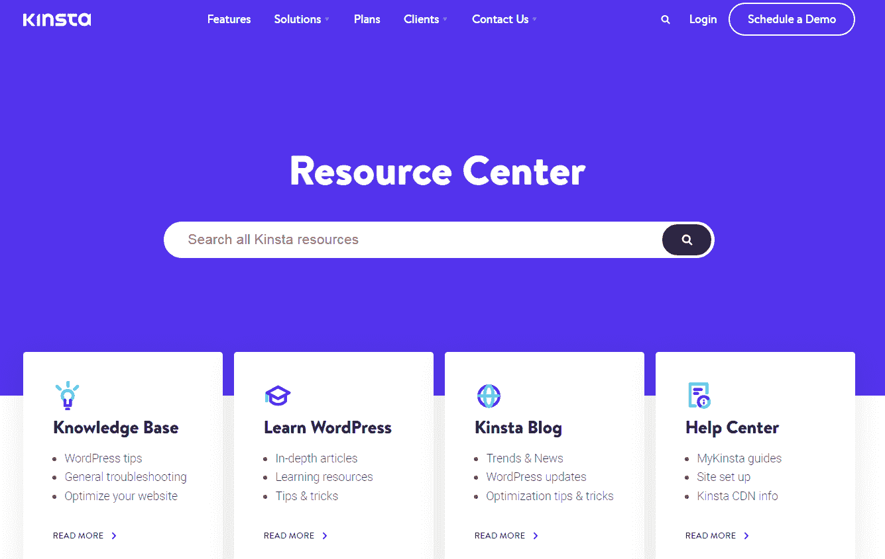
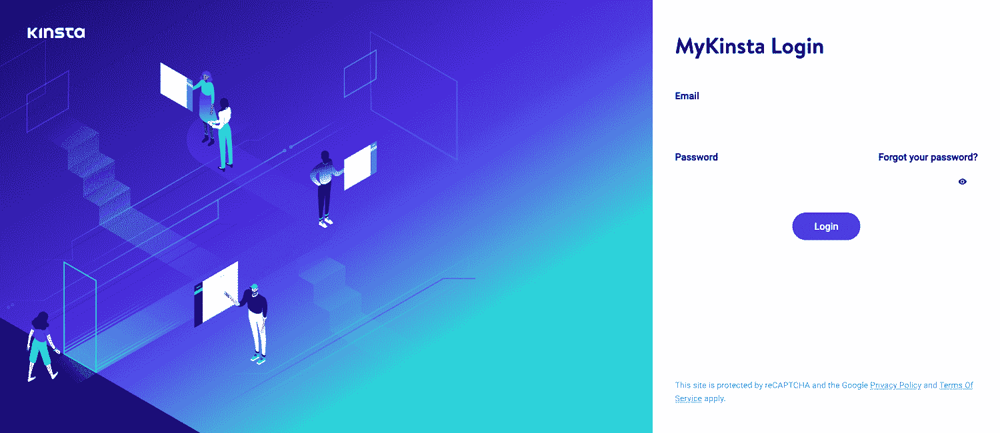

# 好的虚拟主机支持的三大特点

> 原文：<https://kinsta.com/blog/web-hosting-support/>

虚拟主机支持是人们在考虑主机提供商时经常忽略的一个重要因素。

告诉你在优秀的虚拟主机服务中寻找什么的文章通常会包括一个项目，告诉你寻找优秀的客户服务或技术支持。

但是拥有强大的虚拟主机支持到底意味着什么呢？这篇文章将帮助你回答这个问题。

开始吧！

## 什么是虚拟主机支持？

虚拟主机支持的主要目标是确保客户的虚拟主机计划顺利运行。虚拟主机支持是一个在线帮助台，当客户遇到困难和故障时，它会提供帮助。

这些任务可能包括:

*   [故障排除](https://kinsta.com/blog/wordpress-errors/) [WordPress 错误](https://kinsta.com/blog/wordpress-errors/)和服务器问题
*   [创建备份](https://kinsta.com/blog/wordpress-backup-plugins/)
*   [网站基本维护](https://kinsta.com/blog/http-status-codes/)
*   网站迁移
*   让客户了解服务器和软件设置以及如何更改它们

[What exactly does it mean to have great web hosting support? 🤔 Learn more in this guide ⬇️Click to Tweet](https://twitter.com/intent/tweet?url=https%3A%2F%2Fkinsta.com%2Fblog%2Fweb-hosting-support%2F&via=kinsta&text=What+exactly+does+it+mean+to+have+great+web+hosting+support%3F+%F0%9F%A4%94+Learn+more+in+this+guide+%E2%AC%87%EF%B8%8F&hashtags=WordPressHosting%2CTechSupport)

虚拟主机支持可以帮助客户处理一般管理任务，如处理退款和退款保证。支持代理也可以协助一般查询或升级。

虚拟主机支持代理应该同时具备技术和[客户服务技能](https://www.qualtrics.com/experience-management/customer/service-tips-skills/)。

对于技术支持代理来说，仅仅知道常见的虚拟主机问题是不够的。代理可能拥有一流的技术技能，但如果他们不能用更简单的术语解释问题，或者如果客户不明白如何通过支持渠道解决问题，他们两人都会感到失望。

同时，提供专业化或高技术解决方案的虚拟主机公司不能只雇佣任何客户服务代理。虽然我们相信任何人都可以学到任何东西，但让新代理加入高度技术性的帐户也可能会让双方都感到沮丧。

## 如何确定虚拟主机支持的质量

Kinsta offers excellent web hosting support through several channels.

现在你知道了什么是虚拟主机支持，它包括什么，我们将向你展示优秀的技术支持和最低限度的区别。

### 1.全天候可用

你不能控制中断或问题何时出现，最好的虚拟主机提供商明白这一点。

*   最低限度:虚拟主机支持团队全年无休。

*   出色的支持:一个强大的支持团队很容易联系到。没有漫长的等待时间，即使你没有订阅专用服务器或 VPS 主机，也总有一个代理可以帮助你。等待时间短也是一个很好的迹象，表明主机提供商不会遇到很多问题。

### 2.多重联系渠道

随着通信技术的发展，企业没有借口不可用。常见的支持渠道包括电子邮件、实时聊天、聊天机器人、社交媒体和电话等。

*   最起码:有一个虚拟主机支持团队可以帮助解决客户的问题。请记住，[免费的](https://kinsta.com/blog/free-wordpress-hosting/) [托管计划](https://kinsta.com/blog/free-wordpress-hosting/)往往甚至不提供支持。

*   **出色的支持:**除了代理之外，当客户喜欢自己解决问题时，拥有文档、教程和知识库也很有帮助。 [Salesforce](https://www.salesforce.com/content/blogs/us/en/2017/07/customer-service-for-millennials.html) 发现 89%的千禧一代客户更愿意自己寻找解决方案。如果他们找不到他们要找的东西，他们就会联系客户支持。

### 3.熟练的技术支持

技术支持团队应该能够指导您排除错误。如果做不到这一点，意味着虚拟主机公司更注重价格竞争或省钱，而不是提供良好的服务。

*   **最低限度:**托管团队可以解决您的技术问题，并有能力为网站迁移等服务提供标准协助。

*   **优秀的支持:**一个好的虚拟主机支持团队是高效的。他们可以瞬间解决问题。当团队花一整天来解决问题时，随时可用是没有用的，客户不能也不会等那么久。

最好的虚拟主机公司明白他们的客户来自世界各地，所以他们也提供多语言支持。提供这项额外服务有助于[网站的可访问性](https://kinsta.com/blog/wordpress-accessibility/)和包容性。

如果你曾经使用过你的主机的虚拟主机支持服务，你可以使用我们的列表来检查他们是否提供了满意的服务。

如果技术支持人员让你失望了，他们很难联系上，或者公司提供的客户支持少于 24/7/365，那么是时候找一个新的虚拟主机提供商了。

## 虚拟主机支持渠道

Kinsta’s resource center.

拥有优秀的虚拟主机支持的公司为他们的客户提供不同的渠道来联系他们。

### 1.证明文件

文档在开发和网站托管中起着重要的作用。它有助于读者和客户理解:

*   虚拟主机如何工作
*   遇到的常见问题
*   为什么会出现这些问题
*   如何解决这些问题

文档通常以下列形式编写:

## 注册订阅时事通讯

### 想知道我们是怎么让流量增长超过 1000%的吗？

加入 20，000 多名获得我们每周时事通讯和内部消息的人的行列吧！

[Subscribe Now](#newsletter)

*   知识库
*   博客帖子
*   [白皮书](https://www.investopedia.com/terms/w/whitepaper.asp)
*   [电子书](https://kinsta.com/ebooks/)
*   [案例分析](https://kinsta.com/clients/)

因为技术经常变化，顶级虚拟主机公司也保持他们的文档是最新的。

### 2.教程

教程类似于文档，但通常以视频形式出现。教程也可以写，但是我们用这个术语来指视频格式。

教程是需要查看逐步故障排除指南的学习者的最佳格式。最棒的是，用户可以重播这些视频。

视频可以是:

*   [网络研讨会](https://kinsta.com/webinars/)
*   上传到 [YouTube](https://www.youtube.com/c/Kinsta)
*   公司的仓库
*   [会员网站](https://kinsta.com/wordpress-membership-website-hosting/)的一部分

### 3.在线聊天

近年来，实时聊天支持已经成为一种更加常见的支持渠道，41%的人更喜欢实时聊天，而不是其他任何支持媒介。

主要原因包括:

*   [更快的响应时间](https://blog.playvox.com/8-benchmarks-to-improve-your-live-chat-metrics)
*   几乎没有等待时间
*   便利

一些实时聊天解决方案也可以在需要时升级为语音或视频。除了受到大多数客户的青睐，企业也从实时聊天中受益。这些福利包括:

*   降低成本
*   [更高的客户满意度](https://econsultancy.com/blog/63867-consumers-prefer-live-chat-for-customer-service-stats/)
*   增加客户忠诚度、销售额和收入

有几种方法可以将实时聊天添加到您的网站。你可以注册一个实时聊天应用或者安装一个 [WordPress 实时聊天](https://kinsta.com/blog/wordpress-live-chat-plugin/) [插件](https://kinsta.com/blog/wordpress-live-chat-plugin/)。

Struggling with downtime and WordPress problems? Kinsta is the hosting solution designed to save you time! [Check out our features](https://kinsta.com/features/)

对于常见问题(FAQ)和客户服务查询，您还可以[将聊天机器人](https://kinsta.com/blog/chatbot/)添加到您的实时聊天功能中。

改善实时聊天支持的客户体验的另一种方法是确保您的聊天允许上传图像，以便用户可以共享屏幕截图。这使得代理更容易诊断和解决用户的问题。

### 4.电话

大多数人认为电话支持是公司提供的最常见的客户服务渠道。这是最受欢迎的支持方法之一(尤其是对那些不太懂技术的人来说)，因为它简单。它降低了浏览网站或客户门户的需求，用户可以在与代理交谈的同时解决他们的问题。

电话支持也为支持服务提供了重要的人力因素。代理和客户可以进行自然的对话，这比试图通过文本解决问题提供了更多的上下文。

然而，并不是所有的企业都推荐电话支持。这对于一些行业来说是有意义的——例如危机或紧急热线，这需要紧急和人为因素——但它通常不是最有效的虚拟主机支持渠道。

有一些技术可以让虚拟主机公司更容易、更快地解决客户的问题。例如，通过您的托管帐户联系支持，代理可以立即获取您的信息，而电话支持则需要您通过漫长的验证过程。

当您可以从您的托管帐户访问支持时，您还可以共享您遇到的问题的屏幕截图或视频，以便支持团队快速解决这些问题。

### 5.电子邮件

虽然电话和实时聊天支持允许客户与代理实时沟通，但电子邮件支持更多的是一种延迟渠道。尽管它的延迟性质，公司认为它是他们的支持产品中的一个必须的，因为它提供了普遍的影响——几乎每个人都有一个电子邮件帐户并打开它。

电子邮件支持最适合对时间不敏感的投诉(例如，不需要立即解决的投诉)。在发送电子邮件支持时，请记住大多数客户更喜欢随意的语气，除非你在发送坏消息(这需要正式)。

## Kinsta 如何击败其他虚拟主机支持团队

Kinsta 是一家相信虚拟主机支持重要性的虚拟主机公司。这就是为什么我们要超越这一点，为我们的客户提供服务。

除了 24/7 的可用性，我们还为自己的虚拟主机支持团队感到自豪，该团队由**一级支持代理**组成。代替[客户支持](https://kinsta.com/kinsta-support/)，你得到真正的 IT 技术人员和网络开发人员来解决你的问题。

我们还为我们的快速响应时间感到自豪——我们在 2019 年的平均门票响应时间是 [1 分 19 秒](https://kinsta.com/blog/wordpress-support/#kinsta-support)。

当您注册 Kinsta 计划时，您可以访问以下虚拟主机支持服务:

*   [**免费网站迁移**](https://kinsta.com/wordpress-migration/)
*   **调查** [**服务器错误信息**](https://kinsta.com/blog/http-status-codes/)
*   **解决问题用** [**外发事务性邮件**](https://kinsta.com/blog/wordpress-not-sending-email/)
*   **安全监控，包括 DDoS 防护**
***   [**防流量浪涌**](https://kinsta.com/help/scalable-cloud-hosting/)*   [**正常运行时间**](https://kinsta.com/advanced-features/) [**检查**](https://kinsta.com/advanced-features/) **:** 我们每两分钟检查一次您的站点是否在线。*   [**定期备份**](https://kinsta.com/help/wordpress-backups/) **:** 从 MyKinsta 控制面板访问您的备份。你也可以购买外部或[每小时备份](https://kinsta.com/feature-updates/hourly-backups/)附加组件。**

 **所有这些服务都包含在 Kinsta 的[支持范围](https://kinsta.com/help/scope-of-support/)中。

要访问我们卓越的虚拟主机支持服务，只需登录您的 MyKinsta 帐户。我们[不提供电话支持](https://kinsta.com/help/phone-support/)，但是我们的代理可以全天候在线聊天。

MyKinsta homepage.

Kinsta 用户也可以访问我们的 [Learn WordPress](https://kinsta.com/learn/) 资源和[知识库](https://kinsta.com/knowledgebase/)来帮助你从你的托管计划中获得最大收益。

[Looking for a new hosting provider? 👀 Read this first ⬇️Click to Tweet](https://twitter.com/intent/tweet?url=https%3A%2F%2Fkinsta.com%2Fblog%2Fweb-hosting-support%2F&via=kinsta&text=Looking+for+a+new+hosting+provider%3F+%F0%9F%91%80+Read+this+first+%E2%AC%87%EF%B8%8F&hashtags=WordPress%2CCustomerSupport)

## 摘要

当用户寻找虚拟主机解决方案时，虚拟主机支持经常被忽视。然而，这是一个很好的指标，多少虚拟主机提供商重视你。提供出色的 WordPress 支持的公司表明，他们希望通过让用户的生活变得更容易来让技术变得可及——尤其是那些不懂技术的人。

当你研究一家公司的虚拟主机支持时，记得要了解:

1.  有效性
2.  多重联系渠道
3.  技术专长

Kinsta 提供 WordPress 优化的云主机，我们可以帮助你为你的大型或小型企业制作完美的网站。

今天就注册一个 Kinsta [应用](https://kinsta.com/application-hosting/)、[数据库](https://kinsta.com/database-hosting/)，或者[托管 WordPress 主机](https://kinsta.com/wordpress-hosting/)。

你过去的虚拟主机支持经历对你或你的企业有什么影响？请在评论中告诉我们。

* * *

让你所有的[应用程序](https://kinsta.com/application-hosting/)、[数据库](https://kinsta.com/database-hosting/)和 [WordPress 网站](https://kinsta.com/wordpress-hosting/)在线并在一个屋檐下。我们功能丰富的高性能云平台包括:

*   在 MyKinsta 仪表盘中轻松设置和管理
*   24/7 专家支持
*   最好的谷歌云平台硬件和网络，由 Kubernetes 提供最大的可扩展性
*   面向速度和安全性的企业级 Cloudflare 集成
*   全球受众覆盖全球多达 35 个数据中心和 275 多个 pop

在第一个月使用托管的[应用程序或托管](https://kinsta.com/application-hosting/)的[数据库，您可以享受 20 美元的优惠，亲自测试一下。探索我们的](https://kinsta.com/database-hosting/)[计划](https://kinsta.com/plans/)或[与销售人员交谈](https://kinsta.com/contact-us/)以找到最适合您的方式。**