# 如何从 Webflow 迁移到 WordPress(6 步)

> 原文：<https://kinsta.com/blog/webflow-to-wordpress/>

Webflow 是一个用户友好的平台，通过直观的可视化编辑器帮助用户创建专业的网站。然而，如果你的网站已经存在一段时间了，你可能会寻找一个更加灵活和先进的解决方案，比如 [WordPress](https://kinsta.com/knowledgebase/what-is-wordpress/) 。

从 Webflow 迁移到 WordPress 是一项艰巨的任务，尤其是当你的网站包含大量内容的时候。然而，这个过程比你想象的要简单得多，你可以很快建立并运行你的新 WordPress 站点。

在这篇文章中，我们将从简要讨论你为什么想从 Webflow 转移到 WordPress 开始。然后，我们将带您完成整个迁移过程。

我们开始吧！

T3】

### 查看我们的视频指南[从 Webflow 迁移到 WordPress](https://www.youtube.com/watch?v=MaJgE1rQsr4)

## 为什么你应该考虑从 Webflow 转移到 WordPress

像大多数一体化网站解决方案一样，Webflow 使您能够轻松地构建和启动网站。它既是网站建设者又是主机提供商。虽然这听起来很方便，但可能也有点限制。由于网站的每个方面都由相同的服务管理，所以在添加新功能或优化内容时，您可能会感到受到限制。

像 WordPress 这样的开源内容管理系统(CMS)给了你更多的自由去定制。虽然 Webflow 拥有广泛的应用和小工具，但它无法与 WordPress 提供的丰富插件相提并论。

> Kinsta 把我宠坏了，所以我现在要求每个供应商都提供这样的服务。我们还试图通过我们的 SaaS 工具支持达到这一水平。
> 
> <footer class="wp-block-kinsta-client-quote__footer">
> 
> 
> 
> <cite class="wp-block-kinsta-client-quote__cite">Suganthan Mohanadasan from @Suganthanmn</cite></footer>

[View plans](https://kinsta.com/plans/)

有了 WordPress，你也可以控制你的虚拟主机和预算。你可以货比三家，为你的网站选择合适的解决方案。此外，WordPress 软件是免费的，它的大部分可用插件也是免费的。所以从 Webflow 迁移到 WordPress 也可以帮助你减少网站开支。

## 从 Webflow 迁移到 WordPress 之前需要考虑的事情

无论你经营的是博客还是电子商务商店，[迁移网站](https://kinsta.com/blog/migrate-wordpress-site/)似乎是一项困难而耗时的任务。然而，这个过程并不需要那么长时间。此外，如果您有合适的工具，也可以自己完成迁移。

然而，在你开始之前，你需要做一些事情。让我们来看看 Webflow 向 WordPress 迁移的一些必要准备。

### 寻找 WordPress 网络主机

正如我们之前提到的，使用 WordPress 最好的事情之一就是选择你想要的任何一个网络主机。因此，您可以选择符合您的需求和预算的服务。

虽然选择便宜的托管服务很有诱惑力，但你可能会考虑让 T2 管理的 WordPress 托管服务为你的网站服务。这项服务通常比其他选择更贵。然而，它可以帮助你[提升你的网站性能](https://kinsta.com/ebooks/wordpress/managed-wordpress-hosting/)并保证你的内容安全。

在 Kinsta，我们提供一系列托管计划来适应不同的预算。我们的托管 WordPress 托管服务具有丰富的功能，包括:

*   快速简单的 WordPress 安装
*   自动每日备份
*   黑客和恶意软件删除
*   全天候支持
*   免费的 SSL 证书

我们还提供从所有网络主机进行无限制免费迁移的服务，让您的迁移毫无压力。此外，你可以使用我们用户友好的开发工具 [DevKinsta](https://kinsta.com/devkinsta/) ，来设计你的第一个 WordPress 网站。

理想情况下，在开始迁移之前，您应该已经设置好了新的托管帐户。这种准备将有助于使过程更快一点。

### 备份您的数据

需要注意的是，在迁移过程中，你实际上并没有把你的内容从 Webflow 转移到 WordPress。你只需下载一份拷贝到你的电脑上，然后上传到 WordPress。因此，您的 Webflow 站点将保持原样，因此没有必要备份您的内容。

但是，您仍然可以选择执行备份，以防出现问题。在 Webflow 上保存备份，只需要按住**Command+Shift+S**(Mac 上)或者**Control+Shift+S**(Windows 上):

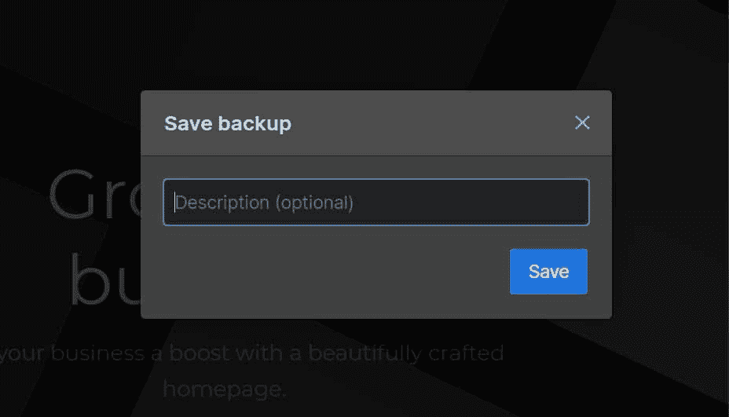

Saving a backup on Webflow

Webflow 将要求您输入备份描述。准备好后，点击**保存**。然后，您可以进入**设置** **>备份**以确保您的最新副本已保存。

## 如何从 Webflow 迁移到 WordPress(6 步)

现在你已经设置了你的托管账户并备份了你的数据，是时候将你的内容从 Webflow 转移到 WordPress 了。在本教程中，我们将引导您完成整个迁移过程，帮助您成功启动新网站。

### 步骤 1:设置 WordPress

第一步是设置 WordPress。大多数虚拟主机都提供一键式 WordPress 安装程序，你可以从你的主机账户访问。这项功能通常附带一份安装指南，帮助您在几分钟内完成安装过程。

或者，您可以从[WordPress.org](https://wordpress.org/download/)手动下载软件:

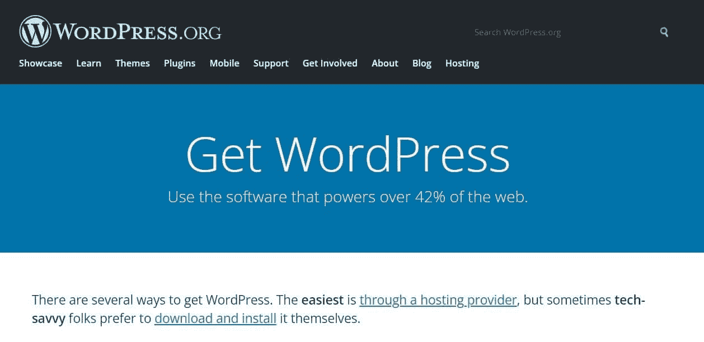

WordPress.org homepage

然后你需要[上传你的 WordPress 文件](https://kinsta.com/knowledgebase/manually-install-wordpress/)到你的服务器。该过程可能需要几分钟。一旦准备好了，你就可以继续将 Webflow 导出到 WordPress。

### 步骤 2:从 Webflow 导出您的内容

现在你已经设置好了 WordPress，你可以为你的新网站准备内容了。幸运的是，Webflow 使得导出数据变得非常容易。

但是，您不能全部导出。可从 Webflow 下载的内容包括网页、博客文章、文本、嵌入块、图库页面和图像。

要导出您的内容，请转到您的 Webflow 设计器并单击 **CMS Collections** 面板。在这里，您可以看到 Webflow 服务器上的所有文件和数据:

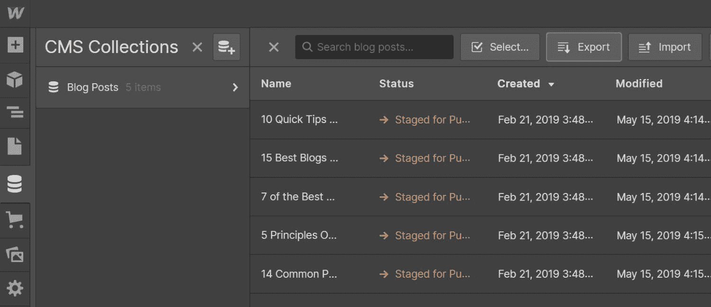

Collections panel in Webflow

选择您想要下载的收藏(例如博客文章)并点击屏幕顶部附近的**导出**按钮。内容将以. csv 文件的形式下载到您的计算机上。您可以对想要导出的任何其他收藏重复此过程。

### 步骤 3:将你的内容导入 WordPress

下一步是将你的 Webflow 内容上传到 WordPress。CMS 附带了一个导入工具，使您能够上传 XML 格式的文件。不幸的是，Webflow 只允许您下载 CSV 文件形式的内容。

因此，你需要使用一个[迁移插件](https://kinsta.com/blog/wordpress-migration-plugins/)将 CSV 文件导入 WordPress。我们推荐 [WP 全部进口](https://wordpress.org/plugins/wp-all-import/):

## 注册订阅时事通讯

### 想知道我们是怎么让流量增长超过 1000%的吗？

加入 20，000 多名获得我们每周时事通讯和内部消息的人的行列吧！

[Subscribe Now](#newsletter)

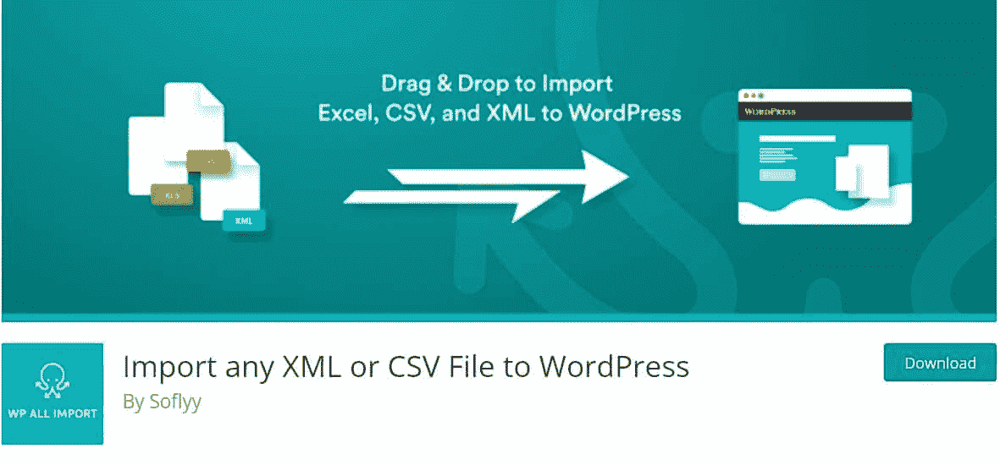

WP All Import

要将插件添加到你的网站，在你的 WordPress 仪表盘中进入**插件>添加新插件**，在搜索栏中寻找该工具。

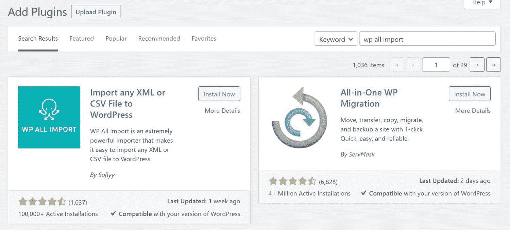

Search for WP All Import

然后，点击**现在安装**按钮，接着**激活**。一旦插件被激活，导航到**所有导入>新导入:**

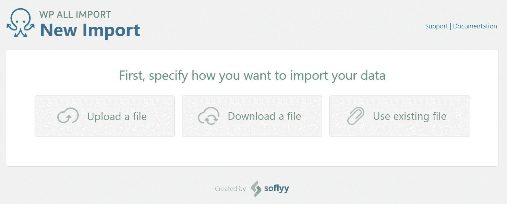

Install and activate WP All Import

点击**上传文件**选项，然后选择您之前下载的 CSV 文件。该插件将引导您完成导入过程。

对于本教程，我们将从 Webflow 导入博客文章:

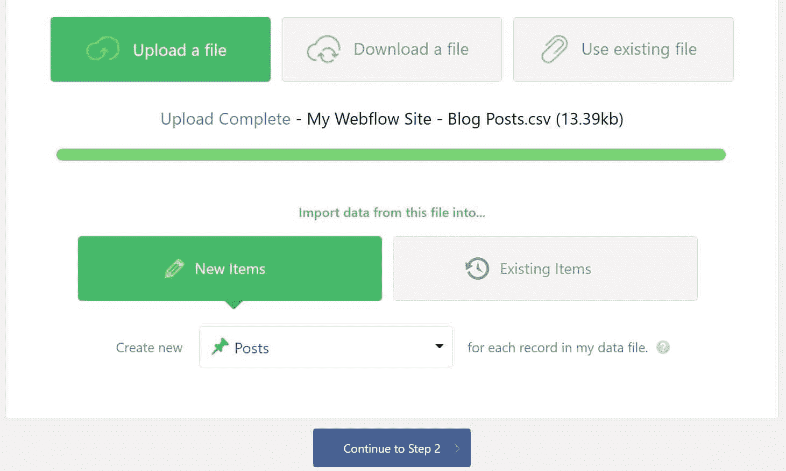

Importing Webflow blog posts

该插件将要求您使用拖放界面将元素拖动到正确的字段中:

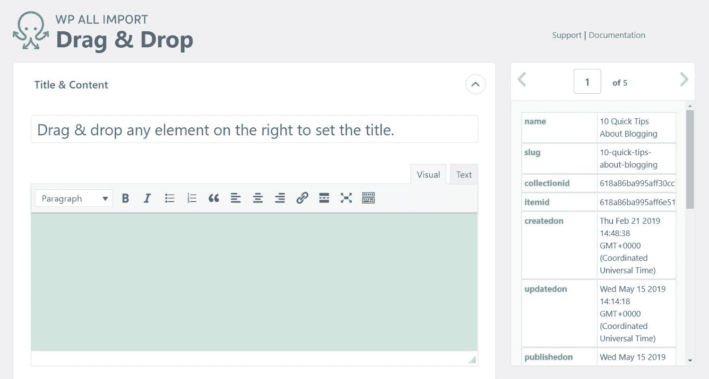

Drag and drop interface in WP All Import

例如，你需要将文章的**名**(从右边)拖到标题字段，将**正文**拖到相关区域。您还将看到用于添加分类(如类别和标签)和配置其他设置(如帖子状态)的选项:

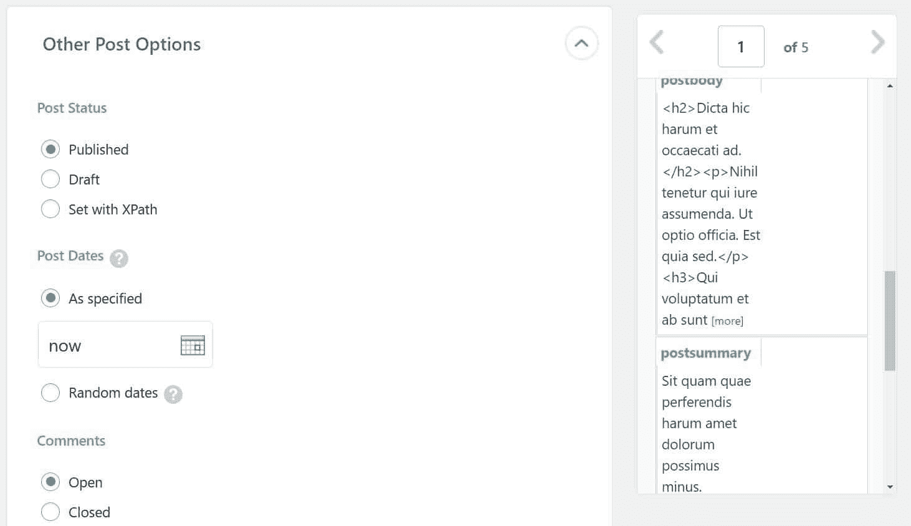

Configure post settings

请注意，这些设置将应用于您文件中的每个帖子。因此，您不必为导入的每个帖子重复这个过程。

接下来，将要求您为文件中的文章定义一个惟一的标识符。您可以点击**自动检测**按钮生成一个 ID:

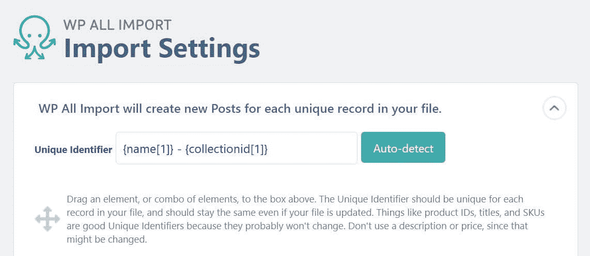

Generate your unique identifier

最后，您需要点击**确认&运行导入**按钮来完成流程:

与我们世界一流的支持团队一起体验卓越的 WordPress 托管支持！与支持我们财富 500 强客户的同一个团队聊天。[查看我们的计划](https://kinsta.com/plans/?in-article-cta)

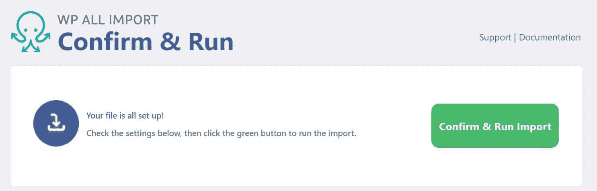

Confirm and Run

当导入过程完成时，插件会通知您:

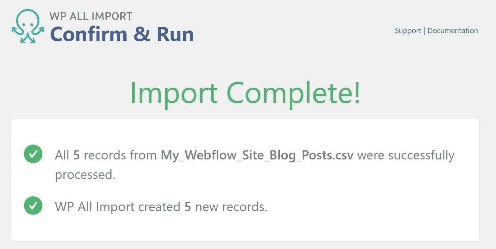

Import complete message in WP All Import

一旦准备好了，你就可以通过导航到仪表盘中的**帖子**或**页面**来检查你的内容。您还需要为下载的任何其他 Webflow 文件重复导入过程。

注意，WordPress 不支持从 Webflow 等其他平台自动导入图片。因此，你需要手动添加图片或者使用插件，比如[自动上传图片。](https://wordpress.org/plugins/auto-upload-images/)

Auto Upload Images

这个插件会在你的文章和页面中寻找图片的网址。然后它会下载这些图片并上传到 WordPress，替换掉[URL](https://kinsta.com/knowledgebase/what-is-a-url/)。
T3】

### 步骤 4:选择一个 WordPress 主题

遗憾的是，您不能将您的 Webflow 站点的设计转移到 WordPress。然而，[流行 CMS](https://kinsta.com/blog/wordpress-statistics/) 提供了数以千计的[美丽主题](https://kinsta.com/best-wordpress-themes/)供选择。

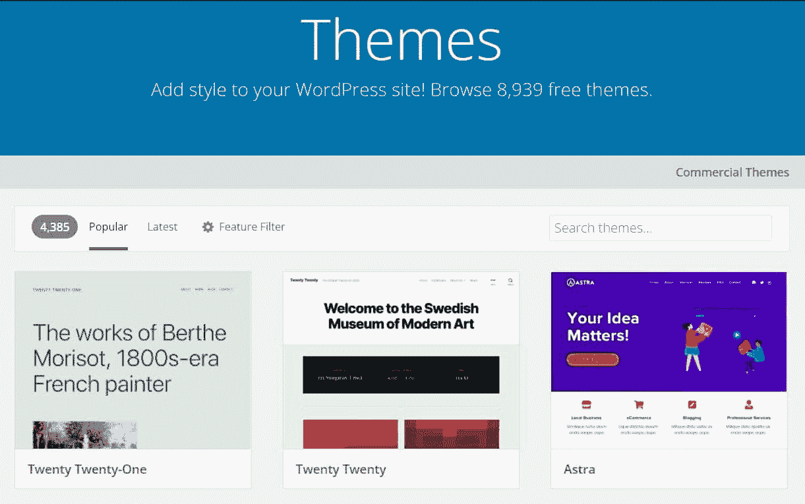

Choose a WordPress theme

WordPress 主题是可定制的，所以你可以修改它们来满足你的需求。此外，大多数都是免费的，尽管一些[付费主题](https://kinsta.com/blog/wordpress-free-vs-paid-themes/)也可以相当实惠。

我们建议花一些时间[定制你的 WordPress 主题](https://kinsta.com/blog/how-to-customize-wordpress-theme/)并尝试不同的选项。然而，你会想要选择一个[响应式设计](https://kinsta.com/blog/responsive-web-design/)，因为这将帮助你确保你的内容在所有设备上看起来都很棒。

### 步骤 5:配置你的 WordPress 永久链接

接下来，你需要配置你的 [WordPress 永久链接](https://kinsta.com/blog/wordpress-permalinks/)。它们定义了网站 URL 的结构。

要访问你的永久链接，在你的 WordPress 仪表盘中进入**设置>永久链接**:

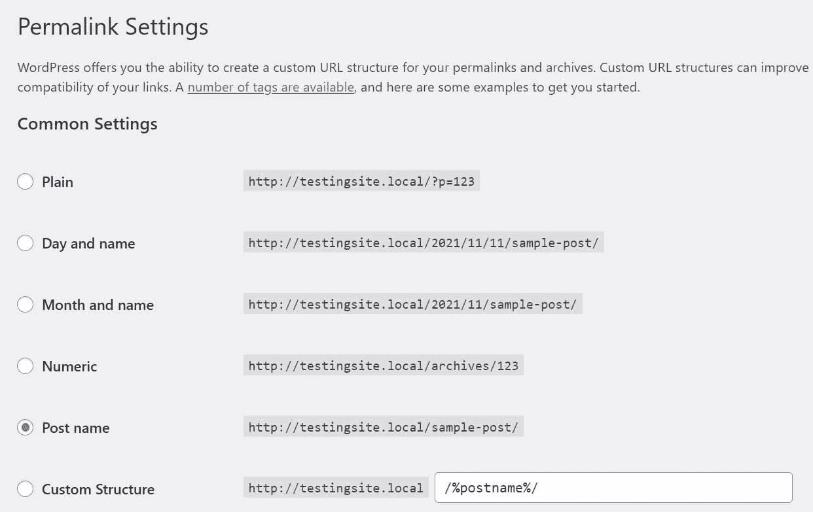

Permalink settings in WordPress

如你所见，你有几个选择。我们建议您选择**职务** **姓名**。这样，您的 URL 将由您的域名和您为特定页面或帖子设置的 slug 组成。拥有简洁明了的网址有利于你网站的搜索引擎优化(SEO)。

准备好后，点击**保存更改**。现在，您可以进入最后一步了。

### 第六步:将你的域名指向 WordPress

虽然你可能已经将你的网站导入了 WordPress，但是你的域名(例如 mysite.com)仍然指向 Webflow 的[域名服务器](https://kinsta.com/knowledgebase/what-is-a-nameserver/)。如果您想要保留同一个域，您需要更新 DNS 设置，以便您的域指向新 web 主机的服务器。

你可以在你的主机账户中找到你的主机的域名服务器。它们通常看起来像这样:

*   ns1.yourwebhost.com
*   ns2.yourwebhost.com
*   ns3.yourwebhost.com

如果您在创建 Webflow 站点时使用了域名注册商，您需要登录您的帐户来管理 DNS 设置。你的新虚拟主机甚至可以让你通过它的控制面板来管理你的域名。如果你是 Kinsta 的客户，你可以用 MyKinsta 的[将你的域名](https://kinsta.com/knowledgebase/add-domain/)指向你的新网站。

现在，当访问者在谷歌中输入你的网址，他们将被引导到你的新网站。我们建议你在 WordPress 网站准备好上线后完成这一步。

[从 Webflow ➡️ WordPress 开始，只需几个简单的步骤。](https://twitter.com/intent/tweet?url=https%3A%2F%2Fkinsta.com%2Fblog%2Fwebflow-to-wordpress%2F&via=kinsta&text=Go+from+Webflow+%E2%9E%A1%EF%B8%8F+WordPress%2C+in+just+a+few+simple+steps.&hashtags=Webflow%2CWordPress)

## 摘要

Webflow 是一个一体化的[网站构建器](https://kinsta.com/blog/wp-page-builder/)，可以轻松启动和管理您的网站。然而，随着你的网站的成长，你可能需要转换到一个更灵活、更强大的平台，比如 WordPress。

正如我们所见，从 Webflow 迁移到 WordPress 可能是一个平稳的过程。然而，为你的新网站选择合适的主机提供商是很重要的。你还需要选择一个响应的 WordPress 主题，优化你的永久链接，并更新你的域名设置，这样用户就可以被引导到你的新网站。

关于从 Webflow 迁移到 WordPress，你有什么问题吗？请在下面的评论区告诉我们！

* * *

让你所有的[应用程序](https://kinsta.com/application-hosting/)、[数据库](https://kinsta.com/database-hosting/)和 [WordPress 网站](https://kinsta.com/wordpress-hosting/)在线并在一个屋檐下。我们功能丰富的高性能云平台包括:

*   在 MyKinsta 仪表盘中轻松设置和管理
*   24/7 专家支持
*   最好的谷歌云平台硬件和网络，由 Kubernetes 提供最大的可扩展性
*   面向速度和安全性的企业级 Cloudflare 集成
*   全球受众覆盖全球多达 35 个数据中心和 275 多个 pop

在第一个月使用托管的[应用程序或托管](https://kinsta.com/application-hosting/)的[数据库，您可以享受 20 美元的优惠，亲自测试一下。探索我们的](https://kinsta.com/database-hosting/)[计划](https://kinsta.com/plans/)或[与销售人员交谈](https://kinsta.com/contact-us/)以找到最适合您的方式。