# 2022 年如何选择最好的网站设计软件

> 原文：<https://kinsta.com/blog/website-design-software/>

目前有超过 1，865，000 个网站，其中超过 75%是“实时的”(即你可以在网上找到它们)。这些直播网站中有许多是经过策划、概念化和精心设计的，以吸引他们的观众。

但是如果你不会编码会怎么样呢？还能设计出好的网站吗？

简单的回答就是一个网站设计软件，可以让你在没有编码或者设计经验的情况下创建一个网站。

然而，选择正确的软件可能是棘手的，因为市场上有几十种选择。

在这篇文章中，我们将比较目前可用的顶级网站设计软件选项，并帮助您选择一种工具，将您的网站提升到一个新的水平。

T3】

## 在网站设计软件中寻找什么

在我们开始谈论最好的网站建设选项之前，让我们先来谈谈什么是网页设计软件，它是为谁服务的，以及如何选择最适合你的工具。

网站设计软件是人们用来设计一个网站而不用快速编码的工具。这个软件对于任何需要一个网站但没有丰富的网络开发或编码技能的人来说都是一个很好的选择。

网页设计软件非常适合:

> 需要在这里大声喊出来。Kinsta 太神奇了，我用它做我的个人网站。支持是迅速和杰出的，他们的服务器是 WordPress 最快的。
> 
> <footer class="wp-block-kinsta-client-quote__footer">
> 
> 
> 
> <cite class="wp-block-kinsta-client-quote__cite">Phillip Stemann</cite></footer>

[View plans](https://kinsta.com/plans/)

*   想要建立网上业务的当地餐馆和咖啡馆
*   [电子商务商店](https://kinsta.com/blog/ecommerce-platforms/)希望有现成的解决方案来帮助他们销售产品，而无需从头开始构建产品
*   希望[建立投资组合](https://kinsta.com/blog/portfolio-website/)的承包商(即平面设计师、文案等。)
*   需要一个简单网站的小型企业
*   拥有小型设计部门或不需要定制网站的大型公司
*   爱好者想要在线分享他们的激情，而不投资建立一个定制的网站

看看这个按行业分类的 2021-2022 年[最佳网站设计](https://www.designrush.com/best-designs/websites)范例列表。

那么网页设计工具有什么好处呢？

[还能设计出漂亮的网站吗...没有代码？👩‍💻答案是肯定的，借助这些网站设计工具！💪 点击推文](https://twitter.com/intent/tweet?url=https%3A%2F%2Fkinsta.com%2Fblog%2Fwebsite-design-software%2F&via=kinsta&text=Can+you+still+design+a+beautiful+website...+without+code%3F+%F0%9F%91%A9%E2%80%8D%F0%9F%92%BBThe+answer+is+yes%2C+with+help+from+these+website+design+tools%21+%F0%9F%92%AA&hashtags=WebDesign%2CWebDesigner)

### 你为什么应该使用网页设计软件？

网页设计工具使用“拖放”格式，你可以在其中选择小部件(如文本框、图片等)。)并将其放到您的网页上。这允许您逐个部件地构建自定义网站。

自然，以这种方式建立网站有很多好处，因为它:

*   允许您快速创建网站
*   它帮助没有编码经验的人建立一个专业的网站
*   自动化设计过程的技术部分
*   确保您的网站能够在受众使用的多种设备上运行(包括移动设备)
*   包括模板，您可以用最少的图形设计技巧创建漂亮的网站
*   允许你廉价或免费建立一个网站

虽然大多数网页设计工具都有这些好处，但是还有几种不同类型的工具可供选择。让我们现在覆盖那些。

## 网页设计软件的类型

虽然我们会在一分钟内引导你选择最适合你的网站设计工具，但让我们先来讨论一下网页设计软件选项之间的细微差别。

### WordPress 网页设计软件

WordPress 网站设计软件与 WordPress 网站一起工作。

如果你以前有一个 WordPress 网站，你可能听说过这些。最受欢迎的例子包括 Divi、Elementor 和 Beaver Builder。

### 无代码网页设计软件

无代码网页设计工具让你不用编码就能建立一个网站。

这些工具通常包括预先格式化的网站主题可供选择，因此您可以根据您的受众简单地定制您的网站。两个最受欢迎的选项包括 [Wix](https://kinsta.com/blog/squarespace-alternatives/#3-wix) 和 [Webflow](https://kinsta.com/blog/webflow-vs-wordpress/) 。

### 电子商务网页设计软件

电子商务网页设计软件帮助你建立和经营一个电子商务商店。

这些平台在一个中央平台中包括网站设计和商店管理(尽管它们通常与自托管网站集成在一起)。两个最著名的例子包括 Shopify 和 SquareSpace。

### 开源网页设计软件

开源网站设计工具让你可以编辑和修改网站的源代码。这些选项非常适合自托管网站，因为它们允许您将网站导出到网站托管者。最受欢迎的例子包括 Startup4 或 TemplateToaster。

## 2022 年如何选择最好的网页设计软件

2022 年有几十个网站设计师可供选择，那么如何挑选最适合自己的网站设计工具呢？

在这一部分，我们将向你展示如何通过三个步骤选择最适合你的。

### 第一步。了解什么是好的网页设计软件

好的网站设计通常满足五个关键标准:

#### 1.它是开源的

开源软件让你可以访问你网站的源代码。虽然您现在可能不想定制您的代码，但是当您选择开源软件时，您总是有这个选择。

#### 2.这是免费或低价的

“一分钱一分货”这句话对于网页设计软件来说是不正确的。虽然你可以在一个伟大的项目上花大价钱，但是有几十个低成本的设计软件选项，对大多数网站来说也是一样的。

#### 3.它可以导出到其他程序

虽然您可能喜欢您今天选择的设计工具，但它可能无法满足您未来的需求。

为了让你的网站经得起未来的考验，请确保你选择了一个允许你导出网站的设计工具。如果你更换主机，这将使你不用重新设计你的网站。

#### 4.它不需要编码

虽然许多顶级的网页设计工具可以起到代码编辑器的作用，但是最好的工具并不需要它。

#### 5.它有反应

网页设计工具帮助你[建立一个响应迅速的网站](https://kinsta.com/blog/responsive-web-design/)。

### 第二步。确定你的需求

接下来，你需要弄清楚你需要一个网站做什么。确定您的需求将极大地影响哪个软件适合您，因为每个工具都提供不同的网站功能。

考虑您的需求，问自己以下问题:

*   为什么人们会访问我的网站？
*   我希望人们从我的网站上得到什么？
*   我的网站有什么用途？

然后考虑你需要的特定网站功能来满足你的观众的需求。以下是可供您考虑的潜在功能列表:

*   搜索栏
*   证明书
*   在线聊天
*   [电子商务商店](https://kinsta.com/blog/ecommerce-platforms/)功能
*   电子邮件简讯弹出窗口
*   网站页脚功能(如社交媒体图标和导航标签)
*   评论空间
*   您企业的内置地图
*   “联系我们”表格
*   博客
*   博客搜索功能
*   发表评论
*   网站分析
*   内置搜索引擎优化(一个搜索引擎优化工具)
*   验证码/反垃圾邮件功能
*   一个 [SSL 证书](https://kinsta.com/blog/types-of-ssl-certificates/)
*   媒体压缩
*   惰性装载
*   一个[内容管理系统](https://kinsta.com/blog/cms-software/)

一旦你列出了你需要的特性，就该权衡你的选择了。

### 第三步。权衡你的选择

在这一步，你需要收集一份潜在网站建设者的名单。对于每个选项，您需要考虑四个关键因素:

#### 1.价格

正如我们在第一步中提到的，低成本的设计工具将满足大多数人的需求。在选择一个设计工具之前，问问你自己:我们能负担得起吗？它值这个价钱吗？

#### 2.易用性

建立一个网站应该是一个创造性的实现过程，但是错误的工具会很快使它令人沮丧。在选择工具之前，先问问自己:我们能不能用工具快速简单地建立一个网站？

#### 3.移动兼容性

2021 年第一季度， [54.8%](https://www.statista.com/statistics/277125/share-of-website-traffic-coming-from-mobile-devices/) 的全球网络流量来自智能手机。

因为你不想让使用手机的观众错过你的网站，所以一定要检查你潜在的设计工具是否能制作出与移动设备兼容的网站。

#### 4.特征

最后，我们回到特性。在权衡不同的设计工具时，请确保您选择的工具能够提供您在第二步中强调的基本功能。

为了帮助您衡量潜在的设计工具，我们将在下一节回顾一些可能的设计工具选项。

## 最佳免费网站设计软件

既然我们已经介绍了如何选择正确的设计软件，让我们来讨论一些潜在的免费选项。

这一部分将回顾 11 个免费的网站构建工具选项，包括最好的开源、无编码、电子商务和面向 WordPress 的设计工具。

让我们开始吧。

### 最佳开源网站设计软件

让我们来看看三种最适合开源网站设计的软件。

#### 创业 4

Startup 4 是一个网站构建器，帮助用积木搭建一个网站。StartUp4 的网站构建器可以在线工作，非常适合 Mac、Windows 和 Linux 电脑上的用户。该工具也很受欢迎，目前拥有超过 27k 的客户。

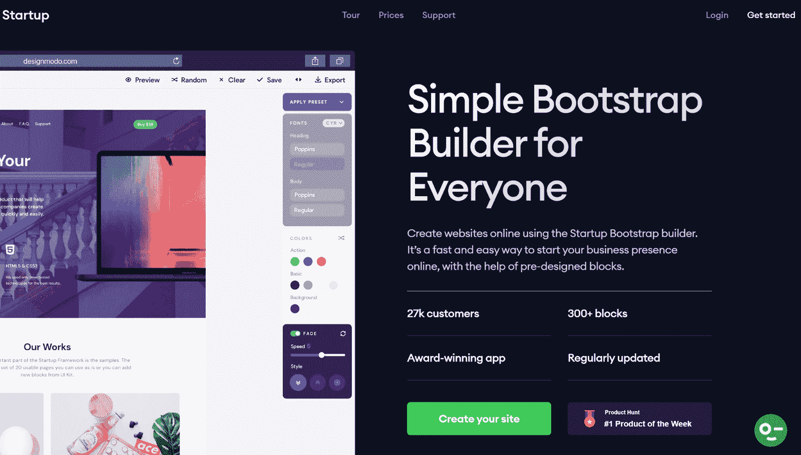

创业 4 网站设计软件。

要使用该工具，您只需抓取一个小部件并将其拖动到位。Startup 4 还提供了几个主题，大大加快了图形设计过程。

*   **价格**:免费和付费计划
*   易用性:对于初学者和有经验的设计师来说非常容易
*   **移动兼容性**:是

**特点**:

*   可以创建网站或单页
*   包括 300+预先设计的块(包括标题，文本框，图像等。)
*   包括基本主题
*   与电子邮件列表软件集成
*   无限制导出(因此您可以使用该工具创建多个网站，并将它们上传到您的网站服务提供商)

#### 模板烘烤器

TemplateToaster 是一款开源设计工具，通过一个简单的桌面应用程序运行。你只需要下载 TemplateToaster，安装在你的电脑上，调整一个主题，然后[将你的网站](https://kinsta.com/knowledgebase/export-wordpress-site/)导出到你的网站托管提供商。

TemplateToaster 包括几个完全可定制的模板可供选择。

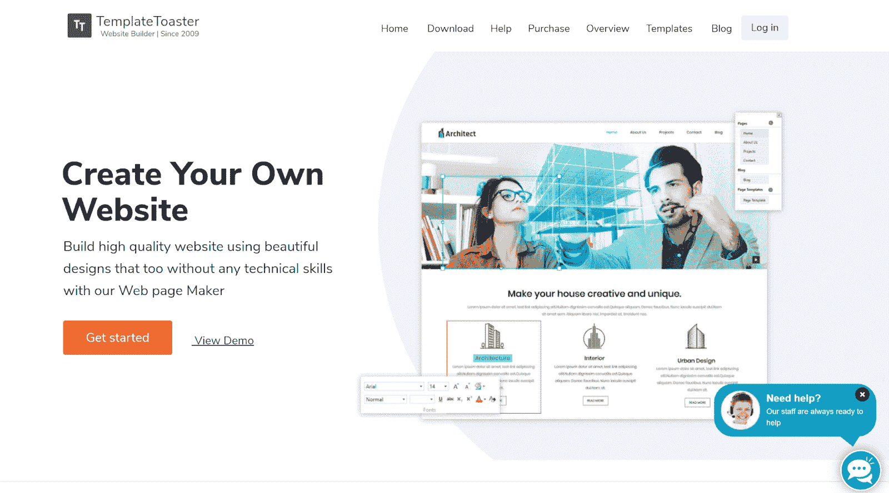

TemplateToaster 建站软件。

TemplateToaster 最适合使用 Windows 电脑的人，尽管它可以通过虚拟机在 Mac 上使用。TemplateToaster 目前在全球拥有[超过 100 万用户](https://templatetoaster.com/)。

*   **价格**:免费和付费计划
*   **易用性**:适合初学者和有经验的设计师
*   **移动兼容性**:是

**特点**:

*   它通过桌面应用程序运行
*   允许您导出您的网站
*   包括免费的模板和主题
*   适用于所有主要的内容管理系统
*   可以创建电子商务网站
*   允许您通过更改字体和颜色来自定义您的网站

#### 奇迹

漫威是一个基于浏览器的设计工具，创建网站。漫威帮助想要一起设计的团队，尽管它对个体设计师来说仍然很棒。

## 注册订阅时事通讯

### 想知道我们是怎么让流量增长超过 1000%的吗？

加入 20，000 多名获得我们每周时事通讯和内部消息的人的行列吧！

[Subscribe Now](#newsletter)

漫威的设计工具还集成了微软团队、 [YouTube](https://kinsta.com/blog/how-to-create-a-youtube-channel/) 、迷宫、吉拉、Confluence、回望和 Dropbox Paper 等工具。这使得它非常适合那些想用这些工具来增强网站的人。漫威目前拥有超过 200 万用户的。

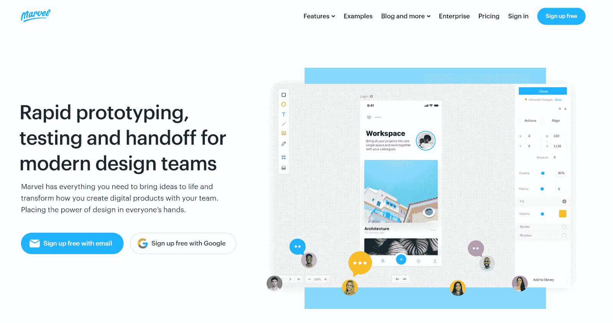

漫威网站设计工具。

*   **价格**:免费和付费计划(付费计划每月 12 美元起)
*   易于使用:非常易于使用(但最适合有过设计经验的人)
*   **移动兼容性**:是

**特点**:

*   可以创建网站和其他数字资产
*   内置用户测试
*   设计是非常个性化的
*   包括访问库存图像和预制资产

### 最人性化的网站设计软件工具

让我们来看看三个最人性化的软件工具。

#### Webflow

[Webflow](https://webflow.com/editor) 是一个网站设计编辑器，帮助人们创建网站并持续编辑其内容。

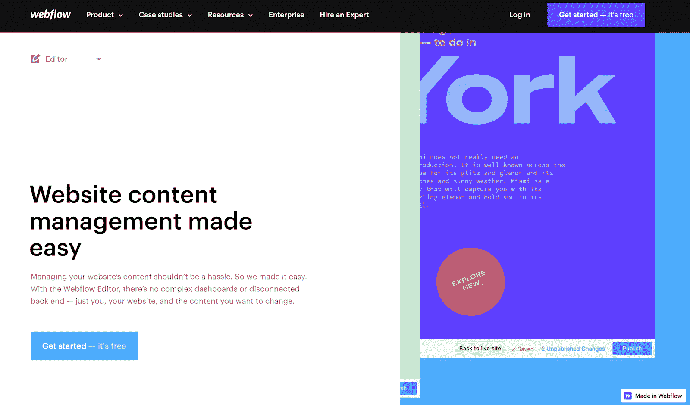

Webflow 网站设计编辑。

Webflow 可以设计一个网站或者管理一个网站作为[内容管理系统](https://kinsta.com/knowledgebase/content-management-system/)。你可以在免费网站建设计划中使用两个项目。

*   **价格**:免费和付费计划(付费计划每月 12-212 美元不等)
*   **易用性**:适合初学者和有经验的设计师
*   **移动兼容性**:是

**特点**:

*   包括一个内置的搜索引擎优化工具
*   充当内容管理系统
*   适合团队
*   允许您创建自定义动画
*   包括 100 多个模板
*   包括 3D 编辑
*   您可以自定义符号并保存它们以供重复使用

#### 威克斯

Wix 是一个简单的网站构建器，可以创建高级网站。

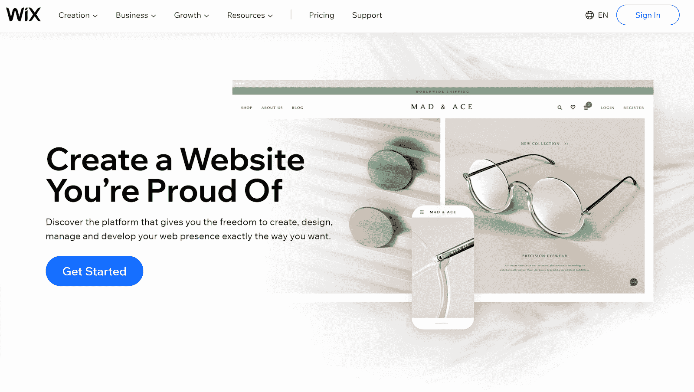

Wix 简单网站生成器。

您可以通过 Wix 免费托管您的网站(前提是您同意您的域名包含“. wixsite.com”)，或者设计您的网站并将其上传到您网站的托管提供商。

*   **价格**:免费和付费计划(付费计划从每月 10 美元到 38 美元不等)
*   **易用性**:适合想要建立一个基本网站的初级设计师
*   **移动兼容性**:是

**特点**:

*   包括 500 多个模板
*   在免费计划中提供 500 MB 的存储空间
*   允许定制[图像](https://kinsta.com/blog/free-images-for-wordpress/)、动画、视频背景和其他小工具
*   使用 Wix Turbo 加速您的网站
*   允许您构建 web 应用程序

#### 斯塔塔米奇

[Statamic](https://statamic.com/) 是一个网站管理系统，可以帮助你快速设计和发布内容。

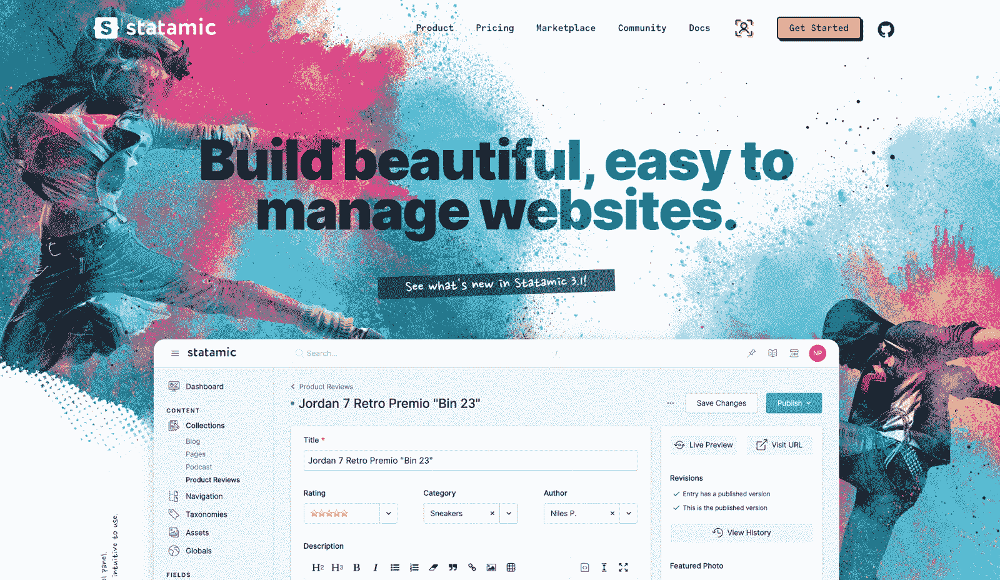

Statamic 网站管理系统。

Statamic 适合 Windows 和 Mac 用户，因为它为这两种操作系统提供了一个桌面应用程序。Statamic 对一个网站是免费的。

*   价格:免费和付费计划(每个网站 259 美元起)
*   **易用性**:适合初学者
*   **移动兼容性**:是

**特点**:

*   允许您跟踪[修订历史](https://kinsta.com/blog/wordpress-revisions/)
*   支持多用户
*   包括 40 多种字段类型(即图像、文本框等。)
*   可以作为内容管理系统工作

### 最佳电子商务网站设计软件

让我们来看看两个最好的电子商务网站设计软件。

需要为你的 WordPress 站点提供超快的、可靠的、完全安全的托管服务吗？Kinsta 提供所有这些以及 WordPress 专家提供的 24/7 世界级支持。[查看我们的计划](https://kinsta.com/plans/?in-article-cta)

#### 伍尔科贸易公司

WooCommerce 是一个 WordPress 插件，帮助人们建立和运营在线商店。

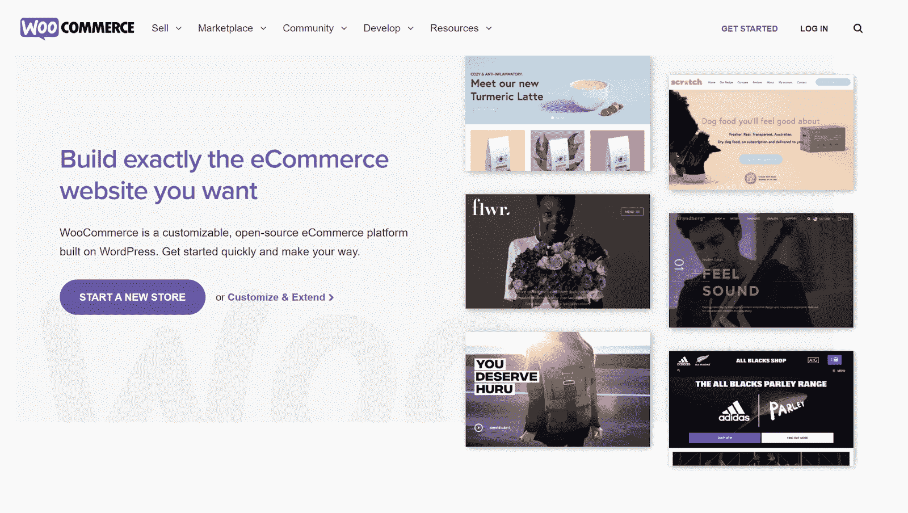

WooCommerce 电子商务平台 WordPress 插件。

WooCommerce 目前为 14%的在线商店提供支持，超过 400 万人安装了该软件。该工具最适合需要更高级商店网站的中小型企业。

*   **价格**:免费
*   易用性:适合任何有 WordPress 经验的人
*   **移动兼容性**:是

**特点**:

*   包括可定制的商店模板
*   自动为您计算税费和运费
*   开放源码
*   自动处理 PayPal、Square、Stripe、Amazon Pay、Apple Pay、存款和 Google Pay 的付款
*   包括一个移动应用程序
*   使用 [Jetpack](https://kinsta.com/knowledgebase/wordpress-jetpack/) (一个安全和性能插件)

#### 大卡特尔

[大卡特尔](https://www.bigcartel.com/)是一个电子商务网站建设者，为你建立和托管你的电子商务商店。

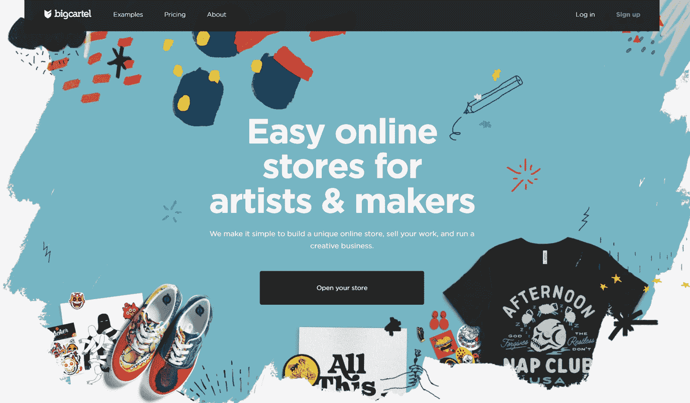

大型卡特尔电子商务网站建设者。

最多可以免费使用五种产品。大卡特尔最适合只卖少数几种产品并且需要一个简单网站的小企业。

*   **价格**:免费和付费计划(付费计划包括每月 9.99 美元和 19.99 美元的计划)
*   **易用性**:适合初学者
*   **移动兼容性**:是

**特点**:

*   包括可定制的主题
*   它向你显示实时网站和销售统计数据
*   适合在线销售和面对面销售
*   跟踪货物
*   使用自定义域
*   与谷歌分析集成

### WordPress 最佳网站设计软件

让我们看看三个最好的软件，它们的功能是 [WordPress 插件](https://kinsta.com/best-wordpress-plugins/)。

#### 海狸建造者

Beaver Builder 是一个 [WordPress 插件，它一页一页地构建网站](https://kinsta.com/blog/wordpress-page-builders/)。它包括几个预先设计的主题和几十个小部件，将使您的网站独一无二。

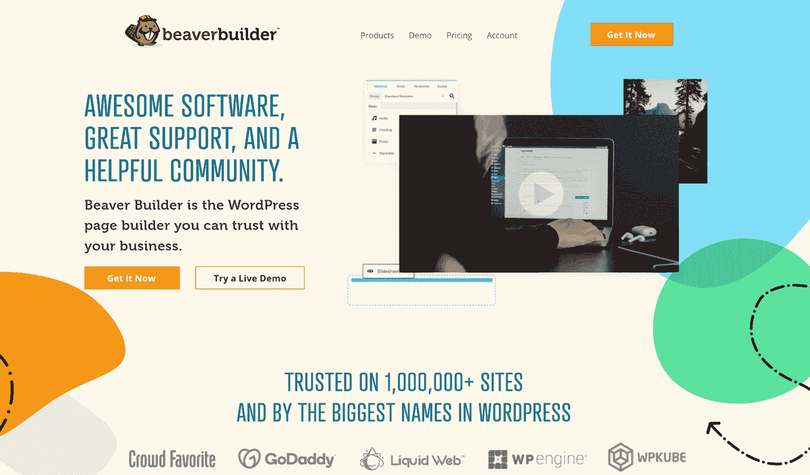

海狸构建器 WordPress 插件。

该工具是免费的，非常容易使用，因为你只需简单地“拖放”你想要的部件。Beaver Builder 适用于 Windows、Linux 和 Mac 电脑，因为它通过 WordPress 在线运行。

*   **价格**:免费
*   易用性:非常简单(前提是你有使用 WordPress 的经验)
*   **移动兼容性**:是

**特点**:

*   包括主题模板
*   您可以创建自定义布局
*   使用多个主题和其他 [WordPress 插件](https://kinsta.com/best-wordpress-plugins/)
*   适用于任何 WordPress 网站
*   无限制网站免费
*   它包含几十个小部件(包括图片、视频、文字帖子等。)

#### 红利

Divi 是一个 WordPress 插件，它允许你用预先设计的主题定制你的网站页面。Divi 是一个“可视化编辑”工具，这意味着它可以实时显示你所做的一切。

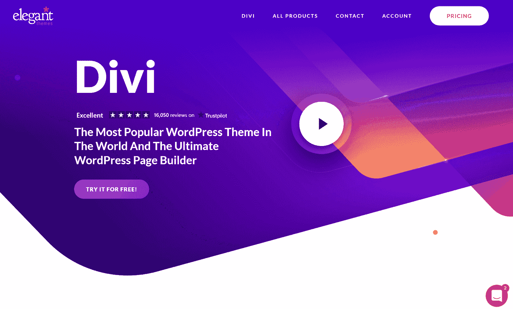

Divi 可定制 WordPress 插件。

虽然 Divi 不需要编码，但是你可以在你的网页上添加定制的 CSS。Divi 包括 30 天的免费试用，但之后需要付费计划。但是，您可以使用该工具来设计您的网站，然后将其导出。

*   价格:Divi 提供 30 天免费试用和两个付费计划(89 美元一年或 249 美元终身)
*   **易用性**:适合新手和有 WordPress 经验的资深设计师
*   **移动兼容性**:是

**特点**:

*   允许您添加小工具(包括图像，小工具，视频，滑块，联系方式等。)
*   包括几十个预先设计的模板可供选择
*   允许您使用“批量编辑”来同时编辑多个小部件
*   模板是完全可定制的
*   允许您保存您的设计
*   它会保存您的编辑历史，以便您可以“撤销”和“重做”操作
*   允许您导出您的网站

#### 元素者

Elementor 是一个 WordPress 插件，可以让你围绕预先设计好的主题构建网页。

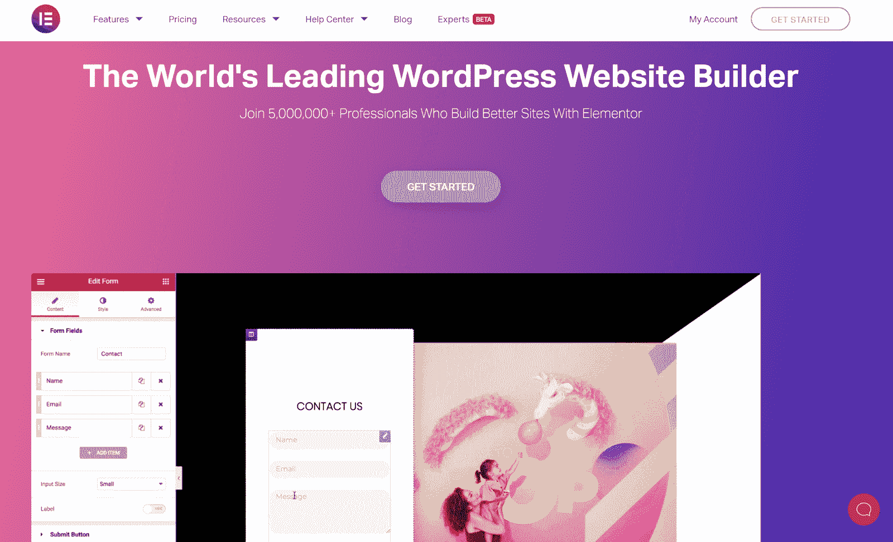

Elementor WordPress 网站构建器。

该设计工具目前在超过 500 万个网站上使用，并提供免费的网站生成器。Elementor 还是一个“可视化编辑器”，非常适合初学设计的人。Elementor 通过 WordPress 运行，适合 Windows、Linux 和 Mac 用户。

*   **价格**:49-499 美元免费提供高级计划
*   **易用性**:适合有 WordPress 经验的初学者
*   **移动兼容性**:是

**特点**:

*   包括 90 多个小部件(包括图像、文本框、视频、按钮等。)
*   允许您自定义页面的颜色、大小和布局
*   包括预先设计的主题
*   开放源码
*   兼容其他 WordPress 主题和插件
*   包括弹出窗口

## 比较网站设计软件

现在我们已经介绍了 11 种潜在的网站工具，让我们来比较一下。

### 不用编码最好的网站设计软件是什么？

这个问题有两个答案。如果你正在使用 WordPress，Elementor 是网站设计软件的首选，因为它很健壮，包括 80 多个小部件，并且兼容所有的 WordPress 主题和插件。

如果你没有使用 WordPress，最好的“无代码”解决方案是 Statamic，因为它适合多个用户，作为一个内容管理系统工作，并且对一个网站是免费的。

### 最好的免费网页设计软件是什么？

最健壮和免费的网站设计工具是 Beaver Builder、Elementor 和 [WooCommerce](https://kinsta.com/woocommerce-hosting/) 。

这些工具作为 WordPress 插件工作。他们可以与任何 WordPress 网站无缝合作。它们还包括许多小部件，是开源的，可定制的。你也可以用其他 WordPress 插件来增强你建立的网站。

### Windows 最好的设计软件是什么？

完美的 Windows 网站设计工具是 TemplateToaster，因为 TemplateToaster 包括一个免费的 Windows 应用程序，可以让你离线构建网站。

### Mac 最好的设计软件是什么？

Mac 的顶级网页设计师是 Statamic，因为 Statamic 有专门的 Mac 应用程序。Mac 用户也可以通过虚拟机使用 TemplateToaster，尽管这可能不适用于所有电脑。

### Linux 最好的设计软件是什么？

Linux 的顶级网站设计工具是 Beaver Builder、Elementor 和 WooCommerce。当这些设计工具在 WordPress 上运行时，它们在 Linux 电脑上的效果会和在 Windows 和 Mac 电脑上一样好。

如果你有一台 Linux 电脑，并且不使用 WordPress，像 Startup 4 和漫威这样的设计工具也是很好的选择(因为它们通过你的网络浏览器工作)。

你可以在下面看到 Startup 4 的网站生成器。

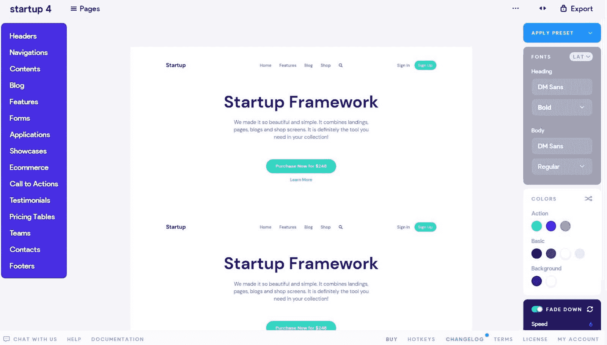

启动 4 号建站页面。

[想设计一个网站却不知道如何编码？👩‍💻查看这些网站设计软件选项即可入门✨ 点击推文](https://twitter.com/intent/tweet?url=https%3A%2F%2Fkinsta.com%2Fblog%2Fwebsite-design-software%2F&via=kinsta&text=Want+to+design+a+site+but+don%27t+know+how+to+code%3F+%F0%9F%91%A9%E2%80%8D%F0%9F%92%BB+Check+out+these+website+design+software+options+to+get+started+%E2%9C%A8&hashtags=WebDesign%2CWebDesigner)

## 摘要

最适合你的网站设计工具将取决于你需要的网站类型，你是否通过 WordPress 运行你的网站，以及你有什么类型的电脑。

当选择正确的软件时，总是货比三家，权衡你的选择，以确保你选择的设计工具能够设计出你梦想中的网站。

*为了获得经得起未来考验的结果，请始终选择开源且可导出的工具，这样，如果你更换了[虚拟主机提供商](https://kinsta.com/plans/?plan=visits-business1&interval=month)，你就可以随身携带你的网站。*

* * *

让你所有的[应用程序](https://kinsta.com/application-hosting/)、[数据库](https://kinsta.com/database-hosting/)和 [WordPress 网站](https://kinsta.com/wordpress-hosting/)在线并在一个屋檐下。我们功能丰富的高性能云平台包括:

*   在 MyKinsta 仪表盘中轻松设置和管理
*   24/7 专家支持
*   最好的谷歌云平台硬件和网络，由 Kubernetes 提供最大的可扩展性
*   面向速度和安全性的企业级 Cloudflare 集成
*   全球受众覆盖全球多达 35 个数据中心和 275 多个 pop

在第一个月使用托管的[应用程序或托管](https://kinsta.com/application-hosting/)的[数据库，您可以享受 20 美元的优惠，亲自测试一下。探索我们的](https://kinsta.com/database-hosting/)[计划](https://kinsta.com/plans/)或[与销售人员交谈](https://kinsta.com/contact-us/)以找到最适合您的方式。