# 有效网站流量分析的 15 大工具

> 原文：<https://kinsta.com/blog/website-traffic-analysis/>

如果你认为没有适当的网站流量评估和品牌竞争分析，你的网站或在线业务就能成功，那你就错了。但是你怎么能这样做呢？

进入网站流量分析工具。

[Want to see how your site is really doing when it comes to web traffic? 📈 Use these tools to get started ✅Click to Tweet](https://twitter.com/intent/tweet?url=https%3A%2F%2Fkinsta.com%2Fblog%2Fwebsite-traffic-analysis%2F&via=kinsta&text=Want+to+see+how+your+site+is+really+doing+when+it+comes+to+web+traffic%3F+%F0%9F%93%88+Use+these+tools+to+get+started+%E2%9C%85&hashtags=SEO%2CWebTraffic)

从小型企业到大型企业，数百万互联网用户使用 web 流量评估工具来划分流量，并有效地使用这些数据来提高他们网站的性能和营销愿景。

找到满足您需求的最佳工具可能很棘手，因为有太多的选项可供选择。在这篇文章中，我们自己列出了准确评估网站流量的 15 大工具。

## 什么是网站流量分析？

网站流量分析包括收集和分析关于网站访问者的数据，以及他们到达网站后的行为。这些信息对于营销人员实施有效的策略是至关重要的，这些策略可以优化网站流量，提高 T2，提高转化率。

> Kinsta 把我宠坏了，所以我现在要求每个供应商都提供这样的服务。我们还试图通过我们的 SaaS 工具支持达到这一水平。
> 
> <footer class="wp-block-kinsta-client-quote__footer">
> 
> 
> 
> <cite class="wp-block-kinsta-client-quote__cite">Suganthan Mohanadasan from @Suganthanmn</cite></footer>

[View plans](https://kinsta.com/plans/)

流量不再是检验企业成功的唯一标准。这就是为什么我们有全面的网站流量分析工具来帮助我们做出准确的评估。

## 网站流量分析工具是如何工作的？

网站流量分析工具着眼于重要的统计数据，这些数据显示出你的网站在哪些方面是高效的，哪些方面需要改进。

这些检查器会仔细检查您的网页上的用户行为，并显示有关重要关键性能指标(KPI)的计算细节。

这些危机包括:

*   **流量:**你网站的新访客和回头客的数量，以及他们的人口统计信息。
*   **流量来源:**用户如何到达你的网站(例如，有机搜索、赞助广告、电子邮件、社交媒体帖子)。
*   页面浏览量:人们访问网站上特定页面的次数。
*   **会话持续时间:**访问者在您的网站上花费的总时间。
*   **跳出率:**在你的网页上登陆，然后离开而不再与网站互动的访问者的比例。
*   **转换率:**在网站上与行动号召互动(如提交表格或购买产品)的访问者的百分比。这种互动被称为[转换](https://kinsta.com/blog/conversion-rate-optimization-tips/)。
*   **独特访问:**只统计一个人的首次访问，让你把潜在客户和忠实用户区分开来。
*   **退出页面:**标识每个访问者离开你的网站的页面。

## 网站流量分析工具衡量什么？

网站流量分析工具使用上述指标来衡量网站的性能。他们收集的数据让你可以将自己的表现与竞争对手的进行比较，并确保你走在正确的道路上。

然而，关键的衡量标准集中在独立访客(uv)、页面浏览量和流量曲线上。

监控独立访问者将帮助您确定每月至少有多少人访问过您网站的某个页面。

有了流量视图，每次会话的持续时间真的很重要，这取决于你运行的网站的类型。例如，它将是内容生成网站的一个关键指标。

至于交通曲线，它们有助于确定高峰观众活动时间。因此，您将能够了解预计流量激增的时间，从而改进策略。

## 网站流量分析的好处

网站流量分析工具在帮助您个性化您的 [B2B 战略](https://kinsta.com/blog/b2b-lead-generation/)以满足您客户的需求和了解更多关于您的行业竞争对手方面发挥着关键作用。

以下是使用这些工具的三大优势。

### 深入了解网站流量

网站流量分析揭示了在线流量的不同来源，让您能够确定哪种营销模式能够产生积极的业务成果。您还可以实时跟踪有机和赞助流量的进度。

### 改善用户体验

你的目标受众是你的利润来源。为了成功地推销你的产品或服务，深入了解你的目标客户是至关重要的。

网站流量分析工具可帮助您识别访问您网站的用户类型、他们的兴趣以及他们在您的网页上采取的每一项行动。因此，你会发现如何改善用户体验(UX ),并更清楚地了解你的网站表现如何。

考虑一下:你真的能接触到你的目标受众吗？他们在哪些页面停留的时间最长？你有没有什么未被发现的技术问题把用户赶走？你达到你的投资回报率目标了吗？你在多大程度上实现了你的[转化](https://kinsta.com/blog/conversion-tracking/)目标？

流量分析工具还可以帮助你发现你是否在使用一个可信的网络主机，它不会对网页的可用性或[加载时间](https://kinsta.com/learn/speed-up-wordpress/)产生负面影响，否则会破坏你的品牌形象。

### 提升搜索引擎优化排名

许多网站流量分析解决方案包括[搜索引擎优化(SEO)](https://kinsta.com/blog/what-does-seo-stand-for/) 工具，用于提高您的网站在搜索引擎上的排名，尤其是谷歌。这些功能让你看到关键词如何影响你的搜索引擎优化，甚至你从[社交媒体平台](https://kinsta.com/blog/facebook-statistics/)获得了多少流量。

借助这些检查器，你可以进行精确的修改，以提高你的搜索引擎优化状态，并在谷歌的第一页得到认可。

## 有效网站流量分析的 15 大工具

互联网上有大量功能强大的服务，你可以用来测量、跟踪和管理你的网站。为了节省您的时间和精力，我们编制了一份 15 大网站流量分析工具列表。

### 1\. MyKinsta (MyKinsta Analytics)

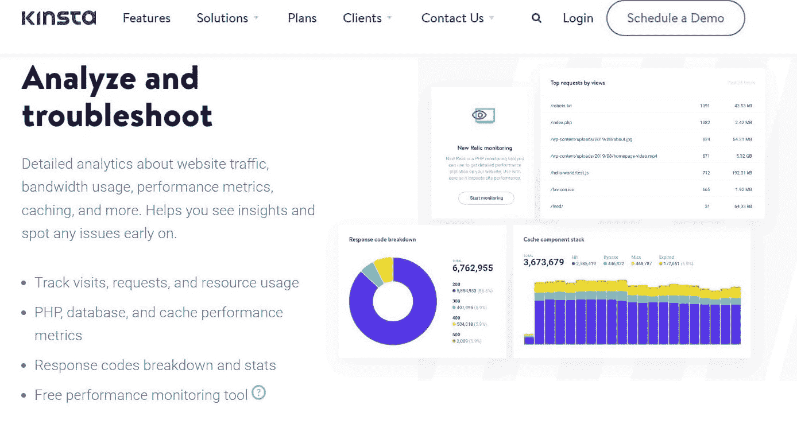

The MyKinsta homepage.

由 Kinsta 内部开发的 [MyKinsta dashboard](https://kinsta.com/mykinsta/) 是市场上最简单的站点管理工具之一。

通过 MyKinsta，您几乎可以做任何事情——从基本的数据库搜索到使用服务器级 301 重定向、发布免费 SSL 证书、阻止 IP 地址、利用高级 DNS 管理等等。

为了本文的利益，我们将关注一下 MyKinsta 仪表板中的工具 [MyKinsta Analytics](https://kinsta.com/help/mykinsta-analytics/) 。

借助该工具，您可以获得大量与绩效相关的分析。首先，您可以单独或共同查看每个站点的统计数据，回顾窗口为 24 小时、一周和一个月。

MyKinsta Analytics 还为您提供了大量关于访问者资源使用情况、带宽以及按访问量或字节排列的热门请求的报告。[性能监控](https://kinsta.com/blog/application-performance-monitoring/)报告涵盖不同方面，包括 MySQL 和 PHP 响应时间以及 AJAX 使用情况。

更重要的是,“分散”部分允许你比较你的网站来自桌面和移动设备的流量百分比。

此外，您还会在网站上收到对响应代码的详细分析。这些 [HTTP 状态码](https://kinsta.com/blog/http-status-codes/)的范围从 200 到 500。此外，您可以查看重定向总数、成功率、错误和错误率。该工具的“前 404”错误列表在这里特别有用。

最重要的是，所有由 Kinsta 托管的网站都免费补充了 [Kinsta APM 工具](https://kinsta.com/blog/http-status-codes/)。Kinsta APM 工具是一个强大的工具，用于[对你的网站](https://kinsta.com/blog/wordpress-errors/)进行故障排除，并提高其页面加载速度。PHP 进程、外部 HTTP 调用、MySQL 数据库查询和站点上的其他活动都可以在 APM 工具中打上时间戳。

**定价:**

对于初创公司和企业，Kinsta 提供了多种定价选择。最小的捆绑包每月费用为 35 美元，最贵的为 1650 美元。

所有 Kinsta 套餐都有 30 天退款保证。

**特性:**

*   免费 APM 工具
*   资源使用跟踪
*   交通分析
*   站点和时间段过滤器
*   缓存分析
*   针对桌面与移动访问者、国家和请求的深入报告
*   全天候支持
*   [免费 WordPress 迁移](https://kinsta.com/wordpress-migration/)

### 2.塞姆拉什

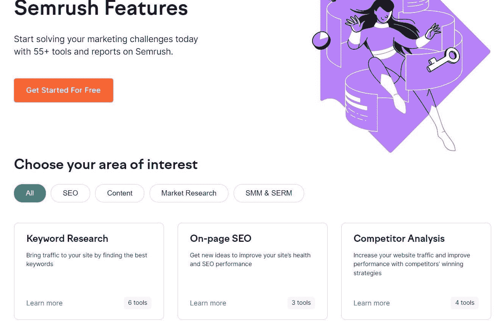

Semrush features. (Image source: [Semrush](https://www.semrush.com/))

Semrush 于 2008 年推出，为在线企业提供一整套营销和精确的网站流量分析工具。

Semrush 通过向您提供完整的访问报告、会话持续时间和页面浏览量，帮助您测量您自己的在线流量和域名的性能。此外，您还可以分析移动流量与桌面流量的比率以及用户交互。

Semrush 还能让你检查竞争对手网站的表现。通过关键指标，如每月流量的增长，按国家的流量细分，以及领先的关键词，你会对你所在行业的其他公司的表现有一个透彻的了解。

因此，你将了解不同的成功营销策略和最新趋势。只需在搜索栏中键入 URL、域或关键字，就可以获得众多观点。

Semrush 还允许您浏览索引页面和反向链接列表，以及批量流量分析功能，以一次检查几个企业的流量。此外，它还提供了详细的解决方案，以优化您的网站的内容和搜索引擎优化的本地和全球搜索。

**定价:**

对于 Semrush 的三种价格水平，您可以选择按月或按年付款。Pro、Guru 和 Business 计划分别为 119.95 美元、229.95 美元和 449.95 美元。Pro 和 Guru 套装可在购买后的前 7 天免费试用。

Semrush 还提供了一个具有上限功能的永久免费帐户，这对初学者和初创公司来说是一个很好的选择。

**特性:**

*   域名、反向链接和关键词分析
*   最多可跟踪 5000 个关键词
*   移动排名
*   每月抓取多达 100 万个页面
*   链接建设、内容营销和[社交媒体管理](https://kinsta.com/blog/wordpress-social-media-plugins/)
*   API 访问
*   Google Looker Studio 集成

### 3.相似网络

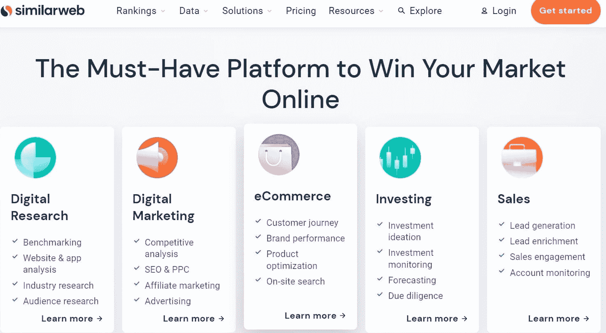

The Similarweb homepage. (Image source: [Similarweb](https://www.similarweb.com/))

[Similarweb](https://www.similarweb.com/) 是一个强大的数据平台，用于实时监控市场趋势和流量。它是成长型企业和大型企业的理想选择。利用这项服务的知名品牌包括 Booking.com 易贝、经济学人、百事可乐和沃尔玛。

Similarweb 最值得注意的一点是，它通过一个简单快捷的过程，帮助你全面了解网站上发生的一切，包括哪些位置为你带来了最多的流量。

这个网站流量分析检查器也给你一个详细的受众细分，让你看到其他网站的表现。你可以用它来分析你的访问者的兴趣，并审查转换分析报告，以产生更多的线索。

使用“推荐”功能，您可以检查您的[分支机构](https://kinsta.com/affiliate-academy/affiliate-marketing-statistics/)，了解哪些网站将用户引向该网站，以及他们离开后最常去的地方。

最重要的是，Similarweb 为您提供了网站用于显示广告的出版商和赞助商链接的摘要。

**定价:**

SimilarWeb 的计划侧重于搜索、联盟营销和展示。还有一个企业产品包，其中包含了每一层中的所有可用功能。

您可以联系销售团队以获得准确的报价。还提供免费试用版和功能有限的免费版本。

**特性:**

*   对公司、应用、受众、转化和行业的分析
*   仪表板和 excel 导出
*   API 访问
*   全球和国家级流量监控
*   展示广告
*   附属跟踪和搜索引擎优化工具

### 4.站点检查器

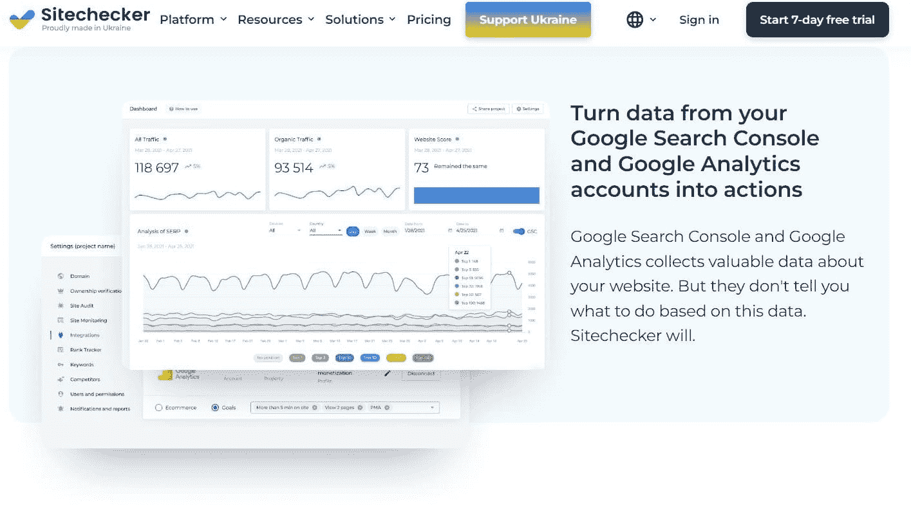

The Sitechecker homepage. (Image source: [Sitechecker](https://sitechecker.pro/))

Sitechecker 是一个多功能的 SEO 分析解决方案，使您能够快速有效地跟踪您的网络资源营销战略的成功，以便您可以逐步[提高绩效](https://kinsta.com/blog/performance-testing-tools/)。

Sitechecker 的[网站爬虫](https://kinsta.com/knowledgebase/what-is-web-scraping/)功能有助于发现——并立即解决——任何及所有技术性 SEO 错误，从而增加流量。为了帮助您维护一个健康的网站，Sitechecker 还允许您检查断开的链接，检查您网站的架构，并探索最佳的登录页面选项。此外，内置的关键字排名检查器可以让你验证你的[域名的谷歌排名](https://kinsta.com/blog/google-patents-seo-ranking-factors/)。

虽然 Sitechecker 主要专注于 SEO 优化，但它包括一个网站流量分析检查功能，可以显示各种渠道和时间范围的综合统计数据。

如果你正在寻找一个全面的技术搜索引擎优化审计工具，页面搜索引擎优化助推器，关键字跟踪器，那么 Sitechecker 值得一试。

**定价:**

Sitechecker 有四个可用的订阅级别；你可以按月或按年注册。企业的价格在 23 美元到 499 美元之间。

你也可以试用两天，如果你决定取消，可以得到全额退款。

**特性:**

*   直观且用户友好的界面
*   即时通知功能
*   附带 SEO 指标的 Chrome 扩展
*   白色标签报告
*   无限的流量，排名，和网页搜索引擎优化检查
*   每周和每月反向链接跟踪
*   SERP 历史
*   多达 100，000 个关键词
*   移动排名跟踪

### 5.Serpstat

The Serpstat homepage. (Image source: [Serpstat](https://serpstat.com/))

Serpstat 是另一个以 SEO 为中心的网站流量分析审计器，帮助企业和专业人士为他们的网站输送更多的有机流量。它帮助你自动化搜索引擎优化活动的每一步，每月节省你几个小时甚至几天的时间。

反向链接分析、URL 分析、排名跟踪和关键字研究是该工具最好的组成部分。此外，Serpstat 拥有超过 230 个 Google 数据库作为关键字数据源。

您可以使用 Serpstat 评估您的网站与 PPC 关键字排名的关系，通过关键字的[点击率(CTR)](https://kinsta.com/blog/click-through-rate/) 、可见性以及作为[的有机流量](https://kinsta.com/blog/wordpress-seo/)和关键字排名来显示。这个在线工具在域名和 URL 级别都可以进行网站分析。

 此外，Serpstat 还能让你了解竞争对手的搜索基础，以及他们网站的表现。因此，你将确切地知道如何提高你的游戏并保持竞争优势。

“信息图表”标签让你只需点击一下就可以从你的网站上提取所有的数据。此外，Serpstat 使过滤数据和定制视图变得容易。

**定价:**

Serpstat 有四个预设软件包(精简版、标准版、高级版和企业版)以及一个根据您的需求定制的软件包。Lite 计划每月花费 48 美元，而企业会员每月花费 349 美元。

也可以在有限的时间内免费试用。

**特性:**

*   成熟的搜索引擎优化分析工具
*   简洁的界面和易于使用的仪表盘
*   API 访问
*   快速准确的现场审计
*   全面的可视化和分析报告
*   每天多达 12，000 次搜索
*   反向链接和排名跟踪器
*   多达 250 万页的审计

### 6.谷歌分析

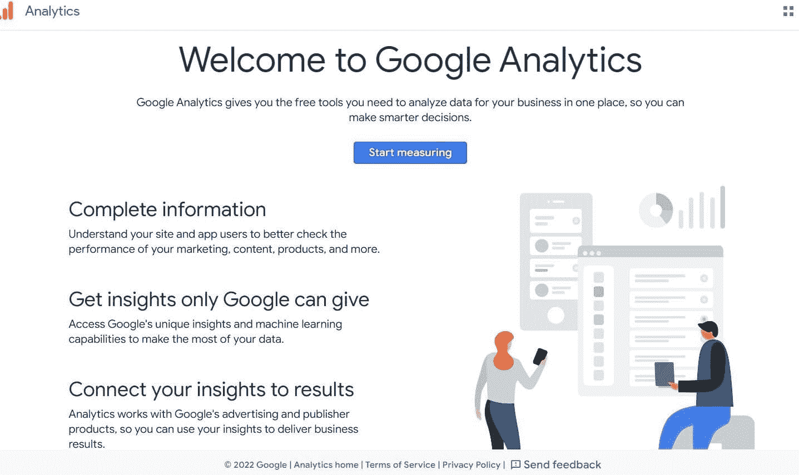

The Google Analytics homepage. (Image source: [Google Analytics](https://analytics.google.com/analytics/web/#/provision))

你可能已经不止一次遇到过谷歌分析。毫无疑问，这是最强大的免费增值产品之一，受到成千上万用户的青睐。

您可以使用其广泛的报告来衡量您的网站流量，确定您最受欢迎的内容，并了解访问者和潜在客户如何使用您的网站进行转换。谷歌分析还允许你为谷歌广告的再营销和促销活动创建受众分群。

Google Analytics 还允许你在一个账户下管理多处房产。还可以通过一个仪表板查看不同站点的参数。该服务完全兼容广泛的平台和服务，包括。

由于其大量的功能和全面的图表，[使用谷歌分析](https://kinsta.com/blog/how-to-use-google-analytics/)对新手来说可能是艰难的。这就是为什么许多初学者寻求[更友好的替代品](https://kinsta.com/blog/google-analytics-alternatives)。

**定价:**

谷歌分析基本上对所有用户都是免费的。也就是说，有一个面向大公司的高级版本，叫做 Analytics 360。要得到准确的价格标签，你需要联系他们的销售团队。

## 注册订阅时事通讯

### 想知道我们是怎么让流量增长超过 1000%的吗？

加入 20，000 多名获得我们每周时事通讯和内部消息的人的行列吧！

[Subscribe Now](#newsletter)

**特性:**

*   功能丰富的免费服务
*   与大多数网站兼容
*   全面的报告(如收购报告、受众报告、转化报告、实时跟踪)
*   漏斗分析
*   半定制仪表板

### 7.Ubersuggest

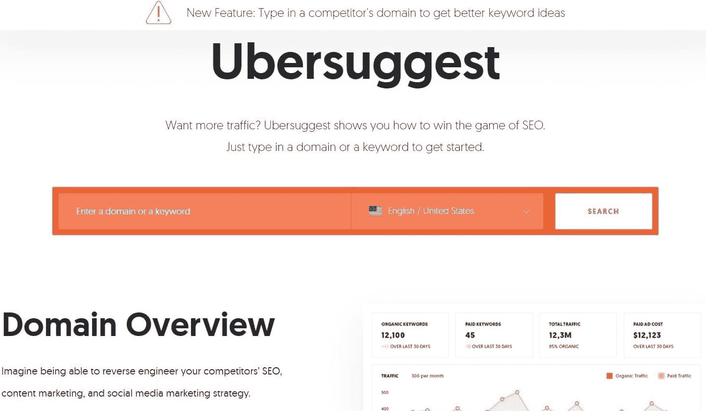

The Ubersuggest homepage. (Image source: [Ubersuggest](https://neilpatel.com/ubersuggest/))

作为 Neil Patel 的创意，Ubersuggest 是一个负担得起的、完整的搜索引擎优化研究解决方案。它有一个广泛的建议关键词和内容库，以帮助初创企业获得高排名。

Ubersuggest 的关键词方面分为五大小节:概述、创意、流量、相似网站、内容创意。每个部分执行不同的任务，为您提供详细的统计数据，如搜索流量、SEO 难度、相关关键词、关键词排名结果等。

Ubersuggest 和我们列表中的其他工具一样，可以让你同时关注你的网站和对手的网站。此外，它还有一些有用的功能，如反向链接、排名跟踪和网站审计。

更重要的是，Ubersuggest 包括一个易于安装的 Chrome 扩展。这个配套的 SEO 插件在 Google 上运行得很好，显示了重要的 SEO 数据。

使用 Ubersuggest 时，您应该首先在用户仪表板上提交信息。之后，您将向仪表板添加网站、项目和有机关键词(取决于您的订阅)。

需要帮助吗？实时聊天和电子邮件可用！

**定价:**

Ubersuggest 的价格从每月 29 美元到 99 美元不等。所有的订阅都有 7 天的免费试用期。

也有一个免费的计划，允许你一天进行三次搜索。

**特性:**

*   负担得起的计划
*   丰富的搜索引擎优化工具
*   用户友好的仪表板
*   自助资源
*   社交媒体结果

### 8.Adobe Analytics

The Adobe Analytics homepage. (Image source: [Adobe Analytics](https://business.adobe.com/products/analytics/adobe-analytics.html))

作为 Adobe 云市场的一部分， [Adobe Analytics](https://business.adobe.com/products/analytics/adobe-analytics.html) 是一款面向大型企业的专业实时网络分析服务。Adobe Analytics 的目标是捕捉网络活动，发现潜在客户，并解决问题。

高度灵活的数据工作台工具允许用户比较和识别从最广泛的图片到特定客户的所有级别的趋势，以及测量移动广告和视频的效率。它的设计还考虑到了线上和线下的客户互动。

预测分析是另一个强大的功能。使用人工智能技术和先进的统计模型，它分析游客数据，识别模式，并估计他们未来的行动。因此，分析师将能够更有效地使用大量数据，否则这些数据将会被浪费掉。

可扩展性和安全性，以及为访问者个性化报告的灵活性，是 Adobe Analytics 的其他顶级属性。

**定价:**

Adobe Analytics 的价格很高。这就是为什么我们不建议初学者或小企业主使用它。

它也没有免费版本。你可以联系他们的销售部门获取报价。

**特性:**

*   实时数据监控
*   预测分析
*   多渠道支持
*   复杂的细分
*   标签管理
*   跨设备分析
*   离线数据集成

### 9.轮毂点

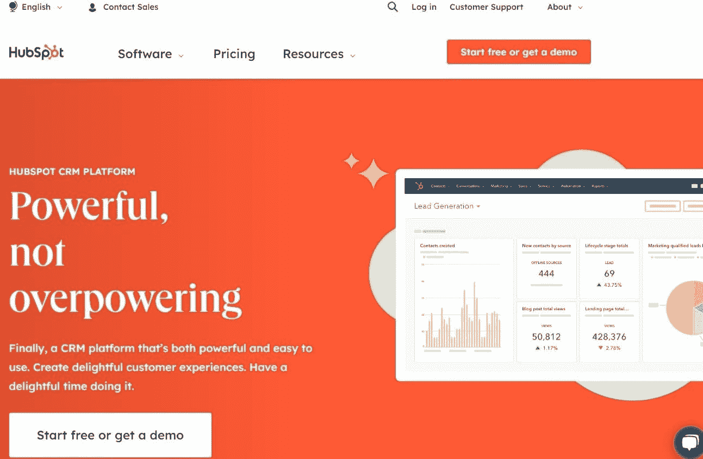

The HubSpot homepage. (Image source: [HubSpot](https://www.hubspot.com/))

[HubSpot](https://www.hubspot.com/) 是一个包罗万象的[网站管理](https://kinsta.com/webinars/scale-wordpress-management/)和营销平台，拥有超过 120，000 名用户，包括来自各个行业的自由职业者和 B2B 营销人员。

Hubspot CMS 为网站流量分析提供了强大的解决方案，如指标、营销、SEO 和管理——所有这些都可以轻松配置。使用分析工具，您可以检查您网站的流量数据，这些数据可以按来源、主题组、设备类型等细分。

您还可以更改流量报告的间隔和日期范围，保存或导出它，并使用指定的分析模块对数据进行排序。您选择的任何进一步筛选(如日期范围)将应用于原始数据表和图表显示。

HubSpot 的仪表盘非常详细，只需点击几下，就可以访问大量的监控选项。使用它的选项卡来分析[跳出率](https://kinsta.com/blog/how-to-reduce-bounce-rate/)、会话、访问者、页面浏览量、CTA 点击、推荐和提交率。

**定价:**

HubSpot 提供了一个免费的计划，里面有很多有用的工具，包括流量分析。它还销售三种高级套餐，价格从每月 23 美元起。

还提供 14 天的免费试用。

**特性:**

Struggling with downtime and WordPress problems? Kinsta is the hosting solution designed to save you time! [Check out our features](https://kinsta.com/features/)

*   内置 CRM
*   SEO 推荐主页
*   综合流量分析工具
*   适应测试
*   拖放编辑器
*   24/7 电话支持

### 10.Ahrefs

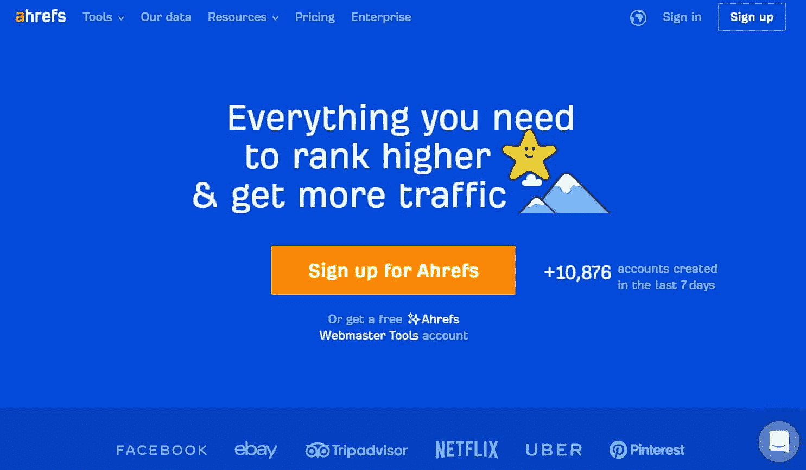

The Ahrefs homepage. (Image source: [Ahrefs](https://ahrefs.com/))

努力避免[负面 SEO](https://kinsta.com/blog/negative-seo/) ？我们列表中的下一个工具可能非常适合你。

Ahrefs 是一个强大的 SEO 和网站流量分析检查工具，可以获得准确的流量和有机搜索洞察，以及反向链接检查和竞争对手分析。这种高效的工具被网飞、脸书、优步和金斯塔所使用。

Ahrefs 拥有一个友好的界面，允许你按年份、过去 30 天或所有时间对交通报告进行排序。只需向 Ahrefs 提供短语，它就会给你关键词建议，以及它们的难度，用于内容写作或营销。你甚至可以使用 Ahref 的搜索引擎优化审计工具进行技术调整，以改善搜索结果。

使用 Ahrefs 进行域分析同样简单。它可以针对整个域或特定域上的特定页面来完成。你将获得关于你的站点的 DR 分数、外部链接数量、每月访客总数、锚文本和域名流量值的详细报告。

**定价:**

Ahrefs 有四个等级(精简、标准、高级和企业)，每月价格从 99 美元到 999 美元不等。

没有免费试用，但您可以在 48 小时内要求退款。

**特性:**

*   SEO 仪表板
*   等级跟踪器
*   SEO 审计
*   领域比较
*   数据导出
*   关键词浏览器
*   领域分析

### 11.SE 排名

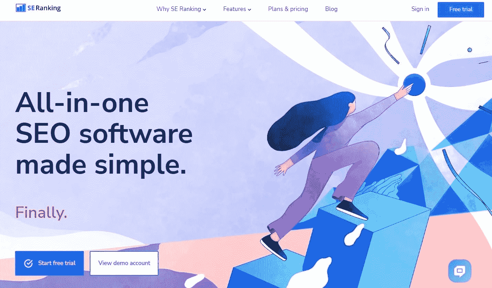

The SE Ranking homepage. (Image source: [SE Ranking](https://seranking.com/))

SE 排名不仅仅是一个网站流量分析服务，它还是一个集多种功能于一身的 SEO 工具。它可以让你轻松地研究关键词，跟踪排名，并检查来自世界各地的任何网站的流量。

该工具提供网站关键词在主要搜索引擎中的实时排名，你可以随时跟踪国家、城市或地区的排名。

另一个有用的内置功能是深入的网站审计工具，它可以发现任何页面问题，并建议修复它们的方法。这个审计工具是完全可定制的，这意味着您可以选择要监控的特定问题。

SE 排名提供的最重要的工具之一是搜索任何网站的能力，并立即获得该网站的总有机和付费每月流量的概述，加上该网站排名的关键字总数。当你从竞争对手的内容中寻找灵感时，这是很有用的:你会立刻知道哪些关键词是值得努力的。

**定价:**

SE 排名提供了三种主要计划:基本计划、专业计划和商业计划。这些软件包可根据排名检查的频率(每天、每三天或每周)和订阅期(每月、每季度、每半年、每 9 个月或每年)进行定制。

价格从每月 18.72 美元到每月 899 美元不等。SE 排名还授予基本计划 14 天的免费试用。

**特性:**

*   关键词排名跟踪器
*   反向链接检查器
*   网站审计工具
*   页面搜索引擎优化检查器
*   报表生成器
*   访客链接
*   铅发电机

### 12.网络 CEO

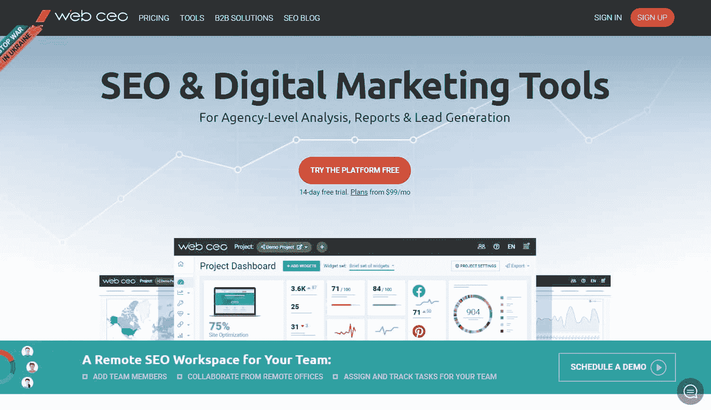

The WebCEO homepage. (Image source: [WebCEO](https://www.webceo.com/))

WebCEO 提供了一套 SEO 工具，面向需要共同管理多个项目的机构和个人。

与大多数竞争对手不同，WebCEO 不允许你直接搜索其他网站的流量数据。相反，你必须首先使用你的网站创建一个项目，然后使用一个叫做竞争对手指标的工具来分析这些相关网站的流量。

该平台使用 Alexa 拉数据，并提供你最接近的竞争对手的流量统计。这使你能够看到你的流量趋势随着时间的推移，随着排名位置和共享的关键字。

在众多的工具中，包括排名跟踪、关键词研究、技术审计、SEO 分析、内部链接、网站地图生成、流量分析等等。

**定价:**

WebCEO 提供四种不同的价格方案:单人、启动、无限代理和公司。对于任何计划，您都可以选择按月或按年计费(年度选项的月费用较低)。价格从每月 33 美元开始，到每月 299 美元。

WebCEO 也给你 14 天的免费试用期，包括试用所有工具的能力，不需要提供任何财务信息。

**特性:**

*   每周自动扫描
*   日常人工审计
*   多达无限个项目(代理无限计划)
*   多达无限的关键字(代理无限计划)
*   每个项目最多 20 个谷歌商业档案位置

### 13.鼠标流

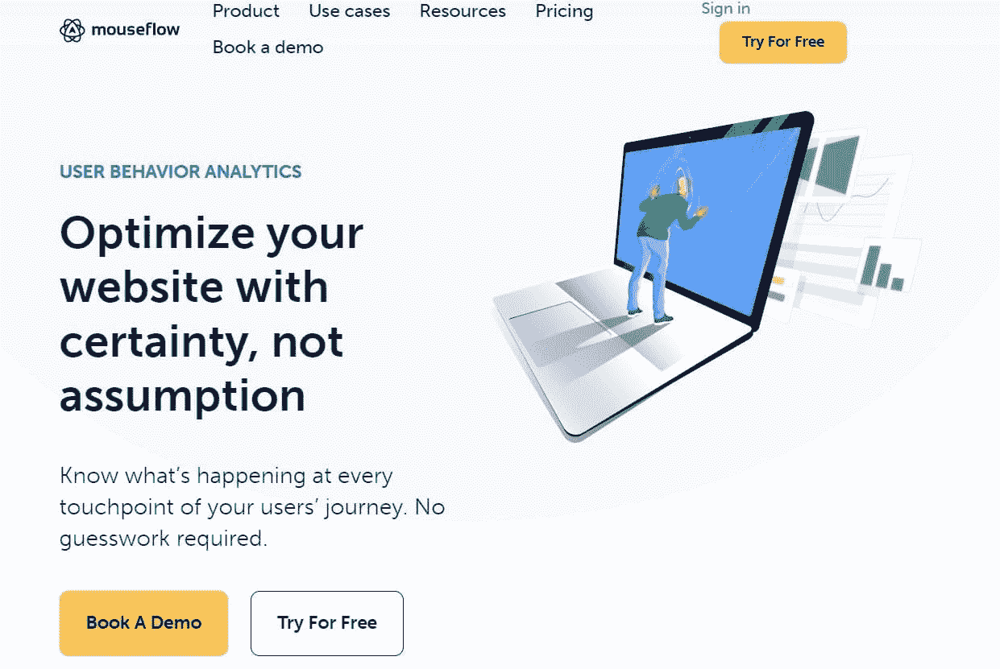

The Mouseflow homepage. (Image source: [Mouseflow](https://mouseflow.com/))

[Mouseflow](https://mouseflow.com/) 是一款行为分析工具，受到全球超过 190，000 名用户的信任和使用。

它最与众不同的功能是热图工具。这可以让你追踪访问者在整个网站的确切活动，甚至可以回放他们的导航路径，这样你就可以准确地知道在哪里可以实现改进和提高转化率..

您还可以为所有页面自动构建多达六种类型的热图，设置漏斗以确定访问者下降的位置和原因，使用表单分析改善您的线索生成，并通过反馈活动了解更多关于访问者的信息。

Mouseflow 被强烈推荐给 UX 专业人士、产品经理、数字营销人员、初创公司、小企业和企业。

**定价:**

Mouseflow 的定价方案由六个计划组成:免费、入门、增长、商业、专业和企业。第一个不仅仅是一个试用计划——它实际上是永远免费的。此外，大多数其他计划(除企业计划外)都有 14 天的免费试用期。

企业计划是完全可定制的，需要您联系销售人员以获得报价。对于其余的计划，您可以选择按月或按年计费，价格从每月 24 美元到 399 美元不等。

**特性:**

*   无限帐户用户
*   无限事件
*   HTTPS/SSL/AJAX 支持
*   移动支持
*   数据下载/导出
*   文件和培训
*   可定制的仪表板
*   [双因素认证](https://kinsta.com/blog/wordpress-two-factor-authentication/)
*   用户摩擦检测
*   20 多个即插即用集成

### 14.混合面板

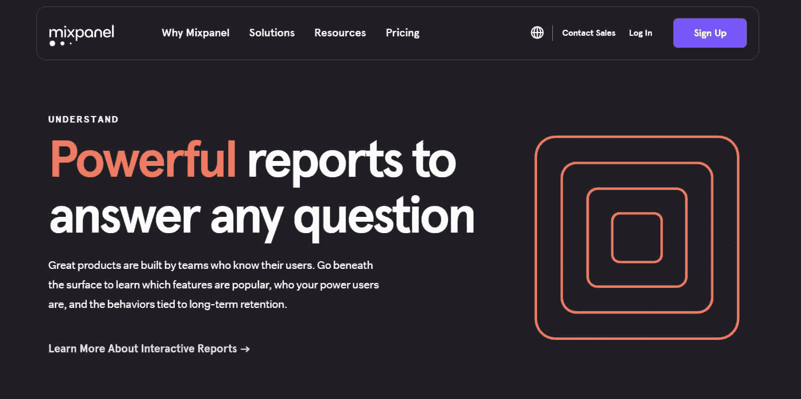

The Mixpanel homepage. (Image source: [Mixpanel](https://mixpanel.com/))

与谷歌分析类似， [Mixpanel](https://mixpanel.com/) 是一个专注于用户行为的工具，可以更好地帮助你更广泛地了解你的受众。该平台专为需要用户如何与给定网站或移动应用程序交互的详细数据的产品团队而构建。

Mixpanel 提供对用户组的报告和洞察，以及创建分段集群的能力，以查看每个用户组如何参与您的服务。

您还可以按单个公司按组跟踪用户。因此，您将能够确定客户最有可能转化的时间，以及追加销售的最佳可能性。

此外，Mixpanel 为团队提供了一个附加的数据治理工具，可以将重复的数据合并到一个日志中，并删除不相关的信息。该工具在视觉上令人瞠目结舌，但可能有点难以配置。

**定价:**

Mixpanel 除了两个高级包(增长和企业)之外，还为初创公司提供了一个免费计划。增长会员每月花费 25 美元，而企业订阅是基于定制的。

**特性:**

*   丰富的细分功能
*   流畅的视觉效果
*   可定制的计划
*   数据导入和导出
*   实时数据跟踪
*   高级分析
*   免费计划

### 15\. SpyFu

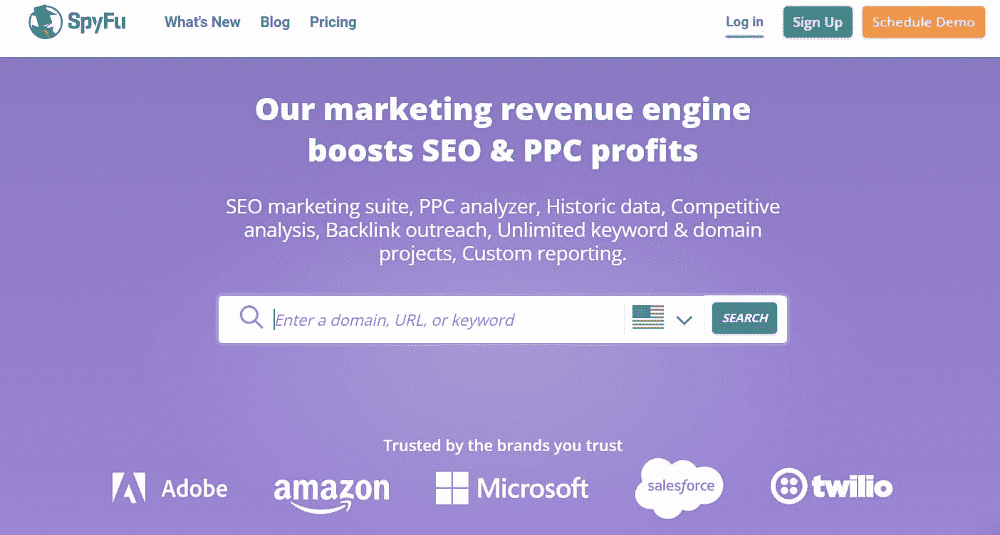

The SpyFu homepage. (Image source: [SpyFu](https://www.spyfu.com/))

从它的名字，你可能猜到了 SpyFu 是关于什么的:监视你的竞争对手。

SpyFu 专门从事域和关键字分析，但它也作为反向链接分析解决方案具有优势。这是一个很好的 SEO 和 PPC 选择，对于那些希望专注于关键基准的小企业来说，这将使他们以可承受的价格出现在 Google 搜索结果的第一页。该工具提供建议，以帮助您发展您的搜索引擎优化和谷歌广告活动。

此外，SpyFu 使您能够与值得信赖的联系人互动，以产生线索并建立有利可图的联系。此外，您可以使用它来进行广泛的竞价排名竞争对手的分析，检查他们收到多少点击，并下载您的对手的所有竞价排名关键字没有任何下载限制。

 SpyFu 包括一个有用的功能，可以从目标网站收集联系信息，为您节省大量的手工工作。此外，您可以选择添加注释，并对每个潜在链接的重要性进行评级。

另一方面，你应该记住 SpyFu 不会抓取网站。如果你需要一个网站技术健康的详细分析，考虑让一个 SEO 爬虫与 SpyFu 配对。

**定价:**

SpyFu 有三种计划(基本、专业和团队)可以按月和按年订阅。每月价格从 39 美元到 299 美元不等，所有会员资格都包括 30 天退款保证。

**特性:**

*   非常适合竞争对手分析
*   SEO 和 PPC 搜索功能
*   多达无限的搜索结果和数据导出
*   多达 40，000 个跟踪关键词排名
*   定制品牌报告
*   销售线索过滤器
*   API 访问

## 摘要

现在我们已经到了指南的末尾，你可以看到有很多网站流量分析解决方案可以依赖。

[Finding the best tool to measure your site traffic can be tricky because there are so many options available. 😅 These are the 15 best ✨Click to Tweet](https://twitter.com/intent/tweet?url=https%3A%2F%2Fkinsta.com%2Fblog%2Fwebsite-traffic-analysis%2F&via=kinsta&text=Finding+the+best+tool+to+measure+your+site+traffic+can+be+tricky+because+there+are+so+many+options+available.+%F0%9F%98%85+These+are+the+15+best+%E2%9C%A8&hashtags=SEO%2CWebTraffic)

如果你有应用程序，管理数据库或运行 WordPress 网站，MyKinsta Analytics 是一个很好的选择——特别是因为它包含在我们所有的 T2 应用程序托管计划中。

如果有机流量是你提高搜索排名的重中之重，Ahrefs 或 Semrush 是提供[高质量 SEO 功能](https://kinsta.com/seo-hosting/)的绝佳选择。

你更在乎付费流量吗？然后选择一个围绕[付费广告](https://kinsta.com/blog/ad-networks/#what-is-an-ad-network)的工具，比如 Similarweb。

请记住，无论你使用什么工具来跟踪用户流量和行为，快速评估从中获得的信息并为你的网站制定行动计划是至关重要的。这样，你就一定能在竞争中保持领先。

我们是否遗漏了另一个重要的网络分析工具？请在下面的评论区告诉我们。

* * *

让你所有的[应用程序](https://kinsta.com/application-hosting/)、[数据库](https://kinsta.com/database-hosting/)和 [WordPress 网站](https://kinsta.com/wordpress-hosting/)在线并在一个屋檐下。我们功能丰富的高性能云平台包括:

*   在 MyKinsta 仪表盘中轻松设置和管理
*   24/7 专家支持
*   最好的谷歌云平台硬件和网络，由 Kubernetes 提供最大的可扩展性
*   面向速度和安全性的企业级 Cloudflare 集成
*   全球受众覆盖全球多达 35 个数据中心和 275 多个 pop

在第一个月使用托管的[应用程序或托管](https://kinsta.com/application-hosting/)的[数据库，您可以享受 20 美元的优惠，亲自测试一下。探索我们的](https://kinsta.com/database-hosting/)[计划](https://kinsta.com/plans/)或[与销售人员交谈](https://kinsta.com/contact-us/)以找到最适合您的方式。