# Weebly vs WordPress:哪个最适合你的网站？(2022 年全对比)

> 原文：<https://kinsta.com/blog/weebly-vs-wordpress/>

这些天来，当涉及到为你的企业创建一个网站的挑战时，我们被赋予了一种尴尬的财富。当然，这是一个很大的问题，但它仍然是一个问题。当您考虑到需要保持在您的预算之内、匹配您的技能水平，并与您的业务目标和需求保持一致时，这一挑战可能会变成一项非常复杂的任务，尤其是对于那些不以编程为职业或业余爱好的人来说。

在这种情况下，大多数人考虑的两个顶级策略是 DIY 解决方案，主要是[自托管 WordPress](https://kinsta.com/learn/wordpress-history/) ，以及简单、全包的网站建设者，如 Weebly。

哪个适合你取决于什么对你来说是重要的。

在这篇 Kinsta 评论中，我们将根据几个关键因素来比较这两个平台——Weebly 和 WordPress，从用户友好性到 SEO 工具等等，来帮助你为你的企业或个人网站做出正确的决定。

在我们开始之前有一点需要注意:当我们在本文中提到 WordPress 时，我们指的是你可以从 WordPress.org 下载并上传到你的托管公司的服务器上的开源平台，而不是你通过 WordPress.com 得到的精简版。两个之间有[的巨大差异。](https://kinsta.com/blog/wordpress-com-vs-wordpress-org/)

准备好开始了吗？太好了！

## Weebly vs WordPress:数字说明了什么

WordPress 于 2003 年推出，主要是作为一个博客平台，今天已经是一个成熟的内容管理系统，覆盖了 34%的网站和超过 60%使用内容管理系统的网站。

WordPress logo

另一方面，Weebly 在 2006 年起死回生，这要归功于戴夫·鲁森科、克里斯·范尼尼和丹·维尔特里，他们在 22 岁时还是宾夕法尼亚州立大学的学生，共同创立了这家公司。Weebly 随后于 2018 年被 Square Inc .收购。

Weebly logo

Weebly 背后的最初想法是让宾夕法尼亚州立大学的学生生活更轻松。怎么会？当时，宾夕法尼亚州立大学要求所有学生都有一个[在线文件夹](https://kinsta.com/blog/wordpress-portfolio-plugins/)，可以通过这样的平台轻松创建和更新。这三个人看到了一个未开发的机会，并推出了他们的产品。

至于 Weebly 的市场份额，0.4%的网站使用它，0.7%的网站使用 CMS:

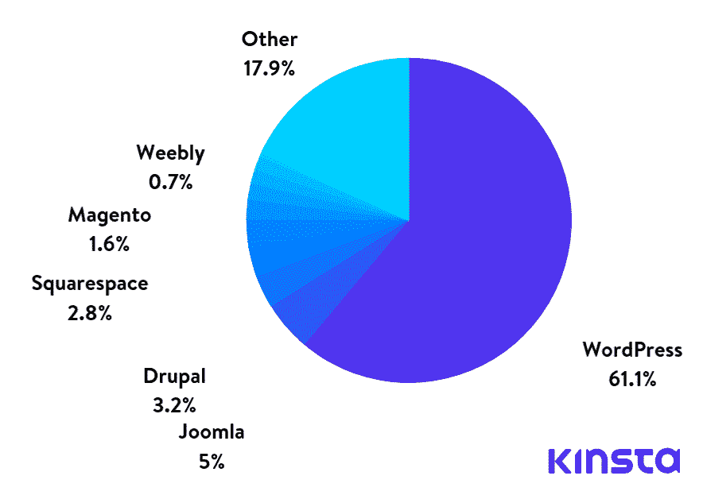

CMS market share

与 WordPress 相比，围绕 Weebly 的兴趣从未如此接近，并在 2014/2015 年达到顶峰，当时 Weebly 从红杉资本和腾讯控股有限公司获得了 3500 万美元的 C 轮融资。并扩大了在欧洲的业务。这两条消息可能都给该公司带来了更多的关注。

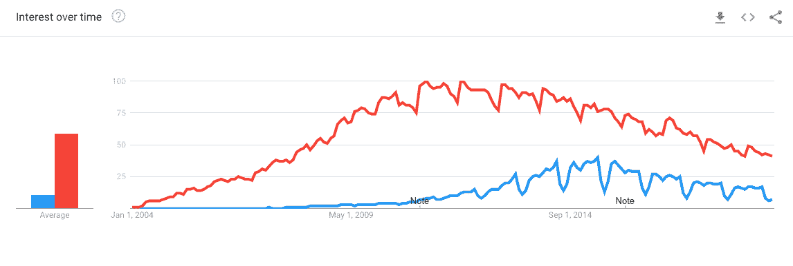

Weebly vs WordPress at Google Trends

所以关键问题是:WordPress 是你的正确选择吗？或者你应该选择 Weebly？我们来找个答案吧！

## Weebly vs WordPress:用户友好

**我们正在考虑:**一个全新的、没有技术天赋的人在尝试完成网站的基本工作时，例如添加文案、定位图片、更新内容等，会面临多大的学习曲线。？这些基本任务容易完成并且相当直观吗？或者你会发现自己蜷缩在键盘前，在网站的管理界面和 14 个不同的教程标签之间切换？

### Weebly

让我们从一开始就把这一点说清楚:Weebly 被认为是超级容易使用的——甚至可能是个人和企业使用的最简单的网站构建器。

Weebly site creation

在很大程度上，它赢得了这个声誉。Weebly 提供了一个简化的从头到尾的网站建设过程，使用一套集中的工具。你不必单独设置你的服务器，安装 WordPress，[安装主题](https://kinsta.com/blog/how-to-install-a-wordpress-theme/)和插件。

这种集中的设置、构建和管理方法可能对没有任何网站创建经验的人更有吸引力。

### WordPress

正如 Weebly 被认为超级容易学习和操作一样，WordPress 经常被认为对于没有技术头脑的新手来说很难学习。

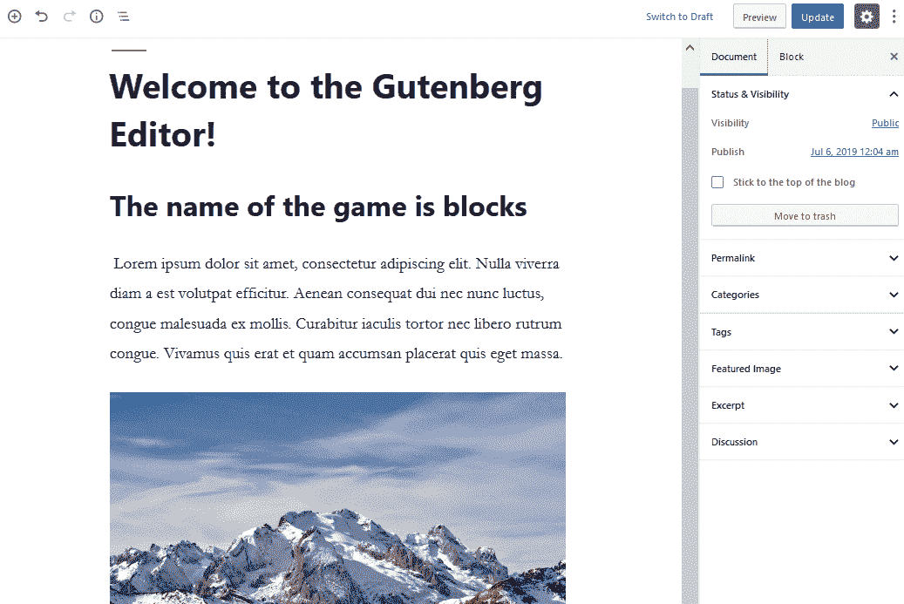

Block editor in WordPress

然而，在这种情况下，我们并不完全相信这个名声是完全值得的。WordPress 中格式化和发布内容的基础至少可以说是“所见即所得”——和大多数电子邮件程序一样简单。如果你能在 Gmail 中处理电子邮件的格式，只要稍加练习，你就能处理 WordPress。

WordPress 确实需要稍微复杂一点的设置过程，这将意味着处理[核心文件](https://kinsta.com/knowledgebase/wordpress-core/#what-is-wordpress-core)和安排托管，更不用说[从各种来源选择、安装和配置主题](https://kinsta.com/blog/change-wordpress-theme/)和[插件](https://kinsta.com/best-wordpress-plugins/)。这可能看起来很多，而且肯定比 Weebly 要求的多一点，但是在权衡中你确实得到了更多的控制。

## Weebly vs WordPress:可定制性

**我们正在考虑:**任何平台都可以创建一个功能性网站(或者应该能够创建)，但这里我们讨论的是这两种解决方案的灵活性。定制每个平台的“开箱即用”版本以满足您特定的品牌和业务需求有多容易？

### Weebly

Weebly onboarding theme selection

像 WordPress 一样，Weebly 采用了预制的主题。您可以使用拖放构建器自定义它的某些部分，但是您可以更改的内容实际上取决于您选择的主题。

主题本身为你的站点提供了基本的架构和结构。它还提供了一个基本的[网站配色方案](https://kinsta.com/blog/website-color-schemes/)或调色板。把它想象成一个背景或者舞台，在这个舞台上你将构建和定制你的站点的其余部分。

一般来说，这里你有两个选择。你可以选择一个尽可能接近你所寻找的主题，然后调整那些你想改变的东西。或者，您可以使用站点的基本主题作为框架，并在此基础上构建您的站点。

如果你知道 HTML 和 CSS，除了下载主题文件，在你自己的文本编辑器中编辑它们，然后重新上传新的文件。请注意，在某些情况下，这种访问可能会受到限制。Weebly 确实给了你一个关于[如何定制其主题](https://dev.weebly.com/pf_themes_tutorial.html)的教程。

### WordPress

开发者已经为 WordPress 构建了数千个主题。此外，您可以从几个[拖放框架](https://kinsta.com/blog/wordpress-page-builders/)中进行选择，比如 Divi，它给了您同样大的灵活性。当然，总是有可能雇佣你自己的开发者来为你和你的品牌创建一个独特的主题，尽管这可能超出了许多个人和全新企业的有限预算。

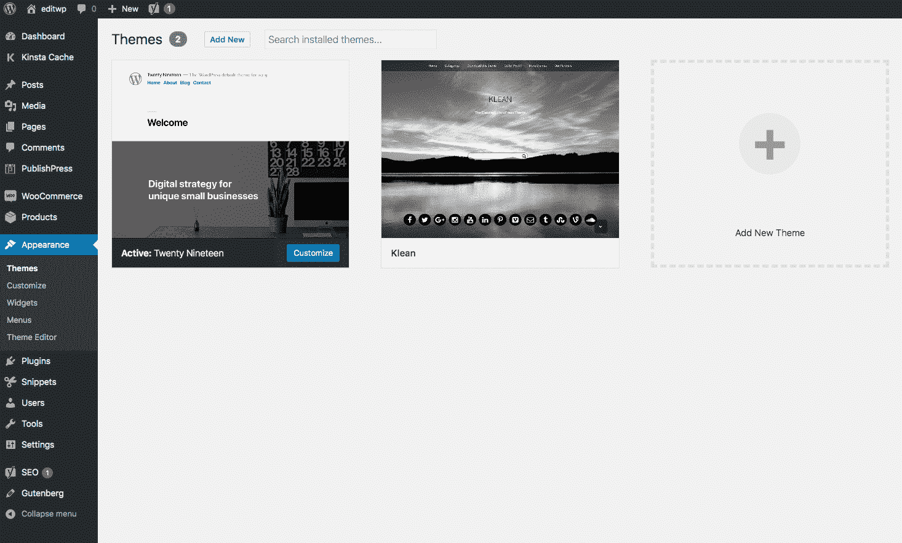

Current theme in WordPress

和 Weebly 一样，那些会编码的人在对网站外观进行更精细的控制方面有着明显的优势。如果你知道 HTML、CSS 和 JavaScript，你可以在你的网站上修改任何你想要的东西。最佳实践是[创建一个子主题](https://kinsta.com/blog/wordpress-child-theme/)来和你的父主题一起工作。

这里的底线是 WordPress 在定制你的网站时可能更强大。但是，这种可定制性会带来额外的复杂性或费用，这取决于您选择如何进行。

## Weebly vs WordPress:电子商务

**我们正在考虑:**向您的网站添加购物车并管理其基本功能有多简单？基本的电子商务控制有多直观，这些选项有多灵活？

### Weebly

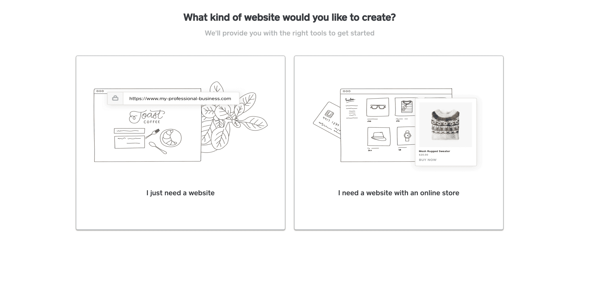

Weebly onboarding ecommerce

首先，好消息是:是的，Weebly 支持电子商务。你可以销售实物商品或数字产品(如电子书、音频文件)，当你的客户结账时，他们会在你的域名上结账——他们不会被重定向到其他网站，从而增加他们对你品牌的信任和安全感。

不利的一面不一定会成为许多网站所有者的交易破坏者，但它们应该被考虑。

首先也是最重要的，你所享受的精确的电子商务功能将完全取决于你选择的包装级别。专业级用户只能销售有限数量的产品，在税收或运输选项上没有灵活性，并且每次交易支付相当于总额 3%的费用。有了商业计划，更上一层楼，你可以想卖多少产品就卖多少，你还可以控制运费和税收，而且没有交易费。企业用户还可以享受一些更高级的电子商务功能。

另一个考虑是，Weebly 的任何计划都没有直运选项，而且这种情况也不太可能很快改变。如果这对你很重要，WordPress 是你更好的选择。

结果是，如果你的品牌只需要一个最小的电子商务存在，或者如果完整的商业计划符合你的预算，Weebly 将为你工作。如果你需要更多的控制，你可能会从 WordPress 得到更多。

### WordPress

几乎普遍地，WordPress 电子商务依赖于你的电子商务插件的强度。不过，这确实是一件好事，因为有一些优秀的、编码良好的电子商务插件可用于 WordPress 网站。

这意味着您将在设置您的在线商店体验以及支持您的电子商务业务的基础网站方面享有极大的灵活性。这种灵活性和定制化是任何 SaaS 电子商务解决方案都无法达到的。

与此同时，您仍将享受同样强大的基本和高级电子商务功能，帮助您[使您的在线商店取得成功](https://kinsta.com/blog/ecommerce-strategies/)。

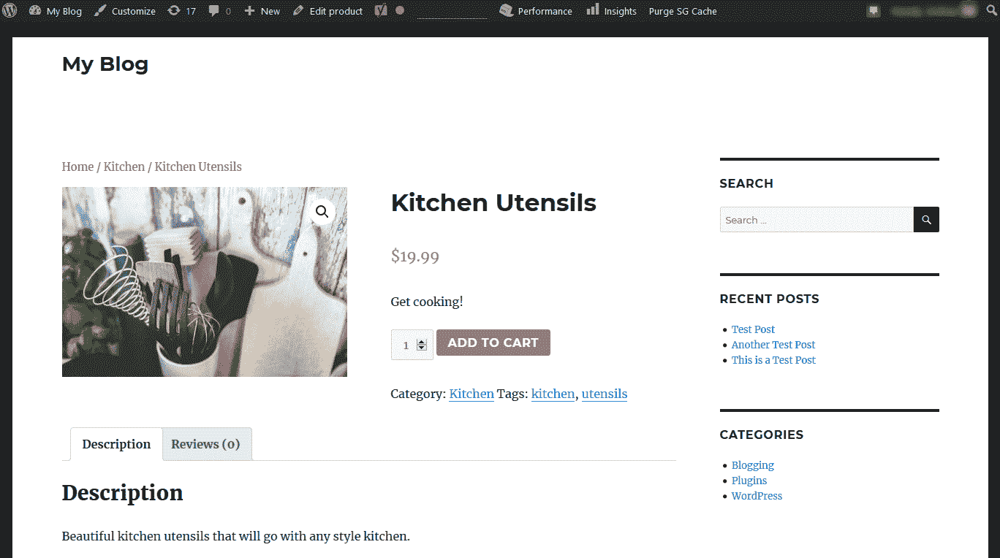

Woocommerce frontend example

从你可以销售的产品的种类和数量，通过你的买家购物体验的准确路径[，到结账等等，WordPress 允许你定制和控制你的电子商务网站](https://kinsta.com/blog/shopping-cart-abandonment/)[的每个方面](https://kinsta.com/blog/woocommerce-tutorial/)。你也可以合并直运。

## 注册订阅时事通讯

### 想知道我们是怎么让流量增长超过 1000%的吗？

加入 20，000 多名获得我们每周时事通讯和内部消息的人的行列吧！

[Subscribe Now](#newsletter)

权衡，一如既往，所有这些灵活性意味着你必须做更多的研究来为你的计划找到合适的插件。这也意味着设置和配置你的插件选项要多做一些工作。回报是你在其他地方很难找到的控制度。

## Weebly vs WordPress: SEO 和代码

**我们正在考虑的:**基本的界面和代码结构是否允许你[为搜索引擎优化你的网站](https://kinsta.com/blog/what-does-seo-stand-for/)，如果是，到什么程度？这些控件的访问有多简单？

### Weebly

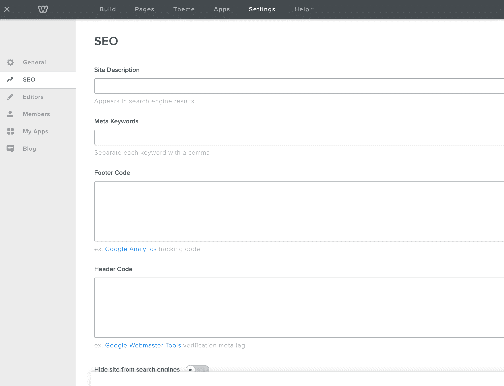

Weebly site setup SEO options

有了 Weebly，你可以访问最基本的 SEO 任务，比如定制页面标题、[元描述](https://kinsta.com/blog/meta-description-wordpress/)，以及为你的站点的所有页面定制 URL。但是，标题的使用是有限的(仅限 H1 和 H2)。如果你想编辑这些，你可能需要从 Weebly 商店安装一个第三方应用程序。

你可以为你的图片编辑 alt 标签，设置 301 重定向，甚至访问你网站的一些底层代码。对于所有的计划(包括免费的)，您都可以利用 SSL 安全性。还有一个空间，你可以[粘贴你的谷歌分析代码](https://kinsta.com/blog/how-to-use-google-analytics/#2-install-your-google-analytics-tracking-code)。

### WordPress

WordPress 插件，以及一些主题([通常是高级的](https://kinsta.com/blog/wordpress-free-vs-paid-themes/))，允许你不同程度地访问重要的字段和代码，以扩展其原生的 [WordPress SEO](https://kinsta.com/blog/wordpress-seo/) 功能。这包括页面标题、元描述等等(建议阅读:[如何在 WordPress 上使用 Yoast SEO:Complete Tutoria](https://kinsta.com/blog/yoast-seo/)l)。

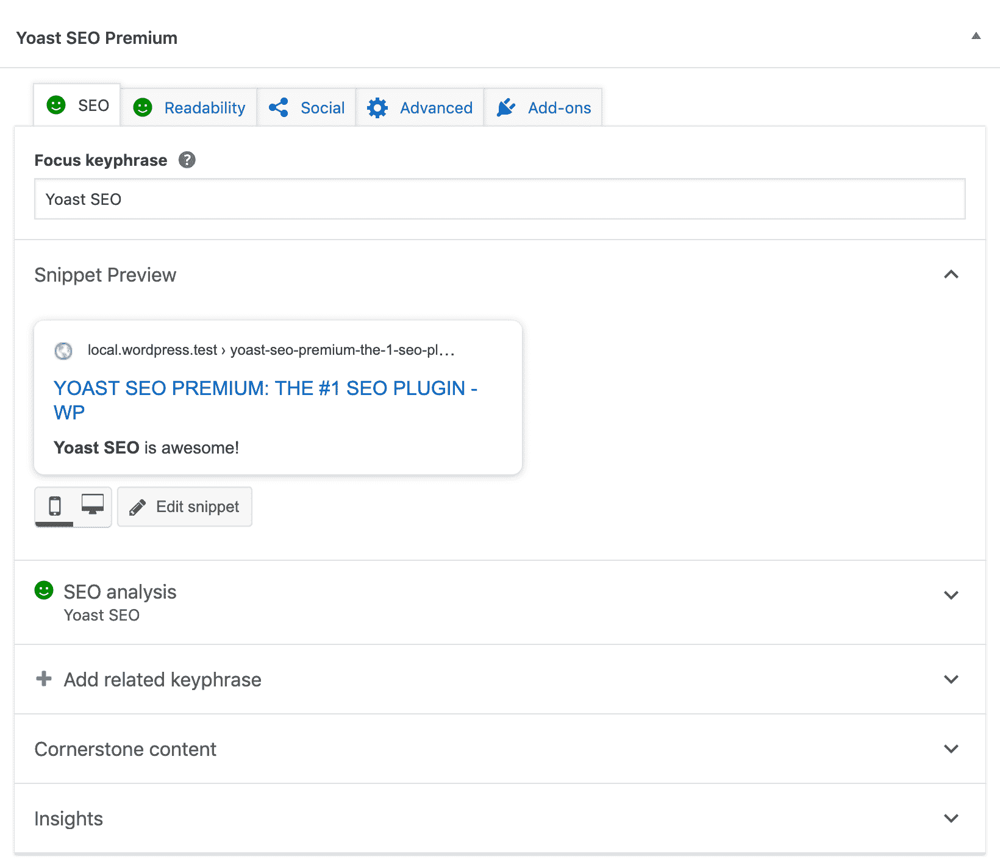

Yoast SEO plugin example

直接开箱即用，WordPress 优先考虑搜索引擎优化。内置了自定义 URL 和 URL 结构选项，以及编辑图片上传的 alt 标签的功能。您可以完全控制所有标题，包括 H3 和其他，并且可以通过更改 CSS 随意定制外观。

[Google Analytics 代码可以通过插件添加](https://kinsta.com/blog/google-analytics-wordpress/)或者通过仪表板的代码编辑器手动插入。 [SSL](https://kinsta.com/help/how-to-install-ssl-certificate/) 和 [301 重定向](https://kinsta.com/blog/wordpress-redirect/)也可以通过外部解决方案和插件获得。

建议阅读:[市场上为 WordPress 开发者和高级用户提供的 10 款免费 HTML 编辑器](https://kinsta.com/blog/free-html-editor/)。

## Weebly vs WordPress:支持和社区

当你遇到自己无法解决的问题时，你能指望多少支持？

### Weebly

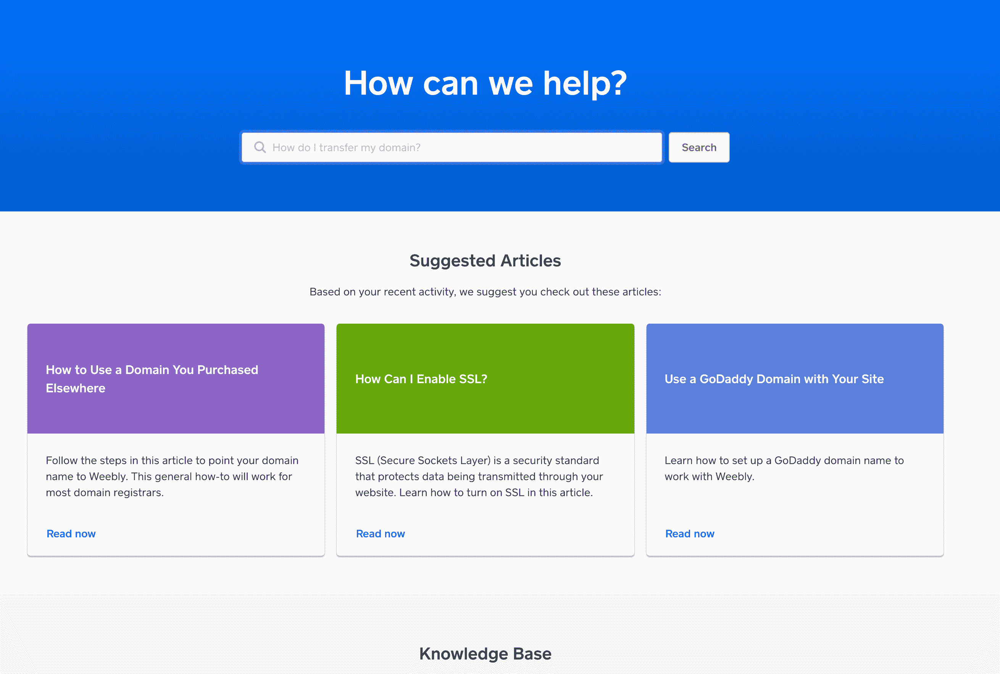

Weebly support homepage

作为一家成熟的 SaaS 企业，Weebly 优先考虑为其所有客户提供集中支持。Weebly 通过其客户服务团队和知识库提供专业支持。此外，您可以在其社区支持论坛中寻求其他用户的帮助。

### WordPress

WordPress 支持可以采取多种不同的形式。

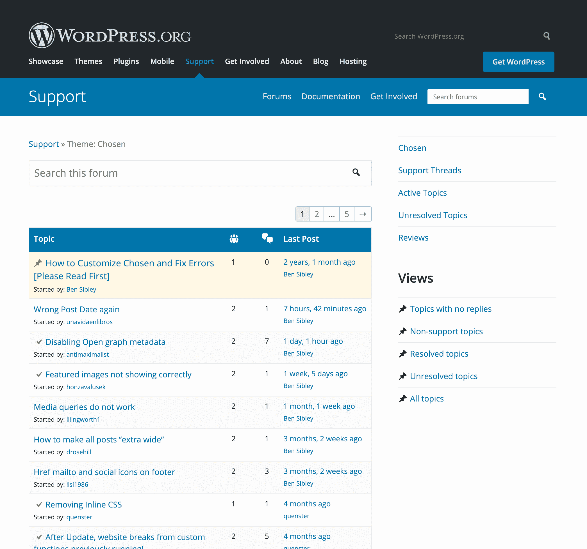

WordPress support forums

对 WordPress 网站用户来说，最大的帮助来源之一是其强大、热情的用户社区。数以百万计的忠实粉丝和专业开发者可以通过许多论坛和留言板提供帮助和支持，其中最主要的是官方 WordPress 论坛。此外，您可以通过查看[高级支持解决方案](https://kinsta.com/blog/wordpress-support/#premium-wordpress-support)获得更直接的一对一支持。

Struggling with downtime and WordPress problems? Kinsta is the hosting solution designed to save you time! [Check out our features](https://kinsta.com/features/)

## Weebly vs WordPress:管理和维护

**我们正在考虑的:**在持续的基础上，保持您的网站更新、无垃圾邮件和正常运行的难易程度如何？

### Weebly

Weebly 的自包含性意味着您在很大程度上摆脱了困境，至少在安全和功能更新方面是如此。公司会为你处理所有的事情。简单，直接，超级容易。

然而，这也意味着你无法控制这个过程，所以如果这种控制对你很重要，Weebly 可能不是你的最佳选择。

然而，这里有一个仪表盘，你可以管理网站的搜索引擎优化、编辑、会员(如果你运营的是会员制网站*)和已安装的应用程序。*

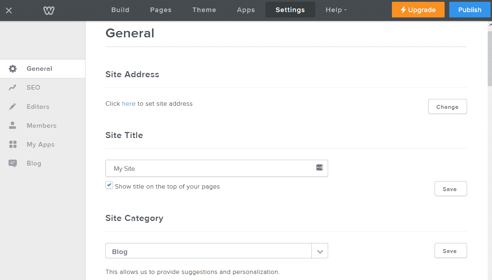

Weebly general settings dashboard

您还可以控制一些博客设置，例如显示多少帖子，是否启用共享图标，最重要的是，如何处理内置的评论系统，以防止垃圾邮件。

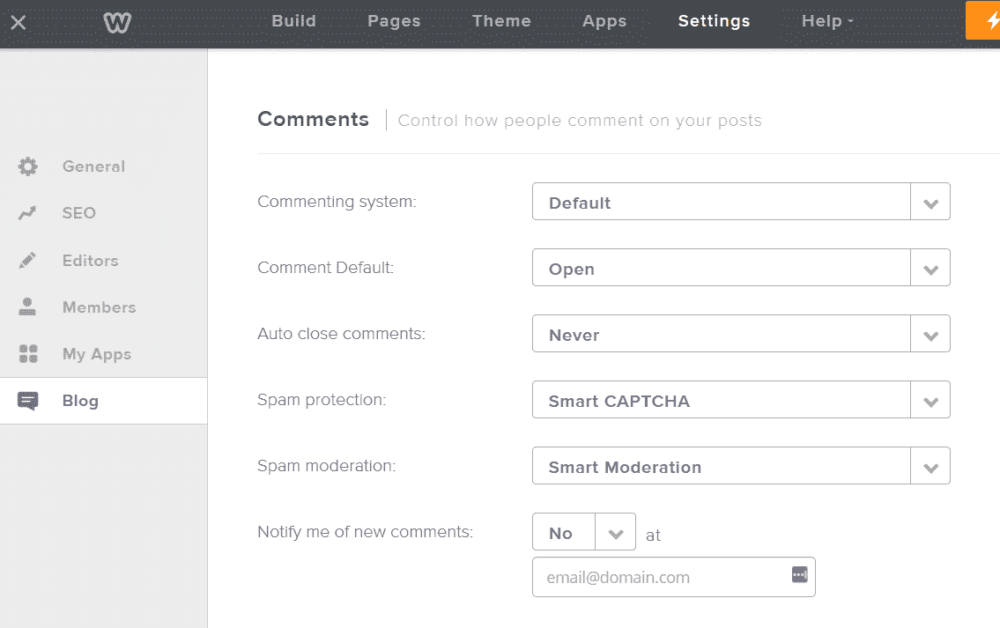

Weebly blog settings

### WordPress

Automattic 持续发布 WordPress 核心文件更新。WordPress 系统的优势之一是它拥有一个忠诚的、活跃的、有才华的开发者社区，所以更新会及时发布，也许会很频繁。

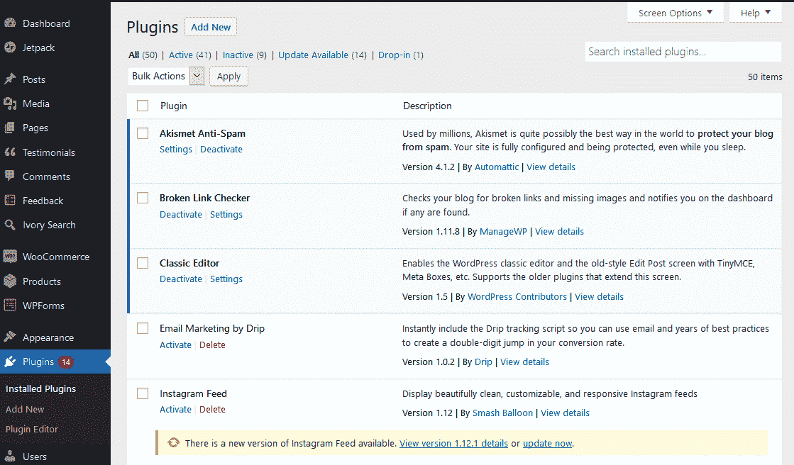

WordPress updates

然而，核心文件更新只是管理过程的一个方面。当新版本发布时，您还需要确保由于新版本的发布，现在可能需要任何其他更新。

但是有时候插件开发者跟不上开发进度，所以旧的插件可能会过时，出现需要解决的安全漏洞。

如今，使用当前版本和[一键式更新](https://kinsta.com/blog/wordpress-automatic-updates/)进行更新也更加容易，尽管你应该总是首先进行完整的[备份](https://kinsta.com/help/wordpress-backups/)，除非你使用的是 Kinsta，它提供自动[每日备份](https://kinsta.com/features/)和随时创建手动备份点的选项。

## Weebly vs WordPress:初始和持续成本

**我们正在考虑:**你的新网站在前期成本和经常性成本方面会花多少钱？

### Weebly

Weebly 集中了您的所有成本，这在争论发票和费用方面提供了附加值。

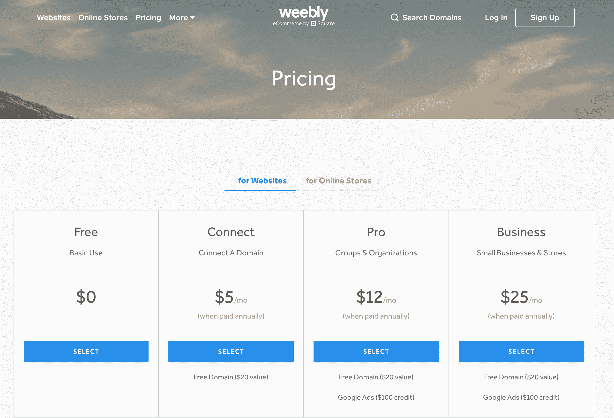

Weebly pricing plans

它提供了四个计划。在价格范围的一端，有一个供个人使用的免费计划。你会得到一个二级域名(即 mysite.weebly.com)，以及基本的站点工具。电子商务在这个级别不可用。每月 5 美元(按年支付)，你可以注册“连接一个域名”计划，这基本上是个人计划，但有你自己的(顶级)域名移植。这两个计划都带有 Weebly 广告展示。

Pro 计划每月花费 12 美元(按年支付)，包括一年的免费域名注册以及 100 美元的谷歌广告积分。当然，在接下来的几年里，你仍然有责任保持域名注册的有效性。你也可以删除那些 Weebly 广告，并可以享受最少的电子商务功能。

每月 25 美元(按年支付)，商业计划为中小型企业和电子商务商店提供更大的灵活性和功能。您将获得与 Pro plan 相同的免费初始域名注册和 100 美元的谷歌广告积分，没有 Weebly 广告，以及全套强大的电子商务平台和工具。

### WordPress

WordPress 是开源的，所以[它的核心文件是免费的](https://kinsta.com/blog/is-wordpress-free/)。你将需要额外的 [WordPress 主机](https://kinsta.com/wordpress-hosting/)，通常[的费用从 10 美元到更多](https://kinsta.com/blog/cheap-wordpress-hosting/)，取决于你选择的基础设施和主机方案。

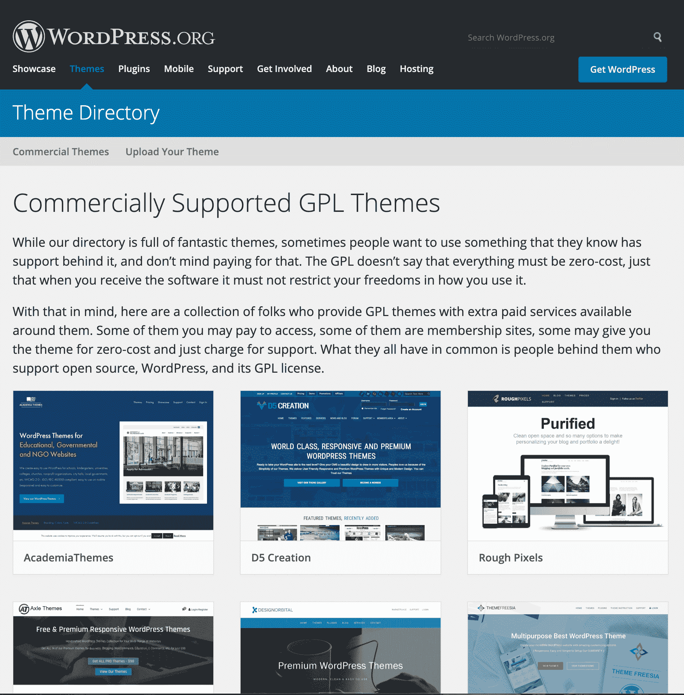

WordPress commercial themes homepage

数以千计的免费主题可供选择，但许多品牌和企业更喜欢投资一个[独特的或可定制的框架主题，根据功能的不同，其价格可能高达数千美元](https://kinsta.com/blog/wordpress-website-cost/)。

大多数插件也是免费的，尽管许多也有提供额外功能的高级版本。

[你的域名](https://kinsta.com/blog/how-much-does-a-domain-name-cost/)也需要注册，平均每年花费[12 美元左右](https://kinsta.com/blog/how-much-does-a-domain-name-cost/#how-much-cost)(取决于你是否从你的域名注册机构选择私人注册和其他服务)。

如果你决定[雇佣一名开发人员或设计师](https://kinsta.com/blog/hire-wordpress-developer/)来帮助你创建一个主题或处理安装和设置的技术方面，你可以预期你的总成本会增加几百到几千美元。

[Weebly vs WordPress: What's the best choice? Check out the key differences in our thorough comparison! 🤔❌✅Click to Tweet](https://twitter.com/intent/tweet?url=https%3A%2F%2Fkinsta.com%2Fblog%2Fweebly-vs-wordpress%2F&via=kinsta&text=Weebly+vs+WordPress%3A+What%27s+the+best+choice%3F+Check+out+the+key+differences+in+our+thorough+comparison%21+%F0%9F%A4%94%E2%9D%8C%E2%9C%85&hashtags=wordpress%2Ccms)

## 摘要

在 Weebly's corner，我们可以将 SaaS 网站建设者的优势总结如下:

*   集中化和简单易用。
*   专业、集中的支持。
*   “物有所值。”
*   基于需求规模的四个计划。

对谁最有利？

*   个人，自由职业者，小企业主，电子商务网站所有者，他们只想要一个简单，直接的网站，不需要一吨的铃铛和口哨或特定的定制
*   任何人更感兴趣的是快速和容易地建立一个网站，而不是创建一个“刚刚好”的网站

WordPress 的优势包括:

*   令人难以置信的通过主题和编码的可定制性。
*   通过插件实现功能的广度和深度。
*   更高层次的控制。
*   开源软件。
*   由忠诚热情的用户和开发人员组成的广泛支持网络。

谁会觉得 WordPress 是最好的解决方案？

*   任何规模的组织，从自由职业者到大公司
*   那些有时间和兴趣去适应一个小的学习曲线的人，那些可以每周花几个小时来保持网站更新、安全和正常运行的人

* * *

让你所有的[应用程序](https://kinsta.com/application-hosting/)、[数据库](https://kinsta.com/database-hosting/)和 [WordPress 网站](https://kinsta.com/wordpress-hosting/)在线并在一个屋檐下。我们功能丰富的高性能云平台包括:

*   在 MyKinsta 仪表盘中轻松设置和管理
*   24/7 专家支持
*   最好的谷歌云平台硬件和网络，由 Kubernetes 提供最大的可扩展性
*   面向速度和安全性的企业级 Cloudflare 集成
*   全球受众覆盖全球多达 35 个数据中心和 275 多个 pop

在第一个月使用托管的[应用程序或托管](https://kinsta.com/application-hosting/)的[数据库，您可以享受 20 美元的优惠，亲自测试一下。探索我们的](https://kinsta.com/database-hosting/)[计划](https://kinsta.com/plans/)或[与销售人员交谈](https://kinsta.com/contact-us/)以找到最适合您的方式。