# 前 40 种坚固的西方字体(包括免费和高级选项)

> 原文：<https://kinsta.com/blog/western-fonts/>

如果你正在做一个需要大胆和引人注目的设计项目，高质量、粗犷的西方字体可能是一个完美的选择。唤起狂野西部、牛仔、未知的荒野和自由精神的字体是给你的设计组合[添加个性和](https://kinsta.com/blog/web-design-best-practices/)[独特风格](https://kinsta.com/blog/calligraphy-fonts/)的好方法。

西方字体在许多专注于排版的设计中也是常年受欢迎的，尤其是对于那些希望摆脱 T2 更现代字体的人来说。西方字体在海报、徽标、名片、传单等上面看起来很棒。

在本帖中，我们收集了你可以在自己的设计和网站上使用的最好的高质量西方字体。

## 19 种免费西方字体

下面，您将找到适合您项目需求的最佳免费西方字体。此列表中的一些字体可免费用于个人和商业用途，而其他字体只允许个人使用。在项目中使用每种字体之前，请务必检查其许可。

[Cowboys, the uncharted wilderness, and a free spirit: channel them all when you use a high-quality Western font for your next design 🐴 Giddy up! 🤠Click to Tweet](https://twitter.com/intent/tweet?url=https%3A%2F%2Fkinsta.com%2Fblog%2Fwestern-fonts%2F&via=kinsta&text=Cowboys%2C+the+uncharted+wilderness%2C+and+a+free+spirit%3A+channel+them+all+when+you+use+a+high-quality+Western+font+for+your+next+design+%F0%9F%90%B4+Giddy+up%21+%F0%9F%A4%A0&hashtags=Typography%2CFonts)

### 1.邦塞格罗

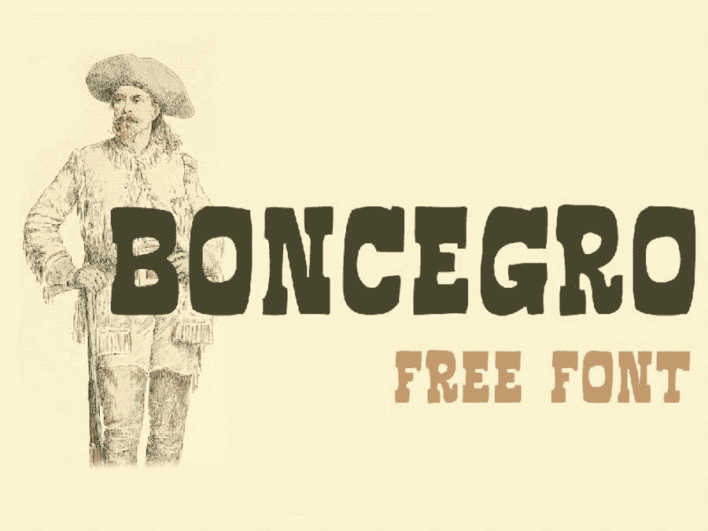

The Boncegro font.

首先，我们有 [Boncegro 字体](https://www.behance.net/gallery/21403653/Boncegro-FF-%28Free-Typeface%29)，它支持拉丁和西里尔字母。它很有个性，非常适合做海报和标志。该字体可免费用于个人和商业用途。
T3】

### 2\. Klipan Black

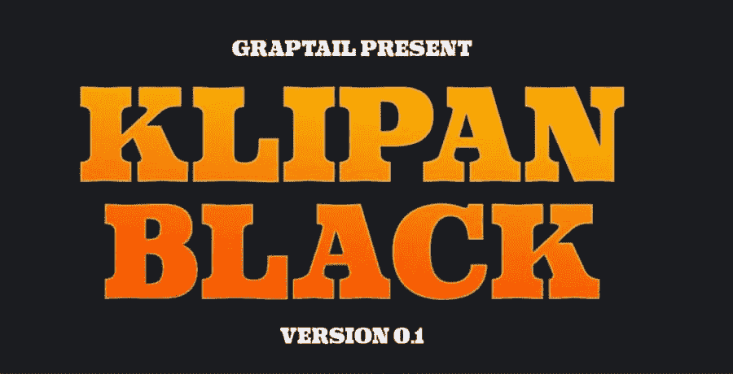

The Klipan Black Western font.

借助这种令人惊叹的字体，获得老西部通缉令的外观。 [Klipan Black](https://www.behance.net/gallery/109362945/KLIPAN-BLACK-100-FREE-FONT) 包含超过 219 个字形。这种字体是多语言的，可以很好地用于标志设计、海报、菜单等等。它是在开放字体许可下授权的，可以用于个人和商业项目。

### 3.UNDRRTD

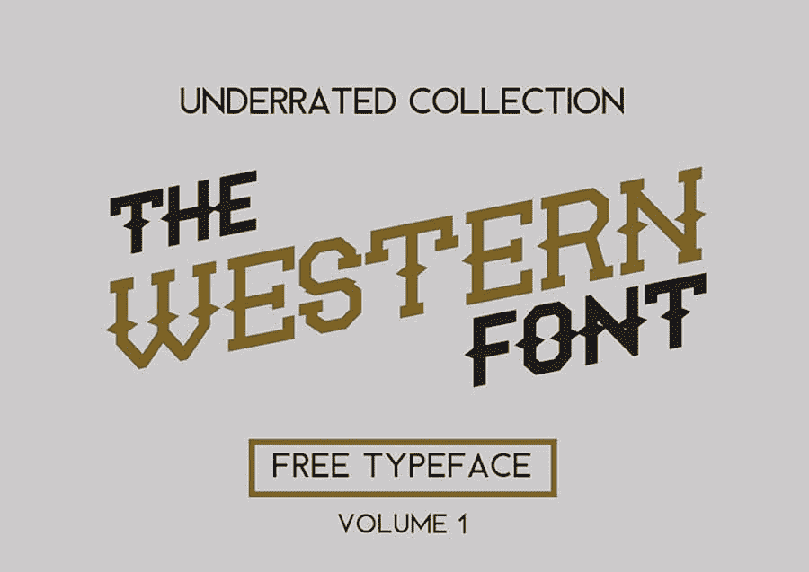

The Underrated Western font collection.

un RTD 确实是一种被低估的字体；它充满了个性。如果你想让你的设计充满冲击力，这是最好的选择。该字体带有一组基本的大写和小写字母，可用于商业和个人项目。

### 4.谢洛克人

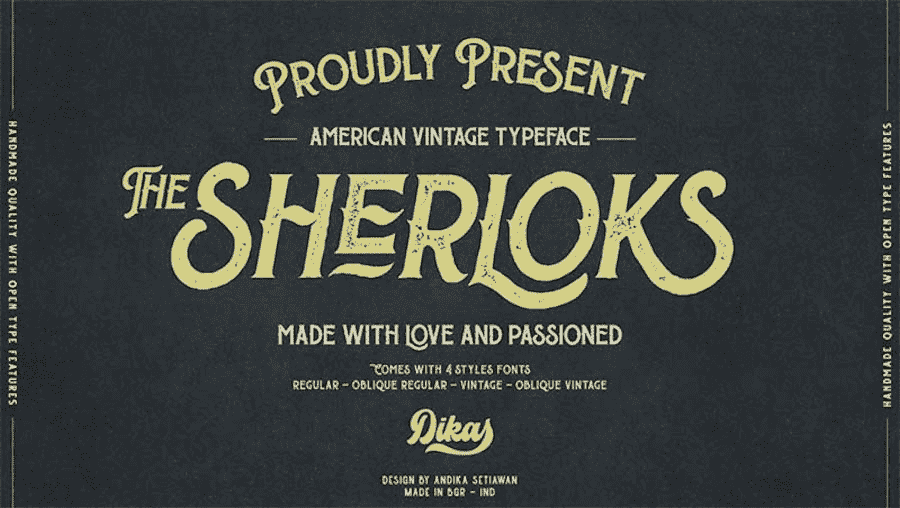

The Sherloks Western font.

Sherloks 字体是一种受美国风格启发的老式字体。它有四种不同的风格:常规、斜常规、复古和斜复古。它包括 88 个以上的字符和一套连字，以创造华丽的印刷设计。您可以在任何复古设计中使用它，包括品牌、徽标、产品包装、邀请函、报价、t 恤、标签、海报等等。该字体对于个人项目是免费的。

### 5.波拿巴家族

Bonaparte, a fancy vintage typeface.

受旧西方文化的影响，这种字体有一个粗犷而优雅的外观和感觉。它有多语言支持，并带有八种字体风格，替代字母形式，数字，大写和小写字形。您可以免费下载 [Bonaparte 常规粗细字体](https://www.behance.net/gallery/111820983/Bonaparte-Free-Font)，并在个人和商业项目中用于品牌、包装、邀请函等。
T3】

### 6.仙人掌

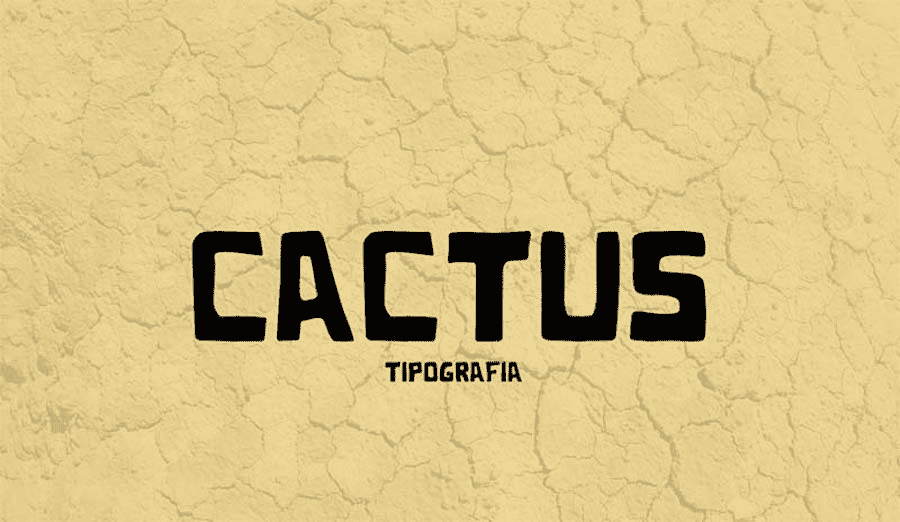

The Cactus Western font.

让人想起西方的仙人掌和沙漠地区，这种字体大胆，一定会让你的设计脱颖而出。它包括一组基本的字母符号、数字和标点符号。仙人掌西文字体可以在个人和商业项目中免费使用。它将在标志和海报设计中，或者在任何你需要大标题的地方工作得很好。

### 7.韦恩

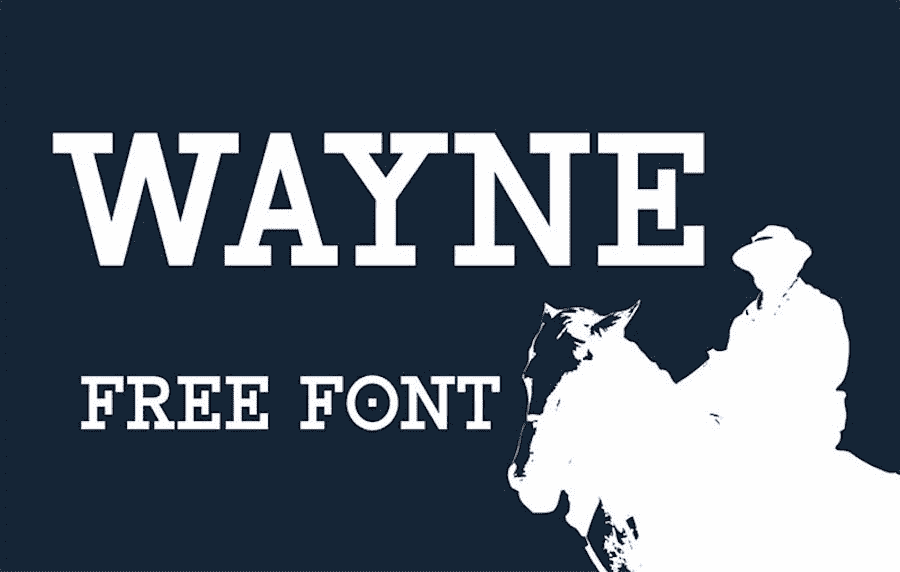

Wayne, a free Western font.

韦恩字体的灵感来自意大利式西部片以及克林特·伊斯特伍德和约翰·韦恩等演员。由勇敢的狮子字体创建，这是经典西方 slab 衬线的免费版本。该字体是海报和展示用途的绝佳选择，您可以在商业和个人项目中使用它。

### 8.Roadstore

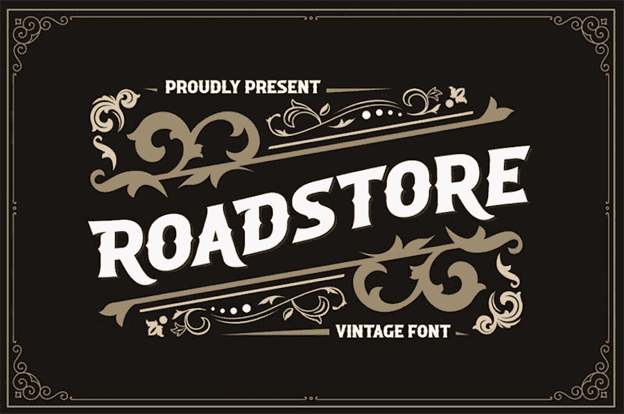

The Roadstore vintage font.

如果你正在寻找一种有风格的西方字体，考虑使用 [Roadstore 字体](https://www.dafont.com/roadstore.font)。个人使用它是免费的，对于任何需要醒目的牛仔字体的设计来说都是很好的。

### 9.夏洛克出版社

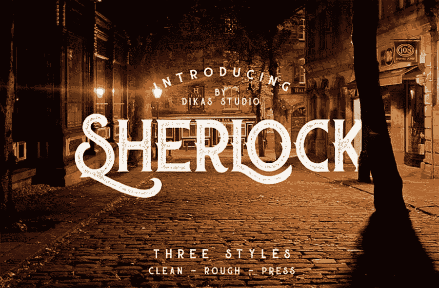

Sherlock Press, a font with three styles.

夏洛克出版社工作室的字体有一种优雅、复古的感觉。它有三种不同的风格:粗糙，新闻，和清洁，使其适合各种项目。这种全大写的西方字体非常适合用于徽标、海报、标签、包装等。个人使用免费。

### 10.报酬

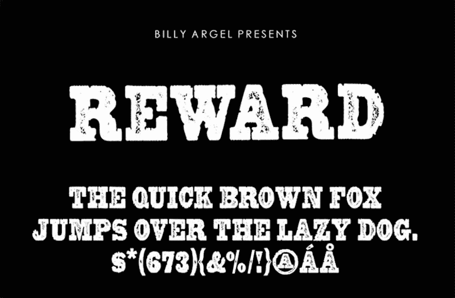

Reward, a Western-style font.

奖励一种粗犷的自由西部字体，让我们想起了狂野西部时代的通缉令。全大写字体非常适合任何展示用途，包括海报、标签和徽标。这是免费的个人使用，并有多语言支持。

### 11.万宝路（美国香烟品牌）

Marlboro, a free Western font.

如果你在寻找一种优雅而知名的字体，[万宝路](https://www.1001freefonts.com/marlboro.font)绝对是它。这种标志性字体可以在个人和商业项目中自由使用，是海报、标签和包装设计的绝佳选择。它包含大写和小写字母，数字和标点符号，以及多语言支持。
T3】

### 12.布奇&圣丹斯

Butch & Sundance, a free Western-inspired font.

有了这种字体，任何设计都会立刻有一种更叛逆的感觉。Butch & Sundance font 个人使用免费，商业使用需要捐赠。这种全大写的西式字体用在海报或包装设计上会很好看。然而，它也可以用来设计一个具有强大声明的标志。

### 13.香草鲸

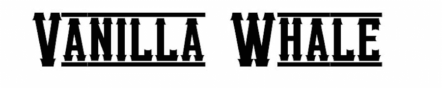

Vanilla Whale, a fun cowboy font.

用[香草鲸鱼字体](https://www.1001freefonts.com/vanilla-whale.font)释放你内心的牛仔。这是一种古老的西方字体，有一个不寻常的名字，但字体看起来像是属于酒吧的门。该字体可免费用于个人和商业用途。你会发现大写和小写字母，以及数字和标点符号。

### 14.阿比纳亚

Abhinaya, a Western-inspired font.

Abhinaya 字体的灵感来源于旧海报设计。它具有优雅的字体和每个字符的许多变体，包括 opentype 备用字符、常见的连字和附加的连字符号，允许您创建令人惊叹的印刷设计。这种字体可以免费供个人使用，可以很好地用于标识、信头、海报和服装设计。

### 15.水牛

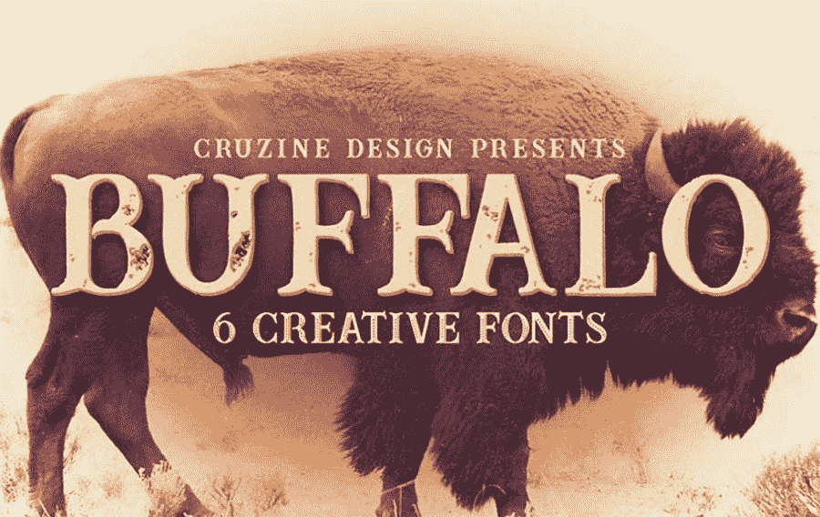

Buffalo, a set of six creative fonts.

水牛字体是完美的牛仔风格字体，具有质朴的外观和感觉。它很适合海报、包装、信头或标志设计。该字体带有大写字母、数字和标点符号。个人使用是免费的，可以购买商业许可证用于商业项目。

### 16.圣安东尼奥·沙罗斯

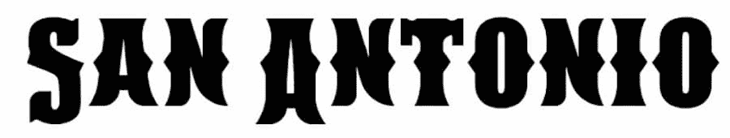

The San Antonio Charros free font.

这是一种加粗的西式字体，在海报上看起来会很棒。圣安东尼奥夏洛斯字体包含大写字母，个人使用免费。如果您想将它用于客户端项目，也可以使用商业许可证。

### 17.老密尔沃基

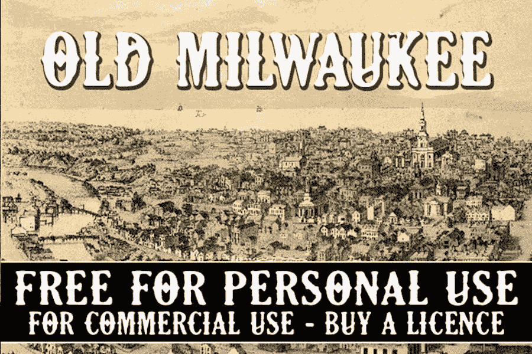

Old Milwaukee, a free Western font.

看着[老密尔沃基字体](https://www.fontspace.com/cf-old-milwaukee-font-f19717)，你会情不自禁地想到老西部的开阔空间。它非常适合海报设计以及包装和标志设计。该字体供个人免费使用。

### 18.兄弟之地

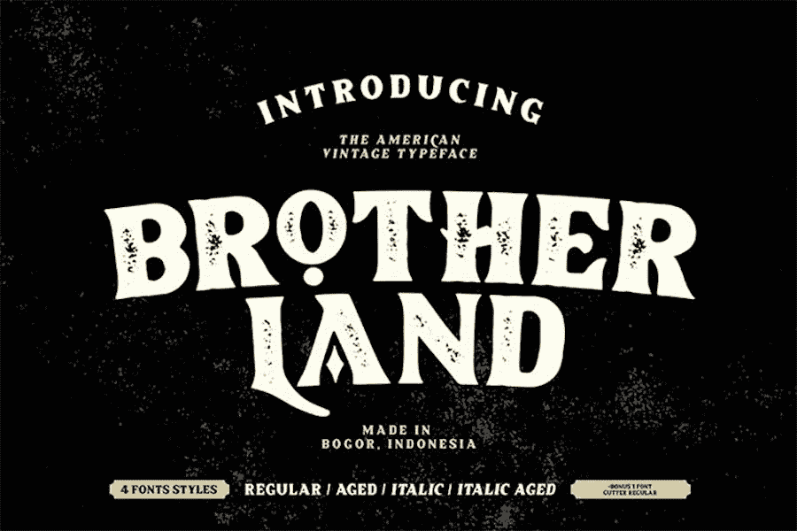

Brotherland, a Western font with four styles.

[Brotherland 字体](https://www.dafont.com/brotherland.font)的灵感来自于美国老式字体，有四种不同的风格和备用字符。它带有一套完整的符号、数字和标点符号。免费版可以用于个人项目。

### 19.达克特林

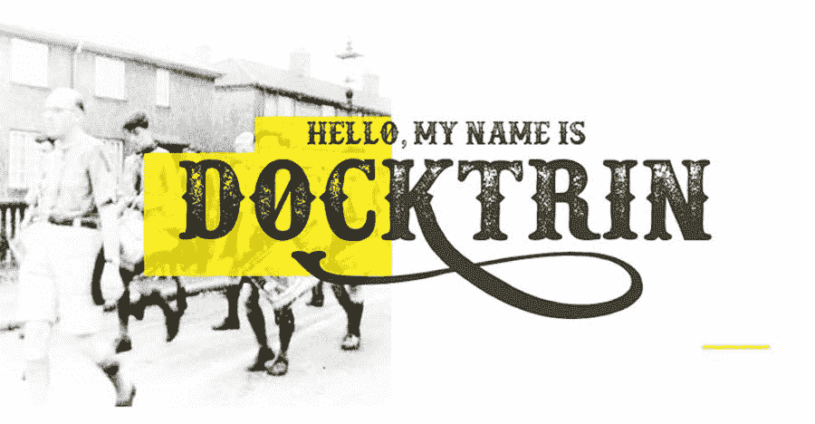

Docktrin, a Western-inspired font.

用 [Docktrin 字体](https://www.dafont.com/docktrin.font)添加一点西式风格。它的灵感来自马戏团、西方字母和凸版印刷风格的混合。这是完美的标志，海报，信头，和包装设计。该字体供个人免费使用。

## 21 种高级西方字体

现在你已经看到了一些最好的免费西方字体，让我们来看看付费选择。

## 注册订阅时事通讯

### 想知道我们是怎么让流量增长超过 1000%的吗？

加入 20，000 多名获得我们每周时事通讯和内部消息的人的行列吧！

[Subscribe Now](#newsletter)

选择优质字体一定会让你的设计看起来更加独特。此外，高级字体通常有完整的字形集，其中一些甚至包括额外的设计元素。

### 1.陌生人字体集

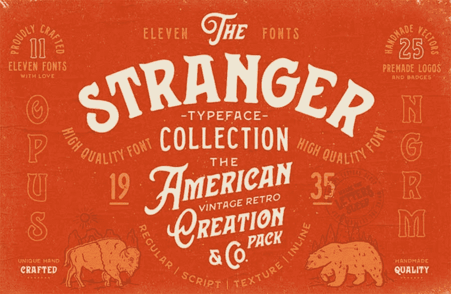

The Stranger font typeface collection.

这种字体的灵感来自牛仔经常穿的旧牛仔服装上的标签、旧西部标志和药剂师元素。它有 22 种字体，你还会得到一套 Illustrator 格式的预制徽章和插图。陌生人字体集拥有全面的多语言支持，在包装、标签和海报设计方面表现出色。

### 2.帕洛桑托

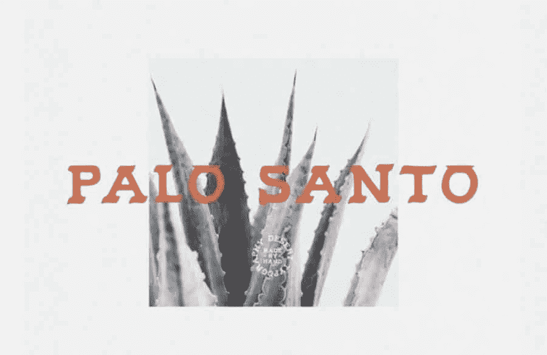

Palo Santo, a premium Western font.

一种简单、优雅、质朴的西式字体。 [Palo Santo](https://creativemarket.com/Jamescoffman/4384710-Palo-Santo) 的灵感来自墨西哥和西南部的手写字体。这种手绘字体具有一组大写字母、数字和附加字形，非常适合用于标识、信头、海报和包装设计。

### 3.昏暗的酒馆

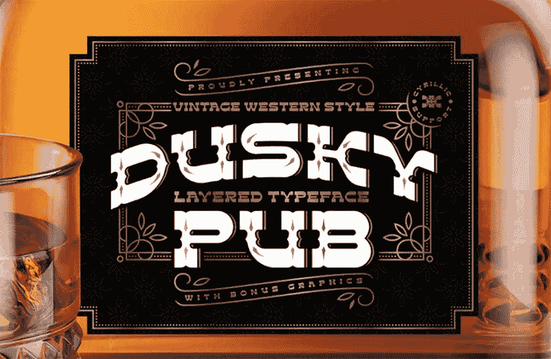

The Dusky Pub font.

当你看着[昏暗的酒吧字体](https://creativemarket.com/Gleb_Guralnyk/6327438-Dusky-Pub-Font-Mockup-Label%21)时，你会情不自禁地想象自己走进了蛮荒西部的一家酒吧。这款[复古字体](https://kinsta.com/blog/retro-font/)是按照经典西方风格制作的。它具有三种不同的风格，非常适合包装、产品和标签设计，这要归功于大胆的平板字体。它有多语言支持，包括拉丁和西里尔字母。

### 4.制绳者

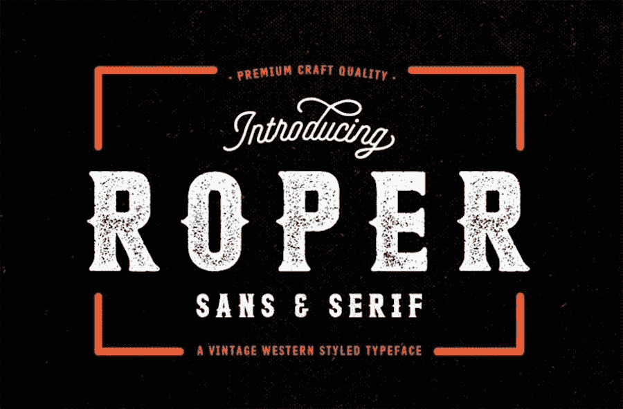

The Roper Sans & Serif Western typeface.

Roper 是一种西式字体，有 12 种不同的风格。它包括无衬线和衬线两种版本。除此之外，每个版本都有常规、轻压和重压选项，因此您的设计会有很多变化。这种字体在标志、信头、海报、标签和包装设计中非常适用。

### 5.艾伯特森

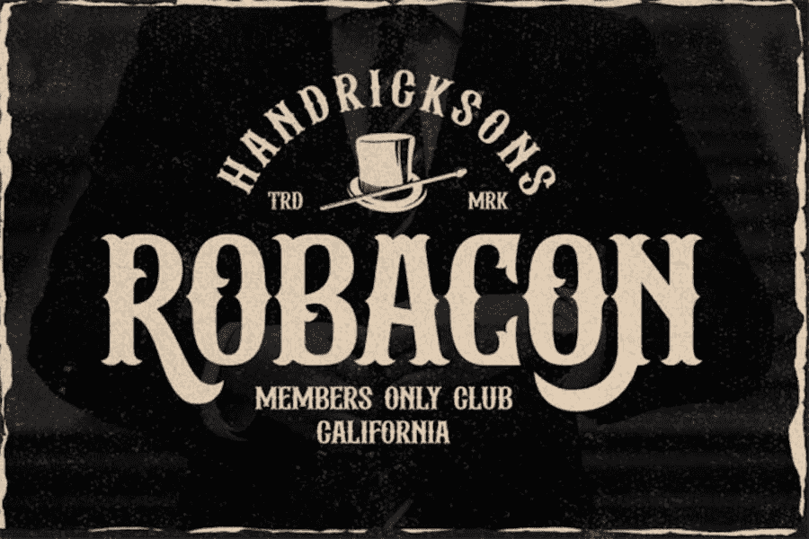

Albertson, a premium Western font.

这是一种优质的西方字体，有大量的字符。Albertson 受到了老派汽车、牛仔、伐木工、木工和 DIY 手工艺风格的影响，这赋予了它独特的外观和感觉。这种字体很适合任何需要一点格调的复古项目。您将获得四组替代字符和多语言支持，总共 350+字形。

### 6.古老的灵魂

Old Spirits, a vintage bold typeface.

[Old Spirits](https://creativemarket.com/VintageTypeCo/1796244-Old-Spirits-Display-Font) 是一种受美国风格启发的高级字体，带有一套全大写的字形，包括一个带有马刺的大写字母，以及一个干净的小写字母。包括两种替代奖金风格，以及可以通过在大写单词前键入字母“c”来激活的流行语。该字体支持多种语言，非常适合任何需要古老、质朴外观的设计。

### 7.在…之外

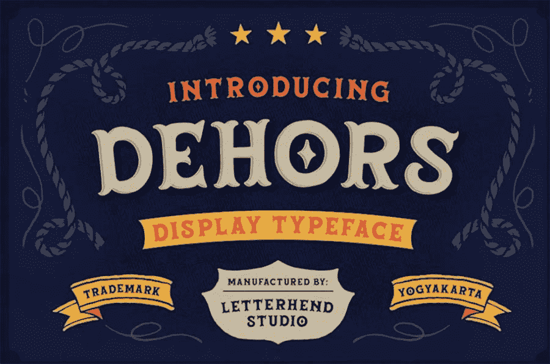

Dehors, a premium display typeface.

[Dehors 字体](https://creativemarket.com/Letterhend/4977544-Dehors-Western-Display-Typeface)外观经典优雅。受美国风格的启发，这种字体是标志、海报、信头、包装和标牌设计的绝佳选择。它带有许多字形变化，一个完整的字母表，数字和标点符号集。

### 8.枪手

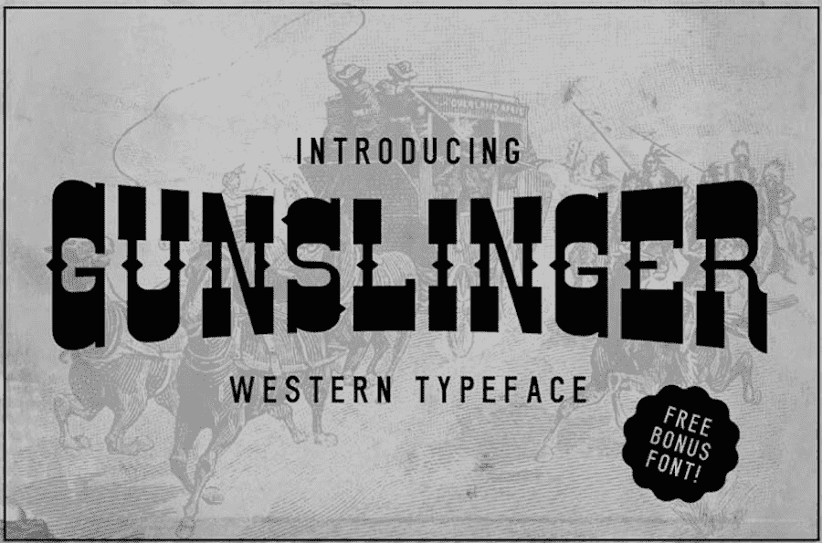

The Gunslinger Western typeface.

Gunslinger 是一种受西方风格启发的粗体衬线字体。它包括六种不同的风格，你还会得到一个额外的无衬线字体。该字体带有全大写字符集、数字、标点符号和多语言支持。平板衬线和浓缩无衬线的组合使得创建有凝聚力的设计变得容易。

需要一流的，快速的，安全的主机为您的新电子商务网站？Kinsta 提供超快的服务器和来自 WooCommerce 专家的 24/7 世界级支持。[查看我们的计划](https://kinsta.com/plans/?in-article-cta)

### 9.布鲁克斯

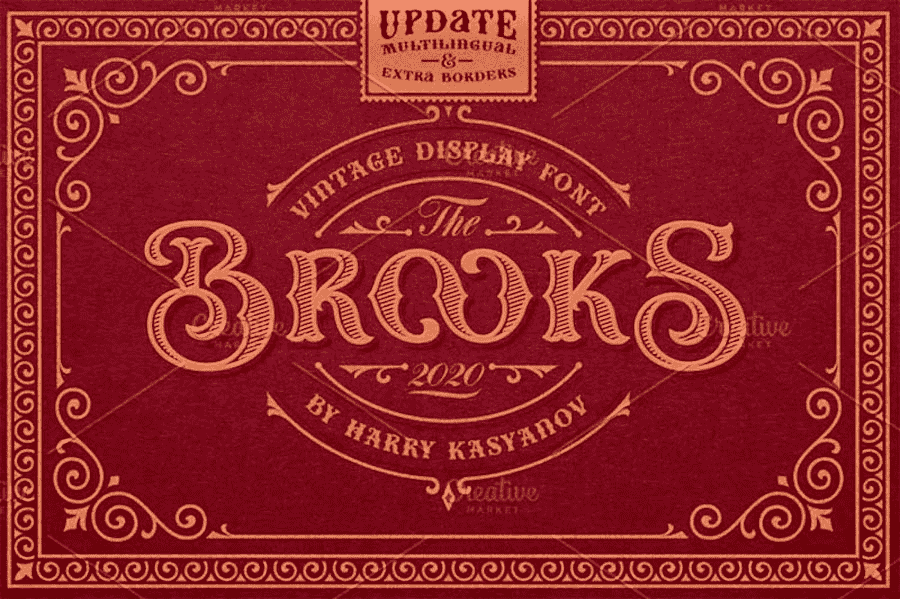

The Brooks premium vintage display font.

Brooks 是一种老式的西式字体，灵感来自于复古标牌和酒瓶。它适用于较大尺寸，是信头、海报和标签设计的绝佳选择。该字体有三种不同的样式和装饰性边框，它包括多语言支持、可编辑的标签模板和每组的一组替换字符。

### 10.西方爱情

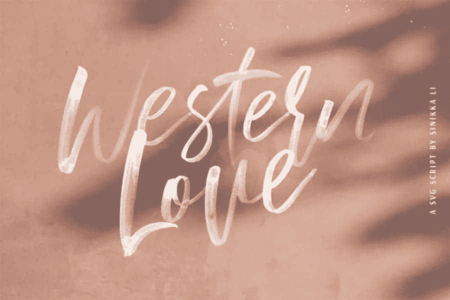

Western Love, an SVG script font.

西方爱情是一种手写水彩风格的 SVG 字体。字体看起来非常逼真，对于任何西方主题的浪漫设计来说都是一个很好的选择。它非常适合签名徽标、印刷报价、婚礼请柬等。它也有多语言支持。

### 11.吸烟

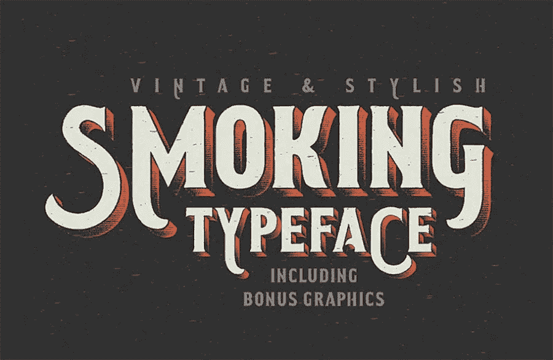

Smoking Typeface, a vintage Western font.

[Smoking](https://creativemarket.com/Gleb_Guralnyk/411226-Smoking-typeface-Illustration) 是一种乡村复古字体，灵感来自古老的标牌设计。该字体在较大尺寸下看起来非常漂亮，是标签、包装和海报设计的绝佳选择。您将获得三种字体样式和一组额外的图形。

### 12.西湖

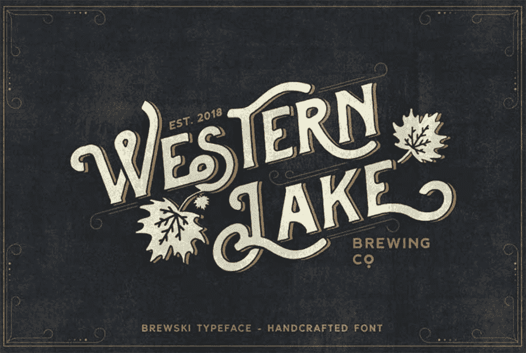

Western Lake, a handcrafted premium font.

[西子湖](https://creativemarket.com/NEWFLIX/2786534-Western-Lake-Brewski-Typeface)是一种复古的西子字体，有一套完整的大写字母和装饰，让你的设计脱颖而出。该字体的灵感来自葡萄酒酿造厂的包装和啤酒广告。这是完美的复古标志设计，标题，或包装设计。

### 13.违法的

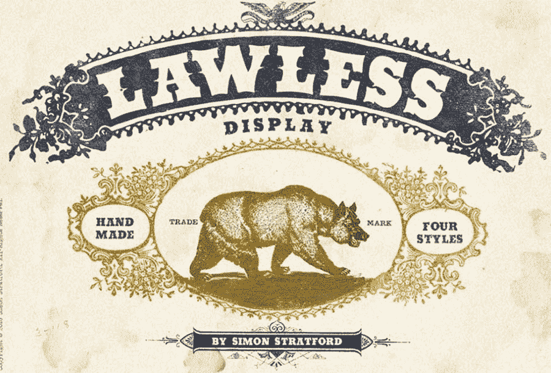

Lawless Display, a premium font with four styles.

对于任何围绕荒野和野生动物的项目来说,是完美的粗犷的西方字体。这是一个大胆的石板，灵感来自于 19 世纪早期的美国木材。字体有四种不同的风格，有大写和小写字母，还有数字和标点符号。它还支持东欧、中欧和西欧语言。

### 14.Buckboard 系列

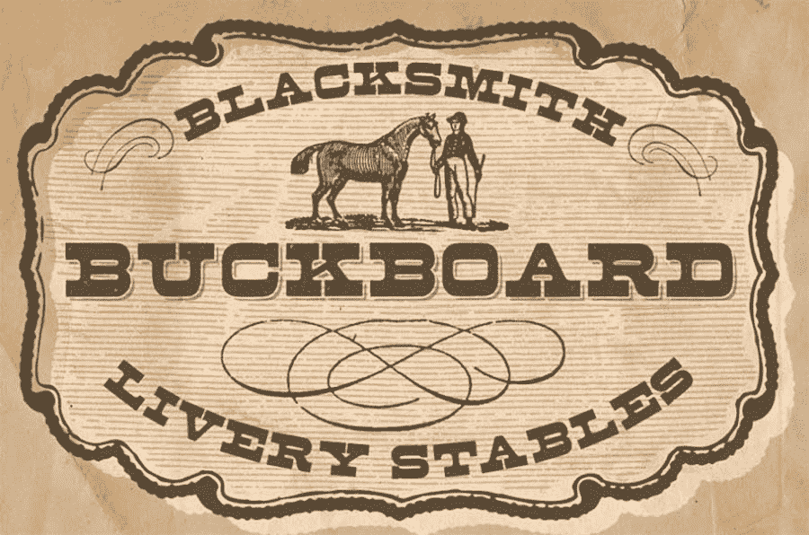

Buckboard, a premium Western font.

这是另一种西方字体，灵感来自美国古老的木头字体。 [Buckboard 系列](https://creativemarket.com/Aerotype/57688-Buckboard-Family)有三种不同的样式，每种字符样式都有 OpenType 连字功能，以及旧式数字和小型大写字母的功能。您可以混合搭配各种风格，为您的设计创造独特的外观。

### 15.特克西卡利

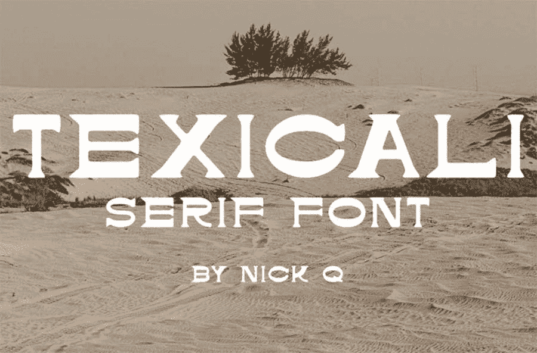

Texicali, a premium serif font.

Texicali 是一种独特的西式衬线字体，非常适合任何需要格调的项目。字体是手绘的，并在 Adobe Illustrator 中矢量化。它独特的字体非常适合标识、信头和海报设计。这种字体还包括一整套大写字符、数字和符号。

### 16.埃斯特班

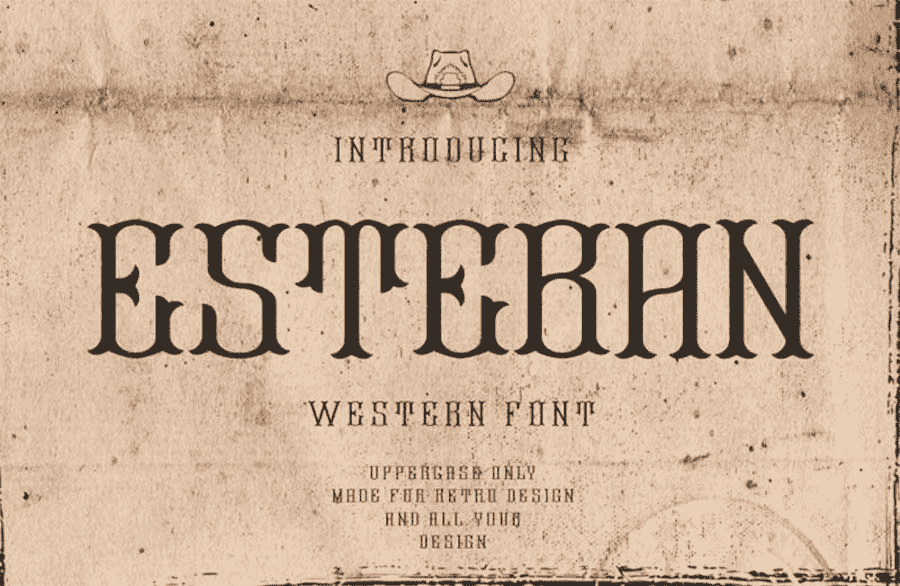

Esteban, an uppercase-only Western font.

Esteban 是一种很酷的西式字体，非常适合海报、信笺、标签、包装和标志设计。它有一套完整的大写字母、数字和标点符号。

### 17.欲望

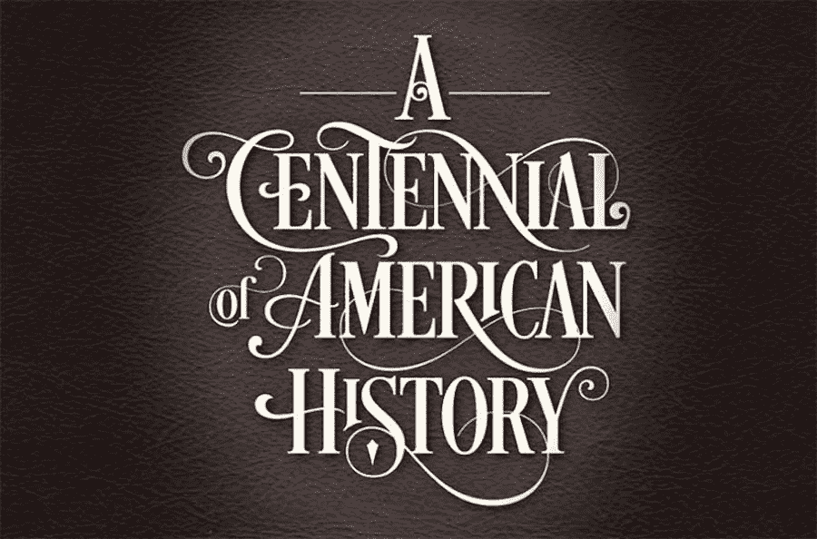

Desire, a premium Western font.

[Desire 字体](https://creativemarket.com/Borgeslettering/13716-Desire-Sale-40-OFF%21)有令人印象深刻的 644 个备用字母、98 个连字、8 个花体字和 6 个流行语。对于任何复古风格的设计来说，这都是一个很好的选择，并为您创建徽标、标题和海报提供了大量选择。你将得到总共 12 种字体，以及一个详细的 PDF 文件，可以在你设计的时候作为参考。

### 18.鲁莽的人

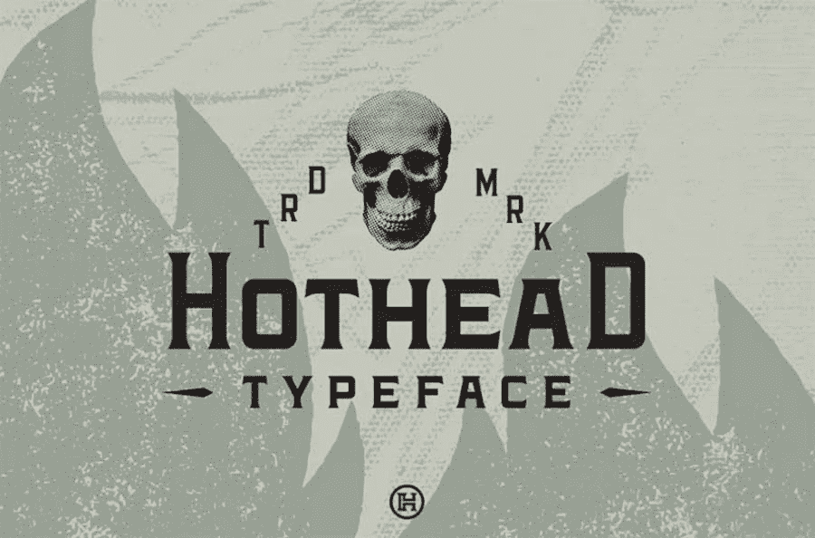

Hothead, a premium Western typeface.

[Hothead](https://creativemarket.com/Headfonts/3575868-Hothead-Western-Font) 是一种受老西部文化启发的大小写字母无衬线字体。它有一种阳刚、粗犷的感觉，但又带有现代感。这种字体是标志、标牌、海报、标签和包装设计的绝佳选择。它有 258 个字形，广泛的拉丁脚本语言支持，字符集 A-Z，数字和标点符号。

### 19.Coddiwomple

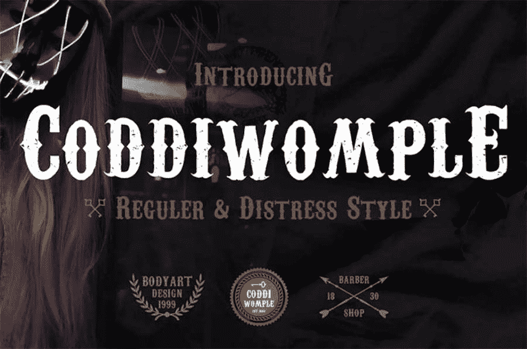

Coddiwomple, a handcrafted Western font.

Coddiwomple 是一种手工制作精美的西方字体，有两种截然不同的风格。你会得到一个常规风格和一个仿旧风格，这两种风格非常适合给任何设计一个真正复古的外观和感觉。字体包括所有大写和小写字母、数字和标点符号。将其用于徽标、海报、标牌、包装、标签设计等。

### 20.耶尔莫

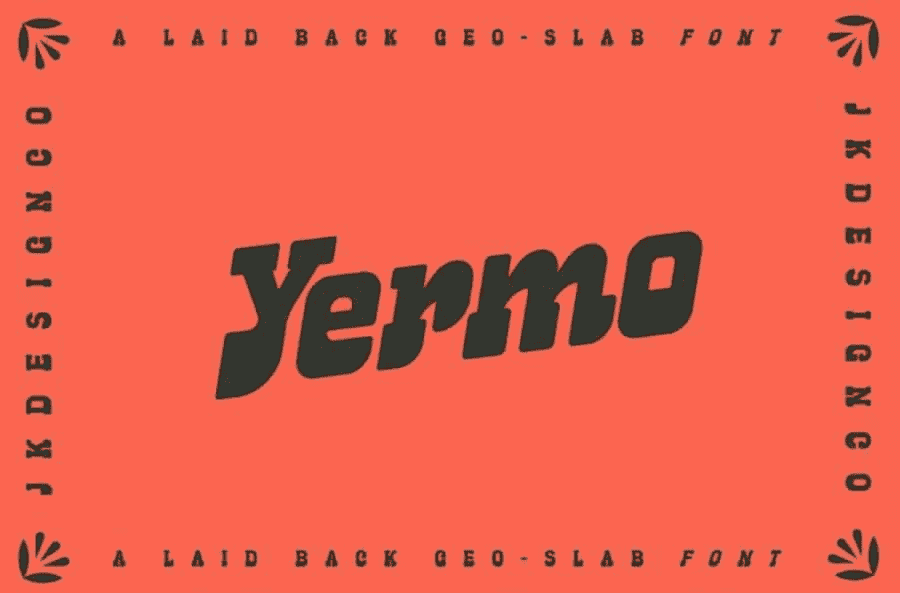

Yermo, a geo-slab font.

Yermo 字体是一种西式字体，灵感来自南加州的悠闲氛围、多沙的亚利桑那州沙漠和墨西哥北部充满活力的拉丁文化。如果你在寻找一种具有独特个性的字体，Yermo 无疑是合适的。该字体有两种不同的样式，包括大小写字母、数字、符号和多语言支持。

### 21.年轻的心字体

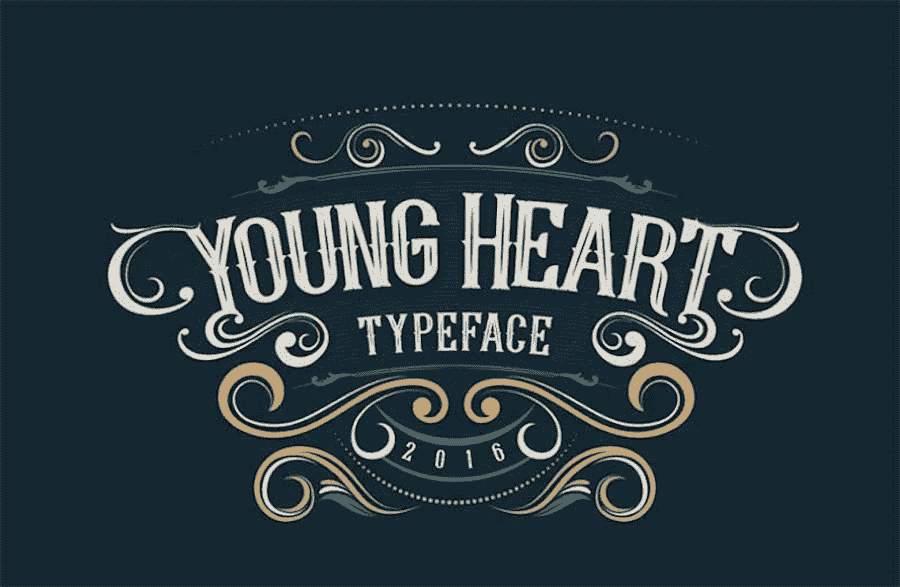

Young Heart Typeface, a premium Western font.

[Young Heart 字样](https://creativemarket.com/alitdesign/524635-Young-Heart-Typeface)是一种西式字体，具有风格交替和 OpenType 特征。你会得到两种不同的字体风格，这两种风格都为任何设计增添了一丝风格和优雅。字体有大小写字母、数字和标点符号。它适用于徽标、信头、标牌、海报、书籍封面和标签设计。

[需要为你的海报、标志或传单设计一种醒目的字体吗？🤠考虑一个高质量，坚固的西部字体-牛仔帽不包括在内😉](https://twitter.com/intent/tweet?url=https%3A%2F%2Fkinsta.com%2Fblog%2Fwestern-fonts%2F&via=kinsta&text=Need+a+standout+font+for+your+poster%2C+logo%2C+or+flyer%3F+%F0%9F%A4%A0+Consider+a+high-quality%2C+rugged+Western+font-+cowboy+hat+not+included+%F0%9F%98%89&hashtags=WebDesign%2CTypography)

## 摘要

如你所见，这里不缺少高质量的西方字体，无论是免费的还是付费的。现在唯一要做的就是下载您的收藏夹，并在您的项目中使用它们。

然而，如果西方字体不太合你的胃口，你可能会被其他风格所吸引，比如[草书字体](https://kinsta.com/blog/cursive-fonts/)，或者你可能会选择细读[当今使用的一些最流行的字体](https://kinsta.com/blog/best-google-fonts/)。毕竟，外面有一整个世界的选择。

快乐设计！

* * *

让你所有的[应用程序](https://kinsta.com/application-hosting/)、[数据库](https://kinsta.com/database-hosting/)和 [WordPress 网站](https://kinsta.com/wordpress-hosting/)在线并在一个屋檐下。我们功能丰富的高性能云平台包括:

*   在 MyKinsta 仪表盘中轻松设置和管理
*   24/7 专家支持
*   最好的谷歌云平台硬件和网络，由 Kubernetes 提供最大的可扩展性
*   面向速度和安全性的企业级 Cloudflare 集成
*   全球受众覆盖全球多达 35 个数据中心和 275 多个 pop

在第一个月使用托管的[应用程序或托管](https://kinsta.com/application-hosting/)的[数据库，您可以享受 20 美元的优惠，亲自测试一下。探索我们的](https://kinsta.com/database-hosting/)[计划](https://kinsta.com/plans/)或[与销售人员交谈](https://kinsta.com/contact-us/)以找到最适合您的方式。