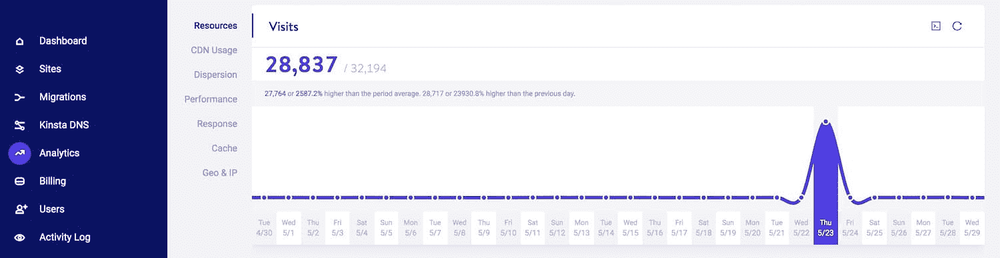
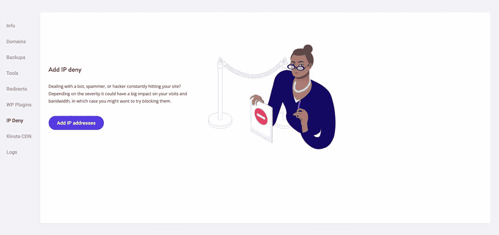
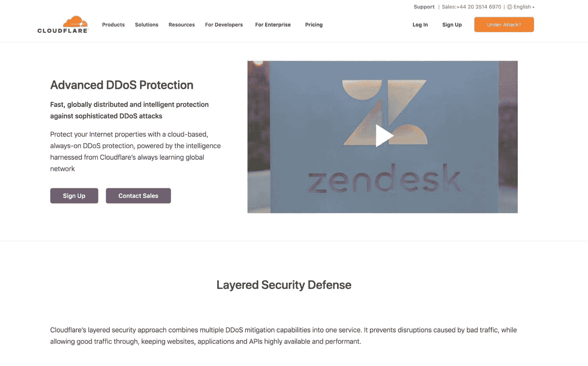
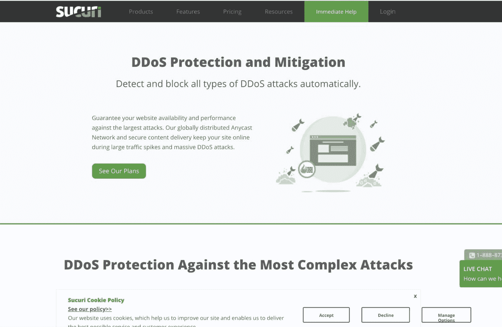

# DDoS 攻击解释:原因，影响，以及如何保护您的网站

> 原文：<https://kinsta.com/blog/what-is-a-ddos-attack/>

DDoS 攻击出奇地容易实施，每年都会影响全球数百万个网站，攻击数量还在上升。

遭受 DDoS 攻击似乎是上网不可避免的副作用；你的网站越成功，你就越有可能成为攻击的目标。但是您可以减少 DDoS 攻击影响您站点的机会。

您可能想知道:什么是 DDoS 攻击？我如何保护我的网站免受他们的攻击？

在本帖中，我们将解释什么是 DDoS 攻击，探索什么可能使您的站点易受攻击，并概述您可以降低其概率和影响的方法。

## 什么是 DDoS 攻击？

让我们首先检查一下 [DDoS 攻击](https://kinsta.com/blog/ddos-attack/)到底是什么，更重要的是，它不是什么。

DDoS 代表分布式拒绝服务，但通常被称为简单的拒绝服务。DDoS 攻击包括网站在短时间内被大量请求淹没，目的是淹没网站并导致其崩溃。与仅来自一个位置的 DoS 相比,“分布式”元素意味着这些攻击同时来自多个位置。

如果您的网站遭受 DDoS 攻击，您将在几分钟甚至几小时内收到来自多个来源的数千个请求。这些请求不是网站流量突然激增的结果:它们是自动的，来自有限的来源，取决于攻击的规模。

> Kinsta 把我宠坏了，所以我现在要求每个供应商都提供这样的服务。我们还试图通过我们的 SaaS 工具支持达到这一水平。
> 
> <footer class="wp-block-kinsta-client-quote__footer">
> 
> 
> 
> <cite class="wp-block-kinsta-client-quote__cite">Suganthan Mohanadasan from @Suganthanmn</cite></footer>

[View plans](https://kinsta.com/plans/)

在下面的截图中，您可以看到在 DDoS 攻击期间，一个站点收到的请求数量突然激增。

DDoS attack traffic

DDoS 攻击和黑客攻击不是一回事，尽管两者可以联系起来；犯罪者并不试图访问您的网站的文件或管理员，而是由于大量的请求，他们导致网站崩溃或变得脆弱。在某些情况下，当网站易受攻击时，黑客会试图攻击网站，但在大多数情况下，目的只是让网站停止工作。

听起来似乎没有任何方法可以避免 DDoS 攻击:毕竟，如果有人决定向您的站点发送大量请求，您无法阻止他们。

尽管你无法阻止有人试图通过 DDoS 攻击来破坏你的网站，但你可以采取一些措施来确保如果你受到攻击，你的网站不会停止工作，也不会容易受到黑客攻击。

我们将在这篇文章的后面讨论这些步骤，但是首先，让我们来看看为什么有人想要在你的网站上发起 DDoS 攻击。

## 为什么有人会破坏你的网站？

那么为什么有人会在你的 WordPress 网站上发起 DDoS 攻击呢？他们能从中得到什么？

攻击者想要通过 DDoS 攻击让您的网站瘫痪有很多原因。这些包括竞争对手的攻击和因为你的内容而受到的攻击。

### 竞争对手发起的 DDoS 攻击

在理想的情况下，你的竞争对手会试图通过改善他们的内容、SEO 和转化率来超越你，这是利用你的网站获得竞争优势的合法途径。

但在某些情况下，竞争对手可能会采取更极端的措施。竞争对手可能会雇人在你的网站上发起 DDoS 攻击，因为他们知道这不仅会影响你的网站，还会影响你的业务。

在你让你的网站重新运行的时候，他们会抢走你的生意，特别是如果他们用你的企业名称作为关键词来做广告的话。如果你的网站不能很快恢复运行，你会失去搜索排名，并可能发现你的竞争对手现在在谷歌上的排名比你高。

当然，很难证明是谁实施了 DDoS 攻击。攻击不会来自你竞争对手的 IP 地址！除非你财力雄厚，否则试图对你怀疑的竞争对手采取法律行动是不太可能成功的。

首先保护自己免受攻击的影响要好得多。不要试图对你的竞争对手发起另一次 DDoS 攻击作为回应。这是非法的，最好让你自己确信，一个不顾一切地使用这些手段的竞争对手可能不会像你的企业那样长寿或享有声誉。

### 对您内容的 DDoS 攻击

一些网站因为其内容的[性质而遭受 DDoS 攻击。](https://kinsta.com/blog/evergreen-content/)

例如，举报网站可能会受到攻击。一个处理有争议问题的网站(如堕胎权或反种族歧视)可能会遭到不同意其信息并希望将其关闭的人的攻击。或者你的内容可能是商业性的，但仍然是敏感的，有些人不希望它在网上出现。

如果你的网站被成功攻击，它将使你的内容无法流通，如果你的用户需要访问信息或指导，这可能会给他们带来问题。

你还将花费时间解决这个问题，失去你可能从网站获得的任何收入(如果你是非营利组织，无论是销售还是捐赠[，如果你的网站在几个小时或几天内返回一个](https://kinsta.com/blog/wordpress-for-nonprofits/) [502 错误](https://kinsta.com/blog/502-bad-gateway/)，你的排名可能会下降。

### 出于政治动机的 DDoS 攻击

随着网络威胁越来越多地被用来扰乱政治进程，出于政治动机的 DDoS 攻击变得越来越常见。

如果你的网站是为某个政党、候选人或组织服务的，或者是为了推进某个特定的政治目标，那么它可能很容易受到与你政见不同的人的攻击。

这不一定来自你的政治对手。它更有可能来自外部来源，试图扰乱政治辩论，阻止某些类型的内容，并利用混乱来迷惑和剥夺人们的权利。

这种攻击可能是试图让人们无法访问你的内容(见上文)，也可能是对个人候选人或网站背后的组织的更个人化的攻击。

这不同于由于新闻周期导致[访问量](https://kinsta.com/knowledgebase/dedicated-server/)激增而导致网站超载。我曾经在一个政党的网站上工作过，当这个政党为大选发布宣言时，网站变得不堪重负。那是第一次电子竞选意义重大的英国选举，我们只是没有为流量做好准备。

相反，DDoS 攻击会更尖锐、更突然，有时会在几分钟内出现非常突然的请求高峰。这看起来与交通的自然高峰非常不同，虽然它可能是突然的，但通常会采取曲线的形式，而不是悬崖。

如果您正在开展一项活动(由于额外的宣传，这可能会使您更容易受到攻击)，那么确保您的网站保持可操作性，而不是在您可以专注于活动的时候浪费时间处理攻击，这将是特别重要的。这就是为什么采取以下步骤来保护您的网站免受有政治动机的 DDoS 攻击是至关重要的。

## DDoS 攻击的影响

DDoS 攻击可能会产生多种影响，这取决于攻击的性质和您对攻击的准备程度。

### 1.网站宕机

最直接最明显的影响就是你的网站不堪重负，变得不可用。

这意味着你通过你的网站获得的任何业务都将无法为你所用，直到你的网站重新运行起来。这也会影响你作为网站所有者的声誉。如果你不迅速修复网站，它会影响你的搜索引擎优化，就像谷歌抓取你的网站，发现它停止运行，你会失去排名。

如果你的网站因为超载而不可用，它将返回一个 502 坏网关错误，如果你让它保持这种状态太久，这将对你的搜索排名产生负面影响。

我也看到过这样的攻击，网站已经好几天不可用了(因为所有者不知道如何修复它，也没有保留备份，不久又有更多)，当网站重新上线时，该网站的 Google 列表中的所有内部链接都丢失了。

### 2.服务器和主机问题

如果你的网站经常受到攻击，而你没有采取措施缓解，这可能会导致你的主机提供商出现问题。

一个好的主机服务提供商会给你一些工具来保护你的网站免受 DDoS 攻击，但是如果你没有这些工具并且你在共享主机上，攻击可能会影响同一服务器上的其他网站。

### 信息

Kinsta 实施由 [Google 云平台](https://kinsta.com/blog/google-cloud-hosting/)支持的硬件防火墙、主动和被动安全以及其他高级功能，以防止访问您客户的数据。[点击这里查看更多](https://kinsta.com/secure-wordpress-hosting/)。

### 3.网站漏洞

DDoS 攻击可能会使[您的网站更容易受到黑客攻击](https://kinsta.com/blog/wordpress-hacked/),因为您的所有系统都专注于使网站恢复在线，安全系统可能会因攻击而失去作用。

一旦 DDoS 攻击成功瘫痪了您的网站，黑客们可能会发现通过后门进入您的网站更加容易。

像这样的后续攻击不会总是来自与形成 DDoS 攻击的请求相同的来源:一个聪明的黑客将知道如何隐藏他们的踪迹并使用多个 IP 地址来攻击你的网站，以及如何隐藏他们的真实位置。

因此，如果你是 DDoS 攻击的受害者，你的首要任务之一应该是[确保你的 WordPress 网站是安全的](https://kinsta.com/blog/wordpress-security/)。可以说，这比让面向公众的网站重新运行更重要，因为另一次攻击只会让你回到起点(或者更糟)。

## 注册订阅时事通讯

### 想知道我们是怎么让流量增长超过 1000%的吗？

加入 20，000 多名获得我们每周时事通讯和内部消息的人的行列吧！

[Subscribe Now](#newsletter)

### 4.损失的时间和金钱

修复遭受 DDoS 攻击的网站需要时间。也可以拿钱。

如果你不知道你的网站发生了什么，也没有为可能的攻击做好准备，你可能最终不得不从头开始重建你的网站(我见过发生这种情况的网站)。如果你没有对你的站点进行[备份，你打算从](https://kinsta.com/blog/wordpress-backup-plugins/)开始[恢复它吗？如果你不尽快修复，攻击可能会对你网站的搜索引擎优化和业务表现产生长期影响。](https://kinsta.com/blog/restore-wordpress-from-backup/)

当网站关闭时，你可能会损失收入，特别是如果你的网站是一个电子商务商店。你可能还得花钱雇一个安全专家或 web enveloper 来重建你的网站，确保它免受未来的攻击。

所有这些都强调了保护你的网站免受 DDoS 攻击的重要性。我有一个客户，由于他们业务的性质，经常遭受攻击；因为我们设置了安全措施，这些从未对网站造成影响。如果你做好了准备，那么 DDoS 攻击也不会影响你的网站。

## 什么会使您的网站易受 DDoS 攻击？

有些网站比其他网站更容易受到 DDoS 攻击。这些要么会让你在一开始就更容易受到攻击，要么更容易受到攻击的后果的影响。

### 廉价托管

与所有类型的网络攻击一样，DDoS 攻击的第一个罪魁祸首是便宜的主机服务。

廉价主机有两个主要缺点:缺乏支持和客户数量。

为了使提供如此便宜的主机服务成为可能，主机服务提供商将有大量的客户使用同一个服务器，这意味着如果该服务器上的其他网站受到攻击，它可能会影响到你。

廉价的主机提供商不会提供针对 DDoS 攻击的安全预防措施，当攻击发生时他们不会警告你，当你的网站停止工作时他们也不会帮你修复。他们不会定期备份你的网站，即使他们这样做了，他们也不太可能帮助你恢复你的网站:你必须自己想办法。

这并不是因为廉价的主机提供商试图欺骗你，或者因为他们不提供他们承诺的服务:这只是因为为了让他们的主机便宜，他们不得不克扣支持。否则，他们就赚不到钱。

如果你的网站支持一项业务或任何风险投资，其中你的声誉和网站的安全性是很重要的，那么投资高质量的主机服务是值得的。如果您避免了在网站遭到攻击时不得不花费时间修复网站，那么额外的成本是值得的，如果这意味着您的网站在试图遭受 DDoS 攻击时保持在线并且没有受到危害，那么这当然也是值得的。

### 信息

Kinsta 提供了一个[恶意软件安全保证](https://kinsta.com/knowledgebase/malware-security/)以及针对 DDoS 攻击的防火墙保护。

### 缺乏准备

未能对 DDoS 攻击的可能性做好准备并不一定能阻止它的发生，但这将意味着如果你受到攻击，你不会遭受太多损失。

首先，对潜在的攻击采取安全预防措施将会增加你的网站在遭受攻击后保持在线的机会。

但是了解如何阻止 DDoS 攻击也会有所帮助。如果你的网站被攻击了，如果你做好了准备，你就能比没有准备时更快地恢复运行。

与宕机和 WordPress 问题做斗争？Kinsta 是一款考虑到性能和安全性的托管解决方案！[查看我们的计划](https://kinsta.com/plans/?in-article-cta)

安装安全软件或利用主机提供商提供的安全警报意味着如果你的网站受到攻击，你会收到警报，你或你的主机提供商可以采取行动保护你的网站。

对你的站点进行定期备份意味着如果它出现问题，你可以快速恢复它。

保持[你的网站是最新的](https://kinsta.com/blog/wordpress-maintenance/#keeping-your-wordpress-site-updated)意味着它本质上更安全，如果你不得不重建它，也不太可能遇到问题。

### 不安全或过时的代码

保持你的 WordPress 版本以及你的主题和插件[最新](https://kinsta.com/blog/wordpress-automatic-updates/)不会保护你免受 DDoS 攻击。

但是，如果你受到攻击，而随后你的网站的弱点被黑客利用作为获得不必要的访问的机会，如果你的网站管理良好，他们成功的可能性将会小得多。

预防措施包括保持你的网站更新，以及只安装来自知名来源的插件和主题。WordPress 主题和插件目录是目前为止找到免费主题和插件的最好地方，著名的开发者会在那里提供它们。注意不要安装可能导致[与你的主机](https://kinsta.com/knowledgebase/banned-plugins/)不兼容的代码，也不要安装[无效的主题或插件](https://kinsta.com/blog/nulled-wordpress-plugins-themes/)。

## 如何保护您的网站免受 DDoS 攻击

现在，对于你一直渴望知道答案的问题:如何保护你的网站免受 DDoS 攻击？

您可以采取多种预防措施，具体选择哪种取决于您的设置、预算和偏好。

我们来看看选项。

### 来自主机提供商的保护

Kinsta hosting 有许多功能可以降低您遭受 DDoS 攻击的几率。

Kinsta 托管的所有站点都受到我们的 [Cloudflare integration](https://kinsta.com/cloudflare-integration/) 的保护，它具有内置 DDoS 保护的安全防火墙。我们还利用基于软件的严格限制来进一步保护您的网站。所有这些都使得 DDoS 攻击更加难以通过。

一旦 DDoS 攻击开始，另一个可以帮助保护您的 Kinsta 功能是 [IP 地理定位拦截](https://kinsta.com/help/ip-geolocation/)。Kinsta 会检测到任何 DDoS 攻击，并向您发出警报。然后，您可以使用 Geo IP 阻止功能来阻止 DDoS 攻击来自的地理区域。

这意味着您可以安全地阻止攻击来自的地理区域，该区域的 IP 地址将无法再向您的站点发送请求。

或者，你可以通过 **IP Deny** 页面屏蔽 [MyKinsta](https://kinsta.com/mykinsta/) 中的单个 IP。

Kinsta’s IP deny feature

然而，残酷的事实来了:无论你的主机提供商有多好，他们都不可能提供完全的防御 DDoS 攻击的保护。一个好的主机提供商会做的是提供一个好的防火墙，这将减少攻击的机会，但不会完全消除它。一旦 DDoS 攻击开始，他们还会提供您或他们可以用来阻止它的工具，例如 IP 拦截。

这就是为什么**任何声称为你提供 DDoS 攻击全面保护的主机提供商都不是完全诚实的**。他们可以降低攻击的可能性，限制攻击的影响，但他们无法完全阻止 DDoS 攻击。

相反，为了更彻底地保护自己免受 DDoS 攻击，您需要使用一个庞大的网络，该网络可以使用其关于世界各地其他站点的攻击的信息数据库来预测攻击并阻止它们可能来自的 IP。让我们来看看其中的一些服务。

### 云耀斑

[Cloudflare](https://kinsta.com/knowledgebase/install-cloudflare/) 是互联网上最受欢迎的[内容交付网络](https://kinsta.com/help/kinsta-cdn/#what-is-cdn)提供商之一，它还提供针对攻击和黑客的保护。由于其庞大的规模，它可以获得关于 DDoS 攻击来自哪里的信息，然后可以阻止其网络上所有站点的 IP 地址。

Cloudflare DDoS protection

Cloudflare 基于云的网络始终处于开启状态并不断学习，这意味着它可以全天候识别潜在的攻击并阻止不必要的流量到达您的站点。它还为您提供了一个仪表板，您可以使用它来监控和减少 DDoS 攻击，以便您可以确定您的漏洞可能是什么。

如果您的站点托管在 Kinsta 上，您就不需要设置自己的 Cloudflare 帐户。我们基础架构上的所有站点都受到我们免费的 Cloudflare 集成的保护。

### 苏库里

Sucuri 是一家因提供黑客攻击后清理网站并帮助防止此类事件再次发生的服务而闻名的公司。但它也提供 DDoS 保护

Kinsta 上托管的网站不支持 Sucuri。在 Kinsta，我们的基础架构由安全的 [Cloudflare 防火墙保护，内置 DDoS 保护](https://kinsta.com/knowledgebase/cloudflare-integration/)。此外，我们执行例行的恶意软件扫描，并根据我们的[恶意软件安全承诺](https://kinsta.com/knowledgebase/malware-security/)提供免费的恶意软件删除服务。

Sucuri DDoS protection

Sucuri 的服务之所以有效，是因为它非常庞大，拥有超过 40 万名客户的网络，这意味着它可以像 Cloudflare 一样保留一个攻击数据库。这些 IP 地址可以在你的网站上被屏蔽。

Sucuri 的网络没有 Cloudflare 的大，但如果你也想要高级安全功能和监控，该公司值得考虑，这是他们的专长所在。Sucuri 将监控你的网站的停机时间和攻击或黑客，并将修复任何发生的黑客攻击。

因此，如果你确实遭受了 DDoS 攻击，你的 WordPress 网站在脆弱的时候被黑了，与 Sucuri 在一起意味着你可以尽快让它恢复运行。

[DDoS attacks are spreading like fire but why in the world would anyone attack your site? Well, there are plenty of reasons... (and ways to keep your site protected) 👨‍🚒🛡️Click to Tweet](https://twitter.com/intent/tweet?url=https%3A%2F%2Fkinsta.com%2Fblog%2Fwhat-is-a-ddos-attack%2F&via=kinsta&text=DDoS+attacks+are+spreading+like+fire+but+why+in+the+world+would+anyone+attack+your+site%3F+Well%2C+there+are+plenty+of+reasons...+%28and+ways+to+keep+your+site+protected%29+%F0%9F%91%A8%E2%80%8D%F0%9F%9A%92%F0%9F%9B%A1%EF%B8%8F&hashtags=security%2Cddos)

## 摘要

DDoS 攻击正变得越来越普遍，它们有可能造成价值数十亿美元的损失。

完全保护自己免受 DDoS 攻击是不可能的，因为你无法控制进入你网站的流量。但是，如果你使用上述服务之一，避免廉价的主机服务，并在 DDoS 攻击发生时做好准备，那么你遭受攻击的可能性就会小得多。

* * *

让你所有的[应用程序](https://kinsta.com/application-hosting/)、[数据库](https://kinsta.com/database-hosting/)和 [WordPress 网站](https://kinsta.com/wordpress-hosting/)在线并在一个屋檐下。我们功能丰富的高性能云平台包括:

*   在 MyKinsta 仪表盘中轻松设置和管理
*   24/7 专家支持
*   最好的谷歌云平台硬件和网络，由 Kubernetes 提供最大的可扩展性
*   面向速度和安全性的企业级 Cloudflare 集成
*   全球受众覆盖全球多达 35 个数据中心和 275 多个 pop

在第一个月使用托管的[应用程序或托管](https://kinsta.com/application-hosting/)的[数据库，您可以享受 20 美元的优惠，亲自测试一下。探索我们的](https://kinsta.com/database-hosting/)[计划](https://kinsta.com/plans/)或[与销售人员交谈](https://kinsta.com/contact-us/)以找到最适合您的方式。