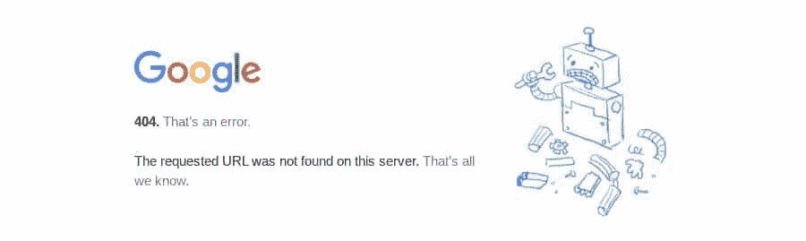
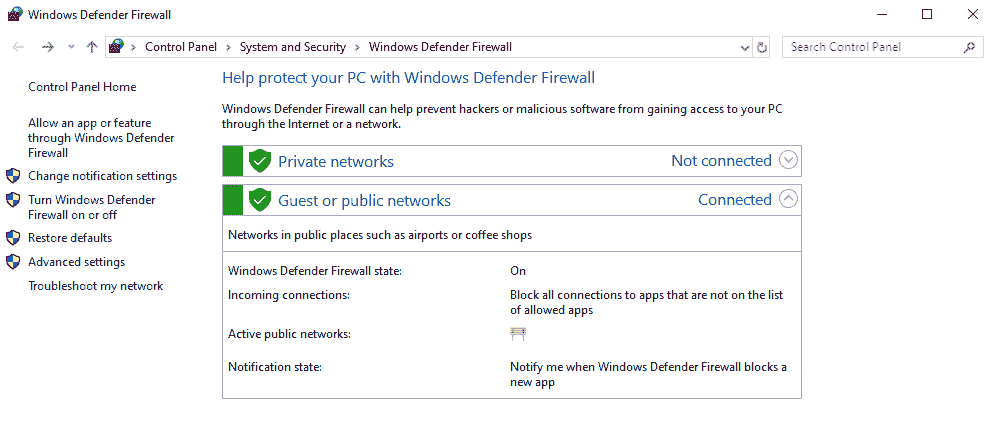
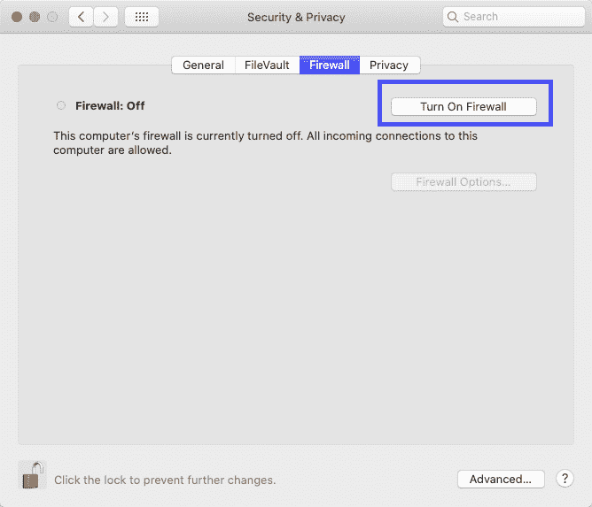
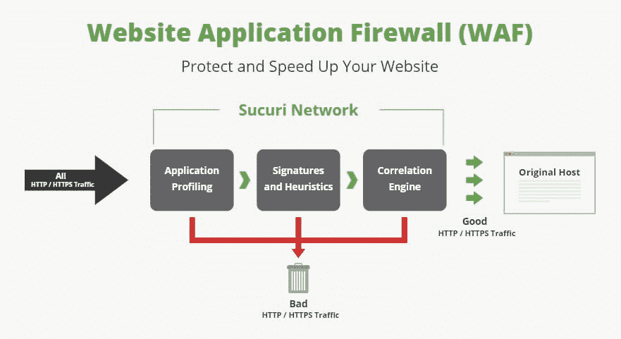
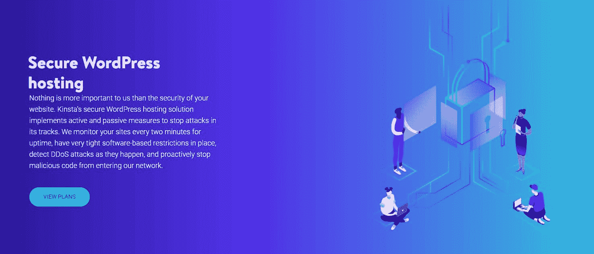

# 什么是防火墙？不同类型的防火墙以及您是否需要防火墙的入门指南

> 原文：<https://kinsta.com/blog/what-is-a-firewall/>

每个网站都需要保护。就像你的个人电脑一样，在线服务器也可能成为攻击的目标。你需要一种方法来阻止黑客或其他非法流量来源。这就是防火墙的用武之地。

简而言之，什么是防火墙？它是计算机和“外部世界”之间的一道屏障。

如果你的网站没有受到保护，恶意行为者可能会对你的服务器造成严重破坏，这就是为什么你应该尽一切努力来保护你的 WordPress 网站。设置防火墙应该是你的首要任务之一。

但是有许多不同类型的防火墙，您可能不知道从哪里开始。

[A firewall is the barrier between your computer & the outside world. 🔥 So how do you choose the right one to keep your website safe from hackers? 🦹‍♂️ Read on for recommendations ⤵️Click to Tweet](https://twitter.com/intent/tweet?url=https%3A%2F%2Fbit.ly%2F2YVq05u&via=kinsta&text=A+firewall+is+the+barrier+between+your+computer+%26amp%3B+the+outside+world.+%F0%9F%94%A5++So+how+do+you+choose+the+right+one+to+keep+your+website+safe+from+hackers%3F+%F0%9F%A6%B9%E2%80%8D%E2%99%82%EF%B8%8F++Read+on+for+recommendations+%E2%A4%B5%EF%B8%8F&hashtags=websitesecurity%2Cfirewall)

让我们来看一下所有类型的防火墙，何时需要，以及如何在服务器上安装。

## 什么是防火墙？防火墙是做什么的？

每当你访问一个网站，你基本上是连接到另一台电脑:网络服务器。但是因为服务器只是一种特殊的计算机，它容易受到与你的个人电脑相同的攻击。

> Kinsta 把我宠坏了，所以我现在要求每个供应商都提供这样的服务。我们还试图通过我们的 SaaS 工具支持达到这一水平。
> 
> <footer class="wp-block-kinsta-client-quote__footer">
> 
> 
> 
> <cite class="wp-block-kinsta-client-quote__cite">Suganthan Mohanadasan from @Suganthanmn</cite></footer>

[View plans](https://kinsta.com/plans/)

如此直接地连接到另一个设备而中间没有任何保护是不安全的。一旦这种联系建立起来，就很容易让对方感染上[恶意软件](https://kinsta.com/blog/types-of-malware/)或者发起 [DDoS 攻击](https://kinsta.com/blog/ddos-attack/)。

这就是防火墙的作用。它是你和任何其他试图连接到你的设备之间的媒介，或者在 web 服务器的情况下，是它和它每天与其他设备建立的成百上千个连接之间的媒介。

Connecting to a web server

那么防火墙到底是如何工作的呢？

防火墙只是监控设备上的进出流量，扫描任何恶意活动的迹象。如果它检测到可疑的东西，它会立即阻止它到达目的地。

对你的电脑或者服务器来说是一个很大的过滤系统。

最初开发时，防火墙是非常简单的数据包分析器，它根据一组最小的预定义规则来允许或阻止[传入流量](https://kinsta.com/blog/how-to-drive-traffic-to-your-website/)。它们很容易被绕过。

如今，它们已经演变成复杂的程序，能够更好地抵御企图入侵，是所有设备的必备软件。

### 重要的

Kinsta 上托管的所有网站都自动受到我们免费的 Cloudflare 集成的保护，其中包括安全的防火墙和 DDoS 保护。点击[此处](https://kinsta.com/cloudflare-integration/)了解更多。

### **当你需要防火墙的时候**

您可能想知道:什么时候需要防火墙？我真的需要一个吗？

任何连接到互联网的机器都需要防火墙。不仅仅是你的电脑，还有你的网络服务器、手机、物联网设备，或者任何你能想到的有能力使用互联网的东西。

未受保护的设备很容易受到入侵和感染。

这可能[让黑客有能力接管你的电脑](https://kinsta.com/blog/is-wordpress-secure/#how-wordpress-sites-get-hacked-by-the-data)，安装他们想要的任何东西，监视你输入的敏感信息，如银行凭证，甚至通过你的网络摄像头/摄像机，通过你的麦克风监听。

在网络服务器的情况下，如果黑客设法通过，他们可以破坏你的网站，嵌入感染你的访问者的恶意软件，改变你的 [WordPress 管理员登录凭证](https://kinsta.com/blog/wordpress-login-url/)，或者[完全关闭你的网站](https://kinsta.com/blog/website-downtime/)。

A 404 page

如果没有防火墙，您的网站甚至您的个人设备都容易受到 [DDoS 攻击](https://kinsta.com/blog/ddos-attack/)，这是一种攻击媒介，它会发送数千或数百万个虚假数据包，使您的服务器过载，并使您的网站或互联网瘫痪。

不服气？以下是防火墙可以保护您或您的网站免受的攻击:

*   **入侵**:防火墙阻止未经授权的用户远程访问你的电脑或服务器，为所欲为。
*   **恶意软件**:设法潜入的攻击者可以发送恶意软件来感染您或您的服务器。[恶意软件](https://kinsta.com/knowledgebase/security-guarantee/)可能窃取个人信息，传播给其他用户，或者以其他方式损害你的电脑。
*   **暴力攻击**:黑客试图尝试数百个用户名和密码组合来发现你的管理员(或其他用户)[登录凭证](https://kinsta.com/blog/share-logins-wordpress/)。
*   **DDoS 攻击**:防火墙(尤其是 web 应用防火墙)可以尝试检测 DDoS 攻击期间出现的虚假流量流入。

## **防火墙的类型**

有许多不同类型的防火墙，每一种针对不同的情况而设计。有些更适合单台计算机，而有些则适合网络范围的过滤。

 它们的工作方式各不相同，更擅长阻止某些类型的流量。如果您想知道应该寻找哪一种，我们将分解所有主要类型的防火墙。

这里有一个简短的总结:除非你运行自己的服务器堆栈(为网站提供自己的互联网)，否则你主要需要担心的防火墙类型是个人防火墙、软件防火墙和 web 应用程序防火墙。

这三个是最重要的。然而，如果你想更好地理解防火墙是如何工作的，以及这些年来它们是如何发展的，请多读一些其他的内容。

### **个人防火墙**

防火墙的工作方式非常不同，这取决于它们是由单台计算机、整个网络(例如在一个商业办公室内)还是 web 服务器使用。个人防火墙只能在一台计算机上使用。这是预装在 Windows 和 Mac 计算机上或与您的防病毒软件一起提供的防火墙。

虽然它的工作方式类似于服务器防火墙(根据一组预定义的规则允许或拒绝来自其他设备、应用程序和 IP 的连接)，但在功能上却略有不同。

个人防火墙可以保护[您使用](https://kinsta.com/blog/smtp-port/)连接到网站和在线应用程序的端口(窃取它们，使攻击者看不到它们是打开的)，防御通过网络的攻击，防止人们访问和接管您的计算机，并分析所有进出的流量。

它们还充当应用程序防火墙，监控设备上应用程序的活动，并拒绝允许与不安全或未知软件建立连接。

如今，获得个人防火墙相当容易。如果你使用任何现代版本的 Windows，默认情况下应该已经有一个在运行了。

Windows Defender Firewall

Mac 电脑也配有一个，不过你需要自己打开它。为此，请导航到“系统偏好设置”，点按“安全性与隐私”，然后点按“防火墙:

## 注册订阅时事通讯

### 想知道我们是怎么让流量增长超过 1000%的吗？

加入 20，000 多名获得我们每周时事通讯和内部消息的人的行列吧！

[Subscribe Now](#newsletter)

Firewall application in macOS

防病毒软件也经常自带。Avast antivirus 就是一个例子:它的软件防火墙与 Windows 兼容，是第二道防线。

付费的第三方个人防火墙也存在，但这些会与您的默认设置冲突。

### **硬件 vs 软件防火墙**

防火墙有两种不同的形式:硬件防火墙和软件防火墙。软件防火墙是可下载的计算机程序，通过中央控制面板对其进行监控。硬件防火墙提供类似的功能，但它们是物理安装在建筑物中的。

你可能不知道，但你家里可能有某种形式的硬件防火墙:你的路由器，让你连接到互联网的设备。虽然它与专用硬件防火墙设备不完全相同，但它提供了类似的监控和允许或拒绝连接的功能。

软件和硬件防火墙都位于你的计算机和外界之间，仔细分析任何试图通过的连接。您可以让其中一个或两个在您的网络上运行。

然而，硬件防火墙也有一些缺点。它们很难安装，并且需要持续维护，因此通常不适合单台计算机或没有 IT 部门的小型企业。它们会导致[性能问题](https://kinsta.com/blog/debugging-wordpress-performance/)，尤其是当与软件防火墙叠加时。它们不适合阻止设备上的应用程序或基于用户的限制。

另一方面，硬件防火墙会很容易地保护你的整个计算机网络，而安装软件则是一项比较困难的任务。虽然攻击者可以在设法进入时禁用软件，但他们无法篡改物理设备。

软件防火墙，顾名思义，更擅长与计算机上的程序一起工作。拦截应用、管理用户、[生成日志](https://kinsta.com/knowledgebase/wordpress-error-log/)、[监控你网络上的用户](https://kinsta.com/blog/wordpress-activity-log/)是他们的专长。它们不太容易在网络范围内配置，但当安装在多个设备上时，它们允许更好的控制。

### **包过滤防火墙**

最简单的防火墙是包过滤防火墙，也是最早开发的防火墙之一。数据包是计算机和服务器之间交换的数据。当您点击链接、上传文件或发送电子邮件时，您会向服务器发送一个数据包。当你加载一个网页时，它会向你发送数据包。

包过滤防火墙分析这些数据包，并根据一组预定义的规则阻止它们。例如，您可以阻止来自某个服务器或 IP 地址的数据包，或者那些试图到达您的服务器上的某个目的地的数据包。

缺点:这些类型的防火墙简单且容易被欺骗。没有办法应用高级规则。如果您允许流量通过某个端口，包过滤防火墙会让任何东西通过，甚至对现代防火墙来说显然是不合法的流量。

唯一的好处是它们非常简单，对性能几乎没有影响。它们不检查流量、保存日志或执行任何高级功能。如今，应该避免使用包过滤防火墙，或者至少与更先进的技术一起使用，因为有更好的解决方案。

需要一个超快的、可靠的、完全安全的网站托管吗？Kinsta 提供所有这些以及 WordPress 专家提供的 24/7 世界级支持。[查看我们的计划](https://kinsta.com/plans/?in-article-cta)

### **状态防火墙**

在“无状态”之后，简单的包过滤出现了有状态防火墙技术。这是革命性的，因为有状态防火墙处理动态信息，并在数据包通过网络时继续监控数据包，而不只是在数据包通过时进行分析并根据简单的参数进行拒绝。

简单的包过滤防火墙只能基于静态信息(如 IP 地址或端口)进行拦截。状态防火墙更擅长检测和阻止非法流量，因为它们可以识别模式和其他高级概念。

与无状态防火墙相比，缺点是由于将数据包存储在内存中并对其进行更严格的分析，加上记录哪些被阻止，哪些通过，所以它们更加密集。但它们是更好的解决方案。

### **Web 应用防火墙**

How WAFs work

虽然有状态技术今天仍在使用，但仅靠它已不足以有效地保证网络安全。应用程序和 [Web 应用程序防火墙](https://kinsta.com/blog/sucuri-vs-wordfence/)是下一个重大进展。

传统的防火墙只监控网络上的一般流量。他们很难或完全无法检测到来自应用程序、服务或其他软件的流量。应用程序防火墙被设计成与这些程序一起工作，捕捉利用软件漏洞溜过旧防火墙的入侵企图。

它们还可以作为企业的家长控制系统，完全阻止对某些应用程序和网站的访问。

Web 应用程序防火墙的工作方式类似，但它们监控的是 web 应用程序，而不是计算机上的程序。web 应用程序的例子是第三方表单或购物车插件，它们有时会被劫持来向您的服务器发送恶意软件。没有 WAF，[你很容易受到这些攻击](https://kinsta.com/blog/cloudflare-settings-wordpress/#how-to-configure-cloudflare-settings-for-wordpress)。

许多 WAFs 是基于云的，这意味着你不需要对你的服务器做任何根本性的改变来设置它们。但是它们也可以存在于硬件或服务器软件中。

如果你需要一个防火墙服务来保护你的网站，找一个像 [Cloudflare](https://kinsta.com/blog/cloudflare-settings-wordpress/) 或 [Sucuri](https://kinsta.com/blog/sucuri-firewall/) 这样的基于云的 WAF。这些可以安装，而不必摆弄敏感的网络主机设置或设置昂贵的硬件。

### **下一代防火墙**

最后是下一代防火墙(NGFW)，这是这一代安全技术的最新发明之一。这些企业级工具就像上述所有工具合二为一。深度包过滤、入侵防御和应用程序监控只是其众多网络功能中的一部分。

下一代云防火墙确实作为一种在线服务存在，但 WAFs 更常见，并提供类似的功能。但是如果你想要绝对最先进的防火墙技术，在一个程序中拥有一整套安全保护，那么就去找 NGFW 吧。

## **如何获得防火墙**

为了保护你自己和你的网站，你需要一个高质量的防火墙来阻止入侵者。

就个人防火墙而言，通常没有必要特意去弄一个。Windows 的内置防火墙在没有任何配置的情况下也能很好地工作。在防病毒软件自带的应用程序防火墙和路由器上的包过滤之间，您的计算机通常得到了更多的保护。

只要确保你的防火墙被激活，你有一个好的防病毒软件安装，你的路由器配置正确。macOS 用户也可以这么说。

但是如果你有一个[网站需要保护](https://kinsta.com/secure-wordpress-hosting/)呢？

那就大不一样了。没有那么多内置的工具来保护你，通常是由你来保护你的网站。例如，如果你运行 WordPress，没有防火墙或任何东西来保护你的服务器，而[安全插件](https://kinsta.com/secure-wordpress-hosting/)是最常见的选项之一。

WordPress 开发者尽最大努力保持代码优化，但是当漏洞出现时，你没有办法阻止入侵。

每个站点都可以从 WAF 中受益。像 [Sucuri](https://kinsta.com/blog/sucuri-vs-wordfence/#sucuri-review) 、 [Wordfence](https://kinsta.com/blog/sucuri-vs-wordfence/#wordfence-review) 、 [Cloudflare](https://kinsta.com/knowledgebase/install-cloudflare/) 这样的在线服务可以在几分钟内在你的服务器上安装一个。

Kinsta provides active and passive measures for improved security

除了自己安装防火墙之外，你还应该选择一个能够妥善管理他们的服务器的网络主机。太多廉价的主机不关心安全问题，如果你的网站遭到攻击，这可能会导致巨大的问题。

### Kinsta 的 Cloudflare 集成

如果你的网站托管在 Kinsta 上，你就不必担心手动设置 WAF。我们基础设施上的所有站点都自动受到我们的[免费 Cloudflare 集成](https://kinsta.com/cloudflare-integration/)的保护，其中包括一个带有自定义规则集和免费 DDoS 保护的安全防火墙。除了我们的 Cloudflare 集成，我们还实施了其他[安全措施](https://kinsta.com/secure-wordpress-hosting/)，如暴力检测、仅 SFTP 文件访问、[谷歌云平台虚拟机](https://kinsta.com/blog/google-cloud-hosting/#security)、全面的[恶意软件删除承诺](https://kinsta.com/knowledgebase/malware-security/)等等。

## **总结**

在现代个人电脑上，你通常不需要做太多事情，因为大多数操作系统都预装了防火墙。至于你的网站，太多的主机只是不关心保护他们的服务器，所以保护自己就成了你的工作。

如果你正在寻找一个有可靠安全基础设施的网络主机，可以支持任何规模的网站，考虑 Kinsta。有了我们免费的 [Cloudflare 集成](https://kinsta.com/cloudflare-integration/)和[安全保障](https://kinsta.com/knowledgebase/security-guarantee/)，你知道你不会成为黑客攻击的受害者。在他们取得突破的罕见机会上，我们将采取措施免费清除恶意软件。

即使你选择了一个可靠的主机，在安全性上投入了很多，安装一个 web 应用防火墙作为第二道防线也是一个好主意。找一个像 Sucuri 这样的好服务，或者下载一个 [WordPress 安全插件](https://kinsta.com/blog/wordpress-security-plugins/)，你就可以开始了。

* * *

让你所有的[应用程序](https://kinsta.com/application-hosting/)、[数据库](https://kinsta.com/database-hosting/)和 [WordPress 网站](https://kinsta.com/wordpress-hosting/)在线并在一个屋檐下。我们功能丰富的高性能云平台包括:

*   在 MyKinsta 仪表盘中轻松设置和管理
*   24/7 专家支持
*   最好的谷歌云平台硬件和网络，由 Kubernetes 提供最大的可扩展性
*   面向速度和安全性的企业级 Cloudflare 集成
*   全球受众覆盖全球多达 35 个数据中心和 275 多个 pop

在第一个月使用托管的[应用程序或托管](https://kinsta.com/application-hosting/)的[数据库，您可以享受 20 美元的优惠，亲自测试一下。探索我们的](https://kinsta.com/database-hosting/)[计划](https://kinsta.com/plans/)或[与销售人员交谈](https://kinsta.com/contact-us/)以找到最适合您的方式。