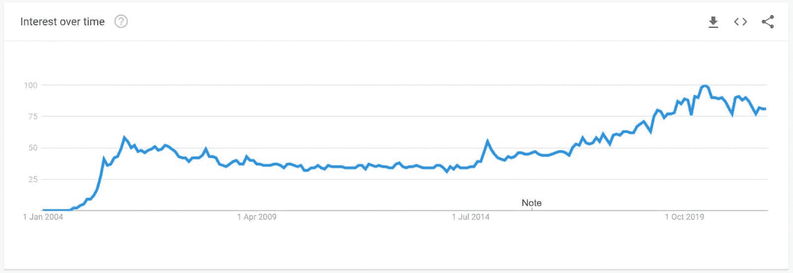
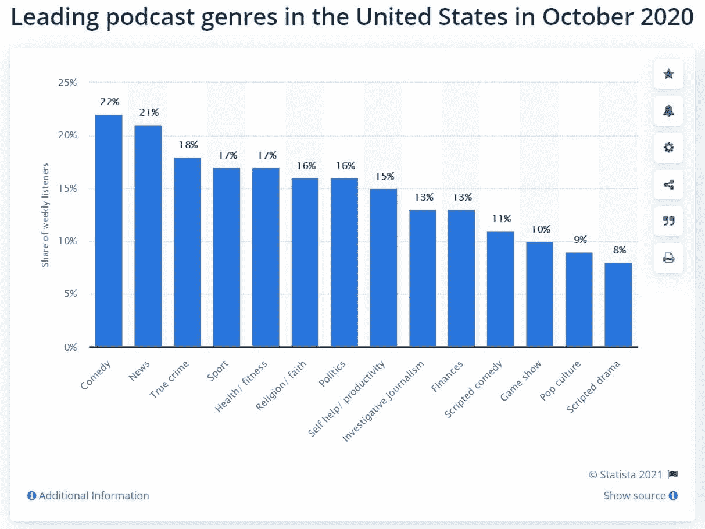
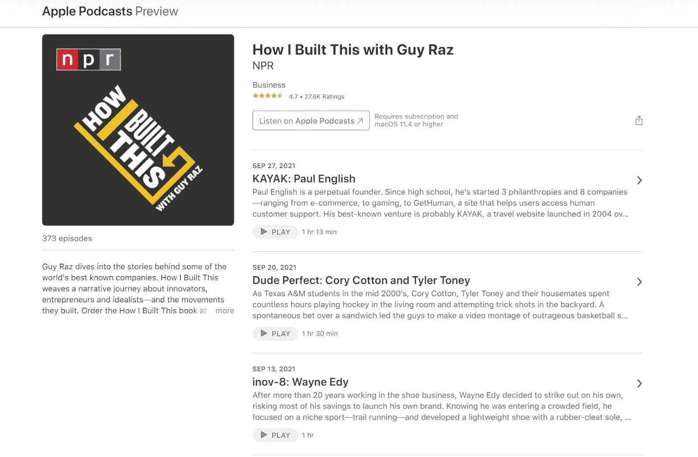
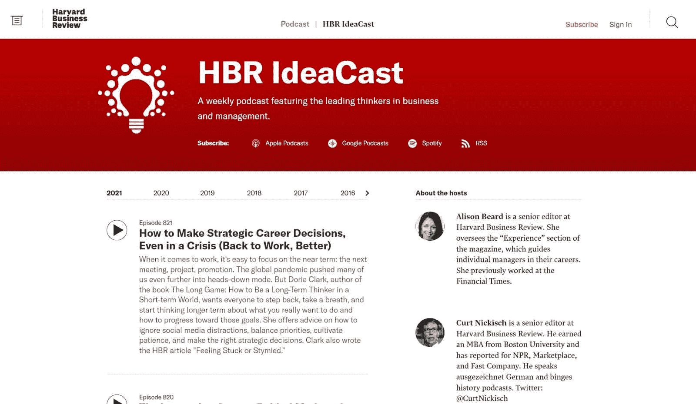
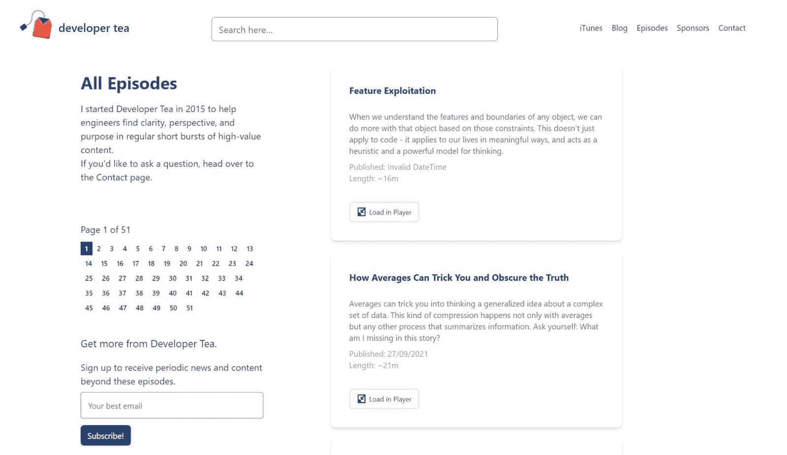
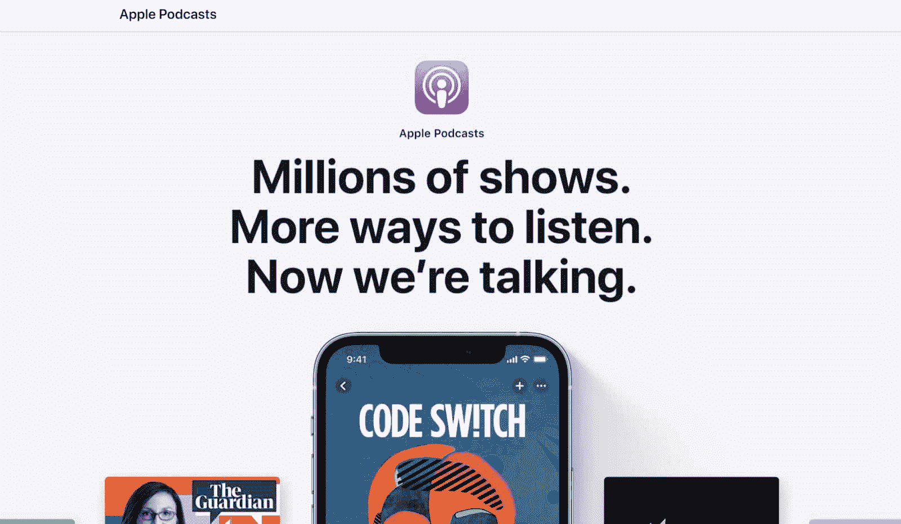
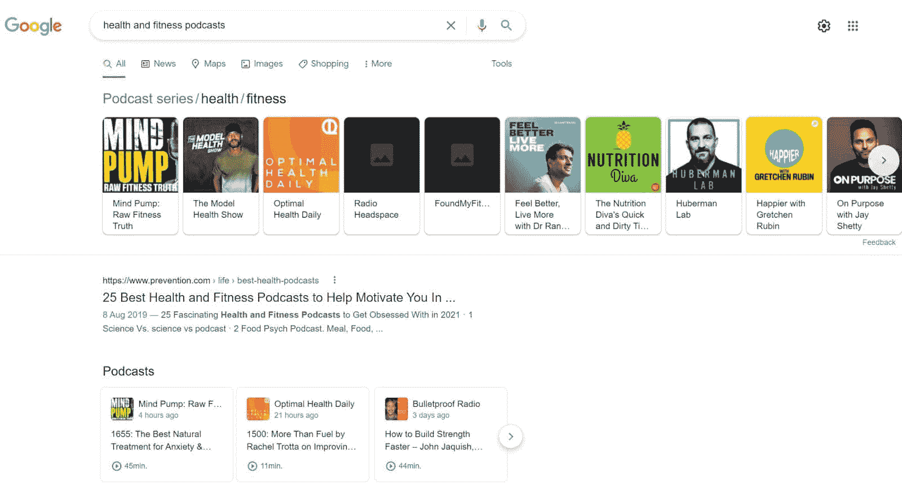
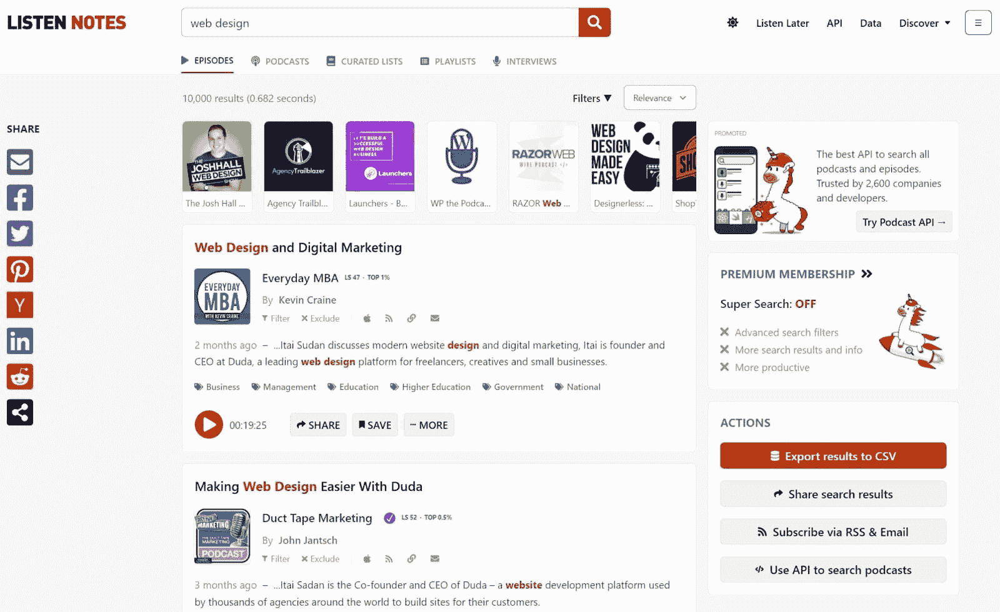

# 什么是播客？它们是如何工作的？

> 原文：<https://kinsta.com/blog/what-is-a-podcast/>

虽然“播客”这个词在 30 年前还不存在，但播客现在已经成为许多人日常生活的一部分。

根据爱迪生公司的调查，三分之一 12 岁以上的美国人每月听一次播客。这相当于超过 1 亿人。

那么，什么是播客，为什么人们会被它吸引？在本文中，我们将回答这两个问题，并告诉你如何找到播客，如何收听播客，以及如何定制您的播客收听体验。

让我们开始吧。

T3】

## 什么是播客？

播客是人们通过电脑、平板电脑或互联网收听的有组织的广播式节目。“互联网”是这里的关键，因为播客是在线发布的。

播客是一种非常灵活的媒体，因为:

*   播客可能由单集或数百集的系列组成
*   播客的长度从每集一分钟到数小时不等(平均长度为 [41 分 31 秒](https://blog.pacific-content.com/podcast-episodes-got-shorter-in-2019-69e1f3b6c82f#:~:text=Overall%20average%20length,length%20I%20calculated%20last%20year.)
*   播客主持人(主持播客的主持人)可以涵盖任何话题
*   播客可以在 Twitch 或 Youtube 等平台上发布他们的节目，包括预先录制的节目或直播节目

虽然每个播客都有其独特的风格，但播客通常以三种方式之一来呈现他们的剧集:

> Kinsta 把我宠坏了，所以我现在要求每个供应商都提供这样的服务。我们还试图通过我们的 SaaS 工具支持达到这一水平。
> 
> <footer class="wp-block-kinsta-client-quote__footer">
> 
> 
> 
> <cite class="wp-block-kinsta-client-quote__cite">Suganthan Mohanadasan from @Suganthanmn</cite></footer>

[View plans](https://kinsta.com/plans/)

1.  **单机:**可以听每集不听别人
2.  你必须按照设定的顺序听每一集，才能完全理解故事
3.  基于主题:你可以单独听每一集，但每一集都呈现了一个主题的细微差别，你可能需要听完所有集才能充分欣赏

播客还结合了许多娱乐类型的元素。如果你要用 15 个词或更少的词来描述一个播客，你可能会说它们结合了 YouTube 频道的亲切感和广播节目的制作质量。

[虽然“播客”这个词在 30 年前还不存在，但播客现在已经成为许多人日常生活的一部分🎧了解更多关于这种日益流行的媒体就在这里⬇️ 点击推文](https://twitter.com/intent/tweet?url=https%3A%2F%2Fbit.ly%2F3FKtsCn&via=kinsta&text=While+the+word+%27podcast%27+didn%27t+even+exist+30+years+ago%2C+podcasts+are+now+a+daily+part+of+many+people%27s+lives+%F0%9F%8E%A7+Learn+more+about+this+increasingly+popular+medium+right+here+%E2%AC%87%EF%B8%8F&hashtags=Podcasting%2CPodcasts)

### 播客的历史

为了理解播客的历史，我们需要回溯近 20 年，直到 2001 年第一台 iPod 发布。尽管 iPods 不是市场上第一款便携式 MP3 播放器，但它们的发布与 Pandora 等广播和音乐流媒体平台的发布相吻合。

随着 iPod 越来越受欢迎，人们开始将广播节目下载到他们的设备上。

企业家亚当·库里和戴夫·维纳在 2004 年让这一切成为可能。他们开发了一款名为 iPodder 的 RSS(简易信息聚合)软件，可以将互联网上的广播下载到 iPods 上。

根据 Winer 的说法，[第一个真正的播客](https://www.thetilt.com/content/commentary/the-first-podcast)是他与 Christopher Lydon(一个主持开源的电台主持人，一个现在是播客的电台节目)的采访。

人们也在争论“播客”这个词的起源，但它似乎部分源于本·哈默斯利在 2004 年发表的一篇题为“听觉革命”的文章虽然这篇文章没有使用“播客”，但它提出了三个类似的术语:音频博客、播客和游击队媒体。

后来，这些术语变成了“音频博客”和“播客”，最终“播客”越来越受欢迎(到 2004 年底，成千上万的谷歌搜索)。

播客的谷歌趋势结果(来源:[谷歌趋势](//trends.google.com/trends/explore?date=all&q=podcast%E2%80%9D) )

正如谷歌趋势所表明的，播客在 2004 年后开始在全球流行。

那一年，全球有了第一家播客服务提供商——libsyn.com。然后，在 2005 年,“podcast”一词成为新牛津美国词典的年度词汇。

到 2009 年， [43%的美国人](http://www.edisonresearch.com/wp-content/uploads/2009/04/Infinite-Dial-2009-Presentation.pdf)听说过播客，到 2019 年，[这一数字上升到 70%](https://www.edisonresearch.com/wp-content/uploads/2019/03/Infinite-Dial-2019-PDF-1.pdf) 。同年，估计有 1.44 亿美国人收听播客，其中 9000 万听众每月收听一次。

那么今天的播客是什么样的呢？

### 播客的类型

2021 年有许多不同类型的播客，包括:

*   主持人以脱口秀形式展示内容的对话式播客
*   采访播客
*   讲述虚构故事的播客
*   讲述非虚构故事或历史事件的播客
*   教授您某个主题的讲座式播客
*   呈现客观报道的调查性新闻风格的播客
*   游戏节目风格的播客，参赛者互相竞争或与主持人竞争
*   来电播客，来电者参与讨论

由于播客是一种非常灵活的媒体，许多节目融合了这些不同“类型”的元素例如，受欢迎的播客的一些剧集回复了对嘉宾的采访，而主持人通过叙事故事呈现了其他剧集。

自然，播客的灵活性意味着人们可以用它来制作各种类型的内容。截至 2020 年 10 月，最受欢迎的类型包括喜剧、新闻、真实犯罪、体育、健康和健身。

最受欢迎的播客流派(来源: [Statista](//www.statista.com/statistics/786938/top-podcast-genres/%E2%80%9D) )

如果你对媒体行业感兴趣，这些类型可能会让你想起另一种流行的娱乐媒体——广播。虽然广播和播客可能涵盖相似的类型，但它们并不相同。

### 播客与广播

正如我们在 *"* 播客的历史 *"* 一节中提到的，广播在创建播客中至关重要。然而，虽然这两种娱乐媒体可能有着共同的历史，但今天有许多不同之处。

这些差异包括:

*   管理:播客通常比广播更有管理性，因为制作人可以在发布前编辑它们
*   制作质量:许多播客包含背景音乐和声音效果，制作人员在后期制作时会对其进行编辑
*   **视觉:**播客可能包含视觉元素(在“音频和视频”部分有更多相关信息)
*   焦点:播客经常在多集里深入探讨一个话题的细微差别，而许多广播节目(尤其是早间和晚间节目)采用“轻松收听”的风格，人们可以随时收听和理解
*   广播媒体:播客通过互联网分发

虽然播客和广播不同，但它们也有相似的元素。这些元素包括对叙述者的依赖，分隔各个部分的广告插播，以及对讲述故事的音频的强烈关注。

## 播客如何工作

播客的世界通常是这样的。首先，有人录制了一个播客并对其进行编辑。然后，他们通过播客平台或使用内置音频播放器直接发布到他们的网站上。一旦播客制作人发布了他们的播客，消费者就可以通过他们的电脑、平板电脑或手机收听。

要理解播客是如何工作的，你需要理解两件关键的事情:视频播客和典型的播客格式。

### 音频和视频

播客最初是一种纯粹基于音频的媒体，但今天情况不同了。截至 2021 年 10 月，播客数据库 Listen Notes 估计在线播客[超过 260 万](https://www.listennotes.com/)。专家认为大约 17%的[包含视觉元素。](https://riverside.fm/blog/podcast-statistics)

这些视觉元素可以是:

*   显示播客主持人谈话的实时视频
*   用不同的图片、信息图和图表演示要点的幻灯片
*   预先录制的短剧、视频和采访

虽然视觉元素对于一个成功的播客来说不是必需的，但是它们可以让播客变得更好。这是因为视觉元素可以:

*   演示难以通过音频传达的关键点
*   允许播客通过在 Twitch 或 Youtube 等视频平台上为用户创建内容来吸引更广泛的观众
*   在主持人和听众之间创造一个亲密的环境
*   提供竞争优势，提高视频播客的投资回报率(ROI)

### 典型格式(预期内容)

正如我们在*播客类型*一节中提到的，每一个播客都有独特的风格。然而，大多数播客遵循这样的结构:**

 ***   上一集发生的事情的摘要(如果播客是连续的)
*   1-5 分钟的介绍和标题序列(这是播客最重要的部分之一，因为它需要抓住消费者的注意力)
*   5-25 分钟的内容部分
*   1-4 分钟的广告阅读
*   另一段 5-25 分钟的内容
*   另一则 1-4 分钟长的广告
*   结论
*   下一集的预告(如果播客是连续的)

虽然这可能看起来类似于广播节目的格式，但播客有一些独特的怪癖，使它们与众不同。

例如，许多播客主持人会在每集结束时向帕特里翁的支持者大喊。Patreon 是一个会员制平台，粉丝们通过定期支付订阅费来筹集演出资金。

或者，许多播客以容易搜索的关键字来命名他们的播客，这样人们可以在网上找到它们。例如，一集关于 2021 年电子商务趋势的播客可能有一个类似“2021 年电子商务状况”的名称

## 为什么播客如此受欢迎

在 2004 年的文章[“听觉革命”](https://www.theguardian.com/media/2004/feb/12/broadcasting.digitalmedia)中，本·哈默斯利将播客的好处描述为“报纸只能梦想的东西”，因为播客具有“声音的亲切感、博客的交互性以及 MP3 下载的便利性和便携性。”

虽然播客自 2004 年以来发生了很大变化，但这些好处今天仍然有效——尤其是哈默斯利关于便携性的观点。

虽然播客是讲故事的优秀工具，但它们的吸引力很大一部分来自于灵活性。

许多人在跑步、遛狗、跑腿、打扫卫生和通勤上班时听播客。所有这些活动都需要某人的部分注意力——所以你不能在看电视或看书的时候做这些事情。但是你可以边听播客边做。

要理解人们为什么选择听播客，你只需要看看最流行的播客类型。由于人们最喜欢喜剧、新闻、真实犯罪、体育、健康和健身，我们知道他们听播客是为了欢笑、学习新东西、发展新技能、提升自己和了解时事。

这解释了为什么人们喜欢播客。但是他们为什么要开始呢？

虽然每个播客都有自己的“为什么”，但许多人和企业创建播客是为了:

*   向潜在顾客推销他们的服务
*   发展网络形象(创建有机内容并在网上发布可以[为你的网站和业务带来有机流量](https://kinsta.com/blog/how-to-drive-traffic-to-your-website/)
*   教人们他们已经掌握的技能
*   娱乐大众
*   通过募捐、捐赠或广告赚钱
*   开创喜剧、娱乐或表演事业
*   玩得开心(自己或者和朋友一起)
*   通过附属链接出售物品

## 值得一试的播客

根据 Listen Notes，目前在线可获得超过 260 万个播客和 1.15 亿个播客片段。自然，有很多播客可供选择——那么你应该从哪里开始呢？

如果你是一个新的播客听众，并且对商业、网页设计和电子商务感兴趣，你可能会喜欢我们五大最佳播客之一。

### 1.逆向工程

我们将从提及我们自己的逆向工程播客开始。这是一个由 Kinsta 首席运营官 Jon Penland 主持的商业播客。在每一集里，Jon 都会与成功的企业家和商业人士坐下来，询问他们的业务、成功以及任何可以与他人分享的知识。

金斯塔的“逆向工程”播客。

如果你正在寻找一个经过充分研究的播客，充满了有助于你发展业务的可操作的见解，你会喜欢逆向工程的。这对喜欢视频播客的人来说也很棒，因为每一集都包括乔恩采访的镜头。

你可以在这里找到它:

*   [Kinsta.com](https://kinsta.com/podcast/)
*   [苹果播客](https://podcasts.apple.com/podcast/id1563477273)
*   [Spotify](https://open.spotify.com/show/6URm7SfixcNrc0FMTaDQ64)
*   [YouTube](https://www.youtube.com/watch?v=ZA4FOTDmqdA&list=PLhYfuAN3YCfwZkEDA1GdeyjbK9F2Dx77T)

或者，如果你想找一集来开始，我们推荐布拉德·米勒的[“创造伟大的文化是业务增长的关键”](https://kinsta.com/podcast/culture-key-to-business-growth/)或者约翰·多尔蒂的[“吸引合格线索的秘密”](https://kinsta.com/podcast/qualified-leads/)。

### 2.我是如何建造这个的

《我是如何建造的》讲述了一些世界上最知名公司的不为人知的故事。由盖伊·拉兹主持，NPR 制作,《我是如何建立的》涵盖了公司的起源、早期以及使某些公司成功的“事情”。

## 注册订阅时事通讯

### 想知道我们是怎么让流量增长超过 1000%的吗？

加入 20，000 多名获得我们每周时事通讯和内部消息的人的行列吧！

[Subscribe Now](#newsletter)

我是如何建立这个播客的

对于企业主、投资者和任何对创业感兴趣的人来说，这是一个有趣的倾听。它有一个独特的风格，包括叙述故事，采访创始人，和脱口秀部分。

虽然我如何建立这个不会教你如何开始自己的事业，但它会通过向你展示公司获得成功的许多方式来激励你。

你可以在这里找到它:

*   [NPR](https://www.npr.org/podcasts/510313/how-i-built-this)
*   [苹果播客](https://podcasts.apple.com/podcast/1150510297?mt=2&at=11l79Y&ct=nprdirectory)
*   [Spotify](https://open.spotify.com/show/6E709HRH7XaiZrMfgtNCun)
*   [谷歌播客](https://podcasts.google.com/feed/aHR0cHM6Ly93d3cubnByLm9yZy9yc3MvcG9kY2FzdC5waHA_aWQ9NTEwMzEz)

### 3.HBR 理念传播

HBR IdeaCast 是一个每周播客，涵盖影响全球企业主和经理的热门事件。

HBR

T4】

由《哈佛商业评论》资深编辑艾莉森·比尔德和柯特·尼克施主持的 HBR 创意节目采访了从制药到科技等各个领域的领袖和专家。截至 2021 年 10 月，HBR IdeaCast 已经发布了 820 集。

HBR IdeaCast 是一个非常好的播客，适合喜欢密集、知识丰富的剧集的人。

你可以在这里找到它:

*   [HBR.org](https://hbr.org/2018/01/podcast-ideacast)
*   [苹果播客](https://podcasts.apple.com/us/podcast/hbr-ideacast/id152022135)
*   [Spotify](https://open.spotify.com/show/4gtSBBxIAE142ApX6LqsvN)

### 4.影响者播客

如果你曾经考虑过影响者营销，你会从影响者播客中学到很多。

由 Julie Solomon 主持的影响者播客涵盖了影响的商业方面，包括成为影响者，通过影响发展你的品牌，以及影响者营销的科学。

该播客包括所罗门的故事，对品牌所有者和影响者的采访，以及对崭露头角的影响者的建议。虽然名字可能表明它专注于社交媒体，但 Solomon 涵盖了在网络上有影响力的影响者和思想领袖。

你可以在这里找到它:

*   [Juliesolomon.net](https://juliesolomon.net/podcast)
*   [苹果播客](https://podcasts.apple.com/us/podcast/the-influencer-podcast/id1229401800)
*   [Spotify](https://open.spotify.com/show/55czkyRMTVEjinuoBTxulE)

### 5.显影剂茶

Developer Tea 是一个商业和软件开发播客，涵盖网页设计、内容创作、产品设计、[软件工程](https://kinsta.com/software-engineering-statistics/)和专业开发。

由 PBSs 技术总监 Jonathan Cutrell 主持的 Developer Tea 包括对行业领导者的采访、讲座式教育和哲学思考。

开发者茶不仅仅是为开发者准备的，因为它包含了大量有助于品牌所有者、营销人员和任何从事数字产品后端工作的人改进工作的信息。

与我们世界一流的支持团队一起体验卓越的 WordPress 托管支持！与支持我们财富 500 强客户的同一个团队聊天。[查看我们的计划](https://kinsta.com/plans/?in-article-cta)

你可以在这里找到它:

*   [Developertea.com](https://developertea.com/)
*   [苹果播客](https://podcasts.apple.com/us/podcast/developer-tea/id955596067)
*   [谷歌播客](https://podcasts.google.com/?feed=aHR0cHM6Ly9yc3Muc2ltcGxlY2FzdC5jb20vcG9kY2FzdHMvMzYzL3Jzcw)
*   [Spotify](https://open.spotify.com/show/02fM1JHpt9HmHGp482K71b)

## 如何收听播客

听播客与听音乐非常相似:你打开播客服务，选择一个播客，然后按“播放”然后，您可以暂停您的播客，向前或向后跳过，或下载您的播客供以后使用。

听播客需要两个关键的东西:一个听播客的平台和一个可以欣赏的播客。

让我们从讨论播客平台开始。

### 顶级播客平台

播客平台是播客用户和播客消费者之间的中介。

虽然网上有几十个播客平台，但 76%的播客消费者依赖四个平台:Spotify、苹果播客、谷歌播客和 Pandora。

#### Spotify

Spotify 拥有超过 220 万个播客，统治着播客市场。你可以通过 iOS 设备、Android 设备、Spotify 桌面应用程序和 spotify.com 在线收听 Spotify 上的播客。

你可以在 Spotify 上免费下载播客。

#### 苹果播客

苹果播客也是该行业的巨头，因为它目前拥有超过 200 万播客，在 170 多个国家运营。Apple Podcasts 可在 iPhone、iPad、Mac 和 Apple TV 上使用。如果您有 Windows 电脑，也可以通过 iTunes 访问它。

您可以免费使用 Apple Podcasts。

#### 谷歌播客

谷歌播客是一个较新的播客应用程序，因为谷歌[在 2018 年](https://www.theverge.com/2018/6/19/17475878/google-podcast-app-android-download-launch-date)才发布它。然而，尽管年代久远，它仍然非常受欢迎，在谷歌 Play 商店上[有超过 496，000 条评论](https://play.google.com/store/apps/details?id=com.google.android.apps.podcasts&hl=en_AU&gl=US)。

目前，谷歌播客可以在 Android 设备、iPhone、谷歌 Nest 和谷歌 Home 上使用。

你可以免费使用它。

#### 潘多拉

潘多拉是一个音乐和播客托管服务，可以追溯到 2004 年。Pandora 由 SiriusXM 控股公司所有，目前拥有[5800 万用户](https://www.businessofapps.com/data/pandora-statistics/)。

Pandora 目前可以在 iOS 和 Android 设备、Google Home、Amazon Fire、Xbox One 和 pandora.com 上使用。潘多拉提供免费版本和付费计划。你可以通过免费版收听播客。

你不能在 Pandora 上下载播客进行离线收听。

### 查找播客的 3 种方法

一旦你选择了一个播客提供商，你需要找到一个播客来听，然后才能按下“播放”这里有三种方法可以找到播客。

#### 1.浏览您推荐的播客

如果你通过 Spotify 或 Apple Podcasts 这样的平台收听播客，你可以通过浏览平台的“推荐”播客列表来找到新的节目。

这个列表是找到高质量播客的一个很好的方式，因为平台会推荐受听众欢迎、广受好评或当前流行的节目。

要在“推荐”列表中查找播客，只需:

*   去你的播客平台
*   点击“推荐”或“浏览”
*   向下滚动，直到找到您感兴趣的播客

#### 2.使用互联网

正如在“典型格式(期待什么)”一节中提到的，许多播客听众通过像 Google、Yahoo 和 Bing 这样的搜索引擎找到新的播客。

要以这种方式查找播客，只需:

*   输入你感兴趣的话题，加上“播客”(比如“健康和健身播客”)
*   寻找 Spotify、Google 和 Apple Podcasts 上托管的 podcast，或者滚动搜索引擎推荐的列表

谷歌搜索结果为“健康与健身播客

一旦找到感兴趣的播客，您还可以使用互联网搜索评论。阅读评论可以帮助你从糟糕的播客中挑选好的播客。

#### 3.使用听力笔记

Listen Notes 是一个播客搜索引擎，列出了超过 1.15 亿个播客片段。要在上面查找播客，您只需:

*   请访问听力笔记网站
*   键入与您想要的播客类型相关的关键词
*   向下滚动，直到找到您感兴趣的播客

如果您没有看到任何感兴趣的播客，请尝试点按其中一个标签来搜索相关节目。

### 订阅播客

一旦您开始收听播客，您可能会注意到播客主持人要求您“订阅”

当你[订阅一个播客时，](https://kinsta.com/podcast/)你会自动收到新的剧集。订阅播客是跟上新剧集的好方法，因为当新剧集发布时，你的播客平台会通知你并自动下载。

要订阅播客，请访问节目列表，然后按“订阅”或“关注”按钮(不同的平台使用不同的术语)。订阅后，您可以在“播客订阅”列表中找到它。

[通过这篇指南，了解你需要知道的关于近年来最受欢迎的传播媒介之一的一切🎧🎙 点击推文](https://twitter.com/intent/tweet?url=https%3A%2F%2Fbit.ly%2F3FKtsCn&via=kinsta&text=Learn+everything+you+need+to+know+about+one+of+the+most+popular+mediums+for+communication+in+recent+years+with+this+guide+%F0%9F%8E%A7%F0%9F%8E%99&hashtags=Podcasting%2CPodcasts)

## 摘要

如果你喜欢策划的广播节目、纪录片或 Youtube 视频，你会喜欢播客。听播客是扩展你的思维、娱乐自己、了解世界和获得新技能的好方法，同时还能获得乐趣。

最重要的是，播客是灵活的。你可以在网上或网下，在你的电脑或手机上，在任何你想听的地方听。你只需要一个播客应用和一个播客来听。

当然，这引出了一个有趣的问题:你同意我们最喜欢的播客列表吗？如果不同意，你会向新的播客消费者推荐哪些播客？

* * *

让你所有的[应用程序](https://kinsta.com/application-hosting/)、[数据库](https://kinsta.com/database-hosting/)和 [WordPress 网站](https://kinsta.com/wordpress-hosting/)在线并在一个屋檐下。我们功能丰富的高性能云平台包括:

*   在 MyKinsta 仪表盘中轻松设置和管理
*   24/7 专家支持
*   最好的谷歌云平台硬件和网络，由 Kubernetes 提供最大的可扩展性
*   面向速度和安全性的企业级 Cloudflare 集成
*   全球受众覆盖全球多达 35 个数据中心和 275 多个 pop

在第一个月使用托管的[应用程序或托管](https://kinsta.com/application-hosting/)的[数据库，您可以享受 20 美元的优惠，亲自测试一下。探索我们的](https://kinsta.com/database-hosting/)[计划](https://kinsta.com/plans/)或[与销售人员交谈](https://kinsta.com/contact-us/)以找到最适合您的方式。**