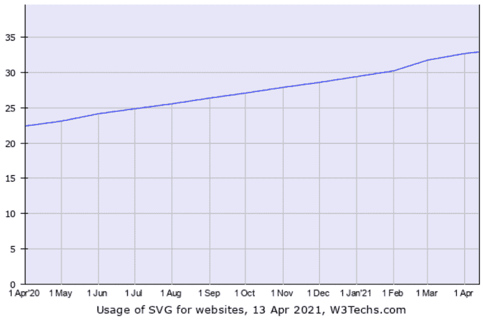
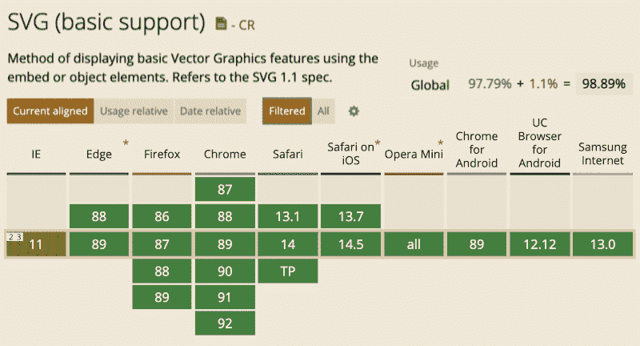
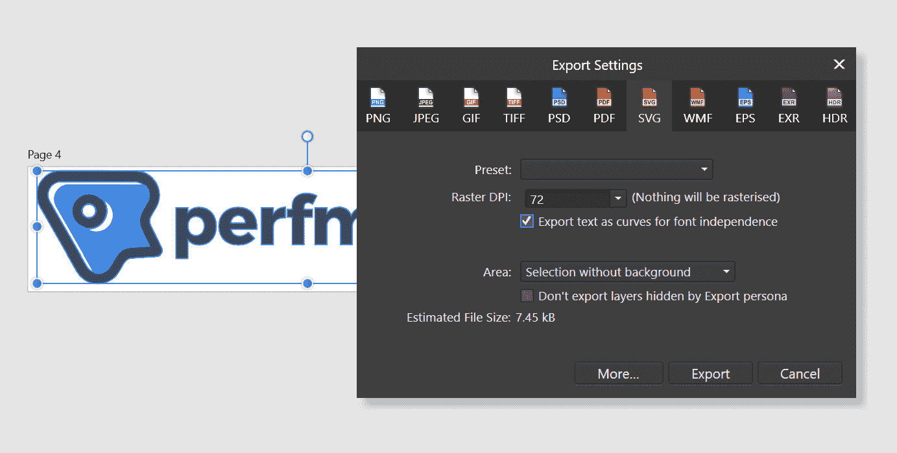
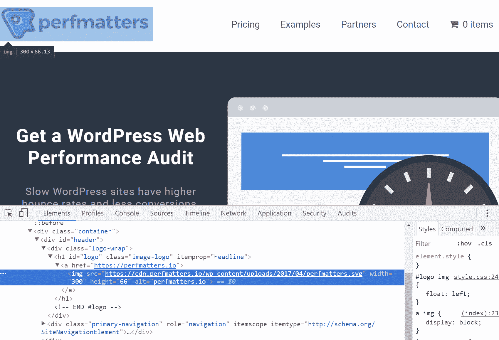
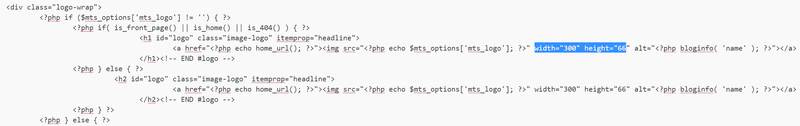

# 什么是 SVG 文件(以及如何将 SVG 上传到 WordPress)？

> 原文：<https://kinsta.com/blog/what-is-an-svg-file/>

SVG 文件在开发人员和设计人员中特别受欢迎的主要原因是，它们是一种可缩放的图像格式，通常文件大小更小(有时小很多)，并且不会在 retina 屏幕上像素化。WordPress 默认不允许你上传 SVG 文件格式，主要是出于安全考虑。

今天我们将深入探讨什么是 SVG，它们如何有益，以及如何安全地启用 WordPress SVG 支持。我们还将讨论浏览器支持，以及如果您决定要切换到矢量图像格式的一些注意事项。

希望有一天我们会把 SVG 作为 WordPress 核心的一部分，但是我们还没有到那一步。

## 什么是 SVG 文件？

SVG(可缩放矢量图形)是一种**基于 XML 的矢量图像**，通常被网站和品牌用来在其网站上显示徽标和图标。维基百科将 SVG 定义为:

> SVG(可缩放矢量图形)是一种基于 XML 的二维图形矢量图像格式，支持交互性和动画。SVG 规范是万维网联盟(W3C)自 1999 年以来开发的一种开放标准。

你甚至可以用代码或者文本编辑器来操作 SVG 文件。目前， [33%的网站](https://w3techs.com/technologies/details/im-svg/all/all)使用 SVG，正如你在下面看到的，采用率正在快速增长。热门网站如 Google、Reddit、Dropbox、ESPN，甚至我们自己在 Kinsta 的网站都使用 SVG。



SVG usage statistics April 2020 – April 2021


### SVG 文件浏览器支持

SVG 文件目前被[所有主流浏览器](http://caniuse.com/#feat=svg)支持，包括手机浏览器。您可能遇到的唯一问题是您是否仍然需要 IE8 支持，我们希望您不需要。IE8 在 T2 的浏览器市场份额只有 0.36%左右，并且不再受支持。这是 Lubos 写的一篇很棒的文章，关于为什么开发者应该[停止支持 IE8、IE9 和 IE10](https://www.xfive.co/blog/stop-supporting-ie10-ie9-ie8/) 。从商业角度来看，这可能并不总是可能的，但他提出了一些好的观点。如果出于某种绝望的原因，您仍然需要 IE8 支持，您可以为您的 SVG 图像定义一个后备图像( [PNG](https://kinsta.com/blog/svg-vs-png/) 或 JPG)，但是我们今天不会讨论这个。以下是支持的浏览器列表:


> Kinsta 把我宠坏了，所以我现在要求每个供应商都提供这样的服务。我们还试图通过我们的 SaaS 工具支持达到这一水平。
> 
> <footer class="wp-block-kinsta-client-quote__footer">
> 
> 
> 
> <cite class="wp-block-kinsta-client-quote__cite">Suganthan Mohanadasan from @Suganthanmn</cite></footer>

[View plans](https://kinsta.com/plans/)

*   Internet Explorer 9、10、11+和 Edge
*   火狐 2+
*   铬 4+
*   Safari 3.1 以上版本
*   Opera 10+
*   iOS Safari 3.2+
*   安卓浏览器 3+
*   Android 86+版火狐浏览器
*   迷你歌剧(全部)
*   Opera Mobile 12+
*   安卓 89+版 Chrome
*   适用于 Android 12.12+的 UC 浏览器
*   三星互联网 4+
*   QQ 浏览器 10.4
*   百度浏览器 7.12
*   KaiOS 浏览器 2.5



SVG 浏览器支持


### 使用 SVG 文件的好处

SVG 文件是一种矢量格式，这意味着它们在浏览器和照片编辑工具中都可以自动缩放。这使得它们对于图形和网页设计师来说都很棒。通常情况下，当你试图在 Photoshop，Sketch 或 Paint 等工具中编辑 PNG 或 JPG 时，如果没有像素化，你就无法放大它们。有了 SVG，你可以无限放大它们，它们每次看起来都像像素一样完美(或者我们应该说向量一样完美)。这就是为什么他们是一个伟大的图像格式用于视网膜屏幕。

**谷歌索引 SVG**，这对 [SEO](https://kinsta.com/blog/what-does-seo-stand-for/) 来说是个好消息。链接到文件本身的 SVG 内容将被编入索引，并显示在谷歌图像搜索中。通过进行[高级图像搜索](https://www.google.com/search?as_st=y&tbm=isch&as_q=&as_epq=&as_oq=&as_eq=&cr=&as_sitesearch=kinsta.com&safe=images&tbs=ift:svg)，你可以直接看到我们在 Kinsta 上使用的 SVG 插图。注意:内联 SVG，或者更确切地说，那些只由代码组成的 SVG，通常是没有索引的。

## 注册订阅时事通讯


### 想知道我们是怎么让流量增长超过 1000%的吗？

加入 20，000 多名获得我们每周时事通讯和内部消息的人的行列吧！

[Subscribe Now](#newsletter)

SVG 通常(不总是)比 png 或 jpg 小。通过使用 SVGs，你实际上可以加速你的 WordPress 站点，因为你将减少你的整个页面大小。Genki 写了一篇很棒的文章，他比较了 [SVG vs PNG vs JPEG](https://web.archive.org/web/20200729105713/http://genkihagata.com/blog/svg-vs-flat-images.html) 的大小，这里是我们的 [JPG vs JPEG 比较](https://kinsta.com/blog/jpg-vs-jpeg/)。下面是他在测试中比较三种不同图像类型的一些收获。

#### JPG(优化大小:81.4 KB)


JPG image


#### PNG(优化大小:85.1 KB)


PNG image


#### SVG(优化大小:6.1 KB)


SVG image


如上所述，与 JPG 相比，SVG 的文件大小减少了 92.51% 。与巴新相比，**为 92.83%** 。这些都是非常令人印象深刻的文件大小差异。然而，有一个警告，当他测试更详细的图像时，SVG 最终实际上变得比 JPG 或 PNG 更大。

我们在所有的服务器上都启用了 GZIP，因此它们可以随时处理您的 SVG。[免费试用 kin sta](https://hubs.ly/H0pklC_0)。

这就是为什么许多网站使用 SVG 来处理不太详细的图像，如徽标、图标等。因为他们会看到文件大小显著减小。但是对于更多细节丰富的图片，比如你的博客文章“特色图片”，你可能想坚持使用 PNG 或 JPG，但是[你仍然可以优化它们](https://kinsta.com/blog/optimize-images-for-web/)。许多网站使用混合方法，在有意义的地方同时使用两种文件类型。

此外，值得注意的是，像脸书和推特这样的社交媒体网络不支持 SVG 分享。因此，如果你使用 SVGs 作为你的特色图片，你必须利用 Yoast SEO 功能，并上传一个 PNG 或 JPG 作为 [OG 和 meta 标签](https://kinsta.com/blog/linkedin-debugger/#how-to-get-og-meta-tags-in-wordpress)，否则你可能会冒风险，你的[特色图片根本不会显示](https://kinsta.com/blog/wordpress-featured-image-not-showing/)。


## 为什么 SVG 安全性很重要

SVG 还不是 WordPress 核心的一部分的原因是有一些安全问题需要解决。你可以关注 WordPress core (#24251)中关于[SVG 的积极讨论，这个讨论始于 2013 年。SVG 是一个 XML 文件，它本身暴露了不同的漏洞，而普通的图像格式不会受到影响。这些攻击包括](https://core.trac.wordpress.org/ticket/24251) [XML 外部实体攻击](https://owasp.org/www-community/vulnerabilities/XML_External_Entity_(XXE)_Processing) (XXE)、炸弹嵌套实体和 XSS 攻击。

Mario Heiderich 发表了一篇颇有见地的演讲，讲述了由于使用 SVG 文件进行活动内容注入而带来的安全风险。给出的一个例子是 JavaScript 嵌入在 SVG 中，它实际上设法在 Skype 上呼叫 Mario。这有点吓人！WordPress 安全插件的作者 [SecuPress](https://kinsta.com/blog/wordpress-security-plugins/#secupress) ，也谈到了当[向 WordPress](https://secupress.me/blog/add-svg-support-in-wordpress-medias-yes-but-no/) 添加 SVG 时要小心的主题，以及以正确的方式做这件事的重要性。

资源库上的许多 SVG 插件都使用了下面的代码，这些代码简单地启用了 MIME 类型，允许将 SVG 上传到 WordPress 媒体库。这样做不安全！所以**不要去下载你看到的第一个免费的 SVG 插件**或者复制粘贴这段代码，认为你已经准备好了。

```
function cc_mime_types($mimes) {
 $mimes['svg'] = 'image/svg+xml';
 return $mimes;
}
add_filter('upload_mimes', 'cc_mime_types');
```

解决方案是**SVG 需要被净化**。净化基本上是清理代码或输入，以避免安全问题(如代码注入)、代码冲突和错误。这可能需要编码数据、过滤和验证字符串等。这就是 Daryll Doyle 的 [SVG-Sanitizer](https://github.com/darylldoyle/svg-sanitizer) 库发挥作用的地方，他称之为“他试图用 PHP 构建一个像样的 SVG sanitizer”看看[的 SVG 消毒剂](http://svg.enshrined.co.uk/)的演示，看看它的实际效果。


SVG sanitizer demo


考虑你的站点上谁有权上传 SVG 也很重要。例如，如果你在一个多作者的网站上，你不知道别人会上传什么样的 SVG，从而暴露你的网站。限制 SVG 上传给管理员和那些了解一些安全问题的人是明智的。
T3】

## 如何安全地启用 WordPress SVG 支持

Daryll 开发了一个插件，WP SVG(也称为安全 SVG ),当上传 SVG 图片到你的 WordPress 媒体库时,**利用 SVG-Sanitizer 库**。该插件还可以让你像在媒体库中查看普通图像一样查看 SVG。


WP SVG plugin


你可以从 WordPress 知识库免费下载安全 SVG ,或者在你的 WordPress 仪表盘的“添加新插件”下搜索它。只需简单点击几下，你就可以起身离开。


### 信息

这个插件没有收到任何最新的更新，所以在将它安装到您的生产站点之前，请确保在一个临时站点上测试它。


还有一个高级版本，可在[wpsvg.com](https://wpsvg.com/)获得，它允许你限制某些用户上传 SVG 和额外的 SVG 优化。在下面的例子中，我们将简单地使用免费版本。

作为一个替代插件，你可能想要检查一下 [SVG 支持](https://wordpress.org/plugins/svg-support/)。

我们在所有的服务器上都启用了 GZIP，因此它们可以随时处理您的 SVG。[免费试用 kin sta](https://hubs.ly/H0pklC_0)。

在上传您的 SVG 文件之前，了解它们的行为与图像稍有不同是很重要的。当从照片编辑工具中导出 SVG 时，您会希望将文本导出为曲线(或创建轮廓)，否则，它在各种浏览器中的呈现可能会略有不同。



Affinity Designer – Export text as curves SVG


安装插件后，不需要任何设置，它会在上传时清理你的 SVG。在我们下面的测试网站上，你可以看到我们用一个 SVG 文件替换了我们的徽标，它可以像在媒体库中一样正常查看。


SVG in WordPress media library


这也允许我们使用主题的控制面板来改变 WordPress 标题中的 logo 到我们的 SVG 文件中。你可以在下面看到它确实提供了。svg 文件。现在在视网膜屏幕上看起来很漂亮。



SVG in WordPress header


我们必须做一个额外的调整。在 IE9-11 中，桌面和移动还不能正确缩放 SVG 文件。[增加高度和宽度](http://codepen.io/tomByrer/pen/qEBbzw?editors=110)解决了这个问题。这可能因主题而异，但是在我们的测试站点上，我们简单地修改了我们的 header.php 文件并添加了这些自定义维度。一些 WordPress 主题使用 CSS 来修改缩放比例，这对于性能来说是不好的，但是由于这个原因，它可能需要你添加额外的代码来修复 IE 问题。



Modified header.php file for SVG IE scaling issue


就是这样！你现在已经安全地启用了 WordPress SVG 支持。WordPress 核心不认可或支持这个插件和/或方法，所以，当然，使用要自担风险。但是，如果您已经上传了只有 MIME 类型片段的 SVG，那么无论如何，请这样做。

此外，如果您以前从未使用过 svg，请确保在您的服务器上为“image/svg+xml”文件类型启用了 [GZIP。这将确保它们被压缩，并尽可能快地加载。有时，系统管理员只启用更标准的文件类型。注意:GZIP 已经在所有的 Kinsta 服务器上为 SVG 启用。](https://kinsta.com/blog/enable-gzip-compression/)

## 摘要

SVG 是增强网站外观的好方法！我们建议同时使用 SVG、PNG 和 jpg 来[实现最佳性能](https://kinsta.com/learn/speed-up-wordpress/)，因为非常详细的图像在 SVG 格式下的性能不会很好。SVG 非常适合你的徽标，可以确保它在每个屏幕上都像像素一样完美，还有图标。

你有什么想法？你在你的 WordPress 网站上使用过 SVG 吗？

* * *

让你所有的[应用程序](https://kinsta.com/application-hosting/)、[数据库](https://kinsta.com/database-hosting/)和 [WordPress 网站](https://kinsta.com/wordpress-hosting/)在线并在一个屋檐下。我们功能丰富的高性能云平台包括:

*   在 MyKinsta 仪表盘中轻松设置和管理
*   24/7 专家支持
*   最好的谷歌云平台硬件和网络，由 Kubernetes 提供最大的可扩展性
*   面向速度和安全性的企业级 Cloudflare 集成
*   全球受众覆盖全球多达 35 个数据中心和 275 多个 pop

在第一个月使用托管的[应用程序或托管](https://kinsta.com/application-hosting/)的[数据库，您可以享受 20 美元的优惠，亲自测试一下。探索我们的](https://kinsta.com/database-hosting/)[计划](https://kinsta.com/plans/)或[与销售人员交谈](https://kinsta.com/contact-us/)以找到最适合您的方式。