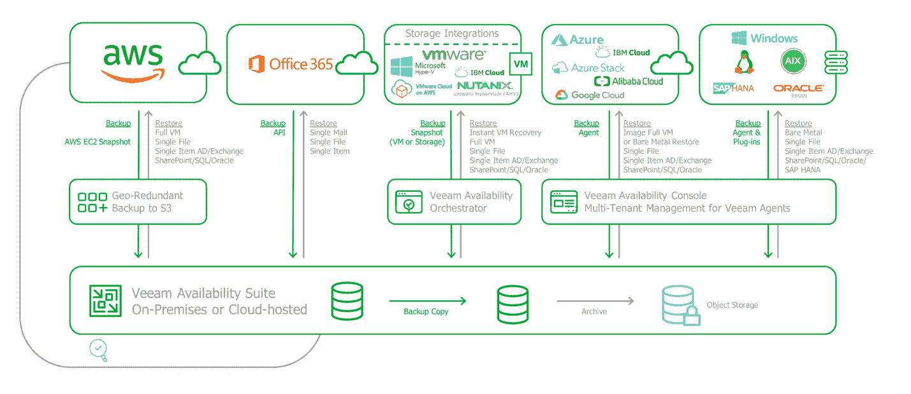

# 什么是云存储？

> 原文：<https://kinsta.com/blog/what-is-cloud-storage/>

问题“什么是云存储？”现在越来越普遍了。

如果你正在寻找一个简单的答案，云存储是一种云计算模式，在这种模式下，你将数据和文件保存到异地位置，通常通过互联网或专用网络访问。

[There's more to cloud storage than meets the eye... and this article dives into the fundamentals of the cloud computing model 🚀Click to Tweet](https://twitter.com/intent/tweet?url=https%3A%2F%2Fbit.ly%2F3dDNNAH&via=kinsta&text=There%27s+more+to+cloud+storage+than+meets+the+eye...+and+this+article+dives+into+the+fundamentals+of+the+cloud+computing+model+%F0%9F%9A%80&hashtags=CloudComputing%2CCloudStorage)

然而，除了这个简单的定义之外，云存储还有更多的内容！有不同的存储类型、部署模式、无数的使用案例、惊人的优势以及其他负载。如果您是云存储的新手，或者正在探索将数据迁移到云中，那么您来对地方了。

在本指南中，我们将带您全面了解云存储的基础知识。我们开始吧！

## 云存储的类型

Visual representation of cloud storage. *(Image source: [Backup Everything](https://backupeverything.co.uk/what-is-cloud-storage-how-is-the-data-stored-on-the-cloud/))*

当考虑在云中存储数据时，有三种主要的云存储类型可供选择。对每种类型有一个基本的了解是很重要的，因为它们提供了自己独特的优势和用例场景。

> 需要在这里大声喊出来。Kinsta 太神奇了，我用它做我的个人网站。支持是迅速和杰出的，他们的服务器是 WordPress 最快的。
> 
> <footer class="wp-block-kinsta-client-quote__footer">
> 
> 
> 
> <cite class="wp-block-kinsta-client-quote__cite">Phillip Stemann</cite></footer>

[View plans](https://kinsta.com/plans/)

 让我们从探索每种云存储类型的基础开始。

### 块存储器

块存储是一种主要用于在基于云的存储环境或存储区域网络(San)中存储数据文件的技术。在云中，块存储通常通过将虚拟磁盘连接到基于云的虚拟机(VM)来实现。

这是将数据分成单个数据块的过程，然后可以将这些数据块存储为单个数据块。每个数据块都有一个唯一的标识符，允许存储系统将较小的数据块放在最有效的位置。该方法涉及跨不同系统存储块，每个块被配置(或分区)为与不同的操作系统一起工作。这意味着相同的原始数据块可以存储在 Linux 环境和 windows 单元中。

通过将数据从用户环境中分离出来，块存储允许数据分布在多个环境中。在创建多条数据路径时，检索数据的过程会加快。当您或某个应用程序从数据块存储系统请求数据时，底层存储系统会检索并重组数据，然后将数据返回给您。

### 对象存储

对象存储的过程包括将数据文件分割成称为对象的单个块。这些对象存储在一个独立的存储库中，可以分布在多个基于云的服务器和网络系统中。

每个对象都有一个唯一的标识符，当对象存储在分布式系统中时，应用程序可以使用该标识符来标识和检索对象。元数据附加到每个包含重要信息的对象上。这可能非常详细，包括对象大小、上次修改日期、介质类型和访问权限。

对象存储的平面结构使得存储大量数据非常有效。还可以将任何类型的数据、照片、视频和日志文件存储为对象。

### 文件存储器

[云中的文件存储](https://kinsta.com/blog/what-is-ssd/)是一种存储数据的分层方法，也称为文件级或基于文件的存储。这个过程包括在文件中存储数据，这些文件被安排在文件夹中，然后被组织到目录和子目录中。对于要定位和检索文件的用户和应用程序来说，他们需要知道从目录一直到文件夹和特定文件的路径。该信息包含在附加到文件的一定数量的元数据中。

文件存储具有多种功能，几乎可以存储任何类型的数据。像任何电脑一样，你可以存储一系列复杂的文件，而且浏览起来也相当快。它也很容易配置。您可以通过用户权限、文件锁定和其他控制来控制对文件的访问。

从技术角度来看，分层文件存储在某种程度上表现良好。一旦您的文件存储达到一定的大小，您将开始遇到文件检索速度变慢的性能问题。这是由每个文件只有一条路径的限制造成的，随着文件夹、目录和子目录的增加，这种限制只会继续增加。

云系统的性质将允许您在一定程度上缓解这些性能问题。扩展以包括具有额外计算能力的更高容量的虚拟机是很容易的。但是，您可能会发现，与选择对象或块存储方法相比，这种方法效率更低，成本更高。

## 云存储模型

熟悉了[可用的云存储类型](https://kinsta.com/blog/types-of-cloud-computing/)之后，我们现在可以开始探索和理解可用的不同部署模型。

其中包括公共云、私有云以及混合云。每种云部署模式都是独一无二的，为您的存储设置提供了一系列不同的优势。让我们仔细看看。

Multi-cloud setup for storage. (Image source: [Veeam Software](https://www.veeam.com/blog/multi-cloud-considerations.html))

### 公共云

公共云可能是您最熟悉的部署模式。公共云由云服务提供商拥有和运营。这些提供商负责其云的所有运营，包括托管、管理和维护其网络和基础设施。

在这种情况下，提供商与其他公司和个人一起向您出售他们的云服务。虽然您将在公共云环境中共享基础架构，但您的应用程序和数据只能由您自己访问。

选择公共云存储模式通常是最具成本效益和可扩展性的方法。虽然人们经常对公共云的安全性和隐私性表示担忧，但这在很大程度上是没有根据的。对于大多数希望提供最佳服务的公共云提供商来说，安全性和隐私是首要考虑的问题。

### 私有云

在大多数情况下，这种方法很大程度上仅适用于资金雄厚且迫切需要保护其应用程序和数据的大型企业。

私有云是专为单一企业构建的数据中心。他们托管、管理和保护自己的云网络和基础架构。该资源不与任何其他公司或个人共享，大多数情况下位于现场。

私有云存储是最安全的方法，但也是最昂贵的，因为您要支付所有技术和人力资源成本。这种方法增加了数据丢失的风险。由于所有数据都存储在一个位置，自然灾害或重大故障可能会危及本地存储的所有数据的安全性和可恢复性。

### 混合云

混合云结合了公共云和私有云，是一种两全其美的方法。

在混合云存储设置中，您可以利用公共云的灵活性和私有云的安全性，同时平衡您的总体成本。如果您处理敏感和非敏感数据的混合，混合云是理想的选择，您可以在两种模型之间拆分这些数据。

医疗保健、法律和财务信息等高度敏感的数据可以在私有云中得到保护。而不太敏感的日常数据存储在公共云中，仍然非常安全。

## 云存储用途

理解什么是云存储的答案不仅仅局限于不同的云存储类型和部署模型。这也是关于无数可能的用例的学习。如果您目前正在使用任何形式的本地存储—服务器或工作站—那么您可以将其迁移到基于云的场景。

更好的是，您将能够通过利用云的固有优势来增强您的存储场景的功能。无论是通过增加处理能力来提高性能，还是增强安全性，您都会发现无数种方法来改善您的情况，将您的存储用例切换到云。

前面，我们概述了不同的云存储类型。其中每一种都有自己独特的方法，因此适用于不同的用例。因此，让我们探索最适合数据块、对象和文件存储类型的最常见云存储用途。

### 基于云的数据块存储的使用案例

块存储结合了速度和效率，是要求低延迟和一致吞吐量的高性能、数据密集型任务关键型应用程序的理想解决方案。Oracle、SAP、Microsoft SharePoint 和 Microsoft Exchange 都是受益于与数据块存储方法相结合的应用程序示例。常见的使用案例包括:

*   **数据库:**大多数数据库系统需要一致的 I/O 性能和低延迟连接，这使它们成为块存储的理想用例。
*   **RAID 阵列:**将块存储与独立磁盘冗余阵列(RAID)相结合，可以提高您的关键任务应用程序的运营弹性。RAID 通过将数据写入两个或更多驱动器来保护您的数据。如果一个磁盘出现故障，其他磁盘上的信息可以无缝替换它，而您甚至不会意识到中断。
*   **虚拟机文件系统:**块级存储通常用于交付虚拟机文件系统，从而提高迁移性能和可扩展性。VMware 在其一系列虚拟化解决方案中支持数据块存储协议。
*   **电子邮件服务器:**尽管不是首选，但像 Microsoft Exchange 这样的电子邮件服务器将在缺少文件或基于网络的存储系统的情况下利用块存储。

### 基于云的对象存储的使用案例

结合按需购买的结构，基于云的对象存储极具成本效益。对象存储的灵活性也使它成为云中各种不同用例的理想选择。

其中包括:

*   **AI &大数据分析:**对象存储的可扩展特性允许您创建大规模数据湖，并利用就地查询分析和机器学习工具提取有价值的洞察力。
*   **媒体内容存储和交付:**云的低延迟和高吞吐量与对象存储的扁平结构相结合，为直接向应用和网站交付音频和视频流创建了一个理想的解决方案。
*   **云原生应用:**使用对象存储构建基于云的应用，以存储任意数量的数据并在任何地方访问这些数据。允许您更快地部署应用程序，同时接触更多的最终用户。
*   **备份和恢复:**对象存储的多功能性与云的持久安全特性相结合，是理想的云备份。
*   **灾难恢复(DR):** 存储在云中的对象可以跨多个位置复制。云基础架构提供无数冗余场景，以提供高度弹性的灾难恢复解决方案。
*   **数据归档:**对象存储的可扩展性与云现收现付模式的成本效益相结合，使其成为数据归档的理想选择。许多云提供商提供专门为不常访问和长期归档设计的存储类别，价格最低。

### 基于云的文件存储的使用案例

数据类型的简单结构和灵活性使得文件存储非常适合云中的各种不同用例。尤其是在需要团队间文件共享和协作的情况下。

其中包括:

*   **web 内容管理:**云为[内容管理系统](https://kinsta.com/knowledgebase/content-management-system/)和 Web 服务应用程序提供了一个高吞吐量和低延迟的文件系统，以便在基于 Web 的应用程序、网站、在线出版物和档案中存储和提供信息。基于云的文件存储解决方案旨在与 web 应用程序轻松集成。它们还反映了 web 开发人员习惯的文件系统目录结构、文件命名约定和权限，以便于使用。
*   **开发工具:**在云中为您的[开发工具](https://kinsta.com/blog/web-development-tools/)和环境创建一个公共存储库，让您能够以安全有序的方式共享代码和其他文件，并完成版本控制。
*   **大数据分析:**机器学习和大数据分析需要大量计算资源来处理工作负载，非常适合云环境。基于云的文件存储解决方案使数据科学家能够创建一个个性化的云环境，其中包含存储笔记本文件、培训数据和模型工件的主目录。
*   **媒体渲染:**声音设计、视频编辑、工作室制作、渲染和广播处理都涉及多个个人一起操作大型文件。基于云的文件存储为团队共享和协作文件提供了一个集中的存储库。由于云可以提供卓越的处理能力，团队还可以减少完成这些工作所需的时间。
*   **集中式文件协作:**在云中创建共享文件库，团队可以在其中上传、存储和共享文件。利用允许内部、外部和受邀用户协作并同时处理同一文件的技术。
*   **数据库备份:**基于云的解决方案非常适合[数据库备份](https://kinsta.com/knowledgebase/mysql-backup-database/)。您可以简单地备份数据库的整个文件目录。然后将其复制并按地理位置分布到数据中心，以提供多种故障切换场景。
*   **应用程序迁移:**大多数本地应用程序通过文件系统接口连接到数据。随着这些应用程序继续向云迁移，许多提供商正在提供基于云的文件存储解决方案，其中需要共享文件系统。

## 云存储的优势

当寻求我们“什么是云存储”的答案时问题，了解好处是等式的关键部分。

云计算技术带来了一系列令人印象深刻的好处。将您的数据存储迁移到基于云的设置中，您可以释放这些固有的优势。因此，如果您正在考虑迁移您的内部存储，以下是云存储的核心优势。

### 流动性

基于云的存储的主要优势是能够从任何台式机、智能手机或平板设备访问您的解决方案。所有领先的云提供商都支持通过 web 浏览器或移动应用程序界面访问其存储解决方案。

移动性释放了随时随地访问云存储解决方案中所有可用功能的优势。允许您为员工提供在家或在旅途中工作的能力，同时持续访问公司应用程序和数据。

在管理您的云存储解决方案设置时，您也将从随时随地访问该平台中受益。无论是添加额外资源、部署新服务还是更新用户访问设置，您都不再需要为了实现这些功能而束缚在办公室里。

### 可量测性

将云的可扩展性应用到您的存储解决方案中是一个极其强大的优势。如果您的存储容量不足，只需快速点击几下，您就可以添加额外的存储磁盘，这些磁盘将立即可用。

需要更快地访问您的数据，或者处理复杂的分析流程？只需添加更多具有更高计算能力的虚拟机，即可立即提升性能。相反，删除或降级资源以反映您减少的需求和控制成本也同样简单。

借助云，您可以利用现有的预配置技术网络。所以没有部署延迟；在几分钟内即可获得需要数周时间才能在内部部署的资源。

### 成本效率

采用有效的云模型可以说是满足您的存储需求的最经济高效的方法。云定价模式旨在提高成本效率。按需购买的方法让您可以灵活地控制存储成本，而保留实例等方法让您可以通过做出长期承诺来获得可观的折扣。

云计算还能让你实现比你自己实际实现的更低的可变成本。云提供商通过汇总成千上万用户的成本来实现巨大的规模经济。因此，您可以以经济实惠的方式获得尖端的云存储技术，而这是您在内部部署时永远无法负担的。

我们提到过[自动缩放](https://en.wikipedia.org/wiki/Autoscaling)吗？这是一项允许您控制存储资源消耗及其相关成本的功能。借助自动扩展，您可以实施设置，在设定的参数范围内自动添加和删除存储资源，以根据需求优化资源消耗。这意味着您只需为您需要的东西付费。

### 有效性

与内部部署方法相比，领先的云提供商能够为其存储解决方案提供无与伦比的可用性。

作为一家企业，您不能承受公司数据和依赖这些数据的应用程序不可用的后果。云基础设施是设计好的，所以你不用面对这个现实。由相互连接的服务器和系统组成的全球网络为您提供了近乎无限的故障转移场景。

云技术让您可以复制和持续同步从单个文件到组织中的每个文件和应用程序的任何内容。如果出现中断(服务器故障或网络中断)，您的云设置将简单地故障转移到副本，并继续提供对您的系统和数据的访问。从最终用户的角度来看，在大多数情况下，过渡是无缝的，他们甚至不会意识到发生了故障，否则这在内部部署中会是灾难性的。

### 合作

将您的数据和存储解决方案迁移到云环境中，可以为您的员工带来协作的力量，即在云环境中共享和共同创作文件的过程。

当涉及到云计算时，协作变成了一个简单的过程。您的同事可以通过基于云的平台轻松访问和共享单个文件或整个存储库。多个用户甚至可以同时访问和处理同一个文件。

使用注释、评论和即时消息实时交流和设计项目。而版本控制确保协作工作不会导致同一数据的多个变体。

### 安全性

[云安全](https://kinsta.com/blog/cloud-security/)通常是任何组织的首要任务。担心将关键系统和敏感数据迁移到云计算解决方案中的安全问题的不止你一个人。当文件、应用程序和其他数据不再存放在本地时，您如何确定它们仍然受到保护？

在金斯塔，我们明白安全的重要性。我们的安全[应用托管](https://kinsta.com/application-hosting/)、[数据库托管](https://kinsta.com/database-hosting/)和[托管 WordPress 托管](https://kinsta.com/secure-wordpress-hosting/)解决方案旨在提供主动和被动措施来防止攻击，并为我们的客户网站和相关数据提供最高级别的安全性。

A model for securing cloud workloads. (Image source: [HyTrust](https://www.hytrust.com/cloudspf/))

在云设置中，您的存储服务将受益于无数的安全性增强。RapidScale 最近的研究发现 [94%的企业报告在过渡到云环境后安全性有所提高](http://www.slideshare.net/rapidscale/cloud-computing-stats-security-and-recovery)。

在 [IaaS 或 SaaS](https://kinsta.com/blog/what-is-iaas/) 设置中选择云存储将带来自动安全更新的好处。几乎在所有情况下，为您的存储解决方案处理安全更新和漏洞修补都是您的云提供商的责任。您还将解锁一系列尖端的云安全工具，以增强您的安全态势。这些可以包括:

#### DDoS 保护

获得自动检测和缓解 [DDoS 攻击](https://kinsta.com/blog/what-is-a-ddos-attack/)的能力。确保您的云存储服务保持可用，同时防止 DDoS 攻击带来的不可预见的成本，如过度的资源消耗。

#### 高级防火墙

每个云提供商都将拥有[最先进的防火墙](https://kinsta.com/blog/what-is-a-firewall/)，旨在保护他们的平台，进而保护您的数据。如果您想进一步加强您的安全立场，您可以访问高级防火墙解决方案，通过额外的保护层进一步保护您的云存储。

## 注册订阅时事通讯

### 想知道我们是怎么让流量增长超过 1000%的吗？

加入 20，000 多名获得我们每周时事通讯和内部消息的人的行列吧！

[Subscribe Now](#newsletter)

#### 身份访问管理

使用内置的身份访问管理工具控制对您的云存储部署的访问。管理和保护身份，使用设定的权限控制用户访问。定义哪些用户可以访问哪些文件，以及他们可以对该访问权限执行哪些操作—查看、编辑、删除。

#### 加密

加密实践对于保护您的数据至关重要。默认情况下，领先的云提供商将此作为加密的固有优势。对你的数据进行编码，所以没有相应的解密密钥几乎不可能解密。这种保护发生在静态(在您的云存储解决方案中)和传输中(当您的数据在云中来回移动时)。

### 表演

云提供商为您提供尖端技术，因此您可以[为您的员工和最终用户提供最高水平的性能](https://kinsta.com/blog/performance-testing-tools/)。

您可以使用速度最快的计算机处理器和网络连接磁盘来改造您的云存储部署，这些磁盘的存储将载入史册。如果容量和性能下降，您可以简单地启动新的虚拟机并附加额外的存储。

这带来了许多好处，其中最重要的包括:

#### 访问和检索数据

针对高性能调整您的云解决方案，加快从您的存储设置中访问和检索数据的能力。无论是一个单独的文件还是网页，这些都会影响最终用户的体验。

无论是员工还是客户，都会对你的底线收入产生直接影响。例如，如果你的网站加载时间太长，潜在客户会放弃你的网站，导致你错过了业务，如果你的登录页面可以加载，你就可以安全。

同样，员工等待文件加载的每一秒钟都是生产力损失的一秒钟。短期内是几毛钱，但几年下来可以变成几千块钱。乘以你的整个业务，这是一千个削减死亡。

#### 处理工作负载

利用您的云存储设置的优化来提供最高级别的性能，您可以显著减少处理工作负载所需的时间。这对于大数据分析或媒体渲染等要求苛刻的工作负载尤其有用。

在这种情况下，为提高性能而增加支出可以带来更高的投资回报。更快地完成工作负载可以让您更快地完成项目并更快地发现关键见解。

### 灾难恢复

每个企业都需要一个备份计划，用于在多个位置复制和存储数据。在 Kinsta，我们了解准备好灾难恢复解决方案的重要性。不可避免的是，最终系统会出现故障，您会经历某种形式的数据丢失，这需要备份。

将数据托管在云中无疑是数据备份和灾难恢复的最佳解决方案。领先的云提供商可以提供全球云网络，在多个地理位置复制和分发备份数据。

无数的故障切换场景可确保您的数据始终可用，持续的文件同步可最大限度地减少数据丢失，确保最终用户始终能够以近乎无缝的体验访问公司数据和使用这些数据的应用程序，即使在重大停机期间也是如此。

## 云存储提供商

要完全掌握云存储是什么，您必须了解云存储服务的提供商。

自从云发明以来，一个日益复杂和不断扩大的云提供商市场已经出现。如果你正在寻找一个云存储解决方案，你会被众多的提供商宠坏。

The top 10 cloud storage providers. (Image source: [allcode](https://allcode.com/cloud-providers/))

当然，选择太多可能会让人不知所措，因此，为了帮助您找到方向，以下是领先的云存储解决方案提供商:

*   [亚马逊网络服务](https://kinsta.com/blog/google-cloud-vs-aws/):AWS 无疑是[领先的云提供商](https://kinsta.com/aws-market-share/)，它提供 11 种不同的云存储产品
*   [微软 Azure](https://kinsta.com/blog/aws-vs-azure/) :王冠的挑战者，Azure 提供了 7 款云存储产品，并且他们还拥有[非常可观的市场份额](https://kinsta.com/azure-market-share/)。
*   [谷歌云平台](https://kinsta.com/blog/google-cloud-network/):快速扩张和[缩小微软和亚马逊之间的差距](https://kinsta.com/blog/google-cloud-hosting/)，GCP 提供 9 种云存储选择
*   [阿里云](https://www.alibabacloud.com/product/storage):阿里云凭借 7 款云存储解决方案成为四大云提供商之一
*   [IBM Cloud](https://www.ibm.com/cloud/storage) :除了前四名之外，IBM 还提供了一系列 5 个独立的高性能云存储解决方案，价格极具竞争力
*   [甲骨文云](https://www.oracle.com/uk/cloud/storage/):同样值得注意的是，甲骨文云平台提供了 7 款值得探索的云存储产品

为了进一步简化问题，我们更深入地列出了上述云提供商提供的核心块、对象和文件存储解决方案。

### 块存储解决方案

如果您正在寻找块存储解决方案，您可以从以下云提供商那里找到服务:

*   阿里云:[块存储](https://www.alibabacloud.com/product/disk)
*   亚马逊网络服务:[亚马逊弹性区块商店(EBS)](https://aws.amazon.com/ebs/)
*   谷歌云平台:[持久盘](https://cloud.google.com/persistent-disk)
*   IBM 云:[块存储](https://www.ibm.com/cloud/block-storage)
*   微软 Azure: [Azure 磁盘存储](https://azure.microsoft.com/en-us/services/storage/disks/)
*   Oracle 云:[块卷](https://www.oracle.com/uk/cloud/storage/block-volumes.html)

### 对象存储解决方案

您可以从以下云提供商那里找到对象存储解决方案:

Struggling with downtime and WordPress problems? Kinsta is the hosting solution designed to save you time! [Check out our features](https://kinsta.com/features/)

*   阿里云:[对象存储服务](https://www.alibabacloud.com/product/oss)
*   亚马逊网络服务:[亚马逊简单存储服务(S3)](https://aws.amazon.com/s3/)
*   谷歌云平台:[云存储](https://cloud.google.com/storage)
*   IBM 云:[对象存储](https://www.ibm.com/uk-en/cloud/object-storage)
*   微软 Azure: [Azure Blob 存储](https://azure.microsoft.com/en-us/services/storage/blobs/)
*   甲骨文云:[对象存储](https://www.oracle.com/uk/cloud/storage/object-storage.html)

### 文件存储解决方案

您可以从以下云提供商那里找到文件存储解决方案:

*   阿里云:[文件存储 NAS](https://www.alibabacloud.com/product/nas)
*   亚马逊网络服务:[亚马逊弹性文件系统(EFS)](https://aws.amazon.com/efs/)
*   谷歌云平台:[文件存储](https://cloud.google.com/filestore)
*   IBM Cloud: [文件存储](https://www.ibm.com/uk-en/cloud/file-storage)
*   微软 Azure: [Azure 文件](https://azure.microsoft.com/en-us/services/storage/files/)
*   甲骨文云:[文件存储](https://www.oracle.com/uk/cloud/storage/file-storage.html)

## 云存储注意事项和最佳实践

在选择和部署您的云存储解决方案时，您应该了解一些注意事项和最佳实践。了解并实施这些将有助于您交付满足您需求的最佳云存储部署。

下面介绍了最重要的云存储注意事项和最佳实践。

### 定价和持续成本

对于您的云存储设置来说，定价无疑是最大、最复杂和最重要的考虑因素。你如何正确地做到这一点将极大地影响你的持续成本。

以下是需要考虑的关键变量，它们会影响您的云存储成本，并帮助您在提供商之间进行价格比较:

*   **虚拟机:**您需要多少实例、多少 RAM 和多少 CPU？
*   **存储磁盘:**您需要多大的存储空间？您想要网络连接磁盘还是本地连接磁盘？你的数据类型是什么？您是否有冗余需求、IOPS 和吞吐量要求？
*   **订购模式:**您是按秒、分钟、小时、天、月还是年购买？
*   **支付模式:**您是选择现收现付、保留实例还是长期承诺合同支付模式？
*   **位置:**由于每个数据中心都有自己的成本，您将数据存储在哪里？

一旦您的云存储解决方案启动并运行，您可以通过以下最佳实践继续优化您的持续成本:

*   **了解你的支付模式:**无论你是短期还是长期承诺，探索你的支付模式是至关重要的。
    *   扩大或缩小你的计划容易吗？
    *   您能否切换到使用不同的技术类型，如新的服务器和磁盘类型？
    *   如果超出使用限制，是否需要付费？
    *   终止或转换您的云存储模式需要提前多长时间通知？

*   **继续监控使用情况:**每月跟踪您的存储容量和流量。您将发现您的云存储设置是否超出或未充分利用，因此您可以相应地调整资源。它还可以帮助您计划使用高峰，或者决定您需要切换到新的定价模式。
*   **通过自动缩放优化您的使用:**当您使用现收现付模式时，使用自动缩放工具尤其有用。当您为存储的数据量和消耗的资源付费时，自动扩展将帮助您优化消耗，从而降低成本。

### 服从

数据隐私的重要性持续增加。随之而来的是法规遵从性的高涨，以及一系列关于您能做什么和不能做什么的要求，其中讨论最多的包括 GDPR、HIPAA 和 PCI-DSS 法规。

The different types of compliance. (Image source: [LinkedIn](https://www.linkedin.com/pulse/understanding-regulatory-compliance-risk-5-key-steps-ross-hamilton))

将数据移动到云存储设置中需要您仔细考虑合规性。这将包括存储、传输、处理和删除数据的方式、位置和内容。这是一个需要考虑的巨大任务，但是这里有一个简短的清单可以帮助你开始。

*   **存储位置:**对于 GDPR 等地的合规性至关重要，在这些地方，某些类型的个人数据不能存储在某个地理位置之外。因此，检查您的云提供商的服务器位于何处，这将包括任何备份站点。
*   **数据传输:**从云中存储和检索数据需要通过互联网传输。某些数据合规性法规将要求这种传输是安全的。探索潜在的云提供商如何处理这一过程，默认情况下对传输中的数据进行加密是必须的。
*   **数据存储:**许多合规性法规包括一系列关于数据存储和备份方式的安全要求。询问您的潜在云提供商，确保他们满足这些要求。同样，默认情况下静态加密是必须的，即使这不是法规遵从性要求。
*   **删除数据:**一些合规性法规要求您在删除前将特定类型的数据存储一段时间，该时间可能长达数年。许多云提供商创建了特定的低成本存储解决方案来支持这一点。它们还提供防止用户错误删除或替换数据的功能。合规性也可以管理数据删除，如[擦除权](https://ico.org.uk/for-organisations/guide-to-data-protection/guide-to-the-general-data-protection-regulation-gdpr/individual-rights/right-to-erasure/)，确保您知道您的云提供商如何实施数据删除。
*   **现成的合规性:**许多云提供商提供内置合规性的存储服务。因此，当您寻找新的提供商时，做一下调查，您可能会发现他们从一开始就符合关键的合规性要求。

### 表演

性能是您的云存储解决方案的一个关键考虑因素。它将直接影响您的最终用户体验和工作效率，所有这些都将影响您的底线——无论是希望访问您网站的潜在客户，还是查询您 CRM 系统的员工。

以下是选择和使用云存储解决方案时的一些关键考虑因素和最佳实践:

*   **准确估计您的性能需求:**在寻求提供满足您需求的最佳云存储设置时，准确估计您的性能需求将发挥重要作用。审查您当前的内部设置、历史流量使用和资源消耗。所有这些信息都将在构建适合您的云存储设置中发挥作用。
*   **探索内容显示网络的使用:**如果您想要提供最佳的用户体验，访问数据的速度至关重要——如果您提供的是面向公众的网站，则更是如此。您的云提供商提供的[内容显示网络(CDN)](https://kinsta.com/blog/wordpress-cdn/) 服务允许您复制数据并按地理位置分发数据，因此您可以在本地交付数据，以最大限度地减少延迟并加快访问速度。它还有助于防止流量高峰期间的性能下降。
*   **监控持续性能:**一旦您的云存储解决方案启动并运行，这只是开始。[记录你的性能水平](https://kinsta.com/blog/application-performance-monitoring/)、使用情况和流量消耗。然后考虑相应地调整您的设置，无论是更高性能的虚拟机、更大的存储磁盘，还是完全相反的缩减资源。
*   **自动扩展:**为了优化您的云存储设置的性能，您应该考虑自动扩展工具。这将允许您根据需要在云存储设置中添加或删除资源，以便在任何情况下始终提供最佳和一致的性能水平。

### 安全性

迁移到云时，您的首要考虑因素之一可能是安全性。

您需要熟悉您的云存储提供商提供的安全基础设施，以及提供的附加工具[来增强您的安全立场](https://kinsta.com/blog/work-from-home-security/)。这里有一些需要注意的注意事项和最佳实践。

#### 加密

加密将是保护您的云存储解决方案中任何数据的关键机制。您需要一个默认情况下提供加密的云提供商，无论是静态还是传输中。确保您的数据在您的云存储解决方案中以及在您和云提供商之间传输时是安全的。

理想情况下，您需要尽可能高的加密级别。目前， [256 位 AES 加密](https://en.wikipedia.org/wiki/Advanced_Encryption_Standard)似乎是大多数云提供商提供的行业标准，不要退而求其次。

#### 身份访问管理(IAM)

身份访问管理对于保护您的云存储设置中的数据以及维护隐私至关重要。

确保您选择的提供商具有内置的 IAM 工具，或者(至少)能够通过附加服务访问这些工具。您需要对谁可以访问哪些数据以及他们可以对这些数据做什么进行严格的控制。这可以保护您最重要的数据不被编辑、下载或删除。

实施访问管理时，您将希望能够创建与不同角色、组和资历对应的访问权限模板。然后可以很容易地应用这些，以节省为每个用户设置复杂权限的时间。您还希望最大限度地减少拥有主管理员权限的用户数量，因为这样可以最大限度地降低内部威胁的风险。

#### 分担责任

为您的云存储设置实施安全性将是一项共同的责任。寻找云提供商时，请熟悉他们的共同责任协议。这对于理解由您负责的安全实施以及了解我们的云提供商涵盖哪些内容至关重要。

同时，如果你存储的是欧洲公民的数据，你需要考虑 GDPR。根据您控制或处理的数据的类型，即使提供商声称对安全负责，根据 GDPR 的要求，责任可能仍然落在您身上。

#### 备份

在云存储部署中，保护数据安全的最关键因素之一是备份。这是任何存储解决方案的必备组件，也是您肯定想要深入研究的领域。

您需要[实施一个备份解决方案](https://kinsta.com/blog/backup-wordpress-site/),提供多种故障转移场景。还要考虑同步以及备份与数据更改保持同步的频率。

虽然定期备份数据以防止数据丢失至关重要，但您需要在成本之间取得平衡。随着频率的增加，成本也会增加。总有一天，工作效率损失的成本会超过备份的价值，只有您才能做出这个决定。

### 支持

当考虑云存储提供商时，重要的是您了解使用他们的服务时您可以获得的[支持范围](https://kinsta.com/help/scope-of-support/)。

作为基础，您需要一个易于使用的云存储平台，并且[的停机时间最少](https://kinsta.com/blog/aws-outage/)，以最大限度地减少您的支持需求。但是，当出现问题时，您需要简单、可访问、响应迅速并能及时解决您的问题的支持。

云领域的支持主要分为两类，自助服务和支持计划。每一种都有自己独特的考虑因素，在做出任何承诺之前，您都应该探索一下。

#### 自助服务支持

这是解决您可能遇到的任何问题的 DIY 方法。在考虑云存储提供商提供的自助服务支持时，您应该考虑:

*   **文档:**浏览他们的自助文档。确保它易于访问，易于阅读，并且包含多种内容类型。你需要文本、图像和视频的组合，使其尽可能全面。
*   **论坛:**确保你注册的服务有一个活跃的社区。同时进一步挖掘，发现任何可能提供指导的行业专家。
*   **活动和网络研讨会:**查看是否有免费支持活动的时间表，如上门诊所或解决常见支持问题的网络研讨会。
*   **上报:**当自助支持无法解决您的问题时，您希望了解支持上报途径是什么样的。

#### 支持计划

当问题超出自助服务能力时，制定一个支持计划来解决您的查询或恢复服务至关重要。云领域的支持计划有各种形式和规模，以下是一些需要考虑的关键因素:

*   **成本:**虽然某些云提供商可能会提供免费支持，但任何物有所值的支持计划都有持续成本。一些你想纳入你的整体预算的东西。
*   **可用性:**根据您选择的支持级别，支持可用性范围从标准办公时间到 24/7。确保您选择的支持选项满足您的需求。
*   **地点:**并非所有的云提供商在您的国家都有支持工程师。因此，请务必检查这一点，因为它对可用性有连锁影响。
*   **响应时间:**随着支持计划的增加，响应时间会加快。根据事件的严重性，审查您的支持计划的预期响应时间。同时调查您在未达到这些响应时间时的权利。
*   **培训:**更全面的支持计划将包括针对您的云存储解决方案的培训。探索其中包含的内容以及如何对其进行调整，以改善您对平台的使用，从而最大限度地减少您的支持需求。
*   **客户经理:**高级支持计划可以包括一名客户经理，这是一个单一的联系点，您可以在这里获得一些急需的见面时间，以满足您的支持要求。看看这是不是一个选择，并与分配给你的客户经理建立稳固的关系，这真的会有回报。

### 易用性

任何产品最重要也是最容易被忽视的特性之一就是易用性。这是你在研究潜在云存储提供商时肯定要考虑的事情。您需要从管理和最终用户的角度来看待这个问题。

虽然有无数不同的云存储产品，但以下是一些值得关注的总体特性:

*   **用户界面:**您想要一个导航清晰明了的云存储解决方案。输入控件应该有清晰的标签，便于与平台功能交互。
*   **执行任务:**无论是启动新服务器，还是共享文件，在平台内执行关键任务都需要尽可能少的步骤。一路上有指导，这样你就不用花费精力去想接下来该做什么。
*   **协作功能:**任何云存储解决方案都应该提供使协作简单明了的功能。共享文件应该很简单，无论是与个人、团队还是整个星球共享。同步文件访问和编辑是必须的，通过版本控制来确保错误不会导致数据丢失。评论和实时聊天等附加功能也可以简化和支持协作过程。
*   **支持工具:**寻找拥有支持您使用平台的工具的解决方案。尤其是那些允许你自动完成平凡的、耗时的、如果设置正确不需要人工干预的任务。
*   **集成**:无论是通过 API，还是特定的软件兼容性，与任何云存储解决方案的集成都是必须的。

在您承诺解决方案之前，您应该知道几乎所有的云存储提供商都提供免费试用，或者永远免费的模式。利用这个机会，对平台进行路试，这样您就可以获得上述因素的第一手经验。

## 摘要

如果您已经在这里提出了“什么是云存储？”应该在你后面！现在，您可以选择最适合云存储部署的数据类型，更不用说您的云存储部署的所有潜在用例了，不包括您最初计划的用途。

[Want to learn more about cloud storage? This post has you covered ☁️Click to Tweet](https://twitter.com/intent/tweet?url=https%3A%2F%2Fbit.ly%2F3dDNNAH&via=kinsta&text=Want+to+learn+more+about+cloud+storage%3F+This+post+has+you+covered+%E2%98%81%EF%B8%8F&hashtags=CloudComputing%2CCloudStorage)

了解云存储带来的好处，以及最佳实践和选择提供商时的考虑事项将帮助您认识到云存储部署可以提供的潜力。

关于云存储，你还有什么不清楚的吗？请在评论区告诉我们！

* * *

让你所有的[应用程序](https://kinsta.com/application-hosting/)、[数据库](https://kinsta.com/database-hosting/)和 [WordPress 网站](https://kinsta.com/wordpress-hosting/)在线并在一个屋檐下。我们功能丰富的高性能云平台包括:

*   在 MyKinsta 仪表盘中轻松设置和管理
*   24/7 专家支持
*   最好的谷歌云平台硬件和网络，由 Kubernetes 提供最大的可扩展性
*   面向速度和安全性的企业级 Cloudflare 集成
*   全球受众覆盖全球多达 35 个数据中心和 275 多个 pop

在第一个月使用托管的[应用程序或托管](https://kinsta.com/application-hosting/)的[数据库，您可以享受 20 美元的优惠，亲自测试一下。探索我们的](https://kinsta.com/database-hosting/)[计划](https://kinsta.com/plans/)或[与销售人员交谈](https://kinsta.com/contact-us/)以找到最适合您的方式。