# 如何使用 Google My Business(2022 年针对本地 SEO 优化你的列表)

> 原文：<https://kinsta.com/blog/what-is-google-my-business/>

获得更多的本地线索和谷歌我的业务齐头并进。当人们搜索他们附近的产品或服务时，他们通常会购买一些东西。

事实上，根据[搜索引擎 Land](https://searchengineland.com/study-78-percent-local-mobile-searches-result-offline-purchases-188660) ，78%的本地移动搜索会导致店内或网上购买。这些人是你想吸引到你的企业。

在本指南中，您将了解什么是谷歌我的企业名录，它如何帮助您的本地 [SEO](https://kinsta.com/blog/wordpress-seo/) ，如何设置它，以及如何优化它。

## 什么是谷歌我的业务？

Google My Business(或 GMB)是一个由 Google 支持的本地企业列表服务。

它完全免费使用，使用它的唯一要求是你必须与你的客户进行某种形式的面对面的互动。基本上，如果你是 100%在线的，你不可能真的有一个谷歌我的企业列表。

如果你曾经进行过本地搜索，你会看到它出现在谷歌搜索结果中。看起来是这样的:

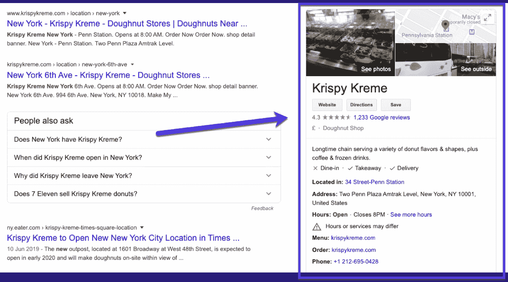

An example of a Google My Business listing

### 谷歌我的业务是如何运作的？

谷歌允许你[要求你的业务](https://www.google.com/business/)并让它活起来。这样，当人们在寻找你提供的东西时，你的网站就会出现在他们的搜索结果中。

你可以列出你提供的服务，添加一个 [FAQ 部分](https://kinsta.com/blog/wordpress-faq-plugins/)，一些照片，也允许顾客留下关于你的业务的评论。你甚至可以为你的业务添加一些[有趣的属性](https://localu.org/new-online-appointments-care-estimate-attributes-in-gmb/)，这些属性将显示在你的[知识图](https://kinsta.com/blog/schema-markup-wordpress/#examples-of-schema-markup)中，例如在线护理、在线预约、在线评估和在线课程。

## 为什么你应该使用谷歌我的业务

让我们面对现实:[谷歌主导搜索](https://kinsta.com/blog/alternative-search-engines/)，尤其是本地搜索。根据[净市场份额](https://www.netmarketshare.com/search-engine-market-share.aspx?options=%7B%22filter%22%3A%7B%22%24and%22%3A%5B%7B%22deviceType%22%3A%7B%22%24in%22%3A%5B%22Desktop%2Flaptop%22%5D%7D%7D%5D%7D%2C%22dateLabel%22%3A%22Custom%22%2C%22attributes%22%3A%22share%22%2C%22group%22%3A%22searchEngine%22%2C%22sort%22%3A%7B%22share%22%3A-1%7D%2C%22id%22%3A%22searchEnginesDesktop%22%2C%22dateInterval%22%3A%22Monthly%22%2C%22dateStart%22%3A%222019-05%22%2C%22dateEnd%22%3A%222020-05%22%2C%22segments%22%3A%22-1000%22%7D)，超过 70%的搜索发生在谷歌的[搜索引擎](https://kinsta.com/blog/alternative-search-engines/)。

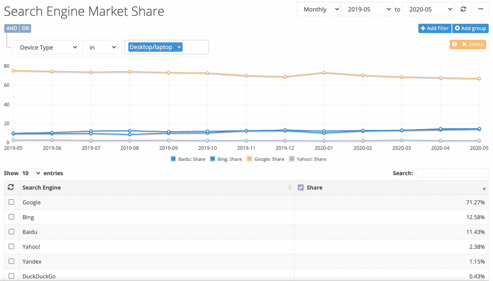

Graph showing search engine market share

作为一个小企业主，你不能忽视使用谷歌我的业务(GMB)的好处。

研究表明，92%的网上购物者喜欢在购物前在网上比较品牌。他们中的大多数人会去谷歌搜索寻找他们想购买的商品。

此外， [49%的谷歌我的企业列表](http://reviews.matt-boland.com/google-my-business-insights-study/)每月被搜索超过 1000 次，而 96%的列表每月至少被查看 25 次。

你知道当你的企业在谷歌我的企业上被列出和看到会发生什么吗？

统计数据显示，看到你的 GMB 清单的人中有 56% 会点击进入你的网站，而另外 24%会直接给你的公司打电话。对于那些希望在充满挑战的经济环境下生存和发展的企业来说，这是一个好消息。

[这项调查](https://moz.com/local-search-ranking-factors)显示，谷歌我的企业列表也可以[推动小型企业在当地的 SEO](https://kinsta.com/blog/wordpress-seo/#34-use-local-seo-techniques) 取得成功，很大程度上保证了中小型企业在[谷歌地图](https://kinsta.com/blog/wordpress-google-maps/)和谷歌搜索上的可见性。

看看对谷歌本地排名因素的研究结果就知道了:

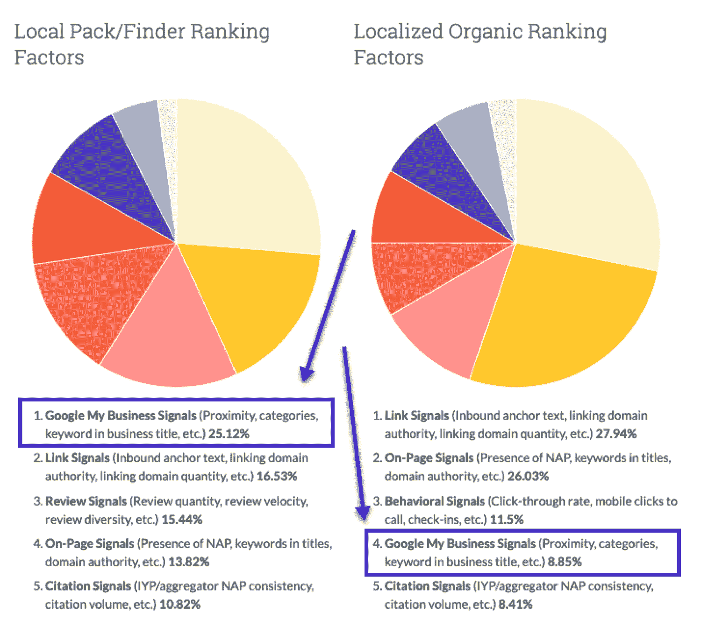

Local pack (GMB) vs local organic ranking factors study results

此外，GMB 让潜在客户马上与你联系，而你可以跟踪你的清单，了解老客户对你的品牌的看法，计划他们的访问，引导他们到你的位置，等等。

这就是使用 Google My Business 的很多理由！

现在你已经知道了什么是 Google My Business，以及为什么你应该在本地业务中使用它，让我们来看看如何设置它。

## 我如何设置谷歌我的业务？(并在谷歌上市)

建立你的 Google My Business 个人资料并在 Google 上注册是本地搜索的重要组成部分。以下是如何让你的企业获得谷歌我的企业档案:

### 第一步-进入官方的谷歌我的商业网站

访问[官方 Google 我的业务页面](https://www.google.com/business/)，点击**立即管理**按钮:

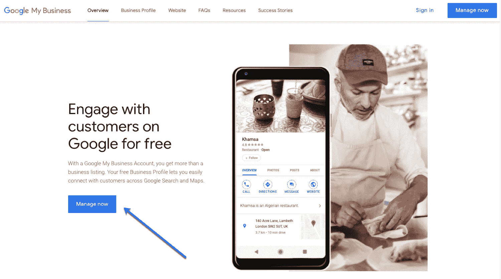

Google My Business homepage, start here to set up your account

如果你还没有登录你的谷歌帐户，它会要求你登录后再继续。

请确保您已登录到要与您正在创建的 GMB 列表关联的帐户。

### 第 2 步-找到你的企业或创建一个新的列表

如果您过去没有建立过 GMB 列表，您可以搜索您的企业名称，或者单击添加新的列表。

Finding your business on GMB

有人已经列出了你的业务，这并不罕见。如果是这种情况，你应该看到你的业务出现。如果没有出现，请点击**将您的企业添加到谷歌**

### 步骤 3–设置您的姓名

现在，您可以添加您的企业名称:

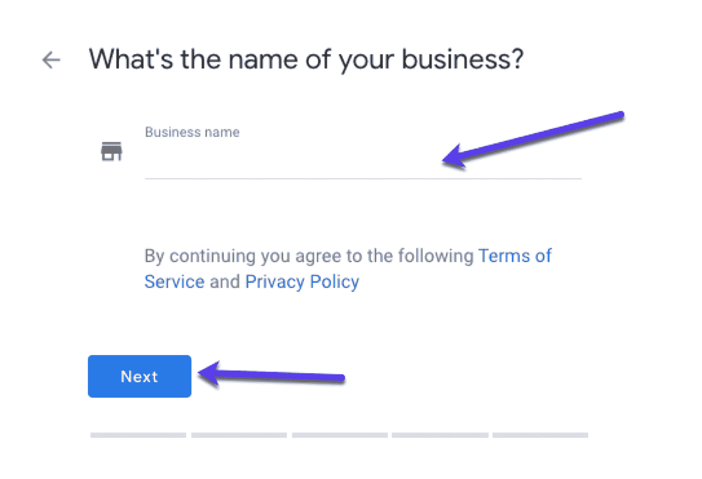

Adding your business name to GMB

添加完成后，点击下一步。

### 第 4 步-选择类别

现在，您需要在 Google My Business 上选择最能描述您企业的类别。

如果你想在顾客搜索你提供的产品或服务时出现在谷歌的结果页面上，这一步非常重要。

你将能够设置主要和次要类别，明智地选择它们。

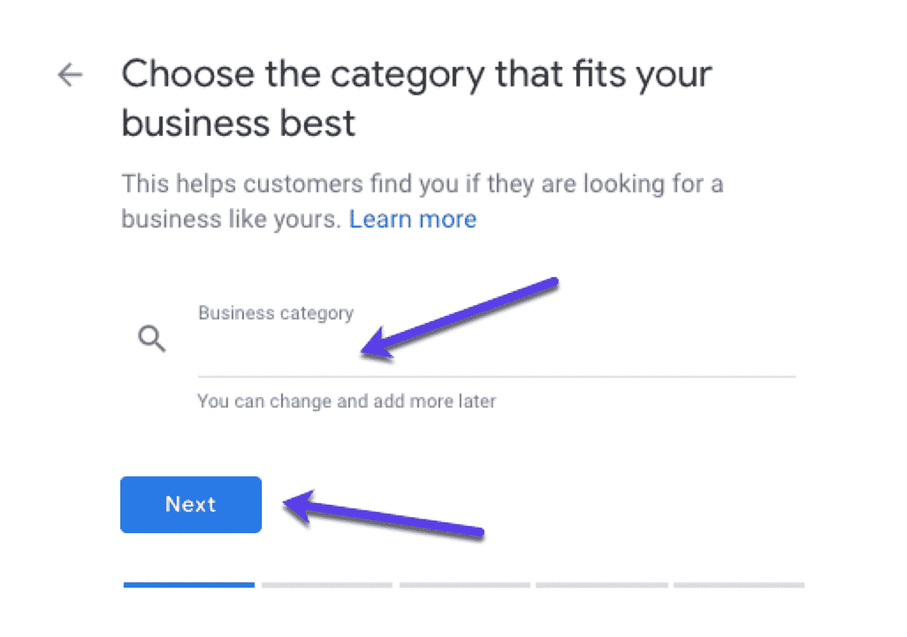

Choosing a business category on GMB

在“业务”类别下，输入你的业务，你会得到一些自动生成的建议供你选择:

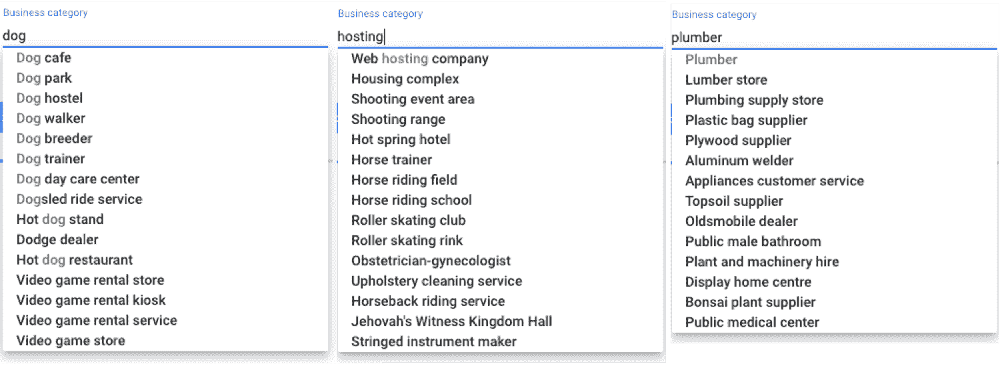

Examples of the business category options on GMB (some a very obscure!)

### 第 5 步-设置您的企业地址

现在，您需要设置与您的列表相关联的位置。

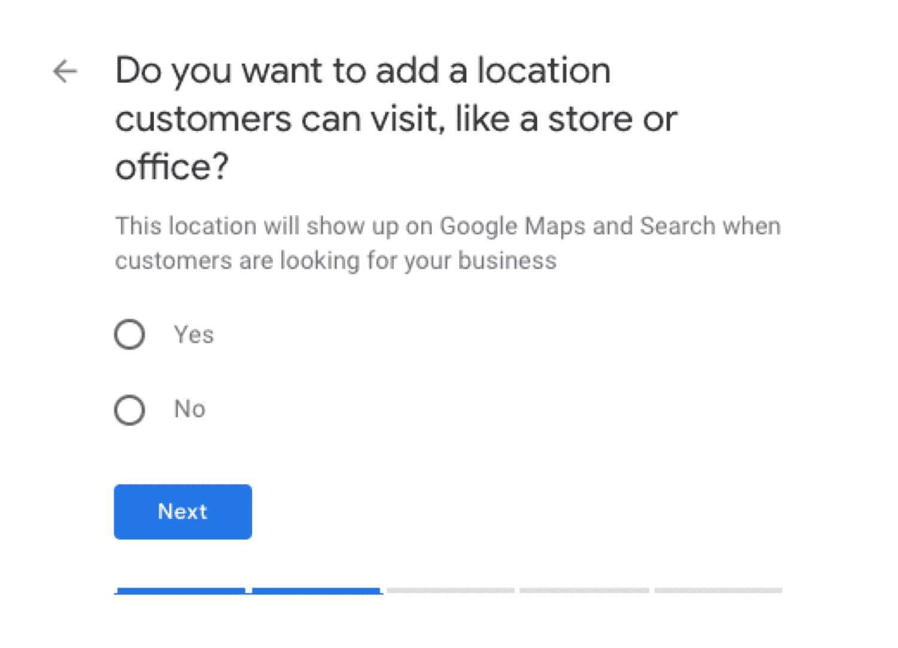

Adding a location to GMB

您需要在以下选项中进行选择:

*   选项 1(是)实体企业列表
*   选项 2(否)服务区企业列表

让我们快速浏览一下每一项:

#### 选项 1(是)实体企业列表

如果您要为有位置的实体企业设置列表，请在此处添加:

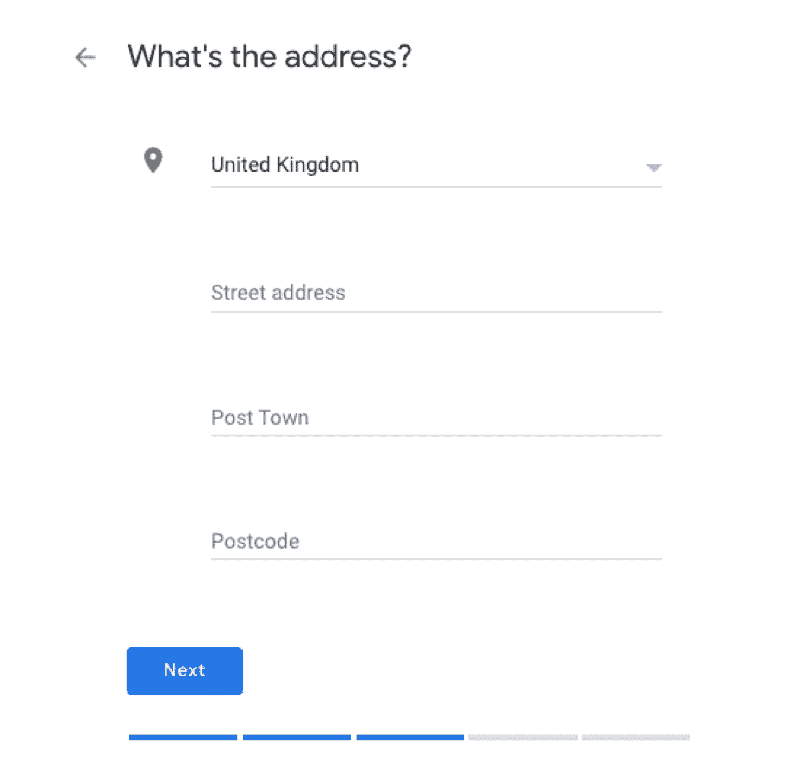

Choosing the address for a business with physical premises

#### 选项 2(否)服务区企业列表

如果您没有实体场所，但仍然为某个地区的客户提供服务，您可以在此处添加:

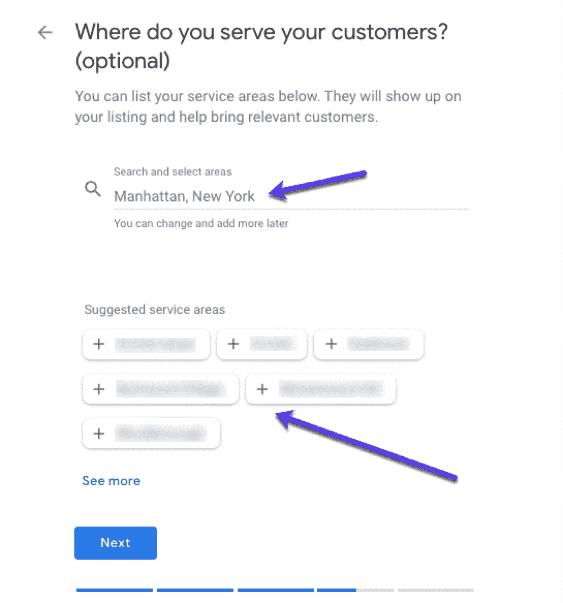

Choosing the address for a business with a service area

您可以搜索您所在的地区或使用建议的选项。

### 第 6 步–添加您的联系方式

现在你需要添加一个客户联系你的方式(电话+网站):

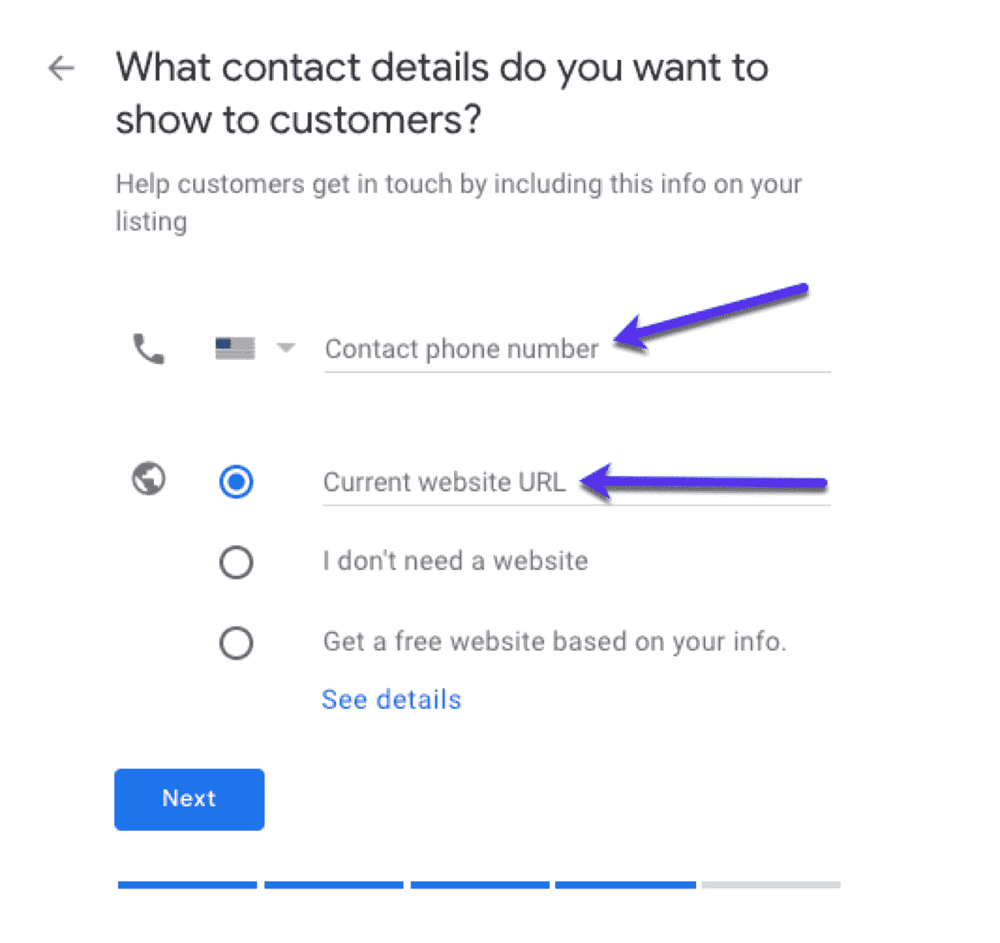

Adding contact details to your GMB listing

将你的网站添加到 Google My Business 有可能[将客户带到你的网站](https://kinsta.com/blog/how-to-drive-traffic-to-your-website/)，在那里你可以更容易地[转化他们](https://kinsta.com/blog/conversion-tracking/)。同样，列出你的电话号码可以让客户直接联系你

### 第 7 步-完成并验证您的列表

在 GMB 填写完所有相关信息后，您可以提交您的列表:

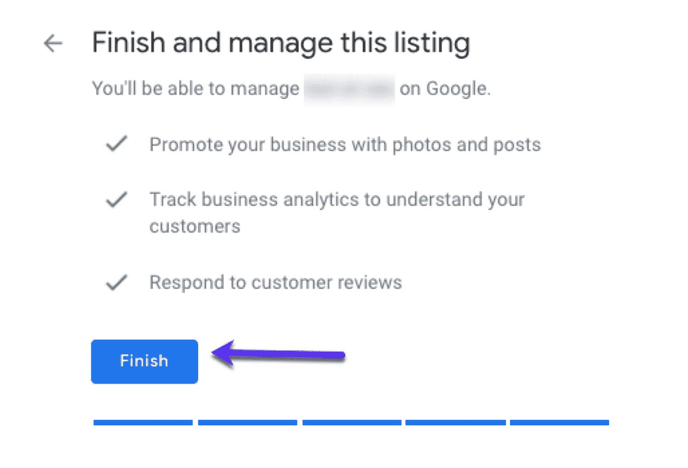

Finish and manage your GMB listing

差不多了，但是这里有一个重要的步骤你需要做:

**验证你的物品。**

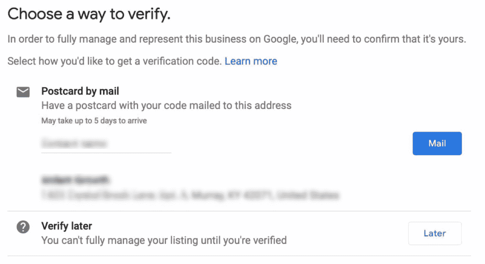

Choose a method for verifying your listing (very important step)

为了让您的 Google My Business 列表显示出来，您需要验证它。这可能需要几天时间，不过你可以在等待的时候优化你的列表。

为了让您的列表得到验证，Google 将向您发送一张带有验证码的明信片。

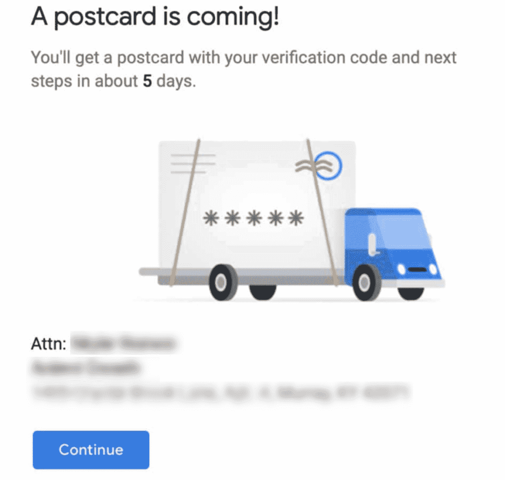

Postcard verification for Google My Business

## 在谷歌我的业务上验证你的业务的 5 种方法

根据你要登记或管理的企业名录的类型，你可以选择验证你的企业:

*   通过邮件(明信片)验证
*   通过电话验证
*   通过电子邮件验证
*   即时验证
*   批量验证

### 1.通过邮件(明信片)验证

最常见的是通过明信片。登录您的 GMB 个人资料，检查您的公司地址是否正确，然后点击“邮件”。

一旦收到，你需要登录你的谷歌账户，点击菜单上的“验证”,输入你明信片上的验证码。

在等待您的明信片到达时(大约需要 5 天)，Google 建议您不要:

*   编辑您的企业名称
*   编辑您的地址
*   更改业务类别
*   请求新代码

这样做可能会减慢验证过程，并需要谷歌客户支持介入。

### 2.通过电话验证

谷歌允许一些企业通过电话核实他们的名单。如果这适用于您，您将看到一个“通过电话验证”的选项。

请确保您的电话号码正确无误，我们会通过短信向您发送一个验证码。

### 3.通过电子邮件验证

谷歌允许一些企业通过电子邮件核实他们的名单。如果这适用于您，您将看到一个“通过电子邮件验证”的选项。请确保您的电子邮件地址正确无误，我们会向您发送一个链接来验证您的列表。

### 4.即时验证

如果你已经用[谷歌搜索控制台](https://kinsta.com/blog/google-search-console/)验证了你的业务，你也许可以立即验证你的列表。

这非常简单，只需使用您在搜索控制台验证业务时使用的同一帐户登录 Google My Business，就大功告成了。

一些 GMB 企业类别不符合即时验证的条件。如果您没有看到要求您验证列表的通知，您必须使用其他验证方法。

### 5.批量验证

如果您在 10 个以上的地方经营同一项业务，您可能有资格使用批量验证。为了获得资格，你不应该是一家服务企业或管理多种业务的[机构](https://kinsta.com/blog/wordpress-agency/)。

以下是如何批量验证您的谷歌我的企业名录:

*   登录谷歌我的业务并选择一个位置
*   选择您所在位置旁边的“获得验证”
*   点击“链”。
*   现在在表格中填写所有信息(企业名称、位置、联系方式等)。)
*   提交表单(谷歌可能需要一周的时间来处理)。

## 优化谷歌我的企业名录的 6 个技巧

让我们回顾一下，到目前为止，您应该已经:

## 注册订阅时事通讯

### 想知道我们是怎么让流量增长超过 1000%的吗？

加入 20，000 多名获得我们每周时事通讯和内部消息的人的行列吧！

[Subscribe Now](#newsletter)

*   设置你的 GMB 列表
*   添加了您的业务详情
*   已验证您的列表

现在怎么办？好了，是时候优化你的房源了！

转到 Google My Business dashboard，点击您的列表，然后选择“信息”。然后选择要完成或更新的部分。

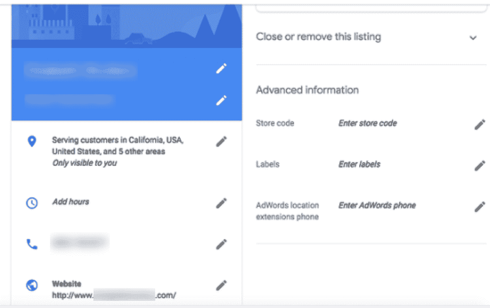

GMB dashboard for editing your listing information

查看以下提示，充分利用您的 Google My Business 个人资料:

### 1.随时更新你的刊登资料

优化你的谷歌我的企业列表的最好方法之一也是最明显的:保持更新。

至少，要确保以下几点总是正确的:

*   名字
*   地址
*   电话号码
*   网站(全球资讯网的主机站)
*   [描述](https://kinsta.com/blog/meta-description-wordpress/)
*   [类别](https://kinsta.com/knowledgebase/what-is-taxonomy/#categories-tags)
*   属性

作为一家企业，你应该展示联系信息，以方便客户联系你。GMB 只是这个的延伸。

你想让客户尽可能容易地找到你并联系你。

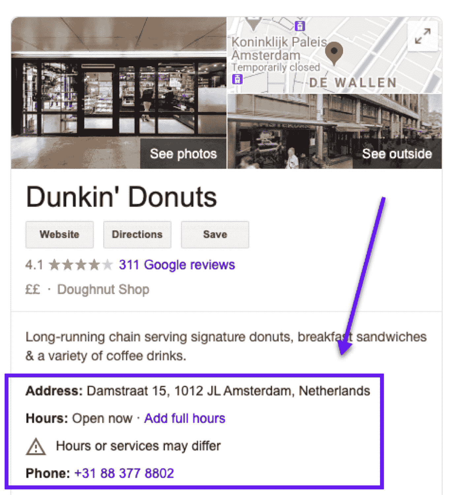

Name, address, phone number (NAP) are essential contact details to have on your GMB

正确的地址可以帮助客户快速接近您的业务/服务区域。如果他们不能轻易找到你，他们就有可能与竞争对手取得联系。

不断更新你的电话号码、工作时间和产品类别对潜在客户很有用。尤其是当你考虑到一家公司的详细信息平均每月在搜索结果中出现 1009 次。

你不想因为分享任何无效/虚假的信息而失去你的潜在客户。所以要注意定期更新你的列表。

如果您想要添加关于新产品或最近开始的服务的信息，并希望与客户分享，这可能会很方便。

谷歌通常需要三个工作日来核实和更新信息。您甚至可以添加经理来管理您的业务页面。

然而，要小心竞争对手，因为他们也可以改变你的列表。

### 2.上传照片到你的物品

你的 GMB 列表是一个完美的展示你的产品和服务的地方，你可以添加图片、视频和虚拟旅游来推广你的业务

你可以上传你的产品和服务的吸引人的图片，或者让访问者一窥你的办公地点。

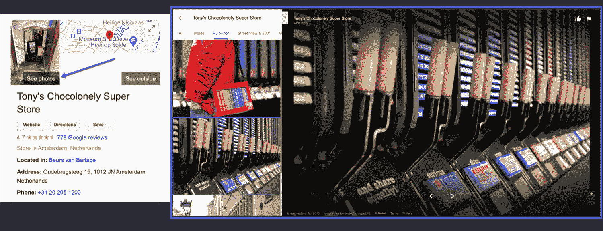

An example of photos uploaded to a Google My Business listing

浏览这些页面会鼓励客户浏览企业网站，并最终与您联系以了解更多信息或下订单。

一旦您的企业名录被验证，它可以显示标记和上传照片的组合。这意味着不仅你可以作为企业主上传照片，顾客也可以。

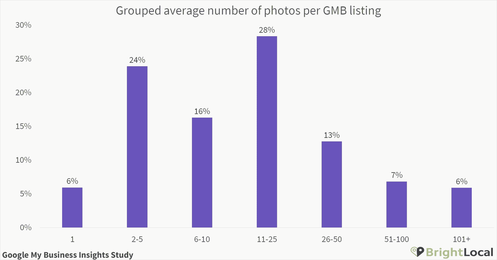

Avg. number of photos on GMB listings

一项研究显示，小规模企业平均上传 11 张照片，但 GMB 有很多企业会上传上百张照片。另外，别忘了贴上你品牌的标志或封面照片。

谷歌搜索[你的品牌和关键词](https://kinsta.com/blog/keyword-research/)的结果会在顶部显示浏览量最多的图片和视频。

上传照片时，尽量保持文件大小在 10KB 到 5MB 之间，使用 PNG 或 JPG 格式。

以下是谷歌我的商业图片的最佳尺寸:

*   **个人资料图像**–250 x 250 像素
*   **封面照片**–1080 x 608 像素
*   **共享图像**–497 x 373 像素

### 3.添加关于您的产品/服务的信息

有时候，你能做的促进业务的最好的事情之一就是炫耀你所做的。

厌倦了体验你的 WordPress 网站的问题？通过 Kinsta 获得最好、最快的主机支持！[查看我们的计划](https://kinsta.com/plans/?in-article-cta)

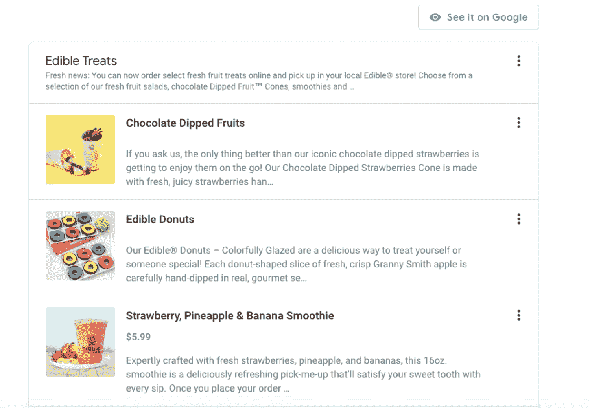

Show off your product or service offering on GMB

你可以通过清楚地提及你提供的服务和你销售的产品来定制你公司的 GMB 页面。这应该有助于你的客户了解你的业务是什么。

例如，餐馆可以添加链接到他们的菜单，并锁定他们的餐馆位置。

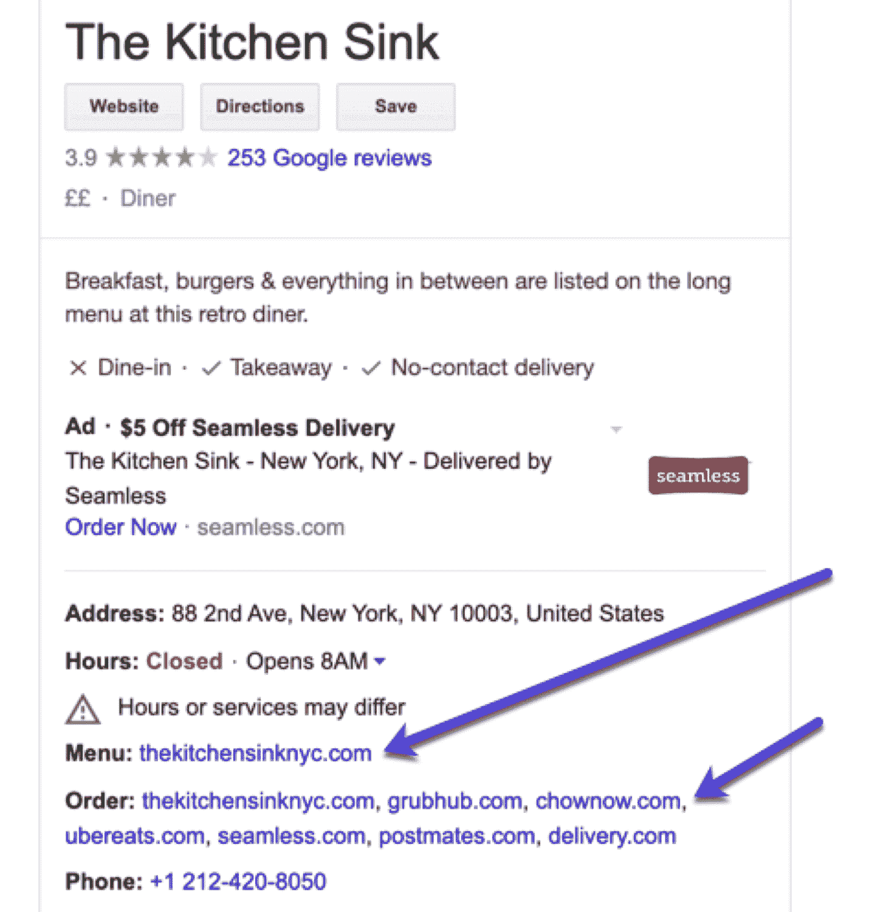

Run a restaurant? Add links to your menu + online orders on GMB

最好为餐厅提供的各种[食物服务](https://kinsta.com/blog/how-to-start-a-food-blog/)添加不同的部分。事实上，你可以添加每样东西的描述和价格来建立一种虚拟菜单，访问者可以浏览并挑选。

保险公司、营销机构、在线健康咨询、法律援助公司可以为他们提供的服务建立不同的板块，并提供直接预约咨询的能力。

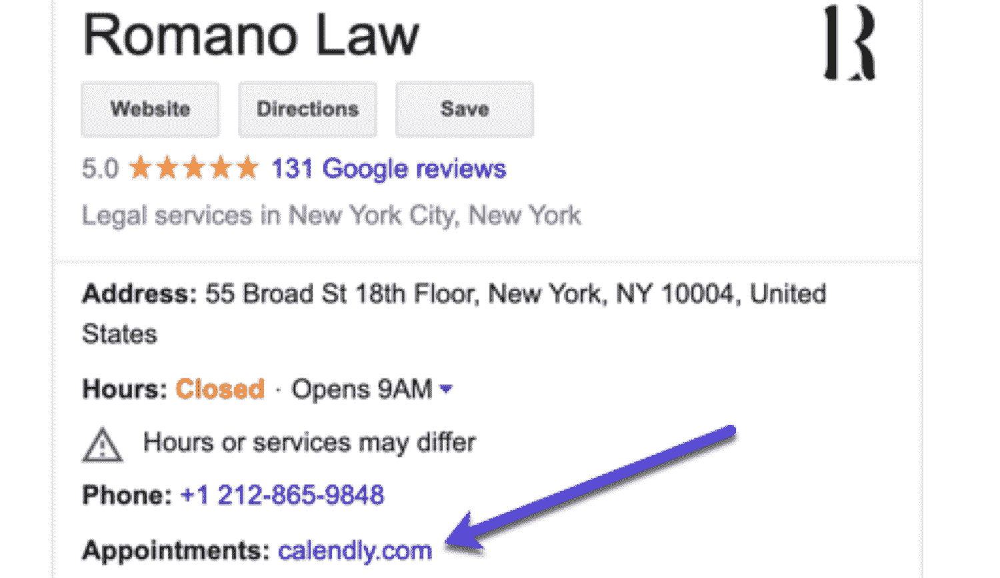

Add an ability for potential customers to book an appointment via GMB

除了服务费之外，还应该给出一个描述来说服客户打电话。

使用“预订”选项，让您的客户不必排长队等待，也不必接听没完没了的电话。

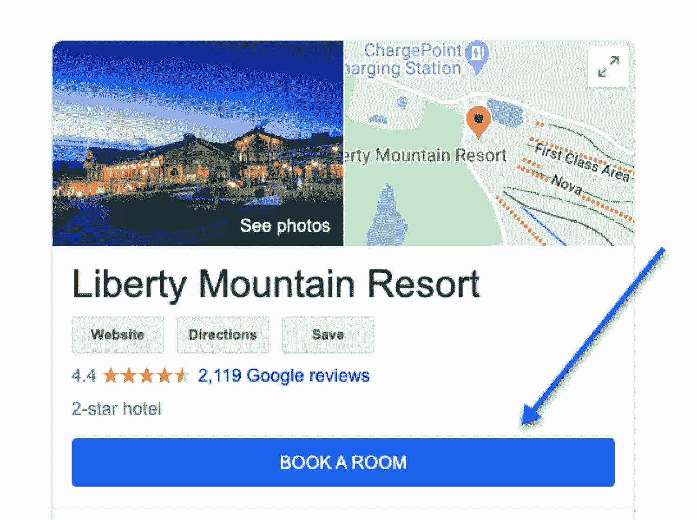

Run a hotel? Add a button to book a room from your GMB

世界上任何地方的任何人都可以买票，预约，并在他们最喜欢的地方预定一个位置。

### 4.回答问题(在被提问之前)

你知道你的谷歌我的企业简介有一个内置的常见问题解答工具吗？

预见并消除人们对你的业务可能产生的任何疑虑。[在线创建常见问题解答部分](https://kinsta.com/blog/wordpress-faq-plugins/)以方便您的客户。例如，潜在客户可能想知道某个产品适合的尺寸或年龄组。

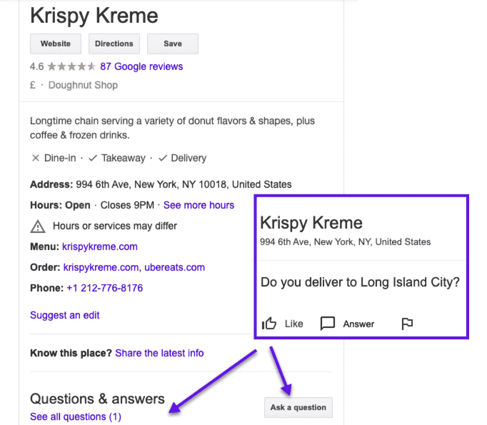

Collect and answer customer questions on your GMB listing

在餐馆的情况下，顾客可能想要检查食物是否添加了任何过敏成分或者它服务的人数。

同样，在面向服务的企业中，一个人可能会检查他/她的领域是否提供了特定的服务，或者是否有任何副作用。

通过 FAQ 部分来消除这些疑惑和歧义。如果你想超越这一点，你也可以通过[打开信息选项](https://support.google.com/business/answer/9114771?co=GENIE.Platform%3DAndroid&hl=en)与客户沟通！

### 5.发布谷歌帖子

想赢得一些点击和潜在的销售？利用[谷歌帖子](https://posts.withgoogle.com/):

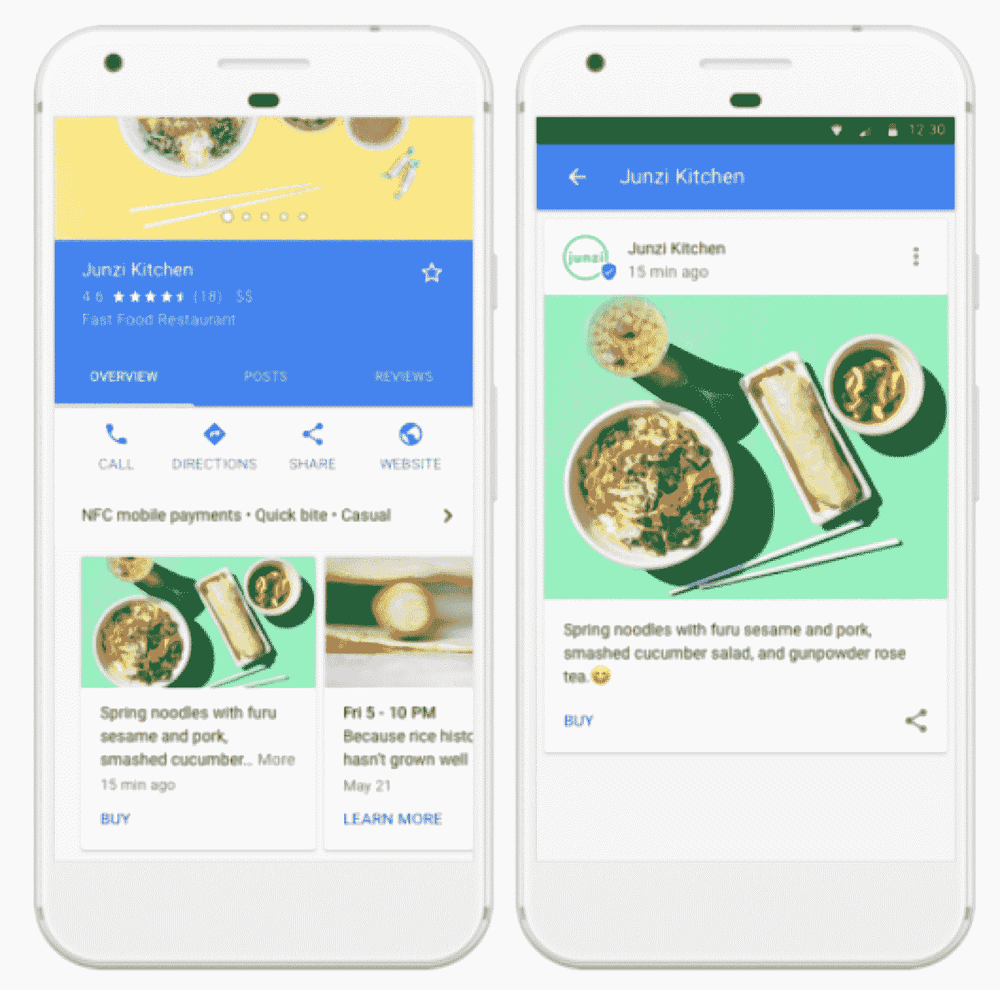

You can use Google Posts to show off what you can do

谷歌贴子是一个很好的机会，通过吸引潜在客户的注意力，你可以直接联系到他们。

这些帖子有助于你的本地 SEO 策略产生更多的有机点击。您可以[在您的帖子](https://kinsta.com/blog/conversion-rate-optimization-tips/)中包含 CTA 按钮，以鼓励用户采取行动。

以下是帖子如何帮助增加你的本地搜索引擎优化的:

*   在 CTA 按钮上产生有机点击，帮助提高页面排名。
*   [增加网站上其他内容的流量](https://kinsta.com/blog/how-to-drive-traffic-to-your-website/)(比如博客文章)
*   将帖子链接到一个[调查表，并收集用户信息](https://kinsta.com/blog/wordpress-survey-plugins/)。

### 6.获取客户评论

你的顾客是你生意的命脉。所以确保你重视他们的[评论](https://kinsta.com/blog/wordpress-comment-plugins/)和反馈评论，及时回复他们。

Google My Business 让客户可以轻松地在你的个人资料中添加关于你业务的评论，并让潜在客户阅读这些评论。

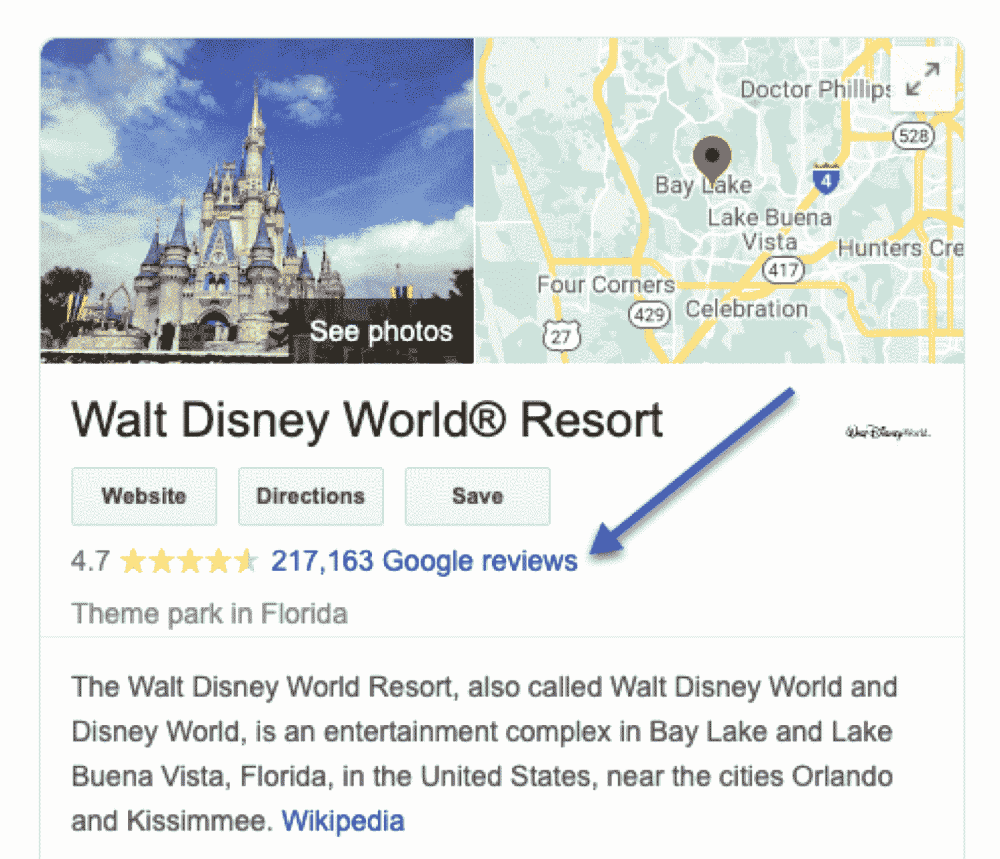

Make your GMB listing stand out by getting (hopefully positive) reviews

为什么你应该关心你的谷歌我的企业名录获得评论？

首先，82%的消费者会阅读当地企业的在线评论。

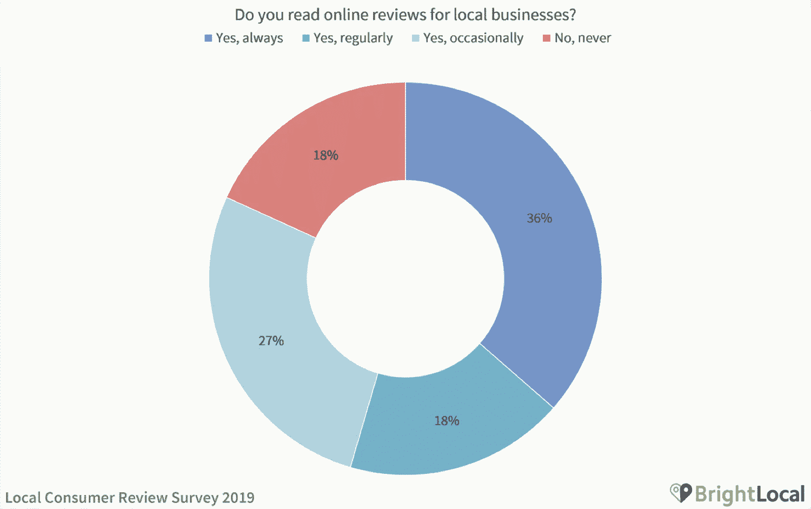

Results from a local consumer review study

除了凸显顾客对你品牌的信心和信任外，谷歌评论还会直接影响搜索排名。

谷歌我的商业评论是一个机会，通过提供更多关于你的产品或服务的信息来吸引更多的客户。

注意回复任何负面评论。

这可能看起来违反直觉(或者你可能只是想掩盖差评)，但花时间回应差评实际上比忽视它们更有效。这表明你正在与你的观众互动，并关心你的业务质量。

这从来都不是坏事

## 如何从 Google 我的业务支持团队获得帮助

有时你可能需要一些帮助你的 GMB 上市。如果你在操作你的页面时遇到任何问题，你可以一直依靠[谷歌我的商业帮助社区](https://support.google.com/business/community?hl=en)。

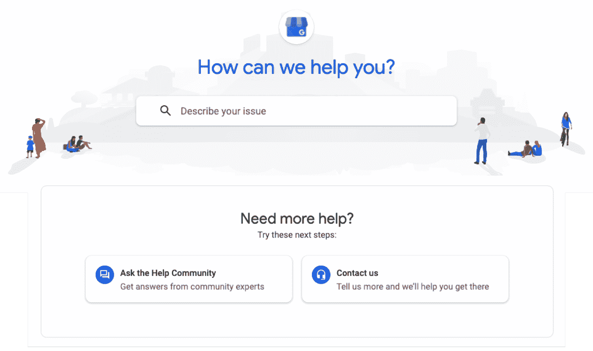

Google My Business support site

您可以在 GMB 知识库中搜索查询，也可以联系志愿者和用户寻求帮助。

如果你想举报虚假列表或任何欺诈信息，你可以使用官方的[商业补救投诉表](https://support.google.com/business/contact/business_redressal_form)向 GMB 提出投诉。

同样，在虚假客户评论的情况下，您可以标记为“不适当”，以确保可靠和诚实的客户服务。

## 谷歌我的商业常见问题

本部分回答了 GMB 用户最常提出的一些问题:

### 谷歌我的业务的目的是什么？

Google My Business 是一个免费的工具，企业用它来组织他们的在线活动。这种存在不仅有助于人们找到你的网站，而且有助于通过 ef = " https://kinsta . com/blog/WordPress-Google-Maps/" data-MCE-href = " https://kinsta . com/blog/WordPress-Google-Maps/">谷歌地图定位你的企业。

一旦你完成了公司的验证过程，你就可以增加营业时间，上传照片，并向客户征求评论。你可以在网上与你的买家互动，最终扩大你的存在，增强你的企业经营。

### 我如何使用谷歌我的业务？如何在谷歌上获得我的业务？

首先，您必须在 GMB 上创建一个帐户。前往[www.google.com/business](http://www.google.com/business)并填写信息。上传你的地址，选择你公司的性质，勾选你为客户提供的服务。

通过明信片、电话或电子邮件获得认证，并看到您的品牌上线。

### 谷歌我的业务要花钱吗？

不，谷歌我的业务对所有人完全免费。就像任何人都可以在谷歌地图上列出他们的业务一样，你也可以在 GMB 上创建一个账户，让你的业务上线。而且，谷歌还允许你在同一个账户下有几个房源，不收取任何费用。

### Google My Business 中的商店代码是什么？

商店代码是一个数字，只有管理商店的人才能看到。除了让谷歌区分你的业务和唯一识别你的位置，代码没有太多的重要性。谷歌还使用这些代码向潜在客户显示库存信息。

### 如何阻止谷歌调用我的业务？

谷歌通常会打电话给在 GMB 上市的企业进行核实。大多数时候，这些电话都是自动录音的。他们可能想确认营业时间，询问你们的服务和广告(如果有的话)。

为了避免接到谷歌的电话，你可以举报电话并进行投诉。也可以屏蔽他们的号码或者举报。

### 我如何访问我的谷歌商务页面？

你所需要做的就是进入[谷歌我的商业页面](https://accounts.google.com/servicelogin?service=lbc)。一旦你到了那里，用你的凭证登录，谷歌会给你重定向。

### 如何在 Google My Business 上隐藏地址？

要隐藏您的地址，请登录您的 Google My Business 帐户。点击“信息”选项卡，找到地址部分。点击角上的小铅笔来编辑你的地址。要清除信息，请单击“清除地址”，然后在弹出的对话框中单击“应用”。请确保在退出页面时保存您的更改。

## 摘要

当谈到创建网上形象、[产生潜在客户](https://kinsta.com/blog/b2b-lead-generation/)并让自己受到关注时，拥有一个谷歌我的商业档案和其他做法一样重要。

这不仅让你的品牌看起来更专业，还能让你管理你想让客户看到的东西，让你的企业在另一家谷歌的网站上免费上市。

* * *

让你所有的[应用程序](https://kinsta.com/application-hosting/)、[数据库](https://kinsta.com/database-hosting/)和 [WordPress 网站](https://kinsta.com/wordpress-hosting/)在线并在一个屋檐下。我们功能丰富的高性能云平台包括:

*   在 MyKinsta 仪表盘中轻松设置和管理
*   24/7 专家支持
*   最好的谷歌云平台硬件和网络，由 Kubernetes 提供最大的可扩展性
*   面向速度和安全性的企业级 Cloudflare 集成
*   全球受众覆盖全球多达 35 个数据中心和 275 多个 pop

在第一个月使用托管的[应用程序或托管](https://kinsta.com/application-hosting/)的[数据库，您可以享受 20 美元的优惠，亲自测试一下。探索我们的](https://kinsta.com/database-hosting/)[计划](https://kinsta.com/plans/)或[与销售人员交谈](https://kinsta.com/contact-us/)以找到最适合您的方式。