# 什么是 IaaS？基础设施即服务与 SaaS 和 PaaS 有何不同

> 原文：<https://kinsta.com/blog/what-is-iaas/>

IaaS 到底是什么？它与 PaaS 和 SaaS 等其他云服务有何不同？

[与 PaaS](https://kinsta.com/blog/what-is-paas/) 和 [SaaS](https://kinsta.com/blog/saas-products/#saas-definition-what-is-saas) 不同，前者提供部署应用的完整环境，后者提供完整的软件解决方案，IaaS 只能让您访问基本的虚拟机、存储、网络和计算能力。

还在迷茫？别担心。在这篇文章的结尾，你会明白它们之间的区别。随着 91%的公司至少部分转向云计算，这一基本理解至关重要。

让我们探索什么是 IaaS，明确它与其他云服务的区别，并查看一些实际使用的例子。

## 简单来说 IaaS 是什么？

[IaaS(基础设施即服务)](https://kinsta.com/blog/types-of-cloud-computing/#iass)是指可从联网计算机租赁的硬盘空间或计算能力(如 CPU、RAM)。

你可以使用这些服务在云中托管商业应用，处理大量数据，甚至托管你的网站。

在大多数情况下，你租用的云计算基础设施是按小时付费的。你可以随时挑选出你需要的东西，而不是包含各种服务的固定月套餐。

> Kinsta 把我宠坏了，所以我现在要求每个供应商都提供这样的服务。我们还试图通过我们的 SaaS 工具支持达到这一水平。
> 
> <footer class="wp-block-kinsta-client-quote__footer">
> 
> 
> 
> <cite class="wp-block-kinsta-client-quote__cite">Suganthan Mohanadasan from @Suganthanmn</cite></footer>

[View plans](https://kinsta.com/plans/)

例如，您可以添加几十台虚拟机，仅用几个小时来处理一个新数据集。你不需要承诺或支付你不使用的服务。

对于相对稳定的正在进行的用例来说，这也是一个很好的选择，在这些用例中，需求有时会剧烈波动。例如，你可以用它在[托管你的内部 CRM](https://kinsta.com/blog/wordpress-crm/) 或其他应用。根据使用情况和需求变化，很容易扩大或缩小规模，比如在繁忙季节。

### IaaS 的一个例子:Amazon EC2

亚马逊 EC2 是 2006 年向公众推出的首批云计算服务之一。它允许您在全球 77 个不同的数据中心创建实例(虚拟机)。

这些实例非常灵活，没有默认的操作系统或控制面板，因此您可以定制它们来满足您的需求，无论是在多个操作系统上测试您的软件，托管网站还是处理大数据。

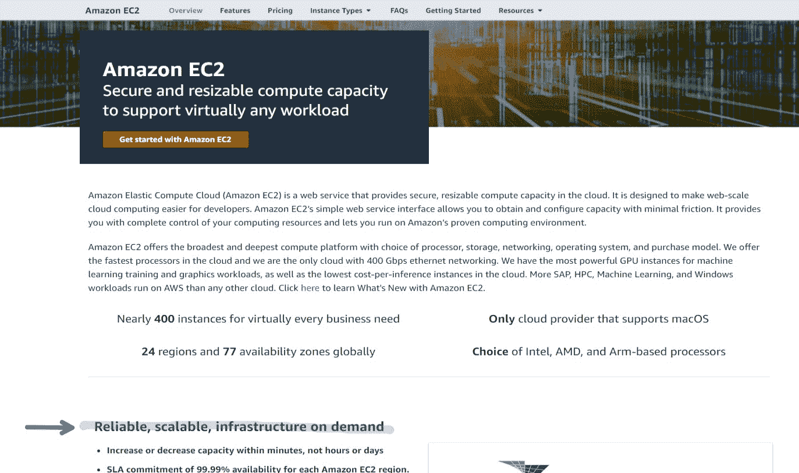

亚马逊 EC2

这种可定制性使得它成为 IaaS 服务。它不是一个完整的打包解决方案，无法随时部署或使用。在使用之前，您需要设置服务器环境。

迄今为止，EC2 是领先的云服务提供商 AWS 的最受欢迎的服务之一，所有主要的竞争对手都提供类似的选项。

到目前为止，您应该对 IaaS 有了基本的了解，但是您可能还没有完全理解它与 SaaS，尤其是 PaaS 有什么不同。

我们来比较一下，突出他们的不同之处。

### IaaS vs PaaS vs SaaS:有什么区别？

基础设施即服务(IaaS)仅提供存储和计算等基本功能，以及一些安全和扩展工具。这仅仅是一个现成的软件应用程序出租。另一方面，PaaS 服务是一个完整的应用部署平台。

要完全掌握它们之间的区别，最简单的方法是通过比较一些例子。

我们已经讨论了 AWS，所以让我们用 [Google 的云服务](https://kinsta.com/google-cloud-market-share/)来做比较。

**谷歌计算引擎**是谷歌云的主要 IaaS 服务之一。您可以根据需要租用各种类型的虚拟机。

### 信息

Kinsta 使用谷歌云平台的[下一代计算优化(C2)虚拟机](https://kinsta.com/feature-updates/google-cloud-platform-c2-vms/)来托管我们所有的客户网站。它们构成了我们性能优化的托管基础设施的支柱。

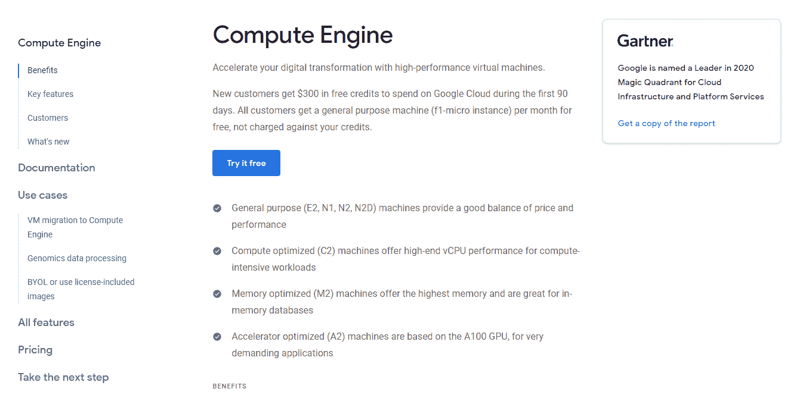

谷歌计算引擎

但是这些虚拟机没有预装服务器环境或代码库。它们是空白的石板。

您所支付的只是计算能力和硬盘空间，换句话说，就是基础设施。

**另一方面，谷歌应用引擎**属于 PaaS 标签。不用设置您的服务器环境，您可以直接开发和部署您的代码。

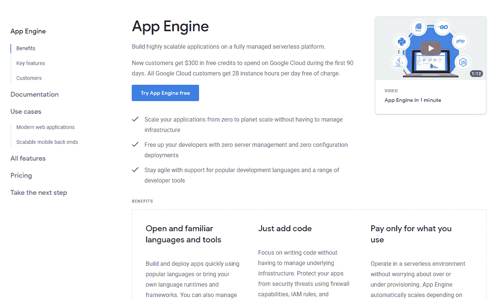

谷歌应用引擎

App Engine 负责必要的代码库和服务器软件。它提供了您托管自己的(或开源)应用和软件所需的平台。

最后， **Google Drive** 是 SaaS 的产品，为特定的商业问题提供解决方案。

当然，这是一项专注于托管文件的云服务。但是它超越了 PaaS 级别，提供了一个完全成形的用户界面，具有共享、权限控制等特性。

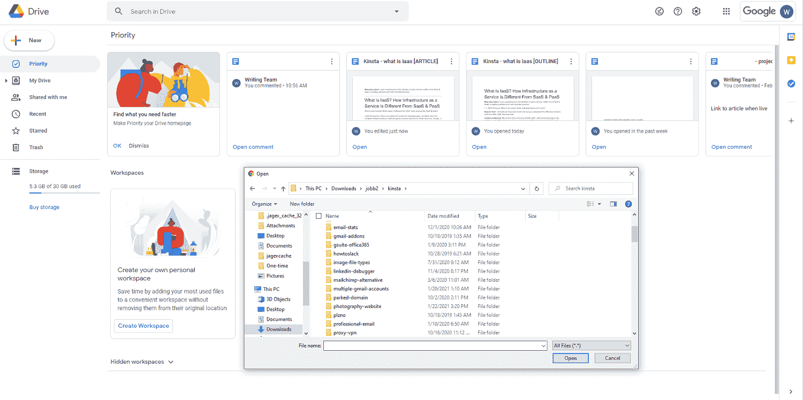

谷歌驱动

它不允许运行其他应用，因此它不是一个合适的 IaaS 平台，但这不是重点。

SaaS 应用的定义元素是，你可以开始用它来解决业务问题，而不需要编写任何代码。你所需要做的就是注册(如果是付费服务，就付钱)。

这就是 Google Drive 的工作方式:你可以上传文件，分享它，或者查看你最新的 Google Docs 编辑，而无需编写或提交任何代码。

如果您仍然感到困惑，请查看以下每个云服务类别的并列示例列表:

| **IaaS 示例** | **平台即服务示例** | **SaaS 举例** |
| 亚马逊 EC2 | AWS 弹性豆茎 | 谷歌文档 |
| 谷歌计算引擎(GCE) | 谷歌应用引擎 | Microsoft Dynamics CRM |
| 谷歌云存储 | IBM 云代工厂 | 销售力量 |
| Azure 虚拟机 | 微软 Azure 应用服务 | 松弛的 |
| Rackspace | Heroku | Zendesk |
| 利诺德 | 数字海洋应用平台 | 谷歌工作空间(前身为 G 套件) |

### 好吧，但是 IaaS 和虚拟主机有什么不同呢？

如果你从一台联网的机器上租用计算机空间和计算能力，这与常规的虚拟主机服务有什么不同？

有四个主要区别:

1.  **灵活性**:您可以在不同的存储类型(基于访问频率)、硬件组件、操作系统和其他因素之间进行选择。
2.  **实时可伸缩性:**根据需要实时添加任意多的实例。
3.  **虚拟联网:**模拟一个网络，机器之间不使用公共互联网进行通信。
4.  **随用随付模式:**只需为您使用的资源付费，无论您使用它们的时间有多长。例如，您可以在几个小时内添加 12 台机器来应对激增，然后移除它们，而无需承诺每月计划。

[廉价共享托管](https://kinsta.com/blog/cheap-wordpress-hosting/)计划还会将多个客户聚集在同一台虚拟机上，导致安全问题和依赖同一台虚拟机上其他站点的不可靠性能。

你能用 IaaS 来托管一个网站吗？当然，但这需要更多的技术专业知识，而不仅仅是支付像 Kinsta 这样的托管服务。

现在，您已经了解了一些 IaaS 基础知识，让我们来探究它在更广泛的云服务市场中的市场份额。

## IaaS 市场规模、份额和领先供应商

2019 年，世界各地的公司在 IaaS 服务上花费了超过 445 亿美元。行业专家预计，到 2022 年底，这个数字几乎会翻一番，达到 822 亿美元(T3)。

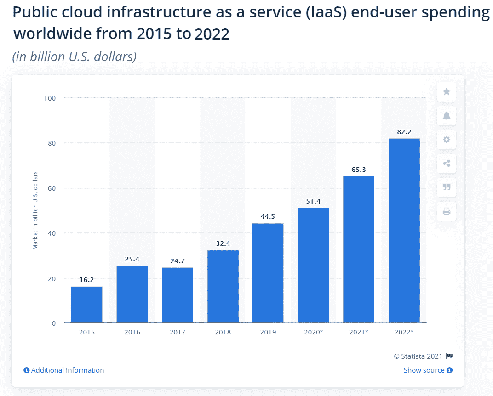

2015-2022 年 IaaS 市场规模(数据来源:Statista)

但是与其他类型的云服务相比，IaaS 有多大呢？我们来看数据。

根据 Gartner 的最新数据，PaaS、IaaS 和 SaaS 之间的[云市场份额](https://kinsta.com/blog/cloud-market-share/)显示，SaaS 是明显的领导者，IaaS 位居第二。

公有云市场份额(来源:Gartner)

Gartner 将 BPaaS(业务流程即服务)如薪资管理工具、通信 API 等单独归为一类。

虽然很难说有多少属于 SaaS 和具有更广泛定义的 PaaS，但这些工具都不属于 IaaS 范畴。即使我们慷慨地将这部分收入的一半分配给 PaaS，IaaS 仍然更加突出，其增长速度比 PaaS 快得多。

现在我们已经了解了[主要云计算类别](https://kinsta.com/blog/types-of-cloud-computing/)的市场份额，让我们来看看哪些公司主导了 IaaS 市场。

### 领先的 IaaS 供应商及其市场份额

最新数据显示，2020 年，少数几家重要企业将控制超过一半的 IaaS 市场。

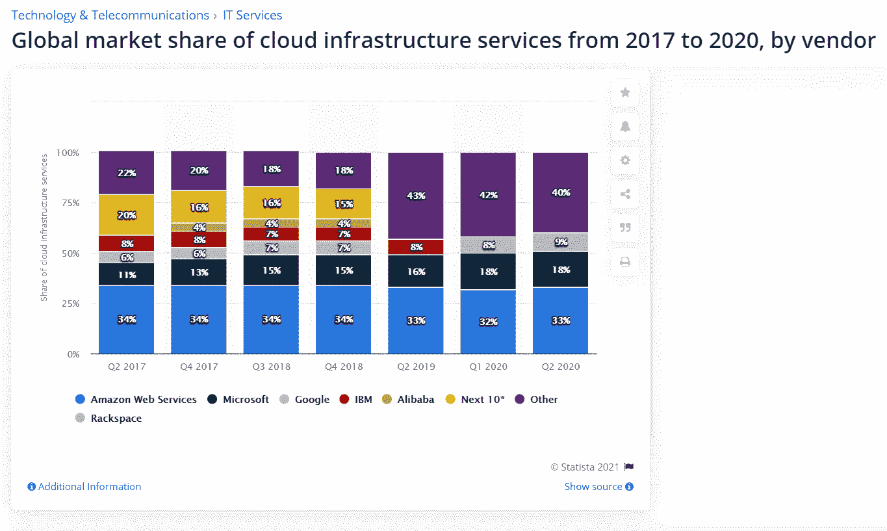

IaaS 厂商市场份额(来源:Statista)

据 Statista 统计， [AWS 在 2020 年 IaaS 的市场份额](https://kinsta.com/aws-market-share/)为**的 33%** ，领先于[微软 Azure 的份额](https://kinsta.com/azure-market-share/)的 **18%** ，[谷歌云的市场份额](https://kinsta.com/google-cloud-market-share/)为 **9%** 。

过去三年的数据讲述了一个有三个主要人物的故事。一开始，有 AWS。从过去几年的市场份额数据来看，领先优势是显而易见的。

AWS 巩固了其领先地位，仍占据近三分之一的市场份额。但是谷歌，尤其是微软，增长更快，开始迎头赶上。

短短三年，微软 Azure 的市场份额从 **13%** 增长到 **18%** ，而 AWS 却没有跟上。他们是怎么做到的？微软利用其企业关系定期达成数十亿美元的交易(如 2020 年[波兰政府交易](https://news.microsoft.com/europe/2020/05/05/microsoft-announces-a-1-billion-digital-transformation-plan-for-poland-including-access-to-local-cloud-services-with-first-datacenter-region/)和[美国国防部云交易](https://www.marketwatch.com/story/us-defense-department-reaffirms-10-billion-cloud-deal-to-microsoft-2020-09-04))。

如果你只看这张图，IBM(人工智能创新者和企业云发电站)似乎几乎无关紧要。看起来微软和谷歌吞噬了 IBM 的份额，其份额已经下降到 7%以下，并且在最新的报告中与“其他”公司归为一类。

但根据 IBM 2020 年第三季度的官方收益报告，它从云基础设施服务(来自 [IaaS 和 PaaS](https://kinsta.com/blog/iaas-vs-paas/) 的组合)中获得了[49 亿美元](https://www.ibm.com/investor/att/pdf/IBM-3Q20-Earnings-Charts.pdf)的收入。因此，它仍然是云计算市场的重要参与者。

最近的其他报告显示，主要的中国公司，特别是阿里巴巴，在 2020 年将占据更大的份额。

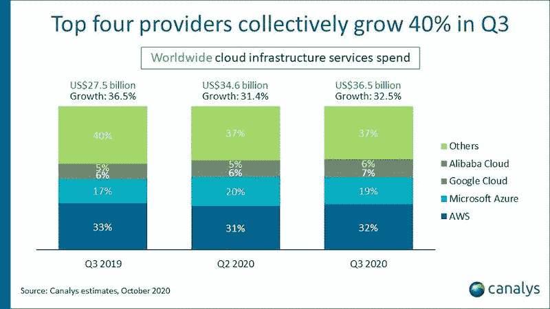

2020 年 IaaS 市场份额(来源:科纳仕公司)

但是三个领先的玩家保持不变([AWS vs Azure](https://kinsta.com/blog/aws-vs-azure/)&Google Cloud)。AWS 以几乎三分之一的市场份额坐在宝座上，微软 Azure 以 20%的份额徘徊，谷歌云正在慢慢追赶。

## IaaS 服务和使用案例

IaaS 不仅仅是关于大数据处理。IaaS 保护伞下的不同服务有广泛的使用案例。

例如，您可能需要在定制的低功耗、低成本服务器上长期存储您不会频繁访问的数字存档文件。

下面，我们将详细探讨更多 IaaS 服务及其用例。

### 计算(数据处理、测试软件、托管应用等。)

您可以将第一种 IaaS 服务定义为“云计算即服务”本质上，您租用虚拟服务器或存储和计算能力的实例来运行云中的应用程序或其他进程。

## 注册订阅时事通讯

### 想知道我们是怎么让流量增长超过 1000%的吗？

加入 20，000 多名获得我们每周时事通讯和内部消息的人的行列吧！

[Subscribe Now](#newsletter)

如前所述，与常规托管计划不同，您通常遵循按需付费模式，可以根据需要实时自由扩展。对于大多数供应商，您也可以选择每月计划进行可预测的付款。

但它不仅仅是物理硬件。例如，IBM 云虚拟服务器包括[自动扩展](https://kinsta.com/help/scalable-cloud-hosting/)、云安全和合规性工具。

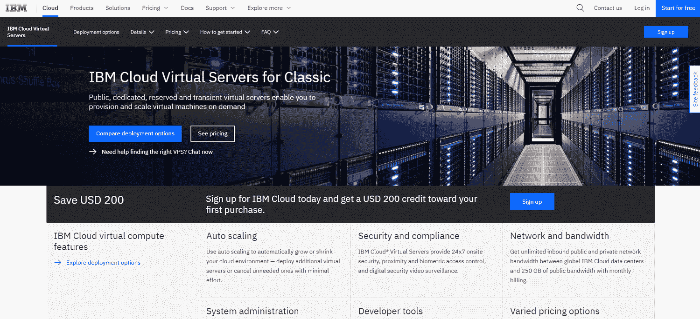

IBM 云虚拟服务器

您还可以轻松地将这项服务与 IBM 的其他 PaaS 或 SaaS 产品捆绑在一起，比如数据仓库或 AI。

#### 网站托管

即使是“仅仅”托管一个网站，IaaS 提供商也脱颖而出。大型 IaaS 供应商是世界上领先的 web 主机供应商。

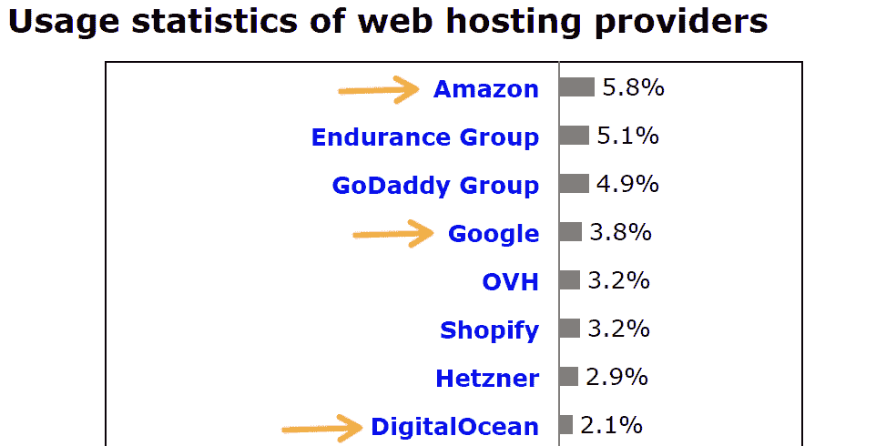

虚拟主机提供商市场份额(来源:W3Techs)

2021 年 1 月，亚马逊是世界上排名第一的主机提供商。它为互联网上所有索引网站的 5.8%提供动力。

但是为什么这么多人选择 IaaS 提供商来提供基本的虚拟主机服务呢？

有几个原因。首先，因为你不需要为[实践支持](https://kinsta.com/kinsta-support/)或特定环境付费，所以它往往更便宜，尤其是在大规模的情况下。因此，对于管理网站组合的机构和公司内部部门来说，IaaS 通常是理想的选择。

此外，如果你运行一个繁重的应用程序或每月有数十亿的访问者，一个常规的虚拟主机服务可能很难提供你需要的稳定性。但是，使用 IaaS，您可以自动扩展以满足不断变化的使用情况。

您还可以自定义虚拟机来优化网站的速度和性能。当然，如果没有合适的专业知识，您将很难建立合适的服务器环境。

### 存储(文件管理、备份)

您可以将第二个 IaaS 服务类别归类为“存储即服务”

计算机和数字文件已经存在了几十年，对于大公司来说，存储和文件管理变得更加困难。每次升级计算机和系统，导出档案和数据都会变得更加耗费人力。

幸运的是，IaaS 存储服务，如亚马逊的简单存储服务(或亚马逊 S3)可以提供帮助。

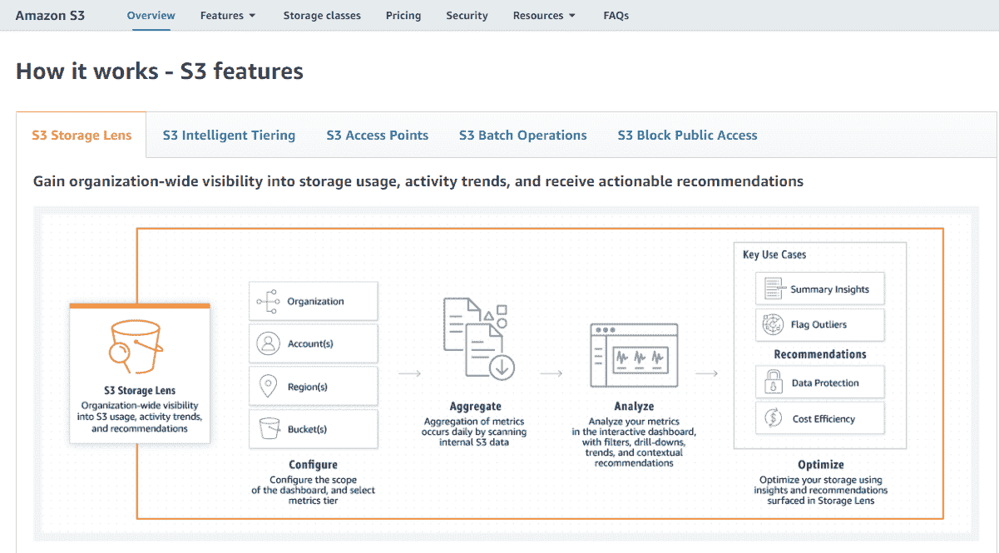

亚马逊 S3 功能

这是一个在云中存储文件和文档的 IaaS 解决方案。您可以管理对文件的公共访问，控制服务器位置，将文件自动分类到“桶”中，等等。

#### 长期存储(存档)

S3(以及类似的存储 IaaS 服务)的一个有用特性是，您拥有多个存储层。例如，如果您认为不需要频繁访问数据，您可以选择超级便宜的慢速存储，也称为冷存储。

如果你想存档文件，以备将来需要，S3 冰川是一个不错的选择。

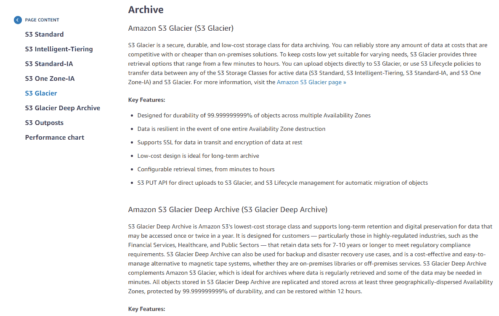

AWS S3 冰川

### 网络服务

网络是 IaaS 服务的第三层。连上了(懂了吗？)对其他产品整体可用性的影响。

例如，使用虚拟网络，您可以创建一个混合云，将本地机器和虚拟机用于同一目的。

即使您自己没有一台物理服务器，IaaS 机器也带有内置的网络服务。有了虚拟广域网和唯一的 [IP 地址](https://kinsta.com/tools/what-is-my-ip/what-is-my-ip/)，您可以在虚拟机之间进行通信，而无需连接到公共互联网。

借助我们灵活的 Google Cloud powered 基础设施，将你的 WordPress 站点速度提升 200%。[免费试用 kin sta](https://demo.kinsta.com/register)

现代提供商还提供负载平衡、防火墙和实时安全以及广域网优化。

## 最大的 IaaS 提供商及其提供的服务

现在，您已经了解了一些 IaaS 基础知识，让我们更深入地了解一下领先的提供商及其产品。

### 自动警报系统

在其网站上，AWS 倾向于将其 IaaS 产品打包到不同的 PaaS 用例中。

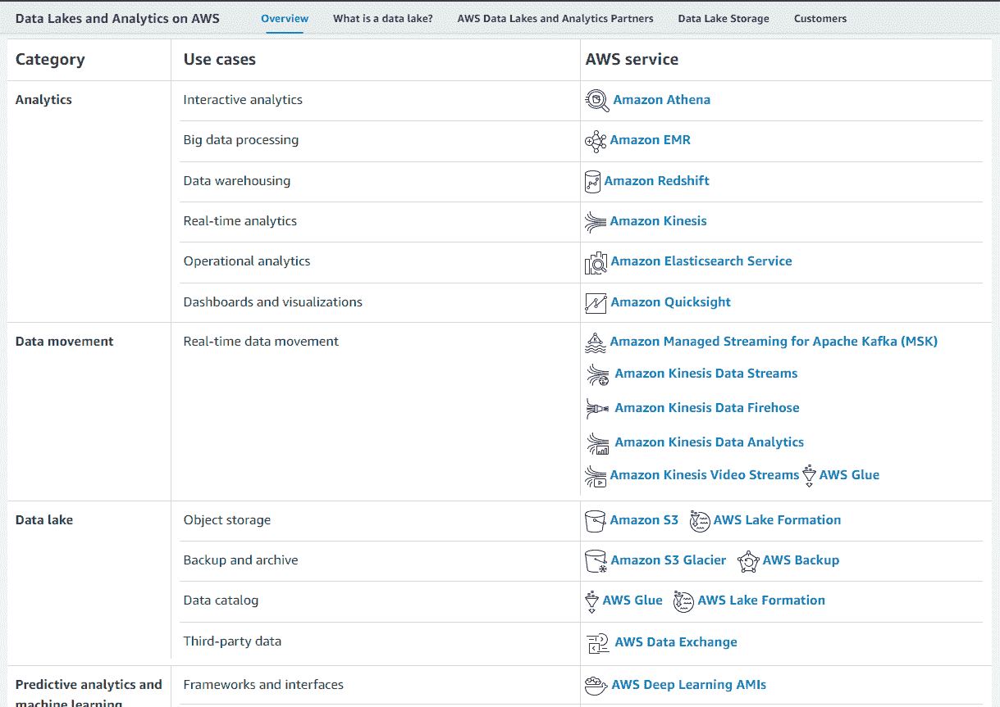

AWS 云服务

但是当然，它允许你租用底层的计算能力。即使您使用像 Elastic Beanstalk 这样的 PaaS 解决方案，这通常也是您需要支付的全部费用。

作为公共云计算的原始创新者，它涵盖了从计算到长期存储和网络的方方面面。

| **计算** | 亚马逊 EC2 |
| **存储** | 亚马逊 S3 |
| **归档&备份** | 亚马逊 S3 冰川 |
| **安全** | 防火墙和实时威胁检测 |
| **私有云&混合云** | 基于 AWS 和 AWS 前哨的 VMware 云 |
| **联网** | AWS PrivateLink(虚拟网络内的内部数据传输，不使用公共互联网) |
| **数据中心** | 40 多个可用性区域中的 109 个数据中心 |

根据虚拟机规格和数据中心位置的不同，按需定价会有很大差异。最便宜的实例(0.5 GB 内存的 t4g.nano)每小时 0.0028 美元起。

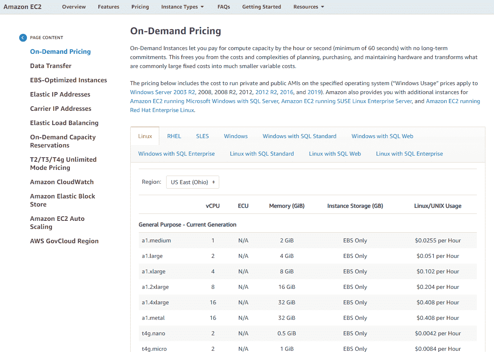

亚马逊 EC2 定价

如果需要，您可以实时添加或删除机器来调整负载。

### 谷歌云

谷歌云提供广泛的云服务，从 IaaS 到 PaaS，甚至 SaaS。

随着 [Google Workspace](https://kinsta.com/blog/google-workspace/) 和智能 Google 搜索在您的私有云中的出现，这对于全面过渡到云的公司来说是一个极好的选择。

谷歌云产品

但从基础设施来看，谷歌与 AWS 相比如何？

| **计算** | 谷歌计算引擎(GCE)，裸机 |
| **存储** | 谷歌云存储 |
| **归档&备份** | 云存储–归档 |
| **安全** | [防火墙](https://kinsta.com/blog/what-is-a-firewall/)和实时威胁检测 |
| **私有云&混合云** | 虚拟私有云/ Anthos |
| **联网** | 虚拟私有云(虚拟网络内的内部数据传输，不使用公共互联网) |
| **数据中心** | 73 个以上可用性区域中的 142 个数据中心 |

谷歌云覆盖了所有相同的基础，甚至提供了许多数据中心和位置。142 个以上的数据中心使其成为高可用性或灾难恢复的理想之选—如果您有 99.99%的服务 SLA，则是完美之选。

如果你更关心你的底线，你可能想知道更多关于 GCE 的价格。

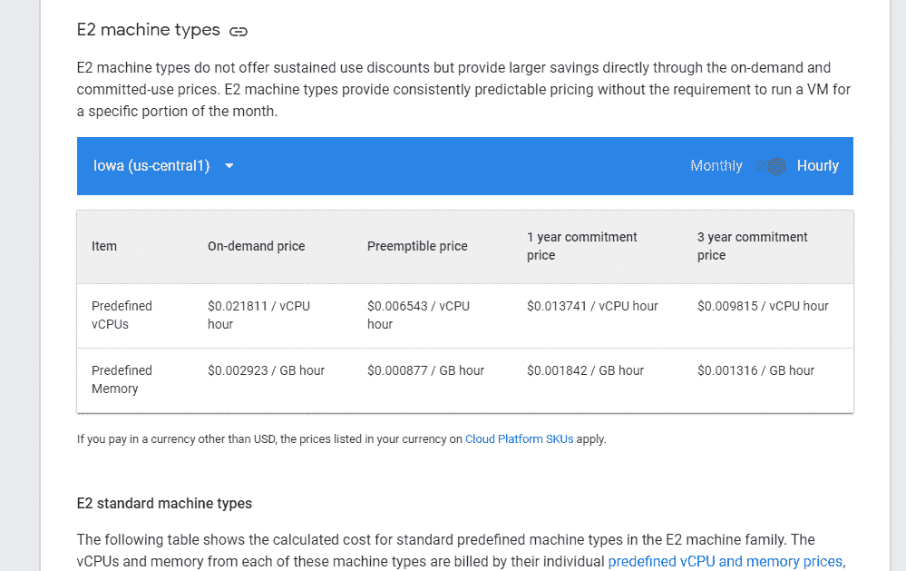

谷歌云引擎价格

每 GB 小时内存的价格与 AWS 相当，至少对于 E2 机器类型是如此。在 1 年承诺期内，价格要低得多。

有了 3 年的承诺，您可以获得 56%的折扣，并且只需支付每 GB 小时 0.001316 美元。

如果你想更详细地比较这两个选项，你可以阅读我们关于 [Google Clouds vs AWS](https://kinsta.com/blog/google-cloud-vs-aws/) 的完整帖子。

### 微软 Azure

微软是全球第二大 IaaS 供应商，也提供各种强大的云服务。

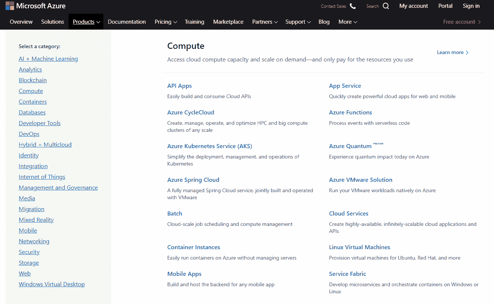

微软 Azure 云服务

不出所料，Azure 也涵盖了所有 IaaS 基础。

| **计算** | Azure 虚拟机(Linux 和 Windows) |
| **存储** | Azure 文件 |
| **归档&备份** | Azure 归档存储 |
| **安全** | 防火墙和实时威胁检测 |
| **私有云&混合云** | Azure 私有云 |
| **联网** | 虚拟广域网、VPN(虚拟网络内的内部数据传输，不使用公共互联网) |
| **数据中心** | 58 个以上可用性区域中的 100 个数据中心 |

凭借可靠的虚拟机、存储、归档和安全协议，这是一个很好的云平台。

但是价格呢？它能与谷歌和亚马逊竞争吗？

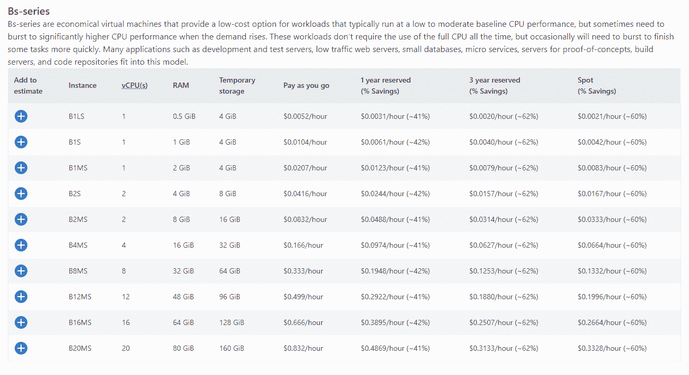

Azure 虚拟机定价

最便宜的实例有 0.5 GB 内存，比 AWS 的同类产品每小时 0.0052 美元略高。

但它包括高达 4 GB 的存储空间，不像 AWS 那样需要使用额外的存储服务。

你也可以通过向 Azure 承诺多年固定价格交易来降低价格。

### IBM 云

当然，IBM Cloud 在增长方面赶不上“三巨头”，但是它的实际产品呢？

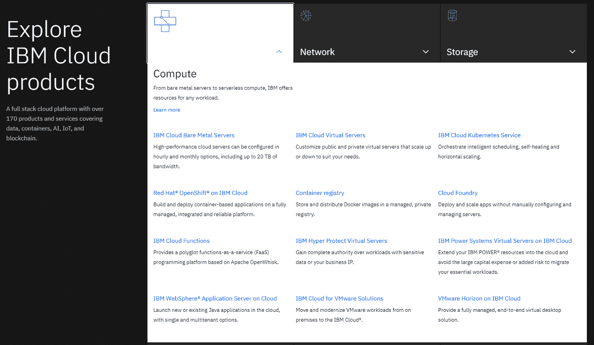

IBM 云产品

IBM 在所有类别中都提供了健壮的云基础设施，就像其主要竞争对手一样。

| **计算** | IBM 云虚拟服务器，IBM 云裸机服务器 |
| **存储** | IBM 云对象存储 |
| **归档&备份** | IBM 云存储(冷库) |
| **安全** | 防火墙和实时威胁检测 |
| **私有云&混合云** | IBM 虚拟私有云 |
| **联网** | IBM 虚拟私有云(在虚拟网络内部传输数据，不使用公共互联网) |
| **数据中心** | 18 个以上可用性区域中的 60 个数据中心 |

您可以设置虚拟机，存储或归档文件，等等。但是谈到价格，IBM 很难与行业领导者竞争。

一个 4 GB 的虚拟机每小时花费 0.084 美元，几乎相当于一个新的 8 GB 内存的谷歌 N2 实例。

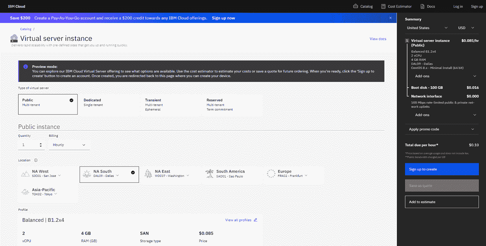

IBM 云虚拟服务器定价

而且“只有”60 个数据中心分布在 18 个区域，这是最不适合分布式云的选择。

尽管如此，IBM 的主要优势并不在于物理基础设施本身，而是它的 PaaS 和 SaaS 解决方案，如 Watson AI。

所以这是否是你的正确选择取决于你在寻找什么。

[什么是 IaaS，它与更广为人知的 PaaS 和 SaaS 有什么不同？🤔在本帖中了解更多⬇️ 点击推文](https://twitter.com/intent/tweet?url=https%3A%2F%2Fkinsta.com%2Fblog%2Fwhat-is-iaas%2F&via=kinsta&text=What+is+IaaS%2C+and+how+does+it+differ+from+the+more+widely+known+PaaS+and+SaaS%3F+%F0%9F%A4%94+Learn+more+in+this+post+%E2%AC%87%EF%B8%8F&hashtags=IaaS%2CSaaS)

## 摘要

IaaS 为您提供全面的国际数字企业，只需点击一个按钮，您就可以获得所需的存储和计算能力。

你可以用它来处理数据，测试你的软件，甚至托管你的网站。但是，如果你是一个完全的初学者，设置和开始可能会有挑战性。

如果你想要一个利用尖端云技术的网络主机，你可以使用我们的[免费迁移服务](https://kinsta.com/knowledgebase/wordpress-migrations/)将你的网站迁移到 Kinsta。

我们可访问的[应用托管](https://kinsta.com/application-hosting/)、[数据库托管](https://kinsta.com/database-hosting/)和[托管 WordPress 托管](https://kinsta.com/wordpress-hosting/)计划依赖于来自 [Google Cloud](https://kinsta.com/blog/google-cloud-hosting/) 的云基础设施，没有令人头疼的问题(我们使用最新的 [C2 计算优化虚拟机来优化性能](https://kinsta.com/blog/fastest-wordpress-hosting/))。

* * *

让你所有的[应用程序](https://kinsta.com/application-hosting/)、[数据库](https://kinsta.com/database-hosting/)和 [WordPress 网站](https://kinsta.com/wordpress-hosting/)在线并在一个屋檐下。我们功能丰富的高性能云平台包括:

*   在 MyKinsta 仪表盘中轻松设置和管理
*   24/7 专家支持
*   最好的谷歌云平台硬件和网络，由 Kubernetes 提供最大的可扩展性
*   面向速度和安全性的企业级 Cloudflare 集成
*   全球受众覆盖全球多达 35 个数据中心和 275 多个 pop

在第一个月使用托管的[应用程序或托管](https://kinsta.com/application-hosting/)的[数据库，您可以享受 20 美元的优惠，亲自测试一下。探索我们的](https://kinsta.com/database-hosting/)[计划](https://kinsta.com/plans/)或[与销售人员交谈](https://kinsta.com/contact-us/)以找到最适合您的方式。