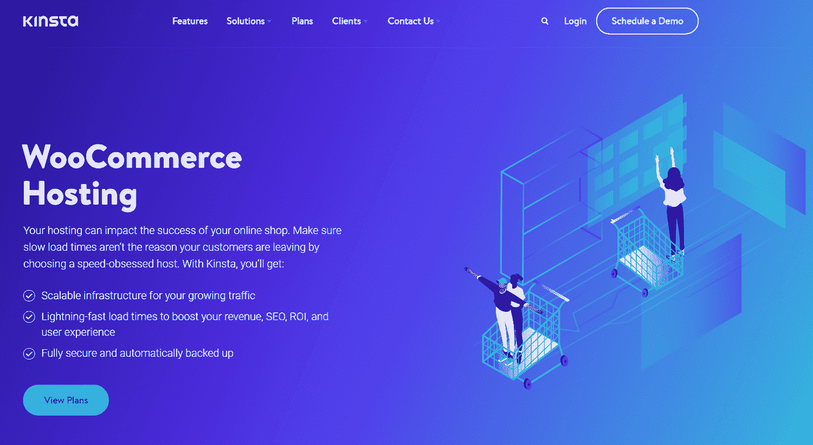
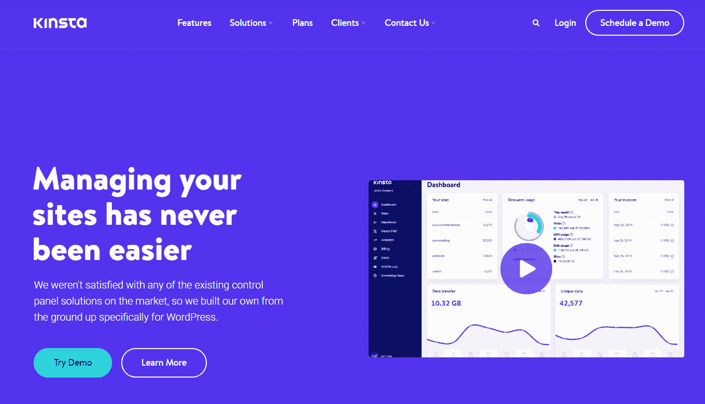

# 什么是虚拟主机？它是如何工作的？

> 原文：<https://kinsta.com/blog/what-is-web-hosting/>

如果你想建立一个在线的存在，了解什么是虚拟主机是很重要的。无论你是自己建立一个网站，还是想了解更多关于这个话题的知识，我们都可以帮助你了解虚拟主机是如何工作的。

让我们开始吧！

## 什么是虚拟主机，它是如何工作的？

虚拟主机是购买在线空间来存储你的网站的过程。注册一个虚拟主机服务可以让你在线发布你的网站。

当你创建一个 WordPress 网站时，你需要两样东西:一个域名和一个主机选项。

> 需要在这里大声喊出来。Kinsta 太神奇了，我用它做我的个人网站。支持是迅速和杰出的，他们的服务器是 WordPress 最快的。
> 
> <footer class="wp-block-kinsta-client-quote__footer">
> 
> 
> 
> <cite class="wp-block-kinsta-client-quote__cite">Phillip Stemann</cite></footer>

[View plans](https://kinsta.com/plans/)

WordPress 是[世界上最顶级的](https://kinsta.com/cms-market-share/) [内容管理系统](https://kinsta.com/cms-market-share/)[【CMS】](https://kinsta.com/cms-market-share/)，可以免费使用，但需要一个网络主机——它提供并存储你的网站文件——和一个域名，也就是你网站的地址。

### 信息

网站由不同的文件组成，如 HTML、CSS 和图像，这些文件是在线显示内容所必需的。这些文件从您的计算机上传并存储在 web 服务器的在线空间中。

web 服务器是一台物理计算机，它将其他用户连接到你的网站。每当有人在浏览器中键入您的网站地址时，您的主机就会传输满足该请求所需的所有文件。

除了存储和传送文件，托管服务通常也帮助你维护网站，如备份，安全和正常运行时间。由于主机服务提供商的功能和价格差异很大，选择一个符合你需求的主机方案是至关重要的。

[What is web hosting? 🤔 This post breaks down everything you need to know 💪Click to Tweet](https://twitter.com/intent/tweet?url=https%3A%2F%2Fbit.ly%2F3OK8M2L&via=kinsta&text=What+is+web+hosting%3F+%F0%9F%A4%94+This+post+breaks+down+everything+you+need+to+know+%F0%9F%92%AA&hashtags=ManagedHosting%2CWebHosting)

### 虚拟主机和域名系统

我们提到 WordPress 网站需要主机和域名。

当用户想要访问您的网站时，他们会在浏览器中键入您的域名。他们的计算机发送一个连接到保存你的文件的网络服务器的请求。

在到达你的网络服务器之前，请求通过一个域名服务器网络，这个网络组成了[域名系统](https://kinsta.com/knowledgebase/what-is-dns/)[(](https://kinsta.com/knowledgebase/what-is-dns/)[DNS](https://kinsta.com/knowledgebase/what-is-dns/)[)](https://kinsta.com/knowledgebase/what-is-dns/)。在 DNS，请求查找服务器的 IP 地址，并将请求转发给它们。

简而言之，DNS 确保浏览器连接到正确的服务器。

你可以把网络服务器想象成你家的所在地，把域名想象成它的地址。你的家可以在全球任何地方，但域名可以让人们找到你。

DNS 的诞生是因为网站通过难以记忆的数字串 IP 地址进行交流。将一个易于记忆的域名与网站的 IP 地址绑定在一起，可以让浏览网页变得更加简单。

网站所有者可以从[域名](https://kinsta.com/blog/best-domain-registrar/) [注册商](https://kinsta.com/blog/best-domain-registrar/)处购买域名。

## 虚拟主机的类型

现在你知道什么是虚拟主机，我们将看看不同类型的虚拟主机计划。

不同的客户有不同的需求。一个使用多种媒体文件并接待众多访问者的在线企业比一个用于写博客的个人网站有更多的托管需求。

主机提供商考虑速度、存储空间和他们的主机方案产品的价格。每种选择都有不同的收益。

让我们看看最受欢迎的选项。

### 共享主机

Shared WordPress hosting

当你学习什么是虚拟主机时，你可能会听说[共享虚拟主机](https://kinsta.com/knowledgebase/shared-vps-dedicated-hosting/)。共享主机最适合入门级功能。因为它是针对初学者的，所以共享主机包通常带有网站构建器、模板和电子邮件功能。

通过共享主机，您可以与其他网站共享服务器资源，如磁盘空间和带宽，这是最实惠的选择。但是，因为您在一台服务器上与多个网站共享空间，所以存在风险。

共享主机[会影响网站性能](https://kinsta.com/blog/free-wordpress-hosting/)。例如，如果其中一个网站的流量过大，就会降低您网站的速度。共享主机也有安全风险，可能导致网站被黑。

 共享主机上的网站也共享一个 IP 地址。如果邻近的网站进行非法活动，[你的](https://kinsta.com/tools/what-is-my-ip/) [IP 地址](https://kinsta.com/tools/what-is-my-ip/)将被封锁，阻止用户甚至谷歌访问你的网站。

**最适合:**接收最小网络流量的新网站，如小型商业网站。

**优点:**

*   低成本
*   预配置的服务器选项
*   几乎不需要技术知识
*   主机负责服务器维护

**缺点:**

*   与其他网站共享资源会影响安全性和速度
*   共享 IP 地址
*   对服务器配置的控制很少甚至没有

### 专用主机

Dedicated WordPress hosting

[专用托管](https://kinsta.com/knowledgebase/dedicated-server/)在共享托管的对面。这通常是最昂贵的托管类型，因为它让网站所有者对他们的服务器拥有最大的控制权。

有了专用主机，你就可以租用整个服务器，所以从选择操作系统到维护，一切都由你负责。

**最适合:**拥有高流量或需要控制服务器的网站所有者。

**优点:**

*   专用服务器空间
*   [更快的网站速度](https://kinsta.com/blog/website-speed-test/)
*   可扩展和可定制

**缺点:**

*   最昂贵的托管类型
*   需要专业技术知识

### 虚拟专用服务器(VPS)托管

VPS hosting

虚拟专用服务器(VPS)托管介于共享托管和专用托管之间。

VPS 主机模拟专用主机，因为每个网站在服务器上都有自己的空间，但 VPS 主机上的网站仍然与其他网站共享服务器空间。

**最适合:**需要更好地控制服务器但不一定需要专用服务器的网站所有者。

**优点:**

*   提供专用的服务器空间，而没有高昂的价格标签
*   网站所有者可以配置他们的服务器空间
*   不需要太多的技术知识

**缺点:**

*   无法处理高流量水平或高峰
*   服务器上的其他网站仍会影响性能

### 云托管

Cloud hosting

虚拟主机最可靠的选择是什么？[云托管](https://kinsta.com/blog/google-cloud-hosting/)。不同于常规的主机托管，它采用一种*集中*的方法，将多个网站的数据存储在一个物理服务器上，云主机托管运行在*虚拟化之上。*

通过虚拟化，数据看似存储在一台服务器上，但多个存储设备共享物理服务器的容量。因为数据存储在不同的位置，所以很容易备份和检索。它也更灵活，因为它更容易添加存储空间。

**最适合:**需要大量处理能力、带宽和磁盘空间的高流量网站，如电子商务商店。

**优点:**

*   几乎没有停机时间
*   按需付费
*   资源根据用户需求进行扩展

**缺点:**

*   难以估计实际成本，因为它每月都在变化
*   依赖互联网

虚拟主机通常由这四个计划中的一个组成，但是主机包也迎合特定的市场。

### WordPress 主机

托管 WordPress 主机(或简称为 [WordPress 主机](https://kinsta.com/wordpress-hosting/))是 WordPress 用户的一种共享主机。

服务器是专门为 WordPress 配置的，所以你的网站运行得更快更流畅。WordPress 托管计划还包括一些特殊功能，例如:

*   预装插件。
*   一键式 WordPress
*   预先设计的 WordPress
*   拖放构建器。
*   熟悉 WordPress 的客户支持团队。

### 电子商务托管

Kinsta’s WooCommerce hosting page

随着电子商务商店的盛行，主机提供商推出了[电子商务](https://kinsta.com/blog/ecommerce-hosting/) [主机](https://kinsta.com/blog/ecommerce-hosting/)。

## 注册订阅时事通讯

### 想知道我们是怎么让流量增长超过 1000%的吗？

加入 20，000 多名获得我们每周时事通讯和内部消息的人的行列吧！

[Subscribe Now](#newsletter)

像 WordPress 主机一样，电子商务主机提供了为企业量身定制的独特功能。这些通常包括:

*   [免费的](https://kinsta.com/knowledgebase/how-to-install-ssl-certificate/) [SSL 证书](https://kinsta.com/knowledgebase/how-to-install-ssl-certificate/)
*   帮助设置[支付网关](https://kinsta.com/blog/woocommerce-payment-gateways/)
*   [额外的安全性](https://kinsta.com/secure-wordpress-hosting/)

WooCommerce 主机托管是电子商务主机托管的一个分支，如果你的网站有一个 WooCommerce 驱动的商店，你可以考虑一下。

## 注册虚拟主机之前需要考虑什么

现在，我们已经介绍了什么是虚拟主机和不同的主机方案，我们将权衡每一个功能，以帮助您选择正确的虚拟主机服务提供商，以及[为什么 Kinsta](https://kinsta.com/why-us/) 是[优于其他虚拟主机](https://kinsta.com/kinsta-alternatives/)的最佳选择。

选择正确的托管计划和公司是确保您的业务成功的关键。两者都会影响网站的速度、安全性、可扩展性和可用性。

这里有一些标准的功能，主机计划提供和什么寻找当选择一个主机。

### 1.磁盘空间

什么是没有磁盘空间的虚拟主机？

Disk space

所有的主机方案都提供了一定的磁盘空间，你可以用来存储你的文件。

我们建议在选择托管方案之前，确定您网站的[存储要求](https://kinsta.com/blog/disk-usage-wordpress/)。通过这样做，您可以更好地估计使用哪个计划。

不同网站有[不同的存储要求](https://kinsta.com/blog/disk-space-wordpress-hosting/)。如果你的网站是媒体丰富的，投资一个额外存储的计划，因为那些文件会占用很多空间。

如果你还不能估计你的存储需求，选择一个可以让你购买更多磁盘空间的主机提供商来为增长做准备。

#### Kinsta 的优势:附加磁盘空间

在 Kinsta，我们不仅提供多种托管方案，而且你还可以选择购买[附加软件](https://kinsta.com/help/disk-space-add-on/) [磁盘空间](https://kinsta.com/help/disk-space-add-on/)——并非所有的托管公司都这样做。

在 Kinsta 购买磁盘空间很简单:你必须从你的 MyKinsta 仪表板注册额外的磁盘空间。还可以通过 MyKinsta 监控计费和磁盘空间使用情况。

### 2.带宽

没有带宽，虚拟主机服务是不完整的。

带宽余量(也称为“数据传输”或“流量”)是衡量服务器在特定时间范围内传输数据的能力。它用每秒兆字节(MB/s)或每秒千兆字节(GB/s)来表示。

如果你想让你的网站运行得更快，带宽是一个关键因素，因为带宽的大小决定了从你的网站传输给你的用户的最大数据量。

如果你想要更高的带宽，你需要你的服务器，或者与更少的网站共享资源的服务器。但是请记住，更高的带宽需要更高的价格，因为有更少的用户来分摊租用服务器的成本。

Struggling with downtime and WordPress problems? Kinsta is the hosting solution designed to save you time! [Check out our features](https://kinsta.com/features/)

主机包每月提供一定量的带宽。在选择托管方案之前，[通过估算网站的大小和访客数量来确定适合网站的带宽](https://kinsta.com/knowledgebase/website-bandwidth-usage-cloudflare/)。

### 信息

当你学习什么是虚拟主机，你有时会看到主机广告无限的带宽…但它不可能有无限的带宽。由于物理限制，总会有最大速度限制。

#### 金斯塔优势:基于游客的定价模式

与大多数虚拟主机公司不同，Kinsta 不提供基于带宽的方案。相反，我们转向了[基于访客的定价模式](https://kinsta.com/blog/new-kinsta/),因为这更容易让我们的客户理解和计算。

虽然我们已经脱离了基于带宽的模式，但你仍然可以在 MyKinsta 仪表板上跟踪带宽和[访客计数数据](https://kinsta.com/knowledgebase/count-visits/)。

我们的客户选择与我们合作是因为我们很棒，而不是因为我们按带宽收费。

### 3.正常运行时间和停机时间

最好的虚拟主机可以在没有[停机](https://kinsta.com/blog/website-downtime/) [或中断](https://kinsta.com/blog/website-downtime/)的情况下运行，所以你的网站总是可以访问的。

如果服务器出现故障，高性能托管计划可以让它快速恢复运行。

正常运行时间衡量的是您的网站保持运行并对访问者可用的时间百分比——越接近 100%的正常运行时间越好。Kinsta 提供了 99.9%的正常运行时间[保证](https://kinsta.com/knowledgebase/high-availability-hosting/)，因为我们托管在谷歌云平台上。

#### Kinsta 优势:私有云托管

Kinsta 的整个基础设施都建立在 [Google Cloud](https://kinsta.com/google-cloud-hosting/) 平台上，该平台允许我们的物理服务器的容量由多个存储设备共享。由于数据存储在不同的位置，如果托管您网站的服务器出现故障，您的网站将立即恢复。

### 4.网站速度

用户希望网站在[五秒或更短的时间](https://www.semrush.com/blog/how-fast-is-fast-enough-page-load-time-and-your-bottom-line/)内加载。

除了影响用户体验，[网站速度](https://kinsta.com/learn/speed-up-wordpress/)也影响 SEO。不是所有的虚拟主机公司都能保证网站的快速运行。

让 Kinsta 的[主机计划](https://kinsta.com/blog/fastest-wordpress-hosting/)脱颖而出的一点是，我们不属于任何传统的主机类别。相反，我们的虚拟主机建立在谷歌云和 [Cloudflare](https://kinsta.com/cloudflare-integration/) 之上，允许托管在我们平台上的每个网站在一个隔离的软件容器中运行，该容器包含运行网站所需的所有软件(Linux、 [NGINX、](https://kinsta.com/knowledgebase/what-is-nginx/) [PHP](https://kinsta.com/knowledgebase/what-is-php/) 、MySQL)。

[隔离软件容器](https://www.netapp.com/devops-solutions/what-are-containers/)确保每个软件都是 100%私有的，甚至不会在你的网站之间共享。除了安全方面的好处，客户报告网站加载速度降低了[50%](https://cloud.google.com/customers/kinsta)——导致流失率低于 5%。

#### 金士达的优势:多个全球数据中心

Kinsta 通过[让您在不同的谷歌云数据中心位置之间选择](https://kinsta.com/help/data-center-locations/)来确保网站速度。这使您能够将您的网站靠近您的访问者，确保低延迟和[时间到第一字节(TTFB)](https://kinsta.com/blog/ttfb/) 和快速加载时间。

所有这些特性[与 HTTP/3](https://kinsta.com/blog/http3/) CDN 和最新版本的 [PHP 8](https://kinsta.com/blog/php-benchmarks/) 相结合，确保您拥有业内最佳的性能堆栈。

### 5.安全性

Kinsta offers secure web hosting plans

网站安全可不是闹着玩的。

除了磁盘空间和带宽，网站还需要主机提供商提供的安全性。

虽然 WordPress 是安全的，但它的流行使其成为数据泄露的目标。

如果你不精通技术，我们建议你比较一下每个主机方案的默认安全特性。许多廉价或免费的虚拟主机计划可能会提供一些默认的安全功能，但提供附加的高级功能。

Kinsta 上托管的所有网站都带有免费的 SSL 证书。我们还支持双因素身份验证和 IP 地理位置阻止。我们对所有新安装的系统强制使用强密码，并自动禁止一分钟内登录失败超过六次的 IP 地址。

我们甚至提供[恶意软件安全保证](https://kinsta.com/knowledgebase/malware-security/)。如果您的网站遭到破坏，我们将免费修复。

因为没有一个网站是 100%防黑客的，我们还会自动创建两周的备份。

#### Kinsta 优势:Cloudflare 的企业级防火墙

Kinsta 利用 Cloudflare 的企业级防火墙来保护客户网站。Cloudflare 的防火墙让我们能够阻止恶意流量，[我们的 Cloudflare 集成](https://kinsta.com/cloudflare-integration/)包括免费的分布式[拒绝服务(DDoS)保护](https://kinsta.com/blog/ddos-attack/)。这意味着更好地保护您的网站。

### 6.控制面板

虽然这不会直接影响网站的性能，但你也应该检查一下你的主机账户的控制面板。

[控制面板](https://kinsta.com/knowledgebase/what-is-cpanel/)使您能够控制服务器进程。您可以找到不同的工具来:

*   上传和管理网页、域和子域
*   管理隐私和安全
*   [将访问者](https://kinsta.com/blog/wordpress-redirect/)重定向到另一个位置
*   安装应用程序
*   创建和管理电子邮件帐户
*   [备份数据](https://kinsta.com/help/external-backups/)
*   保护目录

控制面板还允许您访问[文件传输协议(](https://kinsta.com/knowledgebase/ftp-vs-sftp/) [FTP](https://kinsta.com/knowledgebase/ftp-vs-sftp/) [)](https://kinsta.com/knowledgebase/ftp-vs-sftp/) ，该协议在您的计算机和在线服务器之间传输文件。

当你为主机计划货比三家时，不要忘记阅读公司控制面板可用性的评论。如果你的网站使用起来复杂或者混乱，你将无法探索或者最大化它的功能。

#### 金斯塔的优势:MyKinsta

MyKinsta landing page. (Image source: [Kinsta](https://kinsta.com/mykinsta/))

[MyKinsta](https://kinsta.com/mykinsta) 是 Kinsta 的控制面板。它是作为 cPanel 或 Plesk 的[替代品开发的，考虑到了 WordPress。](https://kinsta.com/blog/cpanel-alternatives/)

MyKinsta 让您能够:

*   轻松管理[多个](https://kinsta.com/blog/manage-multiple-wordpress-sites/) [WordPress 网站](https://kinsta.com/blog/manage-multiple-wordpress-sites/)
*   预安装插件
*   迁移你的 WordPress 网站
*   克隆您现有的网站
*   添加和管理域
*   跟踪绩效和分析

[Whether you're building a website yourself or just want to learn more about the topic, learn how web hosting works in this guide ⬇️Click to Tweet](https://twitter.com/intent/tweet?url=https%3A%2F%2Fbit.ly%2F3OK8M2L&via=kinsta&text=Whether+you%27re+building+a+website+yourself+or+just+want+to+learn+more+about+the+topic%2C+learn+how+web+hosting+works+in+this+guide+%E2%AC%87%EF%B8%8F&hashtags=ManagedHosting%2CWebHosting)

## 摘要

现在你知道什么是虚拟主机，不同的类型，以及在你注册一个计划之前要考虑什么，是时候建立你的网站了。

无论您计划创建一个个人网站、[经营一家代理公司、](https://kinsta.com/wordpress-hosting-agencies/)[开发一个应用程序、](https://kinsta.com/application-hosting/)还是[建立一个数据库、](https://kinsta.com/database-hosting/)，Kinsta 都能为您提供完美的计划。

Kinsta 所有的 WordPress 计划包括:

*   免费 WordPress 安装
*   免费 SSL 证书
*   企业 Cloudflare 集成
*   [高级暂存环境](https://kinsta.com/add-ons/?plan=visits-business1&interval=month#h-premium-staging-environments)
*   全天候正常运行时间监控
*   技术支持

有了 30 天退款保证，您可以享受所有这些以及更多。[查看我们满意的客户](https://kinsta.com/clients/local-digital/)或[联系我们](https://kinsta.com/contact-us/)，为您找到合适的计划。

* * *

让你所有的[应用程序](https://kinsta.com/application-hosting/)、[数据库](https://kinsta.com/database-hosting/)和 [WordPress 网站](https://kinsta.com/wordpress-hosting/)在线并在一个屋檐下。我们功能丰富的高性能云平台包括:

*   在 MyKinsta 仪表盘中轻松设置和管理
*   24/7 专家支持
*   最好的谷歌云平台硬件和网络，由 Kubernetes 提供最大的可扩展性
*   面向速度和安全性的企业级 Cloudflare 集成
*   全球受众覆盖全球多达 35 个数据中心和 275 多个 pop

在第一个月使用托管的[应用程序或托管](https://kinsta.com/application-hosting/)的[数据库，您可以享受 20 美元的优惠，亲自测试一下。探索我们的](https://kinsta.com/database-hosting/)[计划](https://kinsta.com/plans/)或[与销售人员交谈](https://kinsta.com/contact-us/)以找到最适合您的方式。