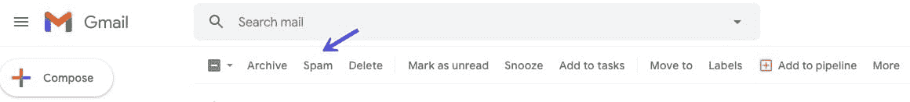
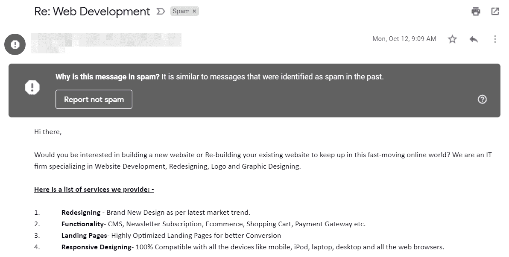
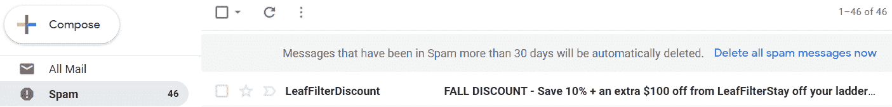

# 你的邮件变成垃圾邮件的 9 个原因

> 原文：<https://kinsta.com/blog/why-are-my-emails-going-to-spam/>

电子邮件是接触目标受众和扩大客户群的一种强有力的方式。近 60%的用户表示营销邮件会影响他们的购买。然而，随着在线隐私和保护法的收紧，让你的电子邮件进入收件人的收件箱变得更加困难。

如果你的电子邮件最终出现在用户的垃圾邮件文件夹中，不要担心。通过遵循一些简单的最佳实践，你不仅能确保你的邮件到达收件人手中，还能提高打开率，产生更大的影响。

在这篇文章中，我们将探讨为什么电子邮件最终成为垃圾邮件，以及你可以做些什么。

有很多内容要讲，所以我们开始吧！

### 更喜欢看[视频版](https://www.youtube.com/watch?v=TV7zkkjyk2g)？

## 为什么垃圾邮件是电子邮件营销人员的一个问题

估计表明，在 2019 年至 2023 年期间，每天将发送多达 [60](https://techjury.net/blog/how-many-emails-are-sent-per-day/#:~:text=At%20least%205%20out%20of,daily%20between%202019%20to%202023.) *[十亿](https://techjury.net/blog/how-many-emails-are-sent-per-day/#:~:text=At%20least%205%20out%20of,daily%20between%202019%20to%202023.)* [垃圾邮件](https://techjury.net/blog/how-many-emails-are-sent-per-day/#:~:text=At%20least%205%20out%20of,daily%20between%202019%20to%202023.)。显然，用户并不欣赏大量的垃圾邮件。然而，这也是电子邮件营销人员的一个主要问题。多达 20%的电子邮件将永远不会到达收件人的收件箱，从而阻止你接触到你的受众。

随着电子邮件的平均投资回报率(ROI)达到 122 %( T1 ),最大限度地减少你的邮件出现在那 20%中的*的机会是很重要的。每封垃圾邮件都是对你的浪费，包括邮件本身和它可能产生的任何潜在的[转化](https://kinsta.com/blog/conversion-rate-optimization-tips/)。*

幸运的是，你可以做很多事情来[将你的邮件从垃圾邮件文件夹](https://kinsta.com/blog/email-authentication/)中清除出去，而且大部分都相当简单。在下一节中，我们将看看电子邮件变成垃圾邮件的一些最常见的原因，并看看如何避免它们。

## 为什么我的电子邮件会变成垃圾邮件？(9 个潜在原因)

有许多原因会导致[电子邮件被识别为垃圾邮件](https://kinsta.com/blog/wordpress-not-sending-email/#how-to-stop-wordpress-emails-going-to-spam)，从触发垃圾邮件过滤器的关键字到不正确的权限。

让我们浏览一些最常见的场景，并探索如何确保您的邮件到达用户的收件箱。

### 1.您的收件人将您的电子邮件标记为垃圾邮件

你的电子邮件最终成为垃圾邮件的第一个也是最明显的原因是因为你的收件人把它们放在了那里。

即使你的[内容是强有力的](https://kinsta.com/learn/content-marketing/)，并且收件人明确允许你联系他们，他们仍然可能决定将你的电子邮件标记为垃圾邮件，以此来清理混乱的收件箱。

他们也可能忘记了当初为什么订阅你的名单，或者只是犯了一个错误。

Reporting email message as spam

不幸的是，如果有足够多的邮件被用户标记，它会导致垃圾邮件过滤器标记您的地址，并开始自动将您的邮件发送给垃圾邮件。

这意味着你的信息可能最终看起来像垃圾邮件，即使对于过去没有明确标记你的用户来说。这在 T2 的 Gmail、Outlook、雅虎和其他有大量人工智能驱动算法的服务中尤其可能发生。

一旦邮件发出，你就无法阻止别人将你的邮件标记为垃圾邮件。

你能做的是确保你的内容是一流的，并遵循其他最佳实践来避免你的邮件被用户视为垃圾邮件。这可以最大限度地减少有人故意标记您的通信的机会。我们将在接下来的章节中讨论其中的一些策略。
T3】

### 2.你没有遵循 HTML 最佳实践

虽然纯文本电子邮件相当简单，但对于电子商务商店等一些企业来说，它们可能不是一个可行的选择，因为与包含品牌、图像和其他 HTML 元素的电子邮件相比，它们可能会导致较低的参与度。

然而，当在你的消息中包含 [HTML 时，遵循一些简单的规则来确保它们不会出现在垃圾邮件文件夹中是很重要的。](https://kinsta.com/blog/free-html-editor/)

根据 Mailchimp 的说法，[这里有一些电子邮件的 HTML 最佳实践:](https://templates.mailchimp.com/getting-started/html-email-basics/)

*   保持邮件的最大宽度在 600 到 800 像素之间。这确保了它足够大，容易阅读，同时在电子邮件客户端预览窗格中也表现良好。
*   假设任何图像都将被电子邮件客户端阻止，如果关键信息包含在媒体元素中，用户可能看不到这些信息。
*   尽可能保持你的代码简洁明了，尤其是 CSS。此外，完全避免 JavaScript 和 Flash。这些可能被视为垃圾邮件过滤器攻击的媒介，而且许多电子邮件客户端根本不支持它们。
*   确保你的信息是手机友好的。事实上，如今用移动优先的理念来设计一切通常是个好主意。这意味着拇指友好的按钮，不会使移动网络过载的小的[图像](https://kinsta.com/blog/image-file-types/)，以及在小屏幕上可读的[电子邮件安全字体](https://kinsta.com/blog/best-fonts-for-email/)。
*   说到字体，你也要确保你选择的字体是跨平台的，清晰易读的。Arial、Verdana 和 Georgia 都是不错的选择。
*   查看添加到您的[电子邮件签名](https://kinsta.com/blog/email-signature/)中的任何链接，避免任何可能被标记为垃圾邮件的网站。

最后，让你的电子邮件的大部分内容都是文本，尽量减少 HTML 的数量是一个好主意。你的公司品牌和一种流行的颜色可以在不过度的情况下创造参与的奇迹。

### 3.您的主题行具有误导性或包含垃圾邮件触发器

主题通常是用户对你的邮件的第一印象，所以他们需要抓住注意力，吸引读者打开邮件。然而，他们也需要诚实。根据 CAN-SPAM 法案，误导性的主题不仅是不礼貌的，也是违法的。

根据 Litmus 的说法，超过一半的电子邮件回复者报告说，他们感觉被欺骗了，或者被骗去打开一封基于主题行[的邮件。这是让你的邮件被扔进垃圾邮件文件夹的快捷方式，甚至可能导致一些用户退订。](https://www.litmus.com/blog/misleading-subject-lines/)

## 注册订阅时事通讯

### 想知道我们是怎么让流量增长超过 1000%的吗？

加入 20，000 多名获得我们每周时事通讯和内部消息的人的行列吧！

[Subscribe Now](#newsletter)

Messages that begin with RE: but are not replies commonly get labeled as spam

误导性的主题是什么样的？以下是一些例子:

*   **RE 或 FW。不要以“回复”开始你的主题，除非你真的在回复什么。这是一个明目张胆的伎俩，也是获得退订的快速方法。同样，使用“FW”会让对方认为他们认识你(误导的定义)。**
*   个人信息或引导性问题。像“我把手机落在你家了吗？”或者“你听说过某某人吗？”可能会让用户质疑是否认识发件人。
*   过分耸人听闻的主张。有些主题并不一定是谎言，但仍然有点过分。一般来说，你需要确保你的主题和读者在邮件中看到的内容相匹配。

你的主题也应该是专业的。这意味着不用全部大写，也绝对没有拼写或语法错误。免费工具[语法](https://kinsta.com/blog/grammar-checker-tools/#grammarly)可以自动检查你的拼写、语法和标点符号，并提醒你任何可能引起垃圾邮件过滤器的问题。

现在你知道应该避免什么主题，但是你仍然需要吸引用户打开你的邮件。Hubspot 有一些[很好的建议](https://blog.hubspot.com/marketing/improve-your-email-subject-line)来创造强有力的标题:

*   从动作动词开始。
*   创造一种紧迫感和重要性(但同样，不要被误导)。
*   提出一个有趣或引人注目的问题。

最后，记住:无论你的主题是什么，确保内容兑现了它的承诺。否则，你有可能损害你的名誉。

### 4.您没有收件人的许可

这个很简单:像 GDPR 这样的网络隐私法要求你必须得到收件人的明确许可才能给他们发邮件。这意味着你不能简单地购买电子邮件列表来快速访问一群联系人(出于其他原因，这也不是一个好主意，包括不良的针对性)。

然而，这也意味着，即使是在你的网站上提供了电子邮件地址的用户也需要明确告诉你，他们希望收到你的电子邮件，尤其是如果他们是欧盟公民的话。这可以是在创建账户时的免责声明，或者是在你的[联系表格](https://kinsta.com/blog/wordpress-contact-form-plugins/)上，也可以是用户需要勾选以表明其意愿的复选框。

虽然在美国这不一定是*要求的*，但这仍然是一个很好的实践。如今，人们会收到很多电子邮件，如果你的邮件突然出现在某人的收件箱中，而他们并没有要求这些邮件，那么这些邮件很有可能会被标记为垃圾邮件。

### 5.您的内容会触发垃圾邮件过滤器

垃圾邮件过滤器会检查某些单词(或单词组合)。如果一封电子邮件获得足够的点击量，或者除了这个列表中的一些其他项目之外还包含这些词，它可能会最终出现在垃圾邮件文件夹中。[垃圾邮件触发关键字](https://www.voilanorbert.com/blog/spam-filters-and-spam-trigger-words-to-avoid/)可以包括:

*   “免费”
*   “最低价格”
*   “额外收入”
*   “轻松赚钱”
*   “无成本”
*   连续出现多个感叹号或美元符号
*   带有不必要的空格或标点的单词
*   全大写的单词

一般来说，这些词要么是以销售为导向的，要么显然是为了绕过垃圾邮件过滤器而设计的(比如额外的空格)。虽然使用少量的这些并不一定意味着你的信息被判了死刑，但是使用太多的*可能会被判死刑。*

厌倦了体验你的 WordPress 网站的问题？通过 Kinsta 获得最好、最快的主机支持！[查看我们的计划](https://kinsta.com/plans/?in-article-cta)

Overly ‘salesy’ language and too many keywords can trigger spam filters

当然，有些关键词是很难避免的，尤其是当你发送电子商务或金融邮件时。为了解决这个问题，你可以使用各种各样的语言，并尝试在措辞上有所创新。

最重要的是，明智的做法是避免咄咄逼人或“推销”的语言，并确保你遵循我们在这里强调的写邮件内容的最佳实践。

### 6.您没有包含退订链接

像美国 CAN-SPAM 这样的法律明确规定，你的电子邮件*必须*包含退订的明确方式。此外，如果有人点击了取消订阅链接，您需要在 10 天内处理该请求，并且您不能强迫用户通过任何障碍。

虽然这似乎是一件坏事(你为什么要给人们退订的机会？)，其实可以起到相反的效果，前提是你的内容很强。给人们一个简单的方法让他们从你的订户名单上消失，这表明你的品牌是值得信赖的。

另一方面，隐藏或者干脆不提供退订选项肯定会让人沮丧。这也可能导致对你的时事通讯的负面报道(消息在互联网上传播得很快)，通常会引起人们的反感。

### 7.您的“发件人”信息是错误的或误导的

你的电子邮件可能成为垃圾邮件的一个主要原因是不正确的“发件人”信息。“发件人”这一行告诉你的收件人是谁发的邮件，这一行需要准确无误，不能有误导性。在某些情况下，你网站上的一个工具，比如一个联系表单插件，可能会[发送带有“发件人”详细信息的“欺骗”电子邮件](https://kinsta.com/blog/wordpress-not-sending-email/#3-your-contact-form-plugin-is-sending-spoof-emails)，从而触发垃圾邮件警报。

如果你的联系方式邮件被标记为垃圾邮件，解决方法通常很简单。您需要确保联系人表单设置中的“发件人”字段包含您网站的管理员地址，而不是表单中输入的电子邮件地址。如果您让联系人表单向您发送电子邮件通知，也要确保“发件人”和“收件人”中使用的地址不同。

### 8.您尚未设置电子邮件认证

你的电子邮件“发件人”信息可能错误的另一个常见原因是，当电子邮件认证没有通过像 [Mailchimp](https://kinsta.com/blog/how-to-use-mailchimp/) (或[的替代品](https://kinsta.com/blog/mailchimp-alternatives/))这样的服务正确设置时:

身份验证授权该服务代表您发送电子邮件，因此它们会附带您的[域名](https://kinsta.com/blog/professional-email-address/)，即使它们是由第三方发送的。如果您的身份验证设置不正确，您的电子邮件可能会直接发送到收件人的垃圾邮件箱中。

有几种不同类型的电子邮件认证，主要的有[域名密钥识别邮件(DKIM)](http://www.dkim.org/) 、[发件人政策框架(SPF)](https://support.google.com/a/answer/33786) 和 [DMARC](https://kinsta.com/knowledgebase/dmarc-fail/) 。

DKIM 提供加密密钥和数字签名来验证电子邮件，而 SPF 的工作方式是根据批准的 IP 列表来验证发件人的 IP 地址。DMARC 有点不同，因为它要求启用其他两个，并让发件人表明他们的电子邮件受到 DKIM 或 SPF 的保护。

如果您使用自动电子邮件服务，并且在发送方面遇到问题，那么首先要检查的是身份验证。如果你需要这方面的帮助，我们有一篇方便的文章，详细介绍了如何设置电子邮件认证。

### 9.您发送的附件太多

对于大多数垃圾邮件过滤器来说，附件是一个巨大的危险信号。这是因为文件很容易成为恶意软件和病毒的载体。一般的经验法则是干脆不发送任何附件，尤其是在[简讯](https://kinsta.com/wordpress-newsletter/)中。如果您确实需要发送附件，请确保收件人提前知道，并尽量减少您在一封电子邮件中附加的文件数量。

如果你必须在电子邮件中附上一份文档或文件，更安全的做法是先把它上传到云存储服务，比如谷歌驱动或 T2 的 Dropbox。然后，您可以在电子邮件中包含该文件的链接。这样，你的邮件就不会触发任何垃圾邮件过滤器。

[使用本指南从垃圾邮件文件夹中保存您的营销邮件📩 💥#EmailMarketing # 邮箱 点击发推](https://twitter.com/intent/tweet?url=https%3A%2F%2Fkinsta.com%2Fblog%2Fwhy-are-my-emails-going-to-spam%2F&via=kinsta&text=Save+your+marketing+emails+from+the+spam+folder+with+this+guide+%F0%9F%93%A9+%F0%9F%92%A5+%23EmailMarketing+%23Email)

## 摘要

您的电子邮件可能会出现在垃圾邮件文件夹中有很多原因，从糟糕的主题行到触发垃圾邮件过滤器的关键字。不管是什么原因，重要的是要解决这个问题，以最大化你的投资回报，并在你的观众中保持值得信赖的声誉。

通过快速解决这些问题并实施一些行之有效的最佳实践，您可以轻松地将您的邮件与垃圾邮件隔离开来。最重要的是，这些相同的做法也可以增加你的信息的影响力，并有望[将更多的订户转化为顾客](https://kinsta.com/blog/conversion-rate-optimization-tips/)。

您对上述电子邮件营销最佳实践有任何疑问吗？请在下面的评论区告诉我们！

* * *

让你所有的[应用程序](https://kinsta.com/application-hosting/)、[数据库](https://kinsta.com/database-hosting/)和 [WordPress 网站](https://kinsta.com/wordpress-hosting/)在线并在一个屋檐下。我们功能丰富的高性能云平台包括:

*   在 MyKinsta 仪表盘中轻松设置和管理
*   24/7 专家支持
*   最好的谷歌云平台硬件和网络，由 Kubernetes 提供最大的可扩展性
*   面向速度和安全性的企业级 Cloudflare 集成
*   全球受众覆盖全球多达 35 个数据中心和 275 多个 pop

在第一个月使用托管的[应用程序或托管](https://kinsta.com/application-hosting/)的[数据库，您可以享受 20 美元的优惠，亲自测试一下。探索我们的](https://kinsta.com/database-hosting/)[计划](https://kinsta.com/plans/)或[与销售人员交谈](https://kinsta.com/contact-us/)以找到最适合您的方式。