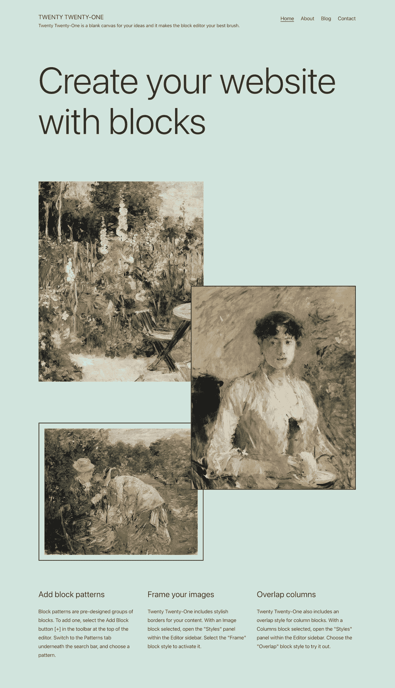
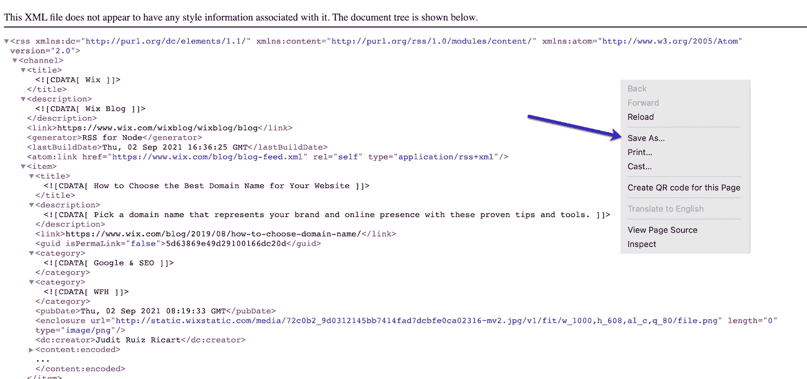
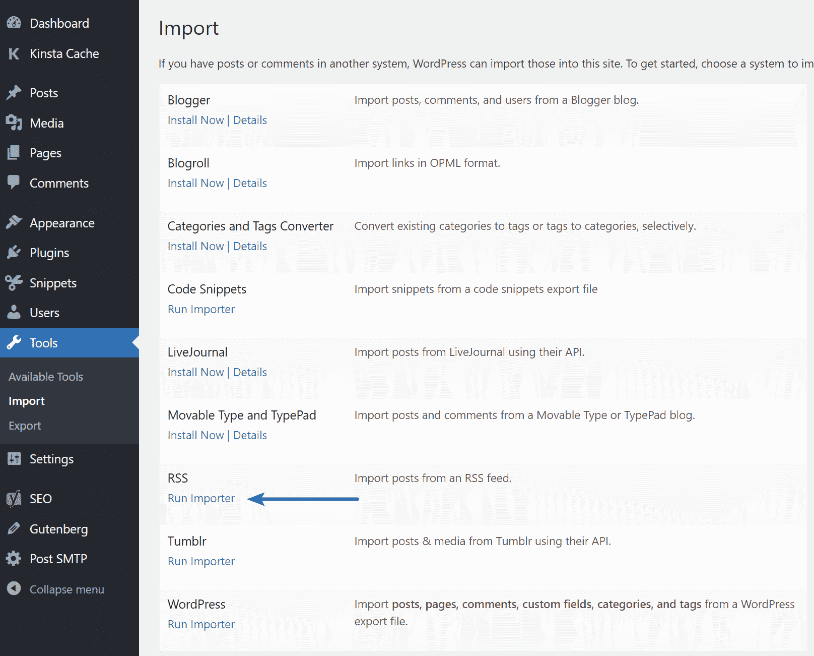
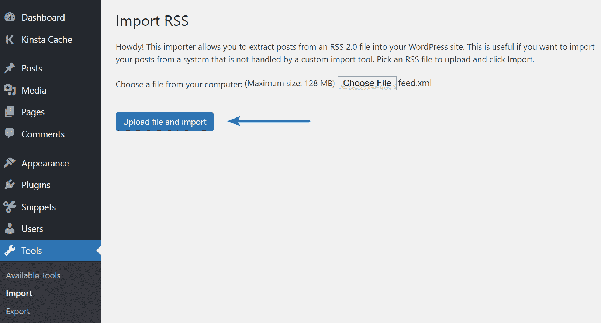

# 如何从 Wix 迁移到 WordPress(完全指南)

> 原文：<https://kinsta.com/blog/wix-to-wordpress/>

由于其多样的模板和直观的界面，Wix 对小型企业来说似乎是一个有吸引力的实用选择。用户可以快速、轻松地创建 Wix 网站。然而，随着你的业务增长和局限性变得明显，获得更多的控制和将你的网站从 Wix 迁移到 WordPress CMS 是一个好主意。

如果你仍然对迁移犹豫不决，了解这两个 CMS 平台在全球的市场份额类型会对你有所帮助。

迁移前要做的第一件事就是仔细规划一切。你的网站有多大？你需要你所有的图片和搜索引擎优化设置(元数据)吗？你也可以查看 Wix 和 WordPress 之间所有主要的[差异，以获得更好的理解。](https://kinsta.com/blog/wix-vs-wordpress/)

这篇文章将指导你如何使用两种不同的方法成功地将你的 Wix 站点迁移到 WordPress。

## 购买主机和域名

在将你的网站从 Wix 迁移到 WordPress 之前，有两个关键的事项你必须考虑和注意——购买主机和购买域名。

当从 Wix 迁移时，你需要为你的 WordPress 站点获得主机；每个站点都需要一个。它存储您的所有网站文件，并显示给网站访问者。WordPress 主机提供商也将确保你的网站快速加载并且不会宕机。在 Wix 上，这是他们在幕后自动为您提供的，但是您需要自己的托管空间来迁移您的 Wix 数据。

谈到 WordPress，有相当多的虚拟主机提供商。但是如果你喜欢不用担心 Wix 的维护，那么托管 WordPress 主机是最适合你的。托管 WordPress 主机服务提供商只专注于 WordPress，包括更新、备份、安全和性能特性。一般来说，它们比其他标准的主机服务提供商稍微贵一点，但是为了让你的网站快速安全，它们是值得的。

> 需要在这里大声喊出来。Kinsta 太神奇了，我用它做我的个人网站。支持是迅速和杰出的，他们的服务器是 WordPress 最快的。
> 
> <footer class="wp-block-kinsta-client-quote__footer">
> 
> 
> 
> <cite class="wp-block-kinsta-client-quote__cite">Phillip Stemann</cite></footer>

[View plans](https://kinsta.com/plans/)

如果你选择和 Kinsta 一起做主机，注册后你需要做的第一件事就是[创建一个新的 WordPress 站点](https://kinsta.com/help/new-site/)。您可以在 MyKinsta 仪表板中点击几下，快速完成这项工作。

您还需要购买一个域名来连接到您的新网站。你可能已经有了一个域名，如果是这样，很好，你可以[将你的域名指向 Kinsta](https://kinsta.com/help/add-domain/) 并开始这个过程。

如果你还没有域名，那么你需要购买一个。当计算出你应该为一个域名支付多少钱时，有几个选择可以考虑。当你有了自己的名字和主持人，那么是时候向前推进转让了。

## 选择和自定主题

一旦你成功安装了你的 WordPress 站点，你将运行默认的主题，目前是[Twenty Twenty One](https://kinsta.com/blog/twenty-twenty-one-theme/)。然而，不一定非要这样。有大量的[免费和付费主题](https://kinsta.com/blog/wordpress-free-vs-paid-themes/)可供选择。

The Twenty Twenty-One WordPress theme.

找到并[安装一个主题](https://kinsta.com/blog/how-to-install-a-wordpress-theme/)最简单的方法就是在你的仪表盘中，在**外观** → **主题** → **添加新的**下。

无论你选择哪一个主题，你可能还是想对它进行一点点定制，让它看起来像你想要的那样。如今，许多主题都带有选项和定制面板，您可以根据自己的需求轻松调整。

## 选项 1-从 Wix 导入内容到 WordPress

由于 Wix 是一个封闭的平台(非开源)，没有直接的方法来传输这个 CMS 的内容。但是，可以导入 Wix RSS 提要，而不是手动重新创建每个帖子。首先，你需要下载你网站的 RSS 文件。遵循以下步骤:

### 第一步

将`/feed.xml`添加到 Wix 站点 URL 的末尾，以[定位 RSS 文件](https://support.wix.com/en/article/adding-your-rss-feed-to-an-rss-reader)。

Wix RSS feed.

不过，需要注意的是，这种方法只适用于旧的 Wix 博客。随着他们最近的更新，[新 Wix 博客](https://support.wix.com/en/article/request-adding-an-rss-feed-to-the-new-wix-blog)没有 [RSS 源](https://kinsta.com/blog/wordpress-rss-feed/)。如果您正在使用新的 Wix 博客，请跳到选项 2 来迁移您的站点。

### 第二步

如果你使用的是 Chrome，你会看到一个满是代码的页面。右键单击该页面，并将文件保存在您的计算机上。默认情况下，它将被保存为`feed.xml`。如果你使用另一个浏览器，比如 Firefox，你需要右击并选择**查看页面源**。然后保存到你的电脑上。

Save your Wix site’s RSS feed.

### 第三步

现在进入你的 WordPress 管理面板，**工具→导入**。您将看到导入 RSS 的选项。点击**运行导入器**按钮(注意:您可能需要先安装它)。

Click the WordPress RSS “Run Importer” link.

### 第四步

点击**选择文件**按钮，选择之前保存的`feed.xml`文件。然后点击**上传文件和导入**按钮。

## 注册订阅时事通讯

### 想知道我们是怎么让流量增长超过 1000%的吗？

加入 20，000 多名获得我们每周时事通讯和内部消息的人的行列吧！

[Subscribe Now](#newsletter)

Uploading and importing the Wix RSS feed file.

### 第五步

您可以通过**帖子→所有帖子**查看[所有帖子是否都已正确导出](https://kinsta.com/knowledgebase/export-wordpress-site/#built-in-tool)。有时，第一次尝试时，您的整个提要可能无法正确导入。如果发生这种情况，只需编辑您的 XML 文件并删除成功导入的文章。

即使你的文章已经被移动，这些文章中的图片仍然由 Wix 托管。要解决这个问题，您有两个选择:

1.  您可以手动将所有图像保存在您的计算机上，并上传到您的 WordPress 媒体库。你可以[通过 FTP/SFTP](https://kinsta.com/knowledgebase/bulk-upload-files-wordpress-media-library-ftp/) 批量上传它们。
2.  您可以安装并激活附加插件[导入外部图像](https://wordpress.org/plugins/import-external-images/)。安装并激活插件后，进入**媒体** → **导入** **图片**，点击**立即导入图片**按钮。

Import External Images plugin.

### 重要的

虽然上面的插件已经有一段时间没有更新了，但它仍然工作得很好。

### 第六步

最后一步是将 Wix 页面转移到 WordPress。不幸的是，没有自动完成转移的方法。所以每一页都必须手动在 WordPress 中重新创建。

要做到这一点，请转到您想要移动到 WordPress 的 Wix 页面，复制所有内容，并在 **WordPress 管理仪表板→页面→添加新内容**菜单中用这些内容创建一个新页面。当你完成页面定制后，点击**发布**按钮，让它在你的 WordPress 网站上上线。

## 选项 2–使用 Kinsta 的合作伙伴 WordHerd

没有时间浪费，需要确保你的 [WordPress 站点迁移](https://kinsta.com/blog/migrate-wordpress-site/)顺利进行？那么我们推荐去看看[wordheld](https://wordherd.io/partners/kinsta/)。他们是 Kinsta 的官方合作伙伴，提供全方位的网站迁移服务，将数据从任何 CMS (Wix)平台转移到 WordPress。

厌倦了低于 1 级的 WordPress 托管支持而没有答案？试试我们世界一流的支持团队！[查看我们的计划](https://kinsta.com/plans/?in-article-cta)

WordHerd.

WordHerd 处理从小型企业到大型企业的各种规模的迁移。除了 CMS 迁移之外，WordHerd 团队也非常擅长协助 CRM 数据迁移。顺便说一句，如果你想了解更多关于迁移的信息，一定要查看我们的[最佳 WordPress 迁移插件列表](https://kinsta.com/blog/wordpress-migration-plugins/)。

## 迁移后

在你的 Wix 迁移到 WordPress 之后，你很可能需要进一步更新你的新网站，尤其是如果你刚刚开始使用 WordPress 的话。这里有一些建议和开始的好地方。

### 网站安全

选择一个[安全的 WordPress 主机](https://kinsta.com/secure-wordpress-hosting/)总是很重要的，它提供了额外的功能来保护你的网站。但是即使这样，也有一些最佳实践来进一步强化您的站点。诸如更改您的登录 URL、选择一个强密码，甚至实施一个像 Cloudflare 和 Sucuri 这样的 [WAF 解决方案都可以带来很大的不同。看看这个关于 WordPress 安全的](https://kinsta.com/blog/cloudflare-settings-wordpress/#firewall)[完整指南](https://kinsta.com/blog/wordpress-security/)。

### 选择一个快速、稳定的主题

WordPress 不缺主题。关键是要找到一个不仅速度快，而且还能提供你正在寻找的功能的软件。任何领域都有适合的主题，所以你不会缺少选择。

相反，如果你正试图建立一个电子商务网站，花一分钟看看一些可用的最佳 WooCommerce 主题。

网站速度在很多层面上处理。你必须有一个好主意，该做什么，采取什么步骤来加快你的网站。你可以在几个层面上做到这一点。

所以，无论你是 WordPress 网站速度世界的初学者，还是经验丰富并希望将你的 WordPress 网站速度提升到下一个水平的人，都有一个起点。

### 搜索引擎优化

WordPress 对于 SEO 来说是非常棒的。这是人们喜欢它的一个原因！然而，就像任何平台一样，当然，你会想做一些事情来帮助你的网站排名更好。

1.  选择一个推荐的 [SEO 插件](https://kinsta.com/blog/best-seo-plugins-for-wordpress/)。
2.  创建一个 [sitemap 文件](https://kinsta.com/blog/wordpress-sitemap/)并提交给 Google 和 Bing。
3.  仔细检查你的 [robots.txt 文件](https://kinsta.com/blog/wordpress-robots-txt/)。
4.  仔细检查并改进您的[现场 SEO](https://kinsta.com/blog/wordpress-seo/) 。

### 谷歌分析

在你的 WordPress 网站上实现[谷歌分析](https://kinsta.com/blog/google-analytics-wordpress/)。这可以[帮助监控你网站的统计数据](https://kinsta.com/blog/how-to-use-google-analytics/)(流量和转化率)，跟踪在线表现，并分析你的访问者的行为。

### 扩展功能

你很可能还需要一些其他插件。这可能是 WordPress 最棒的地方之一——每一个可能的功能都有插件，有免费的也有付费的！然而，这也使得寻找合适的工作变得很困难。你想要深入了解[最佳社交媒体插件](https://kinsta.com/blog/wordpress-social-media-plugins/)、[联系人表单插件](https://kinsta.com/blog/wordpress-contact-form-plugins/)、 [CRM 插件](https://kinsta.com/blog/wordpress-crm/)，以及其他[有用的绩效插件](https://kinsta.com/blog/wordpress-performance-plugins/)。

请务必查看存储库中插件的评论以及它们的更新时间。如果你想开一家电子商务商店，我们推荐 WooCommerce 或 Easy Digital Downloads。

[总有一天，Wix 不再是您成长中企业的实际选择。📈当那一天到来的时候，WordPress 已经准备好介入了。😌在这里了解如何进行切换⬇️ 点击推文](https://twitter.com/intent/tweet?url=https%3A%2F%2Fkinsta.com%2Fblog%2Fwix-to-wordpress%2F&via=kinsta&text=There+comes+a+time+when+Wix+is+no+longer+the+practical+choice+for+your+growing+business.+%F0%9F%93%88+And+when+that+day+comes%2C+WordPress+is+ready+to+step+in.+%F0%9F%98%8C+Learn+how+to+make+the+switch+here+%E2%AC%87%EF%B8%8F&hashtags=Wix%2CWordPress)

## 摘要

从 Wix 迁移到 WordPress 可能是一个相当复杂的过程，但这是值得的，因为你可以更好地控制你的数据，并且可以随心所欲地扩展你的站点。

我们希望这份迁移指南能对那些正在进行迁移的人有所帮助。

你最近从 Wix 迁移到 WordPress 了吗？我们希望听到你的想法和意见。

* * *

让你所有的[应用程序](https://kinsta.com/application-hosting/)、[数据库](https://kinsta.com/database-hosting/)和 [WordPress 网站](https://kinsta.com/wordpress-hosting/)在线并在一个屋檐下。我们功能丰富的高性能云平台包括:

*   在 MyKinsta 仪表盘中轻松设置和管理
*   24/7 专家支持
*   最好的谷歌云平台硬件和网络，由 Kubernetes 提供最大的可扩展性
*   面向速度和安全性的企业级 Cloudflare 集成
*   全球受众覆盖全球多达 35 个数据中心和 275 多个 pop

在第一个月使用托管的[应用程序或托管](https://kinsta.com/application-hosting/)的[数据库，您可以享受 20 美元的优惠，亲自测试一下。探索我们的](https://kinsta.com/database-hosting/)[计划](https://kinsta.com/plans/)或[与销售人员交谈](https://kinsta.com/contact-us/)以找到最适合您的方式。