# Wix vs WordPress:建网站应该选哪个？

> 原文：<https://kinsta.com/blog/wix-vs-wordpress/>

你是想在 Wix 和 WordPress 之间选择建立你的网站吗？很明显，我们是 WordPress 的坚定支持者(我们专注于 WordPress 托管的事实可能会泄露这一点)。尽管为全球 43.3%的网站提供动力，WordPress 并不是你建立网站的唯一途径。

在这篇文章中，我们将深入探讨一个流行的托管网站构建器 Wix，并比较 Wix 和 WordPress。如果你看到了我们的 [Squarespace 与 WordPress 的比较](https://kinsta.com/blog/squarespace-vs-wordpress/)，我们将遵循与那篇文章相同的格式，这样你就可以很容易地比较所有三个平台。

在这篇文章结束时，你应该知道这两个平台中哪一个是构建你的网站的最佳解决方案。

你想从 Wix 转到 WordPress 吗？查看我们关于如何[将 Wix 迁移到 WordPress](https://kinsta.com/blog/wix-to-wordpress/) 的分步指南。

*   Wix vs WordPress:概述
*   [用哪个平台更容易建网站？](#ease-of-use)
*   你对网站的功能有多大的控制力？
*   每个平台如何处理电子商务？
*   [每个平台上谁控制着你的数据？](#data)
*   每个平台如何处理日常维护？
*   [每个平台多少钱？](#cost)
*   对于 SEO 来说，两者孰优孰劣？

## 比较 Wix 和 WordPress

Wix 和 WordPress 是两个截然不同的平台，各有利弊。我们将解决以下问题:

*   新手用哪个平台好？
*   哪一个能让你完全控制你的网站？
*   对于电子商务，一个比另一个更灵活吗？
*   谁拥有我的数据，我还是他们？
*   随着时间的推移，哪个平台最容易维护？
*   Wix 和 WordPress 哪个更便宜？
*   SEO 的话哪个更好？

Support

## Wix vs WordPress:概述

我们稍后将对 Wix 和 WordPress 进行更详细的比较，但是在我们深入了解具体细节之前，让我们先讨论一下每种解决方案的基本原理。从根本上来说，Wix vs WordPress 归结于两个概念之间的平衡:

*   初学者的简单性和可访问性，也就是说，对于一个不是开发者的人来说，创建一个实用、美观的网站是多么容易。
*   **定制的灵活性和简易性—**也就是说，一个人定制一个网站，让它做*他们想要它做的事情*有多容易。

Wix 决定牺牲一些灵活性来创建一个网站建设体验，让初学者也能轻松创建一个正常运行的网站。另一方面，WordPress 牺牲了一点用户友好性，为的是让你能够 100%定制你的网站。

> Kinsta 把我宠坏了，所以我现在要求每个供应商都提供这样的服务。我们还试图通过我们的 SaaS 工具支持达到这一水平。
> 
> <footer class="wp-block-kinsta-client-quote__footer">
> 
> 
> 
> <cite class="wp-block-kinsta-client-quote__cite">Suganthan Mohanadasan from @Suganthanmn</cite></footer>

[View plans](https://kinsta.com/plans/)

除了这些核心差异之外，还有一些其他值得注意的差异，我们将更详细地介绍，例如:

*   数据谱系关系
*   网站维护
*   价格

[你更喜欢哪个平台？Wix 还是 WordPress？查看我们对这两个平台的比较。🤺 点击推文](https://twitter.com/intent/tweet?url=https%3A%2F%2Fkinsta.com%2Fblog%2Fwix-vs-wordpress%2F&via=kinsta&text=Which+platform+do+you+prefer%3F+Wix+or+WordPress%3F+Check+out+our+comparison+of+the+two+platforms.+%F0%9F%A4%BA&hashtags=WordPress%2CWix)

## 用哪个平台更容易建网站？

就快速创建一个看起来很棒的网站有多容易而言， **Wix 是赢家**。Wix 在你建立了基本的网站后就没有 T2 那么灵活了，但是它是快速制作一个简单美观的网站的好方法。

WordPress 仍然相当容易——但是在托管你的网站时，你需要经历一些困难，而且建立你的网站要稍微复杂一点。

### 威克斯

用 [Wix](https://www.wix.com/) 创建一个网站有多简单:首先，你注册。然后，选择您想要创建的网站类型:

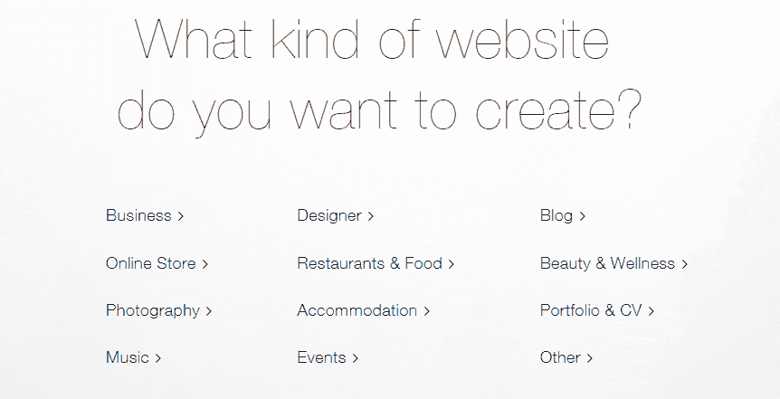

Choosing what type of Wix site to create

*我们将选择一个* ***餐厅*** *网站为例。*选择类型后，您可以从所有相关模板中进行选择:

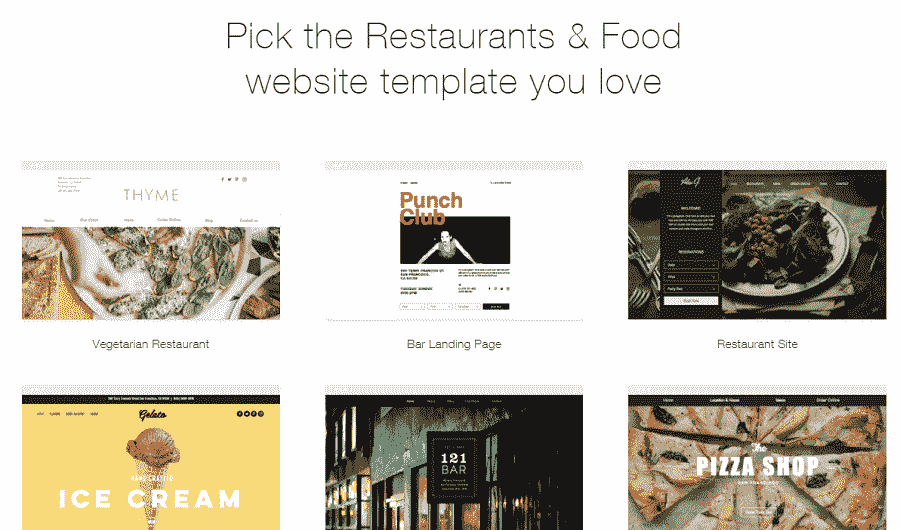

Picking a Wix template

一旦选择了模板，您就可以直接进入 Wix 编辑器，在这里您可以轻松地更改文本、图像等等:

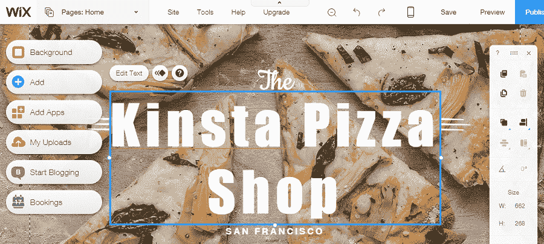

Editing your Wix template

一旦你完成了，你所要做的就是点击**发布**来激活你的网站。

整个过程很简单，对初学者来说无疑是容易的。假设您喜欢 Wix 的预建模板，并且不想过多地定制东西。

### WordPress

有了 Wix，你可以立即注册并开始编辑你的网站，而 WordPress 需要一些预备步骤。

在你开始之前，你需要注册虚拟主机并获得自己的域名。虽然这是一个额外的步骤，但现在大多数主持人都让这个过程变得相当轻松——所以你可能只需要增加大约 5-10 分钟就可以开始了。

一旦你安装了 WordPress(或者让[你的主机为你安装 WordPress](https://kinsta.com/help/new-site/))，你就可以选择一个“主题”来控制你的网站的外观了:

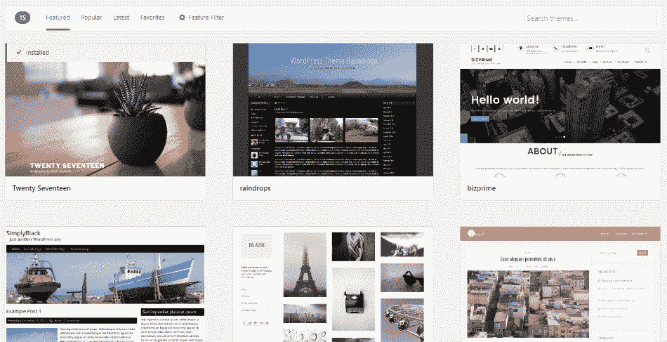

Choosing a WordPress theme

你可以找到免费和付费的主题，有些主题还包括“演示”内容，就像 Wix 一样，你只需要编辑预先填充的内容，而不是从头开始创建你的网站。

虽然 WordPress 不像 Wix 那么简单，但对于非开发人员来说，使用 WordPress 创建一个实用、美观的网站还是相当容易的。

## 你对网站的功能有多少控制力？

当 Wix 在易用性方面胜出时， **WordPress 在灵活性和定制化方面胜出**。

### 威克斯

如果你想增加 Wix 网站的功能，你将主要依赖于 [Wix 应用市场](https://www.wix.com/app-market/main):

## 注册订阅时事通讯

### 想知道我们是怎么让流量增长超过 1000%的吗？

加入 20，000 多名获得我们每周时事通讯和内部消息的人的行列吧！

[Subscribe Now](#newsletter)

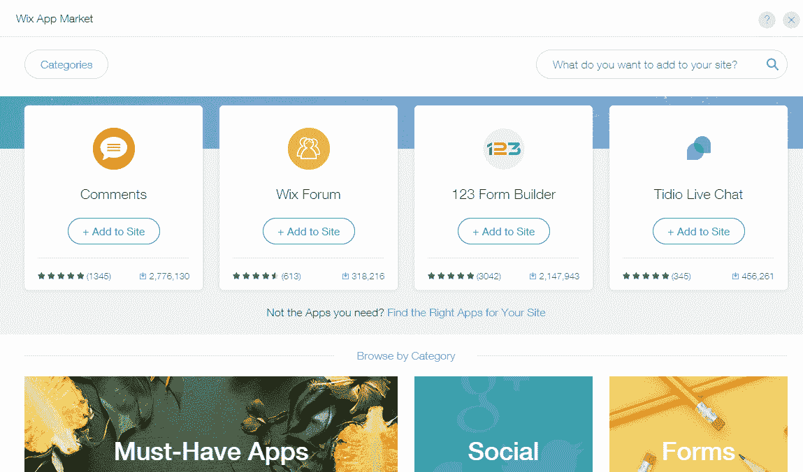

The Wix App Market

这个应用市场比 Squarespace 之类的东西给了你更多的灵活性，但仍然不能涵盖你能用 WordPress 做的所有事情。

目前，Wix 应用市场**总共只有 288 个应用**。正如你马上会看到的，这与 WordPress 相比就相形见绌了。

除此之外，在进行自己的代码调整(或者让开发人员为您进行代码调整)时，您也会受到严重的限制。

Wix 的*有点像*允许你添加定制代码，但是只能在有很多限制的“[沙盒 iFrame](https://support.wix.com/en/article/guidelines-and-limitations-of-the-html-code-and-embed-a-site-elements#html-code-limitations) 中。

### WordPress

有了 WordPress，你在这两方面都有更多的灵活性。

首先，让我们从插件开始。WordPress 插件允许你添加新的功能或者调整现有的功能，而不需要知道任何代码。目前，WordPress 有超过 53，000 个不同的免费插件，你可以在[安装](https://kinsta.com/knowledgebase/how-to-install-wordpress-plugins/)，还有数千个高级插件。

想把社交媒体整合到你的网站中吗？使用一个社交媒体插件。同样的还有[广告管理](https://kinsta.com/blog/wordpress-advertising-plugin/)、[联系表格](https://kinsta.com/blog/wordpress-contact-form-plugins/)、[小测验](https://kinsta.com/blog/wordpress-quiz-plugins/)、 [iframes](https://kinsta.com/blog/wordpress-iframe/) ，以及几乎所有你能想到的其他功能。

如果您想使用 Wix 编辑器轻松构建所有内容，您可以使用[多页面构建器插件](https://kinsta.com/blog/wordpress-page-builders/)中的一个:

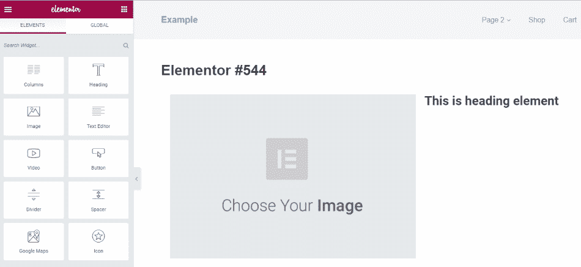

An example of a WordPress page builder

除此之外，你(或者一个开发者)可以自由地添加任何自定义代码到你的网站，这给了你更多的灵活性。与 Wix 不同，您不必应对任何代码限制。

## 每个平台如何处理电子商务？

Wix 确实提供了电子商务功能，但它不如 WooCommerce 或 WordPress 上的简易数字下载灵活。

### 威克斯

使用 Wix，您可以从预先构建的在线商店模板中进行选择，也可以将商店应用程序添加到现有模板中。例如，在下面的截图中，我们已经将商店应用程序添加到我们广受欢迎的 Kinsta 披萨店页面:

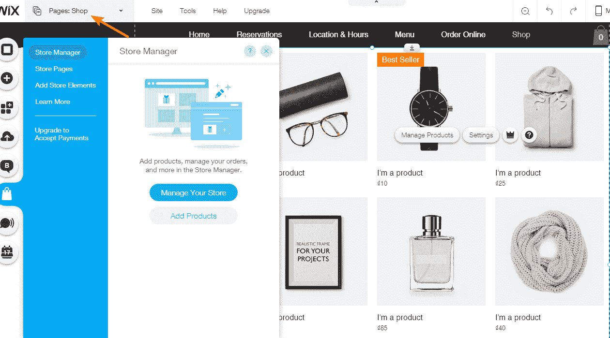

Wix ecommerce store management

然后，您可以通过弹出界面添加产品并管理您的商店:

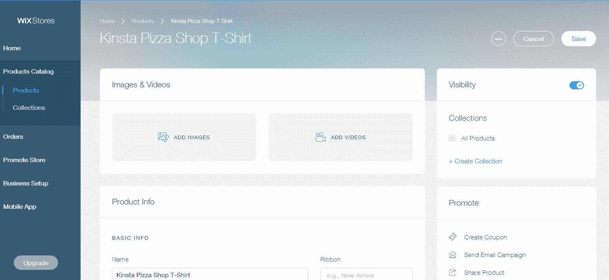

Managing ecommerce products in Wix

这对于简单的产品来说很好——但是除了简单的文本字段之外，您再次缺乏真正挖掘和定制您的产品信息的灵活性。

如果你只是卖一件 t 恤，Wix 可能没问题。但是对于可变的或定制的产品，您可能希望有更多的灵活性。

最后，Wix 的电子商务功能仅在他们的特殊商店计划中可用，这比常规的 Wix 网站要贵一点。

### WordPress

虽然 WordPress 主要被称为网站构建平台，但它实际上也是占主导地位的电子商务平台，WooCommerce [占所有电子商务网站的 42%](https://kinsta.com/wordpress-market-share/#woocommerce) ( *多数*)。

不过，使用 WordPress，你需要借助一个插件来添加电子商务功能。两个最常见的选项是:

*   [woo commerce](https://kinsta.com/learn/woocommerce-guide/)——以实物产品为主
*   [轻松数字下载](https://kinsta.com/blog/easy-digital-downloads/)——主要关注虚拟产品

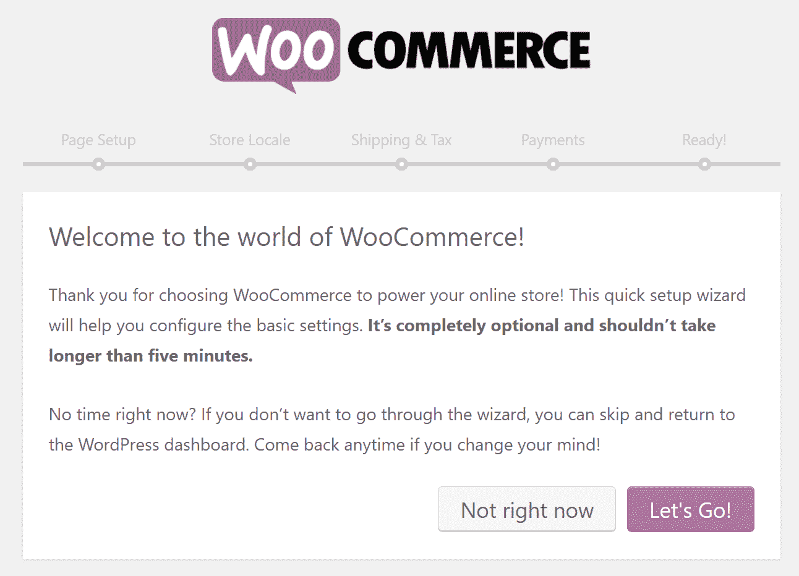

The WooCommerce setup wizard

随着每个基础电子商务插件，你也可以找到巨大的附加插件市场，以进一步扩展你的商店。就像普通的 WordPress 网站一样，这给了你展示产品、处理订单等等更多的灵活性。

例如，你甚至可以找到将 WooCommerce 与按需打印服务同步的插件，这样你就可以将订单履行外包给其他人。

当谈到电子商务和 Wix vs WordPress 时，灵活性的水平就是为什么 WordPress 通常是一个更好的电子商务平台。

## 每个平台上谁控制着你的数据？

虽然在短期内这可能不是新手的主要考虑因素，但数据所有权*应该*成为你最终决定的主要因素。对于数据所有权，我们的意思是:

*   你能下载一份你的内容吗？
*   你能轻松地将你的内容转移到另一个网站建设者那里吗？

就数据所有权而言，WordPress 是明显的赢家。差远了。

### 威克斯

如果你想知道为什么我们说它甚至不接近，这里是 Wix 关于数据所有权的声明，[直接来自它的知识库](https://support.wix.com/en/article/exporting-or-embedding-your-wix-site-elsewhere):

> 您的 Wix 网站及其所有内容完全托管在 Wix 的服务器上，不能转移到其他地方。
> 
> 具体来说，不能将使用 Wix 编辑器或 ADI 创建的文件、页面或网站导出或嵌入到另一个外部目的地或主机。

所以…是的。如果你担心数据所有权，这应该是一个很大的危险信号。

虽然有一些第三方工具提供了将 Wix 移植到 WordPress 的解决方案，但是 Wix 并没有给你一个简单的方法来自己完成这项工作。

### WordPress

有了 WordPress，你总是可以完全控制你所有的数据。你可以下载或操作你网站上 100%的数据，并且[导出/导入 WordPress 用户](https://kinsta.com/knowledgebase/wordpress-export-users/)，因为你控制了一切。

就像我们说的——差远了。

Struggling with downtime and WordPress problems? Kinsta is the hosting solution designed to save you time! [Check out our features](https://kinsta.com/features/)

## 每个平台如何处理日常维护？

虽然 Wix 的封闭生态系统对于数据所有权或灵活性来说不是很好，但主要的好处是它几乎消除了您处理维护和安全性的需要。

有了 WordPress，你要么需要自己处理这些事情，要么找一个托管的 WordPress 主机，比如 Kinsta，它强调安全性和维护。

### 威克斯

本节很短，因为您不需要用 Wix 做任何事情——Wix 会为您做所有的事情。您永远不需要担心更新或安全漏洞。

### WordPress

WordPress 的情况正好相反。也就是说，你负责的事情有:

*   安全性
*   更新软件
*   备份您的数据

不过，这并不一定意味着你需要自己做这些事情。你总是有这样的选择:

*   使用备份和[安全插件](https://kinsta.com/blog/wordpress-security/)
*   选择一个[托管的 WordPress 主机](https://kinsta.com/blog/managed-wordpress-hosting/)
*   雇佣一个 [WordPress 维护](https://kinsta.com/blog/wordpress-maintenance/%E2%80%8E)服务

## 每个平台多少钱？

Wix 提供简单的按月定价，这样你就可以随时知道你要付多少钱。有了 WordPress，事情就有点棘手了。至于哪个更便宜，没有正确的答案。总的来说，从长远来看，WordPress 网站可能会更便宜*，但是*(因为 Wix 的固定月费)。

### 威克斯

Wix 有两套月度计划，取决于你是否打算拥有一个电子商务商店。以下是常规 Wix 网站的价格:

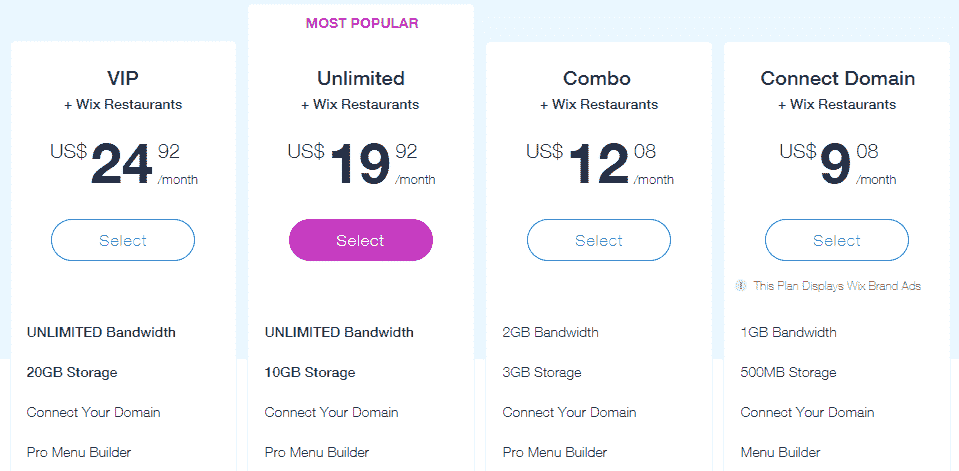

Wix regular website pricing

以下是 Wix 电子商务商店的定价:

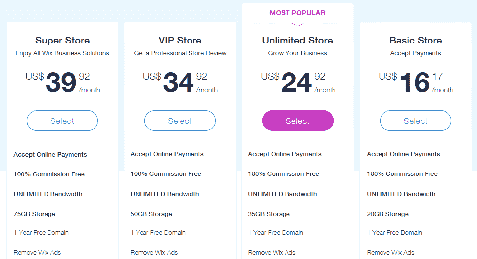

Wix ecommerce website pricing

还有一个免费的 Wix 计划，但你不能使用自己的域名，它会显示 Wix 广告。

### WordPress

有了 WordPress，只有两个不可避免的固定成本:

*   托管服务–[廉价的共享托管服务](https://kinsta.com/blog/cheap-wordpress-hosting/)可以低至每年 50 美元，而有质量管理的 WordPress 主机通常每月至少 30 美元。
*   **域名**–[通常每年 10 美元](https://kinsta.com/blog/how-much-does-a-domain-name-cost/)。

除此之外，你可能还想购买一些高级主题和/或插件。这些对于运行一个 WordPress 站点来说不是必须的，但是通常有更好的功能、支持和/或设计。

## 对于 SEO，两者孰优孰劣？

对于很多人来说，这是一个非常有争议的话题，因为一些人认为 Wix 更适合 SEO，而另一些人则认为 WordPress 更适合。然而，如果我们把它们都剥离回来，当谈到页面搜索引擎优化的基础时，它们都没有什么不同。两者都包括以下内容:

*   能够改变页面标题，[元描述](https://kinsta.com/blog/meta-description-wordpress/)，和 H1-H6 标签
*   可以生成更快更容易抓取的站点地图
*   您可以在两种平台上为图像添加 alt 标签
*   友好和简短的网址是标准
*   手机友好型
*   可以连接[谷歌搜索控制台](https://kinsta.com/blog/google-search-console/)、[必应站长工具](https://kinsta.com/blog/bing-webmaster-tools/)和[谷歌分析](https://kinsta.com/blog/google-analytics-wordpress/)等。

就离页搜索引擎优化而言，反向链接或社交信号并不真正关心你在什么类型的平台上。我们可以说 WordPress 在这个领域做得更好的一个地方是拥有更多控制权的能力。这包括网站速度和索引/抓取/屏蔽等高级选项。这些可以直接影响 SEO 和排名。

Ahrefs 发布了一项关于 [Wix vs WordPress SEO](https://ahrefs.com/blog/wix-seo/) 的研究。他们分析了 640 万个域名，发现 46.1%的 WordPress 网站获得了一些有机流量。相比之下，Wix 只有 1.4%的域名有有机流量。然而，由于许多因素，许多数据是不确定的。比如，也许更多的 SEO 工作只是在 WordPress 网站上完成，而不是 Wix。

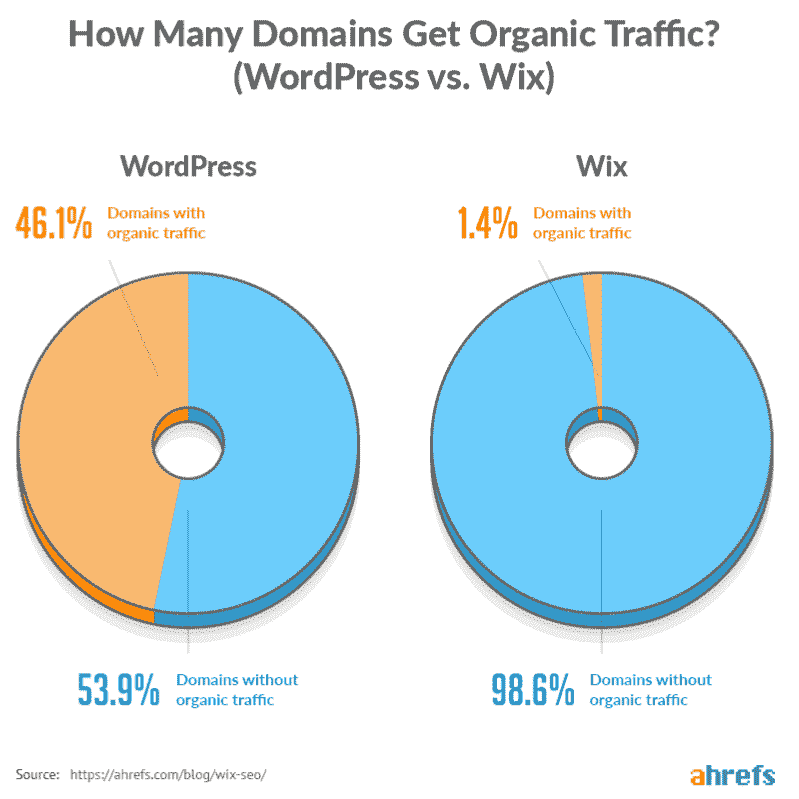

Wix vs WordPress SEO

无论哪种方式，对于 SEO 来说，重要的是不要太关注平台，而是关注你发布的内容的质量，在社交媒体上的推广，以及你建立的反向链接。毫无疑问，使用 WordPress，你有更多的控制权。

推荐阅读:[Weebly vs WordPress——哪个最适合你的网站？](https://kinsta.com/blog/weebly-vs-wordpress/)

## Wix vs WordPress:你该选哪个？

我们在这里的推荐感觉与我们的 [WordPress 和 Squarespace 帖子](https://kinsta.com/blog/squarespace-vs-wordpress/)的结论非常相似(*因为 Wix 在很多方面与 Squarespace 相似*)。

如果您只是想要一种简单的方法来创建一个基本的网站，而不关心完全的数据所有权或定制站点的灵活性，那么 Wix 可能是一个不错的解决方案。请记住，如果您决定以后需要更多的灵活性，那么从 Wix 中迁移出来将是一件痛苦的事情。

然而，对于大多数用户来说，WordPress 可能是最好的解决方案。原因如下:

*   虽然*不像*那样对初学者友好，**对大多数初学者来说仍然很容易掌握**，WordPress 社区继续使它变得更加容易。
*   由于 WordPress 庞大的插件生态系统，你可以更加灵活地为你的网站添加功能。
*   您总是**完全控制您的数据**并拥有完全的控制权/所有权。

现在轮到你们了——鉴于这个博客主要是关于 WordPress 的，我们有一个很好的猜测，你可能会在 Wix 和 WordPress 的光谱中处于什么位置。但是，我们仍然很想听听你的想法！

[Wix](https://www.wix.com/) 是 Wix.com 的注册商标。

* * *

让你所有的[应用程序](https://kinsta.com/application-hosting/)、[数据库](https://kinsta.com/database-hosting/)和 [WordPress 网站](https://kinsta.com/wordpress-hosting/)在线并在一个屋檐下。我们功能丰富的高性能云平台包括:

*   在 MyKinsta 仪表盘中轻松设置和管理
*   24/7 专家支持
*   最好的谷歌云平台硬件和网络，由 Kubernetes 提供最大的可扩展性
*   面向速度和安全性的企业级 Cloudflare 集成
*   全球受众覆盖全球多达 35 个数据中心和 275 多个 pop

在第一个月使用托管的[应用程序或托管](https://kinsta.com/application-hosting/)的[数据库，您可以享受 20 美元的优惠，亲自测试一下。探索我们的](https://kinsta.com/database-hosting/)[计划](https://kinsta.com/plans/)或[与销售人员交谈](https://kinsta.com/contact-us/)以找到最适合您的方式。