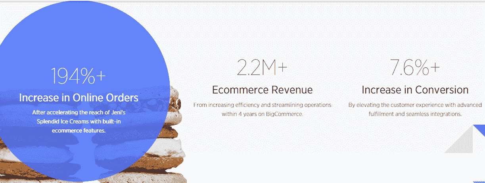
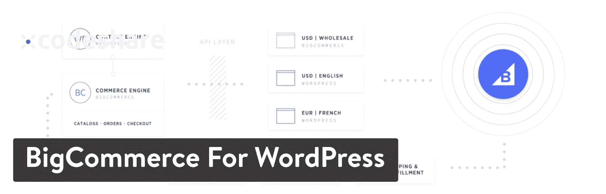
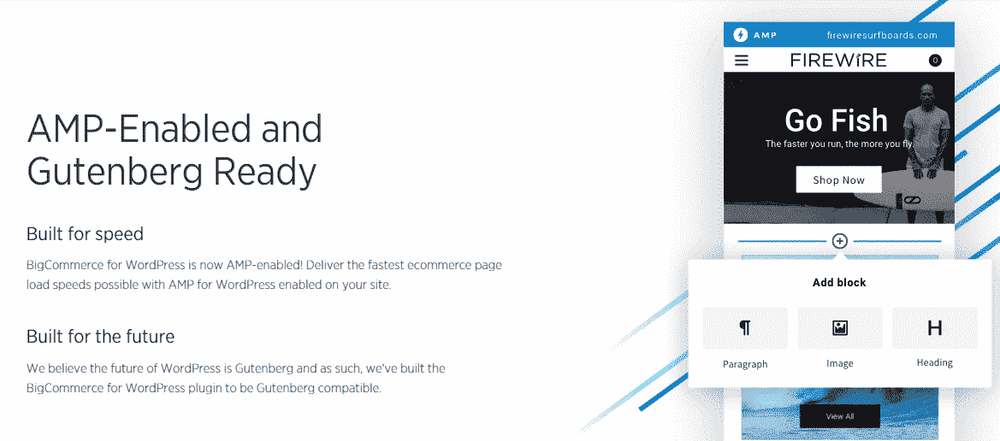
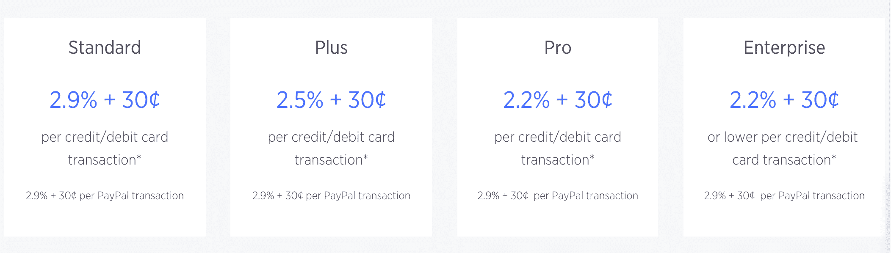
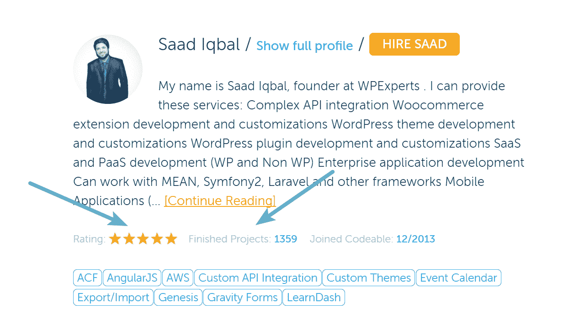
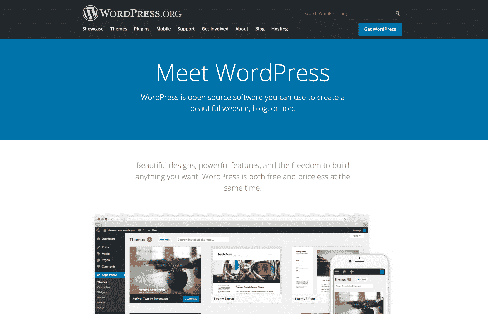
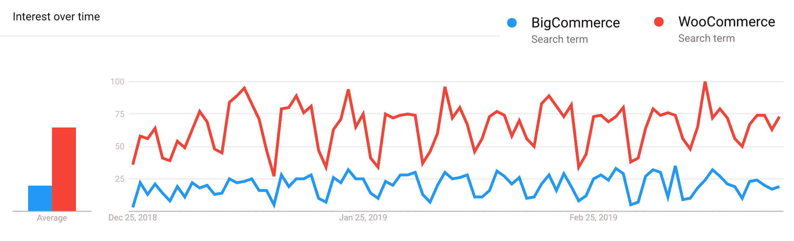

# 一种新的 WooCommerce 替代方案——你好，BigCommerce

> 原文:# t0]https://kinta . com/blog/woocommerce-alternative-bigcommerce/

WordPress 是世界上使用最广泛的内容管理系统。事实上，它为互联网上三分之一的网站供电。在过去，如果你想在你的网站中加入一个电子商务商店，最流行的选择通常是 WooCommerce。

当然，有很多 SaaS(软件即服务)[电子商务平台](https://kinsta.com/blog/ecommerce-platforms/)可供选择。但是设计会对你的内容和销售产生巨大的影响。选择一个基于 WordPress 的网站会给你更多的控制权(从代码到成千上万可用的主题和插件)。所以，如果你想两全其美(简单的内容管理和商务)，你别无选择，只能使用 WordPress 和 WooCommerce 这样的插件。

这种情况现在已经改变了。BigCommerce 推出了自己的 WordPress 插件，为市场带来了一些急需的竞争。但是，它为您的企业提供了更好的选择吗？请继续阅读，寻找答案。

*   [大商务概述](#bigcommerce-overview)
*   [大商务的优势](#advantages-bigcommerce)
*   [网络商务的优势](#advantages-woocommerce)
*   [哪个适合你](#which-one)

[There's a new headless option for WordPress Ecommerce sites: Hello BigCommerce! 👋Click to Tweet](https://twitter.com/intent/tweet?url=https%3A%2F%2Fkinsta.com%2Fblog%2Fwoocommerce-alternative-bigcommerce%2F&via=kinsta&text=There%27s+a+new+headless+option+for+WordPress+Ecommerce+sites%3A+Hello+BigCommerce%21+%F0%9F%91%8B&hashtags=ecommerce%2CWordPress)

## 大商务概述

BigCommerce 作为一个 SaaS 平台已经存在了一段时间(成立于 2009 年)。它是领先的电子商务网站建设者之一，尤其是成长型企业。

BigCommerce

他们的托管平台的最大吸引力之一是，你可以快速建立一个在线商店，它比其他平台具有更多内置功能。BigCommerce 拥有电子商务平台中最快的网站速度，一流的 SEO 和 URL 结构，以及安全、API 调用和支付网关功能。此外，该公司以其平稳高效地处理订单和交易的能力而闻名。

> 需要在这里大声喊出来。Kinsta 太神奇了，我用它做我的个人网站。支持是迅速和杰出的，他们的服务器是 WordPress 最快的。
> 
> <footer class="wp-block-kinsta-client-quote__footer">
> 
> 
> 
> <cite class="wp-block-kinsta-client-quote__cite">Phillip Stemann</cite></footer>

[View plans](https://kinsta.com/plans/)

然而，BigCommerce 处理电子商务商店所有后端技术方面的一个缺点是缺乏内容定制。该公司的 SaaS 平台在不直接关注交易的领域历史上并不出色，比如让你能够将博客附加到你的商业网站上。

然而，这一切都在改变。BigCommerce 早在 2018 年 6 月就推出了对其新 WordPress 插件的‘早期访问’,并于 2018 年 12 月正式推出该插件。

### WordPress 的 BigCommerce 一种新的 WooCommerce 选择

BigCommerce 与 WordPress 合作，推出了自己的 WordPress 插件，使用户能够将公司所有的电子商务功能与 WordPress 平台的开源灵活性结合起来。

BigCommerce for WordPress plugin

WordPress 的 BigCommerce 插件是一个全功能的集成。一款旨在让您快速扩展商店规模的产品。它通过在 BigCommerce SaaS 平台中保留大部分后端功能来做到这一点。

该功能包括:

*   目录管理
*   管理履行物流
*   处理付款
*   订单管理

不同的是，插件**允许你在前端**上继续使用 WordPress。因此，你可以使用它无限的定制选项以及数以千计的[主题](https://kinsta.com/blog/woocommerce-themes/)和[插件](https://kinsta.com/blog/woocommerce-plugins/)。

有了 WordPress 的强大功能，你现在可以设计一个吸引人的网站，无缝集成内容和购物。无论你的目标是开始一个新的博客，还是精心设计完美风格的产品描述，这个插件都能帮你实现。

一个有趣的事实。几年前，当 Shopify 推出他们自己的 [WordPress 插件](https://wordpress.org/plugins/shopify-ecommerce-shopping-cart/)时，他们尝试了同样的事情。然而，它现在已经被关闭了，他们为 WordPress 用户提供的唯一的东西就是增加一个按钮，没有集成。BigCommerce 会实现 Shopify 未能实现的目标吗？

## 大商业的优势

拥抱 WordPress 的力量和功能使 BigCommerce 能够向用户提供**“无头商务”**，将强大的后端商务引擎与最受欢迎的[内容管理系统](https://kinsta.com/knowledgebase/content-management-system/)相结合(建议阅读:[用 Gatsby 和 WordPress 建立网站简介](https://kinsta.com/blog/gatsby-wordpress/))。另外，它支持在同一个 URL 上显示内容、创建产品类别和进行销售，这是一个很好的新 SEO 策略。

Content and commerce

以下是 BigCommerce 创造的独特优势:

### 1.改进的可扩展性

BigCommerce 将其新插件设计为健壮的，并支持大型企业的可伸缩性。它通过三种方式做到了这一点:

1.  该公司在自己的插件中包含了许多标准的电子商务功能。因此，不需要安装额外的插件来降低网站速度。
2.  它保留了 WordPress 之外的大部分后端元素，因此它们不会占用平台空间，也不会对网站速度产生负面影响。
3.  BigCommerce 设计这个插件是为了让你建立多个 WordPress 商店。您仍然可以从一个控制面板控制它们。

BigCommerce 建立了它的 SaaS 平台，重点是能够方便地容纳大型企业。该公司确保其新的 WordPress 插件保持了处理大量流量的能力。以及高阶体积。

该插件**还支持每个产品多达 600 个 SKUs】，并支持创建复杂的目录。它为创建完全定制的产品目录提供了 250 多个选项。**

### 2.增强的安全性

BigCommerce 插件保持了 SaaS 平台的所有安全特性。其中包括:

*   **PCI 合规性。**新的 BigCommerce 插件旨在提供嵌入式结账体验。这种体验代表您关注 PCI 合规性和客户安全性。例如，您不必担心信用卡数据的安全性，或者像加密或符合 PCI 规范的[收集签名](https://www.pandadoc.com/electronic-signature-software/)这样的项目。
*   保护用户帐户和登录。BigCommerce 为 WordPress 之外的客户提供安全的登录、账户和支付信息存储。此功能可以增强您的客户的安全感以及对其数据安全性的信心。
*   **集成支付网关。**big commerce 插件为您和您的客户提供对超过 65 种不同支付网关集成的即时访问，这些支付网关服务于 100 多个国家，支持超过 250 种本地支付方式。这不仅意味着大量的支付选择，还意味着你不必担心设置或维护这些安全的网关。

### 3.定制支持

WooCommerce 和 BigCommerce 都通过 WordPress 平台提供几乎无限的定制服务。然而，BigCommerce 设计了额外的功能，使定制过程更容易。

*   开箱即用的功能。BigCommerce 插件的设计目的是快速方便地将你所有的标准电子商务功能整合到任何现有的 WordPress 主题中，这样在启动你的新商店之前，几乎不需要预先定制和任何编码知识。它甚至支持新的[古腾堡块编辑器](https://kinsta.com/blog/gutenberg-wordpress-editor/)。
*   **AMP 优化。**该插件旨在支持产品和分类页面上的[加速移动页面](https://kinsta.com/blog/google-amp/)，以便您的网站更快地进行移动浏览和购物。
*   对关键插件文件的无限制访问:BigCommerce 插件还支持 WordPress 覆盖模板文件的标准方法，因此你可以修改任何开箱即用的设计，而不用担心丢失你的定制。换句话说，你可以定制你的集成产品卡、列表和购物车，而不用担心插件更新会撤销你的更改。
*   一个庞大的支持网络。BigCommerce 帮助其客户联系到其大型企业家和在线商店所有者在线社区，以便您可以讨论想法，向他人学习，并获得任何定制问题的答案。该公司还在积极寻求开发者来帮助改进应用程序并解决任何客户问题。

BigCommerce AMP and Gutenberg support

### 4.附加功能

作为最后一个优势，以下是 BigCommerce 在其插件中内置的几个有价值的特性:

## 注册订阅时事通讯

### 想知道我们是怎么让流量增长超过 1000%的吗？

加入 20，000 多名获得我们每周时事通讯和内部消息的人的行列吧！

[Subscribe Now](#newsletter)

1.  分析。BigCommerce 提供了关于您商店业绩的大量数据和有价值的分析。
2.  简化的全球运输。BigCommerce 还提供实时全球承运商报价，并支持大多数主要的全球快递公司。这使您能够访问免费送货、直运、统一费率等选项。此外，该公司刚刚发布了 BigCommerce 航运功能，使您可以轻松地以折扣价从主要承运商那里获得定制的实时运费。
3.  灵活的购物车。BigCommerce 的嵌入式购物车提供了广泛的定制选项，以便您可以在[完全响应的布局](https://kinsta.com/blog/responsive-web-design/)内提供企业级促销和折扣，而无需任何额外的扩展或插件(正在寻找扩展？看看这些[最好的 WooCommerce 扩展](https://kinsta.com/blog/woocommerce-extensions/)。
4.  更好的信用卡利率。BigCommerce 允许其所有客户获得预先协商好的信用卡费率。目前，这些是 SaaS 电子商务领域最低的费用。此外，您还可以从 BigCommerce 的 PayPal 优惠费率中获益。而且，随着您的业务增长，升级您的计划，您甚至可以获得更好的信用卡利率。

BigCommerce transaction fees

## 网络商务的优势

不可否认，BigCommerce 是一个电子商务插件的发电站。它强大、快速，可随时扩展您的业务。但是，这并不意味着网上商务对你的企业来说不是一个好的选择。

WooCommerce plugin

以下是这个插件必须提供的内容:

### 1.它是免费的

WooCommerce 最大的优势是可以用这个插件免费创建一个电子商务商店。是的，你需要投资 WordPress 托管主机(或者甚至专门的 WooCommerce 主机)。

你可能还需要购买多个支付网关和运输插件来匹配 BigCommerce 的功能，但是，如果你刚刚起步，产生的销售额较小，你可能可以通过 WooCommerce 节省资金。

如果你刚刚开始，区别在于可以选择一个免费的 WooCommerce 主题，插件本身也是免费的。相比之下，使用 BigCommerce 插件，你需要支付每月 29.95 美元的费用。

### 2.它得到了很好的支持

WooCommerce 是 WordPress 高度评价的公司，它拥有庞大的用户和支持者网络。事实上，大约 8%的电子商务商店和 21%的排名前 100 万的网站使用 WooCommerce。

Struggling with downtime and WordPress problems? Kinsta is the hosting solution designed to save you time! [Check out our features](https://kinsta.com/features/)

WooCommerce support

此外，许多 WooCommerce 主题、插件和产品的创造者 WooThemes 在 2015 年被 Automattic 收购。如果你不熟悉 Automattic，那就是运营 WordPress.com 并为 WordPress.org 做出贡献的公司。所以，这显示了这个插件是多么受支持。

### 3.用插件扩展功能

BigCommerce 提供了许多内置功能，对于非开发人员和不熟悉 WordPress 的人来说非常有吸引力。然而，仅仅因为 WooCommerce 没有内置这一功能并不意味着你不能获得它。例如，您可以[整合您自己的 CRMs](https://getvoip.com/blog/2018/01/04/crms-for-freelancers/) 、[支付网关](https://kinsta.com/blog/woocommerce-payment-gateways/)，并保持您自己的 PCI 合规性，尽管您最终将为此单独付费。

目前，WooCommerce 有数百个免费和优质插件可用，[旨在增强其核心功能](https://kinsta.com/learn/woocommerce-guide/)。如果你不喜欢自己定制网站，你可以[雇佣一个 WordPress 开发者](https://kinsta.com/blog/hire-wordpress-developer/)。有成千上万的开发者专门从事 WooCommerce 开发。

WooCommerce developer

## 哪一个适合你

这两个电子商务插件都提供了自己独特的优势，那么哪一个是你的企业的正确选择呢？

因为这两个选项都可以支持无限制的定制，并且可以根据您的需要定制，所以最终的决定是决定哪一个对您更重要:

*   一个易于扩展的解决方案，附带大量开箱即用的功能，并提供一些独特的额外功能？
*   或者是一个目前使用更广泛，如果你刚刚起步可能更便宜的？

底线是，这两个插件都允许你[利用 WordPress](https://wisemerchant.com/setup-online-store) 的力量，将最好的内容管理系统与你的商务活动相结合，从而获得巨大的成功。

Power of WordPress

此外，对于大型企业，速度是一个考虑因素。BigCommerce 的一个关键优势是它能够在 WordPress 之外托管很多后端元素。如果你有一个广泛的目录，并经历了大量的同步交易，这就更容易保持快速的网站速度。

由于许多电子商务功能被嵌入到 BigCommerce 插件中，它还可以**最小化你的 WordPress 站点上活跃插件的数量**。这减少了你需要更新和监控的插件数量，并且可以积极影响你的[网站的速度](https://kinsta.com/learn/speed-up-wordpress/)，这反过来可以提高你的 SEO。

为了理解搜索排名的重要性，看看这个[电子商务 SEO 统计数据](https://www.lyfemarketing.com/ecommerce-seo/):在谷歌排名靠前的页面占据了高达 36.4%的搜索流量。你的排名越靠后，你看到的流量就越少。

BigCommerce 还减少了网站维护所需的时间，因为该公司会为您处理许多方面，如 PCI 合规性、支付网关和客户安全。另外，如果你不能自己维护你的 WordPress 网站，那么问题就变成了:订阅 BigCommerce 还是雇佣一个开发者更划算。

底线是，除非你是一个非常精明的开发者，或者你的业务还没有大到足以支持 BigCommerce 的成本，否则新的 BigCommerce 插件可能是你的在线商店的更好选择。

## 摘要

谷歌趋势显示，WooCommerce 仍然比 BigCommerce 更受欢迎，但随着 BigCommerce WordPress 插件的知名度增加，这种趋势可能会改变。对于消费者来说，有更多的竞争和选择总是好的。

Google trends – BigCommerce vs WooCommerce

WooCommerce 作为 WordPress 插件已经存在了很长时间，并获得了强大的社区和支持网络。此外，WooCommerce 网站的最低成本对新企业和小企业非常有吸引力。

然而，BigCommerce 插件绝对是一个非常全面的电子商务产品。显然，它的设计考虑了可伸缩性和易用性。该公司将 SaaS 平台的力量与 WordPress 的无限定制相结合的能力，可能会改变电子商务市场的游戏规则。

BigCommerce 提供了比竞争对手更大的价值，特别是如果你正在经历显著的增长，或者有大量的产品和交易。

[BigCommerce is a new WooCommerce alternative. For WordPress users, competition and more options is a win-win! 👌Click to Tweet](https://twitter.com/intent/tweet?url=https%3A%2F%2Fkinsta.com%2Fblog%2Fwoocommerce-alternative-bigcommerce%2F&via=kinsta&text=BigCommerce+is+a+new+WooCommerce+alternative.+For+WordPress+users%2C+competition+and+more+options+is+a+win-win%21+%F0%9F%91%8C&hashtags=ecommerce%2CWordPress)

你会为你的电子商务商店选择哪个插件，为什么？请在下面的评论中告诉我们！

* * *

让你所有的[应用程序](https://kinsta.com/application-hosting/)、[数据库](https://kinsta.com/database-hosting/)和 [WordPress 网站](https://kinsta.com/wordpress-hosting/)在线并在一个屋檐下。我们功能丰富的高性能云平台包括:

*   在 MyKinsta 仪表盘中轻松设置和管理
*   24/7 专家支持
*   最好的谷歌云平台硬件和网络，由 Kubernetes 提供最大的可扩展性
*   面向速度和安全性的企业级 Cloudflare 集成
*   全球受众覆盖全球多达 35 个数据中心和 275 多个 pop

在第一个月使用托管的[应用程序或托管](https://kinsta.com/application-hosting/)的[数据库，您可以享受 20 美元的优惠，亲自测试一下。探索我们的](https://kinsta.com/database-hosting/)[计划](https://kinsta.com/plans/)或[与销售人员交谈](https://kinsta.com/contact-us/)以找到最适合您的方式。