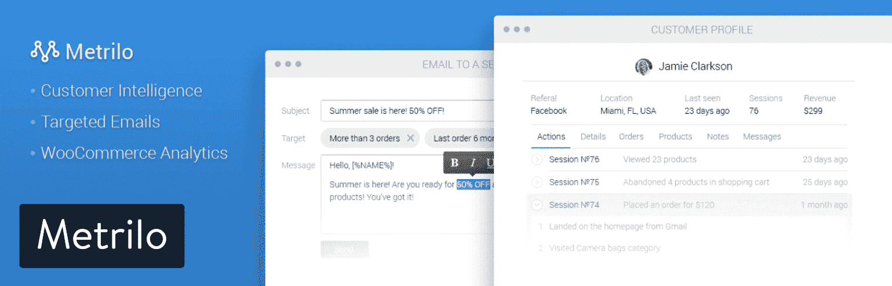
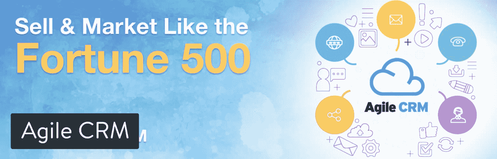
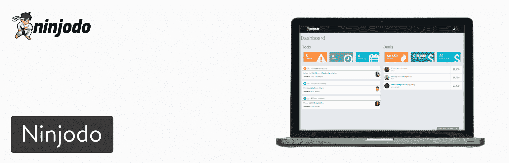
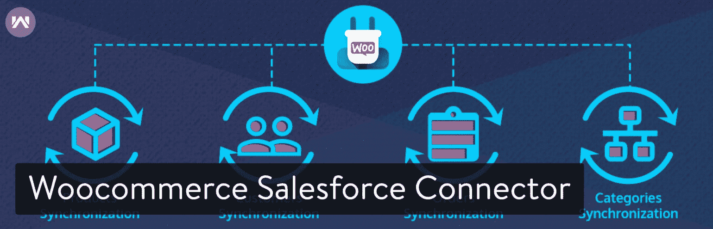
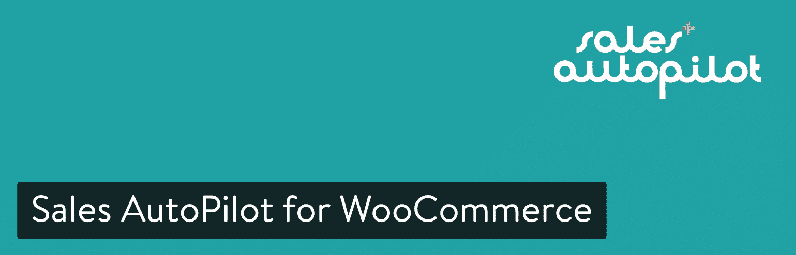
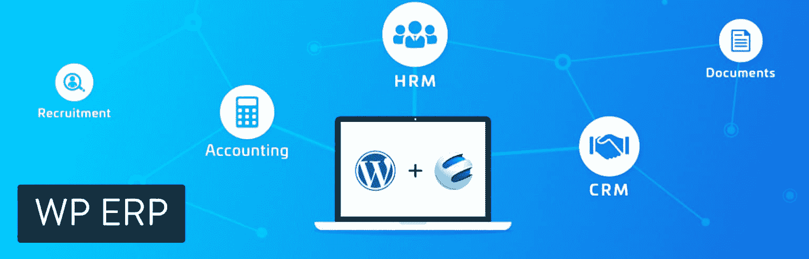
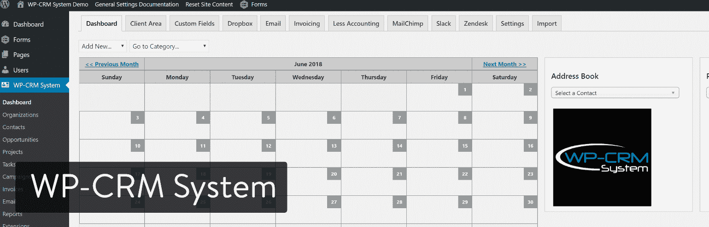
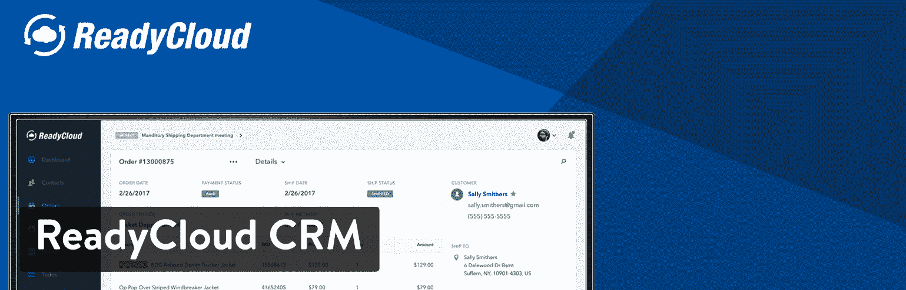
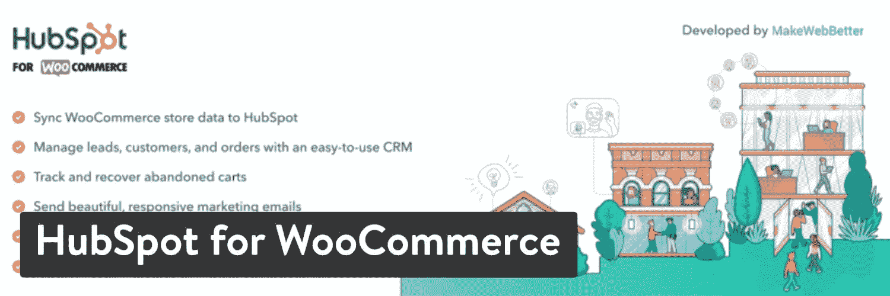

# 高效 WordPress 商店的 10 个最佳 WooCommerce CRM 选项

> 原文：<https://kinsta.com/blog/woocommerce-crm/>

客户关系管理软件有各种形状和大小。有些是为小企业设计的，而有些则为大公司处理数百万份合同。

然后，我们有电子商务客户关系管理系统，考虑到访问网站、购买产品和寻求支持的客户数量，这可能是最重要的一种。当然，像 Salesforce 或 Pipedrive 这样的 CRM 在技术上可以适用于所有类型的企业。但是，WooCommerce CRM 如何同步 WooCommerce 中的客户、产品、订单和其他项目的数据呢？

如果你正在使用 WooCommerce，或者打算迈出这一步，你必须有一种在专业水平上与客户沟通和管理客户的方法。WooCommerce CRM 就是实现这一目标的方法。

请记住，你的最终目标是增加商店的收入。所以一定要下载我们的免费电子书**， [10 种提高你的网络商务产品页面转化率的方法](https://kinsta.com/ebooks/wordpress/ecommerce-conversion-rate/?utm_source=Blog&utm_medium=Link&utm_campaign=WooCommerce+Conversions+Ebook)。**

 **## 你为什么需要 WooCommerce CRM？

你需要 WooCommerce CRM 的主要原因是你需要你的常规 CRM 和 WooCommerce 插件之间的同步。否则，客户的信息会在 WooCommerce 中捕获，而不会放入 CRM 中。

我们下面概述的一些 WooCommerce CRMs 是独立的产品，而其他的则是常规(非 woo commerce)[CRM](https://kinsta.com/blog/wordpress-crm/)的集成。

无论如何，以下是你需要 WooCommerce/CRM 整合的一些原因:

*   查看每个客户更强大的统计数据，比如每个客户平均带来多少收入。
*   向客户发送电子邮件并提供支持。
*   标记交易。
*   以查看具体客户点了什么。
*   将客户记录与 WordPress 用户分开。
*   领导管理。

总的来说，WooCommerce CRM 将把大部分需要的信息放在一个仪表板上。你可以通过 WooCommerce 经营你的在线业务，让 CRM 做它应该做的事情，这使它成为 Shopify 和其他电子商务平台的一个很好的选择。

> 需要在这里大声喊出来。Kinsta 太神奇了，我用它做我的个人网站。支持是迅速和杰出的，他们的服务器是 WordPress 最快的。
> 
> <footer class="wp-block-kinsta-client-quote__footer">
> 
> 
> 
> <cite class="wp-block-kinsta-client-quote__cite">Phillip Stemann</cite></footer>

[View plans](https://kinsta.com/plans/)

## 2022 年最佳网络商务 CRM 解决方案

尽管我们建议查看下面完整的 CRM 评论，但如果你很着急，这里有一个推荐选项的快速列表。

1.  [米制](#metrilo)
2.  [敏捷 CRM](#agile-crm)
3.  [忍术](#ninjodo)
4.  【WordPress WooCommerce 的 Salesforce 连接器
5.  【WooCommerce 的销售自动驾驶仪
6.  [WP ERP](#wp-erp)
7.  [WP-CRM 系统](#wp-crm-system)
8.  [阅读循环 CRM](#readycloud-crm)
9.  【WooCommerce 的 HubSpot】
10.  [WooCommerce 与电子邮件平台的集成](#woocommerce-email-integrations)

### 1.Metrilo

Metrilo 是为数不多的专为 WooCommerce 定制的 CRM 之一。它旨在使你的 WooCommerce 分析顺利运行，没有任何痛苦的集成。有三个独立的计划提供不同的工具，每个都建立在前一个之上。任何计划对用户、流量、数据或电子邮件都没有限制。

*   **基本计划**——包括电子商务分析和仪表盘、产品洞察——每月 119 美元。
*   **Pro Plan**–基本计划+客户数据库，包含个人资料、留存分析、活动实时视图——199 美元。
*   **高级计划**–专业计划+电子邮件和客户反馈–299 美元。

Metrilo WooCommerce CRM plugin

Metrilo 的主要优势是将[电子邮件营销](https://kinsta.com/blog/email-marketing-best-practices/)和 CRM 结合起来。它基本上是一个管理和优化你所有电子商务营销的中心。Metrilo 显然集成了 WooCommerce，但你也可以选择将其连接到 Shopify 或 [Magento](https://kinsta.com/blog/magento-vs-woocommerce/) 。

#### 这个 WooCommerce CRM 是如何脱颖而出的？

*   Metrilo 支持 WooCommerce 和其他一些电子商务程序。
*   你可以在一个地方管理你的客户，发送电子邮件，并[检查你的分析](https://kinsta.com/blog/google-analytics-wordpress/)。
*   Metrilo CRM 可捕捉所有访客，并允许产品互动、[弃车](https://kinsta.com/blog/shopping-cart-abandonment/)、客户细分和一对一电子邮件。
*   电子商务电子邮件营销模块包括自定义域、自动化、个性化电子邮件和细分的选项。
*   电子商务分析区有收入分析、产品性能、保留分析、预设销售渠道和订单状态。

### 2.敏捷 CRM

敏捷 CRM 可以集成到任何电子商务平台或网站中，但它有一个针对 WooCommerce 的特定产品。WooCommerce 系统包括用于客户管理、智能工作流程、web 参与等的工具。

关于敏捷最好的消息是，它是市场上最强大的 CRM 之一，但是你可以免费试用它。该公司为多达 10 名用户提供免费计划，因此从技术上讲，如果用户没有超过这个数字，一个较小的组织可能最终什么都不会支付。

Agile CRM plugin

之后的定价还是挺实惠的。入门包每月 8.99 美元，而最受欢迎的选项是 29.99 美元。CRM 分为四个部分:销售、营销、服务和附加服务。因此，您会收到诸如销售计划中的自定义数据字段和线索评分、营销系统中的电子邮件活动和表单生成器、服务部分的帮助台，以及通过 extras 模块的 50 多个插件和集成。

#### 这个 WooCommerce CRM 是如何脱颖而出的？

*   Agile 为多达 10 个用户提供免费的价格计划。
*   甚至保费计划也是负担得起的。
*   敏捷将大部分营销和 CRM 需求整合到一个系统中。这包括销售、营销、服务和附加服务。
*   服务台是敏捷特有的，它允许固定的响应、组、标签和报告。
*   所有计划都有电子邮件和电话支持。
*   CRM 集成了 Google、Shopify 和 Stripe 等应用程序。
*   Agile 有一个 Chrome 扩展，可以让您在浏览器中更轻松地完成这个过程。
*   营销部分比列表中的大多数 CRM 更强大，有电子邮件模板生成器、登录页面生成器、营销自动化和社交媒体监控。

### 3.宁乔多

Ninjodo 是为小型团队和企业家开发的，它提供了一个干净、集中的 CRM，没有任何混乱、杂乱或庞大的程序。该软件旨在增加您的销售，管理您的联系人，简化电子邮件，并让您有组织。

该公司出售三种定价方案，其中最便宜的是每月 49 美元。14 天的免费试用期让你可以测试系统，但在那之后，你将被激活参加第一阶段计划，该计划支持多达 5000 个联系人和 5 个用户。

Ninjodo

Ninjodo 计划的有趣之处在于，它们被称为第一阶段、第二阶段和第三阶段，旨在展示你的企业应该如何利用 Ninjodo 取得进展。因此，它希望您在第一阶段达到 10 万美元的收入目标，在第二阶段达到 30-50 万美元，在第三阶段超过 100 万美元。

#### 这个 WooCommerce CRM 是如何脱颖而出的？

*   每个计划都包括电子邮件模板、客户参与表和销售线索捕获表。
*   Ninjodo 以其令人印象深刻的操作视频、实时聊天支持和分步指南而闻名。
*   Ninjodo 是 WooCommerce 最简单的 CRM 之一。它是现代和干净的，而不是充满了成千上万的功能。
*   从 WooCommerce 自动同步您的客户和订单。您可以跟踪交付工作流程并实时查看订单。
*   Ninjodo 还可以与 Xero Accounting、Google Drive 和 MondoTalk 很好地集成。
*   从移动应用程序管理您的整个 CRM。这款应用不仅看起来容易理解，而且所有内容都显示在一个页面上。

### 4.WordPress WooCommerce 的 Salesforce 连接器

WooCommerce 的 Salesforce 连接器插件售价 199 美元，这是一次性费用。但是，您可以注册额外的支持期，这将提高您的价格。如果你不想自己完成这个过程，甚至还有安装费。

这个 WooCommerce CRM 的全部意义在于将 Salesforce 连接到 WooCommerce。最基本的是，CRM 将所有 WooCommerce 产品和客户与 Salesforce 同步。您也可以反其道而行之，将任何 Salesforce 订单和产品发送到 WooCommerce。

WooCommerce Salesforce connector

该插件支持 Salesforce 的所有版本，因此无论您是专业版、开发者版、无限版还是企业版都没有关系。在很大程度上，这个 CRM 似乎可以实时同步你所有的项目。它在需要时处理批量数据，如果需要，您始终可以选择禁用实时订单同步。

#### 这个 WooCommerce CRM 是如何脱颖而出的？

*   顾客对开发商的支持赞不绝口。
*   它在最流行的电子商务 WordPress 插件和最流行的 CRM 之间架起了一座桥梁。
*   订单的同步发生在结账时。
*   这种整合提供了在 Salesforce 中创建目标客户群的机会，所有这些都基于 WooCommerce 的数据。
*   Salesforce Connector 利用云计算服务，为您的组织激活全球网络。

### 5.WooCommerce 的销售自动驾驶仪

[WooCommerce 的销售自动驾驶](https://wordpress.org/plugins/woocommerce-for-salesautopilot/)是另一种情况，其中独立的 CRM 具有与 woo commerce 集成的内置技术。因此，如果你已经在使用销售自动驾驶，或者如果你想选择一个全新的 CRM，肯定会与 WooCommerce 一起工作，这种组合是有意义的。

## 注册订阅时事通讯

### 想知道我们是怎么让流量增长超过 1000%的吗？

加入 20，000 多名获得我们每周时事通讯和内部消息的人的行列吧！

[Subscribe Now](#newsletter)

对于更高级的 CRM 来说，每月 14 美元的价格并不是那么糟糕。当然，这完全取决于你的邮件列表大小。例如，一份 750，000 的电子邮件列表至少需要 1，598 美元。所以，销售自动驾驶支持所有类型的公司。不管你是在经营一家大公司还是一家小公司，销售自动驾驶仪都有适合你的东西。

Sales Autopilot for WooCommerce

主要功能包括 CRM，电子商务，服务台模块，会员跟踪和基本的电子邮件营销等项目。登陆页面是从你的广告中链接出来的漂亮页面。如果你想获取客户的手机号码，并向他们发送某些促销信息，你也可以选择短信营销。

#### 这个 WooCommerce CRM 是如何脱颖而出的？

*   它有几个你在其他客户关系管理系统中看不到的营销工具。以短信营销和代销商跟踪为例。
*   Sales AutoPilot 为[提供了一个工具，使会员网站](https://kinsta.com/blog/wordpress-membership-plugins/)具有不同的访问级别，一个密码提醒功能，并完全集成到您的营销系统中。
*   它提供了一系列令人难以置信的定价选项，支持大型和小型企业。这也确保了你不会付出太多或者没有得到合适的功能。
*   WooCommerce 集成只需要你从 Sales AutoPilot 中复制一个代码，并把它放入 WooCommerce。
*   Sales AutoPilot 包括一个独特的支付解决方案，用于从您的客户在线收取付款。因此，即使是非电子商务网站也可以利用在线销售。
*   销售自动驾驶仪还集成了一些流行的计费软件。

### 6.WP ERP

WP ERP 是一个免费的插件，它将小型和大型企业与 CRM、HRM 和会计解决方案结合在一起。它目前有超过 7，000 个活跃安装，并获得了令人印象深刻的 4.5 分(五星评级)。他们的 WooCommerce premium 集成成本为 99.00 美元。它可以让你同步你的 WooCommerce 订单细节和客户数据，并允许你的 CRM 代理跟踪你的销售。

WP ERP plugin

这个 WordPress CRM 插件由不同的模块组成，一个用于 CRM 功能，另一个用于人力资源管理和会计解决方案。它们没有任何限制，你可以在所有的模块中创建任意多的条目。

#### 这个 WooCommerce CRM 是如何脱颖而出的？

*   支持 44 种货币。
*   从您的 CRM 和会计模块查看 WooCommerce 完成的所有订单和交易。
*   自动将新注册的客户导出到 CRM 联系人列表和会计客户列表。
*   基于 22 个以上的重要过滤器对客户进行细分，从而创建动态客户列表。保存这些列表，以便发送电子邮件和时事通讯。
*   允许你的 CRM 代理跟踪 WooCommerce 订单。
*   过滤掉购买了一定数量、少于一定数量或多于一定数量的客户。
*   允许您的 CRM 代理从联系人的个人资料中查看客户日志，其中包含客户在您的网站上执行的所有操作。

### 7.WP-CRM 系统

WP-CRM 系统是一个免费的 WordPress CRM 插件，可以让你轻松管理你的客户、项目和任务。它还有西班牙语、俄语和波兰语版本。你可以用 WooCommerce 的高级 WooCommerce Connect 扩展来连接它，该扩展包含在他们 199 美元的包中。

Struggling with downtime and WordPress problems? Kinsta is the hosting solution designed to save you time! [Check out our features](https://kinsta.com/features/)

WP-CRM System plugin

WP-CRM 系统允许你拥有无限数量的记录，并让你给你公司的每个人访问 CRM 中的数据。

#### 这个 WooCommerce CRM 是如何脱颖而出的？

*   让所有客户的订单信息触手可及。
*   开发者对这个 CRM 的支持是惊人的，并且在 WordPress 社区中脱颖而出。
*   从联系人记录中轻松查看每个联系人的订单历史记录。
*   WooCommerce Connect 扩展将自动在 WP-CRM 系统中创建一个新的联系人，如果客户购买了一个不存在的名字。
*   如果客户在结账时输入公司名称，也会自动创建新的组织。
*   您可以根据联系人的记录快速创建新订单。

还有一些高级扩展来进一步扩展 CRM，如电子邮件通知、客户区、Slack 通知、表单集成、Zendesk 集成、自定义字段、发票，甚至与您的 MailChimp 列表同步。

### 8.readycloud crm

[ReadyCloud CRM](https://www.readycloud.com/lp/woocommerce-crm-software) 是当今电子商务世界中客户忠诚度和销售额的火箭燃料。ReadyCloud 是一款跨渠道电子商务 CRM 解决方案，具有强大的客户订单时间表，包括运输和退货信息、发票和跟踪号码、备注、小组日历、标签、电子邮件营销集成、详细报告、任务和团队管理、运输盈利报告等。

ReadyCloud CRM

没有插件安装或膨胀添加到您的网站代码。没有需要担心的更新。ReadyCloud WooCommerce CRM 软件通过 API 与您的 WooCommerce 商店进行通信，保持您的网站快速敏捷。这是你的 WooCommerce 世界的 CRM。

每个月都有新功能加入！立即开始为期两周的免费试用，无需信用卡。试用后的费用是每个用户每月 24 美元。

#### 这个 WooCommerce CRM 是如何脱颖而出的？

*   你在 WooCommerce 仪表盘上找不到的详细报告。
*   你的 WordPress 站点没有开销。所有这些都通过 REST API 来处理。
*   使用 Premium ReadyShipper 和 ReadyReturns 插件添加多载波运输和退货。
*   它是跨渠道的，这意味着它也连接到易贝和亚马逊等平台。
*   有邮件集成的 MailChimp，不断接触等。
*   创建任务、事件、查看联系人、记笔记等等！

### 9.网络商务中心

[HubSpot for woo commerce](https://wordpress.org/plugins/makewebbetter-hubspot-for-woocommerce/)是一种将 [HubSpot 的 CRM](https://kinsta.com/blog/wordpress-crm/#hubspot) 与您的 [WooCommerce 商店](https://kinsta.com/blog/woocommerce-plugins/)连接起来的快捷方式。

HubSpot for WooCommerce WordPress plugin

这意味着你可以自动将你的 WooCommerce 用户、订单和产品同步到 HubSpot 的 CRM，并利用该平台上的许多营销和销售工具。

有趣的是，从您的商店跟踪[弃车](https://kinsta.com/blog/shopping-cart-abandonment/)的可能性，使用智能规则将联系人划分到[电子邮件列表](https://kinsta.com/blog/how-to-build-an-email-list/)中，使您的跟进更有力(了解更多关于[弃车电子邮件](https://kinsta.com/blog/abandoned-cart-email/))。

该插件附带 7 个现成的电子商务报告，通过分析您的数据、[网站流量](https://kinsta.com/blog/how-to-drive-traffic-to-your-website/)、市场趋势、客户行为等，帮助您做出更好的决策。

#### 这个 WooCommerce CRM 是如何脱颖而出的？

*   在 HubSpot 的 CRM 中自动同步实时 WooCommerce 用户、订单和产品(无限用户)
*   您可以根据各种条件创建列表，以便更好地管理和组织您的联系人。当新的联系人添加到系统中时，列表会自动更新。
*   建立[广告活动](https://kinsta.com/blog/how-to-use-google-adwords/)通过网络接触你的客户
*   跟踪和回收客户废弃的购物车。
*   创建关于您的客户和订单的深入报告，以跟踪您的业务增长。

### 10.WooCommerce 电子邮件与电子邮件平台的集成

许多电子邮件营销平台都有集成功能，可以帮助你将 WooCommerce 商店转变为基本的 CRM。对于那些已经在使用 MailChimp 或 Active Campaign 等热门提供商的人来说，这些非常有意义。你可以用 WooCommerce 建立自己的电子商务商店，同时还可以通过电子邮件营销软件的表格和自动化来收集和细分客户信息。

*   WooCommerce 的 MailChimp】
*   [WooCommerce +滴滴](https://woocommerce.com/products/woocommerce-drip/)
*   [ActiveCampaign WooCommerce 整合](https://www.activecampaign.com/apps/woocommerce)
*   [Aweber WooCommerce 整合](https://help.aweber.com/hc/en-us/articles/204032156-How-do-I-integrate-WooCommerce-with-AWeber-)
*   [GetResponse WooCommerce 集成](https://www.getresponse.com/integrations/woocommerce.html)

## 哪款 WooCommerce CRM 最适合你？

CRM 市场是一个拥挤的市场，但这并不意味着它应该是混乱的。希望有了这个 WooCommerce CRM 选项列表，你可以缩小搜索范围，发现实际上会与 WooCommerce 同步的 CRM，使你的电子商务业务更有效地运行。顺便说一句。不要忘记插件会对网站性能产生很大的影响。我们有一份内容广泛的指南，里面有 17 条关于如何加快电子商务发展的建议。

由于 12 个列表仍然让你做出一些决定，我们想打破一些情况下，你可能会选择一个 WooCommerce 客户关系管理。

*   metrilo——如果您想通过 CRM 进行出色的电子邮件营销，这是一个很好的选择。
*   敏捷 CRM——非常适合需要最多 10 个用户的免费计划的公司。小型企业应该认真研究敏捷 CRM。
*   Ninjodo 或 WP ERP 最适合小型企业。他们有漂亮的界面。
*   Salesforce Connector for WordPress woo commerce–如果您计划使用或正在使用 sales force 作为您的 CRM，请使用此工具。
*   ready cloud CRM——如果你想把工作从你的 WooCommerce 网站上卸下来，并利用其他跨渠道 WooCommerce 集成，这是一个很好的选择。
*   WooCommerce 的销售自动导航——这款 WooCommerce CRM 拥有最灵活的定价方案。因此，如果你想避免支付太多的钱，但也希望足够的支持和功能，销售自动驾驶仪是值得一看。

如果你对最好的 WooCommerce CRMs 有任何想法或问题，请在下面的评论中告诉我们！

* * *

让你所有的[应用程序](https://kinsta.com/application-hosting/)、[数据库](https://kinsta.com/database-hosting/)和 [WordPress 网站](https://kinsta.com/wordpress-hosting/)在线并在一个屋檐下。我们功能丰富的高性能云平台包括:

*   在 MyKinsta 仪表盘中轻松设置和管理
*   24/7 专家支持
*   最好的谷歌云平台硬件和网络，由 Kubernetes 提供最大的可扩展性
*   面向速度和安全性的企业级 Cloudflare 集成
*   全球受众覆盖全球多达 35 个数据中心和 275 多个 pop

在第一个月使用托管的[应用程序或托管](https://kinsta.com/application-hosting/)的[数据库，您可以享受 20 美元的优惠，亲自测试一下。探索我们的](https://kinsta.com/database-hosting/)[计划](https://kinsta.com/plans/)或[与销售人员交谈](https://kinsta.com/contact-us/)以找到最适合您的方式。**