# 35 个最佳 WooCommerce 扩展来增强您的在线商店

> 原文:# t0]https://kinta . com/blog/woocommerce-extensions/

大家都知道 WooCommerce。它是 WordPress 上最大和最受欢迎的电子商务平台，因为它的免费定价、丰富的功能列表和巨大的可扩展性。如果你打算开一家电子商务商店，WooCommerce 可能是你下载的第一个插件。

它已经免费提供了相当多的功能，甚至没有降低你的销售额。但是它包含的元素是通用的，适合大多数网站。如果你想创建一个具有独特功能的专卖店，你需要 WooCommerce 扩展。

扩展可以帮助你定制平台来满足你的需求，有成千上万的扩展，基本上可以添加你能想到的任何功能。

想试试吗？

我们将向您展示在哪里可以找到最好的 WooCommerce 扩展，以及如何在您的网站上安装它们。

请记住，你的最终目标是增加商店的收入。所以一定要下载我们的免费电子书**， [10 种提高你的网络商务产品页面转化率的方法](https://kinsta.com/ebooks/wordpress/ecommerce-conversion-rate/?utm_source=Blog&utm_medium=Link&utm_campaign=WooCommerce+Conversions+Ebook)。**

 **## 什么是 WooCommerce？

Image source: [WooCommerce](https://wordpress.org/plugins/woocommerce/)

默认情况下，WordPress 不提供任何销售产品或建立功能性在线商店的方式。许多[电子商务插件](https://kinsta.com/blog/wordpress-ecommerce-plugins/)被创造出来以纠正这一点，但是 WooCommerce 在受欢迎程度方面已经上升到了首位。

> 需要在这里大声喊出来。Kinsta 太神奇了，我用它做我的个人网站。支持是迅速和杰出的，他们的服务器是 WordPress 最快的。
> 
> <footer class="wp-block-kinsta-client-quote__footer">
> 
> 
> 
> <cite class="wp-block-kinsta-client-quote__cite">Phillip Stemann</cite></footer>

[View plans](https://kinsta.com/plans/)

WooCommerce 是一个免费的开源电子商务平台，让你在 WordPress 中销售产品。你可以销售物理和数字产品，它很容易使用扩展模块，它完全兼容大多数主题。

而且没有任何附加条件。它的核心是完全免费的，没有产品限制。有了它的所有特性，难怪 500 万个大大小小的商店都用它作为他们的后台。你可以[从 WordPress 的官方插件库中下载 WooCommerce](https://wordpress.org/plugins/woocommerce/) ，并按照我们的指南在[上设置它](https://kinsta.com/blog/woocommerce-tutorial/)。

但是 WooCommerce 怎么赚钱呢？

虽然所有必要的功能都是免费的，但他们出售高级主题和扩展，许多第三方开发者也创建了自己的 WooCommerce 扩展。

## 什么是 WooCommerce 扩展？

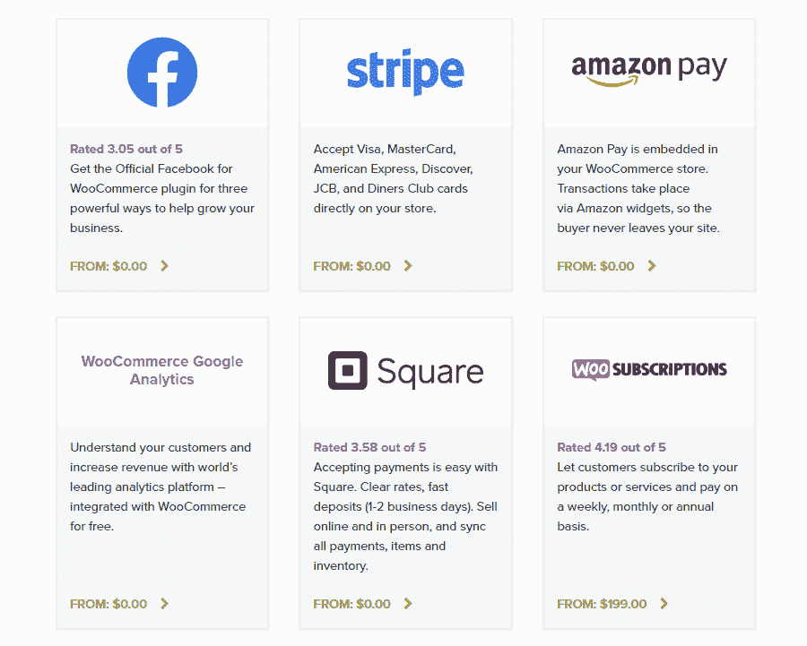

Image source: [WooCommerce](https://woocommerce.com/product-category/woocommerce-extensions/)

虽然该平台提供了相当多的开箱即用功能，但它无法涵盖您可能需要的一切。用只有一些商店可以使用的功能膨胀基础程序会使 WooCommerce 难以导航和学习。

这就是第三方 WooCommerce 扩展的用武之地。类似于 WordPress 插件， [WooCommerce 扩展](https://kinsta.com/blog/woocommerce-plugins/)为你的商店增加额外的功能。它们可能包括新类型的产品，如[会员或订阅](https://kinsta.com/blog/wordpress-membership-plugins/#woocommerce-memberships)，与邮政服务 API 集成以跟踪运输或允许你通过新的[支付网关](https://kinsta.com/blog/woocommerce-payment-gateways/)购买。有些增加了一个小功能，而另一些更像是全面检修。

你可以在他们的官方网站和各种第三方扩展库中找到 WooCommerce 扩展。

### 为什么使用 WooCommerce 扩展？

为什么需要 WooCommerce 扩展？核心程序还不够好吗？

虽然免费的 main 插件对大多数人来说都很好用，但它可能并不包含你设计商店所需要的所有东西。如果您想为礼品包装等产品添加可选的附加产品，或者创建响应[用户角色](https://kinsta.com/blog/wordpress-user-roles/)等因素的动态定价，该怎么办？

此外，WooCommerce 扩展商店有许多主要的免费支付集成。这些可以让你接受信用卡、亚马逊支付或贝宝支付。你可能需要安装一个扩展，即使它只是一个免费的支付集成插件。

下载第三方 WooCommerce 扩展确实有一些缺点。通过在你的网站上添加第三方插件，如果它们编码糟糕的话，你就打开了一个潜在的安全风险 **。此外，他们不在 WooCommerce 支持范围内，所以如果出现问题，你只能靠自己了。**

但是，利远大于弊。你的商店离不开关键功能，而扩展是获得这些功能的最有效方式。你唯一的其他选择是学习编码并自己制作，或者[雇佣一个开发者](https://kinsta.com/blog/hire-wordpress-developer/)。

总的来说，如果你从声誉好的地方购买，使用 WooCommerce 扩展是安全的。

### WooCommerce 扩展与 WordPress 插件

WordPress 插件，WooCommerce 扩展，[插件](https://kinsta.com/blog/wordpress-widgets/):到底有什么区别？所有这些术语都很容易混淆。

WordPress 是一个 [CMS](https://kinsta.com/knowledgebase/content-management-system/) 。第三方开发者已经创建了数以千计的插件来扩展它的功能。

WooCommerce 是一个 WordPress 插件。反过来，它有自己的一套用户定制的扩展，只适用于 WooCommerce。

这是一个这样的等级体系:

WordPress > WordPress 插件(WooCommerce) > WooCommerce 扩展。

你需要 [WordPress 安装](https://kinsta.com/blog/reinstall-wordpress/)来使用 WordPress 插件，你需要 [WordPress 和 WooCommerce](https://kinsta.com/woocommerce-hosting/) 来使用 WooCommerce 扩展。

虽然 WordPress 插件可以添加任何功能，如[用户注册管理](https://kinsta.com/blog/wordpress-user-registration-plugins/)或[页面生成器](https://kinsta.com/blog/wordpress-page-builders/)，但 WooCommerce 扩展专注于电子商务并充实其母平台。

小部件呢？这些通常包含在插件中，是向 widgetized 化区域添加功能的块(想想你的侧边栏或页脚)。将一个小工具放到一个 widget 化的区域，这个块就会出现在前端。

WordPress widgets

例如，假设你下载了一个添加社交媒体图标的插件。它可能还包括一个可以添加到侧边栏或页脚的小部件。当你把它的小工具放到侧边栏时，图标就会出现在你的网站上。

换句话说，小部件执行插件功能，类似于[短代码](https://kinsta.com/blog/wordpress-shortcodes/)。WordPress 插件和 WooCommerce 扩展都可以使用小部件。

## 如何安装 WooCommerce 扩展

安装 WooCommerce 扩展的过程与普通的 WordPress 插件有些不同，你可以从插件库中下载。

第一步:下载一个 WooCommerce 扩展。

如果你要从 WooCommerce 的官方商店安装它，你需要先用一个 WordPress.com 的[账户](https://kinsta.com/blog/wordpress-com-vs-wordpress-org/)登录 WooCommerce 。没有帐号，你将无法从[扩展商店](https://woocommerce.com/product-category/woocommerce-extensions/)或 **WooCommerce >扩展>浏览扩展**下载插件。

一旦你选择了你的插件，点击**立即下载**或者**立即购买**如果它是一个高级扩展。

登录你的 WordPress 后台，进入 **WooCommerce >扩展>WooCommerce.com 订阅**。连接您的 WordPress.com/WooCommerce 帐户，以便能够管理您的扩展订阅。

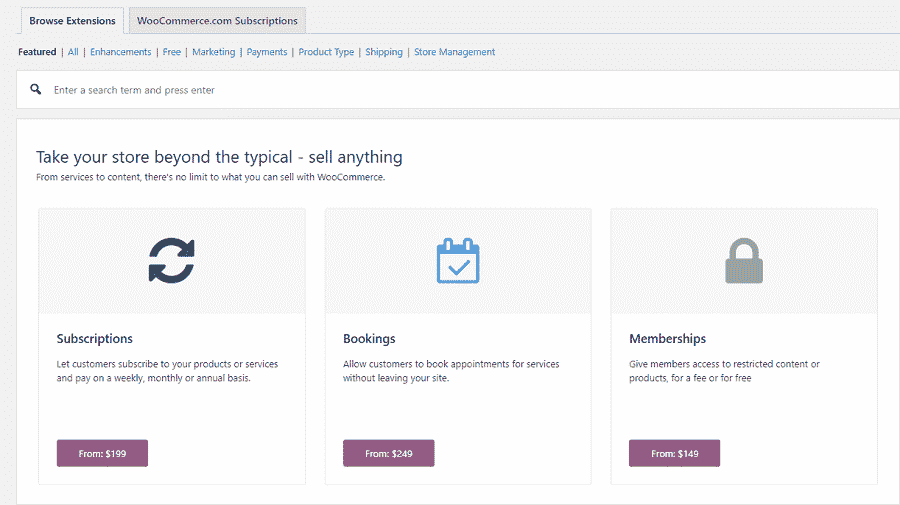

WooCommerce extensions

您购买的高级扩展将出现在此处的列表中。如果还没有安装，可以点击它们旁边的**下载**按钮。

如果你从第三方仓库获得扩展，只需下载他们给你的文件。它可能会在您购买后通过电子邮件发送给您，或者您可能需要登录您在存储库上的帐户。

不管你是从第三方商店下载还是 WooCommerce 本身下载，最后都应该是一个 zip 文件。

进入**插件>添加新的**，点击**上传插件**。上传您下载的插件 zip 文件。

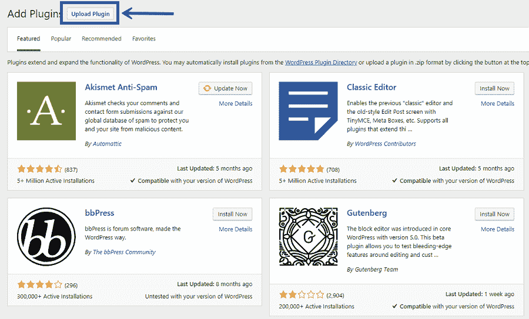

Uploading a WordPress plugin

如果你从 WooCommerce 的商店获得了插件，返回到 **WooCommerce >扩展**>**WooCommerce.com 订阅**，点击新插件旁边的**未激活**开关将其激活。

如果你从第三方获得插件，进入**插件>已安装插件**，点击**激活**。

您的新扩展现在应该是活动的。大多数会在 **WooCommerce >设置**下添加一个自定义设置页面，你可以在那里进行配置。

## 下载 WooCommerce 扩展的最佳地点

有相当多的 WooCommerce 扩展分散在互联网上，其中许多只托管在特定的存储库中。

那么，你应该去哪里寻找最好的呢？

与致力于单个插件的网站不同，存储库托管了从少数到数千个 WooCommerce 扩展的集合。这里有一些你应该看看。

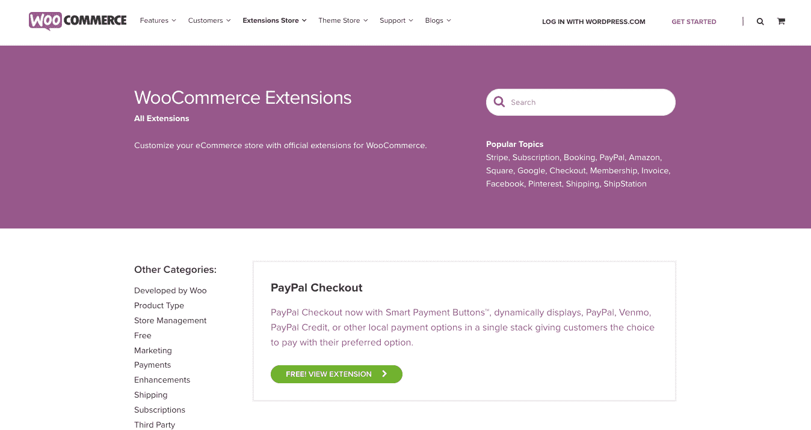

Extensions store

最好的起点是 WooCommerce 自己的[扩展商店](https://woocommerce.com/product-category/woocommerce-extensions/)。在这里你会发现超过 300 个扩展，包括由 Woo 自己开发的。这里并非所有的东西都是他们制造的，但他们仍有官方认可的印章。一定要去看看[的免费版块](https://woocommerce.com/product-category/woocommerce-extensions/free-extensions/)并浏览他们的一些赠品。

官方商店上的扩展通常比从其他来源下载更安全。它们也可以在你的 WordPress 后端的 WooCommerce 屏幕上进行管理或激活，这样就方便多了。

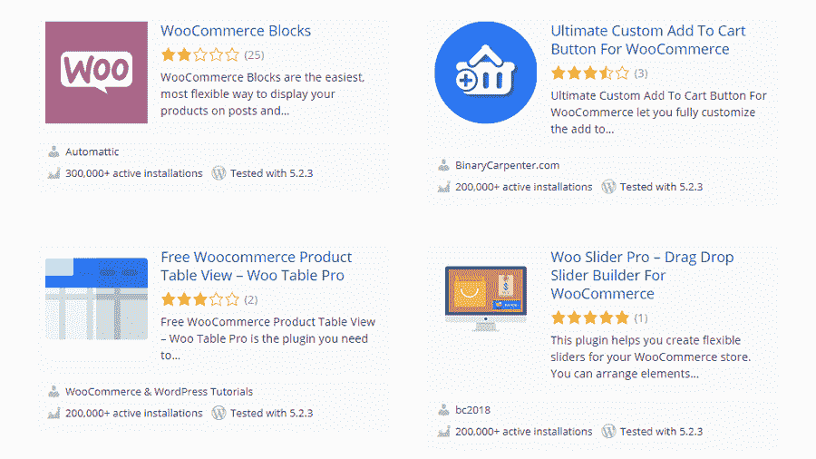

WordPress repository

下一个最好的去处是 [WordPress 知识库](https://wordpress.org/plugins/tags/woocommerce/)。这里有很多扩展，每一个都是免费的。它们可能不会像在 WooCommerce 扩展商店那样被仔细审查，但 WordPress.org 插件仍然需要通过某些指导方针才能在那里托管。

质量可能有好有坏，但是从 WordPress 知识库下载插件通常是非常安全的。

CodeCanyon 是最大的 WooCommerce 扩展库之一。你会在那里找到各种各样的扩展和插件，有一个广泛的搜索系统，你可以用它来缩小你要找的东西。一切都是付费产品，价格从 10 美元以下到 100 美元以上不等。

在 [Envato Elements](https://elements.envato.com/wordpress/plugins/tagged-woocommerce) 上，你会发现近 100 种优质的 WooCommerce 扩展/插件，涵盖了各种细分市场。然而，令人烦恼的是，你需要订阅 Envato 来解锁它们。根本没有办法只买一个扩展。好的一面是，你可以以相对便宜的价格接触到每一个人。

最后，你可以在[森林](https://themeforest.net/collections/7500712-woocommerce-plugins)、[插件](https://pluginrepublic.com/)和[堤喀软件](https://www.tychesoftwares.com/)上找到一些 WooCommerce 扩展。这些不需要很长时间浏览，所以你一定要浏览一下。

## 推荐的 WooCommerce 扩展

有数百个 WooCommerce 扩展需要在多个存储库中筛选，您应该从哪里开始呢？

 如果你已经确切地知道你在找什么，并且可以简单地搜索它，这可能是足够容易的，但是浏览扩展/插件，看看哪些可能是有帮助的，这是一个好主意。您可能会错过您甚至不知道的重要功能！

如果你完全迷路了，不用担心。我们列出了一些最好、最有用、最受欢迎的 WooCommerce 扩展和插件。

如果这是你第一次[经营网上商店](https://kinsta.com/learn/woocommerce-guide/)，这对你会有很大的帮助。

### 运输、支付和产品扩展

是时候按照你想要的方式来布置和经营你的商店了。这些插件将帮助您优化支付方式和运输。

#### Stripe 和/或 PayPal

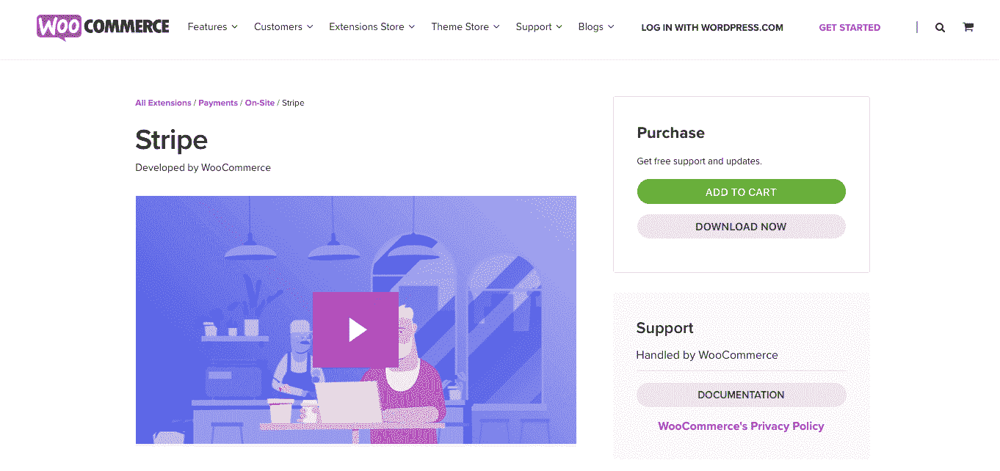

WooCommerce extensions: Stripe

[Stripe](https://woocommerce.com/products/stripe/) 和 [PayPal](https://woocommerce.com/products/woocommerce-gateway-paypal-checkout/) 是最著名的两个免费的 [WooCommerce 支付网关](https://kinsta.com/blog/woocommerce-payment-gateways/)。查看 [Stripe vs PayPal](https://kinsta.com/blog/stripe-vs-paypal/) 是否符合您的需求。

#### WOOCS–货币切换器

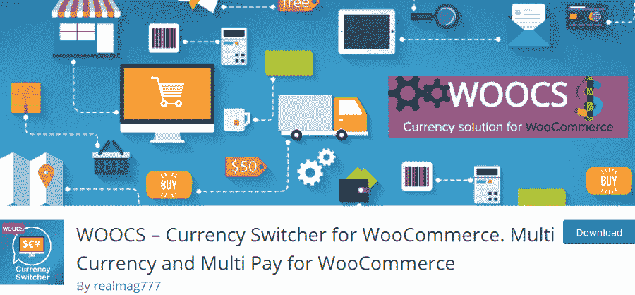

WOOCS

WooCommerce 货币切换器使货币之间的切换变得容易，并支持来自世界各地的许多货币。

你也可以在你网站的任何 widget 化区域使用它，或者通过一个[短代码](https://kinsta.com/blog/wordpress-shortcodes/)插入到内容中。你甚至可以选择访问者如何选择他们喜欢的货币(下拉菜单、旗帜或侧边切换器)。

#### 结帐经理

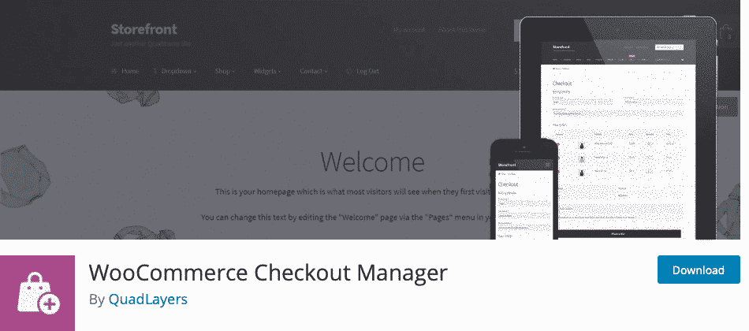

Woocommerce Checkout Manager

这个 [WooCommerce checkout](https://kinsta.com/blog/woocommerce-checkout/) 管理器允许你添加复选框、输入表单、颜色选择器等等到你的结帐页面，或者使用[woo commerce check out Manager](https://wordpress.org/plugins/woocommerce-checkout-manager/)编辑和重新排列它们。

您还可以重新排序或重命名账单和运输部分中的所有结账字段，或者启用“附加字段”部分，允许您在客户结账前询问更多信息。

#### 一页购物

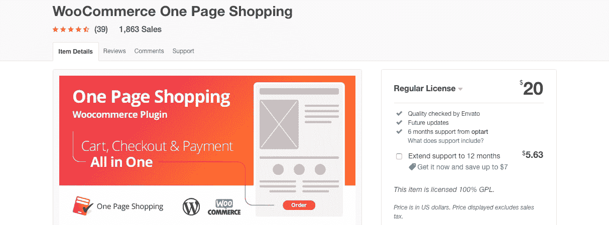

WooCommerce One Page Shopping

[一页购物](https://codecanyon.net/item/woocommerce-one-page-shopping/7158470)通过将商店页面和结账页面压缩为一体，轻松优化和改善用户体验。

这样，当购物者将商品添加到购物车中时，结帐字段会立即出现，从而使购买过程变得快速而简单。其他选项可以定制订单和结账页面组合，以满足您的需求。

#### 智能优惠券

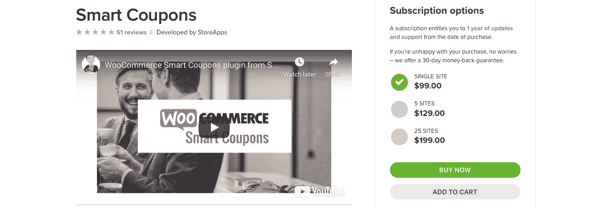

Smart Coupons

智能优惠券有助于在你的 WooCommerce 商店中应用折扣、礼券和支持任何类型的优惠券。

您还可以使用它来创建批量优惠券，运行赠品，并轻松设置有限的促销活动。它还消除了设置这些促销时对开发人员帮助的需要。

#### 高级运输

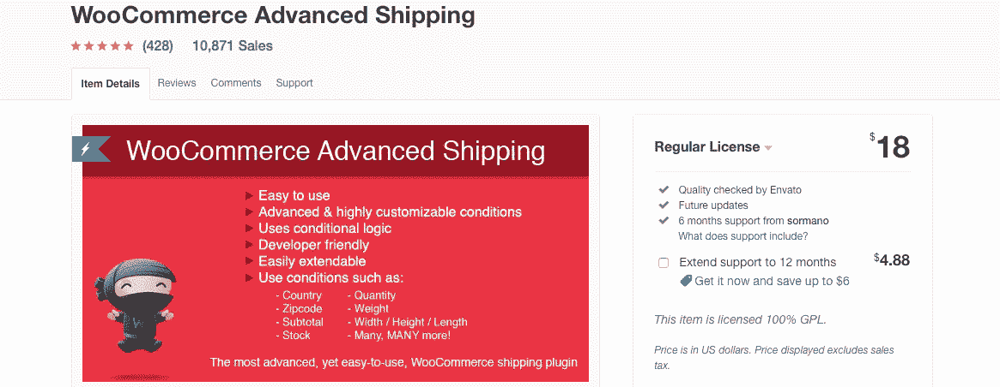

WooCommerce Advanced Shipping

使用[woo commerce Advanced Shipping](https://codecanyon.net/item/woocommerce-advanced-shipping/8634573)插件，根据数量或购买量、用户区域、产品重量等提高或降低运费。

使用条件逻辑，您可以建立诸如邮政编码、重量、数量、库存等条件。您还可以添加几种运输方式，使用表价运输、基于数量的定价和许多其他功能来满足您的运输需求。

#### 网络商务订阅

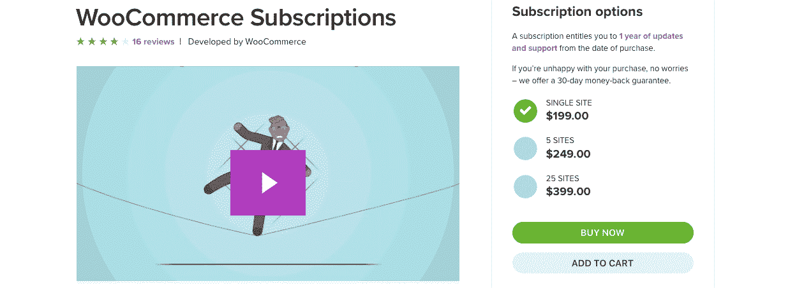

WooCommerce Subscriptions

有了 [WooCommerce Subscriptions](https://kinsta.com/blog/woocommerce-subscriptions/) ，你可以在你的商店里销售基于订阅的经常性产品，这使得建立基于剩余的业务变得更加容易。

您可以为实体和数字产品或服务启用多种不同类型的订阅，这为许多店主提供了所需的灵活性。

#### 简单拍卖

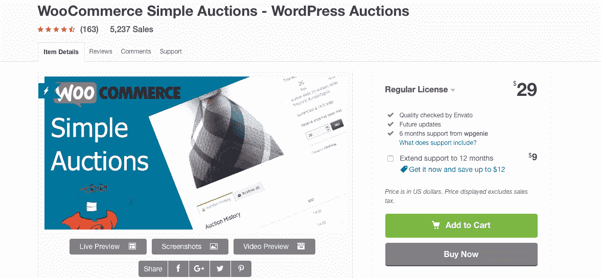

WooCommerce Simple Auctions

有了[WooCommerce Simple Auctions](https://codecanyon.net/item/woocommerce-simple-auctions-wordpress-auctions/6811382)，你只需点击几下鼠标，就可以为你的 woo commerce 商店添加全面的在线拍卖功能。

有了这个插件，你基本上可以创建一个拍卖网站，甚至是一个无声动作的易贝风格的克隆。常规产品仍然可以得到支持。

## 注册订阅时事通讯

### 想知道我们是怎么让流量增长超过 1000%的吗？

加入 20，000 多名获得我们每周时事通讯和内部消息的人的行列吧！

[Subscribe Now](#newsletter)

#### 预订和约会

Booking and Appointment

[预约和预约](https://kinsta.com/blog/wordpress-booking-plugins/#booking-appointment-woo)插件允许用户在 WooCommerce 中进行时间敏感的预约和预约。

它提供了将您的商店转变为成熟的预订系统所需的一切，包括基于时间或日期的预订、基于持续时间的预订，它甚至还添加了搜索功能，以便客户可以更快地找到他们想要的东西。

此外，这里有一些扩展，让您自定义如何销售您的产品。

#### 产品包

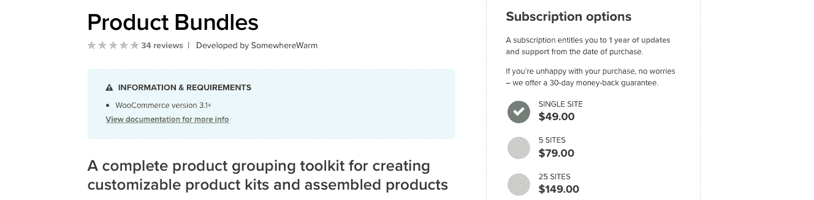

Product Bundles

顾名思义，通过[产品捆绑包](https://woocommerce.com/products/product-bundles/)，你可以将产品捆绑在一起打包，以鼓励用户批量购买，或者追加销售并提供推荐。

它被描述为一个“产品分组工具包”，使更好地向客户营销变得容易。这使得为购买捆绑产品而不是单独购买产品提供交易和折扣变得轻而易举。

#### WooCommerce 品牌

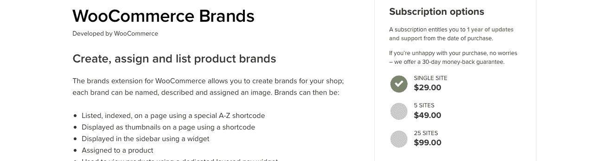

WooCommerce Brands

使用 [WooCommerce Brands](https://woocommerce.com/products/brands/) ，您可以分配产品品牌，以允许用户根据它们进行排序和搜索。

这个简单而有用的扩展使得创建品牌和给每个品牌分配图像和描述变得容易。这为您的商店提供了强大的搜索功能，可用于创建强大的品牌索引供顾客浏览。

#### 最小/最大数量

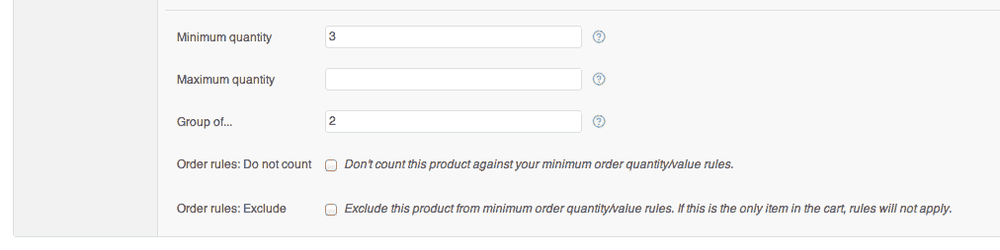

Min Max Quantities

使用[最小/最大数量](https://woocommerce.com/products/minmax-quantities/)扩展，您可以在客户结账前应用最小/最大数量或成本。

如果您的某些商品库存有限，并且希望确保尽可能多的个人客户能够获得这些商品，这将很有帮助。它还允许您设置一组或多个最小/最大规格。

#### 自定义产品标签

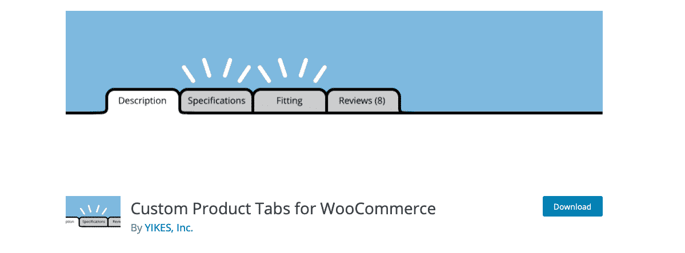

Custom Product Tabs

产品页面太长了？使用[自定义产品标签](https://wordpress.org/plugins/yikes-inc-easy-custom-woocommerce-product-tabs/)扩展，为您的产品添加标签，以拆分规格或变化信息等信息。

因此，在产品描述的旁边，你可以有标签显示更多的信息，而不会弄乱页面，让顾客永远滚动。选项卡区域可以包含文本、图像、HTML 和短代码。

#### yith woocommerce zoom magnifier

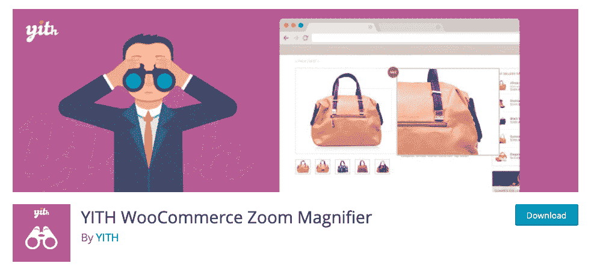

YITH WooCommerce Zoom Magnifier

YITH WooCommerce 变焦放大镜到底是做什么的？嗯，通过使用这个插件，顾客可以在悬停在产品图片上时放大图片。

这也为项目页面增加了缩略图[滑块](https://kinsta.com/blog/wordpress-slider/)功能，全面改善了客户的用户体验。

#### 变化样本

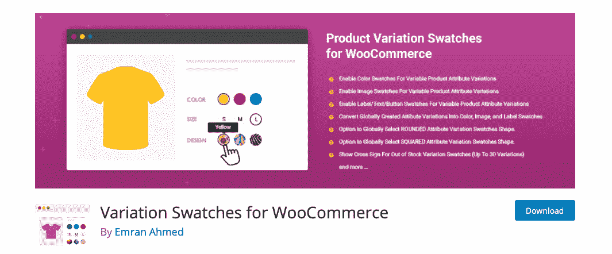

Variation Swatches

【WooCommerce 的变化样本可以轻松地为您的产品添加颜色、设计和其他变化的样本。您可以添加任意数量的产品属性。

此外，它是高度可定制的，开发者提供了大量的教程，以确保您也能从插件中获得最大收益。

#### 更好的变化

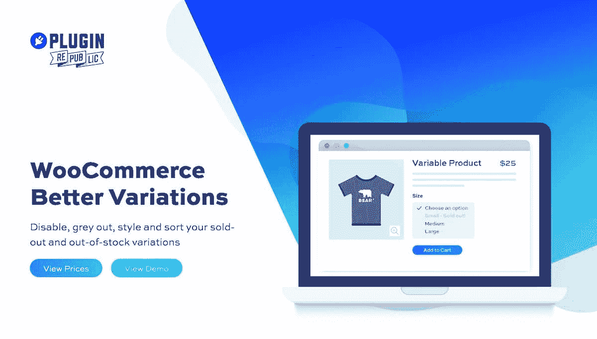

WooCommerce Better Variations

WooCommerce Better Variations 是一个简单的插件，可以为用户带来很大的变化。它使缺货的产品变灰色，并让您自定义客户看到的信息。

你能向顾客提供的信息越多越好。举个例子，你甚至可以在产品变体上添加一个“重新进货”的日期，以鼓励人们在日历上做标记。

#### 花式产品设计师

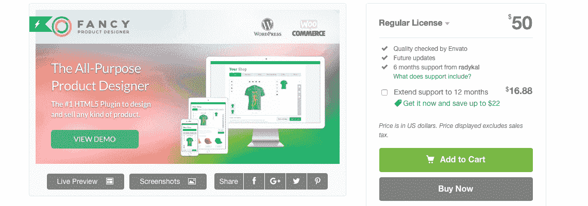

Fancy Product Designer

你经营一家销售定制产品的公司吗？[花式产品设计师](https://codecanyon.net/item/fancy-product-designer-woocommercewordpress/6318393)以官方的方式为你处理这个过程的所有细节。

需要一个一流的，快速，安全的主机为您的新电子商务网站？Kinsta 提供超快的服务器和来自 WooCommerce 专家的 24/7 世界级支持。[查看我们的计划](https://kinsta.com/plans/?in-article-cta)

尽管许多在线商店要求客户只在通用评论框中留下关于他们定制偏好的细节，但这个插件允许客户设计产品，如服装，同时调整颜色，添加文本，并上传图像。

### 管理和营销扩展

你永远无法得到足够的管理插件。经营一家企业并不容易，所以尽可能抓住机会实现自动化。这些 WooCommerce 扩展可以帮助你吸引客户，让事情顺利进行。

#### 啤酒制造

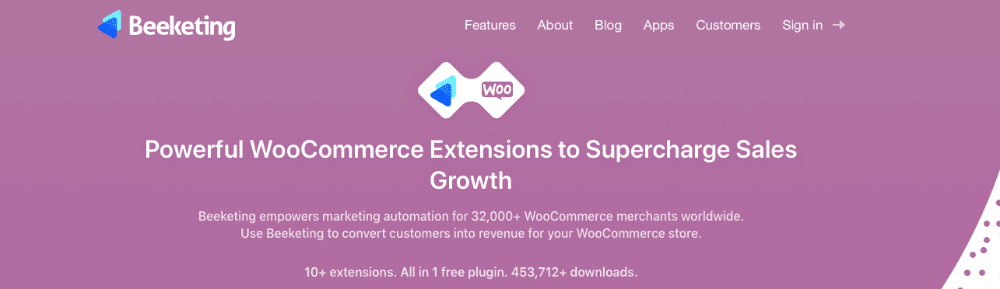

Beeketing

Beeketing 是一款在 WooCommerce 中用于销售和营销的自动化软件。它允许你跟踪你的客户，[自动转换](https://kinsta.com/blog/conversions-woocommerce-product-pages/)，并保持用户的长期参与。

它实际上由超过 10 个独立的扩展组成，包括更好的优惠券框、销售 Pop 和结帐加速，每个扩展都旨在自动化和简化你的 WooCommerce 商店的营销和销售过程。

#### 扎皮尔

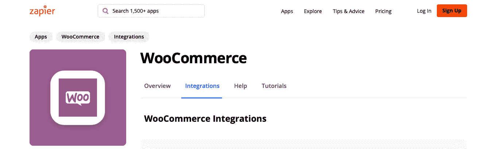

Zapier

作为一项自动化服务，Zapier 可以连接成千上万的应用程序，并在某些事情被触发时将它们链接在一起。在你店里卖过东西？自动将其添加到谷歌表，并通知航运公司。

#### WhatsApp 聊天和分享

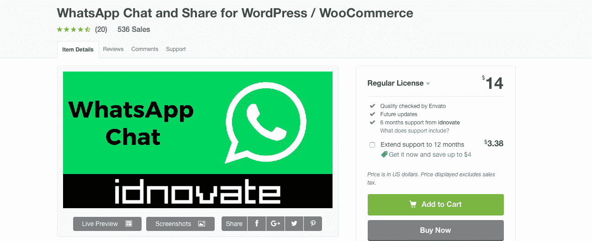

WhatsApp Chat and Share

使用 [WhatsApp 聊天和分享](https://codecanyon.net/item/whatsapp-chat-for-wordpress-woocommerce/19935771)功能，您可以为使用 WhatsApp 的用户提供支持，并提高客户满意度。

这也使得[你的网站访问者可以直接在你的网站上使用 WhatsApp 与你聊天](https://kinsta.com/blog/wordpress-live-chat-plugin/)，这消除了一些对电话支持的需要，并使你的客户更容易与你直接联系。

#### OpenPOS–woo commerce 销售点

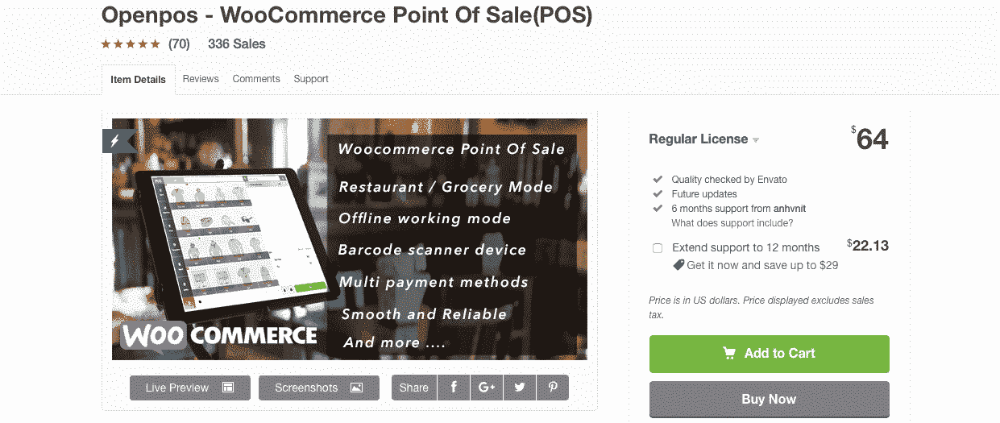

OpenPOS

[OpenPOS](https://codecanyon.net/item/openpos-a-complete-pos-plugins-for-woocomerce/22613341) 是一个扩展，增加了 WooCommerce 兼容的本地商店管理，包括餐厅模式、库存管理和交易报告。基本上，这使得您可以将在线商店的数据与本地实体店同步，从而简化商店管理、库存跟踪等。

#### 网络商务会员

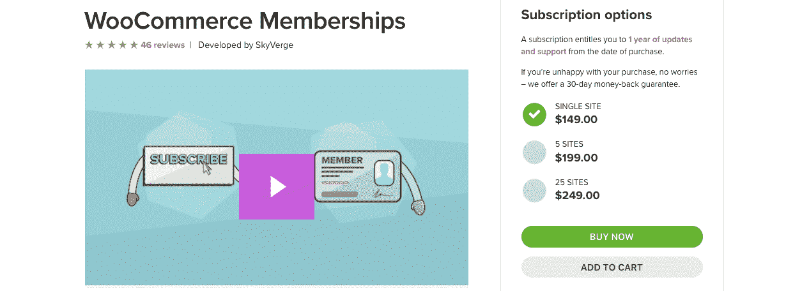

WooCommerce Memberships

[WooCommerce Memberships](https://kinsta.com/blog/wordpress-membership-plugins/#woocommerce-memberships) 允许你在网站上添加会员功能，包括[出售会员资格和设置仅限会员的内容限制](https://kinsta.com/blog/website-ideas/#sidehustle-2)。您还可以使用此扩展来设置滴灌饲料内容，添加会员特权到您的商店，并手动分配产品的会员资格。

#### WooCommerce 谷歌分析集成

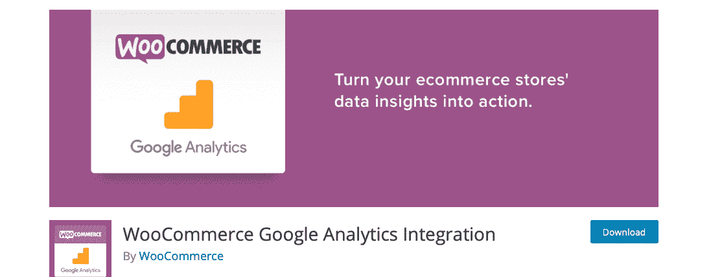

WooCommerce Google Analytics Integration

如果你是谷歌分析的粉丝，你会喜欢这个漂亮的集成。[woo commerce Google Analytics Integration](https://wordpress.org/plugins/woocommerce-google-analytics-integration/)允许您添加一个购买推荐，并向您的 Google Analytics 帐户添加交易信息。这个插件还包括对通用分析的支持。

#### 高级网络商务报告

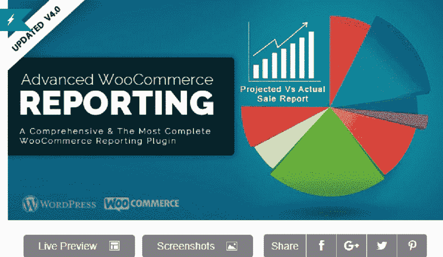

Advanced WooCommerce Reporting

Google Analytics 的所有功能都可以在 WordPress 上使用，但这是一个更加定制的解决方案，可以很好地集成到 WooCommerce 中。[高级 WooCommerce 报告](https://codecanyon.net/item/advanced-woocommerce-reporting-/12042129)为您的 WooCommerce 商店提供各方面的详细报告，包括订单状态、库存、发货、热门产品等。

#### 产品 CSV 导入套件

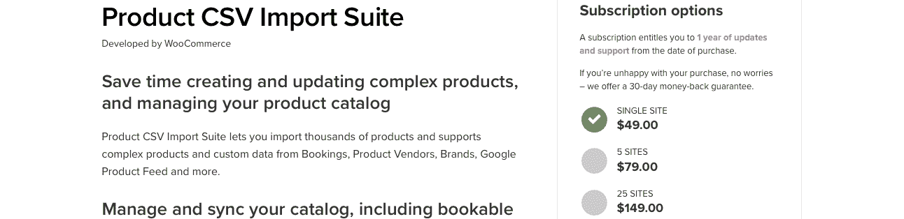

Product CSV Import Suite

[产品 CSV 导入套件](https://woocommerce.com/products/product-csv-import-suite/)允许您将 CSV 数据导入或导出到 Google 产品订阅源、预订等。这大大节省了时间，因为你基本上可以自动同步你的目录，甚至是可预订的产品。您也可以一键导入所有产品的特殊信息。

#### 相扑奖励积分

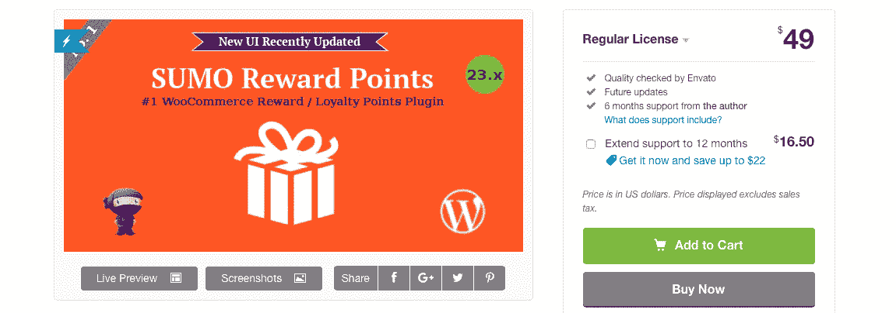

Sumo Reward Points

有了[相扑奖励积分](https://codecanyon.net/item/sumo-reward-points-woocommerce-reward-system/7791451)你可以激励顾客购买，并用积分系统奖励他们的忠诚度。通过购买、社交分享和注册获得积分，并将其用于购买产品或兑换奖品。你甚至可以设置比赛来赚取奖励积分，并为积分添加截止日期。

### 其他必备

这些扩展不太适合任何其他类别，但尽管如此，它们是您绝对应该考虑选择的优秀产品。

#### wooleator woocommerce 页面生成器元素或插件

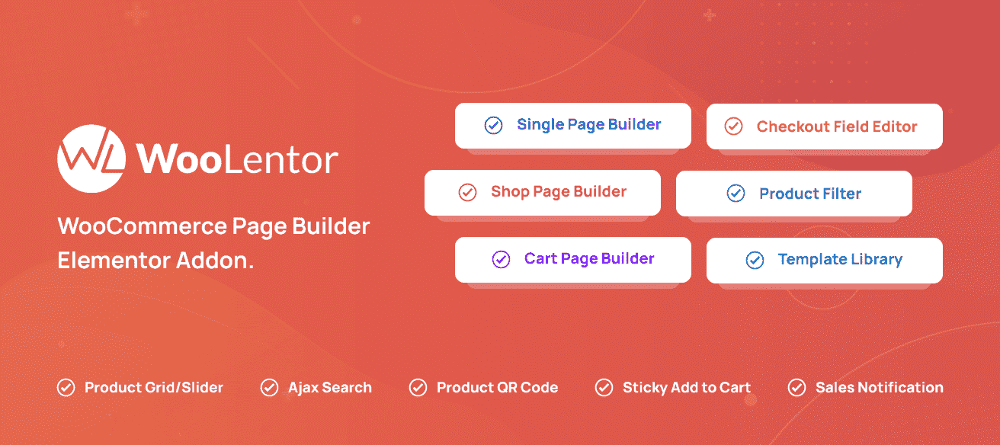

WooLentor WooCommerce Page Builder Elementor Addon

有许多 WooCommerce 网站运行在页面生成器上。如果你有一个使用 [Elementor Page Builder](https://kinsta.com/blog/wordpress-elementor/) 构建的 WooCommerce 网站，那么[woolent or woo commerce Page Builder element or Addon](https://woolentor.com/)是一个必备插件，可以扩展你现有商店的功能，或者帮助你从头开始创建和构建。

该插件是一个强大的元素或插件，拥有你建立一个专业外观，功能齐全的电子商务商店所需的所有功能。它拥有你能想象到的所有基本功能，包括产品网格、产品标签、动作按钮、销售通知、产品二维码、AJAX 搜索、垂直过滤等等。

如果这还不够，还包括附加到购物车、模板库、自定义页面生成器等高级功能。

有了 76 个小工具、15 个不同的产品定制模板和 10 个可定制的商店页面可供选择，您将拥有使用 Elementor 创建和构建 WooCommerce 商店所需的一切。

#### 电子商务的助推器

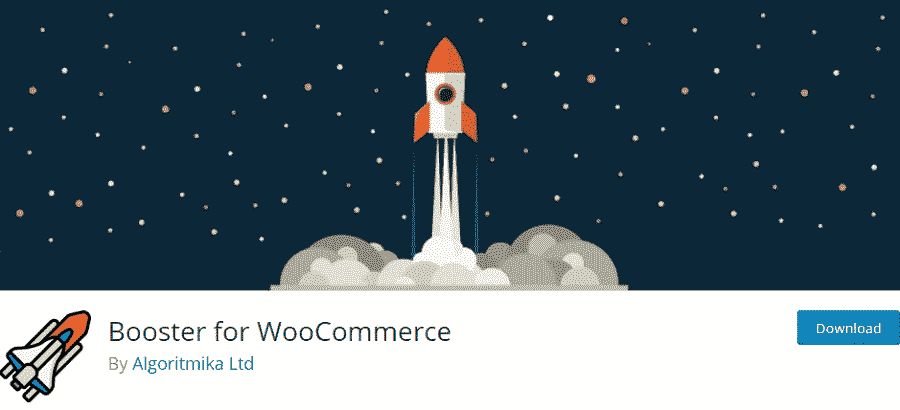

Booster for WooCommerce

WooCommerce 的助推器是一个终极的 WooCommerce 插件，增加了几十个大大小小的改进，它们都是非常宝贵的。该扩展涵盖了广泛的功能，包括定价和货币、按钮、产品、购物车、结账流程、[支付网关](https://kinsta.com/blog/woocommerce-payment-gateways/)、运输、发票、电子邮件等等。

#### YITH WooCommerce 愿望清单

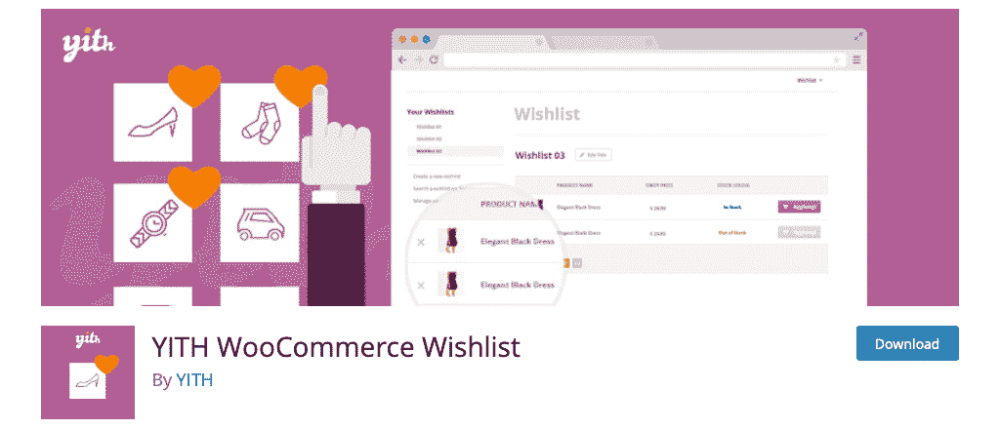

YITH WooCommerce Wishlist

YITH WooCommerce Wishlist 让你的用户能够保存他们以后想要购买的产品，并与朋友分享。提供这一功能可以增加销售额，因为顾客可以把他们感兴趣的商品留到以后再买。该插件也是 WPML 兼容的。

#### WooCommerce 等候名单

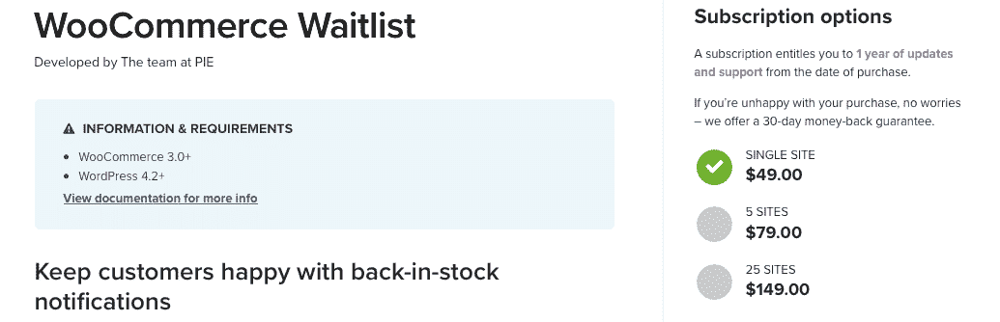

WooCommerce Waitlist

WooCommerce Waitlist 是一个超级有用的扩展。当商品缺货时，这并不意味着永久失去转化。有了候补名单，当候补名单上的商品又有货时，你可以通过自动通知他们来吸引潜在的顾客。客户还可以随时查看和编辑他们的等候名单。

#### WooCommerce 多语言

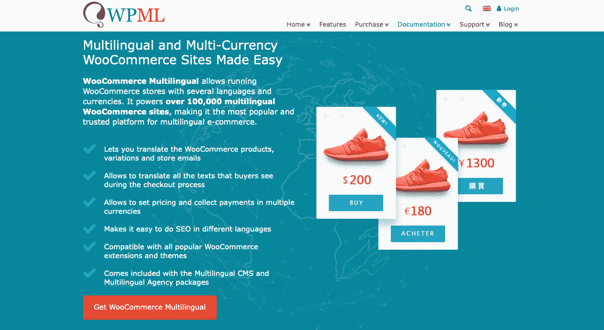

WooCommerce Multilingual

翻译你的电子商务网站是一件令人头痛的事情吗？WooCommerce 多语言让你的事情变得更容易，它与 WooCommerce 完美集成。

有了这个插件，你可以翻译产品描述，改变价格，并且[也可以处理 SEO](https://kinsta.com/blog/what-does-seo-stand-for/) 。

#### woo 商务定制

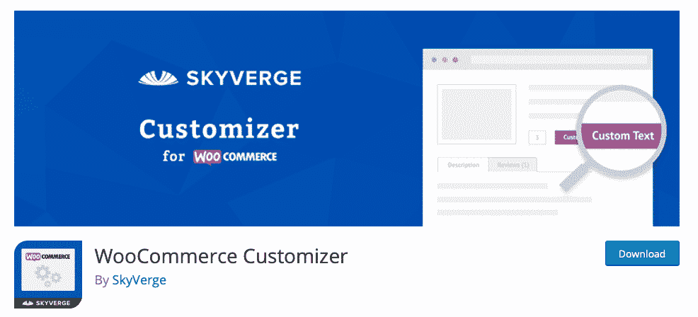

WooCommerce Customizer

想要在按钮或 UI 的其他部分添加自定义文本吗？WooCommerce Customizer 让你不必掌握 [PHP](https://kinsta.com/blog/is-php-dead/) 就能做到这一点。您可以更改“添加到购物车”按钮的内容、销售徽章的内容、提交订单按钮的内容、结账页面的内容等等。只需点击几下鼠标。

#### WooCommerce 颜色

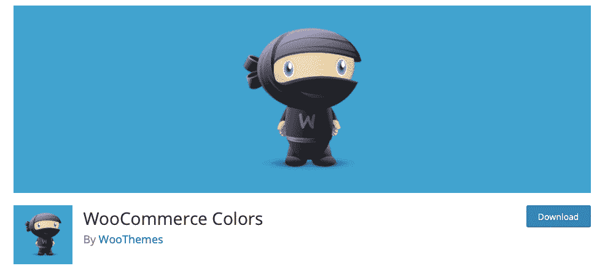

WooCommerce Colors

没有色彩，品牌就什么都不是。如果你想定制 WooCommerce 的按钮、标签和 UI 调色板，你肯定会想使用 [WooCommerce Colors](https://wordpress.org/plugins/woocommerce-colors/) 。这个插件使得改变按钮颜色以及其他前端样式和元素的颜色变得轻而易举。

#### 定制产品设计师

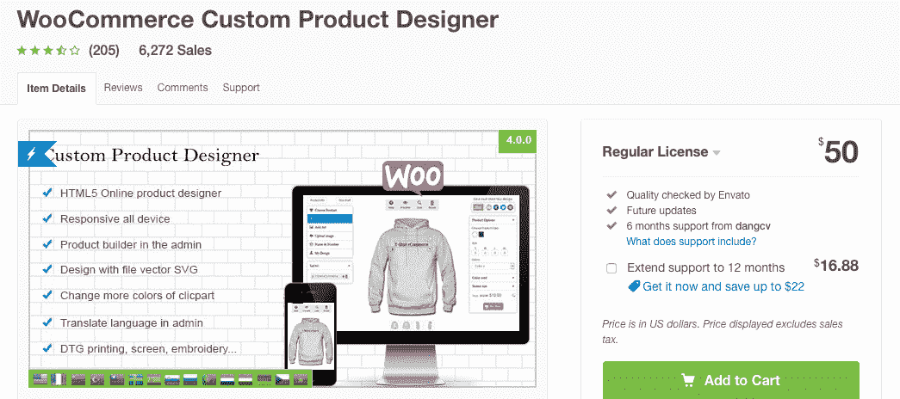

WooCommerce Custom Product Designer

你想在后台构建和设计产品吗？woo commerce Custom Product Designer 给你制作模型的工具，而不用退出 WordPress。

有了它，你可以定制你的界面，从任何设备设计产品，无论你做什么都可以用任何打印方法。

#### YITH WooCommerce Ajax 搜索

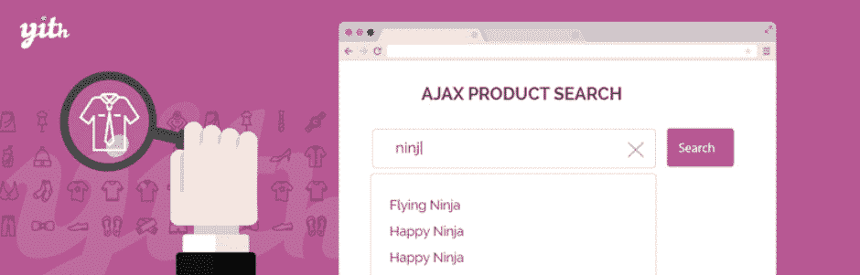

使用 YITH WooCommerce Ajax 搜索插件，你可以在[的即时搜索产品](https://kinsta.com/blog/wordpress-search/)中添加一个可以放在商店任何地方的 widgetized 搜索栏。该功能易于设置和使用，并为您的网站增加了另一层可用性，这将使您的客户的购物体验更加直观。

这只是一小部分 WooCommerce 扩展，看起来对许多店主很有帮助。外面还有很多等着你去发现。

[Always on the lookout for the perfect WooCommerce extension? Well, today your search is over: check out the 30+ most interesting Woo extensions available on the market 🛍️💸Click to Tweet](https://twitter.com/intent/tweet?url=https%3A%2F%2Fkinsta.com%2Fblog%2Fwoocommerce-extensions%2F&via=kinsta&text=Always+on+the+lookout+for+the+perfect+WooCommerce+extension%3F+Well%2C+today+your+search+is+over%3A+check+out+the+30%2B+most+interesting+Woo+extensions+available+on+the+market+%F0%9F%9B%8D%EF%B8%8F%F0%9F%92%B8&hashtags=woocommerce%2Cecommerce)

## 摘要

WooCommerce 对于小型和大型商店来说都是一个很好的电子商务平台，但是它可能没有你想要的所有功能。幸运的是，WooCommerce 扩展可以帮助填补这个空白，允许你进一步扩展这个巨大的插件。

有很多库可以让你找到更多的扩展，我们鼓励你浏览它们。这个 WooCommerce 扩展的精选列表是新用户的一个很好的起点。看看其中是否有适合您企业的产品。

你最喜欢 WooCommerce 的哪些扩展？哪些是你目前正在使用并且离不开的？在评论里告诉我们吧！

* * *

让你所有的[应用程序](https://kinsta.com/application-hosting/)、[数据库](https://kinsta.com/database-hosting/)和 [WordPress 网站](https://kinsta.com/wordpress-hosting/)在线并在一个屋檐下。我们功能丰富的高性能云平台包括:

*   在 MyKinsta 仪表盘中轻松设置和管理
*   24/7 专家支持
*   最好的谷歌云平台硬件和网络，由 Kubernetes 提供最大的可扩展性
*   面向速度和安全性的企业级 Cloudflare 集成
*   全球受众覆盖全球多达 35 个数据中心和 275 多个 pop

在第一个月使用托管的[应用程序或托管](https://kinsta.com/application-hosting/)的[数据库，您可以享受 20 美元的优惠，亲自测试一下。探索我们的](https://kinsta.com/database-hosting/)[计划](https://kinsta.com/plans/)或[与销售人员交谈](https://kinsta.com/contact-us/)以找到最适合您的方式。**