# WooCommerce 库存管理:如何做好

> 原文：<https://kinsta.com/blog/woocommerce-inventory-management/>

库存管理是经营企业最重要的部分之一。但是许多新店主低估了好的电子商务库存管理工具的重要性。

一个好的电子商务平台将使跟踪和更新你的网站上的股票变得容易，与外部管理工具集成，甚至提供更多的扩展来适应你独特的商业环境。

WooCommerce 是否有优势？让我们看看它提供的工具。

## 什么是 WooCommerce？

WooCommerce.

虽然自己设计一个网站和一个网上商店是可能的，但是有许多工具可以简化这个过程，使它更容易访问。 [Shopify](https://kinsta.com/blog/woocommerce-vs-shopify/) 和 BigCommerce 是一些你可能听说过的例子。

WooCommerce 并不像这些一样是一个独立的电子商务 CMS，而是 WordPress 的一个插件，也是目前最受欢迎的 WordPress 电子商务插件。尽管是一个更大平台的插件，WooCommerce 可以像 Shopify 这样的成熟工具一样强大。

众所周知，它易于学习使用，并有数百个扩展来扩展其功能。最重要的是，WooCommerce 和 WordPress 都是免费的。虽然你仍然需要处理像虚拟主机费用和付费插件这样的事情，但是它使得总价格和进入门槛降低了很多。

> Kinsta 把我宠坏了，所以我现在要求每个供应商都提供这样的服务。我们还试图通过我们的 SaaS 工具支持达到这一水平。
> 
> <footer class="wp-block-kinsta-client-quote__footer">
> 
> 
> 
> <cite class="wp-block-kinsta-client-quote__cite">Suganthan Mohanadasan from @Suganthanmn</cite></footer>

[View plans](https://kinsta.com/plans/)

## WooCommerce 库存管理的工作原理

WooCommerce 内置了跟踪库存和存货的功能。这些工具不是最强大的，也不适合小众场合，但它们可以通过免费和付费插件轻松扩展，对于大多数普通商店来说已经足够了。

在产品级别跟踪库存。当客户下订单时，股票会自动下跌，同样，WooCommerce 有跟踪客户订单和运输状态的有用工具。

对你的库存、订单和运输的跟踪都集成到详细的库存报告和统计数据中。由于这一点，你可以避免过量订购，知道何时需要购买额外的库存，并找出[哪些产品做得最好](https://kinsta.com/ebooks/wordpress/ecommerce-conversion-rate/)。

总的来说，WooCommerce 的工具是一个可以用插件扩展的积木。例如，你可以获得插件来集成你最喜欢的库存管理软件，以自动更新库存或处理原材料跟踪。WooCommerce 本身有每个人都需要开始的基础知识。

[库存管理是经营企业最重要(但被低估)的部分之一📈在本指南中了解更多信息！🛒 点击推文](https://twitter.com/intent/tweet?url=https%3A%2F%2Fbit.ly%2F3tFltDp&via=kinsta&text=Inventory+management+is+one+of+the+most+important+%28but+underestimated%29+parts+of+running+a+business+%F0%9F%93%88+Learn+more+in+this+guide%21+%F0%9F%9B%92&hashtags=WooCommerce%2Cecommerce)

## 电子商务库存管理的利弊

在我们深入了解 WooCommerce 的功能之前，让我们先回顾一下它的库存管理系统的优缺点。

### 电子商务库存管理的优点:

*   免费且可用的低成本平台。
*   小型企业可以使用，但对大型企业来说足够强大。
*   体面，如果简单，库存管理工具。
*   管理全球或每个产品的库存。

### WooCommerce 库存管理的缺点:

*   无法跟踪原材料。
*   只能整体跟踪库存，不能基于位置或供应商。
*   没有内置的股票跟踪自动化(每次股票上涨都需要手动编辑产品)。
*   需要用插件/扩展来扩展。这可能导致以付费插件的形式隐藏启动费用。

WooCommerce 本身是一个非常简单的工具，其内置的库存管理工具并不适合大型企业。然而，它真正的力量来自于可以添加任何你能想象的功能的附加组件范围。

我们将提到几个有用的 WooCommerce 插件来增强它的库存管理，但首先，让我们看看如何管理它提供的工具。

## 如何设置电子商务库存

首先，你需要确保在 WordPress 仪表盘中启用了[库存跟踪选项](https://woocommerce.com/document/configuring-woocommerce-settings/#products-inventory-options)。一旦你[安装了 woo commerce](https://kinsta.com/blog/woocommerce-tutorial/)，你应该会在你的工具条中看到一个新的 **WooCommerce** 菜单。将其悬停并点击**设置** *。*

设置页面的顶部有几个选项卡。点击标签为**的产品**，然后点击这些标签正下方的小**库存**链接。

现在确保勾选**启用库存管理**复选框。这将允许 WooCommerce 自动减去库存，并在您用完库存时更改库存状态。如果您想手动处理，请不要选中它。

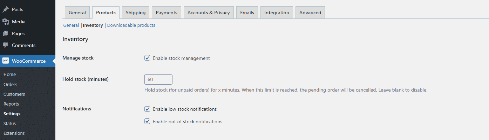

WooCommerce Inventory settings

有几个设置你会想看看。

*   **保留库存**–这将改变未支付订单在取消前的库存保留时间。
*   **通知**–这将在产品库存减少或耗尽时向目标收件人发送电子邮件。您还可以更改低库存和缺货阈值。
*   **缺货可见性**–这将在产品缺货时隐藏产品。
*   **库存显示格式**–您可以向购物者准确显示您还剩多少库存，仅在低库存阈值时打开，或者完全关闭库存显示。

如果你想逐个股票地编辑，你还需要熟悉个别的[产品股票设置](https://woocommerce.com/document/managing-products/)。进入**产品>所有产品**，点击**编辑**任何产品。向下滚动到产品数据框，点击**库存** *。*

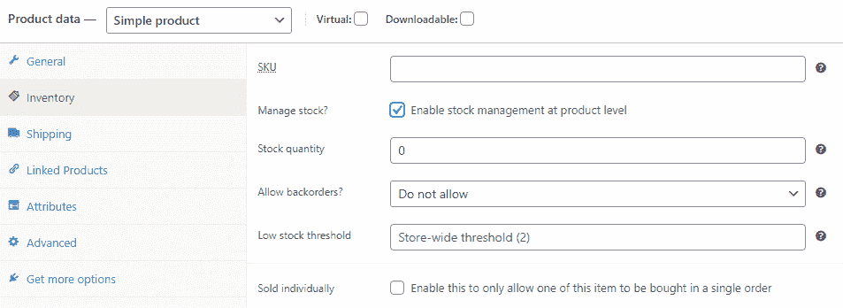

Stock management settings in WooCommerce

如果您想管理单个库存设置，您需要在产品级别 *勾选**启用库存管理。***以下是这些设置的含义:

*   **SKU**——定一品 [SKU 号](https://www.vendhq.com/blog/sku-numbers/)。
*   **库存数量**–手动设置库存数量。
*   **允许延期交货**–允许客户在产品缺货时订购产品。
*   **低库存阈值**–具体来说，更改在该产品的全局设置屏幕上设置的低库存阈值。
*   ****单独销售****——允许顾客一次只能购买一件产品。

## 如何保持库存更新

通过启用正确的设置，WooCommerce 会在您[出售](https://kinsta.com/blog/woocommerce-checkout/)产品时自动从您的产品中扣除库存。

你可以在 WooCommerce >设置>产品>库存中打开**启用库存管理。然后对于每个产品，您可以在产品的**编辑**页面打开**启用产品级库存管理**并设置库存水平。**

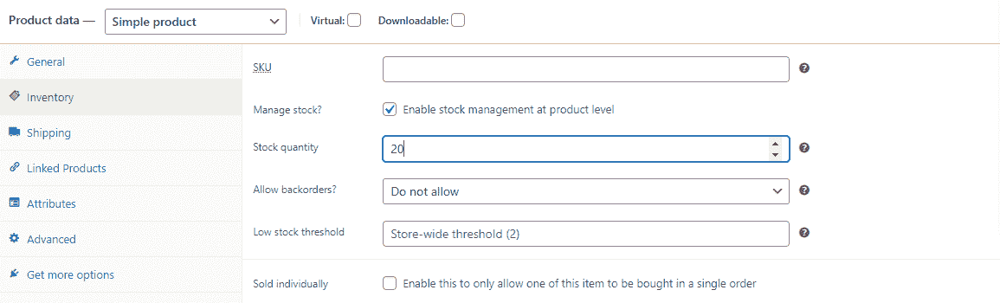

Enabling product-level stock management in WooCommerce.

WooCommerce 会从你的销售额中扣除这个数字，它还会自动将你的产品设置为低价或缺货。

不幸的是，无论何时收到货物，您都需要仔细检查并手动更新号码。WooCommerce 只能向下增加库存，而不能向上增加。

这可以通过附加组件很容易地解决，但是基本工具没有这样的功能。

## 如何管理库存状态

改变股票状态呢？有两种方法:全球范围的和基于每个产品的。

在 **WooCommerce >设置>产品>库存页面**中，您可以设置低断货阈值，更改商店中是否出现断货商品，以及库存状态在您的商店中的显示方式。

在任何产品的**编辑**屏幕上，你可以设置一个单独的低库存阈值，并更新自己是否有货。如果您勾选了**启用产品级库存管理**设置，WooCommerce 将会处理此事。

如果您没有打开全局**启用库存管理**设置，您将只能更新产品是否有货，WooCommerce 不会自动更新。

您还可以更改可变产品变体的库存状态。一旦[设置了变化](https://woocommerce.com/document/variable-product/)，你就可以在*变化*选项卡上的每个变化中改变库存数量、状态和低库存阈值。

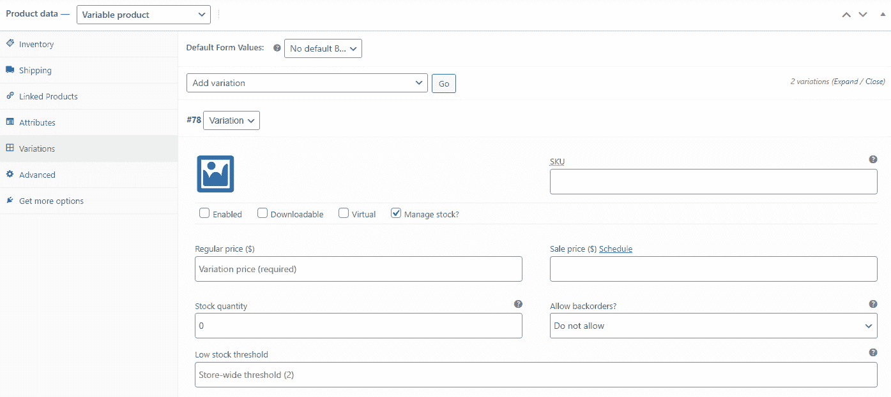

Setting stock variation preferences.

## 其他库存管理 WooCommerce 工具

以下是 WooCommerce 提供的其他一些必要的股票管理工具:

### 批量管理

手动打开产品库存管理或更新库存状态可能需要很长时间，但有内置的批量编辑功能。

在**产品>所有产品**页面上，单击复选框选择多个产品，或单击顶部的复选框全部喜欢。将**批量操作**下拉菜单更改为**编辑**并点击**应用**。

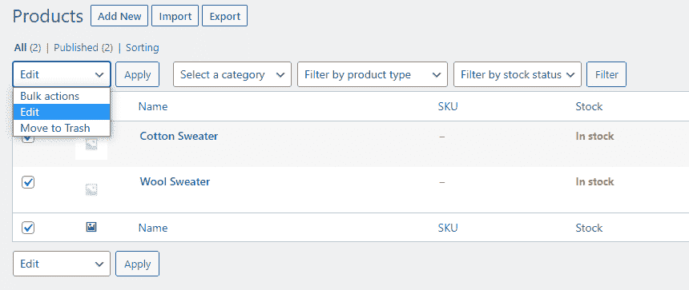

Bulk managing products in WooCommerce.

从出现的批量编辑菜单中，您可以点击**管理库存的下拉菜单。然后**切换到**是**，现在你所有的产品都会启用单个库存管理。

启用后，您可以批量更改*的库存数量设置，将其更改为一个精确的数字或增加或减少一定的数量。*

 *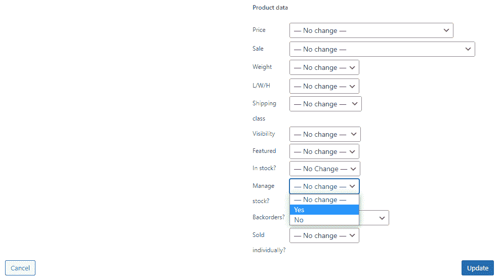

Bulk managing stock quantities.

### 低库存阈值

您可以在两个地方设置低库存阈值:

在 **WooCommerce >设置>产品>库存**中，可以在全球范围内进行更改。您还可以设置是否向库存数量少的客户显示库存数量，以及当产品达到该阈值时谁会收到电子邮件。

Selecting your low stock threshold.

在单个产品的基础上，您可以进入其**编辑**屏幕并向下滚动到**库存**选项卡。确保勾选了**管理库存**，然后更改**低库存阈值**。

### 单独出售

如果你想一次只卖一件产品，去产品的**编辑**页面的*库存*屏幕。启用**单独销售**复选框。这不需要在产品级别打开库存管理。

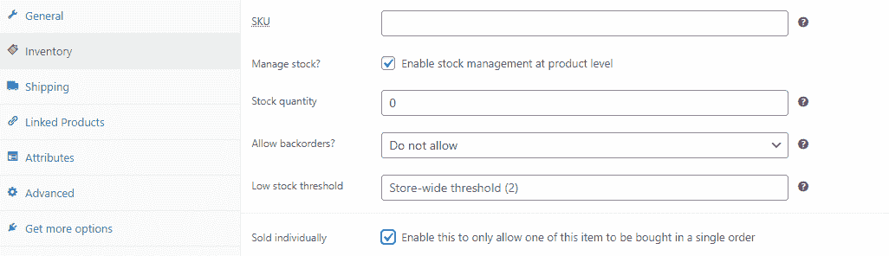

Adding a “sold individually” setting.

您也可以通过批量编辑器打开此设置。

## 如何查看库存状态报告

WooCommerce 包括大量的分析和报告，这些可以用来更好地关注你的股票。

寻找**分析>库存**页面，该页面给出了单位数量和库存状态的概述。点击**产品/变异、SKU、状态或库存**按这些值排序，再次点击可颠倒顺序。

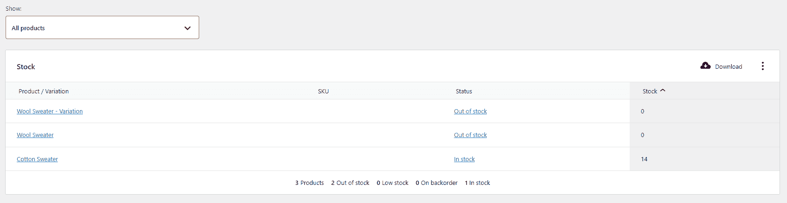

Viewing stock status reports in WooCommerce.

您可以使用**显示**菜单缩小范围，仅显示特定库存状态的产品。例如，您可以立即看到哪些产品缺货或缺货。

## 注册订阅时事通讯

### 想知道我们是怎么让流量增长超过 1000%的吗？

加入 20，000 多名获得我们每周时事通讯和内部消息的人的行列吧！

[Subscribe Now](#newsletter)

## 选择产品类型

WooCommerce 默认自带四种类型的[产品](https://kinsta.com/blog/conversions-woocommerce-product-pages/)。

*   **简单产品**——顾名思义，WooCommerce 中最基本的产品类型。这是一个单独的，可运输的产品，没有独特的变化或分组。
*   **可变产品**–功能类似于简单产品，但包含不同的变化，如颜色或尺寸。这些变化中的每一个本质上都是它的产品，有它的股票编号和 SKU，但是它都被归在一个父产品下。
*   ****分组产品****–这些是捆绑或集合销售的任何其他类型的产品。这个捆绑包由可以单独购买的产品组成，所以如果你缺货，这个捆绑包就不再可用——这就是为什么用 WooCommerce 提供的工具来跟踪这些东西是很重要的。这也不同于[的追加销售和交叉销售](https://woocommerce.com/document/related-products-up-sells-and-cross-sells/)。
*   **外部/附属产品**–这些产品不完全属于您自己；你拿走他们的佣金，一部分给别人。它们通常也在特定的网站上出售。

也有可下载的产品，去除了运输方面，在你的商店里出售虚拟物品。你可能不需要担心这类产品的库存跟踪。

## 2022 年 16 个最佳 WooCommerce 库存管理插件

你知道如何浏览 WooCommerce 的股票设置；如何让它为您独特的业务设置工作？这 16 个插件，无论是免费的还是付费的，都在 WooCommerce 的基础上提供了额外的功能。

### 查看我们的视频指南[最佳 WooCommerce 插件](https://www.youtube.com/watch?v=NUDHD5--b_g)

想在你的实体店处理股票？跟踪特定位置的原材料或库存？还是彻底改革这一体系？看看这些插件。

### ATUM 库存管理

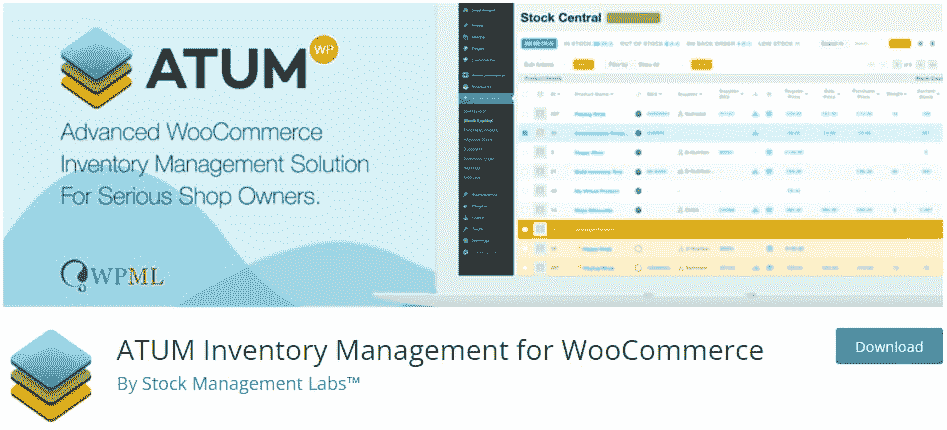

ATUM Inventory Management.

ATUM 是 WooCommerce 库存管理能力的一个升级。它拥有你需要的所有高级股票跟踪功能，而且是免费的。有没有功能锁定后，支付每月计划。

然而，一些额外的附加功能可以实现自动导出、多地点或多供应商库存跟踪以及物料清单管理。

如果你知道你需要比 WooCommerce 默认提供的更强大的工具，看看 ATUM 吧。

### 多地点库存管理

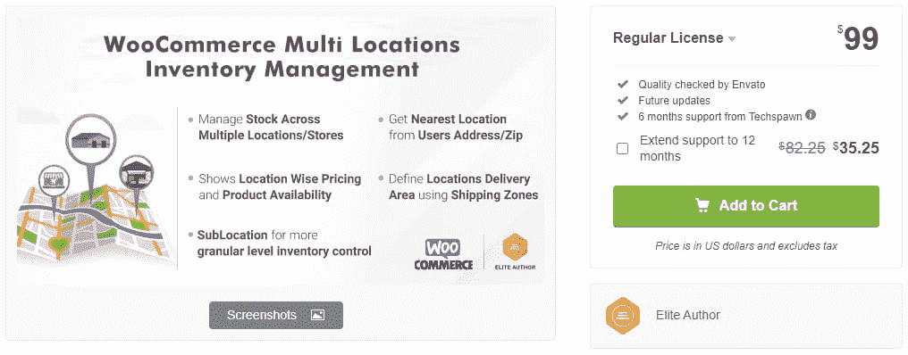

Multi Locations Inventory Management.

WooCommerce 有一些多地点/全球销售工具，但在多个地点的库存管理方面却相当欠缺。这个插件将解决这个问题，同时对特定地点的运输和订购进行更好的控制。

需要免费的替代品吗？查看 WooCommerce 的[库存位置。](https://wordpress.org/plugins/stock-locations-for-woocommerce/)

### 武士刀

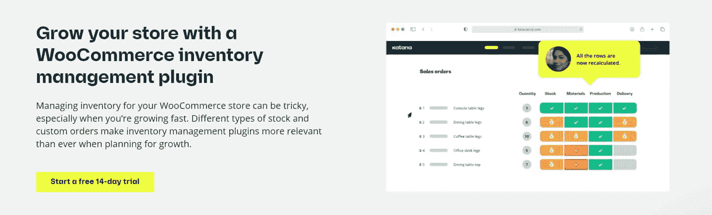

Katana.

武士刀是一种强大的制造企业工具，旨在让您完全控制自己的库存。

虽然它可以用于任何企业或平台，但它有一个 WooCommerce 插件，可以与你的 [WordPress 商店](https://kinsta.com/blog/woocommerce-crm/)同步，以保持库存最新，并跟踪原材料和标准产品。

Struggling with downtime and WordPress problems? Kinsta is the hosting solution designed to save you time! [Check out our features](https://kinsta.com/features/)

它还附带了数百个与其他业务工具的集成，以及一个 API 来进行您自己的定制集成。当然，你还可以使用武士刀所有常用的库存管理功能。

### WooCommerce 手推车货箱减速器

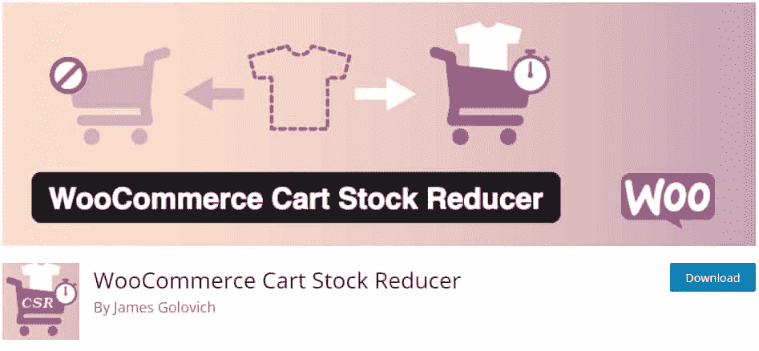

WooCommerce Cart Stock Reducer.

在顾客购买之前，WooCommerce 不会减少商品的库存数量。尽管如此，当有人将一件商品放入他们的[购物车](https://kinsta.com/blog/shopping-cart-abandonment/)时，你可能希望它暂时减少，如果他们不购买，它最终会过期。这个小插件旨在解决这个特定的问题。

### 产品进出口

Product Import Export for WooCommerce.

有了这个插件，你不仅可以导入和导出你的产品本身的 CSV 文件，还可以导入和导出它们的图片、顾客评论或者各种属性和标签。唯一的缺点是免费版不支持可变产品。

### WooCommerce 属性股票

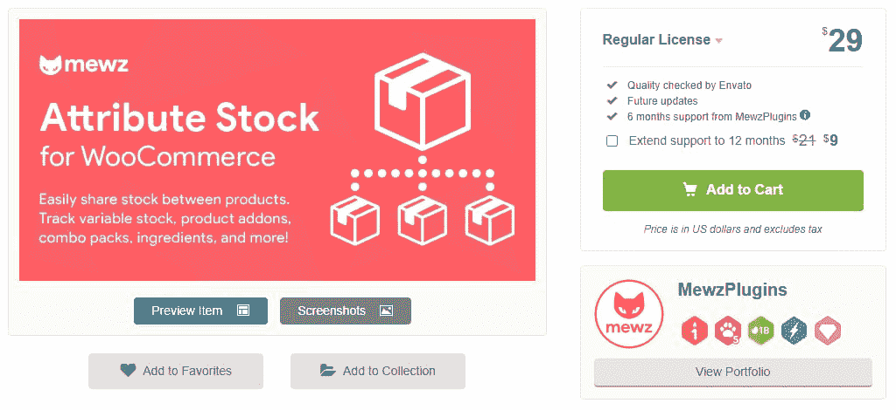

WooCommerce Attribute Stock.

属性股票插件让 WooCommerce 的股票跟踪功能更加强大。如果你发现默认的不支持你的利基用例，这是一个插件可能会解决这个问题。它可以让您跟踪属性，并在多个产品之间共享库存。

一个很好的例子是卖项链的商店；有了这个插件，你可以单独追踪可用的链子和挂件的数量。所以如果你用完了一定长度的链子，你所有的项链都会断货。

### 库存管理

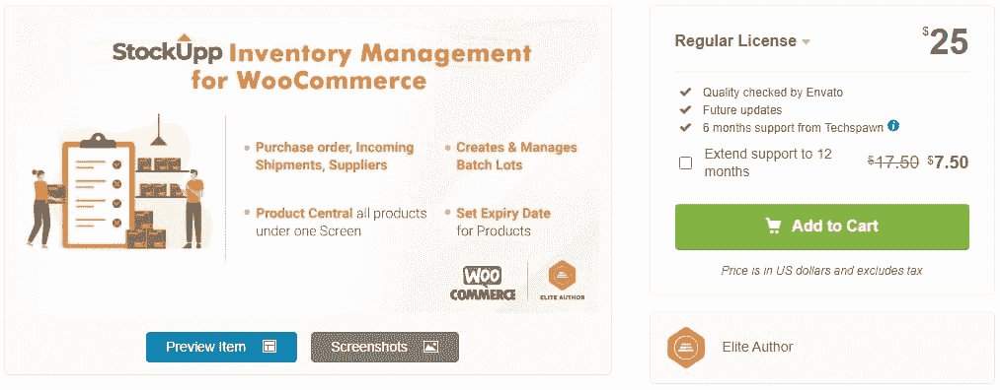

StockUpp Inventory Management.

如果你想要一个类似库存管理 ERP 的东西，但是规模要小一点，试试 StockUpp。它有一些有价值的特性，比如更全面的库存管理、供应商跟踪和批量处理，但它并不昂贵，也不难使用。

### WooCommerce 的智能管理器

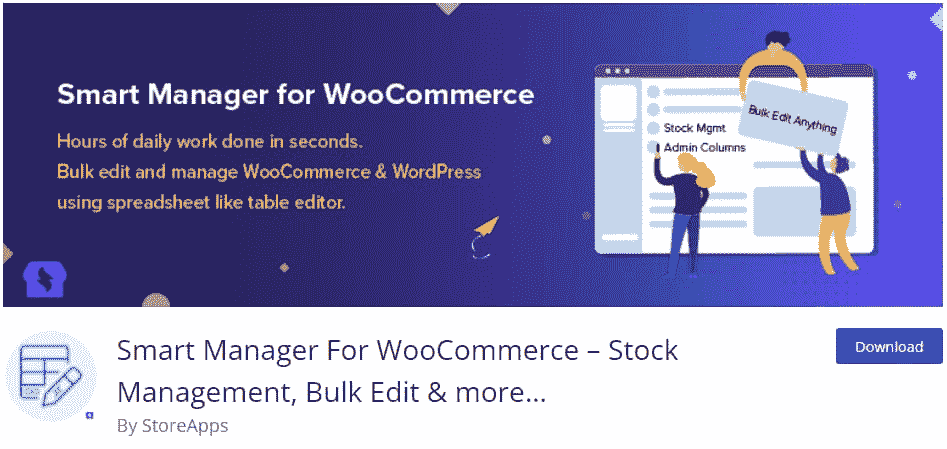

Smart Manager for WooCommerce.

这个插件不仅有益于库存管理，也有益于你的整个商店。您可以通过一个类似 Excel 的屏幕和一个更高效的批量编辑菜单来管理您的所有产品和库存。这一定会节省你很多时间。

### WooCommerce 和 Zoho CRM 的集成

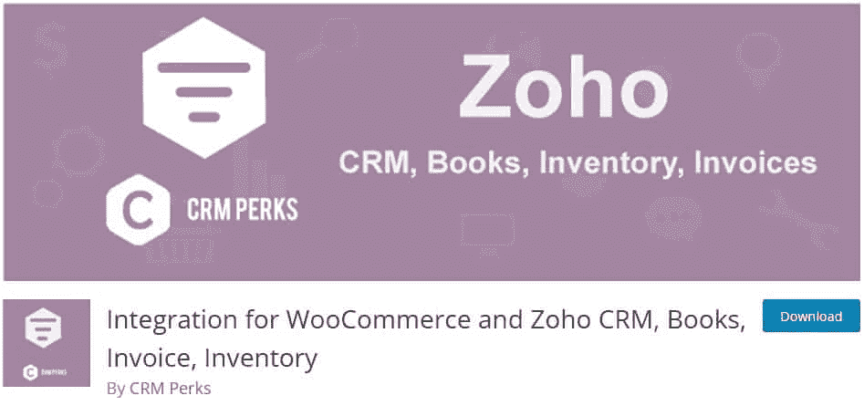

Integration for WooCommerce and Zoho CRM plugin.

Zoho 是一套各种各样的企业工具，从 Zoho CRM 到 Zoho Inventory，多亏了这个插件，你可以将它的所有功能集成到 WooCommerce 中。通过一点设置，一切都将完全同步和自动化。

### WooCommerce 的库存经理

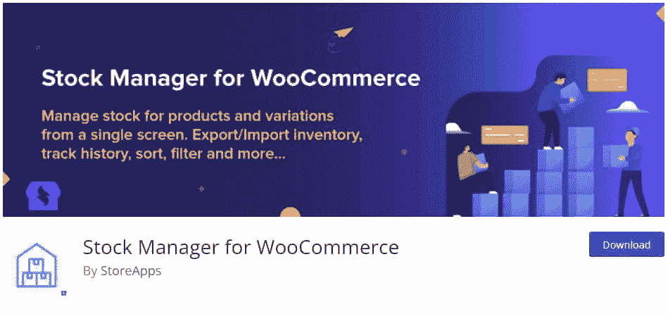

Stock Manager for WooCommerce.

如果你想在一个屏幕上管理你所有的股票，分类，编辑，导出，试试[股票管理器](https://wordpress.org/plugins/woocommerce-stock-manager/)插件。它是免费的，没有高级锁定功能，所以你看到的就是你得到的。

### WooCommerce Quickbooks 连接器

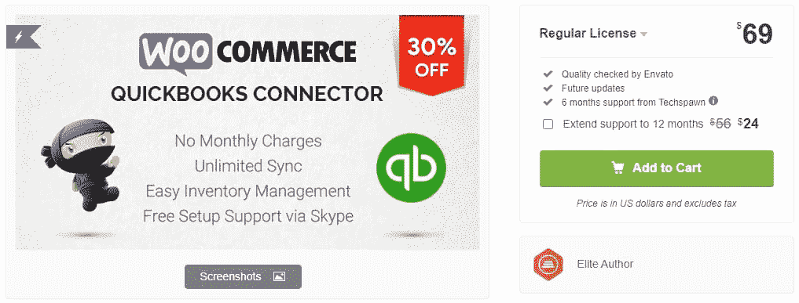

WooCommerce Quickbooks Connector.

Quickbooks 会计软件是商业界的热门选择，因此[与 WooCommerce](https://codecanyon.net/item/woocommerce-quickbooks-connector/21735715) 的整合是有益的。这样，两个平台之间的所有东西都可以双向同步。它还兼容各种其他库存管理插件。

### WooCommerce 的股票同步

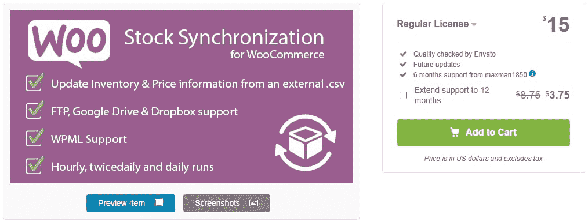

Stock Synchronization for WooCommerce.

如果您使用供应商提供的外部 CSV 文件跟踪您的库存，这是[完美的解决方案](https://codecanyon.net/item/stock-synchronization-for-woocommerce/19425704)。它将保持你的股票同步，所以你不再需要手动更新每当你得到一批货。

### 高级通知

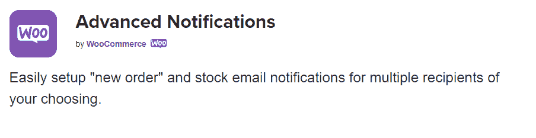

Advanced Notifications.

虽然 WooCommerce 有一个基本的库存状态通知系统，但对许多商店来说还不够。[高级通知](https://woocommerce.com/products/advanced-notifications/)让您能够更好地控制流程，让您向第三方发送电子邮件，并定制他们获得通知的产品。

### WooCommerce 的中央库存

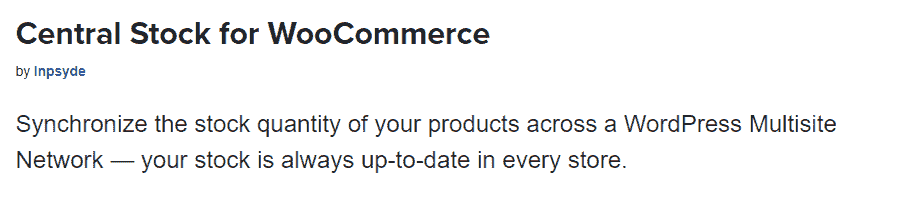

Central Stock for WooCommerce extension.

建立几个商店都使用来自同一个仓库的库存会带来很多挑战，但是 [Central Stock](https://woocommerce.com/products/centralstock-for-woocommerce/) 插件使得处理起来更容易。现在你可以在同一网络的多个网站上同步股票。

### 哎哟

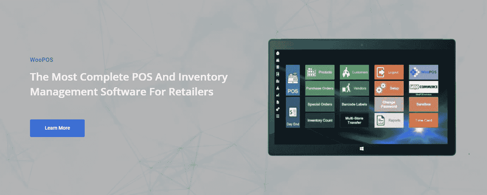

WooPOS.

如果你有一个实体店和一个网店，同步股票可能会变得棘手。WooPOS 是一个销售点系统，一个客户关系管理系统，也是一个强大的库存管理工具。一切都在这里，它可以跨多个物理和数字店面工作。

### WooCommerce 的批量表格编辑器

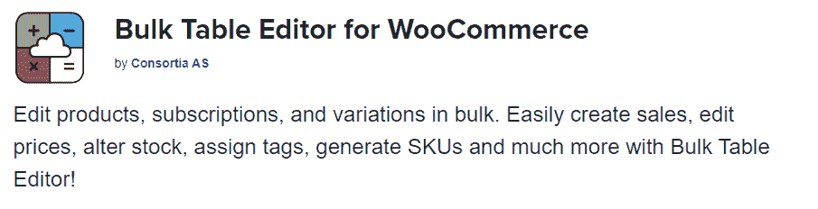

Bulk Table Editor for WooCommerce.

当你的商店变得非常大，有成百上千的产品时，一个好的[批量编辑器](https://woocommerce.com/products/bulk-table-editor-for-woocommerce/)是最好的投资之一。有了这个插件，管理你的库存和 SKU 将不再是一个麻烦。

[A good ecommerce platform will make it easy to keep track of stocks on your website & tailor itself to your unique business situation. 🛒 Does WooCommerce stack up? 👀Click to Tweet](https://twitter.com/intent/tweet?url=https%3A%2F%2Fbit.ly%2F3tFltDp&via=kinsta&text=A+good+ecommerce+platform+will+make+it+easy+to+keep+track+of+stocks+on+your+website+%26amp%3B+tailor+itself+to+your+unique+business+situation.+%F0%9F%9B%92+Does+WooCommerce+stack+up%3F+%F0%9F%91%80&hashtags=WooCommerce%2Cecommerce) ## 摘要

乍看起来，WooCommerce 似乎是一个简单的工具，但有成千上万的附加组件和计数使它比你想象的更强大。

即使没有插件，WooCommerce 也有你入门所需的所有基本库存管理工具。有了附加组件，你几乎可以做任何事情。虽然这些额外的插件可能要花钱，但 WooCommerce 本身是免费的，不像类似的电子商务 CMS。

与 Shopify 等类似工具相比，WooCommerce 可能没有那么强大的库存管理功能。尽管如此，只要添加几个附件，你就能很好地建立一个简单、自动化、高效的系统。

现在你已经准备好尝试 WooCommerce 了，来看看我们的权威指南《如何促进 WooCommerce 在 T2 的销售》。对于新老商场来说，这是一个很好的指南。

* * *

让你所有的[应用程序](https://kinsta.com/application-hosting/)、[数据库](https://kinsta.com/database-hosting/)和 [WordPress 网站](https://kinsta.com/wordpress-hosting/)在线并在一个屋檐下。我们功能丰富的高性能云平台包括:

*   在 MyKinsta 仪表盘中轻松设置和管理
*   24/7 专家支持
*   最好的谷歌云平台硬件和网络，由 Kubernetes 提供最大的可扩展性
*   面向速度和安全性的企业级 Cloudflare 集成
*   全球受众覆盖全球多达 35 个数据中心和 275 多个 pop

在第一个月使用托管的[应用程序或托管](https://kinsta.com/application-hosting/)的[数据库，您可以享受 20 美元的优惠，亲自测试一下。探索我们的](https://kinsta.com/database-hosting/)[计划](https://kinsta.com/plans/)或[与销售人员交谈](https://kinsta.com/contact-us/)以找到最适合您的方式。*