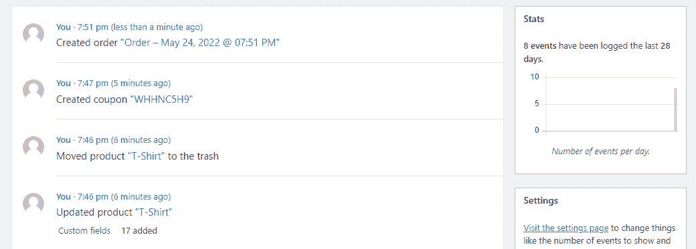
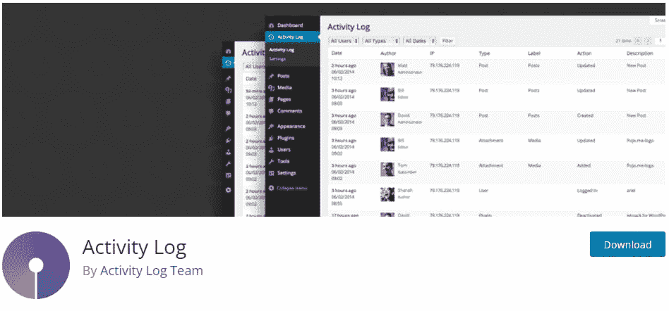
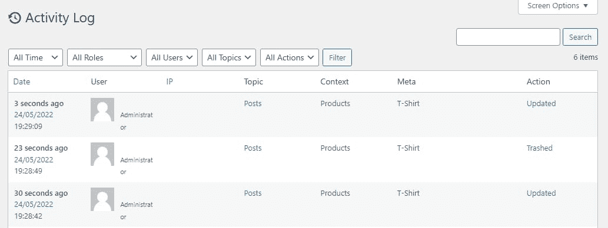
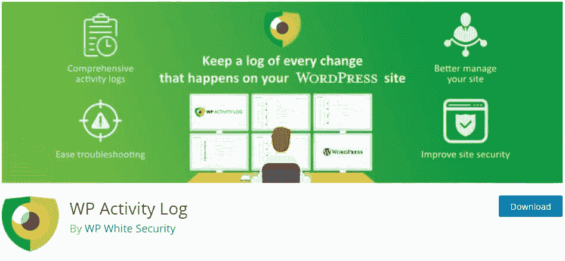
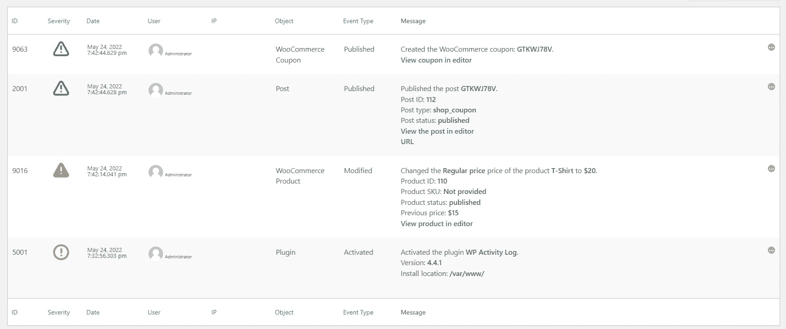
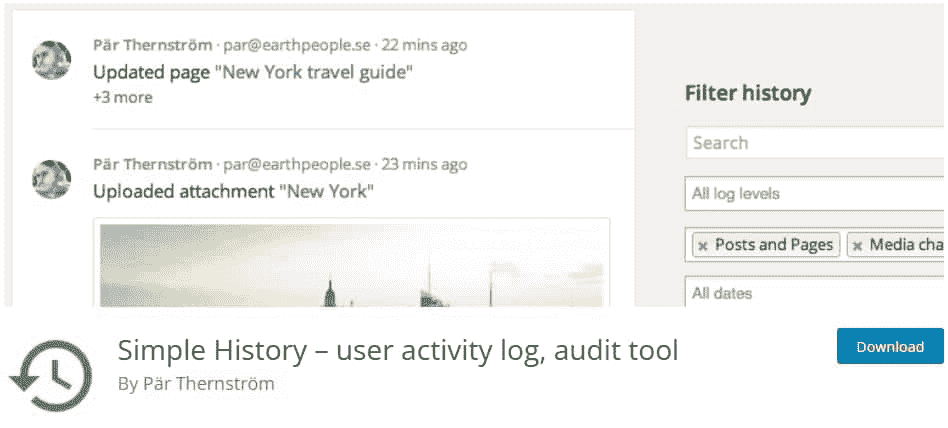
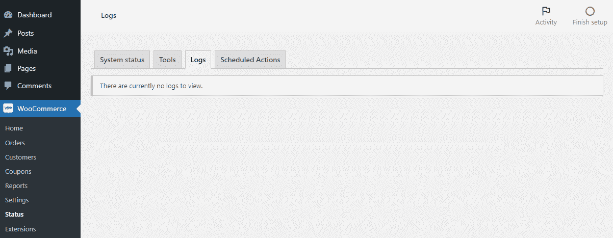
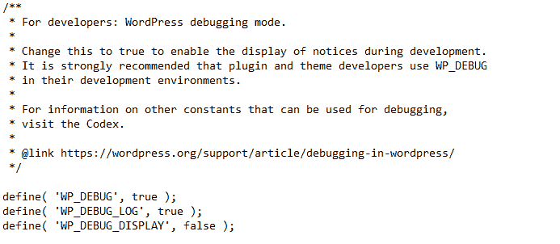

# 如何跟踪 WooCommerce 日志记录(以及为什么应该这样做)

> 原文：<https://kinsta.com/blog/woocommerce-logging/>

如果你还没有设置 WooCommerce 日志记录，现在是时候了。[如果你的商店出现问题，错误跟踪](https://kinsta.com/knowledgebase/wordpress-error-log/)会非常有用，而一般活动跟踪可以让你很好地了解其他用户正在对 WooCommerce 设置进行的更改。

如果您的存储出现故障，或者在没有明确来源的情况下开始发生奇怪的变化，这些日志可能对解决问题至关重要。

好奇 WooCommerce 后端发生了什么？让我们在 WooCommerce 中设置登录，这样你就可以随时准确地知道你的后端发生了什么。

## 什么是 WooCommerce 日志？

[登录和调试](https://kinsta.com/blog/wordpress-debug/)是运营一个网站非常重要的部分。当你使用 WordPress 或 WooCommerce 等工具时，它会在后台跟踪你网站上发生的各种活动。

这些事件被编译成日志文件，以便于查看。您通常不需要密切关注活动日志，但是当您的站点开始出现问题或某个设置似乎自行改变时，访问它们会非常有帮助。


> 需要在这里大声喊出来。Kinsta 太神奇了，我用它做我的个人网站。支持是迅速和杰出的，他们的服务器是 WordPress 最快的。
> 
> <footer class="wp-block-kinsta-client-quote__footer">
> 
> 
> 
> <cite class="wp-block-kinsta-client-quote__cite">Phillip Stemann</cite></footer>

[View plans](https://kinsta.com/plans/)

但是这些日志可能会使不知道如何调试的初学者感到困惑、误导或不必要的担心，所以许多工具在默认情况下会关闭它们。

比如 WordPress 内置了调试；你只需要[打开调试模式](https://kinsta.com/help/wordpress-enable-debug/)开始记录。

WooCommerce 的工作方式大致相同。在没有插件的情况下，它提供了跟踪某些类型的错误并记录它们的能力，以防你需要调试一个损坏的店面或奇怪的站点行为。这些可以在你网站的文件中或者通过你的[仪表盘](https://kinsta.com/blog/wordpress-custom-dashboard/)找到。

[If you haven’t set up WooCommerce logging yet, consider this your sign to do so. 👀Click to Tweet](https://twitter.com/intent/tweet?url=https%3A%2F%2Fbit.ly%2F3apRGb5&via=kinsta&text=If+you+haven%E2%80%99t+set+up+WooCommerce+logging+yet%2C+consider+this+your+sign+to+do+so.+%F0%9F%91%80&hashtags=WooCommerce%2CEcommerce)

### WooCommerce 活动日志

活动日志是一个特性，虽然默认情况下没有内置到 WooCommerce 中，但仍然非常重要。这些日志记录了任何设置更改以及谁对这些更改负责。

WooCommerce 活动日志可以跟踪现有订单的更新、[产品描述](https://kinsta.com/blog/conversions-woocommerce-product-pages/)、[库存数量](https://kinsta.com/blog/woocommerce-inventory-management/)、价格、优惠券代码、商店设置，以及基本上 WooCommerce 提供的任何其他功能。



The WooCommerce activity log.


它还会告诉您什么用户在什么时候做了这个更改。当发生特定的敏感更改时，您也会收到警报。

如果你的网站有多个商店经理，这是至关重要的。如果有人改变了他们不应该改变的设置，会引起很多混乱。但是有了活动日志，你马上就能知道是谁进行了切换。

但是，即使你自己经营一家商店，这仍然是一个重要的功能。有时您可以无意中更改某些内容，活动日志将允许您找到问题并回滚。或者，如果你遭到黑客攻击，你将能够快速识别任何可疑的行为。

WooCommerce 默认不包含活动日志，所以你需要安装一个插件来启用这个功能。

### WooCommerce 错误日志

与活动日志不同，WooCommerce 内置了[错误日志](https://woocommerce.com/document/finding-php-error-logs/)。它跟踪两种类型的错误:致命错误和一般 PHP 错误。

致命错误是由错误代码导致的一种严重错误，它会导致操作无法完成。WooCommerce 可能会调用一个不存在的函数，陷入一个无限的代码循环，或者试图做一些你的服务器不允许的事情。

有时一个致命的错误可能没有明显的影响，但其他时候它可能会破坏你的部分商店，甚至导致你的整个网站[停止加载](https://kinsta.com/blog/woocommerce-apm/)。

一般的 PHP 错误就不那么重要了。WordPress 本身是建立在 PHP 之上的，WooCommerce 等插件也是如此。网站上不断出现错误，通常是由于不正确的编码语法或小冲突。有时它们会引起明显的问题，而有时你根本不会注意到它们。

但是关注你网站上的错误是一个好主意，尤其是致命的错误。它们可能表示需要立即修复的问题。

## 为什么你应该监控你的网络商务日志

忽视你的日志可能是一个大错误。尽管需要一点设置，但还是值得花时间确保你的 WooCommerce 商店正在[监控活动和错误](https://kinsta.com/blog/application-performance-monitoring/)。

虽然它可能在大多数情况下没有影响，但当你的网站出现问题或出现无法解释的变化时，它将成为救命稻草。日志让您知道发生了什么，何时何地，因此您可以轻松地识别问题并回滚更改。

如果您密切关注您的日志，经常检查它们或设置自动通知，它们可以让您在问题失控之前发现问题。

错误可能随时出现，导致您的商店无法使用。或者有人可能——意外地或恶意地——改变设置，扰乱一些重要的东西，如产品定价或[结账页面](https://kinsta.com/blog/woocommerce-checkout/)功能。你可能不会注意到这个问题，直到你损失了几周或几个月的收入。

但是如果你监控你的日志，你会在任何破坏性的事情发生之前就意识到。当严重的错误使你的网站瘫痪、设置改变、产品或订单更新时，你总是能马上知道。

如果你的商店曾经被黑客攻击和破坏，它会立即明显地显示出记录的一串价格被彻底改变，描述被更新，整个产品被删除。

最后，[日志记录可以帮助您在某些情况下保持 GDPR 合规性](https://logsentinel.com/blog/gdpr-logging-requirements/)。大多数活动日志插件应该包括一种向用户提供收集到的数据的方式，这是 GDPR 所要求的。WooCommerce 还提供内置的 [GDPR 功能](https://developer.woocommerce.com/2018/05/04/woocommerce-3-4-gdpr-features/)。

## 如何跟踪 WooCommerce 活动日志

插件没有提供活动日志，所以为此，你需要一个 [WooCommerce 扩展](https://kinsta.com/blog/woocommerce-plugins/)。这三种方式各有利弊，所以让我们快速了解一下每种方式的工作原理。

你可以通过进入**插件>添加新的**并搜索其标题来安装任何插件，或者通过它们的链接下载这些插件并使用**上传插件**按钮上传文件。

### 1.活动日志



Activity Log plugin


名副其实的[活动日志](https://wordpress.org/plugins/aryo-activity-log/)插件旨在监控核心 WordPress 活动以及包括 WooCommerce 在内的多个插件。它优化得很好，并使用自己的数据库表，所以你不会注意到任何减速。

一旦你安装了它，你会在你的仪表盘顶部发现一个新的**活动日志**菜单。您将看到一个简单的、切中要害的菜单，其中列出了所有最新的活动、用户(及其背后的 IP)负责的内容以及任何其他上下文。



Activity Log in action


唯一的缺点是，在大多数情况下，它不会向您确切地显示出发生了什么变化，只显示出发生了变化。

## 注册订阅时事通讯


### 想知道我们是怎么让流量增长超过 1000%的吗？

加入 20，000 多名获得我们每周时事通讯和内部消息的人的行列吧！

[Subscribe Now](#newsletter)

您还可以配置这些设置，以便将日志保留更长或更短的时间，或者在日志占用太多空间时将其从数据库中清除。

总的来说，如果你只需要对你的商店发生的事情有一个大概的了解，这是一个很好的选择。没有付费功能；所见即所得。

### 2.WP 活动日志 WooCommerce 的 WP 活动日志



WP Activity Log


WP 活动日志有助于详细监控你网站上发生的变化，还有一个 [WooCommerce 扩展](https://wordpress.org/plugins/wp-activity-log-for-woocommerce/)可以提供更多洞察。虽然一些功能(电子邮件通知、日志搜索、编译报告等)是高级版，但免费用户可以访问一系列选项。

安装后，看看你仪表板上新的 **WP 活动日志**菜单。使用**日志查看器**查看任何记录的事件，调整**设置**进行精细控制，并使用**启用/禁用事件**菜单准确记录您想要的事件。在该页面的类别菜单下，选择 **WooCommerce** 以缩小列表范围，仅显示商店活动。

日志非常详细，告诉您具体发生了什么变化，以及用户和 IP 等常见信息。



WP Activity Log offers detailed logs.


这是一个非常复杂的插件，有大量的设置和功能，所以如果你想对你的日志有更多的控制，以及关于到底发生了什么变化的完整信息，这是一个适合你的。

### 3.简单的历史



Simple History plugin.


有时候简单是管理网站的最好方法。如果你需要一个没有任何麻烦的活动日志器，[简单历史](https://wordpress.org/plugins/simple-history/)是一个不错的选择。它和 WooCommerce 以及你的网站的其他部分一起工作，给你一个正在发生的变化的基本概念。

你可以在**仪表盘>简史**中找到你的日志页面，在**设置>简史**中找到你的设置页面。日志可以保存 60 天，你可以搜索关键词。

界面友好优雅，所以如果日志插件中经常出现的混乱困扰着你，你可以享受简单的历史。


## 如何跟踪 WooCommerce 错误日志

可以用一个简单的插件来启用活动日志，但是对于错误日志，您可能需要做一些额外的设置。

如果您只想看到致命的错误，从您的仪表板上访问它是很容易的。但是，如果你想看到一般的 PHP 错误或添加自定义日志条目，这将需要更多的工作。只有当你是高级用户并且熟悉 PHP 的时候，你才应该这样做。

Struggling with downtime and WordPress problems? Kinsta is the hosting solution designed to save you time! [Check out our features](https://kinsta.com/features/)

在改变你网站上的任何敏感文件或添加任何代码之前，你应该总是[创建一个备份](https://kinsta.com/help/external-backups/)以防出错。您可以在 Kinsta 仪表盘中轻松进行备份。另外，看看[如何备份你的 WooCommerce 数据库](https://kinsta.com/blog/how-to-backup-woocommerce-database/)。

### 追踪 WooCommerce 记录

致命错误在 WooCommerce 中非常容易定位。你的日志可以在 **WooCommerce >状态**中找到。然后点击顶部的**日志**标签。

单击下拉菜单将其打开。如果你的站点产生了一个致命的错误，你会发现一个日志在这里等着你。选中它，点击**查看**看看发生了什么。

您将能够判断错误发生的时间以及可能导致错误的一些代码。如果您熟悉 PHP，这可以为您指出解决问题的正确方向。

如果您在这里没有看到任何致命的错误日志，这意味着您的站点工作正常，没有任何问题。每隔一段时间检查一次，以确保一切仍在顺利运行。如果你的商店开始出现问题，这应该是你首先要找的地方。



Checking logs in WordPress.


如果你想直接访问日志文件，你可以在你的站点的**/WP-content/uploads/WC-logs**文件夹中找到它们。您可以使用 [FTP 将](https://kinsta.com/blog/best-ftp-clients/)连接到您的站点并查看日志，尽管使用仪表板通常更方便。

您可能还想整体访问 PHP 错误日志，因为它们提供了比输出到 WooCommerce 的致命错误更多的信息。

安装一个 FTP 程序，如 [FileZilla](https://kinsta.com/blog/best-ftp-clients/#Filezilla) ，并从您的主机获取您的 FTP 凭证。Kinsta 用户可以在 MyKinsta 的**网站>信息**下找到这些。

连接到您的站点并找到 error.log 文件，该文件可能位于多个位置，但通常位于根文件夹、 **public_html** 或 **var/log** 文件夹中。

如果您正在使用金士塔，您也可以访问我的金士塔中**网站>日志**下的[错误日志文件](https://kinsta.com/knowledgebase/wordpress-error-log/)，无需 FTP。

### 启用 WooCommerce 调试

如果你有一个问题，你可以尝试[启用调试模式](https://kinsta.com/blog/wordpress-debug/)。这将开始主动将错误记录到您可以在服务器上找到的文件中。

使用 FTP 程序访问你的服务器，在你网站的根文件夹中找到**wp-config.php**。添加以下代码(如果该代码已经存在，则更改现有值):

```
define( 'WP_DEBUG', true );

define( 'WP_DEBUG_LOG', true );

define( 'WP_DEBUG_DISPLAY', false );
```



Adding code to wp-config.php


现在您将能够在 wp-content 文件夹中找到一个新文件: *debug.log* 。

尝试再次触发该问题，并检查 debug.log 以查看输出了什么。这可以帮助你朝着正确的方向解决你的错误。

完成后，请确保再次关闭调试，因为如果长时间打开，可能会出现安全问题。

### 添加自定义日志条目

如果您希望 WooCommerce logger 跟踪一个自定义函数，并像致命错误一样显示在您的仪表板中，该怎么办？这是完全可能的，但是它需要一些 PHP 的高级知识和在你的网站上添加代码的舒适性。

如果你想在不使用活动日志插件的情况下跟踪你的商店上的某些活动，或者如果你想关注 WooCommerce 通常不会输出的错误，这是合适的。

WooCommerce 使用 [WC_Logger](https://woocommerce.github.io/code-reference/classes/WC-Logger.html) 函数来处理日志，你可以使用 [wc_get_logger](https://developer.woocommerce.com/2017/01/26/improved-logging-in-woocommerce-2-7/) 来利用这些日志。你甚至可以用 WC_Log_Handler_DB 把这些日志直接写到你的管理区。

一旦你写好了你的定制代码，你可以使用 FTP 或者*外观>主题文件编辑器*将它插入 functions.php，或者如果你使用大量复杂代码，你可以[创建一个插件](https://developer.wordpress.org/plugins/)。

如果你想看看它的运行，看看这个例子[定制 WooCommerce 日志](https://poststatus.com/woocommerce-function-of-the-week-wc_get_logger/)。

对 WooCommerce 后端发生的事情感到好奇？🛍和这个指南一起潜水吧！🚀 点击推文


## 摘要

建立一个活动日志并关注错误报告是一个好主意，尤其是当你运行像在线商店这样敏感的东西时。

一个小问题可能会对你的电子商务收入造成严重损失。适当的日志记录可以防止问题失控，甚至通过足够的努力阻止问题的发展。管理你的商店的人越多，记录就变得越重要，尽管它甚至对单独的项目也有很大的帮助。

WooCommerce 默认不支持活动日志，所以你需要安装一个插件。错误日志是内置的，但是如果现有的系统不够用，您总是可以用一点代码添加自己的日志。

WooCommerce 是可扩展的，所以一切皆有可能，尤其是如果你有 [WooCommerce 托管](https://kinsta.com/woocommerce-hosting/)使得修改你的网站和访问日志变得容易。

* * *

让你所有的[应用程序](https://kinsta.com/application-hosting/)、[数据库](https://kinsta.com/database-hosting/)和 [WordPress 网站](https://kinsta.com/wordpress-hosting/)在线并在一个屋檐下。我们功能丰富的高性能云平台包括:

*   在 MyKinsta 仪表盘中轻松设置和管理
*   24/7 专家支持
*   最好的谷歌云平台硬件和网络，由 Kubernetes 提供最大的可扩展性
*   面向速度和安全性的企业级 Cloudflare 集成
*   全球受众覆盖全球多达 35 个数据中心和 275 多个 pop

在第一个月使用托管的[应用程序或托管](https://kinsta.com/application-hosting/)的[数据库，您可以享受 20 美元的优惠，亲自测试一下。探索我们的](https://kinsta.com/database-hosting/)[计划](https://kinsta.com/plans/)或[与销售人员交谈](https://kinsta.com/contact-us/)以找到最适合您的方式。