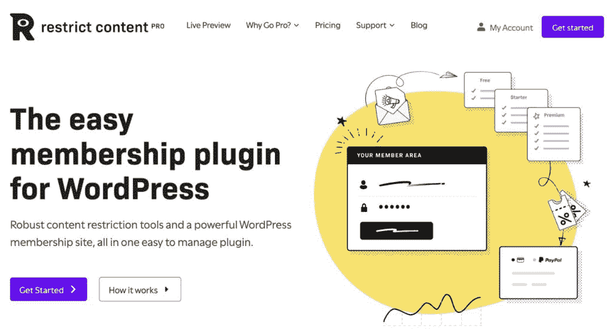
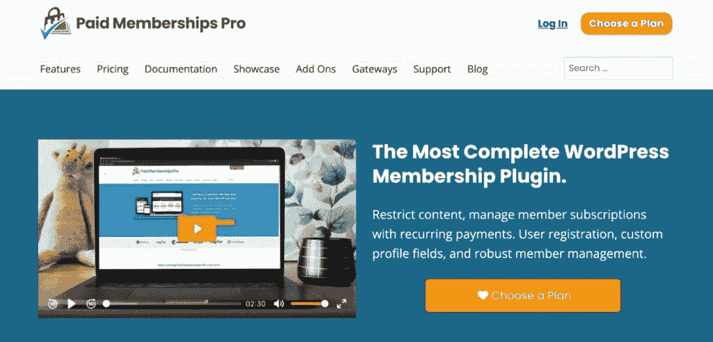
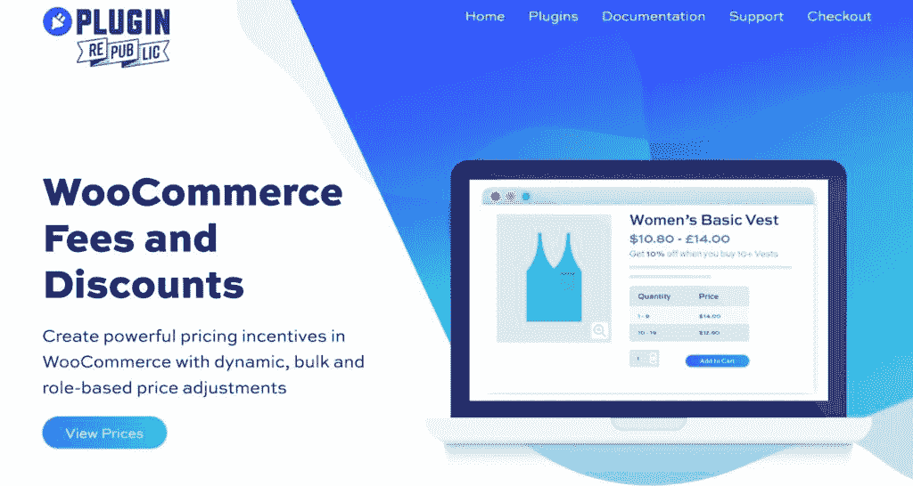
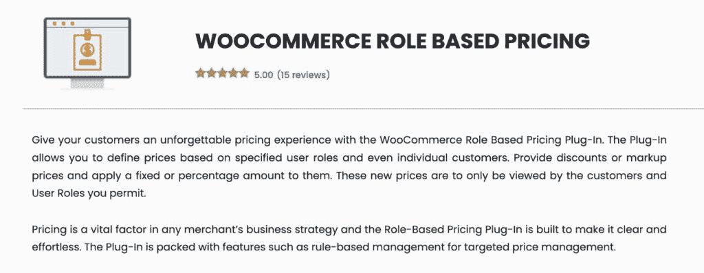
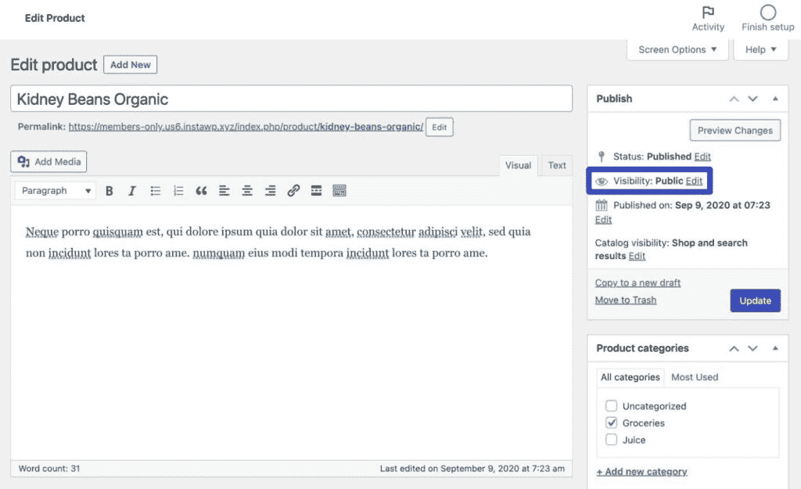
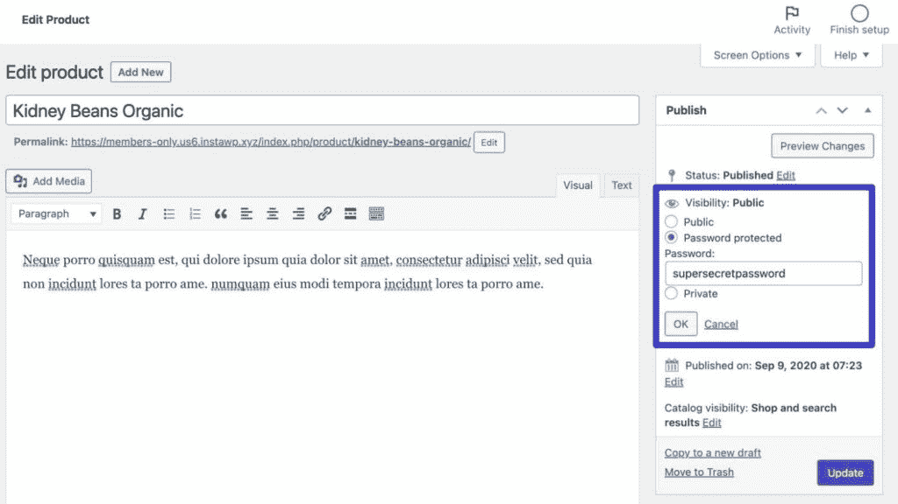
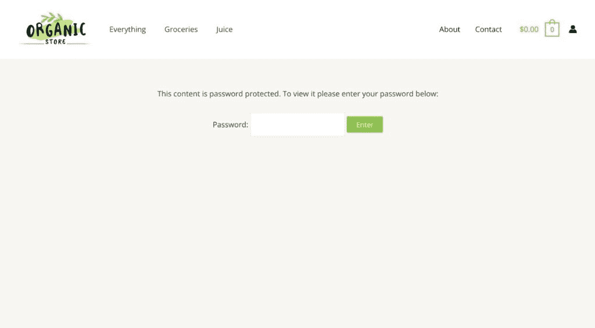

# 如何创建 WooCommerce 会员商店:完整指南

> 原文：<https://kinsta.com/blog/woocommerce-members-only/>

争论创建一个 WooCommerce 会员商店？

提供特殊的会员专属津贴是一种流行的电子商务策略，一些著名的例子是亚马逊 Prime ( *运输津贴*)和好市多(*限制购买俱乐部*)。

使用 [right 插件和工具](https://kinsta.com/blog/woocommerce-extensions/)，您可以轻松地将会员专用功能添加到您的 WooCommerce 商店，包括限制对产品的访问、提供特殊折扣或运输方式等。

在本指南中，你将学习创建 WooCommerce 会员商店的最佳方法，以及如何为你的 WooCommerce 网站选择正确的方法。

## 何时考虑会员专卖店

一个只对会员开放的 WooCommerce 商店可以在几种不同的情况下很好地工作。

在开始建立你的商店之前，重要的是要考虑你想采用什么策略，因为这些选择将决定你的商店的最佳方法。

有两大类仅限成员的功能:

1.  内容限制
2.  特价

[Want to easily add members-only functionality to your WooCommerce store, special discounts or shipping methods, and more? 🛒 Read on...👀Click to Tweet](https://twitter.com/intent/tweet?url=https%3A%2F%2Fkinsta.com%2Fblog%2Fwoocommerce-members-only%2F&via=kinsta&text=Want+to+easily+add+members-only+functionality+to+your+WooCommerce+store%2C+special+discounts+or+shipping+methods%2C+and+more%3F+%F0%9F%9B%92+Read+on...%F0%9F%91%80&hashtags=WooCommerce%2CEcommerce)

### 仅限成员的内容限制

通过内容限制，您可以限制谁可以查看和/或购买您的部分或全部产品。

以下是几个示例，说明何时可以使用这种仅限成员使用的功能:

*   批发商店，只有合格的客户才能获得批发产品。
*   只提供给 VIP 客户的特殊产品。这可以鼓励人们多购物，并促进你商店的销售。
*   仅允许会员购物的购物俱乐部(如好市多)。

### 仅限会员的特别优惠

第二种类型的会员专用功能是向会员提供特别优惠。

以下是一些常见的例子:

*   为会员提供部分或全部产品的折扣。例如，你可以给他们打九折。这类似于许多客户忠诚度计划。
*   为会员提供更低的固定价格。这也适用于批发商店。
*   给予会员特殊的运费优惠，如免运费(如 Amazon Prime)。你甚至可以将此与多供应商市场相结合，以实现真正的亚马逊 Prime 克隆。

你也可以混合搭配这两种策略——许多只对会员开放的 WooCommerce 商店会限制访问*和*提供特殊折扣或送货方式。

## 创建 WooCommerce 会员商店的 3 种方法

如果你想创建一个 WooCommerce 会员商店，有几种不同的方法可以使用:

*   WordPress/WooCommerce 会员插件
*   WooCommerce 基于角色的定价插件
*   内置的 WordPress 密码功能

最适合你的商店的方法取决于你想使用的会员专用设置的类型。

例如，你是想限制对你的产品的访问，还是仅仅给会员一些特殊的优惠，比如产品折扣。

### 1.WooCommerce 会员插件

创建 WooCommerce 会员商店最常见的策略是使用一个全面服务的会员插件,与 WooCommerce 紧密结合。

这些插件处理与会员功能相关的一切，包括创建免费或付费会员级别，将客户添加到这些级别，以及使用这些级别来限制对您的商店的访问和/或提供仅限会员的特权。

#### 优点和缺点

WooCommerce 会员插件的好处:

*   **灵活的内容限制**–您可以根据用户的会员级别轻松限制您的部分/全部内容/产品。
*   **折扣和运输方式**–除了限制，您还可以提供会员专属的特殊折扣或运输方式。
*   **收取会员费**–您可以[收取会员专属福利的访问费](https://kinsta.com/blog/woocommerce-payments/)，以建立额外的收入流(例如，您自己版本的亚马逊 Prime)。
*   **成员管理**–你将获得管理你所有成员的工具，这些工具超越了 WordPress 的内置功能。

WooCommerce 会员插件的缺点:

*   **增加了复杂性**–对于简单的用例，一个完全会员插件可能比你需要的功能更多。
*   **有限的定价规则**–虽然这些插件确实让您可以提供仅限会员的折扣和/或[运送方式](https://kinsta.com/blog/woocommerce-weight-based-shipping/)，但您无法像使用专用定价插件那样灵活地配置定价规则。

#### 4 大 WooCommerce 会员插件

如果你想使用会员插件来创建你的会员商店，这里有一些首选:

##### 1.网络商务会员

WooCommerce Memberships

WooCommerce Memberships 是一个专门建立在 WooCommerce 基础上的会员插件，这有助于它为建立会员商店提供最大的灵活性(*尽管它也适用于非 WooCommerce 内容*)。

您可以创建无限的免费或付费会员级别，并以多种方式使用它们:

*   限制查看和/或购买产品的权限。
*   向会员提供特别折扣。
*   给予会员免运费或运费折扣。

WooCommerce 会员费为 199 美元，可在一个网站上使用。如果你想对你的会员资格收取定期订阅费，你还需要购买 199 美元的 WooCommerce 订阅插件[，它可以让你出售订阅产品](https://kinsta.com/blog/woocommerce-subscriptions/)。

##### 2.付费会员订阅

Paid Member Subscriptions

[付费会员订阅](https://www.cozmoslabs.com/wordpress-paid-member-subscriptions/)是创建会员商店的一个很好的预算选择。

它可以让您创建无限的免费或付费会员级别，并限制查看或购买您的产品。

您还可以设置产品折扣规则，为会员提供部分/全部产品的特殊折扣。

然而，没有办法向会员提供运输补贴。

如果你不介意这个限制，它是这个列表中最便宜的选择，因为它的起价仅为 69 欧元。还有一个免费版本，虽然免费版本不允许你提供会员折扣。

##### 3.限制内容专业版

Restrict Content Pro

[Restrict Content Pro](https://restrictcontentpro.com/) 是一款功能全面的会员插件，让您使用无限的免费或付费会员级别，轻松限制对部分或全部产品的访问。

除了产品限制之外，它还允许你通过将 WooCommerce 优惠券与会员级别相关联来设置会员专属的额外待遇。

这给了你很大的灵活性，因为你可以利用所有的优惠券选项，包括产品折扣和运输折扣。

然而，这种方法的缺点是，这意味着会员在进入购物车页面之前看不到他们的折扣，这可能会降低你的转化率。例如，您可以给他们所有产品打九折，但是单个产品页面上的价格还没有反映折扣。

对于 WooCommerce 功能，Restrict Content Pro 在一个网站上的使用费用为 99 美元。还有一个免费版本。

##### 4.专业付费会员

Paid Memberships Pro

付费会员是另一个拥有强大 WooCommerce 功能的全方位服务会员插件。

它还可以让您创建无限的免费或付费会员级别，然后您可以使用…

*   限制查看或购买产品的权限。
*   提供特别折扣。
*   给免运费。

该插件有一个免费版本，提供核心功能，还有一个免费的 WooCommerce 集成，只提供会员折扣。

为了提供免费运输津贴和更高级的会员功能，高级版起价为 247 美元。

##### WooCommerce 会员插件比较

下面是每个插件中 WooCommerce 会员专用功能的快速对比。

| **插件** | **产品限制** | **产品折扣** | **运输补贴** | **价格** |
| 网络商务会员 | 981 号房 | 981 号房 | 981 号房 | $199 |
| 付费会员订阅 | 981 号房 | 981 号房 | -好的 | 免费/69 欧元 |
| 限制内容专业版 | 981 号房 | 981 号房 | 981 号房 | 免费/99 美元 |
| 专业付费会员 | 981 号房 | 981 号房 | 981 号房 | 免费/247 美元 |

如果你想看到更多的选项，你可以阅读我们的完整综述，包括[最佳 WordPress 会员插件](https://kinsta.com/blog/wordpress-membership-plugins/)和[最佳会员主题](https://kinsta.com/blog/wordpress-membership-theme/)。然而，请记住，并不是每个会员插件都提供 WooCommerce 支持(尽管我们上面提到的所有插件都提供)。

如果你正在使用会员插件来创建你的网站，你也会想阅读关于 T2 的一些重要的托管会员网站的注意事项。如果你[是 Kinsta 的客户](https://kinsta.com/)，我们还有[一个关于用 Kinsta APM](https://kinsta.com/blog/membership-website-speed/) 优化会员网站性能的指南。

### 2.WooCommerce 基于角色的定价插件

如果你想使用你的会员商店根据购物者的会员身份提供不同的价格，你也可以使用 WooCommerce 定价插件。

## 注册订阅时事通讯

### 想知道我们是怎么让流量增长超过 1000%的吗？

加入 20，000 多名获得我们每周时事通讯和内部消息的人的行列吧！

[Subscribe Now](#newsletter)

这些插件让你根据一系列不同的标准来改变产品的价格。对于会员制商店，最常见的方法是根据购物者的[用户角色和能力](https://kinsta.com/blog/wordpress-user-roles/)来调整产品价格。

对于一些会员商店，你可以使用*只是*一个定价插件。在其他情况下，您可能希望将一个定价插件与一个会员插件配对，以获得更大的灵活性。
T3】

#### 优点和缺点

WooCommerce 定价插件的好处:

*   **更灵活的定价规则**–除了根据用户的角色改变价格，您还可以添加其他条件，例如提供基于角色的批量折扣。这可以使这种方法成为批发商店或其他需要更高级价格调整的会员专属机构的更好选择。
*   **使用现有的用户角色功能**——如果你已经给成员分配了一个特殊的 WordPress 用户角色，这些插件可以让你很容易定位到那个角色。也就是说，你不需要像使用会员插件那样设置额外的会员级别。

WooCommerce 定价插件的缺点:

*   **无用户注册功能**–定价插件不包括在您的网站上注册会员的功能。出于这个原因，你通常会希望将这种方法与专用的用户注册插件[结合起来创建一个单独的注册表单](https://kinsta.com/blog/wordpress-registration-form/)和一个安全的登录表单。
*   **仅适用于免费会员资格**–单独使用定价插件不会像会员插件一样对会员专用的访问收取一次性或经常性费用。
*   **无内容限制**–你通常无法用这种方法限制对你网站上任何内容/产品的访问。
*   **没有单独的会员管理**–你没有任何单独的区域来管理会员和控制会员级别。相反，你需要依赖内置的 WordPress 用户角色系统，如果你有很多成员，这可能会很麻烦。

#### 3 大 WooCommerce 定价插件

如果你想使用一个价格插件来创建你的会员商店，这里有一些首选:

##### 1.WooCommerce 费用和折扣

WooCommerce Fees and Discounts

[WooCommerce 费用和折扣](https://pluginrepublic.com/wordpress-plugins/woocommerce-fees-and-discounts/)是一个高级插件，允许您设置所有类型的基于角色的价格调整，包括以下内容:

*   上调或下调部分或全部产品的价格。例如 10%的折扣。
*   设定固定的产品价格。
*   提供批量折扣。
*   不含税。

它值 59 美元。

##### 2.网络商务的折扣规则

Discount Rules for WooCommerce

【WooCommerce 的折扣规则有免费版和付费版，但你需要付费版才能访问基于用户角色的定价调整。

该插件非常灵活——您可以创建任何类型的折扣规则，然后将用户的角色作为获得折扣的条件。

如果您想要最大的灵活性来建立特殊的会员专用交易，这是首选之一。

专业版售价 59 美元。

##### 3.基于角色的网络商务定价

Role Based Pricing for WooCommerce

【WooCommerce 基于角色的定价是另一个质量选项。您有几个不同的选项来调整定价:

*   基于用户角色的固定价格
*   百分比增加或减少
*   固定增加或减少

如果您只希望成员能够购买产品，您也可以隐藏价格和添加到购物车按钮，直到用户登录，这增加了一些基本的内容限制功能。

Struggling with downtime and WordPress problems? Kinsta is the hosting solution designed to save you time! [Check out our features](https://kinsta.com/features/)

WooCommerce 基于角色的定价为 79 美元。

### 3.没有插件的密码保护

如何创建 WooCommerce 会员商店的最后一种方法是最简单的策略，但也是最不灵活的。

不用安装一个插件来做一个 WooCommerce 会员专属商店，你只需要依靠内置的 [WordPress 密码保护功能](https://kinsta.com/blog/password-protect-wordpress-site/)就可以了。

此功能允许您使用一个或多个密码来限制对商店中一个或多个产品的访问。然后，您将与您希望有权访问受限产品的成员共享这些密码。

#### 优点和缺点

密码保护的好处:

*   **核心功能**——无需安装任何插件。
*   **非常简单**–您所需要做的就是添加密码并与成员共享。

密码保护的缺点:

*   **非常有限**–你只能限制接触产品–不能提供其他额外待遇。
*   **不太好的用户体验**——强迫用户输入密码在用户体验方面有点尴尬。
*   **没有基于用户的限制**–任何拥有密码的人都可以访问产品，如果有人与未经授权的购物者共享密码，这将是一个问题。

#### 如何添加 WooCommerce 密码保护

要使用密码保护，请打开要限制访问的产品的编辑器。

然后，点击**可见性**旁边的**编辑**链接。

How to enable password protection.

这应该会扩展一些新的选项:

1.  选择**密码保护**。
2.  输入您要用于该产品的密码。
3.  点击**确定**。
4.  **更新**或**发布**产品以保存您更改。

How to add the product password.

当有人试图查看该产品时，他们现在会被提示输入密码。

An example of a password protected product.

这种方法的一个巧妙之处在于，您可以在多个产品上重复使用同一个密码。如果这样做，购物者只需输入一次密码，就可以解锁使用该密码的所有产品。

但是，如果您为每个产品使用不同的密码，那么购物者将需要为每个产品输入唯一的密码。

## 如何为你的会员商店选择正确的方法

为你的 WooCommerce 会员商店选择最佳的方法将取决于你的独特情况。

以下是选择商场方法时需要考虑的 5 件事…

### 1.会员福利的类型

你只是想让会员访问产品(*内容限制*)，还是想提供特殊待遇，如产品折扣或免费送货？

如果你想限制对产品的访问，你通常需要一个专门的 WooCommerce 会员插件。或者，对于非常简单的用例，您可以使用内置的密码保护功能。

如果你想提供特殊折扣或运输津贴，你可以使用会员插件或定价插件。

如果你想使用非会员价格规则，价格插件会给你更多的灵活性，而会员插件给你更强大的会员管理，内容限制，以及对会员收费的能力。

### 2.成员人数

另一个因素是你的商店会有多少会员。

例如，假设您想要限制对您的部分或全部产品的访问。

如果你只有 5 个成员，你可以使用内置的密码保护功能，然后就到此为止。

另一方面，如果你有 500 个会员，你肯定会想要一个更强大的会员管理功能。

### 3.会员级别数

除了会员本身，会员级别的数量也可能影响您的决定。

如果你只有 1 或 2 个成员级别，使用现有的 WordPress 用户角色系统可能会很好。

然而，如果你计划拥有 3 个以上的会员级别，并且有潜在的重叠限制规则或额外津贴，你可能会喜欢一个会员插件更简化的级别管理。

### 4.免费会员与付费会员

如果你想对你的会员资格(如亚马逊 Prime)收费，那么你通常需要一个专用的会员插件。

定价插件可以很好地为免费会员服务，因为你只需要使用 WordPress 内置的用户角色系统。

然而，这对于付费会员来说是行不通的，因为角色系统*本身*无法区分免费会员和付费会员。

### 5.公共内容与私有内容

如果你想限制对你网站上的产品和/或其他内容的访问，你几乎肯定会想使用一个完全会员插件。

一个例外是，如果你的商店的需求非常简单，在这种情况下，内置的密码保护功能可能会工作。

[使用这份更新你的 WooCommerce 商店的详尽指南，只限会员使用💪 点击推文](https://twitter.com/intent/tweet?url=https%3A%2F%2Fkinsta.com%2Fblog%2Fwoocommerce-members-only%2F&via=kinsta&text=Go+members-only+with+this+thorough+guide+to+updating+your+WooCommerce+store+%F0%9F%92%AA&hashtags=WooCommerce%2CEcommerce)

## 摘要

如果你想创建一个 WooCommerce 会员商店，你有三个主要选择:

*   会员插件
*   定价插件
*   内置的 WordPress 密码功能

对于许多商店来说，会员插件将是最好的路线。但是，在某些情况下，其他方法也可能更适合您的商店。

最后，值得注意的是，在某些情况下，你可能想同时使用*和*一个会员插件和一个定价插件。您可以使用会员插件来管理会员级别、会员和内容限制，同时仍然使用定价插件来获得对仅限会员的定价规则的更多控制。

关于改善你的 WooCommerce 商店的其他方法，你可能也想看看我们的综合报道[最佳 WooCommerce 插件](https://kinsta.com/blog/woocommerce-plugins/)和[最佳 WooCommerce 扩展](https://kinsta.com/blog/woocommerce-extensions/)。

* * *

让你所有的[应用程序](https://kinsta.com/application-hosting/)、[数据库](https://kinsta.com/database-hosting/)和 [WordPress 网站](https://kinsta.com/wordpress-hosting/)在线并在一个屋檐下。我们功能丰富的高性能云平台包括:

*   在 MyKinsta 仪表盘中轻松设置和管理
*   24/7 专家支持
*   最好的谷歌云平台硬件和网络，由 Kubernetes 提供最大的可扩展性
*   面向速度和安全性的企业级 Cloudflare 集成
*   全球受众覆盖全球多达 35 个数据中心和 275 多个 pop

在第一个月使用托管的[应用程序或托管](https://kinsta.com/application-hosting/)的[数据库，您可以享受 20 美元的优惠，亲自测试一下。探索我们的](https://kinsta.com/database-hosting/)[计划](https://kinsta.com/plans/)或[与销售人员交谈](https://kinsta.com/contact-us/)以找到最适合您的方式。