# 为什么你应该在 WooCommerce 中使用单页结账

> 原文：<https://kinsta.com/blog/woocommerce-one-page-checkout/>

当你第一次用 WooCommerce 开网店的时候，很容易陷入你必须遵循的一般待办事项列表中。你需要高质量的 [WooCommerce 主机](https://kinsta.com/woocommerce-hosting/)，所以你得到了配置。您需要一个[购物车](https://kinsta.com/blog/abandoned-cart-email/)，所以您也设置了它。还需要一个联系人表单，所以您也添加了它。虽然这一切都很好，也很必要，但有时当你完成并推出你的在线商店时，仍有许多地方需要改进。

需要改进的一个关键领域是结账流程。具体来说，优化结账以使顾客体验更顺畅是重中之重，因为这直接影响到转化率。简化结账——甚至选择单页结账体验——是最好的选择。

记住这一点，这就是我们今天要关注的。具体来说，我们将讨论什么是单页结账，它的优点和缺点，在 WooCommerce 中添加该功能的几个插件选项，甚至提供如何定制单页结账页面的教程。

让我们开始吧！

## WooCommerce 中的单页结账是什么？

长长的收银台会把那些本想购物的游客赶走。必须点击多个页面并填写大量不必要的信息，这使得结账过程一拖再拖。结账过程越长，顾客就越有可能在某个时候离开。这被称为[弃车](https://kinsta.com/blog/shopping-cart-abandonment/)。

> 需要在这里大声喊出来。Kinsta 太神奇了，我用它做我的个人网站。支持是迅速和杰出的，他们的服务器是 WordPress 最快的。
> 
> <footer class="wp-block-kinsta-client-quote__footer">
> 
> 
> 
> <cite class="wp-block-kinsta-client-quote__cite">Phillip Stemann</cite></footer>

[View plans](https://kinsta.com/plans/)

根据 Baymard Institute 的数据，69.2%是近 50 项不同研究得出的平均弃车率。他们还发现，17%的购物者表示，结账过程太长或太复杂是他们放弃购物的原因。

总的来说，一个没有优化的结账流程意味着转换率的降低和生意的减少。

这个问题的一个很好的解决方案是实现一个[单页结帐](https://kinsta.com/blog/woocommerce-checkout/#how-to-create-a-one-page-woocommerce-checkout)，压缩流程，使其适合一个屏幕，并且需要更少的时间来完成。

如果你真的需要几页的信息，最好把它们分开几页。在这些情况下，进度条是更好的选择，因为它让顾客确切地知道在结账前他们还需要完成多少。

但是如果你能把一些表单域剪切出来，压缩成一个页面，这对于提高你的转化率是非常有效的。

您还可以为重复购买者实现一页结账。也就是说，旧信息将使用自动填充功能自动输入到表单中，这为回头客节省了大量时间。或者，您可以添加一个“立即购买”按钮来跳过购物车。

[Not currently using a one-page checkout in your ecommerce store? 🛒 This post is here to convince you to start 💪Click to Tweet](https://twitter.com/intent/tweet?url=https%3A%2F%2Fkinsta.com%2Fblog%2Fwoocommerce-one-page-checkout%2F&via=kinsta&text=Not+currently+using+a+one-page+checkout+in+your+ecommerce+store%3F+%F0%9F%9B%92+This+post+is+here+to+convince+you+to+start+%F0%9F%92%AA&hashtags=Ecommerce%2CWooCommerce)

### 单页结账的利弊

在我们列出插件以及如何定制单页结账之前，让我们先来鸟瞰一下为你的[在线商店](https://kinsta.com/blog/ecommerce-platforms/)使用单页结账的利与弊。

#### 赞成的意见

*   可以提高电子商务转化率，减少购物车放弃。
*   加快结账流程，为顾客创造更积极、更轻松的体验。
*   可与回头客自动填充功能搭配使用，真正简化结账流程。

#### 骗局

*   如果你真的需要一个更长的结账表单，把它们都塞进一个页面也会影响转化率。

## 9 款最佳 WooCommerce 单页结账插件

让我们来探讨一些有效和有用的单页结账解决方案。这里有九个我们最喜欢的 [WooCommerce 插件](https://kinsta.com/blog/woocommerce-plugins/)和[扩展](https://kinsta.com/blog/woocommerce-extensions/)，它们简化了这个过程。

### 1.WooCommerce 单页结账

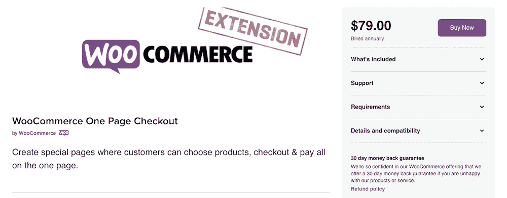

WooCommerce One Page Checkout

。[woo commerce One Page check out](https://woocommerce.com/products/woocommerce-one-page-checkout/)是将您的结账体验变成单页交易的最佳扩展选择。

有了它，您可以将任何页面转换成结账页面，并创建自定义结账页面，直接在[产品页面](https://kinsta.com/blog/conversions-woocommerce-product-pages/)上显示结账表单。这样，顾客就不必离开商品页面去结账了。从产品选择到输入支付信息，一切都在同一个页面上处理。

您还可以选择在[自定义登录页面](https://kinsta.com/blog/website-color-schemes/)上显示结账表单。WooCommerce 一页结账的价格是每年 79 美元。

### 2.单页结帐和布局

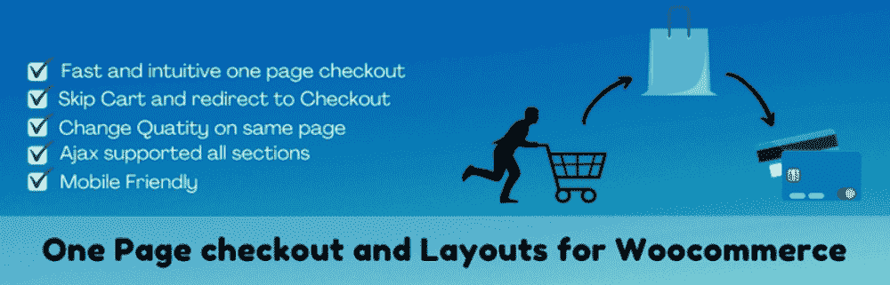

One Page Checkout and Layouts

接下来是[一页结账和布局](https://wordpress.org/plugins/custom-checkout-layouts-for-woocommerce/)，一个旨在降低结账过程复杂性的 WordPress 插件。它将购物车和结帐视图压缩到一个页面中。这样，潜在客户可以在输入结账信息的同一页面上删除产品或更改购物车中的产品数量，而无需重新加载页面。

这个免费插件承诺更快的结账时间，对所有部分的 Ajax 支持，以及一个移动友好的设计。

这个插件的[高级版本](https://blueplugins.com/woocommerce-one-page-checkout-and-layouts-pro/)也是可用的，它增加了额外的功能，如拖放交互式布局，显示或隐藏[账单和发货字段](https://kinsta.com/blog/woocommerce-weight-based-shipping/)的选项，以及三种订单汇总样式。付费版售价 21 美元。

### 3.WooCommerce 的 Bolt 检验

Bolt Checkout for WooCommerce

然后是 WooCommerce 扩展的 [Bolt Checkout，为您的客户提供](https://woocommerce.com/products/bolt-checkout/)[全面优化的](https://kinsta.com/blog/speed-up-woocommerce/)结账体验。它承诺简化结账体验，并针对所有设备、速度和欺诈检测进行了优化。

主要功能包括减少结账时的表单字段，移动响应设计，以及使用机器学习驱动的行为数据来更好地检测那些试图进行欺诈性购买的人。

WooCommerce 的 Bolt Checkout 可以免费下载和使用。

### 4.快速推车

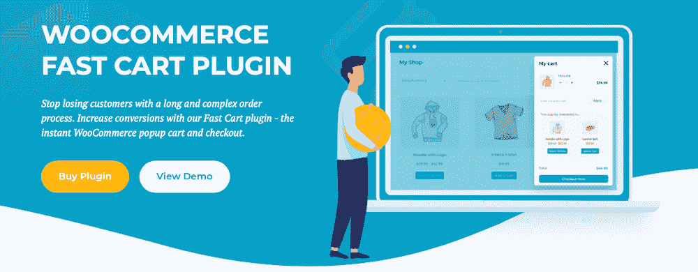

Fast Cart

另一个顶层插件选项是 [Fast Cart](https://barn2.com/wordpress-plugins/woocommerce-fast-cart/) ，它的工作原理是用一个单页结账表单取代不必要的结账步骤。它的工作方式类似于 WooCommerce One Page Checkout，它将订单直接添加到产品页面。通过减少结账“摩擦”，你可以减少废弃的购物车，提高转化率。

它还承诺与你的 WordPress 主题很好地整合，并且可以完全定制以适应你的品牌和需求。更改颜色和布局，增加其他产品的追加销售，或按原样使用。

Fast Cart 的价格为每年每个网站 79 美元，终身使用每个网站 249 美元。

Barn2 Plugins 还制作了[产品表](https://barn2.com/wordpress-plugins/woocommerce-product-table/)插件，它增加了单页订购功能、即时搜索和排序，以及在任何地方以任何方式创建和添加产品表的能力，包括通过[短代码](https://kinsta.com/ebooks/wordpress/woocommerce-shortcodes)，块，或者在帖子或页面内。您还可以从各种信息中选择要显示的信息，如自定义字段、属性、SKU、视频等。

### 5.PeachPay |一键结账

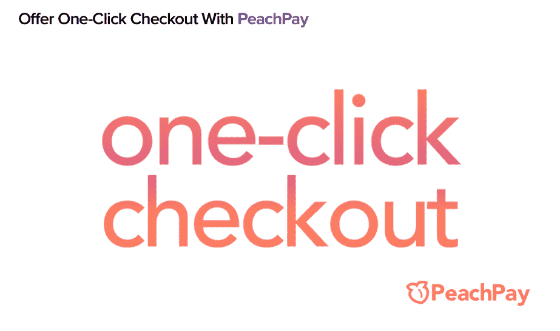

One-Click Checkout With PeachPay

或者你可能对 peach pay 更感兴趣？这个扩展使得为您的客户创建更简单的结账过程变得更加容易。它承诺提供一键式结账体验。现在，这仅适用于回头客，但对于[建立品牌忠诚度](https://kinsta.com/blog/positioning-strategy/)和潜在客户的无缝体验来说，这是一个极具吸引力的功能。

这里值得注意的功能包括无需设置即可在网站上添加快速结账按钮。你可以把它放在任何你喜欢的地方-[产品页面](https://kinsta.com/ebooks/wordpress/ecommerce-conversion-rate/)，迷你购物车，或者全购物车页面。

它还将一键结账扩展到了回头客，包括测试模式，并为按钮提供了多种定制选项。

## 注册订阅时事通讯

### 想知道我们是怎么让流量增长超过 1000%的吗？

加入 20，000 多名获得我们每周时事通讯和内部消息的人的行列吧！

[Subscribe Now](#newsletter)

这个 WooCommerce 扩展可以免费下载和使用。

### 6.WooCommerce 直接结账

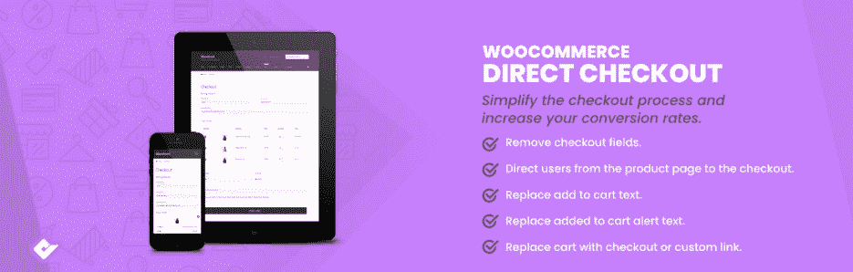

Direct Checkout for WooCommerce

另一个值得一试的 WooCommerce 插件是 WooCommerce 的[直接结账。这一项通过减少顾客完成结账所需的步骤，使](https://wordpress.org/plugins/woocommerce-direct-checkout/)[增加销售](https://kinsta.com/learn/woocommerce-guide/)变得更加容易。

它的工作原理是完全去掉购物车页面，取而代之的是把“添加到购物车”按钮变成一个引导顾客直接结账的按钮。结帐页面也不需要重新加载，所以一切都很简单。你也可以用它来删除你认为合适的结帐字段。

尽管该插件有一个免费版本，但它没有提供一页结账的功能。您需要购买[高级版](https://quadlayers.com/portfolio/woocommerce-direct-checkout/)才能使用该功能以及快速购买按钮和支持。高级计划从一次性支付 30 美元的单一网站许可证开始。
T3】

### 7.快递商店

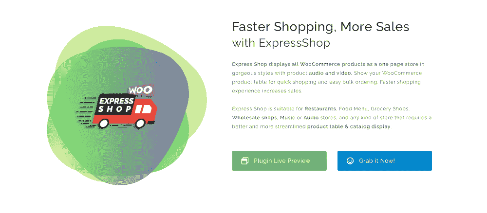

Express Shop

还有一个插件选项是 [Express Shop](https://www.quantumcloud.com/products/express-shop/) WooCommerce 插件。这种方法的工作原理是将商店中的所有产品显示为单页商店。也就是说，购物者可以直接在每个产品页面结账。这促进了更快的购物体验，可以减少购物车放弃和提高转化率。

单站点许可证的计划起价为每年 24 美元，包括一年的优先支持和升级。

### 8.出纳员

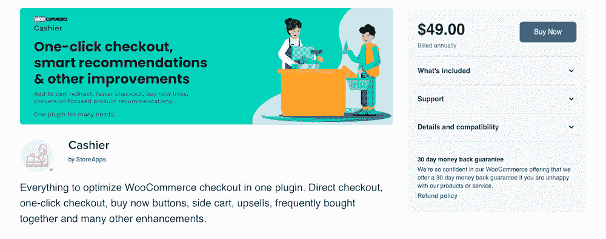

Cashier

然后是[收银台](https://woocommerce.com/products/cashier/) WooCommerce 插件，它为你的[网上商店](https://kinsta.com/blog/ecommerce-hosting/)武器库增加了多种加快结账过程的方法。首先，它增加了直接结账、一键式结账和“立即购买”按钮。

这个插件提供了广泛的功能来优化你的结帐过程，无论你认为合适还是最适合你的行业和产品线。一些值得注意的功能包括一键结账，与“立即购买”按钮相结合，提供更快的购物体验。它还附带了一个侧购物车，让客户可以随时访问他们的购物车，而不必离开产品页面。

其他功能包括产品推荐、购物车通知和添加到购物车链接。它也兼容 WooCommerce 订阅服务。

收银员 WooCommerce 插件每年售价 49 美元。

### 9.Yith WooCommerce 一键结账

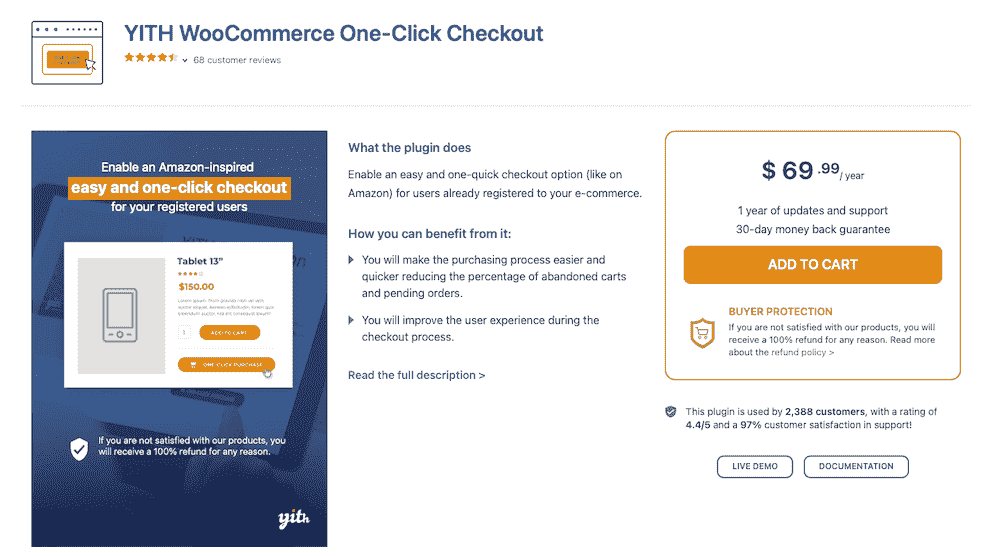

Yith WooCommerce One-Click Checkout

最后，你可以考虑一下 Yith WooCommerce 的一键式结账插件。它提供了一个模仿亚马逊的一键式结账选项。它有望实现更快的结账过程，减少废弃的购物车。

Struggling with downtime and WordPress problems? Kinsta is the hosting solution designed to save you time! [Check out our features](https://kinsta.com/features/)

它还增加了从产品页面直接购买的选项。此外，您可以使用自定义颜色和按钮标签自定义这种单页结账体验的各个方面。您还可以为客人打开或关闭一键式购买功能，并且可以从两种不同的布局中进行选择。选项也更加细化，允许您隐藏特定产品页面或产品类别的一键式购买选项。

这个插件每年花费 69.99 美元，包括一年的更新和支持。

## 如何定制 WooCommerce 单页结账页面

现在你已经有了一些插件和扩展选项，我们可以简单地谈谈如何为你的客户定制一个页面的结账体验。

### 1.安装您选择的插件

你的第一个任务是安装你选择的插件，为 WooCommerce 添加一个单页结账。在这里，我们将为 WooCommerce 扩展安装 Bolt Checkout 作为一个例子。为此，只需下载插件，然后以. zip 文件的形式上传到你的 WordPress 网站的**插件>添加新的**下。

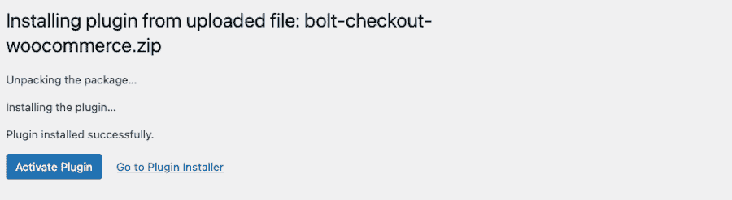

Installing the Bolt Checkout for WooCommerce plugin.

一旦激活，你将被重定向到你的**插件**页面，你可以进入插件的设置页面开始定制。

### 2.使用带有结帐模板的主题

尽管大多数特定于 WooCommerce 的主题都会包含这一点，但验证您使用的任何主题是否包含结账模板仍然很重要。[兰花店](https://wordpress.org/themes/orchid-store/)和 [eStore](https://themegrill.com/themes/estore/) 都是 WooCommerce 主题的好例子，它们提供了可以定制的结账页面模板。

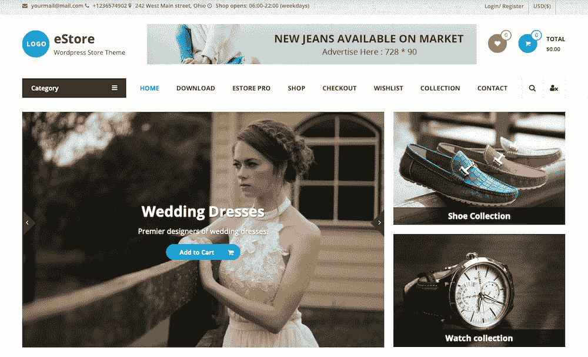

eStore

### 3.使用页面生成器

无论是古腾堡的块编辑器还是与 WooCommerce 兼容的 T2 的页面生成器插件，比如 T4 的 Elementor 或者 Brizy，使用页面生成器可以帮助你实现单页结账的外观和感觉，而不需要深入代码。

### 4.添加客人结账

上面的许多插件都有在你的网站上添加客人结账的选项，WooCommerce 本身也允许这样做。

### 5.使用较少的字段

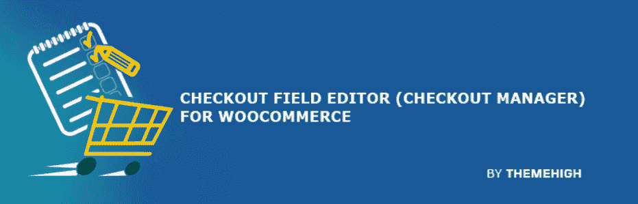

Checkout Field Editor

Bolt 扩展实现了这一点，因此您可以简化结帐过程，并消除不符合您需求或只会增加混乱的结帐字段。如果你只想在结账页面上使用更少的字段(但不想创建完整的单页体验)，你可以使用像[结账字段编辑器](https://wordpress.org/plugins/woo-checkout-field-editor-pro/)这样的插件来减少顾客结账前需要填写的字段数量。

### 6.添加“立即购买”按钮

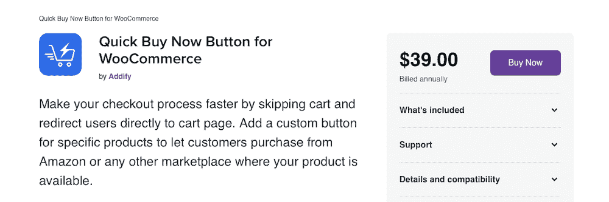

Quick Buy Now Button for WooCommerce

除了 Bolt 提供的功能之外，你还可以使用类似于 WooCommerce 的 [Quick Buy Now Button 的扩展到你的商店。](https://woocommerce.com/products/quick-buy-now-button-for-woocommerce/)

### 7.添加追加销售和附件

一旦你配置了单页结账，你就可以通过使用像 WooCommerce 的 [Cart Upsell 这样的扩展来创造更多的转换机会。](https://woocommerce.com/products/cart-upsell-for-woocommerce/)

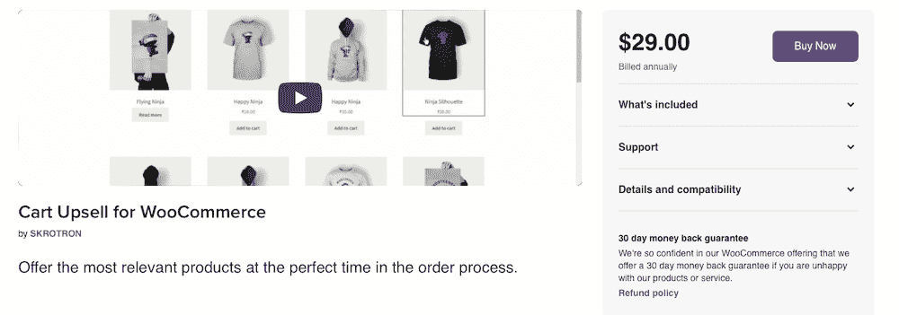

Cart Upsell for WooCommerce

这一延伸展示了与潜在客户当前正在寻找的产品最相关的产品。您可以根据产品类型、类别、潜在客户购物车中当前的总金额等来触发这些追加销售。

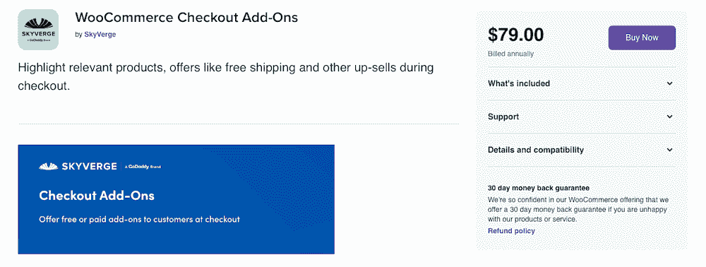

WooCommerce Checkout Add-Ons

另一个选择是[woo commerce check out Add-ons](https://woocommerce.com/products/woocommerce-checkout-add-ons/)，这样你就可以突出显示相关产品，提供免费送货，或者推广礼品包装、小费或个别产品保险等附加服务。

### 8.A/B 测试您的结账页面

一旦你的单页结帐设置好并运行，你就可以[开始运行 A/B 测试](https://kinsta.com/blog/wordpress-ab-testing-tools/)。这是你应该经常为你的网上商店做的事情。这将有助于你了解什么对你的客户有效，以及你可以做出什么样的改进。

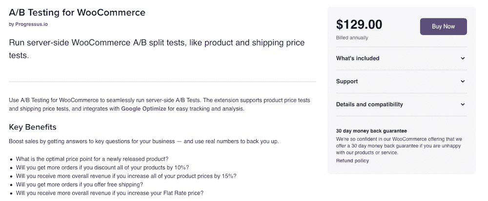

A/B Testing for WooCommerce extension

像 WooCommerce 的 [A/B Testing 这样的扩展是创建分割测试的明显选择。尝试多页结帐形式与单页，价格测试，运输价值，等等。](https://woocommerce.com/products/a-b-testing-for-woocommerce/?quid=3531c84798666e945903a8df186ba3f0)

[Read on to see why one-page checkouts are the ✨best✨ checkouts- for your customers and your bottom line 💰Click to Tweet](https://twitter.com/intent/tweet?url=https%3A%2F%2Fkinsta.com%2Fblog%2Fwoocommerce-one-page-checkout%2F&via=kinsta&text=Read+on+to+see+why+one-page+checkouts+are+the+%E2%9C%A8best%E2%9C%A8+checkouts-+for+your+customers+and+your+bottom+line+%F0%9F%92%B0&hashtags=Ecommerce%2CWooCommerce) ## 摘要

希望你现在能清楚地理解为什么你的 WooCommerce 网站一定要使用单页结账流程。它有助于减少弃车，提高转化率，并为您的客户带来更愉快的整体用户体验。

我们还为您配备了大量插件和扩展选项，帮助您轻松创建自己的单页结账体验。此外，我们还提供了您可能希望对结账流程进行哪些类型的功能和定制的简要概述。

最终，为了获得最佳的结账体验，你应该在做其他事情之前确保你的 WooCommerce 主机是一流的。祝你好运！

* * *

让你所有的[应用程序](https://kinsta.com/application-hosting/)、[数据库](https://kinsta.com/database-hosting/)和 [WordPress 网站](https://kinsta.com/wordpress-hosting/)在线并在一个屋檐下。我们功能丰富的高性能云平台包括:

*   在 MyKinsta 仪表盘中轻松设置和管理
*   24/7 专家支持
*   最好的谷歌云平台硬件和网络，由 Kubernetes 提供最大的可扩展性
*   面向速度和安全性的企业级 Cloudflare 集成
*   全球受众覆盖全球多达 35 个数据中心和 275 多个 pop

在第一个月使用托管的[应用程序或托管](https://kinsta.com/application-hosting/)的[数据库，您可以享受 20 美元的优惠，亲自测试一下。探索我们的](https://kinsta.com/database-hosting/)[计划](https://kinsta.com/plans/)或[与销售人员交谈](https://kinsta.com/contact-us/)以找到最适合您的方式。