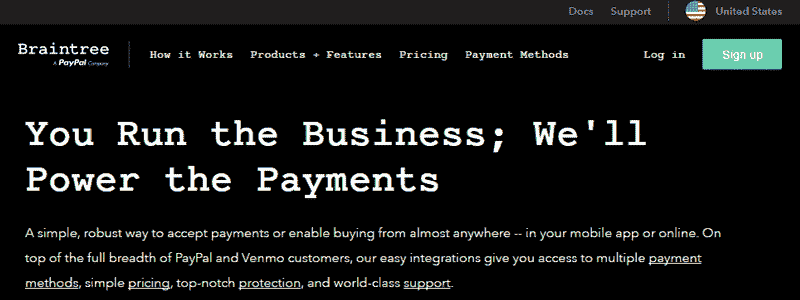
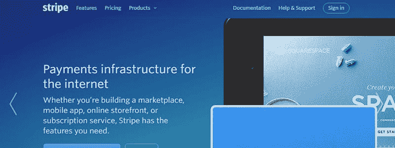
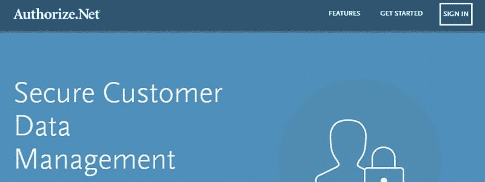
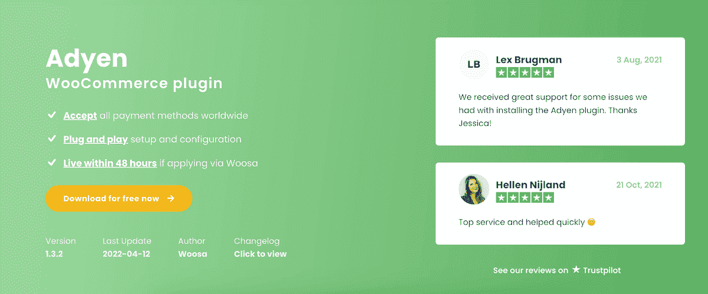

# WordPress 最佳 WooCommerce 支付网关

> 原文：<https://kinsta.com/blog/woocommerce-payment-gateways/>

你已经为你的业务考虑了很多，但是你有没有为选择最好的 WooCommerce 支付网关考虑很多呢？你应该。

带来销售是任何业务中最重要的部分，但选择正确的收款方式也同样重要。毕竟，如果你的客户很难支付，他们会放弃他们的购物车，你会失去销售。

支付网关是一个基于网络的程序，旨在接受和处理支付，如信用卡和借记卡。如果你打算在你的网站上销售产品或服务，很可能你需要一个支付网关。

你不需要的唯一原因是，如果你不打算接受付款，或者你只想在你的实体店接受付款。

像大多数企业一样，你可能已经接受了 WordPress 和 WooCommerce 的付款，或者你正计划这样做。所以，这里是 WordPress 最好的 WooCommerce 支付网关插件。我还将介绍为您的网站选择正确网站的技巧。

请记住，你的最终目标是增加商店的收入。所以一定要下载我们的免费电子书**， [10 种提高你的网络商务产品页面转化率的方法](https://kinsta.com/ebooks/wordpress/ecommerce-conversion-rate/?utm_source=Blog&utm_medium=Link&utm_campaign=WooCommerce+Conversions+Ebook)。** 

 **## 决定支付网关

了解更多关于 WordPress 中支付网关集成的信息是在它们之间做出决定的关键。首先，我们知道有两种主要类型的网关:重定向和直接。

> Kinsta 把我宠坏了，所以我现在要求每个供应商都提供这样的服务。我们还试图通过我们的 SaaS 工具支持达到这一水平。
> 
> <footer class="wp-block-kinsta-client-quote__footer">
> 
> 
> 
> <cite class="wp-block-kinsta-client-quote__cite">Suganthan Mohanadasan from @Suganthanmn</cite></footer>

[View plans](https://kinsta.com/plans/)

重定向网关是一个客户需要离开你的网站，以支付。它们被发送到外部页面，以便处理付款。在大多数情况下，客户会被重定向到管理网关的公司网站。

另一方面，直接网关仅在您的网站上处理支付，客户不需要离开您的网站来处理支付。

如果你不想负责加强网站的安全性，重定向是最好的支付网关选择，因为[被黑客攻击](https://kinsta.com/blog/wordpress-hacked/)可能意味着你所有客户的信用卡和个人信息被盗。

虽然，它不像直接网关那么专业，因为客户需要离开你的网站才能付款。如果他们不熟悉你使用的支付网关类型，这可能会让他们感到不安。这就是为什么大多数企业的最佳支付网关是直接支付。

它有助于建立客户的信任，但是您确实需要确保您的站点的安全性是最新的。

[Installing an SSL certificate is a must and a bare minimum if you want to run an online business.Click to Tweet](https://twitter.com/intent/tweet?url=https%3A%2F%2Fkinsta.com%2Fblog%2Fwoocommerce-payment-gateways%2F&via=kinsta&text=Installing+an+SSL+certificate+is+a+must+and+a+bare+minimum+if+you+want+to+run+an+online+business.)

关于如何提高安全性的更多细节，您可以查看我们的其他帖子:

*   [WordPress Security——锁定你网站的 19 个以上步骤](https://kinsta.com/blog/wordpress-security/)
*   [10 个最佳 WordPress 安全插件](https://kinsta.com/blog/wordpress-security-plugins/)

除了考虑成本，选择接受来自您的国家和客户原籍国的业务的支付网关也很重要。否则，你很可能会看到销售额下降，客户投诉增加。

这就是为什么如果您选择的网关之一不能覆盖您拥有大量客户的国家，混合和匹配您的网关可能是最佳解决方案。

您也可以选择一个覆盖大多数人的网关，然后为联系您的客户提供另一种支付方式。如果您希望一个网关覆盖大多数客户，这可能是最佳选择。

无论是哪种情况，跟踪网站的分析都是了解客户居住地的好方法，这样你就可以更好地规划最适合你的业务的支付网关。

## 2022 年 WordPress 最佳 WooCommerce 支付网关

这些是最好的 WooCommerce 支付网关，因为它们服务于大多数国家，并且是最值得信赖的提供支付处理的公司之一。它们也是帮助你的企业看起来更专业的直接途径。

T3】

这些选项可用于 WordPress 中的信用卡支付网关集成。你也可以在 WooCommerce 上使用它们。

你可以免费集成这些网关，或者作为大多数 WordPress 电子商务支付网关插件的高级升级。它们也可以作为 WooCommerce 的高级网关。不过，有些选项是免费的，有些则需要付费。

请记住，这些解决方案都要求您安装 [SSL 证书](https://kinsta.com/knowledgebase/woocommerce-ssl/)才能使用它们。他们还要求你注册一个账户。

## 注册订阅时事通讯

### 想知道我们是怎么让流量增长超过 1000%的吗？

加入 20，000 多名获得我们每周时事通讯和内部消息的人的行列吧！

[Subscribe Now](#newsletter)

### 1。PayPal 专业版

PayPal has many options for businesses.

在支付处理方面，PayPal 是最值得信赖的公司之一。他们有许多网关解决方案，但其中一些是基本的，使用重定向方法进行支付。

PayPal Pro 使用直接支付方式，可以处理常规产品销售，但不能处理订阅等经常性支付。每月还需要 35 美元，还有 2.9%的贝宝交易费外加 30 美分。

PayPal Pro 的 WooCommerce 扩展单个网站订阅价格为 79 美元。或者你可能也想看看 WooCommerce 的[PayPal](https://wordpress.org/plugins/paypal-for-woocommerce/)插件。

### 2。布伦特里

Braintree is a PayPal company.

如果你喜欢使用 PayPal 的想法，但希望能够提供订阅或寻找免费选项， [Braintree](https://www.braintreepayments.com/) 可能是你的解决方案。这是一家 PayPal 公司，所以这也是一个你可以信任的解决方案。

没有月费，你可以用所有主要的信用卡付款，还可以用 Apple Pay 和 Android Pay 等钱包付款。有 2.9%加 30 美分的交易费，不过，你的第一笔 5 万美元是免费的。

您的客户还可以选择保存他们的付款细节，以获得更轻松的购物体验。Braintree 有一个 [WooCommerce 扩展，而且是免费的，这也是一个奖励。](https://woocommerce.com/products/woocommerce-gateway-paypal-powered-by-braintree/)

### 3。种类

Stripe is quickly becoming a popular gateway.

[Stripe](https://kinsta.com/blog/stripe-for-wordpress/) 是一个[快速增长的支付网关](https://kinsta.com/stripe-revenue/)，它能够处理经常性支付，并能自动处理退款。最流行的 WordPress 电子商务插件支持它，也有免费的 [Stripe WooCommerce 扩展](https://www.woothemes.com/products/stripe/)可用。

Struggling with downtime and WordPress problems? Kinsta is the hosting solution designed to save you time! [Check out our features](https://kinsta.com/features/)

Stripe 处理所有主要的信用卡和借记卡。此外，它还接受 Apple pay，客户可以保存他们的支付细节。没有月租费，但是有 2.9% 30 美分的交易费。他们还有一种叫做雷达的防欺诈产品。要了解更多信息，您可以阅读以下详细指南:[如何使用条纹雷达](https://kinsta.com/blog/credit-card-fraud-stripe/)防止信用卡欺诈并将其减少 98%。

没有月租费，但是有 2.9% 30 美分的交易费。与 PayPal 不同，如果客户对收费有异议，它会让你损失 15 美元，但如果你赢了，这笔费用会退还给你。

### 4。Authorize.net CIM

Authorize.net CIM has tons of features, but isn’t as cost effective.

Authorize.net CIM 是许多企业的热门选择，因为它拥有许多功能。它接受所有主要的信用卡和借记卡，也处理退款，订阅和预购。顾客还可以选择保存他们的付款细节，以备下次购买时使用。

像这里列出的其他解决方案一样，每笔交易收取 2.9% 30 美分的费用。还有 49 美元的安装费和每月 25 美元的订阅费。

Authorize.net CIM 有一个 [WooCommerce 扩展，如果你决定使用它，单个网站就要花费你 79 美元。](https://woocommerce.com/products/authorize-net-cim/)

### 5.阿德延

Adyen payment gateway

Adyen 是全球最大的支付提供商之一。这部分是由于当地支付方式的多样性。此外，Adyen 非常重视实现无缝结账体验。这个 WooCommerce 插件也是这种情况。

Adyen 集成了所有国际信用卡和本地支付方式。比如荷兰的 iDEAL，巴西的 Boleto，波兰的 BLIK，但是也支持 Apple Pay，Google Pay，支付宝。

Adyen WooCommerce 插件无缝集成到 [WooCommerce checkout](https://kinsta.com/blog/woocommerce-checkout/) 中，以保持尽可能高的购买转化率。这个支付提供商插件将为您安排一切，尽可能使结账体验无缝。

试试 Adyen WooCommerce 插件，让我们知道你对它的看法。

## 哪个支付网关最好？

支付网关最好的 WooCommerce 插件是那些为你和你的企业服务的插件。我已经介绍了所有最好的网关，但是最终由您来决定哪一个是最好的。

关于如何在 WooCommerce 上建立网上商店的更多细节，请查看我们的指南[如何在你的网站上建立 WooCommerce——完整教程](https://kinsta.com/blog/woocommerce-tutorial/)和[如何用 woo commerce 订阅出售订阅](https://kinsta.com/blog/woocommerce-subscriptions/)。

对于其他 WordPress 电子商务插件选项，请查看[与 WordPress 一起出售:6 个免费的电子商务插件](https://kinsta.com/blog/wordpress-ecommerce-plugins/)。

你用过这些 WooCommerce 支付网关吗？你对他们有什么体验？你用的 WooCommerce 和 WP 支付网关插件或扩展是哪个？你认为哪些是最好的 WooCommerce 支付网关？欢迎在下面的评论中分享你的经验。

* * *

让你所有的[应用程序](https://kinsta.com/application-hosting/)、[数据库](https://kinsta.com/database-hosting/)和 [WordPress 网站](https://kinsta.com/wordpress-hosting/)在线并在一个屋檐下。我们功能丰富的高性能云平台包括:

*   在 MyKinsta 仪表盘中轻松设置和管理
*   24/7 专家支持
*   最好的谷歌云平台硬件和网络，由 Kubernetes 提供最大的可扩展性
*   面向速度和安全性的企业级 Cloudflare 集成
*   全球受众覆盖全球多达 35 个数据中心和 275 多个 pop

在第一个月使用托管的[应用程序或托管](https://kinsta.com/application-hosting/)的[数据库，您可以享受 20 美元的优惠，亲自测试一下。探索我们的](https://kinsta.com/database-hosting/)[计划](https://kinsta.com/plans/)或[与销售人员交谈](https://kinsta.com/contact-us/)以找到最适合您的方式。**