# 网络商务支付初学者指南

> 原文:# t0]https://kinta . com/blog/woocommerce-payments/

没有支付方式，电子商务就什么都不是。这显然是一个至关重要的因素，这意味着您还需要考虑使用哪种支付网关。有许多长期竞争者需要考虑，但是 WooCommerce Payments 值得你花时间，尤其是如果你使用这个插件的话。

### 查看我们的[视频指南，了解电子商务支付](https://www.youtube.com/watch?v=-TcQjymnPrM)

该插件将以最佳方式将 WooCommerce 支付与您的网站集成在一起，同时还能为您提供支付所需的功能。虽然它的设置和使用很简单，但并不是一切都像它看起来那样——我们将在本文中讨论这一点。

 在这篇文章的剩余部分，我们将讨论 WooCommerce 支付以及如何使用它。我们还会将它与其他一些流行的网关进行比较。不过，首先，让我们讨论一下网关应该有什么要求。

## 什么是好的电子商务支付网关？

随着电子商务的发展，大部分注意力将转向客户与企业的关系。这一切都很好，但还有一个关键环节需要你的关注:你选择的支付网关。

这是一个软件，它连接你网站上的前端按钮来启动购买，并(最终)连接到你的银行账户。当您到达需要输入您的账单信息的[结账流程](https://kinsta.com/blog/woocommerce-checkout/)时，这就是支付网关的作用。

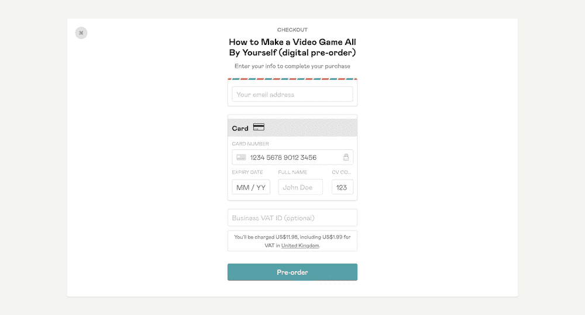

An example of a payment gateway on the frontend

因为网关将处理处理支付的重要任务，所以它需要具备一些关键要素:

*   **可用性:**这个有两点。你需要知道网关不仅在你的业务所在国家可用，而且在你的[目标受众](https://kinsta.com/blog/conversions-woocommerce-product-pages/)所在的国家也可用。如果你经营一个全球性的企业，网关需要在所有这些国家都可用。
*   **开销友好的交易收费:**如果一个网关勾选了大部分的框，却对一个包收取处理交易的费用，那就狠狠的刺痛你了。您将希望从您的网关获得最具成本效益的一组费用。
*   直观简单的界面:不言而喻，一个提供逻辑布局的用户界面(UI)对任何应用程序来说都是一个福音。对于一个网关来说，这将是一个[废弃的购物车](https://kinsta.com/blog/shopping-cart-abandonment/)和一个完整的销售之间的区别。
*   **与您的电子商务解决方案集成:**作为 WooCommerce 用户，您选择的支付网关必须具有兼容性。没有它，你将根本不能处理支付。

虽然我们将讨论许多符合所有这些条件的支付网关，但在本文中，有一个是我们想要重点关注的。我们接下来会看一看。

## 引入 WooCommerce 支付

The WooCommerce Payments logo

如果你[使用 WooCommerce](https://kinsta.com/blog/woocommerce-tutorial/) 作为你的电子商务平台，并利用 [WooCommerce hosting](https://kinsta.com/woocommerce-hosting/) ，那么将 [WooCommerce Payments](https://kinsta.com/blog/woocommerce-payments/#introducing-woocommerce-payments) 整合到你的网站中是有意义的。它是该平台的“官方”支付网关，具有许多令人印象深刻的功能:

*   它使用现收现付(PAYG)模式进行交易(稍后会有更多介绍)。
*   该扩展提供了与 WooCommerce 的完全集成。
*   你可以在 WordPress 仪表盘上追踪你的所有付款。
*   WooCommerce Payments 提供多种货币支持，有 135 种以上的选择供您选择。

正如你所料，WooCommerce 支付是一个自动化的产品。这意味着你得到了与 WooCommerce 和 WordPress 的最高水平的集成，这对于那些平台上的商店来说是诱人的。

事实上，这是唯一能够提供这种集成水平的支付网关。然而，这并不止于 WooCommerce。你也可以以你通常无法做到的方式与其他扩展集成。以 [WooCommerce 订阅](https://kinsta.com/blog/woocommerce-subscriptions/)为例:

The WooCommerce Subscriptions logo

如果你使用这个和 WooCommerce 支付，你可以在 WordPress 中以其他解决方案无法做到的方式处理订阅。

至于技术要求，你需要一个 WordPress 安装和服务器设置来应对，这通常意味着至少要有 PHP 7.0、 [WordPress 5.7](https://kinsta.com/blog/wordpress-5-7/) 和 WooCommerce 4.8。

然而，你还需要一个[安全套接字层(SSL)证书](https://kinsta.com/knowledgebase/how-ssl-works/)才能在“实时模式”下使用网关，并且需要在 [18 个受支持国家之一开展业务](https://woocommerce.com/document/payments/countries/)。WordPress.com 账户也是必要的。Jetpack 插件帮助执行交易和链接服务，是连接 WordPress.com 的一种简单方式。也就是说，你不必安装 JetPack，因为你可以连接到 WordPress.com 有或没有插件。

至于交易费用，这取决于你的国家，尽管你会注意到它们类似于另一个流行的支付网关 [Stripe](https://kinsta.com/blog/stripe-for-wordpress/) 。这是因为 WooCommerce Payments 是 Stripe 的“白标”版本。稍后我们会详细讨论这一点。

## 为什么使用 WooCommerce 支付而不是其他网关？

由于 WooCommerce 用户可以使用过多的网关，WooCommerce 支付需要有一些特别的东西来吸引用户。

我们可以从几个原因来说明您为什么会选择该解决方案:

1.  你得到了与 WordPress 和 WooCommerce 最大程度的整合。事实上，它近乎完美，其他任何网关都无法与之匹敌。
2.  由于 WooCommerce 的工作方式，你也可以从 WordPress 仪表盘处理支付的方方面面，而不需要登录第三方应用。
3.  因为网关是建立在 Stripe 之上的，所以它是健壮的、坚如磐石的、受欢迎的。
4.  通过扩展，你如何将你的 Stripe 网关与第三方服务集成，应该与 WooCommerce 支付类似。

总的来说，你想使用 WooCommerce 支付的主要原因是为了与 Automattic 的紧密集成。即便如此，探索 WooCommerce 支付与竞争对手相比如何也是值得的。让我们在下一节看看其中的一些。

## WooCommerce 的其他 4 个领先支付网关

虽然有无数的支付网关可供选择，但我们有四个可以与 WooCommerce 支付相比。

然而，第一种感觉很熟悉，这是有原因的，我们将会解释。让我们从 Stripe gateway 开始，因为它是 WooCommerce 支付的核心。

### 1.种类

首先，[条纹](https://kinsta.com/blog/paypal-alternative/#stripe)。由于 [Stripe 的市场份额](https://kinsta.com/stripe-revenue/)，受欢迎程度，功能集和低交易率，这将是许多人熟悉的门户。

The Stripe logo

WooCommerce Payments 从 Stripe 获得其谱系，因为它是网关的白标版本。这意味着条纹商标被移除，取而代之的是 WooCommerce 的商标。在此基础上，Automattic 做了进一步的修改，将其整合到 WordPress 和 WooCommerce 中。

这意味着虽然 Stripe 和 WooCommerce 支付共享相同的核心和架构，但这两种解决方案可能会有所不同。事实上，Stripe 已经在 WooCommerce 中作为默认的支付网关。因此，它提供了一些不同之处:

*   您可以在更多国家使用 Stripe，因为它是一个更成熟的解决方案。
*   WordPress 和你的网关之间不会有太多的整合。然而，这仍然是合适的，因为它是 WooCommerce 的默认选项。

我们认为第一点是用户选择 Stripe 的原因。当谈到 Stripe 与 WooCommerce 支付时，你将在国家可用性和与 WordPress 的整合之间做出选择。你更喜欢哪个将有助于你做出决定。

### 2.贝宝

对于那些年纪足够大的人来说，PayPal 第一次出现时是一个新发现。在很长一段时间里，这是处理交易和在网上转移资金的首选方式。虽然现在竞争更加激烈，但 it 仍然可以提供业内最大的解决方案。

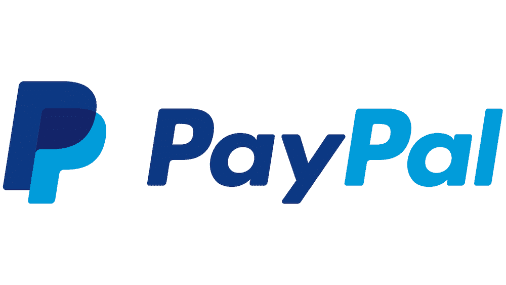

The PayPal logo

这是一个成熟的功能性支付网关，提供了许多有趣的功能:

*   它拥有顶级网关应有的基础设施和可靠性。
*   支付处理功能非常灵活。例如，你可以实现 PayPal 的[分 3](https://www.paypal.com/us/smarthelp/article/what-is-paypal-pay-in-3-faq4333) 期支付:一种将一大笔款项分成三个不同的分期付款的方式。
*   虽然您需要使用第三方仪表板来管理您的交易，但它直观、功能丰富、外观简洁。

PayPal 的灵活性是它赢得 WooCommerce 支付的原因。最终用户欢迎使用 Pay in 3，结账流程也很熟悉，很容易使用。

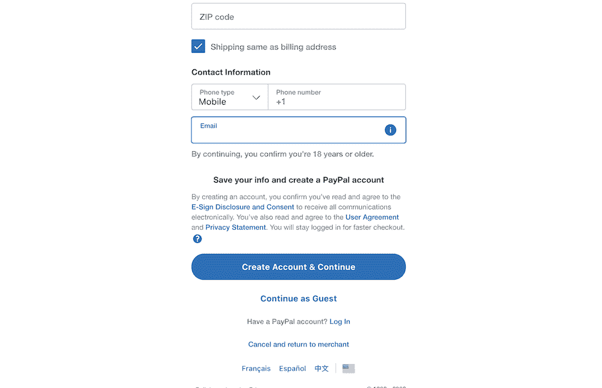

PayPal’s checkout process

此外，您可以设置定期付款和订阅，而无需延期。说到这一点，很多网站已经建立了处理贝宝。许多用户已经有了 PayPal 账户，随时可以使用。

然而，贝宝的[交易和商户费用](https://www.paypal.com/us/webapps/mpp/merchant-fees)因有时令人困惑而臭名昭著。有一个专门列出并解释它们的微型网站。这是当初从 PayPal 转向的部分原因。

除此之外，客户支持在某些方面也乏善可陈，尤其是在争议解决方面。虽然这不会阻止你使用 PayPal，但它应该让你考虑一下是否值得这么麻烦。

如果你想了解更多，请阅读我们的 [Stripe 与 PayPal](https://kinsta.com/blog/stripe-vs-paypal/) 的深度对比。

### 3.平方

WordPress 用户将会知道 [Square](https://kinsta.com/blog/paypal-alternative/#square) 几乎是某种竞争对手——它拥有 [Weebly 网站建设者](https://kinsta.com/blog/weebly-vs-wordpress/)解决方案。当然，Square 本身就是一个很棒的支付网关。

The Square logo

用户会选择 Square 而不是其他解决方案的原因有几个:

*   对于初学者来说，设置只需几分钟，日常可用性很高。
*   Square Checking 服务让您可以快速存取您的资金。这对舒适和信任很重要。
*   交易费用不复杂，也很低(这个我们一会儿再说)。

这使得 Square 成为领先的支付网关之一。然而，我们建议 Square 最适合面对面的销售点(PoS)交易。许多企业将使用 Square 的软件和硬件来支持他们的支付，我们倾向于同意这一点。

不过，它是一个可靠的支付网关，也与 WooCommerce 集成，但程度不如 WooCommerce 支付。

## 注册订阅时事通讯

### 想知道我们是怎么让流量增长超过 1000%的吗？

加入 20，000 多名获得我们每周时事通讯和内部消息的人的行列吧！

[Subscribe Now](#newsletter) 至于交易手续费，超级简单。考虑到美国用户，你将为每笔交易支付 2.9%外加 0.30 美元的费用。根据你如何使用 Square，还有其他费率，但在大多数情况下，你会确切地知道每笔交易你将支付多少。

*阅读我们的[条纹 vs 方形](https://kinsta.com/blog/stripe-vs-square/)深度对比。*

### 4.Authorize.net

尽管 Visa 运营着 Authorize.net，但在支付网关方面，它却是一个异类。然而，它在特性或功能上并不差。

The blue Authorize.net logo

事实上，使用 Authorize.net 作为支付门户有很多好处:

*   关于你能在哪里接受付款，它是灵活的。对于 WooCommerce 商店来说，这没什么大不了的，但这意味着 Authorize.net 可以根据你的需求进行扩展。
*   你可以提供多种支付方式，不仅仅是 Visa。例如，您可以接受大多数信用卡，以及 Apple Pay、Visa Pay 等。甚至贝宝也是一个选择。
*   您可以获得安全工具来帮助保护您和您的客户。高级欺诈保护内置于网关中，并延伸到您的收银台。

Authorize.net 唯一的症结是价格。虽然[交易费](https://www.authorize.net/en-us/sign-up/pricing.html)是标准的 2.9%外加 0.30 美元的手续费，但你还需要每月支付 25 美元才能进入 Authorize.net。

如果你已经有一个商业帐户，你仍然需要每月支付 25 美元，但交易费用下降到每笔交易 0.10 美元。如果您有合适的基础设施，这可能是有益的。然而，尽管积极，你可以更好地与另一个支付网关，提供更多更少的支出。

## 如何安装 WooCommerce 支付

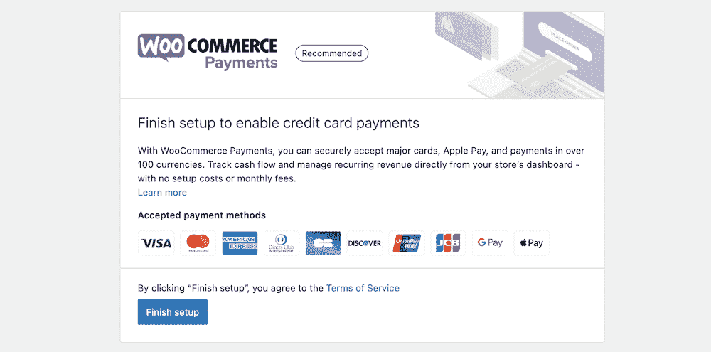

The WooCommerce Payments Setup screen

总的来说，WooCommerce 支付的安装过程很像任何其他 WordPress 插件。但是，在继续之前，扩展会要求您完成一些其他步骤:

*   你需要有一个[WordPress.com 账户](https://kinsta.com/blog/wordpress-com-vs-wordpress-org/)来提供自动集中的安全性。
*   您必须先验证您的业务和支付详情，然后才能继续使用该扩展。
*   对于实时使用，您的站点还需要一个有效的 SSL 证书。

由于 WordPress.com 的要求，你不能在本地服务器上使用 WooCommerce 支付。这是一个痛苦，很可能是许多人的症结所在——除非你是一个 [WordPress 开发者](https://kinsta.com/blog/hire-wordpress-developer/)，可以编辑文件来临时绕过实时模式设置。

如果你想使用 WooCommerce 支付，你需要理解这个重要的概念。然而，每个步骤都很简单。连接到 WordPress.com 只需点击**批准**按钮:

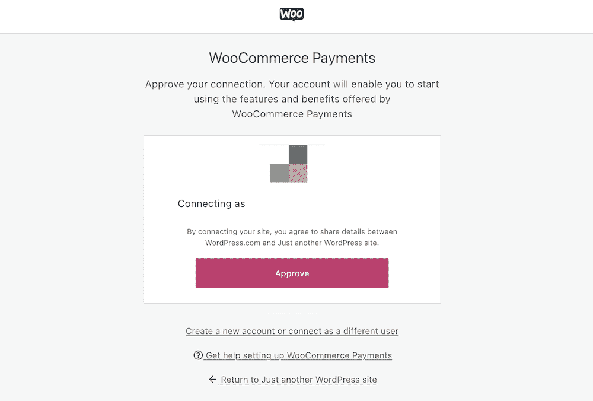

The WooCommerce Payments connection screen

…然后输入电话号码和电子邮件地址:

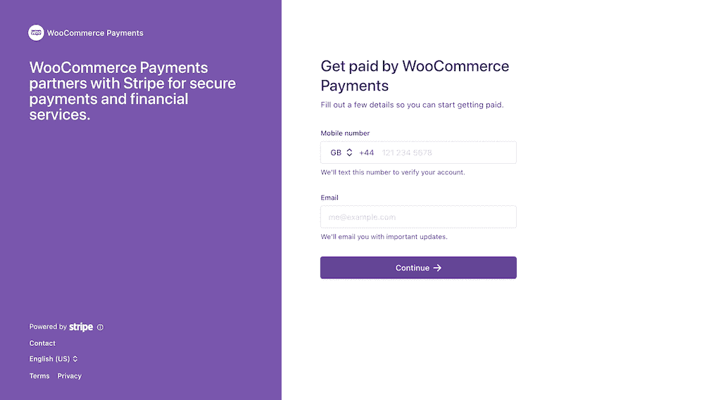

The WooCommerce Payments and WordPress.com verification screen

该流程的“条纹”部分会要求您提供有关您企业的一些个人信息，以及您企业的有效银行账户:

Struggling with downtime and WordPress problems? Kinsta is the hosting solution designed to save you time! [Check out our features](https://kinsta.com/features/)

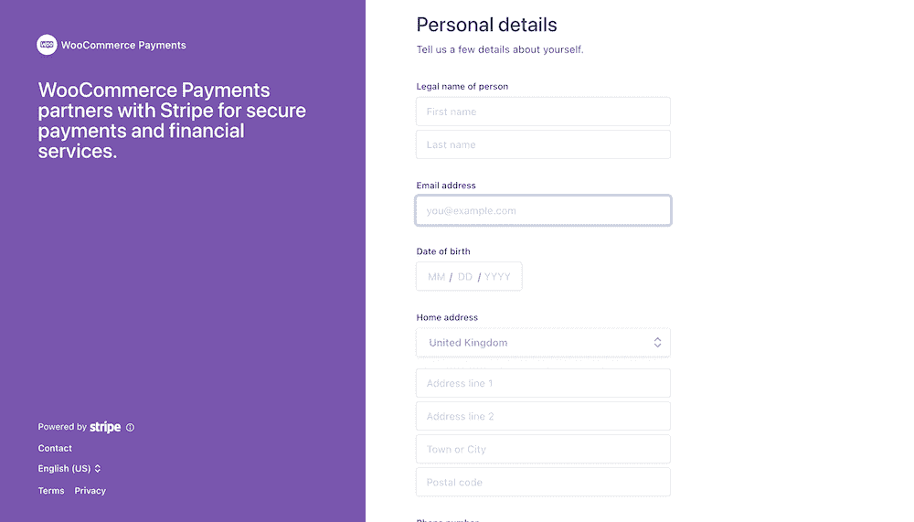

WooCommerce Payments asking for personal details

当你完成这个过程后，你就可以深入 WooCommerce 支付界面了。

## 如何使用网络商务支付

虽然 WooCommerce 支付是一个简单易用的解决方案，但在它的各个屏幕上还有很多事情要做。在接下来的几节中，我们将讨论其中的一些，以及您应该如何设置和使用这个扩展。

### 客户概述

作为新用户，您将看到的第一个屏幕是**概述**屏幕:

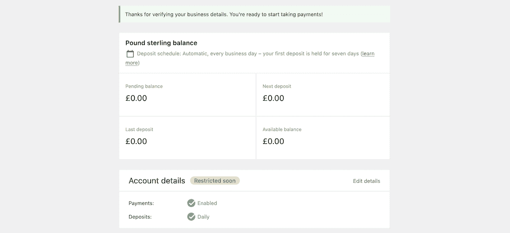

The WooCommerce Payments dashboard

这里的第一个面板显示了你的总体平衡，但它也提供了一些额外的细节。例如，您可以查看可用余额，这总是很有帮助，但是您也可以查看待定余额。

一旦你的商店有大量的交易，这将提供价值。当然，有些交易不会与其他交易同时处理，所以最好能区分余额。

你还可以看到上一次和下一次存款的数字。这将与这些数字上方的存款计划设置相关。你会看到一个“一目了然”的存款计划摘要——默认是每天自动存入你的银行账户。

以下是您的**账户详情**信息:

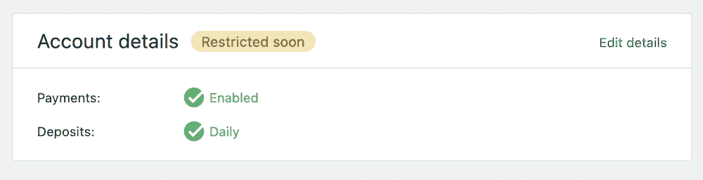

The “Account details” panel

简而言之，这是一份关于你是否设置了支付(你应该设置)和存款频率的总结。现在是讨论你的 WooCommerce 支付帐户的更多设置的好时机，所以我们接下来会这样做。

### 设置

WooCommerce 支付**设置**链接将带您进入 **WooCommerce** > **设置** > **支付**。在这里，您将看到几个部分和复选框来帮助您进一步设置扩展:

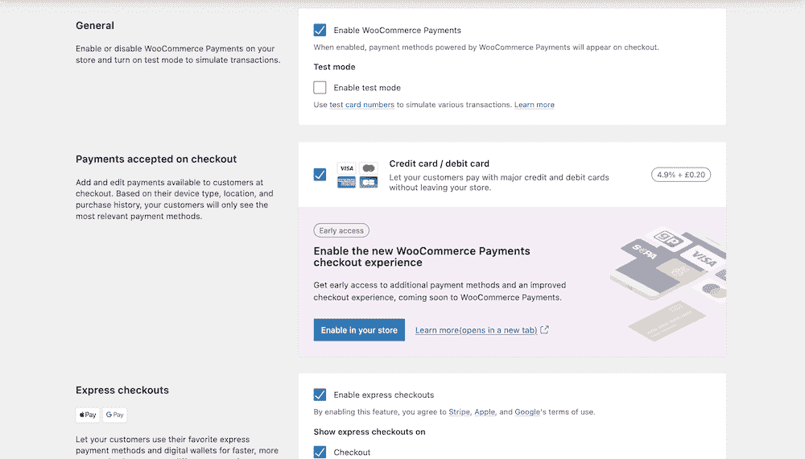

The WooCommerce Payments Setting screen

这里有四个不同的部分:

*   **常规:**您可以在这里启用扩展，也可以启用本地使用的受限测试模式。
*   **结账时接受付款:**这个部分提供了一个简单的复选框，允许您启用信用卡和借记卡。
*   **快速结账:**你还可以启用 Apple Pay 和 Google Pay，并决定用户可以访问哪些页面。
*   **交易和存款:**这些设置让您能够为用户提供顺畅的结账和交易体验，以及其他选项。

在最后一部分中，您可以让用户使用保存的卡实例进行支付，以加快结账速度。您也可以授权一张卡并在以后捕获它。这对用户更有利，因为他们可以用不太严格的流程结账。

然而，在我们继续之前，最后一个字段**客户银行对账单**需要进一步关注。

#### 银行对账单描述符

当你购物时，你的银行结单会清楚地显示与你做生意的公司的名称。您也可以在 WooCommerce Payments 中使用**客户银行对账单**字段进行设置:

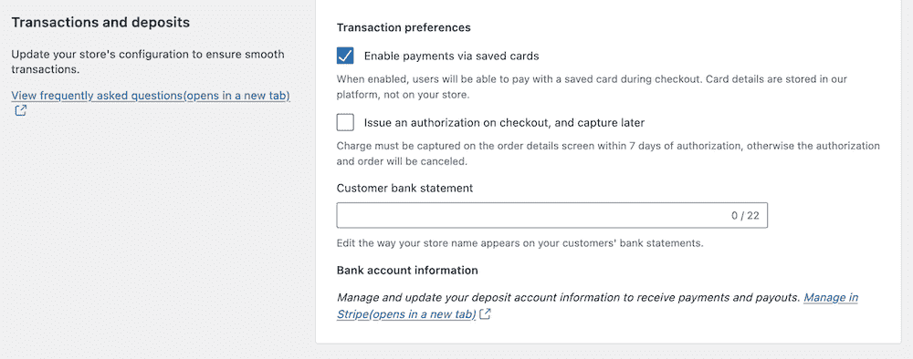

The Transaction Preferences section

设置此名称时，您需要遵守几个要求:

*   您应该使用不少于 5 个、不多于 22 个拉丁字符。
*   它必须包含至少一个字母和零个特殊字符。
*   描述符必须以对客户透明的方式反映您的企业名称。

在大多数情况下，我们建议您使用您的企业名称或网站地址。如果您确实需要使用不同的描述符，您应该在结帐时向用户说明这一点。

### 交易类型

**支付** > **交易**屏幕将显示您当前交易的列表。这里有一些细节需要注意，但我们希望特别注意您将看到的不同类型的交易。

这些选项中的一些一开始可能会引起混淆，因为很容易误解它们所代表的意思。以下是每个选项的用途:

*   **存款:**这意味着从你的 WooCommerce 账户转账到你指定的银行账户。对你来说这是一次撤退。你可以通过**支付>存款**页面看到你所有的存款。
*   **收费:**当顾客购物时，他们会收到一笔费用，这是他们全部付款的记录。
*   **退款:**这是您必须向客户的卡返还费用的时候。
*   **争议:**如果客户想要查询您的费用，这被称为争议，它被记录为特定的交易类型。
*   **争议逆转:**将此视为代表你的“无罪”抗辩。这是承认你是对的，客户提出了无效的争议索赔。

我们应该更多地谈论争端，因为你会定期(尽管不常见)遇到它们。您将通过**付款** > **争议**屏幕看到当前所有的争议。

一般来说，这是你的客户和你之间的中间人。WooCommerce Payments 的屏幕可以让你看到纠纷的性质，并在必要时做出回应。你有两个选择:

*   **接受争议:**向客户退款并解决争议。
*   **挑战争议:** Stripe 会要求你为自己的立场提供证据。从那里，你将能够进一步解决争端。

希望你很少使用**争议**屏幕，如果有的话。然而，当你需要尝试时，工作流程是直观的，不会占用你太多时间。

[Want to get started with WooCommerce payments? 💰 Look no further 🚀Click to Tweet](https://twitter.com/intent/tweet?url=https%3A%2F%2Fkinsta.com%2Fblog%2Fwoocommerce-payments%2F&via=kinsta&text=Want+to+get+started+with+WooCommerce+payments%3F+%F0%9F%92%B0+Look+no+further+%F0%9F%9A%80&hashtags=ecommerce%2CWooCommerce)

## 摘要

如果一个电子商务网站没有支付系统，它几乎就像一个产品的“外观手册”。因此，你会希望你的网上商务网站尽可能的快，并且有一个易于使用的 T2 健壮的结账页面。

虽然它是 WordPress 和 WooCommerce 的附加软件，但 WooCommerce Payments 是第一方。这意味着它提供了与市场上排名第一的电子商务解决方案的明确兼容性和集成。此外，该功能由 Stripe 出色的网关提供支持，因此您和您的用户都可以保证结帐没有问题。

你认为 WooCommerce Payments 能在竞争中保持优势吗？在下面的评论区和我们分享你的想法吧！

* * *

让你所有的[应用程序](https://kinsta.com/application-hosting/)、[数据库](https://kinsta.com/database-hosting/)和 [WordPress 网站](https://kinsta.com/wordpress-hosting/)在线并在一个屋檐下。我们功能丰富的高性能云平台包括:

*   在 MyKinsta 仪表盘中轻松设置和管理
*   24/7 专家支持
*   最好的谷歌云平台硬件和网络，由 Kubernetes 提供最大的可扩展性
*   面向速度和安全性的企业级 Cloudflare 集成
*   全球受众覆盖全球多达 35 个数据中心和 275 多个 pop

在第一个月使用托管的[应用程序或托管](https://kinsta.com/application-hosting/)的[数据库，您可以享受 20 美元的优惠，亲自测试一下。探索我们的](https://kinsta.com/database-hosting/)[计划](https://kinsta.com/plans/)或[与销售人员交谈](https://kinsta.com/contact-us/)以找到最适合您的方式。