# WooCommerce 产品过滤插件:哪个最好？

> 原文：<https://kinsta.com/blog/woocommerce-product-filter/>

随着你的 WooCommerce 商店的增长，它的产品目录也会增长。商店出售数百种不同的商品并不罕见。由于种类繁多，顾客很难找到他们想要的确切商品。

这就是 WooCommerce 产品过滤器的用武之地。通过添加这种过滤功能，您可以让客户根据他们的喜好浏览您的产品。

本文将介绍 WooCommerce 产品过滤器的工作原理，以及为什么您应该使用它们。然后，我们将回顾一些添加产品过滤的最佳插件。我们开始吧！

### 查看我们的视频指南[最佳 WooCommerce 产品过滤插件](https://www.youtube.com/watch?v=y8MZRY9DprI)

## WooCommerce 产品过滤器是做什么的？

每个在线商店都应该包括搜索功能。没有它，你就迫使用户一页一页地浏览产品来找到他们想要的。

根据您销售的产品类型，您可能还希望让客户能够按属性筛选产品。当我们说“属性”时，我们指的是颜色或大小等特征:

> Kinsta 把我宠坏了，所以我现在要求每个供应商都提供这样的服务。我们还试图通过我们的 SaaS 工具支持达到这一水平。
> 
> <footer class="wp-block-kinsta-client-quote__footer">
> 
> 
> 
> <cite class="wp-block-kinsta-client-quote__cite">Suganthan Mohanadasan from @Suganthanmn</cite></footer>

[View plans](https://kinsta.com/plans/)

Product attributes in WooCommerce.

WooCommerce 让你可以添加现成的产品属性。您可以根据需要创建任意多个，并将其划分为独特的特性。例如，如果您将颜色属性添加到您的商店，您可以指定不同的颜色:

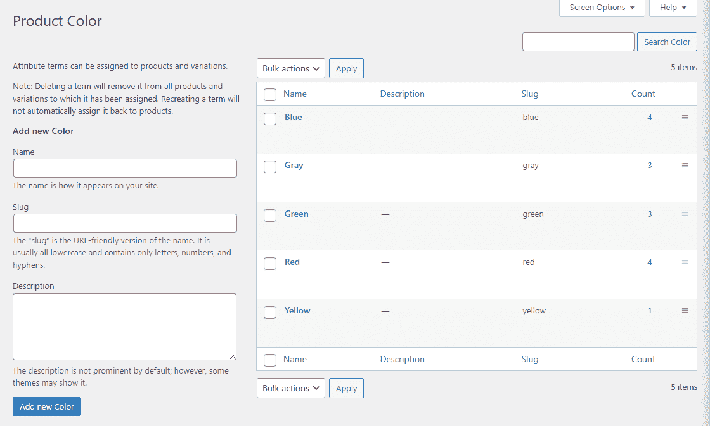

Adding product attributes in WooCommerce.

但是，您可能希望使用产品过滤器插件来代替。这可以提供更多的定制选项和高级过滤功能。

无论您使用什么工具，您都必须添加任何可用的产品属性。属性是任何合适的产品过滤工具的关键。如果没有全面的产品分类，客户将无法使用您提供给他们的任何过滤工具。

[As your WooCommerce store grows, so will its product catalog. 📝 Take a closer look at product filters and why you should use them right here ⬇️Click to Tweet](https://twitter.com/intent/tweet?url=https%3A%2F%2Fbit.ly%2F3uj99YS&via=kinsta&text=As+your+WooCommerce+store+grows%2C+so+will+its+product+catalog.+%F0%9F%93%9D+Take+a+closer+look+at+product+filters+and+why+you+should+use+them+right+here+%E2%AC%87%EF%B8%8F&hashtags=WooCommerce%2CEcommerce)

## 为什么使用 WooCommerce 产品过滤器？

成功商店的关键要素之一是用户体验(UX)。通过提供愉快的购物体验，你可以帮助[提高你的转化率](https://kinsta.com/blog/conversions-woocommerce-product-pages/)并留住你的顾客。

增强你的商店的一个有效方法是添加产品过滤器。这将使购物者能够根据自己的喜好浏览你的目录。

例如，一些用户可能更喜欢查看特定尺寸或颜色的产品，而不是查看整个目录。使用产品过滤器，他们可以选择自己喜欢的尺寸和颜色，并且只浏览符合标准的项目。

因此，产品过滤器使用户更容易浏览您的商店并找到他们想要的东西。这种效率可以[增加销售额](https://kinsta.com/learn/woocommerce-guide/),并鼓励购物者再次光顾你的商店以获得更多订单。
T3】

## 8 款最佳 WooCommerce 产品过滤插件

有很多 WooCommerce 产品滤镜插件可供选择。本节将向您展示高级和免费选项，并讨论是什么使每个插件与众不同。我们开始吧！

### 1.高级 AJAX 产品过滤器

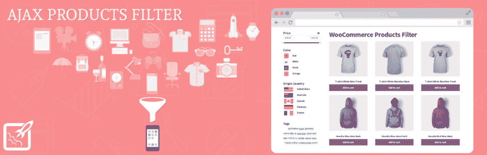

Advanced AJAX Product Filters.

[高级 AJAX 产品过滤器](https://wordpress.org/plugins/woocommerce-ajax-filters/)是一个插件，使客户能够根据属性、价格、自定义分类和标签过滤产品。该插件增加了一个用户友好的过滤侧边栏，你可以自定义以匹配你的商店的风格。

有了这个插件，你可以为用户提供视觉提示来理解特定类型的产品属性。例如，您可以添加可点按的颜色样本、复选框、图标，甚至价格滑块:

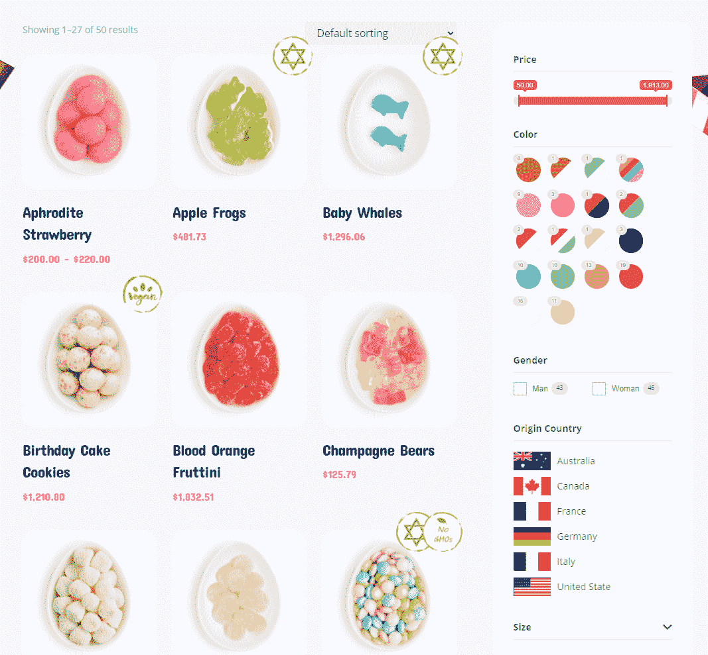

Different Advanced AJAX product filters in action.

此外，该插件带有多个产品过滤部件，你可以把它们放在你网站的任何地方。您可以混合搭配小部件，并根据您想要优先考虑的过滤器类型来更改它们的顺序。

最后，高级 AJAX 产品过滤器兼容多个页面生成器。这包括 [Divi 和【Elementor。](https://kinsta.com/blog/divi-vs-elementor/)

**主要特性:**

*   按属性、标签、价格和自定义分类法过滤产品
*   使用过滤小部件来选择向客户显示哪些选项
*   在产品过滤器中包含可视元素、复选框、图标和价格滑块
*   将产品过滤器小部件与流行的页面生成器插件一起使用

价格:基本的高级 AJAX 产品过滤器插件是免费的，包括所有讨论过的特性。还有一个高级版本，增加了新的过滤选项。许可证起价为[每年 44 美元](https://berocket.com/product/woocommerce-ajax-products-filter)。

### 2.WOOF-woo commerce 的产品过滤器

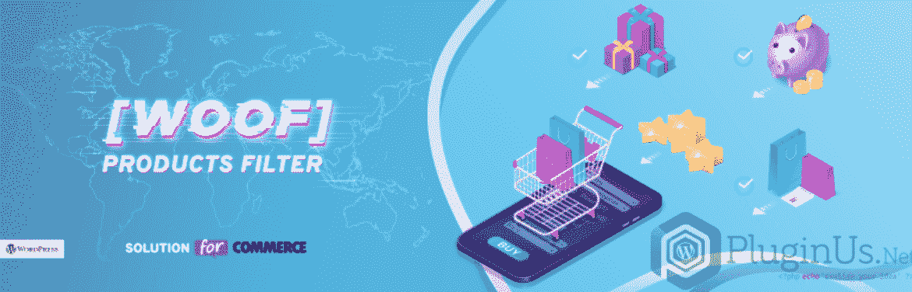

WOOF – Products Filter for WooCommerce.

WOOF——woo commerce 的产品过滤器(简称 WOOF)是一个开发者友好的产品过滤插件。使用这个工具，您可以为客户提供过滤器，使他们能够按照价格、类别、属性、标签和自定义分类法对产品进行排序。

该插件使您能够使用短代码或小部件来放置您想要的过滤器。您还可以在复选框、单选按钮和下拉菜单中选择过滤器:

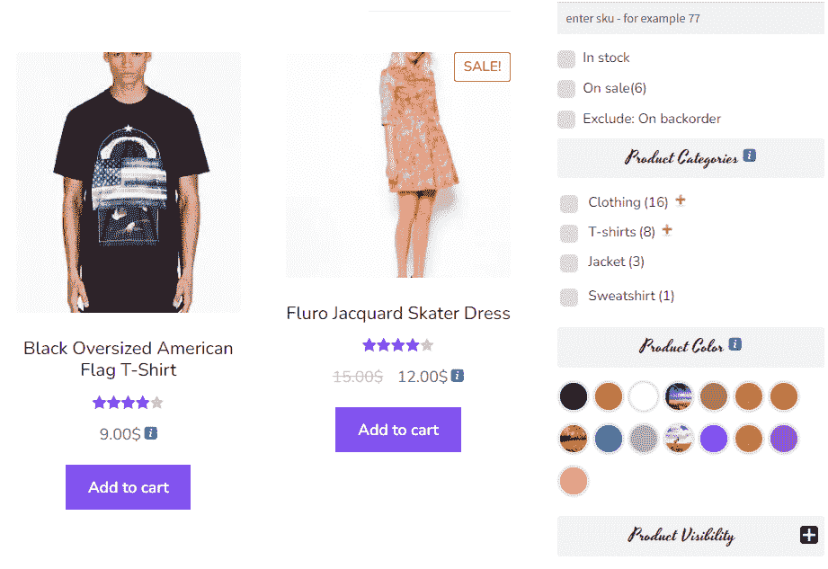

Different WOOF product filters in action.

免费版缺少的一个功能是为过滤菜单添加图像和其他视觉元素的选项。然而，由于 WOOF 的 API，开发者可以很容易地添加新的过滤器。另外，它提供了一些其他产品过滤插件没有的功能。例如，您可以在用户添加过滤器时动态显示结果的数量。

**主要特性:**

*   按价格、类别、标签、价格和自定义分类法过滤产品
*   使用短代码或小部件放置产品过滤器
*   使用复选框、单选按钮和下拉菜单来过滤产品
*   动态显示筛选搜索将返回的项目数

**价格:**WOOF-woo commerce 的产品过滤器是免费的。还有一个[高级插件版本](https://products-filter.com/downloads)，包括额外的过滤器和功能。定价从 39 美元起。

### 3.YITH WooCommerce AJAX 产品过滤器

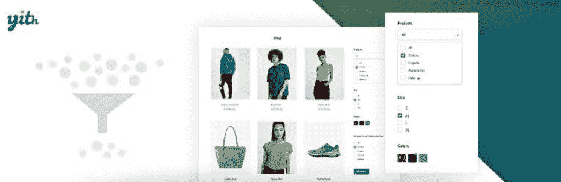

YITH WooCommerce AJAX Product Filter.

YITH 是最大的 WooCommerce 插件销售商之一。它提供了几十种独特的 WooCommerce 工具，包括 [YITH WooCommerce AJAX 产品过滤器](https://yithemes.com/themes/plugins/yith-woocommerce-ajax-product-filter/)。这个插件可以让你添加一个高度可定制的产品过滤器工具条(或水平栏)到你的商店。

这个侧边栏可以包括根据属性、类别、标签、价格和评级过滤产品的选项。您还可以让客户对打折商品进行排序，这将有助于您销售更多打折商品:

YITH product filters in action.

因为我们正在讨论一个 AJAX 插件，产品选择将会更新，而不需要客户提交搜索请求或重新加载页面。这使得用户可以更快地运行更多的搜索。

此插件提供了广泛的样式选项，以匹配过滤器到您的商店的设计。您还可以创建多个产品过滤器预设，并使用短码在整个商店中进行特定于地点的配置。

**主要特性:**

## 注册订阅时事通讯

### 想知道我们是怎么让流量增长超过 1000%的吗？

加入 20，000 多名获得我们每周时事通讯和内部消息的人的行列吧！

[Subscribe Now](#newsletter)

*   按类别、标签、价格、评级、属性和折扣状态过滤产品
*   将产品过滤器侧栏或水平栏放在商店上
*   自定义产品过滤器的样式
*   使客户无需更新页面即可查看过滤结果
*   使用唯一的短代码创建多个产品过滤器预设

**价格:**YITH woo commerce AJAX 产品过滤器插件有免费版，功能有限。我们推荐使用高级版本，每年 89.99 美元起。

### 4.WooCommerce 产品过滤器

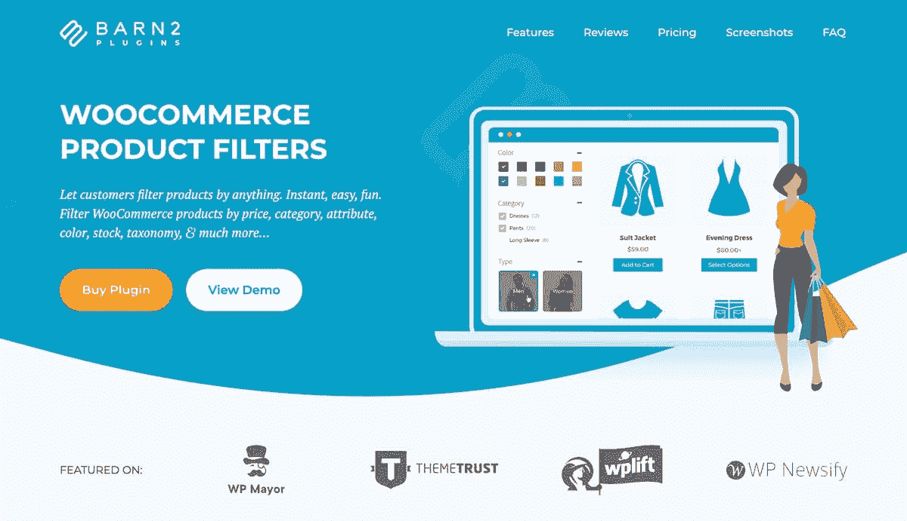

WooCommerce Product Filters

Barn2 的 [WooCommerce 产品过滤器](https://barn2.com/wordpress-plugins/woocommerce-product-filters/)插件旨在为 WooCommerce 添加专业级过滤。它的拖放式过滤器构建器使在线店主可以轻松地为他们的产品创建定制过滤器。为了设计这个插件，Barn2 的团队分析了世界顶级[电子商务网站](https://kinsta.com/blog/ecommerce-platforms/)的产品过滤器，并首次将这些技术引入 WooCommerce。

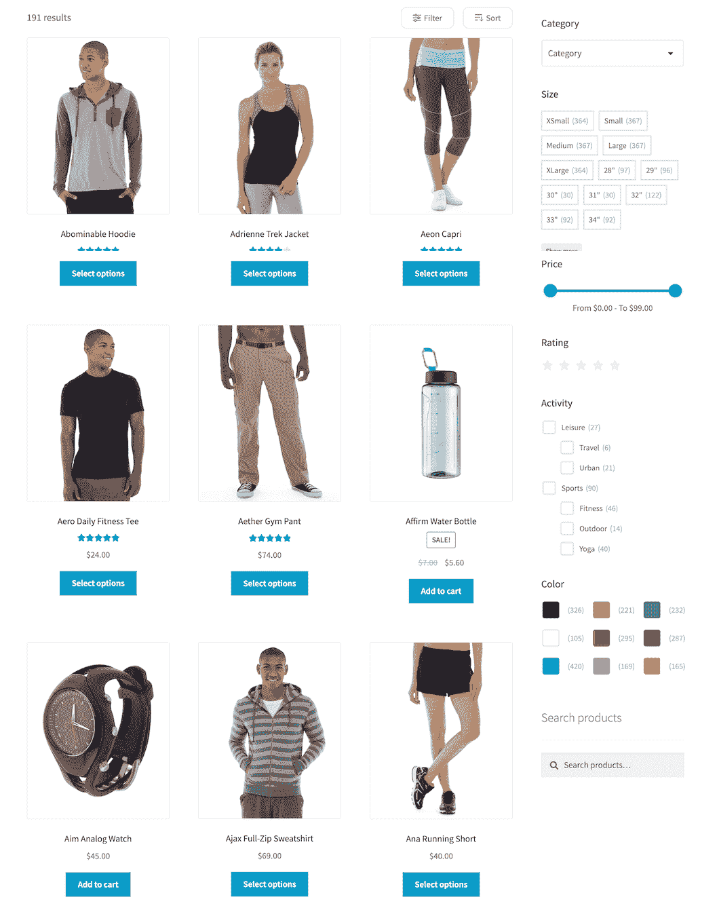

AJAX filtering or button click filtering

因此，它为提高任何 WooCommerce 支持的商店的产品过滤能力提供了一个强大而灵活的工具。这有助于客户更容易地找到他们正在寻找的产品，从而提高销售额和客户满意度。

**主要特征**

*   按任何类型的产品数据过滤产品，包括价格、等级、属性、颜色、大小、类别、标签和自定义分类。
*   从各种过滤器样式中进行选择，如下拉列表、复选框、单选按钮、可点按图像、色板、文字云以及范围滑块。
*   2 种过滤模式:AJAX 过滤或按钮点击。
*   自动或通过短代码或小部件，轻松地向任何列出产品的页面添加过滤器。
*   与 [Elementor](https://kinsta.com/blog/wordpress-elementor/) 、 [Divi](https://kinsta.com/blog/divi-vs-elementor/) 、 [Gutenberg](https://kinsta.com/blog/gutenberg-wordpress-editor/) 等 WooCommerce 插件集成，如 WooCommerce 产品表、WooCommerce 餐厅点餐等。
*   来自 Barn2 团队的定期更新和支持。

价格: WooCommerce 产品过滤器许可证起价 79 美元，这取决于网站的数量以及你是想要年度许可证还是终身许可证。他们有 30 天的退款保证。

### 5.WooCommerce 的产品过滤器

Product Filter for WooCommerce.

【WooCommerce 的产品过滤器是一个高级插件，它使用 AJAX 过滤让客户能够对你的目录进行分类。该插件为您提供了按价格、类别、可用性、折扣、评级和自定义分类法过滤产品的选项。

使用 WooCommerce 的产品过滤器，您可以使用一个全面的构建器来创建多个过滤器预设。您可以在网站上的任何地方使用这些过滤器，并将每个过滤器配置为具有独特的风格:

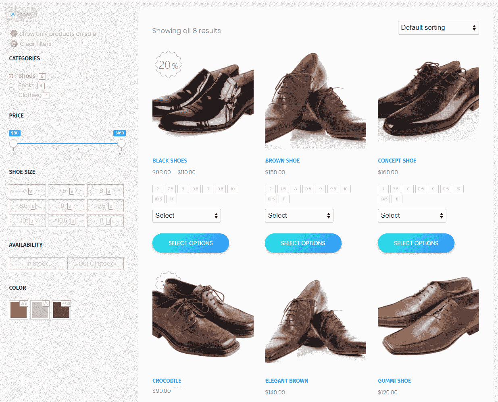

Product Filter for WooCommerce in action.

该插件支持多种类型的过滤元素，包括图标、颜色、图像、复选框、下拉菜单和滑块。顾客可以利用这些元素缩小搜索范围，找到他们想要的东西。

**主要特性:**

*   按价格、类别、可用性、折扣、评级和自定义分类法过滤产品
*   使用户无需重新加载页面即可查看搜索结果
*   使用生成器创建产品过滤器预设

**价格:【WooCommerce 许可证的产品过滤器从[开始，六个月](https://codecanyon.net/item/woocommerce-product-filter/8514038)19 美元。**

Struggling with downtime and WordPress problems? Kinsta is the hosting solution designed to save you time! [Check out our features](https://kinsta.com/features/)

### 6.JetSmartFilters

JetSmartFilters.

JetSmartFilters 是一个高级插件，设计用于与[元素器](https://kinsta.com/blog/wordpress-elementor/)和[块编辑器](https://kinsta.com/blog/gutenberg-wordpress-editor/)一起工作。如果您使用的页面生成器不是 Elementor，则可以跳过此条目。

该插件通过向 Elementor 或块编辑器添加新的模块和块来工作。这些元素包括多种类型的过滤器，包括添加日期、标签、类别、属性等等:

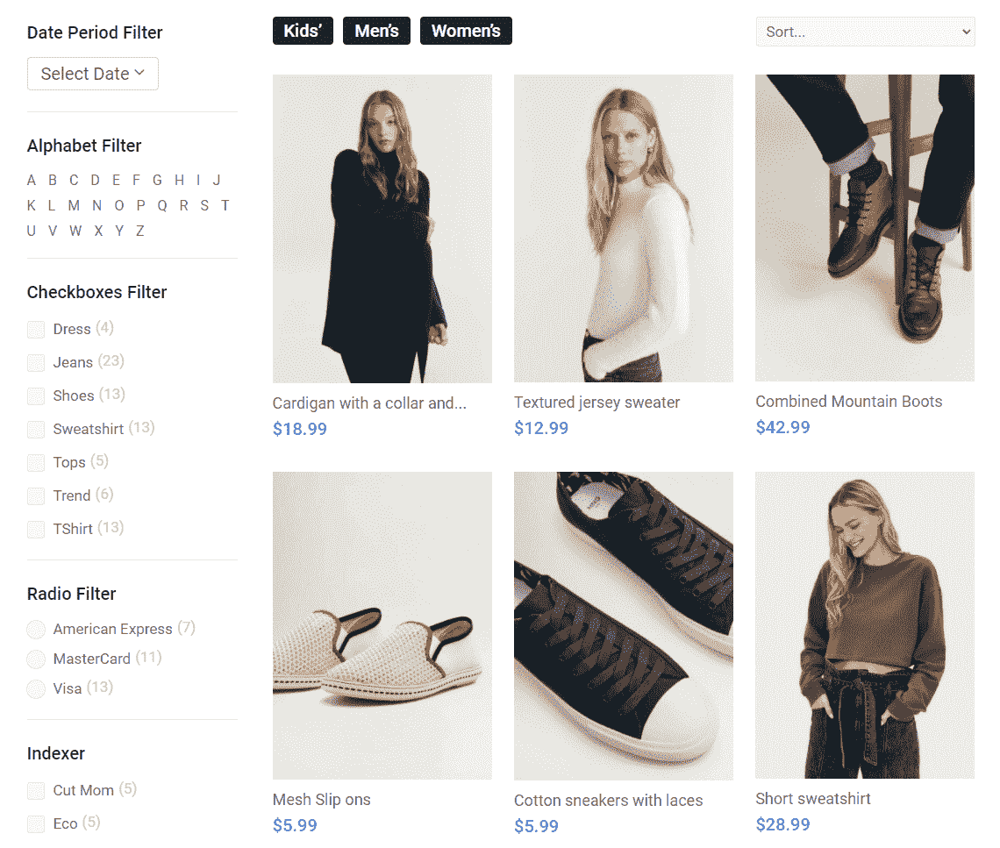

JetSmartFilters in action.

JetSmartFilters 显示搜索结果，无需客户重新加载页面。它还显示符合每个筛选器标准的项目数，因此用户可以看到哪些选项可用。

该插件与另一个名为 JetStyleManager 的 JetSmart 工具集成，使您能够使用块编辑器配置过滤器样式。使用 JetStyleManager，您可以自定义颜色、字体大小等。

**主要特性:**

*   向 Elementor 和块编辑器添加新产品过滤器
*   使用 JetStyleManager 插件定制您的产品过滤器样式
*   按字母顺序、添加日期、标签、类别、属性等过滤产品
*   显示结果，无需用户重新加载页面

**价格:** JetSmart 插件可通过订阅获得。全包年订阅费[130 美元每年](https://crocoblock.com/pricing/)，它让你可以使用广泛的插件，包括 JetSmartFilters。

### 7.WooCommerce 产品过滤器

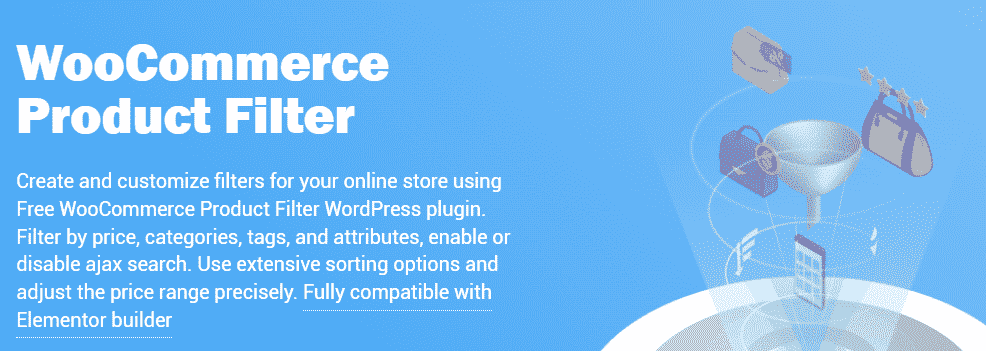

WooCommerce Product Filter.

WooCommerce 产品过滤器是一个免费的插件，可以和 Elementor 一起使用。这个插件可以让你访问一个拖放式的构建器，你可以使用任何你喜欢的布局来组合任何你想要的过滤器。

该构建器可以轻松配置您添加到商店的过滤器的外观。如果你使用的是这个插件的高级版本，你可以使用一些元素，比如图像、皮肤和可定制的加载动画:

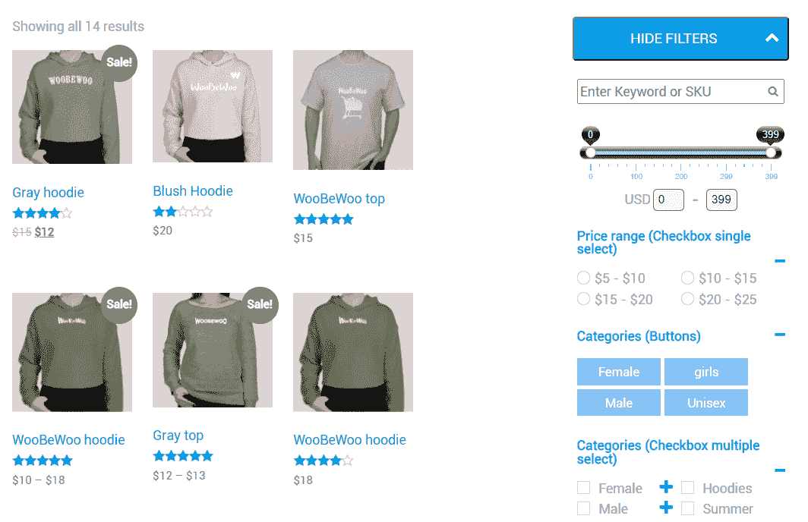

WooCommerce Product Filter in action.

使用 WooCommerce 产品过滤器，客户可以通过类别、标签、属性、价格、添加日期等过滤产品。放置过滤器很简单，因为插件会为您创建的每个过滤器生成一个唯一的短代码。

**主要特性:**

*   使用拖放构建器创建过滤器并设置其样式
*   使客户能够按类别、标签、属性、价格、添加日期等过滤产品
*   使用短代码放置过滤器

价格:该插件提供了一个免费版本，包括上面讨论的所有功能。该插件的高级版本提供了额外的过滤器和样式选项。许可证从[开始，一个站点 49 美元](https://woobewoo.com/plugins/woocommerce-filter/)。

### 8.过滤一切

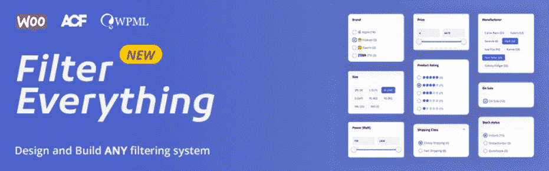

Filter Everything.

[过滤一切](https://wordpress.org/plugins/filter-everything/)不只是让你过滤 WooCommerce 产品。该插件还可以让你选择为任何 WordPress 内容添加过滤器，包括帖子、页面和[自定义帖子类型](https://kinsta.com/blog/wordpress-custom-post-types/)。

使用这个插件，您可以通过属性、类别、标签、自定义分类和字段、折扣状态、运输类别等来过滤产品:

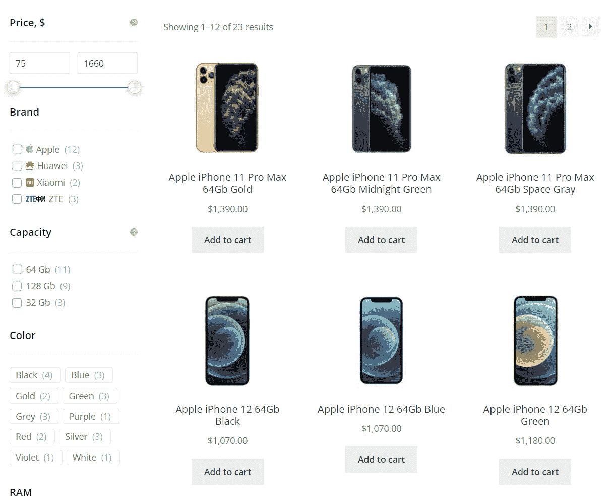

Filter Everything in action.

您可以根据自己的喜好打开或关闭 AJAX 过滤。关闭该功能后，客户必须重新加载页面才能看到他们的搜索结果。

这个插件的一个缺点是它没有包含广泛的样式选项。滤镜风格默认是极简的，和大部分店铺都很好看。然而，如果你想进一步定制过滤器样式，你需要使用 [CSS](https://kinsta.com/knowledgebase/edit-wordpress-code/) 。

**主要特性:**

*   为 WooCommerce 产品和其他类型的 WordPress 内容添加过滤器
*   按属性、类别、标签、自定义分类和字段、折扣状态、运输等级等过滤产品
*   启用 AJAX 过滤

**价格:**这个插件的免费版本包含了我们刚刚提到的所有特性。如果你选择高级许可，你可以兼容大多数 WordPress 页面生成器和增强的搜索引擎优化选项。高级许可证从[开始，六个月 40 美元](https://codecanyon.net/item/filter-everything-wordpress-woocommerce-filter/31634508)。

[Find the best plugins for adding product filtering to your WooCommerce store in this helpful guide ✅Click to Tweet](https://twitter.com/intent/tweet?url=https%3A%2F%2Fbit.ly%2F3uj99YS&via=kinsta&text=Find+the+best+plugins+for+adding+product+filtering+to+your+WooCommerce+store+in+this+helpful+guide+%E2%9C%85&hashtags=WooCommerce%2CEcommerce)

## 摘要

产品过滤不是大型在线商店的选项，而是必须的。如果你不给顾客提供工具来帮助他们浏览大量的产品目录，他们可能永远也找不到他们想要的东西。更糟糕的是，他们可能会从你的竞争对手那里购买这些产品。

WooCommerce 为你的产品提供了一个强大的分类系统。但是，你需要使用插件为你的商店添加高级过滤功能。每个插件都提供不同的过滤实现，所以我们建议您查看我们的最佳选择，并测试那些提供您需要的功能的插件。

*您对使用 WooCommerce 产品过滤插件有什么疑问吗？请在下面的评论区告诉我们！*

* * *

让你所有的[应用程序](https://kinsta.com/application-hosting/)、[数据库](https://kinsta.com/database-hosting/)和 [WordPress 网站](https://kinsta.com/wordpress-hosting/)在线并在一个屋檐下。我们功能丰富的高性能云平台包括:

*   在 MyKinsta 仪表盘中轻松设置和管理
*   24/7 专家支持
*   最好的谷歌云平台硬件和网络，由 Kubernetes 提供最大的可扩展性
*   面向速度和安全性的企业级 Cloudflare 集成
*   全球受众覆盖全球多达 35 个数据中心和 275 多个 pop

在第一个月使用托管的[应用程序或托管](https://kinsta.com/application-hosting/)的[数据库，您可以享受 20 美元的优惠，亲自测试一下。探索我们的](https://kinsta.com/database-hosting/)[计划](https://kinsta.com/plans/)或[与销售人员交谈](https://kinsta.com/contact-us/)以找到最适合您的方式。