# 30+最佳 WooCommerce 主题，装扮 2022 年的电子商务网站

> 原文:# t0]https://kinta . com/blog/woocommerce-themes/

我们都知道并喜欢 WordPress 的博客功能。

但是如何将 WordPress 网站转变成更多的东西呢？那么[通过 WordPress](https://kinsta.com/blog/website-ideas/) 销售实物或数字物品呢？

正如你们中的许多人可能知道的，没有必要去用另一个平台来启动一个电子商务商店，这一切都要感谢 [WooCommerce 插件](https://kinsta.com/blog/woocommerce-plugins/)。这是一个将你的网站变成在线商店的不可思议的解决方案，而且你通常不需要为许多 [WooCommerce 扩展](https://kinsta.com/blog/woocommerce-extensions/)付费。唯一的缺点是有太多的 WooCommerce 主题可供选择。

这就是为什么我们要报道**最佳 WooCommerce 主题**,让你减少搜索量，花更多时间建立网站！

请记住，你的最终目标是增加商店的收入。所以一定要下载我们的免费电子书**， [10 种提高你的网络商务产品页面转化率的方法](https://kinsta.com/ebooks/wordpress/ecommerce-conversion-rate/?utm_source=Blog&utm_medium=Link&utm_campaign=WooCommerce+Conversions+Ebook)。**

 **## 在哪里购买和下载最好的 WooCommerce 主题

有些人可能会严格寻找免费的 WooCommerce 主题。其他人只对最好的优质主题感兴趣。你属于哪一类并不重要，但是如果你想避免不可重复的主题，你应该知道正确的网站。

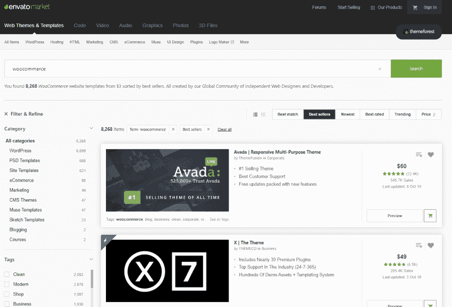

Themes Marketplace

像这样的文章是寻找精选列表以开始搜索的绝佳选择。然而，我们也想给你一些最好的 WooCommerce 主题的市场和图书馆，考虑到你可以随时回到这些，看到未来主题的评级和评论。

### 要找到最好的免费 WooCommerce 主题，请访问:

*   [WordPress 主题库](https://wordpress.com/themes)
*   [WooCommerce](https://woocommerce.com/)
*   [小岛](https://themeisle.com/wordpress-themes/)
*   [Colorlib](https://colorlib.com/wp/themes/)

### 要找到最受欢迎的 WooCommerce 主题，请访问:

*   [小岛](https://themeisle.com/wordpress-themes/)
*   主题森林
*   [WooCommerce](https://woocommerce.com/)
*   [保险丝](https://themefuse.com/wp-themes-shop/#theme=e-commerce)
*   [模板怪物](https://www.templatemonster.com/woocommerce-themes.php)
*   [优雅的主题](https://www.elegantthemes.com/)
*   [主题迷](https://www.theme-junkie.com/themes/#commerce)
*   第一个

## 在最佳 WooCommerce 主题中寻找什么

所有的[开发工作](https://kinsta.com/blog/hire-wordpress-developer/)都是不同的，所以找到涵盖其中大多数的主题很重要。你越少参与定制编码工作越好。那么，在研究最佳 WooCommerce 主题时，你应该找出哪些主要特征呢？

*   演示页面和设计，让你削减了大部分的编码和设计工作。例如，一些主题有大量的演示，可以立即启动不同行业的主页。你也可以看到关于我们的页面和联系方式的演示。
*   一个简单的 WooCommerce 集成工具，为您配置大部分在线商店。WooCommerce 为你做了大部分的工作，但是还有许多主题在这个过程中增加了一些额外的步骤。
*   基于电子商务的设计元素，如动画购物车图标和产品收藏馆。
*   当您的客户在较小的设备上购物时，可以使用移动界面。
*   一个[视觉定制器或拖放界面](https://kinsta.com/blog/wordpress-page-builders/)，用于以更加视觉化的方式设计你的网站。你也想有一个区域来[定制 HTML 和 CSS](https://kinsta.com/blog/how-to-customize-wordpress-theme/) ，以防万一。
*   与其他电子商务和页面构建插件的集成。有这么多的电子商务插件和扩展。请务必检查您的收藏夹是否受支持，或者自己测试一下。
*   [Translation](https://kinsta.com/blog/wordpress-multilingual/) 当您计划将商店扩展到其他市场时，或者如果您已经有说不同语言的客户时，您可以使用的工具。
*   [Megamenu 支持](https://kinsta.com/blog/wordpress-menu-plugins/)，以防你开始获得越来越多的产品，需要一个菜单把顾客送到所有这些产品。
*   高质量的客户支持，或者至少是某种在线论坛。顶级的客户支持对网上商店来说是至关重要的，因为问题会对你的生意造成真正的伤害。
*   一定要查看用户对你考虑的所有主题的评论、评分和评论。
*   不同的[产品页面样式和格式](https://kinsta.com/blog/conversions-woocommerce-product-pages/)。
*   多种列表格式，以便您可以按照自己的方式组织产品展示区。
*   您还需要检查博客区域，以确保开发人员没有在该区域偷工减料。

请记住，免费主题几乎永远不会有和高级主题一样的功能。对于较小的公司和博客来说，这并不重要，但寻求更快发展的企业几乎总是需要一个优质的主题。

作为一名开发人员，拥有高级主题也很好，因为你通常知道编码是可靠的，并且你可以随时求助于客户支持团队。

## 哪些 WordPress 主题最适合 WooCommerce？

这是一个有趣的问题，不常被问到。我们很多人认为所有的 WordPress 主题都与 WooCommerce 兼容。然而，情况并非总是如此。当然，你总是可以[在 WordPress 上安装 WooCommerce](https://kinsta.com/blog/woocommerce-tutorial/) ，但是它可能会因为与主题或其他插件冲突而导致你的网站崩溃。

此外，你可能会发现这个主题并不是用来处理 WooCommerce 的。例如，有些主题没有任何区域来展示您的产品系列。其他的没有购物车图标或者[滑块](https://kinsta.com/blog/wordpress-slider/)来显示你的新商品。你仍然可以抓住一个简单的博客主题，在那个网站上开一个小商店，但更多的时候，你会因为跳过实际的 WooCommerce 主题而给自己造成伤害。

那么，有哪些规则可以确保你的主题与 WooCommerce 配合良好呢？

1.  确保主题销售页面确实提到了一些关于与 WooCommerce 整合的内容。
2.  测试演示以查看是否有任何页面被配置为在线商店。
3.  考虑付费主题，有更好的客户支持和更高的电子商务集成潜力。
4.  跳过大多数没有多少评论或评级较低的主题。
5.  向开发者询问这个主题在 WooCommerce 中的表现如何。
6.  查看其他用户的评论和问题，看看是否有人提到了 WooCommerce。在这里，你通常会找到关于集成的公正观点。

## 如何安装 WooCommerce 主题

安装 WooCommerce 主题就像[安装任何其他 WordPress 主题](https://kinsta.com/blog/how-to-install-a-wordpress-theme/)一样。主要的区别是在 WooCommerce 配置中进行运输和定价等设置。

让我们走一遍这个过程，以确保每个人都知道如何正确地启动他们的网站。请记住，你还必须在开店前[找到一个高质量的 WooCommerce 主持人](https://kinsta.com/woocommerce-hosting/)。

### 步骤 1:上传并安装你的 WooCommerce 主题

在这个简短的教程中，我们将选择一个免费的主题并上传到一个空白的 WordPress 安装中。我们将使用[免费商店主题](https://themeisle.com/themes/shop-isle/),因为它很容易设置，也可以选择升级到付费版本。

要么下载你的主题的 ZIP 文件，要么在你的 WordPress 仪表盘中搜索免费的主题。您可以在仪表板中转至外观>主题来完成此操作。

如果主题在仪表板上，你可以点击安装按钮，然后在你的站点上激活它。如果你使用的是高级主题，你也可以在这个区域上传 ZIP 文件。

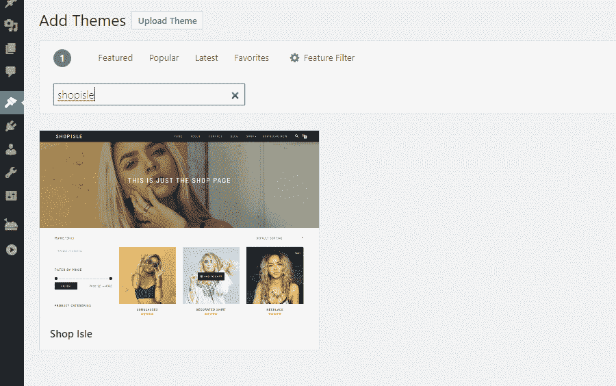

Using a WordPress theme

请随意单击“定制”按钮来使用可视化构建器。这允许你上传一个标志，调整字体，在主页上添加横幅。所有最好的 WooCommerce 主题都有不同的设置，所以一定要测试这个区域，了解你有什么能力。

例如，商店岛主题已经在主页上有了一些图片标题和横幅。你只需要把图像换成你自己的。在其他主题上，您可能会发现这些演示内容都不包含在内，因此您可能很难在开发者的产品页面上复制您已经看到的内容。

Customizing a WordPress theme

### 第二步:安装 WooCommerce

转到 WordPress 仪表盘上的插件>添加新插件。

在搜索栏中输入“WooCommerce”。

点击“立即安装”按钮，然后激活插件，使其开始在网站上工作。

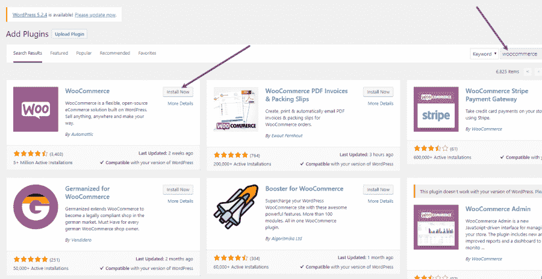

Installing WooCommerce

### 步骤 3:完成 WooCommerce 的配置步骤

激活 WooCommerce 后，会弹出一个新页面，这样你就可以从一开始就完成所有的设置。

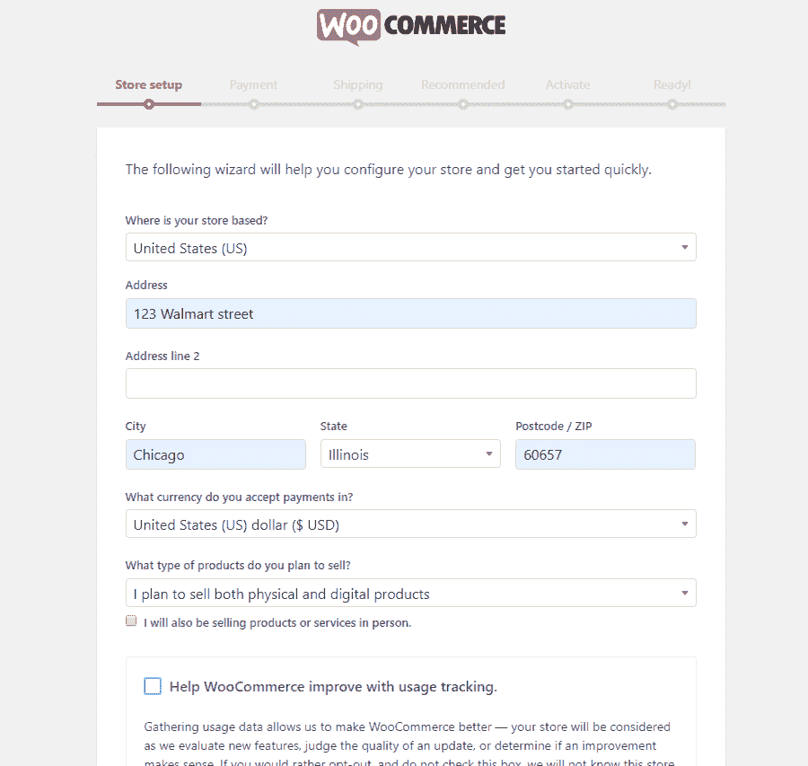

WooCommerce wizard page

它从一个页面开始，在那里你输入商业信息，比如地址和你计划销售的产品类型。之后，您将完成以下步骤:

*   支付
*   船舶
*   赋税
*   WooCommerce 管理设置
*   MailChimp
*   脸谱网

我们已经有了激活和设置 WooCommerce 的[教程，所以请随意查看那篇文章，深入了解这个过程是如何进行的！](https://kinsta.com/blog/woocommerce-tutorial/)

之后，我们建议添加你的主题附带的任何演示，并创建产品。然后你可以收集一些你的产品，在你的主页和网站的其他地方展示。

同样重要的是[在需要的时候更新 WooCommerce】，所以请保持关注。](https://kinsta.com/blog/woocommerce-update/)

## 最佳免费 WooCommerce 主题

当开始做小生意或博客时，考虑一个最好的免费 WooCommerce 主题并不是一个坏主意。这可能是为了削减成本，或者只是在没有任何财务义务的情况下测试主题。之后，你可以决定你所需要的是一个免费的主题，或者你可以考虑升级到该主题的高级版本以获得更多的功能。

我们喜欢测试用的免费主题，所以这里有一些我们喜欢的免费 WooCommerce 主题可供选择。

### 博特加

Botiga 是一个优雅的主题，可以让你的网上商店更上一层楼，尤其是如果你想要一个简约的外观。它拥有现代、简洁的设计，几乎适用于任何品牌。你可以用它来轻松展示你的产品，引人入胜，引人注目。

Botiga 还提供定制选项。这包括多种列表样式、各种产品购物车定制选项、不同的结账样式、三个产品页面库设计以及产品推荐和过滤功能。它还提供多种徽章样式，可以帮助您促销某些商品、特价商品和限时优惠。

为了进一步帮助您突出您的产品，Botiga 让在您的在线商店中添加博客变得轻而易举，并提供了六种存档布局供您选择。由于代码简洁，这个电子商务主题还针对性能进行了优化。

boti ga[免费下载](https://wordpress.org/themes/botiga/)使用。它的 [Pro 计划](https://athemes.com/theme/botiga/#pro)起价为每年 69 美元，带有产品样本、更多标题样式、侧边栏位置、愿望列表功能等等。

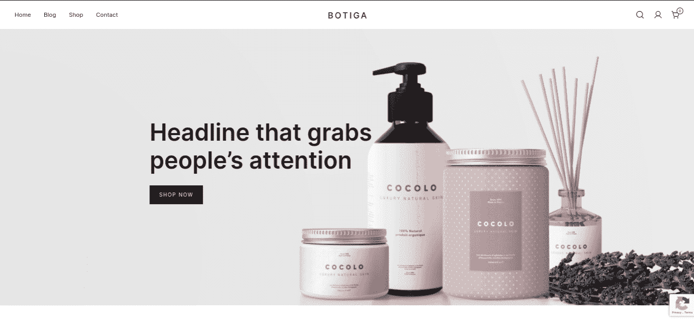

Botiga

*   **WP.org 评分:5 分中的 5 分**
*   **下载量:7000+**
*   **整合:WooCommerce**
*   **简易多语言支持:是**

### 覆盖物

[Overlay](https://wordpress.org/themes/overlay/) 为建立您的在线商店提供了灵活的设计。经典的布局是专业的，适合所有想让自己的品牌给人留下深刻印象的小企业。这是一个轻量级的快速解决方案，可以处理从简单的博客到成熟的在线商店的任何事情。我们最喜欢的是那些喜欢宽敞空间和柱子的人，他们可以清理杂物，确保顾客在购物时不会感到困惑。

Overlay 无疑是最好的 WooCommerce 主题，因为它的快速集成、提供漂亮的博客帖子的能力以及部件的各种位置。页脚是完全可定制的，你可以进入颜色设置，以确保你的品牌是正确的。这是一个完全响应的 WooCommerce 主题，它还拥有一些令人印象深刻的社交媒体图标，这些图标通常只会在高级主题中找到。总的来说，我们建议你把 Overlay 作为你的第一个 WooCommerce 选择。

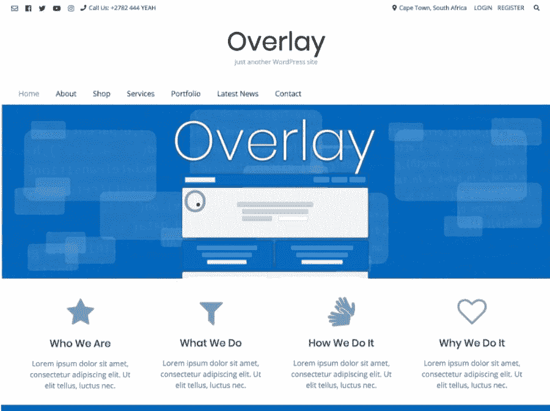

Overlay theme

*   **WP.org 评分:5 分中的 5 分**
*   **下载量:1000+**
*   集成:WooCommerce，Elementor，以及更多。
*   **简易多语言支持:是**

### 赫斯缇雅

赫斯缇雅是一个 WooCommerce 主题，有着令人印象深刻的评分和评论，以及漂亮的界面。这个主题是由 ThemeIsle 上友好的人们制作的，它提供了一个标准在线商店的现代版本。我们最喜欢小企业和公司使用它，但是 ThemeIsle 也建议创意人员、公司、投资组合和自由职业者使用它。

所有这些类型的企业都可以利用电子商务功能，特别是因为它无缝集成，并允许您在您的网站上立即获得购物车。请记住，赫斯缇雅是一个单页的网站主题，这是另一种方式，它让事情变得简单，给你的客户一个更容易的购买途径。

除了视差滑块、照片库和旅游地图模块，赫斯缇雅 WooCommerce 主题一定会提高你的转化率。

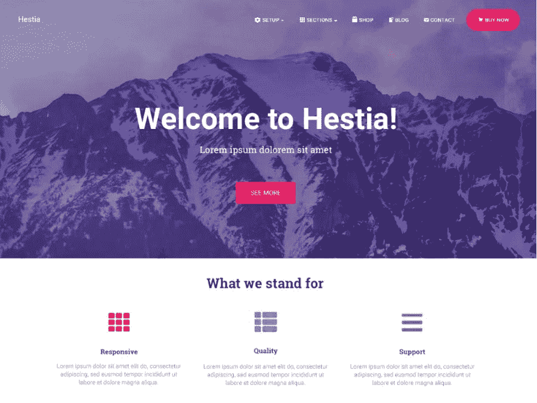

Hestia theme

*   **WP.org 评分:5 分中的 5 分**
*   **下载量:10 万+**
*   集成:Elementor、WooCommerce、平面视差滑块、照片库和旅行地图。
*   **简易多语言支持:是**

### 从不

Neve 是 ThemeIsle 提供的另一个免费 WooCommerce 主题。从高级设计师到完全的初学者，这对于所有技能水平都是一个有用的选择。该主题也有一个漂亮的前端，明亮的颜色和可定制的项目，如字体和颜色。Neve 与 [AMP](https://kinsta.com/blog/google-amp/) 兼容，考虑到如今有如此多的人通过手机在线购物，它采用了移动优先的方式。

有了 ThemeIsle，您[总能获得可靠的更新](https://kinsta.com/blog/how-to-update-wordpress-theme/)和可靠的客户支持。此外， [Neve 主题是快速和轻量级的](https://kinsta.com/blog/fastest-wordpress-theme/#neve)，这样你所有的产品页面都可以快速加载。您可以随意在页眉和页脚中添加自定义设计，并利用布局选项进行宽度调整等等。

由于许多集成，内容编辑很容易，一键导入按钮可以从提供的预制模板中获得您需要的所有内容。

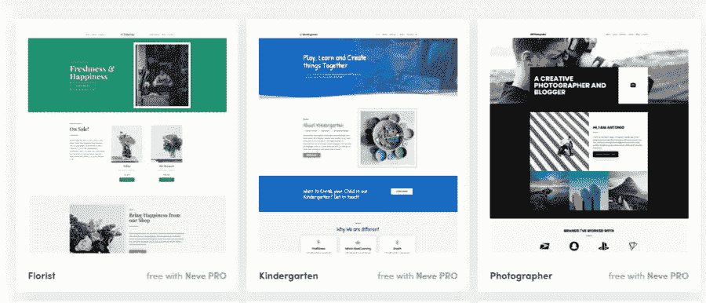

Neve theme

*   **WP.org 收视率:5 比 5**
*   **下载量:5 万+**
*   集成:WooCommerce、Visual Composer、SiteOrigin、Divi 和许多其他页面生成器。
*   **简易多语言支持:是**

### 堤喀

[堤喀](https://colorlib.com/wp/themes/tyche/)提供时尚诱人的造型，有深色主题选项和独特的按钮。该主题支持任何页面上的滑块内容，并且有许多列可供使用，因此您可以组织您的文本、图像和其他内容。这是我们最喜欢的免费 WooCommerce 主题之一，原因有很多。

首先，默认的布局包括漂亮的产品集合，您可以利用小部件列出“最想要的产品”和“最新产品”

堤喀是市场上鲜为人知的免费 WooCommerce 主题之一，但它以可靠性和速度而闻名。其他一些优势包括[页脚小部件](https://kinsta.com/blog/wordpress-widgets/)、自定义徽标和菜单，以及为那些计划通过博客支持业务的公司提供的漂亮的特色图像。

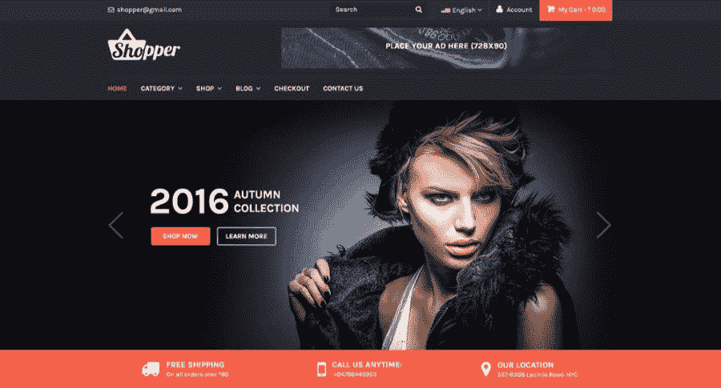

Tyche theme

*   **WP.org 评分:4.5 分(满分 5 分)**
*   **下载量:4000+**
*   **整合:WooCommerce**
*   **简单的多语言支持:似乎不是这样**

### 阿斯特拉

Astra 是最受欢迎的 WordPress 主题之一，下载量超过一百万次。它可以定制和个性化，以适应任何网站，包括电子商务商店。

使用 Astra 构建网站非常简单，因为它预装了 150 多个模板，适用于各种行业，如时装设计师、电子商务商店、产品公司、健身工作室等。这些模板是用流行的页面生成器构建的，比如 Elementor、Beaver Builder 和 [Gutenberg](https://kinsta.com/blog/gutenberg-wordpress-editor/) 。你可以在 Astra 的网站上查看所有[这些模板](https://wpastra.com/starter-templates/)。

最重要的是，Astra 与 WooCommerce 合作得非常好，是 WordPress 最受推荐的电子商务主题之一。

Astra 的一些值得注意的电子商务特定功能包括 [SEO 优化的](https://kinsta.com/blog/wordpress-seo/)产品列表、减少[购物车放弃的转换就绪结账](https://kinsta.com/blog/shopping-cart-abandonment/)、100%安全交易、产品分页和无限滚动、产品搜索过滤器、无需离开页面即可预览产品的快速视图、下拉购物车窗口和高度可定制的结账流程。

Astra 可以免费下载和使用。它的高级计划起价 59 美元，包括额外的 100 多个入门模板、一对一支持、无限制的网站使用和其他功能。

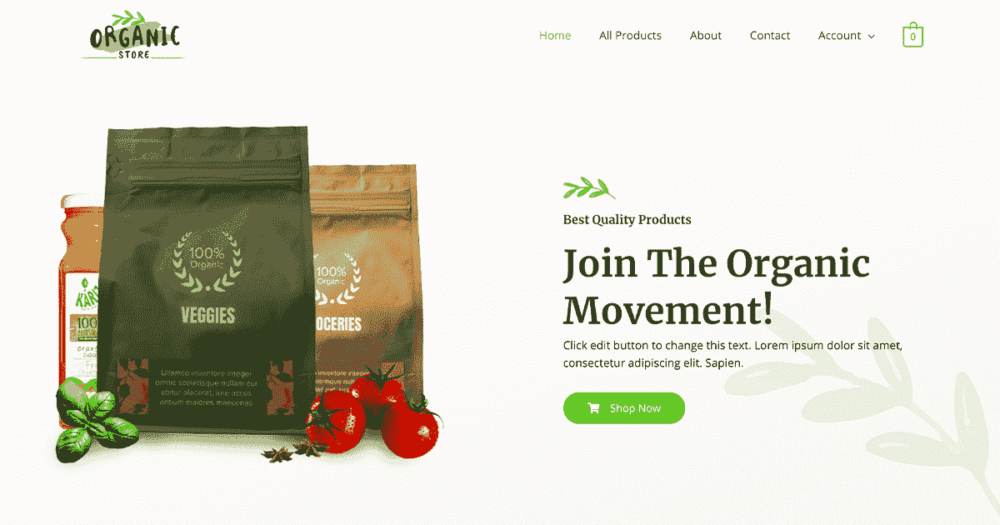

Astra theme

*   **WP.org 评分:4.9 分(满分 5 分)**
*   **下载量:100 万次以上**
*   集成:WooCommerce，Beaver Builder，Elementor，Gutenberg，LifterLMS，LearnDash 等等。
*   **简易多语言支持:是**

### activelle

[Activello](https://colorlib.com/wp/themes/activello/) 来自 Colorlib 的开发团队。这是一个简单的博客主题，能够与 WooCommerce 集成，或者转换为在线商店，或者只是向用户提供一个小商店。多用途主题在许多方面是灵活的。首先，你可以很容易地为你的生活方式或旅游品牌制作一个漂亮的博客。

这是一个干净的主题，充满了空白和许多图像选项。您还可以找到许多小部件，例如关于我的信息和最近的帖子。

Activello WooCommerce 主题提供了一个最小化的设计，但它也提供了必备的响应特性、 [JetPack 集成](https://kinsta.com/knowledgebase/wordpress-jetpack/)，以及完整的 SEO 支持。全屏滑动条肯定会吸引注意力，内容定制工具可以用来改变颜色和字体。

其他一些亮点包括无限滚动功能，翻译就绪功能，和字体真棒图标。再加上无限的颜色选项，您就拥有了所需的全部定制能力。

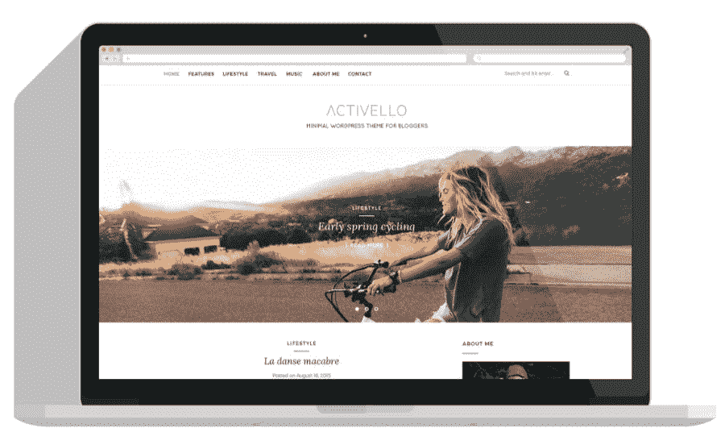

Activello theme

*   **WP.org 评分:5 分中的 5 分**
*   **下载量:10000+**
*   集成:WooCommerce、Jetpack、Yoast SEO、Gravity Forms 和 [W3 Total Cache](https://kinsta.com/blog/w3-total-cache/) 。
*   **简易多语言支持:是**

### 忠实的

[Allegiant](https://cpothemes.com/theme/allegiant) 引入了广泛的功能，使其成为一个多用途的主题，并且能够在线销售。你可以从一页的布局开始，制作从[作品集](https://kinsta.com/blog/wordpress-portfolio-plugins/)到标准商业网站的任何东西。我们特别喜欢小企业使用这个，因为它很轻便，当你计划在网上销售时，你可以随时添加 WooCommerce。

Allegiant 的伟大之处在于它包括几个预构建的内容模块。其中一个是用来展示团队成员的，而另一个是用来展示你的客户标志的。我们喜欢的另一件事是，你可以毫无问题地列出证明和服务。

在 Allegiant 主题中，一切都被很好地格式化了。更不用说，[响应式设计](https://kinsta.com/blog/javascript-media-query/#why-is-responsive-design-important)在所有移动设备上看起来都很棒。再加上 WooCommerce 的支持，你就找到了一台时髦的销售机器。

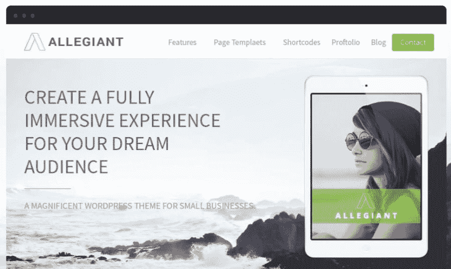

Allegiant theme

*   **WP.org 评分:5 分中的 4 分**
*   **下载量:8000+**
*   **整合:[联系方式 7](https://kinsta.com/blog/contact-form-7/) 、WooCommerce、Yoast SEO、WPML**
*   **简易多语言支持:是**

### 闪烁的

闪亮的 WooCommerce 主题被描述为一个简单的主题，拥有一些流行的颜色和美丽的自由空间，让你的内容有一些呼吸的空间。乍一看，这似乎是一个令人惊叹的博客主题。您可以添加带有社交媒体按钮、关于我的信息和下载按钮的边栏。

然而，你也可以与 WooCommerce 整合，开始销售你的电子书、课程或软件。总的来说，对于那些有兴趣开始写博客的人来说，这个闪闪发光的主题看起来很便宜。

这是一个完全免费的主题，主题的响应性确保了你的所有客户都能在较小的设备上看到你的博客文章和产品页面。这个滑块令人印象深刻，因为它有一些重叠的文本和一个快速上传按钮，可以将一些高分辨率照片放在主页上。这是 Colorlib 的另一个主题，所以你可以看到公司创建了多少免费主题。Colorlib 的伟大之处在于，如果您对更多特性感兴趣，它们可以提供高质量的支持和高级升级。

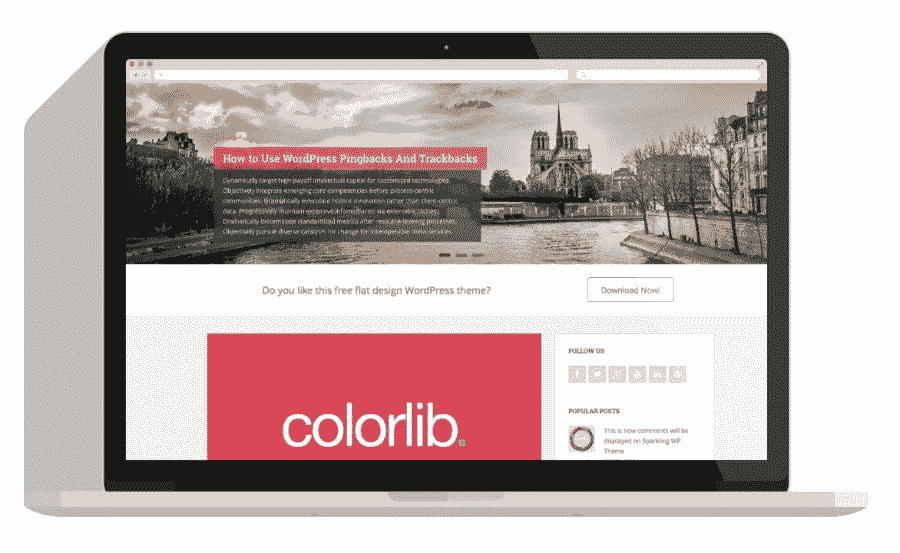

Sparkling theme

*   **WP.org 评分:5 分中的 5 分**
*   **下载量:4 万+**
*   集成:WooCommerce、Jetpack、Contact Form 7、bbPress 等等。
*   **简易多语言支持:是**

### 耀眼的

[眼花缭乱的](https://colorlib.com/wp/themes/dazzling/)主题在名字里说的相当多。这是另一个免费的 WooCommerce 主题，为小型博客和小型企业创造了奇迹。你可以利用扁平的基本设计，因为它很容易改变颜色和在边栏中放置小部件。我们还喜欢内容滑块，用于突出显示您最近的博客文章和上传可能引起注意的图像。

闪亮主题的奇妙之处在于，从技术上讲，你可以将它用于任何类型的业务。这是一个高度通用的免费 WooCommerce 主题，具有博客的外观和应用程序开发人员、设计师、艺术家和旅游公司等公司的专业性。闪闪发光的主题有很好的插件支持，你可以收到从字体到无限的颜色选项。

Dazzling theme

*   **WP.org 评分:5 分中的 5 分**
*   **下载量:4 万+**
*   集成:WooCommerce、Contact Form 7、bbPress、Jetpack 等等。
*   **简易多语言支持:是**

### 时尚天后

对于时尚和生活方式博主来说，时尚天后是一个很好的起点。考虑到默认的颜色和风格是为了迎合时尚行业，我们不会推荐它做其他事情。这是一个女性化的主题，漂亮的粉红色和顶部的社交媒体按钮。您可以利用图像滑块来突出显示博客文章，同时还可以链接到投资组合和在线商店项目等内容。

请记住，[是](https://kinsta.com/blog/wordpress-child-theme/)[绽放时尚主题](https://wordpress.org/themes/blossom-fashion/)的子主题。因此，你需要这两者来使你的网站正常工作。除此之外，这个主题是为那些花大量时间在 Instagram 上发布图片的时尚人士打造的。你可以在自己的网站上分享这些帖子，并使用 20 个小工具根据自己的喜好定制风格。

Fashion Diva theme

*   **WP.org 评分:5 分中的 5 分**
*   **下载量:1000+**
*   **整合:WooCommerce 和主要社交网络**
*   **简单的多语言支持:支持尚可，但不是最好的**

### Di 电子商务

Di eCommerce 拥有你在建设传统在线商店时通常会想到的设计。它有亚马逊的氛围，但更干净，有大菜单，顶部有社交媒体按钮，无论顾客在哪个页面，购物车总是可见的。图像滑块是一个很好的附加功能，多列非常适合在列表中展示您的功能或产品。

Di eCommerce 主题作为一个响应性的 WooCommerce 主题，你还可以拥有一个漂亮的 WordPress 博客。总的来说，Di 电子商务具有许多现代设计元素，大型菜单可以帮助你使你的导航变得简单而强大。

除了社交资料、粘性菜单和侧边栏布局，Di 电子商务主题还能让电子商务商店的价格更低。

Di eCommerce theme

*   **WP.org 评分:5 分中的 5 分**
*   **下载量:1000+**
*   **集成:WooCommerce、PDF 发票、MailChimp 的简易表单、Elementor 等等**
*   **简单的多语言支持:有点儿**

### 购物者

Shoptimizer 是 CommerceGurus 推出的一个专注于性能的 WooCommerce 主题。太多的主题忽略了速度对于转化的重要性。如果你的商店多花一秒钟加载，页面浏览量就会惊人地下降 11%。

Shoptimizer 是最快的主题之一，在谷歌页面速度洞察上，该演示网站在移动设备上的得分高达 96%。

商业大师们还在主题中内置了许多以转化为中心的功能，例如:

*   即时 AJAX 搜索结果。
*   鼓励销售的可视化库存计量栏。
*   购买过程中关键阶段的信任徽章。
*   产品和[结账页面](https://kinsta.com/blog/woocommerce-one-page-checkout/)倒计时。
*   不受干扰的结账。
*   提醒顾客商品何时有货的等待列表。
*   Shoptimizer 每年花费 49 美元，这包括 12 个月的更新和快速支持。如果你想从一个真正专注于。
*   WooCommerce 性能和转化率，Shoptimizer 是一个去！

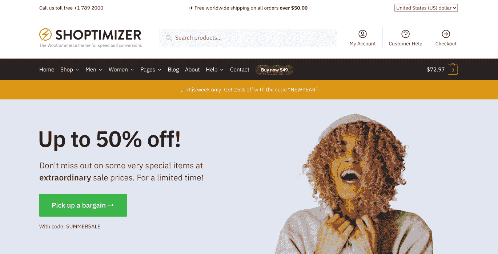

Shoptimizer WooCommerce theme.

*   **评分:5 分中的 5 分**
*   **下载量:6000+**
*   **简易多语言支持:是**
*   **价格:49 美元**

### 闪光

Flash 有高级 WordPress 主题的功能，但没有价格标签。是的，你可以升级到付费版本，但许多公司会发现这是最好的免费 WooCommerce 主题之一。它不仅提供了一个拖放构建器，还提供了一些漂亮的小部件区域来定制内容模块。

事实上，有六个区域可以放置你的小部件，扩展了你通常从免费主题中得到的东西。当你选择专业主题时，你甚至可以升级到更多的部件区域。

当你使用这个主题时，你会很快意识到小部件对它的设计有多重要。六个小部件区域很不错，但是您还可以访问一个自定义小部件区域生成器和 18 个自定义小部件。其中一些小部件非常适合共享独特的列表、内容和菜单。

通过从颜色选择器中选择，可以使用高级颜色选项。您可以使用此区域从各种各样的颜色中挑选，将颜色与您的徽标和其他设计相匹配。除了高级的“关于我们”部分、我们的团队小部件等等，Flash 主题还在许多层面上提供了帮助。

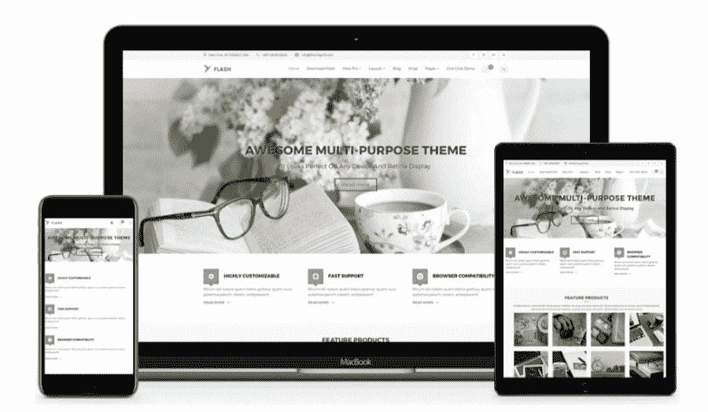

Flash theme

*   **WP.org 评分:5 分中的 5 分**
*   **下载量:30，000+**
*   **集成:WooCommerce、SiteOrigin 和 Flash Toolkit**
*   **简单的多语言支持:有限的**

### 购物热

购物狂潮是一个免费的多功能网络商务主题。专为页面生成器爱好者打造([古腾堡](https://kinsta.com/blog/gutenberg-wordpress-editor/)、 [Elementor](https://kinsta.com/blog/wordpress-elementor/) 、Divi、Brizy 或其他任何你喜欢的 WordPress 页面生成器)。它附带了 premade 准备导入入门网站。只需点击几下，您的网站就可以使用了。

不需要编码技能。你可以创建任何类型的电子商务网站，因为你喜欢的主题是一个完全可定制的，快速，搜索引擎优化的主题。主题也兼容[几乎所有插件](https://kinsta.com/blog/wordpress-ecommerce-plugins/)。对于商店网站制作者来说，这是真正的一站式解决方案。

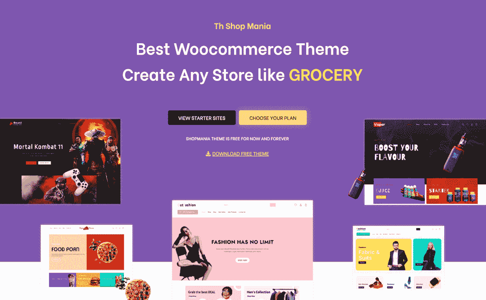

TH Shop Mania

*   **免费多用途主题**
*   **下载量:不适用**
*   集成:WooCommerce、Elementor、Divi、Brizy 等等。
*   **简易多语言支持:是**

### 购物岛

ShopIsle 来自 ThemeIsle，所以如果你选择这个 WooCommerce 主题，你知道你会得到高质量的服务和一个下载并不陌生的主题。这个主题是基于 bootstrap 的，你会看到书中所有的集成。

使用 ThemeIsle 主题的好处是它们中的大部分可以很好地与其他插件一起工作，并且客户支持是可靠的。这样，你就不会祈祷你宝贵的网上商店会崩溃或给你的服务器带来问题。

优雅的 ShopIsle WordPress 主题是严格为在线商店设计的，因此，如果你主要是在建一个博客，而不是考虑一个电子商务商店，我们建议你放弃它。除此之外，ShopIsle 中的 live customizer 非常适合拖放一些最重要的站点元素。

这个主题也适用于你最喜欢的页面生成器，比如 Beaver Builder、SiteOrigin 和 Divi。我们在列表中有一些 ThemeIsle WooCommerce 主题，我们强烈建议您在商店中试用其中的大部分。

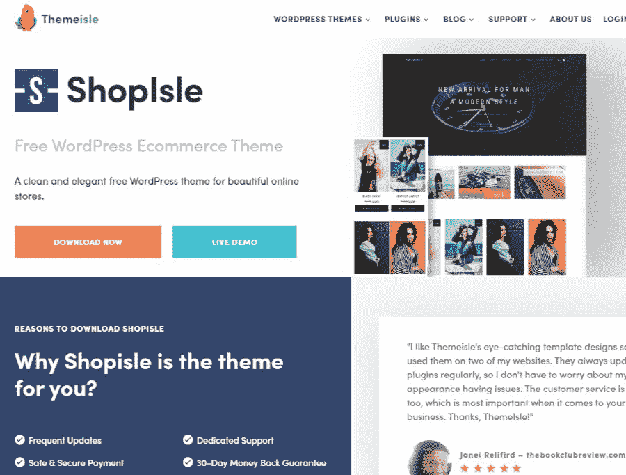

ShopIsle theme

*   **WP.org 评分:4.5 分(满分 5 分)**
*   **下载量:4 万+**
*   集成:WooCommerce，Contact Form 7，Meta Slider，SiteOrigin，WPML 等等。
*   **简易多语言支持:是**

### 奥尔费奥

《奥菲欧》是《ThemeIsle》中赫斯缇雅的儿童主题。它不一定是一个在线商店，但它确实有一个很好的 WooCommerce 集成。Orfeo 的一些建议领域包括医疗、博客、体育和时尚。

基本设计看起来适合大多数小型企业，因为你会收到一个坚实的标题图像/滑块和一些伟大的行动呼吁按钮在图像的顶部。您还可以更改页面上的列数，允许您添加产品列表，甚至是功能和服务的比较。

所有好的网上商店都有电子邮件营销工具。Orfeo 的伟大之处在于它有一个 SendInBlue 集成，用于收集这些客户电子邮件，并发送您可以设计的最佳简讯和自动化活动。其他一些集成包括旅游地图、Elementor 和照片库，它们都有自己的在线商店用途。

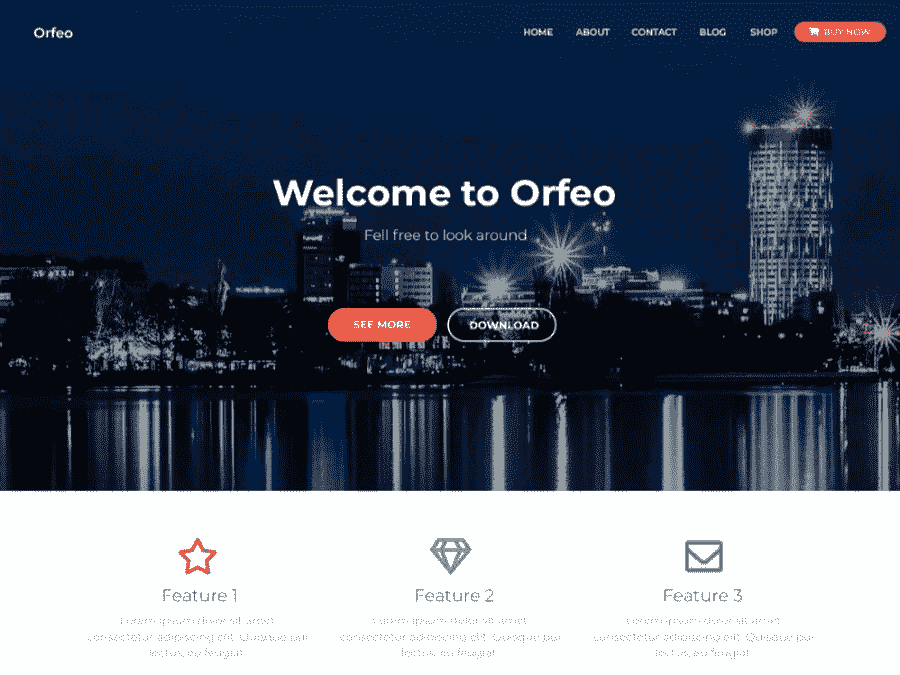

Orfeo theme

*   **WP.org 评分:5 分中的 4 分**
*   **下载量:20，000+**
*   集成:WooCommerce、旅行地图、SendInBlue、平面视差滑块、照片库等等。
*   **简单的多语言支持:有限的**

### 你还好吗

如果你正在寻找一个更传统的设计，标题中有大量的菜单和购物车图标，那么 WooCommerce 主题是必不可少的。

## 注册订阅时事通讯

### 想知道我们是怎么让流量增长超过 1000%的吗？

加入 20，000 多名获得我们每周时事通讯和内部消息的人的行列吧！

[Subscribe Now](#newsletter)

这个 ThemeGrill 产品是网上最受欢迎的 WooCommerce 主题之一，尤其是考虑到这么多用户喜欢你不仅可以与 WooCommerce 集成，还可以与 YITH WooCommerce 愿望列表插件集成。

eStore 主题包括几个类别颜色可供选择，您可以利用独特的集合模板，这有助于在单个页面上突出显示产品集合。

响应式设计对于想在较小设备上购物的人来说是一个加分项，而超过 10 个小部件区域肯定会让你在设计商店时更容易。更酷的是，超过 12 个定制小部件可以放在这些位置。搭配一些优秀的[速度优化](https://kinsta.com/learn/page-speed/)，WPML，和一个惊人的滑块，为一个令人印象深刻的解决方案时，建立一个在线商店。

eStore theme

*   **WP.org 评分:45 分(满分 5 分)**
*   **下载量:10000+**
*   集成:WooCommerce，YITH WooCommerce Wishlist 插件，以及其他一些插件
*   **简单的多语言支持:有限的**

### 易商店

[轻松商店](https://wordpress.org/themes/easy-store/)与我们上面谈到的主题相对相似，具有经典的电子商务[网页设计布局](https://kinsta.com/blog/web-design-best-practices/)。该主题可以在主页上展示一系列产品，你也可以有像类别[下拉菜单](https://kinsta.com/knowledgebase/wordpress-dropdown-menu/)、大型菜单和交互式购物车按钮这样的项目。对于那些想要看起来有点像亚马逊的品牌来说，这是一个结构优美的主题。它不仅与 WooCommerce 兼容，而且它的移动设计也为你的用户带来了购物体验。

考虑到您可以利用 YITH Wishlist 插件和其他一些流行的插件为您的客户提供更多在线选择，一些集成肯定会改善您在线做生意的方式。神秘主题公司是这个主题的幕后推手，从我们的经验来看，在线客户支持是高质量的。除此之外，从页脚小部件到自定义菜单，从翻译选项到多列，你可以期待一切。

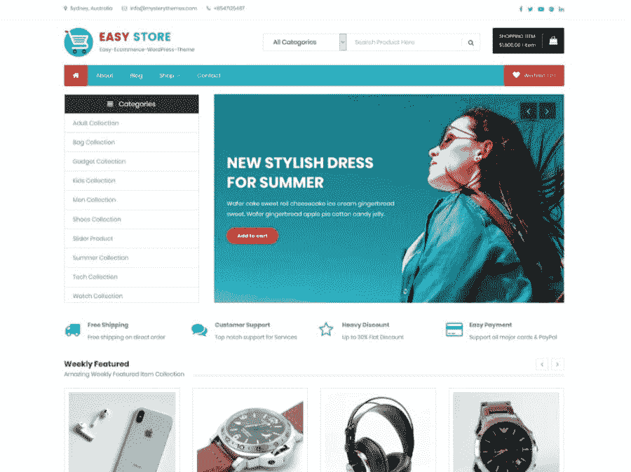

Easy Store theme

*   **WP.org 评分:5 分中的 4 分**
*   **下载量:3000+**
*   **整合:WooCommerce 和 YITH WooCommerce 愿望清单**
*   **简易多语言支持:是**

### 电子商务宝石

电子商务宝石是另一个最好的 WooCommerce 主题，特别是因为它提供了大的图片空间和在你的网站上放置各种横幅的选择。这是一个多用途的 WooCommerce 主题，可以用于许多类型的商店。例如，将电子商务宝石用于珠宝店和宠物店并不奇怪。与这个列表中的所有主题一样，电子商务 Gem 与 WooCommerce 整合得很好。没有列出其他集成，但从我们的测试来看，你应该没有任何第三方插件的问题。

此外，电子商务 Gem 主题有多个部分，用于重新组织主页上的内容，并插入滑块和横幅等内容。当您有多个促销或新产品要谈时，特色产品转盘也很有用。客户可以按类别进行搜索，或者过滤到特定的标签。用户也将享受自定义徽标、自定义菜单和全幅模板，以便在您需要制作一些登录页面时使用。

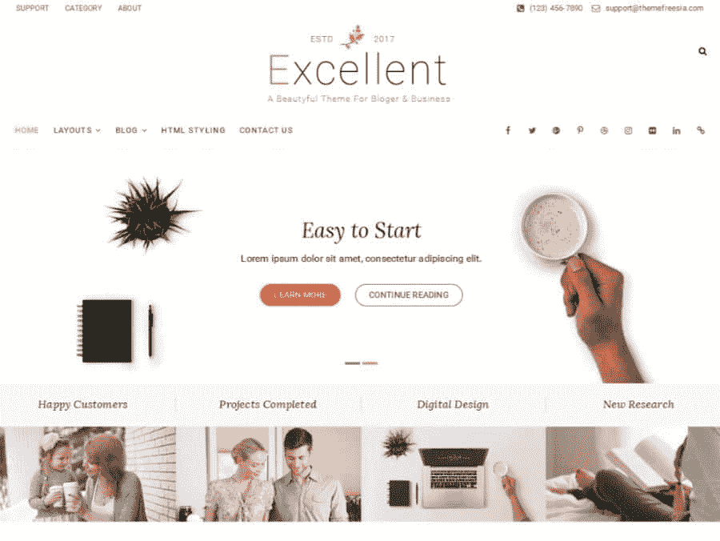

ECommerce Gem theme

*   **WP.org 评分:5 分中的 4 分**
*   **下载量:5000+**
*   **整合:WooCommerce**
*   **简易多语言支持:否**

### 购物车

对于一个明亮、有效的电子商务网站设计，考虑来自主题小苍兰的 [ShoppingCart](https://wordpress.org/themes/shoppingcart/) 解决方案。它充满了小部件区域，你可以在主页上张贴各种大小的横幅。

让所有正确的模块都位于主题上需要一点工作，但最终，你可以呈现从产品列表到过滤器，从收藏库到搜索栏的一切。你可能还会在截图中注意到，社交媒体按钮和联系信息可以放在主题的标题中。

用 ShoppingCart WordPress 主题创建一个令人惊叹的电子商务网站相当简单。有相当多的特性需要解包，但是这些组件可以帮助您尽可能好地组织您的站点。这就是为什么我们如此喜欢网上商店甚至作品集的主题。

许多行业都可以利用这样的主题，尤其是如果你在销售科技产品或服装。此外，有几个集成可用于添加面包屑、联系表单和设计导航工具。您还会偶然发现一些优秀的模块模板，如联系人表单、侧栏和图库。

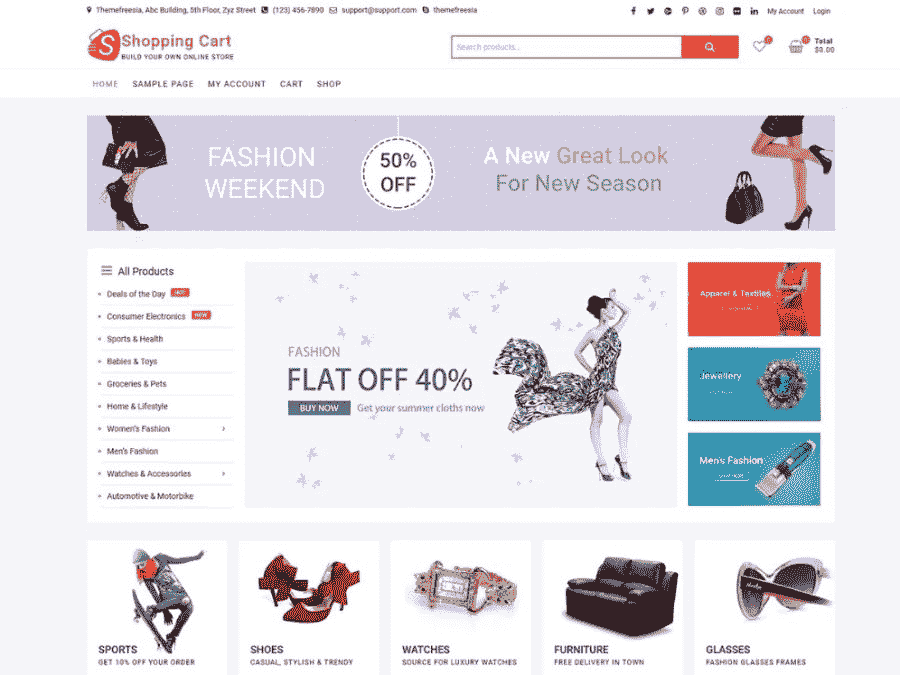

Shopping Cart theme

*   **WP.org 评分:5 分中的 5 分**
*   **下载量:5000+**
*   **集成:WooCommerce，bbPress，Contact Form 7，Jetpack，Breadcrumb NavXT，WP-PageNavi 等等**
*   **简易多语言支持:是**

### WP 商店

[WP 商店](https://wordpress.org/themes/wp-store/)来自 8 度主题的民间。该设计是最好的免费 WooCommerce 主题之一，具有极简风格和巨大的横幅区域。

该主题有一个展示所有新产品的图像滑块，而标题模块包括徽标、联系信息和购物车按钮的选项。您还会收到一个实体搜索栏，这样客户就可以找到他们喜欢的产品，而不必在画廊中筛选。

WP 商店 WooCommerce 主题是一个为小型企业精心制作的解决方案。如果你打算快速扩大规模，我们不建议你这么做，但是博客和小企业在推出高质量的在线商店时应该不会有任何问题。

简单的设计对你的公司和用户都很好，你也可以利用全幅模板、多列和自定义背景的特性。这不是最受欢迎的 WooCommerce 主题，但它对小企业来说很有吸引力。

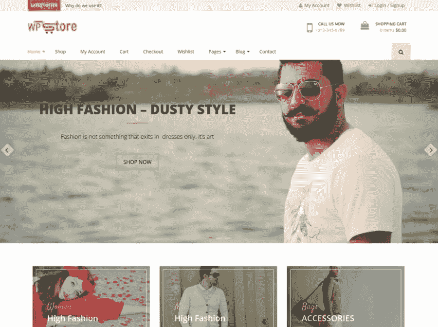

WP Store theme

*   **WP.org 评分:5 分中的 5 分**
*   **下载量:2000+**
*   **整合:WooCommerce**
*   **简易多语言支持:否**

## 最好的 WordPress 主题

通常，一个严肃的在线商店需要的不仅仅是一个免费的 WooCommerce 主题。这并不是说免费主题不好，但你通常需要更高级的功能，如社交媒体工具、演示和更好的图库。

我们喜欢高级 WooCommerce 主题的第一个原因是，它们通常不会花那么多钱。其次，您可以获得[高级支持](https://kinsta.com/blog/wordpress-support/#premium-wordpress-support)，这通常是必备的。最后，高级主题通常会附带演示，这比空白的白板更容易使用。

说到这里，请继续阅读，了解最佳 WooCommerce 主题(高级版)。

### 波尔图

Porto 主题是一个专业的电子商务解决方案，在 ThemeForest 上被列为最佳 WooCommerce 选项之一。目前的价格标签是 59 美元，你可以得到 30 多个网站演示和一个巨大的布局库。一些演示包括网上商店、公司网站和作品集的设计。

如前所述，主题提供了一个完整的拖放设计元素库。我们最喜欢的包括 [FAQ](https://kinsta.com/blog/wordpress-faq-plugins/) 、行动号召和手风琴。你也可以在你网站的任何地方放一份产品清单。你也可以考虑像投资组合或倒计时区。

至于主要的设计功能，用户体验到一个简单的界面和一个快速演示导入区。当您需要匹配品牌时，您还可以从无限数量的颜色中进行选择。您将看到几个高级插件与 Porto 主题很好地集成在一起。

除了可选的集成，你还可以免费获得一些高级插件。其中之一是滑块革命，使美丽的图像和视频滑块。另一个叫 WPBakery，一个很棒的页面构建工具，有拖拽元素。总之，如果你需要一个最好的 WordPress 主题，这是一个完整的包。

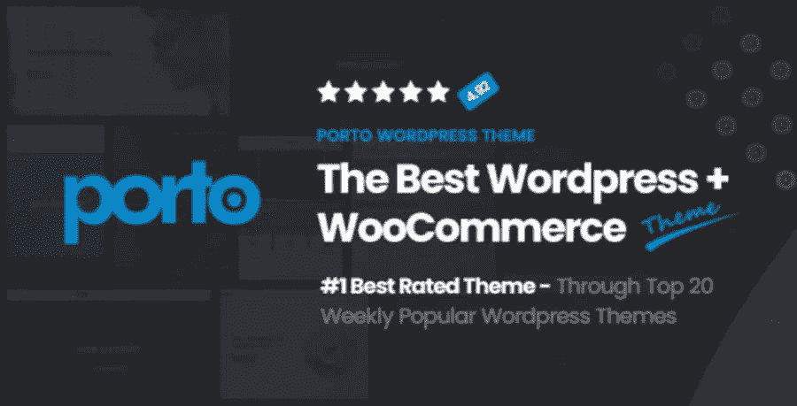

Porto theme

*   **评分:4.91 分(满分 5 分)**
*   **下载量:32000+**
*   **集成:MailPoet，WooCommerce，WooCommerce 产品过滤器，GeoDirectory，YITH，WPML，等等**
*   简单的多语言支持:如果你安装了一个插件

### 零售商

零售商主题拥有一些时尚的设计，以及 59 美元的合理价格。你可以享受经典的电子商务设计，在右上角有收藏库、缩略图和完整的购物车模块。

众所周知，该开发人员的客户支持处理得很好，主题本身包含了各种元素，这些元素对于加速开发过程非常有用。我们喜欢这样一个事实，即您可以制作无限数量的独特页面，尤其是当您需要制作各种各样的登录和产品页面时。

零售商主题支持 [WordPress 块编辑器](https://kinsta.com/blog/gutenberg-wordpress-editor/)，但是你也有机会选择自己的页面构建器，比如 Elementor、Visual Composer 或 WPBakery。WooCommerce 集成的一些优势包括支持可发货的产品和可下载的商品。

如果这更符合你的风格，你也可以配置直运业务。灵活的商店布局让你可以在边栏和柱子间自由移动。一些公司喜欢把过滤器放在边上，而另一些公司把它们放在页面的顶部。除此之外，我们需要一整篇文章来介绍零售商主题的全部特性。

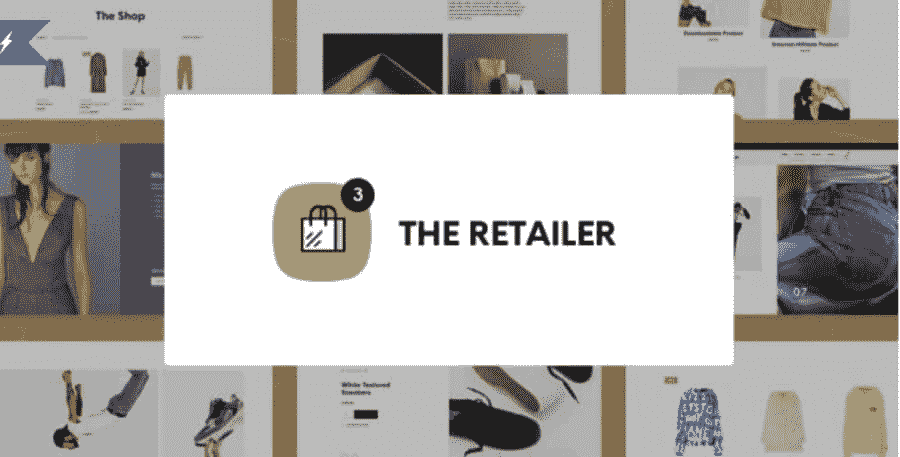

The Retailer theme

*   **评分:4.63 分(满分 5 分)**
*   **下载量:14000+**
*   集成:WooCommerce、WPBakery、Gutenberg、Visual Composer 等等
*   **简易多语言支持:是**

### 红利

Divi 是你可以使用的最流行的 WordPress 主题之一，主要是因为优雅主题团队在迎合开发者和客户方面做得非常好。总的来说，优雅主题可以让你注册一个年度会员，让你访问所有的在线资源、插件和主题。这个 [Divi 主题](https://kinsta.com/blog/wordpress-page-builders/#divi)带有一个页面生成器，可以让你找到一些最简单的设计。

需要一个一流的，快速，安全的主机为您的新电子商务网站？Kinsta 提供超快的服务器和来自 WooCommerce 专家的 24/7 世界级支持。[查看我们的计划](https://kinsta.com/plans/?in-article-cta)

不仅如此，Divi builder 还有数百个用于在线销售的拖放元素。其中包括行动号召、滑块、图库、产品页面项目等等。此外，还有几个 [Divi 布局包](https://www.elegantthemes.com/layouts/category/online-store)专为电子商务商店制作。例如，一些布局包包括时装、照片市场和电子书在线商店的完整演示。

安装布局包后，您可以自定义漂亮的页面，如博客帖子、关于我们的页面和联系页面。

一个许可证每年花费 89 美元，你还可以花 249 美元获得终身访问权。总的来说，从优雅的主题来看，定价是合理的，而且你也获得了一些可靠的客户服务。论坛和知识库区域充满了愿意帮助您的信息和支持代表。

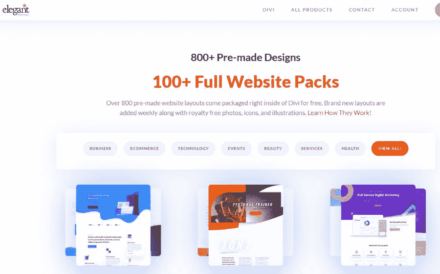

Divi

*   **评分:无评分页面**
*   **下载:没有这方面的信息**
*   **集成:WooCommerce、主要电子邮件营销工具等**
*   **简易多语言支持:是**

推荐阅读: [Divi vs Elementor: WordPress 页面生成器插件对比](https://kinsta.com/blog/divi-vs-elementor/)

### 清醒的

[Sober](https://themeforest.net/item/sober-woocommerce-wordpress-theme/18332889) 主题用可视化编辑器插件开始你的设计。这样，您可以拖放元素，而不是在大多数情况下处理代码。美丽的产品页面是高度可定制的，可以根据您正在使用的产品而有所不同。

Sober 还带有几个独特的标题样式，向客户介绍社交媒体按钮、菜单等。内置的 live 搜索会在用户输入字母时推荐产品。

该主题提供了一个产品快速视图，其中显示了一个添加到购物车按钮，而不必转到产品页面。WooCommerce 与 Sober 结合得很好，而且众所周知在这个主题上运行得非常快。您甚至可以利用产品组合功能，建立一个您喜欢的产品的漂亮画廊，供客户筛选。

这个博客也很时尚，漂亮的边栏和大量的空白使阅读过程更容易。

我们真正喜欢的其他元素包括翻译工具、完整的排版库和强大的搜索引擎优化工具。这是一个针对移动设备的全面优化设计，一键演示安装意味着您的设计可以在几分钟内启动。

您还会注意到，有超过 12 个预定义的主页可供您选择，无论您喜欢现代布局还是乡村风格。这一切都包装在一个漂亮，整洁的最终设计主题。

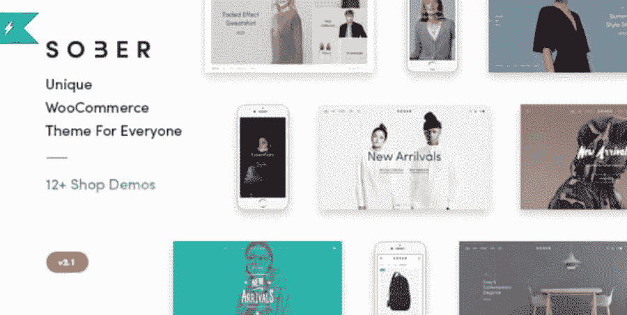

Sober theme

*   **评分:4.77 分(满分 5 分)**
*   **下载量:4000+**
*   **集成:WooCommerce、EasyCart、WPBakery、Visual Composer 等等**
*   **简易多语言支持:是**

### Rara 电子商务专业版

Rara 电子商务专业版提供无限的颜色选择、1000 多种谷歌字体和排版灵活性，帮助您创建一个反映您品牌的独特商店。这个多功能的当代主题还侧重于潜在客户生成功能，如意愿列表、快速查看、产品比较、CTA 部分和新品部分，这些功能将帮助您将更多访客转化为客户。

此外，它是翻译就绪，RTL 脚本支持允许您开发您的网站在多种语言同时进行。与 Rara 电子商务专业主题，你得到吨的布局选项，包括，14 个主页部分，5 个标题布局，3 个滑块布局，4 个横幅类别布局，3 个博客页面，等等。

如果您需要帮助开始，他们的初学者友好的文档和专家支持总是可用的。

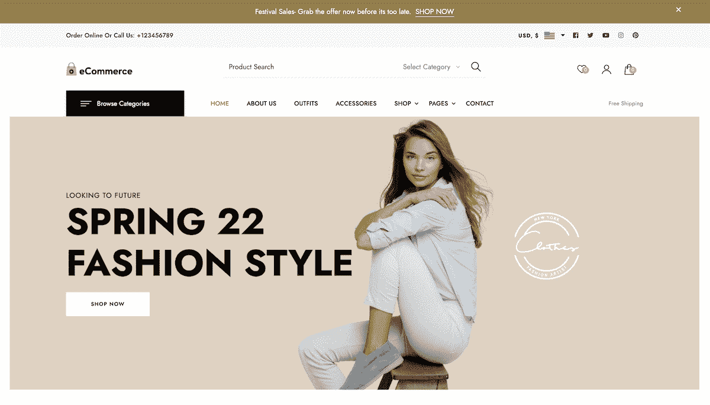

Rara eCommerce Pro

**收视率:还没有收视率**
**下载量:200+**
**集成:WooCommerce，Gutenberg，Elementor 等等。**
**简易多语言支持:是**

### WoodMart

WoodMart 为“woodsy”商店提供了独特的风格。很难弄清楚这到底意味着什么，但从表面上看，大多数演示对于家具、酒类和户外用品店来说都是不错的。当使用 WoodMart 构建时，还有许多其他选择，但是当您使用主题时，这种“woodsiness”肯定是普遍的。

话虽如此，WoodMart 还是为 WPBakery 和 Slider Revolution 等许多优质插件提供了支持和集成。超过 60 个演示对于构建网站和使你的产品目录看起来更专业是非常棒的。这个响应式主题提供了无限的标题布局和外观。

完整的 AJAX 商店和分页区域对于基于产品变量的过滤非常有用。例如，客户可以访问网站，根据颜色、尺寸等进行过滤。搭配一些优秀的高级可变产品，你会发现自己是一个无可匹敌的产品展示。

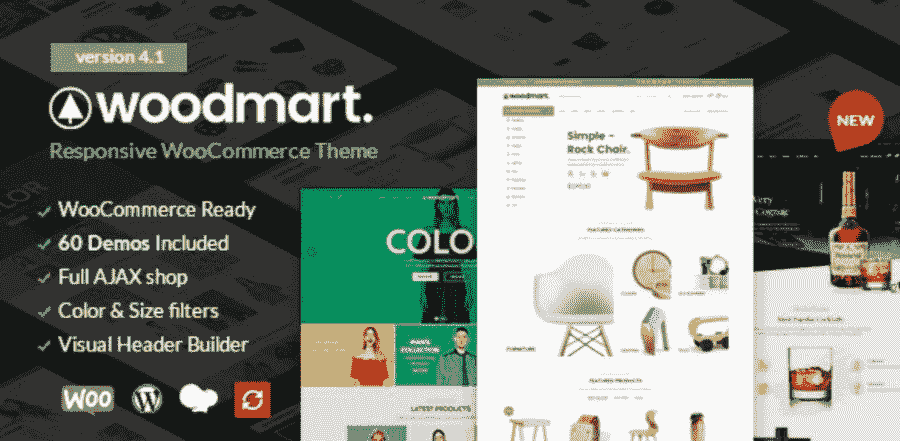

WoodMart theme

*   **评分:4.95 分(满分 5 分)**
*   **下载量:10000+**
*   整合:WooCommerce，Revolution Slider，WPBakery，WPML，MailChimp，等等
*   **简易多语言支持:是**

### 店主

在 WooCommerce 主题市场上，店主已经成为一个家喻户晓的名字，建立了大量的评分和评论，并为用户提供了一个巨大的演示库。这是你能找到的最令人印象深刻的 WooCommerce 主题之一，拥有几十个产品页面布局、漂亮的默认配置和产品图像缩放功能。

您的产品页面画廊也支持 YouTube 视频。

这确实是一个无忧无虑的主题，因为你可以通过快速的演示上传和漂亮的拖放界面来节省大量的时间。在整个网站上创建令人惊叹的产品目录，并利用多种工具来调整购物车的外观。

无限制的标题样式非常适合改变顾客首先看到的内容，灵活的商店布局包括无限滚动、加载更多按钮和经典分页等选项。最后，响应式设计看起来很棒，与这个列表中所有的 WooCommerce 主题相比,“掌柜”拥有最好的博客布局之一。

Shopkeeper theme

*   **评分:4.62 分(满分 5 分)**
*   **下载量:27000+**
*   **整合:WooCommerce、EasyCart、WPBakery、WPML 等等**
*   **简易多语言支持:是**

### 北

WooCommerce 主题拥有漂亮的现代布局，适合时尚和科技品牌，以及其他愿意定制的品牌。这个响应式主题有几个可以在几秒钟内安装的演示。

这些演示的伟大之处在于，它们没有任何特定于行业的设计。这样，你就不会受限于你对网站的定制程度。

例如，提供了产品登录页面，以及快照和滚动主页模块。这些对所有类型的公司都很好。除此之外，North 主题有多种产品页面样式和列表样式。这些可以让你的产品和分类页面更加独特。博客风格也相当有趣和有创意。

画布外过滤工具具有您的客户需要的功能，但它也不会占用网站太多空间。我们还喜欢标题样式足够健壮，能够覆盖主页上的大量空间，让用户点击关于新产品的信息。

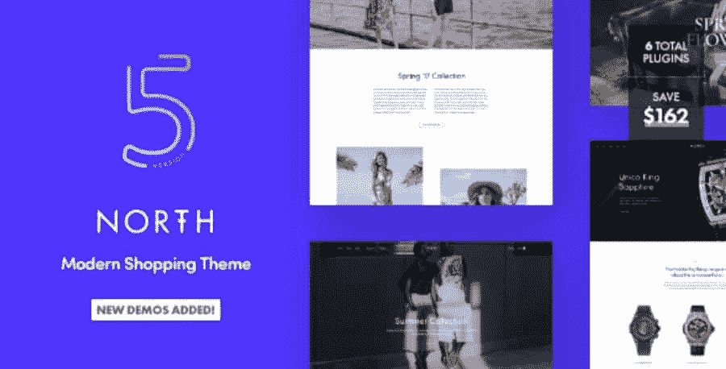

North theme

*   **评分:4.47 分(满分 5 分)**
*   **下载量:1000+**
*   **整合:WooCommerce、WPBakery、WPML、Gravity Forms 等等**
*   **简易多语言支持:是**

### 扁平的

Flatsome 是 ThemeForest 上最畅销的 WooCommerce 主题之一。它售价 59 美元，你几乎可以建立任何类型的电子商务商店。可视化构建器具有广泛的元素，如视频、文件夹和地图。您可以将所有这些拖到适当的位置，甚至在同一个步骤中调整字体和颜色。

该主题针对速度和销售进行了优化，因此您知道客户体验将会比以前有所改善。Flatsome 库中包含数百种预定义的布局，这使得几乎不可能不制作出绝对独特的东西。

只需点击几秒钟即可安装演示内容，您可以找到几乎任何行业的设计。

最后，Flatsome 主题提供了一个定制的产品页面生成器，可以完全控制每一个产品页面。这样，你就不必拘泥于一种格式。相反，一个产品页面可能看起来与其他页面完全不同。

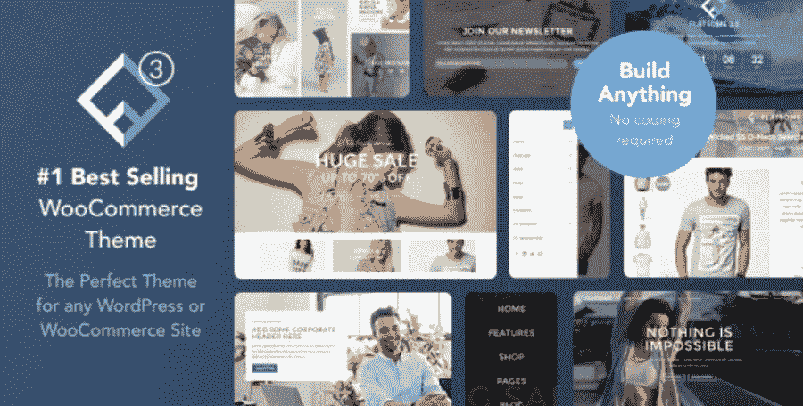

Flatsome theme

*   **WP。评分:4.80 分，满分 5 分**
*   **下载量:106000+**
*   集成:WooCommerce、Yoast Breadcrumbs、Ubermenu、Sensei 等等。
*   **简易多语言支持:是**

### 电子商店

电子商店主题的标价是 59 美元。考虑到主页看起来已经准备好支持成千上万的产品，这让你在你的在线商店后面获得了相当多的力量。Electro Electronics Store 旨在看起来类似于亚马逊或阿里巴巴，那里随时列出大量商品，客户可以从主页上搜索或浏览类别。

这是一个适合宽屏的主题，它也有一些令人印象深刻的移动页面，以便您的所有产品页面在移动设备上显示时都有评论和评级等信息。包括几个主页演示供您测试，megamenu 非常适合在菜单中显示您的所有产品和类别。

Electro Electronics Store 的一个有趣的部分是它与多供应商插件很好地集成在一起。这个插件可以让你运行一个完整的多供应商市场，类似于 Etsy 或亚马逊。你可以要求其他供应商销售产品，并从所有销售额中提成。

然后，所有支出被分配给正确的供应商。总的来说，我们喜欢电子商店的这个主题，但是你可以在这里卖任何东西。

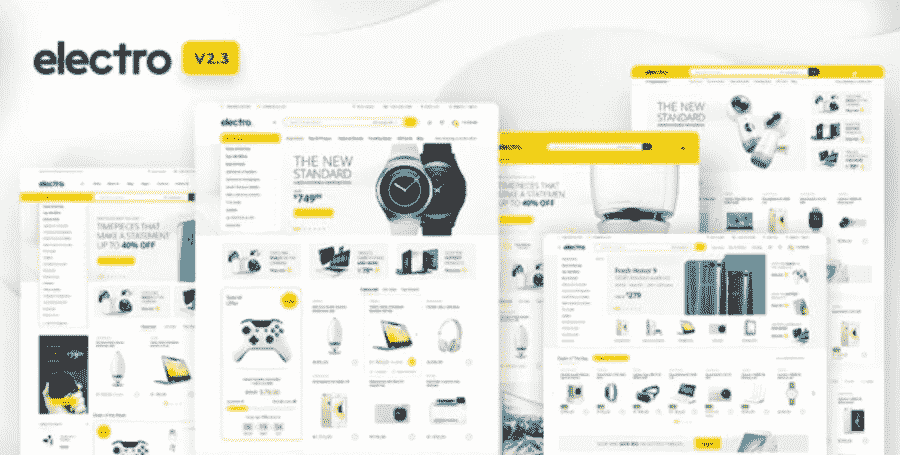

Electro Electronics Store theme

*   **评分:4.83 分(满分 5 分)**
*   **下载量:10000+**
*   集成:WooCommerce、Visual Composer、Slider Revolution 和 YITH
*   **简易多语言支持:是**

### 拉巴博巴

Labomba 在 ThemeIsle marketplace 上的标价是 49 美元。这是最好的 WooCommerce 主题之一，因为它有超过 20 个独特的主页变体，允许你为自己的行业定制主题，并为任何公司打造良好的品牌。

Ajax 购物车快速且用户友好，集成的愿望清单帮助人们记住他们想买的东西。

Labomba 主题提供了一个带有电子商务元素的拖放页面生成器。不仅如此，很高兴看到 Labomba 是多语言就绪和响应。默认情况下，这个 WooCommerce 主题有光滑的白色和黑色，非常适合服装店和其他需要大胆而专业外观的商店。

脱离画布的导航肯定会改善用户界面，而无限的颜色选项使每个人都可以轻松地进行品牌推广。我们还喜欢与 Revolution Slider 的集成，因为这是用视觉横幅展示新产品的最佳方式之一。

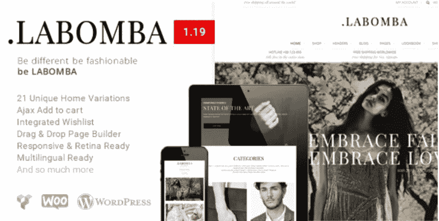

Labomba theme

*   **评分:4.29 分(满分 5 分)**
*   **下载量:3000+**
*   **集成:WooCommerce、Visual Composer、WPBakery 等等**
*   **简单的多语言支持:不是真的**

### 克劳埃

Claue 售价 60 美元，仅在线商店就有广泛的集成。例如，你可以安装 WooCommerce，但真正的力量来自名为 AliDropship 的 dropship 集成。如果你对直运感兴趣，这绝对是一个值得关注的主题。你还可以获得一些插件的集成支持，比如 WooCommerce Bookings extension 和 WP EasyCart。

所有这些集成都很好，但是内置特性和设计呢？好吧，Claue 包括社交分享来宣传你的产品。还有一个产品细节生成器，如果你想制作最好的产品页面，这是必备的。我们还喜欢即时的[产品搜索](https://kinsta.com/blog/wordpress-search/),这样客户在输入信件时就可以获得关于你产品的建议。

除了 Instagram 商店、lookbook 系列和产品捆绑功能，Claue 主题还将其很大一部分功能贡献给了电子商务。这就是为什么它是最好的 WooCommerce 插件之一。

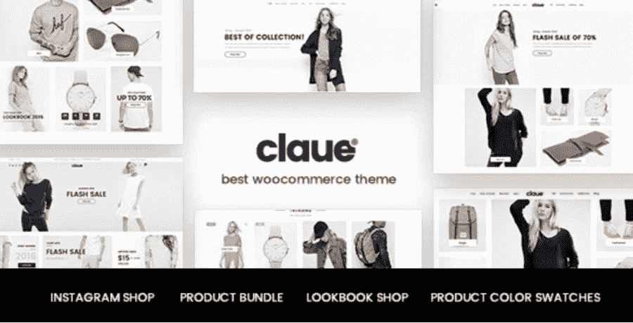

Claue theme

*   **评分:4.96 分(满分 5 分)**
*   **下载量:2000+**
*   集成:WooCommerce，AliDropship，YITH，Contact Form 7 等等。
*   **简易多语言支持:是**

### 电子商城

电子邮件商店售价 39 美元，它提供了一个全面响应的在线商店设计，有大量的横幅位置和收藏点。这是那些严格意义上的在线销售的主题之一，但是你仍然可以有一个博客来支持你的商店并促使人们购买。

如果你购买了主题，会提供相当多的演示，包括女装、有机和医药商店的选项。提供了超过 15 个主页演示，所有这些都可以在移动设备上很好地运行。此外，你还会得到一个产品图片滑块，用来展示你最好的商品。

我们喜欢购物互动购物车图标，快速添加到购物车按钮肯定会提高转化率。移动导航是 EmallShop 主题的亮点之一，因为它可以很好地显示在屏幕上，但你不会完全屏蔽掉实际的网站。

很高兴看到 EmallShop 主题提供了一个大小调整向导图标和一个供客户切换过滤器的区域。

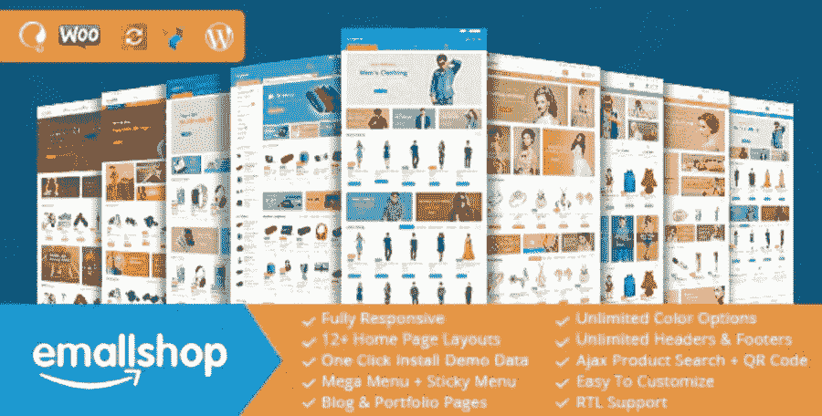

EmallShop theme

*   **评分:4.88 分(满分 5 分)**
*   **下载量:2000+**
*   **集成:WooCommerce、Visual Composer 和 Revolution Slider**
*   **简易多语言支持:是**

### Eventica

Eventica 有一套强大的工具来帮助你建立网上商店。这是最好的 WooCommerce 主题之一，这是有原因的，这一切都始于这样一个事实:你可以设计一个[活动日历](https://kinsta.com/blog/wordpress-events-plugin/)，甚至出售这些活动的门票。

所以，这个主题肯定更像是一个利基产品，因为并不是每个设计师都想做一个活动网站。

预制的设计模板可让您立即启动活动列表、联系页面和主页等页面。[博客平台](https://kinsta.com/blog/best-blogging-platform/)也很漂亮，在移动设备上观看效果更好。内置的活动滑块是让用户购买你的活动门票的最简单的方法之一，翻译工具可以将这个词传遍世界。

Eventica theme

*   **评分:4.39 分(满分 5 分)**
*   **下载量:2000+**
*   **集成:WooCommerce、活动滑块、WPBakery、活动日历等等**
*   **简易多语言支持:是**

### 采购员

Merchandiser 包括简单和风格，创造了一个美妙的前端界面。你可以使用各种自由空间来访问主题。一些默认的布局实际上看起来类似于一个作品集，其中主要的焦点是你的收藏库。通过这种方式，所有用户的目光都会直接投向最重要的东西，即产品。

Merchandiser 不仅是一个看起来整洁的主题，而且它是快速和轻量级的。它也能很好地与大多数主流插件兼容。轻松定制器令人耳目一新，您可以随时与市场上更好的页面生成器集成。

一些销售功能包括客户评论、数字产品支持和优惠券。产品分类和过滤看起来整洁有序，让您的客户能够找到他们想要和需要的产品。

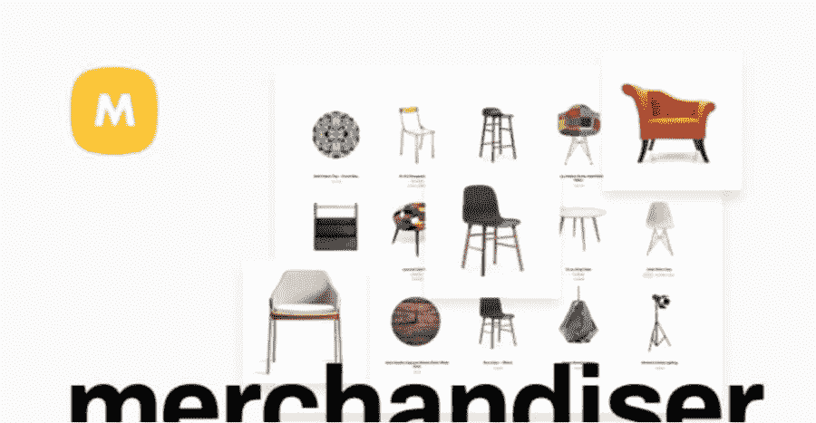

Merchandiser theme

*   **评分:4.29 分(满分 5 分)**
*   **下载量:2000+**
*   **整合:WooCommerce 和 WPBakery**
*   **简易多语言支持:是**

### 肾上腺素

不管你在为哪个行业做网站，肾上腺素都会给你的电子商务设计注入一些特别的东西。默认情况下，它有更多的户外外观，但所有这些都可以通过对字体、颜色和图像的一些调整来改变。然后，您可以为餐馆、旅行社和电子商店等公司激活一个预制的演示。

奇妙的主题选项可以确保你永远不会弄乱任何代码。但是如果你想进一步定制，你可以访问一个光滑的 CSS 区域。包括一些集成，如 WPBakery 和 Layerslider。更不用说，你的商店有一些漂亮的工具，如快速查看选项，让人们快速查看产品的有限细节，并从弹出菜单中直接购买。

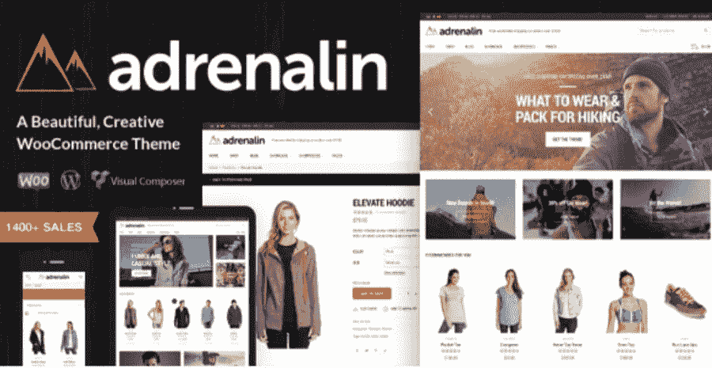

Adrenalin theme

*   **评分:4.83 分(满分 5 分)**
*   **下载量:2000+**
*   整合:WooCommerce、WPBakery 和 LayerSlider
*   **简易多语言支持:是**

### 手工制的

手工制作为你的网站提供了一个质朴的结构，有更粗糙的纹理和字体。这并不意味着它缺乏优雅，因为手工制作确实融入了大量耀眼、跳跃的线条和[字体](https://kinsta.com/blog/wordpress-fonts/)。事实上，根据您所在的行业，您有大量的主页演示可供选择。

如果你卖的是手工制品，如蜡烛、木工制品或工艺品，我们建议你这么做。从本质上说，对于那些通常会在 Etsy 上出售自己作品的人来说，这是最好的 WooCommerce 主题之一。由于 Etsy 从你的销售额中抽取一定比例，你应该总是有一个网站从客户那里获得大部分收入。

包括几个 PSD 文件，用于进一步定制设计，您还可以访问高级插件，如 Visual Composer 和 Revolution Slider，它们都可以为您的网站添加一些流行元素，而不会使空间变得杂乱。

WooCommerce 在移动界面上看起来很棒，一键演示安装几乎可以为您发布网站。除了字体令人敬畏的图标，大型菜单和无限的颜色，创意人员不会错手工制作的主题，所有这些都是 60 美元的低价。

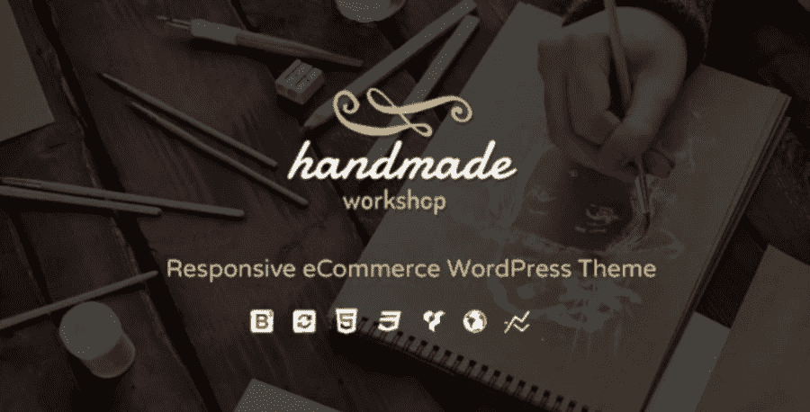

Handmade theme

*   **评分:4.24 分(满分 5 分)**
*   **下载量:2000+**
*   **集成:WooCommerce、Visual Composer 和 Revolution Slider**
*   **简易多语言支持:是**

[Planning to launch a new #ecommerce site soon? Check out this curated list of the 30+ best WooCommerce themes (free and paid) to find your perfect fit!🤵🧥Click to Tweet](https://twitter.com/intent/tweet?url=https%3A%2F%2Fkinsta.com%2Fblog%2Fwoocommerce-themes%2F&via=kinsta&text=Planning+to+launch+a+new+%23ecommerce+site+soon%3F+Check+out+this+curated+list+of+the+30%2B+best+WooCommerce+themes+%28free+and+paid%29+to+find+your+perfect+fit%21%F0%9F%A4%B5%F0%9F%A7%A5&hashtags=woocommerce%2Cthemes)

## 你应该选择哪个最好的 WooCommerce 主题？

这是一个棘手的问题，但在一点指导的帮助下可以回答。毕竟网上这么多主题，哪些是最好的 WooCommerce 主题？即使这个列表很长，你也很难做出决定。

如果是这样的话，在扣动扳机之前，看看我们最后的一些建议。

*   寻找有免费版本和高级升级的主题。这样你就可以提前测试它们，或者继续使用免费版本，或者以后再升级。
*   尽管用免费主题来省钱很诱人，但大多数合法公司都是从高级主题或完全定制的网站设计开始的。其原因是支持的质量、更好的特性以及高级主题的低定价。
*   在安装 WooCommerce 主题之前，列出你需要的功能。然后，滚动你最喜欢的主题的功能列表，看看哪些有你想要的。
*   尝试找到包含多个演示的主题。这样，您可以利用可能已经为您的行业设计的演示。
*   购买前，请查看下载页面上的评论和问题。您可能会注意到一些用户在使用某些功能时遇到了问题，或者评级可能没有反映用户的真实想法。这也是一个很好的机会来看看一个开发者的反应有多快。
*   如果你担心将来会切换主题并丢失内容和设计元素，考虑一个带有框架的子主题。

这就是我们最好的 WooCommerce 主题！如果你有任何问题，或者你想提到一些你最喜欢的 WooCommerce 主题，请在下面的评论中告诉我们。

* * *

让你所有的[应用程序](https://kinsta.com/application-hosting/)、[数据库](https://kinsta.com/database-hosting/)和 [WordPress 网站](https://kinsta.com/wordpress-hosting/)在线并在一个屋檐下。我们功能丰富的高性能云平台包括:

*   在 MyKinsta 仪表盘中轻松设置和管理
*   24/7 专家支持
*   最好的谷歌云平台硬件和网络，由 Kubernetes 提供最大的可扩展性
*   面向速度和安全性的企业级 Cloudflare 集成
*   全球受众覆盖全球多达 35 个数据中心和 275 多个 pop

在第一个月使用托管的[应用程序或托管](https://kinsta.com/application-hosting/)的[数据库，您可以享受 20 美元的优惠，亲自测试一下。探索我们的](https://kinsta.com/database-hosting/)[计划](https://kinsta.com/plans/)或[与销售人员交谈](https://kinsta.com/contact-us/)以找到最适合您的方式。**