# WooCommerce vs Shopify:你的网店哪个更好？

> 原文：<https://kinsta.com/blog/woocommerce-vs-shopify/>

随着全球电子商务销售额[达到 4.28 万亿美元](https://www.statista.com/statistics/379046/worldwide-retail-e-commerce-sales/)，现在是推出网上商店的最佳时机。然而，在 WooCommerce 和 Shopify 之间选择[最佳电子商务平台](https://kinsta.com/blog/ecommerce-platforms/)并不总是那么简单。

这就是为什么我们创建了这个 WooCommerce vs Shopify 指南来比较这两个流行的电子商务平台。然而，它们之间有一些显著的差异。

在本帖中，我们将帮助你决定 WooCommerce 或 Shopify 是否是你完美的电子商务合作伙伴。我们将讨论这些平台的易用性、功能以及非常重要的定价。

我们开始吧！

### 查看我们的视频指南，观看 [WooCommerce vs Shopify](https://www.youtube.com/watch?v=CPsY9nxXZUA)

## Shopify 如何开展电子商务？

成立于 2006 年， [Shopify 是由 Tobias Lütke 和 Scott Lake 创建的一个完整的电子商务解决方案](https://www.shopify.com/)。创始人在建立了滑雪板设备在线商店后开发了这个平台。他们对现有的电子商务平台不满意，因此决定创建自己的平台。

> 需要在这里大声喊出来。Kinsta 太神奇了，我用它做我的个人网站。支持是迅速和杰出的，他们的服务器是 WordPress 最快的。
> 
> <footer class="wp-block-kinsta-client-quote__footer">
> 
> 
> 
> <cite class="wp-block-kinsta-client-quote__cite">Phillip Stemann</cite></footer>

[View plans](https://kinsta.com/plans/)

开箱即用，Shopify 拥有您启动在线商店并开始接受支付所需的一切:

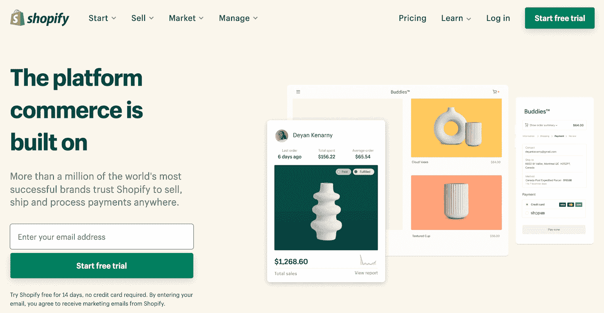

Shopify.

由于这是一个托管解决方案，你不必担心运行你的网上商店的技术方面。您也不必购买单独的[托管包](https://kinsta.com/plans/)。

作为一个平台，Shopify 强调易用性。它还提供了您启动在线商店所需的一切，可能只需几分钟。

这些因素使得 Shopify 成为任何想要快速创建电子商务商店的人的绝佳选择。如果你不需要控制你商店的每个方面，Shopify 也是一个不错的选择。

[With global ecommerce sales reaching $4.28 trillion, there's never been a better time to launch an online store 📈 Learn how to choose the right platform here ✅Click to Tweet](https://twitter.com/intent/tweet?url=https%3A%2F%2Fkinsta.com%2Fblog%2Fwoocommerce-vs-shopify%2F&via=kinsta&text=With+global+ecommerce+sales+reaching+%244.28+trillion%2C+there%27s+never+been+a+better+time+to+launch+an+online+store+%F0%9F%93%88+Learn+how+to+choose+the+right+platform+here+%E2%9C%85&hashtags=Ecommerce%2CShopify)

## WooCommerce 如何开展电子商务？

相比之下， [WooCommerce 是一个开源插件](https://wordpress.org/plugins/woocommerce/)，你可以添加到 WordPress [内容管理系统(CMS)](https://kinsta.com/knowledgebase/content-management-system/) 中。WordPress 主题开发者 WooTheme 最初创建了它，然后在 2015 年被 Automattic 收购:

WooCommerce.

如果你是 WordPress 数百万用户中的一员，你可以像其他 WordPress 插件一样安装并激活 WooCommerce。如果你没有网站，你首先需要采用 [WordPress 作为你的 CMS](https://kinsta.com/blog/cms-software/) 并创建一个网站，然后*才能考虑*安装插件。

不像 Shopify，你需要购买你的电子商务主机。虽然你可以在内部服务器上运行 WooCommerce，但许多店主会购买单独的虚拟主机包。

你对虚拟主机的选择至关重要。[权利提供者](https://kinsta.com/woocommerce-hosting/)可以通过处理许多技术任务来减轻你的工作量。

例如，在 Kinsta，我们确保您的 WooCommerce 商店始终得到完全备份并针对性能进行了优化。这些功能使您能够专注于重要的事情，从而推动更多销售:

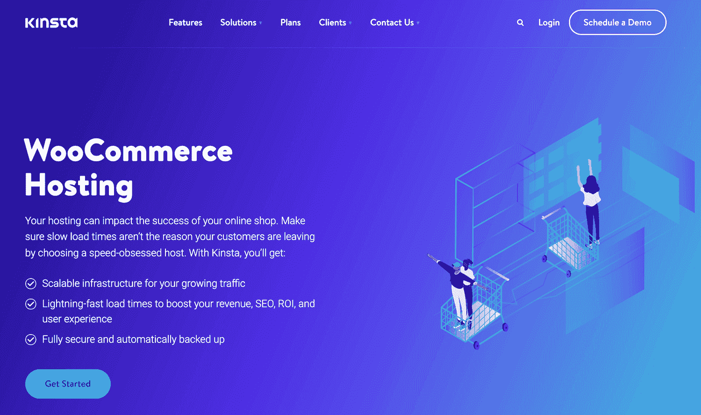

WooCommerce hosting from Kinsta.

WooCommerce 的建立和运行可能更复杂，但它也让你对商店的各个方面有了更多的控制。这使得该平台非常适合有特定目标的技术用户。

### 各平台各有什么利弊？

它们可能是世界上最知名的两个电子商务平台。然而，正如我们之前提到的，WooCommerce 和 Shopify 之间有一个巨大的区别:

*   自托管:如果你选择 WooCommerce 作为你的电子商务解决方案，你需要自己托管它，[使用 WordPress 作为你的 CMS](https://kinsta.com/blog/why-use-wordpress/) 。
*   **托管** : Shopify 为你托管和管理软件，所以你不需要购买单独的托管包。

在这方面，Shopify 似乎更有优势。然而，有一个权衡。作为托管平台，您只能进行 Shopify 允许的更改。在 WooCommerce 中，你根本不会遇到这些限制。

考虑到这一点，WooCommerce 相对于 Shopify 的主要优势在于它的灵活性。如果你想提供独特的客户体验，这个因素变得尤为重要。

例如，你可能想设计一个[定制的结账流程](https://kinsta.com/blog/woocommerce-checkout/)或者实现一个多层次的定价结构。

然而，这种灵活性也是有代价的。WooCommerce 更难配置，设置过程更长。

假设你计划销售变化最小的简单产品或少量商品。在这种情况下，您可能不需要这种级别的灵活性。Shopify 的易用性和内置主机使其成为这种情况下更有吸引力的选择。

如果想快速开店，Shopify 也是不错的选择。只要你不打算销售复杂的产品或设计定制的购物体验，Shopify 应该能满足你的核心需求。

### WooCommerce vs Shopify:各平台市场份额如何？

Shopify 和 WooCommerce 是世界上最大的两个电子商务平台。虽然仅仅根据受欢迎程度来选择一个解决方案是不明智的，但是比较每个平台有多少人使用是很有趣的。

当我们查看排名前 100 万的电子商务网站时，[其中 21%的网站](https://trends.builtwith.com/shop)使用 Shopify。相比之下，这些顶级网站中有 27%信任 WooCommerce 来驱动他们的在线商店。

WooCommerce 可能在更高权威的网站上更受欢迎。然而，在[企业空间](https://kinsta.com/blog/wordpress-enterprise/)中，这两个平台仍有很大的发展空间:

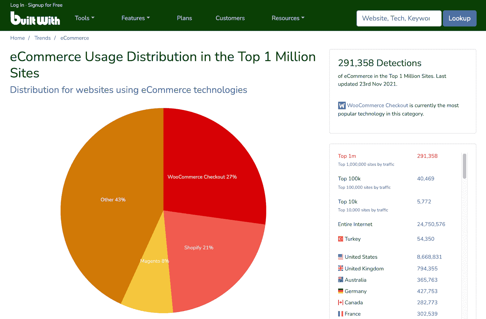

WooCommerce vs Shopify market share.

当我们把目光投向企业市场之外时，WooCommerce 更受欢迎。它在超过 500 万个在线网站上使用，而 Shopify 为超过 300 万个在线网站提供支持。

看看过去五年的谷歌趋势，我们可以看到 Shopify 一直比 WooCommerce 吸引更多的搜索兴趣。有趣的是，Shopify 在 2020 年经历了搜索兴趣的激增:

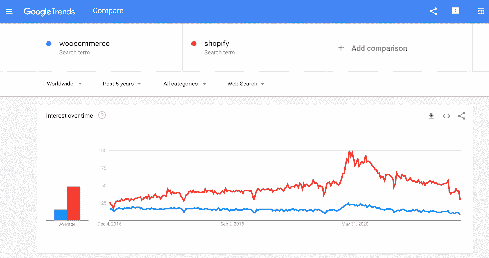

Google Trends graph.

虽然 Shopify 是一个独立的解决方案，但不能忽视的是，WooCommerce 与全球最受欢迎的内容管理系统(CMS)捆绑在一起。事实上，[超过 40%的网站](https://w3techs.com/technologies/overview/content_management)使用 WordPress，而[7%的电子商务网站](https://kinsta.com/wordpress-market-share/#woocommerce)使用 WooCommerce。

这些统计数据对 WooCommerce 的受欢迎程度起到了巨大的作用。如果你是已经拥有 WordPress 网站的数百万人中的一员，WooCommerce 立刻成为一个更有吸引力的选择。

## 在各个平台上开店有多容易？

如果我们着眼于创建一个功能齐全、随时接受订单的商店有多容易，那么 Shopify 显然是赢家。有了 WooCommerce，如果你还没有 WordPress 网站，你需要建立一个。你还必须提供虚拟主机和域名。

如果你没有这些要素，你的 WooCommerce 设置时间会很快增长。你也可能会产生额外的费用，包括购买一个托管包和一个域名。

好消息是 WooCommerce 有一个方便的设置向导，可以指导你完成大部分的初始设置。这个过程包括添加一个支付网关，选择您的货币，并选择您的运输方式。

还有大量的博客、教程和教学视频向你展示如何[建立你的 WooCommerce 商店](https://kinsta.com/blog/woocommerce-tutorial/)。然而，不可否认陡峭的学习曲线的存在，尤其是如果这是你的第一个 WordPress 网站。

作为一个托管电子商务平台，Shopify 处理了启动在线商店所需的大量技术难题。这包括提供域名、主机和安全套接字层(SSL)证书。

本质上，你可以创建一个 Shopify 帐户，选择你的主题，然后购买一个域名或同步一个现有的域名。假设你使用的是该公司自己的 [Shopify 支付网关](https://help.shopify.com/en/manual/payments/shopify-payments)，你可以从第一天开始接受信用卡支付。
T3】

## 你对网站的功能有多少控制力？

总体而言，自托管解决方案通常比托管解决方案更加灵活和可定制。Shopify 可能是更灵活的托管解决方案之一，但这是它难以与 WooCommerce 竞争的领域。

开箱即用，WooCommerce 提供一切你需要建立一个正常运作的电子商务商店。然而，平台的真正强大之处在于它的可扩展性。你可以使用额外的软件定制和扩展核心的 WooCommerce 平台。

例如，由于购物者丢弃了大约 70%的购物篮，废弃购物车的回收对在线商店来说至关重要。WooCommerce 并没有提供开箱即用的功能，但是你可以使用插件来添加这个功能。

你会在官方 WordPress 目录中找到数以千计的 WooCommerce 插件。

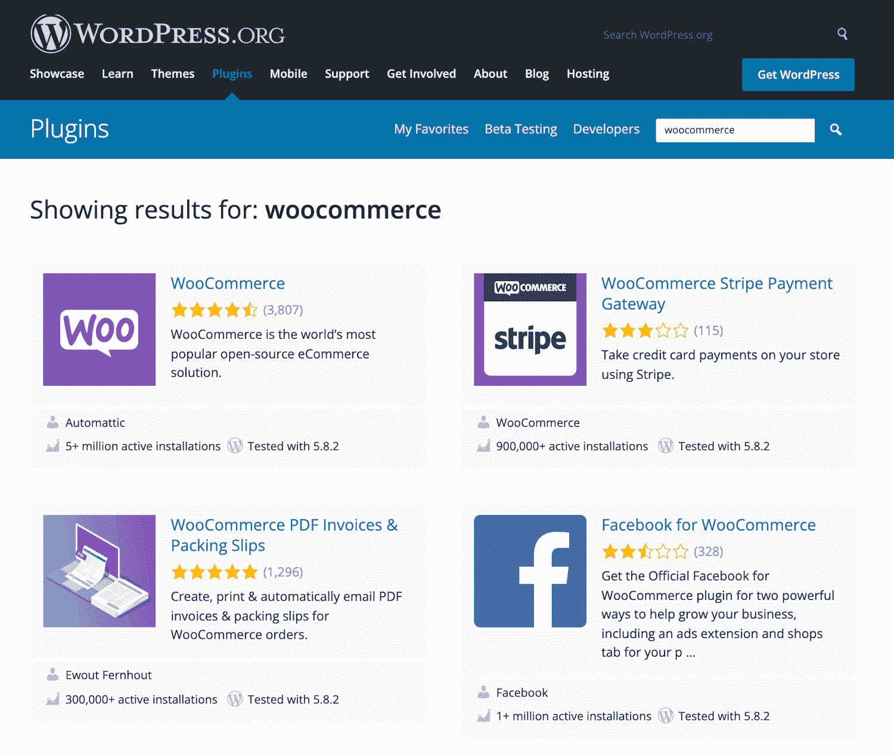

WooCommerce plugins in WordPress.

甚至还有一个专门的 WooCommerce 扩展商店。在这里，你会发现[数百个官方插件](https://kinsta.com/blog/woocommerce-extensions/):

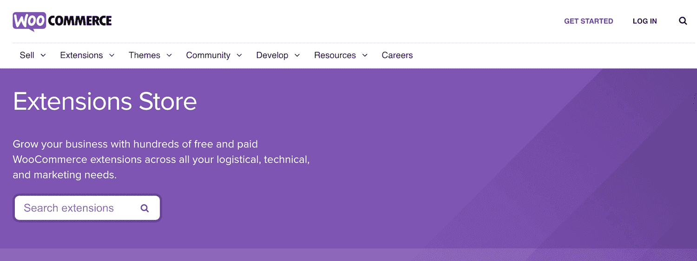

WooCommerce Extensions.

WooCommerce 还集成了几个流行的第三方解决方案。其中包括一些最流行的客户关系管理(CRM)工具。

如果您是开发人员，您甚至可以向 WooCommerce 商店添加自定义代码。所有这些特性使得 WooCommerce 成为一个非常灵活和可定制的平台。

如果你想扩展你的 Shopify 商店，有 [Shopify 应用](https://apps.shopify.com/)可供选择。然而，最终你只能使用 Shopify 允许的附加软件和软件。WooCommerce 没有这种限制:

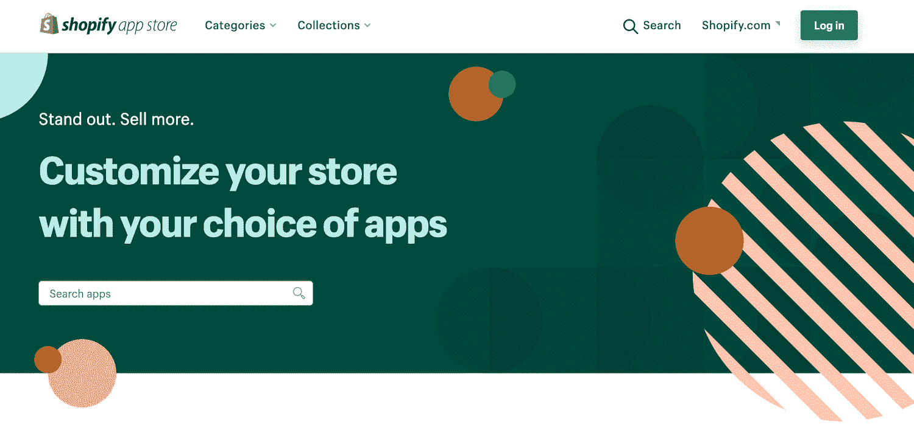

Shopify App Store.

Shopify 确实比 WooCommerce 有优势的一个领域是其内置的多渠道集成。该功能使您能够在脸书、Instagram、易贝、沃尔玛、抖音等网站推广和销售您的产品。如果你想通过 WooCommerce 进行多渠道销售，你需要安装额外的插件。
T3】

## 你对商店的设计有多少控制权？

WooCommerce 和 Shopify 都有时尚的主题，会给你的客户留下很好的第一印象。您可以从超过 [1，000 个 WooCommerce 主题](https://wordpress.org/themes/search/woocommerce/)中进行选择，立即让您的 WooCommerce 商店焕然一新:

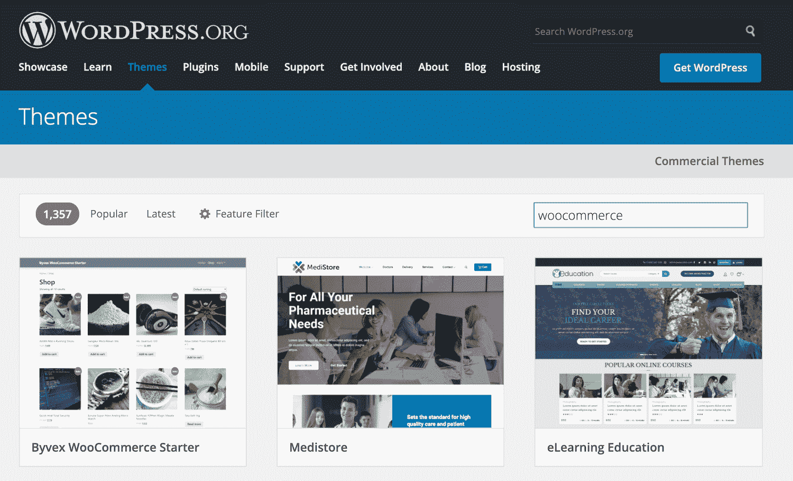

WooCommerce themes in the WordPress theme directory.

你还可以在第三方市场找到优质的 WooCommerce 主题。例如，在 ThemeForest 还有另外 1200 个 WooCommerce 主题。

如果你想让你的 Shopify 商店焕然一新，你可以选择更少的主题。作为一个专门的电子商务平台，所有这些主题都是为推动销售而精心设计和优化的。

虽然 WordPress 社区已经创建了圆滑的 WooCommerce 主题，但是质量控制却很少。如果你选择了 Shopify 主题，你就能保证高质量。总的来说，虽然 WooCommerce 给了你更多的选择，但 Shopify 的产品更具策划性。

然而，你应该为最好的 Shopify 主题支付额外费用。这些主题花费数百美元并不罕见:

A Shopify theme.

一些 Shopify 主题允许你[添加 HTML](https://help.shopify.com/en/manual/online-store/themes/extend/) 或流动代码片段。然后，在包含该设置的模板、节或块中呈现该代码。

但是，此功能是有限的，可能会因您选择的 Shopify 主题而异。由于 WooCommerce 是一个开源平台，你有无限的空间来定制你的主题。

## 各平台提供哪些支付方式？

说到接受支付，你能支持的方法越多越好。一些[支付网关](https://kinsta.com/blog/woocommerce-payment-gateways/)在特定地理位置更受欢迎。

例如，2020 年，数字或移动钱包占亚太地区电子商务交易的 60%。然而，这种支付方式在拉丁美洲仅占 20%。

通过支持尽可能多的不同支付方式，你可以最大化你的吸引力。幸运的是，WooCommerce 和 Shopify 都支持多种支付网关。除非你的客户使用非常小众的支付方式，否则无论你选择哪个平台，你都不会有问题。

WooCommerce 支持所有主流网关，包括 Stripe、PayPal、Square 和 Authorize.Net。它还支持大量的地区网关。其中包括专注于新兴市场的 PencePay 处理器。

请注意，其中一些网关要求您额外购买 WooCommerce 扩展:

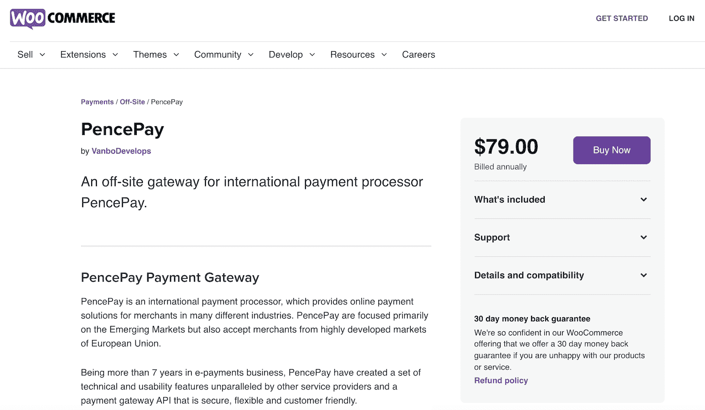

PencePay.

Shopify 有自己的支付网关，需要零配置。如果您使用 [Shopify 支付](https://help.shopify.com/en/manual/payments/shopify-payments)，您将不会被收取交易费用。

## 注册订阅时事通讯

### 想知道我们是怎么让流量增长超过 1000%的吗？

加入 20，000 多名获得我们每周时事通讯和内部消息的人的行列吧！

[Subscribe Now](#newsletter)

Shopify 还支持多种外部支付网关。然而，有一个显著的缺点:平台对使用这些网关收取额外的费用。

基本 Shopify、Shopify 和高级 Shopify 计划的费用分别为 2%、1%或 0.5%。因此，如果你选择 Shopify，你可能会考虑使用它的支付网关。

WooCommerce 也有自己的[支付网关](https://woocommerce.com/payments/)，会产生额外的费用。然而，它不收取使用外部网关的费用。这意味着您将只被您的银行或您选择的网关收取交易费用。
T3】

## WooCommerce vs Shopify:每个平台的成本是多少？

Shopify 的[核心定价](https://www.shopify.com/pricing)是透明的，所以很容易提前评估这个平台会让你花多少钱。您可以选择基本 Shopify(29 美元)、Shopify(79 美元)或高级 Shopify(299 美元)计划:

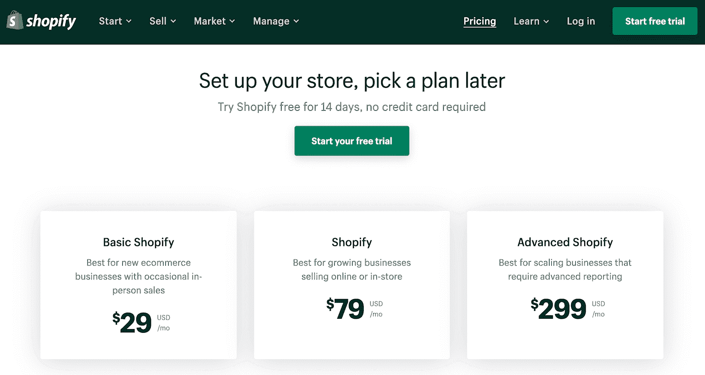

Shopify pricing page.

根据你的[订阅](https://kinsta.com/knowledgebase/how-to-cancel-shopify-subscription/)，你还将为每笔交易支付高达 2.9%加 30 的费用。通过购买高级 Shopify 计划，您可以将这些费用降至 2.4%加 30 英镑。

如果您使用任何高级主题或应用程序，您的在线商店的成本将会增加。如果您使用外部支付网关，Shopify 也会收取更多费用。但是，您可以通过购买 Shopify 高级计划来减少这些费用。

WooCommerce 稍微复杂一些。你可以免费下载 WordPress 核心软件和 WooCommerce 插件。如果你想最小化你的运行成本，那么你会在 WordPress 知识库中找到大量免费的 WooCommerce 主题和插件。

在 WooCommerce 官方网站上还有一小部分免费主题供选择:

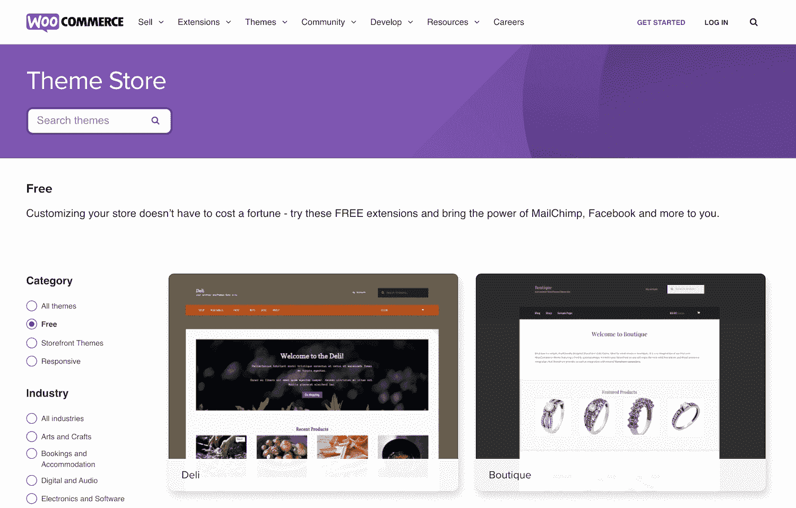

WooCommerce theme store.

然而，你可能需要支付[高级 WooCommerce 主题](https://woocommerce.com/product-category/themes?categories=Themes&collections=theme&page=1&orderby=date)和一些[官方 WooCommerce 扩展](https://woocommerce.com/products/)。如果你还没有 WordPress 网站，你还需要购买主机和域名。

这些变量使得计算 WooCommerce 商店的总成本变得很困难，尤其是与固定的 Shopify 订阅相比。然而，各种各样的免费和高级附加软件意味着 WooCommerce 有足够的空间让你想怎么贵就怎么贵。

## 在 WooCommerce 和 Shopify 之间迁移有多容易？

迁移到一个新的电子商务平台并不理想。您可能担心丢失数据、错过订单或对客户体验产生负面影响。幸运的是，一些工具可以帮助你在 WooCommerce 和 Shopify 之间迁移。

Cart2Cart 是一个流行的迁移插件,它可以让你从现有的 Shopify 商店中传输数据。该插件可以在迁移过程中将您的数据存储在 Cart2Cart 服务器上，从而最大限度地减少对客户的影响:

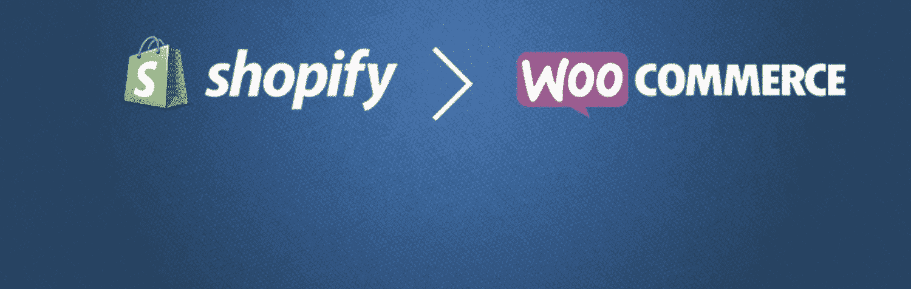

Migrate from Shopify to WooCommerce.

一旦你[安装了 WooCommerce 插件](https://kinsta.com/blog/woocommerce-tutorial/)，你只需要提供你的 Shopify 商店和你的新 WooCommerce 商店的凭证。然后，指定要传输的数据，并在提交完整传输之前执行可选的演示迁移。

或者，您可能想要检查 LitExtension。这个[自动化工具](https://litextension.com/woocommerce-migration-tool/shopify-to-woocommerce.html)可以将大量数据从 Shopify 传输到 WooCommerce:

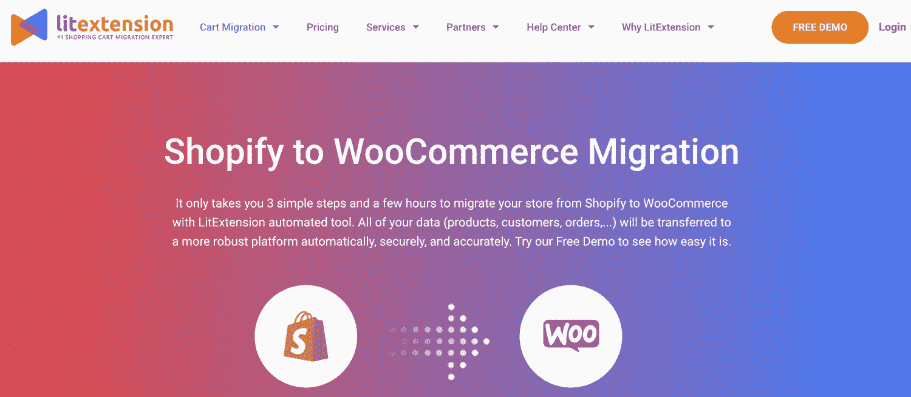

LitExtension.

此外，您可以使用 LitExtension 迁移您的订单 id、简短和完整的产品描述以及产品库存单位(SKU)。这样做可以确保无缝过渡，并减少将数据迁移到新家后需要执行的配置量。

如果你正从 WooCommerce 转向 Shopify，你可能也想看看官方进口商应用程序。它可以从 WooCommerce 导出您的客户、产品和订单数据，并将其导入新的 Shopify 商店。

欲了解更多信息，请阅读我们关于从 Shopify 迁移到 WooCommerce 的完整指南。

## WooCommerce vs Shopify:有哪些支持？

Shopify 被设计成易于使用，但你可能仍不时需要一些帮助。幸运的是，该平台有一个[专用的帮助中心](https://help.shopify.com/en)，里面塞满了文章、教程和分步指南:

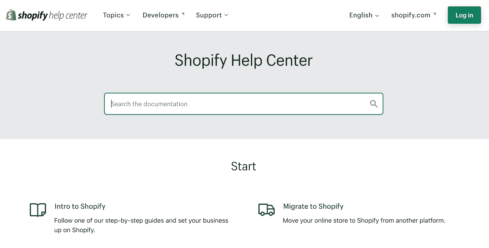

Shopify Help Center.

如果你是视频教程的粉丝，Shopify 还运营着一个 YouTube 频道和 T2 的定期网络研讨会。

需要一流的，快速的，安全的主机为您的新电子商务网站？Kinsta 提供超快的服务器和来自 WooCommerce 专家的 24/7 世界级支持。[查看我们的计划](https://kinsta.com/plans/?in-article-cta)

如果您更喜欢结构化的支持方式，您可能会对 [Shopify Learn](https://www.shopify.com/learn) 门户感兴趣。在这里，您可以找到 90 多位 Shopify 专家提供的免费点播课程:

Shopify Learn.

虽然自助资源是非常宝贵的，但有时，您可能需要一对一的支持。您可以联系其他 Shopify 用户，并在[官方 Shopify 论坛](https://community.shopify.com/c/shopify-community/ct-p/en)上发表您的问题:

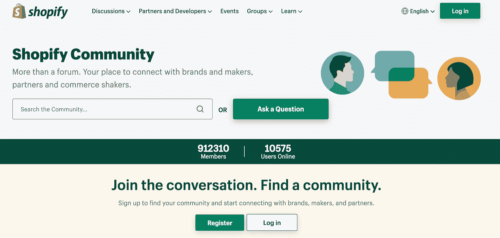

Shopify Community Resources.

或者， [Shopify 支持团队](https://help.shopify.com/en/questions#/login)可以通过电子邮件、实时聊天和电话全天候提供服务。如果您还不是 Shopify 的客户，但想了解更多信息，您仍可以联系该团队。

同样，WooCommerce 拥有令人印象深刻的自助资源。它的[官方文档](https://woocommerce.com/documentation/)包含了详细的指南，涵盖了运营一家成功的 WooCommerce 商店的各个方面:

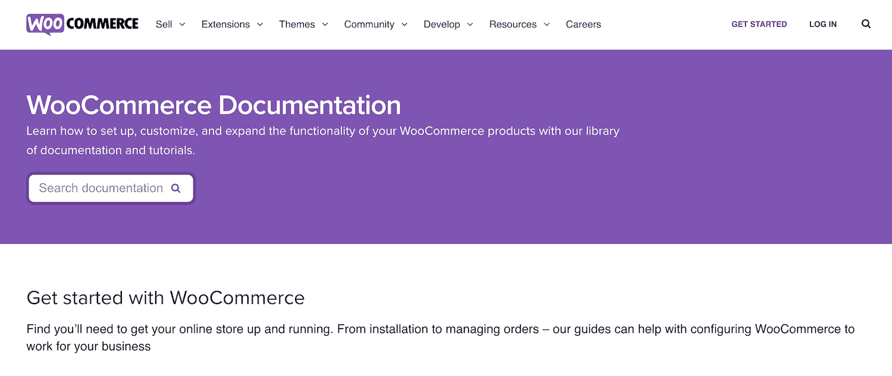

WooCommerce Documentation.

还有一系列主题指南。对于新人来说，[新的 WooCommerce 店主指南](https://woocommerce.com/guides/new-store/)可能会很方便:

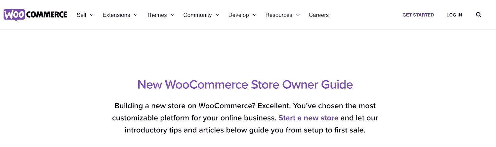

New WooCommerce store owner guide.

你还可以在 [WooCommerce 博客](https://woocommerce.com/blog/)上找到大量信息丰富的文章。它包括技术文章，以及关于建立电子商务帝国的一般性建议:

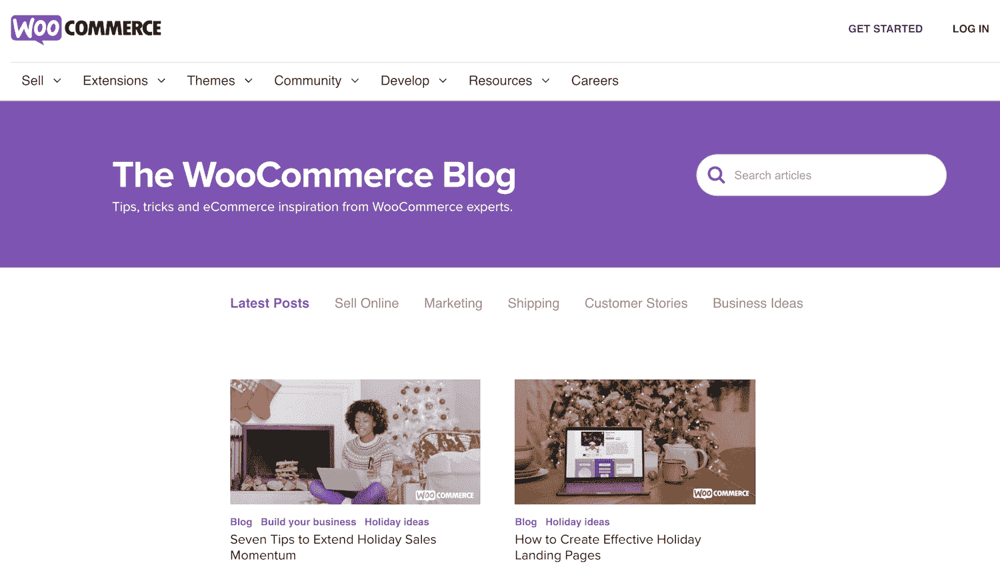

The official WooCommerce blog.

当你经营一家网上商店时，任何停机、性能不佳或错误都会对你的底线产生毁灭性的影响。考虑到这一点，你可能想要选择一个提供 24/7 支持的主机提供商。如果你在你的 WooCommerce 网站上遇到任何问题，你将有机会接触到专家团队，帮助你的商店回到正轨。

## 各平台如何处理包邮和直运？

如果你销售实物产品，无缝运输体验是必要的。Shopify 和 WooCommerce 都能让你进行国际运输。然而，Shopify 拥有优势，这要归功于它与加拿大邮政、联邦快递、UPS、DHL 和 USPS 的内置合作关系。

你也可以使用这两个平台进行直运，这是一种零售模式，你不需要库存任何产品。相反，您从供应商处购买商品，然后直接将它们发送给客户。

建立直运业务时，您的网站看起来就像任何在线商店一样。然而，这两个电子商务平台都有一些额外的功能，可以帮助推动您的直运业务。

如果你选择 Shopify，最受欢迎的市场都有专门的应用程序，包括[全球速卖通直运](https://apps.shopify.com/alidropship):

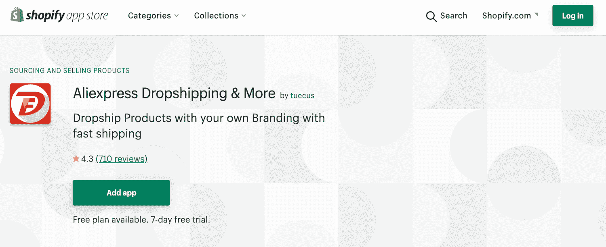

Aliexpress Dropshipping.

类似地，WooCommerce 社区创建了大量插件，使您能够直接从第三方市场导入产品。它们包括与全球速卖通集成的 [AliDropship 插件](https://alidropship.com/plugin/)。它还可以通过点击一个按钮来自动完成订单:

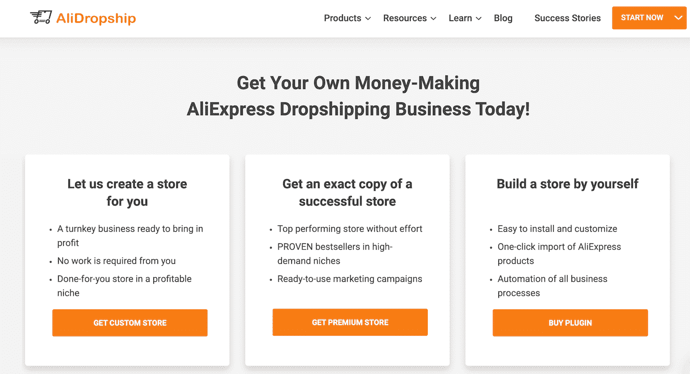

AliDropship for WordPress.

如果你想创办自己的直运企业，WooCommerce 和 Shopify 都是不错的选择。请注意，许多产品市场都有自己的会员费、运费和其他费用。这些费用会侵蚀你本已微薄的直运利润。

## 哪个平台对搜索引擎最友好？

搜索引擎优化(SEO)会极大地影响你作为在线商店的底线。事实上，大多数电子商务商店超过 40%的收入来自有机流量。此外，[39%的数字购买](https://www.thinkwithgoogle.com/consumer-insights/consumer-trends/meet-needs-i-want-to-buy-moments/)受到相关搜索的影响。

WooCommerce 的代码已经针对 SEO 进行了优化。你也可以在你的产品页面上添加元描述和标题，并定制你的 URL。这些措施可以最大化你的商店页面出现在相关搜索引擎结果中的机会。

此外，你可以通过安装额外的插件来增加 WooCommerce 的 SEO 吸引力。其中包括专为提高你的搜索引擎优化而设计的强大软件，如 [Yoast SEO](https://kinsta.com/blog/yoast-seo/) 和[SEO 框架](https://theseoframework.com/):

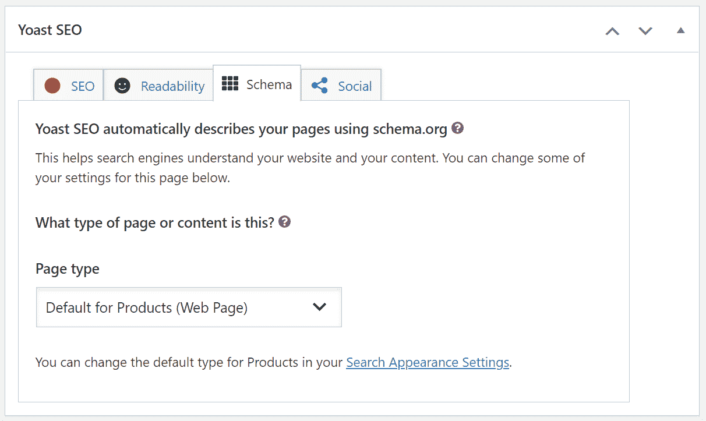

Yoast and WooCommerce.

这些插件可以让你更好地控制页面搜索引擎优化。他们还可以评估你的搜索引擎优化，并为搜索引擎提供可行的优化每个产品页面的技巧。

Shopify 还可以轻松地将基本的 SEO 信息添加到您的商店中。这个过程包括为您的产品页面创建描述和标题。

虽然 WooCommerce 拥有更多种类的插件，但 Shopify 应用商店中有一些有用的 SEO 插件，如 [SEO Booster](https://apps.shopify.com/seo-booster?ref=wbe&subid1=woocomvsshop) :

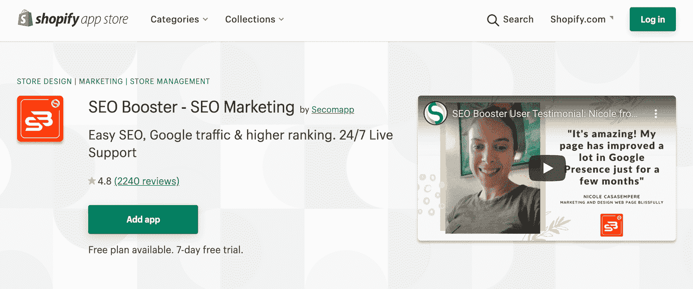

SEO Booster for Shopify.

这个插件可以扫描你的商店，并生成详细的搜索引擎优化报告。然后你可以实现插件的推荐，有希望提高你的搜索引擎排名。

## WooCommerce vs Shopify:每个平台的安全性如何？

作为一个成功的网上商店，你可以获得客户信息，包括信用卡和借记卡的详细信息。这可能会使你成为黑客的一个有吸引力的目标。

由于它是一个托管平台，Shopify 主要负责保护你的商店免受黑客攻击。事实上，该平台内置了一些基本的安全特性，包括一个 [SSL 证书](https://kinsta.com/blog/types-of-ssl-certificates/)。

为了帮助人们保持在线安全，大多数现代浏览器通过显示挂锁图标来指示网站受 SSL 保护:

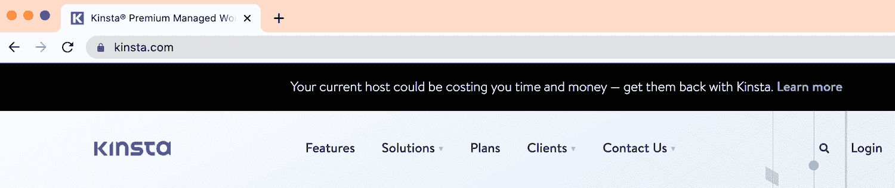

Kinsta’s built-in SSL certificate.

此证书向 Internet 用户保证当前网站是值得信任的。通过这种方式，Shopify 的内置 SSL 可能会帮助你获得一些额外的销售。

相比之下，WooCommerce 插件没有内置的安全性。你需要采取措施保护你的商店免受黑客攻击。同样，这意味着安装一些额外的插件。

有很多世界级的插件供你选择，但是 Sucuri 安全套件是一个受欢迎的选择:

Sucuri Security Suite.

当您激活此插件时，它会为组成您在线商店的所有目录、插件、主题和核心文件创建一个“已知良好”分类。如果任何内容受到威胁，Sucuri 会通知您。

寻找和配置这些插件可能是大量的工作。你可以通过与一家主机提供商合作来最大限度地减少创建一个安全的 WooCommerce 商店的时间和成本，该提供商[非常重视安全性](https://kinsta.com/secure-wordpress-hosting/):

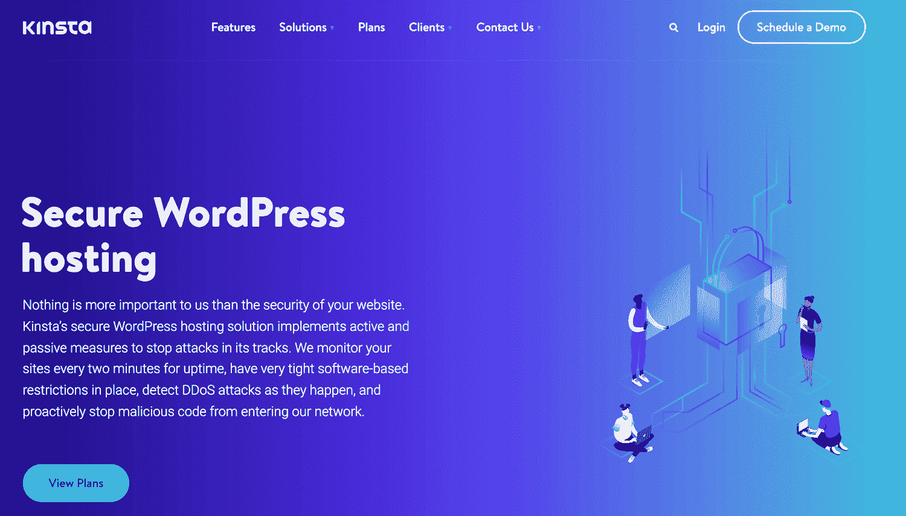

Kinsta’s secure WordPress and WooCommerce hosting.

在 Kinsta，我们向所有客户提供免费的 Cloudflare SSL，因此您无需担心寻找和配置您的证书。我们还支持双因素身份验证、IP 地理位置阻止，并自动禁止可疑的 IP。

## 管理库存有多容易？

WooCommerce 是一个灵活的可定制的解决方案，让你完全控制你的库存。你可以上传新产品并使用熟悉的 WordPress 编辑器编辑现有产品:

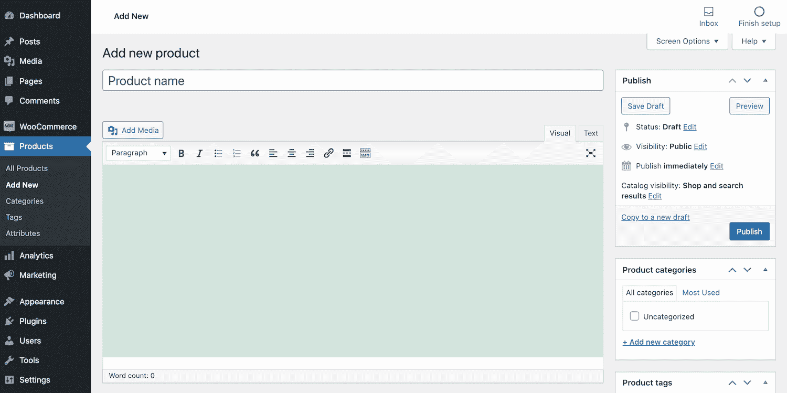

WooCommerce inventory management.

与 WooCommerce 类似，Shopify 使您能够快速跟踪您的产品，访问库存警报，生成报告，并执行其他重要的库存管理任务。这两个平台都允许您通过 CSV 文件批量上传整个产品目录。这些功能可以为您节省大量时间。

然而，这些解决方案的一个显著不同之处是产品差异。这些是您可以应用于特定产品的属性。

例如，如果你卖一件 t 恤衫，你可以提供不同颜色或尺寸的产品。这些属性中的每一个都是产品的变体。

有了 WooCommerce，你可以使用的产品种类数量没有硬性限制。相比之下， [Shopify 有一个 100 个变体的硬上限](https://help.shopify.com/en/manual/products/variants/add-variants),每个产品总共有三个选项。如果你想提高这个限额，你需要使用一个[第三方 Shopify 应用](https://apps.shopify.com/search?q=variants+options)。

[Learn whether WooCommerce or Shopify is your perfect ecommerce partner with help from this guide 🤝🚀Click to Tweet](https://twitter.com/intent/tweet?url=https%3A%2F%2Fkinsta.com%2Fblog%2Fwoocommerce-vs-shopify%2F&via=kinsta&text=Learn+whether+WooCommerce+or+Shopify+is+your+perfect+ecommerce+partner+with+help+from+this+guide+%F0%9F%A4%9D%F0%9F%9A%80&hashtags=WooCommerce%2CEcommerce)

## 摘要

由于用户友好的电子商务平台的兴起，创建一个在线商店变得前所未有的简单。然而，有时候，太多的选择可能是一件坏事。

如果你在 WooCommerce 和 Shopify 之间左右为难，那么让我们快速回顾一下这两个平台:

1.  **Shopify:** 如果你想快速开设网上商店，Shopify 将强大的电子商务功能与流畅的设置过程相结合。它几乎不需要专业的技术知识，但这是有代价的——你不拥有这个平台，而且每次销售都要支付佣金。
2.  WooCommerce: 这个插件可以将现有的 WordPress 网站转变成一个强大的电子商务平台。WooCommerce 拥有一个庞大的插件、扩展和主题社区，承诺让你完全控制你的电子商务商店。然而，你需要[选择一个可信的虚拟主机](https://kinsta.com/woocommerce-hosting/)来让它顺利工作。

关于 WooCommerce vs Shopify，你有什么问题吗？请在下面的评论区告诉我们！

* * *

让你所有的[应用程序](https://kinsta.com/application-hosting/)、[数据库](https://kinsta.com/database-hosting/)和 [WordPress 网站](https://kinsta.com/wordpress-hosting/)在线并在一个屋檐下。我们功能丰富的高性能云平台包括:

*   在 MyKinsta 仪表盘中轻松设置和管理
*   24/7 专家支持
*   最好的谷歌云平台硬件和网络，由 Kubernetes 提供最大的可扩展性
*   面向速度和安全性的企业级 Cloudflare 集成
*   全球受众覆盖全球多达 35 个数据中心和 275 多个 pop

在第一个月使用托管的[应用程序或托管](https://kinsta.com/application-hosting/)的[数据库，您可以享受 20 美元的优惠，亲自测试一下。探索我们的](https://kinsta.com/database-hosting/)[计划](https://kinsta.com/plans/)或[与销售人员交谈](https://kinsta.com/contact-us/)以找到最适合您的方式。