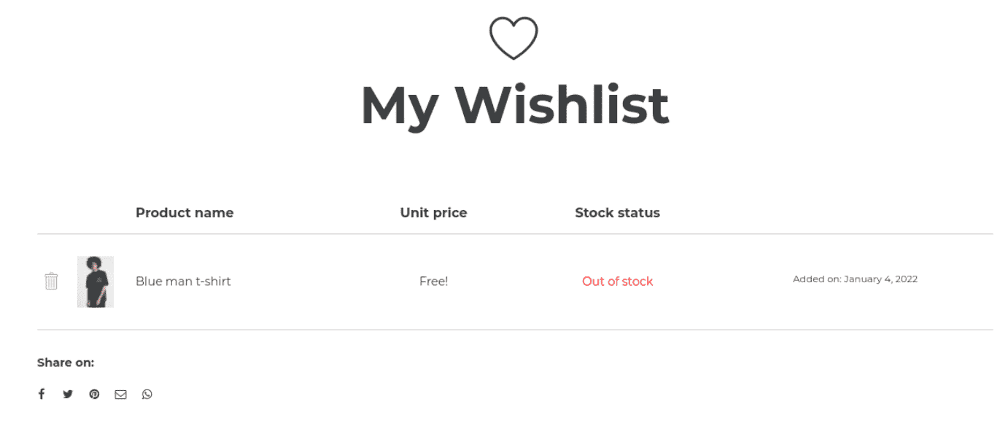
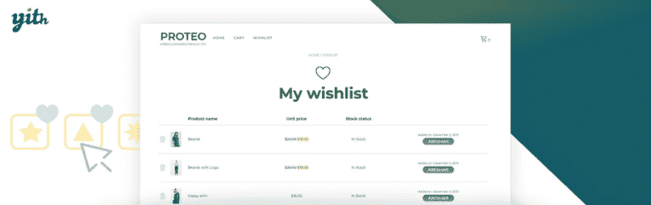
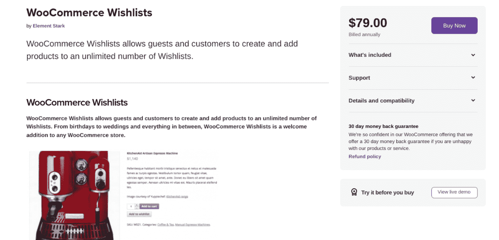
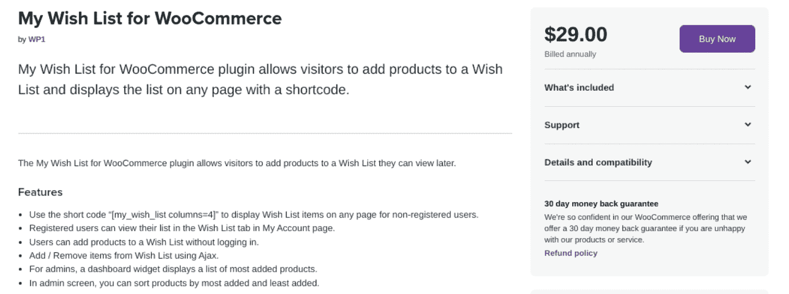

# 你的商店的 8 个最佳 WooCommerce 愿望清单插件

> 原文:# t0]https://kinta . com/blog/woocommerce-wishlist/

你的商店访客经常会发现他们感兴趣的产品，但还不准备购买。不幸的是，这会导致他们最终忘记这些东西。

这就是愿望清单派上用场的地方。愿望清单是非常有用的工具，它能让用户保存他们喜欢的产品清单。一旦他们准备好[完成结账流程](https://kinsta.com/blog/woocommerce-checkout/)，他们就可以在方便的时候回来。

在这篇文章中，我们将首先解释什么是愿望清单，以及在你的网站上添加这个功能的好处。然后，我们将回顾八个最好的 WooCommerce 愿望列表插件。我们开始吧！

### 查看我们的视频指南 [WooCommerce 愿望列表插件](https://www.youtube.com/watch?v=8GFA2aUL7Zg)

## 什么是愿望清单？

愿望清单是一个强大的功能，让购物者能够保存他们感兴趣的产品。就像给他们的购物车添加商品一样，顾客可以列出他们最终想要购买的商品清单。这样，他们将来就可以轻松地访问它们:

A wishlist example in WooCommerce

愿望清单不仅仅是顾客的工具。这也有助于他们的家人和朋友寻找礼物。

> Kinsta 把我宠坏了，所以我现在要求每个供应商都提供这样的服务。我们还试图通过我们的 SaaS 工具支持达到这一水平。
> 
> <footer class="wp-block-kinsta-client-quote__footer">
> 
> 
> 
> <cite class="wp-block-kinsta-client-quote__cite">Suganthan Mohanadasan from @Suganthanmn</cite></footer>

[View plans](https://kinsta.com/plans/)

对于网站所有者来说，这也是一个方便的功能。愿望清单提供有价值的数据，帮助你对你的[营销策略](https://kinsta.com/blog/email-marketing-automation/)和促销做出更明智的决定。

[If your customers are interested in a product but not quite ready to hit purchase, a wishlist plugin can help you keep those sales 🛒Click to Tweet](https://twitter.com/intent/tweet?url=https%3A%2F%2Fkinsta.com%2Fblog%2Fwoocommerce-wishlist%2F&via=kinsta&text=If+your+customers+are+interested+in+a+product+but+not+quite+ready+to+hit+purchase%2C+a+wishlist+plugin+can+help+you+keep+those+sales+%F0%9F%9B%92&hashtags=ecommerce%2CWooCommerce)

## 使用 WooCommerce 愿望清单插件的好处

在 WooCommerce 中使用[愿望列表插件有很多好处。对于初学者来说，这个工具可以让你在没有任何代码的情况下将愿望列表功能添加到你的站点中。](https://kinsta.com/blog/woocommerce-plugins/)

愿望列表插件为你的用户提供了一种快速便捷的方式来保存他们感兴趣的产品。由于这一功能，用户将更有可能在更有意义的时候购买他们保存的项目。

例如，当促销和折扣可用时，或者当以前缺货的产品重新进货时，他们可能会选择回到他们的愿望清单并购买产品。

使用愿望清单也有多种方式。例如，它们可以帮助客户跟踪他们的产品。它们也可以用作工具，在节日期间与朋友和家人分享物品。此外，用户可以在社交渠道上分享愿望清单，这有助于促进您的业务和扩大品牌知名度。

作为 WooCommerce 商店的店主，愿望清单可以帮助你更好地了解你的产品，并[收集有价值的数据](https://kinsta.com/blog/google-analytics-alternatives/)以便更好地管理库存。例如，如果您注意到许多消费者正在将某些商品添加到他们的愿望清单中，它可以帮助您确保这些商品总是有货。

### 在愿望列表插件中寻找的关键特性

有许多愿望列表插件可供选择，包括免费和付费选项。但是，您会希望选择一个适合您的需求和预算的工具。

此外，我们建议寻找几个关键功能，包括:

*   共享和隐私设置
*   支持分组产品和产品变化
*   个人意愿列表页面
*   直接从愿望清单购买的选项
*   易于安装和使用
*   访问意愿列表数据
*   集成和支持

一旦你弄清楚哪些功能对你的商店最重要，就可以更容易地决定使用哪种工具。下一步是比较最佳方案。

## 你的商店的 8 个最佳 WooCommerce 愿望清单插件

既然我们对意愿列表和使用意愿列表插件的好处有了更多的了解，让我们来看看一些高质量的选项。以下是市场上八个最好的 WooCommerce 愿望列表插件。

### 1.TI WooCommerce 愿望列表插件

TI WooCommerce Wishlist

拥有超过 100，000 个活跃的 WordPress 安装， [TI WooCommerce Wishlist 插件](https://wordpress.org/plugins/ti-woocommerce-wishlist/)是最受欢迎的工具之一，您可以使用它将 Wishlist 功能添加到您的在线商店。这是一个免费的增值插件，具有高质量的功能，使您的客户能够创建愿望清单并快速添加产品。

一旦在你的网站上安装并激活，这个插件允许你在你的[产品页面](https://kinsta.com/blog/conversions-woocommerce-product-pages/)上的**添加到购物车**按钮旁边添加一个**添加到愿望清单**按钮。免费增值工具提供了所有的基本设置，可以向 WooCommerce 添加一个愿望列表，还提供了一个付费选项，可以提供更多高级功能。

**主要特性:**

*   能够添加愿望清单按钮到任何产品
*   添加到购物车时，自动从愿望列表中删除产品
*   自定义愿望列表图标上传
*   可定制的外观
*   脸书和推特等网络上的愿望清单社交分享
*   [自定义 CSS](https://kinsta.com/blog/wordpress-css/) 样式
*   每个用户的多个愿望清单
*   意愿列表隐私设置
*   促销电子邮件

**价格:** TI WooCommerce Wishlist 有免费版和高级版。付费选项从每年[79 美元](https://templateinvaders.com/product/ti-woocommerce-wishlist-wordpress-plugin/)的单一站点许可开始。这包括 100%无风险，14 天退款保证，以及一年的更新和支持。

### 2.YITH WooCommerce 愿望清单

YITH WooCommerce Wishlist

YITH WooCommerce Wishlist 是另一款功能丰富且灵活的免费增值 WooCommerce Wishlist 工具。这个流行的工具让购物者可以很容易地创建一个可排序的愿望清单，并与朋友和家人分享，并通过社交媒体渠道推广它。

YITH WooCommerce 愿望列表提供了高级别的支持、标准的愿望列表页面和结账重定向功能。多亏了 shortcode，你可以轻松地将愿望列表功能放在你网站的任何地方。

如果你在寻找有价值的数据，这个插件是一个很好的选择。高级版为店主提供添加到顾客愿望清单中的最受欢迎产品的跟踪信息。

**主要特性:**

*   单一意愿列表页面
*   “从愿望列表中删除”按钮
*   具有可定制列的愿望列表表格
*   产品变化支持
*   意愿列表隐私管理
*   面向商店经理的热门愿望清单产品的可视列表
*   用户的无限愿望清单
*   意愿列表页面和表格布局

**价格:** YITH WooCommerce Wishlist 有基本免费版和高级版可选。一个 [Pro 许可从每年 94 美元起](https://yithemes.com/themes/plugins/yith-woocommerce-wishlist/)，包括一年的更新和支持。

## 注册订阅时事通讯

### 想知道我们是怎么让流量增长超过 1000%的吗？

加入 20，000 多名获得我们每周时事通讯和内部消息的人的行列吧！

[Subscribe Now](#newsletter)

### 3.WooCommerce 的 WPC 智能愿望列表

WPC Smart Wishlist for WooCommerce

如果你正在寻找一个简单的愿望清单解决方案，面向 WooCommerce 的 WPC 智能愿望清单是一个可靠的选择。它不像列表中的其他扩展那样复杂。然而，如果你是一个小企业，只需要基本的愿望清单按钮和图标，这是很有帮助的。

这个插件的配置很简单。一旦你在你的网站上安装并激活了它，你需要选择一个页面来显示你的愿望清单。

**主要特性:**

*   意愿列表按钮文本
*   添加额外动作按钮和链接类的选项
*   意愿列表按钮类别
*   愿望清单设计定制选项
*   将产品添加到购物车时，自动从愿望清单中删除产品
*   [短码](https://kinsta.com/ebooks/wordpress/woocommerce-shortcodes/)支持
*   弹出意愿列表视图，防止用户离开页面

**价格:【WooCommerce 的 WPC 智能心愿单免费使用。然而，有一个[高级选项](https://wpclever.net/downloads/smart-wishlist/)，可以访问更多高级功能。单站点许可证起价 29 美元，并有 7 天退款保证。**

### 4.WooCommerce 愿望清单

Wish List for WooCommerce

如果你正在寻找一个极简的 WooCommerce 愿望列表插件，WooCommerce 愿望列表可能是你的正确选择。这个基本的、用户友好的工具提供了标准功能，让购物者将产品添加到愿望清单中。

这个工具非常适合那些寻找一种快捷方便的方式来添加愿望列表功能的用户。然而，如果您正在寻找大量的定制和配置选项，这可能不是最好的选择。虽然高级版包含了更多的高级特性，但是它仍然没有列表中的其他高级工具那么广泛和强大。

**主要特性:**

*   极简设计
*   字体真棒图标
*   支持电子邮件和社交分享
*   可定制的意愿列表按钮位置
*   侧边栏愿望列表小部件

价格:【WooCommerce 的愿望清单完全免费下载和使用。你可以升级到[高级许可](https://wpfactory.com/item/wish-list-woocommerce/)以获得更多高级功能，每年 29.99 美元起。这包括一年的更新和支持。

### 5.WooCommerce 愿望清单

WooCommerce Wishlists

如果你正在寻找一个高级扩展，WooCommerce Wishlists 可能是一个很好的选择。如果你想让你的注册客户和客人都能在你的网站上创建无限的愿望清单，这一点尤为重要。

Struggling with downtime and WordPress problems? Kinsta is the hosting solution designed to save you time! [Check out our features](https://kinsta.com/features/)

这个插件使用户能够为日常使用和特殊场合创建愿望清单。例如，它可以方便注册相关的网站，如婴儿洗澡和婚礼。此外，它还为店主提供了令人印象深刻的定制功能和管理视图。

**主要特性:**

*   客人和注册用户的愿望清单
*   顾客的愿望清单最多可保存 30 天，或由注册顾客无限期保存
*   无限愿望清单
*   完全隐私控制
*   社交媒体分享
*   支持分组产品和产品变化
*   可自定义的按钮文本
*   WordPress 菜单集成

价格:【WooCommerce Wishlists 的许可费是[每年 79 美元](https://woocommerce.com/products/woocommerce-wishlists/)。这包括一年的支持和更新，以及 30 天的退款保证。

### 6.愿望套件

WishSuite

WishSuite 是一个直观的 WooCommerce 插件，可以让你在网上商店添加美观的愿望清单。它方便用户(包括注册购物者和访客购物者)添加和查看产品以备将来使用。

这是一个初学者友好的工具，包括一个轻松的设置过程。您可以在任何页面上显示意愿列表，并使用提供的短代码在整个网站上放置意愿列表按钮。一旦添加到购物车中，客户也可以轻松地从他们的愿望清单中删除这些商品。

**主要特性:**

*   跨社交媒体网络的愿望列表共享选项
*   定制选项
*   从意愿列表功能中删除产品
*   在任何页面上显示意愿列表的选项
*   在页面任意位置添加和显示愿望列表按钮的简码

**价格:** WishSuite 完全免费。

### 7.WooCommerce 的预销售愿望清单

Premmerce Wishlist for WooCommerce

另一个可以考虑的免费选项是 WooCommerce 的 Premmerce 愿望清单。该插件提供了一个简单的方法来添加和分享产品到愿望清单。作为店主，您可以使用它来查看现有的愿望清单，并创建有针对性的优惠和折扣，以帮助推动转化。

这个插件不像其他一些愿望清单工具那样功能齐全。然而，它可以是一个负担得起的、方便的选择，几乎可以与任何 WooCommerce 主题配合使用。为了充分利用该插件，我们建议升级到高级版本。

**主要特性:**

*   易于使用的界面和设置
*   自定义意愿列表按钮和自定义 URL
*   分享愿望清单的选项
*   后端意愿列表管理
*   小部件支持

**价格:**premme ce wish list 是一个免费增值插件。除了免费版本，还有从 99.99 美元起的[高级计划](https://premmerce.com/pricing/)，用于一年的单站点许可。

### 8.我的 WooCommerce 愿望清单

My Wish List for WooCommerce

[我对 WooCommerce 的愿望清单](https://woocommerce.com/products/my-wish-list-for-woocommerce/)是一个高级扩展，你可以使用它在你的网站上注册和未注册用户之间启用愿望清单功能。注册用户可从**我的账户**页面查看意愿列表，并可通过短码显示给客人用户。

此插件允许您查看经常添加到客户愿望清单中的产品的关键数据。这个工具的好处之一是它支持 Ajax，这有助于加快页面加载速度。

**主要特性:**

*   为注册购物者和访客显示意向列表的选项
*   后端意愿列表统计和关键见解
*   用于显示愿望列表小部件的简码
*   从管理屏幕按添加最多或最少对产品进行排序

价格:我对 WooCommerce [的愿望清单是每年 29 美元](https://woocommerce.com/products/my-wish-list-for-woocommerce/)。这包括一年的更新和支持，以及 30 天的退款保证。

[Don't let your customers forget about their favorite items from your ecommerce store! 🛒Use a wishlist plugin to keep all their favorite s organized and accessible ✨Click to Tweet](https://twitter.com/intent/tweet?url=https%3A%2F%2Fkinsta.com%2Fblog%2Fwoocommerce-wishlist%2F&via=kinsta&text=Don%27t+let+your+customers+forget+about+their+favorite+items+from+your+ecommerce+store%21+%F0%9F%9B%92Use+a+wishlist+plugin+to+keep+all+their+favorite+s+organized+and+accessible+%E2%9C%A8&hashtags=ecommerce%2CWooCommerce) ## 摘要

管理网上商店的一个重要部分是确保顾客能够方便地找到、跟踪和购买他们感兴趣的产品。然而，他们可能并不总是准备立即购买一件商品，这就是为什么让他们创建一个愿望清单是明智的。正如本文所讨论的，有各种各样的 WooCommerce 愿望列表插件可供选择。如果你正在寻找一个强大的选项，你可以选择像 TI WooCommerce Wishlist 或 YITH WooCommerce Wishlist 这样的工具，它们提供更高级的高级版本。*你对 WooCommerce 愿望清单插件有什么问题吗？请在下面的评论区告诉我们！*

* * *

让你所有的[应用程序](https://kinsta.com/application-hosting/)、[数据库](https://kinsta.com/database-hosting/)和 [WordPress 网站](https://kinsta.com/wordpress-hosting/)在线并在一个屋檐下。我们功能丰富的高性能云平台包括:

*   在 MyKinsta 仪表盘中轻松设置和管理
*   24/7 专家支持
*   最好的谷歌云平台硬件和网络，由 Kubernetes 提供最大的可扩展性
*   面向速度和安全性的企业级 Cloudflare 集成
*   全球受众覆盖全球多达 35 个数据中心和 275 多个 pop

在第一个月使用托管的[应用程序或托管](https://kinsta.com/application-hosting/)的[数据库，您可以享受 20 美元的优惠，亲自测试一下。探索我们的](https://kinsta.com/database-hosting/)[计划](https://kinsta.com/plans/)或[与销售人员交谈](https://kinsta.com/contact-us/)以找到最适合您的方式。