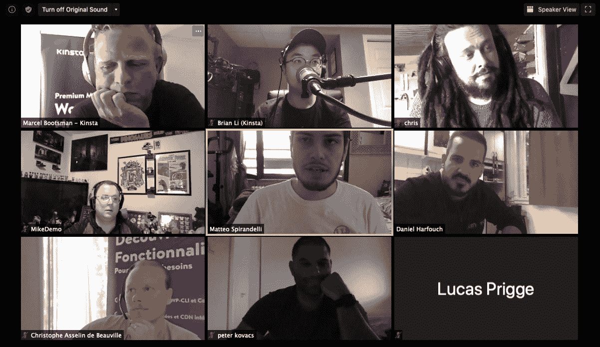

# 在 2020 年欧洲世界语言营上经营一个虚拟赞助商展位(内有礼品包)

> 原文:# t0]https://kinta . com/blog/wordcamp-Europe-2020/

今年的欧洲单词营很特别。这是单词营历史上第一次 100%在网上通过虚拟展台进行的活动。

这给参与其中的每个人都带来了许多变化:组织者、演讲者、志愿者和[赞助商(如 Kinsta)](https://2020.europe.wordcamp.org/sponsor/kinsta/) 必须适应这种新的方式来举办单词夏令营。

Marcel Bootsman 和我在组织 [Kinsta 为这一期欧洲世界夏令营的赞助活动](https://kinsta.com/blog/wordcamp-europe/)中发挥了积极作用。我可以告诉你，无论是从个人角度还是从职业角度，今年的情况都有所不同。

## 从现场活动到虚拟活动，社区仍然是核心

2019 年，我在东京参加了我的第一次 WordCamp。我花了一天时间与与会者谈论 Kinsta，会见其他公司的代表，并参加了一些教育会议。

一天结束时，我带着对 WordPress 社区的人们的深深感激离开了，我迫不及待地想参加我的下一个 WordPress 社区。我一点也不知道我的下一个单词营会是一个由全球疫情带来的完全虚拟的单词营！

从实体会议过渡到虚拟会议是一项艰巨的任务，我非常感谢那些不可思议的 WordPress 社区成员，他们齐心协力完成了这项任务。

虽然我仍然认为社区活动最好亲自体验，但我很高兴看到 WordPress 粉丝为了一个共同的目的而聚集在一起的最重要的部分仍然存在并且很好！

当我和马塞尔(我的犯罪搭档，如果你愿意的话)聊天时，他和我分享了以下内容:

> 当想到要去一个单词营(老实说，我已经数不清我去过多少次了)时，我脑海中闪现的第一感觉是友谊和开放。与全球 WordPress 社区这么多成员的友谊。因为这些友谊很容易建立。
> 
> 友谊是这个伟大社区的核心。在单词营里，你可以学习、交流、分享知识，最重要的是，玩得开心。这些包容性的活动将人们聚集在一起，这是整个 WordPress 项目令人惊叹的地方，对我来说，这是它成功的秘密。这个虚拟的事件将是不同的，但它将把人们聚集在一起。而这才是最重要的方面！

对于那些不熟悉“WordPress”这个术语的人，请继续阅读一个简短的介绍，后面是我们回馈 WordPress 项目的理由，并成为赞助商。

哦，当然，你会发现更多关于我们的免费虚拟礼包。

–Brian Li，网站内容经理

## 什么是欧洲单词营？

欧洲世界夏令营是最大的世界夏令营之一。由 WordPress 社区为 WordPress 社区和那些对 [WordPress](https://kinsta.com/knowledgebase/what-is-wordpress/) 感兴趣的人组织的。

WordPress 是一个会议，人们聚集在一起分享知识，关注会议，会见各种类型的 WordPress 用户、代理商、[开发者、](https://kinsta.com/blog/hire-wordpress-developer/)、自由职业者、文案、设计师以及所有对使用这个流行的 [CMS](https://kinsta.com/knowledgebase/content-management-system/) 感兴趣的人。

WordPress camps 是全球倡议的一部分，旨在将当地的 WordPress 社区聚集在一起。你可以在官方 WordCamp 中心网站上查看所有即将到来的(和过去的)word camp。

## 回馈 WordPress 项目

没有人和公司对项目的回馈，开源软件就无法存在。回馈 WordPress 可以有多种方式。

组织一个 WordPress 聚会，帮助把 WordPress 翻译成你自己的语言，修复一个错误，增加一个功能，赞助官方的 WordPress 活动来帮助活动组织者支付费用。这就是为什么单词营会为所有参与者带来可及且可负担的活动。

## 金斯塔的虚拟赞助商展位

继最近关于优化在家工作体验的[网络研讨会](https://kinsta.com/webinars/working-from-home/)之后，Marcel 和我在 WordCamp 2020 的虚拟赞助商展位上做了一个演示。我们分享了关于分布式团队、公司文化以及 Kinsta 如何在新冠肺炎疫情期间保持高效的技巧。

Kinsta’s virtual booth at WCEU 2020.

对于那些参观过我们虚拟展台的人，我们想说非常感谢你们参加我们的 2020 年欧洲世界语言营！我们玩得很开心，希望你也一样。

## 注册订阅时事通讯

### 想知道我们是怎么让流量增长超过 1000%的吗？

加入 20，000 多名获得我们每周时事通讯和内部消息的人的行列吧！

[Subscribe Now](#newsletter)

下面，您将找到如何兑换免费虚拟礼包的详细信息。

### Kinsta 为 WordCamp Europe 参与者准备的虚拟礼包

作为对所有参加 WordPress 欧洲 2020 的参与者的感谢，我们放了一个超级漂亮的虚拟礼包，里面有与 WordPress 相关的免费赠品。具体来说，您可以在其中找到以下内容:

#### 电子书

下载我们的电子书，深入学习各种 WordPress 主题。无论你是想优化你的代理公司的运营，还是想加速你的网站，或者是想改善 T2 的搜索引擎优化，我们都有一本电子书可以帮你。

##### 1.托管 WordPress 主机的真正价值

想象一下，如果你有一个平台负责[备份](https://kinsta.com/help/wordpress-backups/)，更新 WordPress 和你的主题和插件，监控和修复任何安全漏洞。下载您喜欢的语言版本的电子书:

[英语](https://kinsta.com/ebooks/wordpress/managed-wordpress-hosting/)，[法语](https://kinsta.com/fr/ebooks/wordpress/hebergement-wordpress-infogere/)，[德语](https://kinsta.com/de/ebooks/wordpress/verwaltetes-wordpress-hosting/)，[意大利语](https://kinsta.com/it/ebooks/wordpress/hosting-wordpress-gestito/)，[葡萄牙语](https://kinsta.com/pt/ebooks/wordpress/hospedagem-gerenciada-wordpress/)，[西班牙语](https://kinsta.com/es/ebooks/wordpress/wordpress-hosting-administrado/)

##### 2.保护客户端站点的最终指南

WordPress 的安全性永远不应该被忽视。请阅读这份循序渐进的安全指南，以确保您客户的网站是安全的。还有你的生意。下载您喜欢的语言版本的电子书:

[英语](https://kinsta.com/ebooks/wordpress/how-to-secure-wordpress-site/)，[法语](https://kinsta.com/fr/ebooks/wordpress/comment-securiser-site-wordpress/)，[德语](https://kinsta.com/de/ebooks/wordpress/wie-man-wordpress-seiten-sichert/)，[葡萄牙语](https://kinsta.com/pt/ebooks/wordpress/como-proteger-um-site-wordpress/)

##### 3.2020 年管理 40 个 WordPress 网站指南

[通过这份免费指南，学习如何以最有效的方式管理您所有客户的网站，从而增加您的客户数量和业务收入](https://kinsta.com/blog/growing-saas-company/)。下载您喜欢的语言版本的电子书:

[英语](https://kinsta.com/ebooks/wordpress/manage-multiple-wordpress-sites/)，[法语](https://kinsta.com/fr/ebooks/wordpress/gerer-plusieurs-sites-wordpress/)，[德语](https://kinsta.com/de/ebooks/wordpress/mehrere-wordpress-seiten-verwalten/)，[意大利语](https://kinsta.com/it/ebooks/wordpress/gestire-siti-wordpress-multipli/)，[葡萄牙语](https://kinsta.com/pt/ebooks/wordpress/gerenciar-varios-sites-wordpress/)，[西班牙语](https://kinsta.com/es/ebooks/wordpress/gestionar-varios-sitios-wordpress/)

##### 4.如何加速你的 WordPress 网站

速度就是一切。[更高的转化率](https://kinsta.com/blog/conversion-rate-optimization-tips/)，更好的排名，更强的 [SEO](https://kinsta.com/blog/what-does-seo-stand-for/) ，更多的销量。通过这个深入的指南，学习如何让你的 WordPress 站点运行得更快。下载用您的语言编写的电子书:

[英语](https://kinsta.com/ebooks/wordpress/speed-up-wordpress/)，[德语](https://kinsta.com/de/ebooks/wordpress/wordpress-beschleunigen/)，[意大利语](https://kinsta.com/it/ebooks/wordpress/velocizzare-wordpress/)，[西班牙语](https://kinsta.com/es/ebooks/wordpress/acelerar-sitio-wordpress/)，[日语](https://kinsta.com/jp/ebooks/wordpress/speed-up-wordpress/)

### 红利:Perfmatters 和 Novashare 的优惠券代码

我们与专注于性能的 WordPress 插件开发公司 [forgemedia](https://forgemedia.io/) 合作，为 WordPress 欧洲会议的与会者提供两个我们最喜欢的插件的特别优惠:[perfmates](https://perfmatters.io/)和 [Novashare](https://novashare.io/) 。

在结账时使用优惠券代码`KINSTAWCEU`获得 25%的折扣。此代码仅在 6 月 1 日至 6 月 20 日期间有效。

### MyKinsta Dashboard Demo

在我们的 WCEU 演示中，我们强调了 [MyKinsta 仪表板](https://kinsta.com/MyKinsta)的几个关键方面。如果你想在注册 Kinsta 计划之前测试 MyKinsta 的各种功能，请查看我们 100%免费且完全可操作的 [MyKinsta 演示](https://demo.kinsta.com/register)。

## 订阅我们的时事通讯

如果你想了解更多关于各种 WordPress 话题的信息，请确保定期查看我们的博客和订阅我们免费的每周时事通讯。

我们期待着在您附近即将到来的 WordCamp 中见到您——希望是您本人！

* * *

让你所有的[应用程序](https://kinsta.com/application-hosting/)、[数据库](https://kinsta.com/database-hosting/)和 [WordPress 网站](https://kinsta.com/wordpress-hosting/)在线并在一个屋檐下。我们功能丰富的高性能云平台包括:

*   在 MyKinsta 仪表盘中轻松设置和管理
*   24/7 专家支持
*   最好的谷歌云平台硬件和网络，由 Kubernetes 提供最大的可扩展性
*   面向速度和安全性的企业级 Cloudflare 集成
*   全球受众覆盖全球多达 35 个数据中心和 275 多个 pop

在第一个月使用托管的[应用程序或托管](https://kinsta.com/application-hosting/)的[数据库，您可以享受 20 美元的优惠，亲自测试一下。探索我们的](https://kinsta.com/database-hosting/)[计划](https://kinsta.com/plans/)或[与销售人员交谈](https://kinsta.com/contact-us/)以找到最适合您的方式。