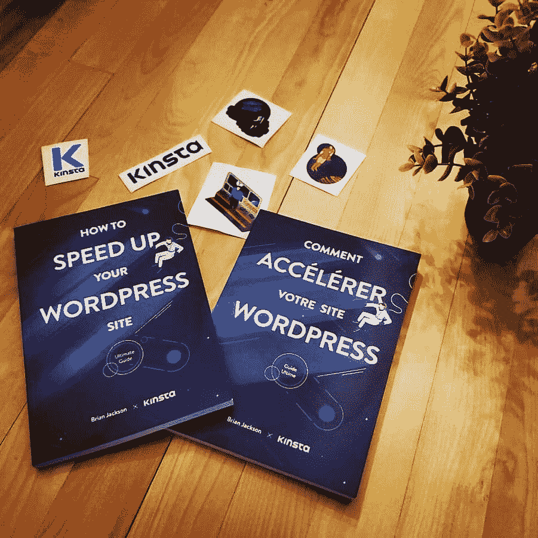
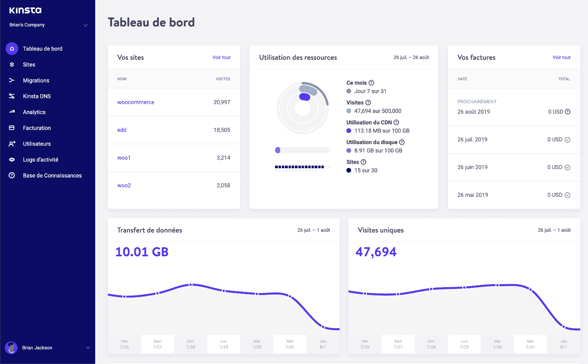

# 欢迎参加 2019 蒙特利尔世界夏令营——我们将为您呈现！

> 原文：<https://kinsta.com/blog/wordcamp-montreal-2019/>

请标记您的日历，参加将于 2019 年 8 月 10 日至 11 日在肯考迪亚大学举行的第 11 届[世界夏令营](https://2019.montreal.wordcamp.org/)。Kinsta 将出席并赞助此次活动。我们很高兴见到你！

在公共餐桌旁停下来吃点金斯塔的东西。你也可以拿一本免费的英语和法语版的“如何加快你的 WordPress 网站”的书。

Speed up Your WordPress Site book

我们对此次活动感到非常兴奋，因为我们的法国市场 Kinsta 业务发展协调员 Christophe Asselin de Beauville 将在**发表演讲，介绍快速网站的重要性！**他将涉及的几个话题包括:

*   统计慢速或快速网站的影响，以及它如何影响网站的流量和收入。
*   优化你的 WordPress 站点时需要考虑的所有要点，比如选择正确的 WordPress 主题和插件、图像和数据库优化、高级域名系统、内容分发网络，当然还有高性能的主机。

Christophe 很乐意亲自回答你的任何问题。他的演讲:“在互联网上，每一毫秒都很重要，不要再忽视它了！”将于周日上午 10 点举行。它将以法语呈现。🇫🇷

在金斯塔，法国和加拿大的🇨🇦 WordPress 社区对我们非常重要。我们的网站提供法语版本([https://kinsta.com/fr/](https://kinsta.com/fr/))，以及我们的 [MyKinsta 仪表盘](https://kinsta.com/fr/mykinsta/)。我们还在世界协调时 06:00 到 14:00 之间提供法语托管支持。所有其他时间目前都有英语支持。我们将很快为法国客户提供全时间的法语支持以及欧元支付服务。

MyKinsta in French

你可以在这里找到 WordCamp Montréal [的完整程序。我们希望在那里见到你！](https://2019-fr.montreal.wordcamp.org/programme/)

* * *

让你所有的[应用程序](https://kinsta.com/application-hosting/)、[数据库](https://kinsta.com/database-hosting/)和 [WordPress 网站](https://kinsta.com/wordpress-hosting/)在线并在一个屋檐下。我们功能丰富的高性能云平台包括:

*   在 MyKinsta 仪表盘中轻松设置和管理
*   24/7 专家支持
*   最好的谷歌云平台硬件和网络，由 Kubernetes 提供最大的可扩展性
*   面向速度和安全性的企业级 Cloudflare 集成
*   全球受众覆盖全球多达 35 个数据中心和 275 多个 pop

在第一个月使用托管的[应用程序或托管](https://kinsta.com/application-hosting/)的[数据库，您可以享受 20 美元的优惠，亲自测试一下。探索我们的](https://kinsta.com/database-hosting/)[计划](https://kinsta.com/plans/)或[与销售人员交谈](https://kinsta.com/contact-us/)以找到最适合您的方式。