# WordPress 4.9 的新功能

> 原文：<https://kinsta.com/blog/wordpress-4-9/>

WordPress 4.9“tip ton”[刚刚发布](https://wordpress.org/news/2017/11/tipton/)，可供下载。今年的第二个主要版本标志着向更加以用户为中心的方式定制和管理网站迈出了重要的一步，对定制器进行了重大改进，为小部件提供了令人兴奋的新功能，为编辑代码提供了强大的文本编辑器，等等。所以，是时候看看新版本中最有希望的变化了。

**更新**:[WordPress 5.3 的新功能](https://kinsta.com/blog/wordpress-5-3/)

你可以下载 [WordPress 4.9](https://wordpress.org/download/) 或者从你的 WordPress 仪表盘的更新部分升级现有的安装。记住，和 WordPress 的任何新版本一样，首先在[的试运行环境](https://kinsta.com/help/staging-environment/)中测试它总是一个好主意——或者至少做个备份以防万一。

话虽如此，让我们深入到最有希望的 WordPress 4.9 变化中。


## 在定制器中起草和计划变更

受[定制快照插件](https://wordpress.org/plugins/customize-snapshots/)的起草和修改的启发，WordPress 4.9 引入了一种新的方式来保存定制器中的更改。任何时候你启动一个定制会话，每一个设置的改变都将被保存在一个[定制 _ 变更集](https://make.wordpress.org/core/2016/10/12/customize-changesets-technical-design-decisions/)定制文章类型中。多亏了变更集，用户定制可以[保存为草稿](https://core.trac.wordpress.org/ticket/39896)或[计划](https://core.trac.wordpress.org/ticket/28721)在未来发布。**这意味着站点管理员可以放弃更改，将定制器恢复到最终发布前的最后发布状态**。

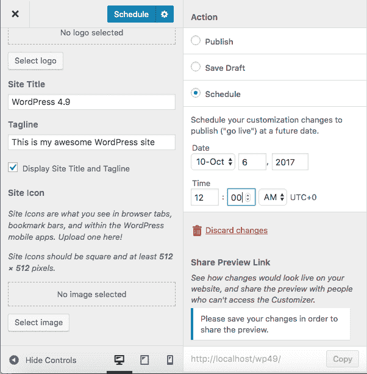

Changes in the Customizer can be saved as drafts or scheduled to be published later


一个有用的附加功能是**共享预览链接**，它将允许用户与不允许访问定制器的查看者共享最新更改的预览。**分享预览链接**将会派上用场，与你的客户分享前端预览，而不用给他们访问管理面板。

## 定制器中 UX 的其他改进

其他改进涉及[主题浏览体验](https://core.trac.wordpress.org/ticket/37661)。从 WordPress 4.9 开始，用户可以浏览已安装的主题和 WordPress.org 主题，并直接从定制器中预览、下载和激活它们。


> Kinsta 把我宠坏了，所以我现在要求每个供应商都提供这样的服务。我们还试图通过我们的 SaaS 工具支持达到这一水平。
> 
> <footer class="wp-block-kinsta-client-quote__footer">
> 
> 
> 
> <cite class="wp-block-kinsta-client-quote__cite">Suganthan Mohanadasan from @Suganthanmn</cite></footer>

[View plans](https://kinsta.com/plans/)

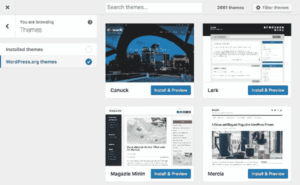

Browsing through themes in the Customizer


另一个变化影响了定制器中创建菜单的流程[，并且应该解决了一些可用性问题。从 WordPress 4.9 开始，用户被引导完成菜单创建过程，因此选择菜单位置和菜单项应该更加直观。](https://core.trac.wordpress.org/ticket/40104)

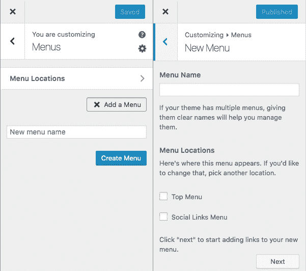

WordPress 4.8 和 WordPress 4.9


中定制菜单部分的比较

## 微件中的图库、oEmbeds 和 HTML

WordPress 4.9 附带了一个全新的[图库小部件](https://core.trac.wordpress.org/ticket/41914)，这是继 [WordPress 4.8](https://kinsta.com/blog/wordpress-4-8/) 中引入的媒体和图像小部件之后的。现在可以像在文章编辑器中一样将图库添加到小部件中。

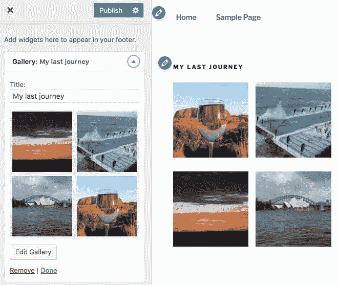

The new Gallery widget


其他变化会影响文本、视频和自定义 HTML 小工具。WordPress 现在只在文章和页面中解析短代码，为了让它们在小部件中工作，我们应该在插件中添加这两行代码:

```
add_filter( 'widget_text', 'shortcode_unautop' );
add_filter( 'widget_text', 'do_shortcode' );
```

从 WordPress 4.9 开始，默认情况下，[短代码将在文本小工具](https://core.trac.wordpress.org/ticket/10457)中解析。

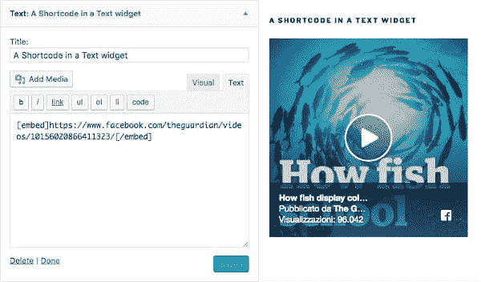

In WordPress 4.9 shortcodes are parsed also in Text widgets


目前，只有 YouTube 和 Vimeo 托管的视频可以添加到视频小工具中，因为这些是唯一由 *MediaElement.js* 库支持的托管视频提供商，而不需要依靠 oEmbeds。WordPress 4.9 在视频小工具中增加了 [oEmbed 支持，这一变化将使其有可能包括除 YouTube 和 Vimeo 之外的提供商托管的视频。](https://core.trac.wordpress.org/ticket/42039)

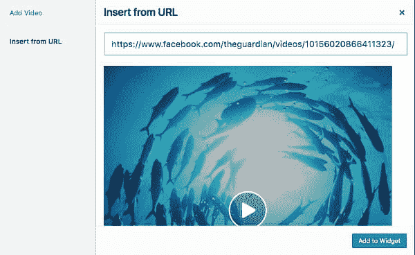

The improved Video widget allows to embed videos from providers other than YouTube and Vimeo


此外，WordPress 4.9 在帖子内容之外增加了 [oEmbed 支持。这意味着文本小部件中也将允许可用的 oEmbeds。](https://core.trac.wordpress.org/ticket/34115)

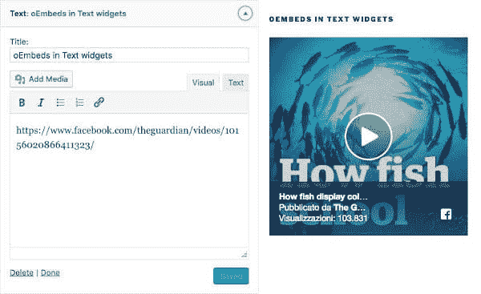

In WordPress 4.9 oEmbeds are allowed in Text widgets


其他的变化是[支持在文本小部件](https://core.trac.wordpress.org/ticket/34115)中添加媒体，以及在定制 HTML 小部件中引入[代码镜像文本编辑器。](https://core.trac.wordpress.org/ticket/12423)

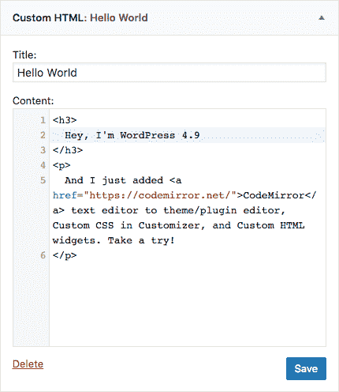

CodeMirror 是新的用于定制 HTML 小部件的文本编辑器


## 菜单、Widget 位置和其他更改

当我们改变当前主题时，前一个主题的菜单和小部件会丢失。即使当我们从一个父主题切换到它的子主题时，也会发生这种情况，这很烦人，因为每当我们改变一个主题时，它会迫使我们一次又一次地构建所有的菜单和添加所有的小部件。

## 注册订阅时事通讯


### 想知道我们是怎么让流量增长超过 1000%的吗？

加入 20，000 多名获得我们每周时事通讯和内部消息的人的行列吧！

[Subscribe Now](#newsletter)

WordPress 4.9 [修复了这个问题](https://core.trac.wordpress.org/ticket/39692)，使得在两个主题中具有相似 id 或名称的菜单位置和窗口小部件区域将被自动映射。此外，如果主题具有一个以上的菜单，则第一主题的第一菜单位置中的菜单将自动映射到第二主题的第一菜单位置中的菜单。这意味着 WordPress 将在主题切换中保留菜单和小部件。

推荐阅读: [10 个扩展 WordPress 内置菜单功能的最佳 WordPress 菜单插件](https://kinsta.com/blog/wordpress-menu-plugins/)。

UI 也有其他小的改进，比如当你运行更新时，图标会显示在每个插件旁边(如下所示)。

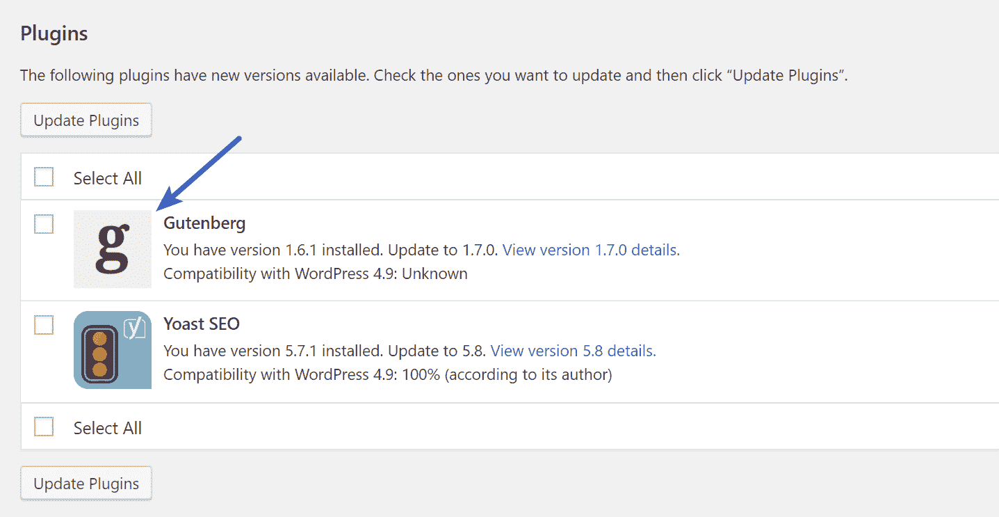

WordPress 4.9 update icons


## 开发人员的变化

对开发者来说，一个重要的变化是包含了主题/插件编辑器的 [CodeMirror](https://codemirror.net/) ，定制器中的定制 CSS 编辑器，以及定制 HTML 小部件。

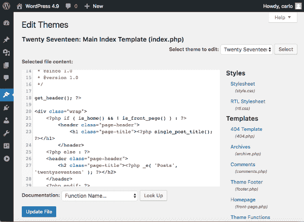

CodeMirror in theme/plugin editor


CodeMirror 将 WordPress 编码体验带到了一个更高的层次。它带有自动完成功能和实时语法错误通知。此外，防止用户在出现错误的情况下保存代码，这为代码编辑增加了一层安全性(更多信息，请参见[包含默认代码编辑器](https://core.trac.wordpress.org/ticket/12423)标签)。

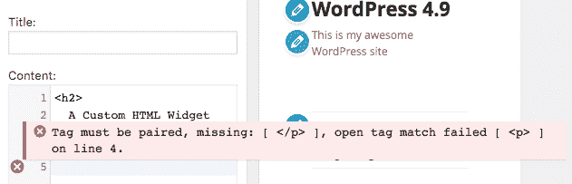

An error notification in CodeMirror


WordPress 4.9 还增加了新的[WP _ Customize _ Code _ Editor _ Control](https://core.trac.wordpress.org/ticket/41897)类，它将允许开发者在插件中添加 CodeMirror 文本编辑器的自定义实例。以下是如何在定制器中添加定制代码编辑器的示例:

Struggling with downtime and WordPress problems? Kinsta is the hosting solution designed to save you time! [Check out our features](https://kinsta.com/features/)

```
add_action( 'customize_register', 'sample_customize_register' );

function sample_customize_register( WP_Customize_Manager $wp_customize ) {
	$wp_customize->add_setting( 'custom_html' );
	$control = new WP_Customize_Code_Editor_Control( $wp_customize, 'custom_html', array(
		'label' => 'Custom HTML',
		'code_type' => 'text/html',
		'settings' => 'custom_html',
		'section' => 'title_tagline', // Site Identity section
	) );
	$wp_customize->add_control( $control );
}
```

定制器的其他变化包括[全局通知](https://core.trac.wordpress.org/ticket/35210)、[面板和部分通知](https://core.trac.wordpress.org/ticket/38794)、[覆盖整个屏幕的通知](https://core.trac.wordpress.org/ticket/37727)，以及[新的日期/时间控件](https://core.trac.wordpress.org/ticket/42022)。

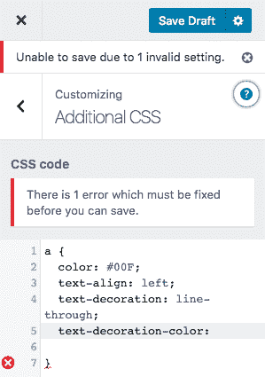

Panel and section notifications in Customizer


以下是开发人员感兴趣的其他变化的简短列表:

*   REST API: [支持模式验证和净化中的对象](https://core.trac.wordpress.org/ticket/38583)
*   角色和上限:[增加了激活/停用单个插件的能力](https://core.trac.wordpress.org/ticket/38652)
*   角色和任务:[增加了管理翻译安装和更新的功能](https://core.trac.wordpress.org/ticket/39677)
*   从核心中移除库
*   用户:当用户试图更改其电子邮件地址时，需要确认电子邮件

关于 WordPress 4.9 变化的完整列表，见 [WordPress 新闻稿](https://make.wordpress.org/core/4.9/)。这里是一个伟大的视频纲要，所有的变化，从戴夫在可湿性粉剂 Smackdown。


## 如何更新到 WordPress 4.9

由于每个客户的站点都不同，我们总是建议利用[提供的登台环境](https://kinsta.com/help/staging-environment/)(如果不够，您还可以添加额外的[高级登台环境](https://kinsta.com/help/premium-staging-environments/))。你可以在几秒钟内克隆你的网站，然后用你现有的主题和插件测试 WordPress 4.9 来检查兼容性。当然，为了安全起见，你也可以在更新你的直播网站之前做一个[手动备份](https://kinsta.com/help/wordpress-backups/)。

要将 WordPress 升级到 4.9，只需点击 WordPress 管理面板上的更新图标。然后点击“立即更新”按钮。当你的网站被更新时，它将处于[维护模式](https://kinsta.com/blog/wordpress-maintenance-mode/)。一旦您的更新完成，您的网站将恢复正常。

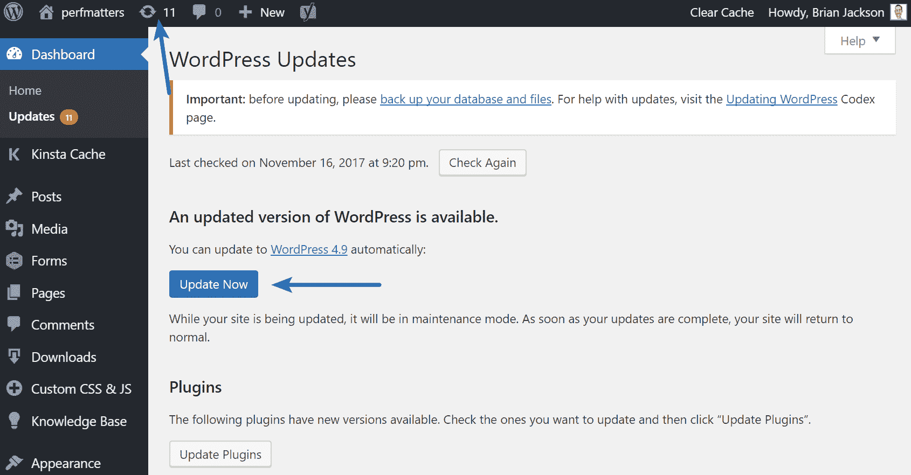

Update to WordPress 4.9


只要更新一切顺利，您应该会看到“最新动态”屏幕。就是这样！又快又简单。

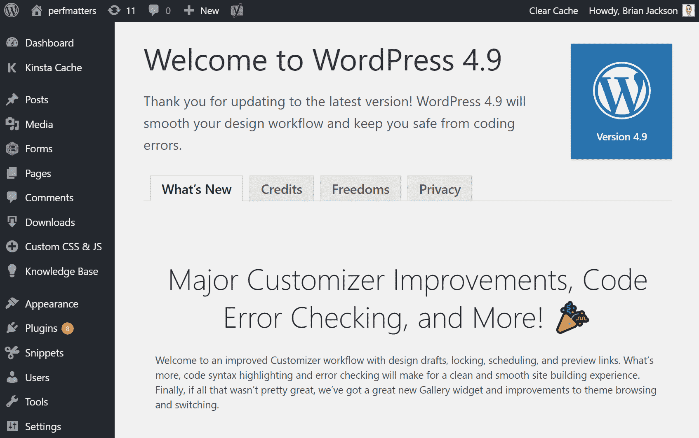

WordPress 4.9 update


### WordPress 更新问题疑难解答

每当人们更新 WordPress 的主要版本时，总有一些会遇到问题，这是由于目前市场上同时存在数以千计的不同插件和主题。以下是解决常见问题的几种方法。

*   得到死亡的[白屏？这通常可以通过简单的](https://kinsta.com/blog/wordpress-white-screen-of-death/)[重启 PHP/HHVM](https://kinsta.com/help/restart-php/) 和[删除你的 WordPress 站点上的整个页面缓存](https://kinsta.com/blog/wordpress-clear-cache/)来解决。
*   试着停用你所有的插件，看看是否能解决你的问题。然后一个一个地重新激活它们，直到你发现哪个插件可能需要开发者的更新。
*   尝试切换到默认的 WordPress 主题，比如 [Twenty Twenty](https://kinsta.com/blog/twenty-twenty-theme/) 。如果这解决了你的问题，你可能需要联系你的主题开发者。
*   排除和[诊断浏览器中的 JavaScript 问题](https://codex.wordpress.org/Using_Your_Browser_to_Diagnose_JavaScript_Errors)。如果像可视化编辑器(TinyMCE)这样的关键组件损坏了，这将非常有帮助。

## 结论

WordPress 4.9 现已发布！它给我们带来了许多特别影响用户体验的功能。在我看来，最有趣的变化是定制器的改进，核心中包含的 CodeMirror，以及视频和文本小部件中的 oEmbed 支持。你更喜欢 WordPress 4.9 的哪些功能？

* * *

让你所有的[应用程序](https://kinsta.com/application-hosting/)、[数据库](https://kinsta.com/database-hosting/)和 [WordPress 网站](https://kinsta.com/wordpress-hosting/)在线并在一个屋檐下。我们功能丰富的高性能云平台包括:

*   在 MyKinsta 仪表盘中轻松设置和管理
*   24/7 专家支持
*   最好的谷歌云平台硬件和网络，由 Kubernetes 提供最大的可扩展性
*   面向速度和安全性的企业级 Cloudflare 集成
*   全球受众覆盖全球多达 35 个数据中心和 275 多个 pop

在第一个月使用托管的[应用程序或托管](https://kinsta.com/application-hosting/)的[数据库，您可以享受 20 美元的优惠，亲自测试一下。探索我们的](https://kinsta.com/database-hosting/)[计划](https://kinsta.com/plans/)或[与销售人员交谈](https://kinsta.com/contact-us/)以找到最适合您的方式。