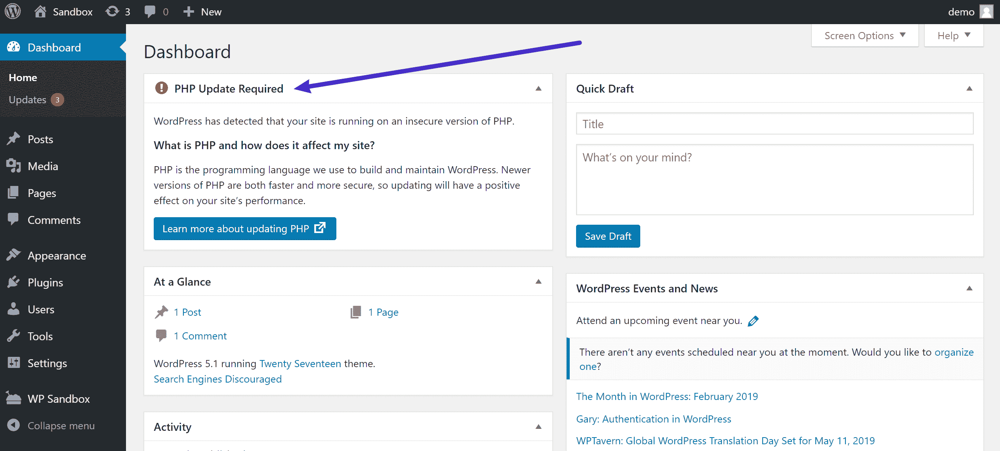
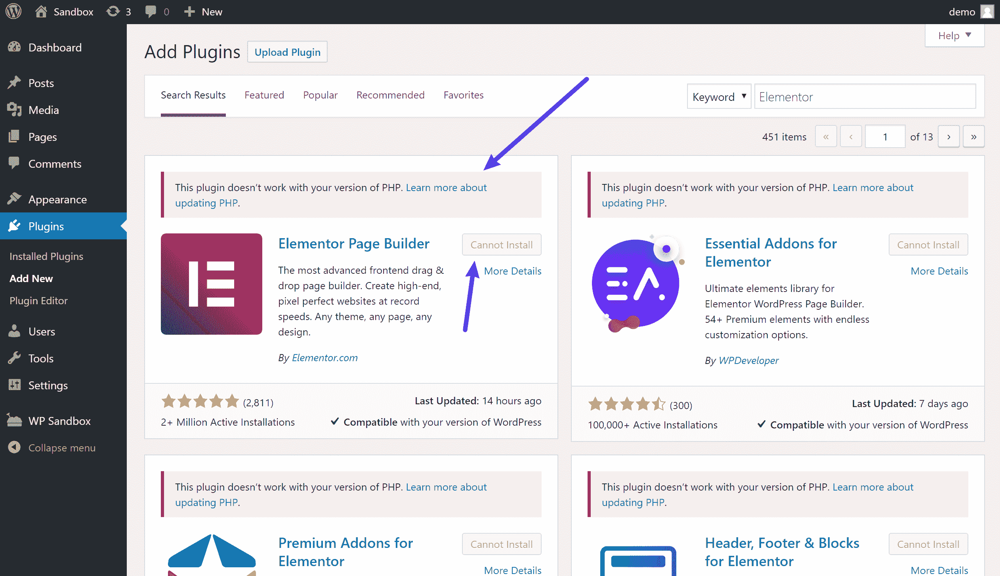
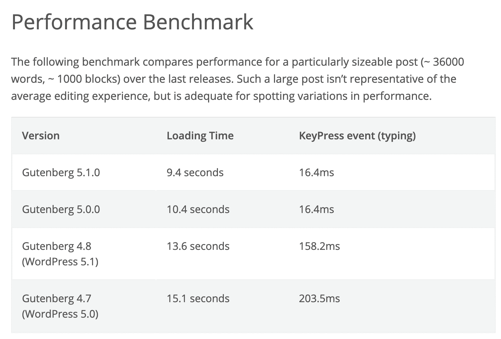
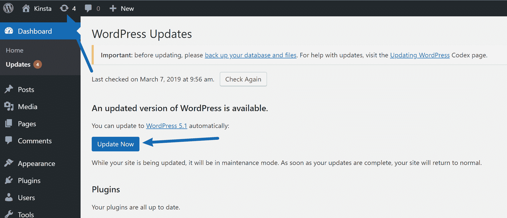
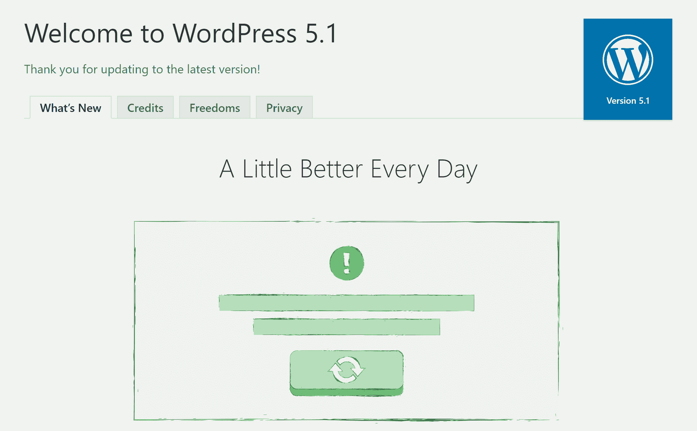

# WordPress 5.1 的新特性(推动 PHP 向前发展)

> 原文：<https://kinsta.com/blog/wordpress-5-1/>

WordPress 5.1“Betty”于 2019 年 2 月 21 日正式发布，并提供下载。

WordPress 5.1 是自 [WordPress 5.0](https://kinsta.com/blog/wordpress-5-0/) 推出 WordPress 块编辑器(又名古腾堡)以来的第一个主要版本。虽然它确实为 block editor 带来了一些调整和改进，但这个版本中最大的新特性包括 WordPress 站点健康项目和 PHP 版本通知。

**更新**:[WordPress 5.3 的新功能](https://kinsta.com/blog/wordpress-5-3/)

在这篇文章中，我们将看看所有可能影响你使用 WordPress 的新功能:

*   [PHP 版本的新仪表板通知](#dashboard)
*   [PHP 版本兼容性检查插件和主题](#plugin)
*   [死亡保护白屏](#wsod)
*   [改进了块编辑器的性能](#block)
*   [开发者的改变](#dev)

## PHP 版本的新仪表板通知

在 Kinsta，我们总是建议使用 PHP 最新版本的[来提高性能和安全性。](https://kinsta.com/blog/php-versions/)

从我们的基准测试来看，PHP 7.3 比 PHP 7.2 平均快 9%(T2)。如果你比较 PHP 7.3 和 PHP 5.6，它每秒可以处理几乎 3 倍于**的请求**(事务)！你应该总是首先在一个临时站点上测试你的插件和主题的兼容性。如果一切顺利，请确保利用这一免费的性能提升。

WordPress 现在终于开始使用一些新的工具和通知来推广 PHP 的最新版本，以提高 PHP 版本和兼容性。

首先，如果你在装有 WordPress 5.1 的服务器上运行一个过时的 PHP 版本，你会看到一个新的仪表盘窗口提示你[安装最新版本的 PHP](https://kinsta.com/blog/install-php/) 。

WordPress 5.1 PHP version dashboard prompt

如果你的主机在 Kinsta，你没有机会看到这条消息,因为我们允许的最低版本是 PHP 5.6。现在，这个警告只会在 PHP 版本下触发。

我们希望 WordPress 团队有一个更高的版本，但是这是朝着正确方向迈出的一步。还有，如果你点击通知中的“了解更多关于更新 PHP 的信息”按钮，[官方 WordPress 文档](https://wordpress.org/support/update-php/)确实推荐 PHP 7.3。👏

[The new PHP notice in WordPress 5.1 is a step in the right direction. 👍 It will help motivate hosts and users to adopt newer PHP versions.Click to Tweet](https://twitter.com/intent/tweet?url=https%3A%2F%2Fkinsta.com%2Fblog%2Fwordpress-5-1%2F&via=kinsta&text=The+new+PHP+notice+in+WordPress+5.1+is+a+step+in+the+right+direction.+%F0%9F%91%8D+It+will+help+motivate+hosts+and+users+to+adopt+newer+PHP+versions.&hashtags=PHP%2Cwebhosting)

## 插件和主题的 PHP 版本兼容性检查

除了 WordPress 仪表盘中的软提示，WordPress 5.1 还增加了强制 PHP 兼容性检查，当你安装一个新的插件或主题时。这对于开发者来说太棒了！

一段时间以来，WordPress 插件开发者已经能够在插件标题中设置一个[最低 PHP 版本要求](https://make.wordpress.org/plugins/2017/08/29/minimum-php-version-requirement/)作为注释。然而，到目前为止，除了显示开发人员愿意支持的最低 PHP 版本之外，这没有做任何事情。

在 WordPress 5.1 中，如果你试图从 WordPress.org 安装一个新的插件或主题，而开发者已经设置了一个比你服务器上的版本更高的 PHP 最低版本，你会看到一条信息告诉你“这个插件不能与你的 PHP 版本兼容”。了解有关更新 PHP 的更多信息。

此外，您将无法安装该插件。此时，您可以通过从存储库中手动下载 ZIP 文件并安装插件来解决这个问题。但是真的——只要更新你的 PHP 版本！

The PHP compatibility check for plugins

## 死亡保护白屏

WordPress 5.1 计划引入一个名为“致命错误保护”的新功能，该功能可以在更新 PHP 时防止出现 [WordPress 白屏死机](https://kinsta.com/blog/wordpress-white-screen-of-death/)。

不幸的是，**这个特性在最后一刻被从 WordPress 5.1 版本**中删除了。然而，这是有充分理由的。

The fatal error protection mechanism explained here has been pulled out of the 5.1 release as it had several flaws critical enough to postpone the feature. A new path to address the issues is underway via [#46130](https://core.trac.wordpress.org/ticket/46130) and is intended to be released as part of WordPress 5.2.Felix Arntz, WordPress Core Team
[make.wordpress.org](https://profiles.wordpress.org/flixos90/)

有了这种保护，WordPress 将会识别出致命错误的发生，并在 WordPress 管理仪表板中暂停违规的主题或插件，这样你仍然可以登录到你的网站的后端，并(希望)修复问题。对于不太懂技术的用户来说，一旦他们解决了所有问题，这将是一个伟大的新功能。

**看看我们修复死亡白屏的视频指南:**

 如果您的网站在升级 PHP 版本时遇到问题，它在前端看起来会像下面这样，但是您仍然可以登录到后端来解决问题。

## 注册订阅时事通讯

### 想知道我们是怎么让流量增长超过 1000%的吗？

加入 20，000 多名获得我们每周时事通讯和内部消息的人的行列吧！

[Subscribe Now](#newsletter)

Fatal error protection in WordPress 5.1

## 提高了块编辑器的性能

自从在 WordPress 5.0 中首次发布[古腾堡块编辑器](https://kinsta.com/blog/gutenberg-wordpress-editor/)以来，古腾堡团队一直在努力改进块编辑器。如果你记得我们的年度 [PHP 基准](https://kinsta.com/blog/php-benchmarks/)，我们发现 WordPress 5.0 和 5.02 实际上比 WordPress 4.9.8 慢。那可不好！请放心，WordPress 核心团队正在努力解决这个问题。

在核心团队发布 WordPress 5.1 的同时，Gutenberg 团队发布了 Gutenberg 5.1，这引起了一些混乱。

尽管有相同的版本号，WordPress 5.1 并不包含 Gutenberg 5.1。相反，WordPress 5.1 包含了古腾堡 **4.8** 。

因此，WordPress 5.1 中块编辑器的最大变化是处理性能。与 WordPress 5.0 相比，你会看到编辑器的加载速度更快，按键事件时间更短。

还有更多好消息。一旦 Gutenberg 的最新版本被合并到核心中，块编辑器的性能将会变得更好——你可以在下面看到不同 Gutenberg 版本的性能比较(记住——WordPress 5.1 包括 Gutenberg**4.8**—这就是我们现在的情况)。

Gutenberg performance benchmarks for different versions

## 对开发者的改变

除了上述面向用户的新特性，WordPress 5.1 还为 WordPress 开发者打包了一些新特性。

### 多站点元数据

WordPress 5.1 添加了一个新的数据库表到[存储与站点相关的元数据](https://kinsta.com/blog/wordpress-multisite/)。[了解更多](https://make.wordpress.org/core/2019/01/28/multisite-support-for-site-metadata-in-5-1/)。

Struggling with downtime and WordPress problems? Kinsta is the hosting solution designed to save you time! [Check out our features](https://kinsta.com/features/)

### Cron API

Cron API 现在有了新的函数来帮助返回数据。您还将获得新的过滤器来修改 cron 存储。[了解更多](https://make.wordpress.org/core/2019/01/23/cron-api-changes-in-wordpress-5-1/)。

### 新的 JavaScript 构建过程

WordPress 5.1 提供了一个新的 JavaScript 构建选项。你可以在这里了解更多关于具体调整的信息。

## 如何更新到 WordPress 5.1

每个客户的网站都是不同的。出于这个原因，我们总是建议利用您站点的[提供的暂存环境](https://kinsta.com/help/staging-environment/)(如果一个暂存环境不够，您还可以添加多达五个[高级暂存环境](https://kinsta.com/help/premium-staging-environments/))。你可以在几秒钟内克隆你的站点，然后用你现有的主题和插件测试 WordPress 5.1 来检查兼容性。当然，为了安全起见，你也可以在更新你的直播网站之前做一个[手动备份](https://kinsta.com/help/wordpress-backups/)。

要将 WordPress 升级到 5.1，只需点击 WordPress 管理面板上的更新图标。然后点击“立即更新”按钮。当你的网站被更新时，它将处于[维护模式](https://kinsta.com/blog/wordpress-maintenance-mode/)。一旦您的更新完成，您的网站将恢复正常。

How to update to WordPress 5.1

只要更新一切顺利，您应该会看到“最新动态”屏幕。就是这样！又快又简单。

The WordPress 5.1 welcome screen

在仪表板中点击后，您还会收到一条消息，提示您将数据库更新到最新版本。只需点击“更新 WordPress 数据库”按钮，你就可以开始了。

Database update required

### WordPress 更新问题疑难解答

每当人们更新 WordPress 的主要版本时，总有一些会遇到问题，这是由于目前市场上同时存在数以千计的不同插件和主题。以下是解决常见问题的几种方法。

*   得到死亡的[白屏？这通常可以通过简单的](https://kinsta.com/blog/wordpress-white-screen-of-death/)[重启 PHP](https://kinsta.com/help/restart-php/) 和[删除你的 WordPress 站点上的整个页面缓存](https://kinsta.com/blog/wordpress-clear-cache/)来解决。
*   试着停用你所有的插件，看看是否能解决你的问题。然后一个一个地重新激活它们，直到你发现哪个插件可能需要开发者的更新。
*   尝试切换到默认的 WordPress 主题，比如 [Twenty Twenty](https://kinsta.com/blog/twenty-twenty-theme/) 。如果这解决了你的问题，你可能需要联系你的主题开发者。
*   排除和[诊断浏览器中的 JavaScript 问题](https://codex.wordpress.org/Using_Your_Browser_to_Diagnose_JavaScript_Errors)。

## 摘要

虽然在这个版本中没有任何大的正面功能，但是 WordPress 5.1 增加了一些很棒的功能来推动更健康的 WordPress 网站。

对 PHP 版本的关注将有望推动大部分运行过时 PHP 版本的 WordPress 用户更新到更新的版本，并且块编辑器的性能改进非常受欢迎。

你如何看待 WordPress 5.1？有什么吸引你的吗？你希望他们包括什么吗？

* * *

让你所有的[应用程序](https://kinsta.com/application-hosting/)、[数据库](https://kinsta.com/database-hosting/)和 [WordPress 网站](https://kinsta.com/wordpress-hosting/)在线并在一个屋檐下。我们功能丰富的高性能云平台包括:

*   在 MyKinsta 仪表盘中轻松设置和管理
*   24/7 专家支持
*   最好的谷歌云平台硬件和网络，由 Kubernetes 提供最大的可扩展性
*   面向速度和安全性的企业级 Cloudflare 集成
*   全球受众覆盖全球多达 35 个数据中心和 275 多个 pop

在第一个月使用托管的[应用程序或托管](https://kinsta.com/application-hosting/)的[数据库，您可以享受 20 美元的优惠，亲自测试一下。探索我们的](https://kinsta.com/database-hosting/)[计划](https://kinsta.com/plans/)或[与销售人员交谈](https://kinsta.com/contact-us/)以找到最适合您的方式。