# WordPress 5.3 的新特性(新的模块，新的 API，改进的管理界面)

> 原文：<https://kinsta.com/blog/wordpress-5-3/>

WordPress 5.3“Kirk”于 2019 年 11 月 12 日正式发布，并提供下载。

那么 WordPress 5.3 有什么变化呢？

首先也是最重要的，大量的古腾堡插件版本被合并到核心中，从 5.4 到 6.6。对于用户和开发者来说，这意味着大量的特性和增强，以及性能上的重要[提升](https://kinsta.com/blog/boosting-wordpress-performance/)。

但是在 WordPress 5.3 中有比 Gutenberg 更多的东西。事实上，这个版本的特点是几个与[站点健康工具](https://kinsta.com/blog/wordpress-5-2/#site-health-check)、[相关的改进，一个全新的默认主题(TwentyTwenty)](https://kinsta.com/blog/twenty-twenty-theme/) ，管理用户界面的增强，对 [PHP 7.4](https://kinsta.com/blog/php-7-4/) 更好的支持，改进的可访问性等等。

这是很多令人惊奇的东西，对不对？所以，让我们系好安全带，深入研究 WordPress 5.3。

## 块编辑器的新特性

自从[第一次推出](https://kinsta.com/blog/wordpress-5-0/)以来，由于来自世界各地的贡献者的努力，Block Editor 一直在定期改进。然而，新版本并不会一发布就合并到核心中。

在 5.3 中，十三个版本的古腾堡插件已经被合并到核心中。因此，如果你到目前为止还没有使用 Gutenberg 插件，并且没有定期更新，随着 WordPress 5.3 的发布，你会发现 Block Editor 中有很多增强和新功能。


> Kinsta 把我宠坏了，所以我现在要求每个供应商都提供这样的服务。我们还试图通过我们的 SaaS 工具支持达到这一水平。
> 
> <footer class="wp-block-kinsta-client-quote__footer">
> 
> 
> 
> <cite class="wp-block-kinsta-client-quote__cite">Suganthan Mohanadasan from @Suganthanmn</cite></footer>

[View plans](https://kinsta.com/plans/)

据报道整体性能也有所提高[。下面的基准测试比较了使用不同版本的 Gutenberg 插件的大型帖子(36，000 字/1，000 块)的性能。](https://make.wordpress.org/core/2019/10/02/whats-new-in-gutenberg-2-october/)

您可能没有注意到普通帖子在加载时间上的差异，但是编辑器性能的总体改善是非常明显的。

| 版本 | 装载时间 | 按键事件(键入) |
| --- | --- | --- |
| 古腾堡 6.6.0 | 4.7s | 38.96 毫秒 |
| 古腾堡 6.5.0 | 4.68 秒 | 42.96 毫秒 |
| WordPress 5.2 | 5.69 秒 | 57.65 毫秒 |

很难列出所有添加、更改和错误修复的完整列表，因此我们选择了对用户/开发人员体验影响最大的内容，并将它们分组如下:

*   [编辑体验的改进](#editing-experience)
*   [主题开发者和设计者的特性](#features-for-theme-developers)
*   [面向区块开发者的特性](#features-for-block-developers)

### 编辑体验的改进

如果你之前没有安装古腾堡插件，你会发现一个全新的块:**组块**。随着 Gutenberg 5.5 的[发布，Group block 被添加到编辑器中，它是其他 block 的通用容器，允许你创建包含在你的](https://make.wordpress.org/core/2019/04/17/whats-new-in-gutenberg-17th-april/) [WordPress 网站](https://kinsta.com/blog/wordpress-site-examples/)的任何页面中的高级 block 模板。

新的群组块支持宽对齐和背景颜色，让 WordPress 用户在创建内容时有足够的自由度。

除了组块之外，我们还看了块编辑器中的十个改进，它们应该对您使用编辑器的方式有很大的影响。

#### 1.块附加器

**组和列块**现在[显示一个块附加器](https://make.wordpress.org/core/2019/05/15/whats-new-in-gutenberg-15th-may/)处于空状态。appender 只是一个灰色区域，里面有一个加号，使 UI 更加清晰，提高了块的可用性。

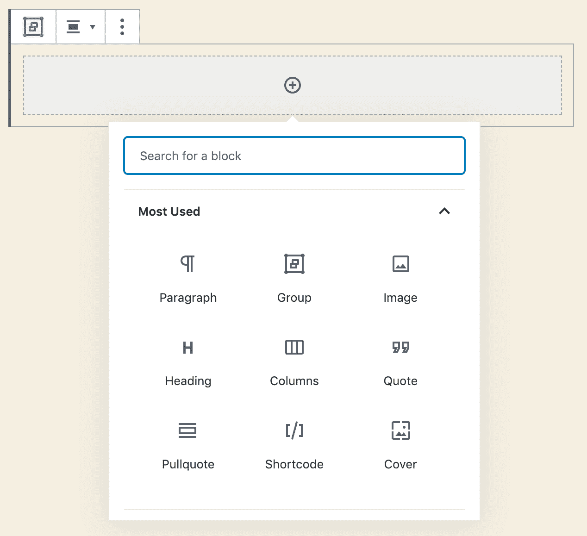

An empty Group block in WordPress 5.3


#### 2.通过组交互对块进行分组

您现在可以通过“分组”交互创建**分组块，这意味着您可以[选择多个块](https://make.wordpress.org/core/2019/06/12/whats-new-in-gutenberg-12th-june/)并且[只需点击几次](https://github.com/WordPress/gutenberg/pull/14908)就可以将它们分组。您只需将所有需要的块添加到选择中，然后点击省略号菜单中的**组**。搞定了。**

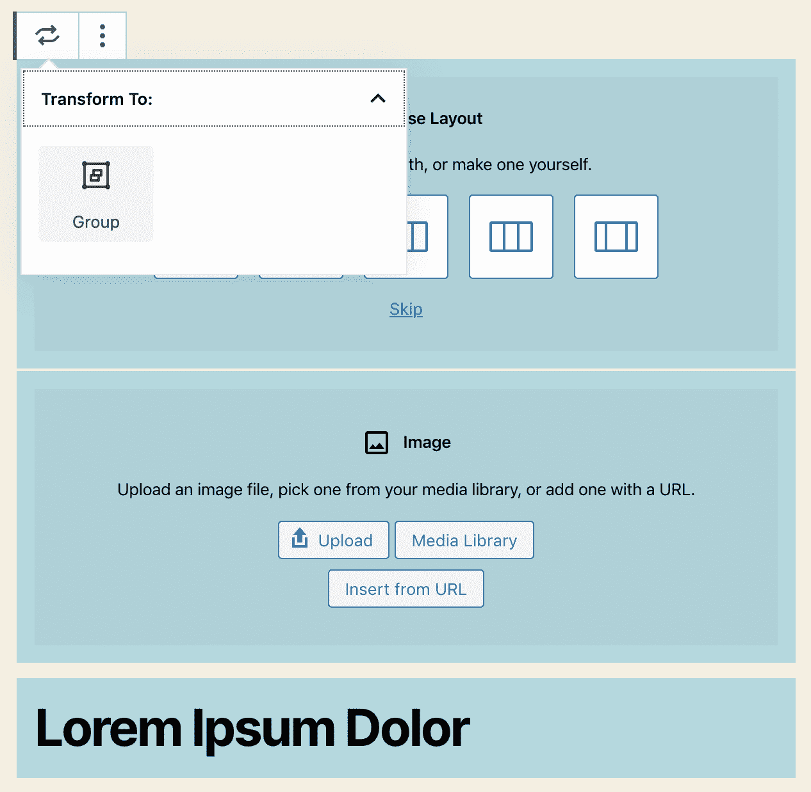

Creating blocks by group interaction


#### 3.自定义宽度列

**Columns 块**现在支持块设置中的[滑动控件](https://make.wordpress.org/core/2019/05/15/whats-new-in-gutenberg-15th-may/)，允许您为每列设置自定义宽度(在未来的版本中，我们可能会对 Columns 块进行进一步的改进，引入了[可拖动调整大小控件](https://github.com/WordPress/gutenberg/issues/15659))。

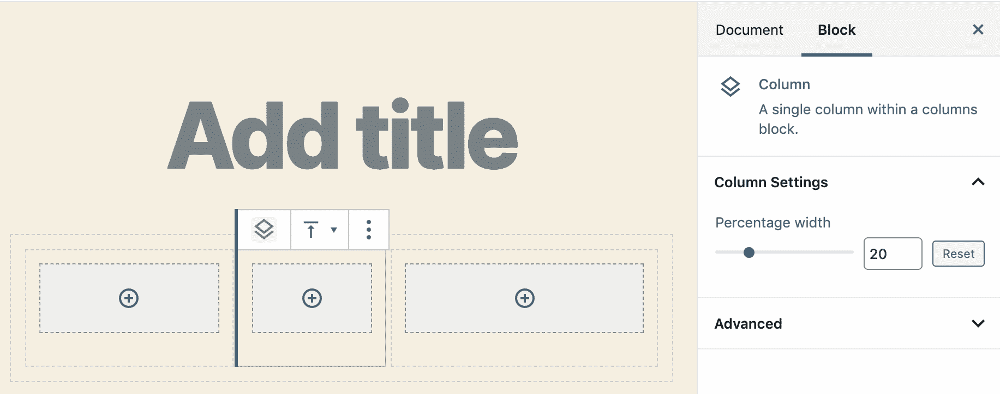

WordPress 5.3 中的栏目块


#### 4.用于列块的布局选择器

对 WordPress 5.3 中的**列块**的另一个改进是**布局选择器**。Gutenberg 6.0 的编辑器[中增加了这一功能，允许用户从几个预定义的布局(模式)中进行选择，或者跳到默认布局，稍微加快了编辑过程，并使不太懂技术的用户更容易使用该模块。](https://make.wordpress.org/core/2019/06/26/whats-new-in-gutenberg-26th-june/)

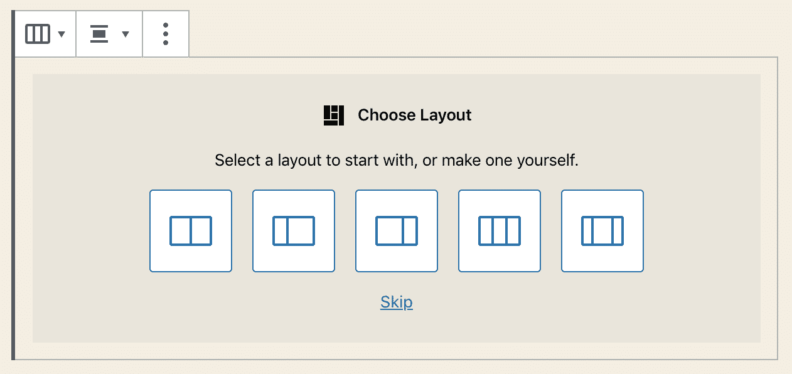

The Columns block layout picker


布局选择器是**块模式 API** 的一个实现，它提供了一种在添加块时从一组预定义选项中进行选择的方法。除了列块，我们还可以在表块和盖块中找到块模式的例子。你可以在 GitHub 上阅读更多关于[块模式 API 的内容。](https://github.com/WordPress/gutenberg/issues/16283)

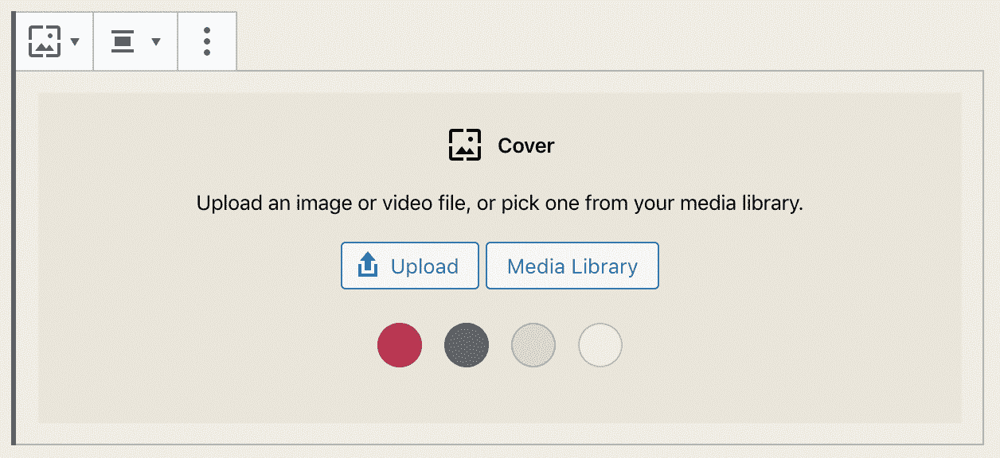

The Cover block pattern


#### 5.表块改进

**台块**被[增强了几个新特性](https://make.wordpress.org/core/2019/08/14/whats-new-in-gutenberg-14-august/)。它现在支持列中的文本对齐、表格页眉和页脚以及背景颜色。

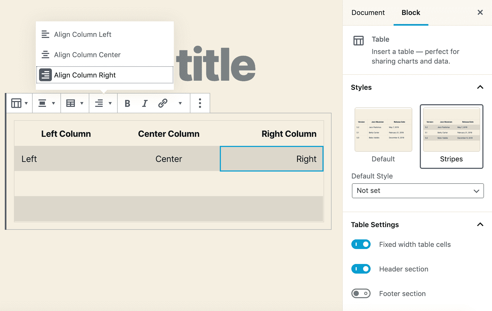

The new Table block supports text alignments, header and footer, and background colors


#### 6.块导航模式

[古腾堡 6.3](https://make.wordpress.org/core/2019/08/14/whats-new-in-gutenberg-14-august/) 引入了**导航模式**使用`Tab`或箭头键在块之间导航，而无需进入块内容。用户可以通过点击`Enter`或`Esc`从导航模式切换到编辑模式，然后再切换回来。这个特性在可用性方面是一个很大的改进，尤其是在屏幕阅读器方面。


#### 7.增加了阻止改变和重新排列的动作

可用性的另一个[改进来自于**引入动作**来阻止更改、创建、删除和重新排序。](https://make.wordpress.org/core/2019/07/10/whats-new-in-gutenberg-10-july/) [Matías Ventura 解释了](https://make.wordpress.org/core/2019/07/10/whats-new-in-gutenberg-10-july/)这一特性的相关原因:

> 考虑一个包含一组项目的**列表的情况:移动、重新排序等操作不仅影响被操作的单个项目，还影响集合的其他项目，尤其是与它“交换位置”的项目。现实告诉我们，为了把一个东西放在另一个东西的位置上，两个东西都必须移动。通过立即改变顺序，整个组的整体状态的变化可能更难把握。重新定位需要一点时间。转换和基于手势的交互通常有助于以某种方式连接这两种状态，使得交互(“刚刚发生了什么”)更容易理解。**

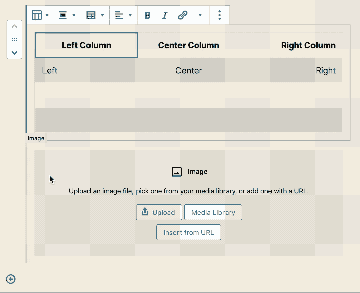

Block motion


#### 8.画廊块中的内嵌图像重新排序

**画廊区块**已经通过[内嵌图像重新排序](https://make.wordpress.org/core/2019/05/29/whats-new-in-gutenberg-29th-may/)得到增强。我们现在只需点击**向前移动图像**和**向后移动图像**按钮，就可以重新排列图库中的图像，而无需打开媒体模式屏幕。


The improved Gallery block


#### 9.最新帖子中的改进块

**最新帖子区块**现在支持摘录和[帖子内容迭代](https://kinsta.com/blog/wordpress-slider/)(参见 [pull #14627](https://github.com/WordPress/gutenberg/pull/14627) )。

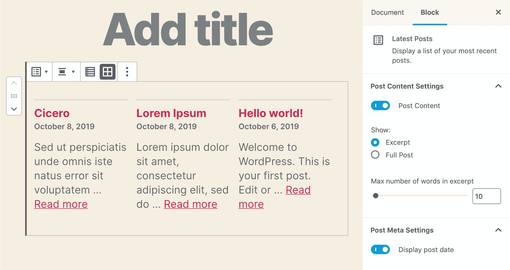

The Latest Posts widget supports excerpt and post content


block settings 面板现在包含一个用户可以打开/关闭帖子内容的部分。如果**帖子内容**处于活动状态，您可以选择**摘录**和**全文**选项。最后，如果勾选了**摘录**，滑块允许你控制摘录长度。

这最后一个变化是一个更广泛的战略的一部分，该战略侧重于整体 UI 增强。在“最新帖子”块的[迭代中，Mel Choyce 声明:](https://github.com/WordPress/gutenberg/issues/1594)

> 为了准备在 Gutenberg 中使用页面模板，我们需要一组健壮的动态块，可以放到任何帖子或页面中。扩展这个块将使我们在将来处理更复杂的动态或全局块时处于更有利的位置。
> 
> 用户不必知道如何编写自定义查询，也不必理解在主页上添加文章的循环。“最近的帖子”是一个很好的开始，但是要成为一个功能完善的解决方案，它需要支持的不仅仅是标题和发布日期。

#### 10.列出块增强功能

**列表块**现在支持排序列表的缩进/突出快捷键、起始值和逆序支持。

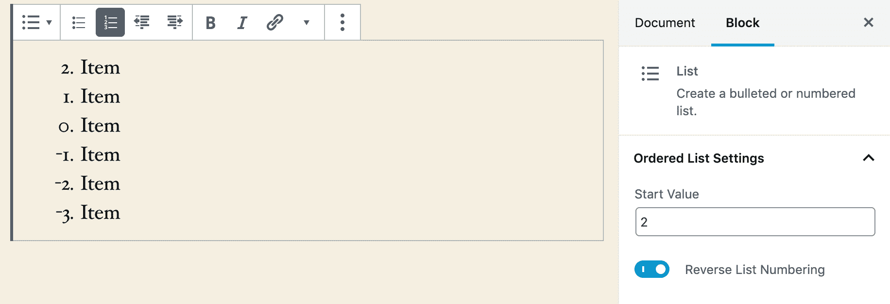

Ordered list settings in List block


#### 对块编辑器的其他改进

由于大量的古腾堡插件版本合并到核心中，有大量的变化，改进和错误修复，我们甚至不能在这里提到。一些额外的增强和新功能包括:

*   列块现在支持垂直对齐( [Gutenberg 5.4](https://make.wordpress.org/core/2019/04/03/whats-new-in-gutenberg-3rd-april/) )。
*   媒体和文本块现在支持垂直对齐( [Gutenberg 5.5](https://make.wordpress.org/core/2019/04/17/whats-new-in-gutenberg-17th-april/) )。
*   按钮块现在支持一个链接目标选项([古腾堡 6.2](https://make.wordpress.org/core/2019/07/31/whats-new-in-gutenberg-31-july/) )。
*   分隔块现在支持边框颜色([古腾堡 6.3](https://make.wordpress.org/core/2019/08/14/whats-new-in-gutenberg-14-august/) )。
*   封面块现在可以调整大小([古腾堡 6.4](https://make.wordpress.org/core/2019/08/28/whats-new-in-gutenberg-28-august/) )。
*   改进的打字机体验，尤其是在移动设备(古腾堡 6.4)上有用的[。](https://github.com/WordPress/gutenberg/pull/16460)
*   图像块现在有了一个[圆形裁剪变化](https://github.com/WordPress/gutenberg/pull/16475)(古腾堡 6.4)。
*   添加了一个全新的社交链接模块([古腾堡 6.5](https://make.wordpress.org/core/2019/09/19/whats-new-in-gutenberg-18-september/) )。
*   画廊块现在支持[画廊标题](https://github.com/WordPress/gutenberg/pull/17101)(古腾堡 6.5)。

### 主题开发者和设计者感兴趣的特性

WordPress 5.3 为主题开发者和设计者增加了许多功能和改进。

三个主要的变化涉及主题设计者，并且与几个块的 CSS 和 HTML 相关。

#### 1.组块内部容器

组块现在包含一个[内部容器](https://make.wordpress.org/core/2019/09/27/block-editor-theme-related-updates-in-wordpress-5-3/) ( `wp-block-group__inner-container`)，如果不仔细设计，它可能会扩展到主块容器之外。这可能会对页面的外观产生意想不到的影响。

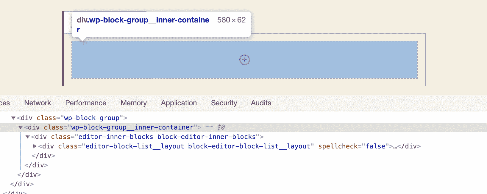

Group block inner container in the Block Editor


因此，对于支持宽和全对齐样式的主题，块容器可能需要一些额外的 CSS 来使其按预期显示。

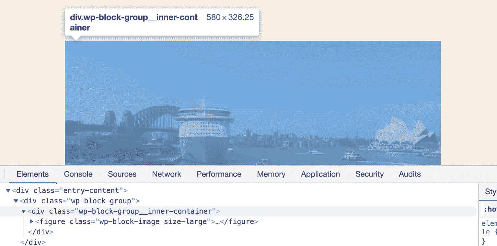

Group block inner container on the front site


这里有一个来自 [Make WordPress 核心博客](https://make.wordpress.org/core/2019/09/27/block-editor-theme-related-updates-in-wordpress-5-3/)的例子，展示了如何设计块的样式来防止这种问题:

```
// Apply entry-content styles to the group block’s inner container as well. 
.entry-content,
.wp-block-group__inner-container {
	width: 60vw;
	margin: 0 auto;
}

// When a group block has a wide alignment, make sure that its full-width children do not extend beyond the width of the container. 
.alignwide,
.wp-block-group.alignwide .alignfull {
	margin-left: -10vw;
	width: 80vw;
}

.alignfull {
	margin-left: -20vw;
	width: 100vw;
}

// Ensure wide and full-width children do not extend beyond the width of a standard-aligned Group block.
.wp-block-group:not(.alignwide):not(.alignfull) * {
	max-width: 100%;
	margin-left: 0;
}
```

#### 2.文本对齐的新类名

在 WordPress 5.3 之前，内嵌样式用于改变文本块的对齐方式(标题、段落、引用和诗句)。

内联样式的高度特异性使得定制这些块的外观变得困难。但是主题设计者现在可以[利用三个新的 CSS 类](https://make.wordpress.org/core/2019/09/27/block-editor-theme-related-updates-in-wordpress-5-3/)取代内联样式:

*   `has-text-align-right`
*   `has-text-align-center`
*   `has-text-align-left`

一旦帖子在块编辑器中打开并保存，现有块将被自动转换并应用类。

#### 3.图库块和表格块标记更新

图库和表格块现在被包装在`figure`元素中。元素样式会相应改变，主题会受到影响，可能需要更新。以下是表格块的新标记:

```

	<table class="">
		<tbody>
			<tr>
				<td>Left</td>
				<td>Center</td>
				<td>Right</td>
			</tr>
		</tbody>
	</table>

```

在 [Make WordPress Core](https://make.wordpress.org/core/2019/09/27/block-editor-theme-related-updates-in-wordpress-5-3/) 博客上可以看到更多关于类名和主题相关变化的细节。

### 面向块开发人员的功能

WordPress 5.3 为 Block APIs 带来了改变和改进。

#### 1.注册和取消注册块样式

在 5.3 之前，开发者和设计者必须写一些 JavaScript 来[注册/取消注册样式](https://developer.wordpress.org/block-editor/developers/filters/block-filters/#block-style-variations)。

随着 WordPress 5.3 的发布，我们现在可以利用两个新的[助手函数](https://developer.wordpress.org/block-editor/developers/filters/block-filters/#server-side-registration-helper)，允许通过 PHP 注册和注销块样式:`register_block_style`和`unregister_block_style`。

`register_block_style`函数为指定块注册一个新样式。该函数保留两个参数:

*   块的名称。
*   样式属性的数组。

该数组可以包括以下参数:

*   `name`:(必选)样式的唯一标识符。
*   `label`:(必选)人类可读标签。
*   `inline_style`:(可选)为样式注册 CSS 类的 CSS 代码。
*   (可选)一个已经注册的样式的句柄(样式句柄在需要的地方将样式排队)。

我们可以用类似下面的代码注册内联样式:

```
add_action( 'init', 'register_custom_block_style' ); 

function register_custom_block_style() {
	if( ! function_exists( 'register_block_style' ) ) return;

	register_block_style(
		'core/quote',
		array(
			'name'			=> 'blue-quote',
			'label'			=> __( 'Blue Quote' ),
			'inline_style'	=> '.wp-block-quote.is-style-blue-quote { color: blue; }',
		)
	);
};
```

新的样式现在可以在**样式**设置部分获得。

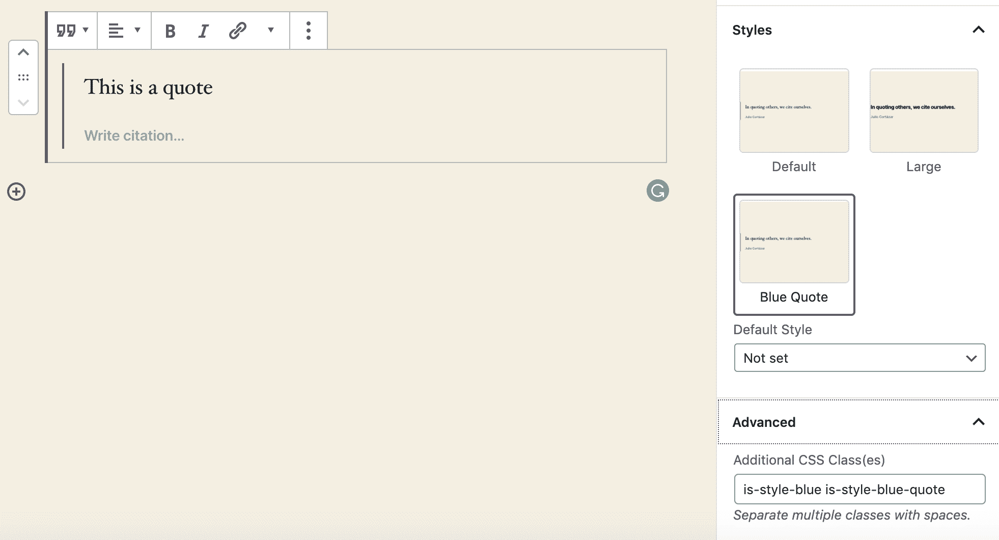

A quote with a custom style in the Block Editor


我们可以传递一个句柄给先前注册的样式，而不是注册一个内联样式:

```
wp_register_style( 'custom-style', get_template_directory_uri() . '/custom-style.css' );

register_block_style(
	'core/quote',
	array(
		'name'			=> 'custom-quote',
		'label'			=> 'Custom Quote',
		'style_handle'	=> 'custom-style',
	)
);
```

下图显示了上例中注册的蓝色报价。

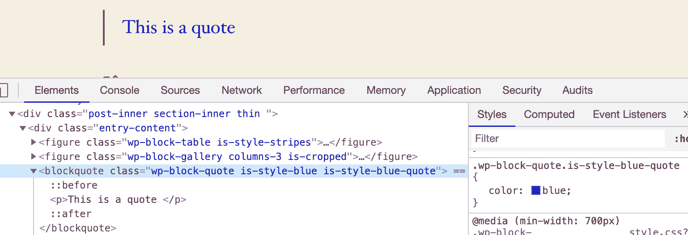

A quote with a custom style on the front end


要用`register_block_style`取消之前在服务器上注册的样式，我们可以使用函数`unregister_block_style`。


### 信息

该函数不适用于使用客户端代码注册的样式。


我们可以如下使用`unregister_block_style`:

```
unregister_block_style( 'core/quote', 'custom-quote' );
```

#### 2.块示例 API

WordPress 5.3 增加了一个新的 JS 属性，允许[在添加到内容之前预览从库中选择的块](https://make.wordpress.org/core/2019/09/24/new-block-apis-in-wordpress-5-3/)。

我们可以通过在块设置中定义`example`属性来添加对该功能的支持，如下所示:

## 注册订阅时事通讯


### 想知道我们是怎么让流量增长超过 1000%的吗？

加入 20，000 多名获得我们每周时事通讯和内部消息的人的行列吧！

[Subscribe Now](#newsletter)

```
const blockSettings = {
	// ... 

	example: {
		attributes: { 
			content: __( 'Content of the block' )
		},
		innerBlocks: []
	} 
}
registerBlockType( name, settings );
```

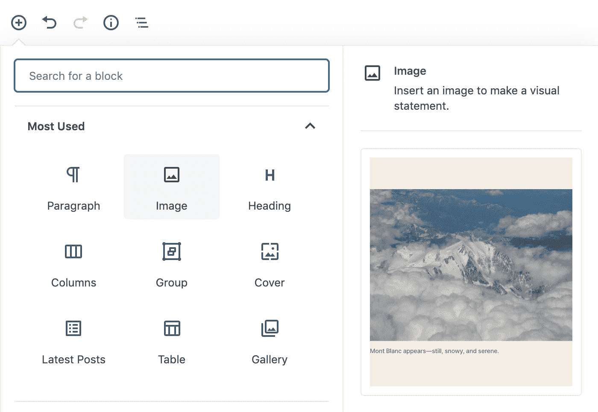

Block Example API


## 站点健康组件的改进

WordPress 5.2 引入了[网站健康工具](https://make.wordpress.org/core/2019/04/25/site-health-check-in-5-2/)来提供关于网站健康的信息，并帮助网站管理员在遇到技术困难时恢复他们的网站。随着 WordPress 5.3 的发布，站点健康工具在组件的两个方面都得到了[一些改进和改变](https://make.wordpress.org/core/2019/09/25/whats-new-in-site-health-for-wordpress-5-3/)。

#### 1.已删除网站健康等级

在 WordPress 5.2 中，网站健康状态页面的顶部会显示一个百分比分数等级。然而，一些人对分数等级表示了一些担忧，认为它模糊不清，令人困惑，因为用户可以针对他们网站的最佳内容获得 100%的分数(详见[这张票](https://core.trac.wordpress.org/ticket/47046))。

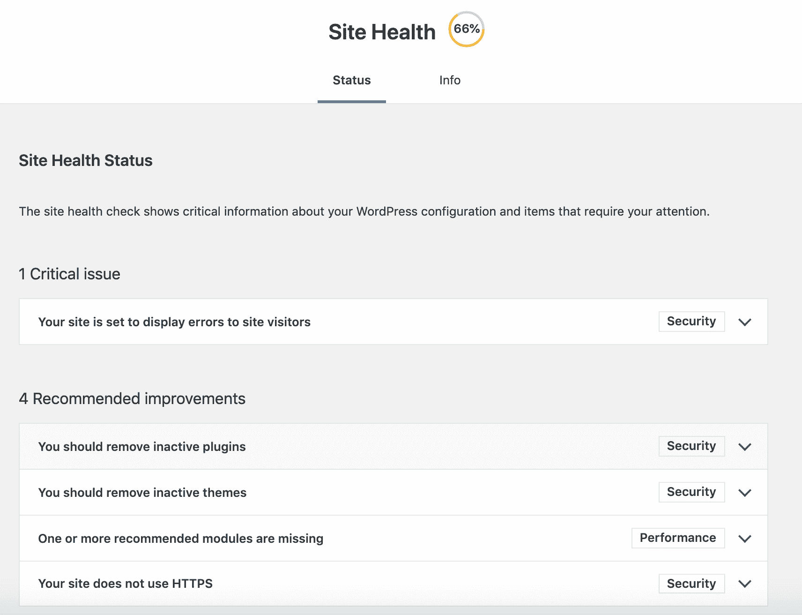

Site Health Status page in WordPress 5.2


该指标显示一个网站通过了多少测试，但不是它的“健康”水平。因此，百分比已被删除，站点健康工具现在显示两种状态之一，这两种状态更像是提醒，而不是网站性能和安全性的精确指标:

*   **应该改进**
*   **好的**

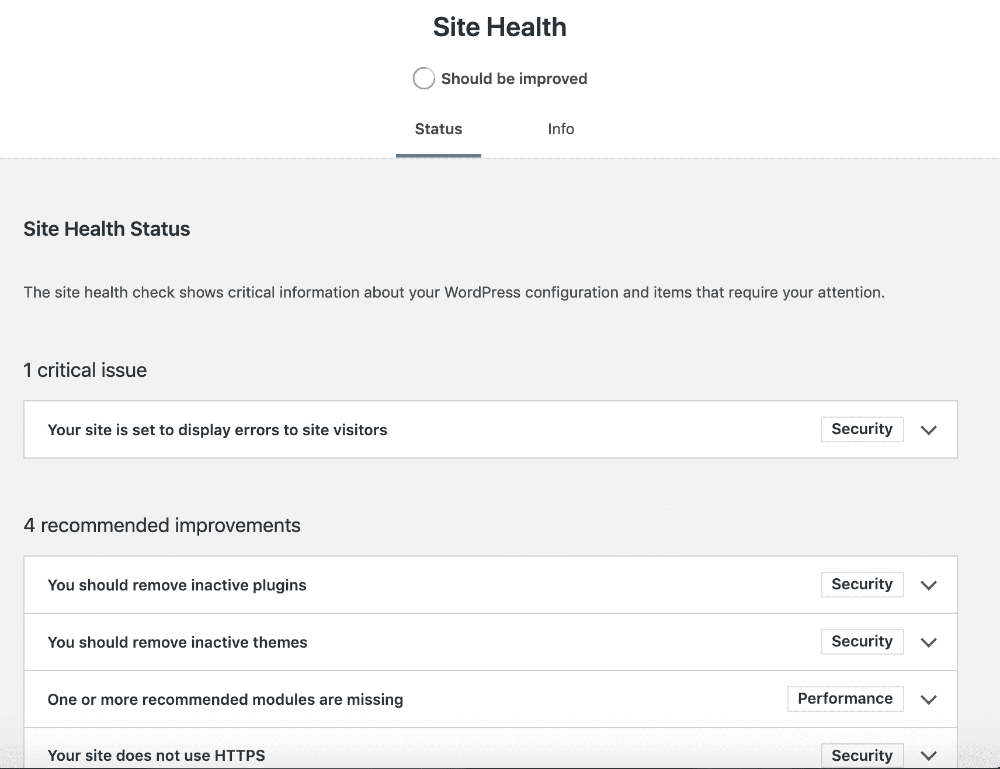

Site Health Status page in WordPress 5.3


#### 2.增强型恢复电子邮件

当故障发生时，WordPress 试图发送一封恢复邮件给站点管理员。不幸的是，这些邮件没有提供有用的调试信息，我们只是被告知我们的网站出了问题。

为了给恢复你的 WordPress 网站提供更多有用的信息，WordPress 5.3 引入了`recovery_email_debug_info`过滤器，这是一个相关的调试信息数组。恢复邮件现在包含了基本信息，这些信息应该可以帮助您排除网站故障，或者至少[从其他人那里获得帮助](https://kinsta.com/blog/wordpress-support/)。

故障电子邮件将包括以以下字符串开头的附加部分:

```
When seeking help with this issue, you may be asked for some of the following information:
```

然后，提供以下信息:

*   WordPress 版本。
*   PHP 版本。
*   当前主题和版本。
*   导致问题的插件的名称和版本。

信息被有意减少到最低限度，以避免最终用户的困惑，但开发者可以在需要时使用`recovery_email_debug_info`过滤器来添加更多细节(更多信息，请参见 [ticket #48090](https://core.trac.wordpress.org/ticket/48090) )。

#### 3.已完成站点运行状况测试的过滤器

新的`site_status_test_result`过滤器允许开发人员过滤已完成状态测试的输出，以扩展测试的结果。

开发人员还可以使用此过滤器来提供附加操作。下面是一个很好的用法示例(参见 [ticket #47864](https://core.trac.wordpress.org/ticket/47864) ):

> 一个例子可能是一个主机提供商，PHP 扩展丢失了，所以他们添加了一个活动链接到他们控制面板的 PHP 扩展管理器。也许他们想要更直接，他们想要 PHP 版本检查，推荐用户更新，他们添加了一个 ajax 按钮，可以当场为他们切换 PHP 版本。

这个过滤器既可以在 PHP 中用于直接测试，也可以作为 JavaScript 实现用于异步测试。

## 管理体验增强

除了站点健康工具之外，WordPress 5.3 还带来了几个管理 UI 的增强，这将大大改善整个 WordPress 仪表盘的整体体验。

#### 1.改进的色彩对比度

**颜色对比得到改善**，许多辅助功能问题得到修复。

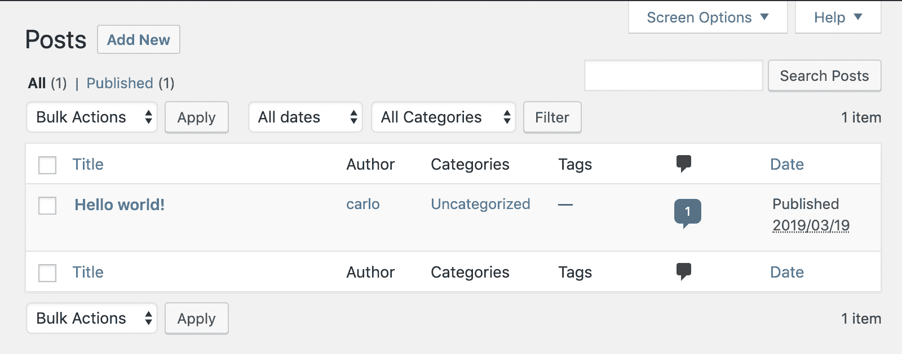

Posts Screen in WordPress 5.2


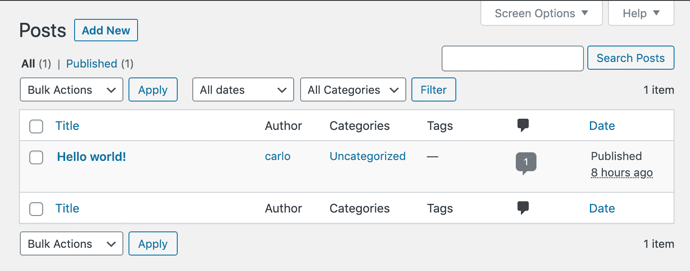

Posts Screen in WordPress 5.3


#### 2.管理员电子邮件验证

管理员电子邮件验证现在会在管理员一段时间没有登录后触发。默认情况下，该间隔设置为六个月，但开发人员可以使用`admin_email_check_interval`过滤器设置不同的间隔(参见门票 [#46349](https://core.trac.wordpress.org/ticket/46349) 和 [#48144](https://core.trac.wordpress.org/ticket/48144) )。

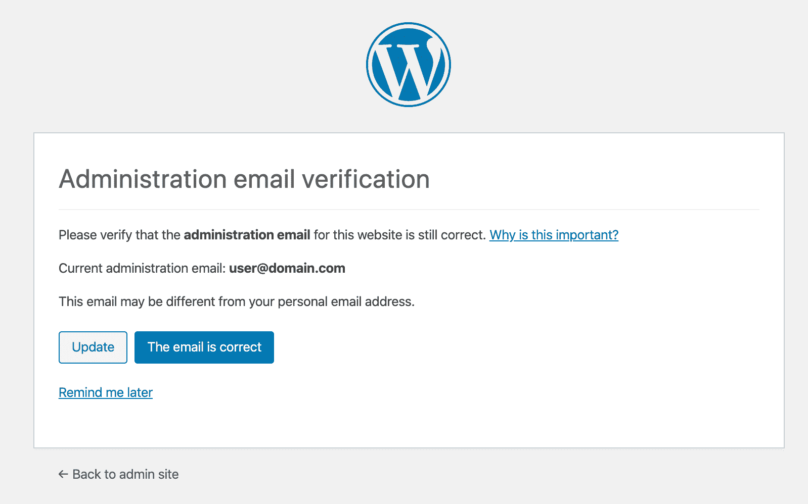

WordPress admin email verification


要禁用管理员电子邮件验证，您可以使用以下过滤器:

`add_filter( 'admin_email_check_interval', '__return_false' );`

厌倦了体验你的 WordPress 网站的问题？通过 Kinsta 获得最好、最快的主机支持！[查看我们的计划](https://kinsta.com/plans/?in-article-cta)

#### 3.继续上传

从智能手机上传大图片不会在过程中中断，因为当上传失败时，WordPress 现在支持恢复上传。

#### 4.图像旋转

**图片现在可以根据 EXIF 方向元数据在上传时正确旋转**。

## 全新的默认主题:Twenty Twenty

WordPress 5.3 自带了一个全新的默认主题: [Twenty Twenty](https://kinsta.com/blog/twenty-twenty-theme/) 。这是一个为**灵活性**、**清晰性**和**可读性**而设计的极简主题，重点是[块编辑器](https://kinsta.com/blog/gutenberg-wordpress-editor/)。

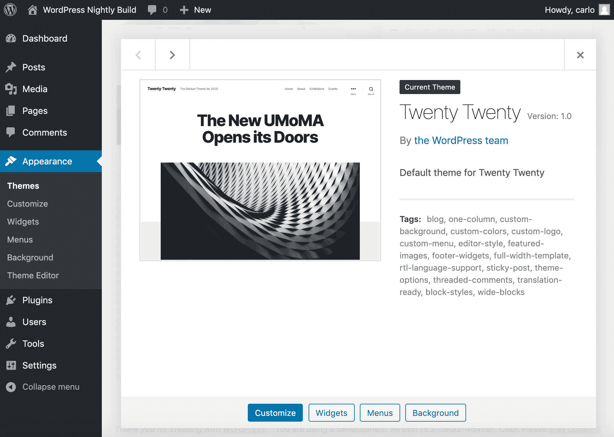

Twenty Twenty WordPress theme


Twenty Twenty 建立在社区现有的免费主题上，由 Andérs Noren 创作的 [Chaplin，并采用了具有强烈个性的免费开源字体:](https://www.andersnoren.se/teman/chaplin-wordpress-theme/)[由 Rasmus Andersson](https://rsms.me/inter/) 创作的 Inter。

你可以在我们深入的博客文章中读到更多关于 Twenty Twenty 的内容: [Twenty Twenty:新的默认 WordPress 主题介绍](https://kinsta.com/blog/twenty-twenty-theme/)。

## WordPress 开发者的变化

WordPress 5.3 为 WordPress 开发者带来了一些变化和改进。在众多变化中，我们认为值得一提的是:

*   [核心部件改进的日期/时间](#date-time)
*   [新咏叹调-当前属性](#aria-current)
*   [新的 aria 标签属性](#aria-label)
*   [向链接中的相关属性添加 UGC 值的函数](#ugc-functions)
*   [WordPress 5.3 中的 REST API](#rest-api)

### 日期/时间核心组件改进

日期/时间核心组件处理与 WordPress 中的日期、时间和时区相关的一切。正如 Andrey“Rarst”Savchenko 解释的那样:

> 日期/时间组件依赖于所谓的“ *WordPress 时间戳*”——Unix 时间戳和时区偏移量的总和。这导致了许多错误和缺乏与上游 PHP 或任何外部系统的互操作性。内联文档错误地将它们称为 Unix 时间戳。

虽然完全删除 WordPress 时间戳而不产生向后兼容性问题是不可能的，但是组件代码已经通过几个错误修复得到了改进，内嵌文档也已经在需要的地方进行了更新和修正。

此外，随着 WordPress 5.3 的[发布，我们可以使用几个](https://make.wordpress.org/core/2019/09/23/date-time-improvements-wp-5-3/)[新的 API 日期/时间函数](https://github.com/Rarst/wp-date/issues/4):

*   `wp_timezone_string()`–此函数以字符串形式检索站点时区。它可能返回 PHP 时区字符串或 HH:MM 偏移量。
*   `wp_timezone()`–该函数将站点时区作为 [`DateTimeZone`](https://www.php.net/manual/en/class.datetimezone.php) 对象进行检索。
*   `wp_date()`–这是日期本地化的新功能。意在取代`date_i18n()`。
*   `current_datetime()`–该函数从设置中检索当前时间为时区的 [`DateTimeImmutable`](https://www.php.net/manual/en/class.datetimeimmutable.php) 对象。
*   `get_post_datetime()`–检索发布时间 [`DateTimeImmutable`](https://www.php.net/manual/en/class.datetimeimmutable.php) 对象。
*   `get_post_timestamp()`–检索作为 Unix 时间戳的发布时间。

所有这些功能都在`wp-includes/functions.php`中定义和记录。

[`current_time()`](https://github.com/WordPress/WordPress-Coding-Standards/issues/1791)`get_post_time()``date_i18n()`的用法现在不提倡。

另请参见 WordPress 5.3 中的[日期/时间组件改进](https://make.wordpress.org/core/2019/09/23/date-time-improvements-wp-5-3/)和 GitHub 上的[API 新增功能](https://github.com/Rarst/wp-date/issues/4)。

### 新 aria-当前属性

当一个新的页面或帖子发布时，它的名称会出现在几个菜单和小部件中。在 WordPress 5.3 之前，许多用户可能没有意识到这个链接，这可能会造成混乱，尤其是对于残疾用户和/或屏幕阅读器用户。

随着 WordPress 5.3 的发布，[一个新的`aria-current="page"`属性被程序化地添加了](https://make.wordpress.org/core/2019/09/23/core-widgets-new-aria-current-attribute-in-wordpress-5-3/)来指出指向同一个页面的链接，主题开发者被鼓励为那些链接添加特定的样式。此更改会影响以下核心小部件:

*   最近的帖子。
*   导航菜单。
*   页数。
*   类别。
*   档案。

下面是一个用法示例:

```
a[aria-current] {
	/* CSS styles for current link */
}
```

### 导航菜单中新的 aria 标签属性

"[地标](https://www.w3.org/TR/wai-aria-practices/examples/landmarks/)提供了一种强大的方式来识别网页的组织和结构"，并允许主题开发者使用地标角色在网页中添加对键盘导航的支持。

ARIA 地标为网络内容提供了一个环境，对辅助技术用户尤其有用。

由于 ARIA 地标对于可访问性的重要性，WordPress 5.3 现在在帖子和评论导航中增加了对`aria-label`属性的支持。

主题开发者和设计者可以将 ARIA 地标添加到帖子和评论导航菜单中，为以下功能添加新的`aria_label`参数:

*   `_navigation_markup()`
*   `get_the_post_navigation()`
*   `get_the_posts_navigation()`
*   `get_the_posts_pagination()`
*   `get_the_comments_navigation()`
*   `get_the_comments_pagination()`
*   `the_post_navigation()`
*   `the_posts_navigation()`
*   `the_posts_pagination()`
*   `the_comments_navigation()`
*   `the_comments_pagination()`

在 Make WordPress Core 上的文章和评论导航中阅读更多关于 aria-label 属性的信息。

### 向链接中的 rel 属性添加 UGC 值的函数

回到 2019 年 9 月，[谷歌宣布了两个新属性](https://webmasters.googleblog.com/2019/09/evolving-nofollow-new-ways-to-identify.html)，提供了一种识别链接性质的方法:`rel="sponsored"`和`rel="ugc":`

> **rel="ugc"** : ugc 代表用户生成内容，UGC 属性值推荐给用户生成内容内的链接，如评论、论坛帖子等。

WordPress 5.3 增加了对评论中`rel="ugc"`属性的支持。这一改变已经在几个小时内实现了，有趣的是看到开发团队对谷歌声明的反应有多快(见[罚单#48022](https://core.trac.wordpress.org/ticket/48022) )。

此外， [WordPress 5.3 引入了两个新功能](https://make.wordpress.org/core/2019/10/03/wp-5-3-introduces-new-functions-to-add-ugc-attribute-to-links-and-implements-it-to-comments/)，允许开发者在链接的`rel`属性中添加`nofollow`和`ugc`值:

*   `wp_rel_callback()`用于将值添加到指定链接的`rel`属性中，并取代现在已被弃用的`wp_rel_nofollow_callback()`函数。
    该功能在`wp-includes/formatting.php` :

    ```
    /**
    	 * Callback to add a rel attribute to HTML A element.
    	 *
    	 * Will remove already existing string before adding to prevent invalidating (X)HTML.
    	 *
    	 * @since 5.3.0
    	 *
    	 * @param array  $matches Single match.
    	 * @param string $rel     The rel attribute to add.
    	 * @return string HTML A element with the added rel attribute.
    	 */
    	function wp_rel_callback( $matches, $rel ) {}
    ```

    中定义
*   `wp_rel_ugc()`将`nofollow`和`ugc`值添加到链接的`rel`属性中。
    该功能在`wp-includes/formatting.php` :

    ```
    /**
    		 * Adds `rel="nofollow ugc"` string to all HTML A elements in content.
    		 *
    		 * @since 5.3.0
    		 *
    		 * @param string $text Content that may contain HTML A elements.
    		 * @return string Converted content.
    		 */
    		function wp_rel_ugc( $text ) {
    			// This is a pre-save filter, so text is already escaped.
    			$text = stripslashes( $text );
    			$text = preg_replace_callback(
    				'|<a>|i',
    				function( $matches ) {
    					return wp_rel_callback( $matches, 'nofollow ugc' );
    				},
    				$text
    			);
    			return wp_slash( $text );
    		}
    ```

    中定义

所以，从现在开始，开发者可以给链接添加`rel="nofollow ugc"`属性，如下所示:

```
$link = '<a href="example.com">User generated link example</a>';
$ugc_link = wp_rel_ugc( $link );
echo $ugc_link;
// output: <a href="example.com" rel="nofollow ugc">User generated link example</a>
```

### WordPress 5.3 中的 REST API

WordPress 5.3 为 REST API 带来了几个[的变化和改进。](https://make.wordpress.org/core/2019/10/16/the-rest-api-in-wordpress-5-3/)

最相关的变化之一是对[`register_meta`](https://developer.wordpress.org/reference/functions/register_meta/)函数的`'object'`和`'array'`数据类型的支持。

有了这个增强，REST API 现在本机支持复杂的元数据类型。这使我们能够使用 API 来执行基于模式的验证，并可以简化客户端代码与复杂值的交互，最终允许开发人员通过 REST API 创建复杂的基于元的块。

要更深入地了解这个主题，请参见 [WP 5.3 在 REST API 中支持对象和数组元类型](https://make.wordpress.org/core/2019/10/03/wp-5-3-supports-object-and-array-meta-types-in-the-rest-api/)

第二个显著的改进影响了`_fields`参数，该参数允许限制从 REST API 返回的 JSON 对象中包含的字段。请参见以下示例:

```
/wp/v2/posts?_fields=id,title,author
```

[从 WordPress 5.3](https://make.wordpress.org/core/2019/10/10/filtering-nested-rest-response-_fields-in-wp-5-3/) 开始，`_fields`参数可以用来通过嵌套字段过滤 REST API 响应对象，这样我们就可以在一个复杂的对象内要求特定的`meta`字段或属性。我们可以如下使用`_fields`参数:

```
?_fields=meta.meta-key-1,meta.meta-key-2,meta.meta-key-3.nested-prop
```

关于 WordPress 5.3 带来的 REST API 改进的更全面的概述，参见[WordPress 5.3 中的 REST API](https://make.wordpress.org/core/2019/10/16/the-rest-api-in-wordpress-5-3/)。

## 如何更新到 WordPress 5.3

WordPress 5.3 于 2019 年 11 月 12 日**发布。**您可以按照以下说明更新您的网站。

由于每个客户的站点都是不同的，您应该始终利用 Kinsta 提供的[标准暂存环境](https://kinsta.com/help/staging-environment/)(或者如果您的现有暂存环境已经在使用中，则添加一个新的[高级暂存环境](https://kinsta.com/help/premium-staging-environments/))。你可以在几秒钟内克隆你的网站，然后用你现有的主题和插件测试 WordPress 5.3 来检查兼容性。当然，为了安全起见，你也可以在更新你的直播网站之前做一个[手动备份](https://kinsta.com/help/wordpress-backups/)。

要将 WordPress 升级到 5.3，只需点击 WordPress 管理面板上的更新图标。然后点击“立即更新”按钮。当你的网站被更新时，它将处于[维护模式](https://kinsta.com/blog/wordpress-maintenance-mode/)。一旦您的更新完成，您的网站将恢复正常。

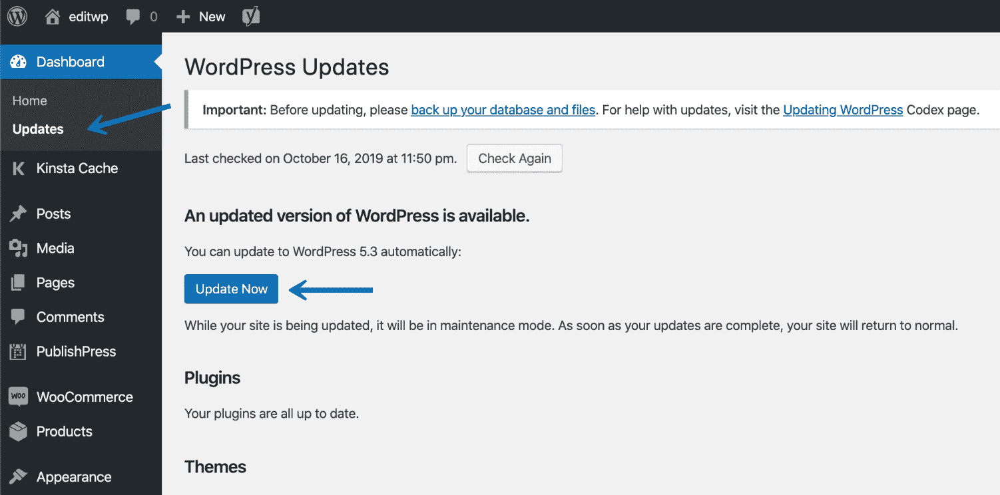

Update to WordPress 5.2 in dashboard


只要更新一切顺利，你就会看到“欢迎使用 WordPress 5.3”屏幕。就是这样！又快又简单。

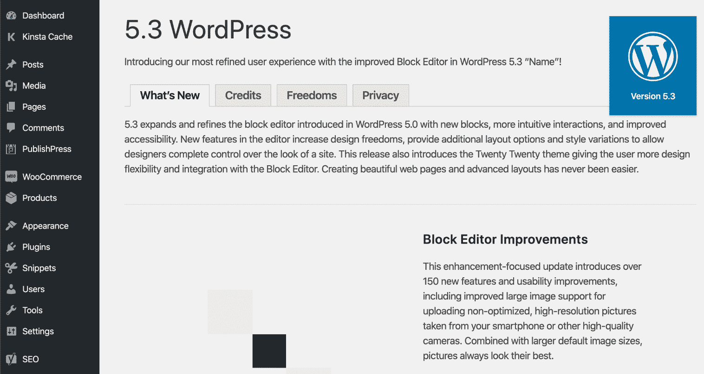

WordPress 5.3 welcome screen


在仪表板中单击后，您还会收到一条消息，提示您将数据库更新到最新版本。只需点击“更新 WordPress 数据库”按钮，你就可以开始了。

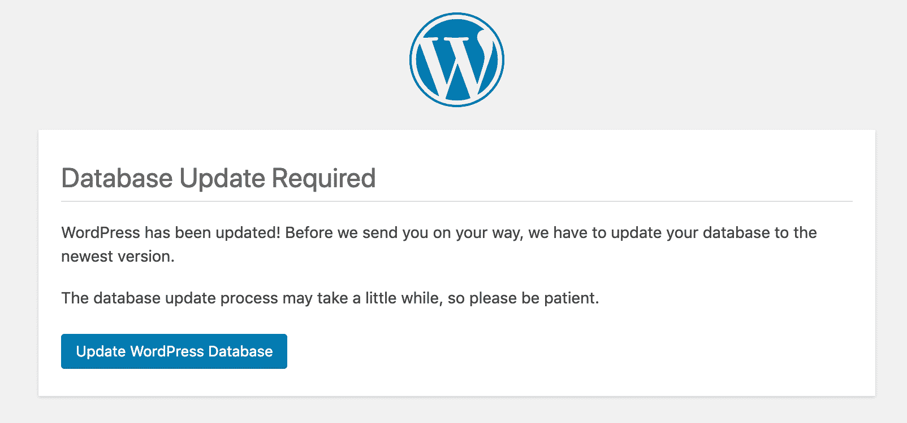

Database update required


### 解决 WordPress 更新的问题

每当人们更新 WordPress 的主要版本时，总有一些会遇到问题，这是由于目前市场上同时存在数以千计的不同插件和主题。以下是解决常见问题的几种方法。

*   您的站点可能仍被部分缓存。你可以通过[清除你的 WordPress 站点上的页面缓存](https://kinsta.com/blog/wordpress-clear-cache/)来解决这个问题。
*   试着停用你所有的插件，看看是否能解决你的问题。然后一个一个地重新激活它们，直到你发现哪个插件可能需要开发者的更新。
*   尝试切换到默认的 WordPress 主题，比如 [Twenty Twenty](https://kinsta.com/blog/twenty-twenty-theme/) 。如果这解决了你的问题，你可能需要联系你的主题开发者。
*   排除和[诊断浏览器中的 JavaScript 问题](https://wordpress.org/support/article/using-your-browser-to-diagnose-javascript-errors/)。

[WordPress 5.3 sets an important milestone in the evolution of the CMS. Check out what's new in our in-depth guide! 🗞💪Click to Tweet](https://twitter.com/intent/tweet?url=https%3A%2F%2Fkinsta.com%2Fblog%2Fwordpress-5-3%2F&via=kinsta&text=WordPress+5.3+sets+an+important+milestone+in+the+evolution+of+the+CMS.+Check+out+what%27s+new+in+our+in-depth+guide%21+%F0%9F%97%9E%F0%9F%92%AA&hashtags=wordpress%2Cwpnews)

## 摘要

我们整理了 WordPress 5.3 中最激动人心的特性和改进。

随着十三个版本的 Gutenberg 插件合并到核心中，对站点健康工具的一些改进，一个全新的默认主题，管理界面的改进，开发者和主题设计者的新功能和特性，对 PHP 7.4 的更好支持，以及令人难以置信的小变化，错误修复和废弃，WordPress 5.3 在 CMS 的发展中树立了一个重要的里程碑。

你最喜欢的功能/改进是什么？我们错过了什么重要的事情吗？在评论区和我们分享你的想法。

* * *

让你所有的[应用程序](https://kinsta.com/application-hosting/)、[数据库](https://kinsta.com/database-hosting/)和 [WordPress 网站](https://kinsta.com/wordpress-hosting/)在线并在一个屋檐下。我们功能丰富的高性能云平台包括:

*   在 MyKinsta 仪表盘中轻松设置和管理
*   24/7 专家支持
*   最好的谷歌云平台硬件和网络，由 Kubernetes 提供最大的可扩展性
*   面向速度和安全性的企业级 Cloudflare 集成
*   全球受众覆盖全球多达 35 个数据中心和 275 多个 pop

在第一个月使用托管的[应用程序或托管](https://kinsta.com/application-hosting/)的[数据库，您可以享受 20 美元的优惠，亲自测试一下。探索我们的](https://kinsta.com/database-hosting/)[计划](https://kinsta.com/plans/)或[与销售人员交谈](https://kinsta.com/contact-us/)以找到最适合您的方式。