# WordPress 5.5 的新特性——对一个(史诗般的)版本的深入探究

> 原文：<https://kinsta.com/blog/wordpress-5-5/>

WordPress 5.5“Eckstine”已经过时了，是时候让我们介绍今年第二次发布的 WordPress 中添加到 Core 中的最显著的变化和特性了。

这些天，我们习惯于在每个 WordPress 版本中看到许多 block 编辑器的增加。WordPress 5.5 也不例外！

这个版本也带来了大量与编辑器无关的变化，这些变化将对我们使用 [CMS](https://kinsta.com/knowledgebase/content-management-system/) 的方式产生巨大影响。


### 信息

我们将举办一场免费的网络研讨会来展示和讨论 WordPress 5.5 的新功能，[请务必参加我们的活动](https://kinsta.com/webinars/wordpress-5-5/)！


虽然 WordPress 5.5 给 WordPress Core 带来了许多变化，但是由于几个未解决的问题，5.5 中期待的几个功能已经被推迟并从这个版本中删除。因此，全站点编辑、导航块、导航屏幕和小工具屏幕不是 WordPress 5.5 的一部分。

如果你想了解更多关于 WordPress 5.5 开发周期的信息，请点击下面的链接:

*   2020 年 7 月 7 日: [Beta 1](https://wordpress.org/news/2020/07/wordpress-5-5-beta-1/)
*   2020 年 7 月 14 日: [Beta 2](https://wordpress.org/news/2020/07/wordpress-5-5-beta-2/)
*   2020 年 7 月 21 日: [Beta 3](https://wordpress.org/news/2020/07/wordpress-5-5-beta-3/)
*   2020 年 7 月 27 日: [Beta 4](https://wordpress.org/news/2020/07/wordpress-5-5-beta-4/)
*   2020 年 7 月 28 日: [RC 1](https://wordpress.org/news/2020/07/wordpress-5-5-release-candidate/)
*   2020 年 8 月 4 日: [RC 2](https://wordpress.org/news/2020/08/wordpress-5-5-release-candidate-2/)
*   2020 年 8 月 10 日:RC 3
*   2020 年 8 月 10 日:WordPress 5.5 发布的试运行
*   2020 年 8 月 11 日:WordPress 5.5 的最终发布

那么，WordPress 5.5 有什么新功能？

[WordPress 5.5 is the second WordPress release of 2020 and we're happy to introduce the most noticeable features added to Core 🥳 Check out what's new in WordPress 5.5 🎁Click to Tweet](https://twitter.com/intent/tweet?url=https%3A%2F%2Fkinsta.com%2Fblog%2Fwordpress-5-5%2F&via=kinsta&text=WordPress+5.5+is+the+second+WordPress+release+of+2020+and+we%27re+happy+to+introduce+the+most+noticeable+features+added+to+Core+%F0%9F%A5%B3+Check+out+what%27s+new+in+WordPress+5.5+%F0%9F%8E%81) ## 块编辑器的新特性

随着 WordPress 5.5 的最终发布，十个版本的 [Gutenberg](https://kinsta.com/blog/gutenberg-wordpress-editor/) 插件被添加到核心中，带来了大量的 UI 改进、功能、增强和错误修复，影响了编辑体验的方方面面，从可用性到功能和性能。


在这里提到所有这些变化几乎是不可能的，所以在这篇文章中，你会发现我们最喜欢的新功能和改进的精选。

关于 WordPress 5.5 中添加到块编辑器的改进和特性的更全面列表，请参见插件版本的官方公告: [7.5](https://make.wordpress.org/core/2020/02/12/whats-new-in-gutenberg-12-february/) 、 [7.6](https://make.wordpress.org/core/2020/02/26/whats-new-in-gutenberg-26-february/) 、 [7.7](https://make.wordpress.org/core/2020/03/11/whats-new-in-gutenberg-11-march/) 、 [7.8](https://make.wordpress.org/core/2020/03/26/whats-new-in-gutenberg-25-march/) 、 [7.9](https://make.wordpress.org/core/2020/04/15/whats-new-in-gutenberg-15-april/) 、 [8.0](https://make.wordpress.org/core/2020/04/29/whats-new-in-gutenberg-29-april/) 、 [8.1](https://make.wordpress.org/core/2020/05/13/whats-new-in-gutenberg-13-may/) 、 [8.2](https://make.wordpress.org/core/2020/05/27/whats-new-in-gutenberg-27-may/) 、[8.3](https://make.wordpress.org/core/2020/06/11/whats-new-in-gutenberg-11-june/)

也就是说，这里我们将介绍 WordPress 5.5 给块编辑器带来的以下附加功能:

1.  [新的 UI 设计](#new-ui-design)
2.  [模块设计工具](#block-design-tools)
3.  [在线图像编辑](#inline-image-editing)
4.  [块类别和新块插入器面板](#block-categories)
5.  [屏蔽目录和屏蔽插件](#block-directory)
6.  [块状图案](#block-patterns)

### 新的用户界面设计

Gutenberg 插件的每个版本都带来了不小的改进，这些改进正在悄悄地改变着整体的编辑体验。许多这些变化现在将被合并到 WordPress 核心中。所以，当你第一次在 WordPress 5.5 中启动块编辑器时，一个稍微不同的界面应该会吸引你的注意。你会发现:

*   简化的块工具栏
*   更强的[色彩对比](https://kinsta.com/blog/website-color-schemes/)
*   新图标
*   街区搬运工
*   周围元素
*   设备预览
*   改进的拖放功能
*   整个用户界面中改进和统一的块焦点样式
*   一次格式化多个块的能力
*   更好的性能

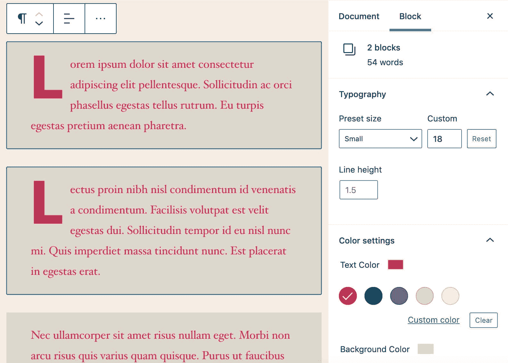

Formatting multiple blocks in WordPress 5.5


上面提到的只是影响编辑体验的许多变化中的几个。


Mobile preview in WordPress 5.5


其他变化还包括:

#### 下标和上标选项

下标和上标文本的格式选项现在可以通过富文本控件使用( [Gutenberg 8.0](https://make.wordpress.org/core/2020/04/29/whats-new-in-gutenberg-29-april/) )。

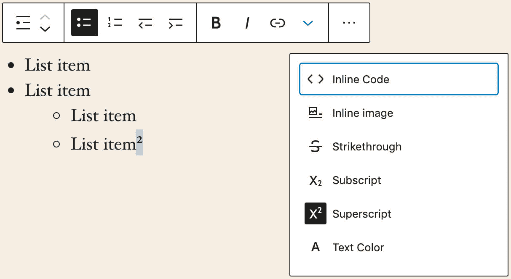

The new block toolbar with redesigned icons, block mover and better color contrast


#### 父块选择

一个全新的工具栏按钮现在显示出来时，悬停在左侧的块工具栏。新按钮允许在嵌套上下文中选择父块([古腾堡 8.3](https://make.wordpress.org/core/2020/06/11/whats-new-in-gutenberg-11-june/) )。

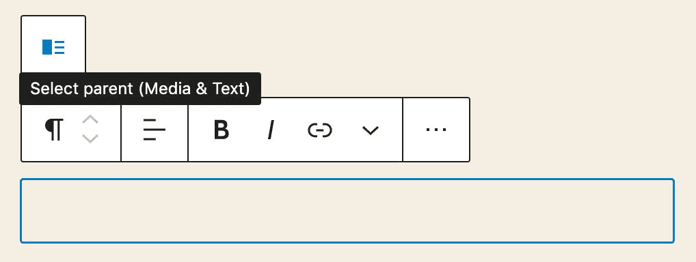

The parent selector in a Media & Text block


### 块设计工具

几个设计工具已经在过去的几个月中被添加到 Gutenberg 插件中，现在将被包含在 WordPress 5.5 的核心中。

#### 高度控制和背景渐变

第一组工具提供了对几个块的尺寸和背景颜色的控制( [Gutenberg 7.9](https://make.wordpress.org/core/2020/04/15/whats-new-in-gutenberg-15-april/) )。

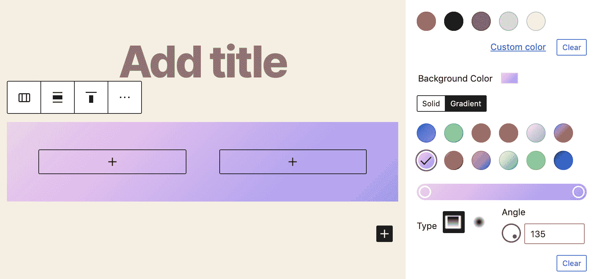

Background gradient settings for the Columns block


#### 填充和链接颜色控件

两个额外的功能已经登陆核心( [Gutenberg 8.3](https://make.wordpress.org/core/2020/06/11/whats-new-in-gutenberg-11-june/) )，但在撰写本文时，它们仍处于实验阶段:

*   封面块的填充控件。
*   段落、标题、组、列和媒体&文本块的链接颜色控制。

默认情况下，填充控制和链接颜色控制是关闭的，开发者必须明确声明对它们的支持，正如[在块编辑器手册](https://developer.wordpress.org/block-editor/developers/themes/theme-support/)中解释的那样。

如果您想为主题添加封面块的填充控件，只需将下面一行添加到您的[主题的 functions.php](https://kinsta.com/blog/wordpress-child-theme/#the-functions-file):

```
add_theme_support( 'experimental-custom-spacing' );
```

如果您想为段落、标题、组、列和媒体&文本块启用链接颜色控制，只需将下面一行添加到主题的函数文件中:

```
add_theme_support( 'experimental-link-color' );
```

#### 自定义单位和自定义行高

此新功能允许您设置盖块的`px`、`em`、`rem`、`vw`和`vh`高度值([古腾堡 7.9](https://make.wordpress.org/core/2020/04/15/whats-new-in-gutenberg-15-april/) )。`%`也受支持，但由于百分比高度的呈现不可预测，所以省略了它。

通过[增强的高度控制](https://github.com/WordPress/gutenberg/pull/20888)，按住`Shift`的同时按下`up`或`down`可以跳跃 10 个数值。

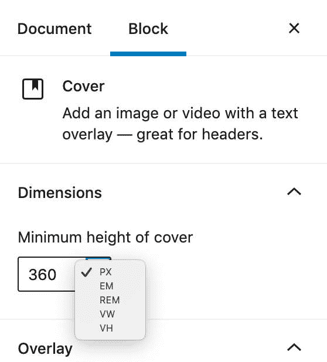

The new Unit Control


开发者可以通过定义`custom-units`支持标志来添加[对定制单元](https://make.wordpress.org/core/2020/07/27/new-block-tools-on-wordpress-5-5/)的支持:

```
add_theme_support( 'custom-units' );
```

您还可以设置特定的自定义单位:

```
add_theme_support( 'custom-units', 'rem', 'em' );
```

开发人员还可以通过定义`custom-line-height`支持标志来为标题和段落添加自定义行高:

```
add_theme_support( 'custom-line-height' );
```

### 嵌入式图像编辑

一个新的编辑功能被添加到块编辑器中，古腾堡 8.4 允许用户直接从图像块中编辑 T2 图像。

现在它已经被合并到 core，从 WordPress 5.5 开始，你可以裁剪、旋转、缩放和调整图像位置，而不需要启动[媒体库](https://kinsta.com/blog/wordpress-media-library/)，从而带来更快的编辑体验。

如果你曾经[发布大量照片](https://kinsta.com/blog/wordpress-photo-gallery-plugins/)，毫无疑问你会喜欢这个功能。

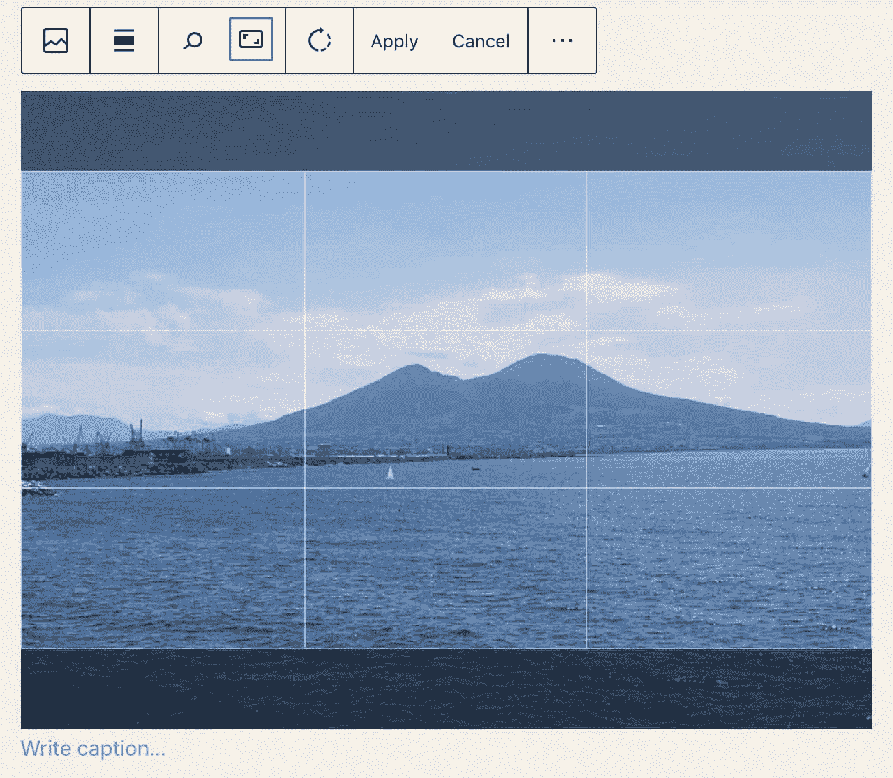

Inline image editing in WordPress 5.5


只需点击图像工具栏中的裁剪按钮，您就可以使用新的编辑功能。当您对您的定制满意时，应用您的更改，您就完成了。

WordPress 将[在媒体库中保存一张新图片作为附件](https://make.wordpress.org/core/2020/07/20/editing-images-in-the-block-editor/),并从原始图片中复制细节(标题、描述、说明、替代文本和 EXIF 数据)。这使您可以完全控制新的图像版本。

### 块类别和新块逆变器面板

重新设计的块插入器面板按类别显示块和图案，显著改善了编辑体验，使块和图案更容易找到([古腾堡 8.3](https://make.wordpress.org/core/2020/06/11/whats-new-in-gutenberg-11-june/) )。

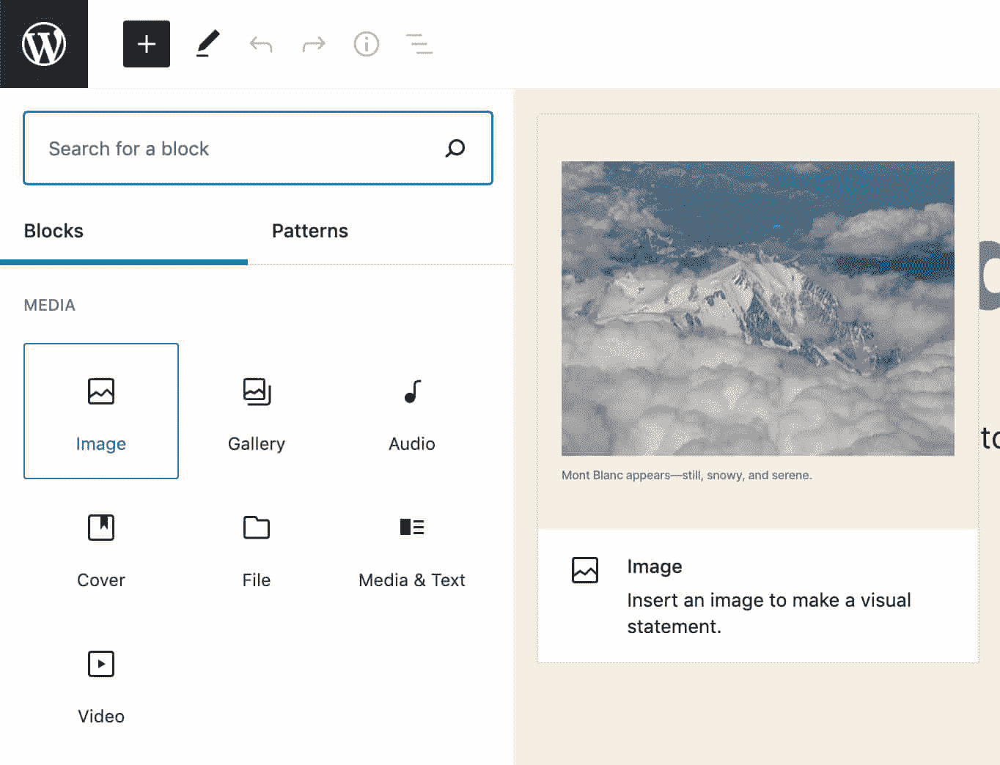

Blocks and Patterns tabs in the new block inserter


### 阻止目录和阻止插件

通过实现[块目录](https://wordpress.org/plugins/browse/block/)，您可以直接从块插入器中查找、安装和添加第三方块。

当你搜索一个模块时，如果你还没有安装，你会被提示[一个在插件目录](https://make.wordpress.org/core/2020/06/24/whats-new-in-gutenberg-24-june/)中可用的插件列表。这些插件被称为“阻止插件”，你可以通过点击将它们添加到你的编辑器中。

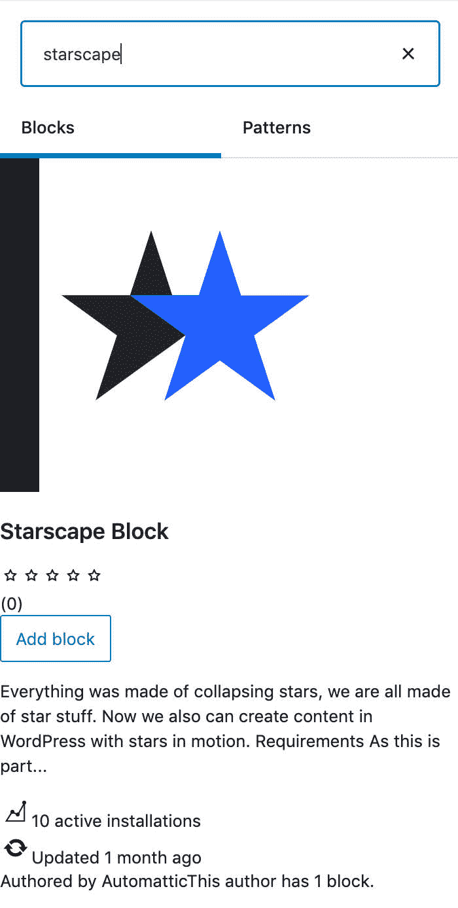

A third-party block from the WordPress Community


多亏了这个令人敬畏的新功能，你现在可以构建自己的模块，并[将它们发布到插件目录](https://kinsta.com/blog/publish-plugin-wordpress-plugin-directory/)，使你的作品对整个 [WordPress 社区](https://kinsta.com/learn/wordpress-communities/)可用。

好消息是，要创建你的定制块，你不需要成为一个 PHP 大师。你只需要一些 JavaScript 的工作知识。

不知道如何开始开发自己的积木？令人敬畏的 WordPress 社区为你提供了一个[简单的逐步教程](https://developer.wordpress.org/block-editor/tutorials/block-tutorial/)。

块教程的第一个版本已经在官方的块编辑器手册中提供，以帮助您学习块开发的基础知识。你可以在 Make WordPress Plugins 博客上阅读更多关于 [block 目录和 block 插件开发](https://make.wordpress.org/plugins/2020/07/11/you-can-now-add-your-own-plugins-to-the-block-directory/)的内容。

### 块状图案

回到 2020 年 3 月，[古腾堡 7.7](https://make.wordpress.org/core/2020/03/11/whats-new-in-gutenberg-11-march/) 和[古腾堡 7.8](https://make.wordpress.org/core/2020/03/26/whats-new-in-gutenberg-25-march/) 推出了块模式和用于[主题](https://kinsta.com/best-wordpress-themes/)和[插件](https://kinsta.com/best-wordpress-plugins/)的[块模式 API](https://github.com/WordPress/gutenberg/pull/21074) 。

块模式是预定义的块布局，允许用户快速将嵌套块的复杂结构添加到他们的页面中。他们的目的是帮助[内容作者](https://kinsta.com/learn/content-marketing/)和网站管理员克服“空白页综合症”,轻松构建专业布局和高级视图。

我们应该在全站点编辑中看到块模式的最佳状态。

古腾堡项目的首席建筑师 Mathias Ventura 清楚地解释了什么是块模式。

> 有一点需要澄清——“块模式”设置与模板部件(在结构上有意义)关系不大，更多的是由较小的块组成的一般设计元素。一旦插入，它们就不会分开存放。例如，一个“封面”图像组合了几个块来实现一个特定的外观，否则用户需要做一些工作来完成。可以把它看作是一个设计的集合，可以添加到任何地方，而不一定代表主题模板的可重用部分。

与模板部件不同，块模式是设计元素，可以帮助网站管理员和内容创建者加快和改善他们的编辑体验。

Gutenberg 7.7 发布时，最初区块模式出现在侧边栏插件中。后来，随着古腾堡 8.0 的[发布，他们进入了一个](https://make.wordpress.org/core/2020/04/29/whats-new-in-gutenberg-29-april/)[改进的块插入器](https://github.com/WordPress/gutenberg/pull/20951)，现在作为一个面板出现在编辑器的左侧，如下图所示:

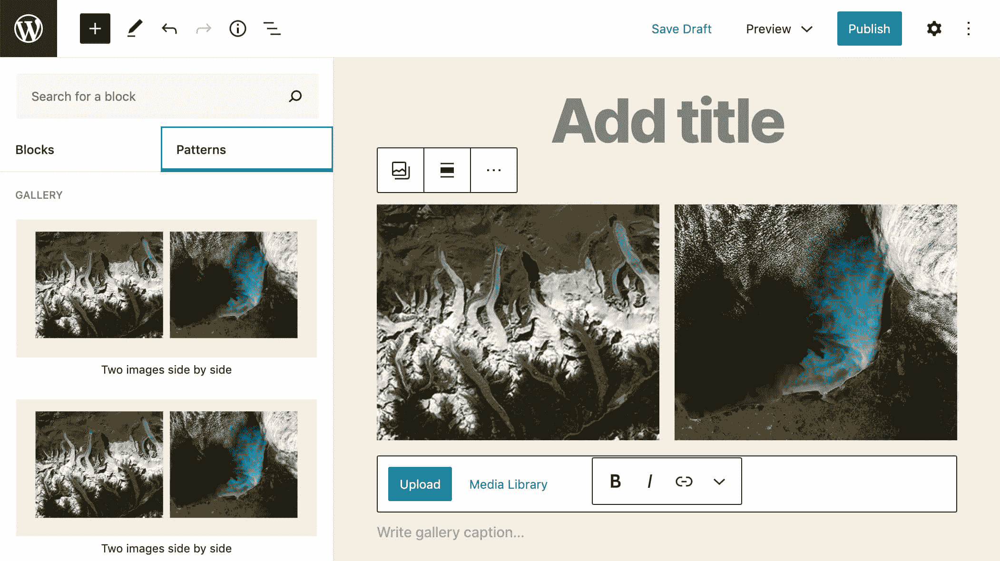

The Gallery Pattern in WordPress 5.5


在早期阶段，块模式只有非常有限的一组模式。无论如何，它们给编辑体验带来了巨大的改进，希望在不久的将来会有更多的改进。

与常规块一样，模式是可搜索的，并按以下类别进行组织:

*   文本
*   海罗（人名）；英雄（电影名）
*   列
*   小跟班
*   走廊
*   特征
*   证明书
*   未分类的

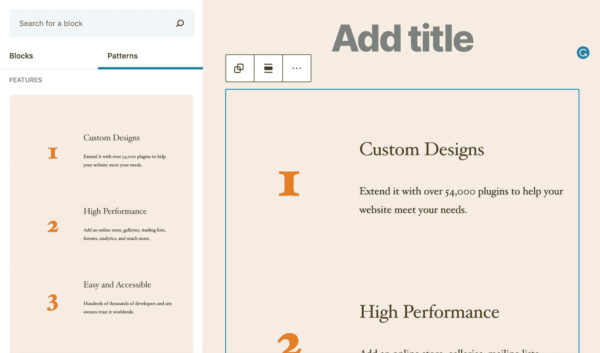

The Numbered features pattern in WordPress 5.5


除了内置的块模式， [WordPress 开发者](https://kinsta.com/blog/wordpress-developer-salary/)可以利用一个全新的 API 为他们的主题和插件提供定制模式。

您可以使用`register_block_pattern`功能和`register_block_pattern_category`为类别注册您的自定义模式。

`register_block_pattern`需要两个参数:

1.  模式的名称。
2.  模式属性的数组。

属性包括以下内容:

*   `title`
*   `content`
*   `description`
*   `categories`
*   `keywords`
*   `viewportWidth`

`register_block_pattern_category`也需要两个参数:

1.  模式类别的名称。
2.  属性数组。

API 还提供了两个函数来注销模式和类别:`unregister_block_pattern`和`unregister_block_pattern_category`。

构建自己的块模式的方法非常简单。例如，复制并粘贴下面的代码到一个自定义插件或者一个[子主题的函数文件](https://kinsta.com/blog/wordpress-child-theme/)，然后根据你的喜好改变模式的名称。

```
add_action( 'init', function(){

	register_block_pattern_category( 
		'kinsta', 
		array( 'label' => __( 'Kinsta stuff', 'kinsta-pattern' ) ) );

	register_block_pattern(
	'kinsta-pattern/my-custom-pattern',
	array(
		'title'			=> __( 'Two Kinsta buttons', 'kinsta-pattern' ),
		'description'	=> _x( 'Two nice buttons.', 'Kinsta Buttons', 'kinsta-pattern' ),
		'content'		=> "<!-- wp:buttons {\"align\":\"center\"} -->\n<div class=\"wp-block-buttons aligncenter\"><!-- wp:button {\"backgroundColor\":\"very-dark-gray\",\"borderRadius\":0} -->\n<div class=\"wp-block-button\"><a class=\"wp-block-button__link has-background has-very-dark-gray-background-color no-border-radius\">" . esc_html__( 'Button One', 'kinsta-pattern' ) . "</a></div>\n<!-- /wp:button -->\n\n<!-- wp:button {\"textColor\":\"very-dark-gray\",\"borderRadius\":0,\"className\":\"is-style-outline\"} -->\n<div class=\"wp-block-button is-style-outline\"><a class=\"wp-block-button__link has-text-color has-very-dark-gray-color no-border-radius\">" . esc_html__( 'Button Two', 'kinsta-pattern' ) . "</a></div>\n<!-- /wp:button --></div>\n<!-- /wp:buttons -->",
		'categories'	=> array( 'kinsta' ),
	)
	);
});
```

上面的代码是对来自[块 API 引用](https://developer.wordpress.org/block-editor/developers/block-api/block-patterns/)的原始代码片段的简单定制。如您所见，不需要 JavaScript。

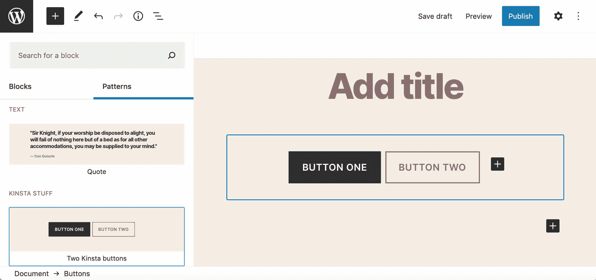

A custom block pattern


另见 WordPress 5.5 中的[模块模式。](https://make.wordpress.org/core/2020/07/16/block-patterns-in-wordpress-5-5/)


### 重要的

请注意，模式是一个实验性的特性，API 可能会随着 Gutenberg 插件的未来版本而改变。


## WordPress 核心中的本地镜像延迟加载

[延迟加载](https://kinsta.com/blog/wordpress-lazy-load/)是一种优化技术，即[推迟非关键资源的加载](https://kinsta.com/blog/critical-rendering-path/)。这意味着浏览器被指示在页面加载时加载可视内容，并推迟下载和渲染文件夹[下的图像，直到实际需要它们的时候](https://kinsta.com/blog/eliminate-render-blocking-javascript-css/)。


### 信息

说到[网页性能](https://kinsta.com/learn/speed-up-wordpress/)，[图片优化](https://kinsta.com/blog/optimize-images-for-web/)是网站管理员的一个重要方面。一般来说，图片仍然是网页的重要组成部分，图片优化可以帮助读者和客户获得更好的用户体验。记住:[页面速度也是一个重要的排名因素](https://kinsta.com/blog/wordpress-seo/#38-optimize-your-websites-speed)。


在[原生惰性加载](https://addyosmani.com/blog/lazy-loading/)之前，web 开发人员可以[通过 JavaScript](https://developers.google.com/web/fundamentals/performance/lazy-loading-guidance/images-and-video/) ，使用 [IntersectionObserver API](https://developers.google.com/web/fundamentals/performance/lazy-loading-guidance/images-and-video/#using_intersection_observer) 或使用`scroll`、`resize`和`orientationchange` [事件处理程序](https://developers.google.com/web/fundamentals/performance/lazy-loading-guidance/images-and-video/#using_event_handlers_the_most_compatible_way)惰性加载资产。

但是自从[延迟加载成为标准的](https://html.spec.whatwg.org/multipage/embedded-content.html#attr-img-loading)之后，我们不再需要编写定制代码或者使用 [JavaScript 库](https://kinsta.com/blog/javascript-libraries/)，并且 [lazyload images](https://developer.mozilla.org/en-US/docs/Web/HTML/Element/img#attr-loading) 可以使用`img`和`iframe`标签中新的`loading`属性来实现。

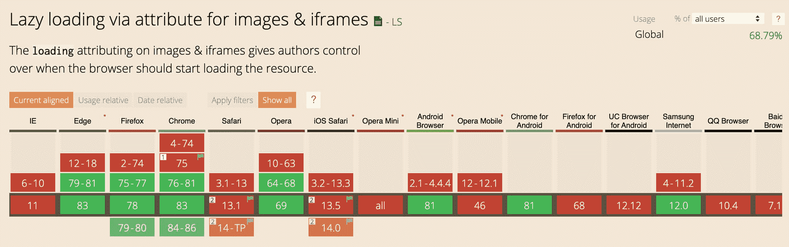

Lazy loading via attribute for images & iframes (Source: [caniuse.com](https://caniuse.com/#feat=loading-lazy-attr))


`loading`属性决定了浏览器是应该立即加载资源还是等到满足某些条件后再加载。它目前支持以下值:

*   `lazy`:等待，直到满足某些条件
*   `eager`:立即加载资源

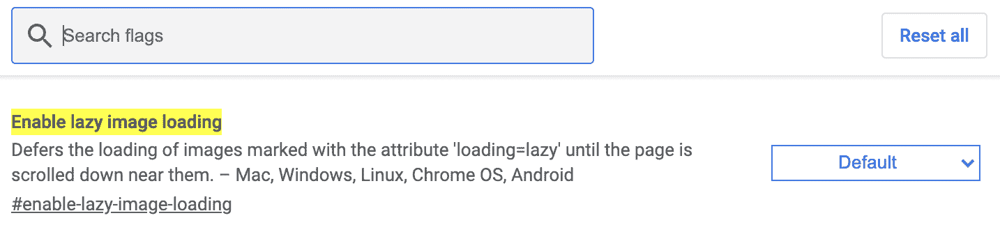

Lazy loading settings in Chrome (available at chrome://flags/#enable-lazy-image-loading)


在撰写本文时，微软 Edge、 [Firefox](https://www.ghacks.net/2020/02/15/firefox-75-gets-lazy-loading-support-for-images/) 、[谷歌 Chrome](https://github.com/scott-little/lazyload/) 、Opera 浏览器、Android 浏览器和 Chrome for Android 都支持原生延迟加载。

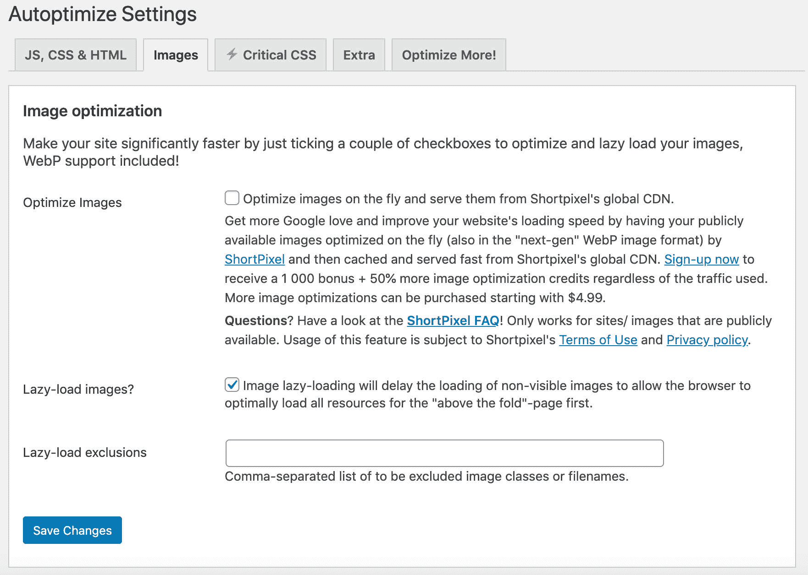

Lazy loading settings in Autoptimize


在 WordPress 5.5 之前，延迟加载只能在带有[优化插件](https://kinsta.com/blog/wordpress-lazy-load/#lazy-loading-plugins)的 WordPress 中实现，比如[自动优化](https://kinsta.com/blog/autoptimize-settings/)，BJ 延迟加载，或者其他。现在它是 WordPress 核心的一部分，不需要安装额外的插件！

### WordPress 中的本地延迟加载

正如 Felix Arntz [在 Make WordPress Core blog](https://make.wordpress.org/core/2020/01/29/lazy-loading-images-in-wordpress-core/) 上的一篇旧博文中所报道的，WordPress 中惰性加载的 JavaScript 实现最初是在几年前提出的，但它从未成为核心的一部分。本机惰性图像加载的新实现消除了任何兼容性问题，因此新功能可以安全地与 WordPress 5.5 的核心功能[合并。](https://make.wordpress.org/core/2020/07/14/lazy-loading-images-in-5-5/)

根据 Felix 的说法，WordPress 图片的原生延迟加载应该会对大量没有使用延迟加载插件的 WordPress 网站的[网站性能](https://kinsta.com/blog/boosting-wordpress-performance/)和用户体验产生有益的影响:

> …不需要任何技术知识，甚至不知道延迟加载是一个概念。采用新的加载属性是 WordPress 引领更快网络的一个很好的机会。

为了防止布局偏移，`loading="lazy"`将自动添加到带有`width`和`height`属性的`img`标签**中，并且只有当图片作为附件可用于 WordPress 并且包含一个`wp-image-$id`类时才有可能。**

对于每一个安装有大量图片的 WordPress 和网站来说，延迟加载是一个必须的优化。费利克斯注意到:

> 这将极大地节省服务器和跨站点用户代理的带宽，在这些站点中，页面下方的图像通常会被立即加载，即使在用户可能永远不会滚动到它们的情况下。

WordPress 中的本地延迟加载可以处理以下图片:

*   帖子内容中的图片(`the_content`)。
*   帖子中的图片摘录(`the_excerpt`)。
*   文本小工具中的图像(`widget_text_content`)。
*   通过`get_avatar()`渲染的头像图像。
*   模板图像使用`wp_get_attachment_image`

在第一个实现中，延迟加载只支持图像，但是我们可以期待未来对`iframe`标签的延迟加载的增强。

### WordPress 开发者的延迟加载

开发人员可以使用几个新的过滤器来覆盖默认行为。在这些过滤器中，`wp_lazy_loading_enabled`和`wp_img_tag_add_loading_attr`对开发者最有用:

*   `wp_lazy_loading_enabled`打开和关闭`loading`属性。该过滤器可以全局应用，也可以按标签应用。
*   `wp_img_tag_add_loading_attr`过滤`loading`属性值，并提供一种方法来控制每个图像的延迟加载。

以下示例显示了如何全局禁用延迟加载:

```
add_filter( 'wp_lazy_loading_enabled', '__return_false' );
```

我们还可以为特定的标签禁用延迟加载。在下面的例子中，延迟加载在`the_content`上下文中的图像上被关闭(阅读更多关于 [Make WordPress Core](https://make.wordpress.org/core/2020/07/14/lazy-loading-images-in-5-5/) ):

## 注册订阅时事通讯


### 想知道我们是怎么让流量增长超过 1000%的吗？

加入 20，000 多名获得我们每周时事通讯和内部消息的人的行列吧！

[Subscribe Now](#newsletter)

```
add_filter(
	'wp_lazy_loading_enabled',
	function( $default, $tag_name, $context ){
		if ( 'img' === $tag_name && 'the_content' === $context ){
			return false;
		}
		return $default;
	},
	10,
	3
);
```

*   `$default`:布尔默认值(`true`)。
*   `$tag_name`:要延迟加载的元素的标签名。
*   `$context`:可选参数，指定图像的上下文(见上表)。

注意，在撰写本文时，`$tag_name`参数只支持`img`标签。无论如何，如上所述，更多的标签应该被添加到未来的实现中。

如果你想在 WordPress 中对图片延迟加载进行更细粒度的控制，你可以根据上下文遵循两种不同的方法。

如果您正在处理内容(即`the_content`、`the_excerpt`、`widget_text_content`，您可以使用`wp_img_tag_add_loading_attr`过滤器。以下示例显示了如何在特定映像上禁用延迟加载:

```
add_filter(
	'wp_img_tag_add_loading_attr',
	function( $value, $image, $context ){
		if ( 'the_content' === $context ){
			$image_url = wp_get_attachment_image_url( 67, 'medium' );
			if ( false !== strpos( $image, ' src="' . $image_url . '"' ) ) {
				return false;
			}
		}
		return $value;
	},
	10,
	3
);
```

主题开发者也可以通过 [wp_get_attachment_image](https://developer.wordpress.org/reference/functions/wp_get_attachment_image/) 控制图片。在这个场景中，您可以简单地将图像的`loading`属性值设置为`false`:

```
echo wp_get_attachment_image(
	67,
	'medium',
	false,
	array( 'loading' => false ),
);
```

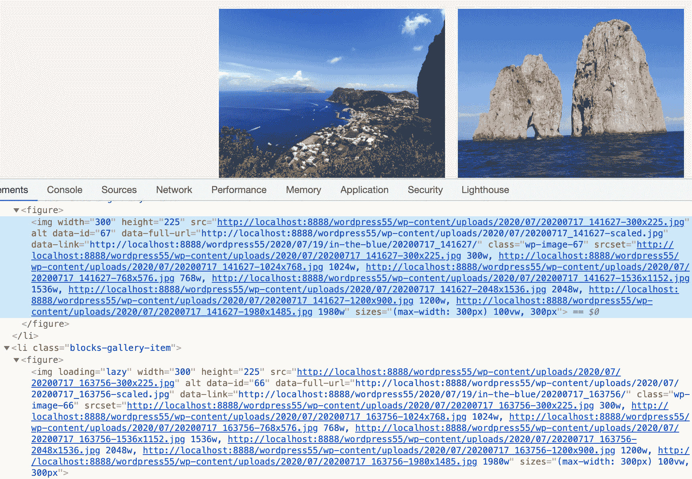

The first image in the above gallery is not lazy loaded


> 为了更快的访问速度和更少的网络资源浪费，原生的延迟加载图像将会出现在 5.5 中！它还伴随着进一步的图像改进，减少了那些恼人的布局变化，使你不小心点击了错误的东西。https://t.co/e7g2s9uSPk
> 
> ——费利克斯·阿恩茨(@费利克斯·阿恩茨)[2020 年 7 月 14 日](https://twitter.com/felixarntz/status/1283167725313880064?ref_src=twsrc%5Etfw)