# WordPress 5.7 的新特性(延迟加载、HTTPS、用户界面更新、新 API 等等)

> 原文：<https://kinsta.com/blog/wordpress-5-7/>

每次发布新版本时，我们都习惯于看到小的或不那么小的变化和新特性被添加到 [WordPress 核心](https://kinsta.com/knowledgebase/wordpress-core/)中。WordPress 5.7 也不例外，很高兴看到每个新版本都让我们离[的大图景](https://make.wordpress.org/updates/2021/01/21/big-picture-goals-2021/)更近了一步。

随着多个版本的块编辑器合并到 Core 中，新版本改善了整体编辑体验，使开发人员能够构建更高级的块，并向块编辑器添加更强大的自定义功能。

除了编辑器，WordPress 5.7 还引入了大量的变化和强大的功能，包括延迟加载 iframes、登录和注册界面更新、重置密码链接、大量的错误修复等等。

我们已经在 [DevKinsta](https://kinsta.com/devkinsta/) 上运行了我们的测试，我们已经准备好与你分享我们最喜欢的 WordPress 5.7 的特性和变化——当然，还有大量的截图和代码片段。

如果你想更深入地了解 2021 年的第一个主要版本，请查看 WordPress 5.7 [开发周期](https://make.wordpress.org/core/5-7/)、[规划综述](https://make.wordpress.org/core/2020/12/21/wordpress-5-7-planning-roundup/)和[领域指南](https://make.wordpress.org/core/2021/02/23/wordpress-5-7-field-guide/)。

所以，当我们继续等待[全站点编辑](https://make.wordpress.org/core/2021/02/11/bringing-the-power-of-blocks-to-widgets/)(在 WordPress 5.8 的核心中)的时候，让我们舒适地享受 WordPress 5.7 的新功能吧！

[WordPress 5.7 is the first major release of the year 🥳 Check out the new features and find out what we may expect from WordPress in 2021 🎁Click to Tweet](https://twitter.com/intent/tweet?url=https%3A%2F%2Fkinsta.com%2Fblog%2Fwordpress-5-7%2F&via=kinsta&text=WordPress+5.7+is+the+first+major+release+of+the+year+%F0%9F%A5%B3+Check+out+the+new+features+and+find+out+what+we+may+expect+from+WordPress+in+2021+%F0%9F%8E%81) ## 块编辑器中的新功能

WordPress 5.7 带来了许多版本的古腾堡插件。在编辑器中添加的许多更改和错误修复的基础上，不可能在这里提到所有这些新增内容，但您可以访问以下链接来深入了解每个版本: [9.3](https://make.wordpress.org/core/2020/11/04/whats-new-in-gutenberg-4-november/) 、 [9.4](https://make.wordpress.org/core/2020/11/19/whats-new-in-gutenberg-18-november-2/) 、 [9.5](https://make.wordpress.org/core/2020/12/02/whats-new-in-gutenberg-2-december/) 、 [9.6](https://make.wordpress.org/core/2020/12/23/whats-new-in-gutenberg-23-december/) 、 [9.7](https://make.wordpress.org/core/2021/01/07/whats-new-in-gutenberg-6-january/) 、 [9.8](https://make.wordpress.org/core/2021/01/20/whats-new-in-gutenberg-9-8-20-january/) 、 [9.9](https://make.wordpress.org/core/2021/02/05/whats-new-in-gutenberg-9-9-5-february/) 。


> Kinsta 把我宠坏了，所以我现在要求每个供应商都提供这样的服务。我们还试图通过我们的 SaaS 工具支持达到这一水平。
> 
> <footer class="wp-block-kinsta-client-quote__footer">
> 
> 
> 
> <cite class="wp-block-kinsta-client-quote__cite">Suganthan Mohanadasan from @Suganthanmn</cite></footer>

[View plans](https://kinsta.com/plans/)

Gutenberg 10.0 和 10.1 的错误修复和性能改进也是 WordPress 5.7 的一部分。

也就是说，让我们仔细看看 WordPress 5.7 中添加到块编辑器中的最令人兴奋的特性和变化:

### 阻止变体功能、增强功能和 API

在 WordPress 5.4 中引入的[块变体](https://kinsta.com/blog/wordpress-5-4/#block-variations)为用户提供了一种选择同一块的不同实例的方式。

这个特性与[块变体 API](https://developer.wordpress.org/block-editor/developers/block-api/block-registration/#variations-optional) 协同工作，后者是一个强大的工具，允许开发人员添加、管理或删除块的变体。

WordPress 5.7 为 block variations 引入了几个增强、特性和新的 API，为开发者提供了更好的 UI 和更强大的工具。让我们开始吧。


#### 块变化变换

古腾堡 9.4 首先引入了[，现在又添加到了 WordPress 5.7，一个**变换到变体**切换器出现在支持这个特性的块的块卡下面。](https://make.wordpress.org/core/2020/11/19/whats-new-in-gutenberg-18-november-2/)

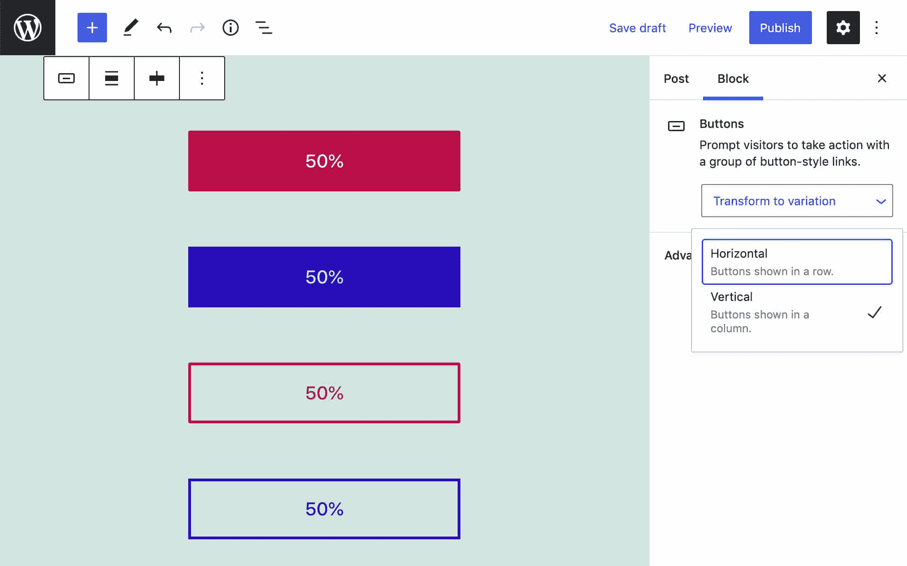

The Transform to variation switcher for a Buttons block


注册新的块变体时，块开发人员可以通过向块变体`scope`字段添加新的`transform`选项来将变体切换器添加到块检查器，如下例所示(仅 JS 代码):

```
wp.blocks.registerBlockVariation( 'core/heading', { 
	name: 'green-text', 
	title: 'Green Text', 
	description: 'This block has green text. It overrides the default description.',  
	attributes: { 
		content: 'Green Text', 
		textColor: 'vivid-green-cyan' 
	}, 
	icon: 'palmtree', 
	scope: [ 'inserter', 'transform' ] 
} );
```

在此示例中，块变体出现在编辑器用户界面的两个区域——块插入器和块检查器。

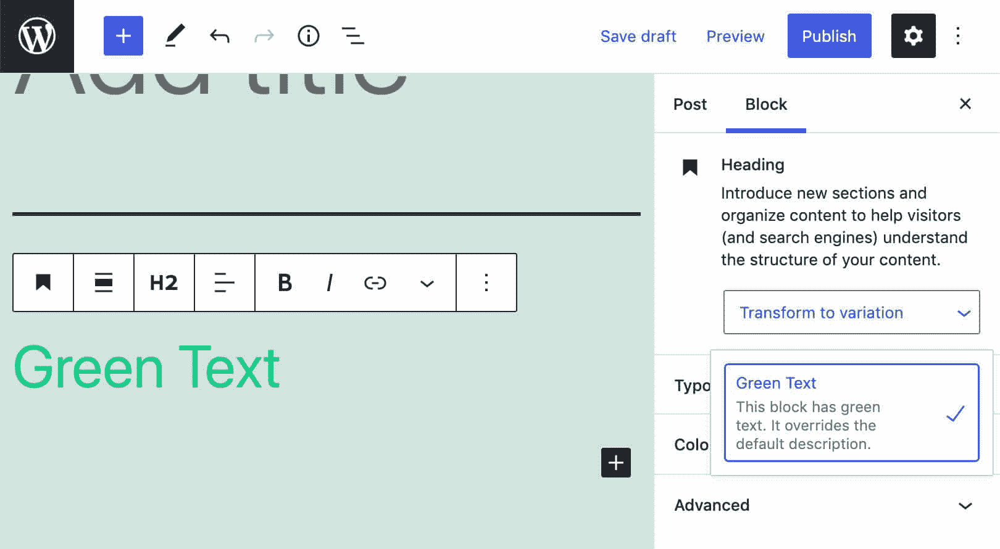

Block Variation example with transform scope


有关块变化变换的深入概述，另请参见 PR [#26687](https://github.com/WordPress/gutenberg/pull/26687) 。

#### 块信息现在与块变化相匹配

自从 WordPress 5.7(和 Gutenberg 9.7 )以来，UI 显示了更多关于块变化的具体信息，而以前它只显示一般信息。

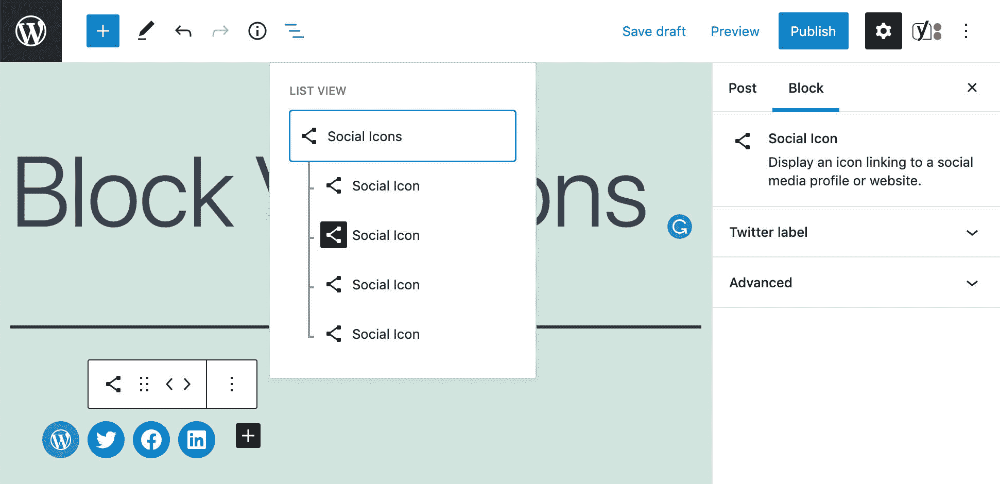

Before WordPress 5.7, the interface elements showed generic information about block variations


嵌入块和社交图标被构建为块变体；他们提供了 WordPress 匹配块信息和块变化的好例子。

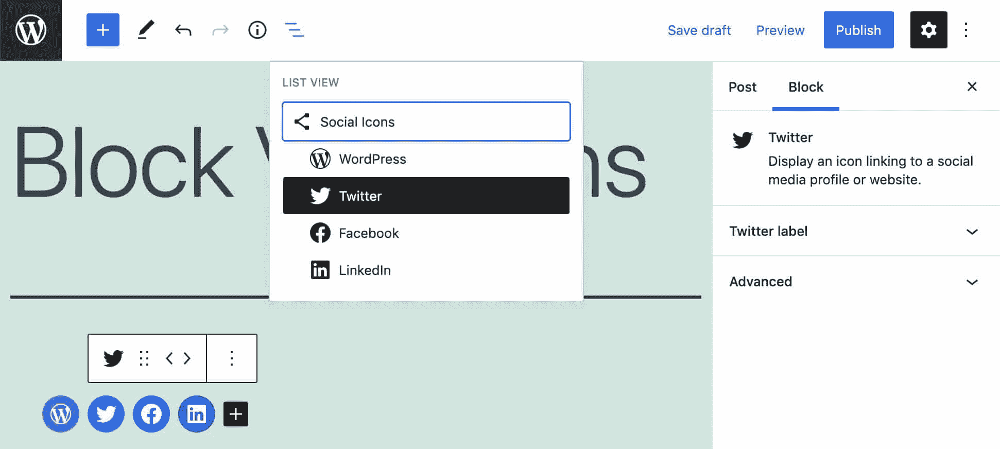

Now the interface elements show information specific to block variations


这些更改会影响块检查器、块导航栏和面包屑。从[古腾堡 9.8](https://make.wordpress.org/core/2021/01/20/whats-new-in-gutenberg-9-8-20-january/) 开始，这个 UI 增强也适用于块切换器。

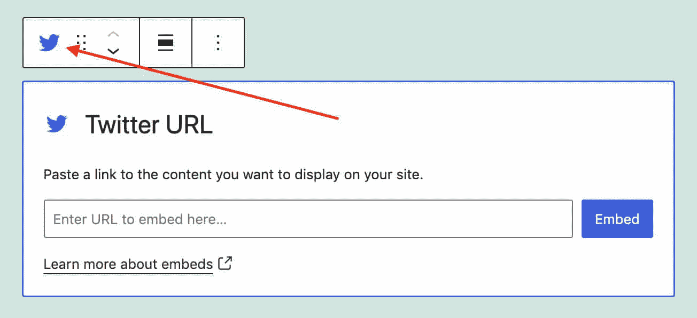

UI 增强块切换器中的块变化


#### 新的块变体 API

WordPress 5.7 还引入了[新的 API](https://make.wordpress.org/core/2021/02/22/new-block-variation-apis-in-5-7/)，开发者可以在块变体注册时使用它们来显示块变体的正确信息([古腾堡 9.7](https://make.wordpress.org/core/2021/01/07/whats-new-in-gutenberg-6-january/) )。

新的`isActive`属性是一个接受块属性的函数。您可以使用变体的属性来确定变体是否处于活动状态(参见[块 API 参考](https://developer.wordpress.org/block-editor/developers/block-api/block-registration/#variations-optional))。

块开发人员可以使用此功能显示变化信息，而不是块信息。一个例子是`embed`块，在这里我们可以改变`providerNameSlug`属性的值(一个来自[开发注释](https://make.wordpress.org/core/2021/02/22/new-block-variation-apis-in-5-7/)的例子):

```
const variations = [
{
	name: 'wordpress',
	title: 'WordPress',
	keywords: [ __( 'post' ), __( 'blog' ) ],
	description: __( 'Embed a WordPress post.' ),
	attributes: { providerNameSlug: 'wordpress' },
	isActive: ( blockAttributes, variationAttributes ) =>
		blockAttributes.providerNameSlug === variationAttributes.providerNameSlug,
},
];
```

在下面的示例中，`isActive`属性用于更改颜色属性:

```
variations: [
{
	name: 'blue',
	title: __( 'Blue Quote' ),
	isDefault: true,
	attributes: { color: 'blue', className: 'is-style-blue-quote' },
	icon: 'format-quote',
	isActive: ( blockAttributes, variationAttributes ) =>
		blockAttributes.color === variationAttributes.color
},
],
```

新的`useBlockDisplayInformation`钩子返回关于给定块的信息。新的挂钩考虑了块变体的`isActive`属性，并返回块的`title`、`icon`和`description`。

这些更改会影响块卡(检查器工具)、导航列表视图(顶部栏)和面包屑(另请参见 PR [#27469](https://github.com/WordPress/gutenberg/pull/27469) )。
T3】

### 新按钮阻止功能

几个新特性改进了按钮块的功能和界面。

#### 按钮尺寸

设置侧边栏中的一个新控件现在允许我们为按钮块中的按钮设置一个百分比宽度。

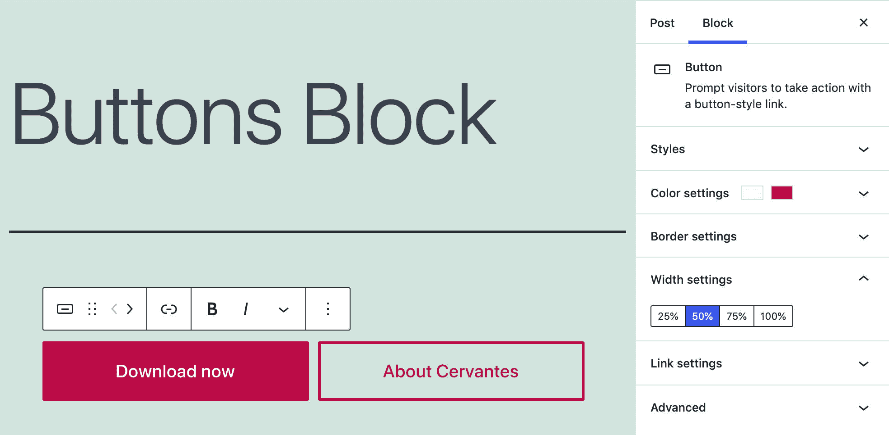

Width settings for buttons


只需选择一个按钮，然后选择 25%、50%、75%或 100%。百分比是指父容器。下图显示了按钮尺寸的不同组合。

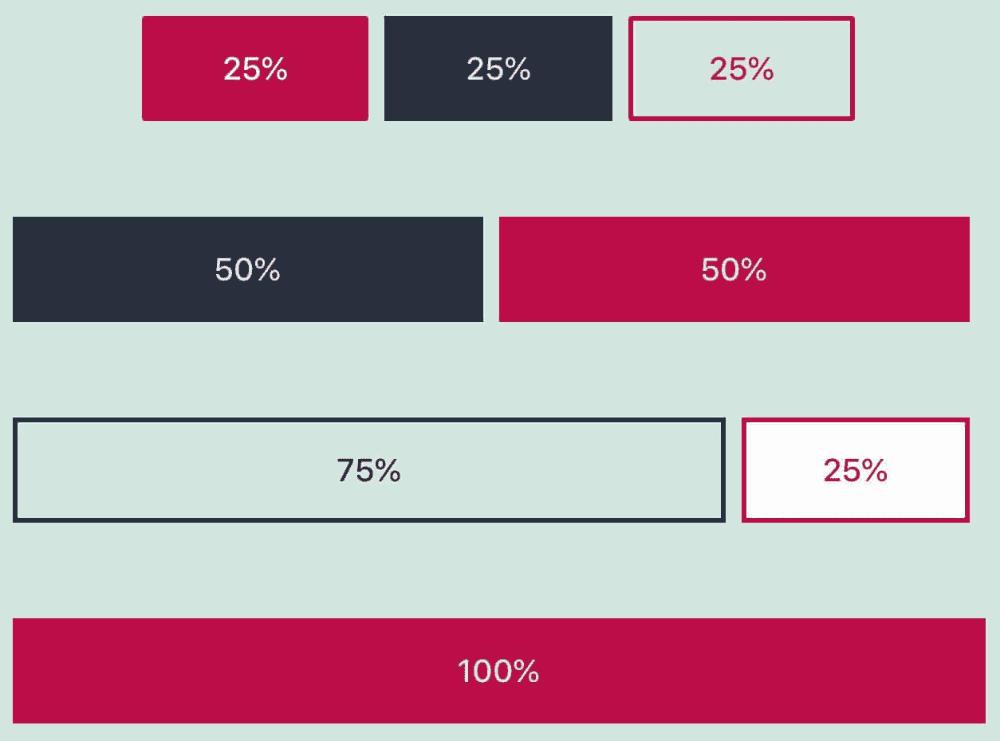

Combinations of buttons with different width values


如需更多技术见解，请查看拉式请求 [#25999](https://github.com/WordPress/gutenberg/pull/25999) 和 [#26781](https://github.com/WordPress/gutenberg/pull/26781) 。

#### 垂直布局

这个新特性为按钮块增加了垂直方向的变化。用户可以使用块设置面板中的转换切换器从水平布局切换到垂直布局。

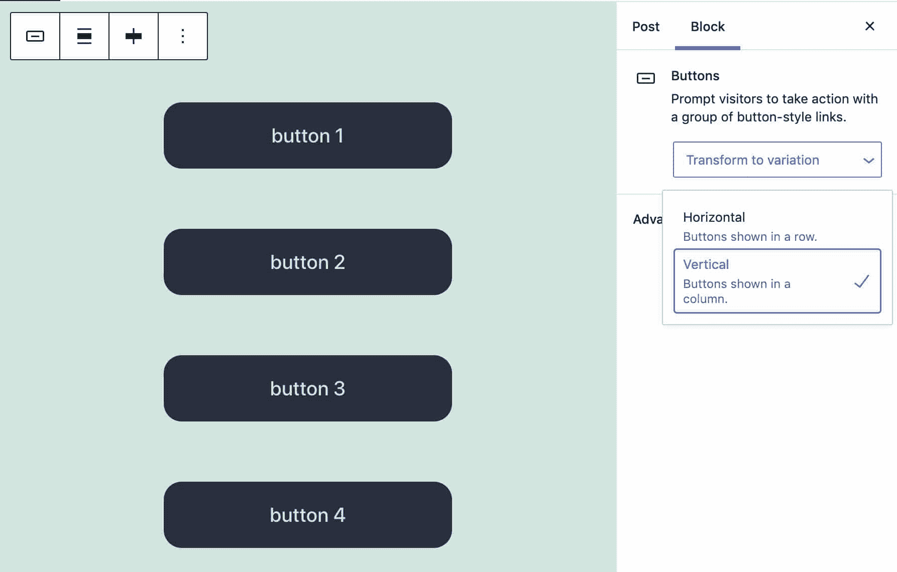

Buttons block with vertical orientation


### 社交图标增强

WordPress 5.7 为[社交图标](https://kinsta.com/blog/wordpress-social-media-plugins/)增加了新的定制选项:定制尺寸支持和定制颜色。

#### 社交图标大小

选中社交图标块后，块工具栏现在提供了一个**大小**的选项菜单，有可用的大小([古腾堡 9.4](https://make.wordpress.org/core/2020/11/19/whats-new-in-gutenberg-18-november-2/) )。

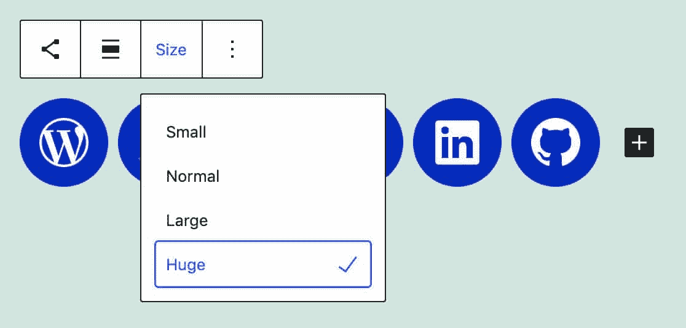

‘Huge’ size for social icons


#### 社交图标中的自定义颜色

同一块现在支持颜色设置，允许我们为图标和背景设置不同的自定义颜色([古腾堡 9.9](https://make.wordpress.org/core/2021/02/05/whats-new-in-gutenberg-9-9-5-february/) )。

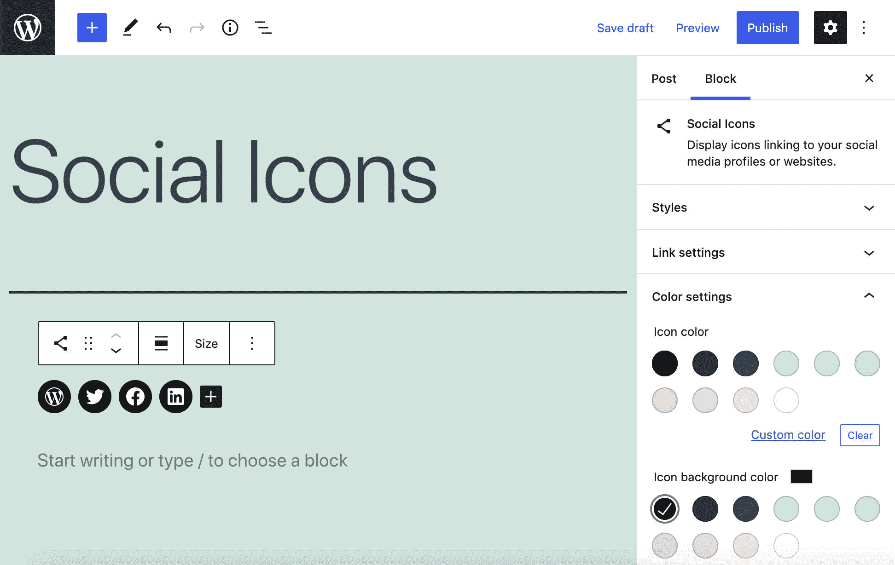

Social icons with black background color


你现在可以为社交图标使用主题的调色板，防止图标颜色与你的[网站的配色方案](https://kinsta.com/blog/website-color-schemes/)冲突(参见 PR [#28084](https://github.com/WordPress/gutenberg/pull/28084) )。

### 字体大小支持

WordPress 5.7 增加了对列表和代码块的字体大小支持。

#### 列表块中的字体大小

带有字体大小控件的排版卡已添加到列表块设置中([古腾堡 9.4](https://make.wordpress.org/core/2020/11/19/whats-new-in-gutenberg-18-november-2/) )。

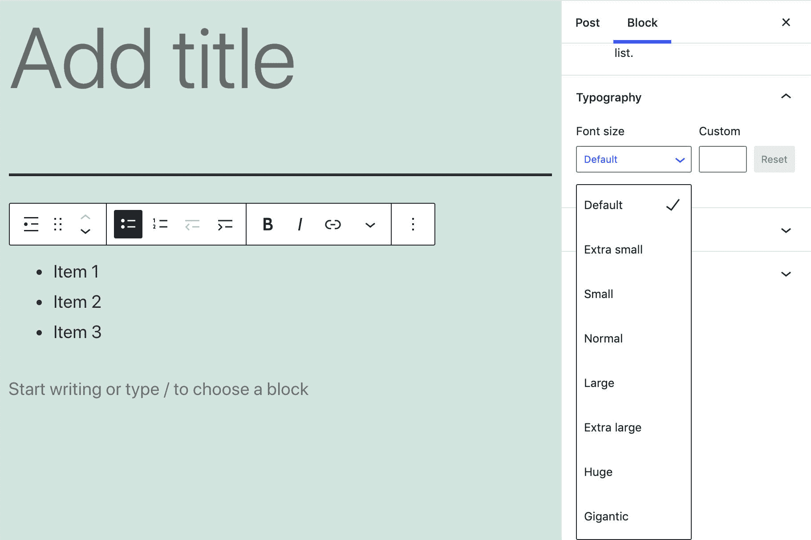

Font size in List block settings


用户可以为列表项选择一个可用的字体大小，或者设置一个以像素表示的自定义字体大小。“重置”按钮恢复默认值。

#### 代码块中的字体大小支持

WordPress 5.7 还增加了对代码块中字体大小管理的支持。选中一个代码块后，块设置侧栏会显示一个新的**字体大小**控件。这个控件允许你在[你的主题](https://kinsta.com/blog/change-wordpress-theme/)中选择一个可用的预设尺寸，或者以像素为单位设置一个自定义值([古腾堡 9.5](https://make.wordpress.org/core/2020/12/02/whats-new-in-gutenberg-2-december/) )。

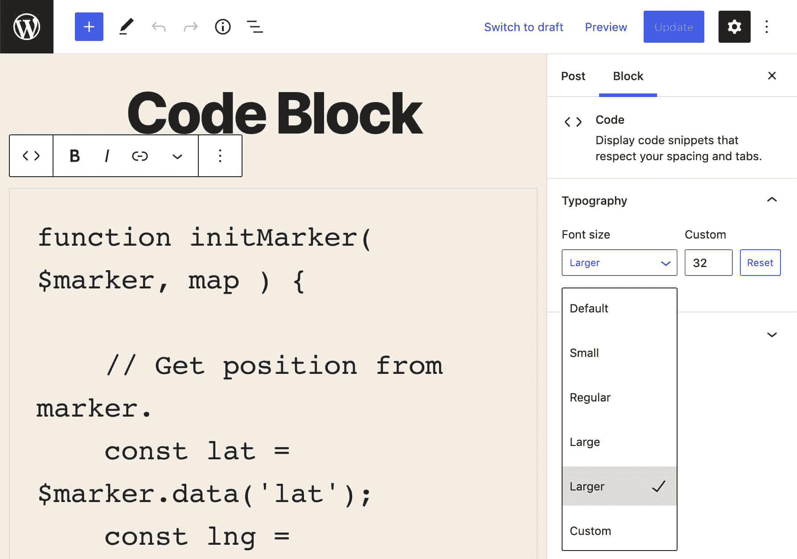

Global font sizes available in Twenty Twenty


这个特性的实现还允许在代码块的 CSS 中使用全局样式变量(参见 PR [#27294](https://github.com/WordPress/gutenberg/pull/27294) )。下图显示了安装了 [Twenty Twenty 主题](https://kinsta.com/blog/twenty-twenty-theme/)的前端代码块。

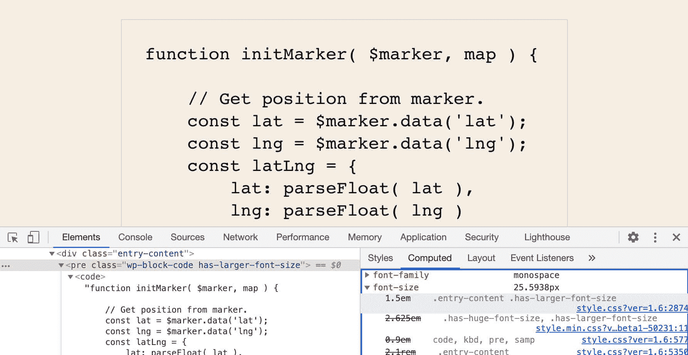

Global CSS styles in a Code block


### 盖块中的全高度对齐

WordPress 5.7 引入了一个新的全高工具栏对齐组件。它最初是用 [Gutenberg 9.5](https://make.wordpress.org/core/2020/12/02/whats-new-in-gutenberg-2-december/) 添加到块编辑器中的。现在，它被合并到 Core 中，并在 Cover 块中实现。

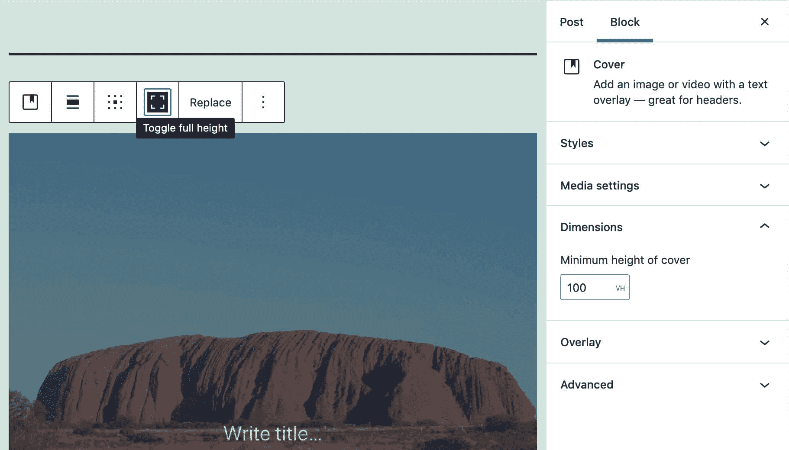

Full Height Alignment has been implemented in the Cover block


如果您切换块工具栏按钮，注意最小高度控件，您会看到全高对齐只是`100vh`的简写(阅读更多关于[视口百分比长度](https://developer.mozilla.org/en-US/docs/Web/CSS/length#Viewport-percentage_lengths))。

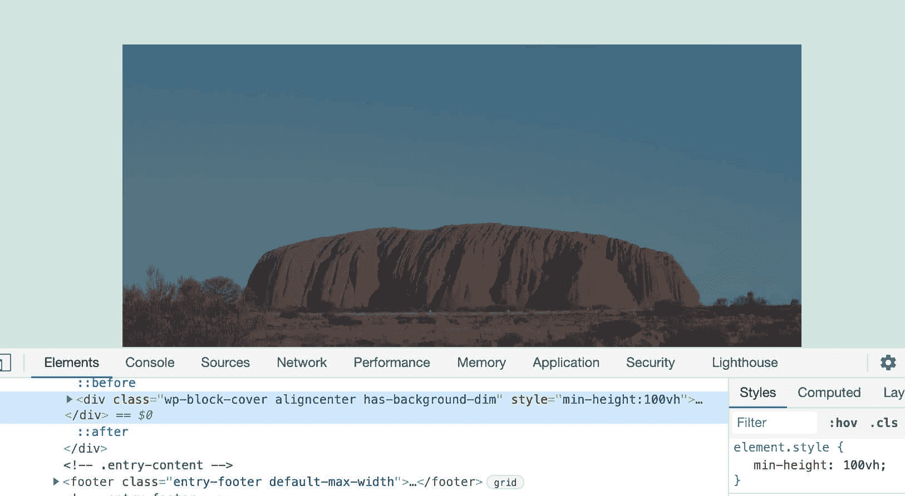

Full Height Alignment in a Cover block


您可以将全高度对齐与其他控制设置(如固定背景、内容位置等)结合使用。您可能会对能够在页面上创建的令人印象深刻的效果数量感到惊讶。

### 从插入器中拖放块和图案

块插入器现在支持块和图案的[拖动&放下。用户可以从插入器中抓取任何块或图案，并将其放置在帖子画布上的任何位置(古腾堡](https://make.wordpress.org/core/2021/01/08/core-editor-improvement-drag-drop-blocks-and-patterns-from-the-inserter/) [9.6](https://make.wordpress.org/core/2020/12/23/whats-new-in-gutenberg-23-december/) 和 [9.7](https://make.wordpress.org/core/2021/01/07/whats-new-in-gutenberg-6-january/) )。

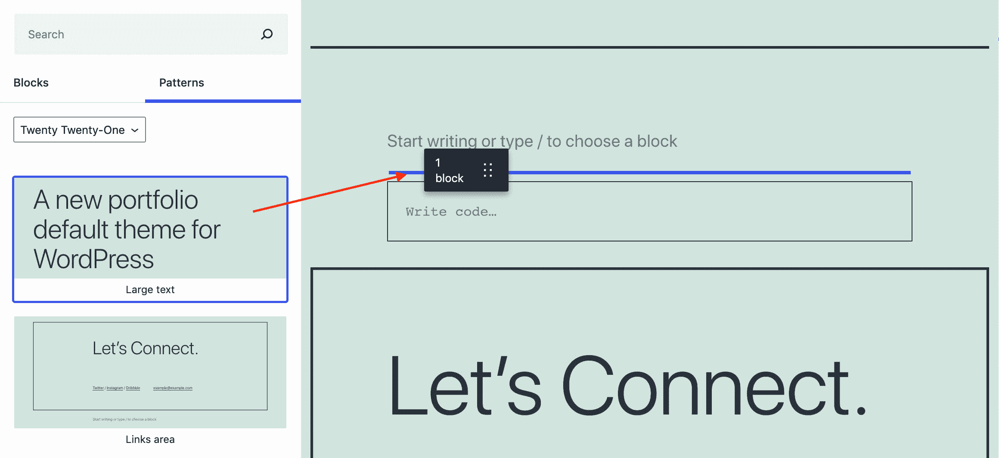

Now you can drag blocks or patterns from the inserter to the post canvas


注意，只有当你的主题支持方块模式时，拖放才有效。

### 半透明间隔块

间隔块现在具有半透明背景([古腾堡 9.8](https://make.wordpress.org/core/2021/01/20/whats-new-in-gutenberg-9-8-20-january/) )，取代了之前的不透明灰色。

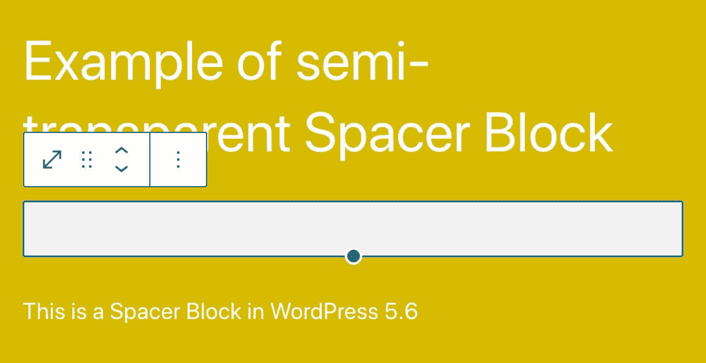

An opaque Spacer Block in WordPress 5.6


该特征应该使得在任何背景颜色之上识别间隔块更容易。

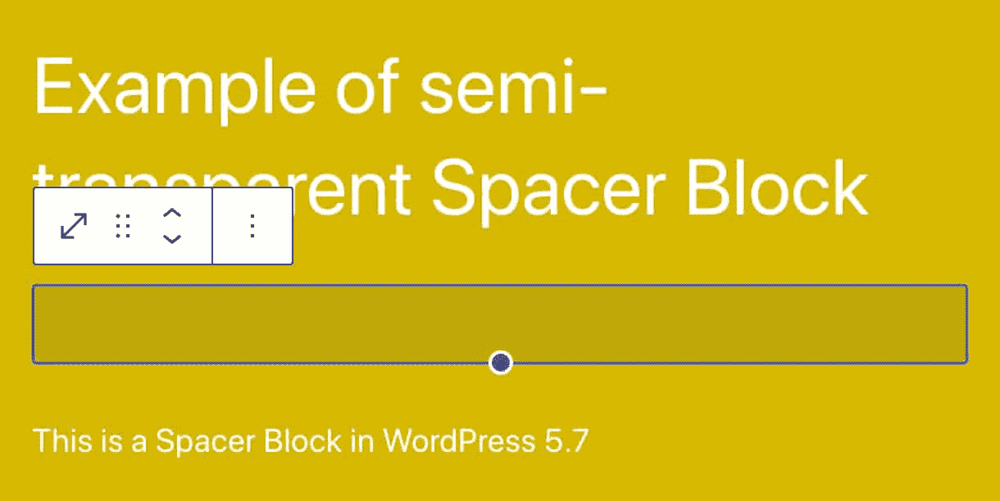

A semi-transparent Spacer block in WordPress 5.7


### 值得一提的是块编辑器中的其他改进

我们的列表不会涵盖合并到 Core 中的所有特性和增强功能，所以一定要查看官方文档和开发人员笔记，以更全面地了解 WordPress 5.7 的块编辑器中的新特性。

但仅举几个例子，在 5.7 中，您还会发现:

*   启用黑暗背景时，自动打开黑暗模式(PR [#28233](https://github.com/WordPress/gutenberg/pull/28233) )
*   社交图标中增加了帕特里翁、电报和抖音图标(PR [#26118](https://github.com/WordPress/gutenberg/pull/26118)
*   字体大小设置中支持的所有单位(PR [#26475](https://github.com/WordPress/gutenberg/pull/26475) )
*   块变换预览(PR [#27861](https://github.com/WordPress/gutenberg/pull/27861)
*   改进了块插入器中的块模式预览(PR [#27204](https://github.com/WordPress/gutenberg/pull/27204) )
*   选项模式已改进，名称更改为[偏好设置](https://make.wordpress.org/core/2021/02/11/core-editor-improvement-new-preferences-experience/)
*   [@wordpress/data API](https://make.wordpress.org/core/2021/02/22/changes-in-wordpress-data-api/) 的变化
*   [内部块 API 变化](https://make.wordpress.org/core/2021/02/23/inner-blocks-api-changes/)
*   导入/导出[功能增强](https://make.wordpress.org/core/2021/02/23/enhancements-to-the-import-export-feature-in-wordpress-5-7/)
*   更改块编辑器[组件和块](https://make.wordpress.org/core/2021/02/24/changes-to-block-editor-components-and-blocks/)

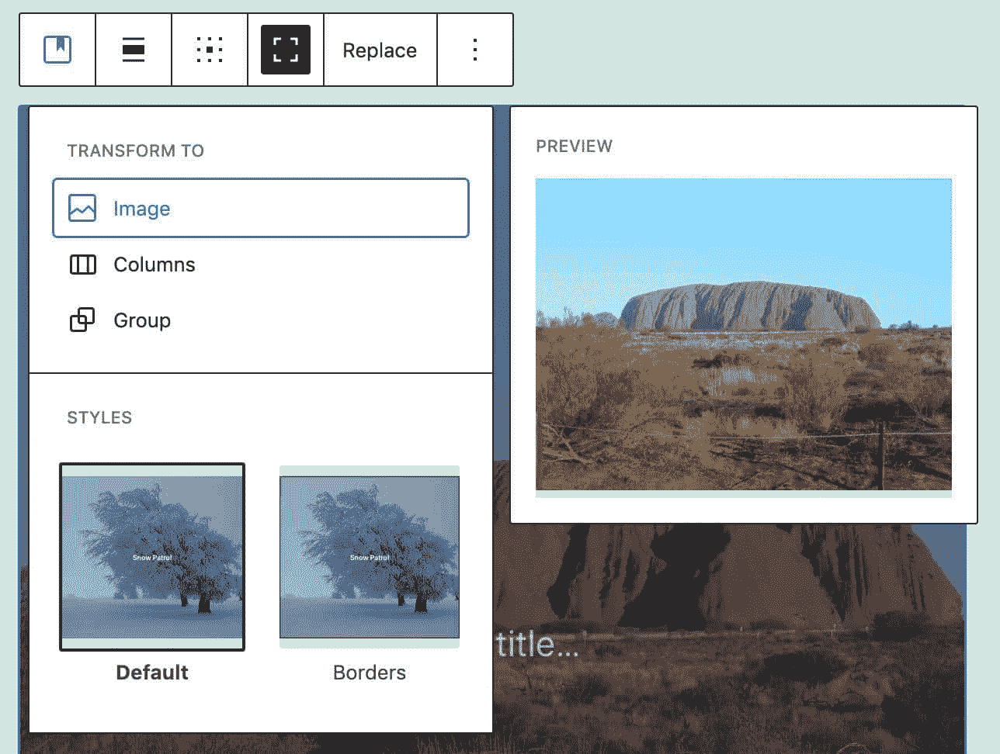

Block transforms previews in WordPress 5.7


## 惰性加载 iframes

[延迟加载](https://kinsta.com/blog/wordpress-lazy-load/)是一种优化技术，它推迟加载非关键资源，直到它们出现在用户的[视窗](https://developer.mozilla.org/en-US/docs/Glossary/Viewport)中。延迟加载图像和嵌入式资源直到需要时才会被下载和渲染。它可以显著提高[网站的性能](https://kinsta.com/learn/speed-up-wordpress/)，尤其是那些展示高分辨率图像和[视频](https://kinsta.com/blog/embed-youtube-video-wordpress/)的网站。

在[原生惰性加载](https://developer.mozilla.org/en-US/docs/Web/Performance/Lazy_loading#images_and_iframes)之前，开发者只能[通过 JavaScript](https://kinsta.com/blog/wordpress-5-5/#native-image-lazyloading-in-wordpress-core) 惰性加载资产。WordPress 用户被迫[使用插件](https://kinsta.com/blog/wordpress-lazy-load/)来达到同样的效果。自从[延迟加载成为标准](https://html.spec.whatwg.org/multipage/embedded-content.html#attr-img-loading)以来，图像和 iframes 可以通过简单地添加`loading="lazy"`属性到`img`和`iframe`标签来延迟加载。

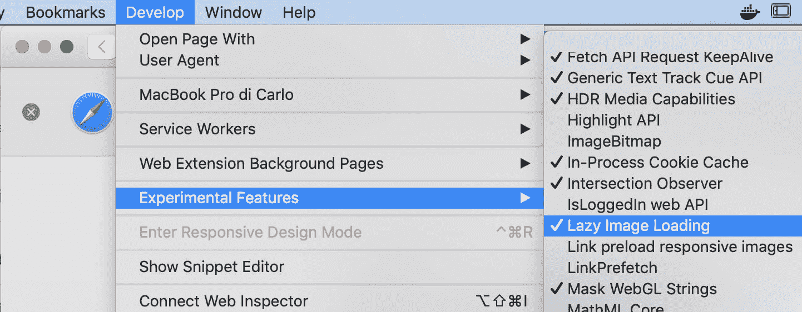

Safari supports lazy loading images as an experimental feature


WordPress 5.5 在 WordPress 核心中引入了[原生图像惰性加载，自动将`loading="lazy"`属性添加到指定了`width`和`height`属性的`img`标签中。](https://kinsta.com/blog/wordpress-5-5/#native-image-lazyloading-in-wordpress-core)

现在，从 WordPress 5.7 开始，[懒加载扩展到了](https://make.wordpress.org/core/2021/02/19/lazy-loading-iframes-in-5-7/)标签。对于图像，为了防止[布局偏移](https://web.dev/optimize-cls/)，`loading="lazy"`将只添加到那些指定了`width`和`height`属性的`iframe`标签上。

在 WordPress 中，本地延迟加载在以下环境中使用 iframes:

*   帖子内容中的 iframe(`the_content`)
*   帖子摘录中的 iframe(`the_excerpt`)
*   文本小部件中的 iframe(`widget_text_content`)

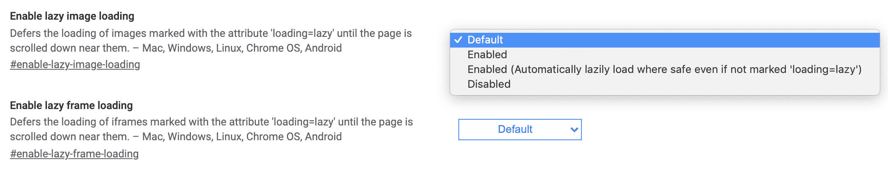

Lazy loading settings in Chrome (available at chrome://flags/)


在 WordPress 中，大多数 iframes 依赖于 [oEmbed](https://wordpress.org/support/article/embeds/#oembed) 集成，它自动将 URL 转换成相应的`iframe`标签。不幸的是，并不是每个 web 服务都为 iframes 提供了`width`和`height`属性；这可以防止 WordPress 将`loading`属性添加到那些 iframes 中。

下图显示了一个带有`loading="lazy"`属性的`iframe`标签:


Lazy loading with an embedded YouTube video


用费利克斯·阿恩兹的话说:

> 那些`iframe`标签的标记由各自的 web 服务控制，只有一些 web 服务遵循提供`width`和`height`属性的最佳实践。由于 WordPress 无法猜测嵌入资源的维度，只有当 oEmbed `iframe`标签同时具有两个维度属性时，才会添加`loading="lazy"`属性。

下图显示了一个没有`loading="lazy"`属性的`iframe`标记:

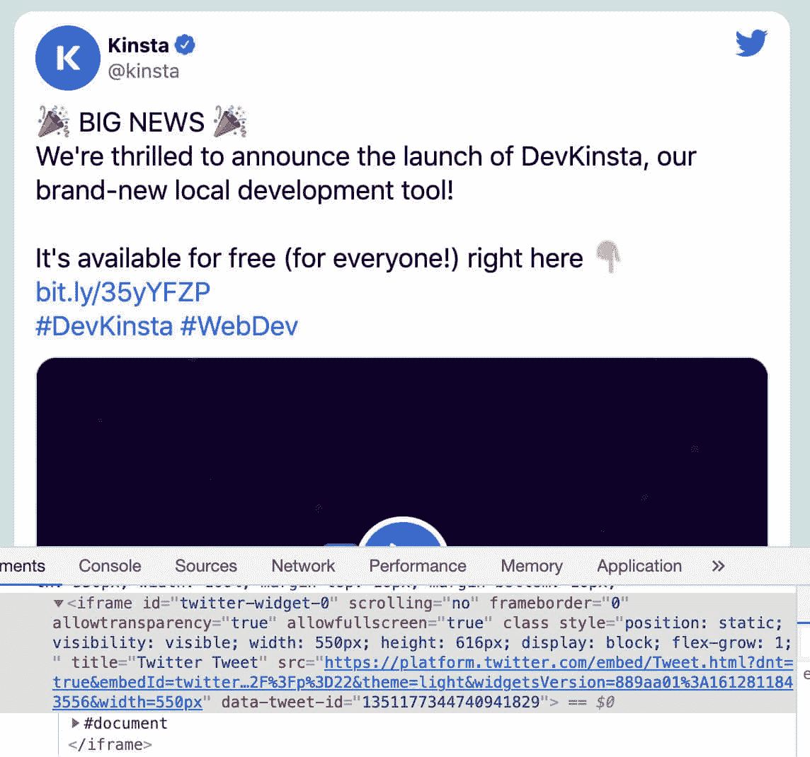

An iframe without the loading attribute


### 面向开发人员的延迟加载 iframes

从[开发人员的角度](https://kinsta.com/blog/hire-wordpress-developer/)来看，新特性需要几处改变，包括:

*   `wp_filter_content_tags()`函数行为已经扩展为将`loading`属性添加到`iframe`标签中。`loading`属性以前只添加到`img`标签中。
*   默认情况下，`wp_lazy_loading_enabled()` [函数](https://developer.wordpress.org/reference/functions/wp_lazy_loading_enabled/)现在为`iframe`标签返回`true`(启用时)。
*   新的`wp_iframe_tag_add_loading_attr()`功能允许将`loading`属性添加到`iframe`标签中(类似于`wp_img_tag_add_loading_attr()`——参见[代码参考](https://developer.wordpress.org/reference/functions/wp_img_tag_add_loading_attr/))。
*   `wp_iframe_tag_add_loading_attr`过滤器允许定制特定 iframes 上的延迟加载。返回`false`或空字符串不会添加属性。

您可以使用现有的`wp_lazy_loading_enabled` [过滤器](https://developer.wordpress.org/reference/hooks/wp_lazy_loading_enabled/)覆盖默认行为，该过滤器现在为`iframe`标签返回`true`。

```
add_filter(
	'wp_lazy_loading_enabled',
	function( $default, $tag_name, $context ){
		if ( 'iframe' === $tag_name && 'the_content' === $context ){
			return false;
		}
		return $default;
	},
	10,
	3
);
```

您还可以使用新的`wp_iframe_tag_add_loading_attr`过滤器，它允许定制特定的`iframe`标签的行为。例如，您可以在特定的上下文中禁用 YouTube 视频的延迟加载。

下面的代码基于 dev note 中的一个例子，展示了如何为嵌入 YouTube 视频的 iframes 禁用延迟加载:

```
add_filter(
	'wp_iframe_tag_add_loading_attr',
	function( $value, $iframe, $context ){
		if ( 'the_content' === $context && false !== strpos( $iframe, 'youtube.com' ) {
		return false;
	},
	10,
	3
);
```

请注意，在撰写本文时，并非所有的 web 浏览器都支持延迟加载。你可以在下面看到 Firefox 和 Safari 只支持图片的延迟加载。

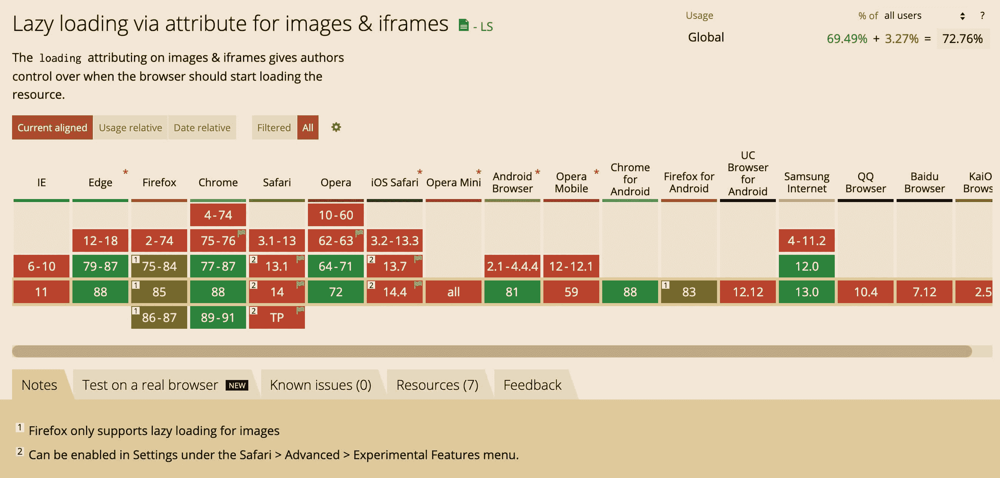

Lazy loading via attribute for images & iframes (Source: [caniuse.com](https://caniuse.com/loading-lazy-attr))


## 从 HTTP 到 HTTPS 的一键式站点迁移

从 5.7 开始，WordPress 会检测一个网站的环境是否支持 HTTPS。如果是这样，站点健康工具中的 HTTPS 状态部分提供了一个号召行动的按钮，允许站点管理员点击一下[将他们的网站从 HTTP 切换到 HTTPS](https://kinsta.com/blog/http-to-https/) 。网站内容是动态迁移的，避免了我们遇到任何[混合内容警告](https://kinsta.com/blog/mixed-content-warnings/)。

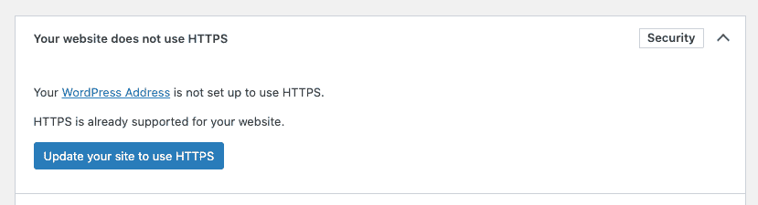

Update your site to use HTTPS in WordPress 5.7 (Image source: [WordPress.org](https://make.wordpress.org/core/2021/02/22/improved-https-detection-and-migration-in-wordpress-5-7/))


如果不支持 HTTPS，WordPress 会显示一个通知。

## 注册订阅时事通讯


### 想知道我们是怎么让流量增长超过 1000%的吗？

加入 20，000 多名获得我们每周时事通讯和内部消息的人的行列吧！

[Subscribe Now](#newsletter)

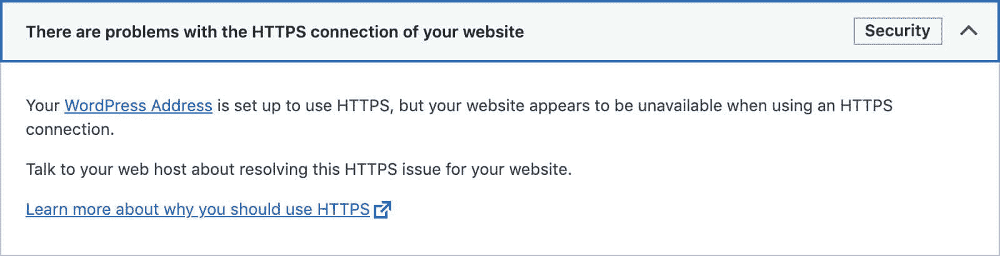

HTTPS is not supported


### 面向开发人员的 HTTP 到 HTTPS 迁移

除了可从站点健康工具访问的新的自动功能，WordPress 5.7 引入了新的功能，使开发者能够测试和定制 HTTPS 检测和迁移的不同方面。

如果“网站地址”(`home_url()`)和“WordPress”(`site_url()`)都有一个包含`https`的 URL，那么新的`wp_is_using_https()`函数将返回`true`。Felix Arntz 在[开发笔记](https://make.wordpress.org/core/2021/02/22/improved-https-detection-and-migration-in-wordpress-5-7/)中清楚地阐述了这一新特性:

> 从本质上讲，将这两个网址都改为 HTTPS 正式表明该网站使用 HTTPS。虽然有其他方法可以在 WordPress 中部分启用 HTTPS(例如使用`FORCE_SSL_ADMIN`常量)，但是新的检测机制专注于在整个站点中使用 HTTPS，即它的前端和后端。

当`wp_is_using_https()`函数检查 URL 中是否存在`https`时，`wp_is_https_supported()`检查站点环境是否正确支持 HTTPS。

该函数主要检查数据库中是否存在`https_detection_errors`选项，如果没有检测到错误，则返回`true`。如果您的环境不支持 HTTPS，`https_detection_errors`选项将出现在`wp_options`表中，如下图所示:

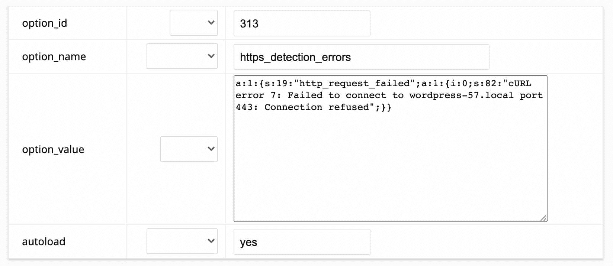

HTTPS is not supported


如上所述，站点内容中的硬编码 URL 是动态变化的，这都要归功于两个新函数:`wp_replace_insecure_home_url()`和`wp_should_replace_insecure_home_url()`。

要将一个网站从 HTTP 迁移到 HTTPS，网站管理员只需要手动更新“网站地址”和“WordPress 地址”来包含 HTTPS 而不是 HTTP。然而，为了让事情变得更简单，WordPress 5.7 引入了新的`wp_update_urls_to_https()`功能。

后一个功能允许通过点击将网站及其所有内容从 HTTP 迁移到 HTTPS(至少在最常见的情况下，比如当“网站地址”与“WordPress 地址”匹配时)。这绝对是一个新奇的东西，也是 WordPress 管理体验的一个重大改进。

有关 HTTPS 探测和迁移的更多技术方面，请参见 Felix Arntz 的[开发笔记](https://make.wordpress.org/core/2021/02/22/improved-https-detection-and-migration-in-wordpress-5-7/)，以及门票 [#47577](https://core.trac.wordpress.org/ticket/47577) 和 [#51437](https://core.trac.wordpress.org/ticket/51437) 。

## 新的 Post 父相关函数

WordPress 5.7 引入了[两个新的 Post Parent 相关函数](https://make.wordpress.org/core/2021/02/10/introducing-new-post-parent-related-functions-in-wordpress-5-7/)。它们使用简单，可以帮助你减少插件和主题中的逻辑。

### has_parent_post()

`has_parent_post()`函数是一个条件标签，它检查给定的帖子是否有父帖子，然后相应地返回`true`或`false`。它接受 post ID 或`WP_Post`对象作为参数，并使用`$post`全局变量(如果有的话)。请参见以下示例:

```
<?php if ( has_parent_post( get_the_ID() ) ) : ?>
	// your code here
<?php endif; ?>
```

### get_parent_post()

`get_parent_post()`函数是一个模板标签，用于检索给定帖子的父`WP_Post`对象。像前面的函数一样，它接受文章 ID 或`WP_Post`对象作为参数。参见下面的用法示例:

```
<a href="<?php the_permalink( get_parent_post( get_the_ID() ) ); ?>"><?php echo get_the_title( get_parent_post( get_the_ID() ) ); ?></a>
```

在现实世界中，我们会结合使用这些函数。你可以自己运行一个测试，把下面的代码从[开发笔记](https://make.wordpress.org/core/2021/02/10/introducing-new-post-parent-related-functions-in-wordpress-5-7/)添加到你的主题的**single.php**模板文件中:

```
<?php if ( has_parent_post( get_the_ID() ) ) : ?>
	<p><a href="<?php the_permalink( get_parent_post( get_the_ID() ) ); ?>">
	<?php
		echo sprintf(
			esc_html__( 'Parent page: %s', 'text-domain' ),
			get_the_title( get_parent_post( get_the_ID() ) )
		);
	?>
	</a></p>
<?php endif; ?>
```

## 登录和注册界面更新

WordPress 5.7 为登录和注册功能带来了几项[改进，包括改进的](https://make.wordpress.org/core/2021/02/16/login-registration-screens-changes-in-wordpress-5-7/)[重置密码](https://kinsta.com/blog/change-wordpress-password/#how-to-change-or-reset-passwords-in-wordpress)界面，新的挂钩，以及其他微小的变化。

### 重置密码屏幕

**重置密码画面**现在提供了两个按钮:**生成密码**和**保存密码**。第一个按钮会在每次单击时生成一个新的强密码，而第二个按钮会保存您的密码。这个改变应该会改善新用户的密码重置体验。

下图比较了 WordPress 5.6 和 5.7 中的重置密码屏幕:

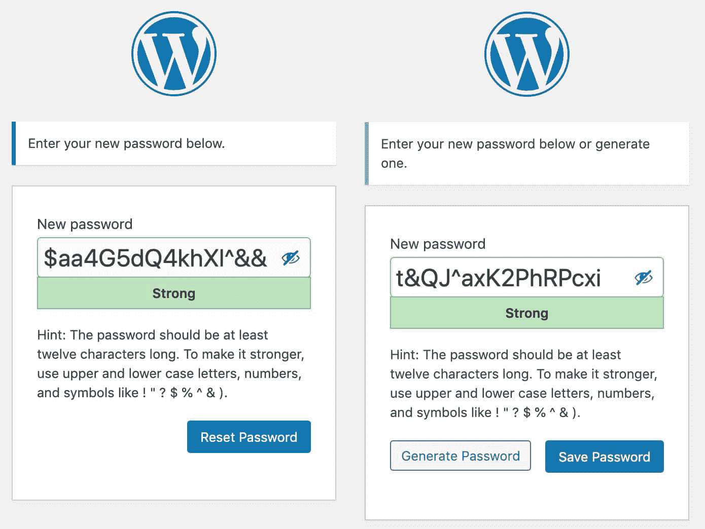

The Reset Password screen in WordPress 5.6 vs. 5.7


### 新过滤器

新的`lostpassword_user_data`钩子允许我们在密码重置时过滤`$user_data`变量。开发人员现在可以使用自定义数据而不是用户名或电子邮件地址来执行用户验证。一个真实世界的例子，看看这个来自[Marcelo ville la gus Mao](https://core.trac.wordpress.org/ticket/51924#comment:5)的评论。

新的`login_site_html_link`过滤器挂钩允许我们用自定义代码/链接完全替换生成“返回{site_name}”链接的 HTML。现在开发人员可以为链接设置自定义文本，也可以更改链接本身。您可以使用过滤器，如下例所示:

```
function custom_login_site_html_link( $link ) {
	return '<a href="' . esc_url( home_url( '/blog/' ) ) . '">' . __( 'Back to my awesome blog', 'textdomain' ) . '</a>';
}
add_filter( 'login_site_html_link', 'custom_login_site_html_link', 10, 1 );
```

下图显示了屏幕上的输出:

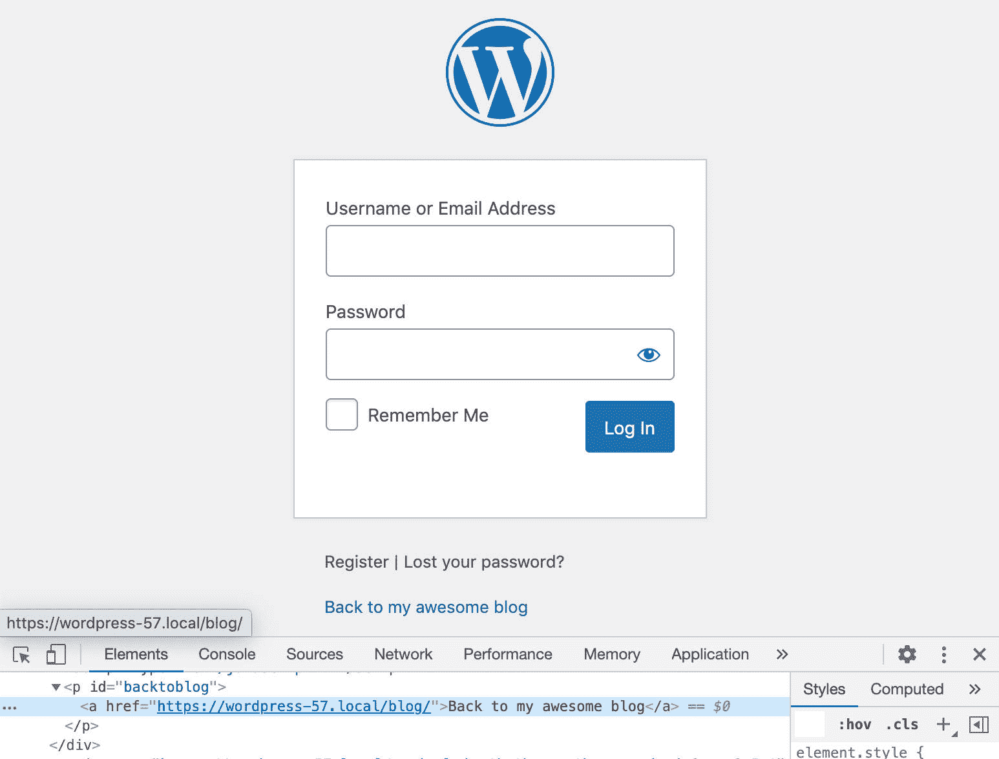

Custom “Back to {site_name}” link in WordPress 5.7


如需更多更改，请查看 WordPress 5.7 开发备注中的[登录&注册屏幕的更改。](https://make.wordpress.org/core/2021/02/16/login-registration-screens-changes-in-wordpress-5-7/)

## 检查帖子是否公开的新功能

WordPress 5.7 引入了两个新的功能，使得开发者能够检查一篇文章是否可以公开。

### is _ post _ status _ viewable()

新的`is_post_status_viewable()`功能让开发者根据**帖子状态**来决定帖子是否公开。

与现有的`is_post_type_viewable()`函数相比，这个新函数提供了一种更好的方法来检查帖子是否可见，现有的`is_post_type_viewable()`函数可以检查**帖子类型是否对匿名用户可见**，但不能帮助确定特定的帖子是否可见。

需要一个给你带来竞争优势的托管解决方案吗？Kinsta 为您提供了令人难以置信的速度、一流的安全性和自动伸缩功能。[查看我们的计划](https://kinsta.com/plans/?in-article-cta)

对于内置的文章类型，`is_post_status_viewable()`检查`public`属性。对于定制的文章类型，它检查的是`publicly_queryable`属性。

我们在本地安装中测试了以下代码，这些代码基于 dev note 中的示例:

```
$current_post_status = get_post_status( $post );
if ( is_post_status_viewable( $current_post_status ) ) {
	echo '<p>This post uses a public post status.' . ' Current status: <strong>' . $current_post_status . '</strong></p>';
} else {
	echo '<p>This post uses a non public post status.' . ' Current status: <strong>' . $current_post_status . '</strong></p>';
}
```

`is_post_status_viewable()`接受一个必需的参数:

*   `$post_status` ( *string|stdClass* )发布状态名称或对象。

在一篇公开的博客文章中，上面的代码会产生以下结果:

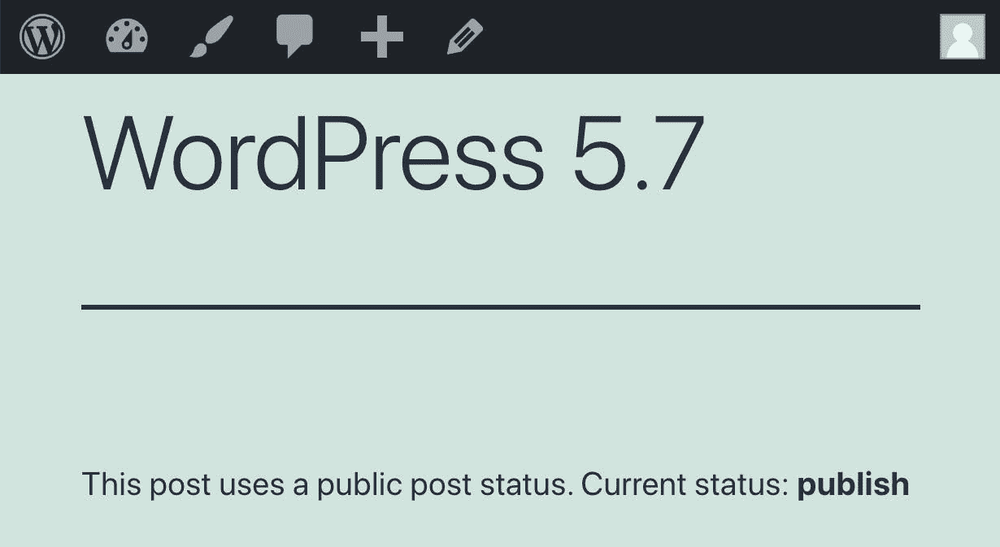

The current status of a publicly viewable post


在私人帖子中，结果将如下:

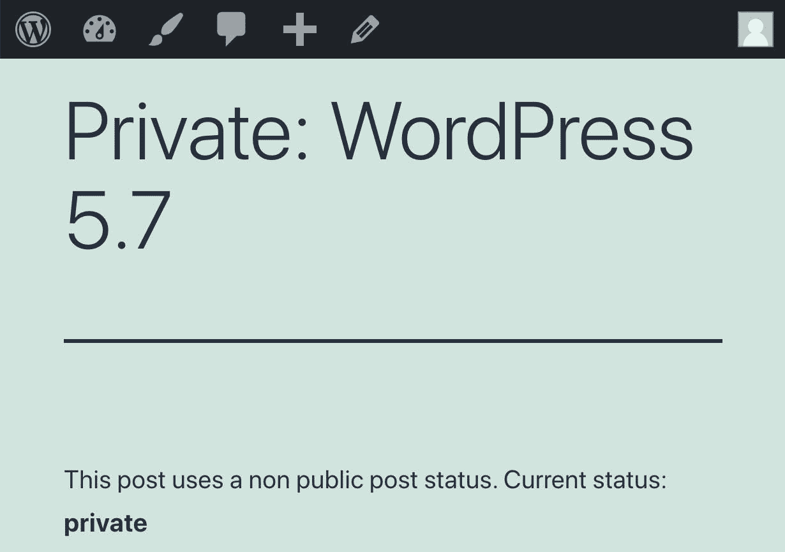

The current status of a private post


《发展报告》的作者让·巴普蒂斯特·奥德拉斯警告说:

> 请注意，受密码保护的帖子被认为是公开可见的，而私人帖子则不是。

### is _ post _ publicly _ viewable()

如果`is_post_status_viewable()`和`is_post_type_viewable()`都返回`true`，新的`is_post_publicly_viewable()`函数将返回`true`。它还让我们确定特定的帖子是否是公开可见的(例如，它是否对已注销的用户可见)。

`is_post_publicly_viewable()`接受一个可选参数:

*   `$post` ( *string|stdClass* )一个帖子 ID 或对象。默认情况下，传递全局`$post`对象。

## 一个新的动态挂钩，用于过滤特定块类型的内容

WordPress 5.7 引入了一个[新的动态钩子](https://make.wordpress.org/core/2021/02/18/wordpress-5-7-a-new-dynamic-hook-to-filter-the-content-of-a-single-block/)，使得开发者能够过滤特定块类型的内容。

这个新鲜的`render_block_{$this->name}`滤镜类似于现有的`render_block` [滤镜](https://developer.wordpress.org/reference/hooks/render_block/)，有一个关键区别:`render_block`过滤单个块的内容，而新的动态钩子过滤块类型`{$this->name}`的内容。

要使用此过滤器，您应该提供以下参数:

*   `$block_content` ( *字符串*):要追加的块内容。
*   `$block` ( *数组*):完整的块，包括名称和属性。

回调返回修改后的块内容。

以下示例显示了此过滤器在段落块上的使用情况:

```
add_filter( 
	'render_block_core/paragraph', 
	function( $block_content, $block ) {
		$content  = '<div class="my-custom-wrapper">' . $block_content . '</div>';
		return $content;
	}, 
	10, 
	2 
);
```

在本例中，`core/paragraph`后缀是核心段落块类型的 slug。对于自定义块，slug 应该是类似于`my-custom-plugin/my-custom-block`的东西。

请参见[开发说明](https://make.wordpress.org/core/2021/02/18/wordpress-5-7-a-new-dynamic-hook-to-filter-the-content-of-a-single-block/)以获得更深入的概述和更多使用示例。

## 新机器人 API

meta 标签允许网站所有者控制网页如何在搜索引擎结果中被索引并提供给用户(顺便说一句，一定要查看我们关于 WordPress SEO 的[指南)。](https://kinsta.com/blog/wordpress-seo/)

WordPress 5.7 引入了一个新的 [Robots API](https://make.wordpress.org/core/2021/02/19/robots-api-and-max-image-preview-directive-in-wordpress-5-7/) ，允许开发者控制这个`robots` meta 标签。新的 API 为主题开发者提供了一个`wp_robots`过滤器，将他们的自定义指令添加到`robots` meta 标签中。

此外，`max-image-preview:large`指令现在默认添加到配置为搜索引擎可见的网站中。它指示搜索引擎在搜索结果中显示大图片预览。

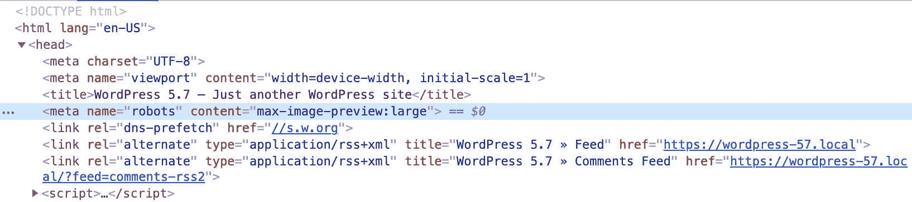

The ‘max-image-preview:large’ directive in WordPress 5.7


开发人员可以使用以下代码删除`max-image-preview:large`指令:

```
remove_filter( 'wp_robots', 'wp_robots_max_image_preview_large' );
```

定制`robots`指令非常简单。dev note 中的以下示例显示了如何向 meta 标记添加自定义指令:

```
add_filter( 
	'wp_robots', 
	function( $robots ) {
		$robots['follow'] = true;
		return $robots;
	}
);
```

上面的代码会产生以下输出:

```
<meta name="robots" content="max-image-preview:large, follow">
```

也可以通过取消设置值来删除现有的指令。以下代码禁用了`max-image-preview`指令:

```
function my_wp_robots_directives( $robots ) {
	unset( $robots['max-image-preview'] );
	$robots['follow'] = true;
	return $robots;
}
add_filter( 'wp_robots', 'my_wp_robots_directives' );
```

你会在 [Ahrefs 博客](https://ahrefs.com/blog/meta-robots/)和[谷歌搜索参考](https://developers.google.com/search/reference/robots_meta_tag)上找到对`robots` meta 标签的深入概述。关于新的 WordPress Robots API 和废弃函数的更多信息，请参见[开发说明](https://make.wordpress.org/core/2021/02/19/robots-api-and-max-image-preview-directive-in-wordpress-5-7/)。

## 重置密码链接

一项新功能现在允许网站管理员通过电子邮件向任何注册用户发送重设密码链接。如果用户出于任何原因无法访问重置密码链接，此功能会很有用。

网站管理员可以从不同的地方通过电子邮件发送重置密码链接。首先，你会发现一个新的部分，在任何用户[的个人资料屏幕](https://wordpress.org/support/article/users-your-profile-screen/)中提供了一个**发送重置链接**按钮。

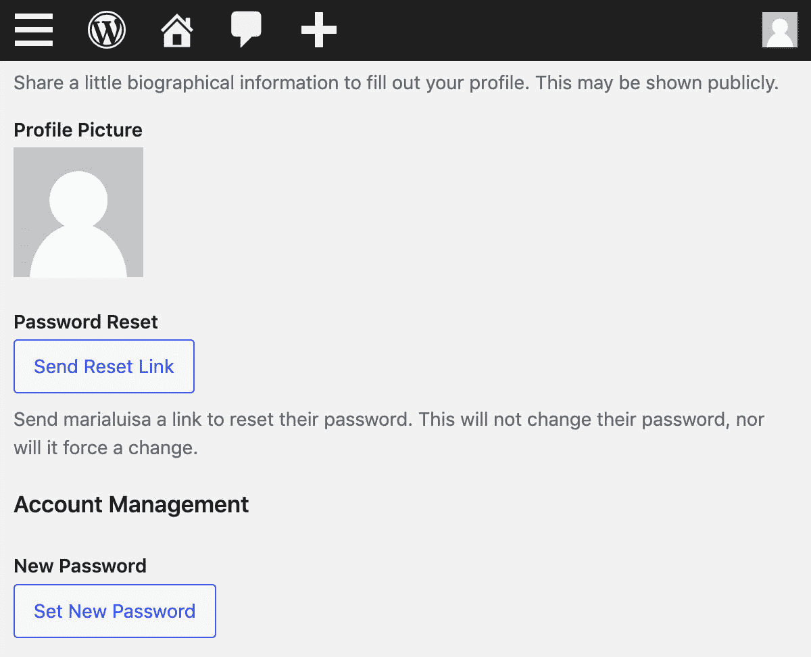

Send Reset Link button in Your Profile screen


如果一切顺利，您应该会看到一个管理员通知，确认已经通过电子邮件将[密码重置](https://kinsta.com/blog/change-wordpress-password/)链接发送给了用户。

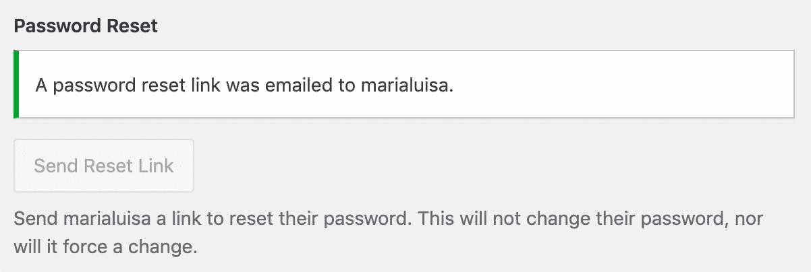

An admin notice confirms that the email has been successfully sent


您也可以从[用户屏幕](https://wordpress.org/support/article/users-screen/)发送密码重置链接。

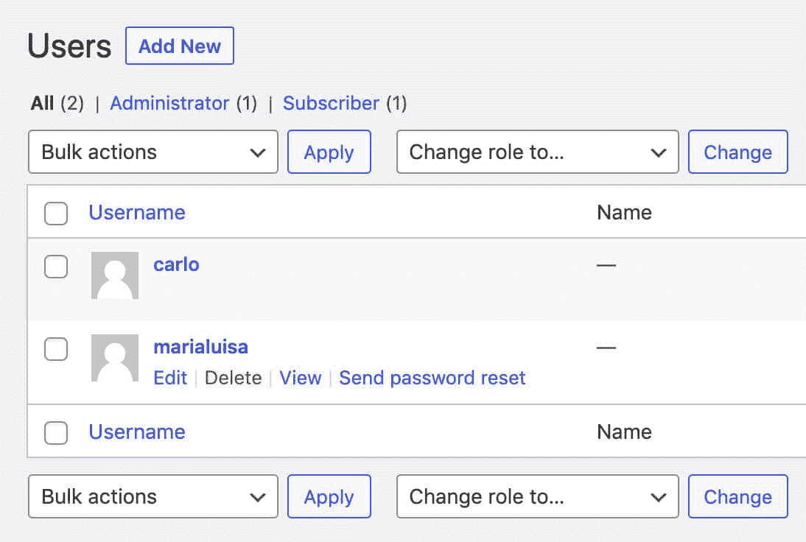

Send Password Reset link in Users Screen


你甚至可以选择几个用户，批量发送密码重置链接。

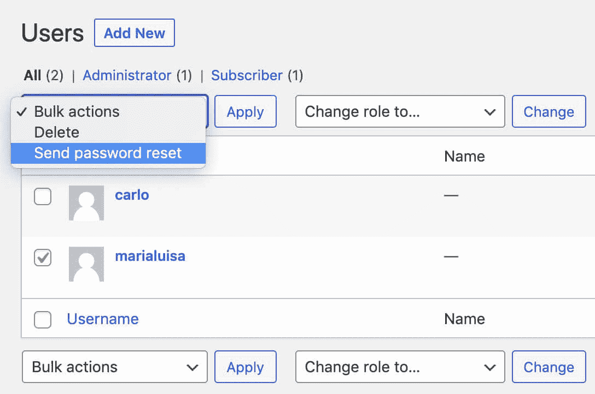

Send password reset link in Bulk actions


如前所述，用户将收到一封包含密码重置链接的电子邮件。下图显示了 [DevKinsta 电子邮件收件箱](https://kinsta.com/knowledgebase/devkinsta/email-inbox/)工具中的密码重置电子邮件。

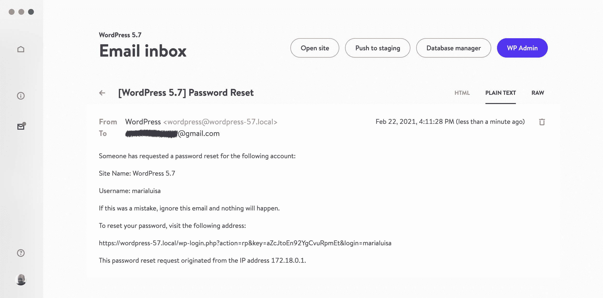

The Password Reset email in DevKinsta


开发者可以使用`retrieve_password_title`和`retrieve_password_message`过滤器定制电子邮件的主题和信息。

## 面向开发人员的其他增强功能

### 向脚本标签传递属性的新函数

几个新函数现在允许将属性传递给`<script>`标签(即`async`或`nonce`)。

#### wp_get_script_tag()

`wp_get_script_tag()`加载一个格式化的`script`标签，如果主题没有声明支持 HTML5 `script`标签，自动注入`type`属性。它接受一个键值对数组，表示添加到`<script>`标签的属性。

该函数与新的`wp_script_attributes`过滤器配对，可用于过滤属性。

#### wp _ 打印 _ 脚本 _ 标签()

`wp_print_script_tag()`打印格式化的`script`标签。

#### wp_get_inline_script_tag()

`wp_get_inline_script_tag()`将内联 JavaScript 包装在一个`script`标签中。

这个函数有一个相应的`wp_inline_script_attributes`钩子，用于过滤要添加到脚本标签中的属性。

#### wp_print_inline_script_tag()

`wp_print_inline_script_tag()`在`script`标签中打印内联 JavaScript。

#### wp_sanitize_script_attributes()

新的`wp_sanitize_script_attributes()`函数用于将一组属性整理成一个属性字符串。然后可以将它们添加到一个`script`标签中。

查看[开发说明](https://make.wordpress.org/core/2021/02/23/introducing-script-attributes-related-functions-in-wordpress-5-7/)了解更多信息和使用示例。

### 标准化可湿性粉剂管理颜色

作为一个旨在清理 WP-Admin CSS 的更大项目的一部分，WordPress 现在使用一个新的标准化的 [WP-Admin 调色板](https://make.wordpress.org/core/2021/02/23/standardization-of-wp-admin-colors-in-wordpress-5-7/)。新的调色板包括 12 种色调，分别为蓝色、绿色、红色和黄色。它还添加了 13 种灰色、黑色和白色。另外，它满足最低 [WCAG 2.0 推荐对比度](https://www.w3.org/TR/UNDERSTANDING-WCAG20/visual-audio-contrast-contrast.html)的要求。

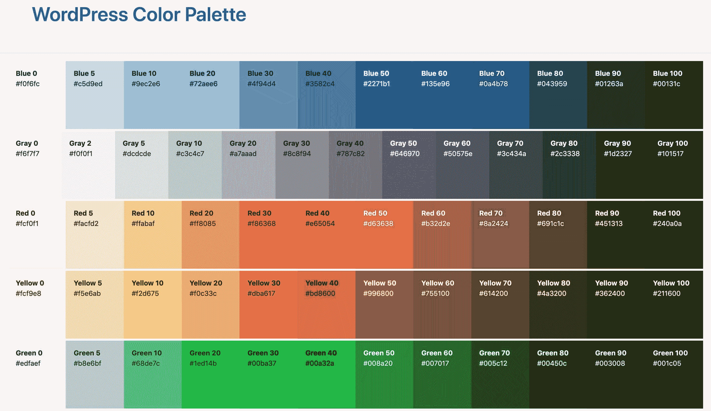

WP-Admin color palette (Image source: [ryelle](https://codepen.io/ryelle/full/WNGVEjw))


用让·巴普蒂斯特·奥德拉斯的话说:

> 标准化这组颜色将有助于贡献者做出一致的、可理解的设计决策。主题和插件开发者被鼓励使用这个新的调色板，以使他们的产品和 WordPress 核心之间更好的一致。

### 站点健康中的 WP_MEMORY_LIMIT 常量

常量`WP_MEMORY_LIMIT`指定 PHP 可以消耗的最大内存量[。](https://wordpress.org/support/article/editing-wp-config-php/#increasing-memory-allocated-to-php)

以前的 WordPress 版本也没有包含的`WP_MEMORY_LIMIT`常量[已经被添加到](https://make.wordpress.org/core/2021/02/23/miscellaneous-developer-focused-changes-in-wordpress-5-7/)到站点健康的信息标签中。

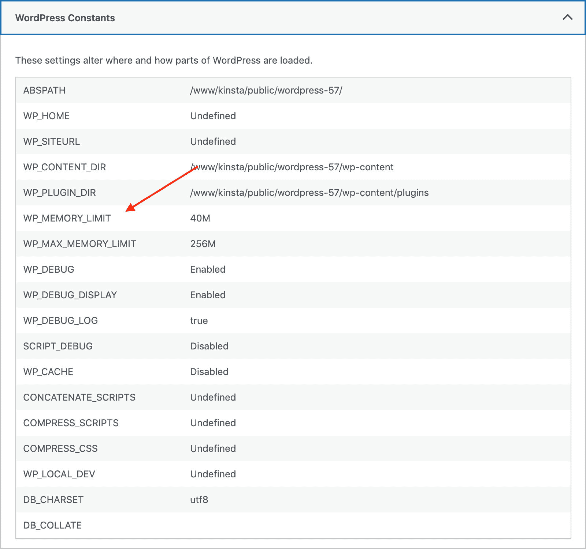

WP_MEMORY_LIMIT in Site Health Info tab


针对开发人员的其他更改在[其他开发人员关注的更改](https://make.wordpress.org/core/2021/02/23/miscellaneous-developer-focused-changes-in-wordpress-5-7/)和[WordPress 5.7 中 REST API 的更改](https://make.wordpress.org/core/2021/02/23/rest-api-changes-in-wordpress-5-7/)中列出。你会在 [WordPress 5.7 领域指南](https://make.wordpress.org/core/2021/02/23/wordpress-5-7-field-guide/)中找到开发人员笔记的完整列表。

[New features, new APIs, security, accessibility and UI improvements, functions, and hooks for developers... There's a lot of great stuff in WordPress 5.7 🎁 Check out our in-depth overview 🤓Click to Tweet](https://twitter.com/intent/tweet?url=https%3A%2F%2Fkinsta.com%2Fblog%2Fwordpress-5-7%2F&via=kinsta&text=New+features%2C+new+APIs%2C+security%2C+accessibility+and+UI+improvements%2C+functions%2C+and+hooks+for+developers...+There%27s+a+lot+of+great+stuff+in+WordPress+5.7+%F0%9F%8E%81+Check+out+our+in-depth+overview+%F0%9F%A4%93)

## 摘要

WordPress 的市场份额继续稳步增长:

> 据我们所知，有 64.4%的网站使用 WordPress 的内容管理系统。这是所有网站的 40.3%。

这是 CMS 健康的重要证据，特别是对于那些在 WordPress 上建立业务的人。这也是关注 WordPress 生态系统的一个极好的理由。

WordPress 5.7 为用户和开发者增加了大量的新功能和改进，但这仅仅是我们预计在 2021 年看到的一点点。

现在就看你的了。我们错过了什么重要的事情吗？你最喜欢 WordPress 5.7 的哪些变化和特性？

* * *

让你所有的[应用程序](https://kinsta.com/application-hosting/)、[数据库](https://kinsta.com/database-hosting/)和 [WordPress 网站](https://kinsta.com/wordpress-hosting/)在线并在一个屋檐下。我们功能丰富的高性能云平台包括:

*   在 MyKinsta 仪表盘中轻松设置和管理
*   24/7 专家支持
*   最好的谷歌云平台硬件和网络，由 Kubernetes 提供最大的可扩展性
*   面向速度和安全性的企业级 Cloudflare 集成
*   全球受众覆盖全球多达 35 个数据中心和 275 多个 pop

在第一个月使用托管的[应用程序或托管](https://kinsta.com/application-hosting/)的[数据库，您可以享受 20 美元的优惠，亲自测试一下。探索我们的](https://kinsta.com/database-hosting/)[计划](https://kinsta.com/plans/)或[与销售人员交谈](https://kinsta.com/contact-us/)以找到最适合您的方式。