# WordPress 5.8 的新功能(全站点编辑，WebP 图片，全局样式和设置，等等)

> 原文：<https://kinsta.com/blog/wordpress-5-8/>

WordPress 5.8“塔图姆”[来了](https://wordpress.org/news/2021/07/tatum/)，这是一个重大的发布。除了令人难以置信的大量功能、改进和漏洞修复，WP 5.8 引入了一种新的网站建设方式，将首批功能纳入了一个更广泛的项目，称为**全站点编辑**。

除了完整的网站编辑，WordPress 5.8 还对 [CMS](https://kinsta.com/cms-market-share/) 的几个区域进行了大量的改变和增强。

没有使用 Gutenberg 插件的 WordPress 用户将会发现来自总共九个 Gutenberg 版本的特性和改进(要深入了解每个版本，请参见 Gutenberg [9.9](https://make.wordpress.org/core/2021/02/05/whats-new-in-gutenberg-9-9-5-february/) 、 [10.0](https://make.wordpress.org/core/2021/02/17/whats-new-in-gutenberg-10-0-february/) 、 [10.1](https://make.wordpress.org/core/2021/03/02/whats-new-in-gutenberg-10-1-3-march/) 、 [10.2](https://make.wordpress.org/core/2021/03/17/whats-new-in-gutenberg-10-2-17-march/) 、 [10.3](https://make.wordpress.org/core/2021/04/02/whats-new-in-gutenberg-10-3-31-march/) 、 [10.4](https://make.wordpress.org/core/2021/04/14/whats-new-in-gutenberg-10-4-14-april/) 、 [10.5](https://make.wordpress.org/core/2021/04/30/whats-new-in-gutenberg-10-5-28-april/) 、 [10.6](https://make.wordpress.org/core/2021/05/14/whats-new-in-gutenberg-10-6-12-may/)

对于非常关心网站性能的用户来说，一个重要的新特性是 WebP 格式支持。

开发者肯定会喜欢 IE11 从支持的浏览器列表中删除，基于 **theme.json** 的新块配置和样式机制，基于 **block.json** 的改进块注册系统，以及 2021 年第二个 [WordPress 版本](https://kinsta.com/blog/wordpress-version/)带来的许多 API 改进。

所以，请耐心等待，因为这将是一个冗长的功能和增强的综述，为预计在未来几个月发布的新的强大的网站建设工具铺平道路。

 

### 重要的

WordPress 5.8 的变化太多了。为了防止任何与你的主题和插件发生意外冲突的风险，我们强烈建议你在更新你的网站之前，对你的网站进行[备份，并在](https://kinsta.com/help/wordpress-backups/)[试运行环境](https://kinsta.com/help/staging-environment/)中测试新版本。


[WordPress 5.8 'Tatum' is here! 🥳 Check out the new features and enjoy the first implementation of Full Site Editing 🎁Click to Tweet](https://twitter.com/intent/tweet?url=https%3A%2F%2Fbit.ly%2F2TFhMP7&via=kinsta&text=WordPress+5.8+%27Tatum%27+is+here%21+%F0%9F%A5%B3+Check+out+the+new+features+and+enjoy+the+first+implementation+of+Full+Site+Editing+%F0%9F%8E%81)

## WordPress 5.8 中完整的站点编辑功能

完整网站编辑背后的愿景是提供一系列工具和功能，允许 WordPress 用户使用 blocks 构建一个完整的网站。有了完整的站点编辑，我们会看到许多块可以用来在页面上创建任何元素，从[导航菜单](https://kinsta.com/blog/wordpress-menu-plugins/)到站点品牌、侧边栏小部件、模板等等。


即使 WordPress 5.8 引入了几个属于全网站编辑(FSE)范围的功能，也不要期望看到一个全功能的可视化网站建设环境。FSE 仍在开发中，WordPress 5.8 的发布开启了一个公共测试阶段。据约瑟芬·哈登·乔博斯称:

> 完整的网站编辑是一系列项目的集合，它们共同代表了一个巨大的变化，对一个版本来说可能太多了。要分享的最重要的一点是，它并没有为用户提供完整的默认体验。第一阶段合并过程中最明显的反馈之一是没有足够的时间给我们的扩展者(代理、主题作者、插件开发者、网站建设者等等)。)为即将到来的变化做准备。
> 
> 考虑到这一点，这个合并过程不会是一个开/关开关。现在的焦点不是完整和细微的用户体验，而是 WordPress 5.8 中的一个公开测试版。

所以 WordPress 5.8 现在并没有引入一个完美和完整的 FSE 体验。相反，从 5.8 版本开始，我们将会看到新的特性随着时间的推移而增加和改进。出于同样的原因，我们可以假设 WordPress 5.8 不会对我们习惯的网站建设方式产生巨大的影响。

在撰写本文时，网站所有者和管理员仍然必须有意识地选择 FSE，安装一个 block 主题，如[Twenty-Twenty One Blocks](https://wordpress.org/themes/tt1-blocks/)(Twenty-Twenty One 的[基于 block 的版本](https://kinsta.com/blog/twenty-twenty-one-theme/#the-twenty-twentyone-blocks-experiment))，并激活古腾堡插件。


[全站点编辑](https://developer.wordpress.org/block-editor/handbook/full-site-editing/)包含一系列独立的子项目，包括站点编辑器、[全局样式](https://developer.wordpress.org/block-editor/how-to-guides/themes/theme-json/)、查询块、导航块、模板、块主题等等。但是在 WordPress 5.8 中最接近站点编辑的是**模板编辑模式**和相应的[主题块](https://developer.wordpress.org/block-editor/how-to-guides/themes/block-theme-overview/#theme-blocks)可以在该模式下使用，我们将在本文后面看到。

接下来，让我们深入了解一些与 WordPress 5.8 合并到 Core 中的 **FSE 特性。**

### 模板编辑模式

[模板编辑模式](https://make.wordpress.org/core/2021/06/16/introducing-the-template-editor-in-wordpress-5-8/)提供了一种使用块创建帖子/页面模板的方法。这是降低站点构建复杂性的一个很好的方法，允许用户在习惯使用块的同时，利用站点编辑器界面之外的几个站点编辑功能。对于不使用基于块的主题但仍在寻找从块编辑器的用户界面创建和编辑模板的简单方法的用户来说，这也很好。

在 WordPress 中定制主题从来没有这么容易过。现在你不再需要[构建一个子主题](https://kinsta.com/blog/wordpress-child-theme/)来创建你的定制模板。有了 WordPress 5.8，模板编辑不仅仅局限于区块主题，你还可以使用经典主题的[，尽管你必须选择启用经典主题的模板编辑。](https://github.com/WordPress/gutenberg/pull/30438)


### 信息

模板编辑可以在经典主题中使用，包括一个 *theme.json* 文件或支持`'block-templates'`。不能对块主题禁用它。


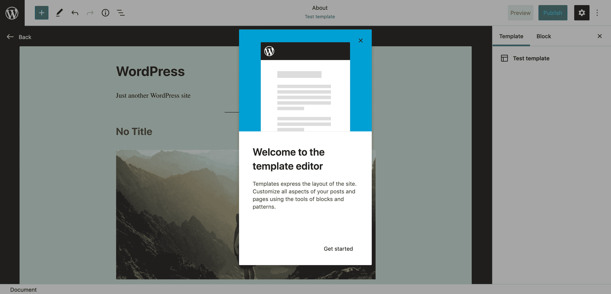

The template editor.


要创建一个新模板，你只需要在**设置**侧边栏中启用模板编辑模式。一个新的**模板**面板现在可供用户切换编辑模式(参见[古腾堡 10.5](https://make.wordpress.org/core/2021/04/30/whats-new-in-gutenberg-10-5-28-april/) 发布说明)。


Template panel in the Block editor Sidebar.


从**模板**面板，您可以创建一个新模板或编辑现有模板。

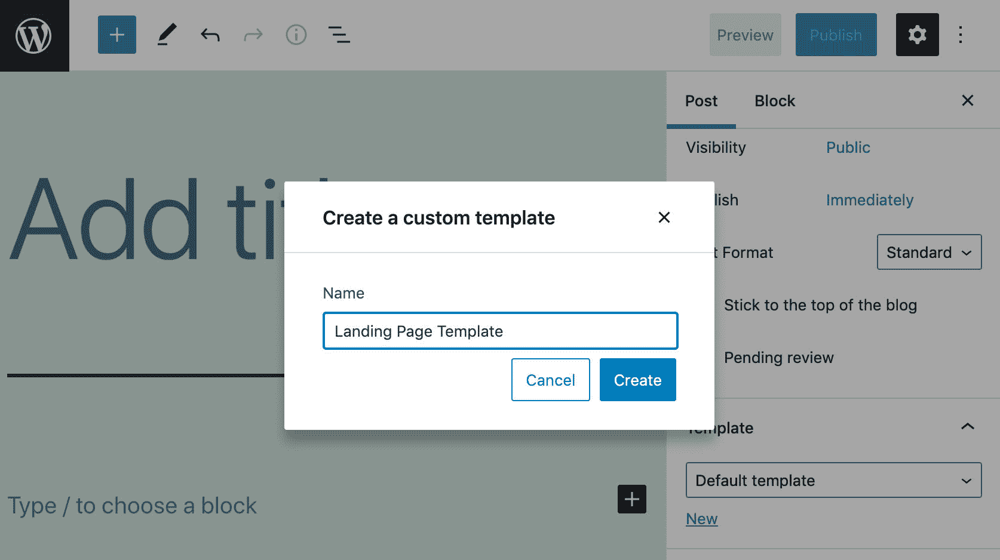

Setting a template name.


要创建新模板，请点击**新建**。然后在模态中输入一个模板名，点击**创建**，就可以开始了。

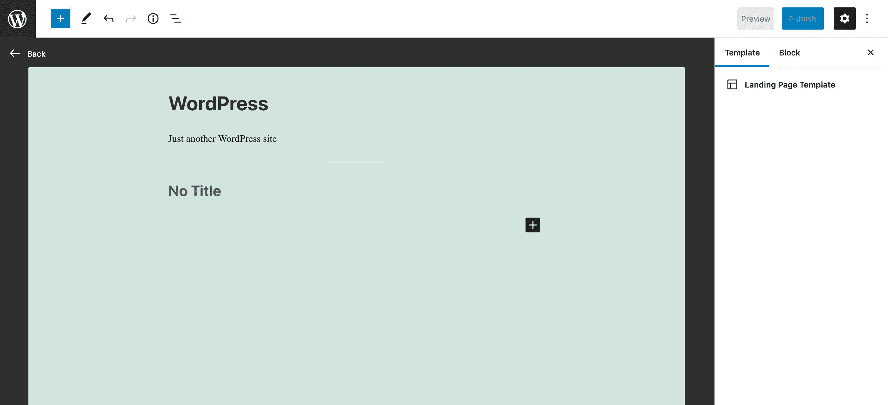

Template Editing Mode in WordPress 5.8.


在模板编辑模式中，您可以使用所有可用的块来构建您的模板，包括 FSE 块，如站点标题、站点标语、登录/退出等等。

对编辑满意后，您可以切换回帖子编辑模式，并将模板与帖子/页面内容分开保存，如下图所示:

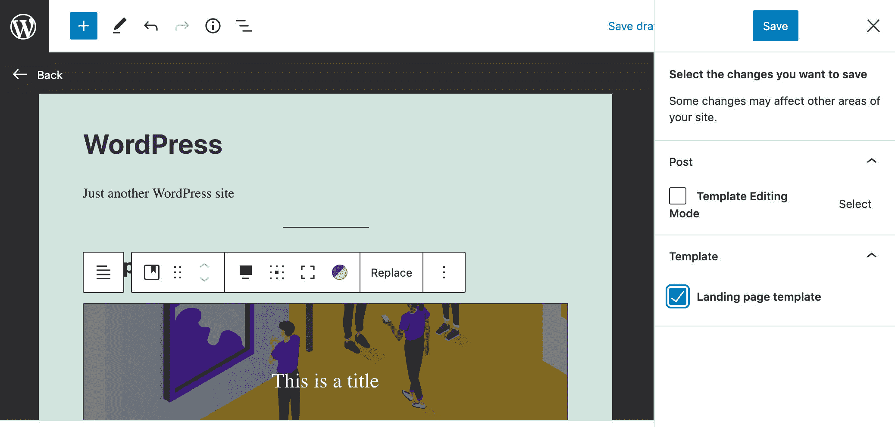

The Save Template options.


模板存储在你的 [WordPress 数据库](https://kinsta.com/knowledgebase/wordpress-database/)中，作为名为`wp_template`的自定义文章类型。这不仅允许您从编辑器界面编辑模板，而且还使得随意导入或导出模板变得容易。您还可以在不同的网站上使用一个模板(在撰写本文时，只有激活 Gutenberg 插件，此功能才可用)。

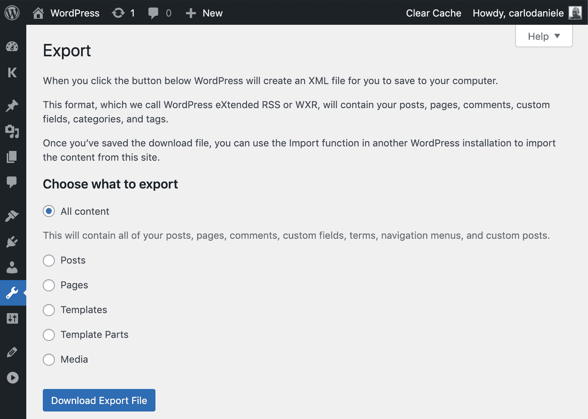

Exporting Templates and Template Parts.


### 信息

请注意，如果您为页面或博客文章设置了块模板，常规的 PHP 模板将不再用于生成页面。将使用块样板。


在撰写本文时，模板编辑模式仍然有一点问题，正如贾斯汀·塔德洛克的这个测试和[实验](https://wptavern.com/fse-outreach-7-building-a-portfolio-in-the-upcoming-template-editing-mode)的[调用中所报告的。](https://make.wordpress.org/test/2021/05/26/fse-program-testing-call-7-polished-portfolios/)

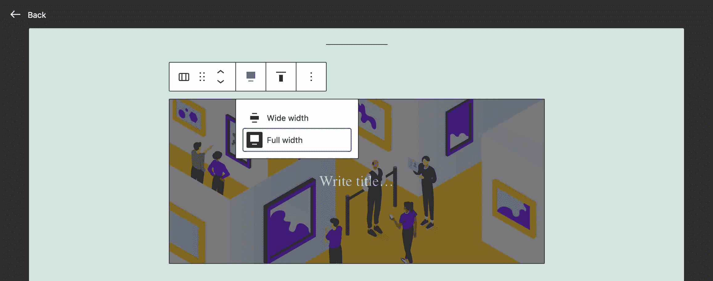

Full-width alignment issue in Twenty Twenty-One classic theme.


但是需要的只是一点耐心，等待[主要问题](https://github.com/WordPress/gutenberg/labels/%5BFeature%5D%20Template%20Editing%20Mode)得到解决，以充分理解模板编辑模式将如何改变你定制网站的外观和感觉。

用户将不再需要开发人员的技能来获得对布局和网站整体外观的完全控制。

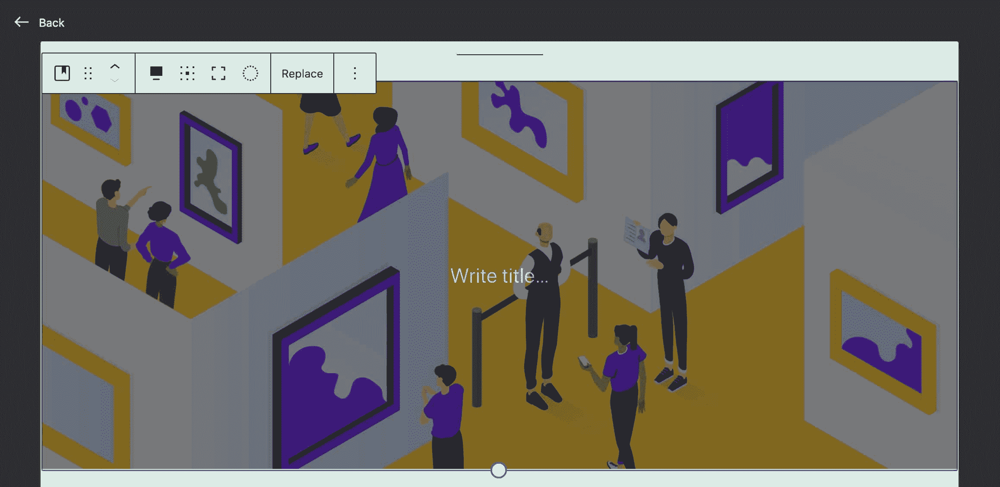

The full-width alignment issue has been fixed.


模板编辑模式最初[可用于街区主题和经典主题](https://github.com/WordPress/gutenberg/pull/30438)。在 5.8 leads 频道经过深思熟虑的讨论后，决定让模板编辑器选择加入经典主题，选择退出块主题(另请参见 pull # [32858](https://github.com/WordPress/gutenberg/pull/32858) )。

据[卡罗莱娜·尼马克](https://make.wordpress.org/themes/2021/07/08/summary-theme-features-in-wordpress-5-8/):

> 最初，所有主题都支持模板编辑。主题开发者担心他们无法更新所有现有的经典主题来支持这一新功能。随着最新的变化，发布团队和编辑团队选择改变模板编辑，以选择加入经典主题。

要选择经典主题，现在开发者应该添加主题支持:

```
add_theme_support( 'block-templates' );
```

使用 *theme.json* 的经典主题可以通过移除主题支持来退出:

```
remove_theme_support(  'block-templates' );
```

想要更详细地了解模板编辑模式在 WordPress 5.8 中是如何工作的，以及一些有用的用法示例，请务必观看 Anne McCarty 的视频:


### 主题块

如前所述，FSE 不是一个单一的功能，而是一套完整的网站建设功能，不仅仅与网站编辑器相关。[模板编辑模式](#template-editing-mode)就是一个例子。但是连同模板编辑，WordPress 5.8 也带来了许多[主题块](https://make.wordpress.org/core/2021/04/20/full-site-editing-go-no-go-next-steps/)，可以显示从数据库中动态检索的信息。其中一些块也可以在非 FSE 上下文中使用(参见 issue # [28744](https://github.com/WordPress/gutenberg/issues/28744) )。


Full Site Editor blocks available in non-FSE contexts since WordPress 5.8.


**主题块为经典主题**带来了模板标签功能，你可以像普通块一样使用它们。例如，您可以在文章内容或模板的任何地方添加文章标签或文章的特色图片。要了解 WordPress 5.8 添加到核心的主题块的数量，只需在块占位符中键入 **/post** :

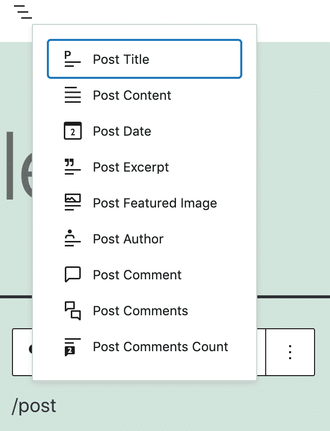

Suggested theme blocks.


WordPress 5.8 中一个有用的主题块是**登录/退出**块，它提供了登录和注销链接。它可以选择显示登录表单而不是链接。站点管理员也可以定制重定向目标(参见 PR # [29766](https://github.com/WordPress/gutenberg/pull/29766) )。

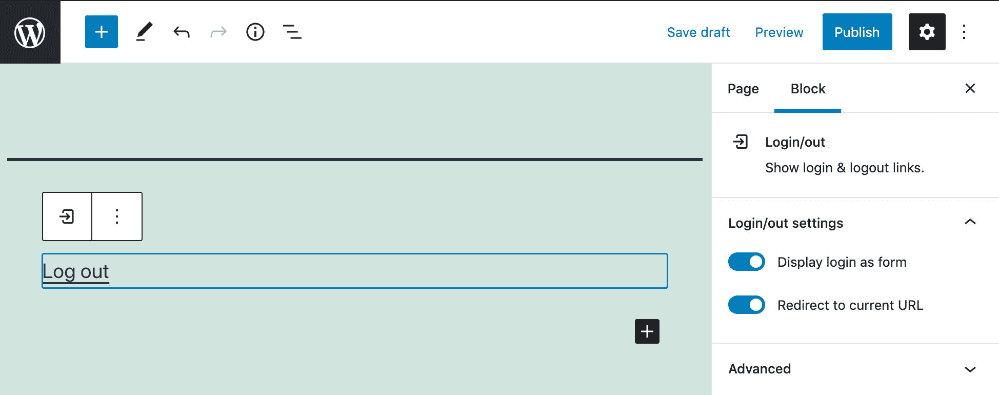

Login/out block its settings in the block editor.


关于 FSE 块的详细视图，请参见 Github 上的“在经典主题中启用完整的站点编辑器块”[一期。
T3】](https://github.com/WordPress/gutenberg/issues/28744)

### 查询循环块

有多少次你发现自己需要显示一个定制的博客文章列表或者定制的文章类型？想想产品、事件、房地产……当然，你有大量的插件可供选择，但是创建高度定制化查询的能力通常需要开发人员掌握 [WordPress 循环](https://developer.wordpress.org/themes/basics/the-loop/)的技能。

随着 WordPress Core 中[查询循环块](https://github.com/WordPress/gutenberg/issues/24762)的引入，网站所有者和管理员可以创建帖子和 CPT 列表，而无需编写复杂的代码或[雇佣开发人员](https://kinsta.com/blog/hire-wordpress-developer/)，至少在最常见的用例中是如此。

那么，查询循环块做什么呢？

简而言之，它做的工作和 WordPress 循环一样，但是在块编辑器的可视上下文中。

查询循环块根据用户在 WordPress 数据库上的设置执行查询，遍历每个检索到的帖子，并在页面上显示数据。

经过[集约化开发](https://github.com/WordPress/gutenberg/issues/24762)，该区块达到目前的结构，现在[由两个嵌套的区块](https://github.com/WordPress/gutenberg/pull/32283)组成:**查询**和**帖子模板**区块。

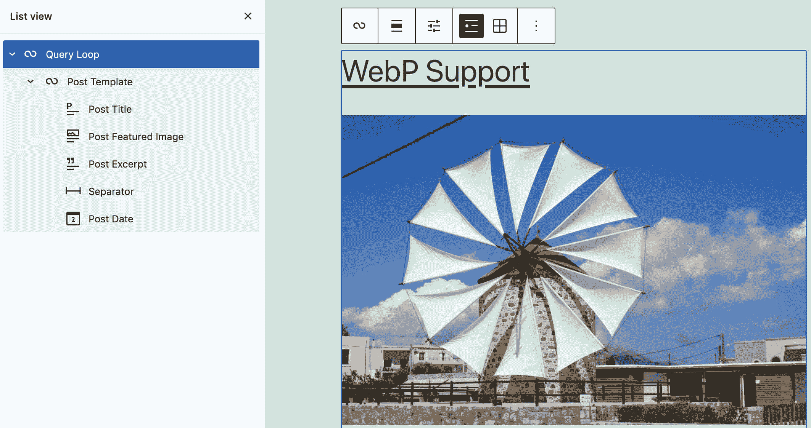

List View of a Query Loop block.


作为一项高级功能，查询循环块需要一些配置。

首先，您可以在转盘和网格视图中列出的不同[块模式](https://kinsta.com/blog/wordpress-5-5/#block-patterns)之间进行选择。一旦你选择了你的模式，只需点击**选择**，查询循环块将生成你的定制帖子列表。

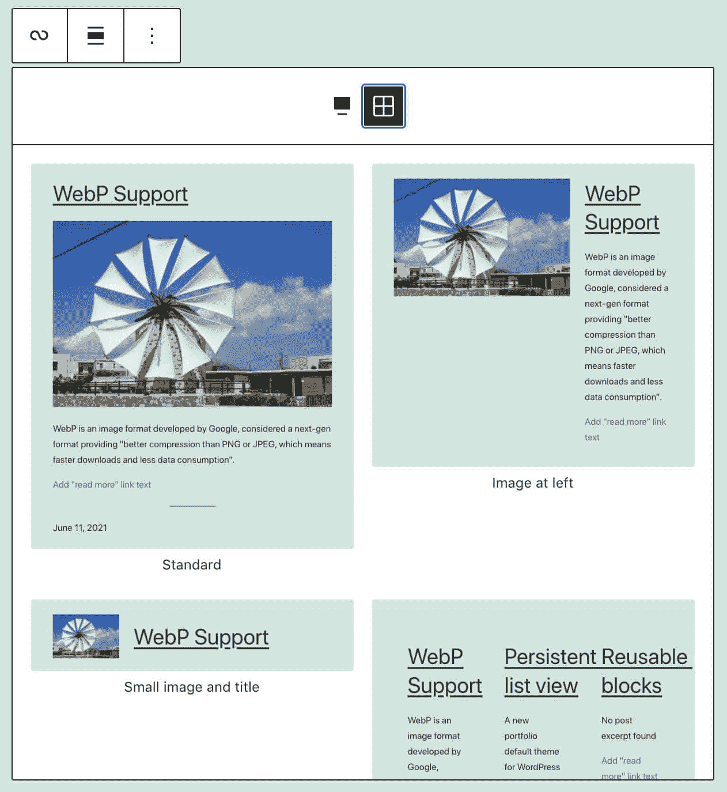

Query Loop block patterns in Grid view.


如果你点击**开始空白**，你会看到四个核心区块变化列表:**标题&日期**；**标题&节选**；**标题，日期&摘录**；以及**图像、日期&标题**(参见[区块设置上的提供图案](https://make.wordpress.org/core/2021/03/17/whats-new-in-gutenberg-10-2-17-march/))。

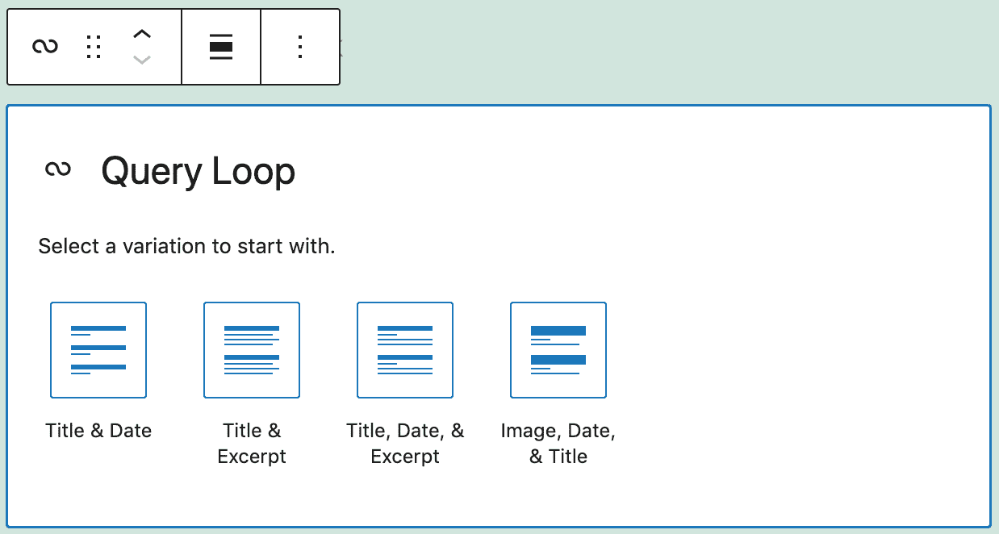

Query Loop block variations.


一旦就位，选择查询循环块将显示块设置侧栏，您可以在这里构建您的查询。您可以从 [URL](https://kinsta.com/knowledgebase/what-is-a-url/) 继承查询，也可以定制查询参数:要包含在列表中的帖子类型、显示顺序以及是否有帖子。

您还可以设置几个过滤器，从类别、作者和关键词中进行选择。

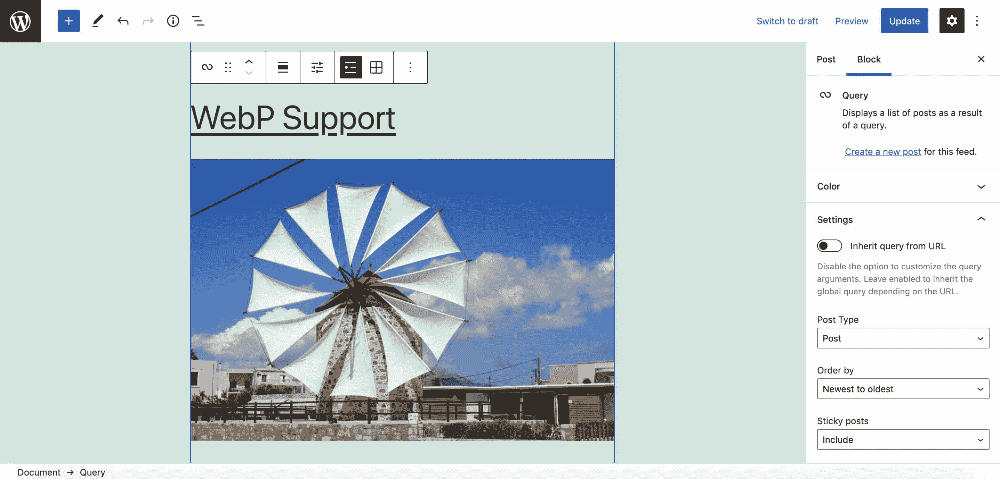

The Query Loop block with sidebar settings.


此外，块工具栏中的**显示设置**按钮提供了更多设置来控制每页的项目数、偏移量和显示的最大页数。

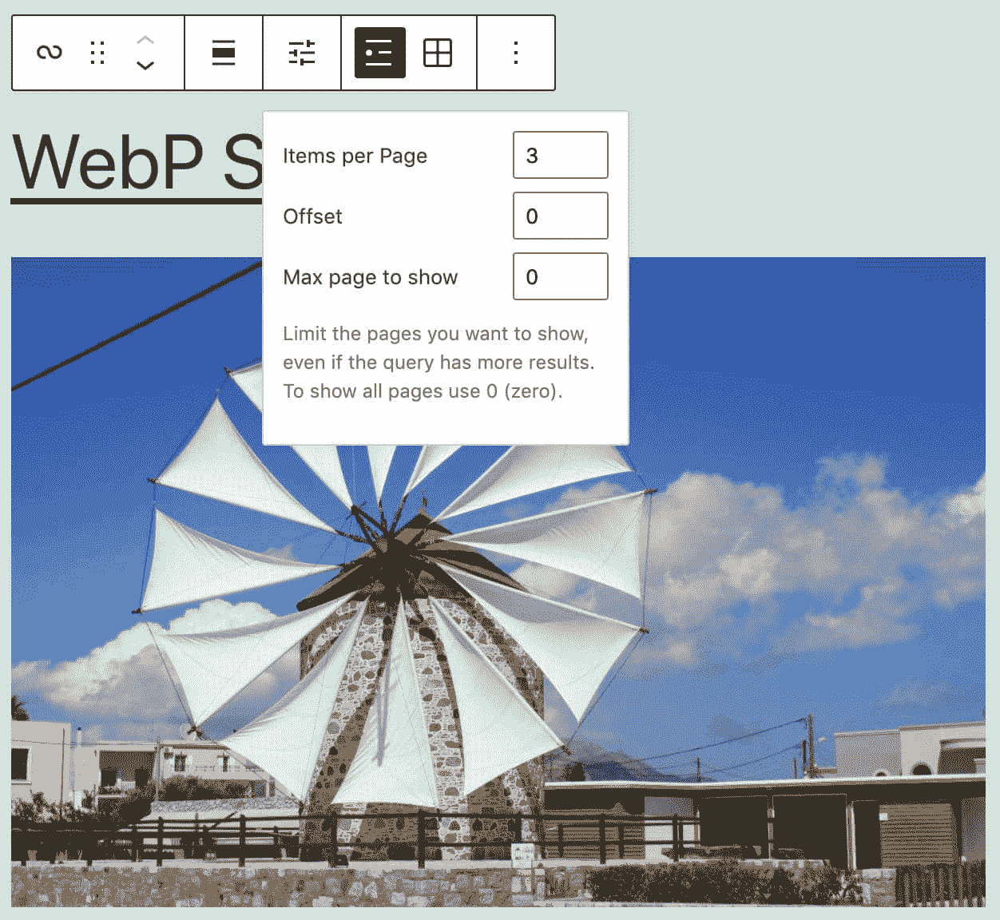

Display Query Loop block settings.


是的，查询循环块是一个强大的工具，允许站点所有者创建高度定制的帖子列表和定制的帖子类型。

但是，如果您浏览一下 [WP_Query](https://developer.wordpress.org/reference/classes/wp_query/) 类参数，很明显，使用代码可能的定制级别比使用查询循环块可能的定制级别要精细得多。

然而，它确实是一个有价值且灵活的工具，适用于许多用例，我们很可能会在未来看到进一步的增强。


### 信息

在过去的几周里，查询循环和 Post 模板块已经被重命名了几次。最终的命名已经与[古腾堡 10.9](https://make.wordpress.org/core/2021/06/24/whats-new-in-gutenberg-10-9-23-june/) 达成。


### 帖子编辑器中的持久列表视图

另一个扩展到帖子编辑器的 FSE 特性是**持久列表视图**。在 WordPress 5.8(和[古腾堡 10.7](https://make.wordpress.org/core/2021/05/27/whats-new-in-gutenberg-10-7-26-may/) )之前，列表视图显示在弹出窗口中。当将焦点移出弹出窗口时，列表会消失。

相反，站点编辑器在包含整个块树的侧边栏中显示列表视图。

在 WordPress 5.8 中，列表视图现在显示在文章编辑器的侧边栏中，允许用户更快更精确地浏览区块树。

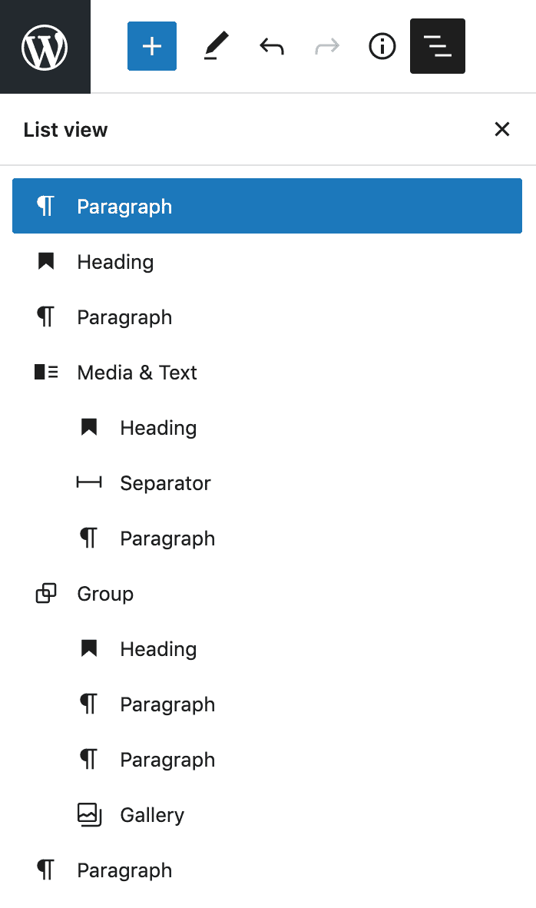

The List View sidebar in WordPress 5.8.


单击列表视图中的一个项目会突出显示该列表项目，并将焦点移动到 Post 编辑器画布中的相应块。此外，如果您将鼠标悬停在列表视图中的项目上，项目和帖子编辑器中相应的块都会高亮显示。

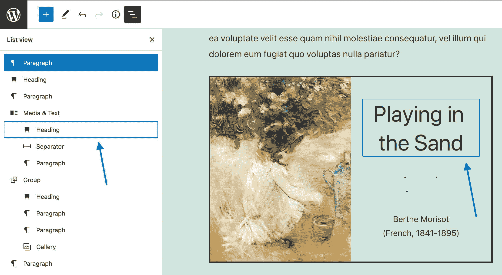

Hovering over the items in the List View.


最后，将锚点添加到块中也会出现在列表视图中相应项目的旁边。

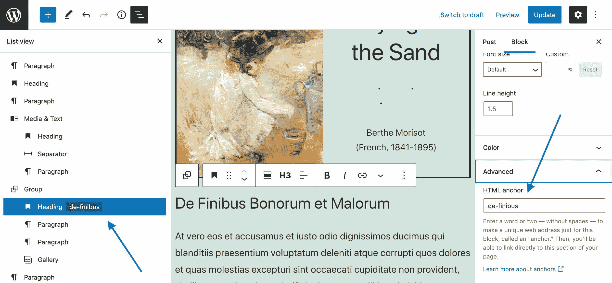

Adding an anchor to blocks in WordPress 5.8.


有了对列表视图的所有这些增强，导航复杂的文档应该会容易得多。


## 基于块的小部件编辑器和定制器中的块小部件

基于**块的小部件编辑器**是一个[范围的项目](https://github.com/WordPress/gutenberg/projects/27)，旨在将[块编辑器的界面引入经典主题小部件](https://make.wordpress.org/core/2021/02/11/bringing-the-power-of-blocks-to-widgets/)。

新的窗口小部件编辑器为大多数仍在使用经典主题的人提供了许多优势。同时，它允许他们在 block 界面成为所有 [WordPress 用户](https://kinsta.com/blog/wordpress-user-roles/)的标准之前熟悉它。

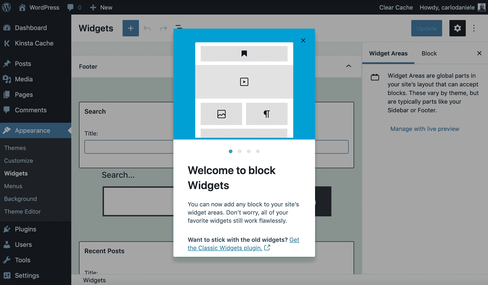

Block widgets modal.


正如 [Anne McCarty 指出的](https://make.wordpress.org/core/2021/02/11/bringing-the-power-of-blocks-to-widgets/)，基于块的小部件提供了几个优势，包括以下几点:

*   您现在可以使用分栏、分隔符、间隔符和其他设计块在侧栏、页眉和页脚中创建**布局。**
*   小部件现在默认支持**富文本编辑**，不需要用户添加自定义代码或嵌入带有插件的第三方 HTML 编辑器。
*   许多基于短代码的小部件现在**可以作为块**使用，简化了编辑体验。

[Andrei Draganescu](https://make.wordpress.org/core/2021/05/12/help-test-the-widgets-editor-for-wordpress-5-8/) 还强调了从基于块的界面编辑小工具的优势:

> 将窗口小部件功能升级到块的主要好处是能够使用您在编辑页面或站点上的帖子时使用的熟悉的块交互来直接编辑窗口小部件。从无代码迷你布局到利用庞大的核心和第三方块库来创建内容，能够使用块打开了大量新的创作可能性。

你不必担心你的小部件在 WordPress 5.8 中可能会停止工作，因为[社区已经努力工作](https://make.wordpress.org/core/2021/05/12/help-test-the-widgets-editor-for-wordpress-5-8/)以[确保向后兼容](https://make.wordpress.org/core/2021/05/07/whats-next-in-gutenberg-may-2021/)以便“现有的小部件和第三方小部件将继续工作，并且可以与块一起使用”(参见[WordPress 5.8 中基于块的小部件编辑器](https://make.wordpress.org/core/2021/06/29/block-based-widgets-editor-in-wordpress-5-8/))。

但是同样，为了防止你现有的 WordPress 安装上的任何兼容性问题，不要忘记在更新你的 live 站点之前在一个[暂存环境](https://kinsta.com/help/staging-environment/)中测试新版本。

对于那些现在选择不使用基于块的小部件编辑器的人来说，仍然可以通过三种不同的方式恢复经典的[小部件](https://kinsta.com/blog/wordpress-widgets/)屏幕:

1.  可以安装[官方经典 widgets 插件](https://wordpress.org/plugins/classic-widgets/)，恢复 Widgets 屏幕之前的界面。该插件“将被支持和维护到至少 2022 年，或者只要有必要”。
2.  主题开发者可以像往常一样通过移除主题支持来禁用基于块的小部件编辑器:

    ```
    remove_theme_support( 'widgets-block-editor' );
    ```

3.  也可以使用新的`use_widgets_block_editor`过滤器:

    ```
    add_filter( 'use_widgets_block_editor', '__return_false' );
    ```

参见[微件模块编辑器概述](https://developer.wordpress.org/block-editor/how-to-guides/widgets/overview/)中的[恢复经典微件编辑器](https://developer.wordpress.org/block-editor/how-to-guides/widgets/opting-out/)。

### 阻止定制器的小部件

作为同一个项目的一部分，WordPress 5.8 也为定制器带来了**块部件。**

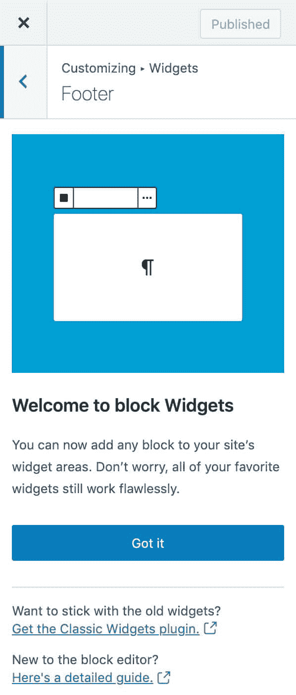

Block widgets in the customizer.


在定制器中添加基于块的小部件非常简单。您可以通过点击微件面板右上角的加号图标启动**定制微件插入器**。

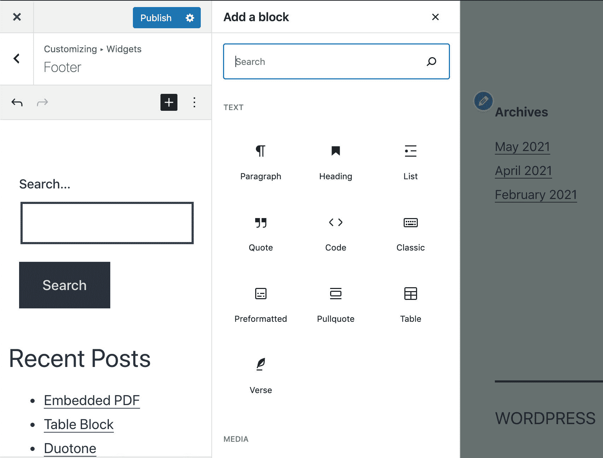

The customize widgets inserter.


您也可以从 widgets 面板的底部启动**快速插入器**，如下图所示。

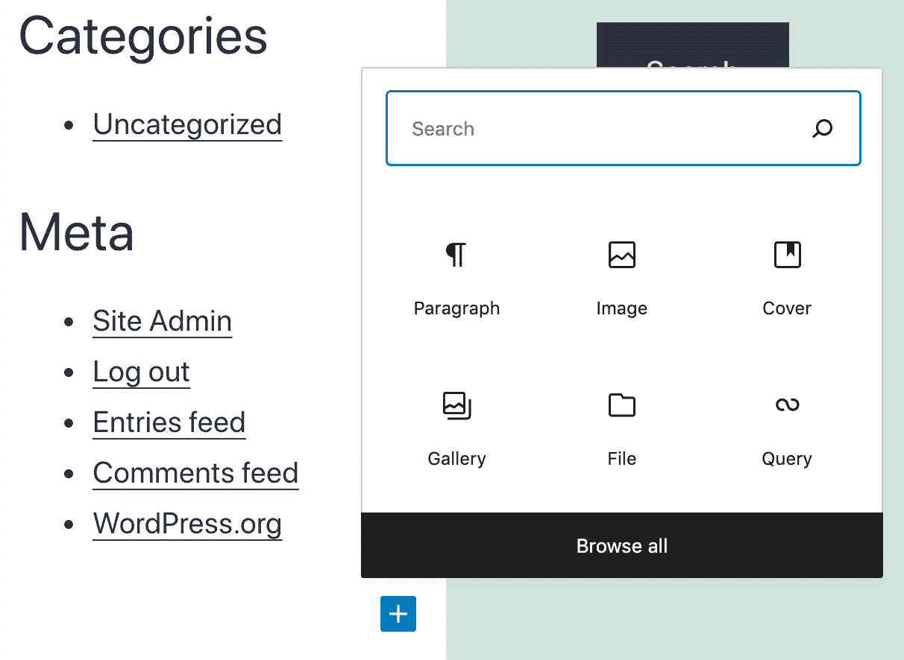

The customize widgets quick inserter.


在撰写本文时，新的小部件编辑界面仍然需要[改进和 bug 修复](https://github.com/WordPress/gutenberg/labels/%5BFeature%5D%20Widgets%20Customizer)，但是定制的可能性实际上是无限的。

基本上，从 WordPress 5.8 开始，你将拥有定制器中的[块编辑器](https://kinsta.com/blog/gutenberg-wordpress-editor/)的能力，并且你将能够毫无争议地构建高度定制的边栏。

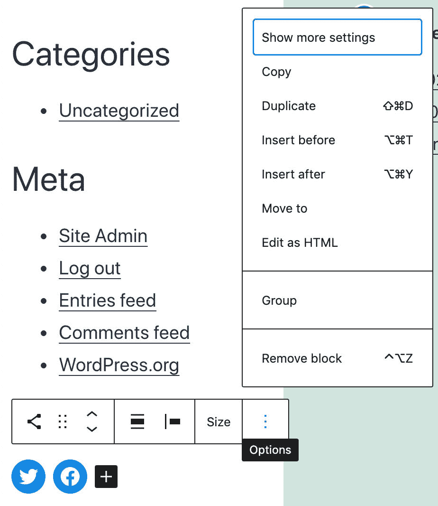

Show more settings.


[基于块的小部件编辑器 dev-note](https://make.wordpress.org/core/2021/06/29/block-based-widgets-editor-in-wordpress-5-8/) 为开发者提供了基于块的小部件编辑器的更深入的概述，以及示例和资源。

## 块编辑器的功能和改进

除了第一个 FSE 实现之外，WordPress 5.8 还为块编辑器的几个元素带来了新的特性和增强，这显著地改善了整体的编辑体验。

这些变化包括:

### 媒体和文本块增强

将一个块转换成一个**列**块已经有一段时间了。但是，所有转换为列的块都只有一列。对于**媒体&文本**块来说，这可能导致次优的结果，因为单列通常不适合。

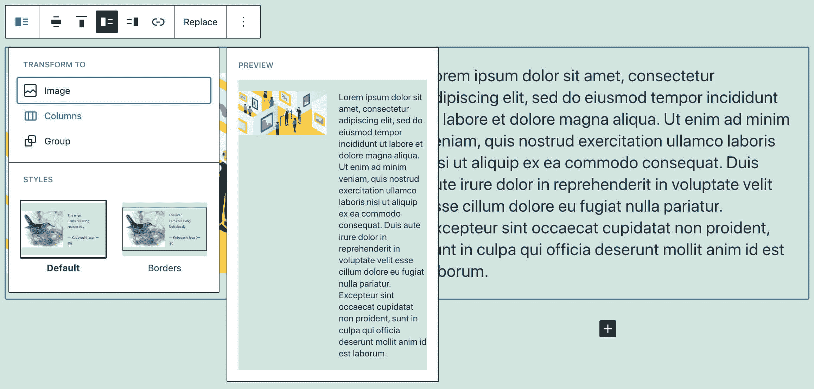

Media & text block transforms and styles.


从 WordPress 5.8(和 [Gutenberg 10.2](https://make.wordpress.org/core/2021/03/17/whats-new-in-gutenberg-10-2-17-march/) )开始，将**媒体&文本**块转换为**列**块会自动添加两列:一列用于图像，另一列用于文本。

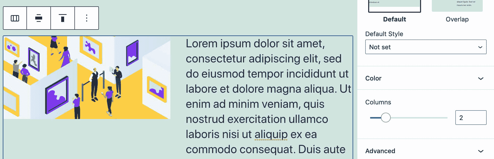

Two columns transformed for media and text.


### 可重用模块改进

可重复使用的区块允许用户保存一个区块或一组区块，以便以后在网站的任何帖子或页面中重复使用。这对于那些在不同的帖子/页面中重复包含同一个块或一组块的用户非常有用。

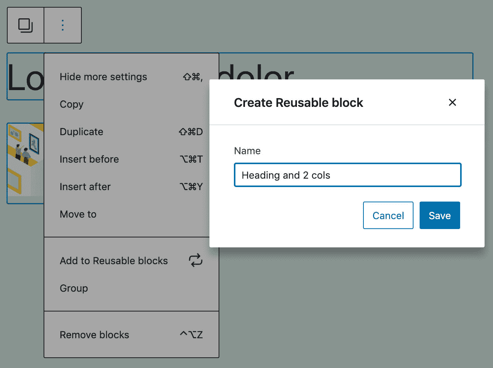

A modal for the reusable blocks creation flow.


有了 WordPress 5.8，可重用的块在视觉上更加清晰，让 WordPress 用户更容易管理。

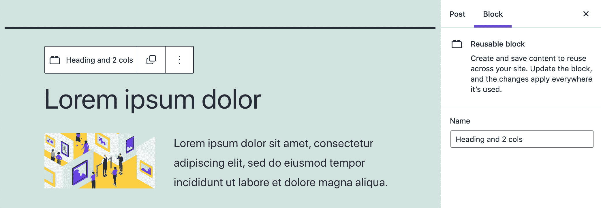

A reusable block in WordPress 5.8.


以下是用户将网站升级到 WordPress 5.8 后，可重用区块的快速改进列表:

*   创建可重用块时，模式现在允许用户为块指定名称。
*   可重用块的名称现在显示在块工具栏、导航列表和面包屑中。
*   当选择一个子块时，可重复使用的块现在会显示出来。这标志着可用性的显著提高，因为它允许您轻松识别父块及其内容。
*   现在可以在侧边栏检查器中修改块名了。

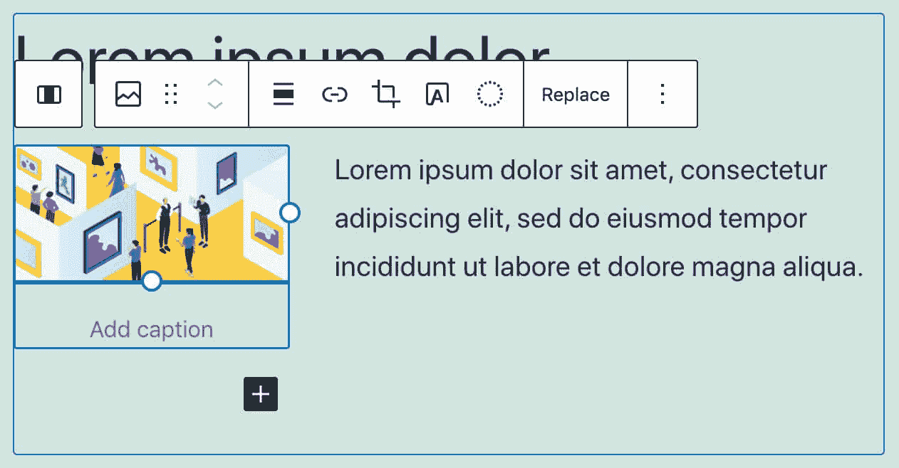

Reusable block outlines.


### 标准化块工具栏

重新排列了几个块工具栏，以提供跨块的[一致的用户界面，并改善用户体验。现在，工具栏控件按照“元、块级、内联”的语义顺序进行分组。](https://make.wordpress.org/core/2021/03/02/whats-new-in-gutenberg-10-1-3-march/)

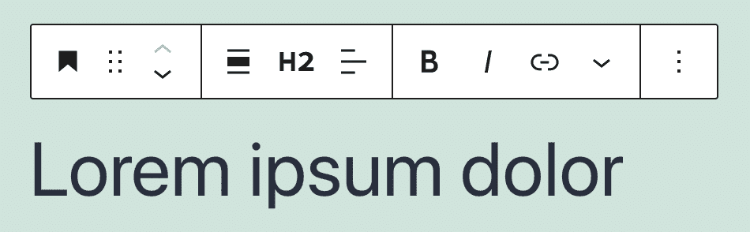

Heading block toolbar.


从[古腾堡 10.1](https://make.wordpress.org/core/2021/03/02/whats-new-in-gutenberg-10-1-3-march/) 和[古腾堡 10.3](https://make.wordpress.org/core/2021/04/02/whats-new-in-gutenberg-10-3-31-march/) 开始，一整套的 block 工具栏被规范化。这些包括一个[图像](https://github.com/WordPress/gutenberg/pull/29205)，按钮，按钮，列表，标题，段落，引用，音频，文件，媒体&文本，视频等等。

根据马蒂亚斯·文图拉的说法:

> 工具栏中的语义分组——元、块级、内联——也应该有一个带有边框的可视化表示。现在独立的块级控件有不同的表现形式，包括像导航这样的情况，每个控件都有边框。

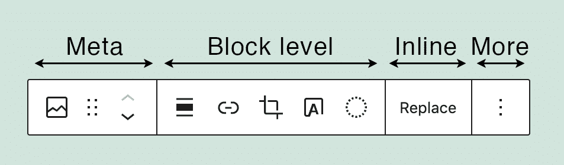

Normalized image block toolbar.


因此，从 WordPress 5.8 开始，块工具栏将[控件分组到由边框包围的片段](https://developer.wordpress.org/block-editor/how-to-guides/designers/block-design/#group-block-toolbar-controls-with-related-items)中。此外:

*   **Meta** 段包含块类型的控件，如块切换器、拖动手柄和移动器控件。
*   **块级**段包含影响整个内容的特定块工具，如段落块中的对齐或图像块中的链接。
*   **内联级别/其他**段包含内联转换工具，例如文本块中的内联格式。
*   **更多**菜单包括附加工具。

下图比较了 WordPress 5.7 和 5.8 中的图像块工具栏:

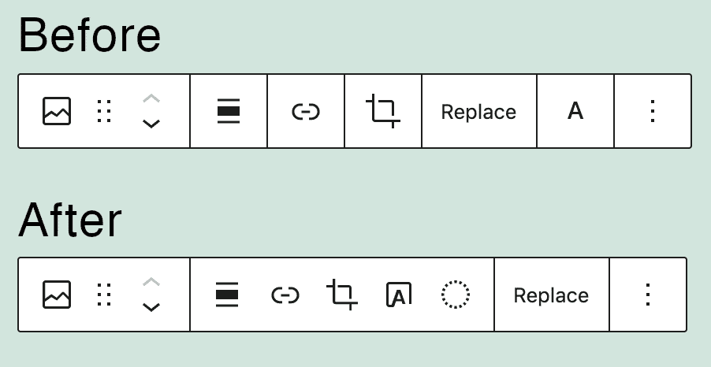

Image block toolbar in WordPress 5.7 vs WordPress 5.8.


### 顶级工具栏改进

在以前的 WordPress 版本中启用了顶部工具栏模式，顶部工具栏和块工具栏并排显示，如下图所示:

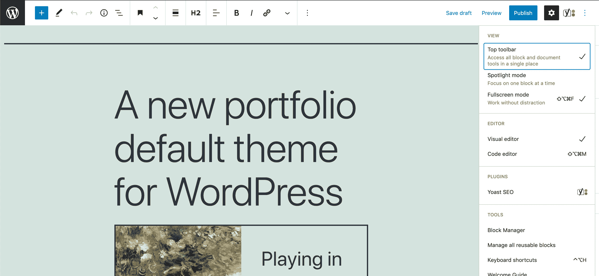

The top toolbar on wide screens in WordPress 5.7.


在 WordPress 5.8 中，启用顶部工具栏视图会将块工具栏固定在编辑器的顶部，就在顶部工具栏的下面。这与浏览器的宽度无关，可以显著改善用户体验。

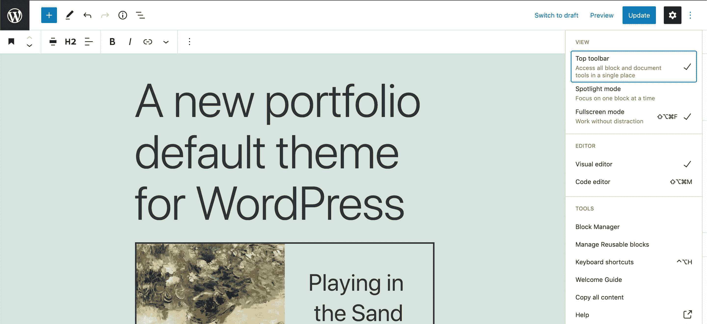

The top toolbar on wide screens in WordPress 5.8.


这一增强也为开发人员带来了变化，因为它统一了`<BlockTools />`组件下的工具栏 API(参见 PR # [31134](https://github.com/WordPress/gutenberg/pull/31134) )。

### 嵌入式 pdf

当一个 PDF 文件通过文件块添加到文档中时，一个新的侧边栏开关允许您启用/禁用一个[嵌入的 PDF 版本](https://make.wordpress.org/core/2021/04/30/whats-new-in-gutenberg-10-5-28-april/)(参见 PR # [30857](https://github.com/WordPress/gutenberg/pull/30857) )。

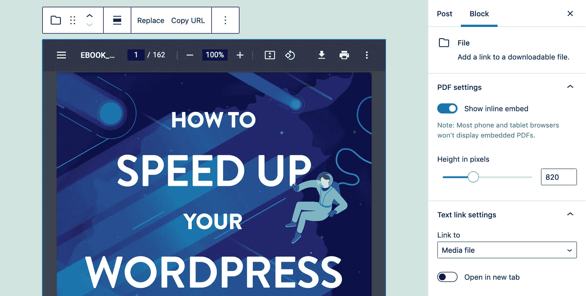

An embedded PDF in WordPress 5.8.


您可以将文件直接拖到编辑器画布上，或者直接从库中选择它。也可以手动调整 PDF 查看器的高度或使用侧边栏控件。

## 注册订阅时事通讯


### 想知道我们是怎么让流量增长超过 1000%的吗？

加入 20，000 多名获得我们每周时事通讯和内部消息的人的行列吧！

[Subscribe Now](#newsletter)

除了移动浏览器之外，所有主流网络浏览器都支持 PDF 查看器[。](https://caniuse.com/pdf-viewer)

### 双色调块支持

WordPress 5.8 合并到 Core 中的最有趣的功能之一是双色调过滤器，最初是在 Gutenberg 10.6 中引入的。

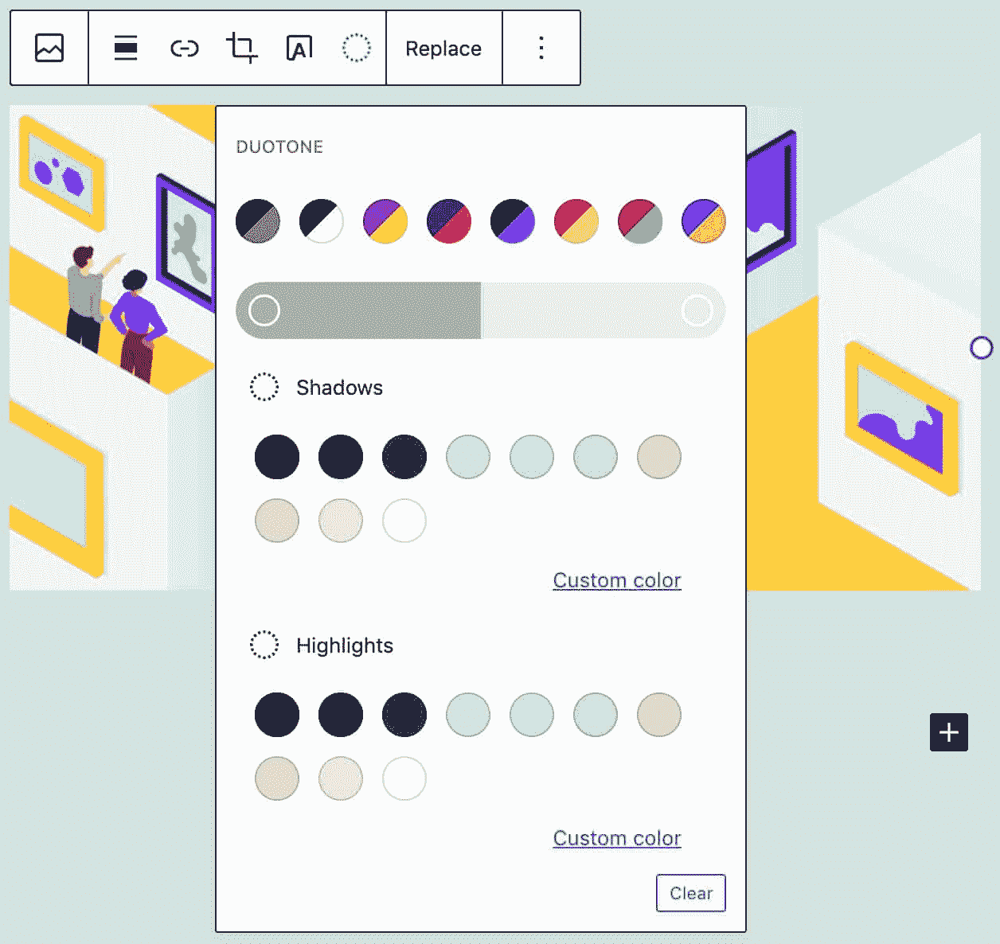

The new duotone design tool in an image block.


作为[“块支持”功能](https://github.com/WordPress/gutenberg/pull/26752)，双色调滤镜默认在核心[图像](https://github.com/WordPress/gutenberg/pull/26751)和封面块中启用。然而，在封面模块中，它不能与[固定背景](https://github.com/WordPress/gutenberg/issues/31662)一起使用。

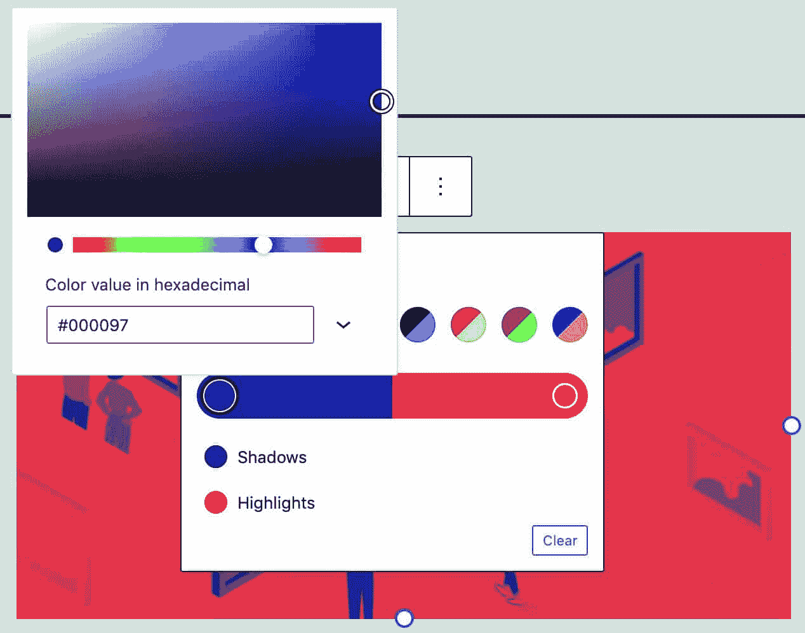

The new duotone picker in WordPress 5.8.


图像和封面块工具栏现在显示一个**应用双色调过滤器**控件，显示一个双色调选择器，有许多预设可供选择。

两个子控件允许分别定制阴影和高光。该效果是用一个隐藏在内嵌样式中的 [SVG 过滤器](https://www.w3.org/TR/SVG11/filters.html)应用的，并使用一个特定的类名应用。

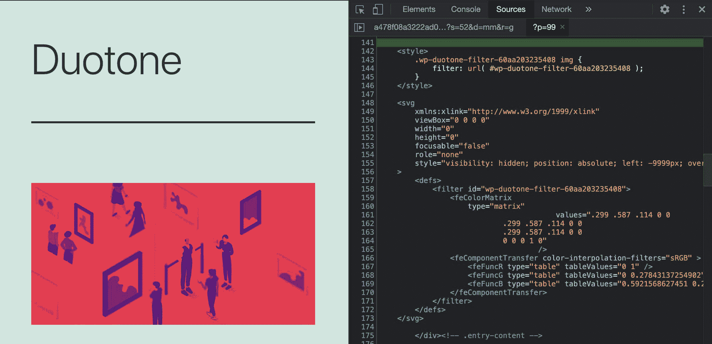

Inspecting the duotone SVG filter in Chrome DevTools.


新工具附带了一个新的`color.__experimentalDuotone`属性，允许开发人员将双色调滤镜添加到他们的 **block.json** 文件中的块或块的部分中(更多信息请参见[颜色对象参考](https://developer.wordpress.org/block-editor/reference-guides/block-api/block-supports/#color)):

```
supports: {
	color: {
		__experimentalDuotone: '> .duotone-img, > .duotone-video',
		background: false,
		text: false
	}
}
```

当一个块声明支持`color.__experimentalDuotone`时，一个`style`属性可以用来设置[自定义默认颜色](https://developer.wordpress.org/block-editor/reference-guides/block-api/block-supports/#color-__experimentalduotone):

```
attributes: {
	style: {
		type: 'object',
		default: {
			color: {
				duotone: [
					'#FFF',
					'#000
				]
			}
		}
	}
}
```

下面你可以看到应用了两种不同双色调效果的相同图像:

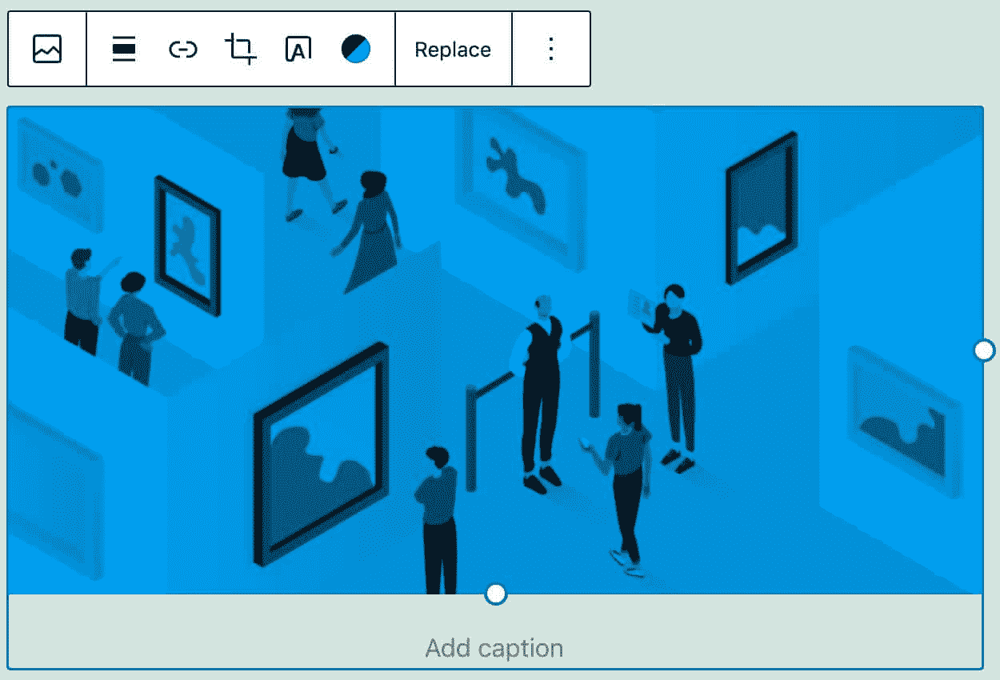

Duotone color filter applied over an image.


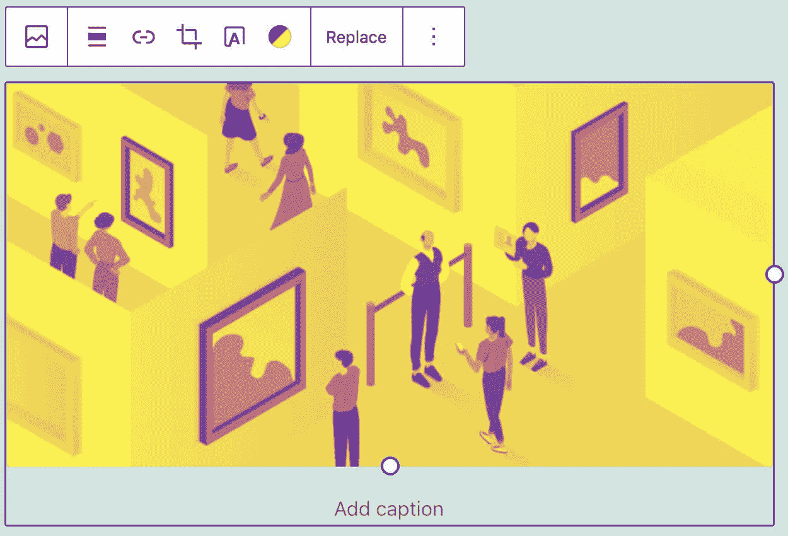

A different duotone color filter applied over an image.


开发者可以在 **theme.json** 文件中定义双色调[预置](https://developer.wordpress.org/block-editor/how-to-guides/themes/theme-json/#presets)(参见[下一节](#block-settings-and-styles-with-themejson))，如下面的代码片段所示:

```
{
"version": 1,
"settings": {
	"color": {
		"duotone": [
			{
				"colors": [ "#000", "#7f7f7f" ],
				"slug": "black-and-white",
				"name": "dark-grayscale"
			}
		],
	...
```

你可以在[用双色调滤镜给你的图像上色](https://wordpress.org/news/2021/05/coloring-your-images-with-duotone-filters/)中了解更多关于双色调滤镜的信息。

### 表格块颜色和边框

WordPress 5.8 也为表格块带来了一些[的增强，包括对表格](https://make.wordpress.org/core/2021/05/14/whats-new-in-gutenberg-10-6-12-may/)[背景和前景颜色](https://kinsta.com/blog/website-color-schemes/)的更好控制。

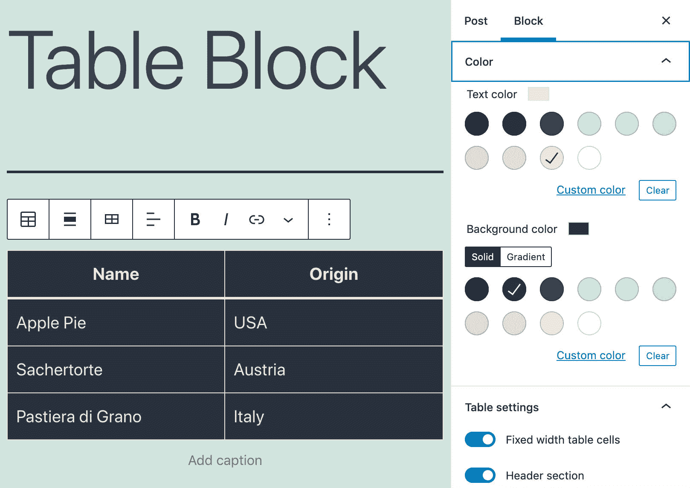

Enhanced Table block Color settings.


表格块的另一个新增功能是**边框块支持**，它让用户能够控制边框颜色、样式和宽度。

如果活动主题支持新功能，新的**边框设置**面板为用户定制提供了三个新控件。

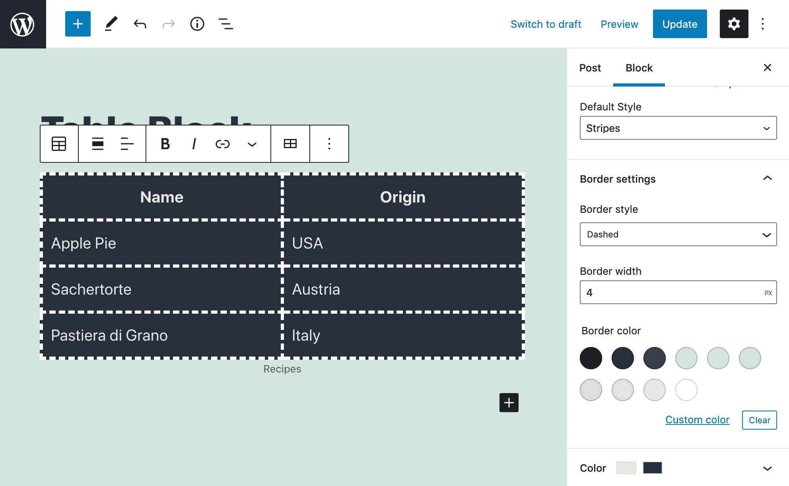

Border block controls in WordPress 5.8 and TT1 Blocks.


开发者可以通过在 **theme.json** 文件中添加以下代码来为他们的主题添加[边框块支持](https://github.com/WordPress/gutenberg/pull/31265):

```
"border": {
	"customColor": true,
	"customStyle": true,
	"customWidth": true
}
```

### 对块插入器的改进

在 WordPress 5.8 中，插件已经增加了几个功能 (PR # [26938](https://github.com/WordPress/gutenberg/pull/26938) 和# [21080](https://github.com/WordPress/gutenberg/issues/21080#issuecomment-649231549) ):

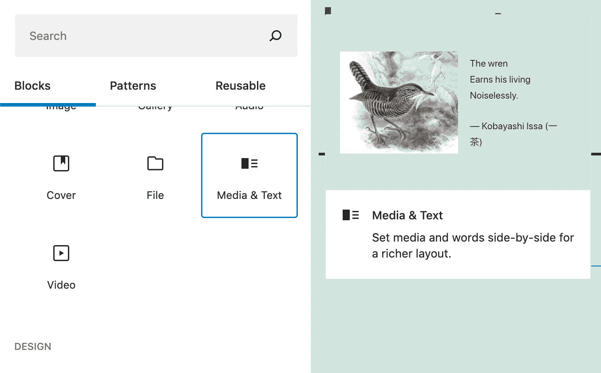

Pressing the arrow up and down moves the row focus.


**1。块插入器**上的二维键盘导航。现在，我们可以更精确、更直观地在块之间导航。

*   按下向上箭头键(↑)和向下箭头键(↓)将焦点移到上面或下面的行。
*   按下 **Tab** 或 **Shift + Tab** 允许在搜索框、标签列表和每个类别的第一个项目之间移动焦点。

**2。模板部件和变体**的新“主题”类别现在出现在全站点编辑的插入器中(参见 PR # [30020](https://github.com/WordPress/gutenberg/pull/30020) )。

**3。自动完成短语匹配器**现在允许多个单词(参见 PR # [29939](https://github.com/WordPress/gutenberg/pull/29939) )。

### 其他块编辑器改进

WordPress 5.8 带来了大量的额外的中小型变化，在这里值得一提。在这些增强功能中，我们要提到以下几点:

#### 覆盖块中的拖放支持

现在你可以从你的桌面拖放图像来替换封面块的背景(见古腾堡 [10.3](https://make.wordpress.org/core/2021/04/02/whats-new-in-gutenberg-10-3-31-march/) 和 PR # [29813](https://github.com/WordPress/gutenberg/pull/29813) )。

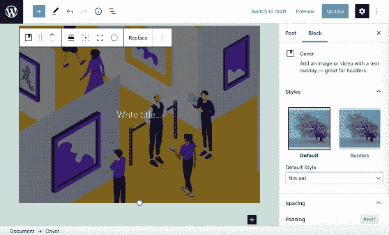

Drag-and-drop background images in the cover block.


#### 增强的发布 UI

从 WordPress 5.8 开始，发布界面会显示网站图标和标题，让你发布文章或页面的位置更加清晰。

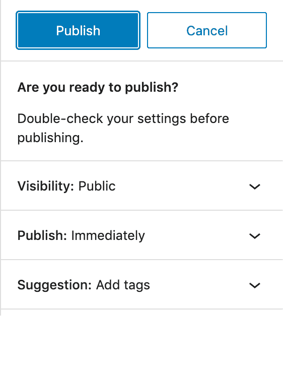

Publishing UI in WordPress 5.7.


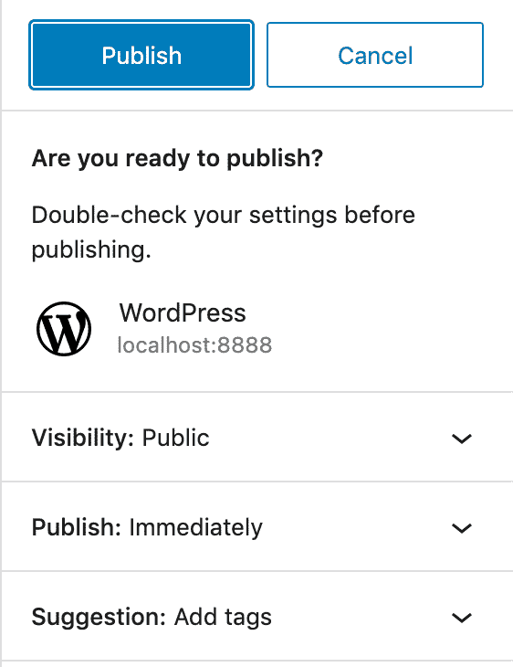

Publishing UI in WordPress 5.8.


如果你在全屏模式下或在移动设备上工作，这一增强功能非常有用。

## 使用 theme.json 阻止设置和样式

在 WordPress 5.8 中，[**theme . JSON**文件](https://make.wordpress.org/core/2021/06/25/introducing-theme-json-in-wordpress-5-8/)成为“配置的中心点”，为主题开发者提供了一种定制编辑器设置和风格的新方法。

使用 **theme.json** 文件，主题可以设置自定义预设和/或添加对新功能的支持，如双色调和表格边框(参见[全局设置&样式](https://developer.wordpress.org/block-editor/how-to-guides/themes/theme-json/))。

根据安德烈·马内罗的说法:

> 这个新的机制旨在接管和合并以前控制编辑器所需的所有各种`add_theme_support`调用。

例如，您可以使用以下代码全局设置自定义双色调预设:

```
{
	"version": 1,
	"settings": {
		"color": {
			"duotone": [
				{
					"colors": [ "#000", "#0FF" ],
					"slug": "black-cyan",
					"name": "Black Cyan"
				}
			],
```

这将覆盖默认预设，您将只看到一个双色调选项:

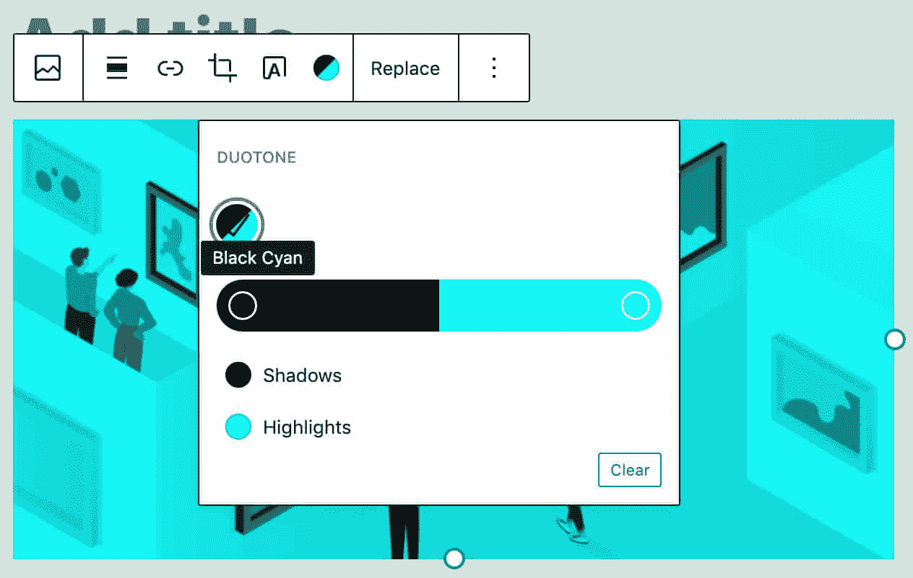

Custom duotone preset in theme.json.


这种新机制提供了一种全局或逐块控制设置的方法。例如，您可以通过将以下预设添加到您的 **theme.json** 文件来全局添加自定义的 12px 字体大小:

需要为你的 WordPress 站点提供超快的、可靠的、完全安全的托管服务吗？Kinsta 提供所有这些以及 WordPress 专家提供的 24/7 世界级支持。[查看我们的计划](https://kinsta.com/plans/?in-article-cta)

```
{
	"version": 1,
	"settings": {
		"typography": {
			"customLineHeight": true,
			"fontSizes": [
				{
					"slug": "extra-extra-small",
					"size": "12px",
					"name": "Extra extra small"
				},
				{...}
```

这就产生了一种新的字体大小，用户可以在内容中使用任何文本。

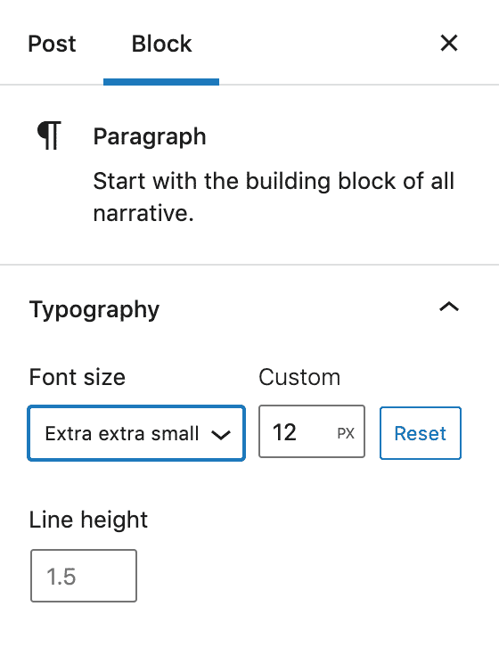

A globally defined custom font size in theme.json.


如果您只想自定义段落块，您的代码会稍有不同:

```
{
	"version": 1,
	"settings": {
		"blocks": {
			"core/paragraph": {
				"typography": {
					"fontSizes": [
						{
							"slug": "extra-extra-small",
							"size": "12px",
							"name": "Extra extra small"
						},
						{
							"slug": "extra-small",
							"size": "16px",
							"name": "Extra small"
						},
						{
							"slug": "small",
							"size": "18px",
							"name": "Small"
						},
						{
							"slug": "normal",
							"size": "20px",
							"name": "Normal"
						},
						{
							"slug": "large",
							"size": "24px",
							"name": "Large"
						}
					]
				}
			}
		}
	}
}
```

就是这样！您已经为段落块设置了自定义字体大小预设。

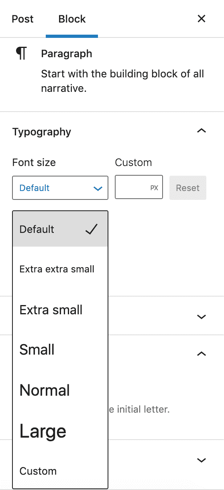

A paragraph block with custom font size presets.


核心块已经更新以遵循新的机制，而第三方块可以使用 React `useSetting`钩子来适应新的机制(在 [dev-note](https://make.wordpress.org/core/2021/06/25/introducing-theme-json-in-wordpress-5-8/) 和 [API 文档](https://developer.wordpress.org/block-editor/reference-guides/packages/packages-block-editor/#useSetting)中阅读关于该函数的更多信息):

```
const isEnabled = useSetting( 'spacing.margin' );
```


### 信息

在 **theme.json** 中声明的设置将优先于通过`add_theme_support`声明的设置。


基于 **theme.json** 文件的新机制不仅仅适用于 block 设置。事实上，从 WordPress 5.8 开始，将不再需要创建编辑器样式并对它们进行排队。在 **theme.json** 文件里面声明预置就够了；引擎将生成类，并自动将它们排入编辑器和前端。

引擎还会生成相应的 [CSS 自定义属性](https://kinsta.com/blog/twenty-twenty-one-theme/#styles-and-css-custom-properties)。

在前面的例子中，我们为段落块设置了五个`fontSizes`预设。对于这些预设，将生成以下 CSS 自定义属性:

```
p {
	--wp--preset--font-size--extra-extra-small: 12px;
	--wp--preset--font-size--extra-small: 16px;
	--wp--preset--font-size--small: 18px;
	--wp--preset--font-size--normal: 20px;
	--wp--preset--font-size--large: 24px;
}
```

一旦你在你的**主题. json** 文件中设置了段落字体大小，相应的`p`元素就会采用`has-{preset-slug}-{preset-category}`类。

这意味着具有`extra-extra-small`字体大小的段落将获得`has-extra-extra-small-font-size`类:

```
<p class="has-extra-extra-small-font-size">Lorem ipsum dolor...</p>
```

这是 CSS 声明块:

```
p.has-extra-extra-small-font-size {
	font-size: var(--wp--preset--font-size--extra-extra-small) !important;
}
```

为了用 **theme.json** 更近距离地查看设置和样式，请确保查看[开发笔记](https://make.wordpress.org/core/2021/06/25/introducing-theme-json-in-wordpress-5-8/)和 [API 文档](https://developer.wordpress.org/block-editor/how-to-guides/themes/theme-json/#presets)。

此外，请查看安妮·麦卡蒂的 [FSE 呼吁测试](https://make.wordpress.org/test/2021/06/24/call-for-testing-thrive-with-theme-json/)以获得更多有用的阅读资料，以及对想要探索新**主题. json** 功能的开发人员的一个令人兴奋的挑战。

## 阻止 API 增强

WordPress 5.8 的 Block API 增强功能值得插件开发者的特别关注。

现在鼓励使用 **block.json** 文件作为[注册块类型](https://developer.wordpress.org/block-editor/reference-guides/block-api/block-metadata/)的标准方式，并提供了几个优点:

*   关于性能，如果主题支持资产的[惰性加载，通过 **block.json** 文件注册块类型会自动优化资源排队。这是因为由`style`和`script`属性指定的资源只有在检测到块时才会在前端排队。这允许开发更高效的插件，减少页面大小，并防止本文](https://kinsta.com/blog/wordpress-lazy-load/)[中提到的几个问题。](https://kinsta.com/blog/disable-wordpress-plugins-loading/)
*   **block.json** 文件通过允许[块类型](https://developer.wordpress.org/rest-api/reference/block-types/) [REST API 端点](https://developer.wordpress.org/rest-api/reference/)列出块来简化服务器端块注册。
*   如果你决定将你的 block 插件提交到 WordPress 插件目录，也需要 **block.json** 文件。

### 更改寄存器块类型函数

从 WordPress 5.8 开始，`register_block_type`函数得到了增强，可以从 **block.json** 文件中读取元数据。现在，[第一个参数](https://developer.wordpress.org/reference/functions/register_block_type/)接受 **block.json** 文件所在文件夹的路径。

该函数的用法如下例所示:

```
function create_custom_block_init() {
	register_block_type( __DIR__ );
}
add_action( 'init', 'create_custom_block_init' );
```

失败时返回注册的块类型或`false`。

正如你可能注意到的，函数`register_block_type`现在的使用方式和`register_block_type_from_metadata`函数一样，它以前是唯一可以通过从 **block.json** 文件中读取元数据来注册块类型的函数[。正如 Greg Ziókowski](https://developer.wordpress.org/reference/functions/register_block_type_from_metadata/)所解释的:

> 我们决定将`register_block_type_from_metadata`方法中已有的功能整合到`register_block_type`中，以避免由此产生的混乱。仍然可以使用这两个函数，但是我们计划从现在开始在官方文档和工具中只使用较短的版本。

一旦在服务器上注册了块，您只需要在客户端上使用您的 **index.js** 文件中的相同块名[注册设置](https://developer.wordpress.org/block-editor/reference-guides/block-api/block-registration/)。

要更深入地了解 WordPress 5.8 引入的 block API 增强，请务必查看 Greg Ziókowski 的[开发笔记。](https://make.wordpress.org/core/2021/06/23/block-api-enhancements-in-wordpress-5-8/)

## WordPress 5.8 中的 WebP 支持

在 Kinsta，我们痴迷于网站速度和 WordPress 性能。这就是为什么 WordPress 5.8 中的 WebP 格式支持对我们来说是如此令人兴奋的消息。

被认为是下一代格式的 WebP 是由谷歌开发的 T2 图像格式，它提供了“比 PNG 或 JPEG 更好的压缩，这意味着更快的下载和更少的数据消耗”

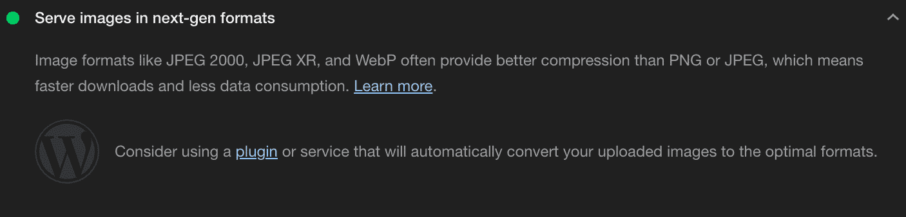

Google Lighthouse suggests using next-gen image formats.


[根据谷歌](https://developers.google.com/speed/webp):

> WebP 是一种现代的**图像格式**，为网络上的图像提供卓越的**无损和有损**压缩。使用 WebP，网站管理员和 web 开发人员可以创建更小、更丰富的图像，使 web 速度更快。
> 
> 与 png 相比，WebP 无损图像的大小要小 26%。在同等的 SSIM 质量指数下，WebP 有损图像比同等的 JPEG 图像小 25-34%。

从 WordPress 5.8 开始，你可以像使用 JPEG、PNG 和 GIF 格式一样使用 WebP 图像格式。只需将您的图像上传到您的[媒体库](https://kinsta.com/blog/wordpress-media-library/)，并将其包含在您的内容中。

在[之前的一篇文章](https://kinsta.com/blog/webp/)中，我们深入研究了 WebP 格式以及在 WordPress 中使用它的工具。现在，由于在 WordPress 5.8 中对 WebP 图片的[支持，事情有些变化。由于 WebP 格式支持开箱即用，你不需要安装第三方插件在 WordPress 中上传 WebP 图片，至少在最常见的用例中是如此。](https://make.wordpress.org/core/2021/06/07/wordpress-5-8-adds-webp-support/)

注意，尽管你现在可以使用媒体库上传你的 WebP 图片到 WordPress，但是 WordPress 不支持自动转换成 WebP 格式。要在你的网站上启用该功能，你需要一个第三方的 WebP WordPress 插件。

### 如何在 WordPress 中使用 WebP 图片

您可以通过多种不同方式将图像转换为 WebP:

*   你可以使用 Google 的[预编译的 WebP 工具和库](https://developers.google.com/speed/webp/docs/precompiled)用于 Linux、Windows 或 Mac OS X。
*   Mac 用户可以安装一个[包管理器](https://developers.google.com/speed/webp/docs/precompiled#os_x_package_managers)，比如[家酿 WebP 包](https://formulae.brew.sh/formula/webp)或者 [Macports WebP 包](https://ports.macports.org/?search=webp&search_by=name)。
*   你可以使用支持 WebP 的图像编辑工具，比如[谷歌 Chrome Labs](https://github.com/GoogleChromeLabs/squoosh) 的 [Squoosh](https://squoosh.app/) ，批处理图像转换器 [XnConvert](https://www.xnview.com/en/xnconvert/) ，像 [GIMP](https://www.gimp.org/) 这样的流行图像编辑器，等等。
*   你可以安装一个 [WebP WordPress 插件](https://kinsta.com/blog/webp/#how-to-use-webp-images-on-wordpress)来更好地控制 WordPress 中的 WebP 图片。

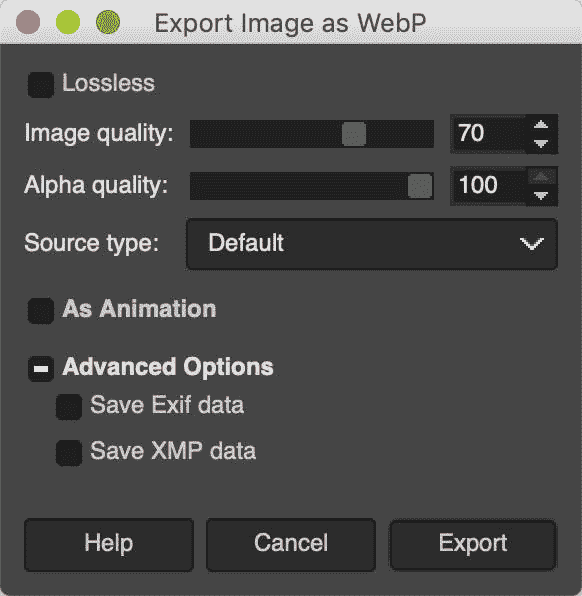

Export image as WebP in GIMP.


如果你选择命令行工具，你可以使用 [cwebp](https://developers.google.com/speed/webp/docs/cwebp) 和 [dwebp](https://developers.google.com/speed/webp/docs/dwebp) 工具对你的图像进行编码和解码。例如，以下命令执行基本的 JPEG 到 WebP 转换:

```
cwebp [options] original_image.jpg -o compressed_image.webp
```

您还可以使用 Bash 和 cwebp 运行图像的批量转换(Jeremy Wagner 的例子):

```
find ./ -type f -name '*.png' -exec sh -c 'cwebp -q 75 $1 -o "${1%.png}.webp"' _ {} \; 
```

上面的命令转换所有的**。png** 图片到**。压缩系数为 75 的 webp** 格式。

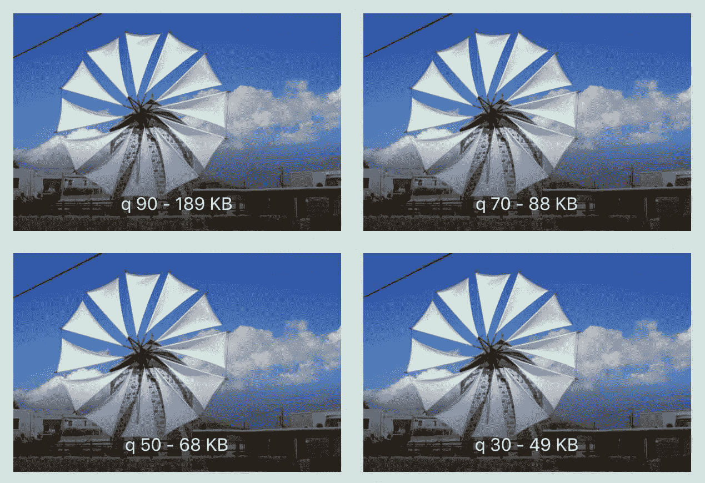

Comparison of compression factor and file sizes.


一旦你有了你的 WebP 图片，你可以简单地使用 WordPress [媒体库](https://kinsta.com/blog/wordpress-media-library/)上传它们。下面您可以在媒体库中看到转换前的 127 KB JPEG 图像:

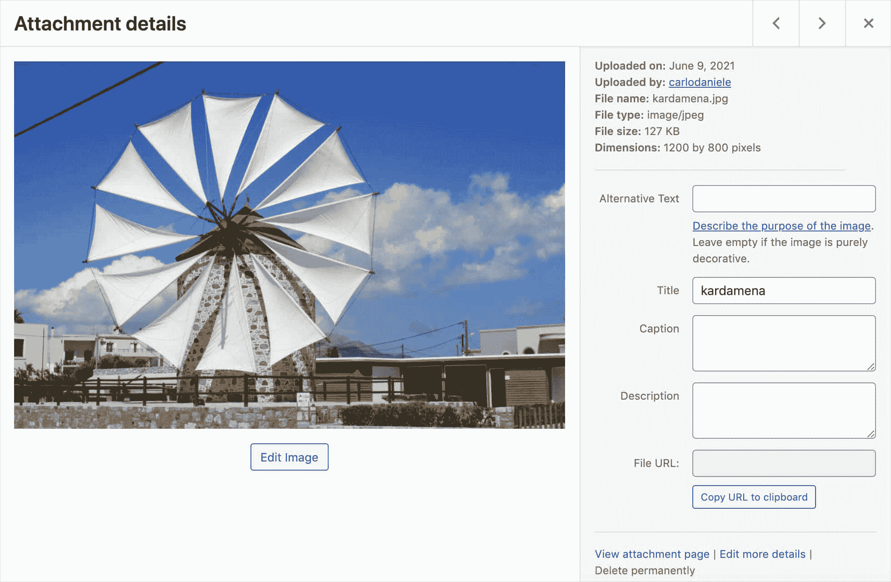

The compressed JPEG file size is 127 KB.


压缩后的 WebP 图像比原始 JPEG 图像小 42%!


The same image in WebP format is 74 KB.


最后，WebP 图像具有与 JPEG、PNG 和 GIF 图像相同的编辑功能。您可以裁剪、旋转、翻转和缩放它们，并对您选择的图像大小进行更改。

### WordPress 5.8 中关于 WebP 的警告

根据亚当·银色啤酒杯乐队的说法:

> WebP 图像支持有损和无损压缩，以及动画格式和对透明图像的支持。在 WordPress 中，只有当托管服务器使用 Imagick(PHP 库)时才支持无损 WebP 格式，直到 LibGD 添加了支持。此外，调整大小的图像尚不支持动画和 alpha 格式(当您上传这些格式的图像时，会创建有损图像)。

如果您的 web 主机不支持 WebP 图像，您会在尝试上传它们时看到一条错误消息。如果您不确定您的 web 主机是否支持 Imagick 库，站点健康工具信息选项卡包括一个提供该信息的 **Imagick 库**字段。

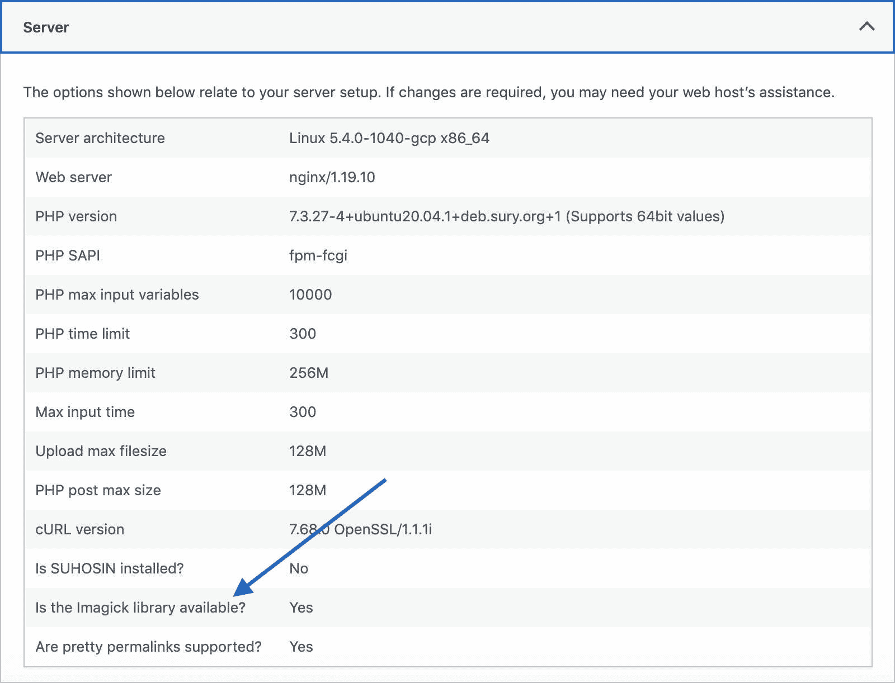

Kinsta supports the Imagick library.


有了 WebP 支持，WordPress 5.8 还在站点健康的媒体处理部分引入了两个额外的字段:**ImageMagick 版本**和 **ImageMagick 支持的文件格式**。

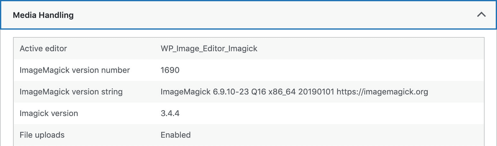

ImageMagick version field in Site Heath.


如果 WebP 没有列在支持的文件类型中，您需要联系您的 web 主机以获得支持。

[dev-note](https://make.wordpress.org/core/2021/06/07/wordpress-5-8-adds-webp-support/) 提供了关于 WordPress 5.8 中 WebP 支持的[附加信息](https://make.wordpress.org/core/2021/06/07/wordpress-5-8-adds-webp-support/#comment-41376)，有用的 FAQ，以及更多的资源。

如果您对图像优化感兴趣，您可能也会喜欢以下教程:

*   [如何针对网页和性能优化图像](https://kinsta.com/blog/optimize-images-for-web/)
*   [为什么以及如何对你的 WordPress 图片使用有损压缩](https://kinsta.com/blog/lossy-compression/)
*   [如何在 WordPress 上使用 WebP 图片(并将图片文件大小缩小 35%)](https://kinsta.com/blog/webp/)
*   [15 种最佳图像文件类型](https://kinsta.com/blog/image-file-types/)
*   关于 WordPress 图片尺寸你需要知道的一切

## 面向开发人员的附加功能

你会在 WordPress 5.8 中发现许多令人兴奋的特性。在本文中，我们将更多的注意力放在了那些对您的开发工作有最重要影响的方面。但确实有很多值得关注的新特性，包括以下几点:

### 块支持 API

WordPress 5.8 增加了[新的 block 支持标志](https://make.wordpress.org/core/2021/06/25/block-supports-api-updates-for-wordpress-5-8/)，允许开发者用最新的 block 特性定制注册的 block。

除了前面提到的实验性的[双色调区块支持](#duotone-block-support)(`color._experimentalDuotone`)，WordPress 5.8 还增加了对链接颜色的支持。要利用此功能，只需将以下标志添加到块元数据中:

```
supports: {
	color: {
		link: true;
	}
}
```

您可以使用属性设置默认值，如下例所示，或者在 *theme.json* 中设置预设:

```
attributes: {
	style: {
		type: 'object',
		default: {
			color: {
				link: '#FF0000',
			}
		}
```

其他块 API 更改包括:

*   `fontSize`和`lineHeight`支架变得稳定。
*   `spacing`支持范围扩大，现在可以控制`margin`和`padding`，还可以单独控制`top`、`right`、`bottom`和`left`的大小。

你可以在 [Block supports API 更新](https://make.wordpress.org/core/2021/06/25/block-supports-api-updates-for-wordpress-5-8/) dev-note 中阅读更多关于 WordPress 5.8 中 Block Supports API 的内容。

关于如何使用 Block Supports API 的详细信息，请参见 [Block Supports API](https://developer.wordpress.org/block-editor/reference-guides/block-api/block-supports/) 官方文档。

### 站点健康自定义选项卡

两个新的挂钩现在允许开发者将他们的定制标签添加到站点健康界面，并定制可用的屏幕。

**`site_health_navigation_tabs`过滤器**是选项卡 id 和标签的关联数组，用于在站点健康屏幕中注册新选项卡。您可以通过将以下示例代码添加到您的[主题的函数文件](https://kinsta.com/blog/how-to-customize-wordpress-theme/#the-theme-editor-and-why-not-to-use-it)或自定义插件中来使用过滤器:

```
function kinsta_site_health_navigation_tabs( $tabs ) {
	$tabs['kinsta-site-health-tab'] = esc_html_x( 'Kinsta', 'Site Health', 'text-domain' );

	return $tabs;
}
add_filter( 'site_health_navigation_tabs', 'kinsta_site_health_navigation_tabs' );
```

下图显示了新的站点健康选项卡:

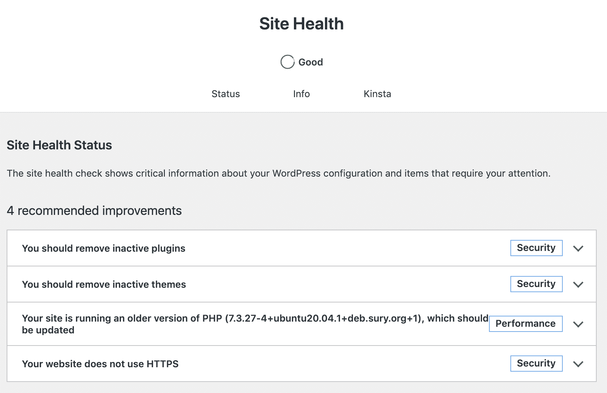

A custom tab added to the Site Health navigation menu.


多亏了`site_health_navigation_tabs`过滤器，还可以对标签重新排序或删除一个或多个项目。

除了默认的**状态**屏幕外，当用户访问站点健康屏幕时，触发 **`site_health_tab_content`动作**。您可以使用这个钩子，如下面的代码片段所示(示例来自 [dev note](https://make.wordpress.org/core/2021/06/22/extending-the-site-health-interface-in-wordpress-5-8/) ):

```
function kinsta_site_health_tab_content( $tab ) {
	// Return if this is not your tab.
	if ( 'kinsta-site-health-tab' !== $tab ) {
		return;
	}

	// Include the interface, kept in a separate file just to differentiate code from views.
	include trailingslashit( plugin_dir_path( __FILE__ ) ) . 'views/kinsta-site-health-tab.php';
}
add_action( 'site_health_tab_content', 'kinsta_site_health_tab_content' );
```

首先，它检测当前选项卡是否是您的自定义选项卡，然后从一个**加载您的站点健康屏幕内容。php** 文件。`site_health_tab_content`动作还允许开发者扩展默认的**信息**标签，添加特定于他们的插件或主题的信息。

### 块编辑器 API 更改以支持多个管理屏幕

在 WordPress 5.8 中，post 编辑器不再是唯一使用 block editor 的管理界面(widgets 界面就是一个例子)。

核心贡献者发现了服务器上根据`$post`对象定义的几个钩子。该对象不存在于站点编辑、小部件和导航屏幕中。接下来，一些过滤器被弃用，代之以上下文感知的替代物。

此外，引入了一个新的代表当前块编辑器上下文和各种方法的`WP_Block_Editor_Context`类。

这些变化用新的功能改进了这些屏幕，并使开发人员能够添加他们的定制。

有关与管理屏幕相关的块编辑器 API 更改的完整列表，请参见 Greg Ziókowski 的[开发说明](https://make.wordpress.org/core/2021/06/16/block-editor-api-changes-to-support-multiple-admin-screens-in-wp-5-8/)。

### 其他特性和增强功能

WordPress 5.8 为开发者带来了如此多的新特性和变化，以至于我们不可能在本文中一一提及。但是，我们收集了一系列本文未涉及的开发笔记，供您进一步阅读:

*   [停止对 Internet Explorer 11 的支持](https://wordpress.org/news/2021/05/dropping-support-for-internet-explorer-11/)
*   [WordPress 5.8 中的块样式加载增强功能](https://make.wordpress.org/core/2021/07/01/block-styles-loading-enhancements-in-wordpress-5-8/)
*   [iframed(模板)编辑器中的块](https://make.wordpress.org/core/2021/06/29/blocks-in-an-iframed-template-editor/)
*   [关于 WordPress 5.8 中的布局和内容宽度](https://make.wordpress.org/core/2021/06/29/on-layout-and-content-width-in-wordpress-5-8/)
*   [在 WordPress 5.8 中引入“更新 URI”插件标题](https://make.wordpress.org/core/2021/06/29/introducing-update-uri-plugin-header-in-wordpress-5-8/)
*   [WordPress 5.8 中的各种块编辑器 API 移除](https://make.wordpress.org/core/2021/06/29/block-editor-api-removals-58/)
*   [WordPress 5.8 中 REST API 的变化](https://make.wordpress.org/core/2021/06/29/rest-api-changes-in-wordpress-5-8/)
*   [WordPress 5.8 中其他开发者关注的变化](https://make.wordpress.org/core/2021/06/28/miscellaneous-developer-focused-changes-in-wordpress-5-8/)
*   [WordPress 5.8 中的其他块编辑器 API 附加功能](https://make.wordpress.org/core/2021/07/12/miscellaneous-block-editor-api-additions-in-wordpress-5-8/)

[WordPress 5.8 introduces the first implementation of Full Site Editing 🎁 Curious about the future of WordPress? Don't miss our in-depth overview of the major features and changes coming with WordPress 5.8 🚀Click to Tweet](https://twitter.com/intent/tweet?url=https%3A%2F%2Fbit.ly%2F2TFhMP7&via=kinsta&text=WordPress+5.8+introduces+the+first+implementation+of+Full+Site+Editing+%F0%9F%8E%81+Curious+about+the+future+of+WordPress%3F+Don%27t+miss+our+in-depth+overview+of+the+major+features+and+changes+coming+with+WordPress+5.8+%F0%9F%9A%80)

## 摘要

WordPress 5.8 标志着全网站编辑道路上的一个里程碑。但是今年第二次发布的 WordPress 带来的不仅仅是 FSE。用户和开发人员会发现对块编辑器的大量改进，新的 **theme.json** 机制，更强大的块 API，WebP 图像格式支持，等等。

我们对块编辑器及其 UI 的大大小小的改进印象特别深刻。我们喜欢块之间改进的可导航性、改进的块工具栏、界面的丰富清晰度以及对几个块的增强。

这些小小的改变一点一点地改善了编辑体验，而且，在几乎没有意识到的情况下，我们发现自己正在使用更好、更健壮的软件。那是 [WordPress](https://kinsta.com/knowledgebase/what-is-wordpress/) ！

*现在交给你了！你对全网站编辑有什么想法？你最喜欢 WordPress 5.8 的哪些变化？*

* * *

让你所有的[应用程序](https://kinsta.com/application-hosting/)、[数据库](https://kinsta.com/database-hosting/)和 [WordPress 网站](https://kinsta.com/wordpress-hosting/)在线并在一个屋檐下。我们功能丰富的高性能云平台包括:

*   在 MyKinsta 仪表盘中轻松设置和管理
*   24/7 专家支持
*   最好的谷歌云平台硬件和网络，由 Kubernetes 提供最大的可扩展性
*   面向速度和安全性的企业级 Cloudflare 集成
*   全球受众覆盖全球多达 35 个数据中心和 275 多个 pop

在第一个月使用托管的[应用程序或托管](https://kinsta.com/application-hosting/)的[数据库，您可以享受 20 美元的优惠，亲自测试一下。探索我们的](https://kinsta.com/database-hosting/)[计划](https://kinsta.com/plans/)或[与销售人员交谈](https://kinsta.com/contact-us/)以找到最适合您的方式。