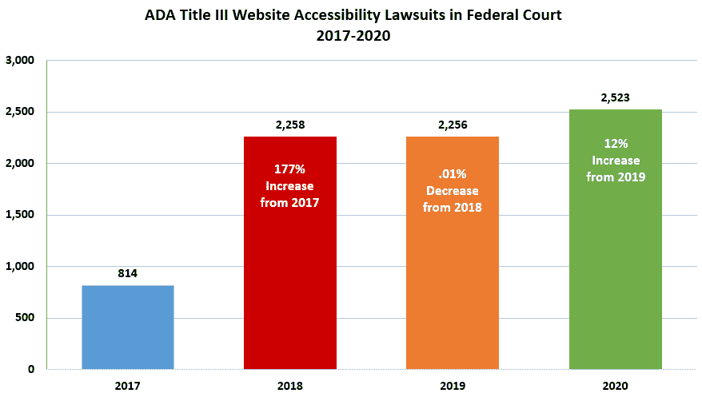
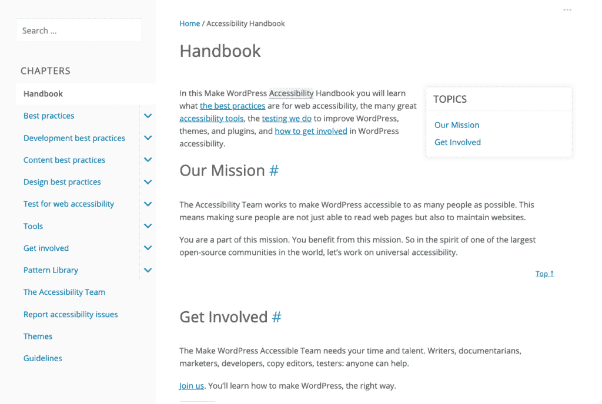
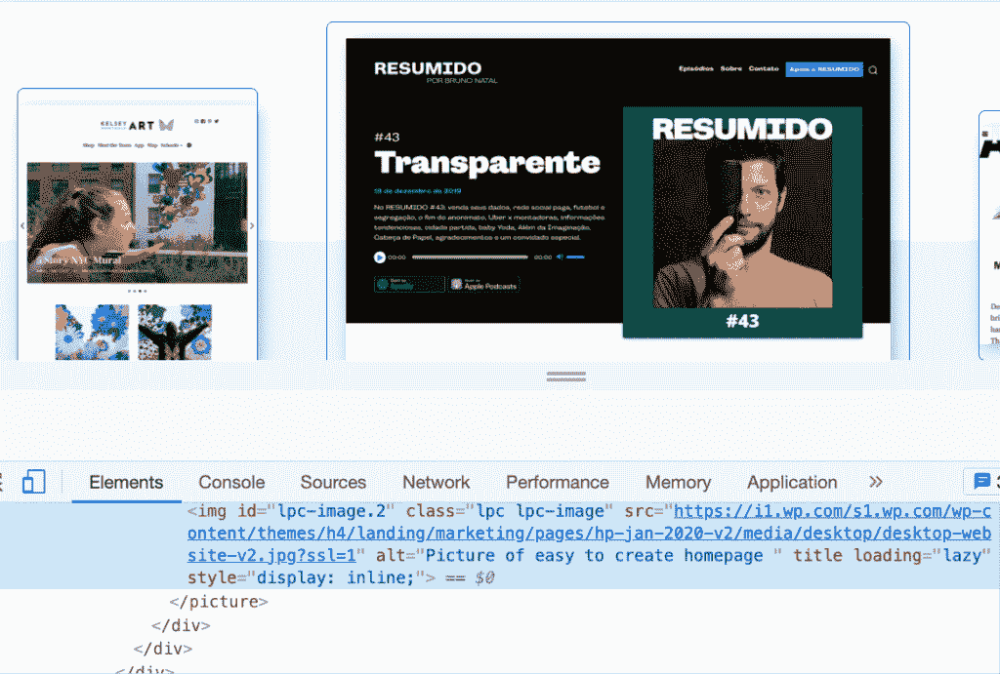
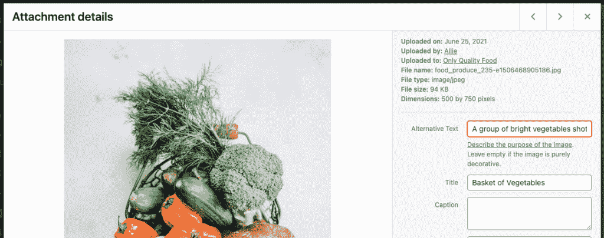
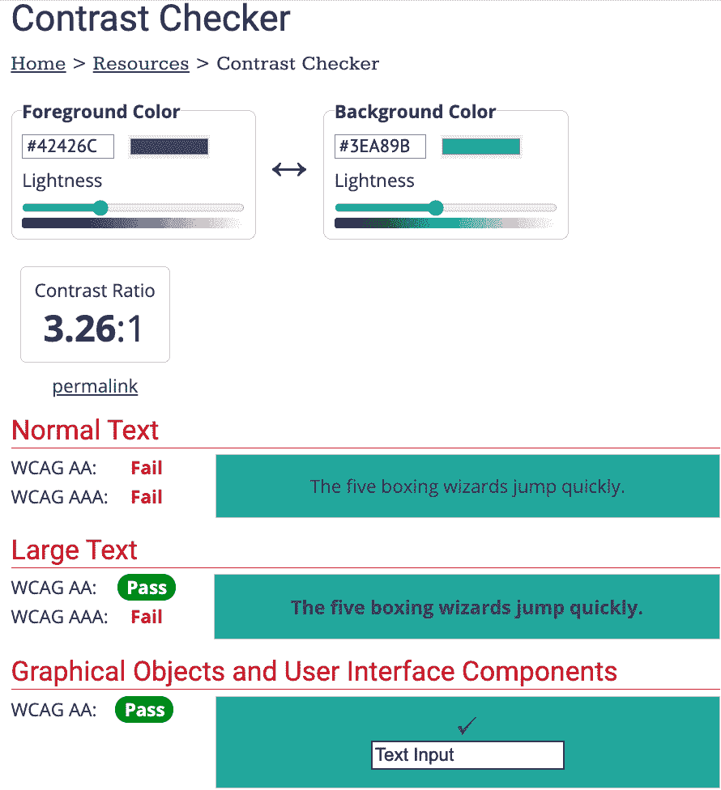
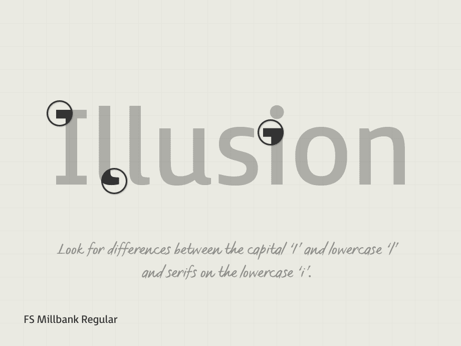
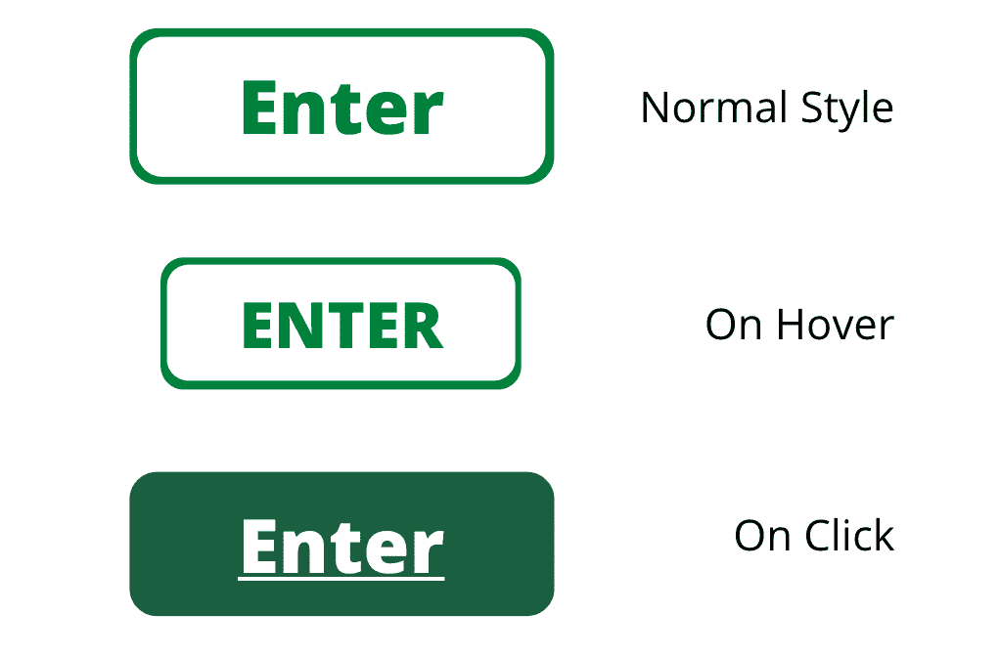
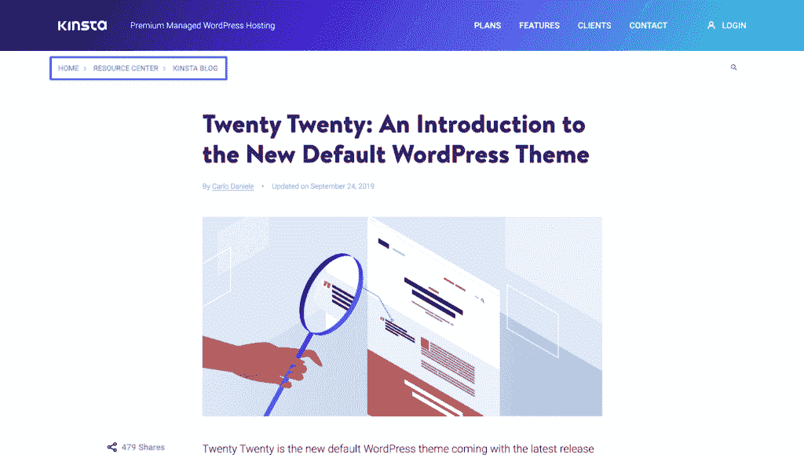
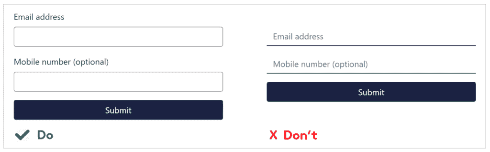
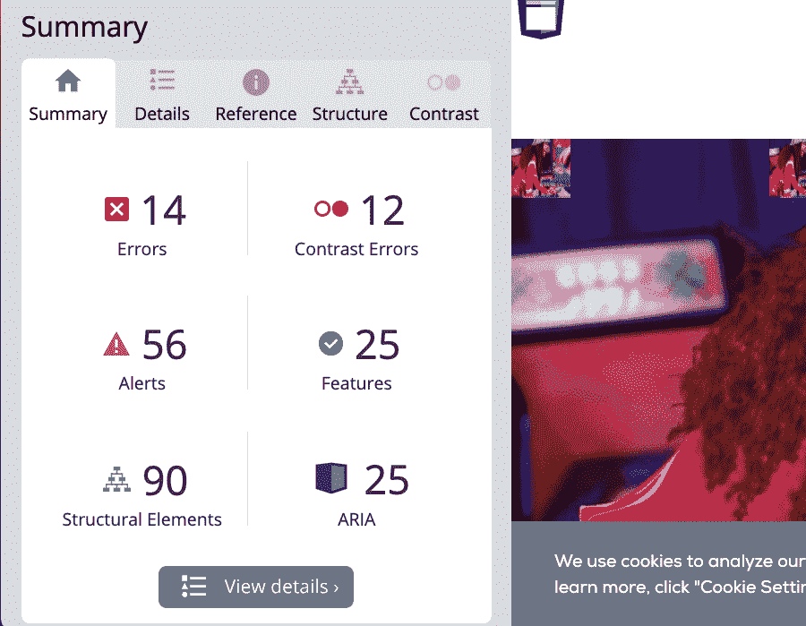

# 如何让你的 WordPress 网站具有可访问性

> 原文：<https://kinsta.com/blog/wordpress-accessibility/>

理解并正确利用 WordPress 的可访问性对你网站的可用性至关重要。如果您对这个主题不熟悉，可访问性就像它听起来的那样:任何人都可以访问和完全使用某个东西的程度。

> 可访问性是指让尽可能多的人可以使用你的网站。我们传统上认为这与残疾人有关，但使网站无障碍的做法也有利于其他群体，如使用移动设备的人或网络连接缓慢的人。”([来源](https://developer.mozilla.org/en-US/docs/Learn/Accessibility/What_is_accessibility) )

你的网站越容易访问，就有越多的人可以使用它。当一个网站的可访问性较低时，或者当可访问性没有被优先考虑时，你的一部分观众会被阻止或完全禁止获得你的网站所提供的所有信息。

在这篇文章中，我们将讨论为什么可访问性很重要，它意味着什么，WordPress 已经可访问的程度，网站建设者如何使网站可访问，以及如何测试网站的可访问性。

我们开始吧！

### 查看我们的[视频指南](https://www.youtube.com/watch?v=nMUtVfslx9Q)网站可访问性

## 网页可访问性意味着什么

网页可访问性意味着网站的设计和开发是为了让所有人都能使用。这包括他们如何理解、[浏览、](https://kinsta.com/blog/website-navigation/)，与网站互动，以及对网站做出贡献。

> 需要在这里大声喊出来。Kinsta 太神奇了，我用它做我的个人网站。支持是迅速和杰出的，他们的服务器是 WordPress 最快的。
> 
> <footer class="wp-block-kinsta-client-quote__footer">
> 
> 
> 
> <cite class="wp-block-kinsta-client-quote__cite">Phillip Stemann</cite></footer>

[View plans](https://kinsta.com/plans/)

一个充分定义和理解网页可访问性的好方法是打破它的一些神话。

[你的网站越容易访问，就有越多的人可以使用它。就这么简单。💪在本指南中了解更多信息。⬇️ 点击推文](https://twitter.com/intent/tweet?url=https%3A%2F%2Fkinsta.com%2Fblog%2Fwordpress-accessibility%2F&via=kinsta&text=The+more+accessible+your+site+is%2C+the+more+people+can+use+it.+It%27s+that+simple.+%F0%9F%92%AA+Learn+more+in+this+guide.+%E2%AC%87%EF%B8%8F&hashtags=WebAccessibility%2CWordPress)

### 误区一:这只是给盲人用的

一个完全可访问的网站应该可供有听觉、认知、神经、身体、语言和视觉障碍的人使用。残疾人是无障碍努力的主要焦点。然而，他们并不是唯一从无障碍网站中受益的人。

网页可访问性改善了以下各类人和情况的用户体验:

*   使用屏幕更小、输入模式各不相同的移动设备的人。
*   因衰老而导致能力、视力或行动能力受限的人。
*   像受伤的手一样有暂时困难的人。
*   在有可能改变屏幕对比度的照明区域使用网站的人。
*   有人使用有限的[互联网连接或带宽](https://kinsta.com/blog/network-latency/)访问网站。

### 误解二:这是一种时尚或趋势

近年来，你可能已经听到越来越多关于网页可访问性的话题。随着网络的发展，越来越多的人依赖于它，网络的可访问性成为一个更加紧迫的问题。但这不仅仅是一种时尚。

> “数字无障碍是全球残疾人的公民权利和人权。”
> [子卓琳·费恩戈尔德](https://www.lflegal.com/2019/04/after-csun19/#What-about-ADA-Website-Regulations)，残疾人权利律师兼作家

久而久之:网络的使用变得越来越普遍，因此需要广泛的网络可访问性。根据 WCAG 的规定，当一个网站不能完全访问时，个人可以对网站开发者或所有者采取法律行动。

只要看看围绕网页可访问性的诉讼数量，就能明白人们对此有多认真。从 2017 年到 2018 年，诉讼数量增加了近两倍。自那以后，这个数字平均每年为 2，345 起诉讼。即使在整个 2020 年的新冠肺炎疫情期间，联邦法院的 ADA Title III 网站可访问性诉讼数量也比上一年增加了 12%。

The number of accessibility-related lawsuits is only increasing with each passing year.

网页可访问性已经存在。当我们[开发软件和网站](https://kinsta.com/blog/cms-software/)时，我们需要将网页可访问性融入我们前进的过程中。这是必要的，不仅因为没有人喜欢被起诉，而且因为互联网需要满足所有个人的需求，无论这些需求是什么。

### 误解三:您可以完全自动化可访问性

一旦你理解了可访问性的重要性——以及不重视它的后果——你可能会急于确保你的网站符合 WCAG 标准。

关于网页可访问性的一个最流行的神话是，你可以[下载一个简单的插件](https://kinsta.com/blog/wordpress-download-manager/)或者安装一个软件，只需动动手指，就能让你的网站完全可访问。这根本不可能。

[根据 a11yproject.com](https://www.a11yproject.com/posts/2021-03-08-should-i-use-an-accessibility-overlay/)的说法，无障碍问题既有客观的，也有主观的。客观问题可以通过代码检测，主观问题需要人的判断。代码永远无法准确地解决属于后一类的问题，并且试图这样做通常会在过程中造成弊大于利。

> *“覆盖解决方案是自动化的软件解决方案，我们知道，它首先只能检测到大约 30%的 WCAG 问题。这是因为 WCAG 是微妙的和解释性的。机器不擅长这个。”([来源](https://www.accessibility.works/blog/avoid-accessibility-overlay-tools-toolbar-plugins/) )*

请记住，可访问性不是为了规避风险，而是为所有用户提供优化的体验。

## 网站内容可访问性指南

网页可访问性倡议制定了一套[网页内容可访问性指南](https://www.w3.org/WAI/standards-guidelines/wcag/) (WCAG)，可以帮助您确保您的网站是合规的和完全可访问的。如果你设计、开发或支持一个网站，你应该非常熟悉这些准则。

易访问性不仅仅是开发者关注的焦点，也是设计师、营销人员、内容作者、项目经理等等关注的焦点。从规划到启动，无障碍应该是整个网站建设过程中的优先事项。在网站上线后，你也应该不断提高网站的可访问性。

## WordPress 开箱即用的可访问性如何

当考虑将 WordPress 作为一个网站建设选项时，这是许多人提出的一个大问题:它的可访问性如何，要使 WordPress 可访问需要做多少工作？因为这个问题没有明确的答案，所以让我们来看看 WordPress 已经可以访问的程度。

### WordPress 在哪些方面做得更好

好消息是，随着时间的推移，WordPress 已经变得越来越容易使用。每个版本都在考虑可访问性的基础上取得了一些小的进步。随着可访问性成为更多人心中的一个更大的话题，更多的人可以优先考虑它。

The WordPress Accessibility Handbook.

此外，WordPress 社区中的许多人对这些话题充满热情并畅所欲言。每个新的默认 WordPress 主题都朝着更易访问的方向迈进了一步。开发者一直在开发新的辅助工具，编写关于 WordPress 可访问性的指南和文章。因此，在你的 WordPress 可访问性之旅中，你永远不会孤单。

如果你有兴趣直接从社区成员那里了解更多关于 WordPress 和可访问性的信息，请访问 WordPress.tv 并[观看这些关于可访问性的演讲](https://wordpress.tv/?s=accessibility)。

### WordPress 的失误之处

尽管最近有所进步，WordPress 并不总是 100%开箱即用。每一篇 WordPress 新闻稿都面临着一些批评，比如它的不足之处。2019 年初，WPCampus 对当时最新的[古腾堡](https://kinsta.com/blog/gutenberg-wordpress-editor/)版本进行了广泛的审计。像这样的工作非常重要；自那次审计以来，[已经解决了 116 个与无障碍有关的问题](https://www.wpcampus.org/blog/2019/05/gutenberg-audit-results/)。

残疾内容创建者很难用 WordPress 发布内容。因为不可能自动化所有可访问的设计和开发方面，任何人都可以用 WordPress 创建不可访问的网页。

> WordPress 的前端基本上还停留在几年前的老地方:完全可以访问，但这完全取决于网站的开发者。糟糕的主题或不可访问的插件会造成很大的不同。管理员一直在不断改进——让古腾堡编辑器变得更容易访问是一条艰难的道路，但是已经取得了进展。也就是说，避免任何新界面组件的可访问性退化是一场持久战。”([来源](https://www.joedolson.com/) )

那么这对你作为一个 WordPress 开发者或者设计师来说意味着什么呢？当你开始使用 WordPress 时，你到一个完全可访问的网站的旅程会稍微短一些。然而，在到达终点线之前还有一段距离。

## 如何制作一个无障碍的 WordPress 网站

现在，让我们来看看你可以采取哪些步骤来确保 WordPress 网站对所有用户都是可访问的。

无论如何，永远不要把可访问性作为项目结束时要解决的任务。这应该是一个优先事项，从流程的一开始就整合在一起。这应该是一个持续的目标，一旦网站推出。

没有单一的清单可以遵循或自动化，以确保 100%的可访问性。大部分工作取决于你的插件、主题和[内容。](https://kinsta.com/blog/evergreen-content/)

创建一个可访问的网站就像建造一个安全的建筑——当然，有指导方针，但个人的关注、维护和周到的翻新是确保你达到目标的关键。

### 无障碍设计的最佳实践

让我们从 WordPress 网站无障碍设计的一些[最佳实践开始，按类型分类。这些信息应该为您的无障碍教育打下坚实的基础。](https://kinsta.com/blog/web-design-best-practices/#accessibility-standards)

#### 形象

你网站上的所有图片都需要对所有用户开放。考虑到并非所有用户都能看到图像，有些人可能会使用辅助技术来理解视觉元素，因此您的网站应该准备好使用该技术。

可选文字是附加在图像上的书面描述。屏幕阅读器会向任何可能看不到图像的游客大声朗读该描述。替代文本应该用于在页面上提供有用信息的任何图像。这包括从照片到图标到信息图表的一切。

Alt text demo.

唯一的例外是，如果一个图像被认为是纯粹的“装饰”背景图片，分隔线，或者显示页面上文本的图片不一定需要替换文本。

当书写替代文本时，记住不要如实描述图像。相反，在页面的上下文中传达图像的含义。这里有一些很好的指导方针，可以帮助你写出优秀的备选文本:

*   简短是最好的。
*   屏幕阅读器会告诉你这是一个图像，所以避免在你的替代文本中说“这是一个…的图像”。
*   如果图像是一个链接，alt 文本应该解释如果用户选择该图像会发生什么。
*   替代文本应该包括图像上出现的任何文本。例外情况是相同的文本也出现在图像附近，比如在标题中。

在你的 WordPress 网站的图片上添加替代文字比你想象的要简单。你可以在添加图片标题的地方添加文本。

打开您的**媒体库**并选择您想要编辑的图像。该图像的**设置**屏幕将会打开。在**替代文本**字段中，添加您的替代文本，然后点击**保存**:

Alt text field.

#### 颜色；色彩；色调

当设计一个易访问的网站时，提供足够的颜色对比是很重要的。在许多情况下，糟糕的颜色对比度会影响站点的可读性，例如对于视力不好的用户、色盲用户或使用某些设备的用户。图像、文本和按钮等元素都需要适当的颜色对比。

## 注册订阅时事通讯

### 想知道我们是怎么让流量增长超过 1000%的吗？

加入 20，000 多名获得我们每周时事通讯和内部消息的人的行列吧！

[Subscribe Now](#newsletter)

色彩对比指的是当彼此相对或非常接近时，颜色看起来是亮还是暗。例如，白色背景上的黑色文本的颜色对比度(21:1)比白色背景上的黄色文本(1.08:1)高得多。WCAG 2.0 AA 要求普通文本的最小比例为 4.5:1，较大文本(粗体 18px 或标准 24px 及以上)的最小比例为 3:1。

那到底是什么意思？确定你的[颜色是否搭配得很好](https://kinsta.com/blog/website-color-schemes/)的最简单方法是将它们插入一个对比度测试工具，比如 [WebAIM 对比度检查器。网上有大量免费的 checker 工具。](https://webaim.org/resources/contrastchecker/)

[查看我们的测试部分](#how-to-test-site-accessibility)，了解更多关于测试颜色的信息。

当你测试越来越多的颜色组合时，你会更好地通过视觉判断哪些颜色组合有效，哪些无效。

The WebAIM Contrast Checker.

你还需要确保避免使用颜色作为主要的区分因素。例如，许多网站的链接颜色与周围的正文不同。然而，如果用户由于某种原因很难看到颜色，他们就不可能区分链接单词和非链接单词。使用颜色来修饰链接，但在文本下方添加下划线以使链接易于访问。

#### 文本

我们在网上经历的大部分是文本。我们使用网站阅读文章、食谱、故事等等。你现在正在读这篇文章！因此，文本需要针对所有读者进行优化——无论他们是用眼睛还是耳朵阅读。

在谈论可访问性时，讨论文本主要有两种方式:[字体](https://kinsta.com/blog/web-safe-fonts/)和大小。

在[小尺寸和大尺寸](https://kinsta.com/blog/how-to-change-font-in-wordpress/#changing-font-sizes-in-wordpress)时，无障碍字体易于阅读。像 Tahoma、Calibri、Helvetica、Arial、Verdana、Times New Roman、Arvo、Museo Slab 和 Rockwell 这样的字体都是可访问的选择。患有阅读障碍的读者可能会发现阅读某些字体很有挑战性，包括许多衬线字体。[正文使用无衬线字体](https://kinsta.com/blog/best-google-fonts/)更安全。最好避免显示字体——比如[手写风格](https://kinsta.com/blog/calligraphy-fonts/)或者[草书](https://kinsta.com/blog/cursive-fonts/)——除非文本很大，很稀疏，而且大多是装饰性的。

With an accessible font, differences in letters make words easier to read.

字体大小对于可访问性来说非常重要。让我们讨论一些关于可访问字体大小的经验法则。

默认字体至少应为 9pt 或 12px。建议 12pt 或 16px。根据 WCAG 指南，当缩放到 200%时，文本应该能够被阅读。建议使用百分比或 em 而不是像素或磅来设置字体大小。使用不同的字体粗细是可以的，但是如果你的文本使用了轻量级字体，要确保它足够大，可以看得见。

这并不是如何在设计中考虑可访问性的最终目的。但是知道从哪里开始是至关重要的。如果你想深入了解无障碍设计，请参考以下资源:

*   [W3C 网页设计与应用](https://www.w3.org/standards/webdesign/accessibility)
*   [面向设计师的网络无障碍入门](https://uxplanet.org/a-primer-to-web-accessibility-for-designers-2c548448c612)
*   [为可访问性而设计并不难](https://uxdesign.cc/designing-for-accessibility-is-not-that-hard-c04cc4779d94)
*   [10 个符合 ADA 的无障碍网页设计示例](https://www.dbswebsite.com/blog/ada-compliance-starts-with-accessible-design/)
*   [设计中的无障碍](https://www.deque.com/accessible-design/)

### 无障碍开发的最佳实践

当建立一个网站或其补充软件(如主题和插件)时，有一些重要的事情需要记住。这与设计有些重叠，但是下一节主要关注你的网站如何工作，以及你的用户如何与之交互。

#### 互动元素

无论如何，用户应该能够相对容易地与你的网站互动并使用它。这不仅仅包括欣赏图像和阅读文本，还包括与菜单、[表单、](https://kinsta.com/blog/wordpress-forms/)、按钮和[视频](https://kinsta.com/blog/embed-youtube-video-wordpress/)的互动。

当你建立你的网站时，确保所有的交互元素都可以被容易地识别。所有导航菜单——从[页眉到页脚](https://kinsta.com/knowledgebase/add-code-wordpress-header-footer/)——都应该可以用键盘控制。`hover`、`focus`和`click`上的链接和按钮的外观应该改变。

Button styles.

网站页面的导航应该一致清晰。导航链接的命名、风格和位置非常重要。深思熟虑的[面包屑](https://kinsta.com/blog/wordpress-breadcrumbs/)和清晰的标题会让用户自信地与你的内容互动。

Kinsta utilizes breadcrumbs to help readers more easily navigate our blog.

很有可能，你的网站上有一两个表格。您可能会惊讶地发现有多少表单是不可访问的。您的表单元素必须包含相关联的标签，可以在域的左侧，也可以在域的上方。(复选框和单选框可以放在右边。)用户应该非常清楚每个表单域的用途。

需要为你的 WordPress 站点提供超快的、可靠的、完全安全的托管服务吗？Kinsta 提供所有这些以及 WordPress 专家提供的 24/7 世界级支持。[查看我们的计划](https://kinsta.com/plans/?in-article-cta)

Borders for text fields make a form more accessible.

如果你的网站上有任何自动播放的内容，如 [GIF](https://kinsta.com/blog/embed-google-form/) 、[滑块](https://kinsta.com/blog/wordpress-slider/)、旋转木马、视频或[音乐](https://kinsta.com/blog/wordpress-audio-players/)，应该有允许用户停止动画或声音的可见控件。最好提供停止、暂停或完全隐藏元素的选项。

如果你是一个想要深入开发网页可访问性的开发者，请直接从 W3C 查看这些技巧。

### wordpress 主题

如果你是一个 DIY 网站建设者，你可以通过选择一个可访问的主题来完成这篇文章讨论的很多内容。对于开发人员来说，重要的是要理解是什么让一个主题具有可访问性，以便在他们的项目中优先考虑它。

WordPress 主题控制你网站的外观。许多主题都预先打包了配色方案和字体系列。务必确保这些颜色和字体符合上述要求。许多主题标榜自己是“完全可访问的”，但这并不总是正确的。使用您自己的测试来确定主题是否可访问。

WordPress 的易访问性团队已经在 WordPress 知识库中准备了一份 92 个免费主题的列表，你现在就可以开始使用。

当构建一个可访问的主题时，确保你从一开始就熟悉 WCAG 的需求。开发过程中需要解决的常见问题包括:

*   预设调色板中足够的颜色对比度
*   使用键盘轻松浏览网站的能力
*   使用适当的 ARIA 角色和/或 [HTML5](https://kinsta.com/blog/html-vs-html5/) 地标来确保屏幕阅读器就绪体验
*   [正确的 HTML 语义标记](https://kinsta.com/blog/html-best-practices/)
*   避免页面上重复的 id
*   允许用户停止或控制任何自动运动

当你开始创建你的主题时，确保将 [WordPress 可访问性指南](https://developer.wordpress.org/themes/functionality/accessibility/)加入书签以便参考。

### WordPress 插件

WordPress 插件允许你给你的 WordPress 网站添加即插即用的功能。有两种类型的 WordPress 可访问性插件:帮助你建立一个可访问的网站和使一个现有的网站对用户可访问。

注意那些为你提供“一键访问”或“自动访问”保证的 WordPress 插件这些事情是不可能的。插件是可以帮助你实现可访问性目标的工具，而不是为你做所有工作的魔棒。有时候，插件甚至会阻碍你的可访问性——所以要小心行事！

有大量以可访问性为中心的插件，承诺改善、监控或修复可访问性问题。他们可能会审核网站，让你知道哪里可以改进。或者他们可以提供前端工具，使在你的网站上创建可访问的体验变得更加容易。

其中一些非常有帮助。然而，其他人提供虚假的承诺。在使用一个插件之前，一定要彻底检查它。

一些插件创建交互式内容，如测验和滑块。如前所述，这些元素需要特别关注和测试，以确保它们是完全可访问的。在[将一个交互式插件推出](https://kinsta.com/help/go-live-checklist/)之前，一定要在[试运行或开发网站](https://kinsta.com/blog/wordpress-staging-site/)上彻底测试它。

对于[表单插件](https://kinsta.com/blog/wordpress-contact-form-plugins/)也可以这么说。不幸的是，许多都有可访问性问题。如果您发现这种情况，自定义编码的表单是一个很好的选择。

一个流行的插件类别是[页面生成器插件](https://kinsta.com/blog/divi-vs-elementor/)。这些非常有助于您快速构建健壮和复杂的拖放式设计。然而，它们带来的可访问性问题往往比它们解决的问题更多。这个问题没有单一的解决方法，所以保持你的设计简单，确保你测试了所有的元素来确认可访问性。

### 可访问性声明

辅助功能声明是您网站上的一个页面，您可以在其中传达您的内部政策、辅助功能目标以及过去与残疾人合作的成功案例。

出于以下原因，你应该在你的 WordPress 网站上生成并发布一个可访问性声明:

*   向你的用户表明你关心可访问性和他们
*   提供关于内容可访问性的信息
*   展示对无障碍和社会责任的承诺

你可以遵循 W3C 提供的这些指导方针或者使用 T2 的可访问性声明生成器来编写你自己的可访问性声明。

## 如何测试 WordPress 网站的可访问性

可访问性不是按下正确的按钮，然后走开。测试是确保网站完全可访问的重要部分。自动和手动测试都有助于确保覆盖所有的基础。

### 如何进行自动化测试

自动化测试有助于判断从哪里开始。如果您对可访问性不熟悉或者不确定从哪里开始，可以从自动测试和评估开始。

大多数自动化测试将识别诸如差的颜色对比、缺少 alt 文本、空链接、结构元素的问题等等。您可以使用这些测试来生成要解决的问题列表。像这样的测试对于发现基于代码的错误特别有帮助，这些错误可能不太容易被肉眼看到，但是对一些用户来说却非常重要。

您可以使用的免费可访问性测试的一个例子是 [WebAim 工具](https://wave.webaim.org/)。它会检查您的整个网页并生成一个错误列表。它甚至会告诉你这些错误发生在页面的什么地方。

WebAim tool showing a summary of errors.

您可以找到大量的个人辅助工具来帮助解决特定的问题。例如，[在你开始设计之前，使用对比检查器](https://webaim.org/resources/contrastchecker/)来确保你调色板中的颜色搭配得很好。

请记住，没有一个自动化测试是完美的、万无一失的，或者是手工测试的替代品。

### 如何进行手动测试

因为 WordPress 的可访问性是关于真实的人类用例，真实的人类必须对一个网站是否可访问做出最终的决定。因此，为手工测试预留时间和资源是非常重要的。

那么，如何执行手动测试呢？这里有几个方法可以测试一个网站的可访问性，不需要昂贵的工具或程序:

1.  **扔掉鼠标:**确保你可以仅使用键盘按键合理方便地浏览网站的所有功能。这包括在各部分之间移动、访问菜单、从一页到另一页、向下跳转页面以及与链接和表单交互。
2.  **使用屏幕阅读器:**把自己放在能见度低或差的人的位置上。使用屏幕阅读器应用程序或网站，检查网站上的内容，确保大声朗读时仍然有意义，听起来流畅。
3.  **在不同的环境中测试网站:**去一个有公共 WiFi 的地方，确保你的网站在没有高质量互联网连接的情况下正常加载。请注意网站中因连接不良而滞后或完全消失的区域。
4.  **增加缩放:**在浏览器中打开你的站点，使用浏览器设置放大 200%。在这种情况下，你还能使用、浏览和参与网站吗？是否有内容消失或被切断？
5.  关注交互性:确保花大量时间测试视频、表单和按钮等交互元素。链接和表单域应该始终用轮廓、下划线和特殊光标来突出显示。
6.  **仔细检查你的 alt 标签:**如果你不确定一个图像是否有附加的替换图像，[使用检查元素工具](https://kinsta.com/blog/inspect-element/)来确认。
7.  **换个角度思考:**如果你网站上的所有图片都消失了，有人还能使用它吗？如果你的网站上所有的颜色突然变成黑色和白色，那会如何影响可用性？确保如果装饰元素受到某种影响，网站的基本部分仍然可以工作。

如有疑问，请联系提供手动可访问性测试的公司。易访问性和网页设计与开发方面的专家可以快速完成手工检查，并准确地告诉你哪些地方需要改进。

不要忘记你现实生活中的观众是你最好的资源之一。在你的网站上有一个清晰的区域，用户可以在那里提供可访问性反馈。如果有人在使用你的网站时遇到困难，从你收集反馈的努力中可以清楚地看出，你愿意倾听他们的经历并纠正这个问题。

所有访问者都可以访问你的网站吗？👀在本指南中了解有关如何测试可访问性的更多信息⬇️ 点击发送推文

## 摘要

互联网已经成为我们日常生活中最重要的工具之一。每个人都需要有访问它的自由，无论是浏览娱乐还是基本信息。你的网站有责任达到网络公平的标准。

理解这些指导方针的必要性是做出重大而持久的改变的第一步。建立一个[可访问的网站](https://kinsta.com/web-accessibility-statement/)意味着更多的人从你的网站所提供的东西中受益。

关于 WordPress 的可访问性，你还有什么问题吗？请在评论区告诉我们！

* * *

让你所有的[应用程序](https://kinsta.com/application-hosting/)、[数据库](https://kinsta.com/database-hosting/)和 [WordPress 网站](https://kinsta.com/wordpress-hosting/)在线并在一个屋檐下。我们功能丰富的高性能云平台包括:

*   在 MyKinsta 仪表盘中轻松设置和管理
*   24/7 专家支持
*   最好的谷歌云平台硬件和网络，由 Kubernetes 提供最大的可扩展性
*   面向速度和安全性的企业级 Cloudflare 集成
*   全球受众覆盖全球多达 35 个数据中心和 275 多个 pop

在第一个月使用托管的[应用程序或托管](https://kinsta.com/application-hosting/)的[数据库，您可以享受 20 美元的优惠，亲自测试一下。探索我们的](https://kinsta.com/database-hosting/)[计划](https://kinsta.com/plans/)或[与销售人员交谈](https://kinsta.com/contact-us/)以找到最适合您的方式。