# 启动和运行一个成功的 WordPress 代理的指南

> 原文：<https://kinsta.com/blog/wordpress-agency/>

听足够多成功的 WordPress 代理公司的起源故事，你会注意到它们听起来惊人的相似:

创始人以自由设计师或开发人员的身份工作，一边建立网站，一边经营他们的小型(或个人)企业。不可避免地，他们开始环顾四周，想知道是否有他们错过的机会——那些会让他们的工作更轻松，他们的生活更充实，*和*他们的生意更赚钱的机会。

你可能知道也可能不知道，但这正是 Kinsta 的创始人开始创业的地方。马克、安妮塔、彼得和汤姆在 2013 年经营着一家网站开发公司，工作量很大，但回报并不丰厚。

最终，Kinsta 的创始人意识到他们所做的事情是不可扩展或不可持续的。这也是许多 WordPress 自由职业者和小企业主的观点。

要改变这种说法，你必须准备好让你的公司朝着不同的方向发展。对金斯塔来说，这意味着进入由[管理的 WordPress 托管平台](https://kinsta.com/blog/managed-wordpress-hosting/)。对其他人来说，这可能意味着建立一个繁忙的 WordPress 机构。你的故事是你自己塑造的。

也就是说，无论你选择走哪条路，如果没有以下几点，你的成长都是不可能的:

*   一组敬业的专家
*   保守的流程和文档
*   自动机和模板丰富多彩

这并不是说你作为一个自由职业者没有这些元素。但是 WordPress 代理要求你把它带到另一个层次。

如果你发现自己处于类似的境地，你对自己的工作感到满意，但并不觉得自己的影响力或利润得到了最大化，那么是时候将你的自由职业转变为一家提供全方位服务的机构了。

在这篇**关于开始一个 WordPress 代理**的指南中，我们将向你展示如何开始一个代理，以及之后，如何扩展它以获得更大的成功和可持续性。

## 什么是 WordPress 代理？

自由职业者的生意和 WordPress 代理公司的生意有很大的不同。见鬼，一个小型的 WordPress 公司和一个提供全方位服务的代理公司之间是有区别的。

以下是三者的一些不同之处:

|  | **自由职业者** | **小型企业** | **WordPress 机构** |
| **团队规模** | 1 人 | < 10 人 | 超过 10 人 |
| **团队动态** | 你=所有帽子的佩戴者 | 你+小团队=每个人都努力的紧密团结的家庭 | 你+团队领导+团队成员=每个人都有明确的角色要扮演 |
| **提供的服务** | 服务: WordPress 网站 | **Services:** WordPress websites**产品:**每月维护 | **服务+产品:** WordPress 网站+每月维护+数字营销服务+教练+其他专业服务 |
| **客户数量** | 基于你的能力 | 基于您团队的能力 | 大预算客户的重复基数+新客户的稳定流入 |
| **收入潜力** | 取决于你工作的小时数 | 取决于你的团队可以工作的小时数 | 无穷尽 |
| **客户来自…** | 冷淡的接触，对工作列表的回应，口碑 | 口碑、销售线索磁铁、内容营销 | 口碑、销售线索磁铁、销售渠道、内容营销、PPC 广告、再营销、加盟合作伙伴、客座博文和其他高调的新闻活动 |

以下是你应该从中吸取的教训:

WordPress 代理公司拥有比自由职业者或小团队更多的收入潜力。然而，这并不总是必然的。

如果你想从中获利，你必须投入大量的工作来建立一个 WordPress 代理，所以不要把雇佣一个团队的行为等同于增加产量。不仅仅是这样。

## 你如何开始一个 WordPress 代理？

还记得《办公室》的那一集吗？迈克尔·斯科特尖叫道:“我宣布破产！”？

Michael Scott declares bankruptcy the wrong way.

他认为所需要的只是一份公开声明来消除他的债务。你我都知道在生意或生活中没有什么是那么容易的。这就是为什么你需要做的不仅仅是开始称你的公司为“WordPress 代理”。

如果你准备好迎接挑战(和奖励)开始你自己的公司，从这里开始:

### 第一步:定义你的使命

根据 FlexJobs 最近的一项调查，这些是自由职业者关注的最大挑战:

*   寻找客户
*   创造可预测的收入流
*   管理他们的自由职业者业务

当你专注于从哪里获得下一个客户，或者如何在管理业务和建设网站之间取得平衡时，你很难专注于一项使命，而不是:

> “做一份出色的网站设计工作，让大客户愿意和我一起工作，并按时支付我报酬。”

一旦你的 WordPress 业务更加成熟，你在工作中创造了一些稳定性，一切都会改变。在这一点上，你需要有一个坚如磐石的使命，每一个决定都围绕着它——一个将你的奋斗焦点转移到你想要帮助的人身上的使命。

为了定义你的使命，问自己以下问题:

#### “我们将为谁服务？”

换句话说，你的定位应该是什么？

虽然 [Codeable](https://codeable.io) 不是一家 WordPress 代理公司，但你肯定能体会到该公司使命的演变。

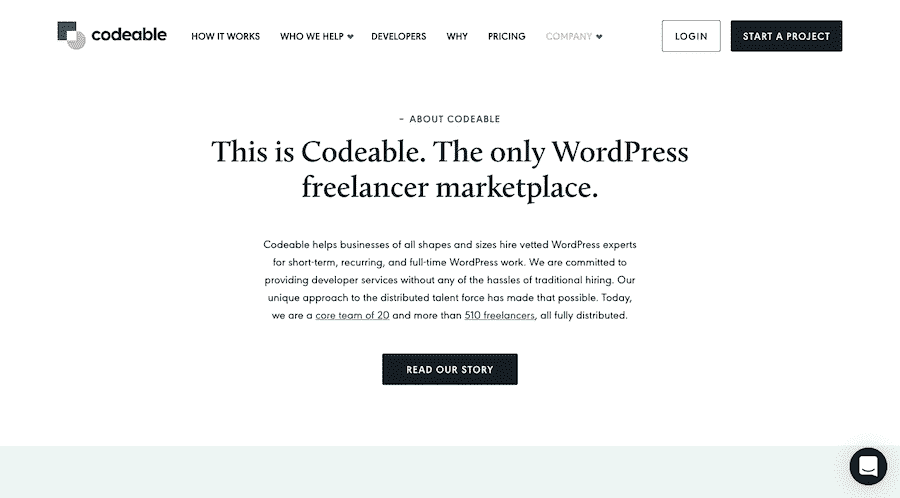

Codeable’s About page

[创始人经营开发机构的经历](https://kinsta.com/blog/interview-with-per-esbensen/)引导他们为他们有第一手经验的问题创造解决方案:

> Per 对客户方感到失望，Tomaz 对自由职业者感到失望:无数的自由职业者、投标、竞相杀价、激烈的竞争、糟糕的工作质量、错过的最后期限，结果是所有不开心的客户和自由职业者

那么，你最热衷于为谁服务？

接下来，问问你自己:

#### "为什么我们想提供这些 WordPress 服务？"

你是否觉得这种服务在市场上有缺口？还是说你的目标受众大多被忽略了？

想想你进入市场会带来什么样的不同。然后，写一个简短的描述，总结你将要做的事情的原因。

下面是 Codeable 是如何做到的:

> “目的是创造一个健康的环境，让客户和自由职业者都能分布式工作。”

使命是 100%专注于提升 Codeable 的目标客户的生活和业务。你也应该这样做。

最后，你需要问自己:

#### “我们希望该机构在 12 个月内达到什么水平？24 个月怎么样？还是 5 年？”

你不需要预测未来，但你需要有一个足够清晰的路线图来帮助你的机构朝着正确的方向前进。

以 Codeable 为例。虽然它的服务随着时间的推移而扩展，但它仍然坚定不移地履行自己的使命:

> “Codeable 从小型定制任务开始，但今天我们帮助各种形式和规模的企业。虽然我们的服务范围发生了变化，但我们释放分散人才、创造平等机会、让客户和自由职业者在基于信任的环境中茁壮成长的使命仍然不变。我们仍然专注于增长，不是为了增长，而是为了改变人们的生活。”

这个练习的目标设定和路线图部分不是你现在需要公开分享的。但是，您的内部团队应该意识到这一点，以便他们自己的目标和发展路线图能够与您的机构保持一致。

一旦你确定了你的使命，就创建一份正式的使命宣言，把它保存在你的团队可以接触到的地方，并在需要为你的公司做出重大决定的时候再回来。

### 第二步:选择你的服务

既然你已经知道了你要为谁服务，为什么要服务，那么是时候弄清楚你到底要为他们做什么，怎么做了。是的，你是一家 WordPress 代理公司……但是具体是哪一种呢？

你的利基将有助于这一点。

以[it Eris](https://www.itineris.co.uk/)为例。这个 WordPress 代理提供以下服务:

Itineris explains which kinds of clients it supports.

通过明确你要帮助谁，你可以更好地选择你需要提供哪些服务。在 Itineris 的情况下，这意味着:

*   高级 web 开发
*   数字品牌
*   可投标媒体
*   搜索引擎优化

然后，你就有了 [WP-Tonic](https://www.wp-tonic.com/) 的例子，它专门为 [LMS](https://kinsta.com/wordpress-lms-hosting/) 和[会员网站](https://kinsta.com/blog/wordpress-membership-plugins/)做 WordPress 开发。

电子学习业务是一个特殊的品种，具有支持会员和在线课程集成所需的功能。因此，WP-Tonic 为这些特定的客户群提供服务:

*   网站开发
*   定制设计(用于 [WooCommerce 结账](https://kinsta.com/blog/woocommerce-checkout/)、 [lead gen 登陆页面](https://kinsta.com/blog/wordpress-landing-page-plugins/)、电子邮件营销、销售渠道等)。)
*   定制 [LMS 插件](https://kinsta.com/blog/wordpress-lms-plugins/)开发
*   装帧设计艺术
*   [搜索引擎优化](https://kinsta.com/blog/what-does-seo-stand-for/)
*   托管托管
*   安全和备份支持

底线？不要认为 WordPress 代理公司应该提供和其他公司一样的服务。

相反，考虑你的客户真正需要什么。然后，想想这如何发挥你的优势。

如果你对公司的愿景不是你目前团队所能支持的，也不用担心。把那些额外的服务或产品放在架子上，慢慢地但坚定地扩大你的规模。

现在，专注于在你提供的服务中提供巨大的价值。

确定必需品:你有能力提供的和你的客户需要的。将它们写下来，并对每一个进行简要描述，然后继续下一步。

### 第三步:设定价格

当你经营一个小企业时，你可能不愿意在网上公布你的价格。你希望潜在客户关注你的价值，而不是关注他们建立一个 WordPress 网站的成本。

然而…

溢价定价和价值是 WordPress 代理固有的特征。所以，没有理由不让公众知道这些信息。

此外，通过在你的网站上公布你的开发成本和每月的聘用价格，你可以迅速剔除那些没有预算的潜在客户。

下面是 DevriX 如何做到这一点的:

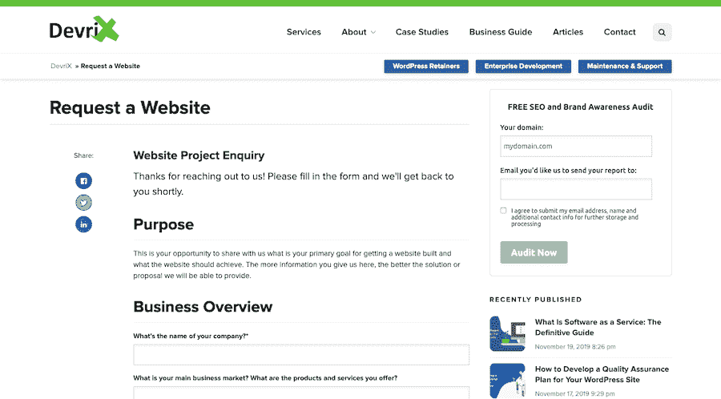

“Request a Website” form for interested prospects.

该机构服务的价格多次出现在网站上。然而，让我们说，有人得到了这个请求的网站表格，并以某种方式掩盖了任何提及成本。没关系，因为这里还有一个提醒:

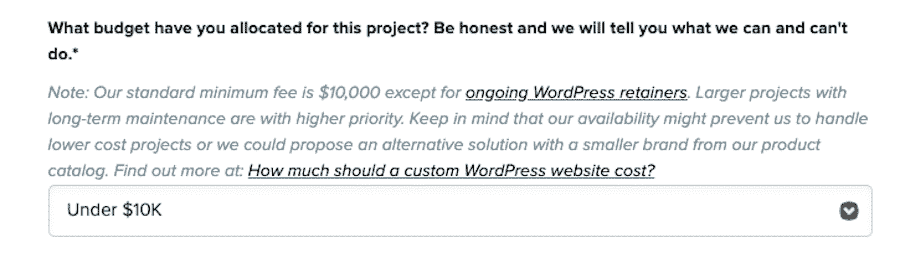

DevriX statement about average costs for custom development.

可以想象，这让你与潜在客户的对话更有意义。在价格问题上，你不必跳踢踏舞。这一点已经确定了。相反，你可以只关注他们需要什么，以及你将如何解决。

至于算出你要向客户收取多少费用，这需要一点点工作来解决。

#### 查看市场平均水平

首先，调出上一步中的服务列表。

接下来，检查一下你在市场上的主要竞争对手——那些在相似的领域和提供相似产品的竞争对手。这将为你提供一个很好的基准，来衡量当前的价格和你的目标客户能够承受的价格。

然后，你需要做一些内部计算。

#### 列出你的开销

列出你的每一项开销，以及每个月你欠了多少。这包括以下内容:

*   商业软件
*   营业执照和保险
*   税款支付
*   办公空间和公用设施
*   设备和家具
*   虚拟主机、域名和相关费用
*   工资、福利、PTO
*   公司旅行、活动等。

当然，你需要做的不仅仅是弥补你的成本。但是你需要先浏览一下这些数字，以确保你是在正确的轨道上。

#### 建立标记

你需要多少利润才能盈利？

换句话说:

如果你的管理费用大约是每月 20，000 美元，你需要多少钱才能获得健康的利润？30%的加价(6000 美元)够了吗？

请记住:如果你想为客户提供一流的产品，并照顾好运营团队，你需要资金重新投资到你的公司。

找到理想的加价，然后把它作为你的目标月销售额。

#### 设定您的价格

将你的目标收入除以你一个月可以合理承担的项目数量。

现在，将你的每个项目的成本与平均市场价格进行比较。你的号码太短了吗？太高了吗？如果有差异，你所提供的价值是否合理？正如金斯塔公司的联合创始人兼首席财务官汤姆·松博吉所说:

> 如果较低的价格是你最大的优势，你应该重新考虑你的生意。竞争到底不是一个好的策略，也很少奏效。

只要你能赚到足够多的利润，并且客户带走了非常有价值的东西，你就可以承诺这个价格。

完成后，创建您的价格表，并在准备就绪时将价格发布到您的网站上。

不要忘记每年重新评估你的成本和价格。随着你的服务越来越强大，你的产品越来越复杂，这些数字应该会改变。

### 第四步:选择一个名字

我知道这似乎是你应该早点做的事情，但我认为在选择名字之前，弄清楚你的公司将提供什么以及提供什么水平的服务是至关重要的。

一旦你的品牌身份确定下来，是时候选择一个名字了。执行此操作时，请记住以下提示:

*   除非你想成为公司的代言人，参与每个项目，否则就把你的名字从里面去掉。
*   保持简短。
*   使它容易发音。
*   暗示你独特的价值主张和优势。
*   使用虚构的词语，而不是那些可能已经在你的客户脑海中产生强烈联想的词语。
*   确保没有其他公司已经拥有它或它的变体。
*   [查看域名是否可用](https://kinsta.com/blog/choose-domain-name/)。

一旦你选定了几个选项，就让其他人来执行:你的员工、以前的客户，甚至是你在社交媒体上的粉丝。

了解他们对此的感受。他们更有可能注意到某件事是否“不对劲”,因为他们不像你那样离它那么近。

当你把名字确定下来后，开始创作你的标志和其他品牌元素。

### 第五步:创建一个新网站

一个代理网站需要能够走的路。换句话说，在潜在客户查看你的作品组合之前，他们应该将你的网站视为你能力的证明。

你的网站需要做的不仅仅是通知。你希望它为你做尽可能多的工作，变得像另一个团队成员一样。

这里有一些方法可以让你做到:

#### 移动到托管 WordPress 主机

你知道管理虚拟主机有多耗时，尤其是当流量增长时。

这就是为什么你应该外包自己的虚拟主机。你最不想要的就是一个缓慢加载的网站来分散你需要完成的付费客户工作的注意力。

如果你还没有这么做，现在是时候把你的网站放到由 Kinsta 托管的 WordPress 上了。

你将享受到[快速](https://kinsta.com/blog/boosting-wordpress-performance/)、[安全](https://kinsta.com/secure-wordpress-hosting/)和[备份网站](https://kinsta.com/help/wordpress-backups/#wordpress-backups) — **的好处，而没有自己管理的麻烦**。不过，当您确实想了解幕后发生的事情并控制您的服务器性能时， [MyKinsta](https://kinsta.com/blog/manage-multiple-wordpress-sites/) 可以让您轻松做到这一点:

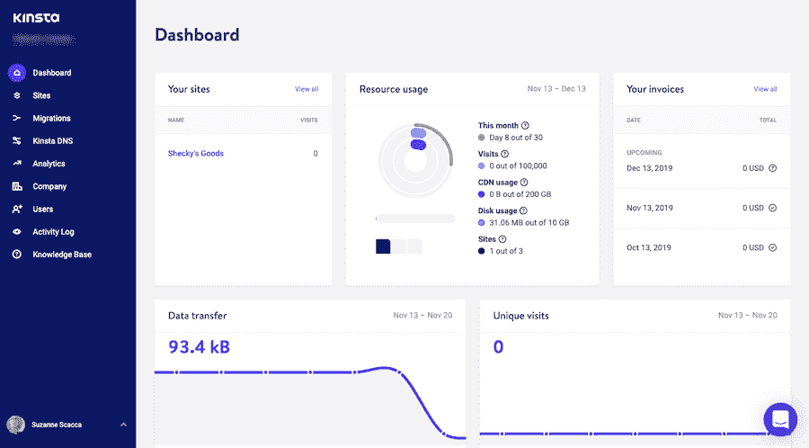

The MyKinsta dashboard for users.

使用托管的 WordPress 主机不仅能让你安心，还能确保你的网站对于访问它的潜在客户来说总是处于最佳状态。

此外，由于不同的 [MyKinsta 用户角色](https://kinsta.com/help/mykinsta-user-roles/)，你将完全控制用户对你开发的网站的访问。有了 Kinsta 的[增强型站点转移工具](https://kinsta.com/feature-updates/site-transfer-tool/)，将完成的项目交给客户变得轻而易举。

[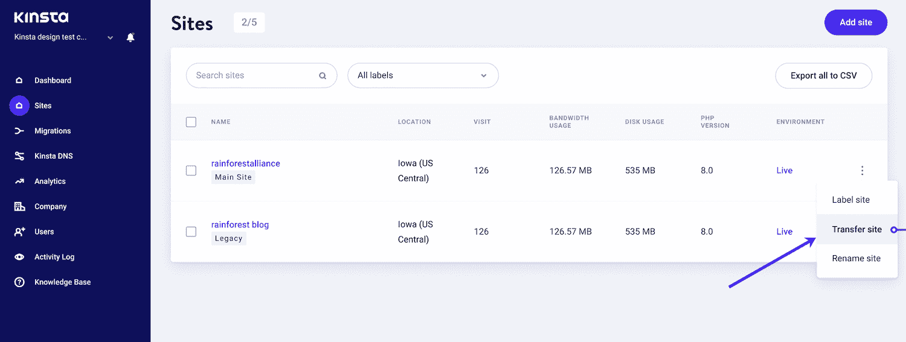](https://kinsta.com/wp-content/uploads/2021/11/sites-transfer-site.png)

Transfer sites easily to another user or company.

你甚至可以把网站转移到非 Kinsta 账户。你只需要他们的电子邮件地址。这让你有时间专注于其他重要的任务，比如更好地管理和发展你的机构。

#### 展示你最令人印象深刻的作品

你的网站将拥有一个更小的 WordPress 网站所拥有的一切。然而，你的投资组合需要让你的潜在客户大吃一惊。

考虑使用一个 WordPress 作品集插件,它会让你最近的相关样本大放异彩。

不要害怕创建一个偏离预期的投资组合。只要看一看 [Neuralab](https://www.neuralab.net/) 的投资组合(你可以在这里阅读[他们的案例研究](https://kinsta.com/clients/neuralab/) ): 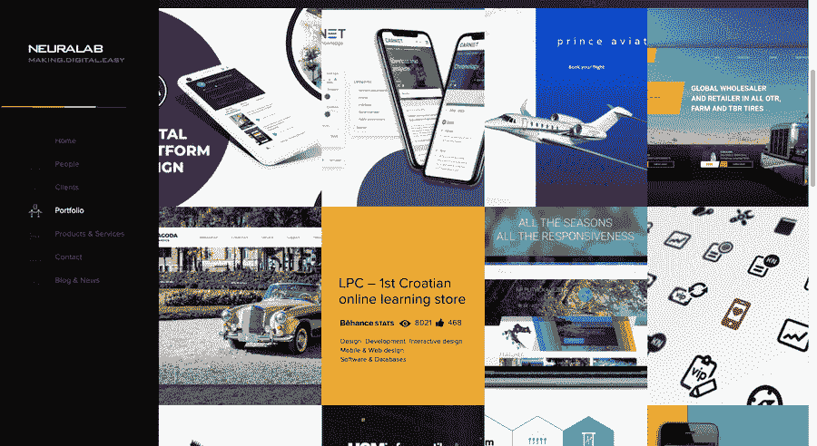

Neuralab 为其产品组合增加了定制细节。乍一看，它像是一个标准的基于网格的投资组合。然而，功能揭示了更多的细节，如它是什么样的项目，并查看和喜欢 Behance 的统计数据。

#### 介绍你的团队

当你经营一家规模较小的企业时，客户很容易看到你团队成员的面孔，并在个人层面上了解你们每个人。

随着你建立一个机构，你的团队将会成长，与这么多参与者建立人际关系将会变得很有挑战性。通过你的网站介绍你的团队是抑制你的客户可能感觉到的这种潜在脱节的一种方法。

## 注册订阅时事通讯

### 想知道我们是怎么让流量增长超过 1000%的吗？

加入 20，000 多名获得我们每周时事通讯和内部消息的人的行列吧！

[Subscribe Now](#newsletter)

[触发鱼](https://www.triggerfish.se/en/contact/employees/)做得很好:

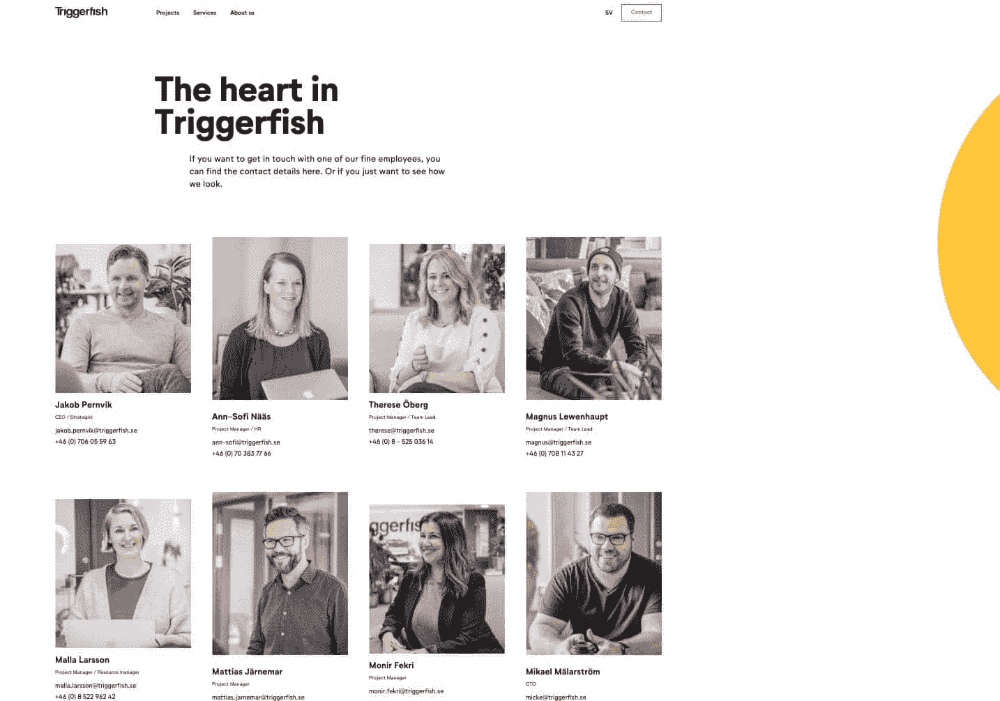

Triggerfish gives a peek at the people working behind the scenes

每个团队成员都有一张自然的照片、联系方式和职位。

以这种方式展示你的团队有双重作用。你可以把客户介绍给幕后的人。但这也像是一张廉价的布条:

> “看看我们有多少人为你工作！”

#### 添加各种联系渠道

因为不再只是你坐在电话或电子邮件的另一端，你可以给潜在客户多种方式联系你:

*   公司电话号码
*   电子邮件地址(或不同部门的不同电子邮件地址)
*   一张[联系表](https://kinsta.com/blog/wordpress-contact-form-plugins/)
*   实时聊天或聊天机器人
*   支持门户
*   [社交媒体](https://kinsta.com/blog/wordpress-social-media-plugins/)(如果你想在那里提供答案和支持)

虽然你可以提供所有这些联系方式，但这并不意味着你必须把它们都放在你的网站上。看[红厂](https://redfactory.nl/)(你可以在这里阅读[他们的案例研究](https://kinsta.com/clients/red-factory/)):

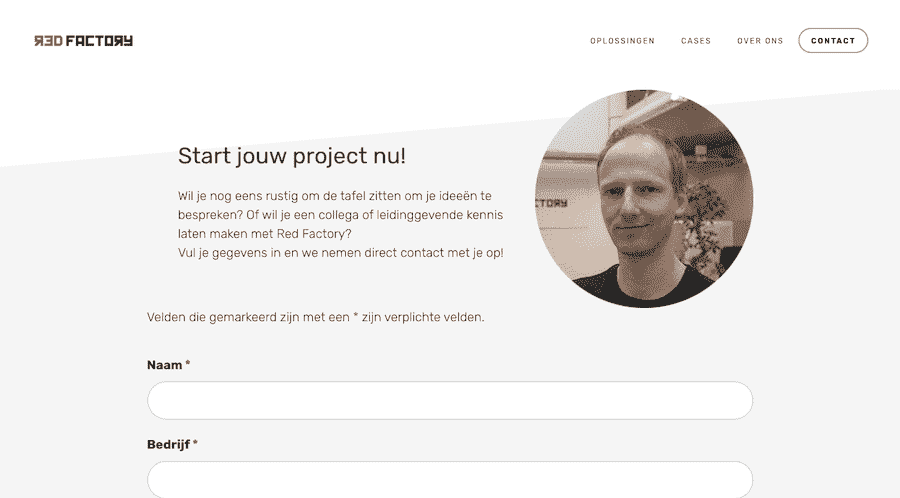

Red Factory has a contact form and Google Maps on Contact page.

这家代理公司除了一张联系表和一张带有地址的谷歌地图外，什么都没有。

你总是有可能把自己和你的团队拉得太细，所以只选择最有意义的联系渠道。

#### 自动化转换过程

即使你会有更多的人为你处理销售，让你的网站做一些更平凡的任务。

例如，如果你提供定制开发服务，但想让潜在客户先打电话进行探索，那么[使用 WordPress 预约插件](https://kinsta.com/blog/wordpress-booking-plugins/)，让他们自己预约。

当你开始销售重复性服务时，你的潜在客户可能会有足够的信心来注册这些服务，而无需先与他人交谈。

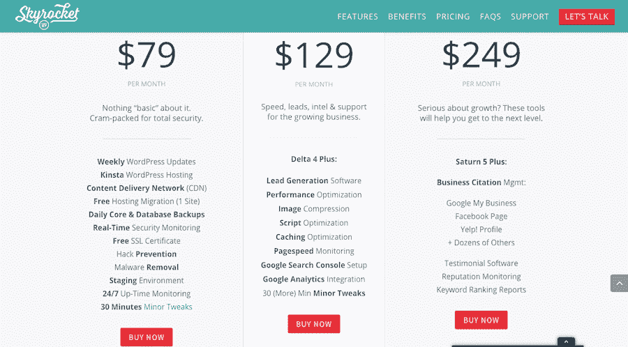

SkyrocketWP simplifies the signup for maintenance services.

在这种情况下，你可以像 [SkyrocketWP](https://skyrocketwp.com/) 一样，在你的网站上安装“立即购买”按钮和自己结账，从而省去中间人(即销售电话)(你可以[在这里](https://kinsta.com/clients/skyrocketwp/)阅读他们的案例研究)。

### 第六步:解决法律问题

在你确定了品牌之后，在客户入职之前，先把法律问题解决掉。

我意识到这是建立一个 WordPress 代理最不有趣的部分，但却是最重要的。你永远不知道什么时候会出现法律问题，也不知道它会从哪里来，所以最好现在就把所有的东西都准备好，这样你就有所准备了。

以下是一些要尽快做的事情:

*   注册你的公司。
*   商标你的标志。
*   [买你的域名](https://kinsta.com/blog/how-much-does-a-domain-name-cost/)。
*   在当地申请营业执照。
*   获得您需要的任何商业保险(如责任保险、财产保险、工伤赔偿保险)。
*   在您的网站上添加隐私声明、条款和条件以及 cookie 声明。

开始考虑去哪里寻求税务管理、人力资源和法律援助也是一个好主意。

您的企业现在可能不需要这种帮助*，但是一旦您开始行动，事情就会进展得很快，并且您不想忽视这些旨在保护您和您的企业的关键支持系统。*

 *### 第七步:充实你的团队

要经营一家成功的 WordPress 代理公司，你必须做的第一件事就是停止戴任何帽子，或者，真的，任何不合适的帽子。所以，首先要做的是:

#### 最小化你的角色

写下你做的每一项任务。它需要什么。你为什么这么做？如何融入大局。

把所有你喜欢做的事情和你比别人做得更好的事情放在“坚持”一栏。

把所有你不喜欢做的或者占用你太多时间的任务放入“委托”栏。

然后，画出你要将委派任务转移给谁。例如:

*   **客户入职邮件**发给项目经理。
*   **发票生成及跟进**去办公室助理。
*   **社交媒体发布**给营销人员。

当你遇到一个没有完美匹配的任务时，那就是你知道有一个新的角色要扮演的时候。这可能不会马上发生，但是当这些相关的责任开始增加，让你和你的团队感到压力时，你就会知道是时候了。

#### 加强核心团队

如果你看看你提供的服务或产品列表，你会清楚哪些角色是核心。通常，这些人是你的[网页设计师](https://kinsta.com/blog/web-design-best-practices/)、网页开发人员、文案和项目经理。

如果你还没有的话，确保你有雇员和承包商来满足你的需求。

此外，确保你有预算支付给你的团队成员有竞争力的工资。如果你在努力做到这一点，那么一定是出了问题。要么是你的服务价格不够高，要么是你试图快速提升你的团队。在继续前进之前，后退一步，找出脱节的地方。

#### 额外服务人员

一旦您的机构变得超级精简，并且有能力和预算做更多的事情，开始为新的服务和机会添加角色，例如:

*   搜索引擎优化
*   鼓舞者
*   UX 作家
*   客户成功经理
*   首席技术官、CMO 等团队领导。

如果你看看任何一个领先的 WordPress 机构团队页面，比如这个来自 [WebDevStudios](https://webdevstudios.com/) 的页面，你会发现部门主管的招聘变得尤为重要:

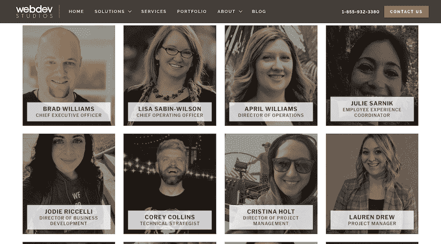

WebDevStudios senior team roles

只是不要为了添加角色而添加角色。如果对它有需求*和*数字证明它对你的底线有好处，只有这样你才应该招聘更多的人。

需要一流的，快速的，安全的主机为您的新机构网站？Kinsta 提供超快的服务器和真正的专家提供的 24/7 世界一流的支持。[查看我们的计划](https://kinsta.com/plans/?in-article-cta)

### 步骤 8:创建你的工具箱

这可能看起来违反直觉，但是如果你想赚更多的钱，你需要花钱买一个更好的工具箱。

所以，你需要做的是:

#### 评估您当前的工具箱

如果你目前正在使用任何商业工具或软件，写下你使用的所有东西以及它们的用途。

接下来，看看这些工具的功能，诚实地回答以下问题:

> *“这个工具能随着您的业务一起扩展吗？”*

如果没有，将其标记为删除。

您需要能够让您和您的团队比以往更快、更高效地前进的工具。这是你能够大规模提供服务并成倍增加收入的唯一途径。

#### 填补空白

看看你的清单，看看你是否遗漏了什么。也许这是一个你一直在拖延购买的工具，或者是你认为自己还没有准备好的东西。

例如:

*   股票照片网站会员资格
*   设计人员-开发人员交接工具
*   [高级 WordPress 插件](https://kinsta.com/best-wordpress-plugins/)或[高级主题](https://kinsta.com/best-wordpress-themes/)
*   搜索引擎优化审计软件
*   时间跟踪软件
*   销售漏斗工具

不要只看你需要什么*。考虑你的团队的需求。怎样才能让他们发挥出最佳水平，进而为您的客户提供更好的服务？*

一旦你有了需要添加、升级或删除的所有工具的列表，就开始工作吧。一旦你的公司开始运转，这不是你想担心的事情，也不是你想把你的团队移交给他们的事情。

### 步骤 9:开发并记录您的过程

你的机构需要很多结构。这是有益的，原因有很多。

首先，一个良好开发和记录的过程更容易为客户产生一致的结果。其次，它使新员工很容易立即投入工作。

**再说一遍，这完全是为了提高公司的速度、敏捷性和准确性。已建立的系统会成功的。**

看看[铁对铁机构网站](https://irontoiron.com/):

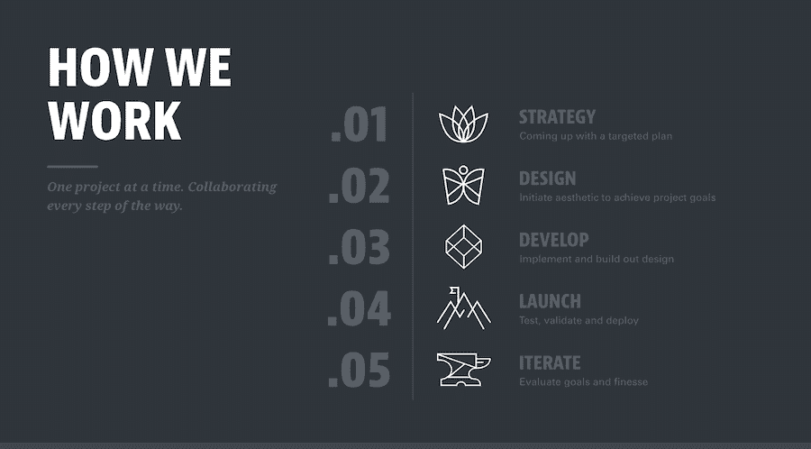

Iron to Iron sums up its web development process.

团队使用什么过程为客户建立网站没有秘密，这只是人们从外部看到的。

在内部，该机构可能有详细说明流程每一步的文档。此外，过程可能由一系列软件自动化、清单和模板来补充。

这正是你需要做的。

#### 组织流程

就像您使用工具箱一样，创建一个您当前在业务中使用的流程列表。

有没有过时或者效率低下的？在你做任何事情之前更新它们。

然后，退一步想想你还应该有什么过程。

如果您要添加新的服务(甚至是定期订阅或产品)，请将相关流程添加到您的主列表中。

那么[跟踪和跟进线索](https://kinsta.com/blog/b2b-lead-generation/#creative-cold-emails)呢？给客户开发票？将项目从一个团队成员转移到另一个团队成员？

现在有很多不同的事情要考虑。这就是为什么**把自己从亲手操作的网站开发工作中抽离出来是如此重要，这样你就可以监督大局项目**帮助你的机构像一台运转良好的机器一样运转。

为每个流程创建一个单独的文档，并将其存储在一个安全集中的位置。它可以是类似团队 Dropbox、Google Drive 或项目管理平台的东西。

#### 客户管理流程

不要忘记潜在客户、入职和客户管理流程。

当你接受更多的客户时，如果你没有适当的系统，就很难对其进行监控。

有没有 [CRM](https://kinsta.com/blog/wordpress-crm/) ？一个对客户友好的项目管理和交流工具怎么样？对于[创建一个定制的 WordPress 仪表盘](https://kinsta.com/blog/wordpress-custom-dashboard/)来缓解网站客户端进入 CMS 的过程呢？

为提案、合同和入职步骤建立预建模板也很重要，这样您就可以让潜在客户尽快脱离销售渠道，进入您的活动项目队列。

#### 员工管理流程

员工招聘、测试和入职也是如此。

在你创业的早期，你可能会向你认识的人寻求推荐，或者在网上发布招聘信息，只是为了得到一些安慰。但是，当涉及到您的机构时，您必须考虑的不仅仅是:

> *“这个人的技能是否符合我的要求？”*

现在，你必须考虑如何找到人:

*   来填补你公司的特殊职位。
*   谁希望与您的机构长期发展。
*   谁适合你的公司文化。

真的没有妥协的余地，因为一个薄弱环节可能会毁掉整个事情。

构建你的面试和招聘流程，找到合适的人。然后，一旦他们加入你的团队，你将需要一些流程来帮助他们在你的机构中茁壮成长。

另一件要考虑的事情是将你的员工循环到过程开发和文档中。

一旦你有了一些坚如磐石的员工，授权他们掌控他们的流程和文档。如果你能让他们更多地参与到塑造你的机构中来，从长远来看，他们会更致力于你的使命。

### 步骤 10:建立内部报告

随着你公司的规模、客户名单和团队的增长，保持对所有事情的跟踪将会变得很困难。但是您需要访问这些数据，以便为您的机构做出更明智的商业决策。

虽然您应该留出专门的时间来检查您的数据，但是您可以自动执行生成报告的实际工作。以下是您可以这样做的一些地方:

*   **Google Analytics** (或[的一个替代品](https://kinsta.com/blog/google-analytics-alternatives/))追踪网站流量、推荐来源、跳出率、转化率和其他关键绩效指标。这里有一个关于[如何将谷歌分析添加到你的 WordPress 网站](https://kinsta.com/blog/google-analytics-wordpress/)的便捷指南。
*   **您的 CRM** 密切关注进入您销售渠道的潜在客户、转换率、客户终身价值和预期收入。
*   **您的项目或任务管理软件**检查项目状态、瓶颈、低效工作流程等。这里有一个比较两个最著名的工具的完整指南:[特雷罗 vs 阿萨纳](https://kinsta.com/blog/trello-vs-asana/)或者几个[其他选择](https://kinsta.com/blog/trello-alternative/)。
*   **你的沟通软件**要快速有效地与同事沟通，无论是 [Slack](https://kinsta.com/blog/how-to-use-slack) 还是微软团队都是很好的选择。阅读我们对他们的比较:[懈怠 vs 团队](https://kinsta.com/blog/microsoft-teams-vs-slack/)。
*   你的时间追踪器监控团队的表现，观察范围蔓延，等等。
*   **Bug 和问题跟踪日志**跟踪未解决的错误、重复出现的问题、错过的客户服务机会等。
*   **在线评论和客户反馈报告**确定团队的成功之处并寻找需要改进的地方。

通过自动化这些报告，您可以花更多的时间采取行动——无论是召集您的团队庆祝一次重大胜利，与团队经理合作修复一个有漏洞的流程，还是决定删除一项不受欢迎的服务。

## 你如何衡量一个 WordPress 代理？

要开一家 WordPress 代理公司，你有很多事情要做。但是一旦你有了运转良好的机器，是时候真正加速了。

看看金斯塔就知道了。2013 年从一家网络开发机构转向托管 WordPress 需要很大的勇气。

但现在他们做到了:在保持客户逐渐了解和喜爱的高质量产品的同时，继续让他们的公司增长超过七位数。

这并不完全是运气使然。你自己的 WordPress 业务也是如此。

当你准备好了，这里有一些开始扩展的方法:

### 创造经常性收入流

许多 WordPress 代理公司通过销售网络开发服务找到了立足之地。唯一的问题是这是一次性的服务。这可能会使预测收入变得困难，还可能导致在不断招募新客户上浪费大量精力。

然而，有了[经常性收入流](https://kinsta.com/blog/recurring-revenue-model/)，你可以为你的现金流带来更大的稳定性和规模。

以下是 WordPress 代理公司为他们的业务增加经常性收入的一些常用方法:

*   [网站维护服务](https://kinsta.com/blog/wordpress-maintenance/)
*   [托管 WordPress 主机](https://kinsta.com/plans/)
*   [联盟营销](https://kinsta.com/affiliates/)
*   高级信息产品，如[课程](https://kinsta.com/blog/website-ideas/#sidehustle-1)，网络研讨会等。
*   WordPress 主题或插件开发

其中一些的美妙之处在于，如果你不想管理流程，你就不需要去管理(比如你[外包维护服务](https://kinsta.com/blog/wordpress-maintenance/#paying-for-premium-wordpress-support)并向你的客户收取加价)。

至于其他的，你将会收获建造一些一劳永逸的东西的好处。虽然您仍然需要支持您的产品并保持它们的更新，但是大部分工作都是在前期进行的。

### 成为内容生成机器

中介机构不应该在外面招揽客户。在游戏的这个阶段，客户应该会吵着要和你合作。

实现这一目标的最佳方式是什么？用高质量、可操作的、[常青内容](https://kinsta.com/blog/evergreen-content/)提升你的在线知名度和权威性。

*   每周至少发布两三天博客文章。
*   每天在社交媒体上发帖:少关注自己(约 20%)，多分享他人的有用建议和见解(约 80%)。
*   在你的读者和同行所在的知名网站上发表客座博文。
*   在相关节目上登陆播客(以下是如何使用 WordPress 开始播客的[)。](https://kinsta.com/blog/wordpress-podcast/)
*   创造[值得下载的潜在客户](https://kinsta.com/wordpress-newsletter/),激励你的网站访问者采取行动。
*   构建一个包含[长格式内容](https://kinsta.com/blog/long-form-articles/)的存储库，内容可以是书面的，也可以是视频的(直播或预录)。

让你的内容产生影响，你会发现你永远不必去寻找客户(或商业伙伴！)又来了。

### 搭档

在[脸书群体](https://kinsta.com/blog/facebook-marketing/)、[在线论坛](https://kinsta.com/blog/wordpress-support/#forums-groups-and-channels)、[WordPress](https://kinsta.com/blog/2019-year-in-review/#connecting-with-the-wordpress-community)、 [Slack 社区](https://kinsta.com/blog/how-to-use-slack/)和网页设计会议之间，当你已经围绕 WordPress 建立了业务，没有理由孤立自己。

有如此多的机会与空间中的其他人联系和合作！所以，不要害怕走出去。

你可能会找个人一起举办一场网络研讨会或课程。你可能会遇到你最喜欢的开发者，并决定与他们合作。或者，你可能会遇到另一个机构所有者，他希望分享推荐，因为你们的利基没有重叠。

你永远不知道你会遇到谁，你会如何帮助别人，或者你会从花更多的时间在 WordPress 社区学到什么。

[Thinking about launching a WordPress agency? There's lots of work to do before entering this entrepreneurial journey. Here's an in-depth guide to getting you started!🕴💰Click to Tweet](https://twitter.com/intent/tweet?url=https%3A%2F%2Fkinsta.com%2Fblog%2Fwordpress-agency%2F&via=kinsta&text=Thinking+about+launching+a+WordPress+agency%3F+There%27s+lots+of+work+to+do+before+entering+this+entrepreneurial+journey.+Here%27s+an+in-depth+guide+to+getting+you+started%21%F0%9F%95%B4%F0%9F%92%B0&hashtags=entrepreneurship%2Cbusiness)

## 摘要

随着 WordPress 继续保持其在网站建设领域的大部分市场份额，现在是开始 WordPress 代理的绝佳时机。

然而，重要的是要记住，一个自由职业的 WordPress 公司和一个提供全套服务和重复产品的代理公司有很大的不同。

你不能按下开关，然后突然向全世界宣布你现在在经营一个机构。在你开始收获代理所有权的回报之前，还有很多工作要做。

您需要:

*   明确你的使命这样你就能成功地为自己开拓出一片空间。
*   **选择您的客户需要并将从中受益的服务**。
*   设定公平但有竞争力的价格这将使你获得利润并促进你的代理公司的发展。
*   **选择一个能给你的公司留下强烈而独特印象的名字**。
*   建立一个网站，为你做一些销售和营销工作。
*   处理经营代理机构的法律问题。
*   建立一个团队来支持你现在和将来的使命。
*   **创建一个工具箱**，让你比以往更快更好地工作。
*   **开发流程**，这些流程[使你能够扩展](https://kinsta.com/blog/2020-year-in-review/)。
*   **自动生成报告**以便您始终了解贵机构的关键绩效指标。

如果你被所有这些压垮了，那么开始一个 WordPress 代理可能不适合你(这很好)。

有些客户会被代理公司吸引，但剩下的人呢？永远都需要有自由职业者和精品企业来提供那些客户想要的更具成本效益和更个性化的服务。

也就是说，当你准备成长的时候，把这个指南放在手边。即使你的目标不是建立一个全面的代理机构，这里也有很多促进业务发展的策略，你可以用来发展一个较小的 WordPress 业务。

你考虑过推出一个 WordPress 代理吗？如果没有，是什么阻碍了你？如果你成功地建造了一个，什么比你预期的更难？在评论里告诉我们吧！

* * *

让你所有的[应用程序](https://kinsta.com/application-hosting/)、[数据库](https://kinsta.com/database-hosting/)和 [WordPress 网站](https://kinsta.com/wordpress-hosting/)在线并在一个屋檐下。我们功能丰富的高性能云平台包括:

*   在 MyKinsta 仪表盘中轻松设置和管理
*   24/7 专家支持
*   最好的谷歌云平台硬件和网络，由 Kubernetes 提供最大的可扩展性
*   面向速度和安全性的企业级 Cloudflare 集成
*   全球受众覆盖全球多达 35 个数据中心和 275 多个 pop

在第一个月使用托管的[应用程序或托管](https://kinsta.com/application-hosting/)的[数据库，您可以享受 20 美元的优惠，亲自测试一下。探索我们的](https://kinsta.com/database-hosting/)[计划](https://kinsta.com/plans/)或[与销售人员交谈](https://kinsta.com/contact-us/)以找到最适合您的方式。*