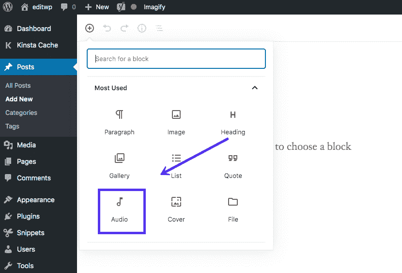
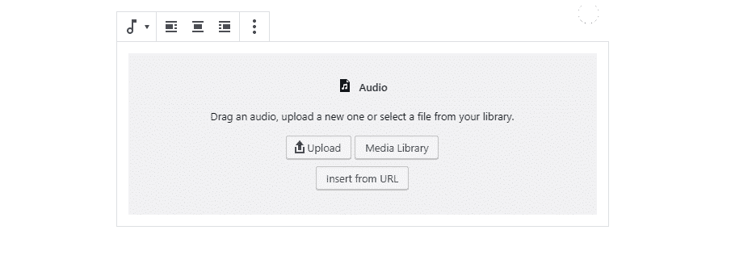
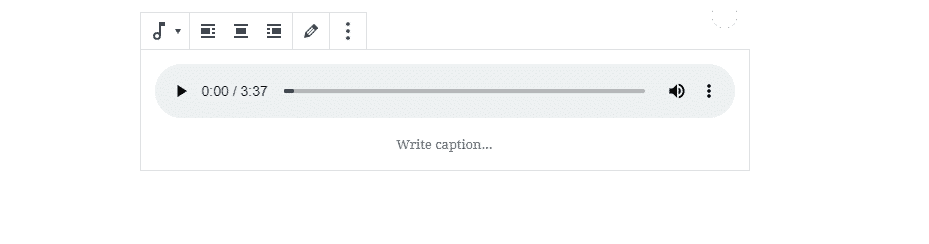
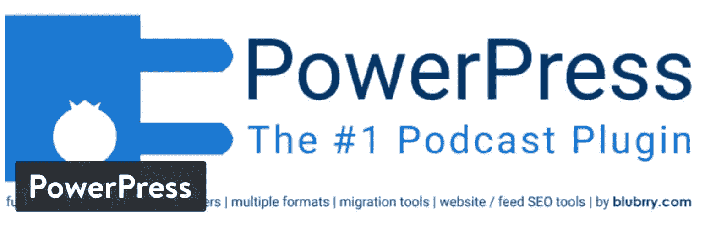
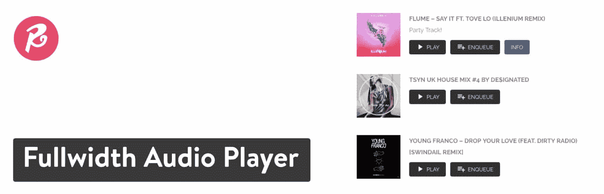
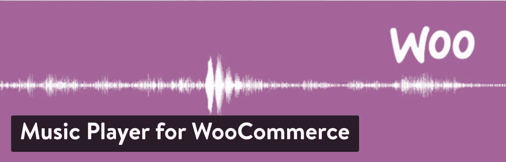
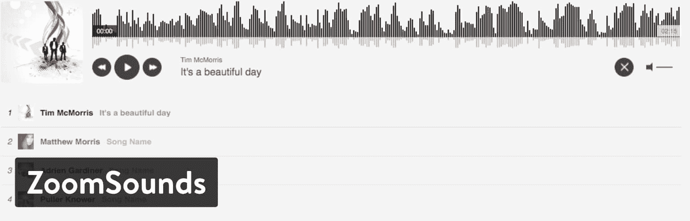
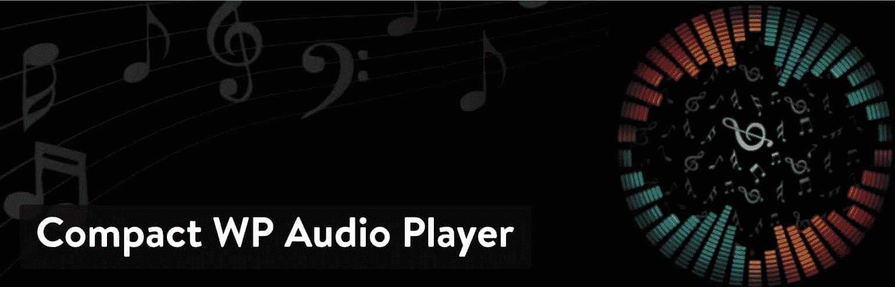
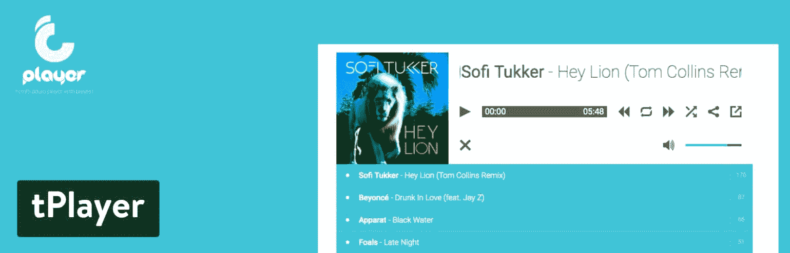
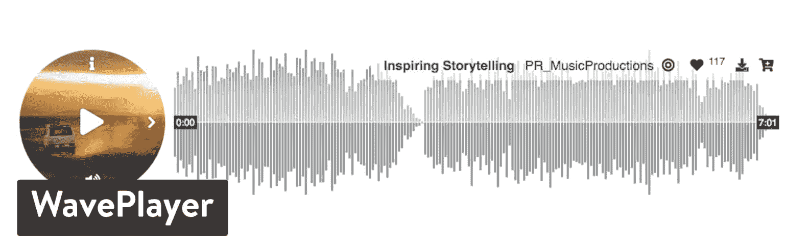

# 10 个最好的 WordPress 音频播放器来专业地分享音频剪辑(并接触到更多的听众)

> 原文：<https://kinsta.com/blog/wordpress-audio-players/>

音乐家需要把他们的音乐传播出去，就像播客应该每周发布剧集一样。有声读物的作者和广播节目主持人也是如此。所有这些职业都需要一个音频播放器来快速上传和发布剪辑到他们的网站。最简单的方法之一就是找到一些最好的 WordPress 音频播放器，并在你的网站上安装一个。

我们最喜欢的一些播放器只为播客提供工具，而其他的则非常适合乐队或作者。不管怎样，我们会介绍你需要的所有功能，以及哪个 WordPress 音频播放器最适合你。但在此之前…

## 最好的 WordPress 音频播放器的特性

并非所有的 WordPress 音频播放器都是一样的。其中一些是为乐队分享他们的音乐收藏，而另一些则主要是为播客提供的(建议阅读:如何使用 WordPress 开始播客)。

但是，无论您使用音频播放器的目的是什么，您都应该寻找一些功能:

*   一个快速上传工具，用于在几秒钟内发布您的音频剪辑。
*   一个播放列表，用于将音频剪辑组织到一个列表中，并可能将它们归类到剧集中
*   支持无限播放列表和曲目。
*   移动友好型设计，用户可以在手机和平板电脑上收听音频。
*   当用户登陆你的网站时的自动播放功能。
*   用于改变播放器颜色和调整大小的定制工具。
*   在网站上放置音频播放器的多种选择，包括短代码和小部件。
*   嵌入来自 YouTube 等其他媒体来源的支持。
*   与谷歌和苹果音频服务的集成。例如，在苹果商店为你的播客提供订阅按钮会很棒。
*   统计数据来查看仅基于您的音频的信息，而不是查看与您的整个网站相结合的所有内容。
*   从其他来源获取音频的选项。例如，你可以让你的播客直接来自苹果商店。

## 最佳 WordPress 音频播放器

在我们深入研究顶级玩家之前，知道 WordPress 已经有了默认的音频上传和发布解决方案是很重要的。这没什么特别的，但是有可能这就是你在你的网站上所需要的。

它是这样工作的:

转到你想在 WordPress 中使用或创建的任何页面或帖子。你也可以选择复制和粘贴一个文件的网址，但是古腾堡块编辑器有一个更简单的方法，几乎可以立即在线发布你的音频剪辑。

点击添加块的按钮，然后选择音频选项。

How to add an audio block in the Block Editor

上传您的音频剪辑或从您的媒体库中提取一个。就是这样！

How to upload an audio clip in WordPress

正如你所看到的，WordPress 默认的音频播放器并没有什么太高级的。它只是简单地列出和组织多首歌曲。您可以调整 CSS，但是不提供其他定制工具。

WordPress default audio player

现在，让我们来看看最好的音频插件！

*   [Blubrry 的 Podcasting 插件](#powerpress)
*   [音频点火器](#audioigniter)
*   [非常简单的播客](#sss)
*   [智能播客播放器](#smart-podcast)
*   [全幅音频播放器](#fullwidth)
*   【WooCommerce 音乐播放器
*   [ZoomSounds](#zoomSounds)
*   [紧凑型 WP 音频播放器](#compact)
*   [t 播放器](#tplayer)
*   [WavePlayer](#waveplayer)

### 1.Blubrry 的 Podcasting 插件

WordPress 的默认音频播放器非常漂亮，尤其是如果你是一个经常发布视频的博客作者。我们也喜欢那些偶尔会在课程网站上放一段视频的老师。

但是，如果你想变得更专业，或者只是一般的爱好者呢？这就是一些 WordPress 音频插件发挥作用的地方。PowerPress 是我们的最爱之一，因为它有几个专门针对广播公司、播客和任何音频人物的功能。你甚至可以用它来组织你的乐队播放列表或学校的音轨列表。

PowerPress Podcasting plugin by Blubrry

提供了所有的播客集成，如谷歌播客和苹果播客。您可以在简单模式和高级模式之间进行选择，以便快速发布您的 podcasts 或更好地控制设计。您还可以从不同来源导入音频，并要求您的客户订阅您的频道或播客。

#### 定价

Blubrry 是世界上最大的播客数据库之一，所以它免费提供这个插件。每月 5 美元即可获得高级统计数据。你也可以通过 Blubrry 获得托管服务，每月 12 美元。

#### 使 PowerPress 播客成为最佳选择的功能

*   它是完全免费的，并且集成了一个庞大的播客数据库。这意味着你也可以把你的播客放在网站上曝光。
*   快速将 Apple 和 Google podcast 提要添加到您的网站。
*   你可以把音频和视频都放到你的网站上。
*   把你的订阅按钮放在你网站的任何地方。
*   该插件集成了一些最流行的播客工具，如 SoundCloud、Squarespace 和 LibSyn。
*   该插件有一个自动迁移系统，用于将旧的播客内容转移到您的新网站。
*   您可以选择统计和托管，使整个网站创建过程更容易。
*   它向您的听众展示播客作品。
*   您可以在一个站点上有多个播客，并将它们整理成类别。

#### 谁应该考虑这个插件？

PowerPress 是播客的天赐之物。你不用花一毛钱，而且功能非常棒。所以，它主要是针对播客的，但基本的音频和播放列表功能对任何类型的音乐或音频剪辑都适用。

### 2.音频点火器

[AudioIgniter](https://wordpress.org/plugins/audioigniter/) 插件是让音频片段在你的网站上播放的简单解决方案之一。它要求你上传你的音频。然后，你可以将剪辑组织成播放列表，同时将这些收藏放在帖子和页面上。流式传输也是可能的，所以那些有无线电广播的人可以用 AudioIgniter 来完成。

AudioIgniter plugin

AudioIgniter 拥有一个干净、现代的界面，适合那些对花里胡哨不太感兴趣、更注重在网站上获取大量音频内容的人。播放列表很漂亮，你可以定制风格，添加曲目在后台几秒钟内就可以完成。更不用说插件支持无限数量的曲目和播放列表。

#### 定价

大多数功能都是免费版本，但专业版的起价约为每年 34 美元，并有一些有趣的功能，如批量上传和短码。

#### 使 AudioIgniter 成为最佳选择的特性

*   这个插件可以让你发布无限数量的播放列表和歌曲。
*   你可以在后台几秒钟内上传几十首歌曲或音频片段。
*   借助短码嵌入您的播放列表。
*   你可以添加一个按钮，让人们购买这首歌。
*   该插件有几个定制工具，用于尺寸、曲目编号、列表等。
*   播放列表模块负责在较小的设备上播放。
*   您拥有批量上传的高级选项、可视化编辑器、小部件支持和总体颜色定制。

#### 谁应该考虑这个插件？

如果你渴望简单和[高上传速度](https://kinsta.com/learn/speed-up-wordpress/)，AudioIgniter 是适合你的音频插件。它有一个时尚的界面和大量的快速选项，让您的曲目在线没有任何问题。如果你不想为无限制的列表支付任何费用，这也很好。

### 3.非常简单的播客

非常简单的播客插件对于那些对在线发布播客感兴趣的人来说是另一个很好的选择。当然，发布到苹果和谷歌播客平台是一个好主意，但你也想有自己的存在。这可以让你向你自己的观众营销，并确保人们回到你的网站。

Seriously Simple Podcasting plugin

非常简单的播客有很好的评论，而且理由很充分。首先，这是一个更容易使用的分享你的播客的解决方案，并在这个过程中使你的网站看起来干净。该插件有一个集成的播客托管平台，名为 Castos。这意味着你可以在 Castos 上托管你的剧集，而无需离开你的 WordPress 仪表盘。

此外，您可以从同一个站点运行多个播客，并轻松整理您的播客播放列表。音频和视频播客都是允许的，你还会收到一些短代码和小工具，以确保你所有的页面都有音频剪辑。

#### 定价

核心插件可以免费使用。附加组件也是免费的。

#### 使非常简单的播客成为最佳选择的特性

*   插件的每个方面都是免费的。这包括一个收集你的听众统计数据的插件。
*   该插件提供了一个简单的界面，适用于初学者和高级播客。
*   您可以在自己的平台上托管您的播客，也可以利用集成的 Castos 系统。
*   媒体播放器很漂亮，它显示你的播客作品以及所有剧集的列表。
*   从多个来源获取 RSS 提要，并在一个网站上显示几个播客。
*   该插件支持音频和视频媒体类型。
*   [使用小工具](https://kinsta.com/blog/wordpress-widgets/)和短代码在网站的任何地方插入你的播放列表，或单首歌曲。
*   还有很多其他免费的附加组件，比如抄本、播客扬声器和完整的 Genesis 框架支持。

#### 谁应该考虑这个插件？

如果播客们对一个完全免费的解决方案感兴趣，他们应该看看这个插件。如果你想要简单，这也是一个很好的选择。最后，并不是所有的播客插件都有统计数据。

### 4.智能播客播放器

另一个很棒的播客音频播放器叫做[智能播客播放器。](https://smartpodcastplayer.com)它是市场上最具互动性、最丰富多彩、最吸引人的媒体播放器之一，对于严肃的播客来说，它有一些令人敬畏的功能。这是一个漂亮的音频插件，但它并不简单。媒体模块包括从搜索栏到电子邮件列表按钮的所有内容。你可以看到跳过按钮和标签，以及播放列表和插图。

Smart Podcast Player plugin

世界上一些最大的播客使用智能播客播放器，如智能被动收入，创业故事和生动的节目。这个插件实际上是由 Smart Passive Income 的 Pat Flynn 创建的。他收集了许多他最需要的播客，并为专业播客制作了终极音频插件。其中一些功能包括可定制的皮肤、可下载的剧集、自定义排序工具和时间戳。

#### 定价

这个插件没有免费版本。您可以按年支付每月 8.09 美元，或按月支付每月 12 美元。

#### 使智能播客播放器成为最佳选择的功能

*   它是由真正的专业播客建立的，他们想要比市场上已经存在的更好的东西。
*   该插件有一个电子邮件捕获区，所以你可以发送时事通讯，让人们回到你自己的网站。
*   社交分享按钮是用来传播信息的。
*   速度控制和跳跃按钮帮助你的听众。
*   您收到全彩色定制。
*   您可以显示下载按钮。
*   该插件为您所有的播客作品提供图像定制。
*   它可以让你上传和显示无限数量的剧集和播放列表。
*   当您联系客户支持时，您实际上可以与真人交谈。
*   你可以决定游戏模块的位置。例如，你可能希望在网站的底部有一个工具栏。

#### 谁应该考虑这个插件？

专业的播客绝对应该考虑这个插件。我们也喜欢那些打算扩大听众的严肃播客。这是一个让你的播客在网上看起来专业的好方法，你也可以收集电子邮件地址。如果你有预算支付月租费，考虑智能播客播放器。

### 5.全幅音频播放器

我们已经讨论了相当多的播客音频播放器，所以让我们回到一般用途的常规音频插件。全幅音频播放器是我们最喜欢的，因为它的设计和整体效率。你可以快速上传 MP3 或连接到你的 SoundCloud 账户。这是一个很好的音频插件，适用于乐队、广播节目、播客以及任何有音频剪辑的人。您可以生成自己的音乐页面，并提供一个弹出窗口，在最小化时继续播放。

Fullwidth Audio Player plugin

您的听众可以使用键盘快捷键浏览您的目录。管理员可以从后端添加播放列表和无限曲目，同时还可以调整播放列表的颜色和大小。就设置而言，后端相当简单。它提供了一个很好的地方让你定制你的播放器，甚至创建短码放在你的网站上。

## 注册订阅时事通讯

### 想知道我们是怎么让流量增长超过 1000%的吗？

加入 20，000 多名获得我们每周时事通讯和内部消息的人的行列吧！

[Subscribe Now](#newsletter)

#### 定价

这个插件没有免费版本。也就是说，26 美元的价格相当实惠。如果需要，您可以升级以获得更多支持。

#### 使全宽音频播放器成为最佳选择的功能

*   对于一个高级音频播放器来说，这个价格是很特别的。
*   您的客户可以使用快捷方式进行导航。
*   所有用户都可以在脸书和 Twitter 等社交媒体账户上分享你的音乐。
*   当您的用户浏览网站时，弹出播放器会关闭并继续播放。
*   你可以在短码的帮助下创建一个完整的音乐页面。
*   有一个粘性条留在一个地方，比如页面的底部。
*   速度控制允许人们加快您的播客或跳回。
*   将任何 RSS 提要附加到插件。
*   播放器有一个自定义排序工具，用于显示最少或最近的剧集。
*   它适用于所有移动设备。
*   该插件显示时间戳，这样你和你的听众就可以跳到剧集中的特定位置。

#### 谁应该考虑这个插件？

全宽音频播放器插件对于严肃的播客和音乐人来说是一个负担得起的选择。对于那些想在自己的网站上获得一些音频剪辑的教师和博客作者来说，这也是一个更便宜的选择。

### 6.WooCommerce 的音乐播放器

【WooCommerce 的音乐播放器有一个主要功能——在你的电子商务商店上发布[音频文件。然后，您可以选择免费赠送媒体或收费。这与 WooCommerce 无缝集成，因此你可以预览歌曲剪辑，然后包括一个添加到购物车按钮，以促进销售。](https://kinsta.com/blog/wordpress-ecommerce-plugins/)

Music Player for WooCommerce plugin

该插件还帮助创建多首歌曲或音频剪辑的播放列表和图库。总的来说，这是乐队销售数字音乐的好方法。如果你出售有声读物或视频的声音剪辑，你也可以考虑这样做。插件附带了短代码，但是你的大部分产品列表都是在后台管理的，就像其他 WooCommerce 产品一样。

#### 定价

基础版免费。你也可以花 30 欧元升级，但是你只能得到音频文件保护和定义演示文件大小的功能。

#### 使 WooCommerce 音乐播放器成为最佳选择的功能

*   这是在你的网站上发布和销售歌曲的最快方式之一。
*   你不必担心混淆集成，因为它与 WooCommerce 和所有著名的 WordPress 主题结合得很好。
*   该插件具有将你的音频剪辑组织成图库的功能。
*   歌曲演示可以显示在产品页面上。实际上，您可以包含任意多的歌曲文件。
*   插件附带了三个玩家设计。它们看起来都很现代。
*   您可以使用额外的安全措施来保护您的音频文件。
*   利用小工具在边栏中出售你的音频文件。
*   插件附带了几个短代码，用于突出显示和组织某些产品。
*   您会收到一些皮肤，这样您就可以自定义播放器的颜色和其他视觉元素。

#### 谁应该考虑这个插件？

如果你在网上出售你的音频剪辑，你只需要这种类型的音频播放器。有些人可能会用它来很好地组织免费曲目，但这样做的主要原因是当在 WooCommerce 网站上销售时。

### 7.动物园的声音

ZoomSounds 插件是 CodeCanyon 上出售的一款高级音频播放器。它有一些稳定的销售和大量的好评。人们如此喜欢它的原因之一是定制选项。您可以进行广泛的调整，以适应您的品牌，并使您的广播电台或播客看起来很棒。视频和音频都支持，数百个主题可以用定制工具创建。

ZoomSounds plugin

事实上，您可以通过单击一个按钮来导入一些皮肤和示例。这是最容易使用的音频播放器之一，因为大部分设计工作已经为您完成。还有很多其他功能，比如社交分享、播放列表和 WooCommerce 网站链接。这是一个完全响应的音频播放器，它直接从 SoundCloud 播放歌曲和其他曲目。开发商有大量的视频来帮助用户了解如何使用它，而且价格也相当实惠。

#### 定价

没有免费版本，但 ZoomSounds 插件只需 20 美元。您可以升级以获得未来的额外支持。

如果你对你的音频文件很认真，你需要一个可靠的主机提供商。Kinsta 是一款考虑到性能和安全性的托管解决方案！[查看我们的计划](https://kinsta.com/plans/?in-article-cta)

#### 使 ZoomSounds 成为最佳选择的特性

*   它带有几个皮肤和演示内容，所以你永远不必从头开始设计你的音频播放器。
*   该插件提供社交媒体按钮和评论，让用户分享你的音乐或剪辑。
*   数以千计的定制设置可用于更改皮肤。
*   音乐播放器在所有设备上都很漂亮，包括平板电脑和机器人。
*   ZoomSounds 集成了 WooCommerce，以防你想开始销售你的一些音频剪辑。
*   用户可以直接在时间线上发表评论。
*   该插件在 Icecast 和 Shoutcast 集成的帮助下支持广播节目。
*   您可以允许部分用户下载。
*   您可以激活一个持续循环，以便所有客户反复听到同一首歌曲。
*   上传你自己的封面艺术，比如播客或专辑封面。
*   该插件仅售 20 美元，这使得它成为市场上最实惠的高级选项之一。
*   开发商以出色的支持著称。您还可以终身获得更新，因此没有理由在一两年内为更新付费。
*   该插件与 ZoomBox(一个商业 lightbox 脚本)集成得很好。

#### 谁应该考虑这个插件？

我们喜欢为那些渴望最好的定制工具的公司、播客或乐队提供 ZoomSounds 插件。你不仅可以从一些很棒的皮肤开始，还可以改变各种颜色、大小，甚至字体。如果你想在 WooCommerce 上销售或促使人们在社交媒体上分享，这也是一个实惠的选择。

### 8.紧凑型 WP 音频播放器

紧凑的 WP 音频播放器插件为你提供了一个轻量级的媒体流，当你不需要在你的网站上占用大量空间的时候。这是一个非常基本的音频播放器，主要用于短码。然后在你的网站上弹出一个播放按钮，除此之外什么也没有。因此，您可以在帖子或页面文本区域中包含任何其他信息。

Compact WP Audio Player plugin

你可以上传 MP3 和 OGG 文件。更不用说，音频播放器是移动响应的，因此您的客户或听众可以在旅途中访问您的音乐。除了基本的播放按钮，没有太多其他功能需要担心。这就是这个插件的荣耀，尤其是对于那些对使用更复杂的音频播放器不感兴趣的人来说。例如，有一个自动播放选项，用户可以试听。除此之外，功能列表很短。

#### 定价

这是一个没有任何追加销售的免费插件。

#### 使紧凑型 WP 音频播放器成为最佳选择的功能

*   这是让音频在你的网站上播放的最基本的插件。它很干净，没有任何不必要的功能，如果你想要的只是一个快速播放按钮的话。
*   这个插件是完全免费的。
*   你可以上传两种类型的文件，OGG 和 MP3。
*   你所有的音频文件都可以嵌入到文章和页面中。
*   这款播放器非常小巧，可以放在网站的任何地方，甚至是较小的边栏或标题中。
*   有一个自动播放设置，这样当你的用户进入页面时就可以听到声音。
*   播放器被放置在您的网站上，使用简单的短代码。
*   音频播放器是移动就绪的，因此当在手机和平板电脑上显示时，它可以迅速就位。
*   当出售你的剪辑时，插件让你有机会在人们承诺购买之前分享音频预览。
*   当用户浏览您的网站时，循环可用。

#### 谁应该考虑这个插件？

如果你想要最低限度的，只使用紧凑的 WP 音频播放器。这是让你的音乐或播客在线的一个可靠、美妙的选择，但它最适合想要一个干净、简约外观的网站。

### 9.tPlayer

这个高级插件在 CodeCanyon 上出售，并拥有一些来自下载者的令人印象深刻的评分。该播放器适用于所有类型的音频，从音乐到有声读物。它生成了一个现代外观的播放列表，用户可以下载、收听、跳转和分享。随意上传一些你的作品，并考虑用众多的颜色设置来改变你的感觉。你还可以调整播放器的大小以及是否自动播放。

tPlayer plugin

tPlayer 插件的伟大之处在于，你可以将音频和广播链接到播放器。在 WordPress 上安装后，音乐或音频剪辑可以被组织在你选择的任何页面或帖子上。更重要的是，任何公共链接都可以在你的网站上播放。它只需自托管或从谷歌驱动这样的来源。

创建一个播放列表也是很直观的，有 10 种配色方案，收音机的广告选项，以及让你的用户看到有多少人听过这首音乐的信息。

#### 定价

该插件售价 25 美元。您可以额外付费升级您的客户支持。

#### 使 tPlayer 成为最佳选择的功能

*   tPlayer 插件将您的网站连接到音频源和广播源。
*   您可以创建包含无限数量曲目的播放列表。
*   所有自我托管的音轨都可以放在你的网站上。这包括像亚马逊 S3 这样的地方托管的音乐。
*   播放列表定制工具非常广泛，有大量的颜色、大小和位置选项。
*   你可以每隔几秒播放一次自己的广告。
*   前端有很多控制选项，如随机播放、重复播放和自动播放。
*   所有曲目详情都会显示在播放列表上。这包括标题、持续时间和封面等内容。
*   用户可以在社交分享按钮的帮助下分享你的曲目。例如，你可以激活脸书、Twitter 和 Tumblr 的按钮。
*   歌曲统计数据可以显示在播放器上，比如浏览量和下载量。
*   该插件兼容 Divi 和 Gutenberg 等[可视化页面构建器。](https://kinsta.com/blog/wordpress-page-builders/)

#### 谁应该考虑这个插件？

对于那些想要一个可靠的、现代的、可定制的音频播放器的人来说，tPlayer 有一些优秀的特性。它融合了音频播放器的一些最重要的部分，但又不显得过于庞大。我们也喜欢它为那些谁想要播放广告之间的轨道和炫耀视频统计数据。

### 10.波形播放器

CodeCanyon 上还列出了 WavePlayer 插件，使它成为另一个高级音频播放器。该播放器有一个很好的外观-类似于 SoundCloud。您可以自定义播放器，以便用户可以做从购物到下载的所有事情，这一切都源于播放器的便利性。

你还可以找到图标，让用户喜欢这些歌曲，并与他人分享。这一切都始于选择你的音频播放器的大小。然后，你可以定制从大小到形状的一切。

WavePlayer plugin

我们还喜欢这个插件有一个类似于 SoundCloud 的波形预览。看起来音乐人和播客应该最有可能使用这个插件。我们之所以这么说，是因为你可以与 WooCommerce 整合销售曲目，并制作一个令人惊叹的播放列表，便于人们理解和使用。

#### 定价

WavePlayer 的标价是 26 美元。您也可以花很少的费用升级您的客户支持。

#### 使 WavePlayer 成为最佳选择的功能

*   WavePlayer 为你的播放器提供了一个漂亮的、反应灵敏的界面，可以很容易地吸引你网站上的注意力。
*   自我托管你的曲目是可能的。你所要做的就是将链接复制并粘贴到音轨上。
*   对[古腾堡](https://kinsta.com/blog/gutenberg-wordpress-editor/)和[元素或](https://kinsta.com/blog/wordpress-page-builders/#elementor)的原生支持。
*   可以将插件与 [WooCommerce](https://kinsta.com/blog/woocommerce-tutorial/) 集成。它还具有为您的所有相册生成批量产品的功能。
*   你可以从大约十种不同的播放器布局和大小中进行选择。其中一些会横跨整个页面，而另一些可以放在边栏中。
*   方便的功能有洗牌，重复，自动播放等。
*   波形可视化具有各种定制设置，如颜色、压缩和波形不对称。
*   有一个添加自定义 CSS 的模块。
*   播放器上可以放置几个按钮，比如下载、购买、播放和喜欢。

#### 谁应该考虑这个插件？

我们喜欢乐队用 WavePlayer。这是一个看起来很时尚的播放器，在乐队网站上会很棒。你还可以看到流行的呈现音乐的视觉波形。如果你想要几个按钮来购物和下载，这是一个很好的解决方案。

[Need to feature your latest podcast episode, song or audio clips on your site? Get more listeners with the top audio players for WordPress in our curated list!🎙🎧Click to Tweet](https://twitter.com/intent/tweet?url=https%3A%2F%2Fkinsta.com%2Fblog%2Fwordpress-audio-players%2F&via=kinsta&text=Need+to+feature+your+latest+podcast+episode%2C+song+or+audio+clips+on+your+site%3F+Get+more+listeners+with+the+top+audio+players+for+WordPress+in+our+curated+list%21%F0%9F%8E%99%F0%9F%8E%A7&hashtags=podcasting%2Cwpplugin)

## 这些 WordPress 音频播放器哪一个适合你？

对于一些音频播放器，更容易看出它对你的公司是否有用。例如，他们中的一些更迎合播客。总的来说，尽可能多地测试它们是很重要的，以确保你不需要在未来做出改变。

如果你对哪个 WordPress 音频播放器适合你还有一些疑问，这里有一些最后的建议。

*   我们喜欢这款适合不想花钱买播放器的播客。
*   这是一个很好的插件，让设计保持简单。
*   非常简单的播客–这是一个对最简单的播客设置有意义的插件。
*   智能播客播放器(Smart Podcast Player)——如果你是一个认真的播客用户，愿意按月付费，可以考虑这个插件。
*   全幅音频播放器——这款播放器非常适合任何想要免费发布音乐的人。
*   WooCommerce 的音乐播放器–如果你通过 WooCommerce 销售你的音乐片段，考虑一下这个音频插件。
*   zoom sounds-如果你想要大量的定制，这个很好用。
*   紧凑型 WP 音频播放器–这是一个插件，用于在你的网站上放置一个简单的播放按钮。
*   这个播放器有很多你可以展示给用户的视频数据。
*   wave player–我们喜欢这个音乐人用的插件，因为它的外观很时尚。

就是这样！如果你有其他喜欢的 WordPress 音频播放器，请在评论中告诉我们。

* * *

让你所有的[应用程序](https://kinsta.com/application-hosting/)、[数据库](https://kinsta.com/database-hosting/)和 [WordPress 网站](https://kinsta.com/wordpress-hosting/)在线并在一个屋檐下。我们功能丰富的高性能云平台包括:

*   在 MyKinsta 仪表盘中轻松设置和管理
*   24/7 专家支持
*   最好的谷歌云平台硬件和网络，由 Kubernetes 提供最大的可扩展性
*   面向速度和安全性的企业级 Cloudflare 集成
*   全球受众覆盖全球多达 35 个数据中心和 275 多个 pop

在第一个月使用托管的[应用程序或托管](https://kinsta.com/application-hosting/)的[数据库，您可以享受 20 美元的优惠，亲自测试一下。探索我们的](https://kinsta.com/database-hosting/)[计划](https://kinsta.com/plans/)或[与销售人员交谈](https://kinsta.com/contact-us/)以找到最适合您的方式。