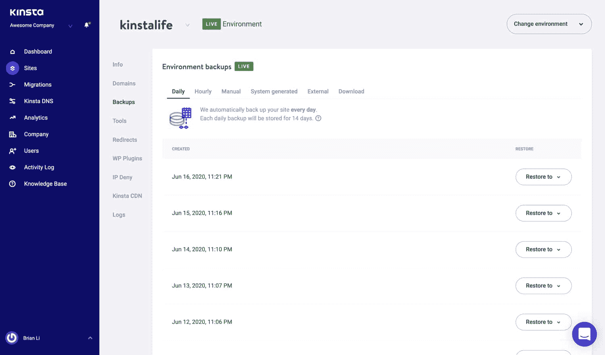
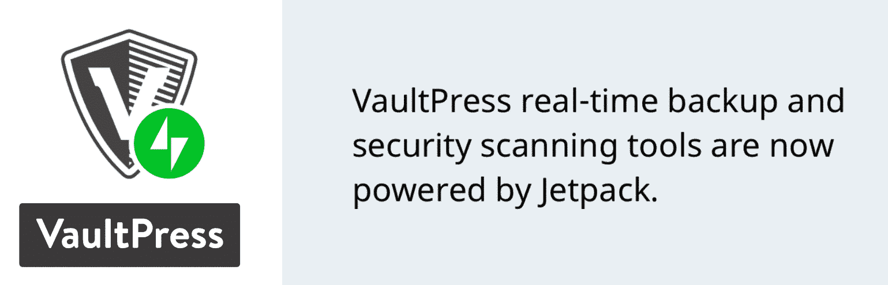
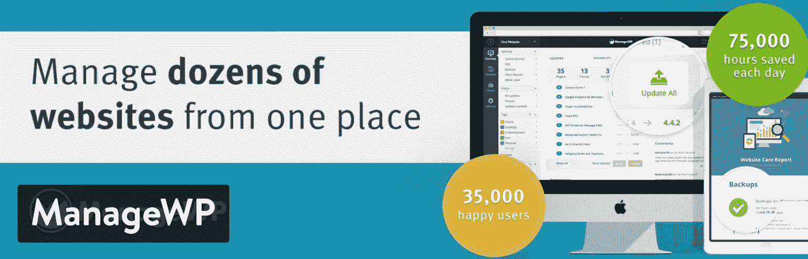
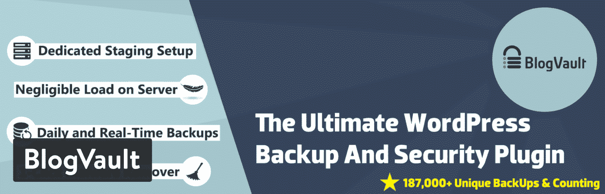

# 4 个最好的增量 WordPress 备份插件(节省空间和速度)

> 原文：<https://kinsta.com/blog/wordpress-backup-plugins/>

从在一次入侵后恢复你的网站数据，到简单地让你自己安心，同时发展你的业务，WordPress 备份在安全游戏中是必不可少的。你有几个选项来记录备份和[恢复文件，如果出了问题](https://kinsta.com/help/disaster-recovery/)。

首先是选择一家托管公司，为你完成自动备份。另一个是浏览一些最好的 WordPress 备份插件，决定哪一个适合你。或者在某些情况下，您可能希望两者结合使用。

在本文中，我们将概述这两种方法，并解释您可能选择每种方法的原因。此外，我们将扩展一些我们最喜欢的 WordPress 备份插件，以及为什么你必须使用提供增量备份的工具。

## 备份你的 WordPress 网站需要什么？

一个基本的 WordPress 备份将你的网站文件和 MySQL 数据库存储在一个单独的位置，供你以后恢复。这意味着，如果您的站点崩溃或受到任何形式的攻击、修改或损坏，您可以查看备份列表，将站点恢复到其原始状态，或最近的版本之一。

WordPress 备份插件已经开始变得更加用户友好和先进，增加了更多的功能，为用户提供了方便备份和保护文件的界面。此外，所有网站所有者都想要一种简单的方法来恢复文件，所以这也是一个焦点(建议阅读:[如何在 WordPress](https://kinsta.com/knowledgebase/wordpress-export-users/) 中导出和导入用户)。

当你浏览最好的 WordPress 备份插件(或提供备份工具的主机)时，你应该关注哪些功能？

*   **自动备份**–网站所有者不必担心持续创建自己的备份。事实上，如果手动备份是唯一的方法，大多数公司会忘记并且永远不会完成任何备份
*   **存储在多个位置**–备份通常存储在不同的服务器上，这样，如果您的站点服务器出现问题，文件就不会受到危害。理想情况下，位置越多越好。在您自己的设备上进行物理备份是一个良好的开端。但是你也想知道你的备份插件或主机是把文件存储在云中还是其他服务器上。其中很大一部分是访问你的文件。在 Kinsta，我们还提供[自动外部备份](https://kinsta.com/help/external-backups/)，将你的 WordPress 站点备份到亚马逊 S3 和谷歌云存储。
*   **增量备份**–增量网站备份是指当网站文件和数据库表发生变化时，系统仅创建备份。这样做的原因是为了提高您的网站性能，并避免服务器上大量不必要的备份文件。因此，当你的备份插件扫描最近的文件时，如果没有任何变化，最好跳过下一次备份。
*   **手动备份选项**–尽管自动备份必不可少，但手动备份仍应是可选的。这样，如果您自己发现了威胁，您可以存储您的文件。或者，您可能想下载自己的硬盘。这可能是你的主机，一个插件，或者甚至是通过 SFTP 下载你的文件来创建一个手动备份，然后[通过 phpMyAdmin](https://kinsta.com/knowledgebase/mysql-backup-database/) 导出你的 MySQL 数据库。
*   **更具体的备份计划设置**–一些备份程序只允许每月或每周备份。这是一个很好的开始，但我们更希望看到更具体的日程安排设置。例如，您的公司可能希望每小时或每天完成一次备份。这对于像 WooCommerce 或[会员网站](https://kinsta.com/blog/hosting-wordpress-membership-sites/)这样高度动态的网站尤为重要。
*   **灾难恢复**–备份您的备份怎么样？确保你的主机或备份插件公司有一个[灾难恢复计划](https://kinsta.com/help/disaster-recovery/)，以备万一他们发生不测时取回你的文件。您最不希望发生的事情就是您的站点遇到问题，您的备份解决方案出现问题。
*   **可下载的备份**–如前所述，将备份存储在多个位置是明智的。你可能更喜欢在办公室或家里的硬盘上有一个额外的备份。为此，需要[可下载的备份](https://kinsta.com/help/wordpress-backups/#downloadable-backups)。
*   **简洁的控制面板和简单的界面，用于查找和管理备份**–如果管理和恢复界面过于复杂，备份您的站点还有什么意义？大多数情况下，如果您需要恢复备份，这是因为时间敏感的问题。我们希望看到一个干净的仪表板，上面有恢复、删除和下载的即时按钮。再次，托管 WordPress 主机有助于这一点。

## Kinsta 主机提供强大的备份

备份的好处是一些托管公司为你提供备份。其实，[其中一个就是金斯塔](https://kinsta.com/help/wordpress-backups/)！

> 需要在这里大声喊出来。Kinsta 太神奇了，我用它做我的个人网站。支持是迅速和杰出的，他们的服务器是 WordPress 最快的。
> 
> <footer class="wp-block-kinsta-client-quote__footer">
> 
> 
> 
> <cite class="wp-block-kinsta-client-quote__cite">Phillip Stemann</cite></footer>

[View plans](https://kinsta.com/plans/)

我们努力为你和你的企业提供最好的托管 WordPress 托管平台，我们认为我们的功能丰富的网站备份系统是正确的选择。

Kinsta 提供自动每日备份、[可下载备份](https://kinsta.com/help/wordpress-backups/#downloadable-backups)、[外部备份](https://kinsta.com/help/wordpress-backups/#external-backups)到亚马逊 S3 或谷歌云存储、手动备份还原点，甚至系统生成备份，即在特定事件期间创建的自动系统备份。如果这还不够，我们还有一个[每小时备份插件](https://kinsta.com/help/wordpress-backups/#hourly-backups)，您可以购买它来创建每小时或每 6 小时的备份。

正因为如此，如果你用 Kinsta 做主机，就不需要备份插件了。🤘您可以通过点击按钮来恢复备份，甚至可以将它们复制到您的[暂存环境](https://kinsta.com/help/staging-environment/)中。

Backups in MyKinsta.

您可能想知道，您在 Kinsta 的备份怎么办？不用担心，我们有完整的灾难恢复计划。

除了自动备份之外，我们还在 24 小时内每隔 8 小时为基础架构中的每台机器创建并存储[永久磁盘快照](https://cloud.google.com/compute/docs/disks/create-snapshots)，然后在两周内每隔 24 小时创建并存储一次。这意味着，如果您的网站快照因任何原因无法使用，我们将拥有我们整个基础设施的[快照，可以用来恢复您的数据。](https://kinsta.com/knowledgebase/what-you-should-know/)

因此，我们强烈建议你考虑一个主机提供商，比如有这些功能的 Kinsta。备份和托管基础架构的整体价值将会收回成本，而不是拼凑另一台主机和一个备份插件。以防你好奇。 **Kinsta 不会将您的备份计入您的总磁盘空间使用量**。👏

也就是说，我们知道有些人已经在其他主机上运行他们的网站，所以我们想提供一些关于最好的 WordPress 备份插件的想法。请记住，我们只建议进行增量备份，只有在对文件或[数据库表](https://kinsta.com/knowledgebase/wordpress-database/)进行更改时才进行备份。如果插件不提供增量备份，您可能会遇到性能问题。更不用说他们会占用你的托管[磁盘空间](https://kinsta.com/blog/disk-usage-wordpress/)的疯狂数量，花费你的钱。因此，我们不建议使用它们。

## 2022 年最佳增量备份插件

提醒一下，增量备份是在不损失磁盘空间和站点性能的情况下获得备份的首选方式。你会发现市场上有许多好评的插件，但我们只推荐其中的四个，因为它们是提供令人垂涎的增量备份功能的主要选项。

*   [VaultPress](#vaultpress)
*   [WP 时间胶囊](#wp-time-capsule)
*   [管理 WP](#managewp)
*   [博客金库](#blogvault)

现在是时候深入了解它们的特性了。

### 信息

下面所有的 WordPress 插件都支持增量备份，可以在 Kinsta 使用。然而，使用 Kinsta 的内置备份解决方案将提供最佳性能。

## 1.VaultPress

VaultPress 插件是一个比较流行和强大的 WordPress 备份插件，专注于广泛的威胁，如黑客、主机故障和恶意软件。VaultPress 是 [Jetpack 插件](https://kinsta.com/knowledgebase/wordpress-jetpack/)的一部分，所以你可以利用一个包中的其他几个工具。例如，Jetpack 提供设计工具、安全措施，甚至社交媒体项目。

VaultPress WordPress backup plugin

Jetpack 如此吸引人的原因是因为你不必被迫安装无数的其他插件。所以，希望你能坚持使用一个插件来减少拖累你网站的插件数量。然而，如果您不需要它提供的所有功能，那么在性能方面也可以说是相反的。

## 注册订阅时事通讯

### 想知道我们是怎么让流量增长超过 1000%的吗？

加入 20，000 多名获得我们每周时事通讯和内部消息的人的行列吧！

[Subscribe Now](#newsletter)

VaultPress 和 Jetpack 包每年的起价仅为 39 美元。在备份功能方面，您可以获得自动每日备份和 30 天备份存档。这被认为是个人计划，但你也可以升级到每年 90 美元的商业计划。然后改进备份，以便您拥有无限量的存储。甚至还有 299 美元的专业计划。除了其他备份功能之外，它还提供无限制的备份存档。

VaultPress backup 个人计划还提供了站点迁移和一键式自动化站点恢复，确保您能够在发生问题后轻松恢复站点运行。总的来说，Jetpack 是一笔很好的交易，尤其是对于那些经营自己的网页设计业务并拥有众多客户的人来说。只需安装一个插件，您就可以维护多种类型的功能，并且**备份工具是增量式的**，与许多其他安全和备份功能搭配使用。

### 为什么这是最好的 WordPress 备份插件之一？

*   VaultPress 有增量备份和备份存档，供您检查和查找将您的网站恢复到以前状态的备份。
*   该插件与 Jetpack 插件集成在一起，为您提供了其他营销、社交媒体和安全选项。
*   VaultPress 的起价仅为每年 39 美元，所以你可以用大多数高级插件的一小部分价格获得许多功能。
*   这种按年付费也意味着优先支持是由 WordPress 专业人员提供的。
*   除了备份，VaultPress 还包括一些安全措施，如正常运行时间监控和暴力攻击保护。
*   自动化的每日备份和简单的网站恢复肯定会使所有网站管理员更容易。这样，你不需要手动做任何事情，如果你的网站瘫痪了，你可以向 WordPress 支持团队寻求帮助，或者自己完成这个过程，因为这很容易。

## 2.WP 时间胶囊

WP Time Capsule 插件有一个 30 天的免费全功能版本。之后，商业版每年起价 49 美元，提供实时备份、测试恢复和漏洞通知。**增量备份**用于确保您的网站不会遇到任何性能问题，同时还提供长达 30 天的恢复文件。除此之外，你可以在商业版的两个网站上使用这个插件。你也可以选择每年 99 美元的自由职业者版本或每年 199 美元的代理版本。所有的计划都允许你进行全职支付，以降低长期价格。

WP Time Capsule WordPress plugin

相当多的其他功能有助于增强 WP Time Capsule 插件的功能。例如，您在暂存区接收暂存、测试更新和测试恢复。此外，你可以在 WP Time Capsule 插件中将你的上传网站转移到 live 版本。该插件将增量备份提升到一个新的水平，其过程涉及云的使用和不压缩文件的系统。从不复制多个文件，您甚至可以利用增量恢复，在增量恢复中，您可以恢复某些文件并选择恢复开始的时间。

一些计划中也提供了白色标签，但是您必须升级才能从 WP Time Capsule 中删除该品牌。

### 为什么这是最好的 WordPress 备份插件之一？

*   WP Time Capsule 提供增量备份和恢复。这意味着，通过在备份过程中从不复制文件，只选择那些恢复所需的特定文件，您能够提高站点性能并使恢复更容易。
*   WP Time Capsule 的定价相当合理，尤其是考虑到你会得到备份工具等等。
*   还提供了暂存功能，允许您将一个站点从暂存推向活动，并在暂存模块中测试您的所有更新。
*   每当你更新插件或 WordPress 之类的项目时，你都会被要求对你的站点进行备份。除此之外，您可以为这些更新设置一个临时区域，以查看您的站点将如何响应这样的更改。
*   该插件具有快速恢复功能，以及在临时区域恢复站点的独特能力。这样，你就知道网站在那个时间点是什么样子了，你也不用去猜了。
*   还有许多其他功能可以保护你的网站免受黑客攻击，保证你的电子商务商店的安全，减少你的存储费用。

## 3.管理工作

ManageWP 不仅仅是一个 WordPress 备份插件，因为它为你所有的 WordPress 网站提供了一个完整的管理工作空间。无论你是在运行一个[多站点博客](https://kinsta.com/blog/wordpress-multisite/)还是在不同的 WordPress 安装上有几个网站，ManageWP 都意味着将你所有的仪表盘集中在一个位置。这样，您就可以毫无问题地为所有这些文件进行备份，并完成其他操作，如批量更新、垃圾邮件清除和安全检查。

Struggling with downtime and WordPress problems? Kinsta is the hosting solution designed to save you time! [Check out our features](https://kinsta.com/features/)

ManageWP WordPress backup plugin

灵活的定价是每个人都能习惯的。这种配置意味着您只需为您使用的内容付费，升级和降级随时可用。他们提供免费的每月备份。高级备份(每周到每小时)从每个站点 2 美元起。您可以选择将备份上传到您自己的外部[云存储](https://kinsta.com/blog/what-is-cloud-storage/)，每 GB 额外支付 0.13 美元。他们还为多达 100 个捆绑网站提供每月 75 美元的费率。

ManageWP 确实可以完成增量备份，但是了解这些备份的工作方式与您选择的价格包之间的关系非常重要。免费版只提供手动备份。高级备份是您接收到像 Dropbox、Google Drive 和亚马逊 S3 这样的地方的计划备份。这是大多数公司所寻求的，因为自动云备份比手动备份更可靠。

### 为什么这是最好的 WordPress 备份插件之一？

*   价格从 0 美元开始，并在灵活的基础上上涨，这完全取决于你的网络上有多少网站和你需要的功能类型。一般来说，对于大多数品牌来说，每月的价格应该保持在相当低的水平。
*   批量操作是 ManageWP 的主要卖点，因为你不仅可以在一个仪表板上查看多站点的所有信息，还可以完成所有站点的批量更新、备份或安全检查。
*   这完全取决于您的定价计划，但是您可以找到让您放心所需的大部分备份功能。例如，您可以备份到云。**所有备份都是增量备份**，您可以选择每周、每天或每小时进行备份。
*   可以手动下载，也可以使用工具将您的网站文件存储在异地位置。
*   一键式恢复按钮确保没有人在必须解决网站文件问题时感到困惑。
*   你可以从其他几个高级插件中选择，比如正常运行时间监视器、迁移工具(查看我们的最佳 WordPress 迁移插件列表)、SEO 排名模块和白色标签。

## 4.博客跳马

[BlogVault](https://wordpress.org/plugins/blogvault-real-time-backup/) 插件是另一个高级解决方案，具有**增量备份**和一整套其他功能，如一键恢复、免费暂存和合并到实时站点。由于每月定价的原因，这个插件有点贵，但它的起价是每月 7.40 美元，而且它似乎比列表中的其他插件提供了更多的功能。至于大多数计划，BlogVault 每天都有自动备份，以保持简单，让所有网站所有者安心。备份历史记录持续 90 天，这应该有足够的时间让您找到想要恢复的站点的正确版本。如上所述，你还可以利用增量备份来提高网站的整体速度。

BlogVault WordPress backup plugin

多站点支持也值得一提，因为不是所有的备份插件都提供这种支持。将 multisite 这样的功能与完整的网站管理结合起来，你就可以更清楚地了解你的单独网站或网站网络的情况。如果你想升级到一个更高的定价包，BlogVault 确实有一个白标解决方案，让你更专注于分享自己公司的品牌。更高级的计划还包括添加客户端、添加团队成员和运行客户端报告的选项。最后，所有产品包都包括客户支持，如果出现问题，您可以选择联系代表。

### 为什么这是最好的 WordPress 备份插件之一？

*   BlogVault 是 WooCommerce 网站的一个好选择，因为它有实时同步 WooCommerce 订单的计划。还提供了一个安全计划，它结合了所有预期的备份工具和功能，如恶意软件扫描、IP 阻止和[防火墙](https://kinsta.com/blog/what-is-a-firewall/)。
*   增量备份改进了您的站点功能，并防止创建备份的多个副本。这意味着您的服务器不再需要存储几乎无限数量的完全相同的备份。
*   BlogVault 提供网站管理和多站点支持。
*   您可以轻松访问您的备份，并通过一键恢复按钮将您的网站恢复正常。
*   分段设置有助于了解备份完成后站点的情况。然而，您还没有创建任何永久的更改。
*   备份历史被延长到 90 天，这比许多其他有 30 或 60 天备份历史的 WordPress 备份插件要长。
*   BlogVault 迁移到成千上万的 web 主机，这意味着您不必太担心是否可以使用您选择的主机。

## 你应该考虑哪些 WordPress 备份插件？

第一件事是第一:主机是你的网站如何在线存储、展示和优化的一个重要部分。因此，一些最好的主机也为您处理备份是有意义的。因此，我们建议首先查看我们的 [Kinsta 计划](https://kinsta.com/plans/),看看哪一个适合您的企业。我们为各种规模的企业准备了包装，并准备向您展示 Kinsta 的不同之处！

然而，如果你仍然喜欢增量备份的想法(只备份修改过的文件和数据库故事),我们谈到的 WordPress 备份插件非常棒。我们提到的四个中的任何一个都不会错。

如果你还需要一些指导来选择哪一个，这里有一些额外的想法:

*   **如果您需要一个简单的自动化备份流程，并拥有 Jetpack** 的各种其他功能，请考虑安装 VaultPress。
*   如果你想要多个暂存区，这样你就不会实现错误的恢复文件或者在更新过程中损坏某些东西。
*   如果你需要一个同时支持 [WordPress 多站点](https://kinsta.com/blog/wordpress-multisite-plugins/) 的备份解决方案，考虑 ManageWP WordPress 插件。
*   **如果你想使用 WooCommerce 订单同步和其他安全工具进行增量备份**——试试 BlogVault。

总的来说，一些 WordPress 备份插件肯定会导致性能问题，耗尽你的磁盘空间。这就是为什么我们坚持只推荐最好的增量备份。如果你对最好的 WordPress 备份插件有任何疑问，请在下面的评论区告诉我们。

* * *

让你所有的[应用程序](https://kinsta.com/application-hosting/)、[数据库](https://kinsta.com/database-hosting/)和 [WordPress 网站](https://kinsta.com/wordpress-hosting/)在线并在一个屋檐下。我们功能丰富的高性能云平台包括:

*   在 MyKinsta 仪表盘中轻松设置和管理
*   24/7 专家支持
*   最好的谷歌云平台硬件和网络，由 Kubernetes 提供最大的可扩展性
*   面向速度和安全性的企业级 Cloudflare 集成
*   全球受众覆盖全球多达 35 个数据中心和 275 多个 pop

在第一个月使用托管的[应用程序或托管](https://kinsta.com/application-hosting/)的[数据库，您可以享受 20 美元的优惠，亲自测试一下。探索我们的](https://kinsta.com/database-hosting/)[计划](https://kinsta.com/plans/)或[与销售人员交谈](https://kinsta.com/contact-us/)以找到最适合您的方式。