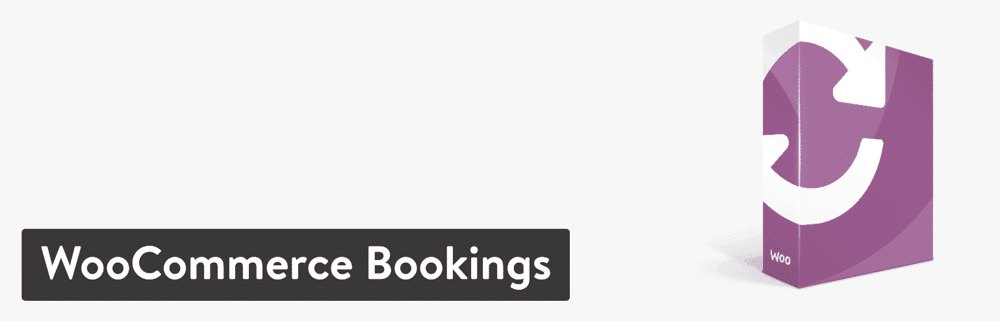
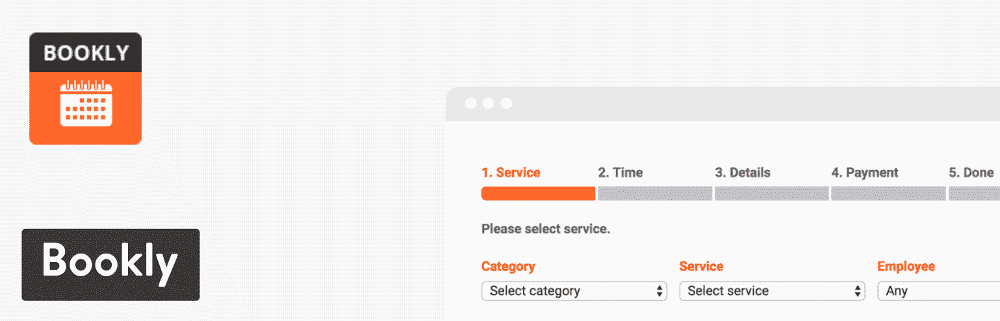
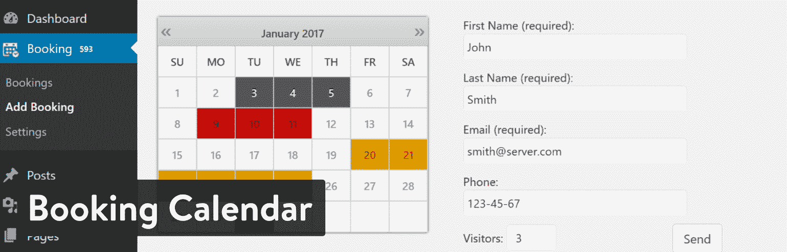
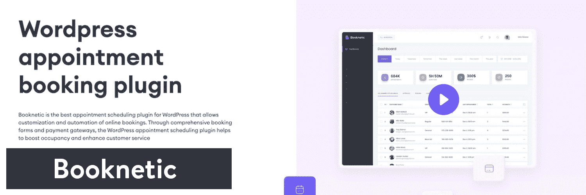

# 16 个最好的 WordPress 预订插件，让你的业务完全自动化

> 原文：<https://kinsta.com/blog/wordpress-booking-plugins/>

去看牙医通常需要预约。去一趟你最喜欢的泰国餐馆或者在你当地的健身房报名参加个人训练也是一样。过去，客户必须查找电话号码，在电话上与某人交谈，然后在一张纸上记下日期和时间。那些日子已经一去不复返了，令人难以置信的是，在线预订工具不断增加各种功能。

如果你碰巧经营一家需要预约的公司，找到最合适的就很重要。这就是为什么我们想列出最好的 WordPress 预订插件供选择。

[Check out these awesome WordPress booking plugins to fully automate your business. 🗃Click to Tweet](https://twitter.com/intent/tweet?url=https%3A%2F%2Fkinsta.com%2Fblog%2Fwordpress-booking-plugins%2F&via=kinsta&text=Check+out+these+awesome+WordPress+booking+plugins+to+fully+automate+your+business.+%F0%9F%97%83&hashtags=smallbusiness%2Cecommerce)T3】

## 你应该在一个 WordPress 预订插件中寻找什么？

您最初可能认为预订引擎是一个带有表单的简单日历，但它取决于所运行的业务类型。例如，一个健身房可能有多个私人教练。每个员工都需要在网站上列出自己的时间表。另一方面，牙科诊所可能需要显示具体的时间，并揭示所提供的不同类型的服务。

因此，仔细观察每个 WordPress 预订插件的特性是很重要的。这样，你就拥有了所有你需要的功能和一定的灵活性来壮大你的企业。

以下是我们在研究中发现的一些最有帮助的特征:

*   一个[可定制的日历](https://kinsta.com/blog/wordpress-calendar-plugin/)，可以放在你网站的任何地方。
*   方便用户在小型设备上预约的移动友好界面。
*   接受约会付款的选项。有办法去除支付处理也不错。
*   支持多个“代理”或“服务提供商”在这里，你的每个员工都有自己的个人资料和日程表，比如私人教练或一个办公室里的多个医生。
*   供客户在线查看和编辑预订的区域。
*   一个可过滤和可搜索的预订管理模块，位于你的 WordPress 网站的后端。
*   定制日程安排的功能，例如删除假期和在约会之间设置一些空闲时间。
*   为管理员和用户发送电子邮件确认和提醒。
*   [可定制的字段和下拉菜单](https://kinsta.com/blog/wordpress-menu-plugins/)供您提供各种服务或独特产品时使用。

这只是你应该从你的预订插件中得到的主要特性的一小部分。有些设置和功能可能不适用于您的企业，因此请确保您测试了那些看起来有吸引力的设置和功能，并使用我们下面的深入评论来确保您获得最佳价值。

> Kinsta 把我宠坏了，所以我现在要求每个供应商都提供这样的服务。我们还试图通过我们的 SaaS 工具支持达到这一水平。
> 
> <footer class="wp-block-kinsta-client-quote__footer">
> 
> 
> 
> <cite class="wp-block-kinsta-client-quote__cite">Suganthan Mohanadasan from @Suganthanmn</cite></footer>

[View plans](https://kinsta.com/plans/)

例如，一些较小的公司可能只需要一个简单、免费的日历来接受无薪约会。然而，[更大的品牌](https://kinsta.com/blog/wordpress-site-examples/)将需要更广泛的功能，漂亮的模板和高性能的沟通工具。
T3】

## 深入了解 2022 年最好的 WordPress 预订插件

我们已经研究、测试并分解了每一个值得尊敬的 WordPress booking 插件，以展示最好的功能，以及可能让你倾向于其中一个的功能。现在是时候投入进去了！

T3】

### 1.网络商务预订

在 WordPress 电子商务的世界里，WooCommerce 插件才是王道。其中一个主要原因是因为核心版本是免费的——但你也可以使用几十个扩展以不同的方式接受支付。例如， [WooCommerce 预订扩展](https://woocommerce.com/products/woocommerce-bookings/)可以让你根据时间或日期出售预订。你仍然可以选择免费接受预订，但是你使用 WooCommerce 扩展的主要原因是为了激活支付处理功能。

我认为 WooCommerce Bookings 最适合已经使用 WooCommerce 插件的公司。然而，对于新来者来说，这也是一个不错的、干净的扩展。它允许 WordPress 用户要么坚持简单、现代的布局，要么在 CSS 的帮助下定制它。

WooCommerce Bookings plugin

一旦扩展被激活，它会提供描述、定价、标题和日历等字段。例如，你可能出租房间给一张床和早餐，并且想要谈论房间，价格和可利用的日期。评论也是可能的，这样你就可以和潜在的预订者建立一些可信度。

WooCommerce 预订扩展单个网站的起价为 249 美元，最多 25 个网站的起价为 449 美元。在这个价格上，它是最贵的插件之一。此外，基本的 WooCommerce 插件是完全免费的，所以你不必担心为此付费。最后，WooCommerce 提供全年客户支持和 30 天退款保证。所以，试试看，看你喜不喜欢！

#### 使 Woocommerce 预订成为最佳选择的功能

*   WooCommerce Bookings 扩展提供了创建固定时间段的工具，客户必须根据您选择的时间做出决定。或者，您可以在任何时间或日期打开它。
*   所有预订都在您的仪表板中管理，您可以在其中接收过滤器和更新按钮。
*   你可以限制预订的人数，甚至可以为一定数量的预订提供折扣。
*   您有几个选项来批准收到的预订，并控制预订何时对用户可用。
*   该扩展链接到 WooCommerce，这是市场上最受欢迎、最可靠的电子商务插件之一。该扩展不是免费的，但这是一次性费用，WooCommerce 插件也是免费的。
*   WooCommerce 有一个为期 30 天的免费“先试后买”项目。
*   你可以集成其他的 WooCommerce 扩展来增加功能。例如，向表单中添加更多字段需要产品加载项扩展。

### 2.WooCommerce 约会

WooCommerce 约会扩展是另一个与 WooCommerce 整合的选项。它与之前的扩展非常相似，但价格更实惠，每个站点 89 美元起。当然，25 个站点的价格高达 200 美元左右。支持和更新提供了一整年，但如果你不想要这些，然后定价是一次性费用。

该扩展并不通过 WooCommerce 销售，但 BookingWP 的开发者以高质量的产品而闻名。至于扩展本身，你可以期待一些优秀的特性，首先是与 WooCommerce 和 Google Calendar 的集成。通过这种方式，您可以接受客户的付款，并与您之前设置的 Google 日历同步。预约和预订可以免费接受，但是你也有收费的设置。

WooCommerce Appointments plugin

这个插件的主要优点之一是它的设置和管理是多么的快速和简单。这个界面对于初学者来说已经足够基本了，但是它也提供了你作为一个高级程序员所需要的灵活性。有趣的是，你的谷歌日历可以从你的网站同步，这是一个双向同步过程。我最喜欢 WooCommerce 预约，适合需要完全定制的开发者。它在这方面也很方便，因为它集成了 WooCommerce 打印发票、Gravity 表单和额外的产品选项等扩展。

#### 使 WooCommerce 约会成为最佳选择的功能

*   WooCommerce 约会插件有一个与谷歌日历双向同步的系统。因此，你可以通过编辑谷歌日历或网站上的时间表来同步。
*   该扩展集成了大多数流行的 WooCommerce 扩展。
*   你可以接受预约，这样你的时间表就不会太快排满。
*   通知和提醒会自动发送给已经预约的客户。
*   该扩展是白色标签的，对开发人员友好。开发人员可以轻松快捷地进行定制，没有任何问题。
*   您会收到在网站上任何地方插入预订表格的短码。您不局限于小部件或某些页面。
*   该扩展使您可以完全控制您的日程安排，包括约会之间的填充时间、提前期、日程安排窗口和多天日程安排。
*   可以为定价、容量和可用性设置几个规则。

### 3.书卷气

Bookly 插件有免费版和[付费版](https://www.booking-wp-plugin.com/)。如果你计划升级到高级版本，预计一次性支付 89 美元(除非你想继续支付客户支持)。免费插件是一个基本的预订工具，但你不能获得在线支付和无限数量的员工用户的支持。所以，除非你接受免费预订，否则 Bookly premium 版本最适合你。

至于它的特点， [Bookly](https://wordpress.org/plugins/bookly-responsive-appointment-booking-tool/) 是这个列表中看起来最现代的插件。它在后端和前端都有一个圆滑的设计，你可以在不知道任何代码的情况下定制预订表单的许多区域。如果你打算使用自定义代码，我不推荐你使用它，但是我觉得大多数初学者和高级用户会对这个插件的功能和风格如鱼得水。

Bookly plugin

预订表单是完全可定制和响应的。它为管理员和客户提供了多种视图。更不用说，Bookly 有一个模块可以创建无限数量的员工，每个成员都可以创建独特的价格和可用性。因此，举例来说，一个健身房可能会为一群私人教练这样做。

总的来说，Bookly 对于那些可能没有资源雇佣定制开发者的小企业来说是一个便宜。它应该提供您自己运行预订系统所需的大部分工具。

#### 使 Bookly 成为最佳选择的特性

*   这是目前市场上最接近完整的预订套餐。简而言之，你不需要很了解编码就能得到一个漂亮的结果。
*   您可以在预订计划中包括许多服务提供商(员工)。这样，您的员工可以收取不同的费用，并显示不同的时间。
*   你不仅可以发送自动电子邮件通知，而且还内置了短信系统。
*   有一个谷歌日历集成，支持来自所有员工的多个日历。
*   出售几个附加产品，比如一个优惠券或一个为你的服务增加额外服务的附加产品。
*   这个插件可以让你在你的预订页面上添加无限数量的服务。您还可以对它们进行分类，以便更好地组织。
*   支付和预订规则可使您的时间表对每个人都更灵活。

### 4.登记

预订的插件只通过 CodeCanyon 出售，价格为 49 美元。允许的预订类型包括付费预订、客人预订和注册预订。您可以在日历或列表视图中显示您的时间段，甚至可以将其翻译成其他语言。此外，您还可以将日历分配给组织中的特定人员。所以，你可能有旅行社或私人教练需要他们自己的时间表。除了多个日历之外，每个用户都能够创建某种程度上的个人档案，以便在客户面前脱颖而出。

Booked plugin

与通过 CodeCanyon 销售的大多数插件一样，预订费用是一次性价格。但是，您可以将客户支持延长一整年，只需额外支付 16.50 美元。

大多数定制设置涉及日历颜色和字段，但这正是这个插件如此易于使用的原因。前端界面看起来优雅而现代，你可以集成其他各种各样的插件，比如 WooCommerce 支付、前端代理和日历提要。

## 注册订阅时事通讯

### 想知道我们是怎么让流量增长超过 1000%的吗？

加入 20，000 多名获得我们每周时事通讯和内部消息的人的行列吧！

[Subscribe Now](#newsletter)

#### 使预订成为最佳选择的功能

*   这个插件实际上已经准备好脱离软件包了。界面看起来很棒，你不必被迫使用任何自定义编码。
*   定价只是一次性费用，比其他预订插件便宜得多。
*   你可以免费获得一些插件，包括一个叫做前端代理的东西，这对于你的代理在前端看到一个用户友好的预订管理屏幕是很好的。
*   该插件支持多个员工日历。
*   您可以更改日历颜色。
*   客人预订是可能的，所以用户不必在您的网站上注册。
*   自定义时间段对于指定诸如假期或假日之类的事情很有用。
*   你会收到一些方便的短代码，这样你就可以在你网站的任何地方放置一个预约日历。

### 5.网络商务预订

WooCommerce 的预订功能允许您使用 WooCommerce 插件在自己的网站上接受预订。这为您提供了使用世界上最受欢迎的电子商务平台的所有优势和灵活性，包括大量的支付网关选择，以及允许销售其他物品。

Bookings for WooCommerce

通过 WooCommerce 的预订，您可以销售可预订的产品，如度假租赁、产品租赁、场地租赁和租赁。用户可以使用单独的日历选择开始和结束日期，并且您可以将可预订期设置为每晚、每天或每周。您可以指定在一周的特定日期开始预订，如果您在特定日期出租您的房产，这一点至关重要。您还可以在每次预订的开始和结束时定义缓冲期，以确保预订不会重叠，并且您有足够的时间进行任何转换。

其他功能包括能够在一年中的不同时间设定不同的价格，因此您可能希望在特定时期增加成本，或者在淡季降低成本。你也可以把约会取消，以防万一你想自己休息一段时间。你也可以对超过一定时间的预订提供折扣——所以第一周是全价，第二周是半价。

WooCommerce 的预订很容易使用，并与其他插件(如附加组件终极版)集成，因此您可以对可预订产品的额外选项收费。

#### 使 WooCommerce 预订成为最佳选择的功能:

*   扩展 WooCommerce，为您提供额外的灵活性和功能。
*   与其他插件集成，如附加组件终极版。
*   有 14 天退款保证，让您无风险试用插件。
*   易于使用，即使对于非编码人员。
*   允许您指定一周中的某一天开始预订。
*   每晚、每天或每周预订。

### 6.预订日历

[预订日历](https://wordpress.org/plugins/booking/)是 WordPress 最古老的预订插件之一，评级显示这些年来它并没有随着质量发展而放缓。核心插件是免费的，并带有一般小型企业所需的大部分功能。然而，你可以升级到许多更大的商业计划中的一个，一个网站大约 60 美元起。在那之后，定价太混乱了。如果你进入定价页面，你会发现五个单站点计划，五个开发者站点计划，五个[多站点](https://kinsta.com/blog/wordpress-multisite/)计划。

除了定价混乱，销售网站也不容易理解。我通常建议用户安装核心插件，看看它是否符合他们的需求——因为它确实是一个强大的插件，但试图弄清楚哪个功能来自哪个计划会让你头疼。

Booking Calendar

无论如何，预订日历插件的一些主要功能包括当用户预订并需要提醒时自动发送电子邮件通知。一个独特的工具是能够设置一个开放的时间框架，持续一定的天数。这样，你可以接受几个双重预订，然后关闭它来决定你应该接受谁。我特别喜欢日历如何在前端显示一个月的可用、预订和待定日期的数量。

此外，预订日历插件集成了大量外部网站和日历应用程序。

#### 使预订日历成为最佳选择的功能

*   除了谷歌日历，该插件还支持与 Airbnb、Booking.com 和猫途鹰等第三方网站同步。
*   预约日历插件在[窗口小部件](https://kinsta.com/blog/wordpress-widgets/)中工作，便于放置在侧边栏中。
*   支持多种语言，以便联系其他国家的客户。
*   展示你独特的可用性是相当灵活的，可以选择在一年中的某些时间和日期。
*   一些颜色定制是可用的，但是最好的样式能力出现在您使用自己的 CSS 时。

### 7.无肢

Amelia 插件是一个简单易用但功能强大的自动预订专家，全天候工作以确保您的客户可以在线或离线预约和支付。这个插件是免费的，适合小型企业。对于更大的企业，有一个[付费版](https://wpamelia.com/demos/#Features-list)的插件。终身许可也是可用的，一个域名的起价为 189 美元，价格会随之上涨。包括 6 个月的快速响应支持，如果您需要超过此期限的支持，您可以收取少量费用延长支持。如果您希望所有员工、服务类型、额外服务以及集成的支付方式都集中在一个地方，Amelia Pro 是您的最佳选择。

Amelia WordPress booking plugin

Amelia 拥有各种固定终身价格的内置功能，这是市场上独一无二的。它提供短信通知，让您可以与客户和员工保持即时联系，谷歌日历同步让您的员工可以跟踪他们自己的谷歌日历中的所有约会，等等。它的后端和前端都有漂亮、整洁、现代的设计。它的设计是可定制的，所以它与你的网站设计相匹配，就像它的一个组成部分，加上一个简单的短代码。

#### 使 Amelia 成为最佳选择的特性

*   通过短信通知实时通知和提醒您的客户和员工他们的约会。
*   您可以添加多个具有自定义工作时间和休息日的员工。
*   特殊日期支持–使用不同的计划配置特定日期或日期范围。
*   每位员工的双向谷歌日历集成。
*   WooCommerce 整合。
*   多种服务和服务类别，额外服务。
*   多个营业地点。
*   业务绩效 KPI 的图形和图表。
*   添加折扣券，很容易在插件中实现。
*   所有这一切都无需支付额外的附加费用，完全包含在一个单一的终身许可证中。

这么多插件，这么少时间。使用我们的流线型控制面板，让他们保持最新状态。[免费试用 kin sta](https://hubs.ly/H0pklC_0)。

### 8.预约日历-预约预约系统

一些预订插件有相似的名字并不奇怪。和前面在#7 列出的插件一样，这个插件也叫做[预约日历](https://wordpress.org/plugins/booking-calendar/)。幸运的是，他们还添加了“预约系统”标签，以便更容易区分。核心插件是免费的，并为您提供了许多功能。例如，它为预订日历提供了无限的预订表单和小部件。它在定制方面也相当灵活，可以选择更改日期格式、调整预订字段等等。

专业版也值得研究，因为为一个网站增加一个完整的支付系统只需要 60 美元。你还可以获得一个更先进的预订系统，无需支付 30 美元。付费版本还包括以下内容:

*   可编辑的预订。
*   折扣工具。
*   最小和最大保留天数的选项。
*   A [ReCaptcha 防止垃圾邮件](https://kinsta.com/blog/wordpress-captcha/)。
*   多个站点许可的可能性取决于您的计划。

Booking Calendar, Appointment Booking System plugin

它的界面比一些竞争对手的要严格一些，所以我倾向于认为这个插件是最适合公司内部使用的。毕竟，免费版已经给了你无限日历的支持，如果你只是在你的公司内部使用它，可能没有必要接受预订的付款。

无论如何，我很喜欢预订日历的清晰和大小，看到每天的可用数量是如何显示的，有出色的颜色编码和足够的日历空间。如果您尝试不受任何限制地进行定制，日历模块也可以很好地工作。不，这不是最现代的日历，但你可以添加任意多的自定义字段，包括 [FAQ 信息](https://kinsta.com/blog/wordpress-faq-plugins/)、预订详细信息和服务附件。

#### 使预约日历-预约系统成为最佳选择的功能

*   预订日历非常容易实现，前端界面很大，简单易用。
*   灵活性有几个价格点，但许多不需要支付处理的公司可以免费获得他们需要的一切。此外，实际的价格计划是相当实惠的。
*   每个计划都有无限的预订日历。
*   通过简单的升级，您可以访问可编辑的预订、支付系统和折扣选项。
*   您仍然可以升级您的整体功能集，而无需为支付系统支付更多的钱。
*   灵活性是预约日历-预约系统的关键。它充满了定制功能和选项，可以添加任意多的独特字段。

### 9.预约日历

[预约日历插件](https://wordpress.org/plugins/appointment-booking-calendar/)有两个独特的元素。首先，它是唯一一个免费集成 PayPal 的 WordPress 预订插件。有一个[高级版本](https://abc.dwbooster.com/download)，但只有当你想选择删除贝宝链接，并获得一些其他功能，如优惠券。专业版售价 49.99 美元。

预约日历插件脱颖而出的另一个原因是因为它主要用于显示一组可用的时间段，而不是一个完整的选择日历。日历仍然会显示在你的网站上，但是其中一个主要的特点是划掉不可用的日子，显示对你最合适的时间。

总的来说，与这个列表中的许多竞争对手相比，免费版本看起来很独特。你会收到一个内置的验证码、可用性验证和一个多页日历，供人们浏览全年。

Appointment Booking Calendar

通知和确认会发送给用户和管理员，同时您也可以通过导入 CSV 或 Excel 文件来配置您的日历。就界面和设计而言，后端易于理解和管理您的约会。前端并不完全是最现代的外观和感觉，但是您可以使用三个预构建的模板开始设计。之后，自定义 CSS 是你调整日历在线显示方式的主要途径。

#### 使预约日历成为最佳选择的功能

*   这是唯一一个免费集成 PayPal 的 WordPress 预订插件。它只是把顾客送到 PayPal 的收银台，但仍然有效。
*   清除不可用日期和时间的特性使得这个插件在向客户显示您的实际可用性时相当灵活。
*   你还会收到一个免费版本的验证码。
*   该插件已被翻译成数十种语言，供全世界使用。
*   多页日历意味着可以一次向客户显示几个月。
*   如果激活，用户可以一次预定几个时间段。例如，医生办公室可能希望向定期预约的患者提供这种服务。
*   除了 CSV 和 Excel 导入之外，日历导入还可以从 Outlook 和 Google Calendar 等地方获得。

### 10.团队预订

正如你可能已经注意到的，大多数 WordPress 预订插件都很便宜，即使你选择了高级版本。理想情况下，一切都是免费的，但一般来说，大多数公司都需要一个额外功能的高级版本。这是我们喜欢[团队预订插件](https://codecanyon.net/item/team-booking-wordpress-booking-system/9211794)的原因之一，因为它的价格很低，只有 28 美元，你可以连接 PayPal 或 Stripe 进行支付处理。

团队预订插件包含了许多可与市场上最好的替代产品相媲美的功能。该解决方案提供了三种内置格式，一种是常规的前端预订日历，另一种用于未计划的服务(如支持票)，第三种用于更新您的谷歌日历的[即将到来的活动](https://kinsta.com/blog/wordpress-events-plugin/)。日历的外观很现代，表单生成器可以灵活地添加多个字段并轻松收集您的客户数据。

Team Booking plugin

你甚至可以在[中加入地图](https://kinsta.com/blog/wordpress-map-plugin/),每当顾客想要预订时间段时，地图就会弹出。

特性列表很难完全涵盖，但是总的来说，你需要的大部分工具都打包到插件中了。如果你想用代码定制，我不推荐这个预订插件。但是这是一个非常好的解决方案，对于那些对编码一无所知的人来说，它拥有所有需要的内置特性。

#### 使团队预订成为最佳选择的功能

*   当你需要把人送到一个地点时，地图被集成到表单中。
*   形式是现代和美丽的，最少的步骤和大领域。
*   您可以在活动、约会或未预定的预订表单之间进行选择。
*   这个价格是你能找到的最好的高级预订插件了。
*   团队预订插件集成到您的谷歌日历。
*   您可以根据您拥有的员工或服务提供商的数量来划分时间表。例如，客户支持团队可能有不同的时间表。
*   除了 PayPal，你还可以通过 Stripe 接受支付。

### 11.MotoPress 酒店预订

[MotoPress 酒店预订](https://motopress.com/products/hotel-booking/)是一个强大的预订系统，用于建立和管理酒店或物业租赁网站。该插件允许接受在线预订，为每个住宿创建实时可用性日历，处理在线支付，自动与流行的在线旅行社同步预订日历等。

MotoPress Hotel Booking WordPress plugin

您可以列出并描述您的住宿或房间，还可以选择添加额外的服务套餐或设施，以便预订。插件还确保设置灵活的价格，如季节性价格或可退款/不可退款价格、周或月价格和可变价格(根据停留时间或客人数量改变价格)。

MotoPress 酒店预订允许网站管理员在后端管理收到的预订，并为其设置首选的确认模式:管理员可以手动确认预订，也可以要求客人通过电子邮件或付款来确认预订。可用的支付网关:PayPal，2Checkout， [Stripe，Braintree](https://kinsta.com/blog/stripe-vs-braintree/) ，Beanstream，Pay on Arrival。

#### 使 MotoPress 酒店预订成为最佳选择的功能

*   **双向 iCal 自动同步**与外部预订平台交换预订日历数据，避免超额预订。
*   向管理员和客人发送电子邮件通知，包括预订详情、预订确认/取消通知以及其他重要信息。
*   在一次预订过程中预订不限数量的住宿。
*   与 WooCommerce 支付插件集成，以获得更多支付网关。
*   根据任何参数(如位置、价格范围等)对您的住宿进行分类。)，因此可以对它们进行高级搜索。
*   创建带有货币价值或折扣的折扣券。
*   测试后端管理区域和前端性能的演示可用性。
*   详细且有指导意义的视频教程的广泛知识库。

### 12.沙龙预订系统

[沙龙预订系统插件](https://wordpress.org/plugins/salon-booking-system/)是一个工具，旨在满足沙龙业主、理发店、理发店、美容中心、美甲美容院和类似企业的日常需求。这个插件对于那些通过预约提供服务的专业人士来说是一个很好的解决方案。

Salon Booking System plugin

它配备了一整套使用电子邮件和短信的通知和提醒选项。与 WhatsApp 的整合正处于 beta 测试阶段。它与谷歌日历完全集成，从网站收到的预订会自动发布在企业所有者的日历上。即使是沙龙的助理也可以通过多种方式得到即将到来的预订通知，电子邮件、短信，甚至是通过他们的谷歌日历。

沙龙所有者可以从插件后端日历或简单地使用他们的谷歌日历帐户添加预订。沙龙预订系统配备了许多其他功能，其中有一个高级折扣系统，允许创建优惠券代码或在预订过程中满足特定条件时自动应用的折扣。

这个插件配备了一组短代码，这将节省大量的内容编辑时间，因为它们将拉出关于沙龙服务、助理和预订日历的所有信息。

#### 使沙龙预订系统成为最佳选择的功能

*   设置和管理非常简单。
*   无限的预约规则来代表真正的沙龙时间表。
*   **与谷歌日历双向同步**。
*   使用 PayPal 和 Stripe 处理全部和部分在线支付。许多其他支付网关可以用来购买一个专用的附加组件。
*   完全控制预订表单的外观和感觉。
*   被翻译成 20 多种语言。
*   配备了一整套 API。
*   有能力收集客户的反馈。
*   客户的个人帐户页面。
*   包括控制沙龙趋势的报告部分。

### 13.CM 预订日历

CreativeMinds 预约日历插件允许用户直接从他们的网站轻松安排约会。具体来说，管理员用户可以创建多个具有不同时间段的日历，设置每个活动的座位数，定制预订表单，并审核每个请求。

CM Booking Calendar plugin

CM 预约日历插件提供的一个有用的特性是可以创建响应性的前端日历，然后可以添加到博客文章、页面和任何你喜欢的地方。

该插件标价 39 美元，包括终身访问和一年的支持和升级。

#### 使 CM 预订日历成为最佳选择的功能

*   您可以创建多个日历，每个日历都有自己的约会表单、主持人、会议时长和可用时间。
*   该插件完全响应，因此，当检测到小屏幕设备时，它会调整日历视图，以确保最佳的可视性。
*   所有插件标签和消息都是可编辑的，可以根据任何语言和需要进行更新。
*   该插件可以通过附加组件进行扩展，以支持支付、群组活动和 iCal 同步。

### 14.WooCommerce 的预订和预约插件

由堤喀软件公司开发的用于 WooCommerce 的[预订&预约插件将把你的商店变成一个全面的各种产品和业务的预订平台。无论你是经营健身房、沙龙、酒店、运动器材租赁公司还是食品企业。](https://www.tychesoftwares.com/store/premium-plugins/woocommerce-booking-plugin/)

可以为每种 WooCommerce 产品类型创建预订，无论是简单产品、团体产品、可变产品、捆绑产品还是复合产品。管理员可以完全控制预订日期、特定日期的价格、产品可以预订的小时数或天数，甚至可以限制特定日期的预订数量。

Booking & Appointment Plugin for WooCommerce

对于单店启动计划，该插件的价格为 199 美元/年，对于拥有 10 家商店的企业计划，该插件的价格为 399 美元/年。

#### 使 WooCommerce 的预订和预约插件成为最佳选择的特性

*   有一个内置的双向谷歌日历同步，所以不仅是管理员，而且客户也可以跟踪他们的预订。
*   对于同一产品，你可以允许不同长度的时隙。如果作为遗产旅游的组织者，你想在周末进行更长时间的旅游，你可以这样做。
*   它适用于 WooCommerce 的所有支付网关。
*   有 30 天退款保证和全年客户支持

### 15.Booknetic

[Booknetic](https://www.booknetic.com/) 是一个功能丰富的预约插件，适合各种业务，包括美容、医疗、健身、法律、教育等等。配置和管理插件非常简单快捷。它易于使用的后端和前端以及现代化的功能是无力负担高端软件解决方案的企业的救命稻草。各种集成渠道让您可以完全自动化您的预约和解决一个平稳的工作流程。

Booknetic

全面定制的功能有助于控制您的约会。多设备兼容性确保可以预约或随时更改。使用拖放构建器，您可以定制预订面板，重新排序原始步骤，添加或删除额外的步骤，以创建您理想的预订面板。

您可以使用后端面板来管理您的整体工作流程。它有单独的部分为员工，客户，约会，地点。使用报告面板，您可以深入了解企业的实时统计数据，查看收入最高、预订最多的员工和服务，并进行相互比较。

Booknetic 拥有世界一流的客户支持，以其全面及时的响应而闻名。该插件通过 Envato 市场出售，在那里它得到了顾客 5.00 的评分。至于其客户支持和功能的可用性，Booknetic 在 Envato 市场排名第一。你可以一次性为一个网站支付 79 美元。最后，它给你终身访问未来的更新和 6 个月的客户支持。

#### 使 Booknetic 成为最佳选择的特性

*   日历同步，避免重复预约
*   你有一个可以放在网站任何地方的预订工具
*   通过定义休息时间、休息日、约会间隔时间来完全控制您的日程安排
*   使用脸书或谷歌功能登录
*   无限制的服务、员工和地点来设置您的预订面板
*   定制选项组织您的预订流程
*   与您的品牌相匹配的可定制设计
*   通过 Paypal、Stripe、Mollie 等最安全、最受欢迎的支付网关进行在线支付
*   销售能力通过 WooCommerce 支付追加销售服务
*   在线计费和开具发票以简化会计核算
*   自动通知和提醒员工和客户有关约会、付款和销售优惠的信息
*   通过缩放集成访问虚拟事件的能力
*   定期约会，避免重复预约
*   该插件允许你通过信息、电子邮件和 WhatsApp 发送通知
*   通过员工、位置和服务定义绩效的综合报告
*   礼品卡和折扣，以提高客户忠诚度

### 16.简单地安排约会

简单安排约会是一个优雅且易于使用的安排插件，适用于在 WordPress 上运行的业务。他们提供了一个免费版本和三个高级版本的插件，包括更高级的功能和独特的集成。他们的[高级版](https://simplyscheduleappointments.com/pricing/#purchase)起价 99 美元(高级版)，包括谷歌日历同步、预订表格中的自定义字段、Mailchimp 集成以及预订课程和团体活动的能力等功能。

简单安排约会是为了给 WordPress 网站提供一个简单的方法来添加和管理他们的在线约会安排。这反映在他们的交互式设置向导中，该向导会在不到五分钟的时间内引导您设置预订表格并将其放在您的网站上。此外，他们的所有版本(包括免费版)都集成了流行的页面构建器，如 Elementor、Divi 和 Beaver builder——允许 WordPress 用户简单地拖放和定制他们的预订表单，以匹配他们的网站。

Simply Schedule Appointments plugin.

考虑简单安排约会的最大原因之一是因为它们的频繁更新和高质量的客户支持。他们的开发团队一直致力于发布新的特性和升级(比如团队调度和缩放集成)。他们的客户支持也是少数几个当天回复的支持团队之一，这反映在他们在 WordPress 知识库中的[五星评论评级](https://wordpress.org/support/plugin/simply-schedule-appointments/reviews/)中。

#### **使简单预约成为最佳选择的功能**

*   这个插件提供了一个 100%免费的版本，允许你无限预约，定制你的预约表格以匹配你的网站，并使用流行的页面生成器将其拖放到你的网站页面上。
*   高级版提供通过 PayPal 和 Stripe 接受付款的能力，使预约或预订提前付款变得容易。
*   它们集成了超过 15 种其他工具，包括重力形式、LifterLMS 等等。
*   他们的开发团队根据客户反馈不断发布新的特性和集成。
*   他们的客户支持团队愿意立即拨打实时 Zoom 电话来解决问题，并且总是在当天做出响应。

## 你应该选择哪个最好的 WordPress 插件？

这可能看起来需要消耗大量的信息。所以，如果你还不确定哪个预订插件适合你，看看下面我们的一些建议来缩小你的决定。

*   **如果你喜欢 WooCommerce，想要物超所值**——争取 WooCommerce 预订。
*   **一个稍微便宜的 WooCommerce 预约插件**——查看 WooCommerce 预约插件。
*   如果你想要一个漂亮的界面和大量的功能，而又不想定制代码的话，WooCommerce 和 Bookly 是很好的选择。
*   **最简单、最漂亮的预约日历之一**——查看已预约的日历或简单地安排约会。
*   **如果你想与 Airbnb 和 Booking.com 等独特的第三方网站同步**——查看预订日历插件。
*   **在尝试制作没有付款系统的内部日程安排日历时**–考虑预约日历–预约系统。
*   **如果想免费与 PayPal 整合**-预约日历会帮你搞定。
*   **当你对价格较低的优质产品感兴趣时**——看看预订或 Amelia 插件。
*   **经营酒店**–只需看看 MotoPress 酒店预订插件。
*   **经营沙龙**–沙龙预订系统插件可能是你最好的选择。

希望我们的长评论和短评论能帮助你找到正确的预订插件。如果你对最好的 WordPress 预订插件有任何疑问，请在下面的评论中分享你的想法！

* * *

让你所有的[应用程序](https://kinsta.com/application-hosting/)、[数据库](https://kinsta.com/database-hosting/)和 [WordPress 网站](https://kinsta.com/wordpress-hosting/)在线并在一个屋檐下。我们功能丰富的高性能云平台包括:

*   在 MyKinsta 仪表盘中轻松设置和管理
*   24/7 专家支持
*   最好的谷歌云平台硬件和网络，由 Kubernetes 提供最大的可扩展性
*   面向速度和安全性的企业级 Cloudflare 集成
*   全球受众覆盖全球多达 35 个数据中心和 275 多个 pop

在第一个月使用托管的[应用程序或托管](https://kinsta.com/application-hosting/)的[数据库，您可以享受 20 美元的优惠，亲自测试一下。探索我们的](https://kinsta.com/database-hosting/)[计划](https://kinsta.com/plans/)或[与销售人员交谈](https://kinsta.com/contact-us/)以找到最适合您的方式。