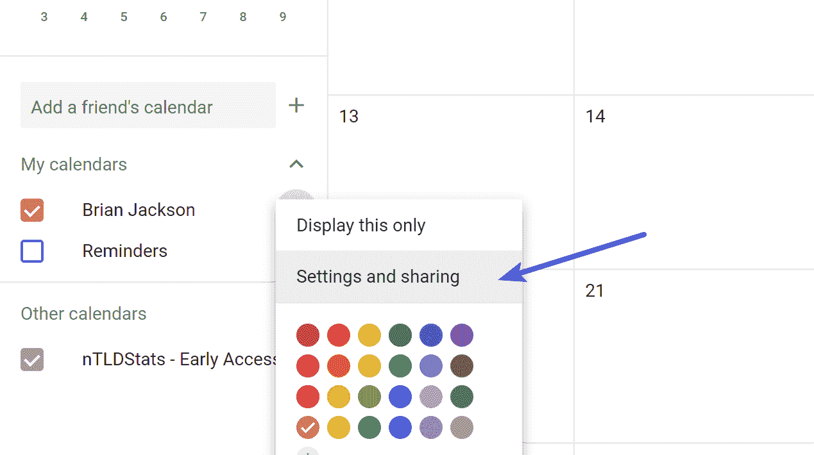
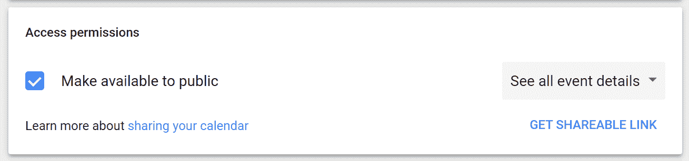
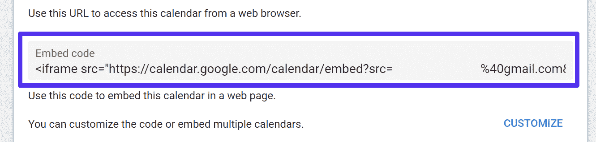
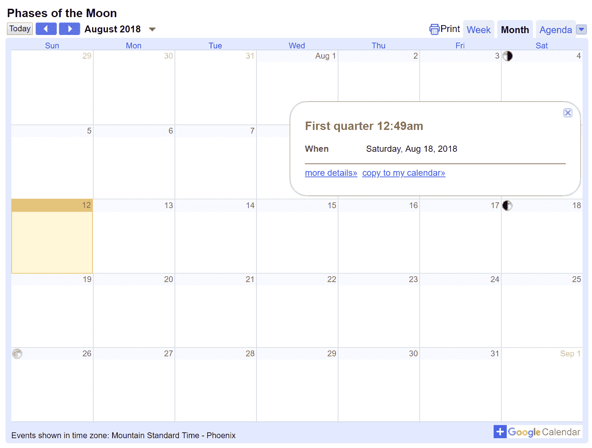
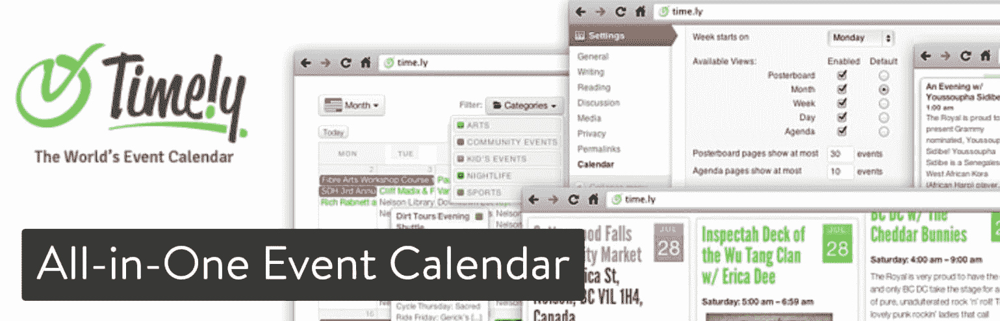
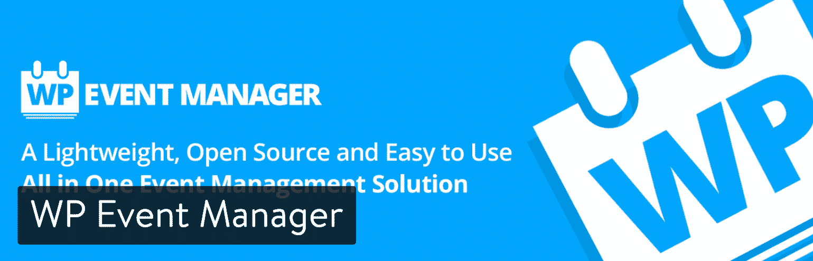
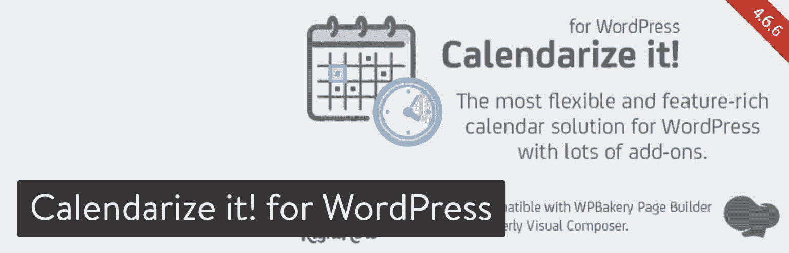
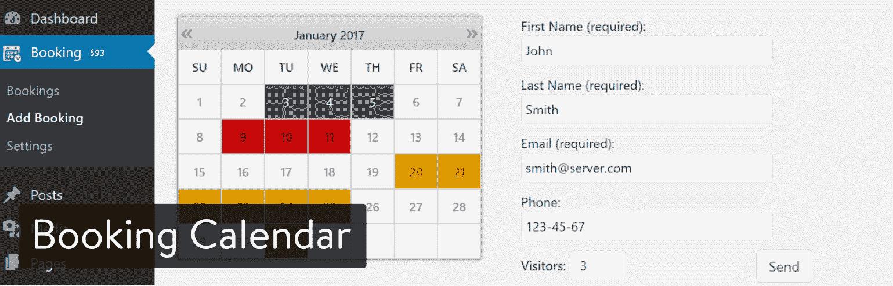
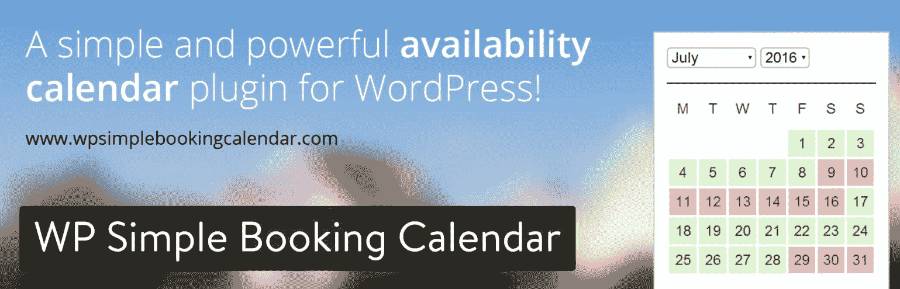
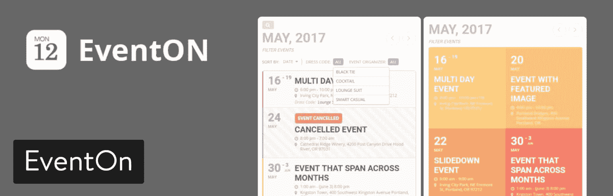

# 为你的网站找到理想的 WordPress 日历插件

> 原文：<https://kinsta.com/blog/wordpress-calendar-plugin/>

营销公司、医生办公室、网页设计公司和当地的麦当劳每天都在使用日历。一些日历仍然是纸制的，但在网上分享这些日历变得越来越普遍。为此，通常需要一个 WordPress 日历插件。幸运的是，WordPress 有许多插件可供选择。这就是我们喜欢它的原因！😁

并不是所有的 WordPress 日历工具都是一样的，它们中的许多都有你可能会使用或不会使用的功能。

例如，医生或律师希望有一个实时更新的预约日历，患者和客户可以选择查看什么时间有空并进行预约。

另一方面，本地棒球队可能只需要一个与谷歌日历同步的解决方案，其中日期和时间不是交互式的，它提供了更多的只读情况。

由于日历对于保持工作效率和按时参加会议和约会非常重要，我们想**找出最适合你个人需求的 WordPress 日历插件**。

因此，下面的一些选项简单且易于实现，而其他选项则作为更高级的预订系统。

## 也许你所需要的只是嵌入一个谷歌日历

无论是免费的还是常用的，谷歌日历都是在线日程安排工具的黄金标准。事实上，下面的许多 WordPress 日历插件都提供了对 Google 日历的支持。

但是如果你不想要日历或预订插件的所有花哨功能呢？如果你只是想显示你的[谷歌日历](https://calendar.google.com/)的精确副本，并让它与你的个人或商业账户同步，下面是如何做的。
T3】

### 第一步:打开你的谷歌日历

找到您想在网站上显示的日历。您所有的日历都位于屏幕的左侧。选择三点图标以显示选项列表。点击名为“设置和共享”的按钮。

> 需要在这里大声喊出来。Kinsta 太神奇了，我用它做我的个人网站。支持是迅速和杰出的，他们的服务器是 WordPress 最快的。
> 
> <footer class="wp-block-kinsta-client-quote__footer">
> 
> 
> 
> <cite class="wp-block-kinsta-client-quote__cite">Phillip Stemann</cite></footer>

[View plans](https://kinsta.com/plans/)

Google calendar settings and sharing

### 第二步:确保日历是公开的

私人日历不会在您的网站上向任何人显示。因此，滚动到“访问权限”部分，确保“可供公众使用”复选框已被选中。

Make Google calendar public

您还可以更改公众可以看到的内容:

*   仅查看忙/闲信息(隐藏详细信息)
*   查看所有活动详情

### 步骤 3:获取嵌入代码

在同一个设置页面上，进一步向下滚动到集成日历部分。你会看到一个嵌入代码，你可以复制它。还有一些工具可以在复制之前定制代码。

Google calendar embed

### 步骤 4:嵌入并显示谷歌日历

复制嵌入代码后，打开你的 WordPress 仪表盘。转到帖子>添加新内容(或一个[小部件](https://kinsta.com/blog/wordpress-widgets/)或页面——在您想要显示日历的任何地方)。打开文本编辑器(非可视)，然后粘贴嵌入代码。在预览或发布之后，你应该会在你的网站前端看到一个几乎一模一样的谷歌日历的复制品。

Google 日历嵌入 WordPress 网站

## 在 2022 年找到理想的 WordPress 日历插件

如果你想要更高级的设计工具，以及预订、预约和[重复事件](https://kinsta.com/blog/wordpress-events-plugin/)的选项，插件是你最好的选择。下面是我们最喜欢的 WordPress 日历插件列表。用它来快速浏览每个建议。

1.  [赛事日历](#the-events-calendar-plugin)
2.  [一体化活动日历](#all-in-one-event-calendar-plugin)
3.  [WP 事件管理器](#wp-event-manager)
4.  将它日历化！对于 WordPress
5.  [我的日历](#my-calendar-plugin)
6.  [预约日历](#booking-calendar-plugin)
7.  [活动管理器](#events-manager-plugin)
8.  [WP 简单预约日历](#wp-simple-booking-calendar-plugin)
9.  [简单日历–谷歌日历插件](#simple-calendar-plugin)
10.  [EventOn](#eventon-plugin)
11.  [现代事件日历](#modern-events-calendar)

下面是插件列表，包括每个插件的推荐、比较和特性。这样，你就可以更容易地选择合适的日历插件，而不必亲自测试每一个插件。

### 1.活动日历

活动日历插件在免费版本中提供了许多令人印象深刻的功能，此外还可以在一个网站上以 89 美元的价格升级。 [Pro Events 日历插件](https://theeventscalendar.com/product/wordpress-events-calendar-pro/)包括重复事件的选项和各种地图视图(如带有地图、照片和场地的[)。付费版本还提供自定义事件属性和基于位置的搜索，这对于拥有多个位置的公司来说可能会很方便。](https://kinsta.com/blog/wordpress-map-plugin/)

请记住，普通的博客或小企业应该可以用免费版运行一个成功的日历，但 89 美元的起价也不算太低。此外，如果您需要活动门票、社区活动或类似过滤栏的功能，您可以[选择附加组件](https://theeventscalendar.com/products/804/)。

The Events Calendar WordPress plugin

免费版也很受欢迎，它有一个简单的界面来创建活动和保存像场地和组织者这样的东西。有多种视图可用，并且有一个与谷歌地图配对的基本事件搜索。关于活动日历插件的好消息是它经常更新，你可以在论坛区找到快速支持。插件页面上也列出了当前和过去的贡献者。很明显，在插件开发的背后，他们有一个坚实的团队。

#### 考虑这个 WordPress 日历插件的理由

*   这个免费插件提供了大多数网站所需的基本工具。我无法想象跳到高级版本，除非你在寻找更高级的东西，如 Eventbrite 集成或重复事件。
*   该插件提供了一个小部件，用于列出所有即将发生的事件。
*   该插件与谷歌日历和 iCal 集成，用于与您的企业或个人帐户同步。然而，如果你想从 Google 日历导入事件到事件日历，你需要他们的高级[事件聚合器插件](https://theeventscalendar.com/product/event-aggregator/)。
*   前端界面因为 AJAX 开发超级流畅。在浏览测试日历时，我没有注意到任何故障或奇怪的跳跃。
*   Events Calendar 插件集成了 Eventbrite，您可以通过这个流行的平台轻松销售您的活动门票，并将其链接到您自己的日历。
*   它已经被国际化和翻译，所以几乎每个人都可以在世界各地使用它。

### 2.一体化活动日历

一体式活动日历是一个理想的 WordPress 日历插件，因为它的时尚设计，以及它完全免费的基础系统。有几个附加组件可用于添加额外的功能，但这意味着你只需要选择你需要的。

您最终可能需要支付的一些附加服务包括:

*   前端提交
*   票
*   CSV 导入
*   维纳斯
*   Twitter 整合
*   扩展视图
*   优先支持

附加软件的价格各不相同，但你不必为一个附加软件每年支付超过 59 美元，或为一个附加软件包每年支付超过 99 美元。

All-in-One Event Calendar WordPress plugin

我们非常喜欢一体化活动日历的主要功能是导入/导出工具。它可以很好地与大多数流行的日历系统相结合，所以如果你想与 iCal 或谷歌日历集成，你应该不会有任何问题。很高兴看到免费版提供了一些典型的高级功能。例如，您可以设置重复事件，而无需支付一分钱。还有一个漂亮的过滤系统，供用户筛选类别或标签。

#### 考虑这个 WordPress 日历插件的理由

*   免费版本结合额外收费，对大多数用户来说成本很低。
*   它允许你在免费版本中嵌入谷歌地图。
*   您还可以免费获得重复发生的事件，这通常不是本文中的竞争对手的情况。
*   将您的日历共享到 Google Calendar 等地方，或者从 Google Calendar 将信息添加到您的网站日历中。
*   该插件带有一个内嵌的日历编辑器，可以改变颜色和样式。
*   这个插件也被翻译成多种语言。

### 3.WP 事件管理器

WP 事件管理器是一个更简单的轻量级 WordPress 事件管理插件。它很受欢迎，有很好的评论，甚至更好的客户支持。我们甚至注意到用户对开发者支持免费版本的插件赞不绝口。

他们有一个价格为 39 美元的[高级日历插件](https://wp-eventmanager.com/product/wp-event-manager-calendar/)，它允许你在你的网站上显示一个列出未来活动的活动日历。这确实是一个非常快速和简单的方式来显示您的所有活动的日期。

WP Event Manager WordPress plugin

#### 考虑这个 WordPress 日历插件的理由

*   能够显示即将到来的事件，单一日期的事件，和一个小工具日历。
*   活动日历的布局太棒了。
*   该日历具有悬停/鼠标事件，显示带有事件详细信息的小弹出窗口。然后，访问者可以单击一个链接来了解有关该活动的更多信息。
*   日历小部件已经被优化，在 WordPress 工具条上看起来很棒。

### 4.把它日历化！对于 WordPress

虽然[把它日历化！因为 WordPress](https://codecanyon.net/item/calendarize-it-for-wordpress/2568439) 没有免费版本，25 美元的价格标签没什么好担心的，而且这个插件还打包了一些灵活的工具，可以在你的网站上显示日历。这个 WordPress 日历插件的一个有趣的优点是它与 WPBakery Page Builder(以前的 Visual Composer)的兼容性。这种组合减轻了设计日历的痛苦，因为这一切都是通过方便的拖放编辑器完成的。你不需要页面生成器，但它确实让设计过程变得更好。

Calendarize it! for WordPress plugin

也就是说，你还可以添加几个免费的插件来增强你的在线日历，并为活动倒计时、即将到来的活动和社区活动提供功能。甚至还有一些付费和广告选项的附加服务。然而，我可以看到两个特别的附加服务被利用的最多:WooCommerce 附加服务的活动门票和 Eventbrite 门票。

#### 考虑这个 WordPress 日历插件的理由

*   用日历把它记录下来！带有 WPBakery 页面生成器插件的插件，提供终极拖放体验。
*   成本保持相当低的日历它！，因为你只需支付 25 美元就可以获得完整的插件，而且大多数插件都是免费的。
*   您可以选择将日历添加到 [WooCommerce](https://kinsta.com/blog/woocommerce-tutorial/) 或与 Eventbrite 集成。
*   在所有活动列表中创建自定义按钮。
*   您可以添加一个计数器来为所有事件创建紧急状态。
*   整个日历是高度可定制的，具有特色图像、颜色选项、分类过滤器，甚至是有趣的降临节日历模式。

### 5.我的日历

如果你正在寻找一个允许在一个网站上有多个日历或者支持 [WordPress multisite](https://kinsta.com/wordpress-multisite-hosting/) 、 [My Calendar](https://wordpress.org/plugins/my-calendar/) 的免费插件，应该可以做到。它有能力在一个网站上显示几个日历，日历可以按类别、作者、地点或简单地通过显示即将到来的事件列表来显示。

## 注册订阅时事通讯

### 想知道我们是怎么让流量增长超过 1000%的吗？

加入 20，000 多名获得我们每周时事通讯和内部消息的人的行列吧！

[Subscribe Now](#newsletter)

该插件有网格和列表视图，以及每月、每周和每天的视图。当你需要在工具条中加入日历时，你会得到一些迷你日历(以小部件和短代码的形式)。总的来说，免费版本的特性相当标准，最大的例外是多站点支持。

My Calendar WordPress plugin

如果你选择 [My Calendar Pro](https://www.joedolson.com/awesome/my-calendar-pro/) ，你可以支付 49 美元购买一年的许可证，也可以支付 149 美元购买终身许可证。对于额外的功能，两者看起来都很合理。例如，您可以激活公开提交的事件，让用户创建并向日历提交他们自己的事件。除了大量其他高级功能，My Calendar Pro 版本还支持在线支付、离线支付、门票销售等。

#### 考虑这个 WordPress 日历插件的理由

*   我的日历的免费版本为 WordPress multisite 和那些想要在他们的网站上放置几个不同日历的人(基于某些类别和其他指标)提供支持。
*   这个高级插件拥有终身会员资格，因为它的价格实惠，所以对代理公司和网页设计师来说非常好用。
*   你会收到几个通过日历赚钱的选择。您可以出售门票，收取活动提交的在线付款，以及收取离线付款。
*   为想要购买活动门票或向日历提交活动的用户提供会员折扣。
*   后端界面简单明了，而前端日历对于大多数网站来说看起来足够干净。它还为较小的日历提供了小部件和短代码，这也很好。

### 6.预订日历

我们已经讨论过的一些 WordPress 日历插件支持支付和门票，但它们通常以附加组件或高级功能的形式出现。另一方面，[预订日历](https://wordpress.org/plugins/booking/)是专门为显示日历而制作的，用户可以在日历中进行交互和预订。例如，机械师、律师、发型师或医生可以从管理约会的日历中受益。

该插件有一个直观的界面和灵活的功能，您的用户可以选择检查服务或财产的可用性(如酒店房间)。然后他们可以直接从日历上预订。

Booking Calendar WordPress plugin

通知电子邮件发送给管理员和试图预订的人。

令人难以置信的是，这个 WordPress 日历插件中包含了如此多的功能，这可以在官方插件网站上看到。[的定价结构](https://abookin.com/plugins/booking-calendar/#wpbc)绝对荒谬，但至少它给了你一些灵活性。更不用说，在一个网站上，你只需支付大约 60 美元就可以获得个人许可证。

多站点版本是最贵的，所以请确保您确实需要所有这些预订功能，因为 My Calendar 多站点功能是完全免费的。

#### 考虑这个 WordPress 日历插件的理由

*   免费版提供了一个友好的预订界面，有一个响应迅速的前端和后端。
*   免费版也有一些很棒的内置功能，比如自动电子邮件通知、小工具、搜索栏，以及让用户查看过去预订的功能。
*   您可以从某些文件中导入 Google 日历事件和其他事件。
*   在整篇文章中，该插件的更高级版本为预订和日历插件提供了一些最强大的功能。它变得更像一个套件，所以你会花钱，但你可以编辑大部分元素，并为你的企业打造完美的品牌。
*   其中一个高级插件支持几个在线支付网关，因此可以收款。
*   预订日历有一个针对多用户和多站点支持的定价级别。

### 7.事件管理器

[事件管理器](https://wordpress.org/plugins/events-manager/)是一个备受推崇的 WordPress 日历插件，带有事件注册工具，以及一整套其他灵活的特性。主要功能包括单日和多日活动注册选项，以及重复活动。预订管理允许您批准和拒绝某些提交，多站点支持允许您在整个网络中共享日历。除此之外，事件管理器插件还支持 BuddyPress，让你的事件变成一个社交网络(有点像 Meetup)。

Events Manager WordPress plugin

Pro 附加软件一个站点的起价为 75 美元，五个站点的起价为 150 美元。这可以让你获得一年的支持和更新，但是从技术上来说，这个插件再也不需要付费了。支付额外费用后，您还可以访问所有额外费用和专业支持论坛。

至于活动管理器插件的整体价值，很难反驳免费的多站点和重复活动。在高级版中，您可能只需要支付网关、定制预订表单和优惠券代码。

#### 考虑这个 WordPress 日历插件的理由

*   大多数情况下，您必须为重复发生的事件付费，但不是使用事件管理器。
*   活动管理器的免费版本还支持多站点功能。预订日历插件(上面提到的插件)为此收取相当多的费用。
*   如果你想为高级插件付费，你仍然可以选择收取费用和创建优惠券代码。
*   BuddyPress 支持是 events calendar 插件独有的，在这里你可以围绕你的 Events Calendar 创建一个社区。例如，教堂、学校或运动队可以从 BuddyPress 的个人资料和消息工具中受益，同时还拥有预订模块和日历。

### 8.WP 简单预订日历

[WP 简单预订日历](https://wordpress.org/plugins/wp-simple-booking-calendar/)向客户展示您在几个月内的可用性。这是一个独特的设计，因为客户不必滚动月份或点击特定日期来查看可用的内容。我真的很喜欢这个界面，它适用于任何需要组织和接受在线预约的公司或个人，因为它对客户来说是更好的界面之一。

Struggling with downtime and WordPress problems? Kinsta is the hosting solution designed to save you time! [Check out our features](https://kinsta.com/features/)

高级版只需 29 美元，而且无需支付订阅费或年度支持费。这是迄今为止最好的一个高级 WordPress 日历插件。在 premium 系统中，您可以看到显示多个月的功能，并且您还可以根据需要创建任意多的日历。您还可以自定义图例，并根据客户需求隐藏/显示预订历史。

WP Simple Booking Calendar plugin

免费版本有点淡化，但界面流畅，对于那些想要简单预订模块的人来说很棒。然后，您可以注册高级模块，因为它非常实惠。

至于免费插件，下面是你可以期待的:

*   创建一个预订日历。
*   语言翻译文件。
*   显示您的可用性的功能。
*   一个美妙的用户界面。

#### 考虑这个 WordPress 日历插件的理由

*   高级版价格便宜，功能非常强大。
*   当你想要一个日历来显示你的可用性和预订选项时，这是最好的用户界面之一。
*   高级版本允许在日历上显示多个月，同时创建几个日历。
*   后端很容易理解，但是真正的流畅可以在前端看到。对于客户来说，查看可用性并四处走动非常简单。

### 9.简单日历–谷歌日历插件

我们重点描述了每个 WordPress 日历插件是否与 Google 日历或 iCal 集成，这与每个日历的受欢迎程度有关。简单日历-谷歌日历插件实际上是为谷歌日历设计的，所以如果你是谷歌日历的高级用户，你可能会发现它更适合你的需要。

Simple Calendar – Google Calendar WordPress plugin

尽管一些用户评论称客户支持很差，但你仍然应该好好享受插件的用户界面。它看起来很现代，后端有足够的工具为你自己的品牌定制。从 WordPress 插件库中下载 Simple Calendar 是免费的，但是你可以选择购买附加包。

看起来你不能单独购买任何附加组件，但是附加组件包的起价是 49 美元。这可以让你看到开发者在过去一年中制作的每一个插件，以及一个叫做 Google Calendar Pro 的插件，它可以显示公共和私人的 Google 日历，并显示事件、与会者和 RSVP 状态的信息。

#### 考虑这个 WordPress 日历插件的理由

*   如果你是 Google Calendar 的高级用户，并且想通过你自己的个人或商业账户来利用活动预订，那就太好了。
*   该插件有一个功能，可以从谷歌日历中传输颜色编码的事件。这是许多其他 WordPress 日历插件所没有的。
*   它支持公共和私人谷歌日历。
*   完全没有必要在 WordPress 中创建或管理事件。事实上，你可以让一个人管理你的网站，另一个人处理日历，不会有任何问题。

### 10.-你好

EventOn 是一个高级日历 WordPress 插件。你可以花 24 美元在 CodeCanyon 上购买，但是我们建议你在此之前去插件的网站[试用一些演示](http://demo.myeventon.com/)，看看它是否是你需要的。这个插件是一个付费的解决方案，但是博客和有预算的小企业可能不喜欢整个设置。尽管对某些品牌来说这没什么大不了的，但你可能会苦恼地发现，即使支付了额外费用，你可能还得为[附加产品](http://www.myeventon.com/addons/)买单。

EventOn WordPress plugin

也就是说，其中一些附加功能非常强大，有 RSVPs、活动照片和动态定价等选项。我还喜欢一个插件，它可以让你将用户提交给日历的内容货币化。

附加产品的价格各不相同，但你应该预计要支付大约 25 到 55 美元。这个库很大，所以这里有一些你可能感兴趣的附加组件:

*   事件倒计时
*   事件审阅者
*   每日视图，一次只显示一天
*   演讲者和活动时间表
*   事件地图
*   完整的日历视图
*   社交媒体帐户同步
*   更多的

没有附加组件，您仍然可以获得一个美丽的，简约的日历设计，具有光滑的磁贴布局，活动图像，多日活动和地图。这真的是你能找到的最强大的 WordPress 日历插件之一，而且它也有助于你包含一个活动预订区。EventOn 对预算有限的新网站所有者来说似乎没有吸引力，但对于那些需要灵活而强大的日历的人来说，它是一个完整的套件。

#### 考虑这个 WordPress 日历插件的理由

*   这是一整套日历工具和附件。你可以从几十个插件中进行选择，同时还能获得一个令人印象深刻的日历插件。
*   EventOn 提供了迄今为止我所见过的最现代的布局。它提供平铺和列表视图，两者都支持漂亮的图像和动画。
*   尽管没有免费版本，这个插件实际上并不贵(25 美元)，你很可能只需要一两个插件(如果有的话)。
*   每个活动详细信息页面都很好地整合了所有信息——图片、地图、社交按钮、详细信息和时间，全部打包到一个漂亮的弹出窗口中。

### 11.现代事件日历

现代事件日历插件有免费简装版和售价 29 美元的 T2 高级版。其功能强大且易于使用的活动管理系统提供了一个完整的在线日历，并为您提供了一个预订约会和活动的地方。

短码生成器是我们的最爱，因为你可以把你的预订日历放在你网站的任何地方。不仅如此，还有一个针对每月、每周或每年发生的事件的重复事件工具。

Modern Events Calendar WordPress plugin

这个插件以其坚实的支持论坛而闻名，在那里你可以在一天中的任何时间得到对你的问题的回复。您还会注意到插件附带了几个皮肤。因此，如果你想为你的组织创建一个日历或议程的年度视图，Modern Events Calendar 插件有相应的皮肤。总的来说，这个 WordPress 日历插件有一个非常现代的设计，先进的功能和质量支持。评分显示过去的客户是满意的，所以对于所有体验水平来说，这都是一个不错的选择。

#### 考虑这个 WordPress 日历插件的理由

*   你可以用你的 WordPress 日历插件得到一个强大的预订系统。
*   重复事件是一项主要功能。
*   现代设计是高度可定制的，但它看起来总是专业和干净。
*   它与谷歌日历集成，提供实时同步体验。iCal 日历可以导入到插件中。
*   现代活动日历已准备好用于 WordPress multisite。
*   它还与 WPBakery 页面生成器兼容，后者提供了一个拖放界面，使所有技能水平的人都可以更容易地设计日历。

## 附加日历插件

虽然上述所有插件背后都有相当多的开发历史，但这里有几个你可能想看看的附加插件:

*   [简单安排约会](https://wordpress.org/plugins/simply-schedule-appointments/)

## 完美的 WordPress 日历插件

如果你只需要一个简单的日历插件来显示事件，大多数免费的解决方案应该适合你。我们也推荐每一个预约日历作为可行的插件。然而，我们也根据你自己的情况，把它分成了最好的 WordPress 日历插件:

*   **初学者的最佳 WordPress 日历-**将它日历化！或 WP 事件管理器
*   **最超值—**一体化活动日历
*   **最具特色的日历——**活动日历
*   **最佳预约日历—**WP 简易预约日历
*   **最佳多站点日历****–**我的日历
*   **最美的 WordPress 日历插件****–**event on

关于更多的预订插件，请查看我们的另一篇帖子:[让你的业务完全自动化的最佳预订插件](https://kinsta.com/blog/wordpress-booking-plugins/)。

这就是你需要知道的关于 WordPress 日历插件的一切！如果你有任何问题或者想谈谈你使用这些插件的经历，请在下面的部分分享你的评论。

* * *

让你所有的[应用程序](https://kinsta.com/application-hosting/)、[数据库](https://kinsta.com/database-hosting/)和 [WordPress 网站](https://kinsta.com/wordpress-hosting/)在线并在一个屋檐下。我们功能丰富的高性能云平台包括:

*   在 MyKinsta 仪表盘中轻松设置和管理
*   24/7 专家支持
*   最好的谷歌云平台硬件和网络，由 Kubernetes 提供最大的可扩展性
*   面向速度和安全性的企业级 Cloudflare 集成
*   全球受众覆盖全球多达 35 个数据中心和 275 多个 pop

在第一个月使用托管的[应用程序或托管](https://kinsta.com/application-hosting/)的[数据库，您可以享受 20 美元的优惠，亲自测试一下。探索我们的](https://kinsta.com/database-hosting/)[计划](https://kinsta.com/plans/)或[与销售人员交谈](https://kinsta.com/contact-us/)以找到最适合您的方式。