# 如何使用验证码来阻止机器人和垃圾邮件发送者进入你的 WordPress 网站

> 原文：<https://kinsta.com/blog/wordpress-captcha/>

毫无疑问，WordPress 的安全性很重要。毕竟，违规会给你的网站带来严重的损害。然而，随着黑客使用机器人快速有效地攻击网站，你可能会觉得胜算不大。

幸运的是，有一个非常简单的工具可以让你的 WordPress 站点远离僵尸工具和垃圾邮件发送者。加入一个完全自动化的图灵测试来区分计算机和人类(验证码)是一个简单、省力的提高网站安全性的方法。

本指南将向您介绍验证码，以及它们如何在保护您的网站免受黑客和垃圾邮件攻击方面发挥作用。然后我们将带你浏览如何将它们添加到你的网站，并介绍一些最好的 WordPress CAPTCHA 插件。

我们开始吧！

## 了解验证码

你可能在网上见过很多次验证码。它们可以有多种形式，其中最常见的是你必须破译的扭曲的文本。其他要求您从一组低分辨率照片中选择符合特定规格的图像:

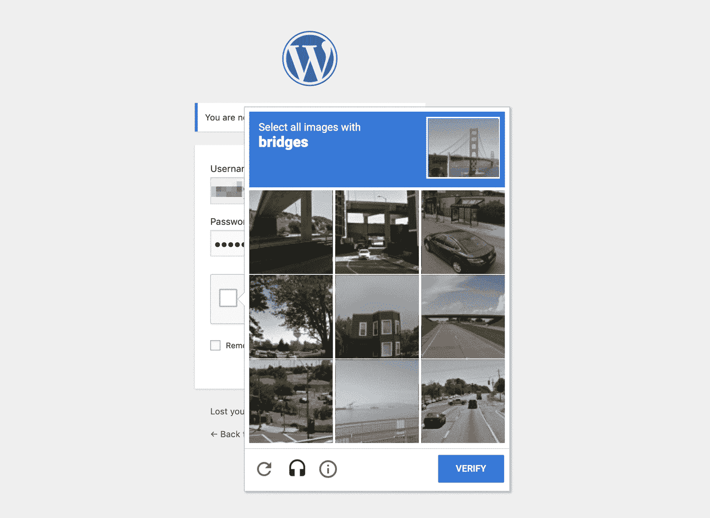

Example of an image CAPTCHA

在所有情况下，提出的挑战是大多数人应该能够轻松完成的。然而，即使是今天先进的机器人也无法理解扭曲的文字或图像片段。当他们无法完成测试时，他们将被阻止访问你的网站(或验证码保护的任何其他内容)。

这一点很重要，因为机器人被用在多种情况下，可能会危及你的网站的安全性和可信度。暴力攻击是最常见的黑客策略之一，它使用机器人[在你的登录表单中反复输入凭证](https://kinsta.com/blog/wp-admin-login/),直到它们能够访问你的网站。

跨站脚本(XSS)是另一种类型的网络攻击，其中[黑客通过一种形式将恶意代码](https://kinsta.com/blog/wordpress-hacked/)注入你的站点，比如你的[登录页面](https://kinsta.com/blog/wordpress-login-url/)或评论区。这可能导致恶意软件存储在您的网站上，信息被盗，以及其他负面结果。

机器人还可以用来在你的评论区发送低质量的链接，伤害你的 T2 搜索引擎优化，阻止合法用户。垃圾邮件令人讨厌，但更重要的是，它让你的网站看起来保护不足，监控不力。

用户可以输入信息的网站上的任何地方——换句话说，任何形式——都容易受到僵尸程序的攻击。提交表单前要求验证码可以防止非人类成功访问您的网站或向其中注入恶意代码。

## Google reCAPTCHA 是什么？

虽然验证码显然为你的网站提供了各种各样的好处和保护，但它们也有一些缺点。例如，它们往往会对用户体验产生负面影响(UX)。通过让用户慢下来，这些简单的测试会阻碍访问者顺利快速地完成他们在你的网站上的目标。

此外，有视觉障碍或其他挑战如阅读障碍的用户可能会发现完成验证码很困难。无意中将人类用户排除在你的网站之外对你或他们都没有好处，即使它在这个过程中使机器人偏离了方向。

2014 年，谷歌发布了其 [No CAPTCHA reCAPTCHA](https://www.google.com/recaptcha/intro/v3.html) ，这是自 2007 年以来一直使用的扭曲单词和图像测试的继任者。新系统只需要用户选择“我不是机器人”旁边的复选框来确认他们的合法性:

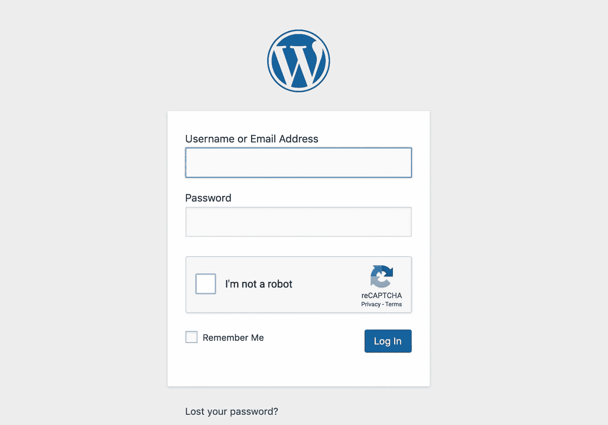

Google reCAPTCHA checkbox on the WordPress Login page

这比更传统的验证码更容易和更快，并且可以被更广泛的用户使用。更重要的是，谷歌一直在不断改进这项技术。2018 年，它还发布了被称为“[隐形验证码](https://webmasters.googleblog.com/2018/10/introducing-recaptcha-v3-new-way-to.html)”的东西，它可以检测机器人，而不需要用户采取任何故意的行动。

当添加验证码到你的 WordPress 站点时，你将有机会选择使用什么类型的测试。然而，请记住，实现 Google reCAPTCHA v2 或 v3 应该有助于使您的网站更令人愉快，更易于用户访问。

## 如何添加验证码到你的 WordPress 站点(3 步)

说到 WordPress 的安全性，添加一个验证码是让机器人更难渗透到你的网站的最简单的方法之一。幸运的是，合并一个也很容易。只需三个简单的步骤，您就可以设置好自己的电脑。

### 步骤 1:安装并激活一个 WordPress 验证码插件

向你的 WordPress 站点添加验证码最简单的方法是使用插件。在 [WordPress 插件目录](https://wordpress.org/plugins/)中有许多高质量的选项，所以你不应该为了给你的网站增加安全性而倾家荡产。

然而，在选择插件之前，有几个关键特性需要考虑。

首先，你需要考虑插件提供的验证码类型。正如我们上面所讨论的，Google reCAPTCHA 比要求访问者点击图片或解码扭曲的文本更加用户友好。

此外，你要确保你的插件可以在你网站的几个区域添加验证码，而不仅仅是你的登录页面。我们将在步骤 3 中更详细地探讨这个想法。现在，请记住[在你的网站](https://kinsta.com/blog/wordpress-forms/)上任何有表单的地方，你都可能想要用验证码来阻止机器人。

我们来看三个符合上述标准的插件。[best websoft](https://wordpress.org/plugins/google-captcha/)的 Google Captcha (reCAPTCHA)是最受欢迎的选项，有超过 200，000 个活跃安装:

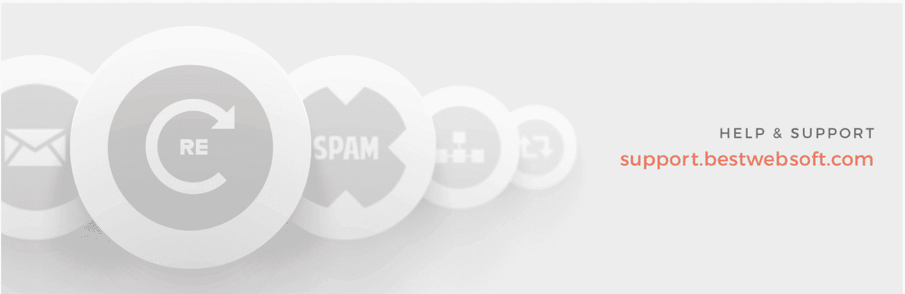

The Google Captcha plugin

顾名思义，这个插件在你的登录和注册页面、密码重置和联系表单上，甚至在你网站的评论和推荐提交中加入了一个 v2 或 v3 的 Google reCAPTCHA。除了提高安全性之外，这还有助于防止垃圾邮件。

[Advanced noCaptcha &隐形验证码](https://wordpress.org/plugins/advanced-nocaptcha-recaptcha/)也有很高的评价，包括许多相同的功能:

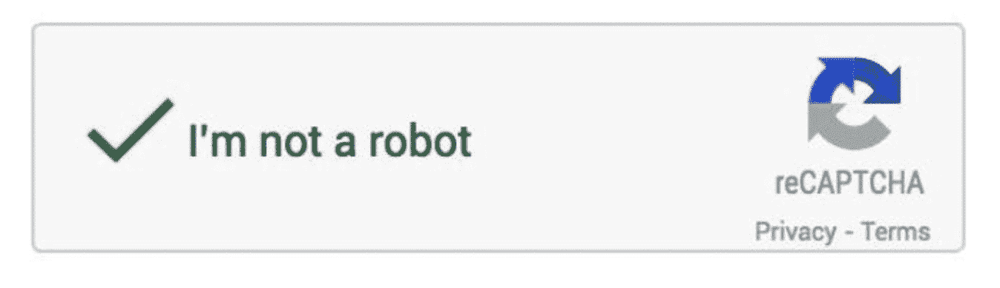

The Advanced noCaptcha plugin

该插件还提供了[多站点兼容性](https://kinsta.com/blog/wordpress-multisite/)，并集成了流行的会员工具，如 [bbPress](https://kinsta.com/blog/wordpress-forum-plugins/#bbpress) 和 [BuddyPress](https://kinsta.com/blog/wordpress-forum-plugins/#buddypress) 。此外，如果需要，您可以在一个页面上添加多个验证码。

最后，您可能还想考虑[登录 No CAPTCHA reCAPTCHA](https://wordpress.org/plugins/login-recaptcha/) :

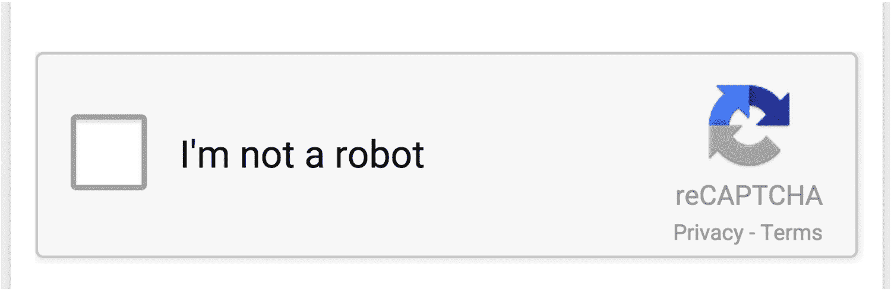

The Login No CAPTCHA reCAPTCHA plugin

这个插件包括简单的 Google reCAPTCHA，可以用于登录、注册和忘记密码的表单。然而，它没有与你的评论区或联系表单集成，这使得它比我们之前看到的其他两个插件更有限。

### 第二步:创建你的谷歌 reCAPTCHA 并添加到你的网站

一旦[安装并激活了插件](https://kinsta.com/knowledgebase/how-to-install-wordpress-plugins/)，你将需要创建你的 Google reCAPTCHA(假设你已经选择了一个使用它的插件)。前往 [Google reCAPTCHA 管理控制台](https://www.google.com/recaptcha/admin/create)，填写注册表:

## 注册订阅时事通讯

### 想知道我们是怎么让流量增长超过 1000%的吗？

加入 20，000 多名获得我们每周时事通讯和内部消息的人的行列吧！

[Subscribe Now](#newsletter)

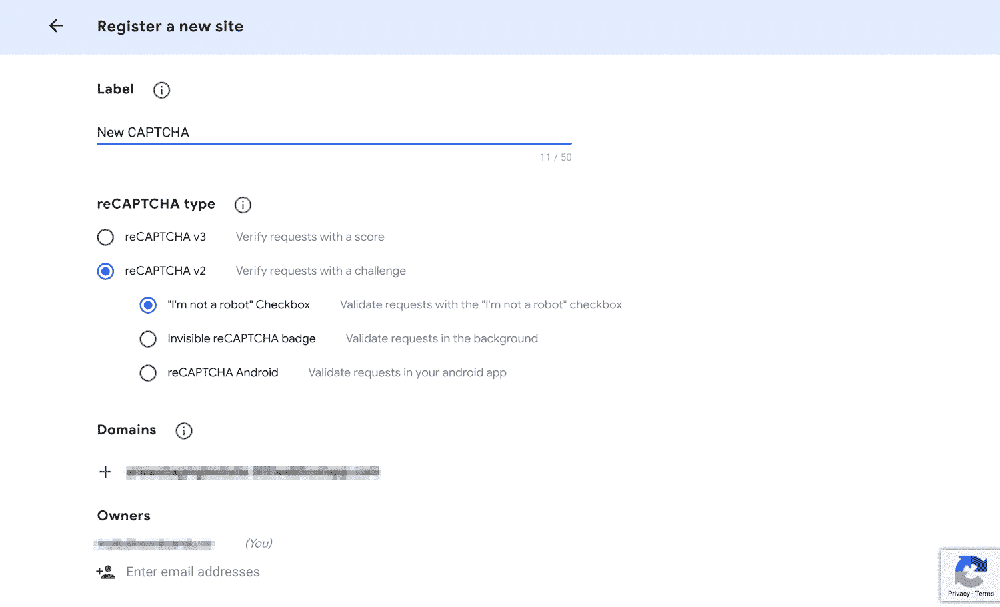

The reCAPTCHA registration page

请注意，您将能够[在 v2 或 v3](https://community.gravityforms.com/t/invisible-recaptcha-v2-vs-recaptcha-v3/1334) reCAPTCHA 之间进行选择，并且您可以使用复选框或不可见的测试。后者将提供最好的 UX，因为它不需要用户方面的任何操作。然而，v2 复选框往往更可靠。

填写完所有字段后，点击**提交**按钮。在下一个屏幕上，你会得到一个**站点密钥**和一个**秘密密钥**:

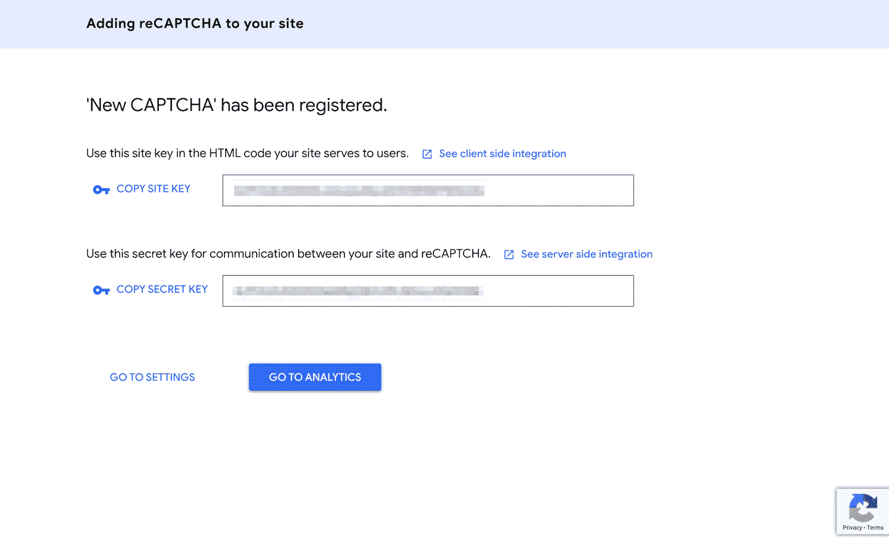

Acquiring the Site and Secret Keys for a new Google reCAPTCHA

你需要在你的 WordPress 网站上输入验证码插件的设置。这个过程可能略有不同，这取决于您选择的插件。但是，您应该能够很容易地在仪表板边栏中找到设置，并将您的密钥粘贴到相关字段中:

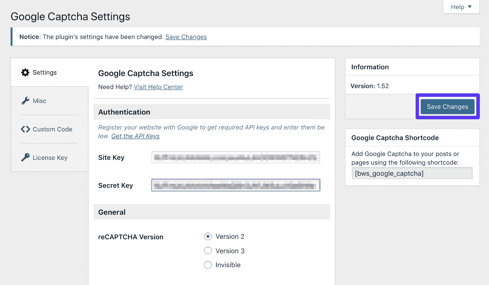

Adding the Google reCAPTCHA keys to the Google Captcha plugin settings

不要忘记保存您的更改。您可能还想将您的 Google reCAPTCHA 管理控制台页面加入书签，并定期查看。当有足够数量的实时流量访问您的网站后，您将能够[查看与表单提交请求相关的有价值的分析](https://developers.google.com/recaptcha/docs/analytics)。

### 步骤 3:配置您的设置以保护关键区域

正如我们前面提到的，为了给你的网站提供最大程度的保护，有几个地方非常适合放入你的验证码。一旦你安装了你选择的插件，你可以配置你的设置，以确保所有重要的网页都包括在内。

谷歌验证码和高级无验证码都在常规设置中包含复选框列表。在那里，您可以选择要在哪里使用 reCAPTCHAs:

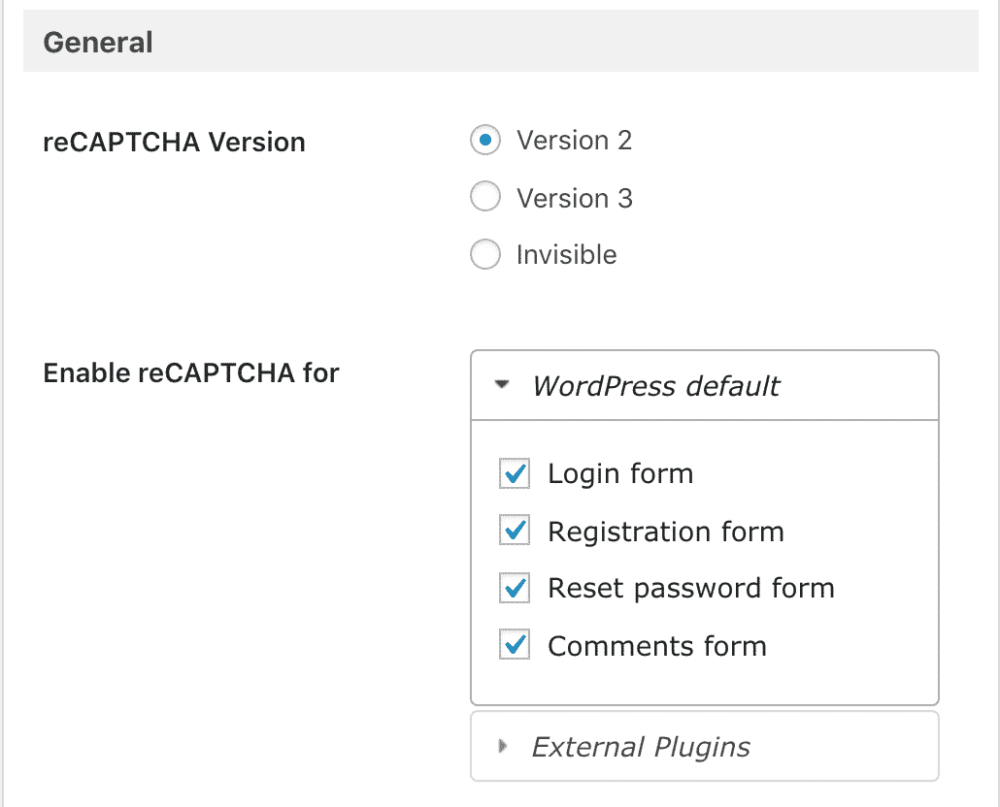

Choosing the locations where Google reCAPTCHA will appear

理想情况下，这将包括您网站上的任何表单，包括易受攻击的区域，例如:

*   WordPress 管理登录页面
*   WooCommerce 登录页面
*   [用户登记表](https://kinsta.com/blog/wordpress-user-registration-plugins/)
*   密码恢复表单
*   联系方式

您的网站可能包括其他独特的形式，如用户生成的内容提交、调查或电子邮件注册。在这种情况下，你可能想使用高级的 noCaptcha &隐形验证码，因为这个插件提供了[动作钩子](https://kinsta.com/blog/wordpress-hooks/#hooking-an-action)来合并任何形式的 Google reCAPTCHA。

与宕机和 WordPress 问题做斗争？Kinsta 是一款考虑到性能和安全性的托管解决方案！[查看我们的计划](https://kinsta.com/plans/?in-article-cta)

或者，你可以投资[谷歌验证码(reCAPTCHA) Pro](https://bestwebsoft.com/products/wordpress/plugins/google-captcha/) 来代替。它提供了与流行的[插件的额外集成，如 Jetpack](https://kinsta.com/knowledgebase/wordpress-jetpack/) 、WordPress 的[MailChimp](https://wordpress.org/plugins/mailchimp-for-wp/)和几个[表单生成器](https://kinsta.com/blog/wordpress-contact-form-plugins/)。
T9】

### 向您的登录页面添加验证码

您的登录页面是暴力和跨站脚本(XSS)攻击的主要目标。

要使用谷歌验证码插件添加验证码，在 WordPress 中导航到**谷歌验证码>设置>常规>启用**的验证码，并选择**下的**登录表单**WordPress 默认**:

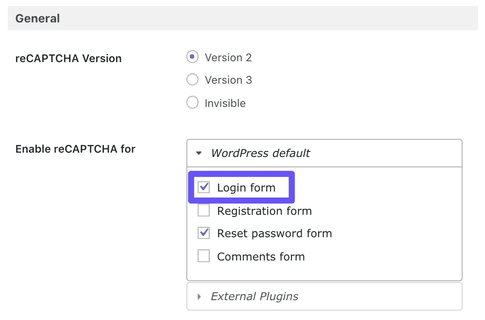

The Login form option the Google Captcha plugin

您的登录页面现在应该受到保护。

### 在您的密码重置页面中加入验证码

当黑客尝试登录您的网站失败时，他们可能会被定向到一个用户可以重置密码的页面。要添加验证码来保护这个页面，在你的 [WordPress 仪表盘](https://kinsta.com/knowledgebase/wordpress-admin/)中导航到**谷歌验证码>设置>常规>启用**的验证码:

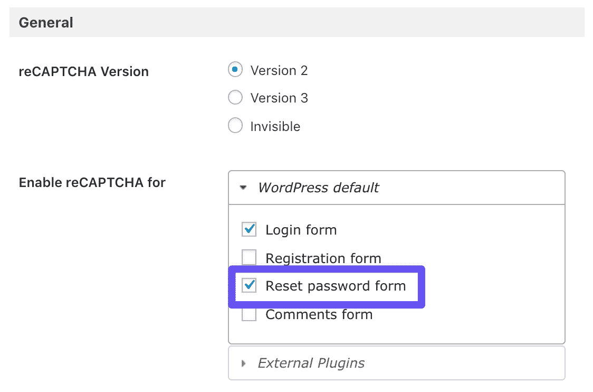

The Rest password form option in the Google Captcha plugin

然后，从**默认**列表中选择**重置密码表单**。

### 用验证码保护你的 WooCommerce 登录页面

你的 WooCommerce 登录页面和你的核心 WordPress 页面一样容易受到恶意攻击。为了用谷歌验证码保护它，你需要插件的**高级版本**(下面黄色部分)。当你准备好了，在你的 WordPress 仪表盘中前往**谷歌验证码>设置>常规>启用**的 reCAPTCHA:

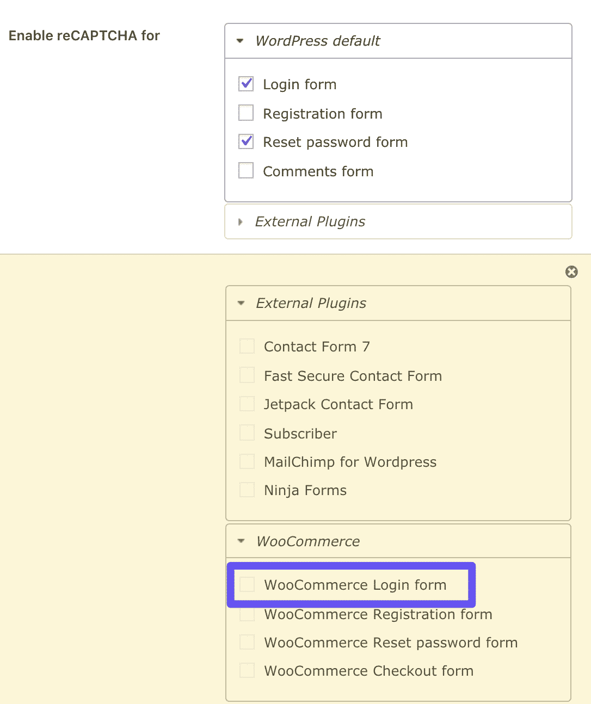

The (premium) WooCommerce Login form option

在这里，你可以从**外部插件**列表中选择 **WooCommerce 登录表单**。

### 将验证码放在您的联系表单上

你的联系方式可以用验证码来保护，就像我们在本文中讨论的其他方式一样。但是，有几个不同的联系人表单插件可以与 Google CAPTCHA 集成，包括:

*   [联系方式 7](https://kinsta.com/blog/contact-form-7/)
*   [喷气背包联系表](https://kinsta.com/blog/wordpress-contact-form-plugins/#jetpack)
*   [忍者形态](https://kinsta.com/blog/wordpress-contact-form-plugins/#ninja-forms)

您需要在您的网站上激活上述工具之一，以便将验证码添加到您的联系人表单中。然后进入**谷歌验证码>设置>常规>启用**的 reCAPTCHA，点击你喜欢的插件的复选框:

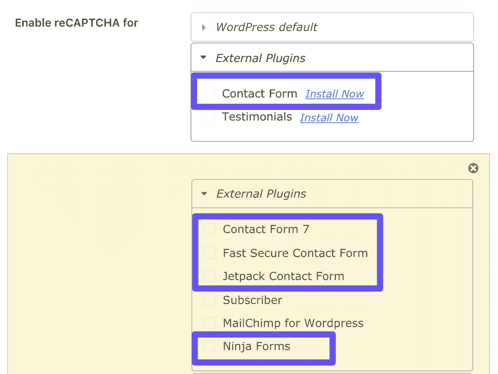

The free and premium contact form options in the Google Captcha plugin

这将完成该过程。如果你的 WordPress 站点上使用了另一个联系人表单插件，你可以考虑使用一个不同的验证码插件。也有一些表单构建器插件会自己合并验证码，比如 [WPForms](https://kinsta.com/blog/wordpress-contact-form-plugins/#wpforms) 。

[Want to keep spammers and bots off your #WordPress site? Check out how to add CAPTCHAs to all your contact and login forms! 🗝✅Click to Tweet](https://twitter.com/intent/tweet?url=https%3A%2F%2Fkinsta.com%2Fblog%2Fwordpress-captcha%2F&via=kinsta&text=Want+to+keep+spammers+and+bots+off+your+%23WordPress+site%3F+Check+out+how+to+add+CAPTCHAs+to+all+your+contact+and+login+forms%21+%F0%9F%97%9D%E2%9C%85&hashtags=spam%2Csecurity)

## 摘要

如果你想保护你的内容、你的用户和你的品牌的声誉，把恶意的机器人挡在你的网站之外是至关重要的。减慢速度的最简单的方法之一是在你的 WordPress 站点的表单中添加一个验证码。

将验证码添加到你的 WordPress 站点只需要三个步骤:

1.  安装并激活一个 WordPress 验证码插件。
2.  创建您的谷歌 reCAPTCHA，并将其添加到您的网站。
3.  配置您的设置以保护关键区域。

你对验证码或者如何在 WordPress 中使用验证码有什么问题吗？请在评论区告诉我们！

* * *

让你所有的[应用程序](https://kinsta.com/application-hosting/)、[数据库](https://kinsta.com/database-hosting/)和 [WordPress 网站](https://kinsta.com/wordpress-hosting/)在线并在一个屋檐下。我们功能丰富的高性能云平台包括:

*   在 MyKinsta 仪表盘中轻松设置和管理
*   24/7 专家支持
*   最好的谷歌云平台硬件和网络，由 Kubernetes 提供最大的可扩展性
*   面向速度和安全性的企业级 Cloudflare 集成
*   全球受众覆盖全球多达 35 个数据中心和 275 多个 pop

在第一个月使用托管的[应用程序或托管](https://kinsta.com/application-hosting/)的[数据库，您可以享受 20 美元的优惠，亲自测试一下。探索我们的](https://kinsta.com/database-hosting/)[计划](https://kinsta.com/plans/)或[与销售人员交谈](https://kinsta.com/contact-us/)以找到最适合您的方式。