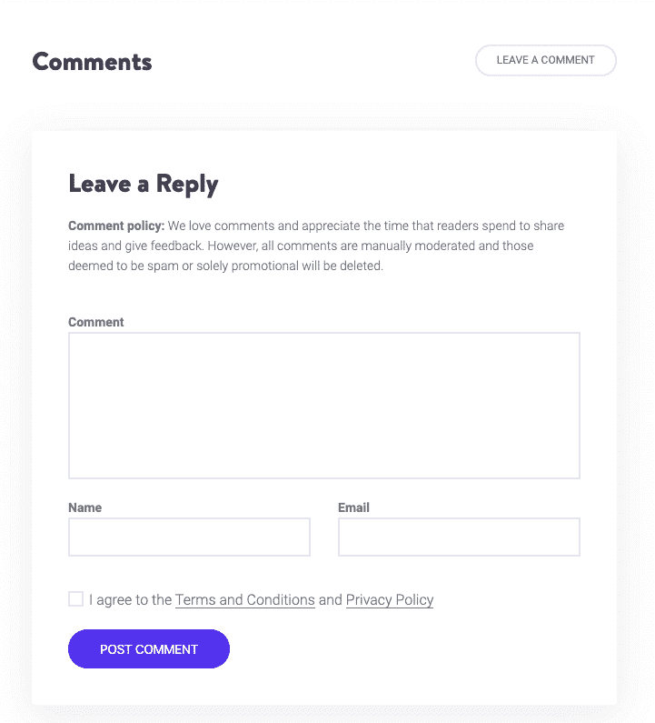
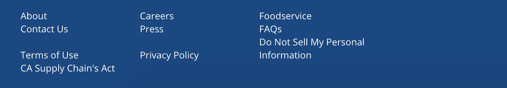
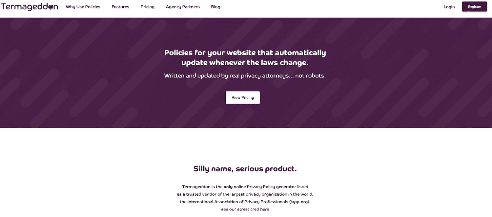
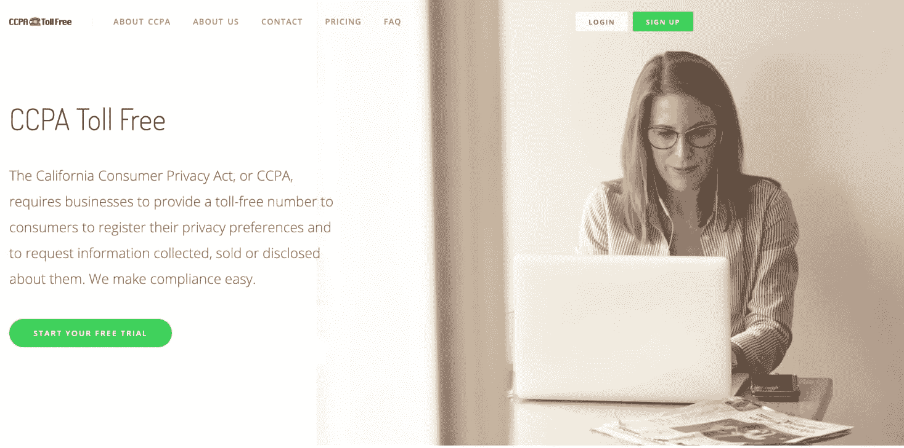
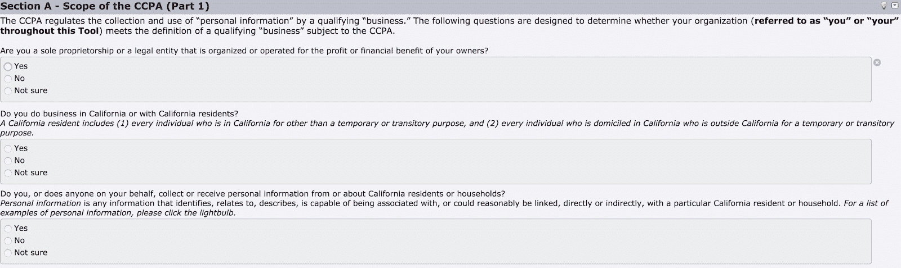
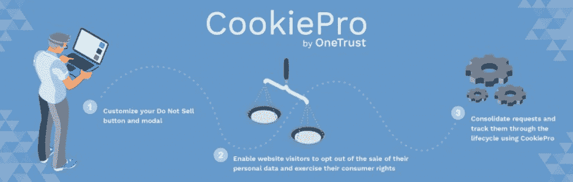
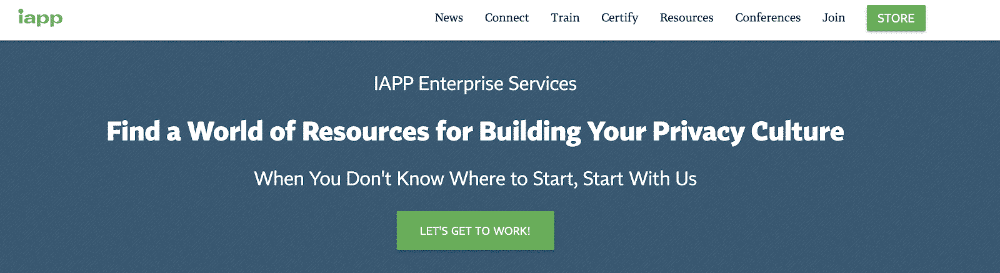

# WordPress CCPA 合规:你需要知道的一切

> 原文：<https://kinsta.com/blog/wordpress-ccpa-compliance/>

确切地说，一项新的隐私法将于 2020 年 1 月 1 日生效，每个人都在争先恐后地遵守这项法律。听起来熟悉吗？如果你感觉似曾相识，不要担心，我们也记得 GDPR。

虽然 GDPR 是保护欧盟公民隐私权的首要法律，但这项新法律关注的是加利福尼亚州居民的隐私权。请允许我们向您介绍 2018 年**加州消费者保护法(CCPA)** ，这部法律旨在为加州人提供对其个人信息的更多控制权。

在本指南中，我们将带您了解以下内容:

*   [CCPA、其目标及其提供的权利的简要概述](#what)
*   [CCPA 适用于谁](#who)
*   [不遵守 CCPA 的后果](#consequences)
*   [关于如何让你的 WordPress 网站 CCPA 兼容的提示](#wordpress-CCPA)
*   [CCPA 合规的有用工具](#CCPA-tools)
*   [金斯塔和 CCPA](#kinsta-ccpa)

请注意，本指南仅供参考，不应视为法律建议。

## 什么是 CCPA？

CCPA 是 2018 年 6 月 28 日通过的隐私法。该法律的一个版本最初是由一家房地产开发商作为 2017 年 11 月全州投票的倡议而推出的。开发商向加州立法机构提出一项交易，如果类似的隐私法获得通过，他将撤回他的投票(这对企业来说相当苛刻)。

立法机构在总共七天的时间里提出、修改并通过了他们的 CCPA 版本。这部法律后来又被修改了几次，加州司法部长也发布了旨在澄清这部新法律要求的法规。你可以找到 CCPA 的全文，通过的修正案[在这里](https://privacylaw.proskauer.com/files/2019/10/CCPA-As-Amended-FINAL-1.pdf)，提议的条例[在这里](https://oag.ca.gov/sites/all/files/agweb/pdfs/privacy/ccpa-proposed-regs.pdf)。

根据立法者的说法，CCPA 之所以被通过是因为:

1.  科技的发展限制了加州人正确保护和捍卫自己隐私的能力
2.  加州法律没有跟上消费者与企业分享越来越多个人信息的步伐
3.  个人信息的未经授权的披露和隐私的丧失会对人们产生毁灭性的影响
4.  剑桥分析公司丑闻增加了人们对隐私控制和数据透明的渴望。

最后，很明显，人们渴望隐私和对自己信息的更多控制，而《CCPA 法案》的通过正是为了满足这一愿望。与 GDPR 类似，CCPA 通过向消费者提供某些权利来实现这一愿望，或者在这种情况下，向加州居民提供某些权利。这些权利如下:

> Kinsta 把我宠坏了，所以我现在要求每个供应商都提供这样的服务。我们还试图通过我们的 SaaS 工具支持达到这一水平。
> 
> <footer class="wp-block-kinsta-client-quote__footer">
> 
> 
> 
> <cite class="wp-block-kinsta-client-quote__cite">Suganthan Mohanadasan from @Suganthanmn</cite></footer>

[View plans](https://kinsta.com/plans/)

1.  了解正在收集的个人信息的权利
2.  有权知道自己的个人信息是否被出售或泄露，以及被谁出售或泄露
3.  拒绝出售个人信息的权利
4.  要求删除其个人信息的权利
5.  获取个人信息的权利
6.  平等服务和价格的权利，即使他们行使其隐私权

## CCPA 适用于谁？

隐私法最棘手、有时也是最令人困惑的部分是弄清楚它们是否适用于你的企业。隐私法是为了保护特定州或国家的居民或公民的个人信息而制定的，而不是为了保护企业。

这意味着加州以外的企业可能仍受该法管辖。CCPA 适用于“企业”,即在加利福尼亚州开展业务并满足以下条件之一的营利性法律实体:

1.  年收入总额超过 25，000，000 美元
2.  出于商业目的，每年购买或接收、出售或共享 50，000 名或更多加州消费者、家庭或设备的个人信息，或
3.  其年收入的 50%或更多来自出售加州消费者的个人信息。

如果你认为 CCPA 理论上只适用于大公司，那你就部分正确了。由于个人信息销售的定义非常宽泛，CCPA 合规的很大一部分是对供应商的管理。

这意味着，如果您与大型企业做生意，或者作为大型企业的供应商，他们可能会要求您通过[合同](https://kinsta.com/blog/best-tools-for-freelancers/#contracting-legal-paperwork)遵守 CCPA。所以，如果你是一个小公司，不符合上述门槛，你可能仍然需要注意和遵守这些要求。

此外，如果你[为大公司](https://kinsta.com/blog/hire-wordpress-developer/)设计网站并需要遵守 CCPA，你需要注意，该法律将影响你如何设计这些网站。

### 不遵守 CCPA 的后果是什么？

CCPA 通常由加州司法部长执行。违规罚款为每次违规 2500 美元或每次故意违规 7500 美元。“[每次侵犯](https://iapp.org/news/a/top-5-operational-impacts-of-cacpa-part-5-penalties-and-enforcement-mechanisms/)”通常被理解为是指每个被你侵犯了隐私权的人。

因此，如果你有 100 个来自加州的网站访问者，并且没有遵守隐私政策，你的罚款可能高达 25 万美元。很容易看出这是如何膨胀成一个非常大的数字的。

如果您必须仅通过合同遵守 CCPA，不合规的后果可能是失去该客户或业务关系。如果你必须建立一个符合 CCPA 标准的网站，不符合标准的后果可能意味着你的客户被罚款，而作为回报你会被起诉，或者是损害你的网页设计业务的差评。
T3】

## 如何为 CCPA 准备你的 WordPress 网站

如果你在 WordPress 上有一个[网站需要符合 CCPA 标准，我们将带你完成一些步骤，确保你符合 CCPA 标准。为 CCPA 做准备的步骤可能包括:](https://kinsta.com/knowledgebase/what-is-wordpress/)

*   [雇佣隐私律师](#lawyer)
*   [了解您收集的个人信息](#collect)
*   [了解您从哪些来源收集这些个人信息](#sources)
*   [创建一个“不要出售我的个人信息”页面](#do-not)
*   [创建隐私声明](#notice)
*   [创建隐私政策](#policy)

如果这一切看起来像很多工作，它是。不过不要担心，我们还会为您提供一些我们最喜欢的工具和资源，帮助您做好准备。

### 聘请隐私律师

正如您将很快看到的，遵守 CCPA 有很多方面。退一步说，法律和规章可能很难解释。

如果你不确定哪条路适合你，你应该聘请一位专门研究隐私的律师，因为他们能够为你指明正确的方向，并针对你的情况为你提供有价值的建议。

如果你不确定该选择哪一位律师，可以看看国际隐私专业人士协会列出的从事隐私领域工作的律师事务所名单。
T3】

### 了解您收集的个人信息

CCPA 要求您告诉消费者您收集了哪些类别的个人信息。你应该浏览你的网站并创建一个列表。

浏览你的所有页面和你使用的所有[表格](https://kinsta.com/blog/embed-google-form/)，包括[联系表格](https://kinsta.com/blog/wordpress-contact-form-plugins/)、[时事通讯注册表格](https://kinsta.com/blog/wordpress-forms/#2-grow-your-subscriber-lists-with-creative-placement-and-cta)、账户创建表格、[评论提交表格](https://kinsta.com/blog/wordpress-comment-plugins/)、[检查表格](https://kinsta.com/blog/woocommerce-payment-gateways/)，以及你可能使用的任何其他表格及其相关插件。

例如，如下所示，WordPress 中用于提供博客帖子评论的默认表单收集姓名和电子邮件:

Comments form on Kinsta

此外，把你从其他来源收集的个人信息列成一个清单。想想[分析软件](https://kinsta.com/blog/google-analytics-alternatives/)，Hotjar，电子商务结账页面或 [WordPress 注册页面](https://kinsta.com/blog/wordpress-user-registration-plugins/)上的信息，以及类似的东西。

然后，将您从这些表格中收集的个人信息分成不同的类别，让消费者能够轻松了解您收集了哪些个人信息。个人信息类别的示例包括:

1.  辨识信息
2.  财务信息
3.  商业信息
4.  生物信息
5.  互联网活动信息和
6.  地理位置信息

### 了解您从哪些来源收集这些个人信息

CCPA 要求您披露您从哪些来源收集个人信息。来源的例子包括:

1.  直接来自消费者
2.  [调查](https://kinsta.com/blog/wordpress-quiz-plugins/)
3.  跟踪像素
4.  观察和记录活动，例如通过使用 cookies 和
5.  数据经销商

### 了解您是否向第三方披露了个人信息

CCPA 要求您披露您是否向第三方披露个人信息。当被问及是否共享数据时，大多数人最初的回答是略带冒犯的“不”。

花些时间，认真思考一下你的网站整合了什么。

订阅简讯会直接使用电子邮件营销工具吗，比如 T2 的 MailChimp T3？

提交的表格会被记录到客户关系管理工具中吗，比如 HubSpot？

## 注册订阅时事通讯

### 想知道我们是怎么让流量增长超过 1000%的吗？

加入 20，000 多名获得我们每周时事通讯和内部消息的人的行列吧！

[Subscribe Now](#newsletter)

每当您收到表单提交时，您的 [web 开发人员](https://kinsta.com/blog/wordpress-maintenance/)会收到提醒吗？

如果是这样，您正在与第三方共享数据，您需要披露这一点。

### 创建“不要出售我的个人信息”页面

如果你出售加州消费者的个人信息，你需要有一个标题为“不要出售我的个人信息”或“不要出售我的信息”的网页该网页需要包含以下信息:

1.  消费者有权拒绝出售其个人信息的说明
2.  消费者可以通过网络表单提交退出请求
3.  消费者可以提交选择退出请求的任何其他方法的说明
4.  指向您的隐私政策的链接
5.  当消费者希望指定授权代理代表他们提交选择退出请求时，需要任何证明

下面，您可以看到一个网站主页页脚的示例，其中包含一个指向“不要出售我的个人信息”页面的超链接。

Example of a “Do not sell my personal info” page

### 创建隐私声明

CCPA 要求您在收集个人信息时向加州消费者提供隐私声明。

请注意，CCPA 不要求消费者同意收集个人信息，这与我们在 GDPR 看到的要求大相径庭。

隐私声明就像一个迷你隐私政策:它对收集的个人信息、其用途以及其他披露提供了快速而简明的解释。

通知必须以一种易于阅读的方式设计并呈现给消费者，并且必须是普通人可以理解的。通知必须:

1.  使用简单明了的语言，避免使用技术或法律术语
2.  使用能吸引消费者注意的格式，并使通知可读，包括在较小的屏幕上
3.  以您向消费者提供的合同、免责声明、销售公告或其他信息的语言提供
4.  方便残疾消费者使用

您的隐私声明必须包括以下信息:

1.  您从消费者处收集的个人信息类别列表。您列出的每个类别都必须让消费者对所收集的个人信息有一个有意义的理解
2.  对于每一类信息，其使用的业务或商业目的
3.  如果你出售个人信息，标题为“不要出售我的个人信息”或“不要出售我的信息”的链接这个链接应该指向一个网页，消费者可以在那里行使他们的权利，对出售个人信息说不

如果您不想创建隐私声明，您可以在收集个人信息时向消费者提供一个指向您的隐私政策的链接。以下是加州特定隐私声明的示例。

California-specific Privacy Notice

### 创建隐私策略

CCPA 还要求你有一个隐私政策。隐私政策的目的是向消费者提供关于您收集、使用、披露和出售个人信息的做法以及消费者根据《CCPA》享有的隐私权的详尽描述。

厌倦了体验你的 WordPress 网站的问题？通过 Kinsta 获得最好、最快的主机支持！[查看我们的计划](https://kinsta.com/plans/?in-article-cta)

隐私政策必须满足与隐私声明相同的可读性、格式、可用性和可访问性要求。

但是，隐私政策还必须以一种附加的格式提供，以便消费者可以轻松地打印出来。隐私政策必须通过网站主页上使用“隐私”一词的显著链接发布在您的网站上。

您的隐私政策必须包含以下信息:

1.  对 CCPA 下加州消费者权利的描述
2.  消费者可以提交请求以行使其权利的一种或多种方法。如果您出售个人信息，链接到您的“不要出售我的个人信息”或“不要出售我的信息”页面，消费者可以在这里行使他们的权利，拒绝出售他们的个人信息
3.  您在过去 12 个月中收集的个人信息类别列表
4.  您收集个人信息的来源类别列表
5.  您使用个人信息的业务或商业目的
6.  您在过去 12 个月中出售的个人信息类别列表，以及您向其出售个人信息的第三方类别列表。如果您没有出售任何个人信息，那么您必须披露这一事实
7.  您在过去 12 个月中披露的个人信息类别列表，以及您向其披露此个人信息的第三方类别列表。如果您没有披露任何个人信息，那么您必须披露这一事实
8.  消费者如何指定授权代理人代表其提出行使隐私权的请求；
9.  消费者有任何问题或疑虑时可以联系的联系人
10.  隐私政策上次更新的日期
11.  如果您每年出售 4，000，000 或更多加州消费者的个人信息，您还需要包括额外的披露

## 可以帮助您遵守 CCPA 的工具和资源

所有这些法规遵从性和信息披露要求看起来令人望而生畏。幸运的是，有很多有用的工具可以让你的网站和业务做好准备:

### Termageddon

Termageddon

[Termageddon](https://termageddon.com/) :一种软件即服务，可以生成为您的企业定制的隐私政策。每当法律发生变化时，我们都会更新客户的隐私政策，确保您的政策始终保持最新。

### CCPA 免费电话

CCPA Toll Free

[CCPA 免费电话](https://ccpatollfree.com/):CCPA 要求一些企业提供免费电话号码，作为消费者行使隐私权的一种方式。CCPA 免费电话帮助您满足这一要求。

### 奥瑞克的 CCPA 准备状态评估

CCPA Readiness Assessment

奥瑞克的 CCPA 准备程度评估:这个工具通过问你简单的“是”或“否”的问题来帮助你了解你对 CCPA 的准备程度。您也可以使用这个工具作为准备工作的清单。

### CookiePro 选择退出 CCPA

CCPA Opt-Out WordPress plugin

CCPA 选择退出:这个插件允许你定制并添加一个“不卖按钮”到你的网站上。

### IAPP

IAPP

IAPP:国际隐私专家协会是世界上最大的隐私组织。查看他们的网站，获取不断更新的隐私新闻、资源和供应商列表。

## 金斯塔和 CCPA

Kinsta 致力于数据隐私和安全，我们很高兴地确认**我们不会将加州消费者的个人信息**出售给第三方。请参阅我们的隐私政策和我们服务条款的[第 15](https://kinsta.com/legal/terms-service/#15-ccpa-certification) 节了解更多信息。

[The CCPA is a law designed to empower Californians with more control over their data. But what is it? Do you need to comply? How do you do that? Check out the ins and outs in this guide! 👩‍💻🔐Click to Tweet](https://twitter.com/intent/tweet?url=https%3A%2F%2Fkinsta.com%2Fblog%2Fwordpress-ccpa-compliance%2F&via=kinsta&text=The+CCPA+is+a+law+designed+to+empower+Californians+with+more+control+over+their+data.+But+what+is+it%3F+Do+you+need+to+comply%3F+How+do+you+do+that%3F+Check+out+the+ins+and+outs+in+this+guide%21+%F0%9F%91%A9%E2%80%8D%F0%9F%92%BB%F0%9F%94%90&hashtags=privacy%2Cccpa)

## 摘要

虽然 CCPA 没有 GDPR 那么广泛的应用，但它仍然是一个非常大的市场，不应该被轻视。

CCPA 在美国是第一个，其他州也在效仿加州的做法。事实上，截至 2019 年底，已有 9 个州提出了自己的隐私法案。

这些法案要么引用 CCPA 作为灵感，要么实际上完全是 CCPA 的翻版。很明显，CCPA 已经为更多的隐私法规铺平了道路，对在线隐私合规性的要求不会很快消失。

现在轮到你了:你觉得 CCPA 怎么样？你准备好你的网站了吗？请在评论中告诉我们！

* * *

让你所有的[应用程序](https://kinsta.com/application-hosting/)、[数据库](https://kinsta.com/database-hosting/)和 [WordPress 网站](https://kinsta.com/wordpress-hosting/)在线并在一个屋檐下。我们功能丰富的高性能云平台包括:

*   在 MyKinsta 仪表盘中轻松设置和管理
*   24/7 专家支持
*   最好的谷歌云平台硬件和网络，由 Kubernetes 提供最大的可扩展性
*   面向速度和安全性的企业级 Cloudflare 集成
*   全球受众覆盖全球多达 35 个数据中心和 275 多个 pop

在第一个月使用托管的[应用程序或托管](https://kinsta.com/application-hosting/)的[数据库，您可以享受 20 美元的优惠，亲自测试一下。探索我们的](https://kinsta.com/database-hosting/)[计划](https://kinsta.com/plans/)或[与销售人员交谈](https://kinsta.com/contact-us/)以找到最适合您的方式。