# WordPress CDN——使用 CDN 将加载时间提高 72%

> 原文：<https://kinsta.com/blog/wordpress-cdn/>

当谈到网站速度时，一个必须具备的条件是内容交付网络(CDN)。CDN 减轻了你的网络服务器的负荷，并加快了向所有网站访问者发送内容的速度。结果，从你的用户体验到搜索引擎潜力的一切都得到改善！开始学习这个主题的一个很好的方法是激活一个 WordPress CDN。

在这篇文章中，我们将解释给你的 WordPress 站点添加 CDN 的最简单的方法。

但在此之前，我们概述了 CDN 的基本定义**、**为什么应该使用 CDN，以及一些预期的额外好处。我们还会分享一些速度测试，这样你就可以更好地判断你的网站有多大的性能提升。

## **什么是 WordPress CDN？**

CDN 是内容交付网络的缩写。这些是遍布全球的服务器网络(也称为 pop)。它们被设计用来托管和交付你的 WordPress 站点的静态(有时是动态)内容，比如图像、CSS、JavaScript 和视频流。

## **CDN 如何工作**

首先，你不想把 CDN 和你的托管公司混淆。这些是完全不同的服务。CDN 不是你的主机提供商的替代品，而是提高你的网站速度的额外方法。虽然我们在 [Kinsta 的托管速度非常快](https://kinsta.com/blog/fastest-wordpress-hosting/)，但 CDN 可以让你的网站更快。


> 需要在这里大声喊出来。Kinsta 太神奇了，我用它做我的个人网站。支持是迅速和杰出的，他们的服务器是 WordPress 最快的。
> 
> <footer class="wp-block-kinsta-client-quote__footer">
> 
> 
> 
> <cite class="wp-block-kinsta-client-quote__cite">Phillip Stemann</cite></footer>

[View plans](https://kinsta.com/plans/)

CDN 到底是怎么运作的？例如，当您使用 Kinsta 托管您的网站时，您必须选择一个物理的[数据中心位置](https://kinsta.com/knowledgebase/google-cloud-data-center-locations/)，例如美国中部、欧洲、南美或亚洲。假设你选择了美国中部。

这意味着你的网站实际上位于爱荷华州康瑟尔布拉夫斯的“主机服务器”上。当欧洲人访问你的网站时，它的加载时间会比从德克萨斯州达拉斯来的人要长。为什么？因为数据必须传输更远的距离。

这就是所谓的[延迟](https://kinsta.com/blog/network-latency/)。延迟是指网络上数据传输所涉及的时间和/或延迟。距离越远，延迟越大。

[40% of visitors abandon a website if it takes over three seconds to load 🐌Click to Tweet](https://twitter.com/intent/tweet?url=https%3A%2F%2Fkinsta.com%2Fblog%2Fwordpress-cdn%2F&via=kinsta&text=40%25+of+visitors+abandon+a+website+if+it+takes+over+three+seconds+to+load+%F0%9F%90%8C&hashtags=webperf%2Ccdn)

这就是 CDN 发挥作用的地方。它有助于减少延迟，方法是从离站点更近的服务器上加载站点内容。这些 CDN 服务器有时被称为 pop(存在点)。

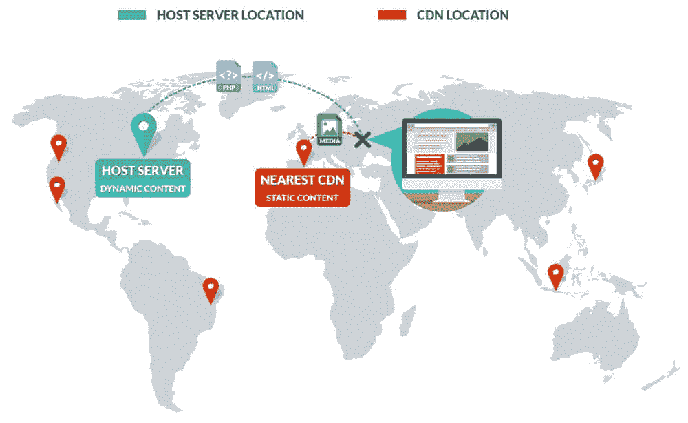

A CDN reduces latency, thus delivering content faster to end-users


WordPress 用户有时不愿意研究内容交付网络，因为它们听起来太复杂了。但是 CDN 的功能相对简单。下面是它们的工作原理，可以通过三个简单的步骤来实现:

#### **第一步**

你[注册一个有免费 CDN 的主机提供商](https://kinsta.com/blog/managed-wordpress-hosting/)(比如[的 Kinsta CDN](https://kinsta.com/help/kinsta-cdn/) )或者选择一个单独的 CDN 提供商并订阅他们的服务。第三方 CDN 提供商通常根据数据使用情况提供免费和付费计划。

#### **第二步**

你在你的网站上激活 CDN。对于 Kinsta CDN，[只需点击 MyKinsta 仪表盘上的按钮](https://kinsta.com/help/kinsta-cdn/#how-to-enable-kinsta-cdn)即可完成。你给第三方 CDN 安装一个像 [CDN Enabler](https://wordpress.org/plugins/cdn-enabler/) 或者 [WP Rocket](https://wp-rocket.me/) 这样的免费插件来整合它。

这些插件会自动将您的资产链接到 CDN。你不需要做任何工作就能在 CDN 上获得你的内容；这都是放手！部署 CDN 比以前容易多了。

#### **第三步**

当人们访问你的网站时，它从全球不同的服务器上加载你的 WordPress 站点的内容。欧洲的访问者从欧洲的服务器上接收你的网站内容，而美国的访问者从离他们更近的服务器上获得相同的内容。

### cdn 是如何做到这一点的？

cdn 通常使用两种技术将用户路由到正确的位置: **IP 任播+地理位置路由**。它们可以自动检测用户请求来自哪里，并将请求路由到最近的服务器。

然而，为你的 WordPress 主机选择一个战略性的服务器位置仍然是至关重要的。因为即使 CDN 有助于分发您的媒体和内容，当您的网站被加载时，仍然需要向托管提供商发出一个请求——除非您在代理服务器上使用了整页缓存，这一点我们将在后面介绍。

Kinsta 现在有 35 个[数据中心位置](https://kinsta.com/knowledgebase/google-cloud-data-center-locations/)，你可以在那里托管你的 WordPress 站点。

## **CDN 优势**

在你的 WordPress 网站上使用 CDN 有很多好处。

### **1。性能提升**

性能提升是使用 CDN 的最大原因之一。事实已经反复证明，[更快的加载站点](https://kinsta.com/learn/speed-up-wordpress/)与更高的转化率、更低的跳出率和更长的平均访问时长相关，更不用说更好的用户体验了。

你上一次在浏览器中点击返回是什么时候，因为网站加载时间太长？这是网站所有者最不希望发生的事情。但是不要相信我们的话。以下是行业领导者关于网站性能重要性的一些统计数据:

*   页面响应延迟 1 秒会导致转化率下降 7%。(来源: [Kissmetrics](https://blog.kissmetrics.com/loading-time/) )
*   BBC 发现，网站加载每多花一秒钟，就有 10%的用户离开他们的网站。(来源:[创意博客](http://www.creativebloq.com/features/how-the-bbc-builds-websites-that-scale))
*   加载时间每延迟一秒，转化率就会下降 20%。(来源: [ThinkWithGoogle](https://www.thinkwithgoogle.com/marketing-strategies/app-and-mobile/mobile-site-speed-importance/) )
*   Pinterest 在将其页面加载时间减少近 40%后，注册人数增加了 15%。(来源:[Pinterest Engineering on Medium](https://medium.com/pinterest-engineering/driving-user-growth-with-performance-improvements-cfc50dafadd7)

这里有一些 CDN 可以帮助提高你的 WordPress 站点性能的方法。

#### **减少 TTFB**

我们在上面已经提到，WordPress CDN 可以通过缩短数据传输所需的物理距离来帮助**减少延迟**。但是它也可以帮助你降低第一个字节的[时间](https://kinsta.com/blog/ttfb/) (TTFB)。

这衡量浏览器在从服务器接收第一个字节的数据之前等待的时间。获取数据的时间越长，显示页面的时间就越长。


A CDN can help reduce TTFB


一个常见的误解是，TTFB 是在 DNS 查找次数之后计算的。但是，组网中 TTFB 的[原始计算总是包含网络延迟。这涉及到一个 3 步的过程，因此延迟和等待可能发生在中间的任何地方，增加了您的总 TTFB。](https://en.wikipedia.org/wiki/Time_To_First_Byte)

高 TTFB 可能是由几个原因造成的，比如糟糕的代码或者主机服务器上的[错误配置的缓存](https://kinsta.com/blog/wordpress-cache/)。但是地理距离是一个问题。

我们运行了两个测试来显示有无 [Kinsta CDN](https://kinsta.com/help/kinsta-cdn/) (由 Cloudflare 提供[支持)的 TTFB 的差异。我们将每个测试运行 5 次，然后取平均值。](https://kinsta.com/cloudflare-integration/)

**测试 1:不带 CDN 的 TTFB】**

我们首先在禁用了 Kinsta CDN 的情况下运行了一个 Pingdom 测试。结果如下:

*   总加载时间为 1.45 秒
*   平均 TTFB 约为 136 毫秒

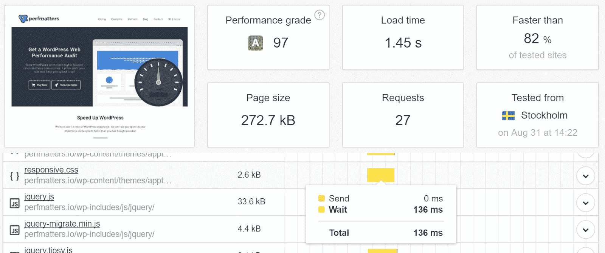

TTFB before adding a CDN


**测试 2:带 CDN 的 TTFB】**

然后，我们启用了 Kinsta CDN 并再次运行测试:

*   总加载时间下降到 788 毫秒
*   平均 TTFB 提高到 37 毫秒

CDN 能带来多大的变化！

另一个需要注意的要点是，我们选择在斯德哥尔摩进行测试。为什么？因为我们想向您展示通过缩短物理距离可以实现的真正改进。斯德哥尔摩有一个 CDN POP，所以我们的内容是从斯德哥尔摩提供的。

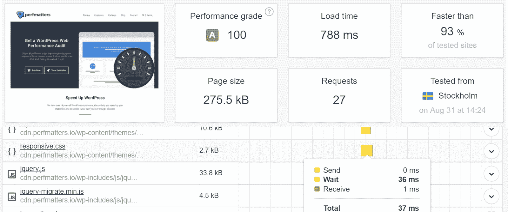

TTFB after adding a CDN


#### **通过缓存加快交付速度**

类似于你如何在 WordPress 主机或插件上使用缓存，cdn 也利用缓存。这是他们快速传送文件的一种方式。

**重要提示:**一旦 CDN 获得您的媒体副本，通常访问者会请求一次或两次，然后才将其缓存在 CDN 上。CDN 在请求上放置一个名为“X-Cache”的 HTTP 报头。该文件通常在第一次或第二次请求时显示为未命中，这意味着它尚未被缓存。

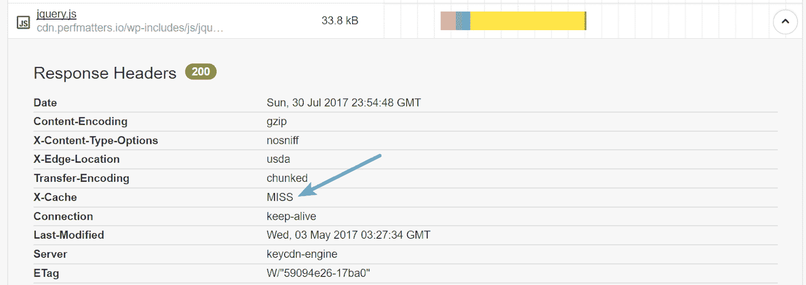

CDN not cached (MISS)


在随后的请求中，它显示为命中，现在缓存在您的 CDN 上。它将根据各种因素保持缓存，如 ETag 头、[过期头](https://kinsta.com/knowledgebase/add-expires-headers-wordpress/)，或手动清除您的 CDN 缓存。

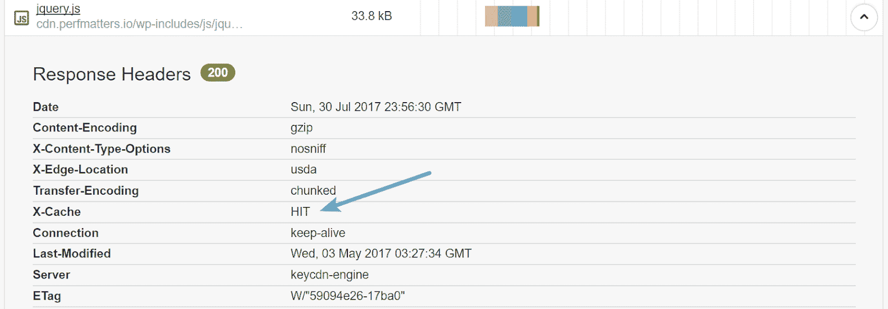

CDN cached (HIT)


使用像 Kinsta CDN(由 Cloudflare 支持)这样的 CDN，您可以通过利用所谓的全页面、反向代理缓存将缓存提升到一个新的水平。这包括在一个主 URL 上缓存所有内容，而不是在一个二级域上。

#### **GZIP 压缩带来的巨大节约**

WordPress CDNs 也使用 GZIP，一种用于文件压缩和解压缩的文件格式和软件应用程序。 [GZIP 压缩](https://kinsta.com/blog/enable-gzip-compression/)在服务器端(或在 CDN 服务器/POP 上)启用，进一步减小 HTML、样式表和 JavaScript 文件的大小。

它对图像不起作用，因为这些图像已经以不同方式压缩。由于压缩，有些已经减少了 70%。这是你能做的最简单的优化之一。别担心，所有知名的 cdn 都默认启用此功能。

#### **HTTP/2**

[HTTP/2](https://kinsta.com/learn/what-is-http2/) 也是所有 cdn 用来加速资产交付的顶级特性之一。性能的提高是由于各种原因，如协议能够支持更好的多路复用、并行性、带霍夫曼编码的 HPACK 压缩、ALPN 扩展和服务器推送。

**2。降低带宽成本**

CDN 的另一个好处是，它可以帮助卸载主机服务器(原始服务器)的 CPU 和资源。这有助于:

*   防止流量高峰淹没您的主机
*   降低您的总体带宽成本
*   消除因流量波动导致的带宽费用波动

你最不希望的事情就是某样东西像病毒一样传播开来，然后你会收到主人的高额账单或者超龄费。

CDN 帮助降低成本的另一种方式是提供简单的方法来启用[热链接保护](https://kinsta.com/blog/hotlinking/)。这指的是限制 HTTP 推荐人，防止其他人在其他网站上嵌入你的资产(图片——我们有一个关于如何[保护你的图片](https://kinsta.com/blog/protect-images/)的教程。

你们中的一些人可能听说过《赫芬顿邮报》的惨败。《赫芬顿邮报》的一名作者复制并粘贴了来自[燕麦片网站](http://theoatmeal.com/)的图片，AWS 向燕麦片网站所有者发出了一张 1000 美元的账单。燕麦片的主人最终替换了图片，以便《赫芬顿邮报》的读者可以看到它们。

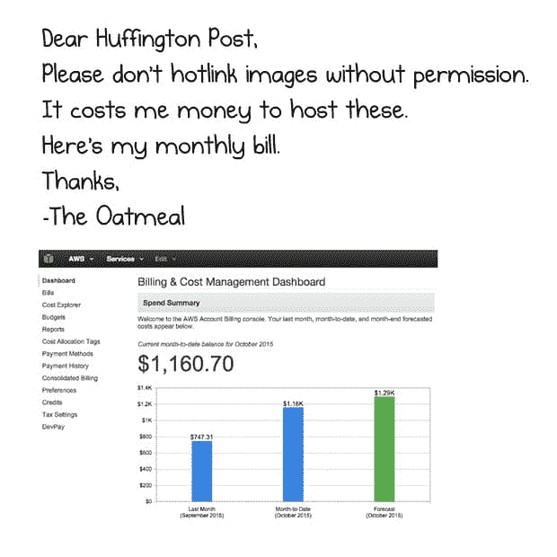

Hotlink protection


这就是为什么**总是必须启用热链接保护**。否则，你可能会以一个令人发指的法案结束。

### **3。高可用性和可扩展性**

cdn 提供高可用性和可扩展性。因为复制的内容可以跨不同地理位置的多个 pop 访问，所以如果一台服务器出现故障，web 流量会被动态地路由到另一台服务器。没有必要担心可扩展性，因为 CDN 提供商在构建时就考虑到了这一点。如果你使用较小的共享主机，CDN 可以防止你的网站崩溃，因为它可以处理大部分的负载。

### **4。SEO 优势**

早在 2010 年，谷歌就将网站速度作为排名因素之一，所以一个更快的网站会导致更高的排名已经不是什么秘密了。虽然没有办法知道速度有多重要，但你可以有把握地认为它是更重要的因素之一，因为它影响用户体验。

布莱恩·迪恩分析了排名前 100 万的域名，以查看[网站速度和谷歌排名](http://backlinko.com/search-engine-ranking)之间的关系，并发现了正相关。虽然这些测试几乎无法证明，但你可以放心，拥有一个更快的网站只会对你在谷歌有所帮助。简单来说，谷歌奖励快速网站。

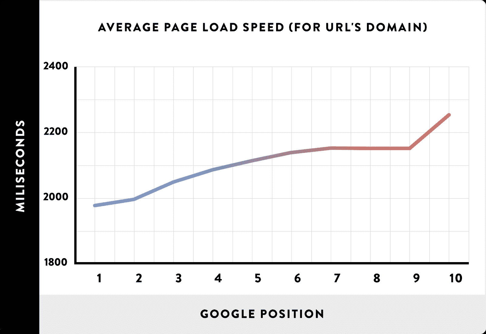

Site speed – Google rankings


除了网站页面的速度之外，CDN 还有助于提高媒体的抓取速度，比如图片，与谷歌图片搜索中的索引相关。

### **5。附加安全性**

许多 cdn 通过允许您实现 web 应用防火墙( [WAF](https://kinsta.com/blog/what-is-a-firewall/#web-application-firewall) )和一些人所谓的源屏蔽来提供额外的安全性。这些可以帮助:

*   缓解各种形式和规模的 DDoS 攻击，包括针对 UDP 和 ICMP 协议的攻击
*   阻止 SYN/ACK、DNS 放大和第 7 层攻击
*   把你的网站放在一个代理后面，这个代理隐藏了你的原始 IP 地址，尽管它不是防弹的

查看我们的案例研究[如何阻止 DDoS 攻击](https://kinsta.com/blog/ddos-attack/)。我们有一个客户，他在[有一个小型电子商务网站](https://kinsta.com/blog/woocommerce-apm/)，运行简单的数字下载，在 7 天内一个页面收到了超过**500 万个请求。**

该网站通常每天只产生 30-40 MB 的带宽和几百个访问者。但是该网站突然一天传输了 15-19 GB 的数据！也就是说**增长了 4650%** 。而[谷歌分析](https://kinsta.com/blog/how-to-use-google-analytics/)显示没有额外的流量。这可不好。

## 注册订阅时事通讯


### 想知道我们是怎么让流量增长超过 1000%的吗？

加入 20，000 多名获得我们每周时事通讯和内部消息的人的行列吧！

[Subscribe Now](#newsletter)

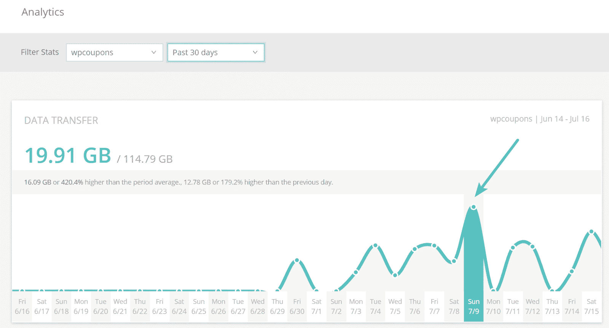

DDoS attack


客户端在他们的站点上实现了 Sucuri 的 web 应用防火墙，所有的带宽和请求都在站点上被立即丢弃(如下所示)，从那以后就没有出现过一个问题。所以，如果您遇到这样的问题，这是一个很好的投资和节省时间的方法。

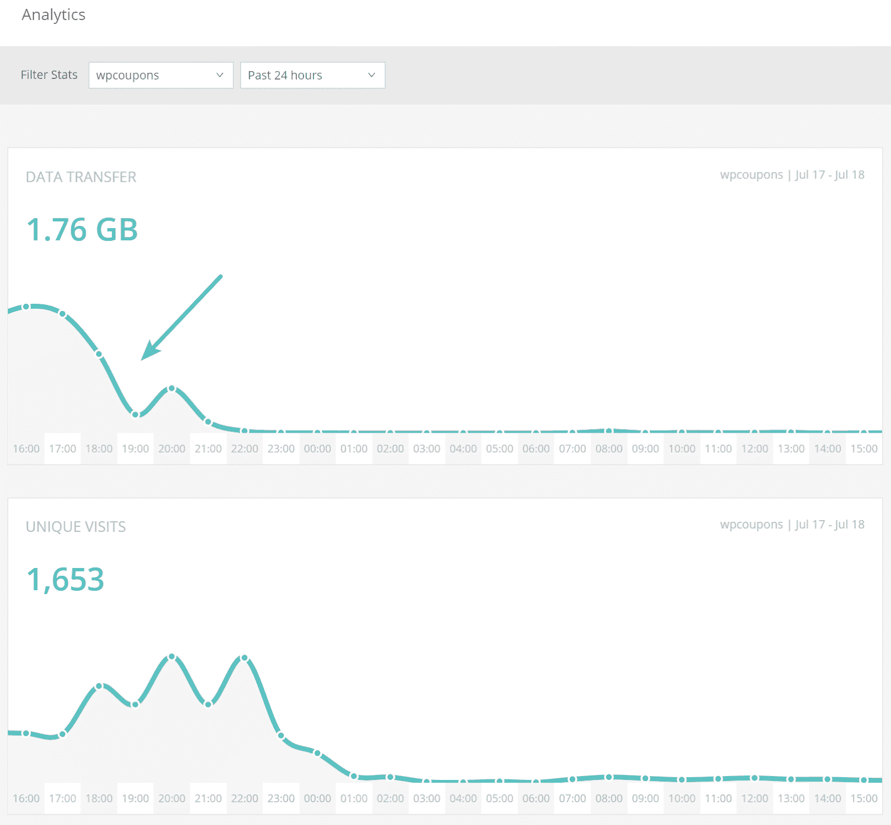

cdn 还提供了额外的安全特性，比如安全令牌，它允许您生成带有过期时间的安全链接。过期后，用户将无法再访问该内容。


## **CDN 速度测试:带 CDN 与不带 CDN**

与其只是告诉你 WordPress CDN 的好处，不如让我们做一些测试来向你展示结果。

*   我们在启用 CDN 和不启用 CDN 的情况下，从 4 个不同的测试位置运行了 5 个测试。
*   该网站由 Kinsta 托管，并使用免费的 [Kinsta CDN](https://kinsta.com/help/kinsta-cdn/) (由 Cloudflare 提供支持)。
*   服务器的物理位置在美国爱荷华州。

**重要提示:**当你对你的 CDN 进行速度测试时，你要运行几次，这样媒体就被缓存了。正如我们之前关于 CDN 缓存所描述的，X-Cache HTTP 头一旦被缓存，就会显示“命中”。如果没有缓存，它将显示“未命中”如果你没有正确地做这件事，当你没有首先建立缓存时，CDN 可能看起来没有帮助加速你的站点。

### **无 CDN(美国德克萨斯州达拉斯)**

我们首先使用达拉斯的一台没有 CDN 的服务器运行了 5 次 Pingdom 测试。然后我们取平均值。

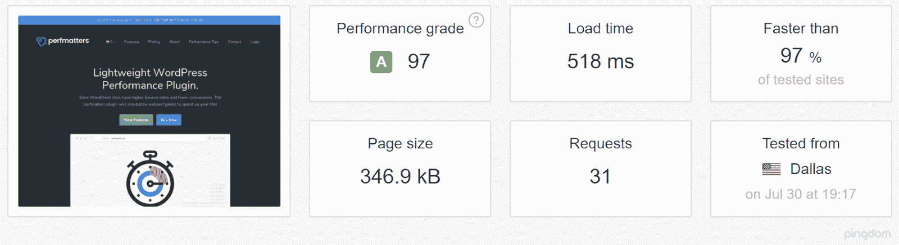

Without CDN test with Dallas server (source: Pingdom)


### **无 CDN(澳大利亚墨尔本)**

然后，我们使用一台没有 CDN 的澳大利亚墨尔本服务器**运行了 5 次 Pingdom 测试。也取平均值。**

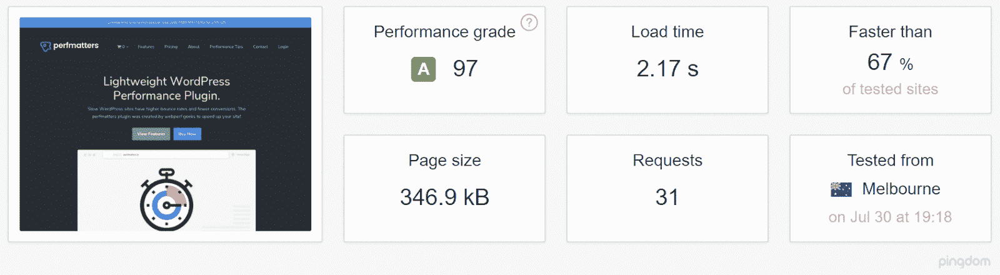

Without CDN test using a server in Australia (source: Pingdom)


### **不带 CDN(美国加利福尼亚州圣何塞)**

然后，我们在加州圣何塞运行了 5 次没有 CDN 的 Pingdom 测试**，并取平均值。**

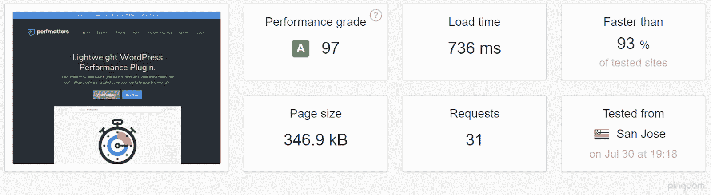

Without CDN test from San Jose server (source: Pingdom)


### **不带 CDN(瑞典斯德哥尔摩)**

我们在没有来自瑞典斯德哥尔摩的 CDN 的情况下运行了 5 次 Pingdom 测试**，并取了平均值。**

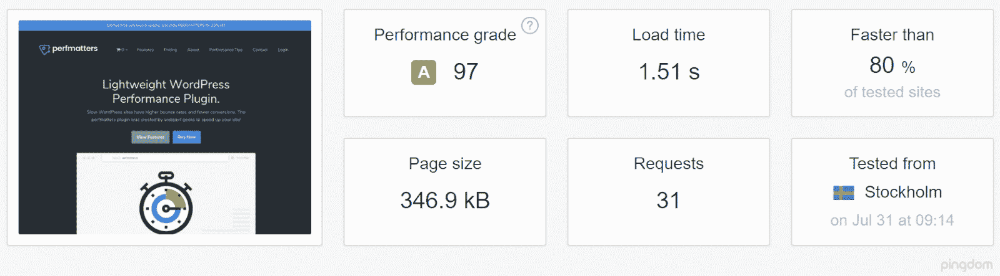

Without CDN test using a server in Sweden (source: Pingdom)


### **带 CDN(美国德克萨斯州达拉斯)**

为了进行比较，我们在德克萨斯州达拉斯的服务器上运行了 5 次 Pingdom 测试**,使用的是活动的 Kinsta CDN** 。之后取平均值。

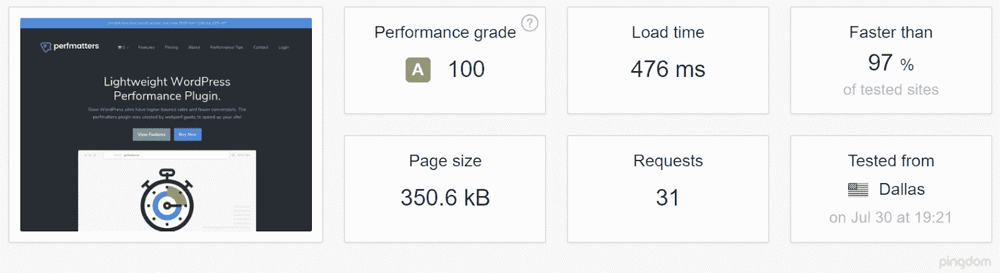

Test with Kinsta CDN using a Dallas server (source: Pingdom)


### **带 CDN(澳大利亚墨尔本)**

然后，我们从澳大利亚墨尔本的服务器上用 Kinsta CDN 运行了 5 次 Pingdom 测试**，然后取平均值。**

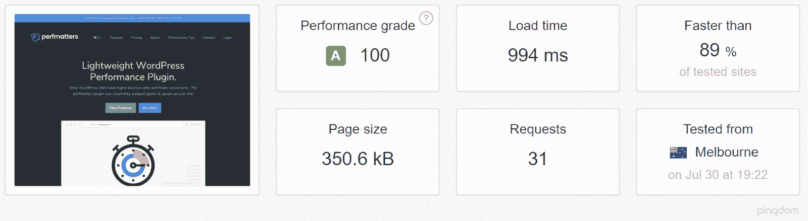

With CDN test Australia (source: Pingdom)


### **带 CDN(美国加州圣何塞)**

我们还使用加州圣何塞的服务器对 CDN 进行了 5 次 Pingdom 测试**,并取了平均值。**

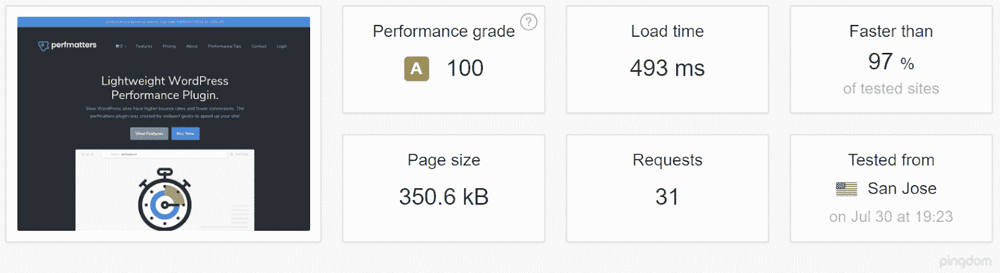

With CDN test with a San Jose server (source: Pingdom)


### **带 CDN(瑞典斯德哥尔摩)**

我们对一台带有活动 CDN 的 Stockholm 服务器**运行了 5 次 Pingdom 测试。然后取平均值。**

Struggling with downtime and WordPress problems? Kinsta is the hosting solution designed to save you time! [Check out our features](https://kinsta.com/features/)

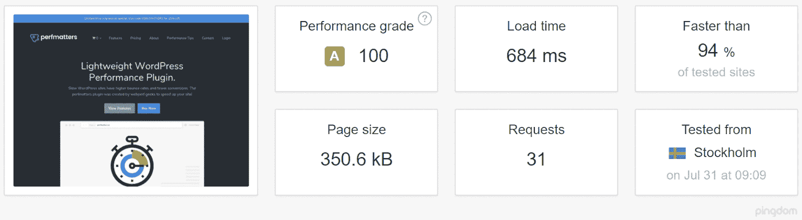

With CDN test using a server in Sweden (source: Pingdom)


### **结果**

让我们看看结果，以了解 CDN 对总加载时间的影响。

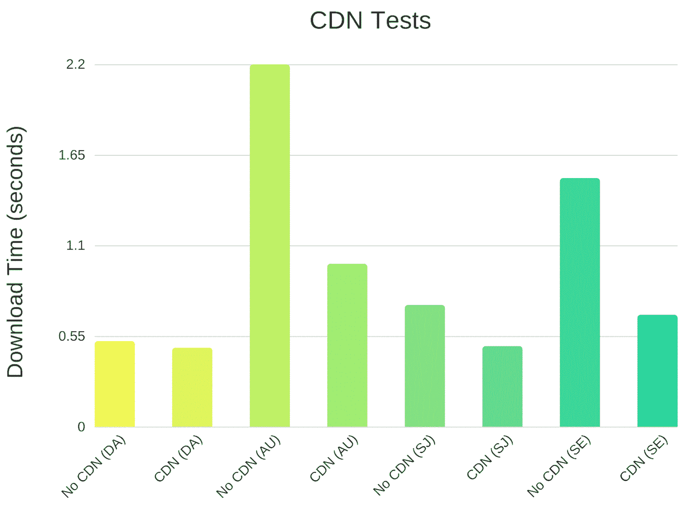

CDN speed test comparison


*   **美国德克萨斯州达拉斯:**使用 CDN，总加载时间减少 8.11%。
*   **美国加利福尼亚州圣何塞:**使用 CDN，总加载时间减少了 33.02%
*   **澳大利亚墨尔本:**使用 CDN 后，总加载时间减少了 54.19%。
*   **瑞典斯德哥尔摩:**使用 CDN 后，总加载时间减少了 54.7%。

CDN 在达拉斯和圣何塞站点的页面加载速度稍快。但是如果你看看澳大利亚的测试，你可以看到加载时间的巨大差异。这是因为测试服务器的地理位置。

Kinsta 测试服务器位于爱荷华州，因此如果没有来自达拉斯和圣何塞的 CDN，数据不会传输那么远。但对澳大利亚来说，距离是消磨装载时间的原因。

当我们启用 CDN 时，澳大利亚悉尼的 Kinsta CDN POP 会加载内容和媒体，这大大加快了下载速度。瑞典的斯德哥尔摩也是如此。

现在，您是否希望在某些情况下将加载时间减少 50%以上？答案应该是肯定的！

## **需要 CDN 吗？**

我们经常收到这个问题。根据我们的经验，这不应该是一个问题，因为 CDN 在几乎所有情况下都是有益的，不管你的站点大小和流量如何。

看看我们上面列出的所有好处就知道了。价格通常不再是一个因素，因为大多数 CDN 提供商非常便宜，或者是免费的。更不用说，cdn[有助于提高 SEO](https://kinsta.com/blog/wordpress-seo/) ，网站加载，用户体验，等等！

唯一的时候，你可能想做一些进一步的测试，如果你只是在一个特定的地理位置的访问者提供内容。

比方说，你在加拿大安大略省经营一家有网站的小店。也许你不太关心其他地方的顾客。您将需要研究 CDN 提供商的 pop 位于何处。

如果你的网络服务器主机位于安大略省，但是你注册了一个 CDN 提供商，而它离你最近的 POP 在美国，这可能会降低你网站的速度。在这种非常罕见的情况下，不使用 CDN 可能对您有好处。

## **热门 CDN 提供商**

虽然有很多优秀的 CDN 提供商，但 Kinsta 提供了内置于其主机中的 CDN；它由 Cloudflare 驱动，快速，易于激活，对 Kinsta 用户完全免费。我们建议利用免费的 Cloudflare 集成，但我们知道一些网站所有者出于特定原因需要外部 CDN 或代理。

在这种情况下，我们鼓励您探索其他一些顶级 cdn，所有这些 cdn 都与 Kinsta 主机兼容(单击链接查看每个 cdn 的 Kinsta 集成文档):

*   [快速 CDN](https://kinsta.com/help/fastly-cdn/)
*   [堆栈路径](https://kinsta.com/help/stackpath/)
*   [亚马逊 CloudFront](https://kinsta.com/help/cloudfront/)
*   [Imperva CDN](https://kinsta.com/help/imperva-cdn/)
*   苏库里
*   [Ezoic](https://kinsta.com/help/ezoic/)

## **如何在 WordPress 中安装 CDN**

每个 CDN 提供商都有自己的集成方法，但值得庆幸的是，他们都支持 WordPress，并使其易于集成。如果有问题，请查看他们的文档或询问他们的支持团队。

### **金斯塔 CDN**

我们与 Cloudflare 合作，cloud flare 是一个支持 HTTP/2 和 [IPv6 的](https://kinsta.com/blog/ipv4-vs-ipv6/#what-is-ipv6)内容交付网络，拥有 200 多个位置，可以增强您在全球的资产和媒体。目前服务的地区包括美洲、南美洲、欧洲、非洲、亚洲和澳大利亚。

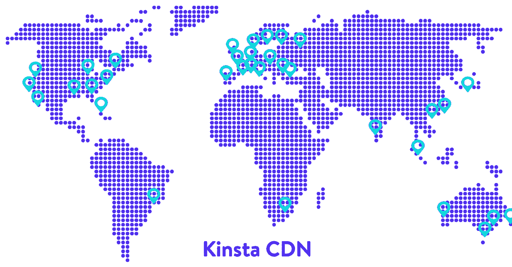

Kinsta CDN


查看如何[启用 Kinsta CDN](https://kinsta.com/help/kinsta-cdn/) 。这是一个简单的点击过程，从 MyKinsta [后端仪表板](https://kinsta.com/blog/backend-vs-frontend/)开始。

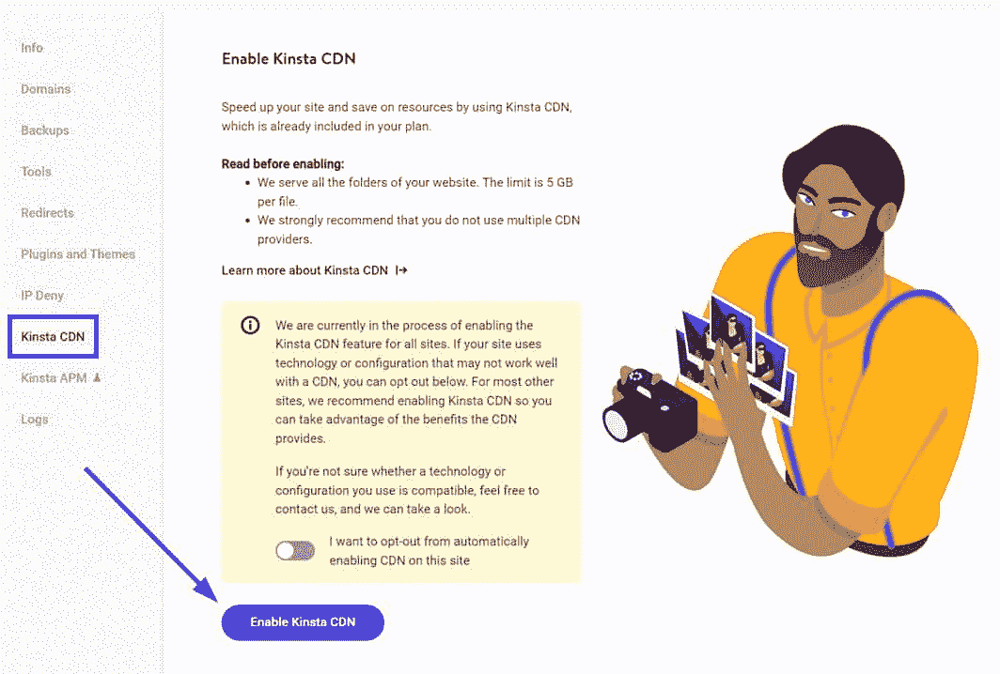

Enable Kinsta CDN


我们还有令人惊叹的 CDN 分析功能，可以查看带宽使用情况、按请求排序的热门文件、 [HTTP 状态代码](https://kinsta.com/blog/http-status-codes/)等等。

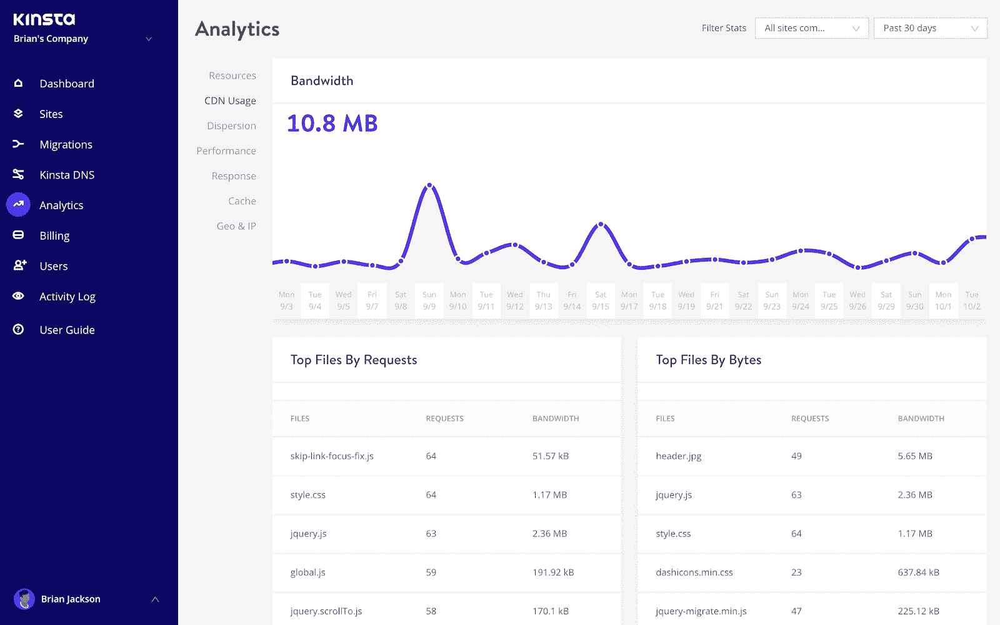

CDN usage in analytics


### **Cloudflare**

如果你正在使用 Cloudflare 或者对不在 Kinsta 上托管的站点感兴趣，我们有一个关于如何在你的 WordPress 站点上安装 Cloudflare 的深入教程。

但是，请记住，所有 Kinsta 主机用户都会收到一个由 Cloudflare 支持的免费 CDN，因此使用这种方法比将其作为单独的组件安装更容易。

作为我们 Cloudflare 集成的一部分， [Edge Caching](https://kinsta.com/feature-updates/edge-caching/) 将您的 Kinsta 站点/页面缓存保存到 Cloudflare 全球网络的 **275+** 个数据中心中的任何一个。

边缘缓存免费包含在所有 Kinsta 计划中，不需要单独的插件，并且平均减少了超过 50%的时间！

### **第三方 CDN**

如果您正在考虑自己部署 CDN，我们建议为您的媒体和资产使用一个[子域](https://kinsta.com/blog/wordpress-subdomain/),而不是提供商的随机 URL。

**例子:**cdn.yourdomain.com。

这将确保你的网站有更好的品牌效应，并减少索引问题的麻烦。

在提供商处设置好你的 CDN 后，你可以利用一个免费的 WordPress 插件快速链接你的资产，并自动将它们复制到你的 CDN 提供商处。查看下面我们推荐的 WordPress CDN 插件列表。

#### 顶级 CDN 插件和扩展


这些 CDN 插件不会自动激活 WordPress 网站上的 CDN，而是将第三方 CDN 提供商(如 Cloudflare、Fastly 或 Sucuri)连接到 WordPress 网站，允许 CDN 访问网站资产并向访问者提供内容。

总的来说，最好的 WordPress CDN 插件让你的连接变得容易，提供一个点击式的解决方案，而不是复杂的集成。

以下是最好的 WordPress CDN 插件:

*   [Cloudflare](https://wordpress.org/plugins/cloudflare/) :如果使用 Cloudflare 作为您的 CDN 提供商，这是一个正确的选择，尤其是因为它提供了一键式安装、web 应用防火墙设置和自动平台优化工具，可以通过 250 多个快速可靠的数据中心大幅提升站点速度。或者，您可以选择 Kinsta CDN，它已经由 Cloudflare 提供支持，不需要额外的插件！
*   Bunny.net:作为 CDN 提供商和 WordPress CDN 插件，Bunny.net 提供了一个快速集成来替换链接并把它们添加到你的 CDN 中。通过自动 HTTPS 配置、自定义 CDN 主机名以及排除特定目录通过 CDN 获得服务的能力，您可以快速提高性能。
*   [LiteSpeed 缓存](https://wordpress.org/plugins/litespeed-cache/):先不说别的，这是一个缓存插件。但它也提供免费的 QUIC.cloud CDN 缓存，或者你可以链接到任何 CDN 提供商。你可以用各种各样的功能，包括缩小、图像优化和延迟加载来提高你的网站的性能。
*   [W3 总缓存](https://wordpress.org/plugins/w3-total-cache/):很多缓存插件也兼做 CDN WordPress 插件， [W3 总缓存也不例外](https://kinsta.com/blog/w3-total-cache/)。与一些最受欢迎的 CDN 提供商集成，无需任何复杂的设置即可立即提升您的网站性能。这将媒体项目和主题文件等元素发送到 CDN，同时在 CDN 内使用之前缓存和压缩这些文件。
*   CDN Enabler :这个插件重写了你所有的 URL，这样资产就可以从你的外部 CDN 获得服务。您可以链接到一个 KeyCDN 帐户，并利用缓存清除、性能增强等功能。

### **用 CDN 索引图像**

你想确保谷歌仍然索引你的图片时，移动到一个 CDN。

对于 Yoast SEO 插件的用户来说，你会希望[将下面的代码添加到你的 functions.php 文件](https://kinsta.com/knowledgebase/wordpress-files/)的底部。用自己的域名和 CDN 域名替换。

```
function wpseo_cdn_filter( $uri ) {

return str_replace( 'http://yourdomain.com', 'http://cdn.yourdomain.com', $uri );

}

add_filter( 'wpseo_xml_sitemap_img_src', 'wpseo_cdn_filter' );
```

如果你不这样做，它可能会导致你的图像被索引(如下所示)。你可以在谷歌搜索控制台中自己检查。


Images not indexing


然而，谷歌搜索控制台有缺陷，有时无法报告出现在谷歌上的索引图像。检查你的图片是否被索引的一个很好的方法是前往[谷歌图片搜索](https://images.google.com/)并输入以下内容:“site:https://yourdomain.com。”


Google Image Search check indexing


**重要:**不要放入你的 CDN 网址。即使图片是从 CDN 提供的，它们仍然应该在你的根域上索引[。](https://kinsta.com/blog/how-to-buy-a-domain-name/)

如果你的图片出现在谷歌图片搜索中，它们会被很好地编入索引。


## **总结**

现在你可以看到使用 WordPress CDN 的所有好处。它将确保您的媒体在全球范围内更快地加载，减少您的 TTFB，并显著降低您的带宽成本和服务器负载。

不仅如此，由于页面加载速度加快，你还可以看到更好的排名。最重要的是，你的访问者会有更好的用户体验。

我们的 HTTP/2 [Kinsta CDN](https://kinsta.com/help/kinsta-cdn/) 支持我们所有的托管计划。你有使用 CDN 的想法吗？我们希望在评论区听到你的想法。

* * *

让你所有的[应用程序](https://kinsta.com/application-hosting/)、[数据库](https://kinsta.com/database-hosting/)和 [WordPress 网站](https://kinsta.com/wordpress-hosting/)在线并在一个屋檐下。我们功能丰富的高性能云平台包括:

*   在 MyKinsta 仪表盘中轻松设置和管理
*   24/7 专家支持
*   最好的谷歌云平台硬件和网络，由 Kubernetes 提供最大的可扩展性
*   面向速度和安全性的企业级 Cloudflare 集成
*   全球受众覆盖全球多达 35 个数据中心和 275 多个 pop

在第一个月使用托管的[应用程序或托管](https://kinsta.com/application-hosting/)的[数据库，您可以享受 20 美元的优惠，亲自测试一下。探索我们的](https://kinsta.com/database-hosting/)[计划](https://kinsta.com/plans/)或[与销售人员交谈](https://kinsta.com/contact-us/)以找到最适合您的方式。