# 如何清除你网站上的 WordPress 缓存

> 原文：<https://kinsta.com/blog/wordpress-clear-cache/>

网站的表现取决于你网站的许多方面:设计，使用的平台，以及你如何优化它的各种元素。网站缓存是提高网站性能的最重要的方法之一，这是有充分理由的。几乎所有的 WordPress 站点都启用了缓存来有效地存储资源和提高站点速度。

有时，您可能想要清除这个缓存。我们将向你展示这一点，教你如何使用各种方法清除 WordPress 缓存。

Kinsta 用户在缓存方面有优势，因为[我们在服务器级处理所有缓存](https://kinsta.com/blog/wordpress-cache/)，包括整页和对象缓存。这意味着 Kinsta 用户不必自行清除 WordPress 缓存。有一个手动缓存的选项，但不需要第三方缓存插件或自动缓存配置——它已经为您设置好了。默认情况下，[整页缓存](https://kinsta.com/help/full-page-caching/)设置为一小时，但是如果需要，Kinsta 可以为您定制。

但是如果你的一些网站不使用 Kinsta 呢？不要担心，因为各种插件提供了缓存工具来自动化这个过程，并确保您的网站以最高速度运行。

在这篇文章中，我们将谈论缓存的基础知识，解释如何通过 MyKinsta 仪表板清除 WordPress 缓存，并使用一些最流行的 [WordPress 缓存插件](https://kinsta.com/blog/wordpress-caching-plugins/)。

### 更喜欢看[视频版](https://www.youtube.com/watch?v=zwm7vym6AhI)？

## 什么是缓存？

简单地说，[缓存](https://kinsta.com/blog/what-is-cache/)最大限度地减少了制作网页以供浏览所需的工作量。

> Kinsta 把我宠坏了，所以我现在要求每个供应商都提供这样的服务。我们还试图通过我们的 SaaS 工具支持达到这一水平。
> 
> <footer class="wp-block-kinsta-client-quote__footer">
> 
> 
> 
> <cite class="wp-block-kinsta-client-quote__cite">Suganthan Mohanadasan from @Suganthanmn</cite></footer>

[View plans](https://kinsta.com/plans/)

WordPress 缓存通过存储网页的静态版本来实现更高效的环境。这些拷贝保存在 WordPress 或网站缓存中，直到缓存过期、内容改变或缓存收到清除命令。

把缓存想象成你网站历史的几个快照的存储区域。它将这些快照交付给最终用户，而不是在他们每次想要查看网页时强制服务器编译并交付所有站点文件。
T3】

### 一个网页加载时不缓存会发生什么的例子:

1.  有人通过[搜索引擎](https://kinsta.com/blog/alternative-search-engines/)或社交媒体等外部资源来到你的网站。它们会出现在你的网页上，比如主页或产品页面。
2.  一个 HTTPS 请求开始生效，告诉你的网络服务器编译所有文件来发送网页。进入该页面的每个元素(图像、脚本和文件)都需要服务器编译时间。
3.  请求并加载所有站点文件和元素后，用户可以看到整个网页。

同样，这取决于页面上的文件大小和文件数量，但每次有人想要查看网页时，服务器都要做大量的工作来拼凑正确的网页组件。

### 一个网页加载缓存时会发生什么的例子:

1.  有人来到你的网站，并最终在一个个人网页上。
2.  一个 [HTTPS](https://kinsta.com/blog/http-to-https/#what-is-https) 请求被发送到你的服务器来编译文件并以完整的形式发布网页。
3.  启用了缓存，因此自从最后一个访问者尝试访问该站点以来，web 服务器看不到任何变化。它在其高速缓存中获取网站的静态版本，消除了服务器从头编译和传送所有网站文件的需要。

所有访问者都会看到网页的缓存版本，直到页面内容发生更改。当自动或手动清除缓存存储时，缓存也会重新启动。

**一种可视化缓存的方法是想象你是一个在集市上出售你的作品的画家**。潜在客户找到你，喜欢你的一件作品。然而，一遍又一遍地画同样的风景会占用你很多时间，而且人们可能不愿意等着。因此，您可以制作原画的数字副本，然后打印出来。通过这种方式，你可以获得更多的销售，而你的客户也不必逗留很长时间。

缓存的工作方式与此类似，复制已经存在的内容，这样服务器(本例中是画家)就不必如此辛苦地工作，用户(画家的客户)也可以在更短的时间内得到他们想要的东西。

[该做些清洁了🧹先起来？清空你站点的 WordPress 缓存✅ 点击推文](https://twitter.com/intent/tweet?url=https%3A%2F%2Fkinsta.com%2Fblog%2Fwordpress-clear-cache%2F&via=kinsta&text=It%27s+time+to+do+some+cleaning+%F0%9F%A7%B9+First+up%3F+Clearing+out+your+site%27s+WordPress+cache+%E2%9C%85&hashtags=WordPressTips%2CCache)

## 为什么要清空你的 WordPress 缓存？

你可能想知道，为什么我要清除缓存？毕竟，缓存包含我的网页的静态副本，允许更快，更优化的浏览体验。

然而，如果你的网站很少改变，它会很无聊。

大多数企业都会给自己的网站添加新的、[吸引人的内容](https://kinsta.com/learn/content-marketing/)，无论是每个季度新收集的产品照片，还是每周或每天发布的博客文章。新的内容确保人们有理由回到你的网站。更不用说，如果您需要添加一个新按钮，您的企业必然会对销售公告、新产品和其他东西进行设计更改。

不幸的是，那些旧的缓存文件不包括修改。因此，自动或手动清除缓存可以方便地显示附加信息。当你清除 WordPress 缓存文件后，这个过程会重新开始，缓存会对你网站上的内容进行静态快照。

总的来说，你的网站的许多变化都需要清理缓存。以下是清除 WordPress 缓存存储的实例列表:

*   当您的[数据库](https://kinsta.com/knowledgebase/wordpress-database/)发生变化时。
*   如果您更新、删除或添加主题或插件。
*   添加新页面或帖子后。
*   如果您对之前创建的页面或帖子进行调整或添加。
*   进行设计调整时。如果网站需要新的品牌或者运行 [A/B 测试](https://kinsta.com/blog/wordpress-ab-testing-tools/)发现一些按钮不能转换，这是很常见的。
*   当您向您的[在线商店](https://kinsta.com/blog/wordpress-ecommerce-plugins/)添加新产品时。

清除 WordPress 缓存文件的理由还在继续，但是这个想法是为了确保你在缓存和新内容之间保持平衡。

是的，通过提供缓存页面来加快站点速度是可取的。然而，缓存的偶尔清除允许您呈现新的信息，同时也重新开始缓存过程。

## 如何清除 MyKinsta 中的 WordPress 缓存

Kinsta 用户很幸运，因为包含了缓存特性。这意味着不需要缓存插件，并且您很少需要考虑手动清除缓存。

话虽如此，您仍然需要知道 Kinsta 缓存是如何工作的，以防万一您想自己清除缓存或者您想改变缓存的类型或时间。

作为快速指南，请查看[我们关于 Kinsta 如何为其用户处理缓存的帖子](https://kinsta.com/blog/wordpress-cache/)。

 一般来说，Kinsta 使用四种形式的缓存，都是在软件和服务器层面完成的。此外，这四种缓存类型是自动完成的:

*   [字节码缓存](https://kinsta.com/blog/wordpress-cache/#bytecode-cache):存储编译好的 PHP 代码的缓存方法。缓存几乎完全跳过了 PHP 代码编译和转换过程，从而加快了加载速度。
*   [对象缓存](https://kinsta.com/blog/wordpress-cache/#object-cache):缓存数据库中的对象，无需在每次网页需要数据时查询数据库。
*   [页面缓存](https://kinsta.com/blog/wordpress-cache/#page-cache):存储 HTML 内容的缓存版本。这是缓存的主要形式之一，因为每个网页都有无数的 HTML 和 PHP 文件来生成所需的内容。
*   CDN 缓存:一种额外的缓存类型，将网站文件放在 CDN(内容交付网络)上。)CDN 的功能相当于分布在世界各地的机器的集合。地理上与服务器的接近程度实际上会影响浏览器呈现网站元素的速度，因此拥有一个包含多个服务器的 CDN 是一个好主意，这样可以更接近所有最终用户。

### 按照以下步骤清除 Kinsta 上的 WordPress 缓存

Kinsta 用户可以通过 [MyKinsta](https://kinsta.com/mykinsta/) 或 WordPress 仪表盘清除 WordPress 缓存。两者都只需要一两步，您甚至可以调整清除缓存的频率。

首先，我们将展示如何在 MyKinsta 中清除缓存。

打开 MyKinsta，点击**站点**按钮。

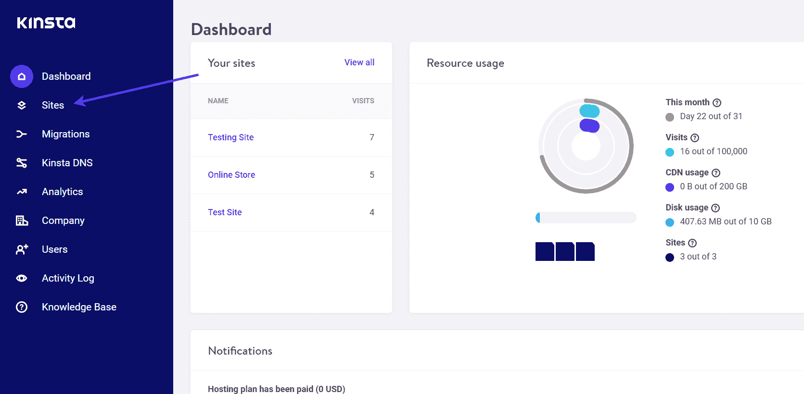

Click the ‘Sites’ button to clear WordPress cache in Kinsta

找到你想要清除 WordPress 缓存文件的站点。

对于一些人来说，你可能只看到一个网站。其他用户有一个站点列表。

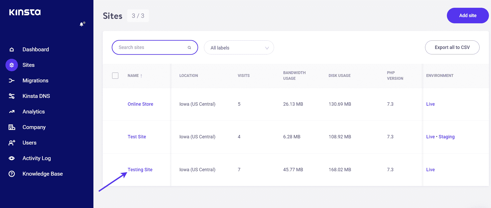

Pick the site to clear WordPress cache

点击**工具**标签。

这个页面展示了 MyKinsta 内置的一系列工具，比如**站点缓存**、**重启 PHP** 和 **WordPress 调试**。

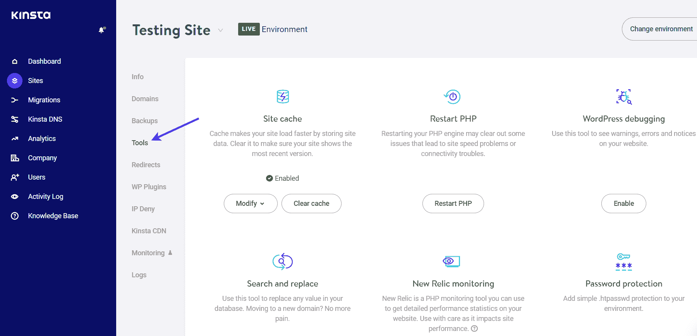

‘Tools’ panel in MyKinsta dashboard to clear WordPress cache

点击**清除缓存**按钮。

这是即时手动清除 WordPress 缓存文件的最简单的方法。没有额外的配置或任何需要输入的内容。

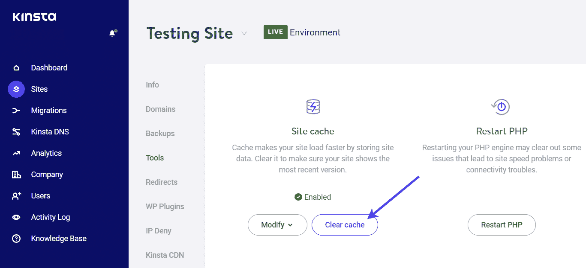

The WordPress ‘Clear Cache’ button

您可能会看到一条瞬时消息，告诉您缓存正在被清除。它还解释说，在缓存过程结束之前，它会禁用该页面上的所有工具。

消息通常只会持续几秒钟。

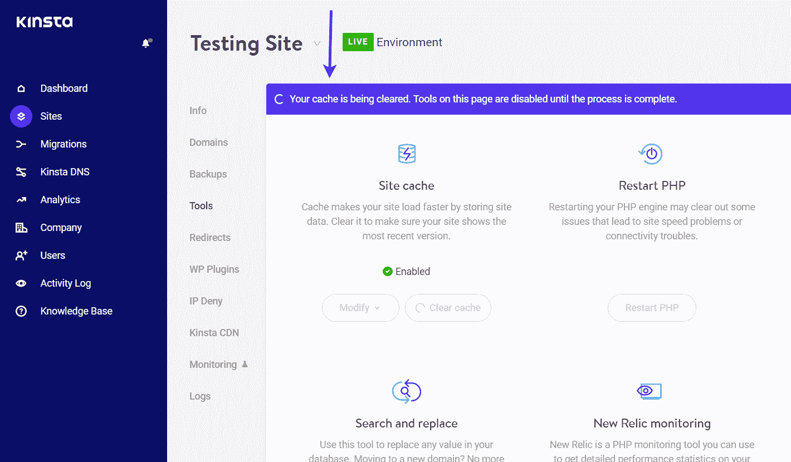

‘Your cache is being cleared’ message

这很容易被忽略，但是屏幕上会出现一条确认消息，显示缓存实际上已经被清空。

它解释了一个完整的页面缓存已经在你之前选择的站点上被删除了。您不需要单击此按钮或完成任何其他任务。该消息将消失，因为缓存已被清除。

然后页面上的工具被重新激活，您就可以像往常一样在 MyKinsta 中继续工作了。

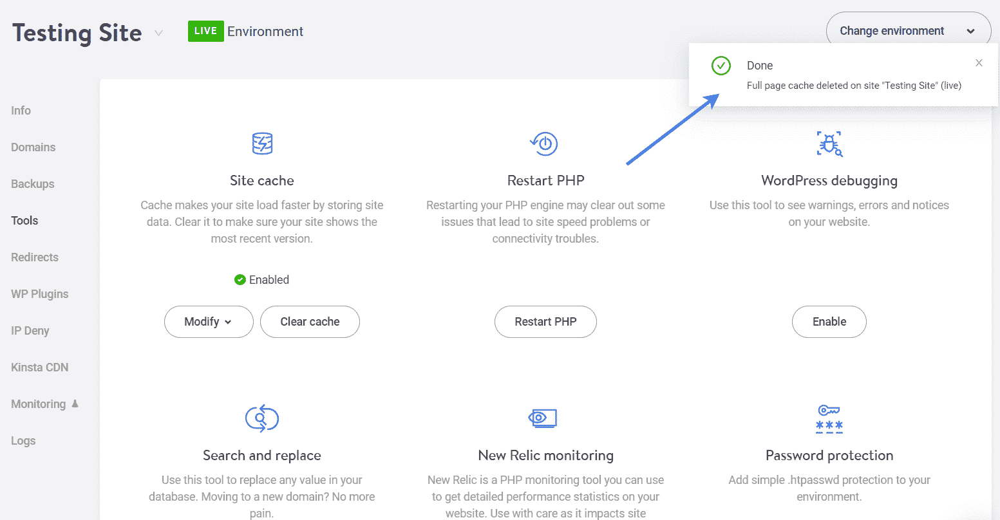

‘Done’ message after clearing WordPress cache

### 在 MyKinsta 中更改缓存过期时间

缓存的另一个要素涉及缓存存储过期的频率。缓存过期向 Kinsta 显示它应该自动清除缓存。

您可以决定更频繁地过期并自动清除缓存，或者您可以设置每周缓存过期时间。

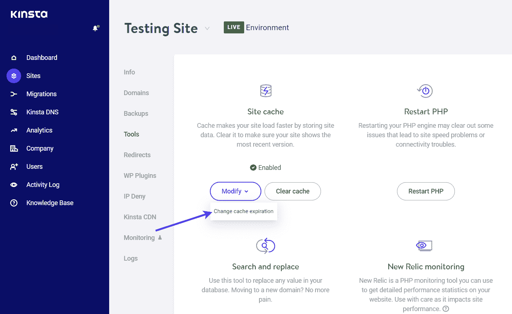

‘Change cache expiration’ option in MyKinsta

**注意:**更长的缓存时间有助于提高站点性能。缓存页面会加速你的网站，所以当它被清空时，服务器必须再次编译正确的站点文件来呈现网页。但是，提供缓存页面可能会呈现旧内容。

确保您设置的缓存过期时间适合您的站点或业务。一个不改变内容的网站通常会坚持 7 天的缓存期限。一个每天都进行设计编辑的网站可能会选择像每小时或每天缓存到期这样的事情。此外，当对页面和帖子进行编辑时，所有页面和帖子都会被单独缓存。当你编辑一篇博客文章时，你没有理由清空你的缓存。

通过决定以下自动时间范围来设置缓存过期时间:

*   1 小时
*   2 小时
*   4 小时
*   8 小时
*   24 小时
*   7 天

请记住，这是自动缓存清除部分，所以它在后台运行，通常您不知道。你总是可以手动清除 WordPress 缓存文件。

选择最佳缓存有效期后，点击**更改有效期**按钮。

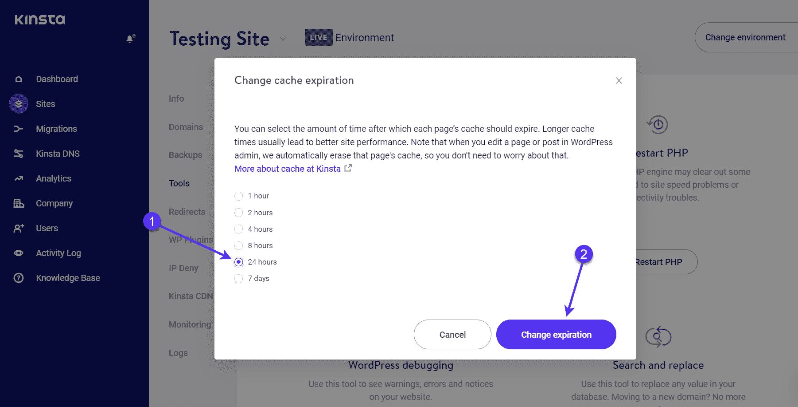

The ‘Change expiration’ button to clear WordPress cache

与所有缓存清除一样，MyKinsta 仪表板中会出现一条确认消息，显示缓存到期更新到了一个新的时间范围。

您现在可以自由地在网站的其他地方工作，因为您知道自动缓存清除过程会在正确的时间运行。

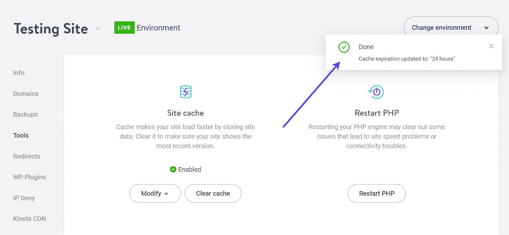

The ‘Done’ verification after setting a new cache expiration

### 启用 Kinsta CDN 缓存

如前所述，Kinsta 利用了一种称为 CDN(内容交付网络)缓存的缓存形式。这会将您的网页版本储存在位于其他位置的其他服务器上。例如，Kinsta CDN 在全球提供 35 个服务器位置。

如果缓存的网站内容存储在欧洲的服务器上，那么对于从欧洲国家访问网站的用户来说，加载速度会更快。用户与服务器的距离关系到加载时间，这也是 CDN 对提升性能如此重要的原因。

[查看本指南](https://kinsta.com/help/kinsta-cdn/)了解更多关于 Kinsta CDN 如何与 Cloudflare(另一个流行的 CDN 选项)相结合的信息。

要激活 Kinsta CDN(包括 CDN 缓存)，请前往 MyKinsta 仪表板中的**站点> Kinsta CDN** 。

选择**启用 Kinsta CDN** 按钮。

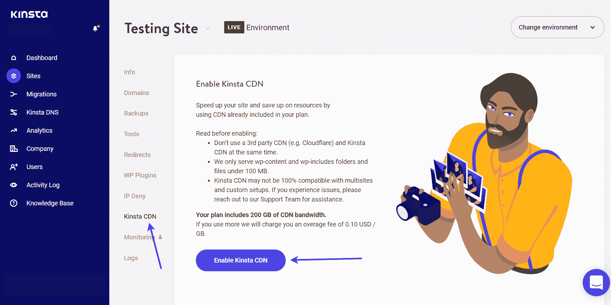

Kinsta CDN in MyKinsta dashboard

出现一个弹出窗口，解释你在运行 Kinsta CDN 时不应该使用第三方 CDN(比如[cloud flare](https://kinsta.com/knowledgebase/install-cloudflare/))；这可能会引起冲突。该警告还概述了 Kinsta CDN 可能无法提供与某些定制设置和多站点配置的兼容性。

点击**启用 CDN** 按钮继续。

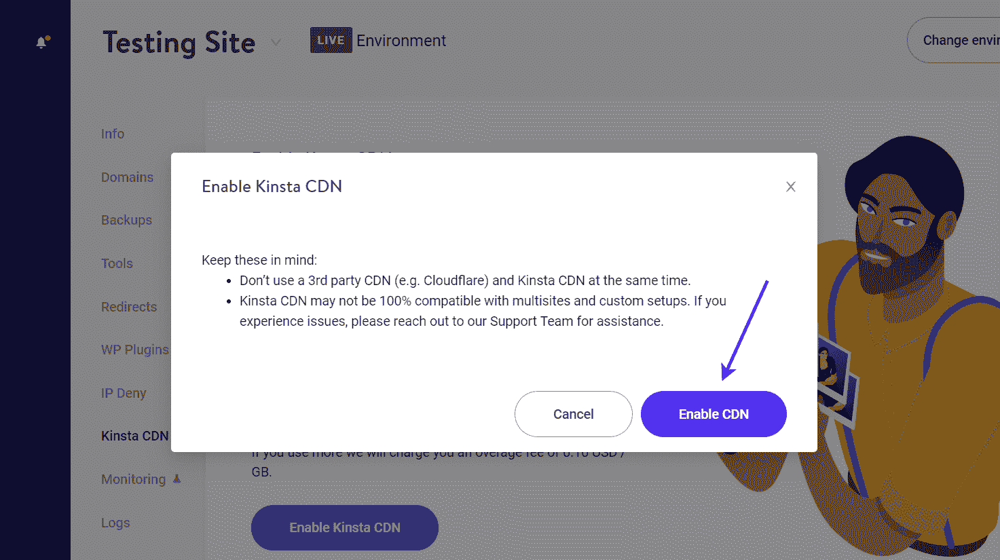

Enabling Kinsta CDN

MyKinsta 仪表板显示一条消息，表明 Kinsta CDN 区域已添加到网站中。

通常对网站所有者没有更多的要求。

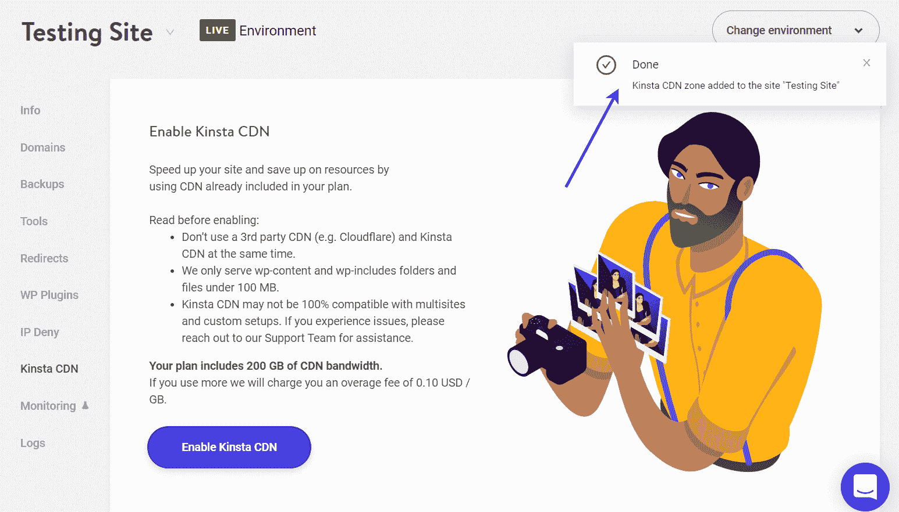

Successfully enabling Kinsta CDN

激活 CDN 的过程有时需要 15 分钟才能完成。

在安装过程中进入 Kinsta CDN 页面可能会显示它还没有准备好。但是，应该会出现 CDN 域，这是出于各种其他原因而使用的。

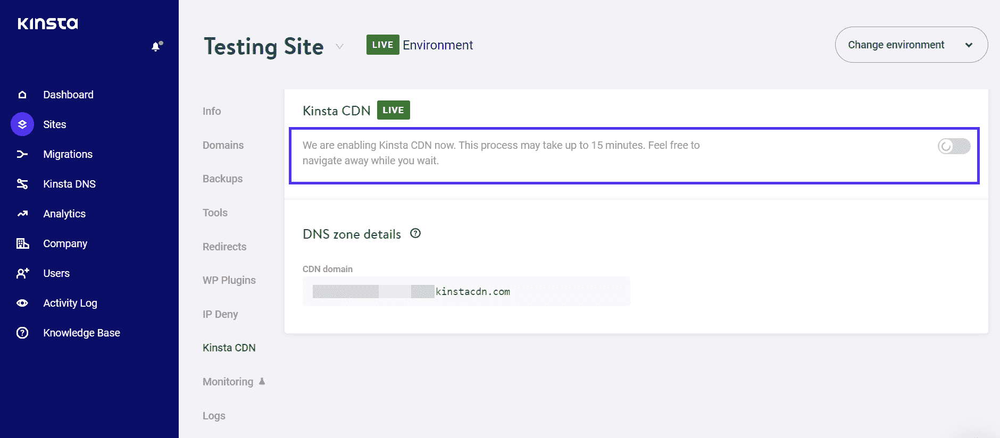

Enabling CDN to clear WordPress cache

如果 Kinsta CDN 页面在 15 分钟后仍未加载，请尝试刷新您的仪表板。

一旦配置完成，你会看到一个标签，说明 Kinsta CDN 已经**启用**，同时还有一个紫色开关在上转向**。**

该页面包括 **DNS 区域详情**，一个选项**清除 CDN 缓存**，以及一个区域**移除 Kinsta CDN** 。

要清除你 CDN 上的 WordPress 缓存文件，只需在任何时候回到这个页面，按下**清除 CDN 缓存**按钮。

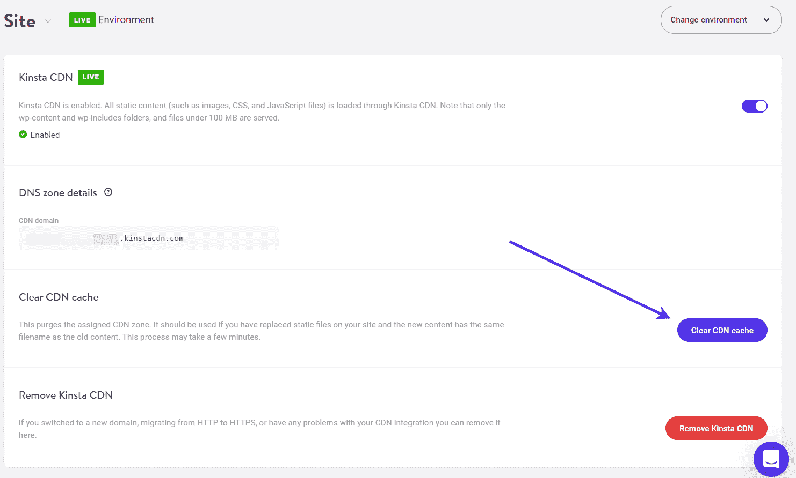

‘Clear CDN Cache’ in MyKinsta dashboard

唯一的额外步骤是确认您想要继续清除缓存。此警告说明缓存清除可能需要几分钟时间。

选择**清除 CDN 缓存**按钮。

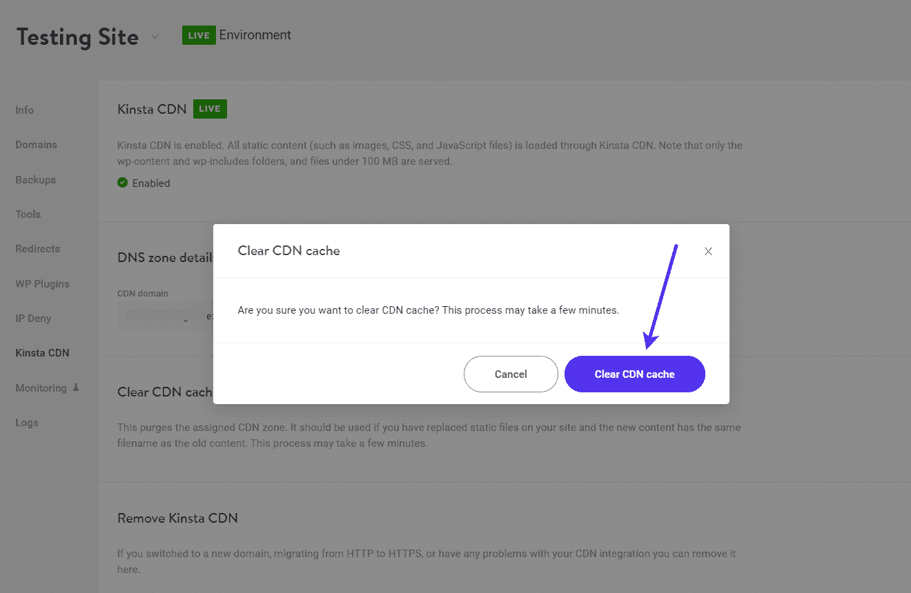

Push the ‘Clear CDN Cache’ button

过了一会儿，MyKinsta 指示板中会出现一个通知，说明您选择的站点中的 Kinsta CDN 缓存已被清除。

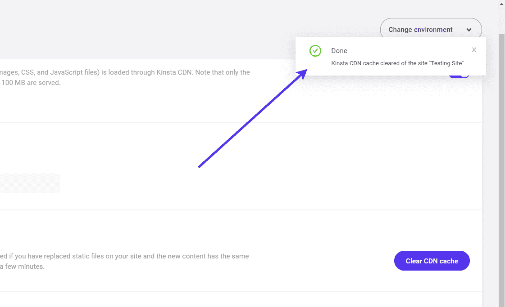

‘Done’ message after clearing Kinsta CDN cache

## 如何从 WordPress 仪表盘清除 Kinsta 缓存

清除 MyKinsta 中的 WordPress 缓存只需要几个步骤。然而，与 MyKinsta 相比，许多 Kinsta/WordPress 用户可能在 WordPress 仪表盘上花费更多的时间。

因此，Kinsta 提供了几个选项来直接从你工作最频繁的区域——WordPress dashboard——清除缓存。

有两种方法可以清除 WordPress 内部的缓存。

第一种也是最简单的方法显示在 WordPress 仪表盘的几乎每一页上。这是因为它是顶部仪表板菜单的一部分。

要通过点击按钮从仪表板清除缓存，找到**清除缓存**按钮。

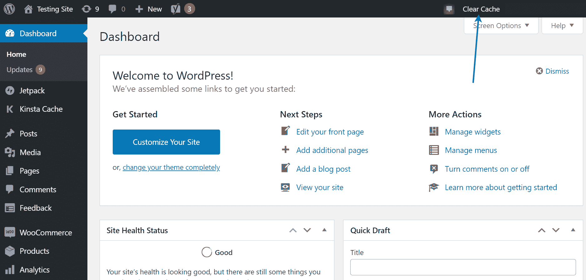

‘Clear Cache’ button in WordPress dashboard

这就是全部了。

几秒钟内，会出现一条成功消息，显示缓存已成功清除。

这很少会占用你的工作时间。如果花费的时间比平时长，您仍然可以随着缓存清除的继续在仪表板上移动。

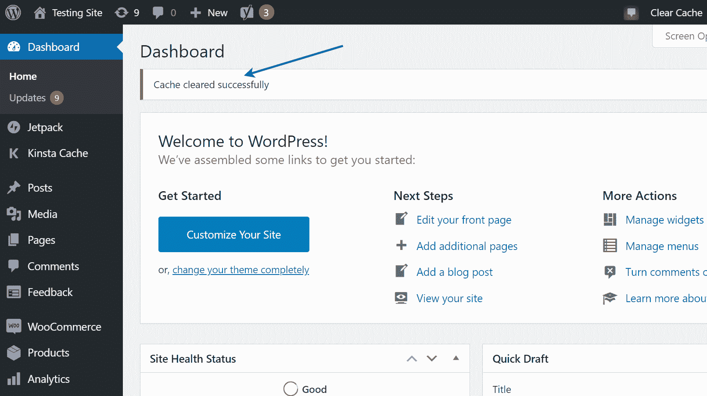

WordPress ‘Cache cleared successfully’ message

第二种缓存清除方法位于 WordPress 仪表盘的侧边菜单上。

它被标记为 **Kinsta 缓存**。

选择该按钮。

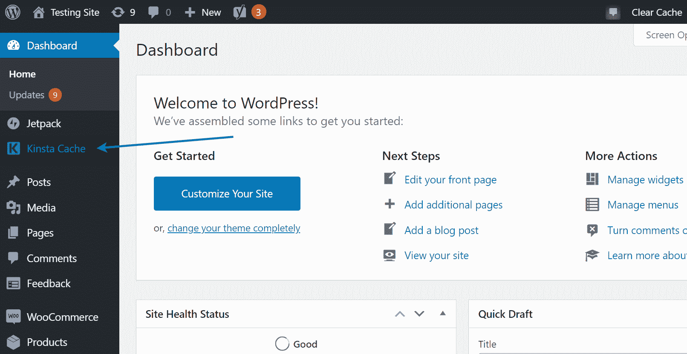

Kinsta Cache menu to clear WordPress cache quickly

虽然 Kinsta 缓存页面提供了与顶部的快速按钮相同的功能，但该页面还列出了一些其他选项，供更具体的缓存清除考虑。

首先要考虑的是基本的缓存清除解决方案。

一个大的紫色按钮显示在仪表板页面的右上方。它读取**清除缓存**。

就像另一个按钮一样，点击这个页面上的**清除缓存**会立即清除整个站点的缓存，包括页面和对象缓存。

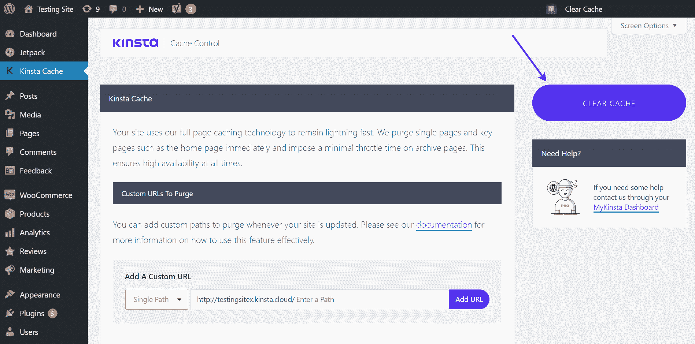

‘Clear Cache’ button in Kinsta Cache’s WordPress dashboard

该按钮变为绿色，并提示在程序完成时缓存已被清除。

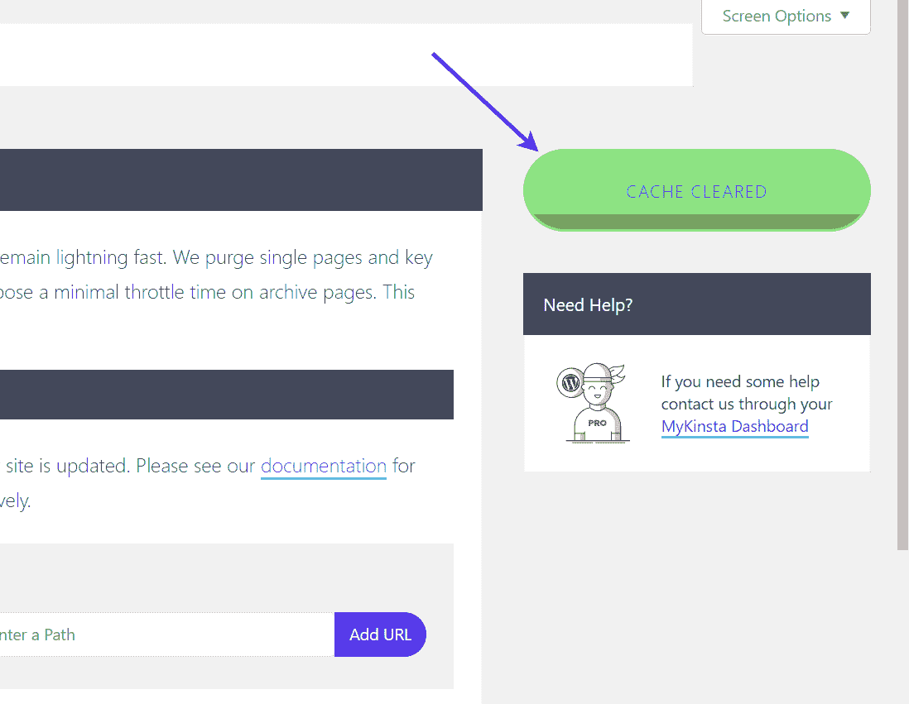

‘Cache Cleared’ success message in WordPress

一个稍微高级一点的工具列在标题为**自定义 URL 清除**的部分。

这允许您从您的网站添加自定义 URL，并仅在更新时从该页面清除缓存。

为此，请在您的域的完整 URL 后面键入您的网站的路径。例如，如果这是你的 WordPress 网站的一个页面，你可以输入“商店”。

[点击此处了解有关正确添加自定义缓存 URL 的更多信息](https://kinsta.com/help/kinsta-mu-plugin/#adding-custom-caching-urls)，包括添加单个和组路径自定义 URL。

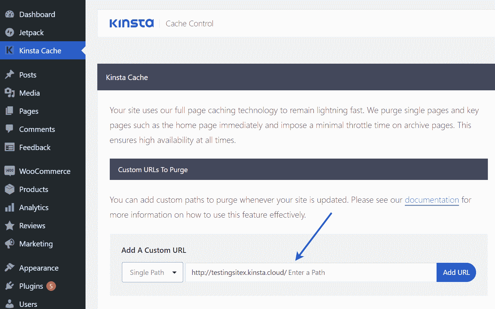

‘Add A Custom URL’ to purge Kinsta cache automatically

点击**添加 URL** 按钮，将自定义 URL 添加到自动清除列表中。

您可以在该列表中包含任意数量的自定义 URL。这与手动或自动清除站点缓存的主要区别在于，您只关注一个 URL，确保无论站点更新发生在哪里，它都会被清除。如果您有一个重要的页面，它不需要自己更新，而是从接收更新的页面中提取内容，这可能会很方便。

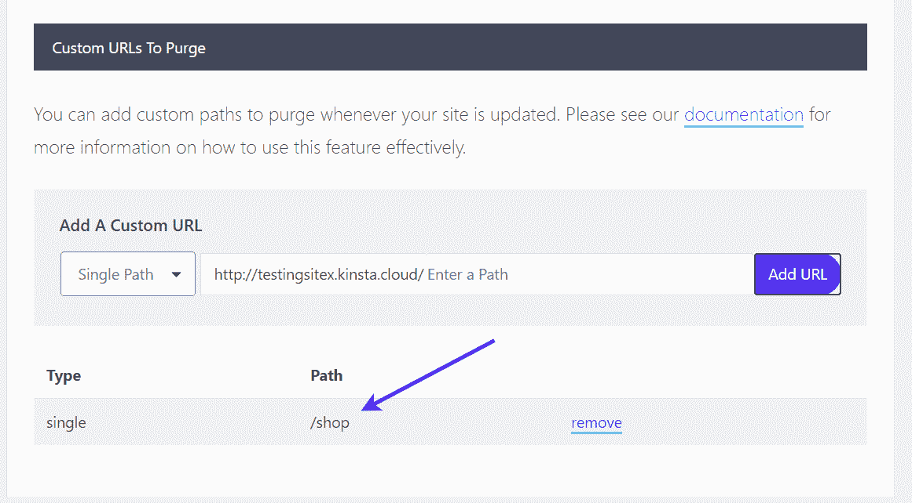

Path type for Custom URLs to purge the cache

## 如何使用最流行的插件清除 WordPress 缓存

有大量的 [WordPress 缓存插件](https://kinsta.com/blog/wordpress-caching-plugins/)供你选择，通常情况下，Kinsta 的客户不需要，因为我们[会为他们处理缓存](https://kinsta.com/blog/wordpress-cache/#types-of-wordpress-cache)。

尽管如此，因为我们想为 WordPress 用户提供可操作的提示，不管他们的托管解决方案如何，我们将概述连接这些流行的缓存插件的过程，并向你展示如何用每个插件清除缓存。

### 用 WP 火箭清除 WordPress 缓存

WP Rocket 是一款优质的缓存插件，提供了先进且易于使用的工具来设置自动化的 WordPress 缓存，以及一个快速的**手动**按钮来清除 WordPress 仪表盘上任何页面的缓存。如果你有任何网站没有在 Kinsta 上运行，我们推荐它作为首选之一。

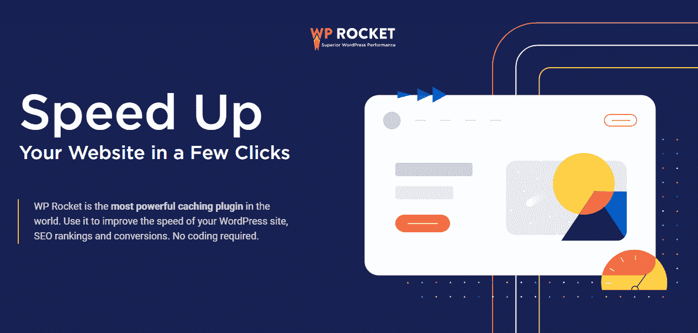

WP Rocket

除了标准的站点缓存，WP Rocket 还提供了[数据库清理工具](https://kinsta.com/blog/wordpress-database-plugin/)、文件优化和 CDN 集成，这只是其中的几个功能。总的来说，这是一个一体化的优化插件，可以很好地取代和整合你网站上的许多其他插件。

要用 WP Rocket 清除 WordPress 缓存，在你的 WordPress 网站上购买并安装插件。获得 WP Rocket 的唯一途径是通过一级销售网站(WordPress 插件库中不提供)。

安装并激活插件后，您可以选择手动和自动清除缓存。

第一个也是最快的选择是在 WordPress 仪表板标题菜单的上部找到 **WP 火箭**标签。点击该选项卡会生成一个下拉列表，其中包含指向**设置**、**预加载缓存**区域、**文档**、**常见问题**和**支持**的链接。

要最快清除缓存，只需点击**清除缓存**项。

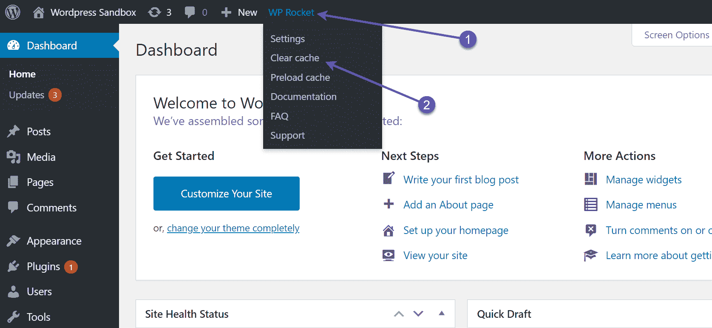

WP Rocket menu to clear WordPress cache

无论你在 WordPress 仪表盘的哪个页面，这个按钮对于那些想要清空缓存并继续工作的人来说都很方便。在 WP Rocket 中清除 WordPress 缓存也不需要太长时间。

这通常取决于你的网站的大小和缓存，但是你不应该等超过几秒钟就能看到确认信息。此外，在此过程中，您可能会看到屏幕闪烁。

注意:我们强烈建议在清空 WordPress 缓存之前保存你当前的工作。在清除缓存时，没有太多机会丢失任何东西，但许多插件会在页面清除后刷新页面。

手动缓存按钮最终会在[仪表板](https://kinsta.com/knowledgebase/wordpress-admin/)屏幕的上部共享一条消息。它应该告诉你它已经清除了缓存，并提供该过程发生的日期和时间。

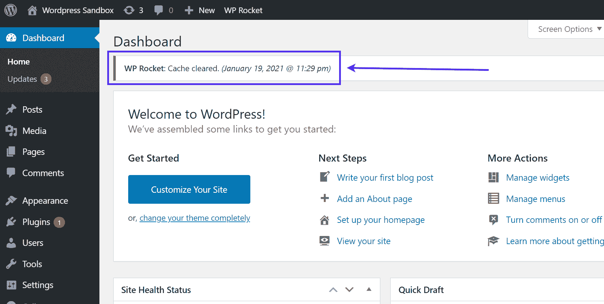

WP Rocket’s cache cleared message

#### 管理 WP Rocket 中的设置并配置自动缓存和清除

快速**清除缓存**按钮很方便，但你很可能不想一直手动清除缓存，尤其是如果你需要在更新页面或帖子后查看内容的变化。在这些页面和帖子被修改后清空缓存更有意义。

因此，我们建议从屏幕顶部的 WP 火箭按钮进入 **WP 火箭>设置**。

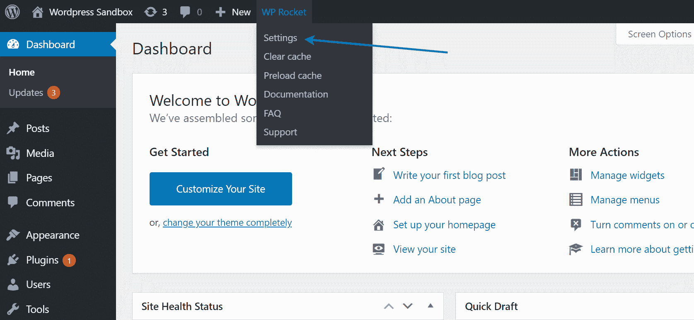

WP Rocket settings

或者，在 WordPress 的侧边栏菜单中选择**设置> WP 火箭**。这两种方法都将您引向同一个页面。

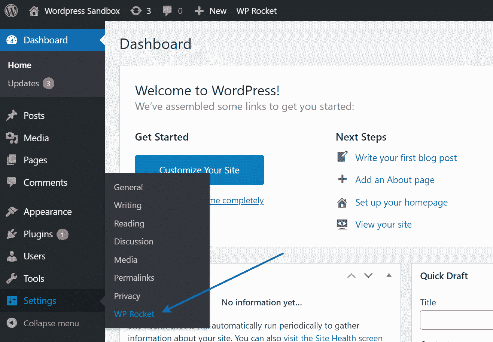

Settings > WP Rocket

WP 火箭控制面板提供了广泛的功能，它都被整合到这一领域。例如，您可以优化您的文件和媒体，同时还可以配置您的 CDN 来加速您的网站。

现在，我们想做的就是清空缓存。

您会注意到该页面上的另一个手动**清除缓存**按钮。它在仪表板部分的右侧。同样，您可以单击这个**清除缓存**按钮来完成我们之前经历的相同的缓存过程。

还有一个按钮[预加载缓存](https://kinsta.com/blog/wp-rocket/#preload)，它实际上是用保存的站点数据加载你的缓存备份。这是一个非常好的特性，可以为您的缓存提供完成工作所需的数据。毕竟，缓存的全部意义在于加快网站的交付速度。清除缓存有它的用处，但是它首先会消除缓存的实际用途。没有多少插件会在清空缓存后提供预加载。

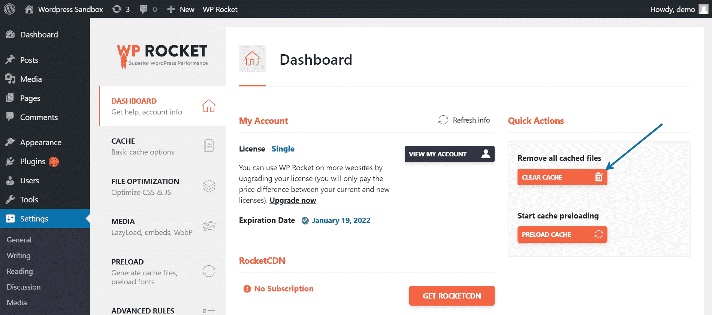

Clear WordPress cache in the WP Rocket dashboard

WP Rocket 插件中的**缓存**标签显示了自动清除缓存和在特定情况下启用缓存的几个选项。

例如，您可以激活**为移动设备启用缓存**功能，以确保网站的所有移动版本也创建缓存，并可以选择稍后清除该缓存。

**用户缓存**是另一个要考虑的选项。

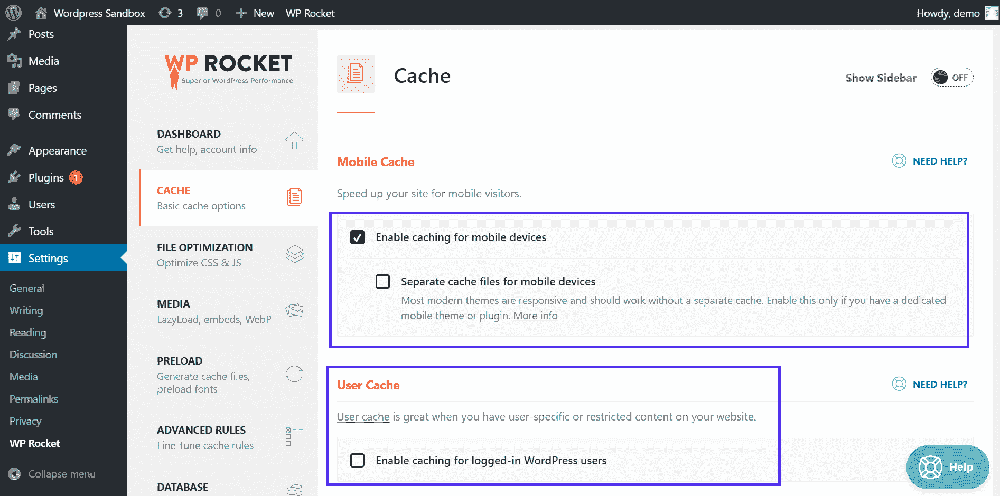

Enable various types of caching in WP Rocket

向下滚动到**缓存生命周期**部分，指定在清空整个全局缓存之前您希望经过的时间。

本质上，这是 WP Rocket 提供的主要自动缓存清理功能。因此，您可能希望每 10 小时清除一次整个站点的缓存。有可能加快或减慢这个时间，比如 7 天或 30 天。

像往常一样，确保在离开页面之前点击**保存更改**按钮。

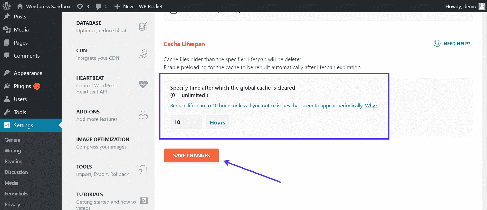

Setting cache lifespan in WP Rocket

WP Rocket 插件的左侧菜单提供了几个缓存和优化工具。

我们建议逐一查看，以确保您的网站以最佳性能运行。例如，您可能需要优化您的媒体项目来查看文件优化。

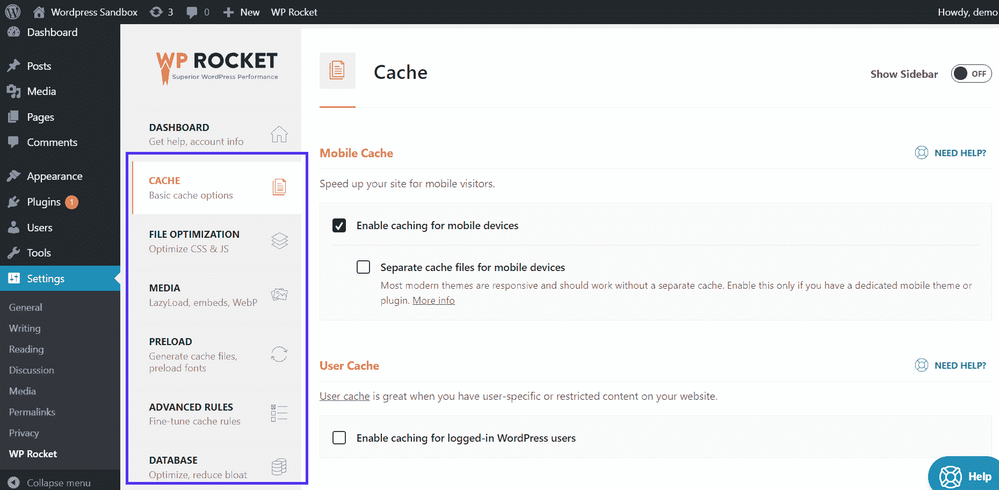

More WP Rocket settings

与 WordPress 缓存直接相关的是**预加载**标签。点击该按钮继续。

这是可选的，但我们建议激活预加载和启用链接预加载。我们之前讨论过预加载，但本质上它是一种在清空缓存后立即在缓存中生成新文件的方法。最后，预加载加速了你的站点文件向用户的传递。

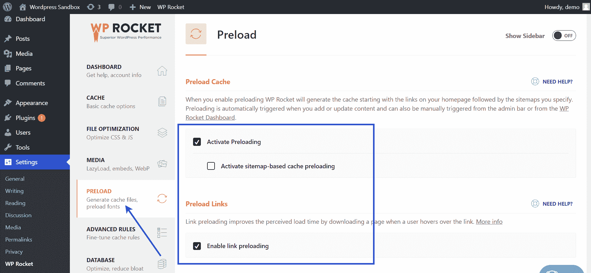

Preload settings in WP Rocket

去 WP Rocket 里的**高级规则**标签也是个不错的主意。

在这里，您可以调整设置，并向缓存清除添加特定的规则和例外。

一个例子是从你的网站粘贴特定的网址，以确保它们永远不会被缓存。[登录页面](https://kinsta.com/blog/wordpress-login-url/)、用户页面和其他内容较少的页面通常不需要缓存，因为它们变化很小，可能不会像其他页面或帖子那样经常被公众访问。

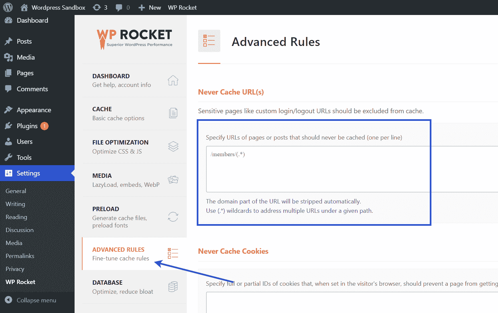

Advanced rules to clear WordPress cache in WP Rocket

最后，WP rocket 中有一个部分是**总是清除 URL**。此区域要求您键入或粘贴一些应该定期清除的网站 URL，或者更具体地说，当它们更新时。

这些是你经常更新的页面和帖子，你需要知道它们的内容会出现在你网站的前端。例如，你的主页可能会不时更新。更新后不清除缓存可能意味着您的用户看不到谈论促销的新横幅。我们不希望这种情况发生。

我们可以说博客帖子也是如此。

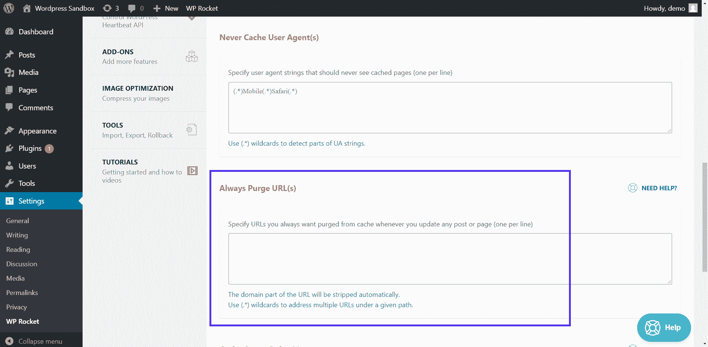

‘Always Purge URL(s)’ setting in WP Rocket

总的来说，有很多其他的 WordPress 缓存插件，但是 WP Rocket 被我们选为最有效和用户友好的。当在 Kinsta 托管领域之外工作时，WP Rocket 将缓存变成了一项简单的任务，并确保您在未来真的不必考虑太多。

### 用缓存启用程序清除 WordPress 缓存(在 Kinsta 不允许)

由[key dn](https://kinsta.com/help/kinsta-cdn/)开发的[缓存使能插件](https://kinsta.com/blog/wordpress-caching-plugins/#cache-enabler)提供了一个快速高效的缓存解决方案，你不需要支付任何费用就可以使用基本功能。

一旦插件安装完毕，缓存过程只需点击一下。

只需在 WordPress 仪表盘的顶部找到**清除站点缓存**按钮。

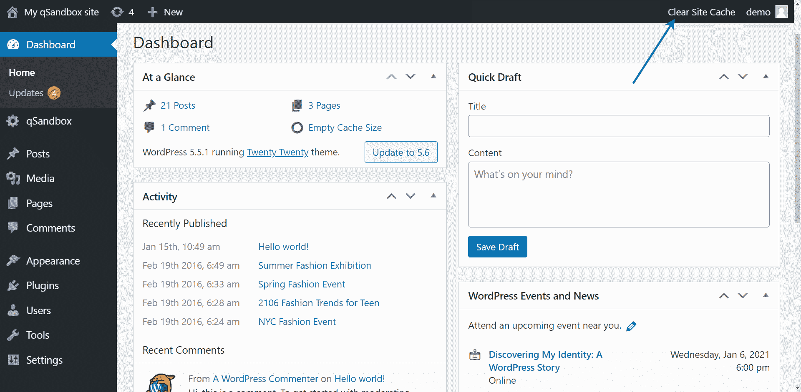

The ‘Clear Site Cache’ button for Cache Enabler

就是这样！您甚至不会被发送到一个新页面来配置缓存清除。这个方便的按钮可以快速清理并刷新页面，让您可以回到正题。

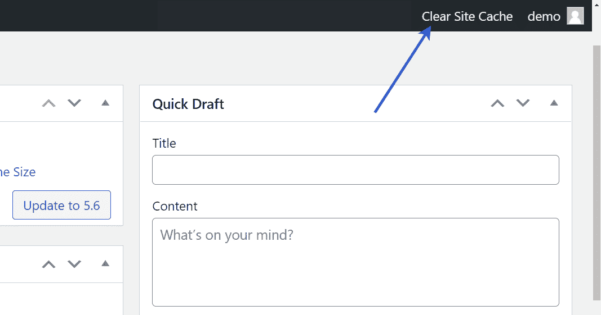

The ‘Clear Site Cache’ button

另一种更高级的清除缓存启用插件中缓存的方法是点击 WordPress 仪表盘中的**设置>缓存启用器**。

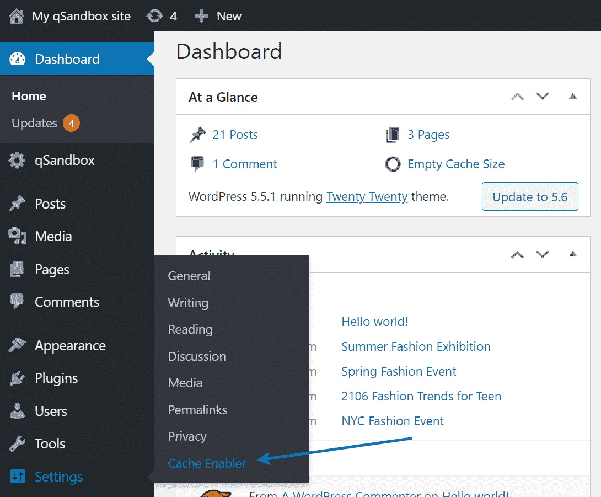

Settings > Cache Enabler

此页面显示了一个更大的缓存行为和设置列表供您考虑。例如，如果发布了任何文章类型，或者插件被激活或停用，您可能想要清除站点缓存。

这些都是完全可选的，使得缓存过程更加自动化。

当您点击**保存更改**按钮时，您甚至可以直接从该页面清除缓存。

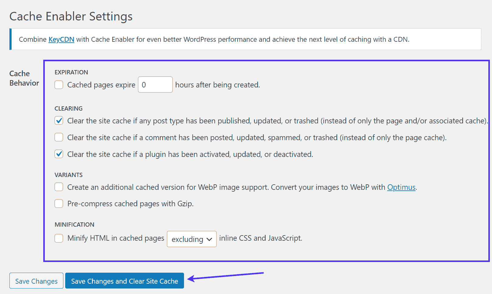

Cache Enable Settings panel

### 用 Comet 缓存清除 WordPress 缓存

彗星缓存插件包括免费和付费两个版本，它的特点是可以缓存从页面和帖子到 RSS 源和类别的所有内容。

要清除 Comet 缓存中的缓存，找到并点击 WordPress 仪表板菜单底部的 **Comet 缓存**标签。

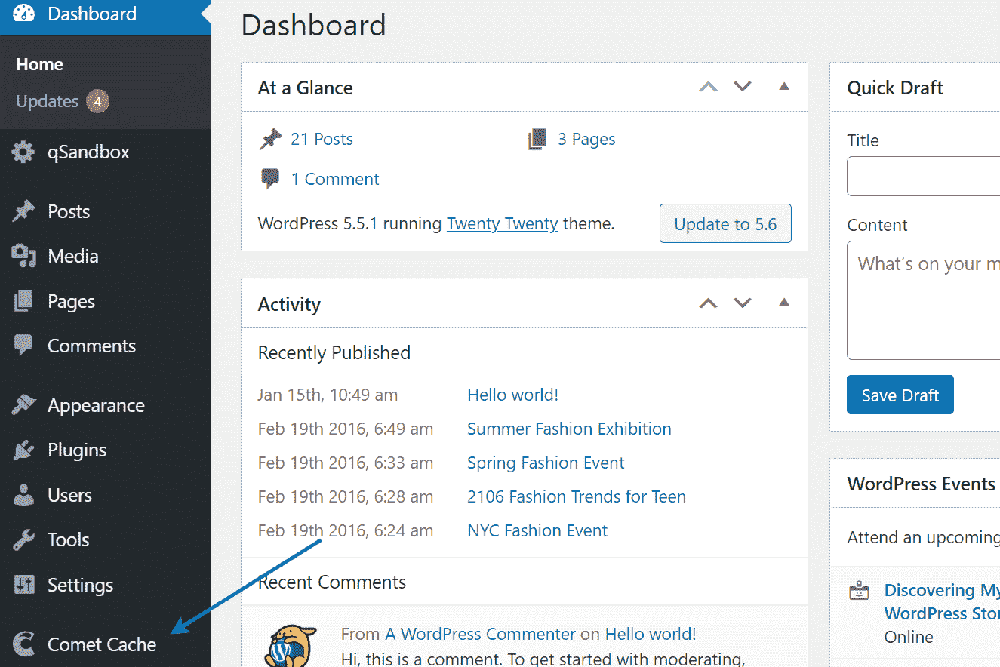

‘Comet Cache’ menu in WordPress dashboard

对于这些插件，有一个快速的**清除**按钮来清除缓存，而不需要立即配置任何其他设置。

对于这个插件，你实际上必须进入 Comet 缓存设置页面。

点击**清除**按钮。

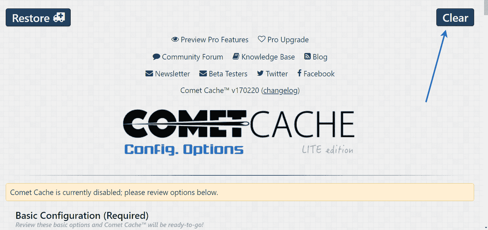

Clear WordPress cache with Comet Cache

将出现一条消息，显示您的缓存清除成功。

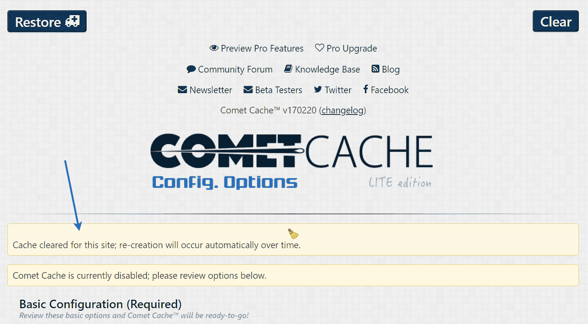

Cache cleared message with Comet Cache

为了确保将来定期进行缓存，向下滚动设置页面并选中 **Yes，enable Comet Cache** 选项。

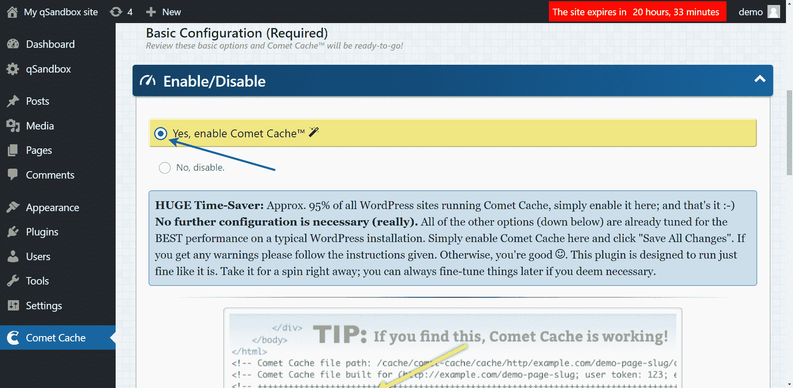

Enable/Disable cache in Comet Cache

从自动缓存清除到缓存过期时间，此页面上还提供了各种其他自动设置。

在保存您的 Comet 缓存设置之前，请随意点击这些部分。这样，您就不必考虑未来更具体的缓存机会。但是请记住，简单地打开 Comet Cache 是最重要的部分。

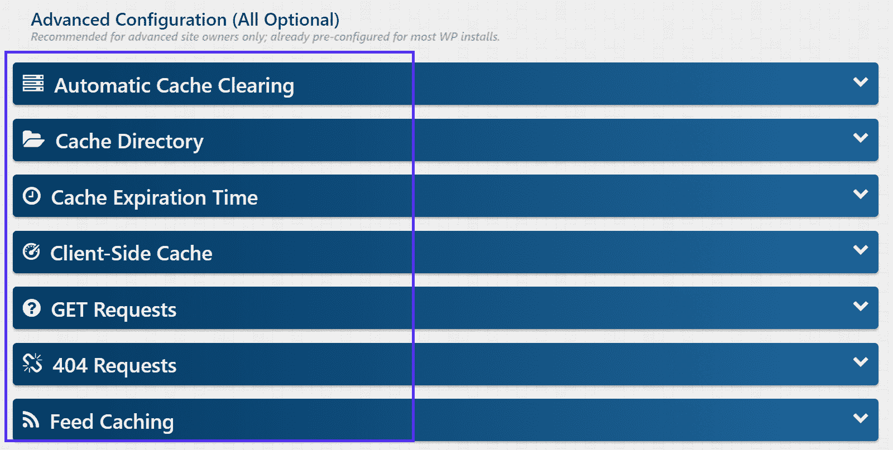

Advanced Configuration screen for Comet Cache

点击 **Save All Changes** 按钮完成并开始运行 Comet Cache。

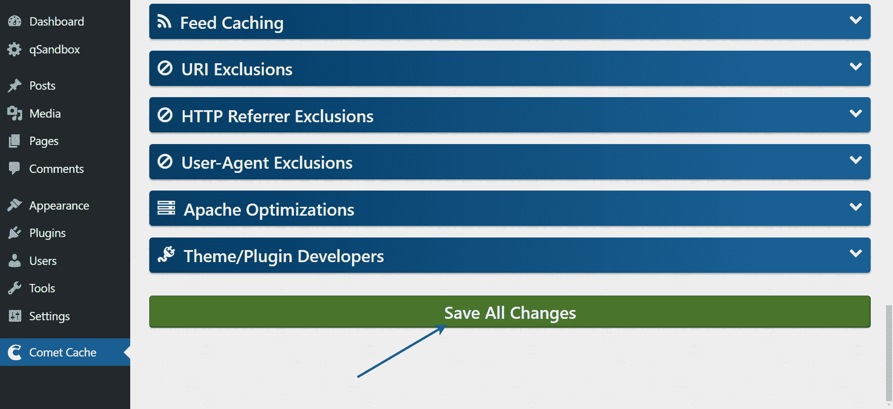

‘Save All Changes’ button in Comet Cache

### 用 W3 总缓存清除 WordPress 缓存

W3 Total Cache 很受欢迎，看看它是市场上下载量最大的缓存插件之一。这是一个免费插件，它为[专用服务器](https://kinsta.com/knowledgebase/dedicated-server/)、移动环境和[cdn](https://kinsta.com/blog/wordpress-cdn/)提供功能。

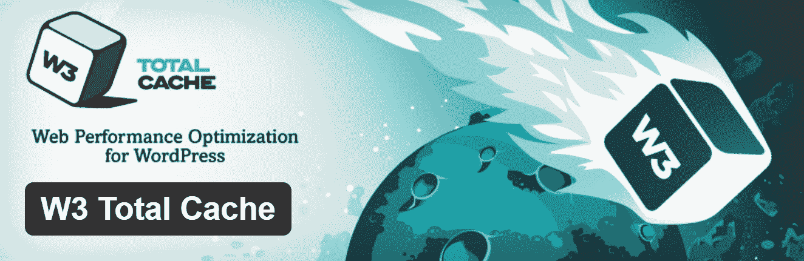

W3 Total Cache

要开始用 W3 总缓存清除缓存，找到 WordPress 仪表板顶部的**性能**标签。将鼠标滚动到性能菜单项上会显示一个下拉菜单，用于转到其他插件页面或直接从您的仪表板位置清除缓存。

点击**清除所有缓存**按钮，清除所有缓存。

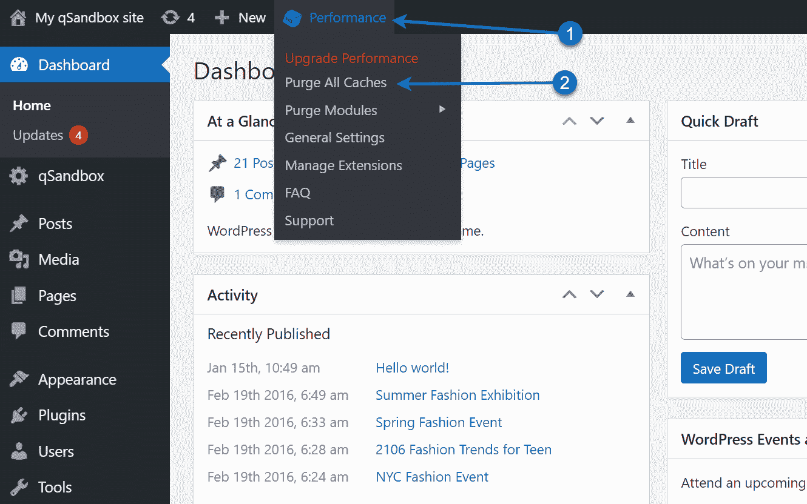

W3 Total Cache’s ‘Performance’ top header menu link

之后，会出现一条消息，告诉您缓存实际上已被成功清空。

## 注册订阅时事通讯

### 想知道我们是怎么让流量增长超过 1000%的吗？

加入 20，000 多名获得我们每周时事通讯和内部消息的人的行列吧！

[Subscribe Now](#newsletter)

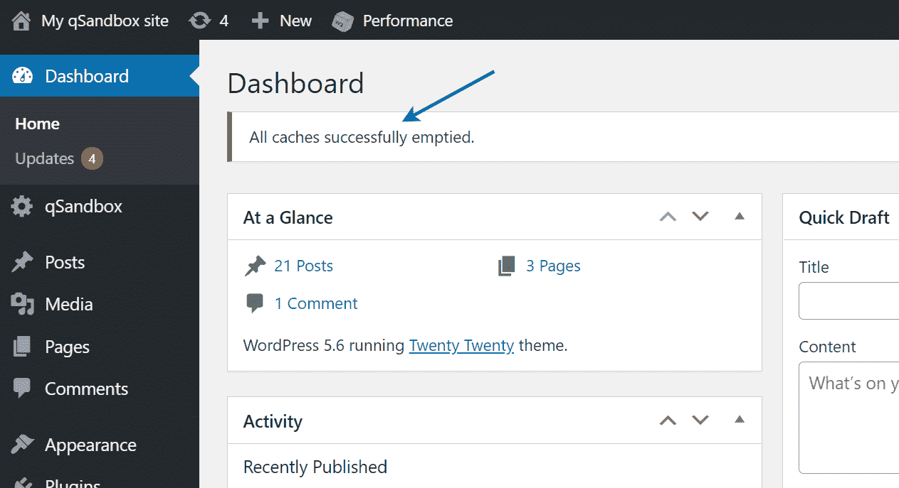

‘All caches successfully emptied’ message

您也可以选择转到常规设置区域。

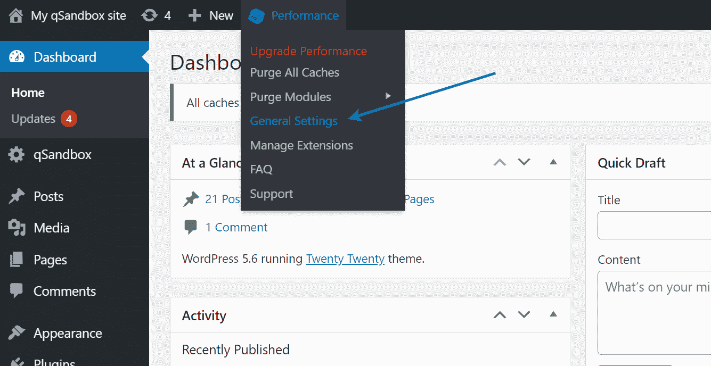

General Settings link for W3 Total Cache

有一个**清空所有缓存**按钮，与上一个按钮做同样的事情。它只是位于一个不同的地方。

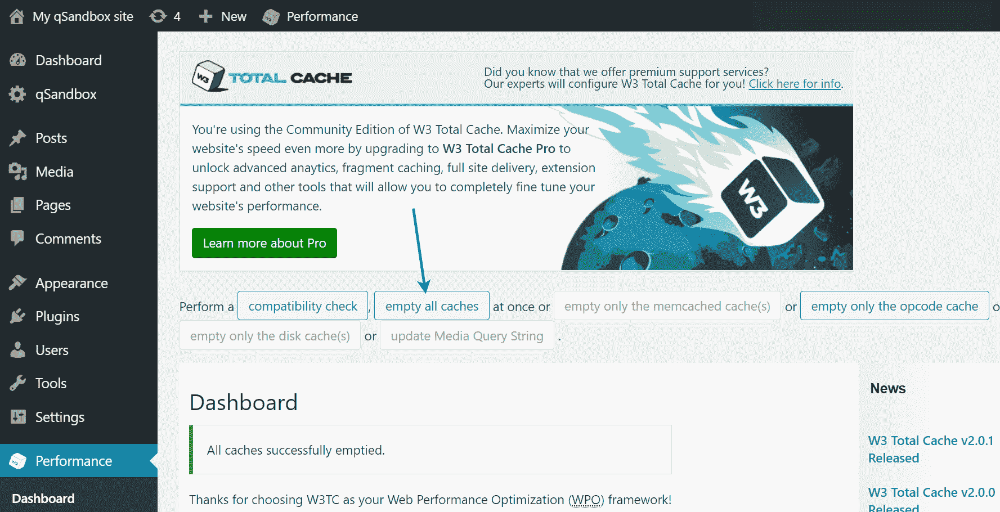

Click the ’empty all caches’ to purge WordPress cache

W3 Total Cache 的大多数自动缓存设置都在 WordPress 仪表盘菜单的**性能**标签下。

例如，有一个选项用于**常规设置**、**页面缓存**和**缩小**，以及许多其他选项。

这些对于优化你的网站来说都是很棒的，但是总的来说要确保标准的页面缓存功能是活跃的。

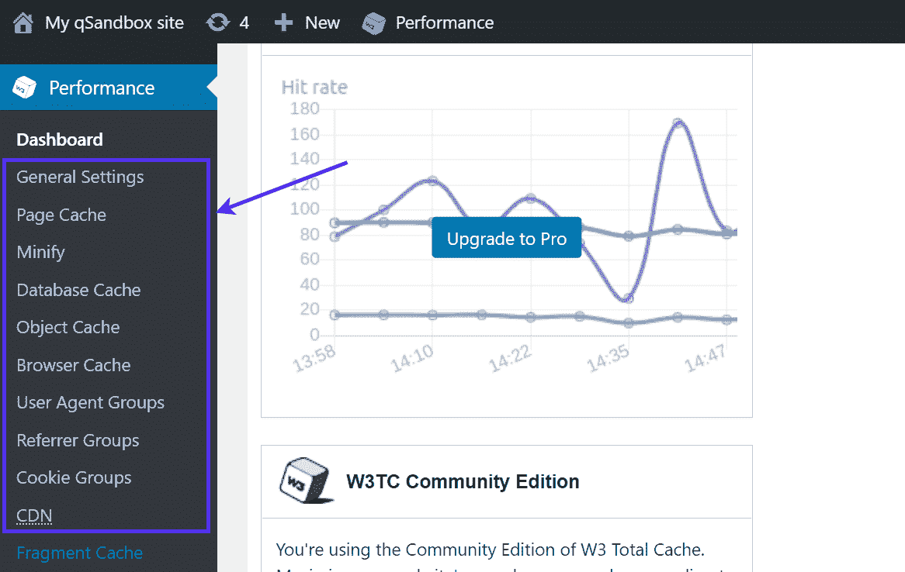

W3 Total Cache’s ‘Performance’ menu

您可以在**常规设置**页面上激活常规页面缓存。

在该页面上，标记**启用页面缓存**的框。

还有各种其他设置可以配置，但这是最重要的一个。例如，我们喜欢缩小你的媒体元素的想法，以确保它们得到优化，而不会减慢你的网站。

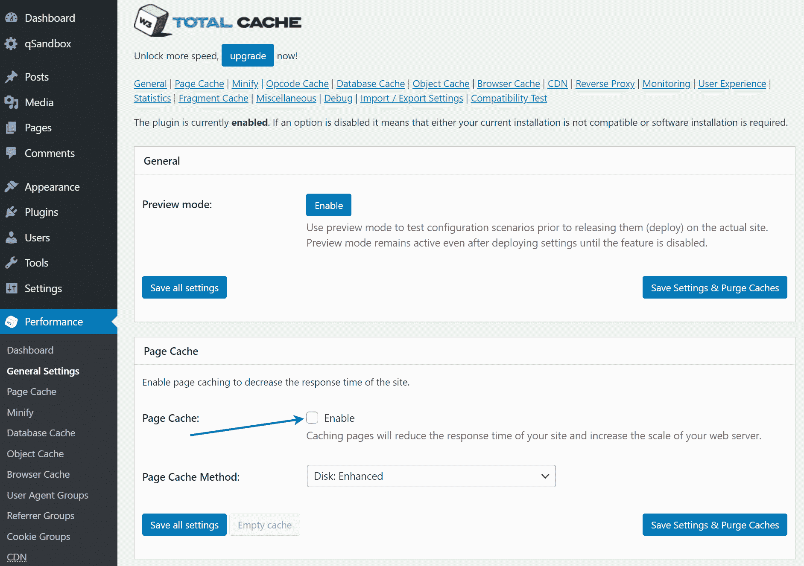

Enabling Page Cache in W3 Total Cache

### 用 WP 超级缓存清除 WordPress 缓存

Automattic 的 WP 超级缓存拥有干净的界面和令人难以置信的功能列表，对于想要在网站上缓存的 [WordPress 初学者和高级用户来说都是一个可行的解决方案。](https://kinsta.com/knowledgebase/what-is-wordpress/)

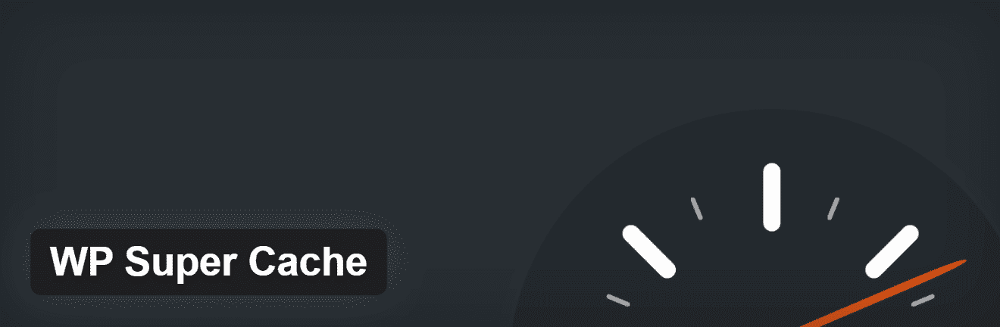

WP Super Cache

用 WP 超级缓存清除你的网站缓存相当简单。

插件被激活后，一个**删除缓存**按钮出现在 WordPress 仪表盘的顶部菜单上。

点击此按钮。

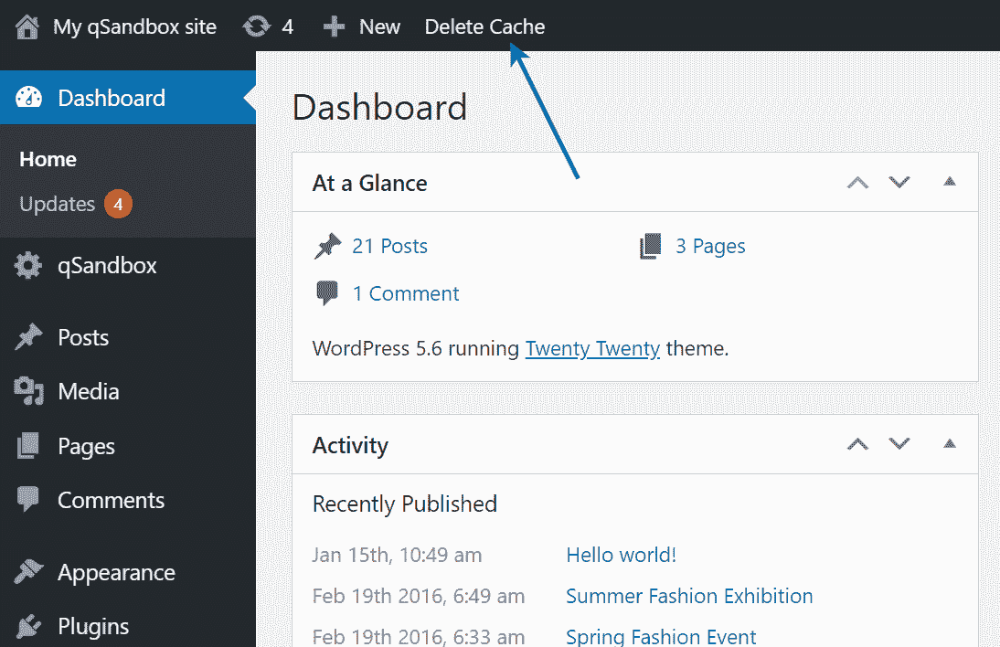

WP Super Cache’s ‘Delete Cache’ link

与其他缓存插件不同，缓存并不是一步就能清除的。

相反，它会将您转到缓存设置页面。

在那里，您必须点击**删除缓存**按钮来完成该过程。

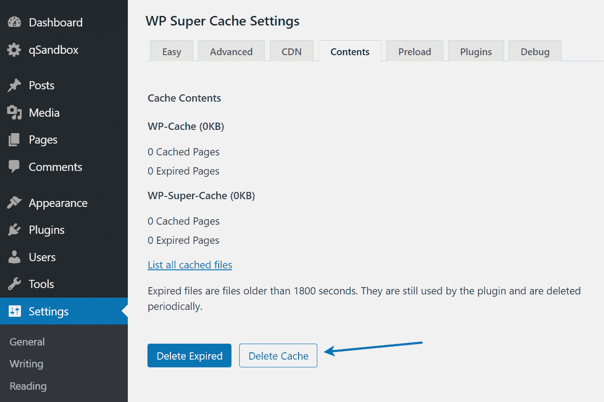

WP Super Cache Settings

要深入了解 WP 超级缓存的强大功能，请进入**设置> WP 超级缓存**。

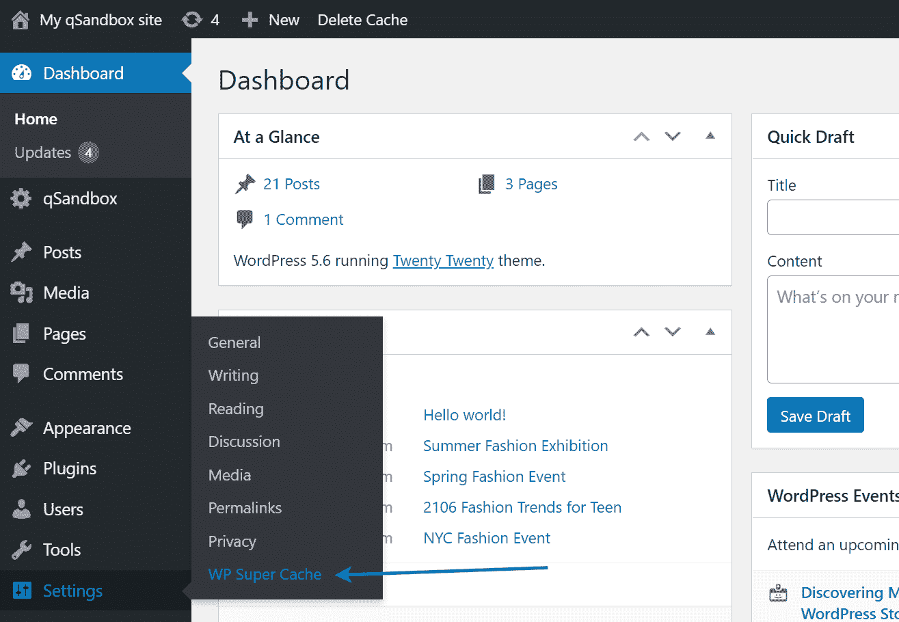

WP Super Cache under WordPress Settings menu

您可以通过选中名为“打开缓存”的选项来打开自动缓存。

确保点击**更新状态**按钮保存更改。

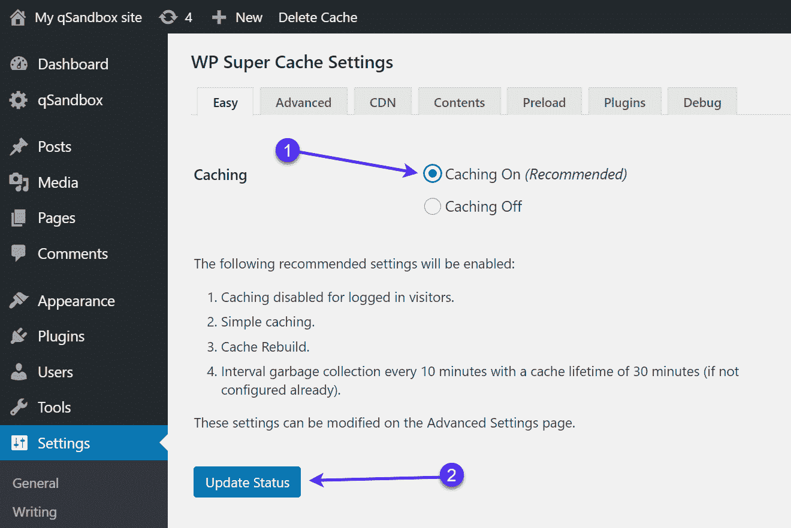

Setting caching On/Off in WP Super Cache

除此之外，WP 超级缓存的所有其他元素都是可选的。有一种**简单的**缓存方法和一种**专家的**缓存方法。您还可以通过插件设置来完成诸如为所有访问者缓存、CDN 配置和内容缓存等任务。

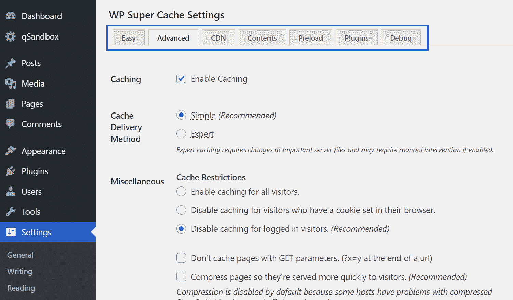

WP Super Cache Settings tabs

### 用 WP 最快的缓存清除 WordPress 缓存(Kinsta 不允许)

[WP 最快缓存](https://kinsta.com/blog/wordpress-caching-plugins/#wp-fastest-cache)包括免费版和高级版。它提供了清除 WordPress 缓存文件和完成其他独特功能的快速方法，如预加载缓存或从缓存中排除某些页面和用户代理。

该插件具有 CDN 和 [SSL 支持](https://kinsta.com/help/how-to-install-ssl-certificate/)，你可以激活特定页面的缓存超时，并在页面和帖子更新时自动删除它们的缓存文件。高级版本将你的缓存清理能力提升到一个更高的水平，具有缩小、压缩和合并 CSS 的功能。

考虑到 WP Fastest Cache 是如何作为一个免费插件被广泛使用的，我们将介绍如何在那个版本中清除 WordPress 缓存文件。要启动，安装并激活 WP 最快缓存插件。

WP Fastest Cache

有两种方法可以清除 WP 最快缓存中的缓存，但我们将开始设置自动缓存清除。这样，您就可以在后台运行缓存清除，而不必每次都手动进行。

在 WordPress 仪表盘中找到 **WP 最快缓存**按钮。在你的网站上激活插件后会出现。

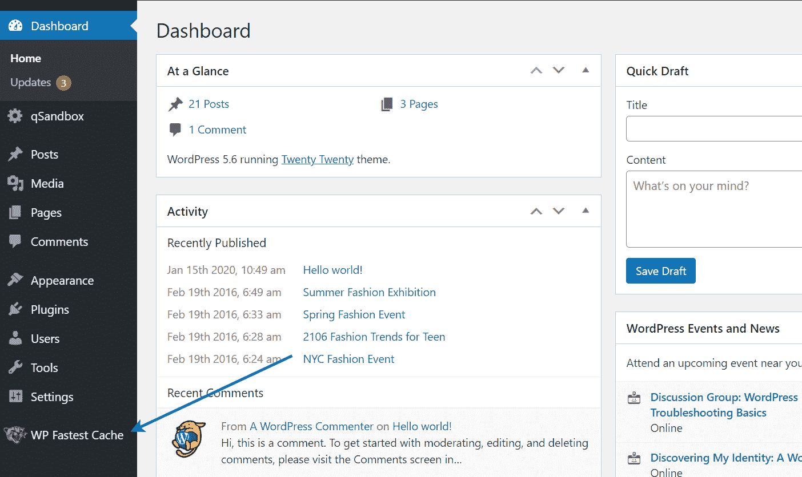

WP Fastest Cache menu in WordPress dashboard

这将把你带到主插件页面，用于调整选项和配置从一般设置到图像优化的一切。

从勾选**启用缓存系统**框开始。这是最重要的框，因为它开启了定期清除缓存的基本功能。

插件附带了许多其他的设置，所以你可以随意滚动浏览它们，决定你想要激活的设置。

例如，当你创建一篇新文章或更新一篇文章时，清除缓存文件不失为一个好主意。你可能还想为你的 HTML 和 CSS 打开[缩小](https://kinsta.com/knowledgebase/combine-external-css/)，这两者都有助于提高性能。

总的来说，你在这一页上标记所有的方框不会真的出错。然而，我们建议一个接一个地进行，以确保其中一个优化特性不会与另一个插件冲突或者扰乱你的站点编码。

我们也建议考虑**预加载**设置，因为它允许你自动缓存整个网站。这并不总是一个理想的选择，但偶尔可以被认为是一个支配性的功能，它可以处理大量的缓存，而不必让您的设置变得太专业。

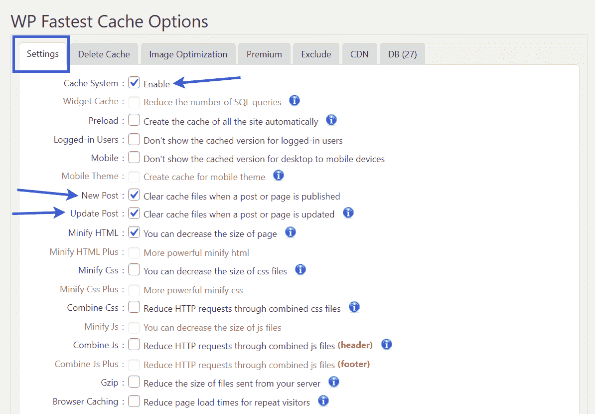

Enable ‘Cache System’ in WP Fastest Cache Options

完成设置区域后，请务必点击**提交**按钮。这将激活所有自动缓存，并开始优化您的站点，而您只需做很少的工作。

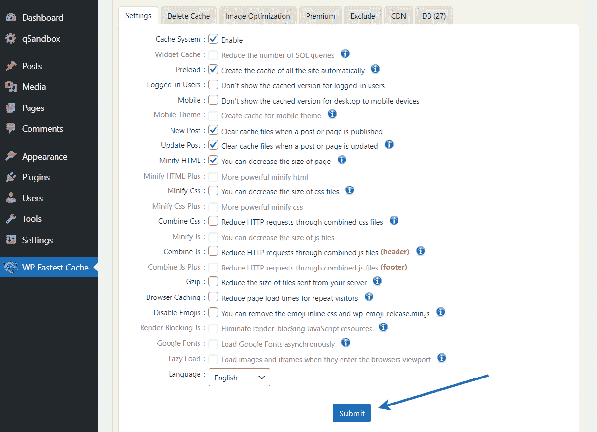

Click the ‘Submit’ button in WP Fastest Cache Settings

要手动清除带有 WP 最快缓存的缓存，请单击 WP 最快缓存选项页面中的**删除缓存**选项卡。

选择两个按钮中的一个:**清除所有缓存**或**删除缓存**和**缩小 CSS/JS** 。

**清除所有缓存**按钮处理整个网站，针对所有缓存文件，尤其是对象和页面缓存。

**删除缓存**和**缩小 CSS/JS** 按钮控制 CSS 和 Javascript 文件的缓存。本质上，如果您或您的开发人员编辑 CSS 或 JS 文件，您应该单击此按钮。如果你要缩小那些文件，这是必要的。无论如何，在新的 CSS 或 JS 文件中实现的更改很可能不会出现，除非您清除了适当的缓存。

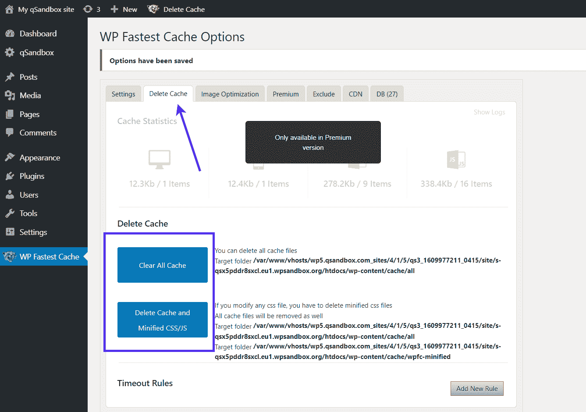

The ‘Delete Cache’ tab in WP Fastest Cache Options

WP 最快缓存还可以帮助你添加超时规则，很像 MyKinsta 有基于时间段的过期规则。

单击**添加新规则**按钮，打开一个弹出窗口，询问您希望缓存超时的频率。请记住，缓存超时意味着缓存被清除。

因此，你告诉 WP Fastest Cache 你想每小时、每天或每周清除主页或任何其他页面的缓存。

点击 **Save** 按钮，将您的规则存储在仪表板中，并知道缓存会在您期望的时间间隔发生。

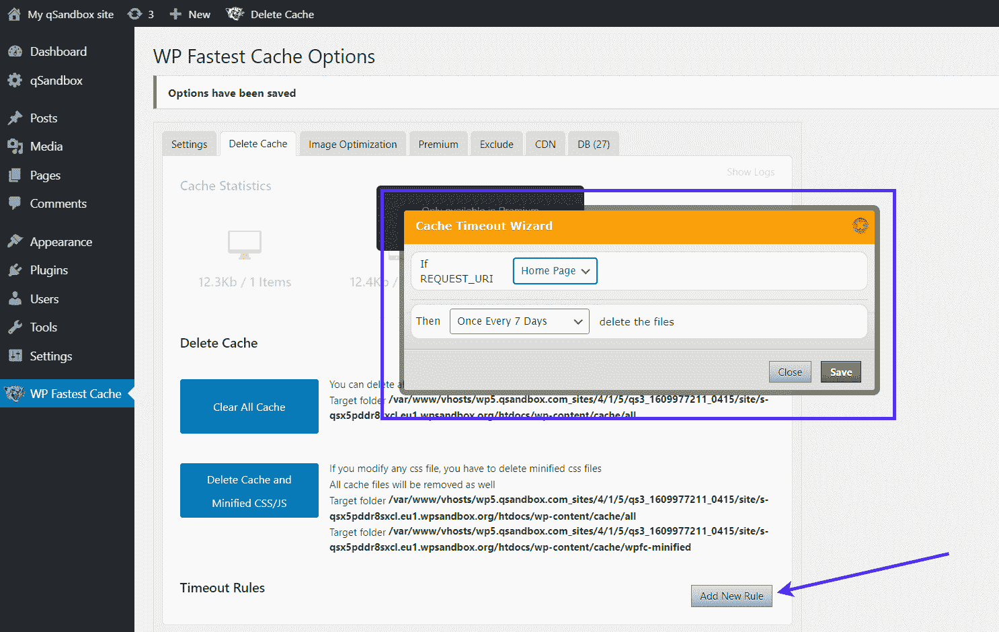

The ‘Cache Timeout Wizard’ in WP Fastest Cache

WP Fastest Cache 提供了一组令人印象深刻的缓存和清除工具，以及用于链接到 CDN、[优化图像](https://kinsta.com/blog/optimize-images-for-web/)和从缓存清除中排除页面的补充工具。

在同一个窗口中访问所有这些功能。只需单击其中一个选项卡，即可查看包含的所有功能和设置。

例如，您可以选择**排除**选项卡来添加新规则，以确保某些页面不会被缓存或清除缓存。相当多的页面和用户代理已经被默认排除在外，比如`**wp-login.php**`页面和`**/wp-admin**`页面，它们都是后端模块，没有理由使用缓存特性。

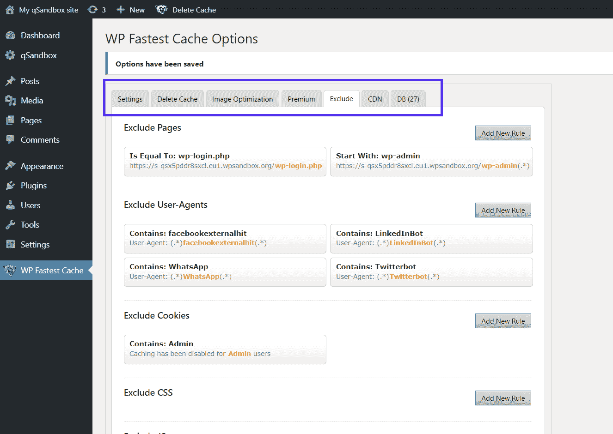

The ‘Exclude’ tab in WP Fastest Cache Options

最后，你可能想知道如何用 WP 最快的缓存插件直接从仪表板上清除缓存。

像 Kinsta 和许多其他顶级缓存插件一样，WP Fastest Cache 在你的仪表盘顶部菜单中添加了一个**删除缓存**按钮。

点击**删除缓存**标签，显示这些选项:**清除所有缓存**、**删除缓存**、**缩小 CSS/JS** 。这些是我们在主 WP 最快缓存设置页面中看到的相同清除项目。唯一的区别是，你可以在任何时候在 WordPress 仪表盘上访问它们。

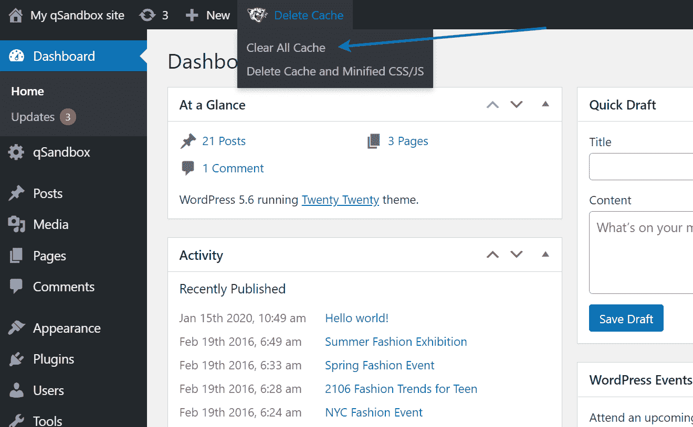

WP Fastest Cache’s ‘Clear All Cache’ link

WP 最快缓存的伟大之处在于，清除 WordPress 缓存存储通常不到一秒钟。你会看到一个简短的加载微调器，但是随后仪表盘会恢复正常，你可以在 WordPress 上继续你的一天。

WP 最快的缓存插件没有显示任何确认消息，所以从技术上来说，你可以假设缓存清理是正确的。

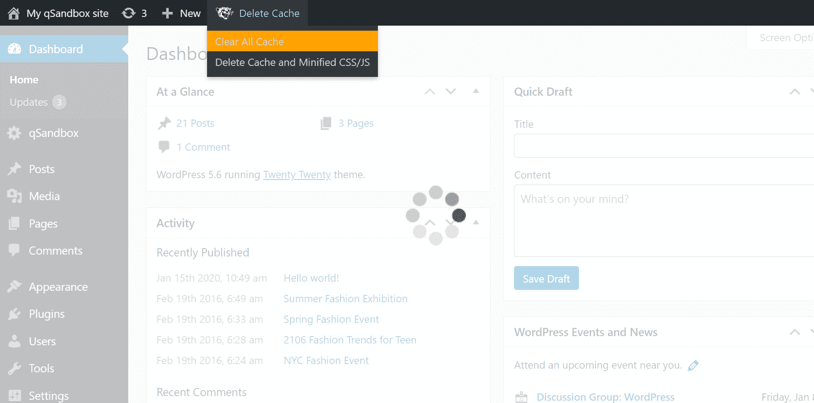

Wait for the WordPress cache to clear

### 使用 LiteSpeed 缓存清除 WordPress 缓存(在 Kinsta 不允许)

LiteSpeed 缓存宣称自己提供了所有 WordPress 缓存插件中最快的结果。不管这种说法是不是真的，很明显，用户似乎喜欢这个插件带来的现代界面和速度。

总的来说，LiteSpeed 缓存插件是一个[服务器级缓存](https://kinsta.com/blog/wordpress-cache/#no-wordpress-cache-plugins-are-needed-at-kinsta)，它被认为是一个一体化的站点加速解决方案。所有普通的缓存功能都是免费版的，但是一些额外的附加功能需要你有 LiteSpeed 的特殊主机。

与宕机和 WordPress 问题做斗争？不要烦恼！Kinsta 是一款考虑到性能和安全性的托管解决方案！[查看我们的计划](https://kinsta.com/plans/?in-article-cta)

我们喜欢的功能包括对象缓存和[图像优化](https://kinsta.com/blog/optimize-images-for-web/)，所有这些都集成在一个插件中。你也可以结合 CSS/JS 和 lazyload 你的图片和 iframes。更不用说，你可以有多种选择来选择一个 CDN，并进一步加速你的网站。

LiteSpeed Cache

这一切都是从进入 WordPress 仪表盘用 LiteSpeed 缓存插件清除 WordPress 缓存开始的。

一旦 LiteSpeed 缓存插件安装完毕，你应该会在 WordPress 的上层菜单上看到一个来自插件开发者的图标。滚动此图标会显示几个选项供您选择，包括管理缓存、配置设置和优化图像。

要快速清除缓存而不影响您的其他工作，只需点击图标并选择 **Purge All** 按钮。

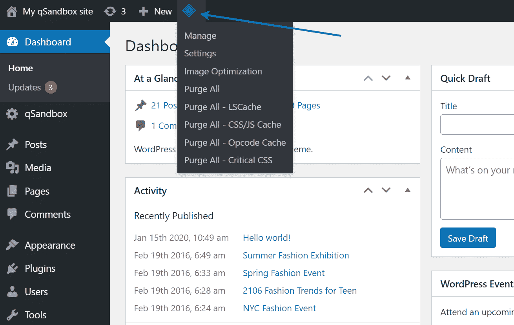

LiteSpeed Cache icon menu link

**Purge All** 按钮清除从主 LiteSpeed 缓存到 CSS 和 Javascript 缓存的所有缓存存储。这是消除缓存中任何保存的代码版本或网站数据的最有效方法，尤其是如果您没有使用更独特的缓存清除过程的经验。

您还可以使用其他几个选项来清除缓存。例如，你可以清除**关键 CSS** 缓存，其他什么都不做。其他选项包括**操作码缓存**、 **CSS/JS 缓存**和 **LSCache** 。

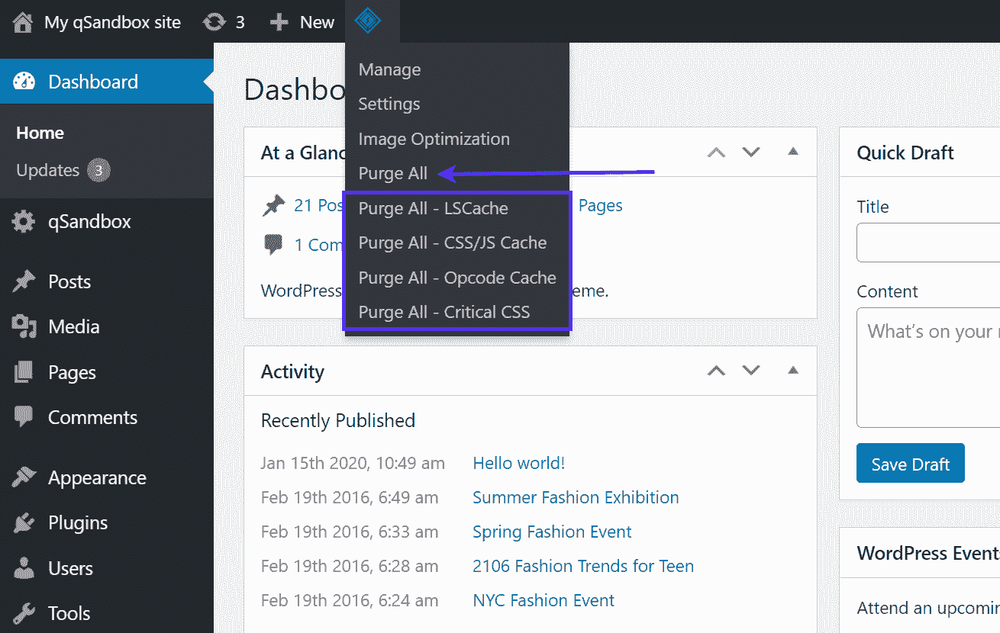

LiteSpeed Cache’s ‘Purge All’ button

单击 **Purge All** 按钮会运行整个缓存清理过程，应该不超过几秒钟就可以清除您的存储器中的内容。但是，对于拥有更多资源的大型网站，可能需要更长的时间。

LiteSpeed 缓存插件也不会让你离开 WordPress 仪表盘上的当前页面。有了这个优势，您可以继续处理页面或帖子，同时还可以在需要时获得清除缓存的好处。

缓存清除完成后，您会看到一条成功消息。

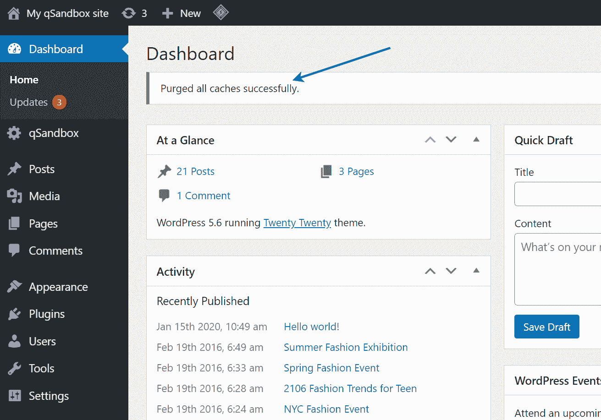

‘Purged all caches successfully’ message

每个特定的缓存清除函数都有自己的消息，所以根据您使用的是哪个函数，您可能会看到一些稍微不同的东西。

总的来说，LiteSpeed 缓存提供了一个简单、直观的方法来清除站点缓存，让大部分的混乱远离 WordPress 界面。

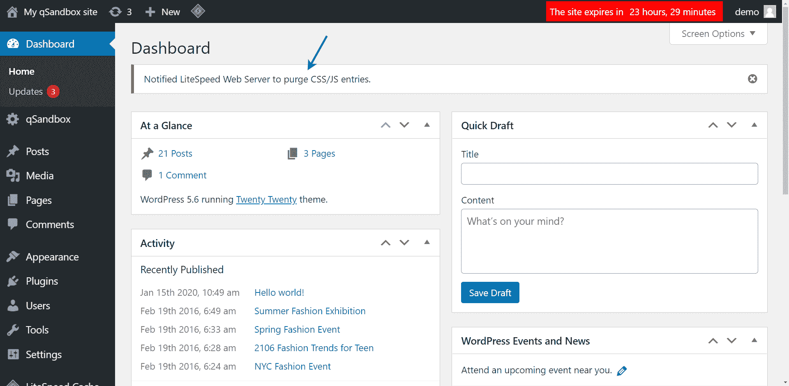

Purge CSS/JS entries message

继续向前，LiteSpeed 缓存插件还提供了高级工具，用于自动清除您的缓存，并连接到 LiteSpeed 缓存本身提供的免费 CDN。

要访问这些工具，请点击 LiteSpeed 缓存图标，然后转到**管理**按钮。或者，您可以在侧边栏菜单中选择 **LiteSpeed 缓存**链接，然后选择**仪表盘**。仪表板提供了关于您的优化工作和缓存的分析和信息。

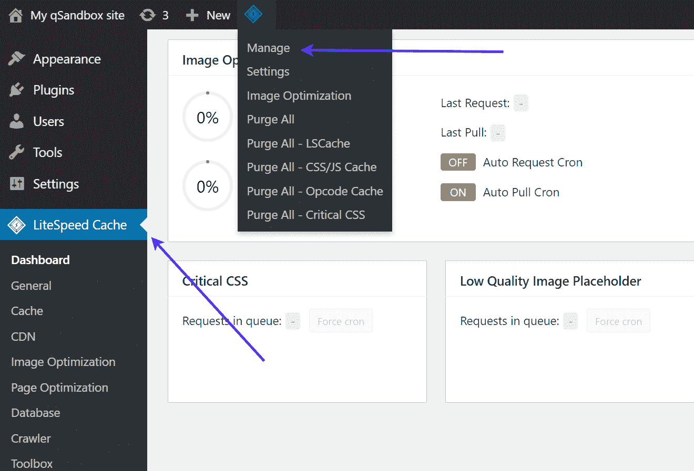

LiteSpeed Cache’s ‘Manage’ tab

我们还建议去 **LiteSpeed 缓存>缓存**激活缓存系统的自动化部分。

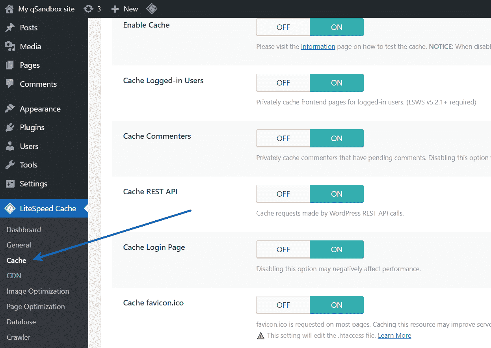

LiteSpeed Cache’s ‘Cache’ settings screen

然而，该插件要求您在打开任何这些自动化功能之前连接到它的 CDN。所以，你必须先去 **LiteSpeed 缓存>通用**。

结果页面概述了您必须获得一个域密钥来激活 LiteSpeed CDN。这是一项免费服务，可以根据用户访问你的网站的情况，加快你的网站和页面的速度。

本页提供了如何在几个步骤内获得该域密钥的信息和按钮。简而言之，他们会把你送到 LiteSpeed Cache 网站注册一个账户，然后把你的网站链接到你的 LiteSpeed Cache 仪表盘。

之后，域键字段被填充，之后你应该点击**保存更改**按钮。

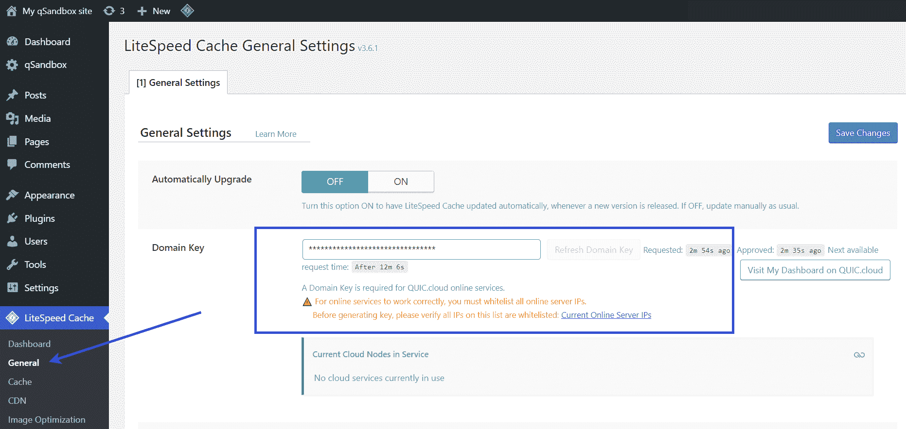

LiteSpeed Cache’s ‘General’ Settings screen

在打开自动缓存之前，还有一个操作过程需要考虑。你实际上必须说你想在你的网站上使用 CDN。

为此，在 WordPress 仪表盘中进入 **LiteSpeed 缓存> CDN** 。

第一个设置询问 **QUIC.cloud CDN** 的情况。这就是你要找的。

确保它被设置到位置的**，你**保存更改**。**

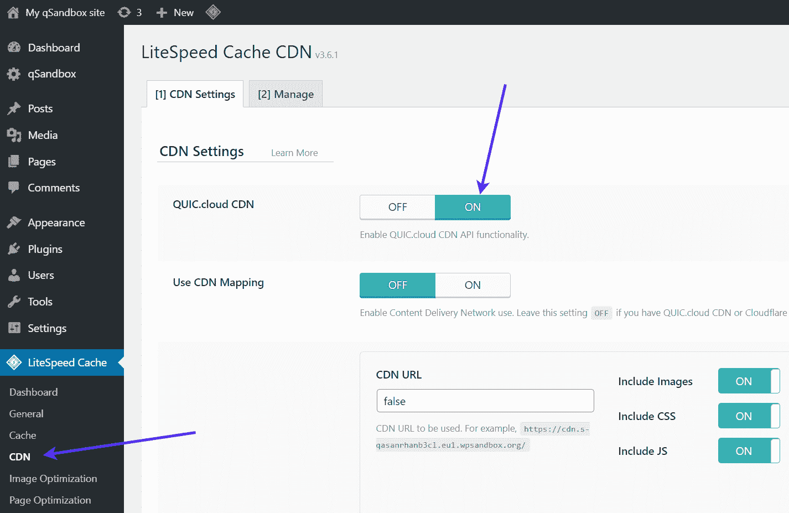

Turning QUIC.cloud CDN on in LiteSpeed Cache

最后，你可以重新导航回 **LiteSpeed 缓存>缓存**。

下面的页面包含了几个要激活的开关，具体取决于您想要定期缓存和优化的内容。

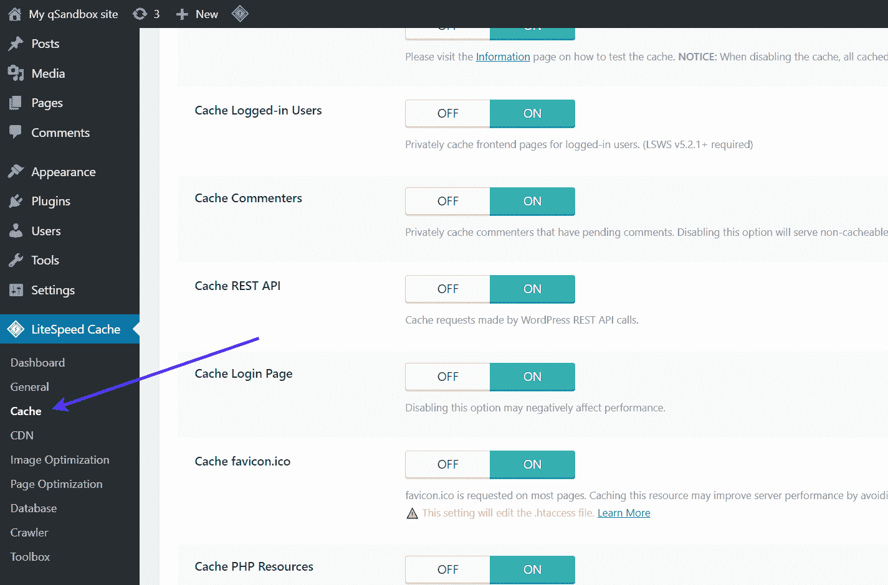

LiteSpeed Cache settings

第一个设置叫做**启用缓存**，对你的网站来说是最重要的。将它转到位置的**。**

将启用缓存功能设置为 on 可确保您不必再在每次手动更新内容时清除缓存。

此外，在主要的**启用缓存**工具下，还有几个其他的缓存设置需要配置。

其中有**缓存登录用户**、**缓存评论者**、**缓存 REST API** 等等。这些是比标准的页面和对象缓存更加具体的缓存过程，因此它是否对您的组织有帮助取决于您自己。

继续之前，请务必点击**保存更改**按钮。

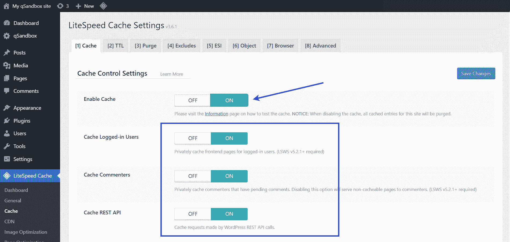

‘Enable Cache’ option in LiteSpeed Cache Settings

另一个需要考虑的方面是在升级时清除缓存的所有部分。插件、主题或 WordPress 核心更新可以在你的网站上启用许多附加功能，这是清理缓存并确保一切从头开始的理想时机。

在 LiteSpeed 缓存设置中，转到**清除**选项卡。在上将**清除所有升级**开关设置为**。**

该页面提供了许多其他特定的清除设置，用于清除特定页面和帖子上的缓存，因此可以随意点击这些设置，并选择要包括的设置。

完成后，再次点击**保存更改**按钮。

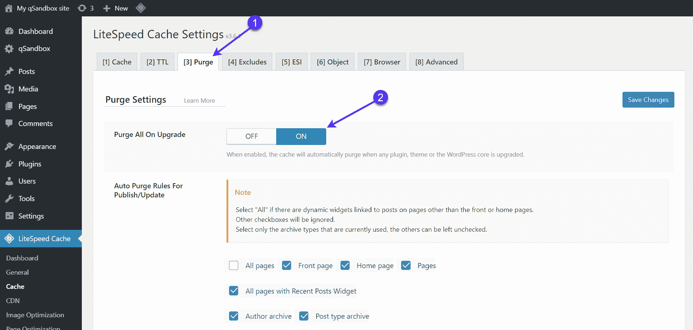

‘Purge All On Upgrade’ option in LiteSpeed Cache

你会注意到 LiteSpeed 缓存插件的缓存功能是细分的，所以你永远不会缓存不需要的东西。对象缓存也不例外。

转到 LiteSpeed 缓存设置中的**对象**选项卡，激活缓存的自动清除。

对象缓存过程的大部分已经为您配置好了，所以您所要做的就是确保**对象缓存**开关被切换到位置的**。**

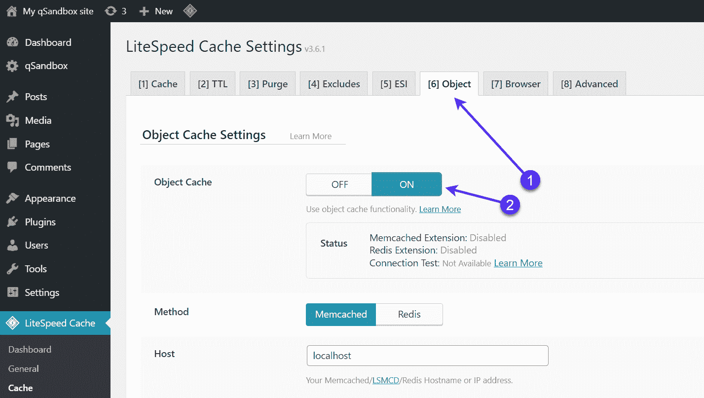

Object Cache Settings tab in LiteSpeed Cache

你有它！作为一个普通的 WordPress 用户，这就是你真正需要知道的关于 LiteSpeed 缓存插件的全部内容。对于 CDN 和缓存，还有许多其他更高级的功能。

尽管如此，上述设置使您能够优化您的网站，并确保缓存不会妨碍任何更新或内容添加。如果所有其他的都失败了，回到 WordPress 仪表板菜单上部的 **LiteSpeed 缓存**图标按钮来清除缓存的每个部分。

## 如何通过浏览器清除缓存

当用户打开你的网站时，服务器端缓存并不是唯一的因素。事实上，用户的浏览器中已经安装了一个本地缓存工具。绝大多数主流浏览器都包含一个缓存来加快自己网站的渲染速度，为用户提供更流畅的体验。

因此，你可能会发现，要么从你自己(作为网站管理员)的角度[清除浏览器缓存](https://kinsta.com/knowledgebase/how-to-clear-browser-cache/)是一个好主意，要么你可能必须清除你自己的浏览器，以便当你试图测试和查看它时，你的网站上实际出现一个新的变化。

第一个选择是减少用户浏览器在自己的浏览器中寻找静态页面的次数。

这个想法是找到一个具有浏览器缓存功能的缓存插件，一个足够简单的插件，可以手动和自动激活浏览器缓存的清除，而不必经历太多的工作。

上面提到的最新的第三方缓存插件 LiteSpeed Cache 就是一个很好的例子。

在进入 WordPress 仪表盘中的**光速缓存>缓存**后，选择**浏览器**标签，显示阻止静态文件多次重复请求的设置。

所需要做的就是将**浏览器缓存**开关切换到位置的**。**

点击**保存更改**按钮完成该过程。

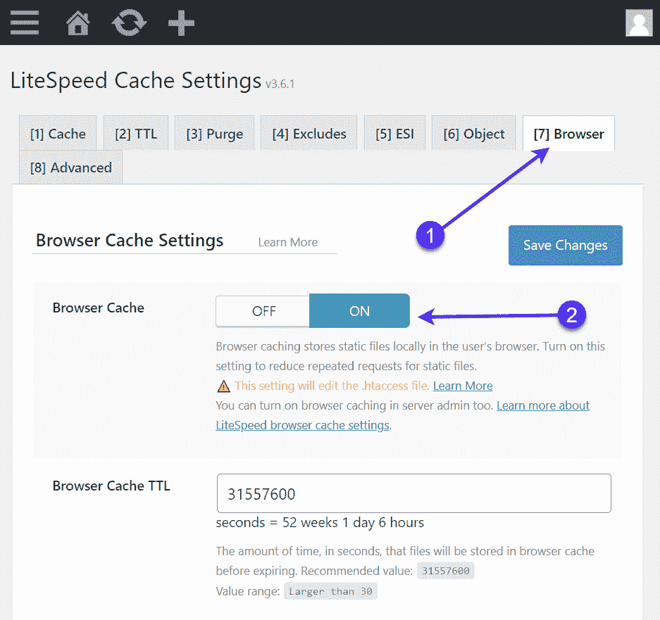

Browser Cache Settings tab in LiteSpeed Cache

### 清除您自己的浏览器缓存

另一方面，你可能会遇到这样的情况，你的 WordPress 站点上安装了一个插件，或者你[更新了一篇博客文章](https://kinsta.com/learn/blogging-tips/)上的内容，当你访问你的网站前端时，插件功能或新内容都没有出现。

您可能需要清除服务器端的缓存(使用上面讨论的方法),或者[清除浏览器缓存](https://kinsta.com/knowledgebase/how-to-clear-browser-cache/),它可能引用更新或新内容提交之前保存的静态页面。

好消息是，从 Chrome 到 Firefox，每个浏览器都有一个清除浏览器缓存的工具。这些功能通常位于设置面板中，但每个浏览器都有不同的界面，根据您使用的浏览器，这可能会有点混乱。

因此，我们将通过快速步骤来清除流行度排名前四的浏览器的缓存。

#### 如何清除谷歌 Chrome 上的缓存

谷歌没有提供快速缓存清除按钮，所以你必须导航到**隐私和安全**部分，在那里你会找到清除浏览器缓存不同部分的选项，包括你的浏览器历史和保存的密码。

首先打开 Google Chrome，选择浏览器右上角的**三点菜单** ( **⋮** )按钮。

进入**设置>隐私和安全>清除浏览数据**。

你可以使用**基本**标签，但是我们建议你点击**高级**标签来查看更多选项。

还是那句话，Google 没有明确的缓存功能。通过选择类似于**浏览历史**、**下载历史**、 [Cookies](https://kinsta.com/blog/wordpress-cookies-php-sessions/) **和其他站点数据**、**缓存图像和文件**的框，您仍然可以达到类似的效果。

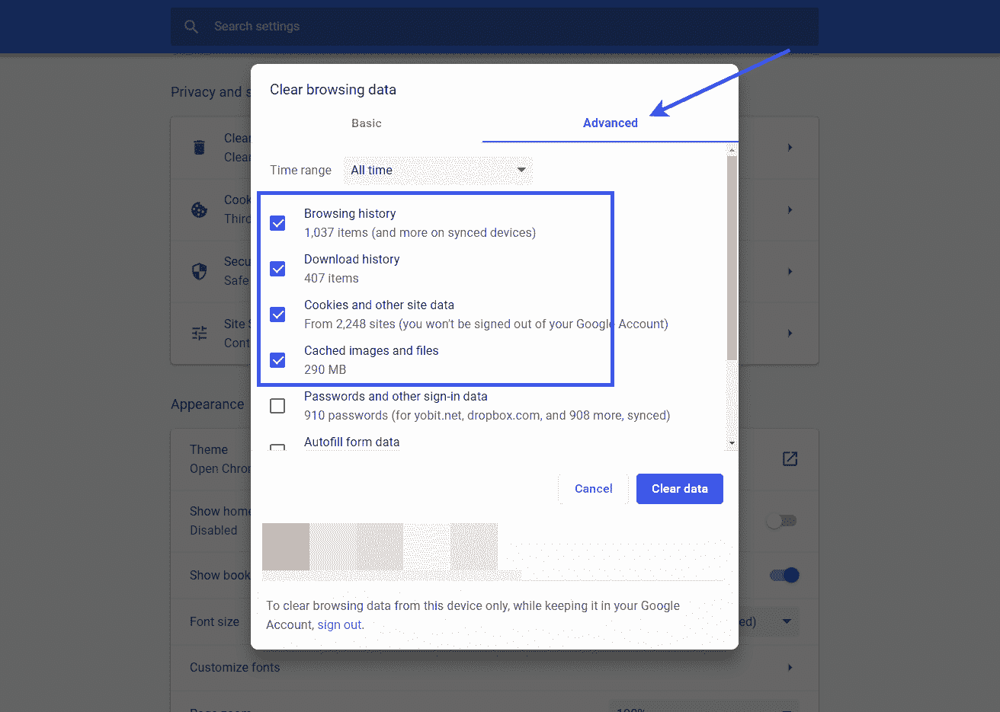

‘Advanced’ tab under ‘Clear browsing data’ in Chrome browser

你最好的办法是不勾选[密码](https://kinsta.com/blog/password-managers/)字段，因为这将删除你浏览器上所有保存的密码，造成一个相当令人沮丧的浏览器体验。

确保**时间范围**设置为**所有时间**(或者您想要清除缓存的多长时间)并点击**清除数据**按钮完成该过程。

#### 如何清除 Microsoft Edge 上的浏览器缓存

微软 Edge 有一个类似 Chrome 的配置，用于清除你的站点历史和浏览器缓存。打开微软 Edge，在浏览器右上角找到**三点图标** ( **⋮** )。点击那个。

导航至**设置>隐私搜索和服务**。找到**清除浏览数据**部分，点击**选择清除什么**按钮。

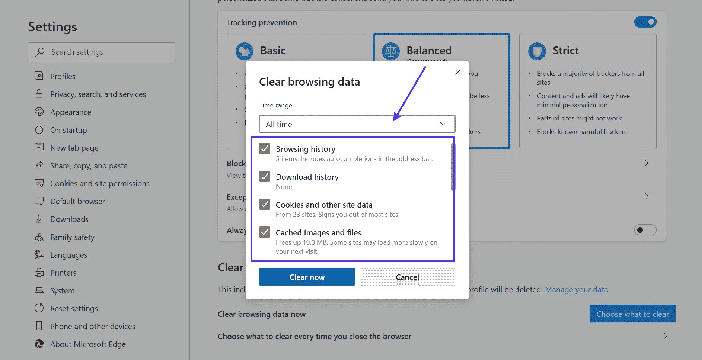

Edge browser’s ‘Clear browsing data’ option

我们建议您选择以下选项以成功清除 Microsoft Edge 中的浏览器缓存:

*   浏览历史
*   下载历史记录
*   Cookies 和其他网站数据
*   缓存的图像和文件

标记您想要返回以清除数据的时间范围。如果网站不显示新内容，在时间范围字段中选择**全天**通常是有意义的。

最后，点击**立即清除**按钮运行缓存清除。

关于 Microsoft Edge 安全和缓存部分的另一个有趣的部分是，您可以配置浏览器，以便在关闭浏览器时清除缓存。

为此，返回到**设置**页面，点击按钮**选择每次关闭浏览器时清除的内容**选项。

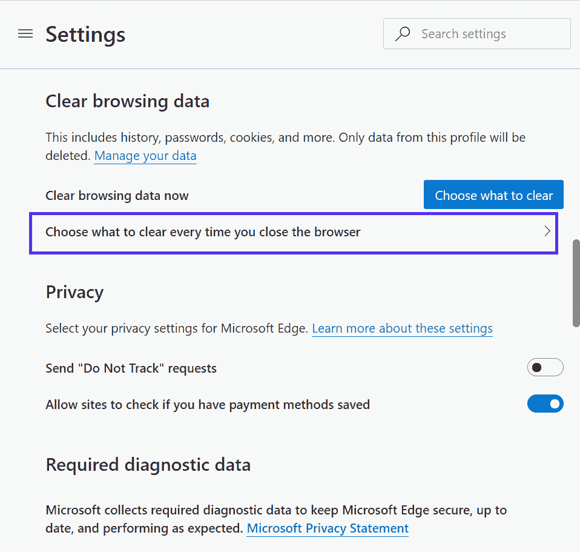

‘Clear browsing data’ advanced settings

像清除你的浏览器缓存一样，这个模块有一个选项列表可供选择，和你之前看到的一样。

因此，每次关闭 Edge 浏览器时，检查**浏览历史**、**下载历史**、 **Cookies** 和**缓存的图像和文件**项，以清空整个缓存。

请记住，对于某些人来说，清除浏览器历史记录可能并不像您想象的那样理想。但是，无论如何，Cookies 以及缓存的图像和文件都应该被清除。

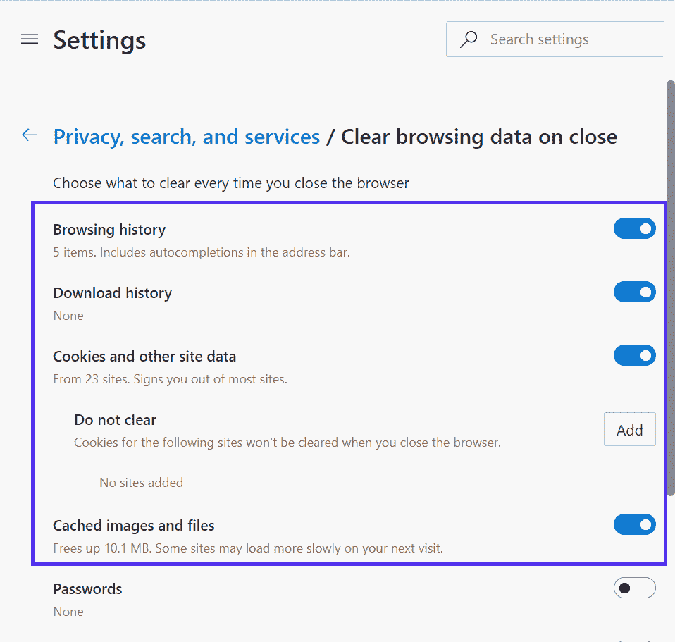

Choose what to clear every time you close the browser

#### 如何在 Safari 上清除缓存

如果你是 macOS 用户，你最有可能使用 Safari 浏览器。在这种情况下，清除浏览器缓存很容易。苹果以其简单的导航和界面而闻名，所以你所要做的就是在你的 Safari 浏览器中进入**历史**菜单。

这显示了一个按钮**清除历史**。唯一要做的另一件事就是选择一个你想清理的时间段。

所以，你可以选择**最后一小时**、**今天**、**今天和昨天**，或者**所有历史**。

选择时间范围后，点击**清除历史**按钮完成该过程。

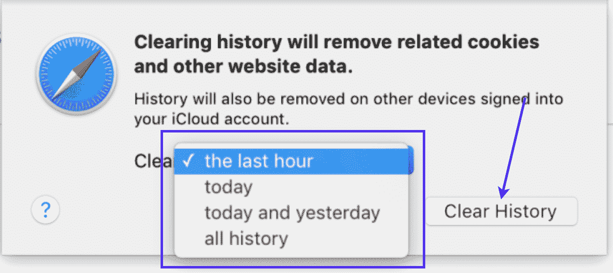

Safari’s ‘Clear History’ button

重要的是要知道 Safari 中的**清除历史记录**功能不仅仅是简单地删除你过去访问过的网站。除了清除历史记录之外，Safari 还会清除所有 cookies 和整个缓存，或者至少清除您指定的时间。

另一种只清除缓存，而不清除历史记录和 cookies 的方法是进入浏览器的开发菜单。在那里你可以找到一个选项来清空缓存。

要显示**开发者**菜单(如果你还看不到的话)，进入**首选项>** **高级**，勾选菜单栏中的**显示开发菜单选项。这位于模块的底部。**

#### 如何清除 Mozilla Firefox 上的缓存

另一个流行的互联网浏览器 Mozilla Firefox 也提供了类似的工具来清理网站缓存。它提供了一些额外的设置，使其更容易定位缓存，而不是浏览历史记录和其他元素，如 cookies 和密码。

在 Mozilla Firefox 中，找到浏览器右上角的**汉堡** ( **☰** )按钮。

点按该按钮以显示其选项。

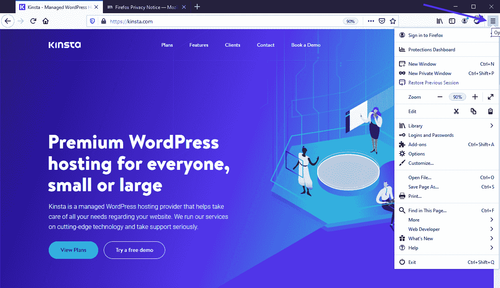

Clearing cache with Firefox browser

找到并选择**选项**继续。

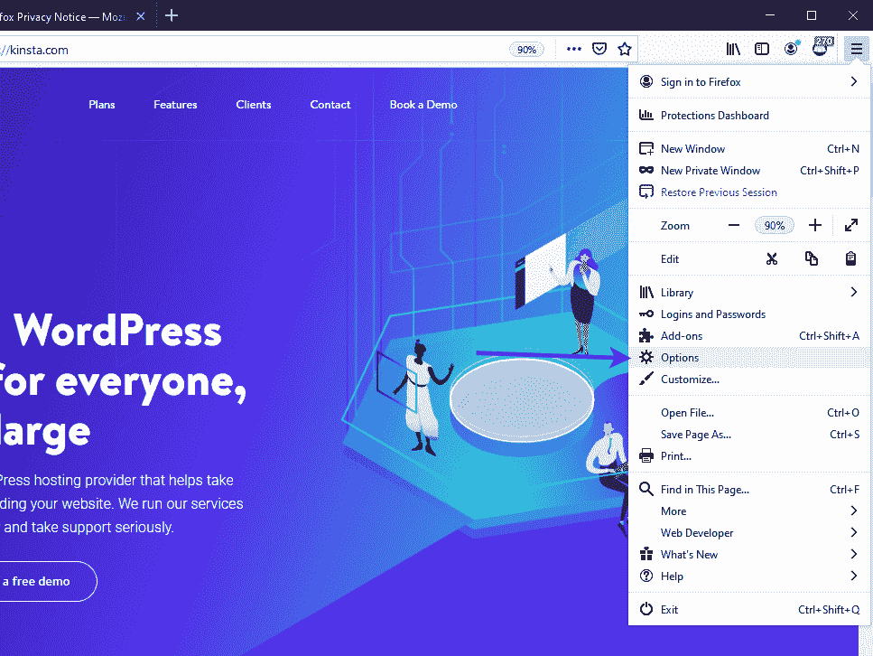

Firefox’s Options settings

点击**隐私和安全**选项卡。

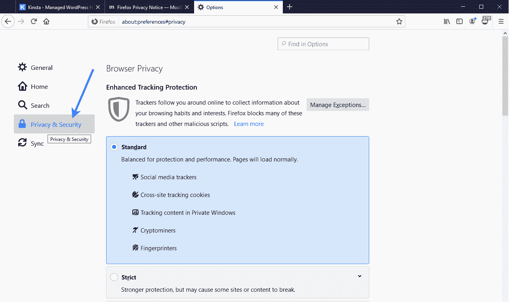

Firefox’s ‘Privacy & Security’ screen

该页面显示了许多安全和隐私工具，从功能到块跟踪到缓存清除功能。

在 Firefox 中清除浏览器缓存时，有几个选项需要考虑。由于缓存并不总是像我们希望的那样定义，所以您可能希望清除站点数据、cookies 和浏览器历史记录等内容。

因此，Firefox 在隐私页面和安全页面的不同区域都有这些元素。不像其他浏览器，不是只有一个按钮可以一起清除所有的文件。

首先，向下滚动页面，找到 **Cookies** 和**站点数据**部分。

选择**清除数据**按钮。

The ‘Clear Data’ button in Firefox

默认情况下，应该选中两个框:**cookie 和站点数据**，以及**缓存的 Web 内容**。

这是清除缓存的良好开端，因为它已经包含了以前缓存的 web 内容。

确保两者都被选中，并点击**清除**按钮。

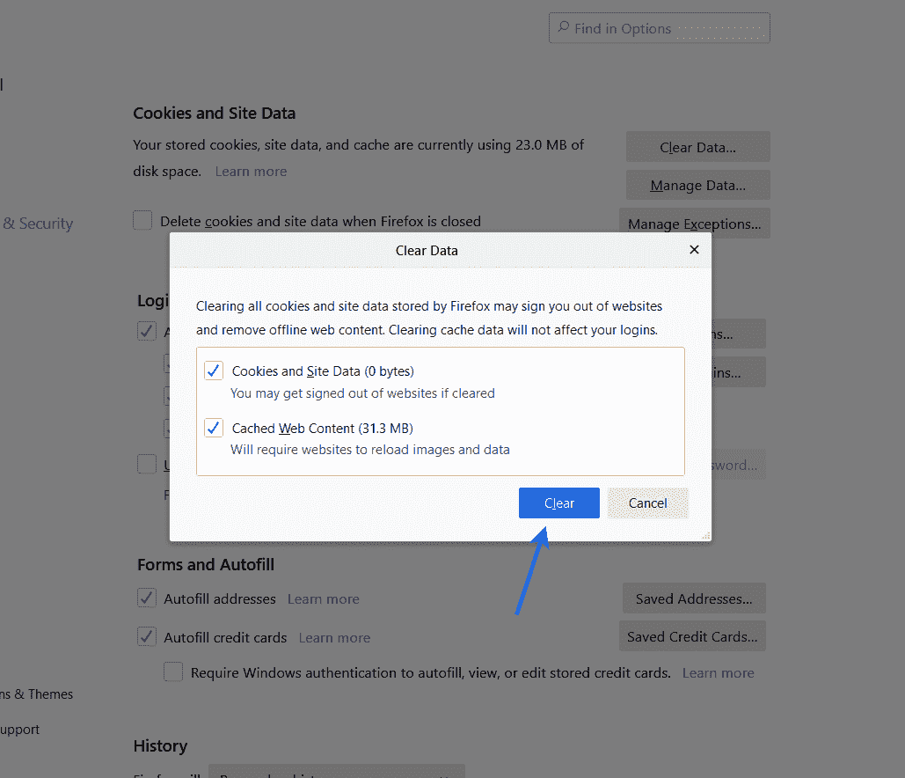

The ‘Clear Data’ button

接下来，你可能还想检查一下当 Firefox 关闭时删除 cookies 和站点数据的复选框。

这并不适合所有人，但是您可能会发现关闭浏览器是清除存储在数据缓存中的内容的最佳时机。

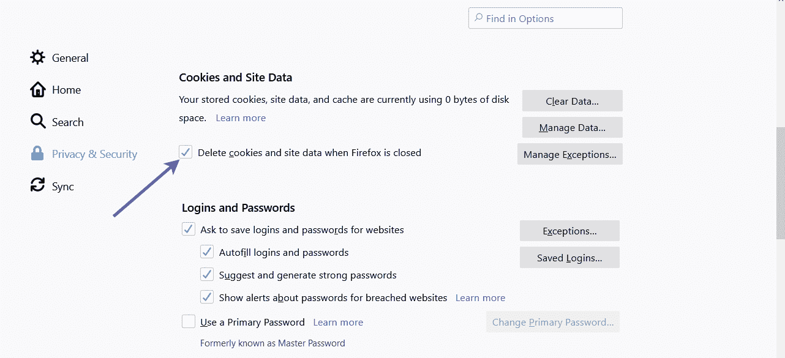

Enable the delete cookies option

还有一个章节是关于**历史**的。

同样，**浏览器历史**通常被认为是浏览器缓存的一部分。因此，您可以点击**清除历史**按钮来继续此方法。

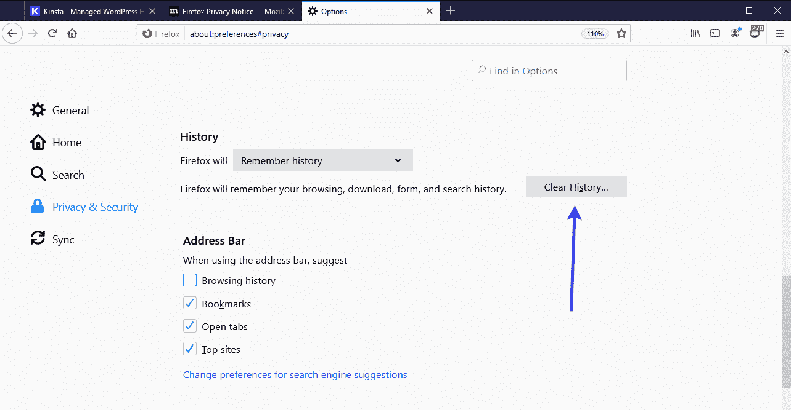

Click the ‘Click History’ button

在弹出窗口中，单击**时间范围以清除**下拉菜单，并选择您想要清除多长时间前的历史。例如，您可以选择最后一小时、最后两小时、最后四小时、今天或任何时间。

很多时候，你需要的只是几个小时，但是为了安全起见, **Everything** 选项是一个不错的选择。

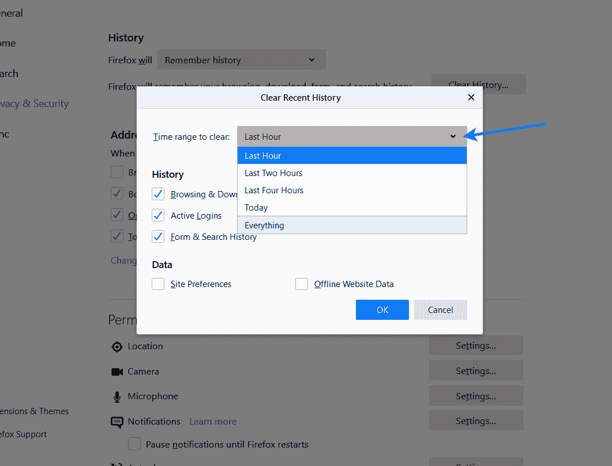

Choose ‘Everything’ under Clear Recent History

勾选您想要从缓存中清除的任何**历史**数据元素的复选框。

选中所有的框并不是一个坏主意，但是 Firefox 实际上提供了一个专门用于缓存的框，从截图中可以看到。所以，这取决于你，但是如果你想变得更具体，你可以取消选中除了**缓存**选项之外的所有选项。

现在，我们将所有复选框标记为选中，并单击 **OK** 按钮清除浏览器缓存中的所有内容。

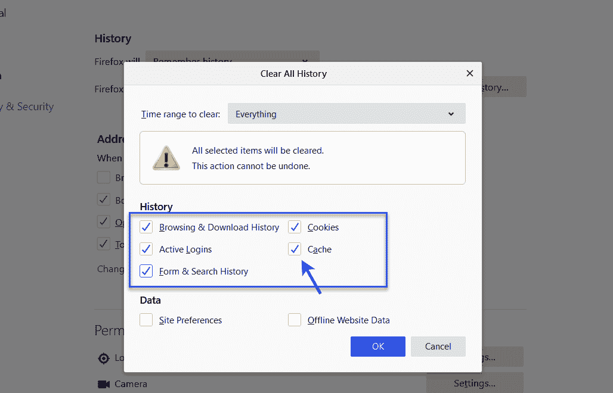

Make sure to tick the ‘Cache’ option

另一种确保定期清除缓存的方法是选择历史下的 **Firefox Will** 下拉菜单。

选择选项**为历史**使用自定义设置。

这显示了三个框，包括以下内容:

*   记住浏览和下载历史
*   记住搜索和表单历史
*   Firefox 关闭时清除历史记录

如果您发现每当需要清除数据缓存时清除浏览和搜索历史记录很烦人，那么检查前两个并不是一个坏主意。

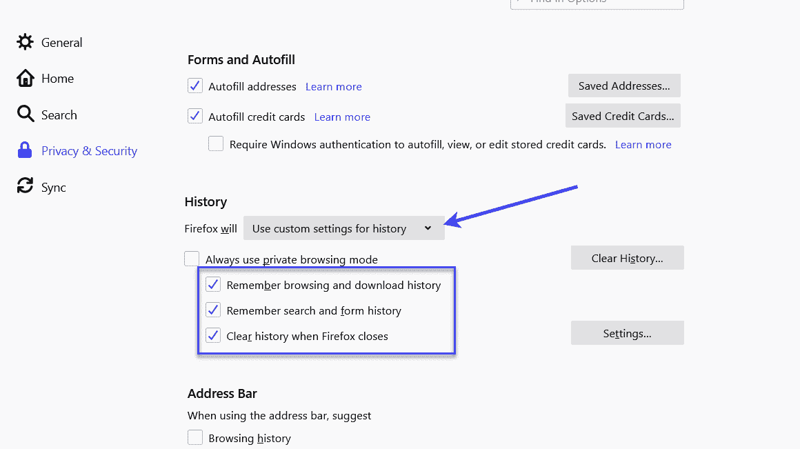

‘Use custom settings for history’ option

之后，选择**历史**部分下的**设置**按钮。

Click the ‘Settings’ button under History

这允许你在 Firefox 关闭时进行更具体的清除。例如，许多人不喜欢每次都清除浏览历史的想法，但在关闭 Firefox 时标记清除**缓存**选项是个好主意。

决定设置后，点击 **OK** 按钮保存所有设置。

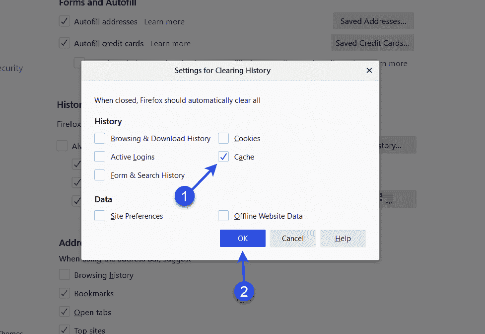

Enable the ‘Cache’ option and click ‘OK’

## 你如何清除其他主机的 WordPress 缓存？

正如我们在本文中多次提到的，Kinsta 已经提供了一个缓存清除系统，可以自动清除缓存，手动清除缓存，并按照设定的时间表清除缓存。

然而，如果你也有一个网站在不同的主机服务器上呢？

对于这种情况，您有几种选择。第一种是安装一个缓存插件，就像我们在本文前面概述的那样。这些插件管理你的缓存，并允许你手动清除它或配置一个你希望看到缓存被清除的时间框架。

或者，一些主机可能提供类似于 MyKinsta 缓存模块的东西，但是您必须在它们的主机仪表板或 cPanel 中找到它。从[更便宜的共享主机服务](https://kinsta.com/knowledgebase/shared-vps-dedicated-hosting/)中看到缓存工具并不常见，但为了以防万一，还是值得询问一下客服。[托管 WordPress hosting](https://kinsta.com/ebooks/wordpress/managed-wordpress-hosting/) 公司更有可能提供一个缓存工具，所以再一次，做你的研究，看看你能得到什么功能。

最后，你的主机可能也有办法让你通过 WordPress dashboard 清除一个网站的缓存，类似于 MyKinsta 提供的。同样，这不是我们经常从共享主机服务中看到的，但是你可以要求他们的客户[支持](https://kinsta.com/kinsta-support/)。

[想要一个快速提升网站性能的方法吗？🤔提示:这和使用缓存一样简单。💡了解更多关于你的网站的缓存-以及如何清除它-在这里⬇️ 点击推文](https://twitter.com/intent/tweet?url=https%3A%2F%2Fkinsta.com%2Fblog%2Fwordpress-clear-cache%2F&via=kinsta&text=Want+a+quick+way+to+give+your+site%27s+performance+a+boost%3F+%F0%9F%A4%94+Hint%3A+It%27s+as+easy+as+using+caching.+%F0%9F%92%A1+Learn+more+about+your+site%27s+cache-+and+how+to+clear+it+out-+here+%E2%AC%87%EF%B8%8F&hashtags=WPTips%2CWebPerf)

## 摘要

网站缓存(和清除缓存)的目标是保持简单和用户友好。对于普通用户来说，相当多的插件将这个简单的任务变成了过于技术性和令人困惑的事情。即使是高级开发人员也没有时间为他们维护的每个站点进行高级缓存设置。

这就是为什么我们鼓励你检查你的主机 Kinsta。它不仅提供了一些市场上最快的网站托管服务，而且你还可以获得自动和手动缓存，为你减少了大部分的 T2 网站维护工作。

[Kinsta 客户](https://kinsta.com/plans/?plan=visits-business1&interval=month)可以在 [MyKinsta 仪表盘](https://kinsta.com/mykinsta/)中访问更多信息。内置的[代码缩小功能](https://kinsta.com/help/kinsta-cdn-code-minification/)让客户只需轻轻一点就能快速轻松地缩小他们的 CSS 和 JavaScript 文件，有效地加速他们的网站，无需任何人工操作。

如果你对如何清除 WordPress 缓存文件有任何疑问，或者你想建议其他缓存和清除缓存的方法，请在下面的评论区留言。

* * *

让你所有的[应用程序](https://kinsta.com/application-hosting/)、[数据库](https://kinsta.com/database-hosting/)和 [WordPress 网站](https://kinsta.com/wordpress-hosting/)在线并在一个屋檐下。我们功能丰富的高性能云平台包括:

*   在 MyKinsta 仪表盘中轻松设置和管理
*   24/7 专家支持
*   最好的谷歌云平台硬件和网络，由 Kubernetes 提供最大的可扩展性
*   面向速度和安全性的企业级 Cloudflare 集成
*   全球受众覆盖全球多达 35 个数据中心和 275 多个 pop

在第一个月使用托管的[应用程序或托管](https://kinsta.com/application-hosting/)的[数据库，您可以享受 20 美元的优惠，亲自测试一下。探索我们的](https://kinsta.com/database-hosting/)[计划](https://kinsta.com/plans/)或[与销售人员交谈](https://kinsta.com/contact-us/)以找到最适合您的方式。