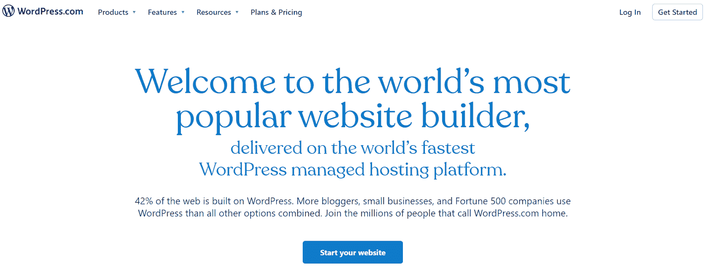
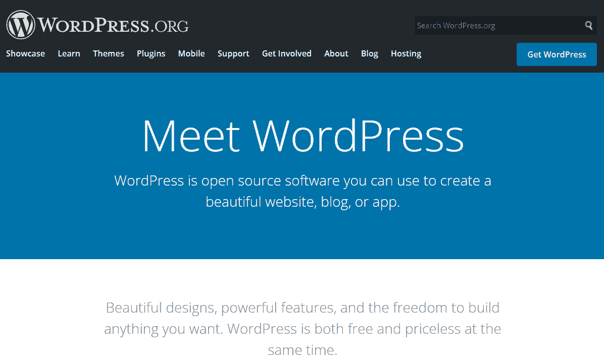
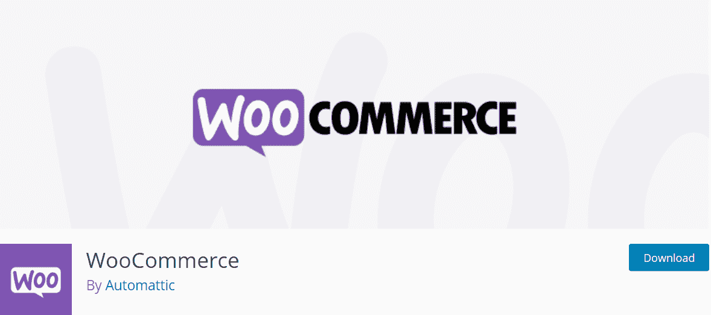
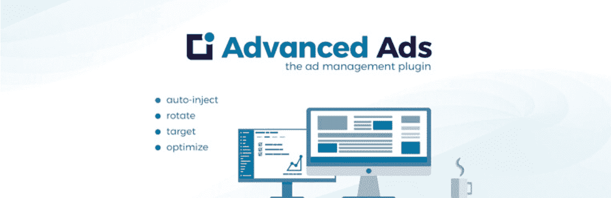
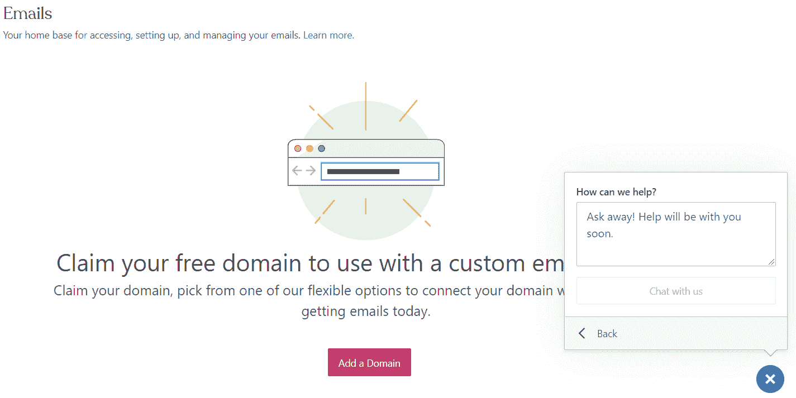
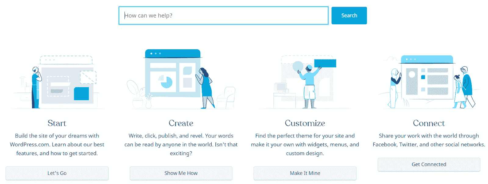
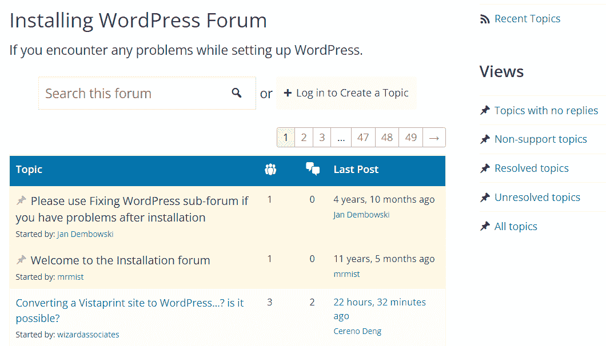
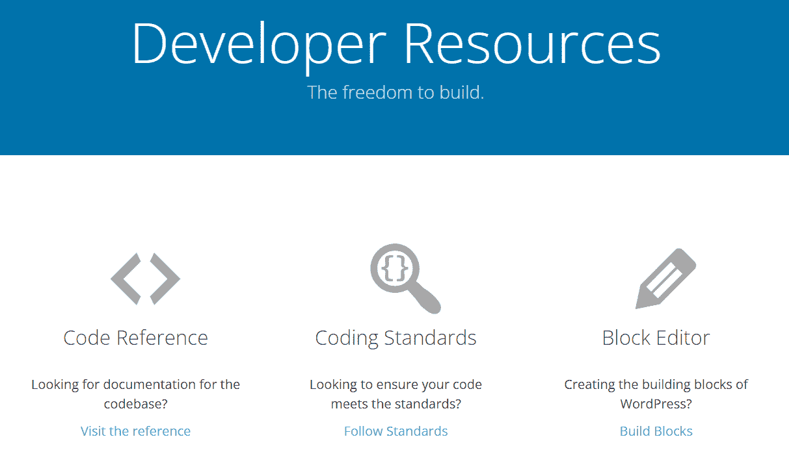
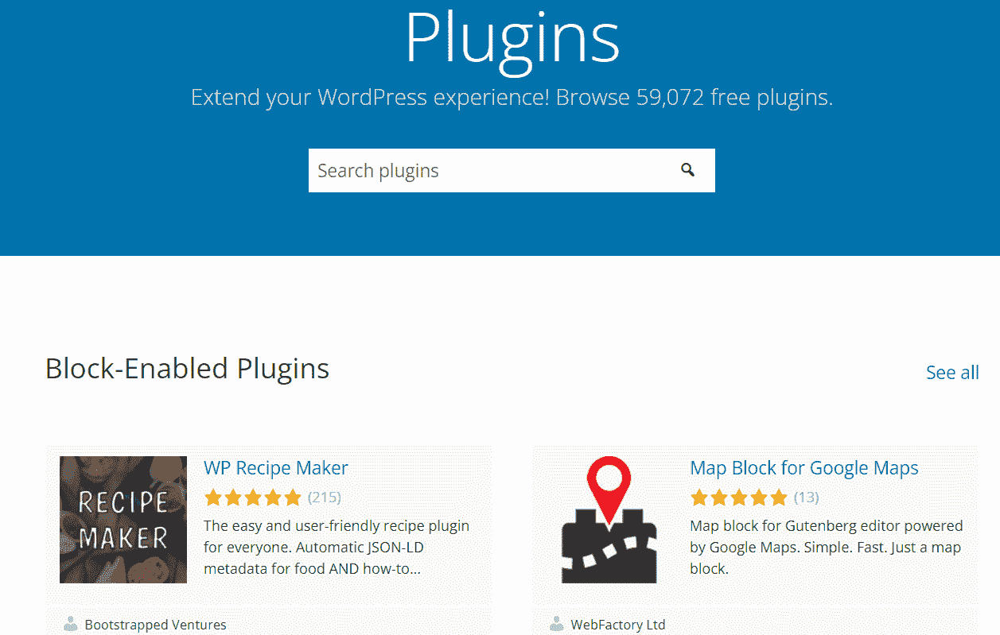
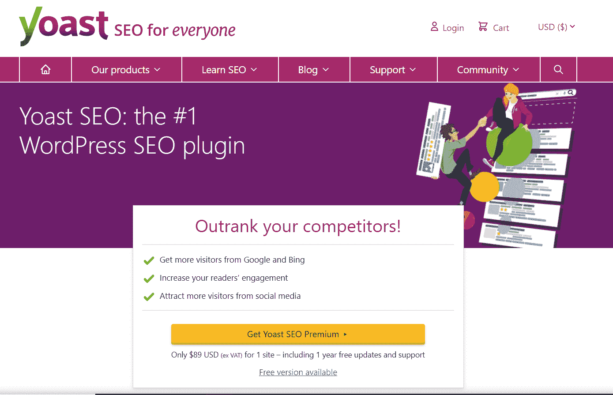

# WordPress.org 和 WordPress.org:哪个对你的网站更好？

> 原文：<https://kinsta.com/blog/wordpress-com-vs-wordpress-org/>

如果你准备建立一个新网站，你需要选择构建它的软件。一个安全的赌注，但是在 WordPress.com 和 WordPress.org 之间，哪个对你来说是更好的选择？你可能不确定这两个选择有什么不同。

幸运的是，区分 WordPress.com 和 WordPress.org 相对容易。通过评估潜在盈利能力、定制选项和价格等因素，你可以决定哪个平台更适合你的网站。

这篇文章将解释 WordPress.com 和 WordPress.org 之间的关键差异。然后，我们将根据九个关键标准评估每个 CMS，以帮助您决定它是否符合您网站的需求。

我们开始吧！

## 什么是 WordPress.com？

WordPress.com 是一个托管平台，运行在 WordPress.org 的软件之上。

【WordPress.com】T2。

它的所有者是 Automattic T1，它是 woo commerce T3 和 T4 Jetpack 插件 T5 等其他知名平台 T2 的幕后推手。此外，它是一个营利性企业，可以托管和管理网站的各个方面。

> Kinsta 把我宠坏了，所以我现在要求每个供应商都提供这样的服务。我们还试图通过我们的 SaaS 工具支持达到这一水平。
> 
> <footer class="wp-block-kinsta-client-quote__footer">
> 
> 
> 
> <cite class="wp-block-kinsta-client-quote__cite">Suganthan Mohanadasan from @Suganthanmn</cite></footer>

[View plans](https://kinsta.com/plans/)

有了 WordPress.com 账户，你就可以集网站建设、托管账户和域名于一身。你可以从软件的仪表板上管理一切，而且(取决于你购买的计划)你可以使用各种主题和插件来扩展你的网站。

**优点:**

*   是用户友好的，有一个更容易的学习曲线
*   包括自动站点维护
*   自带内置主机

**缺点:**

*   货币化选择有限
*   为定制和可扩展性提供的选项较少
*   已经限制了[搜索引擎优化(SEO)](https://kinsta.com/cheatsheets/wordpress-seo-checklist/) 和分析工具，特别是在免费计划上

这是对 WordPress.com 的优势和劣势的简要概述。然而，在本文的后面，我们将深入探讨其不同特性的优缺点。

[Do you know the difference between WordPress.com and WordPress.org? 👀 Test your knowledge in this post ⬇️Click to Tweet](https://twitter.com/intent/tweet?url=https%3A%2F%2Fbit.ly%2F2YViUOb&via=kinsta&text=Do+you+know+the+difference+between+WordPress.com+and+WordPress.org%3F+%F0%9F%91%80+Test+your+knowledge+in+this+post+%E2%AC%87%EF%B8%8F&hashtags=WordPress%2CWPTips)

## 什么是 WordPress.org？

[WordPress.org](https://wordpress.org/)是一个开源的[内容管理系统](https://kinsta.com/knowledgebase/content-management-system/)。它是 WordPress.com 赖以建立的软件的来源。

【WordPress.org】T2。

这个免费的开源平台使您能够使用、更改和贡献核心软件。它的仪表板和 WordPress.com 有相似的外观，你可以访问大量的插件和主题来定制你的网站的外观和功能。

尽管 WordPress.org 是免费的，但你需要为托管费和 T2 域名付费。你还可以更好地控制你的网站，如果你喜欢，可以选择改变每一个方面。

**优点:**

*   提供多种盈利机会
*   非常灵活，有许多定制选项
*   使您能够创建会员和[电子商务商店](https://kinsta.com/blog/ecommerce-hosting/)

**缺点:**

*   有更陡峭的学习曲线
*   大多数情况下需要更多的手动维护
*   不包括域名或主机

我们将在下一节更深入地了解 WordPress.org 和 WordPress.com 的特点、优缺点。

## WordPress.org 和 WordPress.org:哪个对你的网站更好？

现在，我们已经对每个平台进行了概述，让我们更深入地了解 WordPress.com 与 WordPress.org。在为你的新网站选择这些平台时，有几个重要的考虑因素。

### 1.易用性

如果你正在建立一个新网站，用户友好可能是你最优先考虑的事情之一。如果你在寻找最简单的平台，你可能会选择 WordPress.com。

当创建一个 WordPress.com 网站，你需要注册一个帐户，并通过几个步骤。然后你必须选择你的网站类型，挑选一个主题，并在这个过程中定制一些其他的细节。

在 WordPress.com 选择一个设计。

如果你使用 WordPress，你需要[购买主机](https://kinsta.com/plans/?plan=visits-business1&interval=month)和一个域名，然后在你的主机提供商的仪表板上安装 WordPress 软件。一些主机可能会为您处理安装过程。尽管如此，WordPress.org 的学习曲线更加陡峭。

一旦你开始使用这两个平台，它们的仪表盘看起来非常相似。然而，WordPress.com 提供的功能较少，所以你不太可能感到不知所措。与此同时，值得注意的是，WordPres.org 的设计仍然考虑到了可用性，并且对初学者相当友好。

### 2.电子商务网站

如果你想用 WordPress.com 创建一个在线商店，你需要购买一个专用的电子商务包。这一定价方案使您能够接受国际付款，与航运公司联系，并定制您的网上商店的设计元素。

这些功能在更便宜的 WordPress.com 套餐中都没有。因此，你需要进行更大的资金投入来让你的商店起步。然而，你仍然可以使用免费的电子商务插件[，比如 WooCommerce](https://wordpress.org/plugins/woocommerce/) 。

伍贸插件。

由于你不需要支付 WordPress.org 帐户，这可能是一个更实惠的选择经营一个电子商务商店。CMS 包括访问多个付费和免费的[电子商务插件](https://kinsta.com/blog/wordpress-ecommerce-plugins/)。此外，你可以整合第三方支付提供商[如 PayPal](http://paypal.com/) 或 [the Stripe platform](https://stripe.com/) 。

### 3.货币化机会

如果你想从你的网站赚钱，WordPress.org 可能是更好的选择。你可以使用的盈利策略不会有任何限制，比如在你的内容中添加[会员链接](https://kinsta.com/affiliate-academy/affiliate-sales-tips/)或者创建一个会员网站。

此外，你可以使用[广告插件](https://kinsta.com/blog/wordpress-advertising-plugin/)，如[高级广告](https://wordpress.org/plugins/advanced-ads/)来管理你在 WordPress 仪表盘上的所有活动。

## 注册订阅时事通讯

### 想知道我们是怎么让流量增长超过 1000%的吗？

加入 20，000 多名获得我们每周时事通讯和内部消息的人的行列吧！

[Subscribe Now](#newsletter)

高级广告。

相比之下，WordPress.com 让你的网站赚钱更具挑战性。首先，你需要有商业计划或更高的计划来访问电子商务功能和 [Google Adsense](https://kinsta.com/blog/how-to-add-google-adsense-to-wordpress/) 等功能。

此外，WordPress.com 对联盟营销设置了一些限制。[用户指南](https://wordpress.com/support/user-guidelines/)规定，您不能将该平台主要用于推广代销商产品。尽管该政策的措辞含糊不清，但 WordPress.com 也表示，任何规则都以其解释为准。

最后，WordPress.com 不允许网站有“绝大多数”的赞助内容。同样，这些指导方针可能会有不同的解释，所以在你的网站赚钱时你需要小心。

### 4.技术支持

即使你是 WordPress 专家，你也可能会不时遇到技术问题。因此，有用且可用的[技术支持](https://kinsta.com/blog/wordpress-support/)对运营你的网站至关重要。

借助 WordPress.com，您可以根据自己的计划获得不同级别的技术支持。所有软件包都带有电子邮件帮助，但您需要一个高级计划或更高的实时聊天帮助。商业和电子商务账户也有优先聊天权限。

对 WordPress.com 的技术支持。

如果你有一个免费的 WordPress.com 帐户，你只能获得有限的技术支持。但是，有一个知识中心，里面有一些有用的文章。

【WordPress.com 知识枢纽】T2 文章。

WordPress.org 不包括专门的技术支持。相反，您可以通读提供的文档或前往[支持论坛](https://wordpress.org/support/forums/)。这些讨论由志愿者主持，可以成为有用信息的来源。

【WordPress.org】支持论坛。

如果你在寻找更个性化的帮助，你需要使用第三方公司的高级帮助。如果您是 Kinsta 的客户，请记住您可以通过 [24/7 支持](https://kinsta.com/kinsta-support/)获得任何问题或疑问！
T3】

### 5.学习 Web 开发

如果你计划成为一名开发人员，WordPress.org 可能更适合你。它的开源软件使你能够创建新的插件和主题，并使用[REST API](https://kinsta.com/blog/wordpress-rest-api/)开发应用程序。

此外，WordPress.org 有各种资源来帮助新的和有经验的开发者。例如，您可以阅读编码标准，访问代码参考，并从详细的文档中学习运行命令。

与我们世界一流的支持团队一起体验卓越的 WordPress 托管支持！与支持我们财富 500 强客户的同一个团队聊天。[查看我们的计划](https://kinsta.com/plans/?in-article-cta)

【WordPress.org】T2 开发商资源。

相比之下，WordPress.com 为开发商提供的机会有限。它有一个 REST API、开发者控制台和一些用于开发的资源。然而，与 WordPress.org 相比，可利用的资源很少。此外，一些功能(如设计资源)仍在开发中。

### 6.定制可能性

WordPress.org 有[上千个插件](https://wordpress.org/plugins/)和[主题选项](https://wordpress.org/themes/)。有免费和付费软件可供选择，使你能够根据你的预算定制你的网站。

【WordPress.org】T2 外挂。

此外，你可以直接编辑你的 WordPress.org 网站的 HTML 或者添加 CSS 类来进一步调整它的外观和功能。因此，你可以很容易地调整小细节，使你的网站符合你的需要。

相比之下，你不能使用插件与 WordPress.com，除非你有一个商业计划或更高。没有高级软件包或更高版本，您无法使用高级设计定制功能。因此，更便宜的网站在定制和可伸缩性潜力方面非常有限。

### 7.定价

如果成本是一个重要因素，那么在 WordPress.com 和 WordPress.org 之间做出选择是至关重要的。

WordPress.com 有多种定价选择。虽然我们不建议商业网站这样做，因为它增加了 WordPress 品牌，你可以从一个完全免费的计划开始。

或者，您可以从[付费计划](https://wordpress.com/pricing/)中选择一项:

*   个人:该计划专为爱好网站设计，包括托管、电子邮件支持和付款选项。
*   **Premium:** 它建立在个人计划的基础上，提供实时聊天支持、视频功能、使用广告的能力以及与谷歌分析的集成。
*   **业务:**这个包包括完整的插件库，SEO 工具，自动站点备份，和[安全文件传输协议(SFTP)](https://kinsta.com/knowledgebase/ftp-vs-sftp/) 。
*   **电子商务:**该计划面向在线商店，包括国际支付网关、商店设计功能和运输集成。

相比之下，WordPress.org 可以自由使用。然而，你需要为主机和你的域名独立付费。因此，根据您选择的提供商的[，您的持续成本可能会有很大差异。](https://kinsta.com/blog/managed-wordpress-hosting/)

### 8.安全性

WordPress.com 和 WordPress.org 都容易受到安全威胁。从 2018 年到 2019 年，网络攻击的数量[增加了 11%](https://www.accenture.com/us-en/insights/security/cost-cybercrime-study)。证据还表明，这一统计数字还在继续上升。

此外，罪魁祸首通常是过时的 WordPress 软件。大约 40%的黑客攻击发生在没有使用最新软件版本的网站上。第三方插件和主题也会让你的网站容易受到攻击。

如果你使用 WordPress.com，你的网站会自动更新主题和插件。此外，核心软件更新也将在幕后进行。

然而，WordPress.org 不会自动更新其软件。你需要[启用这些升级](https://kinsta.com/blog/wordpress-version/)并留意任何变化。因此，如果你不想一直监控你的网站，WordPress.org 可能不是最好的选择。

### 9.搜索引擎优化

SEO 是一个在 WordPress.com 和 WordPress.org 之间做出选择会产生巨大差异的领域。毕竟，[使用有效的 SEO 策略](https://kinsta.com/blog/what-does-seo-stand-for/)对于让你的网站在搜索引擎结果中更显眼是至关重要的。没有像样的搜索引擎优化排名，你可能会努力吸引新的读者和发展你的网站。

使用 WordPress.org，你几乎可以完全控制你的搜索引擎优化策略。你可以使用插件如 [Yoast SEO](https://kinsta.com/blog/yoast-seo/) 来为[选择的关键词](https://kinsta.com/blog/keyword-research/)优化你的帖子和页面。

Yoast SEO。

此外，你可以使用 [Google Analytics](https://kinsta.com/blog/google-analytics-wordpress/) 查看你网站的各种数据，比如流量来源、转化率和你表现最好的内容。然后你可以利用这些信息来调整你的策略，吸引更多的读者。

相比之下，WordPress.com 的 SEO 选择有限。你至少需要一个谷歌分析整合的优惠计划。此外，除非你有一个商业计划或更高，否则高级搜索引擎优化工具是不可用的。因此，你不会用更便宜的包来优化网站。

[Find the right solution for your growing business (and its long-term sustainability) in this WordPress.com vs WordPress.org guide ✨ 📈Click to Tweet](https://twitter.com/intent/tweet?url=https%3A%2F%2Fbit.ly%2F2YViUOb&via=kinsta&text=Find+the+right+solution+for+your+growing+business+%28and+its+long-term+sustainability%29+in+this+WordPress.com+vs+WordPress.org+guide+%E2%9C%A8+%F0%9F%93%88&hashtags=WordPress%2CWordPressTips)

## 摘要

在你开始建立一个新网站和创建它的内容之前，你需要选择你将使用的平台。WordPress.com 和 WordPress.org 是最受欢迎的两个选择，但它们适用于不同类型的网站。

概括一下，这是你可能想使用 WordPress.com vs WordPress . org 的时候:

1.  这个托管平台和网站建设者提供了用户友好的设计、自动备份和技术支持。然而，你需要支付一个高级包来访问可定制的功能，如插件。
2.  这种流行的免费 CMS 可能更难学，需要更多的持续维护。然而，它为开发者提供了无上限的货币化可能性、无尽的定制选项和大量资源。

关于使用 WordPress.com vs WordPress.org，你有什么问题吗？请在下面的评论区告诉我们！

* * *

让你所有的[应用程序](https://kinsta.com/application-hosting/)、[数据库](https://kinsta.com/database-hosting/)和 [WordPress 网站](https://kinsta.com/wordpress-hosting/)在线并在一个屋檐下。我们功能丰富的高性能云平台包括:

*   在 MyKinsta 仪表盘中轻松设置和管理
*   24/7 专家支持
*   最好的谷歌云平台硬件和网络，由 Kubernetes 提供最大的可扩展性
*   面向速度和安全性的企业级 Cloudflare 集成
*   全球受众覆盖全球多达 35 个数据中心和 275 多个 pop

在第一个月使用托管的[应用程序或托管](https://kinsta.com/application-hosting/)的[数据库，您可以享受 20 美元的优惠，亲自测试一下。探索我们的](https://kinsta.com/database-hosting/)[计划](https://kinsta.com/plans/)或[与销售人员交谈](https://kinsta.com/contact-us/)以找到最适合您的方式。