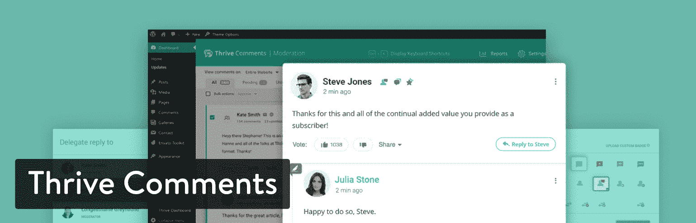
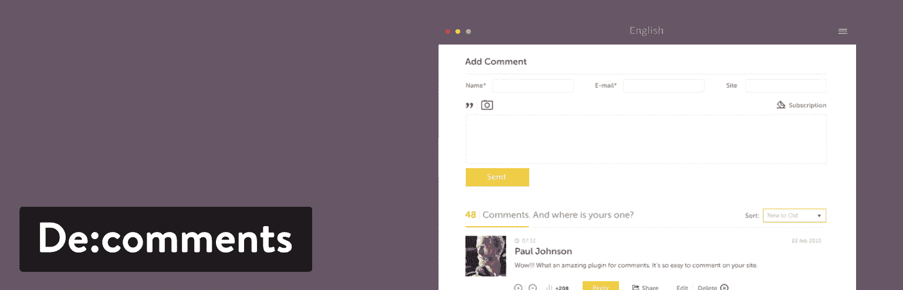
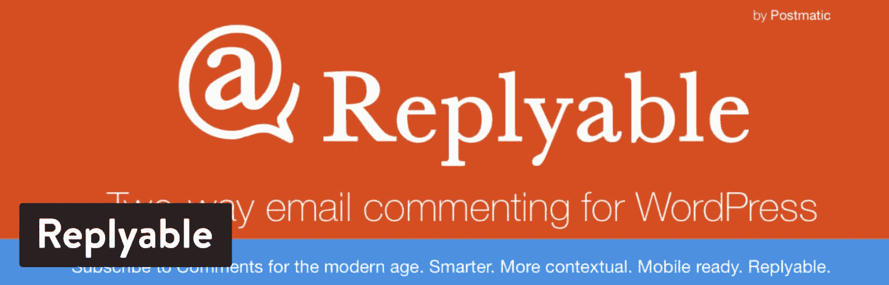

# 深入了解 10 个最好的 WordPress 评论插件

> 原文：<https://kinsta.com/blog/wordpress-comment-plugins/>

评论和文章本身一样是博客的一部分。你的评论区吸引读者，让他们和其他有相似兴趣的人互动。根据评论系统的强大程度，用户可以提出问题，进行讨论，甚至开玩笑或分享图片。你甚至会发现一些提供社交分享工具或整合社区的系统，这样你就可以接触到更多的访问者。这完全取决于你喜欢什么类型的界面，以及你决定选择哪个最好的 WordPress 评论系统。

那么，为什么大多数博客——包括 Kinsta——觉得有必要以博客评论的形式向读者开放他们的博客呢？

## WordPress 评论很棒的主要原因

**1。互动**——你写博客是为了自己还是为了观众？如果是后者(不管你是否启用了评论功能，它都应该*永远*是后者)，拥有一个开放的评论区可以让你更容易地与你的读者互动，这反过来会让他们成为你的博客拼图中不可或缺的一部分。

在许多情况下，在评论部分进行的讨论——无论是你和你的读者之间，还是你的几个读者之间的反复讨论——通常与内容本身一样有意义，甚至更有意义，提出重要的问题，并添加有助于读者理解主题的细节。

**2。反馈**–除了讨论，评论部分也为您的观众提供了一个向您提供反馈的简单方法。他们喜欢你现在做的事情吗？你能做更多别的事情吗？

让他们指导你——他们会告诉你他们到底喜欢什么，不喜欢什么，然后你可以对你的博客进行必要的改进。这相当于免费获得博客咨询。

我们每周都会从访问者的评论中获得反馈，从而创建大量的 Trello 任务。

[Take advantage of WordPress comments for free ideas and feedback to improve your content. 🤟Click to Tweet](https://twitter.com/intent/tweet?url=https%3A%2F%2Fkinsta.com%2Fblog%2Fwordpress-comment-plugins%2F&via=kinsta&text=Take+advantage+of+WordPress+comments+for+free+ideas+and+feedback+to+improve+your+content.+%F0%9F%A4%9F&hashtags=contentmarketing%2CSEO)

**3。内容创意**——快速浏览与任何给定帖子相关的评论，将为后续内容提供大量创意。你的帖子是否有某些方面你的用户不能完全理解？他们有没有想听更多的信息？在博客文章中详述这些话题。

> Kinsta 把我宠坏了，所以我现在要求每个供应商都提供这样的服务。我们还试图通过我们的 SaaS 工具支持达到这一水平。
> 
> <footer class="wp-block-kinsta-client-quote__footer">
> 
> 
> 
> <cite class="wp-block-kinsta-client-quote__cite">Suganthan Mohanadasan from @Suganthanmn</cite></footer>

[View plans](https://kinsta.com/plans/)

更重要的是，一些用户(我以前在评论中也这样做过)会跑题，直截了当地告诉你*他们想了解更多关于 xyz 主题的知识，你应该就此写一篇博文。很整洁，是吧？如果你很难定期想出[新鲜内容的想法](https://kinsta.com/blog/evergreen-content/)，你的评论区可能是天赐之物。*

**4。SEO**——你知道你的用户留下的评论将有助于你的 [SEO 表现](https://kinsta.com/blog/wordpress-seo/)吗？免费的用户生成的内容填充了你的页面，当搜索引擎抓取你的网站时，这些内容会被完全确认。事实上，如果你的评论者经常提到你试图为你的博客文章排名的关键词，你的文章就会开始为这个关键词排名更高(在大多数情况下)。

不过要小心。我们强烈建议**手动审核所有评论**，以确保只有高质量的内容被添加到您的网站。否则，可能会产生相反的效果。

其次，大量的评论有助于谷歌知道人们在关注你的博客，并喜欢与它互动。因此，他们会更喜欢你的博客，给你更好的排名。

**5。社区**——当你有一个开放的评论区时，你可能会看到同样的人一次又一次地发表评论。当你与这些人互动时，你将开始围绕你的博客建立自己的社区，这鼓励了忠诚度。

另一方面，WordPress 评论系统也有一些缺点。这就是为什么许多出版物要么根本没有评论，要么过一段时间就决定删除它们。例如，NPR 最终关闭了它的评论系统，因为它觉得新闻更多的是关于文章的。并且，评论倾向于消极。

### 拥有 WordPress 评论的主要缺点是

**1。垃圾邮件**——当你打开你的评论区时，你*将*被各种各样可笑的 pingbacks、trackbacks 和机器人生成的评论淹没，即使你认为你没有多少观众。事实是，你*确实有观众……只不过他们大多数是机器人。*

没有什么比垃圾评论更烦人的了。它们是博客作者在互联网上的祸害，每一个都会占用你一天中宝贵的时间。

**2。节制**——你可以安装世界上所有的垃圾邮件拦截器，但垃圾邮件仍然会四处漏网。适度会耗费大量时间。

即使你处理的评论数量相对较少，阅读每条评论所花费的时间也会越积越多。你能用你的时间做更好的事情吗？

**3。消极性**——要成为一个博客，你需要脸皮厚。这是生活的现实。你不可能让每个人都满意，而且，由于互联网提供了匿名的外衣，你肯定会遇到骗子。有不同的观点是很好的，应该被鼓励，但是有些人以说恶意的话为乐。

对于一些网站，比如一个没有博客的小型商业网站，简单地[完全禁用 WordPress 评论](https://kinsta.com/blog/wordpress-disable-comments/)是有意义的。

## 2022 年最佳 WordPress 评论插件入围名单

如果你已经决定开放你的评论区的好处大于坏处(你会发现确实如此，5 比 3)，是时候决定使用哪个插件了，或者你是否需要一个插件。和 WordPress 的所有东西一样，有大量的[插件](https://kinsta.com/knowledgebase/wordpress-plugin/)都能够很好地完成工作。

我们将看看 10 个最受欢迎的选项:它们的优点、缺点和安装过程。

1.  [WordPress 本地评论](#wordpress-native-comments)
2.  [喷气背包](#jetpack)
3.  [茁壮成长评论](#thrive-comments)
4.  [缺陷](#disqus)
5.  [wpDiscuz](#wpdiscuz)
6.  [图表注释](#graphcomment)
7.  [脸书评论](#wpdevart-facebook-comments)
8.  [超级交际花](#super-socializer)
9.  [德:评论](#de-comments)
10.  [可通过邮局回复](#replyable)

### 1.WordPress 本地评论

WordPress 原生评论系统内置在 WordPress 中，所以你不用担心设置任何东西。这个预配置的评论区有几个好处。首先，它是为 WordPress 设计的，所以它不应该与你网站上的主题或插件相冲突。此外，该设计相当时尚和现代，为人们提供了一种发表评论的方式，而不必强迫你的读者使用社交媒体账户之类的东西登录。这是开始对话的最简单的方式，而且它还提供了对链接和格式之类的东西的支持。

WordPress native comments

Kinsta 博客使用了原生的 WordPress 评论系统,因为它的易用性和整洁性。Kinsta 还[从自己的 CDN](https://woorkup.com/load-gravatars-from-cdn/) 加载 gravatars，以最小化外部请求。所以，如果你想测试 WordPress 上的默认评论，请随意使用我们在这个博客上的内容。或者你可以打开你的 WordPress 安装程序，输入一些评论，看看你是否喜欢它。

我认为考虑主要 WordPress 评论的主要优点是简单。你知道你不会用另一个插件拖累你的网站，也没有任何花哨的功能，比如在社交媒体上分享或上传图片。我个人喜欢大多数博客的原生 WordPress 评论，但是我知道一些企业需要一些额外的功能。

#### 是什么让它成为最好的 WordPress 评论系统之一？

*   当你激活一个 WordPress 站点时，WordPress 本地评论系统已经安装好了。
*   这是一个干净、现代的界面，人们不会被它弄糊涂。
*   评论更容易品牌化，让你自己的网站看起来更好。
*   它是完全免费的，你不用担心会弹出任何广告或奇怪的模块。
*   整体功能是精简和基本的。它最适合创建快速对话，并远离其他元素，如照片上传工具和社交共享。
*   当与 Askimet 这样的插件集成时，你的垃圾邮件会减少到最低限度。

如果你担心 WordPress 原生评论系统的性能，看看我们关于如何加快 WordPress 评论速度的帖子。

### 2.喷气背包

Automattic 的 [Jetpack](https://wordpress.org/plugins/jetpack/) 插件为那些想要获得[附加功能而不需要安装大量插件](https://kinsta.com/knowledgebase/wordpress-jetpack/)的人提供了一系列功能。例如，Jetpack 有一个分析模块，用于检查每天有多少人访问你的网站。还有自动文章调度、广告选项和安全工具。这只是你从 Jetpack 中得到的一小部分，考虑到有许多功能供你测试。唯一的缺点是一些最好的设置是留给付费用户的。

当你安装 Jetpack 并激活评论时，它完全取代了原生的 WordPress 评论。这样你就不会显示两套评论，也不会让你的读者感到困惑。至于登录和发表评论，您的用户可以为您的网站创建一个帐户，也可以使用他们的社交资料登录。这被视为一个优势，因为他们可能已经有了一个社交账户(所以他们不必在你的网站上创建一个全新的账户)。

Jetpack WordPress comment plugin

评论格式简洁易懂，有一个写评论的框和一个填写个人信息的表格。用户还可以选择通过自己的电子邮件获得新帖子或后续评论的通知。除此之外，Jetpack 评论系统非常简单。有能力[改变配色方案](https://kinsta.com/blog/website-color-schemes/)从亮到暗，并支持 markdown 和 gravatars。

#### 是什么让它成为最好的 WordPress 评论插件之一？

*   尽管 Jetpack 的许多功能需要付费，但评论模块是免费的。你所要做的就是在设置中激活它们。
*   Jetpack 是 Automattic 推出的一款备受推崇的插件。所有的功能都运行顺畅，包括评论。
*   你不仅会收到一个 WordPress 评论系统，还会收到一大堆工具，比如社交分享、设计、安全等等。
*   因为这是一个多合一的插件，你不需要在你的网站上堆满其他几个插件。
*   你的用户并不局限于通过输入新的用户名和密码来登录评论系统。Jetpack 评论包括使用之前创建的社交账户登录的选项。
*   有一些自定义设置，例如从一种配色方案转换到另一种配色方案的能力。
*   支持 Gravatars。
*   Akismet 也归 Automattic 所有，因此您可以放心，因为这两者整合得很好。

使用 Jetpack 的一个小缺点是，默认情况下，它会加载额外的请求，而这些请求可能是您并不使用的。这些 [Jetpack 请求可以被禁用](https://woorkup.com/disable-jetpack-requests/)，并且[的大部分功能被关闭和开启](https://kinsta.com/knowledgebase/wordpress-jetpack/)，但这可能有点麻烦。

### 3.茁壮成长评论

[Thrive 评论](https://thrivethemes.com/comments/)是 Thrive Themes 的产品，这是一家制作和销售各种插件和主题的公司。其中包括 Thrive 测验生成器、会员插件和线索。Thrive 评论包是作为一个高级插件出售的，所以没有免费下载和试用的选项。然而，这是一个相当强大的解决方案来取代原生的 WordPress 评论。一个许可证包售价 39 美元，允许你在一个网站上安装。这包括所有的 Thrive 评论功能，以及无限制的免费更新和一整年的支持。除此之外，如果你需要在多个网站上使用评论，你只需要升级。

例如，五个网站包售价 47 美元，15 个许可证包标价 97 美元。这些价格有时会变化，但你通常可以预期它们会保持在相当低的水平。

WordPress Thrive Comments plugin

兴旺评论背后的想法是激励你的博客中的对话。理论是，你不应该期望你的用户发表评论，却没有得到任何回报。像脸书这样的地方为你的评论和帖子提供赞和分享，但标准的博客评论系统没有这样的功能。

因此，Thrive 评论实际上类似于一个社交网络，你的客户和读者可以“喜欢”其他评论，甚至可以根据他们的活跃程度获得徽章。你也可以把你的评论区变成类似 Reddit 的地方，在那里 upvotes 被记录以显示最受欢迎的评论。总的来说，这种类型的设置鼓励更多的对话，并确保只显示高质量的评论。此外，我们鼓励社交分享，您有机会自动实施这些激励措施，而无需自己回复评论。

#### 是什么让它成为最好的 WordPress 评论插件之一？

*   一个网站的 Thrive Comments 仅售 39 美元。
*   它取代了原生的 WordPress 评论，成为一个干净、现代的讨论区。
*   Thrive Comments 将对话提升到了一个新的层次，允许你为评论你的博客提供某种直接的激励。
*   您可以用不同的方式配置您的注释。例如，一些用户喜欢 Reddit 风格的评论，使用向上投票和向下投票来过滤掉不好的内容。
*   您可以向每个新评论者赠送优惠券或其他奖励，让他们用自己的电子邮件地址创建一个帐户。
*   社交分享按钮被显示出来，让人们将他们谈论的内容发送到脸书等地。
*   Thrive 评论面板比大多数其他 WordPress 评论系统更有条理。
*   您还可以将评论回复委托给组织中的其他人。这很重要，因为有些人可能不知道如何回复一些评论。
*   自动链接生成有助于指定在引用关键字时应该链接哪些关键字。例如，“支持论坛”可能是软件公司的常见论坛。

### 4.迪斯克斯

Disqus 已经成为了**WordPress 原生系统**更受欢迎的替代品之一，主要是因为它是第一个敢于改变格式并增加社交功能的软件。它仍然是一个令人印象深刻的评论工具，但要注意的是 [Disqus 已经开始在一些网站](https://kinsta.com/blog/disqus-ads/)上毫无预警地放置广告。正因为如此，受欢迎程度似乎已经下降了。

## 注册订阅时事通讯

### 想知道我们是怎么让流量增长超过 1000%的吗？

加入 20，000 多名获得我们每周时事通讯和内部消息的人的行列吧！

[Subscribe Now](#newsletter)

然而，如果你想购买一个新的 WordPress 评论系统，这仍然值得一试或理解。Disqus 帮助出版商超越常规的评论格式，使用特殊的参与功能来格式化评论中的文本，使用不同的社交用户名登录，并提供丰富的媒体嵌入，如 YouTube。

Disqus comment WordPress plugin

一开始，Disqus 没有任何广告，除非你想用它们来赚钱。然而，该公司已决定将这些广告纳入免费基本计划。该计划仍然是免费的，这很好，但也有一些缺点。至于该计划中的功能，你可以期待像常规评论插件，垃圾邮件过滤器，分析，可配置广告和审核工具等项目。

之后，你可以每月支付 9 美元删除这些广告，并从 Disqus 团队获得直接的客户支持。最后，每月 89 美元的 Pro 计划包括优先支持、阴影禁止和电子邮件订阅等选项。每月付费计划对评论系统来说并不理想，所以如果你不介意显示广告，我喜欢免费的基本计划。否则，你最好考虑 Thrive Comments，因为你不必支付每月的费用。

#### 是什么让它成为最好的 WordPress 评论插件之一？

*   尽管广告质量并不是最高的，但 Disqus 至少允许广告成为一个赚钱的机会。
*   Disqus 仍然是最好的 WordPress 评论系统之一，具有完全的用户灵活性。例如，用户可以看到实时评论，定制文本格式，上传照片和视频等内容。
*   Disqus 特别注重保护您评论的质量。它有一个用户信誉评分来识别垃圾邮件发送者和钓鱼者。我们曾经在 Kinsta 博客上使用 Disqus，可以说它在开箱检测垃圾邮件方面做得很好。
*   您可以创建两个列表:一个是可信用户列表，另一个是禁止用户列表。来自可信用户的所有评论总是被自动批准。
*   Disqus 还有一个庞大的用户群体。因此，你的文章和评论可能会出现在 Disqus Digest 甚至其他网站上。这是为你的网站带来新用户的一个优势。
*   Disqus 的统计数据有助于您了解文章阅读量、评论阅读量和总参与度等指标。

### 5.wpDiscuz

wpDiscuz 插件以其速度、稳定性和现代设计而闻名——这可能就是它被吹捧为博客评论的可靠解决方案的原因。收视率很高，支持论坛上也是人声鼎沸。为了安全起见，这些评论被保存在你的站点[数据库](https://kinsta.com/knowledgebase/wordpress-database/)中。此外，您可以集成各种流行的插件，如 BuddyPress、UserPro 和 Akismet。默认的注释框是交互式的，并对多个设备做出响应。wpDiscuz 插件也提供社交登录。

我会考虑使用 wpDiscuz 的主要原因是因为它非常可靠。当用户向下滚动时，评论有一个延迟加载的效果，所以它不会减慢你的站点。您还可以获得从多级评论到匿名和订阅激活的所有内容。

wpDiscuz WordPress comment plugin

wpDiscuz 的另一个好处是核心插件是完全免费的。你不必担心每月或每年的费用，论坛客户支持几乎是你所需要的一切。但是，有一些附加组件可以扩展 wpDiscuz 的功能。例如，您可能需要一个评论搜索工具或订阅管理器。这些功能的价格大约在 25 美元到 100 美元之间，取决于附加软件和你想在多少网站上使用它。

#### 是什么让它成为最好的 WordPress 评论插件之一？

*   wpDiscuz 插件不需要为核心插件付费。大多数博客对此都没问题，除非需要额外付费。
*   这是一个聪明、干净、快速的评论模块，很难反驳。很清楚哪些人在评论，你可以选择 gravatars 和在社交媒体上分享。
*   上下投票和你在 Reddit 上看到的类似。这对于过滤掉不好的评论，把好的评论放在最上面是非常有用的。
*   该插件是 100%可定制的，所以你可以改变按钮，字段，颜色和组件。
*   你可以激活匿名评论，这对于一些博客来说是有好处的。
*   您的用户可以在评论线程上粘贴自动转换为可视图像的图像 URL。

### 6.图表注释

GraphComment 插件是一个社交评论系统，试图重塑我们在网上看到的标准讨论模块。一些有趣的工具包括讨论、投票和分享选项，以及媒体嵌入。如果你经营商业、专业或个人博客，你可以选择免费的个人计划。这提供了五个主题和许多功能完整的评论系统所需的预期特性。一个更成功的博客可能会考虑每月 19 美元的计划，以获得更多的主题、版主支持、智能审核等等。GraphComment 还为有定制需求的人提供了企业计划。

GraphComment 被格式化以合并回复先前发布的评论的评论。这样，谈话更有条理，更能分成话题。这样，你就不必滚动浏览与你无关的对话。每个线程从最初的问题开始，然后通常，对该问题的回答被合并和隐藏，直到需要时。

GraphComment WordPress plugin

包括文本格式和社交整合，以及实时显示回复的实时讨论。我们也喜欢徽章和奖励，因为如果你的客户有动机，他们更有可能发表评论。社区简介让我想起了你可能在 Yelp 上看到的一些东西，在那里徽章被分发出去，这种类型的状态对一些人来说可能是有价值的。总的来说，GraphComment 是一个相当强大的注释工具，所以如果你打算坚持使用免费版本，它是值得研究的。我无法想象为一个评论插件支付 19 美元。

Struggling with downtime and WordPress problems? Kinsta is the hosting solution designed to save you time! [Check out our features](https://kinsta.com/features/)

#### 是什么让它成为最好的 WordPress 评论插件之一？

*   核心插件是免费的。
*   如果你想创建一个社区，GraphComment 是一个更好的选择。正如描述中提到的，一些个人资料和激励工具类似于 Yelp，人们可以炫耀他们的贡献有多大。
*   为您提供了几种主题和颜色，以便将注释合并到您当前的设计中。
*   您可以在登录模块上上传您的徽标，同时还有按钮供用户使用他们的社交帐户登录。
*   这个插件有一个独特的功能，可以从旧的博客或以前的评论插件中导入旧的评论。
*   GraphComment 为编辑对话提供了一个极好的界面。简而言之，它可以让你将问题的答案整合到一个问题下，甚至可以重命名问题以便于参考。这让评论区变成了一个论坛。

### 7.脸书评论

脸书评论插件是剩下的为数不多的脸书评论选项之一。一旦人们意识到这一潜力，将脸书评论整合到博客中就变得非常流行，但是还没有多少 WordPress 插件因这一功能而蓬勃发展。也就是说，WpDevArt 脸书评论会在你的博客文章下显示评论。因为它贯穿脸书，这些用户不必在你的网站上注册新账户。此外，这些评论会在用户的脸书页面上分享，有可能把他们的一些朋友带到你的网站上。

这是一个很好的想法，但有一些限制。一方面，脸书是如此受欢迎以至于很难反驳它。然而，这并不能保证你的一些其他 VIP 评论者使用脸书。所以，你可能会疏远顶级贡献者。我也看到很多博客试图同时拥有 WordPress 本地评论和脸书评论，试图拥有一切。然而，这似乎混淆了人们，并在您的页面上创建了两个对话。

WpDevArt Facebook comments plugin

因此，我建议要么选择脸书评论，要么根本不使用它。WpDevArt 脸书评论插件可以帮助带来一个用户友好的界面，提供设置脸书评论框的大小、颜色和位置的选项。主要插件是免费的，但是你可以选择升级到 WpDevArt 脸书评论的专业版。高级解决方案起价为 10 美元，根据您需要的许可证数量，最高可达 31 美元。对于额外的高级支持、背景设置、动画效果等等来说，这是一笔不错的交易。

#### 是什么让它成为最好的 WordPress 评论插件之一？

*   核心插件是免费的，高级版本非常便宜。
*   脸书评论创建了一个基础设施，用户可以在你的博客或脸书上与你的对话互动。因此，你有机会从脸书社区积累更多的追随者。
*   对于脸书用户来说，使用这样的设置登录并开始交谈要容易得多。
*   尽管脸书评论插件因为脸书的商标很容易识别，但是这个插件有一些不错的设置，可以改变颜色、大小和字体。
*   你基本上可以通过脸书评论获得任何工具。所以，你有诸如“喜欢”一些媒体支持、整合长评论线程等特性的优势。这无疑限制了您的定制选项，但它仍然是一个值得尊敬的评论工具。

脸书评论的主要缺点是没有任何评论实际上存储在你的博客上；它们存放在脸书。

### 8.超级社交者

对于一个轻量级的免费评论系统，考虑一下超级社交者插件。它提供了社交分享和登录工具的强大组合。例如，你可以在评论上放置社交关注图标，让更多人在脸书和 Instagram 等网站上关注你的品牌。超级社交者还包括超过 100 个社交网络的社交分享选项。这意味着从 Pinterest 到 LinkedIn 的一切都得到支持。

超级社交插件没有高级版本出售。因此，您可以简单地下载免费的核心插件，并获得插件页面上列出的所有功能。很明显，这是终极的社交评论工具，有 WhatsApp、Reddit 和 Telegram 等网络选项。

Super Socializer WordPress plugin

由于这种对社交登录的极度关注，你的用户不必注册你的博客。这对一些博客来说是一件坏事，但如果用户必须通过另一个第三方帐户创建，他们通常会完全选择不发表评论。除此之外，Super Socializer 是现代和轻量级的，具有移动响应模块和一些与 BuddyPress 和 WooCommerce 等插件兼容的功能。因此，你可以在你自己的社交网络中有一个评论线程，或者考虑在你的 WooCommerce 产品页面中添加字段。

至于客户支持，Super Socializer 有一个脸书粉丝页面、谷歌账户和 Twitter 页面。文档也显示在网上，所以你不必考虑你是否会得到任何支持，因为插件是免费的。也就是说，开发商确实出售一些启动成本约为 10 美元的附加软件。

#### 是什么让它成为最好的 WordPress 评论插件之一？

*   整个核心插件是完全免费的。一些附加组件是有用的，但大多数主要功能都在插件中。更不用说，附加功能价格实惠。
*   你的用户不需要注册新账户，因为他们可以使用之前创建的社交账户。大多数时候，他们只需点击自己选择的社交网络，几秒钟内就能登录。
*   垃圾邮件保持在最低限度，因为主要的社交网络认证所有用户，并消除了你自己这样做的需要。
*   所有的社交档案数据都会被提取到你的数据库中，供你用于自己的营销。
*   超级社交插件中有很多社交分享按钮。有些网络你可能从未听说过，但你至少知道你最喜欢的社交网络就在那里。

### 9.德:评论

[De:comments](https://decomments.com/) 自称是 WordPress 评论最强大的插件。这是一个大胆的主张，但它是这个列表中功能最丰富的解决方案的有力竞争者。首先，我们希望开发者或网站所有者能够完全定制评论区。De:comments 打开 CSS 文件，让你添加自己的 web 样式。社交网络登录通过 De:comments 支持，插件与 [WordPress multisite](https://kinsta.com/wordpress-multisite-hosting/) 协同工作。另一件要考虑的事情是插件如何支持广泛的语言，包括德语、法语和其他许多语言。

插件中一些有趣的特性包括投票系统。这就像 Reddit 一样，其他用户可以喜欢或不喜欢评论，将质量较差的评论放在底部。徽章系统还鼓励人们更频繁地发布帖子，在你的评论区之外创建一个游戏。除了媒体附件和响应界面，De:comments 插件还有很多吸引人的元素。

De:comments WordPress plugin

De:comments 插件不提供免费版本。然而，一个网站一年 50 美元的套餐还不错。之后，你必须升级到三个站点的 100 美元计划，或者 10 个站点的 300 美元计划。当你考虑插件中打包的特性时，这是一个很好的价值。更不用说，你会得到一些优秀的客户支持，而免费的替代品并不总是这样。

#### 是什么让它成为最好的 WordPress 评论插件之一？

*   定价从每年 50 美元开始。没有免费选项，但考虑到插件的强大，这仍然是相当实惠的。
*   您可以获得多种语言的多语言支持。看起来新的语言也在有规律地增加。
*   投票系统可以显示在前端，而关于这些投票的信息存储在您的数据库中。
*   你还会得到一个徽章系统，如果你想激励你的读者，这是必不可少的。
*   读者可以上传各种各样的媒体附件。例如，有些人可能想上传 gif、图片或视频。
*   为单击登录提供了社交网络按钮。
*   如果你购买一个许可证，它仍然可以在一个网络中的所有 WordPress 站点上运行。你必须运行多站点，但对许多人来说，这是一个巨大的优势。

### 10.可由邮局回复

[可回复](https://wordpress.org/plugins/postmatic/)背后的整个想法是改善用户评论后注册的订阅。大多数时候，读者会核对他们想要收到回复他们评论的邮件。这在理论上是好的，但在过去，我们已经看到了垃圾邮件，电子邮件没有被发送，或者无聊的信息没有把人们带回网站的问题。Replyable 通过遵守所有国际垃圾邮件法律并在消息中提供额外元素(如 gravatars、post recaps 和个人资料图片)来实现这些订阅的现代化。

响应式模板非常适合入门，但是当您看到电子邮件模板如何自动适应您的网站品牌时，您会印象深刻。这是一个插件，它可以自动获取你的颜色、字体和图片，这样你所有的邮件看起来就像你想要的那样。

Replyable WordPress comment plugin

模板和现代化订阅在可回复插件中免费提供。你也可以注册每月 2.99 美元起的高级版本。这个软件包包括几个高级功能，如增强的模板，保证出站邮件传递，以及与原生 WordPress 评论系统的合并。每月 4.99 美元，你可以得到更多，比如作者和访客的自动订阅，以及在作者之间分担工作量的选项。最后，每月 9.99 美元的计划有一个有趣的算法来防止太多的电子邮件发给一个人——除了其他几个功能。

#### 是什么让它成为最好的 WordPress 评论插件之一？

*   你不需要为核心插件支付一分钱。
*   核心插件提供了特殊的功能，让你的用户订阅你的评论，并回来谈论更多的话题。
*   把 WordPress 的评论保存在你自己的数据库中，这样以后需要的时候就可以很容易的关掉。
*   你可以选择每月 2.99 美元起的高级功能。
*   Replyable 遵守国际垃圾邮件法和 WordPress 的最佳实践，这样你就不会违反任何法律或得罪你的任何客户。
*   Replyable 插件提供了一些惊人的电子邮件模板，可以根据网站的颜色和其他元素自动改变品牌。这是我在 WordPress 评论系统上看到的最酷的功能之一。

## 这些 WordPress 评论系统中哪一个最适合你？

在所有 10 个 WordPress 评论系统中，你只能选择一个。一些网站试图结合多种选择，比如 WordPress 本地评论和脸书主题，但是我不鼓励这样做。这样，你不会引起任何混乱，但你仍然可以通过游戏化和评论订阅等方式创造一个友好的环境。

因为有十个可供选择的列表仍然是一个很长的列表，这里有一些基于你可能处于什么情况的最终建议:

*   **最简单、最干净的博客评论选项(对于已经安装的系统)**–使用 WordPress 原生评论。
*   如果你对包含评论系统的一体化插件感兴趣，考虑一下 JetPack。
*   **投票和优惠券等独特功能**-试试 Thrive 评论。
*   如果你想要一个有很好的垃圾邮件检测功能的评论插件，考虑一下 Disqus。
*   **最便宜的评论系统之一，仍然有很多功能**——试试 wpDiscuz。
*   **如果你想编辑你的评论(使用重命名工具和评论合并)**–考虑 GraphComment。
*   如果你想利用脸书的社交优势，试试 WpDevArt 脸书的评论。
*   **使用各种社交分享和登录工具**–选择超级社交达人。
*   如果你想要一个内置了你需要的所有特性的高级插件，以及一些开发工具——考虑 De:comments 插件。
*   如果你想要一个革命性的评论订阅系统，试试 Postmatic 的 Replyable。

如果你对这些 WordPress 评论系统有任何问题，请在下面的*评论区告诉我们！*

* * *

让你所有的[应用程序](https://kinsta.com/application-hosting/)、[数据库](https://kinsta.com/database-hosting/)和 [WordPress 网站](https://kinsta.com/wordpress-hosting/)在线并在一个屋檐下。我们功能丰富的高性能云平台包括:

*   在 MyKinsta 仪表盘中轻松设置和管理
*   24/7 专家支持
*   最好的谷歌云平台硬件和网络，由 Kubernetes 提供最大的可扩展性
*   面向速度和安全性的企业级 Cloudflare 集成
*   全球受众覆盖全球多达 35 个数据中心和 275 多个 pop

在第一个月使用托管的[应用程序或托管](https://kinsta.com/application-hosting/)的[数据库，您可以享受 20 美元的优惠，亲自测试一下。探索我们的](https://kinsta.com/database-hosting/)[计划](https://kinsta.com/plans/)或[与销售人员交谈](https://kinsta.com/contact-us/)以找到最适合您的方式。